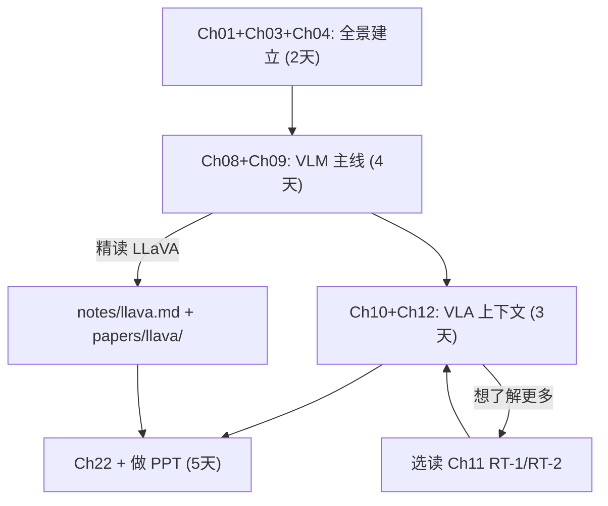
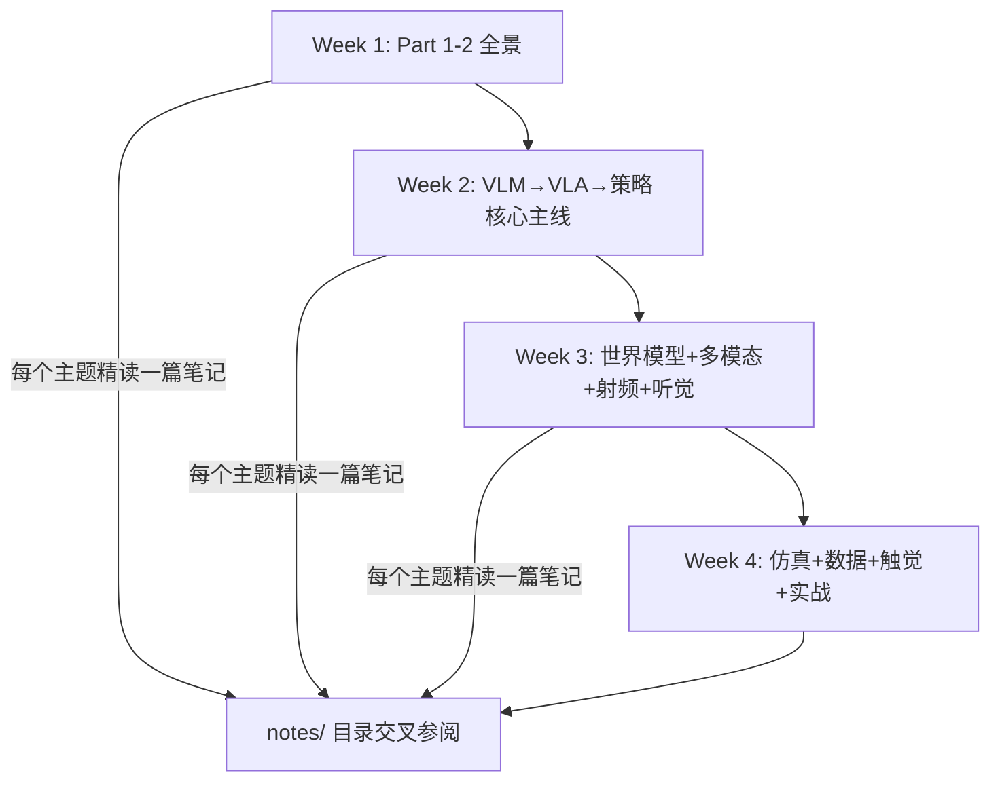

# Ch02: 阅读路线图——三条路径任你选

> Part 1: 导读总纲
> 前置章节：[Ch01: 为什么需要具身智能——从屏幕里的 AI 到走出来的机器人](ch01-why-embodied-ai.md)
> 后续章节：[Ch03: 前置知识检查清单](ch03-prerequisites.md)

---

## 1. 三条路径说明

> **速查版**：如果你想要一张更简洁的 30 天每日计划表，直接看 [Learn: 30-day path](/learn/path/)。

这本导读有 22 章，但你不需要从头读到尾。根据你的目标和可用时间，我设计了三条路径。每条路径像一条爬山步道——起点不同、长度不同、终点也不同，但都能让你看到有价值的风景。

先说结论：

- 如果你要在 6 月 30 日前完成 Task 1（论文精读 + 英文汇报），走**Task 1 路径**，大约 2 周
- 如果你想系统理解具身智能的完整技术版图，走**全景学习路径**，大约 4 周
- 如果你对某个特定方向感兴趣（比如射频感知或扩散策略），走**主题跳读路径**，时间灵活

三条路径不是互斥的。你完全可以先走 Task 1 路径完成截止日期前的任务，然后按全景路径补全其他主题。

下面逐一展开。

---

## 2. Task 1 路径（2 周）：目标完成论文精读 + 英文汇报

**适用人群**：需要在 6/30 前从 13 篇论文中挑一篇做英文 PPT 汇报的同学——也就是你现在最紧迫的任务。

**核心思路**：只读和"看懂一篇论文并做出好汇报"直接相关的章节。跳过射频、听觉等暂时不紧迫的方向。

**时间分配**（共约 60 小时 / 2 周全职）：

第一阶段：建立全景（2 天）

- 读 Ch01，理解具身智能的大图
- 读 Ch03，检查前置知识，确认基础
- 读 Ch04，理解 11 个主题之间的关系——尤其是 VLM → VLA 的主线

第二阶段：走通 VLM 主线（4 天）

- 读 Ch08（CLIP），理解视觉-语言对齐的基石
- 读 Ch09（BLIP-2 / LLaVA），理解 VLM 怎么从"认图"进化到"对话"
- 重点精读 LLaVA 笔记（notes/llava.md），这是做汇报的首选论文
- 对照 LLaVA 原论文（papers/llava/paper.md）验证理解

第三阶段：理解 VLA 上下文（3 天）

- 读 Ch10（SayCan 等高层规划），理解"LLM 当大脑"的路线
- 读 Ch12（OpenVLA / VLAS / MLA），理解"一步到位出动作"的路线
- 两条路线对比，帮你在汇报中讲清 LLaVA 的历史地位

第四阶段：做汇报（5 天）

- 读 Ch22（Task 1 & Task 2 实战指南），获取 PPT 制作建议
- 参考 deck/（已有的 LLaVA 14 页 deck），做自己的英文汇报
- 预留 2 天做练习演讲和修改

**路径流程图**：

**关键提醒**：Task 1 路径的目标不是"读完所有章节"，而是"做出一个好汇报"。你的 deck/ 目录下已经有一个完成的 14 页 LLaVA deck，可以直接参考。最重要的是：汇报要讲清楚"这篇论文在具身 AI 发展中的位置"——Ch04 和 Ch08/Ch09 的全景知识正是帮你做到这一点。

---

## 3. 全景学习路径（4 周）：系统理解 11 个主题的技术版图

**适用人群**：想系统理解具身智能全貌的同学，可能为了 Task 2 的代码任务做准备，或单纯出于对这个领域的兴趣。

**核心思路**：按照 Part 的顺序完整阅读，每个主题都了解，重点理解不同方向之间的依赖关系和设计取舍。

**时间分配**（共约 120 小时 / 4 周全职或 8 周兼职）：

第一周：总纲 + 全景概念

- Part 1 全部（2 天）——宏观认知 + 前置准备
- Part 2 全部（5 天）——11 个主题全景、两条技术路线、时间线、论文读法

第二周：核心主线精读

- Ch08-Ch09（2 天）——VLM 地基：CLIP → BLIP-2 → LLaVA
- Ch10（1 天）——高层规划：SayCan / Code-as-Policies
- Ch11-Ch12（2 天）——端到端 VLA：RT-1 → RT-2 → OpenVLA
- Ch13-Ch14（2 天）——扩散策略 + 模仿学习：Diffusion Policy / π0 / ALOHA

第三周：感知与基建

- Ch15（2 天）——世界模型：Dreamer / Genie / Cosmos Policy（最难，多花时间）
- Ch16（1 天）——多模态生态：ImageBind / 3DShape2VecSet
- Ch17（2 天）——射频感知：RF-SLAM / mmCLIP / NLOS mmWave
- Ch18（2 天）——听觉智能：Whisper / Proactive Hearing / Acoustic Swarms

第四周：仿真、数据与实战

- Ch19（2 天）——仿真与 Sim2Real：Habitat / Isaac Gym / MuJoCo
- Ch20（1 天）——数据集全景：OXE / DROID / BridgeData V2
- Ch21（1 天）——触觉与新模态
- Ch22（3 天）——Task 1 & Task 2 实战指南

**学习方法建议**：每读完一个主题的章节，回到对应的论文笔记（notes/ 目录）精读至少一篇代表作。导读给你"为什么"和"是什么"，论文笔记给你"怎么做"和"效果如何"。两者交替进行，理解会更扎实。

**路径流程图**：

---

## 4. 主题跳读路径（灵活）：对某个方向特别感兴趣

**适用人群**：已经有一些 AI 基础，对具身智能的某个子方向特别感兴趣，想直奔主题。

**核心思路**：先读 Ch01 和 Ch04 建立全景地图，然后直接跳到你感兴趣的主题章节。

**必读章节**（不管哪个方向，这两章先过一遍）：

- Ch01——理解具身 AI 的大图
- Ch04——理解 11 个主题之间的依赖关系

**然后按兴趣跳**：

| 你感兴趣的方向 | 核心章节 | 前置章节 | 配套笔记（精读推荐） |
|--------------|---------|---------|-------------------|
| 视觉语言模型 | Ch08+Ch09 | 无 | clip.md, llava.md |
| 机器人规划 | Ch10 | Ch08 | saycan.md, code-as-policies.md |
| 端到端 VLA | Ch11+Ch12 | Ch08+Ch09 | rt-1.md, openvla.md |
| 扩散策略 | Ch13 | 无（独立理解） | diffusion-policy.md, pi0.md |
| 模仿学习 | Ch14 | 无 | dagger.md, act-aloha.md |
| 世界模型 | Ch15 | 无 | world-models-ha.md, dreamer-v3.md |
| 多模态感知 | Ch16 | Ch08 | imagebind.md, 3dshape2vecset.md |
| 射频感知 | Ch17 | 无（独立方向） | rf-pose-through-wall.md, millimap.md |
| 听觉智能 | Ch18 | 无（独立方向） | whisper.md, acoustic-swarms.md |
| 仿真环境 | Ch19 | 无 | habitat.md, isaac-gym.md |
| 数据集 | Ch20 | 无 | open-x-embodiment.md, droid.md |

**关键提醒**：主题跳读路径的风险是"只见树木不见森林"。某些概念在多个方向之间有深层联系——比如扩散策略（Ch13）和世界模型（Ch15）都用了"从噪声中恢复信号"的思想，模仿学习（Ch14）提供的数据是训练 VLA（Ch11/Ch12）和扩散策略（Ch13）的前提。如果你发现某章读起来有些概念不清楚，大概率需要回到 Ch04 的全景图里补一下上下文。

---

## 5. 每条路径的检查点自测问题

学习最怕的是"感觉懂了但其实没懂"。每条路径设置了检查点，到达检查点时用这些问题自测。能清楚回答说明可以继续往下走；答不上来说明需要回头补。

### Task 1 路径检查点

**检查点 1**（Ch01+Ch04 完成后）：

- 具身智能和传统 AI（ChatGPT 类）的根本区别是什么？
- 11 个主题中，VLM（主题 I）和 VLA（主题 III）的关系是什么？
- 你的 13 篇论文分别属于哪几个主题？

**检查点 2**（Ch08+Ch09 完成后）：

- CLIP 的核心思想用一句话怎么说？
- LLaVA 用什么方法把视觉信息接入语言模型？为什么不直接把图片像素喂给 LLM？
- BLIP-2 的 Q-Former 解决了什么问题？

**检查点 3**（Ch10+Ch12 完成后）：

- SayCan 的 affordance scoring 是什么意思？为什么需要它？
- OpenVLA 的"动作"在电脑里长什么样——是文字、是图片，还是一串数字？
- 模块化规划（SayCan）和端到端 VLA（OpenVLA），各自的好处和坏处是什么？

### 全景学习路径检查点

**检查点 1**（Week 1 完成后）：

- 能画出 11 个主题之间的依赖关系图吗？
- 模块化流水线和端到端一体化两条路线的核心权衡是什么？
- 2021-2025 年具身 AI 的关键里程碑能说出 5 个吗？

**检查点 2**（Week 2 完成后）：

- 从 CLIP 到 LLaVA 到 RT-2 到 OpenVLA，每一步解决了什么新问题？
- Diffusion Policy 解决了 Behavior Cloning 的什么痛点？
- 模仿学习中"分布偏移"是什么？DAgger 怎么解决的？

**检查点 3**（Week 3 完成后）：

- 世界模型和 VLA 的区别是什么？它们可以配合使用吗？
- 射频感知相比摄像头的优势和劣势各是什么？
- 听觉感知对具身 AI 为什么重要——能举出三个具体场景吗？

**检查点 4**（Week 4 完成后）：

- Sim2Real gap 的三种常见解决方案各是什么？
- Open X-Embodiment 为什么重要？它解决了什么数据层面的问题？
- 如果让你设计一个家务机器人系统，你会用哪些主题的技术？为什么？

### 主题跳读路径检查点

由于主题灵活，检查点按主题设置：

**VLM/VLA 主题**：能说清 CLIP → LLaVA → RT-2 → OpenVLA 这条技术演进线上每一步的"增量创新"是什么吗？

**扩散策略主题**：Diffusion Policy、3D Diffusion Policy、π0 三者的关键区别各是什么？Flow Matching 和传统扩散的区别用一句话怎么说？

**射频主题**：RF-Pose 用什么物理信号穿墙？milliMap 和 PanoRadar 分别达到了什么级别的 3D 分辨率？这个方向的核心瓶颈是什么？

**听觉主题**：Whisper 和传统 ASR 的核心区别是什么？Acoustic Swarms 用多少个麦克风、解决了什么问题？

---

## 6. 时间管理建议

不管走哪条路径，有几个时间管理原则值得注意。

**原则一：导读和笔记交替阅读。** 不要连续读三天导读再去看论文笔记。最好的节奏是：读完导读中的一个主题章节，马上去 notes/ 目录精读对应的代表作笔记。导读给你框架，笔记给你细节，两者穿插效果最好。

**原则二：设置硬性截止时间。** Task 1 路径有明确截止日期（6/30），时间规划必须留出至少 3 天的缓冲做 PPT 和练习演讲。全景路径没有硬截止，但建议给自己设一个——否则很容易在某个感兴趣的方向上无限深入，忘了整体进度。

**原则三：先广度再深度。** 先把整条路径快速走一遍（每章只读开头的场景引入和末尾的小结），建立全景地图；然后再回来深入读具体段落。先有框架再填细节，比从第一页开始逐字读效率高得多。

**原则四：利用碎片时间复习。** 每天开始学习前，花 5 分钟回忆昨天学了什么。能回忆起来说明记住了；回忆不起来的地方就是今天需要复习的起点。glossary.json 里的 62 个术语是很好的闪卡材料。

**原则五：遇到卡点及时标记。** 读不懂的地方不要死磕超过 30 分钟。标记一下，继续往下走。很多时候后面的内容会回过头来解释前面的概念——比如你在 Ch08（CLIP）里第一次遇到"对比学习"可能不太懂，但 Ch09（LLaVA）里会从另一个角度再解释一遍。

**原则六：对 Task 1 路径同学的特别提醒。** 英文 PPT 汇报不只是"翻译论文"。好的汇报需要讲清楚三件事：这篇论文之前人们怎么做的（背景）、这篇论文做了什么新的（方法）、做出来效果怎么样（结果）。Ch04 和 Ch08/Ch09 给你的全景知识正是帮你讲好"背景"部分的。

---

## 7. 本章小结

回顾本章的核心要点：

- 本导读提供三条阅读路径：Task 1 路径（2 周）、全景学习路径（4 周）、主题跳读路径（灵活）
- Task 1 路径聚焦 VLM 主线 + 汇报制作，目标是 6/30 前做出好的英文 PPT
- 全景路径覆盖 11 个主题，目标是理解完整技术版图
- 主题跳读路径按兴趣定制，但 Ch01+Ch04 是所有路径的必读入口
- 每条路径都有检查点自测问题，能答上来才继续往下走
- 时间管理六原则：导读笔记交替、设硬截止、先广后深、碎片复习、卡点标记、Task 1 留缓冲

下一章我们检查前置知识——确认你在开始正式阅读之前需要准备什么。

---

> 导读目录：[README.md](README.md)
> 上一章：[Ch01: 为什么需要具身智能——从屏幕里的 AI 到走出来的机器人](ch01-why-embodied-ai.md)
> 下一章：[Ch03: 前置知识检查清单](ch03-prerequisites.md)

<!-- papers: clip, blip-2, llava, saycan, openvla, rt-1, rt-2, vlas, mla, diffusion-policy, dreamer-v3, genie, imagebind, 3dshape2vecset, whisper, habitat, isaac-gym, rf-slam, mmclip, nlos-mmwave -->
