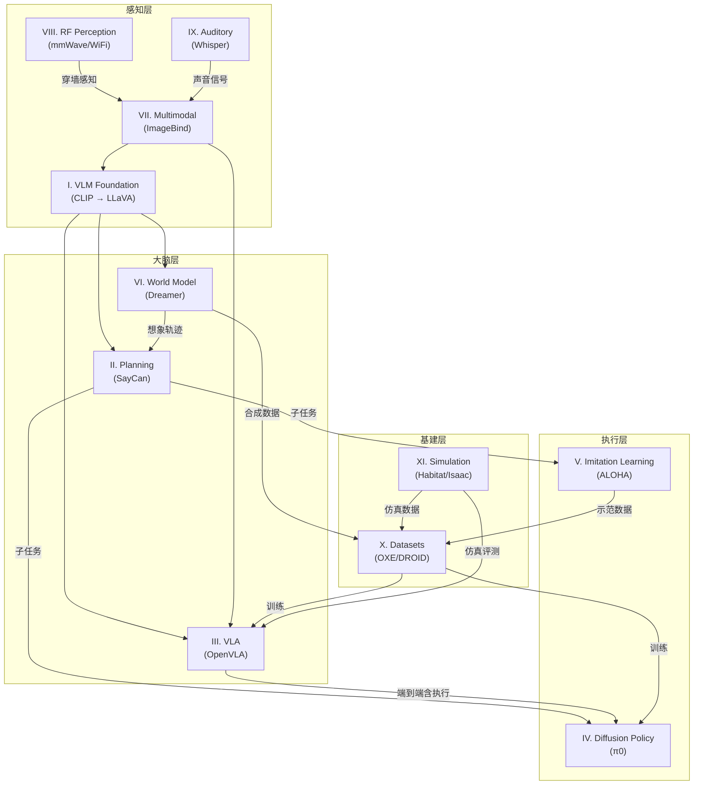

# Ch04: 11 个主题全景图——一个机器人的 11 个器官

> Part 2: 全景扫描
> 前置章节：[Ch03: 前置知识检查清单](ch03-prerequisites.md)
> 后续章节：[Ch05: 两条技术路线——模块化 vs 端到端](ch05-two-paradigms.md)

---

## 1. 一个机器人等于 11 个器官

想象你要从零开始设计一个能在厨房帮忙的机器人。你会发现，"做一顿饭"这个看似简单的任务，至少需要 11 种不同的能力。每种能力对应具身智能研究的一个主题方向。

先用一张"器官图"把 11 个主题在机器人身上的位置标出来，然后逐一讲解。

```
                    ┌──────────────────────────┐
                    │     🧠 大脑（规划层）      │
                    │  II. High-Level Planning  │
                    │  III. End-to-End VLA      │
                    │  VI. World Model          │
                    └─────────┬────────────────┘
                              │ 理解+决策
        ┌─────────────────────┼───────────────────────┐
        │                     │                       │
   ┌────▼────┐          ┌────▼────┐            ┌─────▼─────┐
   │ 👁 眼睛  │          │ 👂 耳朵  │            │ 📡 雷达    │
   │ I. VLM  │          │ IX.听觉  │            │VIII.射频  │
   │ VII.多模态│         │         │            │          │
   └────┬────┘          └────┬────┘            └─────┬─────┘
        │ 视觉信号            │ 声音信号              │ 电磁信号
        │                     │                       │
        └─────────────────────┴───────────────────────┘
                              │ 感知输入
                    ┌─────────▼──────────────┐
                    │    🦾 手脚（执行层）     │
                    │  IV. Diffusion Policy   │
                    │  V. Imitation Learning  │
                    └─────────┬──────────────┘
                              │ 动作输出
                    ┌─────────▼──────────────┐
                    │   🏋️ 训练场（基建层）    │
                    │  X. Datasets            │
                    │  XI. Simulation         │
                    └────────────────────────┘
```

这张图的关键信息：具身智能不是一个单点技术，而是一个分层系统。从下往上看——数据和仿真提供训练场，感知层获取世界信息，大脑层理解和决策，执行层输出动作。11 个主题分布在这四层之中，各自解决不同的问题。

下面逐层讲解。

---

## 2. 感知层——机器人怎么看世界

感知层回答一个问题：机器人怎么把物理世界变成电脑能处理的数字。

### 主题 I：VLM Foundation——眼睛

**一句话**：把图片和文字塞进同一个坐标系。

用类比来理解。你看到一只金毛犬，你的大脑同时做了两件事：一是"看到"这个毛茸茸的四足动物的视觉形象，二是脑海中浮现"金毛犬"这三个字。视觉和语言在你的大脑里是自然对齐的——你不需要查字典就知道眼前的画面对应什么词。

但对电脑来说，一张狗的照片是 224×224×3 个像素值（一堆数字），"金毛犬"是一串字符编码（另一堆数字）。这两堆数字之间毫无关系。VLM 的第一步就是解决这个对齐问题。

**关键里程碑**：
- CLIP（2021）：用 4 亿对图文数据训练，让图片向量和文字向量在同一个空间里"靠近或远离"
- BLIP-2（2023）：用一个"翻译器"（Q-Former）连接冻结的视觉模型和冻结的语言模型
- LLaVA（2023）：用一个线性层把视觉 token 映射到语言模型的输入空间，让 LLM 能"看图说话"

**在机器人身上的角色**：VLM 是机器人的"眼睛 + 认知"。没有 VLM，机器人看到的只是像素矩阵；有了 VLM，它能理解"桌上有一个红苹果"。

**对应笔记**：clip.md（357 行精读）、llava.md（已有 deck）
**对应章节**：Ch08（CLIP 与视觉-语言对齐）、Ch09（VLM 全景：BLIP-2 到 LLaVA）

### 主题 VII：Multimodal Ecology——多感官融合

**一句话**：把图、文、音、触、IMU 多种信号塞进同一个嵌入空间。

如果 VLM 是"看图说话"，多模态生态就是"看图 + 听声 + 摸物 + 感知运动"全部融合。ImageBind（2023）是 Meta 的一个重要工作——它用图片作为"锚点"，把 6 种模态（图、文、音、深度、热红外、IMU）全部对齐到同一个嵌入空间。

**在机器人身上的角色**：机器人不只有摄像头。它可能有麦克风（听）、力传感器（摸）、惯性传感器（感知自身姿态）。多模态融合让这些信息能在同一个"语言"下被理解和推理。

**对应笔记**：imagebind.md（精读）、3dshape2vecset.md（精读）
**对应章节**：Ch16（多模态生态）

### 主题 VIII：RF Perception——雷达

**一句话**：用 WiFi / 毫米波这些电磁信号来"看"，弥补摄像头的致命弱点。

摄像头有三个致命弱点：黑暗中看不见、烟雾中看不清、墙壁后面看不到。但 WiFi 信号能穿墙，毫米波雷达能穿烟雾。射频感知的研究目标就是把这些"穿墙术"变成机器人可用的感知能力。

**关键工作**：
- RF-Pose（2018）：用 WiFi 信号穿墙估计人体姿态——你看不到隔壁房间的人，但 WiFi 知道他在哪
- RF-SLAM（2024）：用射频信号做同时定位与建图，不需要摄像头就能画出房间地图
- mmCLIP：把毫米波雷达的信号对齐到 CLIP 的嵌入空间，让雷达数据也能被理解为"语义"

**在机器人身上的角色**：当摄像头失效时（救火、夜间巡逻、烟雾中搜救），射频感知是唯一选择。

**对应笔记**：rf-pose-through-wall.md（精读）
**对应章节**：Ch17（射频感知）

### 主题 IX：Auditory & Acoustic——耳朵

**一句话**：让机器人听清楚世界——从语音识别到环境声音分离到声学定位。

你在嘈杂的餐厅里能听清朋友说话，同时注意到后面有人打碎了盘子。这种"选择性注意 + 空间定位"的能力，对机器人来说极其困难。

**关键工作**：
- Whisper（2022）：OpenAI 的通用语音识别模型，68 万小时多语言数据训练，零样本识别
- Proactive Hearing（2024）：教会 AI "选择性听"——你告诉它"只听那个女声"，它能从混合音频中分离出来
- Acoustic Swarms（2023）：一群小型机器人组成麦克风阵列，自行定位后协同做声源分离

**在机器人身上的角色**：你对机器人喊"停！"，它得在嘈杂环境中听到你。水壶响了，它得知道是水烧开了而不是报警器。

**对应笔记**：whisper.md（精读）
**对应章节**：Ch18（听觉智能）

---

## 3. 大脑层——机器人怎么做决策

感知层把世界变成了数字，大脑层要用这些数字做出"接下来干什么"的决策。

### 主题 II：High-Level Planning——指挥部

**一句话**：把"去厨房热杯牛奶"拆成"走到厨房→打开冰箱→拿出牛奶→放进微波炉→按开始"。

高层规划把自然语言指令分解成一串可执行的子任务。核心难点不是拆解本身——ChatGPT 就能拆——而是"拆出来的每一步机器人真的做得到"。

**关键工作**：
- SayCan（2022）：Google 的经典工作。LLM 提出候选动作，机器人评估"我能做到吗"（affordance），两个分数相乘选最靠谱的下一步。**"不是你说什么就做什么，而是你说什么 + 我能做什么，取交集。"**
- Code-as-Policies（2023）：让 LLM 直接写 Python 代码来控制机器人——把"规划"变成了"编程"

**在机器人身上的角色**：规划层是管家的"任务拆解能力"。没有它，机器人只能做"拿起红色方块"这种原子级任务；有了它，才能理解"收拾厨房"这种复合指令。

**对应笔记**：saycan.md（精读）
**对应章节**：Ch10（高层规划）

### 主题 III：End-to-End VLA——一体化大脑

**一句话**：一个模型，左边输入摄像头画面 + 人话指令，右边直接输出关节速度。

这是和高层规划完全不同的思路。高层规划是"先拆任务，每一步分别执行"（模块化），VLA 是"不拆了，从感知到动作一步到位"（端到端）。

**关键演进**：
- RT-1（2022）：Google 用 13 万条真机数据训练的第一个大规模机器人策略
- RT-2（2023）：把 VLM 的视觉理解能力直接转化为动作输出——"看到苹果"自动知道"怎么抓"
- OpenVLA（2024）：开源的 7B 参数 VLA，目前最重要的开源基线

**在机器人身上的角色**：VLA 是"一体化大脑"。它的优势是信息不在模块传递中丢失（端到端训练），劣势是出错了不知道哪里出了问题（黑箱）。

**对应笔记**：rt-1.md（精读）
**对应章节**：Ch11（从 RT-1 到 RT-2：Transformer 驱动机器人）、Ch12（VLA 前沿：OpenVLA / VLAS / MLA）

### 主题 VI：World Model——想象力

**一句话**：教 AI 在脑子里预演——给它当前画面和一个动作，它预测下一秒世界会变成什么样。

人类做事之前会"在脑子里过一遍"。你想象自己推一下桌上的杯子，脑海中会出现杯子滑动甚至掉下去的画面。世界模型就是给 AI 这种"想象力"。

**关键工作**：
- Dreamer 系列（2019-2023）：在想象的轨迹上做策略优化——不在真实世界里试错，先在脑子里演练
- Genie 2（2024）：DeepMind 的交互式世界模型，能生成可控视频
- Cosmos Policy（2025）：NVIDIA 结合世界模型和策略学习，实现"想了再做"

**在机器人身上的角色**：世界模型让机器人有了"安全垫"——在真正动手之前先想想后果。这对避免危险动作（比如"不要把装了热水的杯子倒过来"）特别重要。

**对应笔记**：world-models-ha.md（精读）
**对应章节**：Ch15（世界模型与视频策略）

---

## 4. 执行层——机器人怎么动手

大脑决定了"做什么"，执行层解决"怎么做到"——具体来说就是"怎么生成平滑、稳定、精确的动作序列"。

### 主题 IV：Diffusion Policy——精雕细琢的工匠

**一句话**：把"选动作"重新定义成"去噪"——从一团随机数开始，一步步擦回到平滑可执行的动作序列。

传统的行为克隆（Behavior Cloning）有一个老大难问题：**多模态**。同一个场景下，不同人演示的动作可能完全不同——有人用左手抓杯子，有人用右手。如果你让 BC 模型学两种示范，它会输出一个"平均值"——既不左也不右，卡在中间。

扩散策略的解决方案很精巧：它不直接输出一个确定的动作，而是定义一个"动作的概率分布"。每次执行时，从噪声开始，一步步去噪，最终"落"到分布中的某一个模式上——要么完整地选左手，要么完整地选右手，不会混在一起。

**关键工作**：
- Diffusion Policy（2023）：Chi et al. 的开创性工作，第一次把扩散模型用于机器人策略
- 3D Diffusion Policy（2024）：加入 3D 点云输入
- π0（2024）：Physical Intelligence 的旗舰模型，用 Flow Matching（扩散的简化版）做策略

**在机器人身上的角色**：扩散策略是"精雕细琢的工匠"。它的动作特别平滑和稳定，适合精细操作（折衣服、拧螺丝）。缺点是推理慢——去噪需要多步迭代。

**对应笔记**：diffusion-policy.md（精读）
**对应章节**：Ch13（扩散策略与 Flow Matching）

### 主题 V：Imitation Learning——学徒制

**一句话**：机器人学技能的最朴素方法——看师傅做，然后模仿。

你第一天学做菜，最有效的方法不是看食谱，而是站在大厨旁边看他怎么切、怎么翻、怎么调火候，然后自己照着做。模仿学习就是这个思路的数学化。

**核心概念**：
- 遥操作（Teleoperation）：人类通过手柄、手套、VR 设备控制机器人做任务，采集"示范数据"
- 行为克隆（BC）：把示范数据当作"标准答案"，让模型做监督学习——输入状态，输出动作
- DAgger：解决 BC 的"分布偏移"问题——模型犯了小错偏离了示范轨迹，后续误差会滚雪球

**在机器人身上的角色**：模仿学习提供了"数据来源"。没有模仿学习采集的示范数据，VLA、扩散策略这些模型就没有训练数据。

**对应章节**：Ch14（模仿学习与遥操作数据）

---

## 5. 基建层——训练场和弹药库

最后是支撑一切的基础设施——数据和仿真。

### 主题 X：Datasets & Benchmarks——弹药库

**一句话**：没有数据集，模型就是空中楼阁。

训练一个 VLA 模型需要大量"机器人做事"的数据——每条数据是一个三元组：（摄像头画面，语言指令，对应的动作）。采集这种数据极其昂贵，因为需要真人遥操作真机器人。

**关键数据集**：
- RLBench / Meta-World：早期的仿真 benchmark，任务种类有限但干净标准
- Open X-Embodiment（2023）：22 家机构联合，汇集了不同机器人、不同任务的海量数据
- DROID（2024）：13 个国家、76,000 条真实操作演示，覆盖日常物品

**在机器人身上的角色**：数据集是"训练教材"。有多少数据、数据质量如何、覆盖多少种任务，直接决定了模型的天花板。

**对应笔记**：open-x-embodiment.md（精读）
**对应章节**：Ch20（数据集全景）

### 主题 XI：Simulation & Sim2Real——训练场

**一句话**：在电脑里造一个虚拟厨房，让机器人先在虚拟厨房里练习一万遍，再去真厨房表演。

在真机器人上采数据的问题：慢（一条演示 1-5 分钟）、贵（机器人硬件几万到几十万美元）、危险（机器人可能撞坏自己或周围环境）。仿真器解决了这些问题——你可以在 GPU 上同时跑 1000 个虚拟机器人，24 小时不停训练，免费、快速、安全。

但仿真有一个核心问题：**Sim2Real Gap**。虚拟世界的物理永远不如真实世界精确——虚拟桌面太滑、虚拟光线太均匀、虚拟物体没有真实的重量感。在仿真里训练完美的策略，到真机器人上可能直接崩掉。

**关键仿真器**：
- Habitat（Meta）：室内导航仿真器，支持逼真的家居环境
- Isaac Gym（NVIDIA）：GPU 加速的机器人训练仿真器，能同时跑几千个环境
- MuJoCo（DeepMind）：老牌物理仿真引擎，以物理精度著称

**在机器人身上的角色**：仿真是"练习场"。模型在这里做大量试错训练，然后"毕业"到真实世界。

**对应笔记**：habitat.md（精读）
**对应章节**：Ch19（仿真与 Sim2Real）

---

## 6. 11 个主题的依赖关系

这 11 个主题不是独立的——它们之间有明确的依赖和数据流关系。理解这些关系，才能看出"为什么 OpenVLA 需要先有 CLIP 和 LLaVA"。



**几条关键依赖链**：

**VLM → VLA 主线**（理解这条线就理解了具身 AI 的核心叙事）：CLIP 教会 AI "图片和文字是一回事" → LLaVA 让 LLM 能看图 → RT-2 让 VLM 能输出动作 → OpenVLA 把这条线做成开源大模型。这是从"认知"到"行动"的桥梁。

**数据闭环**：模仿学习采集示范数据 → 数据进入数据集 → 数据集训练 VLA/扩散策略 → 策略在仿真中评测 → 评测反馈指导采集更多数据。

**感知并行**：视觉（VLM）、射频、听觉三种感知是并行的，各有擅长场景。多模态融合（主题 VII）把它们统一。

---

## 7. 和你 13 篇论文的对应关系

你的 13 篇论文横跨 7 个主题方向。下面是对应关系，方便你在后续阅读中快速定位。

| 论文 | 主题 | 导读章节 |
|------|------|---------|
| LLaVA | I. VLM Foundation | Ch08-Ch09 |
| SayCan | II. Planning | Ch10 |
| OpenVLA | III. VLA | Ch12 |
| VLAS | III. VLA | Ch12 |
| MLA | III. VLA | Ch12 |
| 3DShape2VecSet | VII. Multimodal | Ch16 |
| Cosmos Policy | VI. World Model | Ch15 |
| RF-SLAM | VIII. RF Perception | Ch17 |
| mmCLIP | VIII. RF Perception | Ch17 |
| NLOS mmWave | VIII. RF Perception | Ch17 |
| Proactive Hearing | IX. Auditory | Ch18 |
| NeuralAids | IX. Auditory | Ch18 |
| Acoustic Swarms | IX. Auditory | Ch18 |

注意：有些论文横跨多个主题——例如 OpenVLA 既是 VLA（主题 III）也依赖 VLM（主题 I），Cosmos Policy 既是世界模型（主题 VI）也涉及扩散/流匹配（主题 IV 的思想）。交叉引用会在对应章节中标注。

---

## 8. 三个你现在就可以回答的问题

读完这一章，试着回答下面三个问题。如果能答出来，说明你已经建立了全景地图。

**问题 1**：如果你要做一个能在浓烟中搜救的机器人，11 个主题中哪些是最关键的？为什么视觉（主题 I）可能不够用？

**问题 2**：SayCan（主题 II）和 OpenVLA（主题 III）都能让机器人根据自然语言指令做事。它们的核心区别是什么？各自的好处和坏处是什么？

**问题 3**：如果训练一个 VLA 模型需要 10 万条示范数据，但手动遥操作只采集了 1 万条。你可以从哪些主题的技术中获得帮助来弥补数据缺口？（提示：至少有两种途径）

<details>
<summary>参考答案（先自己想再展开）</summary>

**问题 1 参考**：摄像头在浓烟中看不清，所以需要射频感知（主题 VIII）穿透烟雾获取环境信息。听觉（主题 IX）也很重要——能听到被困者的呼救声。同时需要仿真（主题 XI）在虚拟火灾场景中训练，因为真实火灾中训练太危险。规划（主题 II）帮助拆解搜救任务。

**问题 2 参考**：SayCan 是模块化方法——LLM 负责拆任务、机器人负责评估可行性、底层策略负责执行每一步。好处是可调试（每一步都能看到在做什么），坏处是信息在模块传递中可能丢失（比如 LLM 不知道机器人看到了什么）。OpenVLA 是端到端方法——一个神经网络从图片+文字直接输出动作。好处是没有信息瓶颈，坏处是黑箱（出错了不知道是视觉问题、语言理解问题还是动作生成问题）。

**问题 3 参考**：途径一——仿真（主题 XI），在仿真器中自动生成大量合成数据来补充。途径二——世界模型（主题 VI），用已有数据训练一个世界模型，然后让世界模型"想象"出更多训练轨迹。两者的共同思路是"用虚拟数据弥补真实数据的不足"，但都面临 Sim2Real gap 的挑战。

</details>

---

## 9. 本章小结

回顾本章的核心要点：

- 具身智能的 11 个主题对应机器人的"11 个器官"，分布在感知层、大脑层、执行层、基建层四个层次
- 感知层：VLM（眼睛）、多模态（多感官融合）、射频（雷达）、听觉（耳朵）
- 大脑层：高层规划（指挥部）、VLA（一体化大脑）、世界模型（想象力）
- 执行层：扩散策略（精雕细琢的工匠）、模仿学习（学徒制）
- 基建层：数据集（弹药库）、仿真（训练场）
- 11 个主题之间有明确的依赖关系，VLM → VLA 主线是核心叙事
- 你的 13 篇论文覆盖 7 个主题方向，后续章节会逐一深入

下一章我们深入比较"模块化 vs 端到端"这两条技术路线——这是具身 AI 领域最核心的架构争论。

---

> 导读目录：[README.md](README.md)
> 上一章：[Ch03: 前置知识检查清单](ch03-prerequisites.md)
> 下一章：[Ch05: 两条技术路线——模块化 vs 端到端](ch05-two-paradigms.md)
