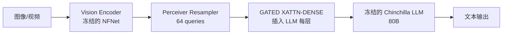
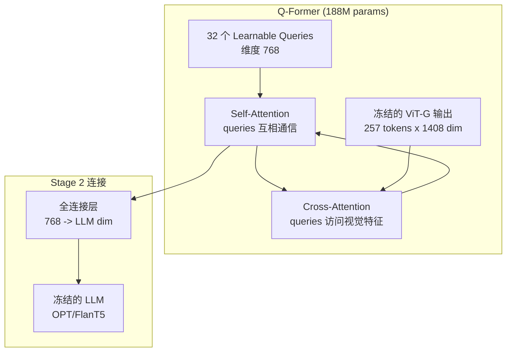
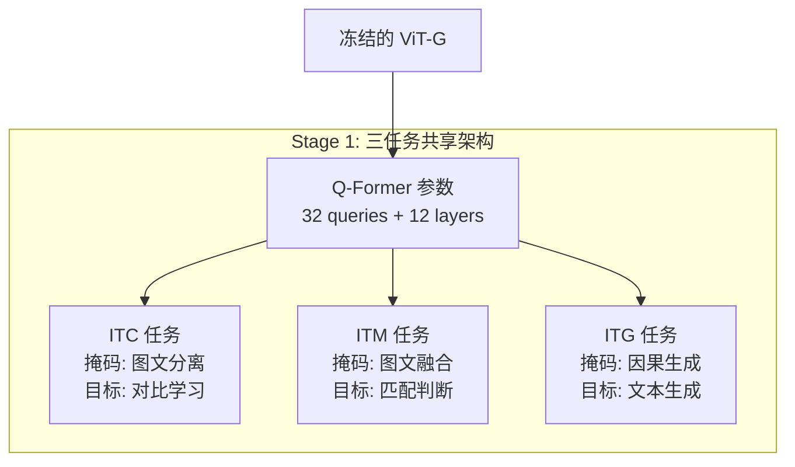
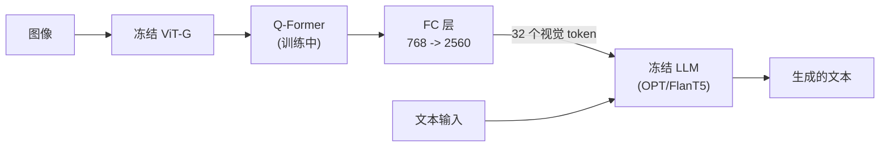
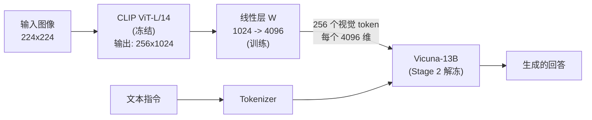
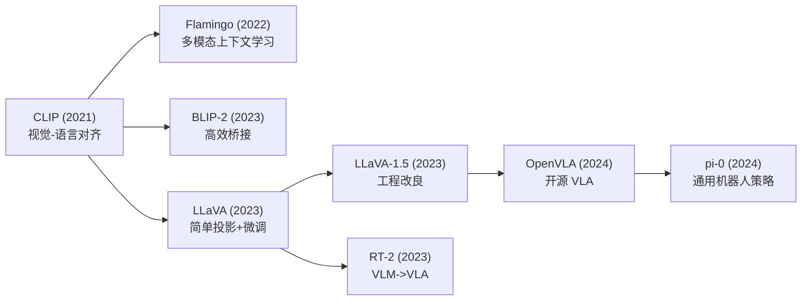
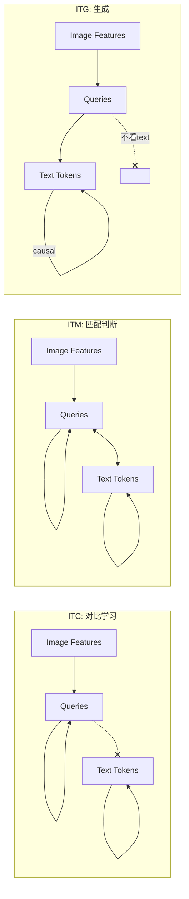

# Ch09: VLM 地基 (II)——从 BLIP-2 到 LLaVA，给 AI 装上对话能力

> Part 3: 核心主线精读
> 前置章节：[Ch08: VLM 地基 (I)——CLIP，教 AI 同时认图和认字](ch08-clip.md)
> 后续章节：[Ch10: 高层规划——SayCan / Code-as-Policies / Inner Monologue](ch10-planning.md)

---

在 [Ch08](ch08-clip.md) 中，我们花了大量篇幅理解 CLIP——它把视觉和语言放进了同一个空间，让 AI 第一次能"听懂"自然语言描述的图像内容。但 CLIP 有一个根本性的局限：**它只能算分数，不能说话**。你给 CLIP 一张图和一段文字，它告诉你"匹配度 0.87"——但它永远无法主动描述这张图里有什么、回答关于图片的问题、或者根据图片内容展开对话。

本章讲解 CLIP 的三个重要继承者——Flamingo、BLIP-2 和 LLaVA。它们解决的核心问题是：**如何把 CLIP 的"认图能力"转交给一个能说话的大语言模型（LLM）？** 这个问题的答案直接决定了后来 VLA（视觉-语言-动作）模型的架构选择——RT-2 选了类似 BLIP-2 的路线，OpenVLA 选了 LLaVA 的路线。

**本章定位**：读完本章，你应该能够：

- 画出 BLIP-2 和 LLaVA 的架构图，标注每个模块的参数量和训练状态（冻结/可训练）
- 解释"信息瓶颈"为什么是 Q-Former 的核心设计思想
- 说出 LLaVA 用一层线性投射就能工作的三个原因
- 判断一个新的 VLM 论文属于"复杂桥"还是"简单桥"阵营
- 理解这些架构选择如何影响了后续的机器人模型（Ch11-Ch12 的伏笔）

---

## 1. 从翻译问题说起

### 1.1 一个国际新闻编辑部的难题

想象你是一家电视台的国际新闻编辑。你的编辑部里有两个人：

**摄影师小张**——拍照技术一流，能从任何场景中捕捉最关键的画面。但小张只会日语，不会说中文。他拍完照后会写一份日文说明，描述画面里有什么。

**新闻主播小李**——口才极好，能把任何信息变成通俗易懂的新闻播报。但小李是个"瞎子"——他看不到任何图片，只能根据文字信息来播报。

问题来了：小张拍到了一张突发新闻的照片，小李需要描述给观众听。中间怎么办？

### 1.2 三种翻译方案

你有三种选择：

**方案 A：请一位专业同声传译（Flamingo 的方案）**

你请了一位精通日中翻译的同声传译。他戴着耳机，一边听小张用日语描述画面，一边实时翻译给小李。不仅如此，他还能在小李播报的过程中随时"插嘴"——当小李说到某个地方需要更多画面细节时，翻译立刻补充。这种方案效果最好，但代价极高：翻译要同时理解两种语言的上下文，而且你需要在小李播报的每一个环节都安排翻译介入。

**方案 B：请一位外交口译写摘要（BLIP-2 的方案）**

你请了一位外交口译。他不做实时翻译，而是先和小张坐下来，让小张用日语把照片里的所有关键信息说一遍。口译听完后，写了一份 **32 条中文摘要**——只有 32 条，多一条都不行。然后把这份摘要交给小李，小李根据这 32 条摘要来播报新闻。

为什么只给 32 条？因为编辑部规定：**口译必须在有限的条数内把最重要的视觉信息提炼出来**。这逼着口译去判断什么信息对新闻播报最重要、什么是细枝末节可以丢掉的。

**方案 C：给小李一本日中词典让他自学（LLaVA 的方案）**

你做了一件大胆的事：不请任何翻译，而是直接把小张的日文说明用一本简单的词典逐字对照翻成中文，然后一股脑丢给小李。"日文说明"变成的"中文原始素材"可能不太通顺，但小李很聪明——你给他看了几百个"日文说明 + 正确播报稿"的范例后，他学会了自己从粗糙的素材中组织出流畅的播报。

关键洞察：**如果小李（LLM）够聪明，他完全可以自己搞定"从原始素材到流畅表达"的过程**。你需要的只是一本足够简单的词典（线性投射层）和足够好的范例（指令微调数据）。

### 1.3 本章的核心问题

哪种方案最适合给机器人"装眼睛"？

| 方案 | 对应模型 | 核心思路 | 代价 |
|------|---------|---------|------|
| 专业同传 | Flamingo | 在 LLM 内部插入视觉注意力层 | 80B 参数，架构复杂 |
| 口译写摘要 | BLIP-2 | 用 Q-Former 提取 32 条视觉摘要 | 188M 训练参数，两阶段训练 |
| 词典自学 | LLaVA | 一层线性投射 + LLM 微调 | 架构极简，依赖微调数据质量 |

2022-2023 年，学术界围绕这三种路线展开了一场"桥梁设计之战"。最终，LLaVA 的"简单桥"方案以压倒性优势胜出，成为后续几乎所有开源 VLM 和 VLA 的模板。本章会告诉你为什么。

---

> **检查点 1**：在往下读之前，确认你能回答——
> - CLIP 能做什么、不能做什么？（回顾 Ch08）
> - "把视觉连接到 LLM"这个问题的核心难点是什么？（维度不匹配 + 模态鸿沟）
> - 为什么不能直接把 CLIP 的输出 token 丢给 LLM？（维度不对、语义空间不对齐）

---

## 2. 问题定义：从"认图"到"看图说话"

### 2.1 CLIP 停在了哪里

回忆 [Ch08](ch08-clip.md) 的核心结论：CLIP 学会了一个 **共享嵌入空间**——图片和文本都被映射到同一个 512 维向量空间中。在这个空间里，语义相近的图文对距离近，语义不同的距离远。

但 CLIP 做不到的事情有一大类：**任何需要"生成文本"的任务**。

- "描述这张图片里有什么" —— CLIP 做不到（它不能生成文字）
- "这张图片里的动物在做什么？" —— CLIP 做不到（它不能回答问题）
- "根据这张图片写一首诗" —— CLIP 做不到（它不能创作）
- "图片左边红色的是苹果还是番茄？" —— CLIP 做不到（它不能做细粒度推理后输出答案）

CLIP 本质上是一个 **判别模型**（discriminative model）——给定选项，它能选出最匹配的；但它不是一个 **生成模型**（generative model）——它不能从零开始产出文字。

### 2.2 为什么需要 LLM

与此同时，2022 年底到 2023 年初，大语言模型（LLM）的能力爆发了。GPT-3.5、ChatGPT、LLaMA 等模型展现了惊人的文本生成、推理和指令跟随能力。它们能写文章、做数学题、编程序——但有一个共同的致命缺陷：**它们是瞎的**。

LLM 只能处理文本输入。你给它再精确的图片描述，它也只是在"想象"而非真的"看到"。这就像让一个天生失明的人仅凭别人的描述来理解一幅油画——他可以推理出很多信息，但终究缺乏直接的视觉体验。

所以，2022-2023 年最热门的研究问题是：

> **如何把视觉编码器（CLIP/ViT）的"看"的能力，嫁接到 LLM 的"说"的能力上？**

### 2.3 三个工程决策

这个"嫁接"问题可以被分解为三个核心工程决策：

**决策一：冻结什么？**

预训练好的视觉编码器（如 CLIP ViT-G，18 亿参数）和 LLM（如 OPT-6.7B）各自已经很强了。如果全部从零训练，计算成本天文数字且容易"灾难性遗忘"（模型忘掉原来学会的东西）。所以大部分方案选择**冻结**一部分或全部预训练模型，只训练新加的"桥梁"模块。

**决策二：桥梁怎么设计？**

从视觉编码器输出到 LLM 输入，中间这个"桥"可以简单也可以复杂：

- 简单：一层线性变换（LLaVA）
- 中等：learnable queries + cross-attention（BLIP-2）
- 复杂：在 LLM 每一层都插入 cross-attention（Flamingo）

**决策三：用什么数据训练？**

- 大规模弱监督数据：互联网图文对，量大质参差（BLIP-2 Stage 1）
- 小规模高质量数据：GPT-4 生成的指令对话数据（LLaVA Stage 2）
- 两者结合：先用大规模数据对齐，再用高质量数据微调（几乎所有后来的方案）

### 2.4 历史坐标：2022-2023 的"桥梁设计之战"

```
2022.04  Flamingo (DeepMind)     -- 80B，闭源，证明"冻结 LLM + 加桥"可行
2023.01  BLIP-2 (Salesforce)     -- 只训 188M 参数，效果超 Flamingo
2023.04  LLaVA (UW + Microsoft) -- 线性投射 + LLM 微调，简单到不可思议
2023.06  InstructBLIP            -- BLIP-2 + 指令微调
2023.10  LLaVA-1.5              -- LLM 微调路线的集大成者
2023.12  几乎所有新 VLM 都选了 LLaVA 路线
```

仅仅 20 个月，学术界就完成了从"复杂桥"到"简单桥"的范式迁移。理解这个过程，是理解后续 VLA 模型架构选择的关键。

---

> **检查点 2**：确认你理解——
> - CLIP 是判别模型，不是生成模型——它能"选"但不能"说"
> - 把视觉接到 LLM 的三个核心决策是：冻结策略、桥梁设计、训练数据
> - 2022-2023 年的研究趋势：从复杂桥走向简单桥

---

## 3. 先行者：Flamingo——少样本的开拓者

### 3.1 为什么从 Flamingo 说起

Flamingo（2022 年 4 月，DeepMind）不是本章的重点模型——BLIP-2 和 LLaVA 才是。但我们必须先理解 Flamingo，因为它确立了一个至关重要的范式：

> **冻结预训练的 LLM，通过额外模块注入视觉信息。**

在 Flamingo 之前，大部分工作要么从零训练多模态模型，要么对整个 LLM 做全量微调。Flamingo 第一次证明了一种更聪明的策略：LLM 已经学会了语言能力，**不需要动它**——你只需要找到一种方式，把视觉信息"悄悄注入"到 LLM 的处理流程中。

这就像一个经验丰富的新闻主播（LLM）已经很会播报了，你不需要把他送回播音学院重新培训——你只需要给他一个耳机（视觉桥梁），让他在播报过程中能实时收到画面描述。

### 3.2 架构：三个关键组件

Flamingo 的架构有三个核心组件：



#### 3.2.1 Perceiver Resampler：把变长视觉信息压缩成定长

一张图片经过 Vision Encoder 后会产出很多 token（数量取决于图片分辨率和模型）。但 LLM 需要的输入维度和数量是固定的。怎么办？

Flamingo 的方案：**用 64 个可学习的查询向量（learnable queries）去"采访"视觉特征**。

类比：你有一大堆采访素材（视觉 token），但新闻稿只有 64 行的篇幅。所以你派出 64 个"记者"，每个记者负责从素材中提取一条最重要的信息。最终，不管原始素材有多长，你都能得到恰好 64 条精华。

技术细节：Perceiver Resampler 是一个 Transformer，输入是 64 个 learnable queries + 视觉特征，通过 cross-attention 让 queries 从视觉特征中提取信息。输出是 64 个固定维度的向量，作为视觉的"浓缩表示"。

#### 3.2.2 GATED XATTN-DENSE：在 LLM 内部"开窗户"

有了 64 个视觉 token 之后，怎么让 LLM "看到"它们？

Flamingo 的方案非常激进：**在 LLM 的每一层 Transformer 中都插入一个新的 cross-attention 层**。这让 LLM 在处理文本的每一步，都有机会"扭头看一眼"视觉信息。

但这有个问题：如果这些新插入的层一开始就对 LLM 产生很大影响，可能会破坏 LLM 原有的语言能力（灾难性遗忘）。

Flamingo 的解决方案——**tanh 门控初始化为 0**：

```
output = LLM_original_output + tanh(alpha) * xattn_output
```

其中 `alpha` 是可学习参数，初始值为 0。由于 `tanh(0) = 0`，训练开始时 `tanh(alpha) * xattn_output = 0`——新插入的视觉注意力层的输出被完全屏蔽，LLM 的行为和原来一模一样。随着训练推进，`alpha` 逐渐学到合适的值，视觉信息被缓慢"渗透"进 LLM。

这个技巧极其重要。它的本质是：**训练开始时保证模型不比原来差，然后让模型自己学会如何利用新信息**。后来的很多工作（包括 LoRA 的初始化策略）都借鉴了这个思想。

#### 3.2.3 Per-Image Attention Masking：让文字只看"最近的图"

Flamingo 的一个独特能力是处理 **interleaved image-text**（图文交错的网页内容）。比如一个新闻页面里，第一段文字配了一张图，第二段文字配了另一张图。

问题是：当模型在生成第二段文字时，它应该看哪张图？如果同时看两张图，会不会产生混乱？

Flamingo 的规则很简单：**每段文字只能看到它"前面最近的那张图"**。通过 attention mask 实现这个约束——第二段文字只能 cross-attend 到第二张图的 64 个视觉 token，看不到第一张图的。

### 3.3 数据：4300 万网页的图文交错

Flamingo 使用了一个叫 M3W（MultiModal MassiveWeb）的数据集：**4300 万个网页**，每个网页包含交错排列的图片和文本。

为什么用网页而不是传统的"图文对"（一张图配一段描述）？因为网页天然反映了人类处理多模态信息的方式——一篇文章里穿插着相关图片，文字和图片之间有隐含的对应关系。这种训练数据让 Flamingo 学会了"在上下文中理解图片"的能力。

### 3.4 结果：32-shot 即超越微调 SOTA

Flamingo 在 16 个视觉-语言任务上评测，使用 **32-shot**（只给 32 个示例）的方式就在所有任务上取得了 SOTA。更惊人的是：**其中 6 个任务上，32-shot Flamingo 超过了在整个训练集上微调的之前最好模型**。

换句话说：给 Flamingo 看 32 个例子，它的表现就超过了用几万甚至几十万个例子训练出来的专用模型。这证明了"大模型 + 少样本"范式在多模态领域的巨大潜力。

### 3.5 局限性：为什么它没能成为标准

尽管 Flamingo 效果惊艳，但它有三个致命问题：

1. **规模太大**：80B 参数，需要多卡甚至多机才能推理。对学术界和小公司来说完全不可及。
2. **架构太复杂**：在 LLM 的每一层都插入 cross-attention，改动了 LLM 的内部结构。这意味着你不能直接复用已有的 LLM 代码库和优化技巧（如量化、KV cache 等）。
3. **闭源**：DeepMind 没有开源权重。学术界只能"致敬"但不能"复现"。

这三个限制催生了后来的 BLIP-2（解决复杂度问题）和 LLaVA（解决所有三个问题）。

### 3.6 Flamingo 的历史贡献

Flamingo 留下的最重要遗产不是它的架构细节，而是一个被后续所有工作继承的核心原则：

> **预训练的 LLM 就像一个已经学会了所有语言规则的大脑——不要动它，只需要找到一种方式给它"接上眼睛"。**

BLIP-2 继承了这个原则并推到极致（连视觉编码器也冻结了）；LLaVA 则做了一个大胆的反叛——它说："其实你可以稍微调一下 LLM 的参数，让它自己学会看。"

---

> **检查点 3**：确认你能回答——
> - Flamingo 用什么方式把视觉信息注入 LLM？（在每层插入 GATED XATTN-DENSE）
> - tanh 门控初始化为 0 的好处是什么？（保证训练开始时不破坏 LLM 原有能力）
> - Flamingo 为什么没有成为后续的标准方案？（太大、太复杂、闭源）

---

## 4. BLIP-2 深度剖析

### 4.1 设计哲学："不动两座大山，只建一座小桥"

2023 年 1 月，Salesforce Research 发布了 BLIP-2。这篇论文的核心思想可以用一句话概括：

> **视觉编码器和 LLM 都已经很强了——不要动它们，只训练一个轻量的"桥梁"模块来连接两者。**

具体来说，BLIP-2 **同时冻结**了：

- 视觉编码器 ViT-G/14（约 19 亿参数）
- 大语言模型 OPT-2.7B 或 FlanT5-XL（约 30-110 亿参数）

在这两座"大山"之间，只训练一个叫 **Q-Former** 的小模块——**仅 1.88 亿可训练参数**。

打个比方：你面前有两栋摩天大楼（ViT 和 LLM），要让住在两栋楼里的人能互相交流。Flamingo 的方案是在每一层楼都打通一个过道（在 LLM 每层插入 cross-attention）。BLIP-2 的方案是：**不动两栋楼的任何一块砖，只在两栋楼之间建一座天桥（Q-Former）**。

为什么这个设计思路如此激进且重要？

**计算效率**：总模型约 120 亿参数，但只需要训练 1.88 亿（约 1.6%）。这意味着普通的学术实验室也能负担得起训练成本。

**避免灾难性遗忘**：ViT-G 花了大量计算才学会的视觉表征、LLM 花了大量计算才学会的语言能力——都被安全地保留了。你只需要让新训练的 Q-Former 学会"翻译"。

**模块化**：因为 ViT 和 LLM 都没被改动，理论上你可以换用不同的 ViT 变体或不同的 LLM，只需要重新训练 Q-Former。

### 4.2 Q-Former 架构详解

Q-Former 是 BLIP-2 的核心创新。理解它的结构和设计意图，是理解整篇论文的关键。

#### 4.2.1 整体结构



Q-Former 本质上是一个 **12 层 Transformer**，但它有一个关键的特殊设计：**32 个可学习的查询向量（learnable queries）**。

这 32 个向量的维度是 768，它们是随机初始化的可训练参数。你可以把它们想象成 **32 位外交官**，被派去采访一位只能用日语交流的目击证人（ViT 的视觉特征）。每位外交官可以：

- **互相商量**（self-attention）：外交官们先碰头，确定各自负责哪个方向的提问，避免重复
- **采访证人**（cross-attention）：每位外交官去和视觉特征交互，提取自己负责的那部分信息
- 这个"商量 -> 采访"的过程重复 12 轮（12 层 Transformer）

#### 4.2.2 信息瓶颈：32 个向量的设计意图

为什么是 32 个而不是 256 个或 1024 个？

ViT-G 的输出是 257 个 token（256 个 patch token + 1 个 CLS token），每个 1408 维。如果直接把这 257 个 token 全部传给 LLM：

- LLM 需要处理额外 257 个 token 的注意力计算（计算量大）
- 这 257 个 token 包含大量对语言不相关的低级视觉细节（纹理、光照等）

BLIP-2 的设计选择是**故意制造信息瓶颈**：257 个视觉 token 的信息必须被压缩到 32 个查询向量中。这逼迫 Q-Former 学会 **只提取对语言最有用的视觉信息**。

类比：你让 32 位外交官去采访一个口若悬河的目击者，但规定他们只能写 32 条笔记交回去。结果是什么？外交官们必须学会判断"什么信息对新闻播报最重要"——他们会记下"现场有一辆红色消防车"，而不是"天空中有 237 朵形状各异的云"。

这个设计有一个重要的 trade-off：

- **优点**：强迫提取高层语义信息，减少 LLM 需要处理的 token 数，降低计算成本
- **缺点**：如果场景很复杂（比如一张图里有 10 个人在做不同的事），32 个向量可能不够用，导致信息丢失

#### 4.2.3 Self-Attention 和 Cross-Attention 的交互

Q-Former 内部的每一层包含两种注意力：

**Self-Attention**：32 个 query 之间互相通信。这让 query 们能够"分工"——比如某些 query 专门负责提取空间信息，某些专门负责提取颜色信息，某些负责提取动作信息。没有 self-attention 的话，32 个 query 可能会提取重复的信息。

**Cross-Attention**：32 个 query 去"看" ViT 输出的 257 个视觉 token。这是 query 从视觉中提取信息的唯一通道。Cross-Attention 有一个关键的设计细节：**注意力掩码（attention mask）在不同训练任务中不同**。后面讲两阶段训练时会详细展开这一点。

类比：Self-Attention 就像外交官们之间的内部协调会——"你负责问经济，我负责问军事，别重复了"。Cross-Attention 就像外交官们正式与证人（ViT 输出）的对话——这是他们获取信息的唯一渠道。

#### 4.2.4 信息压缩的数学直觉

ViT-G 的输出是 257 个 token，每个 1408 维。Q-Former 要把这 257 个 token 中的"语言相关信息"压缩到 32 个 768 维的向量中。

这是一个巨大的信息压缩：

- 输入：257 x 1408 = 361,856 维信息
- 输出：32 x 768 = 24,576 维信息
- 压缩比：约 15:1

为什么这样做？论文的核心论点是：**视觉信息中只有一小部分与语言任务相关**。一张猫坐在沙发上的图片，ViT 编码了每个像素区域的纹理、光照、边缘等底层信息——但 LLM 只需要知道"猫""坐在""沙发上"这几个语义要素。32 个 query 构成的"信息瓶颈"强迫模型只提取最重要的语义信息，丢弃对语言无用的视觉细节。

对比 Flamingo 的 64 个 query：BLIP-2 用更少的 query（32 vs 64）也能工作得很好，说明信息瓶颈可以更紧。实验表明 32 是一个效率和效果的平衡点。

---

> **检查点 4a**：
> - Q-Former 的输入是什么？输出是什么？
> - 为什么 32 个 query 构成"信息瓶颈"？这个瓶颈的好处和坏处分别是什么？
> - Self-Attention 和 Cross-Attention 在 Q-Former 中分别起什么作用？

---

### 4.3 两阶段训练：从"学习看图"到"学习说话"

Q-Former 的训练分两个阶段，每个阶段目标不同、冻结的组件不同。

#### 4.3.1 Stage 1：表征学习（Representation Learning）

**冻结**：ViT-G（视觉编码器）

**训练**：Q-Former 的全部参数

**目标**：让 Q-Former 的 32 个 query 学会从视觉特征中提取与语言对齐的表征

这个阶段使用三个训练目标同时优化，三个目标共享同一个 Q-Former 架构，但使用不同的注意力掩码：

**ITC（Image-Text Contrastive）**：

和 Ch08 中的 CLIP 对比损失几乎一模一样——让匹配的图文对在嵌入空间中靠近，不匹配的远离。区别是：CLIP 直接用图像编码器输出做对比，BLIP-2 用 Q-Former 的 32 个 query 输出做对比。具体来说，取 32 个 query 输出中与文本最相似的那个做 contrastive loss。

注意力掩码：**Bi-directional Self-Attention**（query 之间互相看），但 query 不能看文本 token，文本 token 也不能看 query。这样图像侧和文本侧各自独立编码，然后做对比。

**ITM（Image-Text Matching）**：

二分类任务——给一对图文，判断它们是否匹配。这比 ITC 更精细，因为模型需要融合图像和文本信息后做判断（而不是各自编码后算距离）。使用 hard negative mining：选择 ITC 分数高但实际不匹配的对作为困难负样本。

注意力掩码：**Bi-directional Self-Attention**，且 query 和文本 token 可以互相看到。这允许完全的图文交互融合。

**ITG（Image-grounded Text Generation）**：

给图像，生成对应的文本描述（captioning）。这个目标训练 Q-Former 学会把视觉信息"翻译"成文本序列。

注意力掩码：**Causal Self-Attention**（每个 token 只能看到自己和之前的 token）。这是标准的自回归生成掩码，和 GPT 的掩码一样。

**关键设计洞察**：三个任务使用同一套参数、同一个架构，只通过改变注意力掩码来切换任务模式。这是一个非常优雅的设计——不需要三套不同的网络，一套网络通过掩码就能"变身"。



#### 4.3.2 Stage 2：生成式预训练（Generative Pretraining）

**冻结**：ViT-G + LLM（OPT-2.7B 或 FlanT5-XL）

**训练**：Q-Former + 一个全连接层（FC layer）

**目标**：让 Q-Former 的输出能作为 LLM 的"软提示（soft prompt）"，驱动 LLM 生成正确的文本

具体做法：

1. Q-Former 从图像中提取 32 个 query 输出（每个 768 维）
2. 通过一个 FC 层将维度从 768 映射到 LLM 的输入维度（如 OPT 的 2560 维）
3. 把这 32 个"视觉 token"拼接到文本 token 前面，作为 LLM 的输入前缀
4. LLM 把这 32 个前缀 token 当作一段"描述性的 prompt"，据此生成文本

从 LLM 的视角看，这 32 个视觉 token 和普通的文本 token 没有区别——它们进入 LLM 后参与标准的自回归生成过程。但与人写的 prompt 不同，这些 token 是 Q-Former 从实际图像中提取的、经过训练的连续向量——比任何人写的文字描述都更信息丰富。



**为什么两阶段而不是端到端一起训练？**

Stage 1 让 Q-Former 先学会"看懂图"（与文本对齐的视觉表征），Stage 2 再教它"把看到的传达给 LLM"。如果直接端到端训练，Q-Former 需要同时学两件事：(1) 从图像中提取什么信息 (2) 怎么把信息表达给 LLM 理解。把两个目标拆开，每个阶段只需要学一件事，更容易收敛。

### 4.4 关键数字与对比

把 BLIP-2 和 Flamingo 放在一起比较，数字说明一切：

| 维度 | BLIP-2 | Flamingo-80B |
|------|--------|-------------|
| 总参数量 | ~12B | ~80B |
| 可训练参数 | 188M | ~10B（估计） |
| 训练效率 | 54x 少于 Flamingo | 基准 |
| VQAv2 (0-shot) | 65.0 | 56.3 |
| COCO Caption (0-shot) | SOTA | 接近 SOTA |
| 开源 | 是 | 否 |
| 训练基础设施需求 | 中等（数十 GPU） | 极高（数百 TPU） |

**核心数字**：

- 188M 可训练参数：在 ~12B 总参数中只训练 1.5%
- 32 个 query：信息瓶颈的宽度
- 768 维：每个 query 的维度
- 12 层：Q-Former 的深度
- 2 个阶段：表征学习 + 生成式预训练

这些数字背后的故事是：**你不需要训练整个大模型，只需要训练一座"小桥"就能连接视觉和语言**。这是 BLIP-2 对后续研究最重要的启示。

### 4.5 局限性

BLIP-2 并非完美。理解它的局限性，才能理解为什么 LLaVA 后来会采取完全不同的策略：

**固定 32 个 query 可能不够**：对于复杂场景（比如一张有 20 个人的合照），32 个 query 可能无法捕获所有细节。信息瓶颈是双刃剑——压缩太狠会丢信息。

**两阶段训练不够灵活**：Q-Former 需要精心设计的两阶段训练流程，不能简单地"即插即用"。如果你想换一个 LLM（比如从 OPT 换成 LLaMA），需要重新跑 Stage 2。

**无法做像素级理解**：因为信息被压缩到 32 个 token，像素级的细节（如精确的物体边界、小文字等）会丢失。这对需要精细视觉的任务（OCR、目标检测）是致命的。

**对话能力有限**：BLIP-2 的 LLM 是冻结的，它没有经过对话/指令微调。所以虽然它能回答简单问题，但在多轮对话、复杂推理上表现一般。这正是 LLaVA 要解决的痛点。

**信息瓶颈可能过度压缩**：32 个 768 维的向量（总共 24,576 维）需要携带整张图片的所有语言相关信息。对于信息密集的图像（如包含大量文字的文档截图），这个带宽可能不够。

---

> **检查点 4b**：
> - BLIP-2 的 Stage 1 和 Stage 2 分别训练了什么，冻结了什么？
> - 三个 Stage 1 任务（ITC/ITM/ITG）如何共享同一个架构？关键区别是什么？
> - 为什么 BLIP-2 用 54x 少的可训练参数就能超过 Flamingo？
> - BLIP-2 的三个主要局限性是什么？哪个局限性与 LLaVA 的出发点最相关？

---

## 5. LLaVA 深度剖析：当简单打败复杂

### 5.1 核心洞察："如果地基已经很好了，为什么还要盖一座复杂的桥？"

2023 年 4 月，威斯康星大学麦迪逊分校的刘海洋等人发布了 LLaVA（Large Language and Vision Assistant）。这篇论文的核心洞察可以用一句话概括：

> 如果 CLIP 的视觉编码器输出已经足够语义丰富，那么一个简单的线性层就足以对齐视觉和语言空间——复杂的桥是多余的。

这个想法激进到让人不安。BLIP-2 精心设计了一个 12 层的 Q-Former、三个训练目标、两个训练阶段——全部为了"正确地"把视觉信息传给 LLM。LLaVA 说：**一个矩阵乘法就够了**。

为什么敢这么简化？LLaVA 的赌注是：

- CLIP ViT-L/14 的输出本身就是高度语义化的（Ch08 证明了这一点——CLIP 的表征已经与语言对齐）
- 维度不对齐（1024 vs 4096）只是一个"格式"问题，不是"语义"问题
- 如果我放开 LLM 的权重让它也参与训练，LLM 自己会学会"理解"这些视觉 token

换回最开始的类比：BLIP-2 雇了一个专业翻译（Q-Former），花大量时间训练他的翻译技巧。LLaVA 的做法是：给新闻主播（LLM）一本简单的词典（线性层），然后**让主播自己学会听外语**（通过微调 LLM）。哪种方法更好？LLaVA 用实验证明：当主播足够聪明（LLM 参数量大）且训练数据足够好（GPT-4 生成的高质量数据）时，后者完胜。

### 5.2 架构：简单到令人不安



LLaVA 的完整架构只有三个组件：

**视觉编码器：CLIP ViT-L/14**

输入 224x224 的图像，输出 256 个 patch token（14x14 = 196 个 patch，加上 padding 到 256），每个 token 1024 维。这就是 Ch08 中学过的 CLIP 视觉编码器——不做任何修改，直接拿来用。

**投影层：一个线性矩阵 W**

W 的维度是 1024x4096。它做的事情极其简单：把每个 1024 维的视觉 token 映射到 4096 维（Vicuna-13B 的嵌入维度）。数学上就是 `v_projected = v_clip @ W`，一个矩阵乘法。

参数量：1024 x 4096 = 4,194,304 约等于 4M 参数。对比 BLIP-2 的 Q-Former 有 188M 参数——LLaVA 的桥只有 BLIP-2 的 2%。

**语言模型：Vicuna-13B**

Vicuna 是 LLaMA-13B 经过指令微调的版本（由 LMSYS 发布）。它已经具备了强大的对话能力和指令跟随能力。LLaVA 选择 Vicuna 而不是 OPT 或原版 LLaMA，正是因为它已经"会聊天"——LLaVA 不需要从头教 LLM 如何对话。

**信息流**：

1. 图像经过 CLIP 编码，得到 256 个 1024 维的视觉 token
2. 线性层 W 把它们变成 256 个 4096 维的 token
3. 这 256 个视觉 token 和文本 token 拼接，一起送入 Vicuna
4. Vicuna 按标准自回归方式生成回答

从 Vicuna 的视角看，这 256 个视觉 token 就像 256 个"特殊的文字 token"——它们占据了输入序列的前 256 个位置，后面跟着正常的文本。Vicuna 的自注意力机制会让后面的文本 token 去"看"前面的视觉 token，从而获取图像信息。

**与 BLIP-2 的关键区别**：

| 维度 | BLIP-2 | LLaVA |
|------|--------|-------|
| 视觉 token 数 | 32（固定，由 query 数决定） | 256（由 ViT patch 数决定） |
| 桥的参数量 | 188M（Q-Former） | 4M（线性层） |
| LLM 是否训练 | 不训练（冻结） | Stage 2 解冻训练 |
| 信息压缩 | 257->32（强压缩） | 256->256（无压缩） |
| 视觉 token 来源 | 学习得到的 query | 直接来自 ViT 输出 |

注意最后一行的区别：BLIP-2 的视觉 token 是"学习得到的"——Q-Former 经过训练后从图像中"提问"得到的答案。LLaVA 的视觉 token 是"直接传递的"——ViT 输出什么，LLM 就接收什么（只做了维度变换）。这意味着 LLaVA 传给 LLM 的视觉信息更"原始"、更"完整"，但也更"杂乱"——它依赖 LLM 自己去筛选有用信息。

### 5.3 GPT-4 数据生成管道：用 AI 训练 AI

LLaVA 第二个重大创新是它的数据生成方法。这个方法后来被无数后续工作效仿，成为了"合成数据"领域的经典案例。

**问题背景**：

训练一个能"看图聊天"的模型，需要大量的"图片 + 关于图片的问答对话"数据。但这种数据几乎不存在——没有人会坐在那里对着一张图写 5 轮对话。传统方法是让人类标注者写，但这极其昂贵且难以规模化。

**LLaVA 的解法：让 GPT-4 做标注者**

核心思路：虽然 GPT-4（当时纯文本版本）看不到图片，但如果你给它足够好的图片描述（caption + bounding boxes + 物体标签），它能"脑补"出图片的内容，然后基于这些信息生成高质量的问答对话。

具体流程：

1. 从 COCO 数据集中取图片，已有人工标注的 caption 和 bounding box
2. 把 caption + bounding box 信息组织成文本 prompt，发给 GPT-4
3. GPT-4 根据这些文本描述，生成三种类型的数据：
   - **多轮对话（58K）**：模拟用户和 AI 关于图片的多轮问答
   - **详细描述（23K）**：对图片内容的长段落详细描述
   - **复杂推理（77K）**：需要逻辑推理的问答（如"为什么这个人可能在等公交？"）
4. 总计 158K 样本

**为什么这个方法有效？**

关键洞察：**数据质量 > 数据数量**。BLIP-2 用了数百万的网络爬取的图文对做预训练，但这些数据质量参差不齐（网络 alt text 经常很短、不准确、甚至无关）。LLaVA 只用了 158K 样本，但每条都是 GPT-4 生成的高质量、结构化、多样化的对话。

这就像教一个学生：给他读 100 本垃圾小说，不如精读 5 本经典名著。

**局限性**：

GPT-4 从未"看到"实际图像——它是从文本描述中"想象"图像内容。这意味着：

- 如果 COCO caption 没提到某个细节，GPT-4 也不会在对话中涉及
- GPT-4 生成的描述可能包含"幻觉"——它可能推测图中不存在的元素
- 空间关系（如"左边""右边"）的描述可能不准确，因为 caption 中很少包含精确空间信息

这些局限性后来在 LLaVA-1.5 中通过更多样的数据混合（加入 VQA 标准数据集）得到了部分缓解。

### 5.4 两阶段训练：极致的简单与高效

#### 5.4.1 Stage 1：特征对齐（Feature Alignment）

**冻结**：CLIP ViT-L/14 + Vicuna-13B

**训练**：只有线性层 W（4M 参数）

**数据**：595K 简单图文对（从 CC3M 数据集筛选而来）

**计算**：8 x A100 GPU，4 小时

**成本**：约 100-200 美元

这个阶段的目的纯粹是"对齐维度"——教线性层 W 学会把 CLIP 的 1024 维空间映射到 Vicuna 的 4096 维空间，使得 Vicuna 能"读懂"视觉 token。

为什么冻结 CLIP 和 Vicuna？因为这个阶段的数据是简单的"图片-标题"对（如 "A cat sitting on a couch"），质量不高、多样性有限。如果这时候解冻 Vicuna，低质量数据可能会"污染" Vicuna 已有的对话能力。所以先只训练 W，让它学会基本的空间映射。

#### 5.4.2 Stage 2：视觉指令微调（Visual Instruction Tuning）

**冻结**：CLIP ViT-L/14

**训练**：线性层 W + Vicuna-13B 全部参数（约 13B 参数）

**数据**：158K GPT-4 生成的指令数据

**计算**：8 x A100 GPU，10 小时

**成本**：约 200-300 美元

这才是 LLaVA 的"灵魂阶段"。解冻 Vicuna 后，整个 LLM 都在学习"怎么基于视觉 token 来回答问题"。与 BLIP-2 冻结 LLM 不同，LLaVA 让 LLM 全参与训练——这意味着 LLM 不只是被动地"接收翻译好的信息"，而是主动地学习"如何理解原始的视觉 token"。

**为什么两阶段的总训练成本这么低？**

- Stage 1 只训练 4M 参数，几乎不花什么时间
- Stage 2 虽然训练 13B 参数，但只用了 158K 样本（对比 LLM 预训练通常需要数十亿 token）
- 总计：8 台 A100，14 小时，总成本 $300-500

对比 BLIP-2 需要数十 GPU 训数天，Flamingo 需要数百 TPU 训数周——LLaVA 把"训练一个能看图聊天的模型"的门槛降低了 1-2 个数量级。这是学术界能负担得起的成本，也是 LLaVA 迅速获得大量跟进工作的关键原因。

### 5.5 为什么简单方法赢了

现在来回答本章开头的核心问题：为什么"字典 + 沉浸式学习"（LLaVA）打败了"专业翻译官"（BLIP-2）？

**原因 1：端到端 LLM 微调 > 冻结 LLM + 复杂桥**

BLIP-2 冻结了 LLM，所以 LLM 只能"被动接收" Q-Former 翻译好的信息。如果 Q-Former 翻译得不好（信息丢失、表达不准确），LLM 没有纠错的机会。LLaVA 解冻了 LLM，即使线性层传递的视觉 token 不够完美，LLM 也能通过自己的学习来"补偿"——它会学会"这种模式的视觉 token 通常代表某种含义"。

类比：如果翻译（Q-Former）说错了一句话，主播（冻结 LLM）只能照着念。但如果主播自己也在学外语（解冻 LLM），即使字典（线性层）不完美，他也能结合上下文猜出正确含义。

**原因 2：数据质量 > 数据数量**

BLIP-2 用了大量网络爬取的图文对做预训练——数量多但质量参差不齐。LLaVA 只用了 158K 条 GPT-4 生成的数据——数量少但每条都是高质量的对话/推理样本。在 LLM 时代，我们已经反复看到这个规律：少量精标数据 > 大量弱标数据（参考 Stanford Alpaca 只用 52K 条指令数据就让 LLaMA 学会了对话）。

**原因 3：指令微调赋予了"对话能力"**

BLIP-2 的 LLM 没经过指令微调，所以它的输出格式往往是"caption 风格"（一句话描述图片内容）。LLaVA 使用了经过指令微调的 Vicuna，再加上 GPT-4 生成的对话数据——模型直接学会了"以对话方式讨论图片"。这就是为什么 LLaVA 在 Chat 能力上完胜 BLIP-2（67.3% vs 38.1%）。

**原因 4：开源 + 低成本 = 快速迭代**

$300-500 的训练成本意味着任何学术实验室都能复现和改进 LLaVA。论文发布后的几个月内，社区迅速产出了 LLaVA-1.5、LLaVA-NeXT、ShareGPT4V 等大量改进工作——每一个都在 LLaVA 的基础上修修补补。这种"开源飞轮"效应让 LLaVA 架构不断进化，最终形成了一个庞大的生态。

---

> **检查点 5**：
> - LLaVA 的线性层有多少参数？与 BLIP-2 的 Q-Former 相比如何？
> - GPT-4 数据生成管道的核心思路是什么？它的主要局限是什么？
> - LLaVA 的 Stage 1 和 Stage 2 分别训练了什么？为什么这个顺序很重要？
> - 列出 LLaVA 打败 BLIP-2 的四个原因中你认为最重要的一个，并解释为什么。

---

## 6. 正面对决：BLIP-2 vs LLaVA

把两个模型放在一起做一次全面对比。这个对比不只是"谁的数字高"，更重要的是理解它们背后不同的设计哲学和适用场景。

### 6.1 基准测试对比

| 任务 | BLIP-2 | LLaVA | 胜者 | 为什么 |
|------|--------|-------|------|--------|
| Chat 能力（GPT-4 评分） | 38.1% | 67.3% | LLaVA | 指令微调 + 对话数据 |
| 复杂推理 | 低 | 81.7% | LLaVA | GPT-4 生成的推理数据 |
| ScienceQA | -- | 92.53% | LLaVA | 多步推理能力 |
| Zero-shot COCO Caption | SOTA | 一般 | BLIP-2 | 专为 captioning 优化的 Q-Former |
| VQAv2 (0-shot) | 65.0 | -- | BLIP-2 | 表征学习阶段的优势 |

**关键观察**：BLIP-2 在"传统视觉-语言任务"（captioning、VQA）上仍然很强——这些任务不需要对话能力。但在"对话式视觉理解"上，LLaVA 完胜。

这反映了一个根本性的差异：BLIP-2 优化的是"准确提取和传达视觉信息"，LLaVA 优化的是"以对话方式与人讨论图片"。后者更接近真实应用场景（聊天机器人、AI 助手），所以 LLaVA 的方法成为了后续的主流。

### 6.2 设计哲学对比

| 维度 | BLIP-2 | LLaVA |
|------|--------|-------|
| 核心假设 | 视觉->语言需要复杂翻译 | 简单映射 + 强 LLM 就够 |
| 桥的角色 | 主角（承担信息压缩和翻译） | 配角（只做维度对齐） |
| LLM 的角色 | 被动（冻结，只管生成） | 主动（参与训练，学习理解视觉） |
| 信息策略 | 压缩：257 tokens -> 32 tokens | 传递：256 tokens -> 256 tokens |
| 训练策略 | 桥用大量数据精心训练 | LLM 用少量高质量数据微调 |
| 成本重心 | 在桥的训练上投入 | 在 LLM 微调上投入 |
| 对 LLM 的要求 | 低（冻结就行） | 高（需要能被微调的开源 LLM） |
| 历史类比 | 规则驱动的机器翻译 | 端到端神经机器翻译 |

### 6.3 谁赢了这场"战争"？

从工业界和学术界的后续发展来看，**LLaVA 的哲学赢了**：

- GPT-4V、Gemini、Claude 3 等闭源模型都采用了"简单投影 + 全量微调 LLM"的策略
- 开源社区几乎所有主流 VLM（InternVL、Qwen-VL、LLaVA-NeXT）都基于 LLaVA 架构
- 在具身智能领域，RT-2 和 OpenVLA 也继承了"简单桥 + 微调 LLM"的思路

但 BLIP-2 的贡献不应被低估：

- 它率先证明了"冻结大模型 + 训练小桥"的可行性
- Q-Former 的设计启发了后续大量关于"高效视觉-语言对齐"的研究
- 在计算资源极度有限的场景下（如移动端部署），BLIP-2 的"冻结 + 小桥"策略仍然有价值

---

## 7. LLaVA-1.5：工程改良的典范

2023 年 10 月，LLaVA 团队发布了 LLaVA-1.5——这不是一个全新的模型，而是一次"如何用最小改动获得最大收益"的工程示范。

### 7.1 四个关键改动

**改动 1：线性层变为 2 层 MLP**

原版 LLaVA 的投影层是单层线性变换（1024->4096）。LLaVA-1.5 把它换成了两层 MLP（1024->4096->4096），中间加了 GELU 激活函数。

为什么有效？单层线性变换只能做线性映射——如果 CLIP 空间和 LLM 空间之间存在非线性关系，一层线性层表达不了。两层 MLP 引入了非线性（通过 GELU 激活），能学到更复杂的映射关系。

参数量增加：从 4M 增加到约 33M。仍然远小于 BLIP-2 的 188M。

**改动 2：分辨率 224 提高到 336**

原版 CLIP ViT-L/14 输入 224x224 的图像。LLaVA-1.5 使用支持 336x336 输入的版本。

为什么重要？更高分辨率意味着更多细节——特别是对于 OCR（识别图中文字）和细粒度理解（区分外观相似的物体）。从 224 到 336，patch 数从 256 增加到 576，视觉信息量增加了 2.25 倍。

**改动 3：数据混合扩大到 665K**

原版 LLaVA 只用了 158K GPT-4 生成的数据。LLaVA-1.5 混合了多个来源：

- LLaVA-Instruct-150K（原版 GPT-4 数据）
- VQAv2 + GQA（经典视觉问答数据集）
- OCR-VQA + TextCaps（文字识别相关数据）
- A-OKVQA（需要外部知识的视觉问答）

总计 665K 样本。更多样的数据覆盖了更多任务类型，特别是补上了原版 LLaVA 在 OCR 和学术 VQA 上的短板。

**改动 4：更好的基座 LLM**

使用了更强的 Vicuna-1.5（基于 LLaMA-2）代替原版 Vicuna（基于 LLaMA-1）。

### 7.2 结果：12 个 benchmark 第一

这四个看似简单的改动，让 LLaVA-1.5 成为了当时开源 VLM 中 12 个主流 benchmark 上的第一名。训练成本？仍然只需要 8 x A100 跑约 1 天。

### 7.3 给我们的启示

LLaVA-1.5 的故事告诉我们一个重要的工程原则：

> 简单的架构 + 好的数据 + 好的工程 > 复杂的架构

不需要发明新的注意力机制、不需要设计复杂的训练流程。只需要：把线性层换成 MLP、提高分辨率、混合更多样的数据、用更好的基座模型。每一项都是"已知有效"的改动——但把它们组合在一起，效果就超过了所有使用复杂架构的竞争对手。

这也是 LLaVA 成为 VLM "事实标准"的原因：它足够简单，所以每个维度都能独立优化；它的每个组件都可以替换升级（换更好的 ViT、换更好的 LLM、换更好的数据），而不需要重新设计整个训练流程。

---

## 8. 设计哲学对比：三种"翻译方式"

到这里，我们已经深入了解了三个模型。让我们退一步，从更高的抽象层次来比较它们的设计哲学。

### 8.1 三种翻译隐喻

**Flamingo = 同声传译带耳机**

同声传译员（Perceiver Resampler + Gated XAttn）一边听外语（视觉信息），一边在主播（LLM）耳边低语翻译。主播不学外语，全程依赖翻译员。翻译员通过 gated cross-attention 把翻译"注入"到主播的每一层思考中。

特点：翻译精确、实时，但系统复杂、成本极高（80B 参数）。

**BLIP-2 = 专业笔译员写摘要**

笔译员（Q-Former）先仔细阅读整份外语文件（ViT 输出），然后写一份 32 点的中文摘要（32 个 query 输出），交给主播（LLM）。主播只看摘要，不接触原文。

特点：摘要精炼、传达效率高，但可能丢失细节。成本较低（只训练翻译员）。

**LLaVA = 字典 + 沉浸式学习**

给主播一本简易字典（线性层），然后把原文（256 个视觉 token）直接扔给他。主播通过大量实践（指令微调）学会了自己"读懂"外语。

特点：初期笨拙但上限高。当主播足够聪明、训练数据足够好时，效果最佳。

### 8.2 工业界的投票

2024 年的 VLM 格局清楚地表明了工业界的选择：

- GPT-4V/4o：类似 LLaVA 的简单投影 + 全量训练
- Gemini：端到端多模态训练（更激进的 LLaVA 哲学）
- Claude 3：简单投影 + 微调
- 开源主流（InternVL、Qwen-VL、LLaVA-NeXT）：全部基于 LLaVA 架构

**结论**：当 LLM 足够强大时，"让 LLM 自己学会理解视觉"比"替 LLM 翻译好视觉"更有效。这个结论不只适用于 VLM——它对 VLA（视觉-语言-动作模型）的设计也有深远影响。

---

## 9. 从 VLM 到 VLA 的桥梁

到目前为止，我们一直在讨论"让 AI 看图说话"。但这本导读的最终目标是**让机器人能看能说能动**。本节解释 VLM 的设计选择如何直接影响了后续 VLA（Vision-Language-Action）模型的架构。

### 9.1 演化链条



### 9.2 关键跨越：从"生成文字"到"生成动作"

RT-2（Robotic Transformer 2，Google DeepMind 2023）做了一个看似简单但影响深远的事情：**把机器人动作表示为 token，和文字 token 一起生成**。

具体来说：

- RT-2 用 PaLI-X（一个 VLM）作为基座
- 把机器人的动作离散化为 256 个 bin（类似把连续的角度、力度变成"第 42 号动作""第 173 号动作"）
- 这些动作 token 被加入 LLM 的词表
- 输入：图像 + "pick up the red cup"（文字指令）
- 输出：[action_token_42, action_token_173, ...]（动作序列）

从 LLM 的视角看，生成一个动作 token 和生成一个文字 token **没有任何区别**——都是在词表上做 softmax 然后采样。这意味着 VLM 到 VLA 的跨越，**在架构上几乎是零成本的**——只需要扩展词表。

### 9.3 LLaVA 架构如何直接影响 VLA

OpenVLA（2024）是目前最重要的开源 VLA 模型之一。它的架构与 LLaVA 高度相似：

- 视觉编码器：SigLIP + DINOv2（CLIP 的后代）
- 投影层：MLP（和 LLaVA-1.5 一样）
- 语言模型：LLaMA-2-7B
- 动作输出：离散化为 256 bin 的动作 token

训练方式也一样：冻结视觉编码器，微调投影层 + LLM。唯一的区别是输出从"文字"变成了"动作 token"。

这就是为什么理解 LLaVA 对理解具身智能至关重要——**LLaVA 的"简单投影 + 微调 LLM"范式已经成为 VLA 模型的标准模板**。你在 Ch11（RT-2）和 Ch12（OpenVLA）中将看到这个模板的具体应用。

### 9.4 为什么 BLIP-2 的范式没有被 VLA 采用

一个有趣的问题：为什么 VLA 模型没有采用 BLIP-2 的"冻结 LLM + Q-Former"策略？

原因很直接：**机器人动作不在 LLM 的预训练分布中**。LLM 预训练时见过大量的自然语言，所以冻结 LLM 时它仍然能"说话"。但 LLM 从未见过动作 token——如果冻结 LLM，它根本不知道怎么输出动作。因此 VLA 必须微调 LLM，而一旦决定微调 LLM，BLIP-2 那套"精心设计桥来保护冻结 LLM"的逻辑就失去了意义——不如像 LLaVA 一样用简单的桥 + 全量微调。

### 9.5 本节小结

本章学到的 VLM 知识如何连接到后续的具身智能章节：

- **Ch10（高层规划）**：SayCan 用 CLIP 做场景理解（Ch08），加上 LLM 做规划
- **Ch11（RT-2）**：VLM + 动作 token = VLA，架构继承 LLaVA 哲学
- **Ch12（OpenVLA）**：开源 VLA，直接用 LLaVA-1.5 的投影策略
- **Ch15（pi-0）**：下一代 VLA，在 OpenVLA 基础上进一步演化

从 CLIP（认图）到 LLaVA（看图说话）到 RT-2/OpenVLA（看图做事），这是一条清晰的演化路径。每一步的核心问题都是"怎么把视觉信息传给 LLM"——而 LLaVA 给出的答案（简单投影 + 微调）被证明是最具生命力的。

---

> **检查点 6**：
> - RT-2 如何把"机器人动作"纳入 VLM 的生成框架？
> - 为什么 VLA 模型采用了 LLaVA 的范式而不是 BLIP-2 的范式？
> - 从 CLIP 到 OpenVLA，视觉信息"传递"方式经历了怎样的演化？
> - 如果要设计一个新的 VLA 模型，基于本章的分析，你会选择什么样的"桥"？为什么？

---

## 10. Q-Former 注意力掩码技术深潜

### 10.1 一间教室，三种考试

想象一间教室里坐着两组学生：**视觉组**（32 个 query）和**语言组**（text tokens）。讲台上有一块大屏幕播放图片（image encoder 输出的 patch features）。

现在这间教室要同时进行三场不同规则的考试：

- **闭卷独立答题（ITC）**：视觉组学生互相讨论，也可以看屏幕上的图片，但**不许看语言组的笔记**。答完后，把自己写的总结和语言组的总结做"对照评分"。
- **开卷小组讨论（ITM）**：所有人可以看所有东西——视觉组能看图片也能看语言组的笔记，语言组也能看视觉组的草稿。最后大家一起判断"图和文是否匹配"。
- **限时作文（ITG）**：视觉组可以看图片，语言组按时间顺序写作——每个学生只能看**前面同学已经写好的内容**，不能偷看后面的。

同一间教室、同一批学生、同一块屏幕——唯一的区别是**谁能看谁的笔记**，也就是注意力掩码。

### 10.2 三种掩码的精确定义

Q-Former 内部有三组注意力关系需要控制：

| 关系 | 含义 |
|------|------|
| Query ↔ Query | 32 个可学习 query 之间的自注意力 |
| Query ↔ Image | query 通过交叉注意力读取视觉特征 |
| Query ↔ Text | query 能否看到文本 token |
| Text ↔ Query | 文本 token 能否看到 query |
| Text ↔ Text | 文本 token 之间的自注意力 |

三种任务对这些关系施加不同的掩码：

```
┌─────────────────────────────────────────────────────────┐
│                    ITC（图文对比）                        │
├─────────────────────────────────────────────────────────┤
│  Query ↔ Query  :  ✓ 全开（自由讨论）                    │
│  Query → Image  :  ✓ 全开（可看图片）                    │
│  Query ↔ Text   :  ✗ 完全阻断（不许看文本！）            │
│  Text ↔ Text    :  ✓ 全开（双向）                       │
│  Text → Query   :  ✗ 完全阻断                           │
├─────────────────────────────────────────────────────────┤
│  目的：强制 query 独立提取视觉信息，不能"作弊"看文本     │
│  输出：视觉嵌入 vs 文本嵌入，做对比学习                  │
└─────────────────────────────────────────────────────────┘

┌─────────────────────────────────────────────────────────┐
│                    ITM（图文匹配）                        │
├─────────────────────────────────────────────────────────┤
│  Query ↔ Query  :  ✓ 全开                               │
│  Query → Image  :  ✓ 全开                               │
│  Query ↔ Text   :  ✓ 全开（双向！）                      │
│  Text ↔ Text    :  ✓ 全开（双向）                       │
│  Text ↔ Query   :  ✓ 全开                               │
├─────────────────────────────────────────────────────────┤
│  目的：让所有信息充分交互，做二分类"匹配/不匹配"         │
│  输出：每个 query 的 [CLS] 拼接后过 FC → match score     │
└─────────────────────────────────────────────────────────┘

┌─────────────────────────────────────────────────────────┐
│                    ITG（图条件文本生成）                   │
├─────────────────────────────────────────────────────────┤
│  Query ↔ Query  :  ✓ 全开                               │
│  Query → Image  :  ✓ 全开                               │
│  Query → Text   :  ✗ 阻断（不偷看"答案"）               │
│  Text → Query   :  ✓ 全开（文本可以看 query 的总结）     │
│  Text ↔ Text    :  ◐ 因果掩码（只看已生成的前文）       │
├─────────────────────────────────────────────────────────┤
│  目的：训练模型"看图写话"——自回归地生成文本描述          │
│  输出：逐 token 生成文本                                 │
└─────────────────────────────────────────────────────────┘
```

### 10.3 Mermaid 图解：信息流对比



### 10.4 为什么需要三种不同掩码？

核心问题：**同一个 Q-Former 怎么同时学会"对齐"和"生成"这两种能力？**

答案是通过**信息不对称**制造不同的学习压力：

**ITC 的掩码逻辑**：如果 query 能看到文本，那它只需要"抄答案"——直接复制文本嵌入就能做好对比任务。掩码强制 query 必须**从图片中提取出足够好的语义表示**，好到能和文本在嵌入空间中对齐。这就像蒙上眼睛听音乐来画画——你被迫用自己的理解去"翻译"。

**ITM 的掩码逻辑**：匹配任务需要**联合推理**——"这张图里有一只猫在沙发上"和"一只猫在沙发上"匹配，但和"一只猫在草地上"不匹配。要做出这个判断，模型必须同时理解视觉细节和文本细节，所以打开所有注意力通道。

**ITG 的掩码逻辑**：生成任务天然是自回归的——你不能在写第 3 个字的时候看到第 5 个字。所以文本使用因果掩码。同时，query 不能看到文本（否则就是在"看答案写答案"），但文本可以看 query 的视觉总结（否则它怎么"看图说话"？）。

### 10.5 工程实现：同一个 forward pass 里切换掩码

BLIP-2 实际训练时，**三个任务在同一个 batch 的同一次 forward 中并行计算**。实现方式是：

1. 同一个 Transformer 的 attention 层接收不同的 mask 矩阵
2. 通过 `attention_mask` 参数动态控制信息流
3. 三个任务的 loss 加权求和后一起反传

这种设计的工程好处：
- 不需要三份 Q-Former 权重——参数共享
- 三个任务提供互补梯度——ITC 学对齐、ITM 学细粒度判断、ITG 学生成
- 一次 forward pass 算三个 loss，训练效率高

这也是为什么 Q-Former 虽然只有 188M 参数，却能学到极强的视觉-语言映射能力。

### 10.6 一个容易被忽略的细节：Hard Negative Mining

ITC 任务中，BLIP-2 不只是随机配对负样本。它用 ITC 的相似度得分来挖掘**困难负样本**——找那些"文本和图片看起来很像但其实不匹配"的 pair 送给 ITM 做二分类。

这形成了一个精巧的课程学习（curriculum learning）循环：
- ITC 先粗筛，找出容易混淆的样本
- ITM 在这些困难样本上精炼判断力
- ITG 在确认匹配的样本上学习生成

---

## 11. 代码实战：用 BLIP-2 和 LLaVA 做看图说话

### 11.1 开始之前

在你的机器上跑这些代码之前，先确认硬件需求：

| 模型 | 最低 GPU 显存 | 推荐配置 |
|------|--------------|----------|
| BLIP-2 (OPT-2.7B) | 8 GB | 单张 RTX 3090 |
| BLIP-2 (FlanT5-XL) | 12 GB | 单张 RTX 4090 |
| LLaVA-7B (4-bit) | 6 GB | 单张 RTX 3060 |
| LLaVA-13B (4-bit) | 12 GB | 单张 RTX 4090 |
| LLaVA-13B (fp16) | 28 GB | 单张 A100-40G |

### 11.2 BLIP-2 推理代码

```python
"""BLIP-2 看图说话：最小可运行示例"""
from transformers import Blip2Processor, Blip2ForConditionalGeneration
from PIL import Image
import torch

# 1. 加载模型和处理器
model_name = "Salesforce/blip2-opt-2.7b"
processor = Blip2Processor.from_pretrained(model_name)
model = Blip2ForConditionalGeneration.from_pretrained(
    model_name,
    torch_dtype=torch.float16,    # 半精度节省显存
    device_map="auto"             # 自动分配 GPU/CPU
)

# 2. 加载图片
image = Image.open("kitchen_scene.jpg").convert("RGB")

# 3. 无提示生成（纯看图说话）
inputs = processor(images=image, return_tensors="pt").to("cuda", torch.float16)
generated_ids = model.generate(**inputs, max_new_tokens=50)
caption = processor.batch_decode(generated_ids, skip_special_tokens=True)[0]
print(f"无提示描述: {caption}")

# 4. 有提示生成（视觉问答）
question = "Question: What is the person doing? Answer:"
inputs = processor(images=image, text=question, return_tensors="pt").to("cuda", torch.float16)
generated_ids = model.generate(**inputs, max_new_tokens=30)
answer = processor.batch_decode(generated_ids, skip_special_tokens=True)[0]
print(f"问答: {answer}")
```

关键注意事项：
- `device_map="auto"` 会自动做模型并行，单卡不够时会拆到 CPU
- BLIP-2 的 prompt 格式比较自由，但 "Question: ... Answer:" 是官方推荐格式
- 生成的文本通常比较简短（10-20 tokens），这是 Q-Former 信息瓶颈的体现

### 11.3 LLaVA 推理代码

```python
"""LLaVA 看图对话：最小可运行示例"""
from transformers import LlavaProcessor, LlavaForConditionalGeneration
from transformers import BitsAndBytesConfig
from PIL import Image
import torch

# 1. 4-bit 量化配置（让 13B 模型跑在 12GB 显存上）
quantization_config = BitsAndBytesConfig(
    load_in_4bit=True,
    bnb_4bit_compute_dtype=torch.float16,
    bnb_4bit_quant_type="nf4"
)

# 2. 加载模型
model_name = "llava-hf/llava-1.5-13b-hf"
processor = LlavaProcessor.from_pretrained(model_name)
model = LlavaForConditionalGeneration.from_pretrained(
    model_name,
    quantization_config=quantization_config,
    device_map="auto"
)

# 3. 加载图片
image = Image.open("kitchen_scene.jpg").convert("RGB")

# 4. 构造对话格式（LLaVA 使用 chat template）
conversation = [
    {
        "role": "user",
        "content": [
            {"type": "image"},   # 图片占位符
            {"type": "text", "text": "请详细描述这张图片中发生了什么。"}
        ]
    }
]

# 5. 处理输入并生成
prompt = processor.apply_chat_template(conversation, add_generation_prompt=True)
inputs = processor(images=image, text=prompt, return_tensors="pt").to("cuda")
output = model.generate(**inputs, max_new_tokens=200, temperature=0.7)
response = processor.decode(output[0], skip_special_tokens=True)
print(f"LLaVA 回复:\n{response}")
```

关键注意事项：
- LLaVA 使用 chat template，不同版本格式不同，用 `apply_chat_template` 最保险
- 4-bit 量化精度损失约 1-2%，但显存减半
- LLaVA 的回复通常较长（50-200 tokens），细节丰富

### 11.4 对比实验：同一张图，两个模型

```python
"""对比实验：测量两个模型的回复差异"""
import time

def compare_models(image_path, question):
    image = Image.open(image_path).convert("RGB")

    # BLIP-2
    t0 = time.time()
    blip_inputs = blip_processor(images=image, text=question, return_tensors="pt").to("cuda", torch.float16)
    blip_output = blip_model.generate(**blip_inputs, max_new_tokens=100)
    blip_text = blip_processor.batch_decode(blip_output, skip_special_tokens=True)[0]
    blip_time = time.time() - t0

    # LLaVA
    t0 = time.time()
    conv = [{"role": "user", "content": [{"type": "image"}, {"type": "text", "text": question}]}]
    llava_prompt = llava_processor.apply_chat_template(conv, add_generation_prompt=True)
    llava_inputs = llava_processor(images=image, text=llava_prompt, return_tensors="pt").to("cuda")
    llava_output = llava_model.generate(**llava_inputs, max_new_tokens=200)
    llava_text = llava_processor.decode(llava_output[0], skip_special_tokens=True)
    llava_time = time.time() - t0

    print(f"BLIP-2 ({blip_time:.2f}s, {len(blip_text.split())} words): {blip_text}")
    print(f"LLaVA  ({llava_time:.2f}s, {len(llava_text.split())} words): {llava_text}")

compare_models("kitchen_scene.jpg", "What objects are on the table?")
```

你会观察到的典型差异：
- BLIP-2 回复更短（10-30 词），像在写标注标签
- LLaVA 回复更长（80-200 词），像在和你聊天
- BLIP-2 推理更快（Q-Former 只输出 32 个 token 给 LLM）
- LLaVA 对空间关系和细节描述更准确（LLM 微调带来的推理能力）

### 11.5 实用建议

**选择哪个模型？**
- 需要批量处理大量图片的简短描述 → BLIP-2（快、省）
- 需要对图片进行深度问答对话 → LLaVA（准、细）
- 内存实在不够 → BLIP-2 OPT-2.7B（8GB 就能跑）
- 想在机器人上部署 → 先用 BLIP-2 试 prototype，效果不够再换 LLaVA

---

## 12. 训练成本与工程选择指南

### 12.1 成本速览表

| 模型 | 年份 | 训练数据量 | GPU 配置 | 训练时长 | 估算费用 |
|------|------|-----------|----------|----------|----------|
| Flamingo | 2022 | ~2.1B 图文对 | TPU v4 集群 | 未公开 | >$1M（推测）|
| BLIP-2 | 2023.1 | 129M 图文对 | 16×A100 (80G) | ~6 天 | ~$20,000 |
| LLaVA | 2023.4 | 595K 指令 | 8×A100 (80G) | 14 小时 | $300-500 |
| LLaVA-1.5 | 2023.10 | 1.2M 指令 | 8×A100 (80G) | ~1 天 | ~$500 |

LLaVA 的成本优势令人震惊——不到 500 美金就训出了一个在多数对话评测上超过 BLIP-2 的模型。这不是因为 LLaVA "更好"，而是因为它把复杂性转移到了**已有的预训练 LLM 权重**和 **GPT-4 合成数据**上。

### 12.2 为什么 LLaVA 便宜这么多？

拆解成本结构：

**BLIP-2 的钱花在哪**：
- Stage 1 从零训练 Q-Former（对比/匹配/生成三个目标），需要大量图文对
- 用 129M 样本训练视觉-语言对齐
- 大数据 + 复杂目标 = 长时间训练

**LLaVA 的钱花在哪**：
- Stage 1 只训一个线性层 W（558K 样本，几小时）
- Stage 2 微调 LLM（158K 对话，十几小时）
- 真正"贵"的部分——LLM 预训练和 GPT-4 数据生成——是**别人付的钱**

这就像一个类比：BLIP-2 是自己从零烧砖盖房子，LLaVA 是买了一栋精装毛坯房然后做软装。软装当然便宜，但前提是有人把毛坯房建好了（LLaMA）。

### 12.3 决策树：我该用哪个？

```
你的任务是什么？
├── 零样本图像描述/VQA
│   ├── 需要极高精度 → BLIP-2 FlanT5-XXL
│   └── 精度够用就行 → BLIP-2 OPT-2.7B（最省资源）
├── 多轮视觉对话
│   ├── 有 A100 → LLaVA-1.5-13B (fp16)
│   └── 只有消费级 GPU → LLaVA-1.5-7B (4-bit)
├── 下游微调（做特定领域 VQA）
│   ├── 数据少(<10K) → BLIP-2（Q-Former 参数少，不容易过拟合）
│   └── 数据多(>50K) → LLaVA（端到端微调效果天花板高）
├── 构建 VLA（视觉-语言-动作模型）
│   └── 选 LLaVA 架构 → 被 RT-2, OpenVLA, π0 验证
└── Few-shot 多任务
    └── Flamingo 架构 → 如果你能拿到类似的闭源模型
```

### 12.4 微调硬件需求

| 场景 | 最低配置 | 推荐配置 |
|------|---------|---------|
| BLIP-2 Q-Former 微调 | 1×RTX 3090 (24G) | 2×RTX 4090 |
| LLaVA-7B LoRA 微调 | 1×RTX 4090 (24G) | 2×RTX 4090 |
| LLaVA-13B 全参数微调 | 4×A100 (40G) | 8×A100 (80G) |
| LLaVA-7B 全参数微调 | 2×A100 (40G) | 4×A100 (40G) |

对于实习生来说，最实际的路径是：用 LoRA 微调 LLaVA-7B，单卡 4090 就能跑。

---

## 13. 自测题

以下题目覆盖本章所有核心概念。建议先自己想 2 分钟，再看提示。

---

**Q1：Q-Former 的 32 个 query 为什么是"信息瓶颈"？如果改成 256 个会怎样？**

提示：想想信息论——32 个 query 意味着从数百个 patch token 中**压缩**出 32 个视觉 token。改成 256 个会减小压缩比，让更多细节通过，但 LLM 推理时需要处理更多 token（推理慢 8×），而且可能让 Q-Former 变"懒"——不再需要用力压缩就能把信息传过去。

---

**Q2：LLaVA Stage 1 只训练投影矩阵 W 的目的是什么？如果跳过 Stage 1 直接训 Stage 2 会怎样？**

提示：Stage 1 的目的是让视觉 token 在 LLM 的"语言"中落到合理的位置（对齐），类似新员工入职培训。跳过的话，视觉 token 对 LLM 来说就是乱码——LLM 收到的是分布外（OOD）输入，初始梯度会很大很混乱，训练不稳定或收敛慢。

---

**Q3：为什么 GPT-4 没看到图片却能生成视觉指令数据？这里的假设是什么？**

提示：核心假设是"COCO 的 caption + bounding box 已经包含了图片的关键语义信息"。GPT-4 基于这些**文本化的视觉信息**做推理，相当于一个盲人听别人描述画面后出考题。这个假设在大多数情况下成立，但对于需要精确空间推理或微妙视觉细节的问题可能会失败。

---

**Q4：BLIP-2 冻结 LLM vs LLaVA 微调 LLM，各有什么优劣？**

提示：

| 策略 | 优势 | 劣势 |
|------|------|------|
| 冻结 LLM（BLIP-2）| 训练便宜；保留 LLM 原有能力；可即插即用换 LLM | 对话/推理能力受限于原始 LLM |
| 微调 LLM（LLaVA）| 模型可以学"如何利用视觉信息做推理" | 训练贵；可能灾难性遗忘；和 LLM 版本绑定 |

---

**Q5：Flamingo 的 tanh(α)=0 初始化解决了什么问题？**

提示：如果 cross-attention 层初始化时输出就有值，那 LLM 的 forward pass 第一步就被"污染"了——LLM 收到的不再是它预训练时见过的分布，可能直接输出乱码。`tanh(α)=0` 让新加的层初始输出为零，保证**训练开始时 LLM 的行为和预训练完全一致**，然后逐渐让视觉信息"渗入"。

---

**Q6：如果你要给机器人设计视觉理解模块，选 BLIP-2 架构还是 LLaVA 架构？为什么？**

提示：大多数情况选 LLaVA 架构。原因：(1) 机器人需要输出动作 token，这要求 LLM 被微调来理解新的输出空间——冻结 LLM 做不到；(2) RT-2 和 OpenVLA 的实践已验证 LLaVA 式端到端微调在 VLA 上效果更好；(3) 机器人场景数据量通常不大，LLaVA 的简单投影层更容易适配新数据。但如果只需要"看图打标签"（如零件检测）而不需要推理或对话，BLIP-2 的轻量桥接也是合理选择。

---

**Q7：LLaVA-1.5 把线性层换成 MLP 的理由是什么？**

提示：线性层只能做**仿射变换**（旋转 + 平移），无法改变特征的拓扑结构。视觉空间和语言空间的对齐不是简单的线性关系——一只"猫"的视觉表征和"猫"的 token 嵌入之间可能存在非线性的映射。2 层 MLP 加了一层 GELU 非线性，让映射能力从线性提升到可以逼近任意函数（万能近似定理）。实验证明这个小改动带来 ~5% 的一致性提升。

---

**Q8："VLM → VLA"这条线上，桥接层变简单了还是变复杂了？为什么？**

提示：桥接层变**简单**了。从 Flamingo 的 Perceiver Resampler + gated cross-attention，到 BLIP-2 的 Q-Former（仍然复杂），到 LLaVA 的线性投影，再到 OpenVLA 直接用投影层。趋势是：**把复杂性从桥接层转移到 LLM 微调和数据质量上**。桥接只需要做"格式转换"，真正的理解留给大模型。

---

**Q9：三种注意力掩码分别保护了什么信息不泄漏？**

提示：
- ITC 掩码保护**文本信息不泄漏给 query**——逼 query 独立学好视觉表示
- ITM 不保护任何信息——全开是为了做联合推理
- ITG 掩码保护**未来 token 不泄漏给当前 token**（因果性）+ **文本不泄漏给 query**（否则 query 直接复制文本就不需要看图了）

---

## 14. 关键数字速查表

### 14.1 模型对比

| 模型 | 年份 | 总参数 | 可训练参数 | 桥接类型 | 训练成本 | 标志性成绩 |
|------|------|--------|-----------|---------|---------|-----------|
| Flamingo | 2022 | 80B | 10.2B | Perceiver + Gated XATTN | >$1M | 32-shot SOTA on 16 benchmarks |
| BLIP-2 | 2023.1 | 12B | 188M | Q-Former (32 queries) | ~$20K | VQAv2 SOTA (零样本) |
| LLaVA | 2023.4 | 13B | ~7B | 线性投影 | $300-500 | Chat eval 67.3% |
| LLaVA-1.5 | 2023.10 | 13B | ~7B | 2-layer MLP | ~$500 | 12 benchmarks #1 |

### 14.2 关键架构数字

| 指标 | Flamingo | BLIP-2 | LLaVA |
|------|----------|--------|-------|
| 视觉编码器 | NFNet-F6 (冻结) | ViT-G/14 (冻结) | CLIP ViT-L/14 (冻结) |
| 视觉 token 数 | 64 (Perceiver) | 32 (Q-Former) | 256 (直接投影) |
| LLM | Chinchilla 70B (冻结) | OPT/FlanT5 (冻结) | LLaMA/Vicuna (微调) |
| 桥接参数量 | ~1.2B | 188M | ~4M (线性) / ~8M (MLP) |
| 训练数据 | 2.1B 图文 + 视频 | 129M 图文 | 595K → 1.2M 指令 |

### 14.3 推理效率对比

| 指标 | BLIP-2 | LLaVA |
|------|--------|-------|
| 送入 LLM 的视觉 token 数 | 32 | 256 |
| 推理时 LLM prefill 长度 | 短 | 长（8× token） |
| 首 token 延迟（A100） | ~0.3s | ~0.8s |
| 适合实时机器人控制？ | 更适合（快） | 需要优化 |

### 14.4 LLaVA 数据量详情

| 阶段 | 数据集 | 样本数 | 来源 |
|------|--------|--------|------|
| Stage 1 预训练 | CC-595K | 595K | 从 CC3M 中筛选 |
| Stage 2 微调 (v1) | LLaVA-Instruct-158K | 158K | GPT-4 生成 |
| Stage 2 微调 (v1.5) | LLaVA-mix-665K | 665K | 多数据集混合 |

---

## 15. 常见误区与澄清

### 误区 1："BLIP-2 比 LLaVA 弱因为参数少"

这种比较犯了"用单一维度评判多维系统"的错误。参数量决定的是**上限容量**，但模型好不好还取决于训练目标和评估维度。

实际情况：BLIP-2 在零样本图像描述（captioning）和结构化 VQA 上仍有优势。它的 Q-Former 经过大规模预训练，视觉-语言对齐能力非常强。LLaVA 在**对话**和**推理类问答**上更好，因为它的 LLM 经过指令微调。

正确理解：两者设计目标不同。BLIP-2 优化的是"高效对齐"，LLaVA 优化的是"对话能力"。在你的场景下谁好，取决于你评估什么。

### 误区 2："LLaVA 的简单投影层说明桥接不重要"

这是因果关系的误读。正确的逻辑是：

LLaVA 的桥接层可以简单，**不是因为桥接不重要**，而是因为它把"理解"的负担转移到了 LLM 微调上。LLM 在 Stage 2 学会了如何"读懂"那些投影过来的视觉 token——这相当于 LLM 自己长出了"翻译能力"。

反例证明桥接确实重要：如果你把 LLaVA 的投影层换成随机矩阵且不训练，模型几乎无法工作。LLaVA-1.5 把线性层换成 MLP 就涨了好几个点。所以桥接很重要——只是 LLaVA 选择了"最小够用"的设计然后让 LLM 补偿。

### 误区 3："Q-Former 被淘汰了"

截至 2024 年，Q-Former 架构仍在活跃发展：

- **InstructBLIP**（2023.5）：在 Q-Former 基础上加指令微调，性能大幅提升
- **BLIP-3 / xGen-MM**（2024）：Salesforce 继续发展 Q-Former 路线
- **MiniGPT-4**（2023）：用了一层线性层连接 Q-Former 输出和 LLM
- **Qwen-VL**（2023）：借鉴 Q-Former 的 cross-attention 思路

Q-Former 没有被淘汰，只是不再是唯一选择。它在**需要 token 压缩的场景**（如实时推理、边缘设备）仍有独特优势。

### 误区 4："Flamingo 不重要因为它闭源"

Flamingo 的重要性不在于它的代码是否开源，而在于它**确立了一个范式**：

> 冻结视觉编码器 + 冻结 LLM + 训练一个桥接层

这个设计模式被后来所有工作继承或变体：
- BLIP-2 继承了"冻结两端"思想，改进了桥接层
- LLaVA 继承了"桥接层连接 vision encoder 和 LLM"思想，放开了 LLM 端

即使你永远不会用到 Flamingo 的代码，理解它的设计思想对理解后续所有 VLM/VLA 都至关重要。

### 误区 5："VLM 和 VLA 是不同的东西"

从架构层面看，VLA 就是**输出空间扩展到动作的 VLM**。对比：

| | VLM (如 LLaVA) | VLA (如 RT-2) |
|---|---|---|
| 输入 | 图片 + 文本指令 | 图片 + 文本指令 |
| 架构 | Vision Encoder → 桥接 → LLM | Vision Encoder → 桥接 → LLM |
| 输出 | 文本 token | 文本 token + **动作 token** |
| 训练 | 视觉指令数据 | 视觉指令数据 + **机器人操作数据** |

RT-2 的核心洞察：动作不过是另一种"语言"——把连续动作离散化成 token，就能用 VLM 的架构直接输出动作。VLM 到 VLA 不是跳跃，是自然延伸。

---

## 16. 进一步阅读路线图

### 16.1 深入 BLIP-2 方向

如果你对 Q-Former 架构特别感兴趣，下一步阅读顺序：

1. **InstructBLIP**（Dai et al., 2023）— 给 Q-Former 加指令微调，效果大幅提升。核心改动：让 query 的 cross-attention 能看到 instruction text，使提取的视觉特征和任务相关。
2. **BLIP-3 / xGen-MM**（Salesforce, 2024）— Q-Former 路线的最新进展，扩展到任意交错图文。
3. **MiniGPT-4**（Zhu et al., 2023）— 极简版"Q-Former + LLM"，只用一层线性层做第二阶段对齐，证明 Q-Former 的预训练表征已经足够好。

### 16.2 深入 LLaVA 家族

LLaVA 发展非常快，后续版本：

1. **LLaVA-1.5**（Liu et al., 2023.10）— 本章已介绍，MLP 投影 + 高分辨率 + 混合数据
2. **LLaVA-NeXT**（2024.1）— 动态分辨率（AnyRes），支持多图输入
3. **LLaVA-OneVision**（2024.8）— 统一图片/视频/多图理解
4. **LLaVA-Interleave**（2024）— 交错图文理解，接近 Flamingo 的多图能力

### 16.3 VLM → VLA 这条线

这是本导读最核心的线索，在后续章节中会展开：

- **Ch10: SayCan** — VLM 作为"评分函数"辅助高层规划
- **Ch11: RT-2** — VLM 直接输出动作 token（第一个真正的 VLA）
- **Ch12: OpenVLA** — 开源 VLA，用 SigLIP + 投影层 + 微调 LLaMA
- **Ch14: π0** — 扩散策略 + VLM backbone，连续动作输出

### 16.4 理解数据侧

本章多次强调"数据质量比架构复杂度更重要"。如果你想深入：

- **Ch20: 数据集与 Benchmark** — 系统梳理具身智能常用数据集
- LLaVA 数据生成论文的 Appendix — 详细的 GPT-4 prompt template 示例

---

## 17. FAQ 补充

### Q: "BLIP-2 的 Q-Former 和 Flamingo 的 Perceiver Resampler 有什么区别？"

两者表面上很像——都用可学习 query 从视觉特征中提取固定长度表示。但有三个核心区别：

1. **训练目标**：Perceiver Resampler 只做"降维"（从大量 patch token 压缩到 64 个），没有显式的对齐目标。Q-Former 同时做对比/匹配/生成三个任务，每个 query 被训练出更强的语义。

2. **文本交互**：Perceiver Resampler 内部没有文本参与——它不知道下游会配什么 LLM。Q-Former 内部嵌入了一个文本编码器，query 在训练时就和文本交互过。

3. **部署灵活性**：Perceiver Resampler 的输出直接通过 cross-attention 注入 LLM 的每一层（需要改 LLM 架构）。Q-Former 的输出是一段"伪文本"，直接拼接在 LLM 输入前面（不改 LLM 架构）。

简单总结：Perceiver Resampler 是"压缩器"，Q-Former 是"翻译器"。

### Q: "LLaVA 为什么不冻结 LLM？这样不会灾难性遗忘吗？"

LLaVA 微调 LLM 确实有灾难性遗忘的风险，但它通过两个策略缓解：

1. **高质量混合数据**：LLaVA-1.5 的训练数据不只有视觉对话，还混入了纯文本指令数据。这让 LLM 在学视觉能力的同时维持语言能力。

2. **数据量控制**：只用 665K 数据微调（对 LLM 来说很少），相当于"轻微调"。LLM 的大部分权重几乎不变，只有和视觉理解相关的部分被显著更新。

实验验证：LLaVA-1.5 在纯文本 benchmark 上的表现和基座 LLM 差距很小（<2%），说明遗忘确实被控制住了。

### Q: "为什么具身智能更倾向 LLaVA 架构而非 BLIP-2？"

三个原因：

1. **动作输出需要微调 LLM**：VLA 需要 LLM 输出动作 token，这是一种全新的"语言"。冻结的 LLM 没有能力理解和生成动作 token——它在预训练时从未见过这种数据。所以必须微调，而 LLaVA 架构天然支持微调。

2. **端到端梯度流**：机器人任务的 loss 需要从动作预测一路反传到视觉编码器（或至少到桥接层）。LLaVA 的端到端设计让这条梯度路径畅通。BLIP-2 的冻结 LLM 截断了这条路径。

3. **简单性**：在已经需要处理动作 tokenization、多模态输入、实时推理等复杂工程问题时，一个简单的投影层比 Q-Former 更容易调试和迭代。

### Q: "如果我只有一张 4090，能跑哪个模型？"

RTX 4090 有 24GB 显存，你的选择：

- **BLIP-2 OPT-2.7B**（fp16）：约 8GB，毫无压力，推荐用来入门实验
- **BLIP-2 FlanT5-XL**（fp16）：约 12GB，放心跑
- **LLaVA-7B**（4-bit 量化）：约 6GB，推理没问题
- **LLaVA-13B**（4-bit 量化）：约 12GB，能跑推理，微调可能 OOM
- **LLaVA-13B**（fp16）：约 28GB，单卡 4090 跑不了

实际建议：先用 BLIP-2 OPT-2.7B 跑通 pipeline，理解输入输出格式，再升级到 LLaVA-7B 4-bit 体验对话能力的差异。

---

## 18. 本章与导读全局的连接

### 18.1 向上连接：从 CLIP 到 VLM

Ch08 讲了 CLIP 如何建立视觉-语言的共享空间。但 CLIP 有一个根本限制——它只能做**判断**（这张图和这段文字像不像），不能做**生成**（看这张图给我讲个故事）。

本章解决的核心问题就是：如何在 CLIP 建立的地基上，接入一个语言模型来获得生成能力？

- Flamingo 的答案：在 LLM 内部加 cross-attention
- BLIP-2 的答案：用 Q-Former 做翻译，把视觉信息翻成 LLM 能读的"语言"
- LLaVA 的答案：直接投影过去，让 LLM 自己学着读

### 18.2 向下连接：VLM 如何变成 VLA

本章建立的"视觉→桥接→LLM"管道，是后续 VLA 工作的直接蓝图：

- **Ch10 SayCan**：用 VLM 对候选动作打分（VLM 是评审官）
- **Ch11 RT-2**：把 VLM 的输出头从文本 token 扩展到动作 token（VLM 变 VLA）
- **Ch12 OpenVLA**：采用 LLaVA 式架构（SigLIP + 投影 + 微调 LLaMA），开源 VLA
- **Ch14 π0**：在 VLM backbone 上接扩散策略头，输出连续动作

可以说，理解了本章的桥接设计哲学，后续 VLA 的架构选择就不会觉得突兀。

### 18.3 横向连接

- **Ch15 世界模型**：世界模型需要理解视觉输入才能做预测，其视觉编码器和桥接方式借鉴本章架构
- **Ch16 多模态基础模型**：GPT-4V、Gemini 等闭源模型的多模态架构，核心设计思路和本章讲的开源工作一脉相承
- **Ch20 数据集**：LLaVA 的数据工程方法（用 GPT-4 合成）影响了后续大量工作

### 18.4 本章对全局的核心贡献

在整个 22 章导读的知识图谱中，本章建立了一个关键设计模式：

> **视觉编码器（冻结）→ 桥接层（可训练）→ 语言模型（冻结或微调）**

这个三段式管道是 2023-2024 年几乎所有多模态大模型和 VLA 的共同基底。理解了这个模式，你就拥有了一把钥匙，可以快速读懂后续章节中任何新模型的架构图。

---

## 19. 产业部署视角

### 19.1 BLIP-2 的产业应用场景

BLIP-2 的"快速推理 + 高效对齐"特点使它在以下场景有优势：

**图像搜索引擎**：电商平台用 BLIP-2 给商品图片生成描述 + 标签，用户搜"红色连衣裙"能匹配到没有文字标注的商品图。Q-Former 输出的 32 个 token 可以作为高质量图像嵌入存入向量数据库。

**内容审核**：社交平台用 BLIP-2 自动理解用户上传的图片内容，判断是否违规。32 token 的压缩表示让批量处理速度极快。

**无障碍服务**：为视障用户自动生成图片描述。BLIP-2 的零样本 captioning 能力在这个场景下表现稳定。

### 19.2 LLaVA 的产业应用场景

LLaVA 的"深度理解 + 对话能力"适合需要推理的场景：

**多模态客服**：用户发一张截图问"这个错误怎么解决？"，LLaVA 能理解截图内容并给出解决方案。

**文档智能分析**：给 LLaVA 一张合同扫描件，它能提取关键条款并回答问题。（LLaVA-NeXT 的高分辨率支持让这个场景更加实用。）

**医疗影像问答**：微调后的 LLaVA 可以辅助医生解读 X 光片、CT 图像（如 LLaVA-Med）。

### 19.3 具身智能中的架构选择

为什么 RT-2 和 OpenVLA 都选了 LLaVA 式架构？产业视角的三个理由：

1. **微调友好**：机器人公司有自己的操作数据，需要在预训练 VLM 基础上微调。LLaVA 架构的微调 pipeline 成熟且开源。

2. **工程简单**：投影层 + 微调 LLM 的代码实现量远小于 Q-Former + 多阶段训练。在快速迭代的创业环境中，简单就是优势。

3. **社区生态**：LLaVA 的开源社区活跃，有大量微调脚本、评估工具、部署方案可以直接复用。

### 19.4 推理效率：32 tokens vs 256 tokens

在实际部署中，这个差异非常关键：

**BLIP-2 送给 LLM 32 个视觉 token**：
- LLM prefill 阶段只需处理 32 + 文本长度 个 token
- 首 token 延迟低
- 适合实时场景（如机器人 10Hz 控制循环）

**LLaVA 送给 LLM 256 个视觉 token**：
- LLM prefill 阶段需处理 256 + 文本长度 个 token
- 首 token 延迟约 8× 于 BLIP-2
- LLaVA-NeXT 甚至用到 576-2880 个 token（高分辨率）

**Token 压缩的 trade-off**：

压缩越狠（token 数越少），推理越快，但信息损失越大。BLIP-2 的 32 token 在描述简单场景时够用，但面对复杂场景（多个物体的空间关系、细小文字）时信息可能不够。LLaVA 的 256 token 保留了更多空间细节，代价是推理变慢。

目前的产业趋势是**动态分辨率**——简单图片用少量 token，复杂图片用多量 token。LLaVA-NeXT 和 Qwen-VL 都在这个方向探索。

---

## 20. 章节总结与导航

### 20.1 一句话总结

BLIP-2 证明了"188M 参数的小桥接也能连通视觉和语言世界"，LLaVA 证明了"简单投影 + 好数据 + 微调 LLM 效果更好而且更便宜"——这两个经验直接塑造了后来 VLA 的设计哲学：**桥接层做格式转换，理解能力交给 LLM，数据质量决定效果上限**。

### 20.2 三件事带走

1. **桥接设计是一个频谱**：从 Flamingo 的复杂 cross-attention，到 BLIP-2 的 Q-Former，到 LLaVA 的线性投影——越来越简单的桥接配合越来越强的 LLM 微调，是 2023-2024 年的主旋律。

2. **数据比架构更重要**：LLaVA 用不到 1/40 的训练成本超越 BLIP-2 的对话能力，核心武器是 GPT-4 合成的高质量指令数据。这个教训在 VLA 领域同样适用——OpenVLA 和 π0 都在数据工程上投入巨大精力。

3. **VLM 是 VLA 的前身**：视觉-语言模型和视觉-语言-动作模型只差一步——让 LLM 的输出空间包含动作 token。理解了本章的 VLM 架构，你就掌握了理解 RT-2、OpenVLA 等 VLA 的基础。

### 20.3 下一步

Ch10 将展示 VLM 在具身智能中的第一种应用方式——不直接输出动作，而是**给候选动作打分**。SayCan 让 LLM 说"I can pick up the sponge"，然后用 CLIP-like 模型评估"在当前画面中，这个动作是否可行"。这是一种更安全、更可控的方式把 VLM 接入机器人——在冲向端到端 VLA 之前，先理解这种模块化方案为什么重要。

---

> 前置章节：[Ch08: VLM 地基 (I)——CLIP，教 AI 同时认图和认字](ch08-clip.md)
> 后续章节：[Ch10: 高层规划——SayCan / Code-as-Policies / Inner Monologue](ch10-planning.md)
> [返回目录](README.md)
