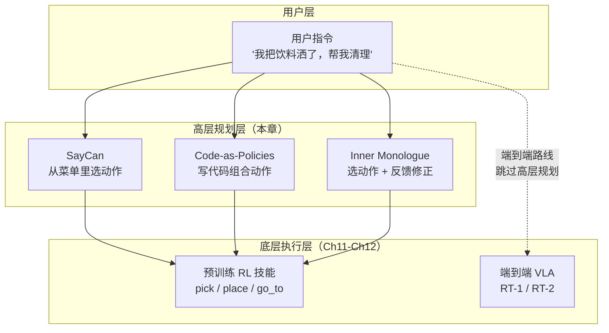
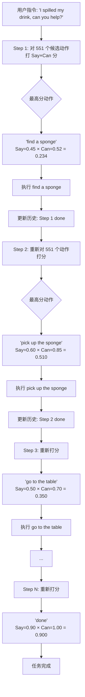
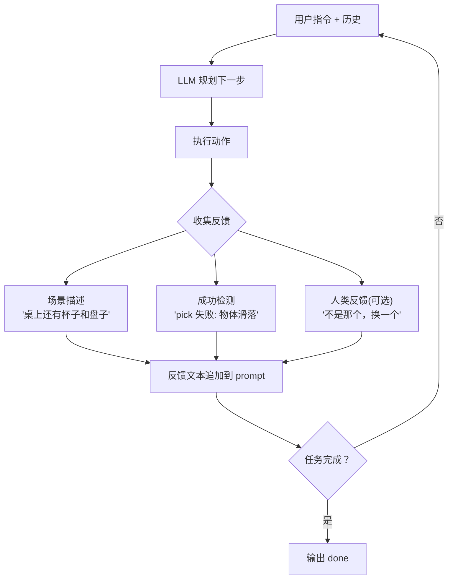

# Ch10: 高层规划——SayCan / Code-as-Policies / Inner Monologue

> Part 3: 核心主线精读
> 前置章节：[Ch09: VLM 地基 (II)——从 BLIP-2 到 LLaVA，给 AI 装上对话能力](ch09-blip2-llava.md)
> 后续章节：[Ch11: 端到端 VLA (I)——RT-1 / RT-2，把动作变成 token](ch11-rt1-rt2.md)

---

在 [Ch08](ch08-clip.md) 和 [Ch09](ch09-blip2-llava.md) 中，我们花了两章建起了 VLM 的地基——CLIP 教会了 AI 同时认图和认字，BLIP-2 和 LLaVA 让 AI 能看图说话。现在你手里有了一个又能看、又能说的大模型。下一个问题是：**怎么用它来指挥一台真实的机器人？**

这个问题远比"看图说话"复杂。让 LLM 回答"图片里有什么"，答错了最多输出一段错误文字；但让 LLM 指挥一台 20 公斤重的机械臂去"把厨房台面上的玻璃杯放进洗碗机"，规划错了可能打碎杯子、撞坏洗碗机、甚至伤到旁边的人。

本章讲三个 2022 年同期出现的工作——SayCan、Code-as-Policies、Inner Monologue。它们是人类第一次认真尝试"让 LLM 当机器人的大脑"，代表了三种截然不同的思路，也暴露了三种截然不同的局限。理解这三个工作，是理解后续端到端 VLA（Ch11-Ch12）为什么要"推翻重来"的前提。

**本章定位**：读完本章，你应该能够：

- 写出 SayCan 的核心公式，解释每个符号的含义
- 说出 Code-as-Policies 相比 SayCan 的核心优势和代价
- 画出 Inner Monologue 的闭环流程图，标注三种反馈类型
- 在一张对比表中，从 5 个维度比较三种规划方式
- 理解为什么这三种方案都是"模块化"的，以及端到端方案（Ch11）要解决什么问题

---

## 1. 从饭店点菜说起

### 1.1 蒙眼食客的困境

想象你被蒙着眼睛坐在一家饭店里。你是一位美食家——对中国八大菜系、法餐意餐日料全都了如指掌，脑子里装着上万道菜的做法和搭配。但你看不见——你不知道今天这家店有什么食材、厨师会做什么、甚至不知道你面前的桌子上已经摆了几盘菜。

这就是 LLM 面对真实机器人时的处境。LLM 读过人类写的几乎所有文本，"知道"怎么做饭、怎么打扫卫生、怎么整理房间。但它从来没有真正看过一个厨房长什么样、不知道机器人的手臂能伸多长、不知道桌子上的可乐罐在哪个位置。

如果你让这位蒙眼食客直接点菜，他可能会说："来一份松露配和牛刺身配 1982 年的拉菲"——作为美食搭配完美无缺，但这家街边小馆可能只有炒面和啤酒。

### 1.2 三种点菜方案

怎么让蒙眼食客吃上一顿靠谱的饭？2022 年的三篇论文给出了三种方案：

**方案 A：看菜单打勾（SayCan 的思路）**

服务员拿来一份菜单，上面列了这家店今天能做的所有菜。蒙眼食客对菜单上的每一道菜打分——"这道菜好不好吃？适不适合我今天的需求？"同时，服务员在每道菜旁边标注了"这道菜今天做得出来的把握有多大"（也许某道菜的食材快用完了）。最终选择 = 食客觉得好吃的程度 x 服务员觉得做得出来的把握。

这就是 SayCan 的核心公式：**action = argmax [ LLM 觉得有用 x 机器人觉得能做 ]**。

**方案 B：自己写菜谱（Code-as-Policies 的思路）**

不看菜单了。食客直接走进厨房（虽然看不见，但服务员告诉他厨房里有什么工具和操作），然后口述一份菜谱："先用中火热锅，加两勺油，放入切好的蒜末爆香，再倒入青菜翻炒三十秒……"服务员按照菜谱一步步执行。

这就是 Code-as-Policies 的做法：LLM 不从菜单里选，而是**直接写 Python 代码**，调用机器人提供的 API 函数来组合出新的行为。

**方案 C：每吃一口调整一次（Inner Monologue 的思路）**

回到菜单点菜的模式，但加了一个关键改进：每上一道菜，食客会尝一口，然后根据味道调整后面的点单。"这道菜太咸了，后面换个清淡的""这个菜没做好，换一道"。如果旁边还有个朋友，朋友会补充说"其实你点的那道不是你想要的那个，你想要的是菜单第二页那个"。

这就是 Inner Monologue：执行一步，收集反馈（成功没有？现在什么状态？人类有什么补充？），然后重新规划下一步。

### 1.3 本章的核心问题

三种方案各有利弊：

- SayCan 最安全——只能从菜单上选，不会点出不存在的菜，但也点不出菜单上没有的新搭配
- Code-as-Policies 最灵活——能自创菜谱，但菜谱可能写错，而且蒙眼写菜谱本身就很危险
- Inner Monologue 最鲁棒——做错了能补救，但速度最慢，每一步都要停下来反思

本章要回答的核心问题是：**怎么让一个"读过万卷书"但"没有走过一步路"的 LLM，安全、可靠地指挥一台真实的机器人？**

---

> **检查点 1**：在往下读之前，确认你能回答——
> - LLM 的"知识"和机器人的"能力"之间存在什么鸿沟？（LLM 知道该做什么，但不知道能不能做）
> - [Ch05](ch05-two-paradigms.md) 中的"模块化流水线"和本章讲的三种方案是什么关系？（三种方案都属于模块化路线）
> - 为什么说 CLIP（[Ch08](ch08-clip.md)）是这三种方案的间接依赖？（SayCan 用 CLIP-like 模型评估场景中的可行性）

---

## 2. 问题定义：LLM 规划的"接地气"问题

### 2.1 LLM 的天赋与盲区

先看一个真实的例子。你对 GPT-4 说"我把饮料洒在桌上了，帮我清理一下"，它可能会回答：

1. 先用纸巾吸干表面的液体
2. 用湿抹布擦拭残留的黏性物质
3. 用干毛巾擦干
4. 如果地板上也有，用拖把拖一下

这个计划完全正确——一个有生活经验的人也会这么做。但如果这段话是发给一台站在厨房里的机器人的呢？

问题来了：

- "纸巾"在哪？机器人看不到。也许厨房里根本没有纸巾，只有海绵
- "用纸巾吸干"——机器人的夹爪能抓起纸巾吗？也许它只有一个平板式的推抓器
- "用湿抹布擦拭"——机器人知道怎么拧抹布吗？它的手臂有这个灵巧度吗？
- "如果地板上也有"——机器人能看到地板吗？它的摄像头朝下吗？

LLM 的计划在"语义层面"是对的，但在"物理层面"可能每一步都做不到。这就是所谓的**接地问题（Grounding Problem）**——LLM 的知识悬在空中，没有"落地"到具体的物理环境和机器人能力上。

### 2.2 接地问题的三个维度

接地问题可以从三个维度来理解：

**维度一：环境接地——"世界长什么样？"**

LLM 不知道当前场景里有什么物体、在什么位置、处于什么状态。它可能建议"打开冰箱拿可乐"，但冰箱里根本没有可乐。这需要视觉感知来提供当前环境的信息——回想 [Ch08](ch08-clip.md) 的 CLIP，它可以判断"当前画面中是否有可乐"。

**维度二：能力接地——"机器人能做什么？"**

LLM 不知道这台机器人有几个关节、能抬多重、手臂能伸多远。它可能建议"把沙发搬到另一边"，但面前的机器人只是一台桌面机械臂，最多能抓起一个苹果。这需要机器人自身的能力模型来限制 LLM 的建议范围。

**维度三：状态接地——"当前进行到哪一步了？"**

LLM 生成计划时，它不知道前面的步骤执行得怎么样。也许第二步就失败了，但 LLM 还在按原计划推第三步。这需要执行反馈来让 LLM 知道"刚才那一步成功了吗？失败了的话现在是什么状况？"

### 2.3 三种接地策略

2022 年的三篇论文分别从不同角度攻克接地问题：

| 方案 | 主攻维度 | 接地手段 | 核心思路 |
|------|---------|---------|---------|
| SayCan | 能力接地 | affordance function（可行性评分） | 让机器人对每个候选动作评估"我做得到吗" |
| Code-as-Policies | 环境+能力接地 | 预定义 API + 代码生成 | 把接地规则编码进 API 设计中 |
| Inner Monologue | 状态接地 | 多模态反馈 → 文本 → 追加到 prompt | 每步执行后把环境反馈翻译成文字告诉 LLM |

注意，三种方案并不互斥——Inner Monologue 就建立在 SayCan 的基础之上，加上了状态接地的能力。

### 2.4 历史背景：LLM 之前怎么做规划

在 LLM 出现之前，机器人规划靠的是 **TAMP（Task and Motion Planning）**——用形式化的逻辑语言（如 PDDL）描述世界状态和动作前置条件/后置效果，然后用搜索算法找到一条从初始状态到目标状态的合法路径。

TAMP 的好处是严谨——每一步都有数学保证。但问题是**极其脆弱**：

- 需要人工编写完整的世界模型（所有物体、所有可能状态、所有动作的前后条件）
- 任何没有预先建模的情况（比如"桌子上有个你没见过的工具"）都会让规划器卡住
- 不能理解自然语言指令（"帮我收拾一下"太模糊了，TAMP 需要"把 object_A 从 location_B 移到 location_C"）

LLM 的出现带来了一个诱人的可能：用自然语言理解代替形式化建模，用常识推理代替穷举搜索。但代价就是上面说的接地问题——LLM 的"常识"是从文本中学来的，不是从物理世界中体验来的。

2022 年的 SayCan、Code-as-Policies、Inner Monologue 是第一批认真尝试"把 LLM 的常识接地到真实机器人"的工作。它们的成功和失败，定义了后续两年的研究方向。

### 2.5 本章的技术地图

在深入三篇论文之前，先看一张全局地图——三种方案在整个具身 AI 技术栈中的位置：



SayCan / Code-as-Policies / Inner Monologue 都处于"高层规划层"——它们负责把自然语言指令拆成一连串子任务，然后交给底层执行层去完成具体的机械臂运动。这种"高层规划 + 底层执行"的两层架构，就是 [Ch05](ch05-two-paradigms.md) 中讲的模块化流水线。

而 Ch11 要讲的 RT-2 则走了完全不同的路：**直接跳过高层规划层**，用一个端到端模型从图像+指令直接输出关节动作。这是 SayCan 路线的"反命题"——理解 SayCan 为什么有局限，才能理解 RT-2 为什么要推翻它。

---

> **检查点 2**：在往下读之前，确认你能回答——
> - 接地问题的三个维度分别是什么？（环境、能力、状态）
> - TAMP 和 LLM 规划各自的优势和劣势是什么？
> - 本章三种方案在技术栈中处于什么位置？（高层规划层，模块化路线）

---

## 3. SayCan 深度剖析

### 3.1 核心公式：Say x Can

SayCan 的核心思想可以用一句话概括：**让 LLM 说出"什么有用"，让机器人说出"什么能做"，两者相乘选出最佳动作。**

数学公式：

```
a* = argmax_a [ P_LLM(a | instruction, history) × P_affordance(a | state) ]
```

拆解每一项：

- `a*`：被选中的动作——当前步骤机器人要做什么
- `argmax_a`：从所有候选动作中选出得分最高的那个
- `P_LLM(a | instruction, history)`：**"Say" 分数**——给定用户指令和已执行的历史步骤，LLM 认为动作 a 是下一步的概率有多大
- `P_affordance(a | state)`：**"Can" 分数**——给定当前机器人所处的环境状态，机器人成功执行动作 a 的概率有多大
- 两者相乘：只有 LLM 觉得有用**且**机器人觉得能做的动作，才会被选中

为什么是相乘而不是相加？因为乘法意味着**两个条件都必须满足**。如果 LLM 觉得某个动作非常有用（Say=0.95），但机器人做不到（Can=0.01），乘积只有 0.0095——接近零，不会被选中。反过来，如果机器人很容易做（Can=0.95），但跟当前任务完全无关（Say=0.01），乘积也只有 0.0095。只有"有用且能做"的动作才能胜出。

回到饭店的类比：你觉得松露配和牛超好吃（Say=0.99），但这家店做不出来（Can=0.01），所以你不会点它。你选了"番茄炒蛋"——虽然你觉得它没那么惊艳（Say=0.6），但这家店做得很好（Can=0.95），最终得分 0.57，远高于松露配和牛的 0.0099。

### 3.2 "Say" 侧：LLM 当评委

**LLM 是谁？** SayCan 使用的是 Google 的 PaLM-540B——一个 5400 亿参数的大语言模型，2022 年当时最大的 LLM 之一。

**LLM 怎么打分？** 给 LLM 一个 prompt，包含用户指令和当前已执行的步骤历史。然后对每个候选动作，计算 LLM 认为"这是合理的下一步"的概率。

具体来说，SayCan 将每个候选动作表述为一段自然语言短句。比如：

```
用户指令: "I spilled my drink, can you help?"

已执行步骤:
  (暂无，这是第一步)

候选动作                           Say 分数
──────────────────────────────────────────
"1. find a sponge"                  0.45
"1. pick up the can"                0.10
"1. go to the table"                0.25
"1. find a napkin"                  0.40
"1. pick up an apple"               0.01
"1. open the drawer"                0.05
"1. done"                           0.00
```

LLM 的打分本质上是在做**语言建模**——给定前文（指令+历史），每个候选动作作为"续写"的概率有多大。"find a sponge" 得分最高，因为在"洒了饮料"这个语境下，找到海绵来擦是最合理的下一步。"pick up an apple" 得分几乎为零，因为跟清理饮料毫无关系。

**关键洞察**：LLM 在这里不是"生成"计划，而是"评估"每个候选动作的合理性。这是一个判别任务，不是生成任务。LLM 不需要发明新动作——它只需要从固定的菜单中选出最合理的那一个。

### 3.3 "Can" 侧：机器人的自知之明

"Say" 分数告诉我们"什么有用"，但没告诉我们"什么能做"。LLM 可能觉得"找一块海绵"是好主意，但如果海绵在另一个房间而机器人目前在厨房，那这个动作的成功率就很低。

这就是 affordance function 的作用。

**什么是 Affordance？**

Affordance（可供性）是一个源自心理学的概念——指物体在当前状态下"能被怎么用"。一把椅子的 affordance 是"能坐"；一个杯子的 affordance 是"能抓、能装水"；一个关着的抽屉的 affordance 是"能拉开"。

在 SayCan 中，affordance 被具体化为：**给定当前的机器人状态和环境状态，每个候选动作被成功执行的概率有多大？**

**怎么计算 affordance 分数？**

SayCan 为每个原始技能（primitive skill）预先训练了一个 RL（强化学习）策略。每个 RL 策略都有一个对应的**价值函数（value function）**——它估算"从当前状态出发，执行这个技能后获得奖励的期望值"。这个值越高，说明当前状态越适合执行该技能。

SayCan 把价值函数的输出归一化到 [0, 1] 区间，作为 affordance 分数：

```
当前状态: 机器人在厨房，面前有台面，台面上有可乐罐和海绵

候选动作                       Can 分数 (affordance)
───────────────────────────────────────────────────
"pick up the sponge"            0.85    （海绵就在眼前，伸手可及）
"pick up the can"               0.80    （可乐罐也在眼前）
"go to the table"               0.70    （桌子在视野范围内，可以走过去）
"find a napkin"                 0.15    （视野内看不到餐巾纸）
"open the drawer"               0.30    （抽屉在旁边，但需要先移过去）
"pick up an apple"              0.05    （视野内没有苹果）
```

**551 个预定义技能**

SayCan 的机器人（Google Everyday Robots 的移动操作机器人，一台有轮子和单臂的家用机器人）拥有 551 个预定义技能，分为 7 大类：

- `pick(X)`：抓起物体 X
- `place(X, Y)`：把物体 X 放到表面 Y 上
- `go_to(Z)`：移动到位置 Z
- `find(W)`：寻找物体 W
- `put_on_top(X, Y)`：把 X 放到 Y 上面
- `knock_over(X)`：推倒 X
- `open(X)` / `close(X)`：打开/关闭 X

每个技能对应不同的物体参数，组合出 551 个具体动作（比如 `pick(can of coke)`, `pick(sponge)`, `pick(apple)` 各算一个）。每个具体动作都有自己独立训练的 RL 策略和价值函数。

### 3.4 运作流程：一个完整的例子

把 Say 和 Can 合在一起，看 SayCan 怎么完成一个完整任务。

**任务**："I spilled my drink, can you help?"（我洒了饮料，你能帮忙吗？）



**Step 1**：LLM 看到"洒了饮料"，觉得"找海绵"最合理（Say=0.45）。机器人当前在厨房但海绵不在眼前（Can=0.52）。综合得分 0.234，在所有候选中最高。执行"find a sponge"——机器人移动搜索直到找到海绵。

**Step 2**：现在机器人在海绵旁边了。LLM 看到历史里已经"找到了海绵"，觉得下一步应该"拿起海绵"（Say=0.60）。海绵就在眼前，机器人能做到（Can=0.85）。综合得分 0.510。执行。

**Step 3**：手里拿着海绵了，LLM 觉得该"去桌子那里"（那里有洒出的饮料）。执行。

**Step 4-N**：拿着海绵到桌子那里、把海绵放下来（模拟擦拭）……直到 LLM 判断任务完成，输出 "done"。

注意一个关键细节：**每一步都重新打分**。不是一开始就规划好 5 步然后按顺序执行，而是走一步看一步——因为每执行一步，机器人的位置和环境状态都变了，affordance 分数也变了。

### 3.5 关键数字

| 指标 | 数值 | 含义 |
|------|------|------|
| 规划成功率 | **74%** | 在 16 个真实厨房任务上，74% 的规划是正确的 |
| LLM-only 基线 | 46% | 不用 affordance、只靠 LLM 打分的成功率 |
| 提升幅度 | **+28 pp** | affordance 贡献了 28 个百分点的提升 |
| 候选技能数 | 551 | 7 类技能 × 不同物体参数 |
| LLM 参数量 | 540B | PaLM-540B |
| 技能类别数 | 7 | pick / place / go_to / find / put_on_top / knock_over / open-close |
| 测试环境 | 真实厨房 | 不是仿真，是 Google 办公室里的真实厨房 |
| 测试任务数 | 16 | 如 "bring me a coke", "clean up the spill" 等 |

最关键的一个数字是 **+28 个百分点**——从 46% 到 74%。这说明 LLM 的"常识"确实有用（46% 已经不错了），但如果不接地，有超过一半的规划包含了机器人做不到的动作。加上 affordance 评分后，那些"做不到的好主意"被过滤掉了，成功率大幅提升。

### 3.6 局限性：SayCan 做不好什么

SayCan 是一个优雅的开创性工作，但它有五个明显的局限：

**局限一：菜单是固定的。** 551 个技能是预先训练好的，一个都加不了、一个都改不了。如果用户说"把苹果削皮切片"，而技能表里没有"削皮"和"切片"，SayCan 束手无策。它只能从已有的选项中选——就像一家只卖 10 道菜的小馆子，无论你多有创意，都只能在这 10 道菜里选。

**局限二：不能组合新行为。** 即使菜单里有 `pick(apple)` 和 `place(apple, plate)`，SayCan 也不能把它们组合成"把苹果切成片放在盘子上"——因为"切"不在技能表里。更关键的是，它每次只选一个动作，不能一次性生成一个多步组合。

**局限三：没有反馈机制。** 如果 Step 2 的"拿起海绵"失败了（手滑了、海绵太湿抓不住），SayCan 不知道。它会继续执行 Step 3"走到桌子那里"——手里空空的走过去，然后就卡住了。这是一个**开环规划（open-loop planning）**系统，不会根据执行结果调整计划。

**局限四：速度慢。** 每一步都要对 551 个候选动作分别算 Say 分数和 Can 分数，然后相乘选最大。一个包含 8 步的任务，需要做 8 × 551 = 4408 次评分。用 PaLM-540B 做 4408 次前向推理，即使用 Google 的 TPU 集群，也要好几分钟。对于"帮我收拾桌子"这种不紧急的任务还行，对于"杯子要掉了快接住"这种实时任务就太慢了。

**局限五：技能训练成本高。** 每个原始技能都需要单独做 RL 训练——设计奖励函数、在仿真或真实环境中采集数据、训练策略网络和价值函数。551 个技能意味着 551 次独立的 RL 训练。增加一个新技能不是改几行配置文件的事，而是一个完整的 RL 训练项目。

这些局限直接催生了接下来两篇论文：Code-as-Policies 解决了局限一和二（组合新行为），Inner Monologue 解决了局限三（反馈机制）。

---

> **检查点 3**：在往下读之前，确认你能回答——
> - SayCan 公式中 Say 和 Can 分别怎么计算？（LLM 续写概率 / RL 价值函数归一化）
> - 为什么 Say 和 Can 是相乘不是相加？（两个条件都必须满足）
> - SayCan 的 74% 成功率和 46% LLM-only 基线之间的差距说明了什么？（affordance 接地至关重要）
> - SayCan 最大的两个局限是什么？（固定菜单 + 没有反馈）

---

## 4. Code-as-Policies 深度剖析

### 4.1 核心洞察："与其从菜单点菜，不如自己写菜谱"

SayCan 的 551 个技能就像一本固定菜单。菜单内的菜做得不错，但菜单外的一律做不了。

现实中的机器人任务远比"从 551 道菜里选"复杂。比如：

- "把所有红色的积木按大小排列在桌子左边"——需要颜色识别、大小比较、空间推理、循环操作
- "把杯子移到盘子右边 10 厘米的位置"——需要精确的空间计算
- "每隔 5 秒检查一下门有没有开"——需要时间循环

这些任务不是从菜单里"选"能解决的——它们需要**组合和计算**。

Code-as-Policies 的核心洞察就是：**LLM 不光能说自然语言，它还会写代码。既然 LLM 会写 Python，为什么不让它直接写控制机器人的 Python 代码？**

回到饭店的类比：与其看菜单打勾，不如直接走进厨房，告诉厨师"先把锅烧到八成热，加两勺油……"。你不受菜单限制，可以自由组合任何食材和烹饪方式——只要厨房里有这些工具和食材。

### 4.2 Prompt 工程：教 LLM 写机器人代码

LLM 不是天生就知道怎么调用机器人 API 的。它需要学——怎么学？通过 **few-shot prompting**（少样本提示）。

Code-as-Policies 的 prompt 结构大致如下：

```python
# 第一部分：API 说明
# 可用的机器人 API 函数:
# robot.pick(object_name)  - 抓起指定物体
# robot.place(x, y, z)     - 放到指定坐标
# robot.get_pos(object_name) - 获取物体当前坐标 (x,y,z)
# robot.get_objects()       - 列出场景中所有可见物体
# say(text)                - 对用户说话

# 第二部分：示例（few-shot examples）

# 指令: "put the apple on the plate"
apple_pos = robot.get_pos("apple")
plate_pos = robot.get_pos("plate")
robot.pick("apple")
robot.place(plate_pos[0], plate_pos[1], plate_pos[2] + 0.05)

# 指令: "move the cup 10cm to the right"
cup_pos = robot.get_pos("cup")
robot.pick("cup")
robot.place(cup_pos[0] + 0.10, cup_pos[1], cup_pos[2])

# 第三部分：新指令（LLM 需要生成代码的部分）

# 指令: "stack all the blocks on top of each other"
```

LLM 看到这个 prompt 后，根据前面的 API 说明和示例，生成新指令对应的代码：

```python
# 指令: "stack all the blocks on top of each other"
blocks = [obj for obj in robot.get_objects() if "block" in obj]
first_block_pos = robot.get_pos(blocks[0])
for i, block in enumerate(blocks[1:], 1):
    robot.pick(block)
    robot.place(first_block_pos[0], 
                first_block_pos[1], 
                first_block_pos[2] + 0.05 * i)
```

注意这段代码做了什么：

1. 找到所有积木（`get_objects()` + 过滤）
2. 获取第一个积木的位置作为基准
3. 用 for 循环把其余积木逐个堆叠上去，每个高 0.05 米

SayCan **永远做不到这件事**——因为 SayCan 一次只能选一个动作，不能写循环，不能做算术，不能根据物体数量动态调整步骤数。

### 4.3 分层代码生成：从高层指令到底层动作

Code-as-Policies 不仅能写平铺的代码，还能生成**分层结构**的代码——高层函数调用中层函数，中层函数调用底层 API。

```python
# 用户指令: "sort the blocks by color, red on left, blue on right"

def sort_by_color():
    blocks = robot.get_objects()
    red_blocks = [b for b in blocks if "red" in robot.get_color(b)]
    blue_blocks = [b for b in blocks if "blue" in robot.get_color(b)]
    
    # 红色积木放左边
    left_x = 0.2
    for i, block in enumerate(red_blocks):
        place_in_row(block, left_x, spacing=0.08, index=i)
    
    # 蓝色积木放右边
    right_x = 0.6
    for i, block in enumerate(blue_blocks):
        place_in_row(block, right_x, spacing=0.08, index=i)

def place_in_row(block_name, start_x, spacing, index):
    robot.pick(block_name)
    robot.place(start_x + spacing * index, 0.3, 0.02)

sort_by_color()
```

这种分层结构意味着 LLM 可以：

- **定义新函数**：`place_in_row` 是 LLM 自己发明的辅助函数，不在原始 API 中
- **复用逻辑**：红色和蓝色积木都调用同一个 `place_in_row`
- **处理变长输入**：不管有几个积木，循环都能处理

这就是"写菜谱"比"看菜单"强的地方——**组合性（compositionality）**。你可以把有限的基本操作（pick, place, get_pos）组合出无限的复杂行为。

### 4.4 安全机制：让 LLM 写的代码不闯祸

让 LLM 直接写控制机器人的代码，听起来非常危险——万一 LLM 写了个 `while True: robot.move_fast()` 呢？

Code-as-Policies 设计了几层安全防护：

**第一层：API 白名单。** LLM 只能调用预先定义好的 API 函数。`robot.pick()` 可以调用，但 `robot.set_joint_velocity(999)` 不行——根本没有这个函数。这意味着 LLM 写的代码天然被限制在安全的动作范围内。每个 API 函数内部已经包含了碰撞检测、力限制等安全检查。

**第二层：代码审查。** 生成的代码在执行前会经过一次检查——语法是否正确、是否只调用了允许的函数、是否有无限循环等。在实验中，这一步是人工审查的；在实际部署中，可以用静态分析工具自动完成。

**第三层：沙盒执行。** 代码先在仿真环境中"试跑"一遍。如果仿真中没问题（没有碰撞、没有越界），再在真实机器人上执行。

**第四层：运行时限制。** 每个 API 调用都有超时（timeout）和力限制（force limit）。如果 `robot.pick()` 在 10 秒内没完成，自动停止；如果力传感器检测到异常大的力，立刻松开。

这四层防护让"LLM 写代码控制机器人"从"听起来疯狂"变成了"可以谨慎尝试"。但正如论文自己承认的——在真正的安全关键场景中（如手术机器人、核电站巡检），这些防护可能还不够。

### 4.5 关键数字和对比 SayCan

| 指标 | Code-as-Policies | SayCan |
|------|-------------------|--------|
| 新组合任务成功率 | **39%** | **0%** |
| 简单任务成功率 | 略低于 SayCan | 较高 |
| 动作空间 | 无限（代码可以组合） | 固定 551 个 |
| 空间推理 | 支持（可以做数学运算） | 不支持 |
| 循环行为 | 支持（for / while） | 不支持 |
| 反馈机制 | 无（开环） | 无（开环） |
| 安全性 | 需要额外防护 | 天然安全（只能选菜单） |

最关键的数字是 **39% vs 0%**——在需要"组合新行为"的任务上，SayCan 完全做不到（因为这些行为不在它的 551 个技能菜单里），而 Code-as-Policies 至少能做到 39%。

但在简单的"菜单上有的"任务上，SayCan 反而可能更稳定——因为它的每个技能是经过 RL 训练调优的、有质量保证的，而 Code-as-Policies 生成的代码可能有 bug。

这就是一个经典的 **灵活性 vs 可靠性**的 trade-off。

另一个重要能力是**空间推理**。SayCan 的动作是离散的——"pick up the cup"不区分"向左移 5cm 拿"还是"向右移 10cm 拿"。而 Code-as-Policies 可以写：

```python
cup_pos = robot.get_pos("cup")
plate_pos = robot.get_pos("plate")
target_x = plate_pos[0] + 0.10  # 盘子右边 10cm
robot.pick("cup")
robot.place(target_x, plate_pos[1], cup_pos[2])
```

这种精确的空间计算是 SayCan 的固定菜单完全无法表达的。

### 4.6 局限性：Code-as-Policies 做不好什么

**局限一：语义正确但逻辑错误。** LLM 写的代码可能在 Python 语法上完美无缺，但逻辑有问题。比如"把杯子叠到盘子上"，LLM 可能生成 `robot.place(plate_pos[0], plate_pos[1], plate_pos[2])`——坐标直接用了盘子的坐标，但忘了加上盘子的高度和杯子的高度，结果杯子放进了盘子里而不是放在上面。这种错误很难被静态分析发现。

**局限二：没有自我纠错。** 和 SayCan 一样，Code-as-Policies 是开环的——代码写完就执行，不管执行结果如何。如果第一次 `robot.pick("cup")` 失败了（手滑了），代码会继续执行下一行 `robot.place(...)`——手里空空的做一个"放"的动作。

**局限三：API 设计决定上限。** LLM 只能调用 prompt 中说明的 API 函数。API 设计得好，LLM 能做的事就多；API 设计得差，LLM 就被困住了。这把设计压力从"训练 551 个技能"转移到了"设计一套好的 API"——本质上是把一种工程难题换成了另一种。

**局限四：没有视觉接地。** LLM 写代码的时候"看不见"场景。它只能通过 `robot.get_pos()` 等函数间接获取环境信息。如果场景中有它 API 无法描述的信息（比如"桌子上有一摊水"），它就不知道。

**局限五：安全风险。** 虽然有四层防护，但让 LLM 写控制真实物理系统的代码，本质上仍然是危险的。论文在受控实验环境中证明了可行性，但在高风险场景中（如与人共处的环境），这种方法需要更多的安全保证。

---

> **检查点 4**：在往下读之前，确认你能回答——
> - Code-as-Policies 为什么能做到 SayCan 做不到的"新组合"任务？（代码可以循环、计算、组合）
> - few-shot prompting 在这里起什么作用？（教 LLM 怎么使用机器人 API）
> - Code-as-Policies 和 SayCan 共同的最大弱点是什么？（都是开环、没有反馈）

---

## 5. Inner Monologue 深度剖析

### 5.1 核心洞察："做了再说，做不好就反思"

SayCan 和 Code-as-Policies 有一个共同的致命弱点：**它们都是"开环"的**——制定计划，按部就班执行，不管中间发生了什么。

这就像一个厨师在做菜前写好了全部步骤，然后闭着眼睛执行——盐放多了不知道、锅糊了不知道、客人说"我其实要的是另一道菜"也不知道。

Inner Monologue 的核心洞察极其直觉化：**让 LLM 在每一步之后"内心独白"一下——发生了什么？成功了还是失败了？下一步该怎么调整？**

这个思路并不新奇——人类做任何复杂任务都是这样的。你搬一箱书到书架上：

1. 拿起一本书 → 成功 → 继续
2. 放到第二层 → 放不下（书太大了）→ 反思：换到第三层试试
3. 放到第三层 → 成功 → 继续
4. 拿下一本 → 太重了抓不稳 → 反思：用两只手拿

Inner Monologue 就是把这种"做-反思-调整"的循环引入到 LLM 机器人规划中。

### 5.2 三种反馈源

Inner Monologue 的关键创新是**把多模态的环境反馈翻译成自然语言文本**，追加到 LLM 的 prompt 里。它使用三种反馈源：

**反馈源 1：场景描述（Scene Description）**

每执行一步后，视觉系统观察当前场景，用自然语言描述"现在看到什么"。

```
[场景描述]: 桌子上有一个红色的杯子、一个蓝色的盘子、一块海绵。
红色杯子在桌子中央。蓝色盘子在桌子左边。海绵在盘子旁边。
```

这类似于让一个"眼睛"把看到的东西翻译成文字念给蒙眼的 LLM 听。在实现上，这可以用 VLM（如 [Ch09](ch09-blip2-llava.md) 讲的 BLIP-2 或 LLaVA）来自动生成，也可以用预训练的目标检测模型列出物体和位置。

**反馈源 2：成功检测（Success Detection）**

每个动作执行后，判断"成功了还是失败了"，并用自然语言报告：

```
[执行结果]: pick up the red cup → 成功
```

或者：

```
[执行结果]: pick up the red cup → 失败，原因：物体太滑，从夹爪中滑出
```

成功检测可以通过多种方式实现：力传感器判断（夹爪是否成功闭合）、视觉检测（物体是否离开了桌面）、或者训练一个专门的分类器。

**反馈源 3：人类反馈（Human Feedback）**

可选的第三种反馈——人类用自然语言纠正 LLM 的理解：

```
[人类反馈]: 不是那个杯子，我说的是烤面包机后面的那个。
```

这种反馈最强大也最稀缺——不可能每一步都让人盯着。Inner Monologue 把它设计为可选的，有人类反馈时用，没有时靠前两种自动反馈。

### 5.3 闭环规划流程

三种反馈汇合，构成了 Inner Monologue 的闭环：



用一个具体例子来看完整的闭环过程：

**任务**："Put the apple in the bowl."（把苹果放到碗里。）

**第 1 轮：**

```
[LLM 输入]
指令: Put the apple in the bowl.
历史: (无)

[LLM 输出]
下一步: pick up the apple

[执行]
机器人尝试抓起苹果

[反馈]
场景描述: 桌面上有一个红苹果、一个白碗、一个蓝盘子。苹果在桌子右侧。
成功检测: pick up the apple → 成功
```

**第 2 轮：**

```
[LLM 输入]
指令: Put the apple in the bowl.
历史: 
  Step 1: pick up the apple → 成功
  场景: 机器人夹爪中握有苹果。白碗在桌子左侧。

[LLM 输出]
下一步: place the apple in the bowl

[执行]
机器人尝试将苹果放入碗中

[反馈]
场景描述: 苹果在碗旁边，不在碗里。碗似乎太远了。
成功检测: place the apple in the bowl → 失败，苹果落在碗外
```

**第 3 轮（关键——失败后的重规划）：**

```
[LLM 输入]
指令: Put the apple in the bowl.
历史:
  Step 1: pick up the apple → 成功
  Step 2: place the apple in the bowl → 失败 (苹果落在碗外)
  场景: 苹果在碗旁边地面上。

[LLM 输出]
LLM 的内心独白: "放置失败了，苹果掉在了碗外面。我需要重新拿起苹果，
然后移动到更靠近碗的位置再放。"
下一步: pick up the apple

[执行]
重新拿起苹果 → 成功
```

**第 4 轮：**

```
[LLM 输出]
下一步: move closer to the bowl, then place the apple in the bowl

[执行]
移近碗，放入苹果 → 成功

[反馈]
成功检测: place → 成功
场景描述: 苹果在碗里。

[LLM 输出]
done
```

核心区别在第 3 轮：SayCan 在第 2 步放置失败后不会知道失败了，会继续执行下一个"无关动作"或者卡住。Inner Monologue 的 LLM 收到"放置失败"的反馈后，能够**推理出失败原因**（"太远了"）并**调整计划**（"先移近再放"）。

### 5.4 关键数字

| 指标 | 数值 | 含义 |
|------|------|------|
| 相比无反馈基线的提升 | **+28 pp** | 在桌面整理任务中，有反馈比没反馈高 28 个百分点 |
| 跨语言涌现能力 | 支持中文指令 | 尽管 LLM 只用英语训练，给中文指令也能工作 |
| 实验环境 | 真实机器人 + 仿真 | 两种环境都做了验证 |
| 反馈源数量 | 3 种 | 场景描述 + 成功检测 + 人类反馈 |

跨语言涌现能力是一个有趣的发现：研究者用中文给出指令（如"把苹果放到碗里"），LLM 尽管只在英语数据上训练过，仍然能理解指令并正确规划。这是一种**涌现能力（emergent capability）**——模型在训练时从未被教过这个能力，但它自然而然地出现了。这暗示了 LLM 内部的语言理解是跨语言的、深层次的，不仅仅是表面的模式匹配。

### 5.5 与 SayCan 的关系

Inner Monologue 不是 SayCan 的替代，而是 SayCan 的**增强**。它的底层仍然可以用 SayCan 的 Say×Can 公式来选择动作——只是在每步执行后，多了一个"收集反馈 → 追加到 prompt → 重新规划"的循环。

可以把它们的关系想成：

- SayCan = 导航软件（一开始算好路线，然后按路线走）
- Inner Monologue = 导航软件 + 实时路况（发现前方堵车，自动重新规划路线）

在大多数情况下，导航软件的初始路线就是对的，实时路况不会改变太多。但当出现意外（路封了、走错了、目的地变了）时，实时路况信息就成了救命的关键。Inner Monologue 的 +28 个百分点提升，大部分就来自这些"意外情况"的成功处理。

### 5.6 局限性

**局限一：反馈质量决定上限。** Inner Monologue 的效果完全取决于反馈的质量。如果场景描述系统把"苹果掉在碗外"描述成"苹果在碗里"（视觉识别出错），LLM 会以为任务成功了。垃圾反馈进，垃圾决策出。

**局限二：速度进一步变慢。** SayCan 每一步要打 551 次分数，已经很慢了。Inner Monologue 在此基础上还要额外运行场景描述模型、成功检测模型，然后再把反馈追加到 prompt（prompt 越来越长，每次 LLM 推理都变慢）。

**局限三：prompt 长度膨胀。** 每一轮的反馈都追加到 prompt 里，几轮之后 prompt 就变得很长。LLM 有上下文长度限制（2022 年的 PaLM 是 2048 token），太长的 prompt 会被截断，丢失早期的重要信息。

**局限四：仍然依赖固定技能。** Inner Monologue 改善了"执行失败后的恢复"，但没有改善"技能不在菜单上"的问题。它和 SayCan 一样，只能从预定义的技能中选择——只是选完之后多了个反馈修正的机制。

---

> **检查点 5**：在往下读之前，确认你能回答——
> - Inner Monologue 的三种反馈源分别是什么？（场景描述 / 成功检测 / 人类反馈）
> - "闭环"和"开环"规划的核心区别是什么？（有没有根据执行结果调整计划）
> - Inner Monologue 解决了 SayCan 的哪个局限？没解决哪个？（解决了"无反馈"；没解决"固定菜单"）

---

## 6. 三种规划方式正面对决

讲完了三篇论文的各自细节，现在把它们放在一起做一次正面对比。

### 6.1 五维对比表

| 维度 | SayCan | Code-as-Policies | Inner Monologue |
|------|--------|-------------------|-----------------|
| **规划方式** | 从固定菜单选择 | 生成可执行代码 | 菜单选择 + 反馈修正 |
| **组合性** | 低——只能选已有技能 | 高——代码可自由组合 | 低——同 SayCan |
| **鲁棒性** | 低——执行失败不知道 | 低——同样是开环 | 高——闭环反馈修正 |
| **灵活性** | 低——551 个固定动作 | 高——任意 Python 代码 | 低——同 SayCan |
| **安全性** | 高——只能选菜单上的 | 中——需要额外安全机制 | 高——同 SayCan |
| **速度** | 慢——每步 551 次评分 | 快——一次生成代码 | 更慢——SayCan + 反馈 |
| **接地维度** | 能力接地 | 环境+能力接地 | 能力+状态接地 |
| **核心创新** | Say×Can 公式 | LLM 写代码 | 多模态反馈闭环 |

### 6.2 什么场景选什么方案

**选 SayCan 的场景**：任务简单、在预定义技能范围内、对安全性要求高、不需要复杂的行为组合。典型例子："帮我拿一罐可乐"。

**选 Code-as-Policies 的场景**：任务需要空间推理、循环操作、或者组合多个基本动作成新行为。典型例子："把所有积木按颜色分类排列"。

**选 Inner Monologue 的场景**：任务可能出错、需要人类修正、或者环境不确定性高。典型例子："收拾桌子"（你不确定桌上有什么、每个东西该放哪）。

### 6.3 理想方案：三者的融合

如果你仔细看，三种方案解决的是不同的局限——它们是互补的，不是互斥的：

- SayCan 解决了"LLM 不知道机器人能做什么"（能力接地）
- Code-as-Policies 解决了"固定菜单不够灵活"（组合性）
- Inner Monologue 解决了"执行失败后不知道"（闭环反馈）

理想的系统应该三者兼备：用代码生成实现灵活的行为组合（Code-as-Policies），用 affordance 检查确保生成的代码在物理上可行（SayCan 的思想），执行后收集反馈来修正错误（Inner Monologue）。事实上，2023-2024 年的很多后续工作就是在做这种融合——但这已经超出本章的范围。

---

> **检查点 6**：在往下读之前，用自己的话总结——
> - 三种方案各自解决了接地问题的哪个维度？
> - 如果你要造一个厨房机器人，你会用哪种方案？为什么？
> - 三种方案有什么共同的局限没有被解决？（提示：想想 [Ch05](ch05-two-paradigms.md) 的"模块化 vs 端到端"）

---

## 7. 设计哲学：模块化 vs 端到端的前奏

### 7.1 三种方案的共同基因

回过头来看，SayCan、Code-as-Policies、Inner Monologue 有一个共同的设计基因：**它们都是模块化的**。

```
┌─────────────┐     接口     ┌─────────────┐
│   LLM       │  ──────────→ │   机器人    │
│  (大脑)      │   文本/代码   │  (手脚)     │
└─────────────┘              └─────────────┘
```

LLM 和机器人是两个独立训练的模块。LLM 不知道机器人长什么样，机器人不理解自然语言。它们之间的接口是文本（SayCan / Inner Monologue）或代码（Code-as-Policies）。

这种模块化设计有三个好处：

- **可解释性**：你能看到 LLM 输出了什么计划、每一步选了什么动作、为什么选它。出了问题，你能定位到是 LLM 规划错了还是机器人执行错了
- **可替换性**：LLM 可以从 PaLM 换成 GPT-4，机器人可以从单臂换成双臂，两边互不影响
- **安全性**：LLM 的输出先经过审查（affordance 检查或代码审查）再执行，有"人在回路"的空间

但模块化也有一个根本性的代价：**信息在模块间传递时会丢失**。

LLM 把"拿起杯子"这四个字传给机器人执行层。但"拿起杯子"在不同场景下可能意味着完全不同的动作——杯子横着放要侧抓，杯子倒着放要先翻正，杯子在架子高处要先抬臂再伸手。这些细微的物理差异全都被"拿起杯子"四个字抹平了。LLM 的文本指令就像一个低带宽的管道——再复杂的意图也被压缩成了几个词。

### 7.2 端到端路线的诱惑

如果模块化的瓶颈是"文本管道太窄"，那解决方案就是——**把管道去掉**。

[Ch11](ch11-rt1-rt2.md) 将要讲的 RT-2 就是这个思路：不再把 LLM 和机器人分开，而是训练一个统一的模型——输入是摄像头画面 + 自然语言指令，输出直接是关节角度。没有中间的文本规划步骤，没有 affordance 评分，没有代码生成——从像素到动作，一步到位。

这就是 [Ch05](ch05-two-paradigms.md) 中讲的**端到端一体化**路线。RT-2 是 SayCan 路线的"反命题"——SayCan 的研究团队（Google DeepMind）后来自己开发了 RT-2，本质上是在说：**我们之前的模块化方案有根本性的局限，需要另起炉灶。**

但模块化路线并没有因此"死掉"——2024 年的很多工业界机器人系统仍然使用模块化架构，因为：

- 端到端模型需要大量真实机器人数据来训练（非常昂贵）
- 模块化系统更容易调试和迭代（哪个模块出问题修哪个）
- 在安全要求高的场景，可解释性和人工审查仍然不可或缺

所以，模块化 vs 端到端不是"对 vs 错"的关系，而是"不同场景下的不同选择"。本章讲的三种模块化方案，代表了 2022 年人们对"LLM + 机器人"最初的、最直觉的尝试。理解它们的设计和局限，是理解后续端到端方案为什么要"推翻重来"的必要准备。

---

## 8. 检查点与过渡

### 8.1 本章前半部分核心知识回顾

到这里，你已经完成了本章前半部分最核心的内容。用以下问题检验自己的理解：

**概念层**：

- SayCan 的核心公式是什么？Say 和 Can 分别代表什么？
- Code-as-Policies 相比 SayCan 的核心优势是什么？（组合性——代码可以循环、计算、定义新函数）
- Inner Monologue 解决了前两者的什么共同弱点？（开环 → 闭环，加入反馈机制）
- 三种方案都属于什么架构路线？（模块化流水线）

**数字层**：

- SayCan 的规划成功率是多少？比 LLM-only 高多少？（74%，高 28 pp）
- SayCan 有多少个预定义技能？（551 个）
- Code-as-Policies 在新组合任务上的成功率是多少？SayCan 呢？（39% vs 0%）
- Inner Monologue 相比无反馈基线提升了多少？（28 pp）

**思辨层**：

- 如果你是 Google 的研究员，已经做完了 SayCan，你会优先改进什么？为什么？
- Code-as-Policies 的"让 LLM 写代码"思路，和你用 ChatGPT 写 Python 脚本有什么根本区别？（代码控制的是真实物理系统，错误代价不只是 bug 报错）
- 为什么说 Inner Monologue 的"跨语言涌现能力"暗示了 LLM 的语言理解是深层的？

---

## 9. SayCan 的 Affordance 技术深潜

### 9.1 什么是 Affordance Function？

回到饭店类比。前面说"服务员在每道菜旁边标注了做得出来的把握"——这个"把握"就是 affordance function 的输出。但服务员是怎么知道这个把握的？答案是：**每道菜都有一个专门的厨师，这个厨师自己评估自己今天能不能做好这道菜。**

在 SayCan 中，每一个技能（skill）都有自己独立的策略网络（policy）和价值函数（value function）。价值函数 V_pi(s) 的含义是：在当前状态 s 下，如果执行这个技能的策略 pi，成功完成的概率是多少。

这个概率就是 affordance score——"机器人觉得自己能做到"的量化表达。

### 9.2 价值函数的训练过程

每个技能的价值函数是通过强化学习（RL）训练出来的。训练流程如下：

1. **人类演示**：研究人员在真实厨房中，用遥操作（teleoperation）控制机器人完成某个技能（比如"拿起海绵"），录制轨迹数据
2. **行为克隆初始化**：用人类演示数据做行为克隆（behavior cloning），得到一个初始策略
3. **RL 微调**：在真实环境中用 RL 继续训练，优化成功率。奖励信号来自人工标注或自动检测（比如"海绵是否离开了桌面"）
4. **价值函数提取**：训练完成后，策略网络附带的 value function 就是 affordance score 的来源

关键点：**价值函数是在真实物理环境中训练的**，不是在模拟器里。这意味着它天然包含了真实世界的物理约束——摩擦力、物体重量、夹爪的抓取极限。这也是为什么 SayCan 的 affordance 评分比纯视觉判断更可靠。

### 9.3 551 个技能的分类

SayCan 的 551 个技能并不是 551 种完全不同的动作。它们由 7 类基础技能模板组合而成：

1. **Pick（抓取）**：pick up [object]——抓起某个物体
2. **Place（放置）**：place [object] on [surface]——把物体放到某个表面
3. **Pour（倒）**：pour [container]——倒出容器中的内容
4. **Open/Close（开关）**：open/close [object]——打开或关闭某物（如抽屉）
5. **Wipe（擦拭）**：wipe [surface] with [tool]——用工具擦拭表面
6. **Navigate（导航）**：go to [location]——移动到某个位置
7. **Find（寻找）**：find [object]——在环境中定位某个物体

551 = 7 类模板 x 不同的物体/位置参数组合。比如"pick up sponge""pick up can""pick up apple"算三个不同的技能，因为每个都有独立训练的策略和价值函数。

### 9.4 为什么每个技能要独立训练？

你可能会问：为什么不训练一个通用的"抓取策略"，然后告诉它抓什么？

答案是 2022 年的技术水平还做不到足够好的泛化。一个专门训练过"抓海绵"的策略，知道海绵是软的、要用适中的力度、从侧面抓比较稳；而"抓可乐罐"的策略知道罐子是圆柱形的、表面光滑、要从顶部或侧面夹紧。这些物理细节很难用一个通用策略覆盖。

这也是 SayCan 的核心局限之一：**技能集是封闭的**。如果环境中出现了一个训练时没见过的物体（比如一个形状奇怪的玩具），SayCan 没有任何技能能处理它。这就是为什么 Code-as-Policies 的"代码组合"思路有价值——它可以用已有的基础动作组合出新行为。

### 9.5 Affordance 评分的实际效果

论文中的一个关键实验：当 LLM 建议"pick up the heavy box"（抓起重箱子），但机器人的夹爪力量不够时，affordance score 会给出一个很低的值（比如 0.05），有效地否决了这个选择。LLM 的 Say score 可能很高（"抓起箱子确实是完成任务的好步骤"），但 Can score 把它拉下来了。

这就是 Say x Can 乘法的精妙之处：**任何一方的否决都能阻止不合理的行动**。Say score 低意味着"这步没用"，Can score 低意味着"这步做不到"。只有两者都高，才会被选中。

---

## 10. Code-as-Policies 的 Prompt 工程深潜

### 10.1 Prompt 的三段式结构

Code-as-Policies 的核心创新不是"让 LLM 写代码"这个想法本身（2022 年大家都知道 LLM 能写代码），而是**怎么设计 prompt 让 LLM 写出能控制机器人的代码**。

它的 prompt 由三部分组成：

**第一段：API 文档**

```
# Robot API
robot.pick(object_name)  # Pick up the named object
robot.place(object_name, location)  # Place held object at location
robot.get_pos(object_name)  # Returns (x, y, z) position
robot.get_color(object_name)  # Returns color string
robot.say(text)  # Speak text aloud
```

这段告诉 LLM："你能用的工具就这些，每个工具的输入输出是什么。"就像给一个新程序员一份 SDK 文档。

**第二段：示例（In-context Examples）**

```
# Task: put the red block on the blue block
red_pos = robot.get_pos("red block")
blue_pos = robot.get_pos("blue block")
robot.pick("red block")
robot.place("red block", blue_pos)

# Task: stack all blocks on the corner
blocks = robot.get_objects("block")
corner = robot.get_pos("corner")
for block in blocks:
    robot.pick(block)
    robot.place(block, corner)
```

这段是关键——LLM 通过这些示例"学会"了如何把自然语言任务翻译成 API 调用序列。注意示例中包含了循环、变量、条件判断等编程结构，暗示 LLM 可以使用这些结构。

**第三段：实际查询**

```
# Task: put the blocks in a line sorted by color
```

LLM 看到这个查询后，会模仿前面的示例风格，生成新的代码。

### 10.2 In-context Learning 的魔法

为什么几个示例就能让 LLM "学会"一个全新的 API？这利用了 LLM 的 in-context learning 能力——LLM 不需要重新训练，只需要在 prompt 中看到几个"输入-输出"的例子，就能推断出模式并应用到新输入上。

这和你学一门新编程语言的过程很像：你不需要读完整本教材，看几个代码示例就能开始写。LLM 做的是同样的事，只不过它的"看几个例子就能写"的能力比人类强得多（因为它预训练时已经见过海量代码）。

### 10.3 注释的隐藏作用

论文中一个有趣的发现：**在示例代码中加入注释，能显著提高生成代码的质量**。比如：

```python
# Task: move the cup to the right of the plate
cup_pos = robot.get_pos("cup")
plate_pos = robot.get_pos("plate")
# "right of" means positive x direction, offset by 0.1m
target = (plate_pos[0] + 0.1, plate_pos[1], plate_pos[2])
robot.pick("cup")
robot.place("cup", target)
```

注释 `# "right of" means positive x direction` 起到了 chain-of-thought 的作用——它教会 LLM 如何把空间语言（"右边"）映射到坐标操作（x + 0.1）。没有这类注释，LLM 经常搞混方向。

### 10.4 常见失败模式

LLM 生成的机器人代码有几种典型的错误：

1. **幻觉 API**：调用了 prompt 中没有定义的函数，比如 `robot.rotate(90)` 或 `robot.measure_weight()`。LLM 从预训练知识中"发明"了不存在的能力
2. **物理常识错误**：生成 `robot.place("cup", (0, 0, 5.0))` 把杯子放到 5 米高的空中——代码语法正确，但物理上荒谬
3. **顺序错误**：先 place 再 pick（还没拿起来就放下了）
4. **坐标系混乱**：把相对坐标当绝对坐标用，或者搞混了 x/y/z 轴的含义
5. **缺少错误处理**：不检查 `get_pos()` 是否返回 None（物体不存在的情况）

### 10.5 与人类写的程序的对比

人类程序员写机器人控制代码时，会做很多 LLM 不会做的事：

- 加入安全检查（力矩限制、碰撞检测）
- 处理异常情况（物体滑落、抓取失败）
- 考虑物理约束（速度限制、加速度平滑）
- 写单元测试验证逻辑

Code-as-Policies 生成的代码更像是"伪代码级别的意图表达"——它表达了"做什么"，但缺少"怎么安全地做"的细节。这也是为什么实际部署时，生成的代码通常要经过一层安全包装（safety wrapper）才能执行。

---

## 11. 代码实战：模拟 SayCan 决策过程

### 11.1 模拟 SayCan 的 Say x Can 选择

下面这段 Python 代码模拟了 SayCan 的核心决策逻辑。我们不需要真正的 PaLM-540B 或真实机器人——用简单的打分函数来演示原理：

```python
"""
模拟 SayCan 的 Say x Can 决策过程
核心公式: best_skill = argmax(say_score * can_score)
"""

# 假设任务是 "I spilled my drink, can you help?"
task = "I spilled my drink, can you help?"

# 可用技能列表（模拟 551 个中的一小部分）
skills = [
    "pick up sponge",
    "pick up can",
    "go to counter",
    "go to table",
    "wipe table with sponge",
    "open drawer",
    "find sponge",
    "pour water",
]

# 模拟 LLM 的 Say score（语义相关性）
# 真实系统中这是 PaLM-540B 的条件概率
def say_score(task, skill):
    """LLM 判断：这个技能对完成任务有多大帮助？"""
    relevance = {
        "pick up sponge": 0.85,      # 高：清理需要海绵
        "pick up can": 0.10,         # 低：和清理无关
        "go to counter": 0.30,       # 中：可能要去拿工具
        "go to table": 0.60,         # 中高：洒在桌上要去桌边
        "wipe table with sponge": 0.95,  # 最高：直接解决问题
        "open drawer": 0.20,         # 低：不太相关
        "find sponge": 0.80,         # 高：需要先找到海绵
        "pour water": 0.05,          # 极低：会让情况更糟
    }
    return relevance.get(skill, 0.0)

# 模拟机器人的 Can score（affordance / 可行性）
# 真实系统中这是 RL 价值函数的输出
def can_score(skill, robot_state):
    """机器人判断：在当前状态下，我能成功执行这个技能吗？"""
    feasibility = {
        "pick up sponge": 0.90,      # 高：海绵在视野内且可达
        "pick up can": 0.85,         # 高：罐子也可以抓
        "go to counter": 0.95,       # 很高：导航很可靠
        "go to table": 0.95,         # 很高：同上
        "wipe table with sponge": 0.15,  # 很低！手里没拿海绵
        "open drawer": 0.70,         # 中：抽屉有点卡
        "find sponge": 0.60,         # 中：需要转头搜索
        "pour water": 0.80,          # 高：倒水动作简单
    }
    return feasibility.get(skill, 0.0)

# SayCan 决策：Say x Can
print(f"任务: {task}")
print()
print(f"{'技能':<25} {'Say':>6} {'Can':>6} {'Say*Can':>8}")
print("-" * 50)

robot_state = {"holding": None, "position": "kitchen_center"}
results = []

for skill in skills:
    s = say_score(task, skill)
    c = can_score(skill, robot_state)
    combined = s * c
    results.append((skill, s, c, combined))
    print(f"{skill:<25} {s:>6.2f} {c:>6.2f} {combined:>8.3f}")

# 选择得分最高的技能
best = max(results, key=lambda x: x[3])
print(f"\n选中技能: {best[0]} (得分: {best[3]:.3f})")
```

运行这段代码，你会看到一个关键现象：**"wipe table with sponge"的 Say score 最高（0.95），但因为 Can score 极低（0.15，手里没海绵），最终没有被选中。** 相反，"pick up sponge"虽然 Say score 稍低（0.85），但 Can score 很高（0.90），所以 Say x Can = 0.765，成为第一步的最佳选择。

这就是 affordance grounding 的核心价值：**阻止 LLM 选择"语义上正确但物理上不可行"的动作。**

### 11.2 模拟 Code-as-Policies 风格的 Prompt

下面展示 Code-as-Policies 如何处理同一个任务。注意 prompt 的结构：

```python
"""
模拟 Code-as-Policies 的 prompt 构造和代码生成
"""

prompt = """
# Robot API Documentation
# robot.pick(obj) - pick up named object
# robot.place(obj, location) - place object at location
# robot.go_to(location) - navigate to location
# robot.get_pos(obj) - returns (x,y,z) position
# robot.find(obj) - search and return object if found
# robot.wipe(surface, tool) - wipe surface using tool

# Example 1:
# Task: "put the apple in the bowl"
apple = robot.find("apple")
bowl_pos = robot.get_pos("bowl")
robot.pick("apple")
robot.place("apple", bowl_pos)

# Example 2:
# Task: "clean the counter"
sponge = robot.find("sponge")
robot.pick("sponge")
robot.go_to("counter")
robot.wipe("counter", "sponge")

# Task: "I spilled my drink, can you help?"
"""

# 模拟 LLM 生成的代码（这是 LLM 可能输出的结果）
generated_code = """
# Step 1: Find cleaning supplies
sponge = robot.find("sponge")
# Step 2: Pick up the sponge
robot.pick("sponge")
# Step 3: Go to the spill location
robot.go_to("table")
# Step 4: Wipe the spill
robot.wipe("table", "sponge")
# Step 5: Clean up - put sponge back
robot.go_to("counter")
robot.place("sponge", robot.get_pos("sponge_holder"))
"""

print("=== Code-as-Policies 生成的代码 ===")
print(generated_code)
print("关键观察:")
print("1. 代码是一次性生成的完整计划（开环）")
print("2. 没有检查 find() 是否成功")
print("3. 没有检查 wipe() 是否真的擦干净了")
print("4. 假设了 'sponge_holder' 的存在")
```

### 11.3 对比与实践建议

从这两段代码中可以提炼出几个实践要点：

**SayCan 的优势在模拟中很明显**：每一步都有 affordance 检查，不会选择当前做不到的动作。但代价是——它只能从预定义列表中选，无法生成"先找海绵再擦桌子"这样的多步计划（需要多轮迭代）。

**Code-as-Policies 的优势也很明显**：一次生成完整的多步计划，包含逻辑流程。但代价是——没有任何运行时检查，如果第一步就失败了（海绵不在预期位置），后面全部白费。

**如果你要设计一个实际系统**，最好的做法是结合两者：用 Code-as-Policies 的方式生成计划框架，但在每一步执行前加入 SayCan 式的 affordance 检查。这正是后续很多工作（如 ProgPrompt、Voyager）的思路。

---

## 12. 三种方法在同一任务上的对比

### 12.1 任务设定

假设场景是一个真实厨房，机器人收到指令："Clean up the spilled coffee on the table."（清理桌上洒的咖啡。）

环境状态：桌上有咖啡渍、海绵在水槽旁、纸巾在抽屉里、垃圾桶在角落。

### 12.2 SayCan 的处理方式

SayCan 会进行多轮迭代，每轮选一个最佳技能：

```
第 1 轮: argmax(Say * Can)
  -> 选中 "find sponge" (Say=0.75, Can=0.80, 乘积=0.60)
  
第 2 轮: 状态更新（已定位海绵）
  -> 选中 "go to sink" (Say=0.70, Can=0.95, 乘积=0.665)
  
第 3 轮: 状态更新（已到水槽旁）
  -> 选中 "pick up sponge" (Say=0.85, Can=0.92, 乘积=0.782)
  
第 4 轮: 状态更新（手持海绵）
  -> 选中 "go to table" (Say=0.80, Can=0.95, 乘积=0.76)
  
第 5 轮: 状态更新（在桌旁，手持海绵）
  -> 选中 "wipe table" (Say=0.95, Can=0.88, 乘积=0.836)
  
第 6 轮: 状态更新（桌面已擦）
  -> 选中 "place sponge on counter" (Say=0.60, Can=0.90, 乘积=0.54)
  
第 7 轮: LLM 判断任务完成 -> 终止
```

特点：每一步都是安全的、可行的，但需要 7 轮 LLM 推理 + affordance 评估，速度慢。

### 12.3 Code-as-Policies 的处理方式

Code-as-Policies 一次性生成完整代码：

```python
# Generated by LLM in one shot:
sponge_pos = robot.get_pos("sponge")
robot.go_to(sponge_pos)
robot.pick("sponge")
table_pos = robot.get_pos("table")
robot.go_to(table_pos)
robot.wipe("table", "sponge")
robot.go_to(sponge_pos)
robot.place("sponge", sponge_pos)
```

特点：一次生成，执行快。但如果海绵不在预期位置（比如有人移动了它），整个计划从第一步就会失败，且没有恢复机制。

### 12.4 Inner Monologue 的处理方式

Inner Monologue 会在每一步之后收集反馈并重新规划：

```
Plan: "First, I'll find and pick up the sponge."
Execute: go to sink, pick up sponge
Scene feedback: "Robot is holding sponge. Table has brown stain."
Success feedback: "Pick up succeeded."
-> Continue plan.

Plan: "Now wipe the table."
Execute: go to table, wipe table
Scene feedback: "Table still has faint stain in corner."
Success feedback: "Wipe partially succeeded."
-> Replan: "The stain isn't fully cleaned. I'll wipe again focusing on the corner."

Execute: wipe table (corner area)
Scene feedback: "Table is clean."
Success feedback: "Wipe succeeded."
Human feedback: "Looks good, but can you also throw away the used paper towel on the counter?"
-> Replan: "User wants me to also discard the paper towel."

Execute: pick up paper towel, go to trash, place in trash
-> Task complete.
```

特点：能处理部分失败（擦不干净就再擦）、能响应人类的额外指令、但每一步都需要感知系统提供反馈，速度最慢。

### 12.5 对比分析

从这个例子中可以看出三种方法的本质差异：

- **SayCan** 像一个谨慎的新手厨师——每做一步都要看菜谱确认下一步，绝不冒险，但做菜很慢
- **Code-as-Policies** 像一个自信的老厨师——看一眼菜名就开始操作，动作流畅，但如果食材和预期不同就会翻车
- **Inner Monologue** 像一个有经验且细心的厨师——边做边尝，随时调整，还会听食客的意见，但一道菜要做很久

没有哪种方法在所有场景下都最优。选择取决于：任务的容错要求（高安全 -> SayCan）、任务的新颖程度（新组合 -> Code-as-Policies）、环境的不确定性（动态环境 -> Inner Monologue）。

---

## 13. 自测题

用以下问题检验你对本章的理解。每道题后面有提示，但建议先自己思考再看。

**Q1：Say x Can 为什么用乘法而不是加法？**

提示：考虑极端情况。如果 Say=0.9 但 Can=0.01（LLM 觉得很有用但机器人完全做不到），加法得 0.91（仍然很高，可能被选中），乘法得 0.009（几乎为零，不会被选中）。乘法的效果是：**任何一方的否决都能生效**。这在安全关键系统中至关重要——你不希望机器人去尝试一个成功率只有 1% 的动作，即使它在语义上是"正确的下一步"。

**Q2：Code-as-Policies 的"组合性"优势具体体现在哪里？举一个 SayCan 做不到但 Code-as-Policies 能做的任务。**

提示：考虑需要循环或计算的任务。比如"把所有红色方块按从左到右的顺序排成一行"——这需要：(1) 识别所有红色方块，(2) 获取它们的位置，(3) 按 x 坐标排序，(4) 依次放置到等间距的位置。SayCan 的技能列表里不会有"按颜色排序"这个技能，但 Code-as-Policies 可以用 for 循环 + sorted() 实现。

**Q3：Inner Monologue 的三种反馈类型分别解决什么问题？如果去掉其中一种，系统会怎样退化？**

提示：场景描述（scene description）告诉 LLM "现在世界是什么样"——去掉它，LLM 就变成了蒙眼规划，回到 SayCan 的问题。成功检测（success detection）告诉 LLM "上一步做成了没"——去掉它，LLM 会假设每步都成功，错误会累积。人类反馈（human feedback）提供了超出机器人感知能力的信息——去掉它，系统无法处理歧义指令或感知盲区。

**Q4：SayCan 的 affordance score 为什么用 RL 价值函数而不是简单的二分类（能做/不能做）？**

提示：现实中"能不能做"不是非黑即白的。"抓起一个湿滑的肥皂"不是完全不可能，只是成功率较低（比如 30%）。连续的概率值让系统能做更细粒度的权衡——如果没有更好的选择，30% 成功率的动作也值得尝试；但如果有一个 90% 成功率的替代方案，就应该选替代方案。二分类会丢失这种细粒度信息。

**Q5：为什么 Inner Monologue 论文中发现了"跨语言涌现"现象（用中文指令也能工作）？这说明了 LLM 的什么特性？**

提示：Inner Monologue 使用的 LLM（PaLM）是在多语言数据上训练的。"跨语言涌现"说明 LLM 的任务规划能力不是绑定在某一种语言上的——它学到的是**语言无关的推理结构**。当你用中文说"把杯子放到桌上"，LLM 内部激活的推理路径和英文 "put the cup on the table" 是相似的。这暗示 LLM 的"理解"不仅仅是表面的模式匹配，而是某种更深层的语义表征。

**Q6：如果 SayCan 的所有技能的 Can score 都很低（比如都低于 0.1），系统会怎么表现？这反映了什么问题？**

提示：如果所有 Can score 都很低，说明机器人当前状态下几乎没有技能有把握执行成功。Say x Can 的乘积会全部很小，系统可能会选一个"最不差"的动作，但执行大概率失败。这反映了 SayCan 的一个局限：**它没有"拒绝执行"的机制**。一个更好的设计应该在所有 Can score 低于阈值时主动报告"我现在做不了这个任务"，而不是硬选一个大概率失败的动作。

**Q7：假设你要设计一个家庭服务机器人系统，任务是"帮我准备明天的早餐"。你会选择哪种架构？为什么？**

提示：这是一个开放题，没有标准答案。但考虑以下因素："准备早餐"是一个长时间跨度任务（可能涉及前一晚准备食材 + 早上烹饪），需要多步规划；厨房环境复杂，可能出现意外（鸡蛋打碎、牛奶洒了）；涉及安全问题（用刀、用火）。一个合理的答案是**混合架构**：用 Code-as-Policies 的思路生成高层计划（因为做早餐涉及计时、并行操作等逻辑），用 SayCan 的 affordance 检查确保每一步安全可行，用 Inner Monologue 的反馈机制处理执行中的意外。这也是 2024 年工业界的主流做法——不是三选一，而是取各家之长。

**Q8：Code-as-Policies 让 LLM 写代码控制机器人，和你用 ChatGPT 写一个 Python 脚本处理 Excel 表格，本质区别是什么？**

提示：区别不在于"写代码"这个动作本身，而在于**代码执行的后果是否可逆**。你用 ChatGPT 写的 Excel 脚本如果有 bug，最坏的结果是数据处理错误——你可以撤销、重来。但 LLM 写的机器人控制代码如果有 bug，机械臂可能撞坏东西、伤到人、或者把自己卡住。**物理世界的操作是不可逆的**——你不能"Ctrl+Z"一个已经打碎的杯子。这就是为什么 Code-as-Policies 需要额外的安全机制（如 affordance 检查、人工审查、仿真预演），而普通的代码生成不需要。

---

## 14. 关键数字速查表

| 维度 | SayCan | Code-as-Policies | Inner Monologue |
|------|--------|-------------------|------------------|
| 发表时间 | 2022.04 (arXiv) | 2022.09 (arXiv) | 2022.07 (arXiv) |
| 研究机构 | Google / Everyday Robots | Google | Google |
| 核心 LLM | PaLM-540B | Codex (GPT-3 变体) | PaLM-540B |
| LLM 参数量 | 540B | ~175B | 540B |
| 核心机制 | Say x Can 评分 | LLM 生成 Python 代码 | 计划-执行-反馈闭环 |
| 技能数量 | 551 个预定义 | 无限（代码组合） | 依赖底层技能库 |
| 新组合能力 | 0%（只能选已有技能） | 39%（代码组合新行为） | 有限（依赖技能库） |
| 规划成功率 | 74% | 未直接报告 | ~74%+28pp 提升 |
| vs LLM-only 提升 | +28 pp | N/A | +28 pp |
| 反馈机制 | 无（开环） | 无（开环） | 有（三种闭环反馈） |
| 机器人平台 | 移动操作臂 | 桌面机械臂 / 无人机 | 移动操作臂 |
| 实验环境 | 真实厨房 | 真实桌面 + 仿真 | 真实厨房 |
| 关键局限 | 只能选不能创 | 代码可能不安全 | 速度慢，依赖反馈质量 |

**记忆口诀**：SayCan 选菜单（安全但死板），CaP 写菜谱（灵活但危险），IM 边吃边调（鲁棒但慢）。

---

## 15. 常见误区与澄清

### 误区 1："SayCan 的 LLM 理解了机器人的物理能力"

**错误认知**：SayCan 之所以有效，是因为 PaLM-540B 学会了理解机器人能做什么。

**正确理解**：PaLM 对机器人的物理能力一无所知。它只负责"语义评分"——判断一个动作在语言层面是否和任务相关。"机器人能不能做"这个判断完全由独立训练的 affordance 函数（value function）提供。SayCan 的精妙之处恰恰在于：它不要求 LLM 理解物理，而是用乘法把两个独立的判断组合起来。

### 误区 2："Code-as-Policies 让机器人能做任何事"

**错误认知**：既然 LLM 能写任意代码，机器人就能执行任意任务。

**正确理解**：LLM 写的代码只能调用预定义的 API 函数。如果 API 里没有 `robot.flip_pancake()` 这个函数，LLM 就无法让机器人翻煎饼——不管它写多复杂的代码。Code-as-Policies 的"灵活性"是在**组合层面**的灵活（把已有函数用新方式组合），不是在**原子动作层面**的灵活。底层的原子动作仍然需要预先实现。

### 误区 3："Inner Monologue 的反馈来自 LLM 自己"

**错误认知**：Inner Monologue 是 LLM 自己反思自己的计划，类似 Chain-of-Thought。

**正确理解**：Inner Monologue 的反馈来自**外部世界**，不是 LLM 的内部推理。三种反馈分别来自：场景描述模型（看到了什么）、成功检测器（动作成功了吗）、人类（你做错了）。LLM 的角色是**整合这些外部反馈并重新规划**，而不是自己评估自己。这和 Chain-of-Thought（纯内部推理）有本质区别。

### 误区 4："这三种方法已经过时了，被 RT-2 取代了"

**错误认知**：既然端到端的 RT-2 更强，模块化方案就没用了。

**正确理解**：截至 2024 年，工业界的大多数机器人系统仍然使用模块化架构。原因有三：(1) 端到端模型需要海量真实机器人数据，获取成本极高；(2) 模块化系统更容易调试——出了问题你知道是哪个模块的锅；(3) 在安全关键场景（如手术机器人、工厂协作机器人），可解释性和人工审查是刚需。RT-2 代表了研究前沿的方向，但模块化方案在工程实践中仍然是主力。

### 误区 5："SayCan 的 551 个技能是手动编程的"

**错误认知**：551 个技能是工程师一个一个手写的程序。

**正确理解**：551 个技能是通过**强化学习（RL）训练**的策略网络。每个技能对应一个 RL 策略（policy），通过人类演示 + RL 微调的方式训练。工程师定义的是技能的"规格"（输入输出、成功条件），而不是具体的控制代码。这也是为什么每个技能同时有一个 value function——它是 RL 训练的副产品，天然可以用来评估成功概率。

---

## 16. 进一步阅读路线图

如果你对本章的内容感兴趣，想要深入了解，以下是推荐的阅读路线：

**直接后续（本导读覆盖）**：

- [Ch11: RT-1 / RT-2](ch11-rt1-rt2.md)——端到端路线如何"推翻"本章的模块化方案
- [Ch14: 模仿学习](ch14-imitation-learning.md)——SayCan 的 551 个技能是怎么训练出来的

**同期相关工作（2022-2023）**：

- **ProgPrompt** (Singh et al., 2022)——和 Code-as-Policies 类似的思路，但更强调程序化的任务规划结构（assert 语句做前置条件检查）
- **LLM+P** (Liu et al., 2023)——把 LLM 和经典 AI 规划器（PDDL）结合，LLM 负责把自然语言翻译成形式化规划问题，规划器负责求解
- **Voyager** (Wang et al., 2023)——在 Minecraft 中让 LLM 写代码探索世界，自动积累技能库。可以看作 Code-as-Policies 在虚拟世界中的极致版本
- **ReAct** (Yao et al., 2022)——Reasoning + Acting 的交替框架，和 Inner Monologue 的"思考-行动-观察"循环高度相似，但应用在文本任务（如网页搜索）而非机器人

**2024 年的演进**：

- **SayCan -> RT-2 -> RT-X**：Google DeepMind 的路线从模块化走向端到端，再走向跨机器人泛化
- **Code-as-Policies -> RoboCodeGen -> CoPAL**：代码生成路线加入了安全验证和形式化检查
- **Inner Monologue -> Reflexion -> Self-Refine**：反馈闭环的思想扩展到了更广泛的 AI agent 领域

**建议阅读顺序**：先完成 Ch11（理解端到端的动机），再回来看 ProgPrompt 和 LLM+P（理解模块化路线的其他变体），最后看 Voyager 和 ReAct（理解这些思想在更广泛领域的应用）。

---

## 17. 本章与导读全局的连接

### 17.1 向上连接：视觉理解是规划的前提

本章的三种规划方案都隐含了一个假设：机器人能"看懂"周围的环境。

- SayCan 的 affordance 函数需要知道"桌上有什么东西"才能评估技能的成功概率
- Code-as-Policies 的 `get_pos("red block")` 需要视觉系统定位物体
- Inner Monologue 的"场景描述反馈"需要一个能看图说话的模型

这些视觉能力从哪来？答案在 [Ch08](ch08-clip.md) 和 [Ch09](ch09-blip2-llava.md)：

- CLIP 提供了"图像-文本对齐"的基础能力——让机器人能把看到的东西和语言描述对应起来
- BLIP-2 / LLaVA 提供了"看图说话"的能力——让机器人能用自然语言描述当前场景

所以，Ch08-Ch09 是本章的**上游依赖**：没有视觉理解，规划就是空中楼阁。

### 17.2 向下连接：端到端是模块化的"反命题"

本章的三种方案都是模块化的——LLM 和机器人是分开的模块，通过文本/代码接口通信。[Ch11](ch11-rt1-rt2.md) 的 RT-2 将彻底打破这个架构：

- 不再有独立的 LLM 和独立的机器人控制器
- 一个统一的模型，输入是图像+语言，输出直接是动作
- 没有中间的文本规划步骤

RT-2 的动机正是来自本章暴露的模块化局限：文本接口太窄、信息丢失太多、无法处理需要视觉-语言-动作紧密耦合的任务。

### 17.3 横向连接：技能训练与仿真

- [Ch14: 模仿学习](ch14-imitation-learning.md)——SayCan 的 551 个底层技能是怎么训练的？答案是模仿学习 + RL 微调。Ch14 会详细讲解这个过程
- [Ch17: Sim-to-Real](ch17-sim-to-real.md)——Code-as-Policies 的代码在真实机器人上执行前，通常先在仿真中测试。Ch17 会讲解仿真训练与真机部署的桥梁

### 17.4 全局地图中的位置

```
Ch08 CLIP --> Ch09 BLIP-2/LLaVA --> [Ch10 规划] --> Ch11 RT-1/RT-2
  (视觉对齐)      (视觉语言)          (LLM指挥)      (端到端)
                                          |
                                     Ch14 模仿学习
                                    (技能怎么训练)
```

本章是从"AI 能看懂世界"到"AI 能在世界中行动"的关键桥梁。Ch08-09 解决了"看"的问题，本章解决了"想"的问题（高层规划），Ch11 将把"看"和"想"和"做"统一成一个模型。

---

## 18. 章节总结与导航

### 18.1 三个核心收获

**收获一：LLM 的知识需要"接地"才能指挥机器人。** LLM 知道该做什么（语义知识），但不知道能不能做（物理约束）。SayCan 用乘法公式 Say x Can 把两者结合；Code-as-Policies 用 API 约束限制 LLM 的输出空间；Inner Monologue 用执行反馈让 LLM 不断修正。三种方案，三种"接地"策略。

**收获二：模块化架构的核心 trade-off 是"可控性 vs 表达力"。** SayCan 最可控（只能从菜单选）但表达力最弱；Code-as-Policies 表达力最强（能写任意代码）但可控性最差；Inner Monologue 通过反馈机制在两者之间找到平衡。没有完美方案，只有适合场景的方案。

**收获三：模块化的根本局限催生了端到端路线。** 文本/代码接口是一个信息瓶颈——再复杂的物理意图也被压缩成几个词或几行代码。这个瓶颈无法在模块化框架内解决，只能通过端到端模型（Ch11 RT-2）来突破。但模块化方案在可解释性、安全性、工程可行性上仍有不可替代的优势。

### 18.2 通往 Ch11 的桥梁

本章讲的三种方案，都是 2022 年 Google 的研究团队做的。有趣的是，同一个团队在做完 SayCan 之后，很快就开始做 RT-2——本质上是在"否定"自己之前的工作。

为什么？因为他们在实践中发现了模块化方案的天花板：

- SayCan 的 551 个技能覆盖不了真实世界的无限多样性
- Code-as-Policies 的代码在复杂物理交互中频繁出错
- Inner Monologue 的反馈循环太慢，无法处理需要实时反应的任务

他们的结论是：**与其让 LLM 隔着文本接口"遥控"机器人，不如训练一个直接从像素到动作的统一模型。** 这就是 Ch11 要讲的故事——RT-1 和 RT-2 如何把视觉、语言、动作统一到一个 Transformer 中，以及这条路线带来了什么新的可能性和新的挑战。

---

> 前置章节：[Ch09: VLM 地基 (II)——从 BLIP-2 到 LLaVA，给 AI 装上对话能力](ch09-blip2-llava.md)
> 后续章节：[Ch11: 端到端 VLA (I)——RT-1 / RT-2，把动作变成 token](ch11-rt1-rt2.md)
> [返回目录](README.md)
