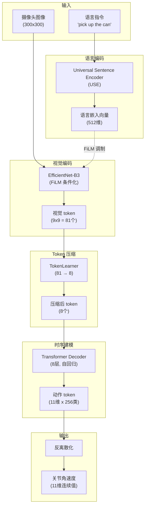
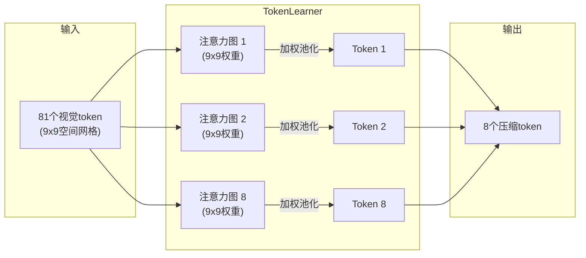

# Ch11: 端到端 VLA (I)——RT-1 / RT-2，把动作变成 token

> Part 3: 核心主线精读
> 前置章节：[Ch10: 高层规划——SayCan / Code-as-Policies / Inner Monologue](ch10-planning.md)
> 后续章节：[Ch12: 端到端 VLA (II)——OpenVLA / VLAS / MLA，开源与扩展](ch12-openvla-vlas-mla.md)

---

在 [Ch10](ch10-planning.md) 中，我们看到了三种让 LLM 指挥机器人的方案——SayCan 从菜单里选、Code-as-Policies 写代码、Inner Monologue 边做边调。它们都属于"模块化流水线"：LLM 负责想，机器人负责干，中间隔着一层文本接口。这条路走通了，但也走到了一个瓶颈——**文字无法承载物理世界的全部细节**。

本章和下一章（Ch12）一起讲述一个根本性的范式转换：与其让 LLM 隔着文本接口"遥控"机器人，不如训练一个**直接从像素到动作的统一模型**——VLA（Vision-Language-Action）。RT-1 证明了这条路可行；RT-2 证明了预训练 VLM 的知识可以直接迁移到机器人控制中。两篇论文加在一起，定义了后续整个端到端具身智能的研究框架。

**本章定位**：读完本章，你应该能够：

- 画出 RT-1 的完整架构图，标注 FiLM-EfficientNet / TokenLearner / Transformer 的角色
- 解释"动作 token 化"为什么是连接 Transformer 和机器人控制的关键桥梁
- 写出 RT-2 的核心公式：VLM + action tokens = VLA
- 说出 co-fine-tuning 为什么能让 VLM 在学会控制机器人的同时不丧失网络知识
- 用具体数字对比 RT-1 和 RT-2 在泛化能力上的差距，并解释差距的来源
- 判断一个新的 VLA 论文在 RT-1→RT-2 的谱系上处于什么位置

---

## 1. 从"遥控指挥"到"亲自下场"

> **一句话预告**：RT-1 证明了"动作可以是 token"，RT-2 证明了"已有 VLM 的知识可以直接迁移到动作生成中"。两者合在一起，定义了 VLA（Vision-Language-Action）这个新范式。

### 1.1 CEO 的两种管理方式

想象一家工厂。以前的管理方式是这样的：CEO 坐在办公室里，通过电话遥控车间——"把红色零件从 A 区搬到 B 区""用三号扳手拧紧 C 位置的螺栓"。CEO 学识渊博、判断力强，但他不在现场。他看不到 A 区堆了一堆杂物导致红色零件被遮住了，他不知道三号扳手的手柄已经松了。每一条指令都要先翻译成车间工人能听懂的话，工人再翻译成肢体动作。**两道翻译，两次信息损失。**

这就是 [Ch10](ch10-planning.md) 中 SayCan / Code-as-Policies / Inner Monologue 的工作模式：LLM 是 CEO，通过文本下达指令；底层控制器是工人，将指令翻译为电机信号。CEO 有判断力但看不到现场；工人在现场但没有全局判断力。

现在换一种管理方式：CEO 直接走进车间，亲自操作机器。他能看到零件的位置、感受到扳手的阻力、观察到意外状况并即时调整。**没有翻译环节，信息直达。** 当然，CEO 亲自下场也有代价——他不能同时在办公室做宏观战略规划（失去了高层抽象的优势）。但对于需要精细操作的任务，亲手干远比遥控靠谱。

这就是端到端 VLA 的思路——一个模型，直接从摄像头画面和语言指令输出关节角度。

### 1.2 "遥控"模式的瓶颈

为什么 CEO 要亲自下场？因为电话（文本接口）有三个硬伤：

**第一，带宽不够。** 物理世界的信息是高维连续的——物体的精确位姿、表面材质、接触力度、运动轨迹。把这些压缩成一句"把杯子放到桌子左边"，丢失了绝大部分信息。杯子有多重？桌面有多滑？左边多左？这些决定了动作的每一个细节，但文本无法表达。

**第二，闭环太慢。** SayCan 做一次规划需要调用 LLM 一次，整个长任务需要反复调用。每次调用的延迟加上文本解析的开销，使得系统只能在"宏动作"层面做决策——"拿起杯子""移动到桌子"。如果杯子在拿起过程中打滑了呢？等 LLM 反应过来再给新指令，杯子早就碎了。

**第三，技能上限受限于预设。** SayCan 需要一套预先训练好的原子技能（"拿""放""移动"）；Code-as-Policies 需要一套预定义的 API 函数。如果任务需要一个从未预设过的动作——比如"用筷子夹起一粒花生"——模块化系统就束手无策了。你不可能为每一种可能的动作都预训练一个底层技能——物理世界的动作空间是无限的。

而端到端模型天然没有这个限制。它不需要"预设技能清单"——给它足够多样的演示数据，它就能生成任意连续动作组合。动作空间的表达能力只受限于离散化精度（256 个 bin 足以覆盖大多数机器人任务的精度需求）。

### 1.3 本章的主角

RT-1（2022 年 12 月）和 RT-2（2023 年 7 月）就是 Google（后为 Google DeepMind）对这个瓶颈的回应。它们代表了两步跳跃：

- **RT-1**：证明 Transformer 可以直接做机器人控制——输入图像和语言，输出离散化的关节动作 token。核心贡献是"数据规模 + 动作 token 化 + Transformer"的组合第一次跑通。
- **RT-2**：在 RT-1 的基础上更进一步——不从头训练 Transformer，而是直接拿一个已经"见过世面"的大型 VLM（PaLI-X 55B），教它在回答问题的同时也能输出动作 token。核心贡献是证明了"VLM 的网络知识可以直接转移到机器人控制中"。

从 CLIP 到 LLaVA 再到 RT-2，走的是同一条路线：**把新的模态当作已有架构的自然延伸**。CLIP 对齐了视觉和语言；LLaVA 让 LLM 能"看图说话"；RT-2 让 VLM 能"看图干活"。动作不过是另一种语言。

---

> **检查点 0**：在往下读之前，确认你能回答——
> - [Ch10](ch10-planning.md) 中的三种规划方案（SayCan / CaP / IM）共同的"信息瓶颈"是什么？（所有信息都通过文本传递）
> - 端到端 VLA 要解决的核心问题可以用一句话概括为什么？（把"语言→动作"的翻译消除掉，让模型直接输出动作）
> - 从 [Ch08](ch08-clip.md) CLIP → [Ch09](ch09-blip2-llava.md) LLaVA → RT-2 的演化逻辑是什么？（不断给 Transformer 加新模态）

---

## 2. 问题定义：为什么要端到端？

### 2.1 信息瓶颈的代价

让我们用一个具体场景来感受模块化流水线的信息瓶颈。

你让机器人"把红色马克杯放进洗碗机的上层架子上"。在 SayCan 式的模块化系统中，LLM 规划出的动作序列可能是：

```
1. 找到红色马克杯
2. 拿起红色马克杯
3. 走到洗碗机前
4. 打开洗碗机门
5. 放到上层架子上
6. 关上洗碗机门
```

看起来很合理。但第 5 步隐含了巨大的物理细节：上层架子的间距只有 12 厘米，杯子有多高？把手朝哪个方向才能放进去？架子上已有的餐具挡住了哪些位置？——这些信息在文本层面完全不可见。底层控制器收到的只是一句"放到上层架子上"，剩下全靠它自己的低级技能去解决。如果低级技能训练时从来没遇到过"上层架子已经塞满了盘子"的情况，它就直接失败。

端到端模型没有这个问题。它看到的是完整的图像——杯子的尺寸、架子的间距、已有餐具的位置——然后直接输出"把手臂向左移动 3 厘米、向下倾斜 5 度、慢慢松开夹爪"的连续动作。**信息从像素直接流向电机，中间没有文本翻译的损耗。**

### 2.2 端到端的定义

在本章的语境下，"端到端"（end-to-end）指的是：

```
输入：摄像头图像 + 自然语言指令
  ↓ [单个神经网络]
输出：机器人关节角速度/位移
```

没有中间的"规划文本"环节，没有独立的"感知模块 → 规划模块 → 控制模块"流水线。一个模型吃掉所有原始输入，吐出可以直接发送给电机驱动器的信号。

这并不意味着模型内部没有结构——RT-1 内部有专门的视觉编码器、语言编码器、token 压缩器和 Transformer 解码器。但从训练的角度看，它们被当作一个整体来优化，梯度从动作损失一路回传到图像像素。

### 2.3 端到端的代价

天下没有免费的午餐。端到端的优势是信息无损，代价是：

**数据饥渴。** 模块化系统可以分开收集数据——LLM 用网络文本训练、低级控制器用少量 demo 训练。但端到端模型需要"图像 + 语言 + 动作"三者配对的数据，而这种数据只能通过让真实机器人去执行任务来收集。真实机器人数据的采集速度远慢于爬网页——爬虫一天可以抓取数百万张图文对，但一台机器人一天最多录制几十条完整的任务演示。

**可解释性下降。** 模块化系统中 LLM 的规划是文本，人可以看懂、审查、修正。端到端模型内部的"决策过程"是高维张量运算，不再有自然语言的中间表示（RT-2 的 chain-of-thought 是后来的改进尝试，但并非本质特征）。当机器人做出一个意料之外的动作时，模块化系统可以查看"LLM 输出了什么文本规划"来定位问题出在哪个环节；端到端系统只能说"模型就是这么输出的"。

**安全边界模糊。** SayCan 有 affordance function 做门卫——机器人说"这个我做不到"就不会做。端到端模型没有这种显式的安全门，如果输入一条危险指令，它可能直接执行。在工业部署中，这个问题需要通过外部的安全层（如力矩限制、碰撞检测）来缓解，但这也意味着端到端的"纯粹性"在实践中需要打折扣。

**迁移困难。** 端到端模型把感知、推理、控制全部耦合在同一个网络中。当你换一种机器人硬件（不同的关节数、不同的摄像头位置），整个模型都需要重新训练。模块化系统中，你只需要替换底层控制器，规划层可以复用。

### 2.4 时间线：从 RT-1 到 VLA 生态

理解这条时间线有助于把握演进节奏：

| 时间 | 工作 | 核心贡献 | 状态 |
|------|------|----------|------|
| 2022.12 | RT-1 | 证明 Transformer + 动作 token 化可以做机器人控制 | 闭源 |
| 2023.07 | RT-2 | 证明预训练 VLM 的知识可以迁移到机器人动作输出 | 闭源 |
| 2023.10 | Open X-Embodiment | 跨机器人数据集标准化（22 个实验室联合） | 开源 |
| 2024.06 | OpenVLA | 第一个开源 VLA，用 LLaVA 架构复现 RT-2 思路 | 开源 |
| 2024+ | RT-H, VLAS, pi0 等 | 扩展方向：多模态、更大规模、更多机器人形态 | 混合 |

RT-1 打地基（证明可行），RT-2 盖楼（证明 VLM 预训练有用），OpenVLA 开门（让所有人都能用）。本章聚焦前两者。

### 2.5 VLA 的定义

在正式进入 RT-1 之前，明确定义本章的核心术语——**VLA（Vision-Language-Action model）**：

- **Vision**：以摄像头图像（RGB，有时加深度）作为主要感知输入
- **Language**：以自然语言指令作为任务描述
- **Action**：直接输出低级动作信号（关节角度/速度/力矩），而非高级规划文本

VLA 和 VLM 的区别仅在于输出模态：VLM 输出文字，VLA 输出动作。如果把"动作"视为一种特殊的"语言"（离散 token 序列），那 VLA 就是 VLM 的自然延伸。这个视角是理解 RT-2 整篇论文的钥匙。

与之对比，[Ch10](ch10-planning.md) 中的 SayCan/CaP/IM 系统可以称为"VLM + separate policy"——VLM 只负责语言和视觉层面的推理，动作执行交给独立的策略网络。VLA 把这两者合成了一个模型。

注意区分几个容易混淆的术语：VLM（Vision-Language Model）只处理视觉和语言，不输出动作；VLA（Vision-Language-Action Model）在 VLM 基础上增加了动作输出；而 LLM（Large Language Model）只处理纯文本。它们的关系是 LLM ⊂ VLM ⊂ VLA（每一步都是在前一步的基础上添加新模态）。

---

## 3. RT-1 深度剖析

### 3.1 设计哲学："数据第一，架构第二"

RT-1 的论文标题是 *Robotics Transformer for Real-World Control at Scale*，关键词是 **at Scale**。作者们做出的最核心判断不是"用什么架构"，而是"先把数据搞大"。

这个判断的背景是：2022 年之前，机器人学习领域的主流做法是"精心设计一个巧妙的算法，然后在十几个 demo 上验证"。这些算法可能用了 meta-learning（元学习）、用了 model-based RL（基于模型的强化学习）、用了各种花哨的数据增强——论文里效果惊艳，一到真实环境就崩。为什么？因为十几个 demo 只覆盖了真实世界极小的一角；一旦机器人遇到训练时没见过的情况（不同光照、不同物体摆放、不同干扰物），精巧的算法就失效了。

RT-1 团队的假设是：**与其在小数据上做算法创新，不如在大数据上用一个"足够好"的架构。** 这和 NLP 领域的经验高度一致——BERT、GPT 的架构并不比之前的 LSTM 复杂多少，但它们的训练数据规模大了几个数量级，结果碾压了一切精巧的小模型。

他们为此投入了巨大的工程资源：

- **130,000 条演示轨迹**——每条包含一个完整的任务执行（从开始到完成）
- **17 个月的数据采集周期**——不是一两周的实验室冲刺，而是近一年半的持续运营
- **13 台机器人同时采集**——工业化的数据流水线
- **700+ 种不同的任务指令**——覆盖厨房环境中的各种操作（拿、放、推、拉、开、关等）

为什么 700+ 种任务比 13 万条数据更重要？RT-1 论文中有一个核心实验：把**任务多样性翻倍**的效果和**每种任务的数据量翻倍**的效果做对比。结论是——**任务多样性翻倍带来的泛化提升，远超数据量翻倍**。

用日常类比：你让一个厨师学 700 道菜各做一遍，比让他学 350 道菜各做两遍，更能应对没见过的新菜。学过煎、炒、炸、蒸、烤各一次，就能推理出"煎蛋"和"炒蛋"的区别；但如果你只学过煎和炒，各练十遍也猜不出"蒸"是什么。

这个发现对后续 VLA 研究有深远影响——它意味着数据采集的策略比数据采集的数量更重要。与其让一台机器人反复做同一个任务，不如让它尝试尽可能多种不同的任务。这个原则后来被 Open X-Embodiment 数据集继承——它汇聚了来自 22 个不同实验室、涵盖上千种任务的数据。

### 3.2 动作 Token 化：从连续到离散

这是 RT-1 最核心的设计决策，也是理解整个 VLA 领域的钥匙。

**问题：** Transformer 天生是为离散 token 设计的——文本是一个个词（token），图像被切成一个个 patch（也是 token）。整个架构的核心操作——softmax 注意力 + 交叉熵损失——都假设输出空间是有限且离散的。但机器人动作是连续值：关节角度可以是 23.456 度、末端速度可以是 0.12 m/s。怎么让一个为离散世界设计的架构处理连续动作？

**答案：离散化（discretization）。** 把每个连续维度的值域均匀切成 256 个格子（bin），然后动作的每个维度就变成了一个"从 0 到 255 之间选一个数"的分类问题。每个 bin 对应一个连续值区间——比如关节角度的第 128 个 bin 可能对应 [-0.02, 0.02] 弧度的范围。

具体来说，RT-1 的动作空间是 **11 维**的：

| 维度 | 含义 | 说明 |
|------|------|------|
| 1-7 | 机械臂 7 个关节的角速度 | 控制手臂的姿态和位置 |
| 8-10 | 底盘的 x/y 平移 + 旋转 | 控制整个机器人在地面上的移动 |
| 11 | 终止标志 | 模型认为任务完成时输出"停止" |

每一维被离散化为 256 个 bin。所以一个时间步的动作就是 **11 个分类问题**，每个问题有 256 个选项。

类比：这就像钢琴上的琴键。人的手指可以按在琴键之间的任意位置（连续），但钢琴把频率离散化成了 88 个键。你失去了微妙的频率精度，但换来了巨大的好处——乐谱可以被简洁地记录和传播。RT-1 做的就是这件事：把连续动作"量化"成离散 token，这样 Transformer 就能像生成文字一样生成动作。

**为什么分类比回归好？** 这是一个关键的技术细节。把动作预测做成分类（softmax over 256 bins），而不是回归（直接预测一个浮点数），有两个核心优势：

1. **多模态分布**：当有多种"正确"动作时（比如杯子可以从左边绕过去拿，也可以从右边绕过去拿），分类模型可以给两个 bin 都赋予高概率（双峰分布）。回归模型只能输出一个平均值——可能是两条路径的中间，撞到杯子上。

2. **梯度更稳定**：分类的交叉熵损失在训练初期提供的梯度信号比回归的 MSE 损失更强且更稳定，模型更容易收敛。

### 3.3 架构拆解

RT-1 的架构并不追求新颖性——它是把几个成熟组件"拼"在一起的实用方案。下面是完整的数据流：



让我们逐个组件拆解：

**Universal Sentence Encoder (USE)**：这是 Google 的一个轻量级句子编码器，把任意长度的英文句子变成一个 512 维的向量。在 RT-1 中它是冻结的（不参与训练），纯粹用来把语言指令变成一个固定长度的条件信号。

为什么不用更好的语言模型（比如 BERT 或 T5）？因为 RT-1 的设计哲学是"简单够用就好"——USE 够小、够快，在语言理解层面对机器人任务来说已经足够（指令都是短句如"pick up the red can"）。这是一个务实的工程选择。

**FiLM-conditioned EfficientNet-B3**：这是视觉编码器，但它不是一个普通的图像分类网络。FiLM（Feature-wise Linear Modulation）是一种条件化技术——它让语言嵌入可以在 EfficientNet 的每一层对视觉特征做缩放和偏移。

类比：想象你戴着一副有色眼镜看图片。如果指令是"找红色的杯子"，你的眼镜会自动变成一副"增强红色"的滤镜，让红色物体在你的视野中更突出。FiLM 做的就是这件事——根据语言指令，动态调整视觉编码器"关注什么"。

数学上：对 EfficientNet 第 $l$ 层的特征图 $\mathbf{h}_l$，FiLM 施加变换 $\hat{\mathbf{h}}_l = \gamma_l \odot \mathbf{h}_l + \beta_l$，其中 $\gamma_l$ 和 $\beta_l$ 由语言嵌入通过一个小 MLP 生成。

EfficientNet 输出的特征图空间尺寸为 $9 \times 9$，即 81 个空间位置，每个位置是一个高维向量。这 81 个向量就是 81 个"视觉 token"。

**TokenLearner**：这是 RT-1 中最关键的效率组件。问题是：如果每一帧图像产生 81 个 token，再加上多帧历史（RT-1 用 6 帧），Transformer 的输入就是 $81 \times 6 = 486$ 个 token——对实时控制来说太多了（Transformer 的计算量是 token 数的平方）。

TokenLearner 的解决方案：学习 8 个"注意力图"，每个注意力图是 $9 \times 9$ 的空间权重矩阵，用它对 81 个视觉 token 做加权池化，得到 8 个"超级 token"。这 8 个 token 每一个都"总结"了图像的一个方面。

直觉上：81 个 token 是图像的"完整描述"，像一份逐字逐句的会议记录；8 个 token 是"精炼摘要"，像只保留 8 条关键结论。TokenLearner 学习的就是"什么值得保留"。

和 [Ch09](ch09-blip2-llava.md) 中 BLIP-2 的 Q-Former 对比：两者都在做"视觉 token 压缩"，但方法不同。Q-Former 用交叉注意力让可学习查询去"问"视觉 token；TokenLearner 用空间注意力做加权池化。Q-Former 压缩到 32 个 token，TokenLearner 压缩到 8 个——因为机器人控制对延迟极其敏感，需要更激进的压缩。

**Transformer Decoder**：最终，8 个压缩后的 token（乘以 6 帧历史 = 48 个 token）进入一个 8 层的 Transformer Decoder。它以自回归方式输出 11 个动作维度的类别概率。

### 3.4 训练方式：行为克隆

RT-1 的训练方式出人意料地简单——**纯行为克隆（Behavior Cloning, BC）**。

什么是行为克隆？直觉上：你给模型看一大堆"人类怎么做"的录像，模型学着照做。在数学上就是监督学习——输入是（图像，语言指令），标签是"人类在这个情况下实际执行的动作"，损失函数是交叉熵（因为动作被离散化成了分类问题）。

```
损失 = -sum_{d=1}^{11} log P(a_d = a_d^* | image, instruction)
```

其中 $a_d^*$ 是第 $d$ 个动作维度的真实 bin 编号，$P(a_d = a_d^*)$ 是模型预测该 bin 的概率。

为什么行为克隆"够用"？在强化学习（RL）领域，行为克隆被认为是一种"不够好"的方法——它无法超越演示者的水平，也容易因为分布偏移（distributional shift）而在长时间运行中累积误差。但 RT-1 团队的核心论点是：**当数据足够多、足够多样时，行为克隆的这些缺点会被大幅缓解。** 13 万条轨迹覆盖了足够多的初始状态和中间状态，使得模型在推理时遇到的状态大概率在训练分布之内。

这里有一个深刻的洞察：NLP 领域的 GPT 系列本质上也是"行为克隆"——它克隆的是人类写文本时的"token 选择行为"。GPT 能工作，是因为训练数据足够多样、覆盖了绝大多数语言使用场景。RT-1 把同样的逻辑搬到了机器人领域：只要 demo 够多够多样，行为克隆就是一个足够强的基线。

**推理时的工作流程**：训练完成后，RT-1 在部署时的工作方式如下：

1. 接收当前帧的摄像头图像（300x300 RGB）
2. 接收语言指令（如"pick up the red can"）
3. 通过 EfficientNet 提取视觉特征（81 个 token）
4. 通过 TokenLearner 压缩为 8 个 token
5. 结合最近 6 帧的历史 token（共 48 个），送入 Transformer
6. Transformer 输出 11 个动作维度的类别概率分布
7. 对每个维度取 argmax（或按概率采样），得到 11 个 bin 编号
8. 将 bin 编号反映射为连续动作值，发送给电机驱动器
9. 以 3Hz 频率重复以上步骤

整个流程中没有"规划"环节——模型不会输出"我要先走到桌子旁边再伸手"这样的中间文本。它只是在每个时间步根据当前观察做出下一个动作决策，就像人的条件反射一样直接。

### 3.5 关键实验结果

RT-1 的实验设计非常有说服力，因为它不只验证了"能不能工作"，还回答了"为什么能工作"以及"什么条件下更好"。

**基础性能**：

| 评估维度 | 成功率 | 含义 |
|----------|--------|------|
| 已见任务 | 97% | 训练集中出现过的指令 |
| 未见指令 | 76% | 训练集中没出现过的指令组合（如"move the blue chip bag near the orange"） |
| 干扰鲁棒性 | 83% | 背景中放入了训练时不存在的干扰物体 |

97% 的已见任务成功率说明模型确实学会了执行动作；76% 的未见指令成功率说明模型学会了语言组合泛化——它能理解"move X near Y"的结构，即使具体的 X 和 Y 组合从没见过；83% 的干扰鲁棒性说明模型不是在"背模式"而是真的在看图理解。

**仿真数据增益**：

这是一个非常实用的发现。在某些任务上：
- 只用真实数据：50% 成功率
- 真实数据 + 仿真数据：97% 成功率（+47 个百分点）

在整体评估中，仿真数据的加入带来了高达 **+64 个百分点**的提升（针对可仿真迁移的任务子集）。这意味着仿真环境中的廉价数据可以和真实数据形成互补——仿真提供数量和多样性，真实数据提供物理真实性。

**多样性 vs 数量实验**：

这可能是全文最重要的实验：

- 实验组 A：任务多样性 x2（从 N 种任务扩展到 2N 种，每种任务的数据量不变）
- 实验组 B：数据量 x2（保持 N 种任务，每种任务的数据量翻倍）

结果：**实验组 A 的泛化能力显著优于实验组 B**。这验证了"数据多样性比数据数量更重要"的直觉。

类比：你准备高考英语阅读。做 700 篇不同话题的阅读理解各一遍，比做 350 个话题各两遍更有用——因为高考考的是你没见过的文章。

**长时任务**：

RT-1 还在最长 50 步的长时任务上测试，成功率 67%。这说明行为克隆在足够数据支持下，即使是需要多步规划的任务也能应对。不过 67% 相比单步任务的 97% 有明显下降，暴露了开环执行（没有错误恢复机制）在长链中误差累积的问题。

简单的数学可以解释这个下降：如果每步的成功率是 97%，那 50 步全部成功的概率是 $0.97^{50} \approx 22\%$。实际测得 67% 远高于这个理论值——说明模型在某种程度上学会了"自我修正"：即使某一步偏离了最优轨迹，后续步骤可以把它拉回来。这种隐式的鲁棒性来自于数据中包含了各种"次优状态"的应对方式。

### 3.6 TokenLearner 技术细节

TokenLearner 值得更深入理解，因为它代表了一类关键的设计模式——"如何在保持信息量的前提下降低计算量"。

**问题的严重性**：

假设没有 TokenLearner，RT-1 的 Transformer 需要处理：
- 6 帧历史 x 81 tokens/帧 = 486 个 token
- 自注意力计算量 = $O(486^2) \approx 236,000$ 次注意力操作

加上 TokenLearner 后：
- 6 帧 x 8 tokens/帧 = 48 个 token
- 自注意力计算量 = $O(48^2) = 2,304$ 次注意力操作

**计算量降低了 100 倍**。这是 RT-1 能在 3Hz 频率下实时运行的关键。

**TokenLearner 的工作原理**：



每个"注意力图"是一个可学习的空间选择器：它学习在 $9 \times 9$ 的空间网格上关注哪些位置。比如注意力图 1 可能学会关注"机械手附近的区域"，注意力图 2 可能关注"目标物体所在的区域"，注意力图 3 可能关注"可能碰撞的障碍物"。

和 BLIP-2 Q-Former 的对比（回顾 [Ch09](ch09-blip2-llava.md)）：

| 维度 | Q-Former (BLIP-2) | TokenLearner (RT-1) |
|------|-------------------|---------------------|
| 压缩比 | 数百 → 32 | 81 → 8 |
| 方法 | 交叉注意力 + 可学习查询 | 空间注意力 + 加权池化 |
| 输入类型 | 冻结 ViT 的输出 | FiLM-EfficientNet 的特征图 |
| 压缩目标 | 保留回答视觉问题所需信息 | 保留控制机器人所需信息 |
| 训练方式 | 两阶段预训练 | 端到端联合训练 |

核心区别在于目标不同：Q-Former 为"回答问题"服务，需要保留语义信息；TokenLearner 为"控制动作"服务，需要保留空间关系和几何信息。

### 3.7 局限性

RT-1 的突破毋庸置疑，但它也留下了明确的局限，直接催生了 RT-2：

**控制频率太低（3Hz）**：每秒只能做 3 个决策。对于"把杯子从桌子搬到架子上"这种大动作来说够用，但对于"用筷子夹花生""拧开一个紧的瓶盖"这种需要精细力控的任务来说远远不够——人手做精细操作的控制频率通常在 10-30Hz。3Hz 意味着每个决策之间有 333 毫秒的间隔——在这段时间里物体可能已经滑落、位置已经变化。这是一个根本性的限制，不只是"跑得更快"就能解决的——需要更高效的架构设计。

**环境局限**：所有数据都在同一种厨房环境中采集（Google 办公室的测试厨房）。换一个厨房——不同的灯光、不同的桌面颜色、不同的物体——性能会显著下降。这是"数据驱动"方法的固有代价：模型只能在训练分布覆盖的范围内工作。你在 Google 厨房训练的模型不会自动适应你家的厨房，就像一个只在北京学过开车的人不能直接在伦敦左侧通行的道路上开车。

**没有利用预训练 VLM**：RT-1 的视觉编码器（EfficientNet）和语言编码器（USE）都是相对小的模型，从头在机器人数据上训练。这意味着它完全没有利用 CLIP、PaLI、GPT 这些大模型在互联网规模数据上学到的"世界知识"。一个从没在网上见过"Taylor Swift 的手办"的模型，当然不可能理解"把 Taylor Swift 的手办拿起来"这种指令。

**开环执行**：RT-1 在每个时间步独立决策，没有显式的错误检测和恢复机制。一旦某一步做错了（比如没抓稳物体），后续步骤不会自动调整——它只是继续按照"当前图像 + 原始指令"来做决策，可能重复错误。

**数据采集成本**：17 个月、13 台机器人——这种数据采集规模对绝大多数研究实验室来说是不可复制的。只有 Google 这种量级的公司才负担得起。一台机器人加上操作员的人工费，一年的数据采集成本可能在百万美元级别。这也是为什么后续社区（Open X-Embodiment）会尝试把多个实验室的数据汇聚起来——"众筹"数据集来解决单一团队数据不足的问题。

这些局限性可以归结为一句话：**RT-1 证明了端到端 VLA 可行，但它是一个"封闭世界"的解——只在见过的厨房里、对见过的物体、执行见过的任务才好用。** 要打破这个封闭世界，需要引入外部知识。而互联网上数十亿张图片和数十亿段文本中蕴含的知识，恰好是最大的外部知识来源——这就是 RT-2 的出发点。

如果用一张图概括 RT-1 的位置：

```
数据规模 ──→ [RT-1: 13万条demo, 700+任务] ──→ 还不够，还需要网络知识
架构选择 ──→ [RT-1: Transformer + 动作token化] ──→ 验证可行
泛化能力 ──→ [RT-1: 同分布内优秀, 分布外有限] ──→ 需要预训练VLM补上
```

---

## 4. RT-2 深度剖析

> **一句话定位**：如果说 RT-1 证明了"Transformer + 动作 token 可以控制机器人"，那 RT-2 证明了"你甚至不需要从头训练这个 Transformer——直接拿一个现成的 VLM 就行"。

### 4.1 核心洞察："动作不过是另一种语言"

RT-2 的整篇论文可以浓缩为一个洞察：

> **如果动作被表示为 token，那么"输出动作"和"输出文字"在架构上完全没有区别。既然 VLM 已经学会了看图回答问题（输出文字 token），那它应该也能看图执行任务（输出动作 token）。**

让我们用 [Ch09](ch09-blip2-llava.md) 中 LLaVA 的例子来理解这个洞察：

LLaVA 的工作方式是：给 LLM 看一张图片，问"图片里有什么？"，LLM 生成文字回答"一只橙色的猫坐在沙发上"。

RT-2 的工作方式几乎一模一样：给 VLM 看一张机器人视角的图片，问"机器人应该执行什么动作来拿起红色罐子？"，VLM 生成"回答"——"1 128 91 241 5 101 127 1"。

区别仅仅在于：LLaVA 输出的 token 是人类能读懂的自然语言；RT-2 输出的 token 是需要解码为关节角度的数字。但从模型内部的计算角度看，**生成"128"和生成"猫"没有任何本质区别——都是从词汇表中选一个 token。**

把这个逻辑再推一步：如果 VLM 可以从图片生成诗歌（文字 token），那为什么不能从图片生成动作（数字 token）？如果 VLM 可以回答"图片里红色物体的位置在哪？"（空间理解），那为什么不能回答"为了拿到红色物体，机械臂应该往哪个方向移动？"（动作决策）？**动作决策本质上就是一种以物理世界为约束的"回答问题"。**

这个洞察的力量在于：你不需要发明新架构。只需要把动作定义成文本 token，然后用已有的 VLM 训练流程（fine-tuning）就能教会模型"说"动作。

### 4.2 动作 Token 化 2.0：文本格式的动作

RT-1 用的是特殊 token——在 Transformer 的词汇表中新增了一组"动作专用 token"。RT-2 做了一个更简洁的选择：**直接用已有的文本数字 token 来表示动作。**

具体来说，RT-2 的动作表示如下：

- 动作维度：8 维（比 RT-1 的 11 维少，因为去掉了一些冗余维度）
- 每维离散化为 256 个 bin，编号 0-255
- 一个时间步的动作 = 8 个数字，用空格分隔

举例：如果当前时间步机器人需要"手臂向前伸一点、夹爪稍微张开"，模型输出的 token 序列是：

```
1 128 91 241 5 101 127 1
```

这 8 个数字会被解码为 8 个连续的动作值——前 7 维对应关节角速度和末端位移，第 8 维对应终止概率。

**VQA 格式对齐**：为了让动作输出和 VLM 已有的能力完美对齐，RT-2 把机器人控制包装成了一个 VQA（Visual Question Answering）问题：

```
输入图像：[机器人当前视角的照片]
问题："What action should the robot take to [pick up the red can]?"
回答："1 128 91 241 5 101 127 1"
```

从 VLM 的角度看，这和"图片里有几只猫？""3"完全是同一种任务格式。VLM 已经非常擅长根据图像回答数字了——RT-2 只是让它回答的数字恰好代表关节角度。

**对比 RT-1 的 token 化方案**：

| 维度 | RT-1 | RT-2 |
|------|------|------|
| Token 类型 | 新增的专用 token | 已有的文本数字 token |
| 动作维度 | 11 维 x 256 bin | 8 维 x 256 bin |
| 输出格式 | 多头分类 | 自回归文本生成 |
| 是否需要修改词汇表 | 是 | 否 |
| 是否兼容预训练 | 否（全新 token 没有预训练表示） | 是（数字 token 已有含义） |

RT-2 方案的优雅之处在于：它完全不需要修改 VLM 的架构。同一个模型，用同样的推理代码，既能回答"图片里是什么动物？"（输出"cat"），也能执行"拿起那个红色罐子"（输出"1 128 91 241 5 101 127 1"）。

### 4.3 VLM 底座

RT-2 测试了两个 VLM 底座：

**PaLI-X 55B**：
- 视觉编码器：ViT-22B（220 亿参数的 Vision Transformer）
- 语言模型：UL2 32B（320 亿参数的编码器-解码器语言模型）
- 总参数量：约 550 亿
- 能力：多语言图像描述、VQA、OCR 等

**PaLM-E 12B**：
- 基于 PaLM（语言模型）+ ViT（视觉编码器）
- 总参数量：约 120 亿
- 设计时就考虑了具身场景（embodied），在训练数据中包含了一些机器人相关的多模态数据

为什么选这两个？因为它们已经通过大规模互联网数据的训练，建立了对视觉世界的广泛理解。PaLI-X 见过数十亿张图片——它知道"Taylor Swift"长什么样、"恐龙"是什么形状、"海绵宝宝"是黄色的。这些知识存储在它数百亿的参数中，只需要通过 fine-tuning 把它们"激活"并连接到动作输出上。

一个有趣的对比：RT-1 的整个模型约 35M 参数（3500 万），而 RT-2 的 VLM 底座是 55B（550 亿）——**参数量差了近 1600 倍**。这个数量级的差距不只是"更大"那么简单。在 NLP 领域，研究者发现模型参数量突破某个阈值后，会出现质变式的"涌现能力"——小模型完全不会做的事，大模型突然就会了。RT-2 把这个规律从语言领域搬到了机器人领域：只有 55B 级别的模型才能"知道"Taylor Swift 长什么样，5B 的模型可能只有模糊的印象，35M 的模型（RT-1）完全没有这个概念。

类比：RT-1 像一个从零开始学做饭的人——你得一道菜一道菜地教，他只会做你教过的菜。RT-2 像一个已经读过全世界所有菜谱、看过所有美食节目的人——你只需要让他进一次厨房练练手，他就能做出你没教过的新菜。他的"菜谱知识"就是 VLM 从互联网学到的视觉-语言知识。

这里还有一个架构层面的要点。回顾 [Ch09](ch09-blip2-llava.md) 中我们讨论过的 VLM 两大路线——"复杂桥"（BLIP-2 风格，有 Q-Former 做压缩）和"简单桥"（LLaVA 风格，直接线性投射）。RT-2 的 PaLI-X 属于前者——它有一套复杂的视觉-语言融合机制。而后来的 OpenVLA（Ch12）则选择了 LLaVA 的"简单桥"路线。两种选择各有 trade-off：复杂桥效果上限可能更高，但训练门槛也更高、开源复现更困难。

### 4.4 Co-Fine-Tuning：保持网络知识

这是 RT-2 论文中最重要的工程经验之一。

**问题：灾难性遗忘。** 如果你只用机器人数据去 fine-tune PaLI-X，模型会迅速"忘掉"它从互联网上学到的所有知识。这就像让一个百科全书式的学者去流水线上拧螺丝——拧了三个月螺丝后，他连自己的专业知识都忘了。

**解决方案：Co-Fine-Tuning（混合微调）。** 在 fine-tuning 阶段，每个 batch 中不只放机器人数据，还混入一定比例的原始 VQA 数据（互联网图文问答）。

```
训练 Batch = 机器人数据（图像→动作）+ 网络 VQA 数据（图像→文字回答）
```

这就像让那位学者一边学拧螺丝，一边每天抽时间读学术论文保持专业知识。两种数据同时训练，防止模型在获得新能力（动作输出）的同时丧失旧能力（视觉理解）。

**Co-fine-tuning 的效果有多重要？**

| 训练方式 | 泛化到新物体 | 涌现语义能力 |
|----------|-------------|-------------|
| 从头训练（不用预训练 VLM） | 9% | - |
| 只用机器人数据 fine-tune | 51% | 49% |
| Co-fine-tuning（机器人 + VQA） | **62%** | **60%** |

三个关键对比：

1. **从头训练 vs 预训练 fine-tune**：9% vs 51%。VLM 预训练的知识是"根基"，没有它几乎不可能泛化。9% 的成功率几乎等于随机瞎抓——证明了光靠 13 万条机器人数据是不够的。
2. **Robot-only vs Co-fine-tuning**：51% vs 62%（+11 点）。混入 VQA 数据确实能防止遗忘。11 个百分点听起来不多，但在机器人领域这是非常显著的提升。
3. **涌现能力**：只有 co-fine-tuning 才能稳定触发涌现能力（60%）——因为这些能力恰恰来自 VLM 保留下来的网络知识。如果 robot-only fine-tuning 让模型忘掉了"Taylor Swift 长什么样"，那涌现能力自然就消失了。

Co-fine-tuning 的实现细节相对简单：每个训练 batch 按一定比例混合两种数据。比例的选择需要平衡——机器人数据比例太低则动作学不好，太高则网络知识被覆盖。论文没有公开具体比例，但从结果来看，这个超参数对最终性能有不可忽视的影响。

### 4.5 涌现能力

"涌现能力"（emergent capabilities）是 RT-2 论文最引人注目的部分。它指的是模型展现出**从未在机器人数据中训练过、但 VLM 从互联网中"认识"的能力**。

**案例 1：识别新物体**

指令："Pick up the Taylor Swift figure"

RT-1 的反应：完全不知道"Taylor Swift figure"是什么——它的训练数据里没有这个物体。即使桌上放着一个 Taylor Swift 的手办，RT-1 也无法建立"Taylor Swift figure"和那个具体物体之间的对应关系。成功率接近 0。

RT-2 的反应：PaLI-X 在互联网数据中见过无数张 Taylor Swift 的照片。它知道 Taylor Swift 长什么样，因此可以在机器人视角的图片中识别出那个手办，并执行抓取动作。

**案例 2：视觉概念推理**

指令："Move the banana to the dinosaur"

桌上放着一根真香蕉和一个恐龙玩具。RT-1 如果训练数据中从没出现过"恐龙玩具"，就无法完成。RT-2 从网络数据中知道"恐龙"的视觉概念，可以识别桌上的恐龙玩具并将香蕉移过去。

**案例 3：语义类别推理**

指令："Pick up something that is not a fruit"

桌上有苹果、香蕉和一个塑料瓶。RT-2 需要先理解"苹果和香蕉是水果，塑料瓶不是水果"，然后选择抓取塑料瓶。这种逻辑推理能力完全来自 VLM 的语言理解——机器人数据中从未出现过"is not a fruit"这样的否定逻辑指令。

**案例 4：Chain-of-Thought**

RT-2 甚至展示了 chain-of-thought 推理的能力：当问它要执行某个任务时，它可以先输出一段"思考过程"（文字），然后再输出动作 token：

```
输入："What action should the robot take to pick up the object that is not a fruit?"
输出："I see a red apple, a banana, and a water bottle on the table.
       The apple and banana are fruits. The water bottle is not a fruit.
       I should pick up the water bottle.
       1 134 88 220 12 99 130 1"
```

这展示了 VLM 的推理能力可以和动作生成无缝结合——先想后做，就像人在动手前的"内心独白"。

值得注意的是，chain-of-thought 在 RT-2 中不是强制的——它是一种"涌现"行为。研究者发现，在某些需要推理的任务中，让模型先输出思考再输出动作会提高成功率；但对于简单的直觉型任务（"拿起面前的杯子"），直接输出动作反而更快更准。这和人的行为模式一致——简单动作靠肌肉记忆（不需要思考），复杂决策才需要"想一想"。

**涌现能力的根本来源**：这些能力不是"从机器人数据中学到的"——机器人数据中从来没出现过 Taylor Swift 的手办或"不是水果的东西"这种概念。它们完全来自 VLM 在互联网数据上的预训练。Co-fine-tuning 的作用是保持这些知识不被遗忘（第 4.4 节），同时建立从"知识"到"动作"的映射。这证明了一个重要的命题：**视觉-语言理解能力可以跨模态迁移到物理控制中**。

### 4.6 关键数字

汇总 RT-2 的核心量化结果：

| 指标 | RT-2 | RT-1 | 对比 |
|------|------|------|------|
| 新物体识别 | 62% | 32% | +30pp |
| 涌现语义泛化 | 60% | 17% | +43pp |
| Co-fine-tuning 增益 | - | - | +11pp（vs robot-only） |
| 从头训练基线 | 9% | - | 证明预训练必要性 |

**模型规模的影响**：

| 模型 | 参数量 | 涌现任务成功率 |
|------|--------|----------------|
| RT-2 (PaLI-X) | 55B | 62% |
| RT-2 (5B 变体) | 5B | ~42% |
| 差距 | - | 约 20pp |

55B 模型在涌现任务上领先小模型约 20 个百分点。这验证了大语言模型领域的经典规律：**模型越大，涌现能力越强**。对于需要"调用网络知识"来完成的任务（识别没见过的物体、理解抽象概念），参数量是直接的瓶颈——小模型根本没有"记住"足够多互联网知识的容量。

### 4.7 局限性

RT-2 在 RT-1 基础上取得了巨大进步，但也带来了新的问题：

**部署架构沉重**：55B 参数的模型无法在机器人本体上运行——没有任何现有的边缘计算设备能装下这么大的模型。以 FP16 精度存储 55B 参数需要约 110GB 显存，而目前最强的边缘 GPU（如 Jetson Orin）只有 32-64GB。RT-2 的实际部署方式是：机器人把摄像头图像通过网络发送到云端 TPU 集群，云端做推理后把动作发回来。这引入了网络延迟——在最好情况下也有几十毫秒，在网络不稳定时可能达到数百毫秒。对于需要快速反应的任务（接住一个掉落的物体），这是致命的。更重要的是，云端依赖意味着机器人断网就"瘫痪"——对于需要在偏远地区或网络不稳定环境中工作的机器人来说，这是不可接受的。

**控制频率依然低（1-3Hz）**：即使不考虑网络延迟，55B 模型的单次推理本身就需要几百毫秒。加上网络传输，实际控制频率在 1-3Hz 之间。这限制了 RT-2 只能做"缓慢、宽容误差"的任务——拿起一个静止的物体没问题，但组装精密零件就不行了。

**硬件绑定**：RT-2 的所有实验都在 Google 的 Everyday Robots 平台上完成——一种单臂移动机器人。模型输出的动作空间是针对这种机器人设计的。换一种机器人形态（比如双臂、或人形机器人），就需要重新定义动作空间、重新收集数据、重新训练。

**闭源**：RT-2 的模型权重、训练数据、训练代码都没有公开。其他研究者只能读论文学方法，无法直接复现或在其基础上改进。这直接催生了 2024 年 OpenVLA 的出现——"如果 Google 不开源，那我们自己从头做一个开源版"（详见 [Ch12](ch12-openvla-vlas-mla.md)）。

**数据仍然稀缺**：虽然 RT-2 通过利用 VLM 预训练大幅提升了泛化能力，但它的 fine-tuning 仍然依赖 RT-1 的那批 13 万条真实机器人数据。对于新的机器人形态、新的任务类型，仍然需要大量真实数据采集——VLM 预训练解决的是"知识"问题（知道什么是恐龙），不是"技能"问题（知道怎么用这只机械手稳定地夹起恐龙玩具）。知识可以从互联网获取，技能只能从物理交互中学习——这个矛盾目前没有完美解。

**缺乏触觉和力觉**：RT-2 只用视觉输入（摄像头图像），没有力传感器反馈。这意味着它无法感知"夹爪是否真正夹住了物体""物体是否正在从手中滑落"。人类做精细操作时大量依赖触觉反馈——闭着眼睛也能拧开瓶盖。VLA 如何整合多种感觉模态（视觉 + 触觉 + 本体感觉），是一个开放的研究方向。

---

## 5. RT-1 vs RT-2 正面对比

在分别深入了解了 RT-1 和 RT-2 之后，让我们把两者放在同一张表里做一个系统对比。这张表不只是"参数罗列"——它讲述了从 2022 年底到 2023 年中，VLA 领域在 7 个月内完成的一次关键跳跃。

把两者放在同一张表里，差异一目了然：

| 维度 | RT-1 | RT-2 |
|------|------|------|
| 发布时间 | 2022.12 | 2023.07 |
| 核心创新 | 动作 token 化 + 大规模行为克隆 | VLM 直接输出动作 token |
| 视觉编码器 | FiLM-EfficientNet (小) | ViT-22B (大) |
| 语言编码器 | USE (小, 冻结) | UL2 32B (大, 可调) |
| 预训练知识 | 几乎没有 | 互联网规模 VQA |
| 动作格式 | 专用 token (11维x256) | 文本数字 (8维x256) |
| 参数量 | ~35M | 55B (PaLI-X 版) |
| 训练数据 | 130K robot demos | 130K robot demos + web VQA |
| 新物体泛化 | 32% | 62% |
| 涌现能力 | 17% | 60% |
| 推理设备 | 本地 TPU | 云端 TPU 集群 |
| 控制频率 | 3Hz | 1-3Hz |
| 开源 | 否 | 否 |

**叙事总结**：RT-1 回答了"Transformer 能不能控制机器人？"（能，只要数据够多）；RT-2 回答了"VLM 的知识能不能迁移到机器人？"（能，只要用 co-fine-tuning）。两者共同建立了 VLA 范式的四条基本原理：

1. **动作是 token** → Transformer 可以生成动作，就像生成文字一样
2. **数据多样性决定泛化能力** → 700 种任务各做少量 demo > 350 种任务各做更多 demo
3. **预训练知识可以跨模态迁移** → 互联网上学到的"什么是恐龙"可以帮助机器人"拿起恐龙玩具"
4. **模型规模正相关于涌现能力** → 55B 能做到的事，5B 做不到，35M 更做不到

这四条原理在后续的 VLA 工作中被反复验证和扩展。OpenVLA（Ch12）验证了原理 1-3 在开源设置下的有效性；pi0 等工作验证了原理 4 在更大规模上的延续性。理解这四条原理，就理解了整个 VLA 领域的基本逻辑。

---

## 6. 从 SayCan 到 RT-2：范式转换

回顾从 [Ch10](ch10-planning.md) 到本章的演进，我们见证了一次范式转换：

**模块化（Ch10）**：
```
用户指令
    ↓
LLM (规划文本: "1.找到杯子 2.拿起杯子 3.放到架子上")
    ↓
底层控制器 (逐条执行, 每条靠预训练的原子技能)
    ↓
机器人
```

**端到端（Ch11）**：
```
用户指令 + 图像
    ↓
VLA (直接输出: "关节1: +5度, 关节2: -3度, ...")
    ↓
机器人
```

这个转换的得与失：

**得到了什么**：

- **涌现能力**：RT-2 能理解"把不是水果的东西拿起来"，SayCan 的预设技能菜单里不可能有这种组合。端到端模型的泛化天花板远高于模块化系统。
- **更简的流水线**：不再需要维护"LLM 规划器 + affordance function + 底层策略"三个独立模块。部署时只有一个模型文件，不用担心模块之间的版本兼容性问题。
- **感知与决策统一**：模型自己决定看什么、怎么做，不存在"感知模块传递了错误信息给规划模块"的级联失败。信息从像素直接流到动作，没有中间的信息瓶颈。

**失去了什么**：

- **可解释性**：SayCan 的每一步规划都是人可读的文本（"先拿起可乐罐，然后走到桌子旁"）。RT-2 内部的决策过程是黑箱（chain-of-thought 是部分补救，但不是本质解决方案）。当机器人做出错误动作时，模块化系统可以定位"是规划错了还是执行错了"；端到端系统只知道"最终结果错了"。
- **安全边界**：SayCan 有 affordance function 做安全门（"这个动作我执行不了"→ 概率归零）。RT-2 可能在被问到危险指令时仍然输出动作。在人机共存的环境中，这个问题的严重性不可低估。
- **模块可替换性**：模块化系统中，你可以单独升级 LLM（换 GPT-3 为 GPT-4）或单独改进底层控制器。端到端系统升级任何一个部分都需要重新训练整个模型——成本高昂且风险大。

回顾 [Ch05](ch05-two-paradigms.md) 中定义的两种范式——"模块化流水线" vs "端到端学习"——RT-1/RT-2 是端到端阵营第一次在真实机器人上交出了有说服力的成绩单。但这不是说模块化就"过时"了——2024-2025 年的很多系统仍在探索两者的混合。

一个更深层的观察：SayCan 和 RT-2 解决的其实是**同一个问题的两面**——如何让"通用知识"和"物理执行"协调起来。SayCan 的方案是在两者之间加一个"可行性过滤器"（affordance function）；RT-2 的方案是把两者融合进同一个模型。哪种更好？取决于你更看重什么——如果安全性和可解释性是第一优先级（如手术机器人），模块化更合适；如果泛化能力和部署简洁性是第一优先级（如通用家庭助手），端到端更有潜力。

未来可能的方向是"端到端为主干、模块化做护栏"——用一个大 VLA 做主要的感知和决策，但在它外面套一层轻量的安全检查模块（如碰撞预测网络、力矩限幅器）。这种混合架构目前还在早期探索阶段，但它代表了一种务实的工程思路：用端到端获取泛化能力，用模块化获取安全保障——两者不必互相排斥。

如果用一句话总结 Ch10 到 Ch11 的范式转换：**Ch10 是"聪明大脑 + 笨手笨脚"，Ch11 是"手脑合一但少了安全感"。** 找到两者的最佳结合点，是 2024-2025 年具身智能领域最活跃的研究方向之一。

---

## 7. 检查点

以下问题覆盖了本章的核心知识点。建议先不看原文，尝试用自己的话回答；答不上来的再回头复习对应小节。

**RT-1 核心概念**：

1. RT-1 的动作空间是几维？每维离散化为多少个 bin？为什么选择离散化而不是直接回归连续值？
2. TokenLearner 把多少个 token 压缩到多少个？如果没有 TokenLearner，计算量会怎样变化？
3. RT-1 论文最重要的数据实验结论是什么？（提示：多样性 vs 数量）
4. RT-1 的训练方式（行为克隆）和 GPT 的训练方式（next token prediction）有什么本质相似性？

**RT-2 核心概念**：

5. RT-2 的动作 token 和 RT-1 的有什么不同？为什么这个区别很重要？
6. 什么是 co-fine-tuning？如果不做 co-fine-tuning 会发生什么？用数字说明。
7. RT-2 的"涌现能力"具体指什么？举两个例子。它们的知识来源是哪里？
8. 为什么模型规模（55B vs 5B）对涌现任务的影响比对常规任务的影响更大？

**跨章关联**：

9. 从 CLIP → LLaVA → RT-2 的演化中，每一步添加了什么新能力？架构上的共同模式是什么？
10. SayCan 的 affordance function 和 RT-2 的 co-fine-tuning 分别解决什么问题？两者有什么深层相似性？（都是在"通用知识"和"物理现实"之间建立桥梁）

**设计思维**：

11. 如果你要设计一个 VLA 给一台全新的机器人（比如一台双臂人形机器人），你会从 RT-1 和 RT-2 中各借鉴什么？你会优先解决什么问题？
12. RT-1 选择用 USE 而不是 BERT/T5 做语言编码器，RT-2 选择用文本数字而不是专用 token 表示动作——这两个"简单化"的选择背后有什么共同的设计哲学？

如果以上 12 个问题你都能清楚回答，说明本章前半部分的核心知识你已经掌握。如果有 3 个以上答不出来，建议回顾对应小节后再继续。

---

## 8. 过渡：从"大模型下场"到"开源生态"

RT-1 和 RT-2 画出了一条清晰的技术路线：动作是 token → Transformer 可以做控制 → VLM 预训练加速泛化。但它们也留下了三个悬而未决的问题，每一个都指向 VLA 范式走向真正实用化之前必须跨越的障碍：

**第一，开放性问题。** RT-1 和 RT-2 都是 Google 的闭源工作。它们的训练数据（13 万条 Everyday Robots 轨迹）不公开、模型权重不公开、甚至连详细的训练超参数都不公开。学术界和产业界的其他团队只能"读论文、猜细节、自己从头做"。一个好的研究方向如果没有开源基础设施，就很难形成生态——回想 NLP 领域，GPT-3 闭源时学术进展缓慢，LLaMA 开源后整个社区爆发了。VLA 领域需要自己的"LLaMA 时刻"。

**第二，通用性问题。** RT-1/RT-2 都绑定在 Google 的 Everyday Robots 硬件上。换一种机器人形态（双臂、人形、四足）、换一种任务领域（工厂组装、医疗辅助、家庭服务），整套方案需要从数据采集开始重来。VLA 范式能不能像 LLM 那样做到"一个基础模型，适配各种下游"？这需要同时解决数据标准化（不同机器人的动作空间不同）和架构通用化（如何让同一个模型适配不同的硬件）两个子问题。

**第三，效率问题。** 55B 参数的云端推理方案在成本和延迟上都不可持续。如果每台家庭机器人都需要持续占用一块云端 TPU，那大规模部署的经济账根本算不过来——假设一台 TPU v4 的云端月租在数千美元级别，那 100 万台家用机器人就意味着每月数十亿美元的推理成本。VLA 需要"瘦身"——在保持泛化能力的前提下大幅压缩模型参数量，使其可以在边缘设备上运行。这和 LLM 领域从 GPT-4 (1.8T) 到 Llama-3 (8B) 的轻量化趋势完全一致。

这三个问题的回答，构成了下一章的主题——OpenVLA 用 LLaVA 架构 + 开源数据集重建了 RT-2 的能力并向社区开放（解决开放性）；VLAS 和 MLA 探索了更大规模和更多形态的扩展方向（解决通用性）；各种蒸馏和量化工作尝试在 7B 甚至更小的模型上做 VLA（解决效率）。从封闭到开放、从单一到通用、从云端到边缘，VLA 范式正在走向成熟。

---

## 9. 动作 Token 化技术深潜

### 为什么要离散化？

先想一个日常场景：你教小朋友画画，说"往右移大约三厘米"。小朋友不会真的拿尺子量 3.000cm——他会在心里把画布分成若干格子，移动"一格半"就够了。这就是离散化的直觉：把连续的数值映射到有限的格子里。

Transformer 的核心运算是 softmax 注意力 + 分类头。它天生擅长的是"从 N 个选项中选一个"（分类），而不是"输出一个精确实数"（回归）。语言模型预测下一个 token 就是在词表 V 中做 |V| 分类。如果我们希望用同样的架构预测机器人动作，最自然的方式就是：把连续动作也变成分类问题。

### 256-bin 的数学

假设某一维动作的范围是 [action_min, action_max]，我们把它均匀切成 256 个格子（bin）：

```
bin_width = (action_max - action_min) / 256
bin_index = floor((action - action_min) / bin_width)
```

每个 bin 的宽度 = 总范围 / 256。以机械臂关节角度为例，范围 [-180°, +180°]，则每个 bin 覆盖 360° / 256 ≈ 1.4°。对于"拿起杯子"这类任务，1.4° 的精度绰绰有余。

### RT-1 的动作 token 格式

RT-1 为动作定义了专属的 token 词表。它的 11 维动作空间：

- 7 维手臂控制（x, y, z 位移 + rx, ry, rz 旋转 + 夹爪开合）
- 3 维底盘控制（x, y 位移 + 旋转）
- 1 维终止信号（terminate episode）

每一维独立离散化为 256 个 bin。模型输出 11 个分类决策，对应 11 个 token。这些 token 不与语言词表共享——它们是纯粹的"动作词汇"。

### RT-2 的文本格式动作

RT-2 做了一个大胆的设计决定：完全复用语言模型已有的文本 token。一个动作被编码为一串数字文本：

```
"1 128 91 241 5 101 127 1"
```

这 8 个数字就是 8 个动作维度的 bin 索引（RT-2 将 11 维压缩为 8 维），每个数字用空格分隔，和普通英文数字的文本表示完全一致。

这意味着模型不需要任何特殊的动作头（action head）或额外的词表扩展。"128"这个动作 token 就是文本中数字"128"对应的那几个 text token。

### 两种格式的 Trade-off

| 维度 | RT-1（专属 token） | RT-2（文本复用） |
|------|-------------------|-----------------|
| 词表修改 | 需要新增 256×11 个特殊 token | 无需修改词表 |
| 与预训练知识的关系 | 完全隔离，动作语义从零学习 | 数字语义来自预训练，可能有正迁移 |
| 解码效率 | 11 个并行分类头，一步出结果 | 自回归逐个生成数字 token，多步 |
| 架构侵入性 | 需要定制模型结构 | 可以直接用现成 VLM |
| 扩展性 | 换动作空间就要改模型 | 只需改 prompt 格式描述 |

RT-2 的选择本质上是在说："与其为机器人定制一切，不如尽量复用语言模型已有的能力。"这和 LLaVA 的哲学一脉相承——LLaVA 也是尽量不改 LLM 结构，只加一个投影层。

### 256 够不够？

对于 Google 实验中的桌面操纵任务（拿杯子、推物体、开抽屉），256 bin 的精度完全足够。但如果任务需要亚毫米级精度——比如插入 USB 接口、精密装配——1.4° 或几毫米的分辨率就不够了。

提高精度的方案：
- 增加 bin 数（比如 1024），但词表膨胀，训练更难
- 层次化离散化：先粗定位再细调
- 放弃离散化，用连续值预测——这正是第 13 章 Diffusion Policy 的路线

### 与 Diffusion Policy 的对比预告

离散化 token 方案（RT-1/RT-2）把动作建模为分类问题；Diffusion Policy 把动作建模为从噪声中去噪的连续生成过程。两者的 trade-off 是：

- Token 化：简洁、与语言模型兼容、但精度有上限
- Diffusion：高精度、可建模多模态分布、但推理慢且与 LLM 不兼容

这个分歧是当前机器人学习领域最核心的架构选择之一，我们在第 13 章会详细展开。

---

## 10. Co-Fine-Tuning 技术深潜

### 核心问题：遗忘

想象你是一个精通英语和法语的翻译官，突然被派去学日语。如果你的培训完全沉浸在日语中，一年后你的法语可能会严重退步。这就是神经网络中的灾难性遗忘（catastrophic forgetting）。

RT-2 面临同样的问题：PaLI-X 55B 在海量网络图文数据上预训练，学会了丰富的视觉-语言知识。如果我们只用机器人数据微调它，这些宝贵的知识可能被覆盖。

### Co-fine-tuning 的做法

Co-fine-tuning 的核心思想极其简单：微调时不只喂机器人数据，同时混入原始的视觉-语言任务数据。

具体来说，每个训练 batch 中：
- 一部分样本是机器人轨迹（图像 → 动作 token）
- 一部分样本是原始 VQA / 图像描述任务（图像 → 文本回答）

模型同时在两个目标上学习，就像翻译官白天学日语、晚上继续练法语。

### 数据混合比例实验

Google 的消融实验测试了不同混合比例的效果：

| 设置 | 新物体泛化 | VQA 保持率 |
|------|-----------|-----------|
| 只用 robot 数据 | ~50% | 大幅下降 |
| Co-FT（混合） | 62% | 基本保持 |
| 差值 | +12% | — |

关键发现：co-fine-tuning 不仅保护了原有 VLM 能力，还反过来提升了机器人任务的泛化性能（+11%）。这看起来反直觉——加入"无关"的网络数据怎么会帮助机器人？

解释：VLM 的视觉语义知识（"这是苹果"、"恐龙是绿色的"）在泛化到新物体时是必须的。如果遗忘了这些知识，模型在面对训练集中没出现过的物体时就会失败。

### 从零训练 = 9%

论文中一个震撼的数字：如果不用预训练的 VLM 权重，而是从随机初始化开始、仅用机器人数据训练，新物体泛化率只有 9%。

这证明：VLM 预训练不是"锦上添花"，而是"雪中送炭"。62% vs 9%——七倍的差距清楚地说明，机器人操控的泛化能力绝大部分来自预训练中学到的视觉-语义表示。

### 与 LLaVA 的连接

回忆第 9 章：LLaVA 也采用了类似策略。LLaVA 微调 LLM 时保留了对话能力，因为它的训练数据混合了视觉指令跟随和通用对话。RT-2 的 co-fine-tuning 本质上是同一个思想在机器人领域的应用：

| | LLaVA | RT-2 |
|---|-------|------|
| 基础模型 | LLM (Vicuna) | VLM (PaLI-X) |
| 新能力 | 视觉理解 | 机器人控制 |
| 保持手段 | 混合对话数据 | 混合 VQA 数据 |
| 核心洞察 | 微调不应丢弃通用知识 | 同左 |

这个模式可以总结为一条经验法则：当你在大模型上添加新能力时，永远不要让它忘记旧能力——混合训练是最简单有效的方法。

---

## 11. 代码实战：理解动作 Token 化

### 基础：连续动作 → 离散 bin

```python
import numpy as np

def discretize(action: float, action_min: float, action_max: float, num_bins: int = 256) -> int:
    """将连续动作值离散化为 bin 索引。
    
    类比：把一把 360cm 的尺子刻上 256 个刻度，
    任何长度都找最近的刻度来表示。
    """
    # 归一化到 [0, 1]
    normalized = (action - action_min) / (action_max - action_min)
    # 映射到 [0, num_bins - 1]
    bin_index = int(normalized * (num_bins - 1))
    # 钳位，防止越界
    return min(max(bin_index, 0), num_bins - 1)


def undiscretize(bin_index: int, action_min: float, action_max: float, num_bins: int = 256) -> float:
    """从 bin 索引还原连续值（取 bin 中心）。"""
    normalized = bin_index / (num_bins - 1)
    return normalized * (action_max - action_min) + action_min


# === 示例：机械臂关节角度 ===
angle = 23.456  # 度
bin_idx = discretize(angle, -180.0, 180.0, 256)
recovered = undiscretize(bin_idx, -180.0, 180.0, 256)
print(f"原始角度: {angle}°")
print(f"Bin 索引: {bin_idx}")
print(f"还原角度: {recovered:.2f}°")
print(f"量化误差: {abs(angle - recovered):.3f}°")
# 输出:
# 原始角度: 23.456°
# Bin 索引: 144
# 还原角度: 23.29°
# 量化误差: 0.166°
```

### RT-1 风格：11 维动作完整编码

```python
# RT-1 的 11 维动作空间定义
ACTION_SPEC = {
    # (名称, 最小值, 最大值)
    "delta_x": (-0.05, 0.05),       # 末端 x 位移 (m)
    "delta_y": (-0.05, 0.05),       # 末端 y 位移 (m)
    "delta_z": (-0.05, 0.05),       # 末端 z 位移 (m)
    "delta_rx": (-0.25, 0.25),      # 绕 x 旋转 (rad)
    "delta_ry": (-0.25, 0.25),      # 绕 y 旋转 (rad)
    "delta_rz": (-0.25, 0.25),      # 绕 z 旋转 (rad)
    "gripper": (0.0, 1.0),          # 夹爪开合
    "base_x": (-0.05, 0.05),        # 底盘 x
    "base_y": (-0.05, 0.05),        # 底盘 y
    "base_yaw": (-0.25, 0.25),      # 底盘旋转
    "terminate": (0.0, 1.0),        # 是否结束
}

def encode_rt1_action(action_dict: dict, num_bins: int = 256) -> list:
    """RT-1 风格：每维独立离散化，输出 11 个 bin 索引。"""
    tokens = []
    for name, (amin, amax) in ACTION_SPEC.items():
        val = action_dict[name]
        tokens.append(discretize(val, amin, amax, num_bins))
    return tokens

# 模拟一个"向前伸手并张开夹爪"的动作
sample_action = {
    "delta_x": 0.02, "delta_y": 0.0, "delta_z": -0.01,
    "delta_rx": 0.0, "delta_ry": 0.0, "delta_rz": 0.0,
    "gripper": 0.8,
    "base_x": 0.0, "base_y": 0.0, "base_yaw": 0.0,
    "terminate": 0.0,
}
tokens = encode_rt1_action(sample_action)
print(f"RT-1 token 序列: {tokens}")
# 输出: RT-1 token 序列: [178, 127, 102, 127, 127, 127, 204, 127, 127, 127, 0]
```

### RT-2 风格：文本格式动作

```python
def encode_rt2_action(action_values: list, action_ranges: list, num_bins: int = 256) -> str:
    """RT-2 风格：动作编码为空格分隔的数字文本。
    
    关键区别：RT-2 用文本 token "128" 而非专属 action token。
    这意味着输出直接是 VLM 能生成的字符串。
    """
    bin_indices = []
    for val, (amin, amax) in zip(action_values, action_ranges):
        idx = discretize(val, amin, amax, num_bins)
        bin_indices.append(str(idx))
    return " ".join(bin_indices)

# RT-2 用 8 维（合并了部分维度）
rt2_values = [0.02, 0.0, -0.01, 0.0, 0.0, 0.0, 0.8, 0.0]
rt2_ranges = [(-0.05,0.05)]*6 + [(0.0,1.0)] + [(0.0,1.0)]
action_string = encode_rt2_action(rt2_values, rt2_ranges)
print(f"RT-2 输出文本: \"{action_string}\"")
# 输出: RT-2 输出文本: "178 127 102 127 127 127 204 0"
# 这就是模型实际生成的 text token 序列
```

### 分辨率对比实验

```python
def resolution_analysis(true_value, amin, amax):
    """对比不同 bin 数的量化误差。"""
    print(f"真实值: {true_value}, 范围: [{amin}, {amax}]")
    print(f"{'Bins':<8} {'Bin宽度':<12} {'量化误差':<12} {'相对误差':<10}")
    print("-" * 42)
    for n_bins in [16, 64, 256, 1024]:
        idx = discretize(true_value, amin, amax, n_bins)
        recovered = undiscretize(idx, amin, amax, n_bins)
        error = abs(true_value - recovered)
        rel_error = error / (amax - amin) * 100
        bin_width = (amax - amin) / n_bins
        print(f"{n_bins:<8} {bin_width:<12.4f} {error:<12.4f} {rel_error:<10.2f}%")

resolution_analysis(0.0234, -0.05, 0.05)
# 输出:
# Bins     Bin宽度       量化误差      相对误差
# ------------------------------------------
# 16       0.0063       0.0016       1.56%
# 64       0.0016       0.0003       0.27%
# 256      0.0004       0.0001       0.07%    ← RT-1/RT-2 选择
# 1024     0.0001       0.0000       0.02%
```

从实验可以看到：256 bin 对于 [-5cm, +5cm] 的位移来说，量化误差约 0.04mm——远小于机械臂本身的定位精度（通常 ±1mm）。这就是为什么 256 对桌面操纵任务足够。

---

## 12. 涌现能力案例分析

### 什么是"涌现能力"？

涌现能力（emergent capabilities）是指模型展现出训练数据中从未明确教过的行为。就像一个学过大量英语阅读的人，突然被发现能写还不错的诗——写诗从未被专门训练，但它"涌现"自大量阅读的积累。

RT-2 的涌现能力来自其 VLM 主干在网络数据上的预训练。机器人训练数据里没有 Taylor Swift、没有恐龙，但 VLM 在互联网上见过无数次。

### Case 1："拿起 Taylor Swift 人偶"

指令："Pick up the Taylor Swift figure"

桌上有多个人偶——一个 Taylor Swift，一个其他名人，一个普通玩具。RT-2 成功识别并抓取了 Taylor Swift 人偶。

分析：
- 机器人训练数据中没有任何关于 Taylor Swift 的示教
- RT-1 会完全失败——它的视觉编码器只在机器人场景中训练，不认识流行文化
- RT-2 成功因为 PaLI-X 在数十亿网络图文中见过 Taylor Swift 的照片
- VLM 的视觉知识（"这个金发女性人偶是 Taylor Swift"）直接迁移到了机器人抓取决策中

### Case 2："把苹果放到恐龙旁边"

指令："Move the apple near the dinosaur"

桌上有苹果、恐龙玩具和其他干扰物。RT-2 正确执行了空间推理 + 物体操纵。

分析：
- "near"要求空间关系推理——这是 VLM 从图文描述中学到的
- "dinosaur"要求物体识别——训练数据中可能没有恐龙
- RT-1 可能识别不出恐龙（如果训练集里没见过），且空间推理能力有限
- RT-2 组合了两种迁移：视觉识别（恐龙长什么样）+ 语义理解（"near"的空间含义）

### Case 3：思维链推理后执行

指令："I need something to clean the table, which object should I pick?"

RT-2 的 chain-of-thought 变体先输出推理文本：
```
"I need something to clean the table. A sponge is typically used for cleaning. 
I can see a sponge on the left side of the table. I will pick up the sponge.
1 128 91 241 5 101 127 1"
```

先推理、后行动。这完全是语言模型的能力在机器人控制中的体现。

分析：
- 推理过程完全用自然语言，和 ChatGPT 做推理一模一样
- 推理完成后，模型继续生成动作 token
- 这证明 VLM 的语言推理和动作生成可以在同一个解码过程中无缝衔接
- RT-1 完全不可能做到这一点——它没有语言生成能力

### 为什么 RT-1 没有涌现能力？

根本原因在于训练数据和模型架构的差异：

| | RT-1 | RT-2 |
|---|------|------|
| 视觉知识来源 | 只有机器人场景 | 互联网数十亿图文 |
| 语言理解 | USE 编码器（冻结） | 55B 参数 VLM（全量微调） |
| 世界知识 | 无 | 海量网络知识 |
| 推理能力 | 无 | 继承 LLM 推理能力 |

RT-1 的知识边界 = 训练数据的边界。RT-2 的知识边界 = 整个互联网的边界。这就是为什么 RT-2 被称为 paradigm shift。

### 迁移的本质

从 VLM 迁移到机器人的知识可以分为三层：

1. 视觉识别（最直接）：认识物体的外观——Taylor Swift、恐龙、苹果
2. 语义关系（较深层）：理解概念间的关系——"清洁"→"海绵"、"near"的空间含义
3. 推理能力（最深层）：多步逻辑——"需要清洁 → 找清洁工具 → 海绵是清洁工具 → 拿海绵"

RT-2 三层都能迁移；RT-1 一层都迁移不了。

---

## 13. 自测题

### Q1: RT-1 的动作空间有 11 维，为什么不直接回归而要离散化成 token？

提示方向：思考 Transformer 的核心计算机制（softmax + 交叉熵）和回归损失（MSE）的区别。哪个更适合 Transformer 的归纳偏置？离散化还有什么额外好处？

答案要点：Transformer 本质是分类器，softmax 输出概率分布。离散化后可以用交叉熵损失，与语言建模完全一致。此外，离散分布可以表示多模态（同一状态下多个合理动作），而 MSE 回归倾向于输出平均值，抹平多模态信息。

### Q2: RT-2 为什么用文本格式 "1 128 91" 而不是像 RT-1 那样用特殊 token？

提示方向：想想 RT-2 的目标是什么——复用 VLM 的全部能力。如果加了特殊 token，VLM 的哪些能力会受影响？

答案要点：用文本格式意味着零架构修改——不需要扩展词表、不需要加新的 embedding 层、不需要改预训练权重。VLM 已经认识"128"这个数字，co-fine-tuning 只需教它"在机器人上下文中，这些数字代表动作"。这最大化保留了预训练知识，也使得同一个模型可以同时做 VQA 和动作预测。

### Q3: Co-fine-tuning 删掉会怎样？只用 robot 数据呢？

提示方向：回忆灾难性遗忘的概念，以及 "from scratch = 9%" 这个数字。

答案要点：删掉 co-fine-tuning（只用 robot 数据微调）→ VLM 的视觉语义知识被覆盖 → 新物体泛化下降约 12 个百分点。完全从零训练（不用预训练权重）→ 只有 9% 泛化率，证明 VLM 预训练是泛化的核心来源而非辅助。

### Q4: TokenLearner 81→8 和 Q-Former 257→32 有什么异同？

提示方向：回顾第 9 章 BLIP-2 的 Q-Former。两者的输入、输出、目标分别是什么？

答案要点：

相同点：
- 都是视觉 token 压缩机制
- 都通过注意力机制选择最重要的信息
- 目的都是降低下游 Transformer 的计算成本

不同点：
- TokenLearner 是空间注意力掩码（逐像素加权求和），参数少、速度快
- Q-Former 是完整的 Transformer 交叉注意力模块，参数多、表达能力强
- TokenLearner 的 8 个 token 没有语义预定义；Q-Former 的 32 个 query 有可学习初始化
- TokenLearner 用于同模态内部压缩；Q-Former 用于跨模态桥接

### Q5: RT-2 的"涌现能力"来自哪里？为什么 RT-1 没有？

提示方向：对比两者的知识来源。"涌现"的前提条件是什么？

答案要点：涌现能力来自 VLM 在互联网规模数据上的预训练。VLM 见过 Taylor Swift 的照片、知道恐龙长什么样、理解"清洁"需要"海绵"。这些知识在 co-fine-tuning 后保留下来，可以直接指导机器人行为。RT-1 的视觉编码器只在有限的机器人场景中训练，它的知识边界就是训练数据的边界——看不到训练集之外的世界。

### Q6: 55B 模型跑在云端而非机器人本地，这有什么实际问题？

提示方向：机器人运行在物理世界中，延迟意味着什么？

答案要点：
- 网络延迟：每个动作需要一次云端推理往返，可能 200-500ms，而 RT-1 本地 3Hz（333ms/步）
- 网络中断：WiFi 断了机器人就瘫痪，安全隐患
- 成本：每次推理消耗大量 GPU 计算，规模部署费用高
- 隐私：摄像头画面上传云端，涉及隐私和安全合规
- 并发：多台机器人同时运行需要大量 GPU 算力

这是 RT-2 至今未大规模工业部署的主要原因之一，也是后续 OpenVLA（7B）试图解决的问题。

### Q7: 如果你只有 10K 示教数据（而非 130K），RT-1 还能用吗？

提示方向：RT-1 是纯行为克隆，数据量和泛化的关系是什么？

答案要点：10K 数据的 RT-1 仍然可以工作，但泛化能力会大幅下降。行为克隆的泛化与数据覆盖度直接相关——130K 条数据覆盖了 700+ 种任务和多种物体/场景变化，10K 可能只覆盖几十种任务。此时 RT-2 的优势更加明显：即使 robot 数据少，VLM 预训练提供的世界知识可以弥补数据不足。这正是论文从 "from scratch = 9%" 到 "co-FT = 62%" 要说明的核心论点。

### Q8: 模块化（SayCan）vs 端到端（RT-2），工业部署你选哪个？

提示方向：这不是非此即彼，考虑安全性、可解释性、成本、维护性。

答案要点：这是一道开放题，合理的分析应包含：

选模块化的理由：可解释（每一步能审查）、可局部替换（升级某个模块不影响其他）、安全约束容易插入（规划层可加硬编码规则）、部署成本低（小模型本地跑）、调试容易

选端到端的理由：上限更高（涌现能力）、不需要人工设计模块边界、新任务只需数据不需重新设计系统、长期趋势

工业实践中的折中：当前大多数部署用模块化 + 局部端到端（比如感知模块用端到端，规划用规则），等端到端方案成熟且能本地化运行后再逐步迁移。

---

## 14. 关键数字速查表

| 项目 | RT-1 | RT-2 |
|------|------|------|
| 发表年份 | 2022 | 2023 |
| 主干模型 | 定制 (FiLM EfficientNet + Transformer) | PaLI-X 55B / PaLM-E 12B |
| 参数量 | ~35M | 55B |
| 训练数据 | 130K 机器人示教 | 机器人 + 网络图文混合 |
| 数据采集 | 13 台机器人 / 17 个月 | 复用 RT-1 数据 + 网络数据 |
| 任务数 | 700+ | 同 RT-1 基础 + 涌现新任务 |
| 动作维度 | 11 维 × 256 bin | 8 维 × 256 bin |
| 动作格式 | 专属 token | 文本数字 |
| 推理频率 | 3 Hz (本地) | < 1 Hz (云端) |
| 已见任务成功率 | 97% | 与 RT-1 持平 |
| 未见指令泛化 | 76% | 类似水平 |
| 未见环境泛化 | 83% | 类似水平 |
| 新物体泛化 | 有限（数据边界） | 62% |
| 涌现能力 | 无 | 60% |
| Co-FT 增益 | 不适用 | +11% |
| 从零训练对比 | 不适用 | 仅 9%（证明预训练必要性） |
| 部署方式 | 机器人本地 | 云推理 |
| 核心贡献 | 证明动作可 token 化 | 证明 VLM→VLA 迁移有效 |

### 演化路径一览

```
CLIP (2021) ─── 对比学习对齐视觉-语言
    │
    ▼
LLaVA (2023) ── 视觉 token 接入 LLM，指令跟随
    │
    ▼
RT-2 (2023) ─── 视觉+语言+动作 统一建模
    │
    ▼
OpenVLA (2024) ─ 开源 7B，本地可跑的 VLA
```

---

## 15. 常见误区与澄清

### 误区 1："RT-2 是 RT-1 的简单升级版"

事实：RT-2 和 RT-1 在架构哲学上是完全不同的系统。

RT-1 是一个从零设计的机器人专用架构——每个组件（FiLM conditioning、TokenLearner、动作分类头）都是为机器人控制量身定做的。RT-2 则是在一个已有的通用 VLM 上做最小修改：只改了输出格式（把动作编码为文本数字），其他全部复用。

类比：RT-1 像是从零盖了一栋机器人专用的房子；RT-2 像是租了一栋已有的摩天大楼（VLM），把其中一层改成了机器人控制中心。建造方式、成本结构、扩展性完全不同。

### 误区 2："256 bin 精度不够做精细操作"

事实：对于 RT-1/RT-2 论文中的桌面操纵任务，256 bin 完全足够。

以 [-5cm, +5cm] 的位移范围为例，每个 bin 约 0.4mm。工业机械臂的重复定位精度通常在 ±0.5-1mm，人手的精度约 ±2mm。256 bin 的分辨率已经超过了系统其他环节的精度瓶颈。

当然，对于极端精细任务（亚毫米装配），确实需要更高精度——但解决方案不是简单加 bin 数，而是用层次化方法或连续动作预测（Diffusion Policy）。

### 误区 3："端到端意味着不需要太多数据"

事实：恰恰相反。端到端模型通常需要更多数据，因为它要从原始输入到最终输出一步学完所有中间表示。

RT-1 需要 130K 条高质量示教数据。RT-2 虽然机器人数据可以少一些（因为有 VLM 预训练做底座），但 VLM 本身需要数十亿图文对的预训练。把预训练成本算进去，RT-2 消耗的总数据量远超 RT-1。

端到端的优势不在于"省数据"，而在于"更好地利用数据"——它能发现人类工程师可能忽略的端到端关联。

### 误区 4："RT-2 可以直接部署在机器人本体上"

事实：55B 参数的模型需要多张高端 GPU 才能运行推理，任何现有机器人本体都装不下这样的算力。

RT-2 在实验中使用云端推理：机器人拍照 → 图像上传云端 → 云端 GPU 运行模型 → 动作返回机器人。这带来延迟、断网风险、成本和隐私问题。这也是为什么后续 OpenVLA（7B 参数）的核心动机之一就是"做一个能本地跑的 VLA"。

### 误区 5："VLA 已经取代了模块化方案"

事实：在学术研究中，VLA 是最热的方向；但在工业落地中，模块化方案仍然是主流。

原因很实际：模块化系统可以逐模块验证安全性、容易满足合规要求、出问题时能快速定位、不依赖大算力。在仓储物流、工业制造等对可靠性要求极高的场景，"可解释 + 可控"比"上限更高"更重要。

长期来看，VLA 的小型化（OpenVLA → 更小模型）和本地部署方案成熟后，两条路可能会逐渐融合。但"VLA 取代一切"这个说法在 2024 年还为时过早。

---

## 16. 本章与导读全局的连接

### 向上溯源

本章是 CLIP → LLaVA → RT-2 这条主线的高潮：

- 第 8 章 CLIP：建立视觉和语言的对齐表示——"图和文可以住在同一空间"
- 第 9 章 LLaVA：把视觉 token 接入 LLM，实现多模态指令跟随——"图可以变成 LLM 能理解的 token"
- 第 11 章 RT-2：把动作也变成 token，视觉 + 语言 + 动作三者统一——"LLM 不仅能看能说，还能动"

每一步都在扩展"token 化"的边界：文本 → 图像 → 动作。这条线索就是 Embodied AI 的核心叙事。

本章同时也是第 10 章模块化规划的对立面：

- 第 10 章 SayCan：LLM 做规划、底层策略做执行，清晰的分工
- 第 11 章 RT-2：一个模型从感知到行动全包，打破模块边界

两章合在一起构成了当前机器人学习的两大范式，理解它们的 trade-off 是理解整个领域的关键。

### 向下延伸

- 第 12 章 OpenVLA：RT-2 证明了 VLA 的可行性，但 55B 参数太大、不开源。OpenVLA 用 7B 参数的开源模型（Llama 2 + SigLIP）复现了 VLA 范式，使得普通实验室也能训练和部署自己的 VLA。这是从"概念验证"到"社区可用"的关键一步。

- 第 13 章 Diffusion Policy：RT-1/RT-2 用离散 token 预测动作，Diffusion Policy 用连续去噪过程生成动作轨迹。它解决了 token 化方案的两个痛点：精度上限和多模态动作分布。两者的对比是理解当前动作生成范式分歧的核心。

- 第 14 章模仿学习：RT-1 的训练方法就是行为克隆（imitation learning 的最简单形式）。第 14 章会系统梳理模仿学习的理论基础、分布偏移问题（compounding error）、以及 DAgger 等改进方法——这为理解"为什么 RT-1 需要 130K 数据才够用"提供理论解释。

### 横向关联

整个导读中"模型规模 vs 部署约束"的张力在本章体现得最为突出：

- RT-1（35M，本地 3Hz）→ 能力有限但实用
- RT-2（55B，云端 <1Hz）→ 能力强大但部署困难
- OpenVLA（7B，本地可跑）→ 试图找到平衡点

这条张力线贯穿后续所有章节，是读者评估每个新方法时都应该考虑的维度。

---

## 17. 章节总结与导航

### 核心结论

本章讲了机器人学习从"专用模型"到"通用大模型"的转变故事。两个主角各有一句话总结：

RT-1 证明了：机器人动作可以被 token 化，然后用 Transformer 作为分类问题来预测。只要有足够多的高质量示教数据（130K），行为克隆可以达到令人惊讶的高成功率（97%）。

RT-2 证明了：互联网规模预训练的视觉-语言知识可以迁移到机器人控制中，产生训练数据中从未出现过的涌现能力。VLM 到 VLA 的范式转变是可行的，且收益巨大。

### 三个带走的要点

第一，Token 化是统一的关键。无论是文字、图像还是机器人动作，一旦被表示为离散 token，就可以用同一套 Transformer 架构处理。这不是工程技巧，而是架构哲学——"everything is a token"。

第二，预训练知识是泛化的来源。RT-2 的 62% 新物体泛化率不是来自机器人数据（from scratch 只有 9%），而是来自 VLM 在互联网上积累的视觉-语义知识。这意味着：要提升机器人的泛化能力，与其费力收集更多机器人数据，不如用更好的预训练基座。

第三，规模是双刃剑。55B 参数带来涌现能力，也带来部署难题。学术研究追求上限，工业落地追求可行性。理解这个张力，才能判断每个新方法的真实价值。

### 通往下一章

RT-2 是一个强大的概念验证，但它有两个实际瓶颈：不开源、太大。第 12 章的 OpenVLA 正是为了解决这两个问题而生——用 7B 参数的开源模型（基于 Prismatic VLM + Llama 2）在 Open X-Embodiment 数据集上训练，让任何人都能复现、微调、部署自己的 VLA。从 RT-2 到 OpenVLA，是从"Google 的内部实验"到"全世界的开源工具"的民主化过程。

---

> 前置章节：[Ch10: 高层规划——SayCan / Code-as-Policies / Inner Monologue](ch10-planning.md)
> 后续章节：[Ch12: 端到端 VLA (II)——OpenVLA / VLAS / MLA，开源与扩展](ch12-openvla-vlas-mla.md)
> [返回目录](README.md)

<!-- papers: rt-1, rt-2, openvla, llava, clip, siglip, palm-e -->
