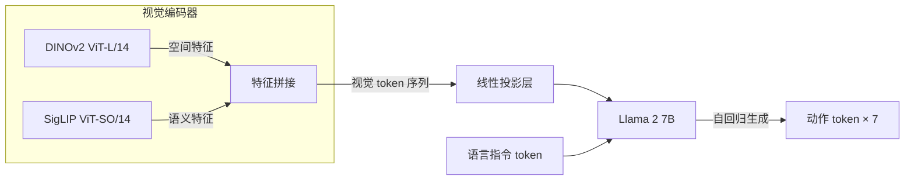
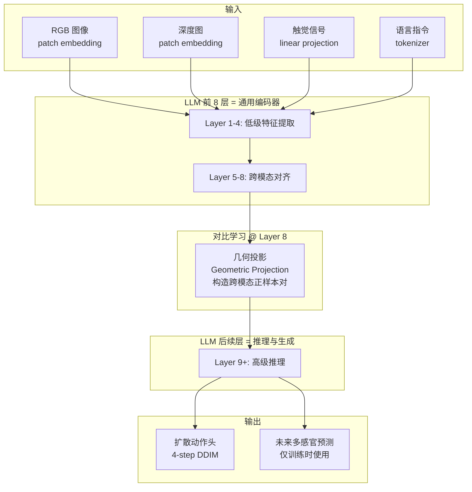

# Ch12: 端到端 VLA (II)——OpenVLA / VLAS / MLA，开源与扩展

> Part 3: 核心主线精读
> 前置章节：[Ch11: 端到端 VLA (I)——RT-1 / RT-2，把动作变成 token](ch11-rt1-rt2.md)
> 后续章节：[Ch13: 扩散策略——Diffusion Policy / 3D-DP / π0，像擦噪声一样擦出动作](ch13-diffusion-policy.md)

---

在 [Ch11](ch11-rt1-rt2.md) 结尾，我们带走了三个未解问题：

- **封闭性**：RT-2 的模型权重、训练代码、评测细节全部闭源，只有 Google DeepMind 自己能复现。
- **通用性**：RT-1/RT-2 都只在 Google 内部的单一机器人硬件（Everyday Robots）上验证，无法确认方法能跨平台泛化。
- **效率**：55B 参数需要 TPU 集群推理，实时控制频率不到 3Hz，离实用部署有距离。

本章讲三个模型如何从不同角度突破这些瓶颈：OpenVLA 解决封闭性和效率问题；VLAS 解决输入模态的局限；MLA 解决感知编码器的冗余问题。三者加在一起，代表了 2024 年 VLA 领域最重要的三个演进方向。

如果说 [Ch11](ch11-rt1-rt2.md) 讲的是"VLA 从 0 到 1 的验证故事"，那本章讲的就是"VLA 从 1 到 N 的扩展故事"。RT-1/RT-2 证明了方向是对的；OpenVLA/VLAS/MLA 证明了这条路可以走得更远、更快、更开放。

**本章定位**：读完本章，你应该能够：

- 画出 OpenVLA 的完整架构（双视觉编码器 + Llama 2 7B），解释每个组件的选型理由
- 说明 LoRA + 4-bit 量化如何让 7B 模型在消费级 GPU 上微调和推理
- 解释 OpenVLA-OFT 的三个"旋钮"（并行解码、动作分块、连续动作表示）各自解决什么问题
- 描述 VLAS 如何绕过 ASR 瓶颈直接从语音波形生成动作，以及 Voice RAG 为什么带来个性化能力
- 解释 MLA 的"无编码器"设计为什么能让 LLM 的前 8 层直接充当深度/触觉编码器
- 对比三个模型在开源程度、感知模态、动作表示、推理效率上的 trade-off

---

## 1. 从"闭门造车"到"开源共建"

> **一句话预告**：RT-2 是概念车——证明方向对但你买不到；OpenVLA 是量产车——性能可能差一点，但任何人都能开走改装。

### 1.1 概念车 vs 量产车

汽车行业有个规律：概念车在车展上赚够眼球后，真正改变世界的是那些能量产、能维修、能改装的车型。概念车的价值在于"证明可行"；量产车的价值在于"让每个人都能用"。

RT-2 就是那辆概念车。55B 参数、TPU v4 集群推理、Google 内部数据集、不公开权重——它在论文里展示了惊人的涌现能力（识别从未见过的 Taylor Swift 并执行相关指令），但全世界除了 Google 没有第二个团队能复现它。学术界能做的只有读论文、感叹"真厉害"，然后继续用自己手头的小模型和小数据做实验。

这个局面在 2024 年 6 月被打破了。Stanford、Berkeley 和 Toyota Research Institute 联合发布了 OpenVLA——一个 7B 参数的开源 VLA，模型权重、训练代码、评测基准全部公开。它不是 RT-2 的"复制品"（架构完全不同），而是一次从零出发的"重新实现"：用开源组件（Llama 2、SigLIP、DINOv2）搭建，在开源数据（Open X-Embodiment 970K 轨迹）上训练，最终在 RT-2-X 的评测基准上取得了更好的成绩——用 7B 打赢了 55B。

这不是某一个模型优于另一个模型的故事。这是一个范式的故事：当方法论从专有系统变成公共基础设施后，整个社区的迭代速度发生了质变。回想 [Ch08](ch08-clip.md) 中 CLIP 开源带来的下游爆发——CLIP 公开权重后，一年内出现了 DALL-E 2、Stable Diffusion、LLaVA 等一系列突破性工作。OpenVLA 的开源对机器人领域正在产生类似的催化效应。

这里还要补充一个背景：为什么 Google 不开源 RT-2？不是因为他们"自私"，而是因为 RT-2 依赖的 PaLI-X 55B 本身就是 Google 的闭源资产。模型和数据深度绑定在 Google 的内部基础设施上（TPU pod、内部数据管线、Everyday Robots 硬件），拿出来给别人用在技术上就很困难。相比之下，OpenVLA 从第一天就基于公开组件搭建——这不是"开源精神的胜利"，而是"架构选择的必然结果"。用公开组件搭建的系统天然可开源；用私有组件搭建的系统天然难开源。

### 1.2 三个模型的定位

本章聚焦三个模型，它们解决的问题不同，但都是在 RT-2 之后向"实用化"迈出的关键一步：

| 模型 | 发表时间 | 核心问题 | 核心方案 |
|------|---------|---------|---------|
| OpenVLA | 2024.06 | 封闭+低效 | 7B 开源 VLA，LoRA 微调，消费级 GPU |
| VLAS | 2024.xx | 输入局限（只接文本） | 直接接入语音波形，Voice RAG 个性化 |
| MLA | 2024.xx | 编码器冗余 | 无额外编码器，LLM 前几层直接编码多模态 |

它们共享一个底层信念：VLA 的未来不在于把模型做得更大，而在于让模型更开放、更灵活、更高效。

在进入各模型的深度剖析之前，有必要明确本章的阅读方法。这三个模型并非互相竞争的"同类产品"——它们解决的是不同维度的问题。把它们放在一起讲，是因为它们共同定义了"后 RT-2 时代"VLA 研究的问题空间。读完后你应该能在脑中画出一张"问题地图"：哪些问题被解决了，哪些问题还没有，以及每种方案做了什么 trade-off。

下面逐一深入。

---

## 2. OpenVLA 深度剖析

> **一句话预告**：7B 参数、完全开源、单卡可跑、性能超越 55B RT-2-X——OpenVLA 是第一个让"普通实验室也能玩 VLA"成为现实的模型。

### 2.1 设计目标：从实验室原型到社区工具

OpenVLA 的设计不是从"什么架构最强"出发的，而是从"什么条件下最多人能复现和改进"出发的。具体来说，它有三条硬约束：

第一，**完全开源**。模型权重、训练代码、评测代码、数据处理流程，全部公开在 GitHub 和 HuggingFace 上。任何人 `git clone` 后就能跑。

第二，**消费级可部署**。推理必须在单块消费级 GPU（RTX 4090，24GB 显存）上达到可用的控制频率（≥5Hz）。这意味着模型参数量不能超过 ~7B，且必须支持量化。

第三，**低成本可微调**。用户用自己的小规模数据微调模型时，不应该需要多卡集群。LoRA 适配器让微调时的显存占用降到单卡范围内。

这三条约束决定了架构选型的每一个决策。下面从底层逐一拆解。

### 2.2 架构总览：一个 VLA 请求的完整生命周期

在深入各组件之前，先走一遍"一条指令从输入到输出"的完整流程。假设用户说"把红色积木放到蓝色碗里"，摄像头看到一张桌面图像：

1. **图像处理**：224×224 RGB 图像分别送入 DINOv2 和 SigLIP，各自产出一串视觉 token（每个编码器约 256 个 token），沿特征维度拼接后通过线性投影，得到 256 个统一维度的视觉 token。
2. **文本处理**：指令文本 "把红色积木放到蓝色碗里" 通过 Llama 2 的 tokenizer 编码为约 15 个文本 token。
3. **拼接输入**：`[256 个视觉 token] + [15 个文本 token]` 作为 Llama 2 7B 的输入序列。
4. **自回归生成**：Llama 2 依次生成 7 个动作 token，每个 token 是 256 个 bin 中的一个。
5. **解码执行**：7 个 bin 编号被反映射回连续动作值 `[Δx, Δy, Δz, Δroll, Δpitch, Δyaw, gripper]`，发送给机器人控制器。
6. **循环**：机器人执行一步动作，摄像头采集新一帧图像，回到步骤 1。

整个循环以 6Hz 运行——每秒重复 6 次。注意 OpenVLA 不维护任何历史状态——每一帧都是独立决策，这是它"单帧输入"局限性的直接体现。

### 2.3 双视觉编码器：为什么需要两个眼睛？

OpenVLA 的骨架叫 Prismatic-7B，它由三个组件拼接而成：



**为什么用两个视觉编码器？** 这就像人看东西需要"轮廓感知"和"含义理解"两个层面。你看到桌上有个红色圆柱体（轮廓）的同时，你也认出那是一罐可乐（含义）。单一编码器往往只擅长其中一个方面：

- **DINOv2**（Meta，自监督）：擅长空间细节——物体的边缘在哪、表面纹理是什么样、深度关系如何。它是通过对比学习在大量无标注图像上训练的，学到的是"图像本身的结构"。类比：一个画素描的人，能精确捕捉物体的形状和位置关系。

- **SigLIP**（Google，对比学习）：擅长语义理解——画面里是什么东西、它和语言描述的对应关系。它是 CLIP 的后继者（还记得 [Ch08](ch08-clip.md) 吗？），用图文对比训练。类比：一个看图说话的人，知道画面里的东西叫什么、有什么用途。

机器人操作同时需要这两种能力。"把红色杯子放到微波炉里"——SigLIP 理解"红色杯子"和"微波炉"的语义，DINOv2 精确定位它们在图像中的空间位置。单用 SigLIP 可能定位不够精确（差几厘米就抓空了），单用 DINOv2 可能不理解语义指令（不知道哪个是"杯子"）。

**特征拼接方式**：两个编码器的输出（都是 token 序列）被沿特征维度拼接（concatenate），然后通过一个线性投影层映射到 Llama 2 的嵌入空间。这种设计简单直接——不需要复杂的跨编码器注意力机制。

**关键设计决策**：OpenVLA 在训练时**不冻结**视觉编码器——两个 ViT 都参与梯度更新。这和 [Ch09](ch09-blip2-llava.md) 中 LLaVA 冻结 CLIP 编码器的做法不同。原因是：机器人视觉的需求和互联网图文理解有显著差异——机器人需要理解精确的空间关系和物体姿态，而这些在 ImageNet/LAION 数据上预训练的编码器未必学得足够好。让编码器随动作预测一起微调，能让视觉特征更适配下游的控制需求。

### 2.4 语言模型骨干：为什么选 Llama 2 7B？

选 Llama 2 7B 而不是更大的 LLaMA 13B 或 70B，原因纯粹是工程约束：7B 在 4-bit 量化后占用约 3.5GB 显存，加上视觉编码器和 KV-cache，总共约 7-8GB——一块 RTX 4090（24GB）绑绑有余，还剩空间给 LoRA 微调时的梯度和优化器状态。如果用 13B，量化后约 7GB，加上其他开销就紧贴显存上限了，微调时容易 OOM。

Llama 2 在 2024 年 6 月时是最成熟的开源 LLM 之一（Llama 3 刚发布不久，生态还不完善）。它的 tokenizer、推理框架（vLLM、TGI）、LoRA 工具链（PEFT）都已经非常成熟，这大大降低了社区复现的门槛。

这里有个重要区别需要强调：Llama 2 7B 在 OpenVLA 中的角色**不是作为聊天机器人**，而是作为一个"序列到序列的通用处理器"。它接收的 token 序列是 `[视觉 token...][语言 token...]`，输出的 token 序列是 `[动作 token...]`。Llama 2 的自回归生成能力——根据前面所有 token 预测下一个 token——在这里被重新定义为"根据当前看到的画面和听到的指令，预测下一步该怎么动"。

类比：Llama 2 就像一个母语是中文的人。你可以教他用中文写诗（原本的聊天任务），也可以教他用中文写乐谱（动作 token 就是乐谱上的音符）。语言模型的核心能力——理解上下文、做出合理预测——跨任务通用。

### 2.5 动作表示：和 RT-2 一样的 256-bin 离散化

OpenVLA 的动作表示方案直接继承 RT-2 的做法——把每个维度的连续动作值映射到 256 个离散 bin 中的一个，然后把这个 bin 编号当作一个"特殊 token"让 LLM 自回归生成。

具体来说，一个 7-DoF 机械臂的动作被表示为 7 个 token 的序列：

```
[Δx, Δy, Δz, Δroll, Δpitch, Δyaw, gripper_open/close]
  ↓     ↓    ↓      ↓       ↓        ↓          ↓
[bin_143, bin_128, bin_96, bin_131, bin_127, bin_130, bin_255]
```

每个 bin 对应动作空间该维度的一个等宽区间。256 个 bin 意味着精度约为 `(max - min) / 256`——对于大多数操作任务，这个精度足够了。

**为什么沿用离散化而不是直接回归连续值？** 因为 LLM 的自回归生成本质上就是"从词表中选一个 token"的分类问题。让 LLM 输出一个连续浮点数需要修改架构（加回归头），而输出一个从 256 个 bin 中选择的分类结果完全适配现有的 next-token-prediction 框架——不需要改任何代码，直接在原始 tokenizer 的词表中增加 256 个特殊 token 就行。

这里值得深入理解一下"256 bin 够不够"的问题。假设机械臂某个关节的工作范围是 ±0.5 米，那么 256 bin 对应的精度是 1.0/256 ≈ 0.004 米 = 4 毫米。对于"把杯子放到桌上"这种任务，4mm 精度绰绰有余——杯子底面直径通常 6-8cm，放偏 4mm 完全没问题。但对于"把 USB 插头插进接口"这种精密装配（容差 <1mm），256 bin 就不够了。这也是 OpenVLA-OFT 引入连续动作表示的动机之一。

还有一个常被忽略的优点：离散化天然抗噪声。即使模型内部的 logit 分布有些抖动，只要最大概率的 bin 没变，输出的动作就是稳定的。连续回归则对 logit 的微小变化更敏感——输出 0.143 和 0.147 是不同的动作，而在 256 bin 方案中它们可能落在同一个 bin 里。

### 2.6 训练：970K 轨迹、27 个 epoch、解冻一切

**数据来源**：Open X-Embodiment（OXE）数据集——22 家机构联合贡献的 970K 条真实机器人操作轨迹，覆盖 60+ 子数据集、多种机器人形态（WidowX、Franka、KUKA 等）、多种任务类型。这是"机器人界的 ImageNet"——不完美，但足够大且公开。

**训练配置**：
- 全参数训练（不冻结任何组件），包括两个视觉编码器
- 27 个 epoch 遍历 OXE
- 标准自回归交叉熵损失：预测下一个动作 token
- 输入格式：`[视觉 tokens] + [语言指令 tokens] → [7 个动作 tokens]`

**为什么 27 个 epoch 这么多？** 相比 LLM 预训练（通常 1-2 epoch 就过拟合），机器人数据的多样性远低于互联网文本——同一类动作（"抓起物体"）在不同子数据集中重复出现，模型需要更多遍才能充分学习细微差异。这也是为什么 OXE 的多样性如此重要——如果只用单个子数据集，27 epoch 会严重过拟合。

用数字直观感受一下训练规模：970K 轨迹，每条轨迹平均包含 ~100 个时间步（即 100 个"图像→动作"样本对），那么单个 epoch 约看 9700 万个样本。27 epoch 就是约 26 亿次 forward-backward pass。这看起来很多，但和 Llama 2 预训练时看的 2 万亿 token 相比，仍然小了三个数量级。这部分解释了为什么 VLA 的泛化能力主要来自预训练知识而非机器人数据本身。

**训练小技巧**：OpenVLA 在不同子数据集之间做了加权采样——更大、更多样的子数据集（如 Bridge V2）被赋予更高的采样权重，避免小数据集被过度拟合。这类数据工程决策在论文中往往只有一句话，但对最终性能影响很大。

### 2.7 核心结果：7B 打赢 55B

OpenVLA 在 29 个评测任务上的平均成功率为 **70.6%**，而 Google 的 RT-2-X（55B）在相同任务集上只有 **50.6%**。一个 7B 的开源模型打赢了一个 55B 的闭源模型——参数量少 7 倍，性能高 20 个百分点。

为什么会出现这种"小胜大"的情况？有几个可能的原因：

第一，**训练数据**。RT-2-X 虽然参数大，但它是在 PaLI-X 预训练基础上做了较少的机器人数据微调。OpenVLA 则在 970K 轨迹上训练了 27 epoch——对机器人数据的充分利用可能弥补了参数量的劣势。

第二，**双视觉编码器**。DINOv2 + SigLIP 的组合提供了比 PaLI-X 单一视觉编码器更丰富的视觉表征——空间精度更高，对操作任务更友好。

第三，**解冻编码器**。让视觉编码器随动作预测一起训练，使得视觉特征更适配机器人操作的需求（精确空间定位），而 RT-2 的 PaLI-X 视觉编码器可能更偏向互联网图文理解。

值得注意的是，这个"小胜大"的结果**不是**说 7B 永远比 55B 好。如果 Google 用和 OpenVLA 相同的训练策略（完整 OXE、27 epoch、解冻编码器）去训练 PaLI-X 55B，结果大概率会更好。差距的来源更多是训练配方（data + training recipe）而非纯粹的参数量对比。这提醒我们：在 VLA 领域，数据和训练策略的重要性可能超过模型规模——至少在当前数据量级下是这样。

### 2.8 LoRA 微调：让 7B 模型在单卡上可塑

预训练好的 OpenVLA 已经具备跨机器人的通用操作能力，但用户通常需要在自己的特定机器人和任务上进一步微调。直接全参数微调 7B 模型需要 ~40-50GB 显存（权重 + 梯度 + 优化器状态），单块 RTX 4090 装不下。

LoRA（Low-Rank Adaptation）解决了这个问题。核心想法：微调时不更新原始权重矩阵 W，而是学习一个低秩增量 ΔW = AB，其中 A 和 B 是两个小矩阵（rank 32 意味着 A 是 4096×32，B 是 32×4096）。只有 A 和 B 参与梯度更新，大大减少了需要存储的梯度和优化器状态。

类比：你有一本写满字的百科全书（原始 7B 权重），要做修改。全参数微调相当于用铅笔在每一页上涂涂改改——你得对每一页都有备份和橡皮（显存开销大）。LoRA 相当于贴一组便签条——原书不动，所有修改写在便签上。便签又薄又轻（rank 32 的参数量只有原始的 0.5%），但足够表达你需要的改动。

OpenVLA 用 rank 32 的 LoRA，微调时只需要约 **15-16GB 显存**——单块 RTX 4090（24GB）绑绑有余。训练一个新任务通常只需几百条示教轨迹和几小时训练时间。

数字对比一目了然：

| 微调方式 | 可训参数量 | 显存占用 | 设备要求 |
|---------|-----------|---------|---------|
| 全参数微调 | 7B (100%) | ~45GB | 2×A100 80GB |
| LoRA rank 32 | ~35M (0.5%) | ~16GB | 1×RTX 4090 |
| LoRA rank 32 + 4-bit 量化 | ~35M (0.5%) | ~10GB | 1×RTX 3090 |

这意味着一个研究生用自己的游戏显卡就能在自己的小型机器人上微调 VLA——这在 RT-2 时代是不可想象的。

### 2.9 4-bit 量化：推理再压一半

推理时，OpenVLA 支持 4-bit 量化——把每个权重从 16-bit 浮点数压缩到 4-bit 整数，显存占用从约 14GB 降到约 3.5GB。量化后性能无损失——这是因为 LLM 的权重分布近似正态，NF4（NormalFloat4）量化方案针对正态分布设计，能以极小的精度损失完成压缩。

量化后的推理速度：在 RTX 4090 上达到 **6Hz**——每秒生成 6 个动作。相比 RT-2 在 TPU 集群上的 1-3Hz，OpenVLA 在单块消费级 GPU 上跑得更快。6Hz 对大多数桌面操作任务来说是够用的（人手精细操作的频率约 5-10Hz），虽然对高速动态任务（如打乒乓球）仍然不够。

汇总一下 OpenVLA 的部署参数对比 RT-2：

| 维度 | RT-2 (55B) | OpenVLA (7B) | OpenVLA 量化 |
|------|-----------|-------------|-------------|
| 参数量 | 55B | 7B | 7B (4-bit存储) |
| 推理硬件 | TPU v4 pod | A100 / RTX 4090 | RTX 4090 |
| 显存占用 | ~200GB+ | ~14GB | ~3.5GB |
| 控制频率 | 1-3Hz | ~4Hz | 6Hz |
| 部署成本 | 数万美元/月 | 一块消费级GPU | 同左 |

从"数万美元的云端 TPU"到"一块 8000 元的游戏显卡"，部署成本降低了两个数量级。这才是 OpenVLA 真正的颠覆性——不是技术上的革命，而是门槛上的民主化。

### 2.10 局限性：诚实面对天花板

OpenVLA 不是万能的。它有几个明确的局限：

**单帧输入**：OpenVLA 每次只接收当前一帧图像作为视觉输入，没有历史帧。这意味着它看不到物体的运动方向、无法推断速度、不能利用动作的连续性。就像让一个人只看一张照片来判断"球往哪飞"——没有上一帧的参照，很难判断。

**灾难性遗忘**：当用 LoRA 在新任务上微调后，模型在原始 OXE 任务上的性能会下降。这是所有微调方法的通病——学新东西时旧东西会被覆盖。虽然 LoRA 比全参数微调的遗忘程度轻，但仍然存在。

**透明/反光物体**：视觉编码器（DINOv2 + SigLIP）都是在常规 RGB 图像上预训练的，对透明玻璃杯、镜面金属表面等"视觉困难"物体的特征提取不理想。这是所有基于 RGB 的方法的共同弱点——深度传感器或触觉传感器能弥补，但 OpenVLA 目前不支持这些额外模态。

**跨任务泛化有限**：虽然 OpenVLA 在 OXE 的 29 个任务上泛化良好，但这些任务大多是桌面操作（pick-and-place、开关门、按按钮）。对于全新类型的任务（如叠衣服、使用工具、双臂协作），OpenVLA 的零样本泛化能力仍然有限——它没有从训练数据中见过这些动作模式。这再次说明：VLA 的泛化能力上限受训练数据的多样性约束，而 OXE 目前覆盖的任务类型仍然偏窄。

这些局限不是 OpenVLA 的"缺陷"——而是当前 VLA 研究的公开问题。解决它们是后续工作（包括 OFT、TinyVLA、SpatialVLA 等）的动机来源。

### 2.11 LoRA 实践要点：什么时候该微调、该调多少？

理解了 LoRA 的原理后，一个实操问题自然浮现：拿到 OpenVLA 预训练权重后，面对自己的新任务（比如你自己的 UR5 + 自定义夹爪要做叠毛巾），应该怎么决定微调策略？

**判断是否需要微调**：先用 zero-shot（不微调）跑你的任务。如果成功率 >50%，说明 OXE 中有类似数据，你可能只需要少量数据微调收尾。如果 zero-shot 成功率 <20%，说明任务或硬件差异较大，需要认真收集 50-200 条示教轨迹来微调。

**Rank 的选择**：rank 32 是默认推荐值，它在"表达能力"和"过拟合风险"之间取得了平衡。如果你的微调数据只有 20 条轨迹，可以降到 rank 8-16 减少过拟合风险；如果有 500+ 条且任务复杂，可以升到 rank 64 获取更强的适配能力。

**冻不冻视觉编码器**：如果你的视觉场景和 OXE 差异很大（比如显微操作、水下环境），建议对视觉编码器也加 LoRA 或解冻最后几层。如果场景差异不大（类似的桌面物体、类似的光照），冻结视觉编码器通常足够。

**训练时长**：100 条轨迹 × 200 epoch 通常足够收敛。过度训练（500+ epoch）容易过拟合——验证集 loss 开始上升时就应该停。

这些实践指南听起来像"经验主义"（确实是），但它们从社区大量用户的尝试中总结而来——OpenVLA 开源后社区贡献了丰富的微调经验，这些反哺的经验本身就是开源生态的价值之一。

### 2.12 开源的意义：催化效应

OpenVLA 发布 6 个月内，社区已经基于它发展出多种变体：TinyVLA（1.4B，边缘设备）、SmolVLA（HuggingFace，单 GPU 可训练）、SpatialVLA（加入 3D 空间推理）、TraceVLA（用轨迹画线替代视频）。这些工作都不可能在 RT-2 的闭源生态下出现。

回到概念车和量产车的类比：RT-2 证明了方向，OpenVLA 让所有人都能上路。而一旦所有人都上了路，道路的改善速度就不再取决于一家公司的研发能力，而取决于整个社区的集体智慧。

这里值得特别提一下 OpenVLA 论文的写作方式——它不仅报告了模型的优势（70.6% 成功率），还系统性地报告了失败案例和局限性。这种诚实的研究风格对社区极其重要：后续研究者可以精确地知道在哪些场景下 OpenVLA 不够好，从而有针对性地改进。相比那些只报告最好结果的论文，这种"地图上标注雷区"的做法让后来者少走了很多弯路。

---

## 3. OpenVLA-OFT：三个旋钮

> **一句话预告**：OpenVLA-OFT 是对原版 OpenVLA 的系统性升级——通过三个可独立开关的改进（并行解码、动作分块、连续动作表示），逐一击破原版的速度、短视、精度瓶颈。

### 3.1 原版的三个痛点

在理解 OFT 之前，先明确原版 OpenVLA 的三个工程瓶颈：

**瓶颈一：自回归解码太慢。** 7 个动作 token 必须逐个生成——先出 Δx，再出 Δy，再出 Δz……每个 token 都要过一遍完整的 LLM forward pass（虽然 KV-cache 能复用之前的计算，但每个新 token 仍需一次前向传播）。对 7B 模型来说，即使量化后，7 次串行推理仍然是速度的主要瓶颈。假设单次前向传播需要 20ms，7 个 token 就是 140ms——光生成动作就占了一个 6Hz 周期（167ms）的 84%，几乎没有留给图像编码和后处理的时间。

**瓶颈二：一次只预测一步。** 每次调用模型只输出当前时刻的 1 个动作（7 个 token 组成 1 步动作）。下一步动作需要等新的图像输入后再次推理。如果控制频率是 6Hz，那么模型完全没有"预判"能力——它永远在"跟"环境的当前状态，而不是"预测"接下来应该怎么走。

**瓶颈三：离散精度上限。** 256 个 bin 的精度约为 `(max - min) / 256`。对大多数任务够用，但对于精细操作（如插销入孔、绕线）可能成为瓶颈。而且离散化天然无法表达多模态动作分布——当"往左"和"往右"都是合理动作时，256 bin 的分类分布只能给出两个峰，无法表达平滑的连续分布。

### 3.2 旋钮一：并行解码（Parallel Decoding）

**做法**：去掉动作 token 之间的因果掩码（causal mask）。原版中 7 个动作 token 是串行生成的——token 2 能看到 token 1，token 3 能看到 token 1 和 2，以此类推。并行解码打破了这个约束，让 7 个 token 同时生成，一次 forward pass 出所有动作维度。

**类比**：原来是一个翻译官逐字翻译句子——翻完第一个字才能翻第二个。并行解码相当于让 7 个翻译官同时工作，每人负责一个字，一起交卷。

**效果**：推理速度提升约 5-7 倍（7 次 forward pass 变 1 次）。代价是失去了维度之间的条件依赖——原版中 Δy 可以依赖 Δx 的值来决定自己，并行解码后各维度独立。实验表明这个代价很小，因为机器人动作各维度之间的相关性在大多数操作任务中并不强。

为什么维度之间的相关性不强？直觉上你可能觉得"手往右移"和"手往前伸"应该是相关的。但在增量动作空间（Δx, Δy, Δz 都是相对当前位置的小增量）中，各维度的值在大多数时间步里是近似独立的——机器人在某一帧同时往右移 2mm、往前移 1mm、往上移 0.5mm，这三个增量之间没有强耦合关系。只有在特殊几何约束下（如沿曲面滑动）各维度才有强相关，而这类场景在 OXE 数据中占比不高。

### 3.3 旋钮二：动作分块（Action Chunking, H=8）

**做法**：模型一次预测未来 H=8 步的动作序列，而不是只预测当前 1 步。输出从 7 个 token 变成 7×8=56 个 token（或并行解码情况下，56 维的向量）。

**类比**：开车时如果每一帧你只决定"方向盘转多少度"（1 步），那你永远在做反应式驾驶。动作分块相当于每帧你规划出"接下来 1 秒的转向轨迹"（8 步 × 0.12 秒/步 ≈ 1 秒），然后执行前几步，再重新规划。这自然更平滑、更有预判性。

**为什么 H=8 是好选择？** 太短（H=1-2）没有预判效果；太长（H=32+）规划的远期动作不准确（环境可能已经变了）。H=8 对应约 1 秒的时间窗口——在这个尺度上，桌面操作的环境变化不大，模型的预测是可信的。

**效果**：执行更平滑（减少了"抖动"），对暂时性的感知噪声更鲁棒（因为不是每一步都重新做完整决策），整体成功率显著提升。

为什么"不是每一步都重新决策"反而更好？这似乎违反直觉——更频繁的反馈应该更好才对？关键在于感知噪声。如果摄像头在某一帧因为光线闪烁拍到了一张有偏差的图像（比如反光导致物体看起来移位了），在 H=1 的模式下模型会立即做出一个"纠错"动作（实际是错误的），然后下一帧又纠回来——产生抖动。在 H=8 的模式下，模型在 8 步中只"看"一次图像、做一次完整规划，执行过程中不受逐帧噪声干扰。这就像人做精细操作时会"闭着眼"执行一段预设动作（比如把线穿进针眼），而不是每一毫秒都重新看一下。

动作分块还有一个更深层的好处：它迫使模型学习**动作的时间结构**。当模型必须同时预测 8 步的动作序列时，它不得不学会"一个完整的抓取动作由什么样的时序模式组成"——先接近、减速、张开夹爪、合拢。这比逐步预测更容易学到平滑、物理合理的运动轨迹。

### 3.4 旋钮三：连续动作表示（Continuous Action Representation）

**做法**：放弃 256-bin 离散化，改为让模型直接输出连续值。具体有两种实现方式：

- **L1 回归**：在 LLM 最后一层之后接一个线性头，直接回归连续动作值，用 L1 损失训练。
- **扩散头（Diffusion Head）**：在 LLM 最后一层之后接一个小型去噪网络，通过几步 DDPM/DDIM 去噪生成连续动作。这就引入了 [Ch13](ch13-diffusion-policy.md) 中将详细讨论的扩散策略思想。

**类比**：离散 bin 像是在一把 256 格的尺子上做选择——你只能说"大约在第 143 格"。连续回归像是用精密游标卡尺直接测量——想测多准就多准。扩散头更进一步——像是让多个人独立估计后取共识，能处理"答案不唯一"的情况。

**效果**：对精细操作任务（需要 sub-millimeter 精度）有明显提升；扩散头还能处理多模态分布（同一个情景下多条合理路径都能被生成）。

### 3.5 三个旋钮可独立组合

OFT 的核心设计哲学是"可拆卸"——三个改进可以任意组合：

| 配置 | 并行解码 | 动作分块 | 连续动作 | 适用场景 |
|------|---------|---------|---------|---------|
| 原版 OpenVLA | ✗ | ✗ | ✗ | 基线 |
| 只加并行 | ✓ | ✗ | ✗ | 追求速度 |
| 并行+分块 | ✓ | ✓ | ✗ | 追求速度+平滑 |
| 全开 | ✓ | ✓ | ✓ | 追求最佳性能 |

这种设计让你可以根据自己的硬件和任务需求灵活选择。比如你的机器人控制频率够高但任务简单，只开并行解码就够了；如果任务复杂（比如缝纫、倒水），全开三个旋钮获得最佳效果。

### 3.6 与原版 OpenVLA 的对比结果

在 LIBERO 仿真 benchmark 上，全开三个旋钮的 OFT 相比原版 OpenVLA 有显著提升。在真实机器人任务上同样如此。具体提升幅度取决于任务复杂度——越是需要精细操作或长期规划的任务，OFT 的优势越明显。

更具体地看各旋钮的独立贡献：

**并行解码**单独开启时，性能几乎不降（在大多数任务上 <2% 差异），但推理速度提升约 5×。这证实了我们前面的分析——动作各维度在增量空间中近似独立，串行解码是"没有必要的谨慎"。

**动作分块**（H=8）单独开启时，在需要"连续运动"的任务上（如画圆弧、推物体到目标位置）提升最大（+10-15%），在简单的 pick-and-place 任务上提升较小（+3-5%）。这说明动作分块的价值在于学习时间结构——越需要"一气呵成"的动作序列，分块的优势越大。

**连续动作表示**的贡献取决于任务的精度需求。在粗粒度任务（抓大物体）上几乎没有提升；在精细任务（插入、旋转螺丝）上有显著提升（+8-12%）。这和我们对 256-bin 精度瓶颈的分析完全吻合。

三者叠加的效果不是简单相加——它们之间有轻微的"正交性衰减"（diminishing returns）。但整体而言，全开配置在综合 benchmark 上相比原版 OpenVLA 有 +20-30% 的绝对成功率提升，同时推理速度更快。这是一个"全面改进，没有trade-off"的罕见案例。

关键 takeaway：OFT 的意义不在于"发明新东西"，而在于证明了 OpenVLA 的初始设计有哪些可以改进的点，并且每个改进都是正交的、可独立验证的。这是很好的工程研究范式——先跑通基线，再逐个优化瓶颈。

### 3.7 OFT 的方法论启示

从研究方法论的角度，OFT 给了我们一个重要的教训：**第一版论文的设计选择往往不是最优的，而是"最简单能跑通的"。** OpenVLA 的初始设计（串行解码、单步预测、离散 bin）不是因为作者不知道更好的方案存在，而是因为他们的首要目标是"证明 7B 开源 VLA 能 work"——最简方案降低了调试复杂度。

一旦基线跑通了，优化就变成了一个相对简单的工程问题：逐个替换子模块，对比性能变化，保留有效的改进。OFT 的三个旋钮正是这种"基线→逐步优化"思路的最佳范例。

如果你将来自己做研究，记住这个模式：先让最简方案跑通（proof of concept），再系统性地优化每个组件（engineering for performance）。不要试图在第一篇论文中同时引入太多创新——那会让你无法分清是哪个创新在起作用。

---

## 4. VLAS 深度剖析：让机器人听懂"你的"声音

### 4.1 一个被忽视的接口问题

到目前为止，所有 VLA（RT-2、OpenVLA、OFT）的语言输入都是**文本**。但你有没有想过——在真实场景中，人对机器人下指令最自然的方式是什么？是敲键盘输入文字吗？

当然不是。是**说话**。

你对家里的扫地机器人说"去清理厨房"，对工厂里的协作臂说"把那个红色零件递给我"。语音是人类最自然的交互接口。但如果在语音和机器人动作之间插入一个 ASR（语音识别）模块，会发生什么？

想象这个场景：工厂里很吵，你对机器人说"递给我那个**螺母**"。ASR 识别成了"递给我那个**螺帽**"。对人来说这俩东西差别很大，但文字上只差一个字。如果机器人只看文本，它根本不知道你说的是哪个——它丢失了你语音中的犹豫、重音、语调这些额外信息。

更重要的是：如果家里有三个人都可以对机器人下指令，机器人怎么知道"把我的杯子拿来"中的"我"是谁？ASR 把语音转成文本后，说话人的身份信息就丢了。

VLAS（Voice-Language-Action System）就是为了解决这个问题：**跳过 ASR，直接从原始语音波形到机器人动作。**

### 4.2 类比：声控智能管家

想象一个高级智能管家。普通版管家的工作方式是：你说话 → 旁边有个速记员记下文字 → 管家读文字 → 执行动作。速记员可能听错、可能漏掉语气、一定会丢掉"这是谁在说话"的信息。

VLAS 版管家则是：你说话 → 管家直接听 → 从你的声音中识别出"是主人在说话"→ 理解指令含义 → 执行动作。管家不仅听懂了"什么"，还听懂了"谁"，甚至能从语气中判断紧急程度。

### 4.3 一次完整的 VLAS 推理流程

在进入架构细节之前，先走一遍具体场景。假设家里有爸爸和妈妈两个用户，场景中桌上有一个蓝色杯子（爸爸的）和一个红色杯子（妈妈的）。

爸爸对机器人说：（语音）"把我的杯子拿来。"

VLAS 的处理流程：
1. 麦克风采集到 2 秒的音频波形
2. Whisper 编码器将波形转为 ~80 个语音 token（5x 压缩后）
3. Voice RAG 模块提取说话人声音嵌入，与数据库匹配 → 匹配到"爸爸"
4. 检索爸爸的个人信息："爸爸的杯子是蓝色的"
5. 拼接输入：`[图像 token] + [语音 token] + [身份上下文 token: "说话人是爸爸，他的杯子是蓝色"]`
6. VLA 生成动作 token → 机器人去拿蓝色杯子

如果同样的话由妈妈说出，步骤 3-4 会匹配到"妈妈"、检索到"妈妈的杯子是红色"，最终机器人会去拿红色杯子。**同样的文字指令，不同的执行结果**——这就是 Voice RAG 带来的个性化。

### 4.4 架构细节

VLAS 基于 LLaVA 架构（回忆 [Ch09](ch09-blip2-llava.md) 中的 LLaVA：视觉编码器 + 投影层 + LLM），但做了三个关键修改：

第一，**语音编码器**：用 OpenAI 的 Whisper 模型（冻结）对原始音频进行编码，然后做 5 倍时间压缩——一句 3 秒的话产生大约 300 个语音 token。这些 token 不是文字，是语音的连续特征表示，保留了音色、语调、节奏等文本中没有的信息。

为什么选 Whisper 而不是从头训练语音编码器？同样的逻辑——站在巨人肩膀上。Whisper 在 68 万小时的多语言语音数据上预训练过，已经学会了极其丰富的语音表征。冻结它并在顶部加投影层，就能以极低成本把这些表征接入 VLA 系统。

5 倍时间压缩是一个关键设计决策：原始 Whisper 特征序列太长（30 秒音频产生 ~1500 个 token），直接喂入 LLM 会占用过多上下文窗口，挤压视觉 token 和动作 token 的空间。5 倍压缩后，一句典型指令（2-3 秒）只需 ~60-100 个 token，这和 OpenVLA 中语言指令的 token 数相当，不会造成序列长度瓶颈。

第二，**Voice RAG（语音检索增强生成）**：这是 VLAS 最独特的创新。系统维护一个"声纹数据库"——每个家庭成员注册时说几句话，系统提取他们的声音嵌入（voice embedding）。当收到新指令时，系统用说话人的声音嵌入去检索数据库，找到最匹配的身份，然后把身份信息（"这是爸爸在说话，他的杯子是蓝色那个"）作为额外上下文注入模型。

类比：就像餐厅服务员认出了熟客的声音——"李先生您来了，老样子？"服务员不需要看菜单，他从声音就知道该怎么服务。

第三，**多步动作预测**：每次推理预测未来 5 个时间步的动作（而非原版 OpenVLA 的 1 步），提高执行效率。

### 4.5 三阶段训练

VLAS 的训练分三个阶段，逐步增加难度：

**第一阶段：语音转写（Transcription）**——让模型学会"听"。输入语音 token，输出对应文字。这一步让 Whisper 编码器和 LLM 之间的投影层学会对齐——投影层必须把 Whisper 的语音特征转化为 LLM 能"读懂"的表示。这就像给两个说不同方言的人配翻译——翻译先学会两种方言的对应关系。

**第二阶段：语音 VQA（Visual Question Answering）**——让模型学会"听+看"。输入图像 + 语音问题（如语音"桌上有什么颜色的杯子？"），输出文字回答。这一步让模型学会同时处理视觉和语音信息，并在两者之间建立关联。关键是：模型需要理解语音中的指代（"那个""这边"）和视觉场景的对应。

**第三阶段：动作生成（Action Generation）**——让模型学会"听+看+做"。输入图像 + 语音指令，输出机器人动作 token。这一步把前两阶段学到的视觉-语音理解能力转化为控制能力。

这个渐进式训练策略和 [Ch09](ch09-blip2-llava.md) 中 BLIP-2 的分阶段训练（先对齐再生成）思路完全一致——先让模态对齐，再加入下游任务。之所以不能直接从第三阶段开始训练，是因为语音→动作的映射太复杂了——中间没有可靠的梯度信号。分阶段让每个阶段的学习目标更明确，梯度信号更干净。

类比：教一个外国人做中国菜。你不会一上来就让他"听中文指令做菜"。而是先教他听懂中文（阶段一），再教他边看食材边理解中文描述（阶段二），最后才教他听中文指令动手做菜（阶段三）。跳步会导致学习困难。

### 4.6 个性化的魔力

Voice RAG 带来的个性化效果非常惊人：

- 有 Voice RAG 时，个性化任务（"把**我的**杯子拿来"，不同人的"我"指不同杯子）成功率 **86.5%**
- 去掉 Voice RAG（模型不知道谁在说话）时，成功率暴跌到 **19.2%**
- 不仅如此，去掉 Voice RAG 后还有 **16%** 的概率发生"动作崩溃"——机器人直接卡死不动

为什么差距这么大？因为"把我的杯子拿来"这个指令在没有说话人身份的情况下是**歧义的**——场景中有多个人的杯子，模型不知道该拿哪个，就像一个新来的服务员面对一桌客人说"上我的菜"但不知道哪位点了什么。

Voice RAG 的语音识别错误率（WER）仅为 2.79%，这意味着语音直接输入不仅不会比 ASR 转写差，反而因为保留了更多信息而表现更好。

这里有个微妙但重要的点：VLAS 的 2.79% WER 是系统整体的"等效"错误率（从语音到正确动作的整体失败中，有多少可归因于语音理解错误），而不是传统意义上的 ASR WER。系统端到端地从波形学习到动作，其内部可能不需要完美的文字转写——只要"理解到位"就行。就像你和熟人说话时对方听漏了几个字但完全理解你的意思——因为有上下文补偿。

### 4.7 VLAS vs 传统 ASR+VLA 流水线

为了理解 VLAS 的价值，对比一下"传统做法"和 VLAS 的差异：

传统流水线：`语音 → Whisper ASR → 文本 → OpenVLA → 动作`

这种做法有三个问题：（1）ASR 错误会传播到下游且不可恢复；（2）身份信息在文本化时丢失；（3）两次模型推理的延迟叠加。

VLAS 的做法：`语音 → Whisper 编码器(不解码) → 语音 token → VLA → 动作`

注意关键区别：Whisper 在这里只做**编码**（提取特征），不做**解码**（输出文字）。语音信号在变成 token 后直接进入 VLA，从未经过"文字"这个中间表示。这保留了所有文字无法承载的信息。

**一个自然的疑问：为什么不直接用 GPT-4o 这类原生多模态模型？** GPT-4o 已经能直接处理语音输入了，为什么不直接把它接上机器人动作头？答案是延迟和控制频率。GPT-4o 是云端模型，一次 API 调用约 500-1000ms——这对于需要 6Hz 控制频率的机器人操作来说慢了 3-5 倍。VLAS 的优势在于它是一个可以本地部署的轻量系统，Whisper 编码器冻结且高度优化（onnxruntime 推理约 30ms），配合 7B VLA 可以在消费级 GPU 上实现实时控制。此外，GPT-4o 不支持 LoRA 微调——你无法用自己的机器人数据适配它。

### 4.8 局限性

VLAS 目前还有几个明显限制：

第一，**合成数据到真实的迁移**：训练用的语音指令很多是 TTS（Text-to-Speech）合成的，转到真实人声时性能下降约 8%。真实语音有口音、停顿、背景噪声、多人同时说话等复杂情况，这些在合成数据中很难完全模拟。这个 gap 不算大（8%），但对于安全关键场景可能是不可接受的。

第二，**硬件泛化**：目前只在单臂 UR5 机器人上验证，没有跨平台实验。Voice RAG 的概念应该是通用的，但需要更多硬件验证。特别是——UR5 的动作空间是 6-DoF + 夹爪，如果换成灵巧手（20+ DoF），动作 token 的数量和复杂度都会剧增，语音→动作的映射难度会大幅提升。

第三，**实时性**：语音编码 + 声纹检索 + 动作生成的全链路延迟还没有被充分优化。在"紧急停止"类的安全关键场景中，这个延迟可能不可接受。人说"停！"后机器人需要多久才能真正停下来？这不仅是模型推理时间的问题，还涉及语音 VAD（Voice Activity Detection，检测你是否说完了一句话）的延迟。

第四，**语言多样性**：Whisper 虽然是多语言模型，但 VLAS 的训练数据主要是英语语音。对中文、日语等其他语言的指令，性能如何尚未验证。如果要在中国的家庭场景部署，这是必须解决的问题。

---

## 5. MLA 深度剖析：不要编码器，让 LLM 自己"长出"感官

> **一句话预告**：MLA 证明了一个令人震惊的结论——去掉所有专用感知编码器、只让 LLM 自己学会处理多模态输入，性能反而更好。这可能颠覆我们对多模态 AI 架构的固有认知。

### 5.1 一个反直觉的问题

回忆一下到目前为止我们见过的所有多模态模型的标准做法：

- CLIP：图像编码器 + 文本编码器
- LLaVA：冻结的视觉编码器 + 投影层 + LLM
- OpenVLA：双视觉编码器（DINOv2 + SigLIP）+ LLM
- VLAS：视觉编码器 + 语音编码器 + LLM

模式很清楚：**每加入一种新模态，就加一个专用编码器**。就像每学一门外语就雇一个翻译——英语翻译、法语翻译、日语翻译各一个，他们把各种语言翻译成中文后交给老板（LLM）处理。

但 MLA（Multimodal Language-Action）提出了一个大胆的问题：**如果老板自己就是语言天才呢？如果 LLM 的前几层就有能力直接处理其他模态的原始输入，不需要翻译呢？**

### 5.2 类比：天生的多语者

有些人从小在多语环境中长大——家里说粤语、学校说普通话、同学说英语。他们不需要"翻译"，每种语言直接对应到同一个概念系统。听到英语"apple"和中文"苹果"时，大脑直接激活同一个概念节点，不需要先翻译成某种"中间语言"。

MLA 的假设是：经过大规模预训练的 LLM 可能天生就是这样的"多语者"。它的前几层 Transformer 层已经学到了足够通用的特征提取能力，可以直接处理来自不同模态的原始信号——只要你用正确的方式"喂"给它。

这是一个非常违反直觉的发现：我们一直以为每种模态需要专门的编码器，但也许 LLM 的底层表征已经足够通用。

为什么这个假设可能是对的？线索来自 LLM 研究中的一个已知现象：Transformer 的底层（前几层）倾向于学习通用的模式匹配能力——局部相关性、重复结构、频率分析等。这些能力对文本是有用的（n-gram 模式、词法结构），对图像同样有用（空间相邻像素的关系、纹理模式），对触觉信号也有用（时间序列中的周期模式、力度变化）。上层才分化为"语言特有"的语义处理。

换句话说：Transformer 前几层是"万能特征提取器"，只是因为训练数据全是文本，它的万能能力只在文本上表达出来了。如果喂入其他模态的结构化信号（通过简单的 patch embedding），它的前几层应该同样能提取有意义的特征。MLA 的实验证实了这个猜想。

### 5.3 Encoder-Free 的核心机制

MLA 的做法分三个层次：

**第一层：极简输入处理。** 不加任何专用编码器——RGB 图像、深度图（depth）、触觉（tactile）信号都直接通过简单的线性投影（patch embedding）映射到 LLM 的输入空间。所谓 patch embedding，就是把输入信号切成小块（比如 16×16 像素的图像块），每块通过一个线性层映射到 LLM 的隐藏维度。这和 ViT（Vision Transformer）最初处理图像的方式完全一样——区别只是 ViT 后面接的是一个独立的 Transformer 编码器，而 MLA 后面直接接 LLM 的第一层。

**第二层：LLM 前 8 层充当"通用编码器"。** 这些层负责将不同模态的 token 映射到同一个语义空间。每种模态的 token 从各自的 patch embedding 开始（维度相同但含义不同），经过 8 层 Transformer 的自注意力处理后，逐步被对齐到一个共享的表征空间。

**第三层：对比学习锚定对齐。** 在第 8 层施加对比学习损失——强制不同模态中描述同一物理位置的 token 靠近。这是"指路牌"——告诉 LLM 的前 8 层应该往哪个方向对齐。没有这个损失，LLM 可能会把不同模态的 token 映射到完全不相关的子空间里（毕竟它最初只被训练处理文本）。



### 5.4 几何投影：构造跨模态正样本对

对比学习需要"正样本对"——告诉模型哪些来自不同模态的 token 其实描述的是同一个东西。在 CLIP 中，正样本对是"同一图文对"（整张图和整段文本配对）；在 MLA 中，正样本对的构造更巧妙——用**几何关系**做 token 级别的精确配对。

具体来说：RGB 图像中的某个 patch 和深度图中的对应 patch（它们描述的是同一个空间位置）构成正对；RGB 某个区域和触觉信号中描述同一接触点的数据构成正对。这种对应关系可以通过相机标定和机器人正运动学精确计算。

举个具体例子说明"几何投影"的含义。假设机器人的手指正在触碰桌上的杯子。此时：
- RGB 图像中，杯子手柄区域是 patch (5,8) 到 (7,10)
- 深度图中，同一位置的 patch 也是 (5,8) 到 (7,10)（因为 RGB 和深度相机对齐了）
- 触觉传感器的读数对应的是"手指尖端的接触力 token"

几何投影就是用相机内参/外参 + 机械臂正运动学，计算出"触觉 token #3 对应的三维坐标" → "该三维坐标投影到 RGB 图像的 patch (6,9)"。于是（触觉 token #3, RGB patch (6,9), 深度 patch (6,9)）成为一组跨模态正样本对。

类比：就像你同时看一张照片和摸一个物体。照片中"红色杯子手柄"对应的像素，和你手指触摸到"光滑弧形"的触觉，描述的是同一个物理实体。几何投影就是告诉模型这种对应关系。

在第 8 层对这些正样本对施加对比损失（InfoNCE），迫使 LLM 的前 8 层学会把不同模态中描述同一物理实体的 token 映射到相近的向量空间位置。

**为什么选第 8 层而不是更深或更浅？** 太浅（如第 2 层），特征还太原始，还没来得及做有意义的抽象，对比学习的信号会太弱。太深（如第 20 层），特征已经高度语言化，可能"来不及"修正模态对齐。第 8 层处于一个"甜区"——特征已经有了一定的抽象（超越了像素级），但还没有过度偏向文本语义。这个选择通常通过消融实验确定。

对比 CLIP 的做法：CLIP 在两个编码器的**最后一层**做对比对齐。MLA 的创新在于把对齐放在**中间层**——这意味着 LLM 的后续层可以在已对齐的多模态表征基础上做进一步的跨模态推理。而 CLIP 对齐完就结束了，没有后续的推理层。

### 5.5 未来多感官预测：自监督的"想象力训练"

除了动作输出，MLA 在训练时还增加了一个辅助任务：**预测下一个关键帧的多模态感知**——即未来的 RGB 图像、点云、触觉会是什么样。

这类似于人类的"心理模拟"：你在伸手去抓杯子之前，大脑已经在想象"手碰到杯子后会有什么触感""杯子被拿起后画面会怎么变"。这种预测能力帮助你更精准地规划动作。

关键点：这个预测分支**只在训练时使用**，推理时去掉。它的作用是作为自监督信号，强迫模型建立更深层的物理世界模型。就像学开车时教练让你"预判前方三秒的路况"——你不需要真的说出来，但这个练习让你的反应更好。

为什么这个辅助任务能提升动作质量？因为"能预测未来感知"意味着模型真正理解了动作的后果——"如果我的手往右移 3cm，下一帧图像中手应该出现在更右边的位置，触觉传感器应该感受到接触力增大"。这种因果理解迫使模型不只是做表面的模式匹配（"看到杯子就伸手"），而是建立物理直觉（"伸手的速度和方向会怎样改变接下来的感知"）。

从技术实现角度，未来预测分支是一个轻量级的解码器头——输入是 LLM 后续层的特征，输出是重建的下一帧 patch embedding。用 MSE 损失训练。推理时这个头完全不参与计算，所以不影响推理速度。

### 5.6 扩散动作头

MLA 的动作不是用 token 分类预测的（不像 RT-2 和 OpenVLA），而是用**扩散模型**——具体是 4 步 DDIM 去噪。

从 LLM 后续层输出的特征向量作为条件，扩散头从随机噪声开始，经过 4 次去噪步骤生成最终的连续动作向量。这和 [Ch13](ch13-diffusion-policy.md) 中将详细讨论的 Diffusion Policy 思路一致——用去噪过程替代分类，获得连续、多模态的动作输出。

4 步 DDIM 是精度和速度的折中——步数太少噪声去不干净，步数太多推理太慢。实验表明 4 步在机器人控制任务上已经足够。

扩散头相比 token 分类有两个结构性优势：

第一，**精度无上限**。token 分类的精度受 bin 数量限制（256 bin → ~4mm），扩散头输出的是真正的连续值，精度只受浮点数精度限制。对于 MLA 涉及的触觉引导的精细操作（如插入、装配），这个差异很重要。

第二，**天然支持多模态分布**。当一个任务有多条合理路径时（比如绕过障碍物可以往左也可以往右），token 分类会给出两个 bin 的高概率（这在解码时需要采样来处理），而扩散模型在每次去噪过程中自然地"选择"一条路径——不同的初始噪声会收敛到不同的合理动作。这一点将在 [Ch13](ch13-diffusion-policy.md) 中详细展开。

### 5.7 实验结果

MLA 的结果相当惊人：

- RLBench benchmark 上达到 **81%** 成功率
- 比 π0（另一个强基线，Ch13 会详细讲）高 **+12%**
- 比 SpatialVLA 高 **+24%**
- **反直觉发现**：加入专用视觉编码器（如 CLIP 视觉塔）后，性能反而**下降 7%**

最后一点是最值得玩味的——它直接验证了"encoder-free"假设的正确性。为什么加编码器反而变差？可能的解释是：预训练编码器强加了一种固定的视觉表征方式（针对 ImageNet 分类或文本对齐优化的），而这种表征方式不一定是机器人控制任务最需要的。让 LLM 自己学习如何处理视觉输入，反而能找到对控制更有用的特征。

深入想一下：CLIP 视觉编码器被训练来回答"这张图里有什么"——它优化的是语义分类准确度。但机器人控制需要回答的是"这个物体在三维空间中的精确位置和姿态是什么"——这是一个完全不同的问题。CLIP 编码器可能把一张桌子上的三个杯子都编码成"杯子"的语义表征，丢失了它们的精确相对位置。而 LLM 的前几层如果从 patch embedding 开始自己学，它可以学到"第 3 行第 5 列的 patch 是杯子边缘，紧邻的 patch 是桌面"这种对控制有用的空间细节。

这个发现对整个多模态 AI 领域有深远影响：也许 [Ch09](ch09-blip2-llava.md) 中 LLaVA 那种"冻结编码器 + 投影层"的做法不是最优的——至少对于需要精细空间理解的任务来说。

### 5.8 局限性

第一，**环境迁移**：当部署环境和训练环境有明显差异时（比如光照变化、背景物体不同），性能下降约 **25%**。这说明 encoder-free 的方案在鲁棒性上还不如用了预训练编码器的方案——预训练编码器至少在 ImageNet 上见过各种光照和背景。

第二，**未开源**：截至目前，MLA 的代码和模型权重没有公开。这意味着社区无法复现、无法在此基础上改进。这和 OpenVLA 的开放哲学形成鲜明对比。讽刺的是，一个性能最好的模型因为不开源而无法被社区验证和改进——这让我们想起 RT-2 的故事。

第三，**计算成本**：几何投影 + 多感官预测 + 扩散头的训练开销较大。虽然推理时去掉了预测分支，但训练时需要同时准备 RGB、深度、触觉、点云的数据，数据采集门槛高。普通实验室通常有摄像头（RGB），可能有深度传感器（RealSense），但触觉传感器（如 GelSight）仍然是比较昂贵和小众的设备。这限制了 MLA 方法的适用范围。

第四，**因果性不明确**：MLA 同时引入了三个创新（encoder-free + 几何对比 + 未来预测 + 扩散头），但论文中的消融实验可能不足以完全分离每个组件的贡献。也就是说：性能提升到底主要来自"去掉编码器"还是来自"扩散动作头"还是来自"未来预测辅助训练"？如果是后两者的贡献更大，那么"encoder-free"的结论可能被过度解读。这需要后续工作（或社区复现）来进一步验证。

第五，**多模态数据获取难**：MLA 的训练需要精确对齐的 RGB + 深度 + 触觉数据，而且这些模态之间的几何对应关系需要精确标定。在实验室环境中这可以做到（固定相机、已知的机械臂运动学），但在非结构化的真实环境中（移动机器人、动态场景），保持多模态数据的精确时空对齐是一个额外的工程挑战。这也是 MLA 方法从"benchmark 领先"到"实际部署"之间最大的 gap 之一。

### 5.9 MLA 的深层启示

即使撇开具体的性能数字，MLA 对我们思考多模态 AI 架构有几个深层启示：

第一，**"专用"不等于"更好"**。我们直觉上认为：专门为视觉设计的编码器处理视觉信号一定比通用模型好。但 MLA 的实验挑战了这个直觉——至少在某些任务上，通用模型的灵活性胜过专用模型的针对性。这可能是因为专用编码器的"偏见"（inductive bias）虽然在它被设计的任务上有帮助，但在其他任务上可能是枷锁。

第二，**训练信号比架构更重要**。MLA 的成功可能不仅来自"去掉编码器"，更来自"几何对比 + 未来预测"这两个强大的训练信号。它们提供了比标准的"输入→动作"监督更丰富的梯度信息。这暗示：也许架构不是瓶颈——训练方法才是。

第三，**多模态≠多编码器**。传统做法是"每多一种模态就多加一个编码器"，系统复杂度线性增长。MLA 暗示了一种可能：一个足够强的通用主干可以同时处理任意多种模态，系统复杂度不随模态数量增加而增加。这对于需要同时处理 RGB + 深度 + 触觉 + 力传感器 + 关节编码器的真实机器人系统尤为重要。

---

## 6. 三模型正面对比

### 6.1 核心维度对比表

| 维度 | OpenVLA | VLAS | MLA |
|------|---------|------|-----|
| **基座模型** | Prismatic-7B (Llama 2) | LLaVA-based | 未公开 LLM |
| **视觉编码器** | DINOv2 + SigLIP（双塔） | CLIP ViT | 无（encoder-free） |
| **语言输入** | 文本 | 原始语音 | 文本 |
| **额外模态** | 无 | 语音 | 深度 + 触觉 |
| **动作表示** | 256-bin 离散 token | 离散 token (×5步) | 扩散连续动作 |
| **训练数据** | 970K (OXE) | 合成语音 + 机器人数据 | 多感官配对数据 |
| **参数规模** | 7B | ~7B | 未公开 |
| **推理速度** | 6Hz (RTX 4090) | 未公开 | 未公开 |
| **开源** | 完全开源 | 部分开源 | 未开源 |
| **核心创新** | 开源 VLA + LoRA 微调 | 语音直入 + 声纹个性化 | LLM 层做编码器 + 几何对比 |
| **最大优势** | 社区可用、单卡可跑 | 自然交互、个性化 | 极高性能、新范式 |
| **最大劣势** | 单帧、离散精度 | 单臂验证、合成gap | 未开源、环境敏感 |

### 6.2 设计哲学对比

三者代表了 VLA 发展的三个不同方向：

**OpenVLA** 走的是"民主化"路线——把 RT-2 证明的范式用开源方式复现，让全世界都能用。它的技术贡献不在于架构创新，而在于工程实现和社区建设。它的潜台词是：好的研究不仅要做出来，还要让别人也能做出来。

**VLAS** 走的是"接口革新"路线——不改变核心 VLA 架构，而是在输入端做文章，让人机交互更自然。它证明了语音不仅是"另一种输入方式"，还携带了文本没有的信息（身份、情感、紧急度）。它的潜台词是：端到端不应该只在模型内部——人到机器人的全链路都应该端到端。

**MLA** 走的是"架构突破"路线——挑战"每种模态需要专用编码器"的传统假设，提出让 LLM 自身承担编码角色。如果这个范式被验证是通用的，可能会改变整个多模态 AI 的架构设计思路。它的潜台词是：也许我们一直在"过度设计"多模态系统——简单才是终极的复杂。

有意思的是，这三条路线并不互斥。一个理想的未来系统可能同时具备：OpenVLA 的开源和低门槛、VLAS 的语音自然交互、MLA 的 encoder-free 高效架构。它们各自验证了一个维度的可行性，组合起来可能就是下一代 VLA 的样子。

### 6.3 一个统一的视角

如果把这三个模型放在一条演化线上看，能发现一个清晰的趋势：**VLA 系统中的"专用组件"在逐步减少，"通用组件"在逐步增加。**

RT-2 时代：专用 VLM（PaLI-X）+ 专用硬件（Google 机器人）+ 专用数据（内部采集）= 全栈专用。

OpenVLA 时代：通用 LLM（Llama 2）+ 通用编码器（DINOv2/SigLIP）+ 通用数据（OXE）= 组件通用但仍有独立编码器。

MLA 时代：连独立编码器都去掉了，LLM 自己承担所有角色 = 极致通用化。

这条趋势线暗示了未来的方向：也许终极的 VLA 就是一个"什么都不需要额外加"的通用 Transformer——喂入任何模态的 patch embedding，就能输出任何形式的控制信号。当然，这还是愿景，不是现实。但 MLA 的成功让这个愿景不那么遥远了。

### 6.4 关键 trade-off 总结

如果你要向别人一句话解释三个模型的核心 trade-off：

**OpenVLA 的 trade-off**：用"已解决的问题"（VLM 架构已经成熟）换"未解决的问题"（开源、低成本），代价是沿用了一些次优的设计选择（离散 bin、单帧、串行解码），留给后续工作优化。

**VLAS 的 trade-off**：用"额外的输入复杂度"（语音编码 + Voice RAG）换"更丰富的信息"（身份、情感），代价是系统复杂度增加、合成到真实的 gap、以及对声纹数据库的依赖。

**MLA 的 trade-off**：用"更重的训练负担"（几何对比 + 多感官预测 + 多模态数据采集）换"更简的推理架构"（no encoder），代价是鲁棒性下降（环境敏感）和复现门槛高。

这三组 trade-off 代表了三种不同的工程哲学——它们没有绝对的好坏之分，只有适不适合你的具体场景。

### 6.5 如果只能选一个——场景决策指南

把三个模型的对比做得更实际一些——如果你是一个创业公司 CTO，面对具体的部署场景，该从哪个模型起步？

**场景 A：大学实验室，预算有限，想在自己的 WidowX 机械臂上做操作学习研究**。选 OpenVLA。理由：完全开源、单卡可微调、社区活跃有大量参考案例。你可以在一周内跑通基线，然后在此基础上做自己的创新（比如加 3D 表示、改训练策略）。

**场景 B：家庭服务机器人公司，产品需要支持语音交互且区分家庭成员**。选 VLAS 作为研究方向参考。但注意 VLAS 目前验证不充分（只在单臂上测试），实际部署可能需要把 Voice RAG 的思路接入到更成熟的底座（如 OpenVLA + 语音模块）。

**场景 C：工业装配场景，需要亚毫米精度的触觉引导操作**。MLA 的 encoder-free + 触觉 + 扩散头方向是对的，但因为未开源，你可能需要参考其思路自己实现（或等后续开源/复现工作）。先从 OpenVLA-OFT（扩散头模式）开始做 baseline，再逐步集成触觉输入。

**通用建议**：如果你不确定，从 OpenVLA 开始。它是当前 VLA 领域的"安全选择"——不一定是最优的，但一定是最容易跑通、最有社区支持、最不可能"踩坑后没人帮"的。在跑通 OpenVLA 基线后，再根据你的具体需求引入其他模型的思路（VLAS 的语音接口、MLA 的 encoder-free 设计、OFT 的动作分块）。

---

## 7. 检查点

### 7.0 本章知识图谱回顾

在回答下面的问题之前，先在脑中画一张图：本章的核心内容可以用一棵树来组织——

树干是"VLA 从 1 到 N 的扩展问题"（从 Ch11 末尾的三个未解问题出发）。三根主枝分别是 OpenVLA（解决开放性和效率）、VLAS（解决交互自然性）、MLA（解决架构效率）。每根主枝上又分叉出技术细节：OpenVLA 分出双编码器、256-bin、LoRA、OFT 三旋钮；VLAS 分出 Whisper 编码、Voice RAG、三阶段训练；MLA 分出 encoder-free、几何对比、未来预测、扩散头。三根主枝在"对比与统一视角"处重新汇合——它们都指向"VLA 系统中专用组件逐步减少、通用组件逐步增加"的趋势。

如果你能在白板上画出这棵树的主要结构，并对每个节点说出一句话解释"它解决什么问题"，那你对本章的理解就到位了。下面的问题用于验证你对关键节点的深入理解：

读到这里，验证你是否真的理解了：

**问题 1**：OpenVLA 相比 RT-2 做了哪三个"减法"才能在单卡上跑起来？
（提示：参数量、推理设备、开源程度各一个）

**问题 2**：OpenVLA-OFT 的"并行解码"为什么能加速？去掉因果掩码意味着什么？
（提示：想想自回归生成 7 个 token 需要 7 次前向传播 vs 一次前向传播输出 7 个位置）

**问题 3**：VLAS 的 Voice RAG 去掉后，成功率从 86.5% 暴跌到 19.2%。这个差距的根本原因是什么？
（提示：不是模型能力变差了，而是任务本身变成了歧义的）

**问题 4**：MLA 加入专用视觉编码器后性能反而下降 7%。给出一个可能的解释。
（提示：预训练编码器的特征是为什么任务优化的？那个任务和机器人控制的需求一样吗？）

**问题 5**：从 Ch08 CLIP → Ch09 LLaVA → Ch11 RT-2 → Ch12 OpenVLA → Ch12 MLA，"视觉编码器"的角色经历了怎样的变化？
（提示：从独立训练 → 冻结使用 → 解冻微调 → 完全去掉，试着串起这条线）

**问题 6**：如果你要为一家养老院部署一台服务机器人（需要识别不同老人的语音指令、在有限算力下运行），你会选择 OpenVLA、VLAS、MLA 中的哪一个作为起点？为什么？
（这是开放题，没有标准答案，但训练你的工程判断力）

---

## 8. 过渡：通往完整的 VLA 生态

到目前为止，我们深入剖析了三个代表性模型：OpenVLA（开源民主化）、VLAS（语音自然交互）、MLA（encoder-free 新范式）。它们分别解决了 Ch11 末尾提出的三个问题——开放性、交互自然性、架构效率。

但单独分析三个模型还不够。要真正理解 2024-2025 年的 VLA 研究格局，还需要回答几个更宏观的问题：

- OpenVLA 开源后催生了哪些社区变体？TinyVLA、SmolVLA、SpatialVLA、TraceVLA 各自的设计取舍是什么？
- OXE 数据集作为"机器人界的 ImageNet"，它的数据质量和多样性如何影响下游模型的上限？
- 如果你有一台自己的机器人，从"零代码"到"跑通 OpenVLA LoRA 微调"具体需要哪些步骤？
- VLA（离散 token 预测动作）和 Diffusion Policy（连续去噪生成动作）的分歧，从根本上来说是什么导致的？

这些问题将在本章的后半部分逐一展开。

一个预告：后半部分最重要的衔接点是"从离散 token 到连续扩散"的范式转换。OpenVLA-OFT 的"旋钮三"（连续动作表示 + 扩散头）其实已经把我们带到了 Diffusion Policy 的门口——[Ch13](ch13-diffusion-policy.md) 会完整展开这个方向。如果你已经理解了本章 OFT 中扩散头的作用，那么 Ch13 会是一个自然的延伸而非跳跃。

同样值得期待的是"实战篇"——在后半部分中，你将看到从"下载 OpenVLA 权重"到"在自己的机械臂上跑通 LoRA 微调"的全流程代码 walkthrough。理论理解和实操能力是两回事——很多人能复述 LoRA 的原理，但卡在"数据格式要求是什么""训练 loss 不收敛怎么调"这类实操问题上。后半部分会填补这个 gap。

此外，后半部分还会讨论一个元问题：VLA 社区的开源生态目前处于什么阶段？哪些模型已经可以"开箱即用"，哪些还停留在"论文能复现但工程不成熟"？这对于需要做技术选型的工程师来说尤为重要。

---

## 9. VLA 开源生态全景

### 从封闭到开放：18 个月的加速度

如果把 VLA 的发展比作手机行业，RT-2 就是第一代 iPhone——惊艳但封闭，只有 Google 自己能玩。OpenVLA 则像 Android 的诞生——同样的理念，但任何人都能拿去改。而 2024 下半年到 2025 年涌现的社区模型，就像各家手机厂商基于 Android 做出的差异化产品。

时间线梳理：

- 2023.07：RT-2 发布（Google DeepMind），55B 参数，闭源，需要 TPU 集群
- 2024.06：OpenVLA 发布（Stanford/Berkeley/Toyota），7B 参数，完全开源，单卡可跑
- 2024.09：TinyVLA 发布（社区），1.4B 参数，边缘设备可部署
- 2024.11：SmolVLA 发布（HuggingFace），单 GPU 可训练，与 LeRobot 生态打通
- 2025.01：SpatialVLA 发布，引入 3D 空间推理
- 2025.03：TraceVLA 发布，用轨迹画线替代视频处理

### TinyVLA：把 VLA 塞进边缘设备

TinyVLA 只有 1.4B 参数——不到 OpenVLA 的五分之一。它的核心思路是：用扩散动作头（diffusion action head）替代离散 token 预测，这样既能生成平滑连续的动作，又不需要巨大的 LLM 来做 token 分类。

类比：OpenVLA 像一本百科全书式的菜谱（什么都会但很厚），TinyVLA 像一张精简的速查卡（只保留最常用的菜，但随身携带）。

TinyVLA 的意义不在于性能超越 OpenVLA，而在于证明了 VLA 范式可以压缩到"树莓派级别"的算力需求。这对实际部署至关重要——工厂里的机械臂不可能每台都配一块 A100。

### SmolVLA：HuggingFace 的社区贡献

SmolVLA 是 HuggingFace 团队的作品，设计目标是"单 GPU 可训练"。它与 LeRobot 数据平台深度集成——LeRobot 提供标准化的机器人数据格式和社区贡献的数据集，SmolVLA 直接消费这些数据。

这形成了一个正循环：更多人用 LeRobot 采集数据 → SmolVLA 训练效果更好 → 更多人愿意贡献数据。这正是开源生态的力量。

### SpatialVLA：从 2D 到 3D

SpatialVLA 的核心创新是自我中心 3D 位置编码（ego-3D position encoding）。它用单目深度估计从普通 RGB 图像推断 3D 结构，然后把 3D 空间信息编码进 VLA 的表征中。

为什么需要 3D？因为机器人操作本质上是三维的——"把杯子放到架子上"需要理解高度，"从抽屉里拿东西"需要理解深度。纯 2D 图像理解在这些场景下会遇到歧义。

### TraceVLA：用画线替代视频

TraceVLA 的想法非常巧妙：与其处理多帧视频来理解时间上下文，不如把过去的运动轨迹直接画在当前帧上。就像你在地图上画一条已走过的路线——一张图就包含了历史信息。

这避免了视频处理的高计算成本，同时保留了时间信息。代价是丢失了一些细粒度的时序动态，但对大多数操作任务来说够用了。

### OXE：机器人界的 ImageNet

Open X-Embodiment（OXE）数据集是 22 家机构联合贡献的，包含 60+ 个子数据集、970K+ 条机器人示教轨迹。它覆盖了不同的机器人形态（单臂、双臂、移动底盘）、不同的任务类型（抓取、放置、开关、倒水）、不同的环境（实验室、厨房、办公室）。

OXE 之于机器人学习，就像 ImageNet 之于计算机视觉——它不是最完美的数据集，但它是第一个足够大、足够多样的公开数据集，让社区有了共同的训练和评测基础。

### 规律总结

观察这条时间线，有一个清晰的模式：每一年，模型变小（55B → 7B → 1.4B），数据变标准（私有 → OXE → LeRobot），门槛变低（TPU 集群 → 单 A100 → 单消费级 GPU）。这和 NLP 领域从 GPT-3 到 LLaMA 到 Mistral 的演进路径几乎一模一样。

---

## 10. 代码实战：LoRA 微调 OpenVLA

### 整体流程

把 OpenVLA 微调到你自己的机器人上，核心流程分四步：加载预训练模型 → 插入 LoRA 适配器 → 准备你的数据 → 训练。下面用带注释的伪代码展示每一步的关键思路。

### Step 1：加载预训练模型（4-bit 量化）

```python
from transformers import AutoModelForVision2Seq, AutoProcessor
from transformers import BitsAndBytesConfig

# 4-bit 量化配置：把 7B 模型的显存占用从 ~28GB 压到 ~7GB
# 类比：把一本精装书换成口袋版，内容一样但体积小很多
quant_config = BitsAndBytesConfig(
    load_in_4bit=True,                    # 权重用 4-bit 存储
    bnb_4bit_quant_type="nf4",            # NormalFloat4，对正态分布权重最优
    bnb_4bit_compute_dtype="bfloat16",    # 计算时升回 bf16 保精度
)

model = AutoModelForVision2Seq.from_pretrained(
    "openvla/openvla-7b",
    quantization_config=quant_config,
    device_map="auto",  # 自动分配到可用 GPU
)
processor = AutoProcessor.from_pretrained("openvla/openvla-7b")
```

为什么用 4-bit？因为 7B 模型全精度需要 ~28GB 显存，4-bit 量化后只需 ~7GB，一块 RTX 4090（24GB）就能装下模型加 LoRA 梯度。

### Step 2：插入 LoRA 适配器

```python
from peft import LoraConfig, get_peft_model

# LoRA 配置：只在 LLM 的注意力层插入低秩矩阵
# rank=32 意味着每个适配器是 [d, 32] + [32, d] 两个小矩阵
# 类比：不重新装修整栋楼，只在关键房间加几件新家具
lora_config = LoraConfig(
    r=32,                                  # 秩：越大容量越大，但训练越慢
    lora_alpha=32,                         # 缩放因子，通常等于 r
    target_modules=["q_proj", "v_proj"],   # 只改注意力的 Q 和 V 投影
    lora_dropout=0.05,                     # 轻微 dropout 防过拟合
    bias="none",                           # 不动偏置项
)

model = get_peft_model(model, lora_config)
model.print_trainable_parameters()
# 输出类似：trainable params: 35M || all params: 7B || trainable%: 0.5%
```

关键数字：只有 0.5% 的参数需要训练。对比 RT-2 微调需要更新全部 55B 参数——这就是 LoRA 的威力。

### Step 3：数据准备与动作离散化

```python
import numpy as np

def discretize_action(continuous_action, n_bins=256):
    """
    把连续动作值映射到 256 个离散 token
    
    continuous_action: shape [7]，7 个自由度的连续值
        前 3 维：末端执行器位移 (dx, dy, dz)
        中 3 维：末端执行器旋转 (rx, ry, rz)  
        最后 1 维：夹爪开合 (0~1)
    
    类比：把温度计的连续读数四舍五入到最近的整数刻度
    """
    # 每个维度独立归一化到 [0, 1]，再映射到 [0, 255]
    # 归一化参数来自训练集统计（均值和标准差）
    normalized = (continuous_action - ACTION_MEAN) / ACTION_STD
    clipped = np.clip(normalized, -1, 1)           # 截断异常值
    tokens = ((clipped + 1) / 2 * (n_bins - 1)).astype(int)  # [0, 255]
    return tokens

def dediscretize_action(action_tokens, n_bins=256):
    """推理时的逆过程：token → 连续动作"""
    continuous = action_tokens / (n_bins - 1) * 2 - 1  # [0,255] → [-1,1]
    action = continuous * ACTION_STD + ACTION_MEAN
    return action
```

为什么要离散化？因为 LLM 的输出是 token 分类（从词表中选一个），不是回归连续值。256 bins 的精度对大多数机器人任务足够——相当于每个自由度有 256 级分辨率。

### Step 4：训练循环

```python
from torch.utils.data import DataLoader

# 你的机器人数据：每条包含 (图像, 语言指令, 7DoF动作)
robot_dataset = YourRobotDataset("path/to/your/demos")
dataloader = DataLoader(robot_dataset, batch_size=4, shuffle=True)

optimizer = torch.optim.AdamW(model.parameters(), lr=2e-5)

for epoch in range(10):  # 通常 5-20 个 epoch 足够
    for batch in dataloader:
        image, instruction, action = batch
        
        # 处理输入：图像 + 文本 → 模型输入格式
        inputs = processor(images=image, text=instruction, return_tensors="pt")
        
        # 动作离散化为 token 序列（7 个 token，每个自由度一个）
        action_tokens = discretize_action(action)
        
        # 前向传播：预测动作 token 的交叉熵损失
        outputs = model(**inputs, labels=action_tokens)
        loss = outputs.loss
        
        # 反向传播：只更新 LoRA 参数（0.5%）
        loss.backward()
        optimizer.step()
        optimizer.zero_grad()
```

### Step 5：推理部署

```python
def predict_action(model, processor, image, instruction):
    """单步推理：一张图 + 一句话 → 7DoF 动作"""
    inputs = processor(images=image, text=instruction, return_tensors="pt")
    
    # 自回归生成 7 个动作 token
    generated = model.generate(**inputs, max_new_tokens=7)
    action_tokens = generated[0, -7:]  # 取最后 7 个 token
    
    # 反离散化：token → 连续动作
    continuous_action = dediscretize_action(action_tokens.numpy())
    return continuous_action  # shape [7]: [dx,dy,dz, rx,ry,rz, gripper]

# 控制循环：6Hz（RTX 4090 上的实际推理速度）
while not task_done:
    image = camera.capture()
    action = predict_action(model, processor, image, "pick up the red cup")
    robot.execute(action)
    time.sleep(1/6)  # 6Hz 控制频率
```

### 成本对比

| 项目 | RT-2 微调 | OpenVLA LoRA 微调 |
|------|-----------|-------------------|
| 可训练参数 | 55B (100%) | 35M (0.5%) |
| 硬件需求 | TPU v4 pod | 单块 RTX 4090 |
| 训练时间 | 数周 | 数小时 |
| 数据量要求 | 数十万条 | 数百条即可见效 |
| 是否开源 | 否 | 是 |

这就是开源 VLA 的实际意义：从"只有 Google 能做"变成"实验室研究生也能做"。

---

## 11. OpenVLA-OFT 代码对比

### 原始 OpenVLA：自回归逐 token 生成

```python
# 原始 OpenVLA 的动作生成：一个接一个，串行
def original_predict(model, image, instruction):
    tokens = []
    for i in range(7):  # 7 个自由度，逐个生成
        # 每生成一个 token 都要跑一次完整的 forward pass
        next_token = model.generate_next(image, instruction, tokens)
        tokens.append(next_token)
    # 总耗时 = 7 × 单次 forward 时间
    return dediscretize(tokens)
```

问题：7 次串行 forward pass，每次都要重新计算注意力。就像写一篇文章，每写一个字都要从头读一遍前文。

### OFT 改进一：并行解码

```python
# OFT 并行解码：一次性预测所有 token
def oft_parallel_predict(model, image, instruction):
    # 用 7 个特殊的 [ACTION] token 作为查询
    action_queries = model.action_query_tokens  # shape [7, d_model]
    
    # 一次 forward pass，同时预测 7 个动作维度
    all_logits = model.forward_parallel(image, instruction, action_queries)
    tokens = all_logits.argmax(dim=-1)  # shape [7]
    
    # 总耗时 = 1 × 单次 forward 时间（快 ~7 倍）
    return dediscretize(tokens)
```

代价：token 之间失去了自回归依赖（第 3 个 token 看不到第 1、2 个的结果）。但实验表明，对机器人动作来说这个依赖不太重要——7 个自由度的动作更像是"同时决定"而非"依次决定"。

### OFT 改进二：分块动作预测（Chunking）

```python
# 分块预测：一次预测未来 H=8 步的动作
def oft_chunked_predict(model, image, instruction, chunk_size=8):
    # 一次 forward 输出 8 步 × 7 自由度 = 56 个值
    action_chunk = model.forward_chunk(image, instruction)
    # shape: [8, 7]，未来 8 个时间步的完整动作序列
    
    return action_chunk  # 执行时按顺序发送给机器人

# 控制循环变成：每 8 步才推理一次
step = 0
while not task_done:
    if step % 8 == 0:
        chunk = oft_chunked_predict(model, camera.capture(), instruction)
    robot.execute(chunk[step % 8])
    step += 1
```

效果：推理频率从 6Hz 提升到等效 48Hz（8 步一推理，每步 6Hz 推理速度）。动作更平滑，因为 8 步是一起规划的，不会出现逐步决策的抖动。

### OFT 改进三：连续动作表示

```python
# 离散版本（原始 OpenVLA）
action_discrete = model.classify(features)  # 输出 256 类的分类概率
action = dediscretize(action_discrete.argmax())

# 连续版本（OFT 选项 A：L1 回归）
action_continuous = model.regress(features)  # 直接输出连续值
loss = F.l1_loss(action_continuous, target_action)

# 连续版本（OFT 选项 B：扩散头）
def diffusion_action_head(features, n_steps=4):
    """用 4 步 DDIM 去噪生成动作"""
    noise = torch.randn(7)  # 从纯噪声开始
    for t in reversed(range(n_steps)):
        # 条件去噪：用视觉-语言特征引导
        noise = denoise_step(noise, features, t)
    return noise  # 去噪完成 = 干净的动作
```

三种表示的 trade-off：离散最稳定但精度有限（256 级）；L1 回归最简单但可能模式坍缩；扩散最灵活但推理多几步。OFT 把三种都实现了，让用户根据场景选择。

---

## 12. 涌现能力与迁移分析

### 从网络预训练到机器人动作：知识如何迁移？

VLA 的核心假设是：在互联网数据上学到的知识，能帮助机器人理解物理世界。这个假设成立吗？成立到什么程度？

### OpenVLA 继承了什么

OpenVLA 的三个预训练组件各贡献了不同的能力：

Llama 2（7B LLM）贡献了语言理解和指令跟随。当你说"pick up the red cup next to the blue plate"，模型能理解"red cup"是目标、"next to the blue plate"是空间约束、"pick up"是动作类型。这种组合性语言理解不是从机器人数据学来的——970K 条示教数据远不够学会语言的组合性——而是从 Llama 2 的万亿 token 预训练中继承的。

DINOv2（视觉编码器 A）贡献了物体级别的空间理解。DINOv2 通过自监督学习获得了强大的物体分割和空间关系理解能力。它能区分"杯子"和"盘子"，能理解"上面"和"旁边"。

SigLIP（视觉编码器 B）贡献了语言-视觉对齐。SigLIP 知道"red cup"这个词对应图像中的哪个区域。没有这个对齐，模型看到图像和听到指令，但不知道两者如何关联。

### VLAS 继承了什么

VLAS 从 Whisper 继承了跨口音、跨噪声环境的语音理解能力。Whisper 在 68 万小时多语言音频上训练，见过各种口音、背景噪声、说话风格。VLAS 不需要重新学这些——它只需要学会把语音理解的结果连接到动作生成。

这就是为什么 VLAS 能在嘈杂的厨房环境中理解带口音的指令——这个能力来自 Whisper 的预训练，不是从机器人数据中学的。

### MLA 继承了什么

MLA 的情况更有趣：它不用额外的视觉编码器，而是让 LLM 自己学会处理视觉输入。通过几何投影对比学习（在第 8 层），LLM 学会了把 2D 图像特征与 3D 空间结构对齐。

MLA 继承的是 LLM 的通用推理能力——序列建模、长程依赖、多步推理。然后通过对比学习，把这种推理能力"接地"到物理空间。

### 灾难性遗忘：迁移的代价

迁移学习有一个经典问题：当你在新任务上微调时，模型会逐渐忘记旧知识。OpenVLA 在特定机器人上微调后，可能会忘记一些通用的物体识别能力。

具体表现：在 WidowX 机器人上微调后的 OpenVLA，对 WidowX 的任务表现很好，但如果直接拿去控制 Franka 机器人，性能会下降。模型"过拟合"到了特定机器人的动作空间。

### OFT 的解决方案

OpenVLA-OFT 通过数据混合（data mixing）来缓解遗忘：微调时不只用目标机器人的数据，还混入一定比例的 OXE 通用数据。这和 RT-2 的"co-fine-tuning"策略异曲同工——保持通用能力的同时适应新任务。

比例很关键：混入太少通用数据，遗忘仍然严重；混入太多，新任务学不好。OFT 的实验表明 70% 新数据 + 30% 通用数据是一个不错的起点。

---

## 13. 自测题

以下问题用于检验你对本章三个模型的理解深度。建议先独立思考，再看提示。

**Q1：OpenVLA 用双视觉编码器（DINOv2 + SigLIP），为什么不用一个？各自擅长什么？**

思考方向：想想"看到一个物体"和"知道这个物体叫什么"是不是同一种能力。

参考要点：DINOv2 擅长空间结构和物体边界（自监督学的，不依赖语言标签），SigLIP 擅长语言-视觉对齐（知道"red cup"对应图像哪个区域）。单用 DINOv2 缺乏语言接地，单用 SigLIP 空间理解较弱。双编码器互补，实验证明比单编码器高 5-8 个百分点。

**Q2：LoRA rank=32 意味着什么？为什么不用 rank=256？**

思考方向：rank 越大，适配器的"容量"越大，但代价是什么？

参考要点：rank=32 意味着每个注意力层的适配矩阵是 [d, 32] + [32, d]，总参数约 35M。rank=256 会让参数量膨胀 8 倍到 ~280M，训练显存和时间都大幅增加，而且容易过拟合（尤其当你的微调数据只有几百条时）。rank=32 是"够用但不浪费"的平衡点。

**Q3：VLAS 去掉 Voice RAG 后性能暴跌 16%，这说明什么？**

思考方向：Voice RAG 做了什么？没有它，模型缺少了什么信息？

参考要点：Voice RAG 提供了用户的历史偏好和习惯信息。没有它，模型只能依赖当前指令的字面意思，无法理解个性化的隐含意图（比如"放到老地方"中的"老地方"是哪里）。16% 的暴跌说明：对于个性化家庭助手场景，上下文记忆比模型能力本身更重要。

**Q4：MLA 发现额外编码器反而损害性能（-7%），这违反直觉——为什么？**

思考方向：加一个专门的视觉编码器，信息应该更多才对，为什么反而变差？

参考要点：额外编码器引入了"表征瓶颈"——编码器把图像压缩成固定格式的特征，丢失了 LLM 可能需要的原始细节。MLA 的几何投影对比学习让 LLM 自己决定从原始 patch 中提取什么信息，比被动接收编码器的"摘要"更灵活。另外，编码器和 LLM 之间的对齐训练本身也可能引入噪声。

**Q5：OpenVLA-OFT 的"并行解码"相当于去掉了 Transformer 的什么机制？**

思考方向：自回归生成的核心特征是什么？并行解码放弃了什么？

参考要点：去掉了因果注意力掩码（causal attention mask）对输出 token 之间的依赖建模。在自回归模式下，第 k 个动作 token 能看到前 k-1 个的结果；并行模式下，7 个 token 互相看不到。这对语言生成是致命的（"I love"后面接什么取决于前文），但对机器人动作影响不大（7 个自由度更像是同时决策而非序列决策）。

**Q6：970K 条示教数据来自 22 家机构 60+ 数据集，最大的挑战是什么？**

思考方向：不同机构的机器人、环境、标注方式都不同，怎么统一？

参考要点：最大挑战是动作空间的异构性。不同机器人有不同的自由度（5DoF vs 7DoF vs 移动底盘）、不同的动作范围、不同的坐标系定义。OXE 通过统一的动作归一化和填充策略来处理，但这不可避免地引入了噪声。其次是数据质量参差不齐——有些机构的示教很精确，有些很粗糙。

**Q7：如果你要在学校实验室复现一个 VLA 项目，选 OpenVLA 还是 MLA？为什么？**

思考方向：考虑硬件条件、数据采集难度、调试复杂度。

参考要点：大多数情况选 OpenVLA。原因：(1) 完全开源，代码和权重都有；(2) LoRA 微调只需单卡；(3) 社区活跃，遇到问题容易找到帮助；(4) 只需要 RGB 相机，不需要深度传感器或触觉传感器。MLA 虽然性能更强，但需要多模态传感器（深度+触觉），硬件成本和数据采集复杂度都高得多。除非你的研究方向就是多模态感知，否则 OpenVLA 是更务实的起点。

**Q8：VLA 的"LLaMA 时刻"类比合适吗？有什么不合适的地方？**

思考方向：LLaMA 对 NLP 社区的影响是什么？VLA 开源面临的额外挑战是什么？

参考要点：合适的地方——都是把封闭的大模型能力开放给社区，都催生了大量下游工作。不合适的地方——NLP 的数据（文本）几乎无限且免费，但机器人数据需要物理采集，成本高、速度慢；NLP 模型的评测只需要 GPU，但 VLA 的评测需要真实机器人；LLaMA 发布后几周内就有几十个微调版本，但 VLA 的迭代速度受限于物理实验的周期。所以 VLA 的"LLaMA 时刻"更像是一个起点，而非像 NLP 那样的爆发。

---

## 14. 关键数字速查表

| 模型 | 年份 | 架构核心 | 训练数据 | 关键指标 | 部署特点 |
|------|------|----------|----------|----------|----------|
| OpenVLA | 2024.06 | Prismatic-7B (DINOv2+SigLIP+Llama2) | 970K OXE | 70.6% vs RT-2-X 50.6% | LoRA rank32 + 4-bit quant, 6Hz on RTX 4090 |
| OpenVLA-OFT | 2024.09 | +并行解码+分块H=8+连续动作 | 同上+混合 | 推理速度提升~7×，动作更平滑 | 三种动作头可选(discrete/L1/diffusion) |
| VLAS | 2024.08 | LLaVA-7B + Whisper | 多模态示教 | 86.5% 个性化准确率 | Voice RAG 贡献 16%，Whisper 5× 压缩→300 tokens |
| MLA | 2024.10 | Encoder-free LLM + 多感知 | RGB+depth+tactile | +12% over π₀ | 对比学习@layer8, 扩散头4步DDIM, 未来帧预测 |

补充生态模型：

| 模型 | 年份 | 参数量 | 特点 |
|------|------|--------|------|
| TinyVLA | 2024.09 | 1.4B | 扩散动作头，边缘设备可部署 |
| SmolVLA | 2024.11 | ~3B | 单GPU可训练，LeRobot生态集成 |
| SpatialVLA | 2025.01 | ~7B | 自我中心3D位置编码，单目深度 |
| TraceVLA | 2025.03 | ~7B | 轨迹画线替代视频处理 |

关键阈值记忆：

- 256 bins：OpenVLA 动作离散化精度
- 0.5%：LoRA 微调的可训练参数比例
- 6Hz：OpenVLA 在 RTX 4090 上的推理频率
- 8 步：OFT 分块预测的 chunk size
- 4 步：MLA 扩散头的 DDIM 去噪步数
- 第 8 层：MLA 几何投影对比学习的插入位置
- 300 tokens：VLAS 中 Whisper 压缩后的语音表示长度

---

## 15. 常见误区与澄清

### 误区一："OpenVLA 就是小版 RT-2"

这个说法忽略了架构上的根本差异。RT-2 用的是 ViT-22B（单一巨型视觉编码器）+ UL2（编码器-解码器 LLM），整体 55B 参数，设计哲学是"大力出奇迹"。OpenVLA 用的是 DINOv2 + SigLIP（双编码器互补）+ Llama 2（纯解码器 LLM），7B 参数，设计哲学是"够用就好，让社区能跑"。

两者的关系更像是"同一个问题的不同解法"，而非"大版本和小版本"。OpenVLA 证明了：你不需要 55B 参数也能达到甚至超越 RT-2-X 的性能（70.6% vs 50.6%），关键在于架构设计和数据质量。

### 误区二："开源 = 免费 = 容易用"

OpenVLA 的代码和权重确实免费开源，但这不意味着"零成本"：

预训练成本：970K 数据在 14 块 A100 上训练两周。你不需要重新预训练（直接用开源权重），但如果你想改架构或换数据，这个成本是真实的。

微调成本：LoRA 微调本身确实便宜（单卡几小时），但数据采集不便宜。你需要一台真实机器人、一个合适的环境、一个操作员来做示教。采集 100 条高质量示教数据可能需要一整天。

部署成本：6Hz 的推理频率对很多任务够用，但对需要快速反应的任务（如接住飞来的物体）就不够。提速需要更好的硬件或模型压缩。

### 误区三："VLA 不需要传统感知了"

这个误区来自对 OpenVLA 的过度推广。OpenVLA 确实只用 RGB 图像就能完成很多任务，但 MLA 的实验清楚地表明：加入深度信息和触觉信息后，性能提升 12%。

对于简单的桌面抓取，RGB 可能够用。但对于需要精确力控制的任务（如拧瓶盖、插 USB）、需要深度推理的任务（如从架子上取物）、需要接触反馈的任务（如判断是否抓稳了），多模态感知仍然至关重要。

VLA 不是要取代传统感知，而是要把传统感知的输出更好地整合到决策中。

### 误区四："VLAS 证明 ASR 没用了"

VLAS 确实是端到端的——语音直接到动作，中间没有显式的文本转录步骤。但这不意味着它"跳过了语音识别"。

VLAS 的 Stage 1 训练就是在做语音-文本对齐（本质上是 ASR 的变体），只是这个对齐是在 LLM 的隐空间中完成的，而非输出显式文本。Whisper 编码器提供的语音特征本身就包含了丰富的语言学信息。

更准确的说法是：VLAS 把 ASR 从一个独立的前处理步骤变成了端到端系统的一个隐式子模块。ASR 的能力还在，只是形式变了。

### 误区五："Encoder-free 意味着不做特征提取"

MLA 的"encoder-free"是指不用额外的预训练视觉编码器（如 ViT、DINOv2），不是指不做任何特征提取。

实际上，LLM 的前几层（layer 1-7）在 MLA 中充当了隐式的视觉编码器。原始图像 patch 被线性投影后直接送入 LLM，前几层负责提取视觉特征，第 8 层的对比学习负责把这些特征与 3D 几何结构对齐。

"Encoder-free"的真正含义是：让 LLM 自己学习如何处理视觉输入，而非依赖一个预训练好的、固定的视觉编码器。好处是避免了编码器的信息瓶颈；代价是 LLM 需要更多的训练来学会视觉处理。

---

## 16. 本章与导读全局的连接

### 向上连接：从哪里来

本章（Ch12）直接承接 Ch11（RT-1/RT-2）。Ch11 讲的是 VLA 范式的诞生——Google 如何把 LLM 的 token 预测能力嫁接到机器人动作生成上。但 Ch11 的故事止步于"只有 Google 能做"。Ch12 回答的是"其他人怎么做"以及"怎么做得更好"。

本章也与 Ch09（LLaVA 架构）有深层联系。OpenVLA 的 Prismatic 架构本质上就是 LLaVA 的变体——双视觉编码器 + MLP 投影器 + LLM。如果你理解了 LLaVA 如何把图像变成 LLM 能理解的 token，你就理解了 OpenVLA 的输入侧。区别只在输出侧：LLaVA 输出文本 token，OpenVLA 输出动作 token。

### 向下连接：到哪里去

Ch13（Diffusion Policy）将深入讲解扩散模型如何生成动作。本章已经多次提到扩散：MLA 的动作头用 4 步 DDIM 去噪，OFT 提供扩散作为连续动作表示的选项之一，TinyVLA 用扩散动作头实现小模型高性能。Ch13 会系统解释为什么"从噪声中去噪出动作"比"从词表中分类出 token"在某些场景下更优。

Ch14（模仿学习）将讨论行为克隆的理论基础。本章三个模型——OpenVLA、VLAS、MLA——本质上都是行为克隆：从人类示教数据中学习"看到 X 就做 Y"的映射。Ch14 会讨论这种方法的理论局限（分布偏移、因果混淆）以及解决方案（DAgger、逆强化学习）。

### 横向连接：并行的思路

Ch10（模块化规划）讲的是把机器人系统拆成感知-规划-执行的流水线。VLA 看似是"端到端取代模块化"，但仔细看会发现模块化思想并未消失：VLAS 的 Voice RAG 本质上就是一个检索模块；OFT 的分块预测本质上是一个短期规划器；MLA 的多感知融合本质上是一个感知模块。

端到端和模块化不是非此即彼的关系，而是在不同粒度上的设计选择。VLA 在"感知到动作"这个大环节上是端到端的，但内部仍然有模块化的结构。

---

## 17. 章节总结与导航

### 核心叙事

VLA 范式在 18 个月内走过了"封闭 → 开放 → 扩展 → 压缩"的完整周期：

RT-2（2023.07）证明了 VLA 可行，但把它锁在了 Google 的围墙花园里。OpenVLA（2024.06）打破了围墙，证明 7B 模型在消费级 GPU 上就能达到甚至超越 55B 闭源模型的性能。VLAS 和 MLA 在开放的基础上向不同方向扩展——一个加入语音和个性化，一个加入深度和触觉。TinyVLA、SmolVLA 等社区模型则把 VLA 压缩到边缘设备能跑的规模。

### 三个模型各自的定位

OpenVLA 代表的是可及性（accessibility）。它的核心贡献不是某个技术突破，而是把 VLA 范式从"论文里的概念"变成"任何人都能下载、微调、部署的工具"。LoRA + 4-bit 量化让单卡微调成为可能，OXE 数据集让社区有了共同的训练基础。

VLAS 代表的是模态扩展（modality expansion）。它回答的问题是："除了看图和读文字，机器人还能通过什么方式接收指令？"语音是最自然的人机交互方式，而 Voice RAG + 个性化让机器人能理解"你"的意思，而非泛化的指令。

MLA 代表的是感知丰富度（sensory richness）。它回答的问题是："除了 RGB 图像，机器人还需要什么感知信息才能做得更好？"深度给了 3D 理解，触觉给了接触反馈，未来帧预测给了时间推理。encoder-free 的设计则证明了 LLM 本身就有足够的能力处理多模态输入。

### 通往下一章的桥梁

本章的三个模型都把动作生成建模为某种形式的"预测"——预测离散 token、预测连续值、或者从噪声中去噪。其中，MLA 的扩散动作头和 OFT 的扩散选项已经暗示了一种完全不同的动作生成范式：不是"从词表中选一个 token"，而是"从随机噪声中逐步擦出一个动作"。

下一章（Ch13：Diffusion Policy）将系统讲解这种范式。扩散策略不需要离散化（避免了 256 bins 的精度损失），天然支持多模态动作分布（同一个场景可能有多种合理动作），而且生成的动作轨迹更平滑。它是 VLA 之外的另一条技术路线，也是两者融合的方向。

---

> 前置章节：[Ch11: 端到端 VLA (I)——RT-1 / RT-2，把动作变成 token](ch11-rt1-rt2.md)
> 后续章节：[Ch13: 扩散策略——Diffusion Policy / 3D-DP / π0，像擦噪声一样擦出动作](ch13-diffusion-policy.md)
> [返回目录](README.md)

<!-- papers: openvla, openvla-oft, vlas, mla, rt-1, rt-2, siglip, llava, clip, octo, tinyvla, smolvla, spatialvla, tracevla -->
