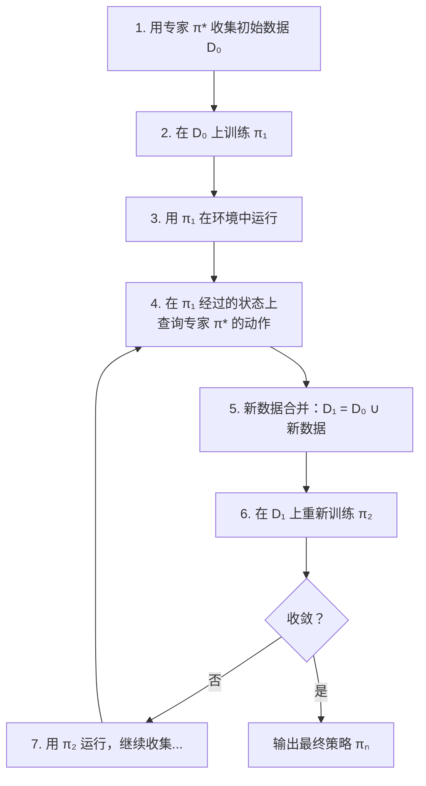

# Ch14: 模仿学习——DAgger / ACT-ALOHA / UMI，你做给它看

> Part 3: 核心主线精读
> 前置章节：[Ch13: 扩散策略——Diffusion Policy / 3D-DP / π0，像擦噪声一样擦出动作](ch13-diffusion-policy.md)
> 后续章节：[Ch15: 世界模型——World Models / Dreamer / Genie / Cosmos Policy](ch15-world-models.md)

---

在 [Ch13](ch13-diffusion-policy.md) 结尾，我们看到 Diffusion Policy、3D-DP、π0 都依赖一个共同的前提——人类示教数据。专家"做给机器人看"，收集（观测，动作）对，然后训练模型模仿。但我们一直在回避一个问题：这个"做给它看"的过程本身就充满了陷阱。数据怎么收集最高效？收集多少条才够？如果机器人执行时偏离了示教轨迹怎么办？

为什么模仿学习在机器人领域如此重要？因为替代方案更难。强化学习（RL）需要奖励函数——但"把衣服叠整齐"的奖励怎么定义？手工编程需要精确的环境模型——但真实世界的物理太复杂。模仿学习绕过了这两个障碍：不需要奖励函数（直接模仿示教），不需要环境模型（端到端从观测到动作）。这让它成为了当前具身 AI 中最实用、落地最快的学习范式。

本章系统回答这些问题。我们从行为克隆的根本缺陷出发，讲 DAgger 如何用"在线纠正"解决分布偏移，ACT-ALOHA 如何用"动作分块 + 低成本硬件"让双臂操作变得可及，UMI 如何用"手持采集器"把示教成本降到最低。这些方法和 Ch13 的扩散策略不是竞争关系——它们解决的是不同层面的问题：Ch13 讲"用什么模型生成动作"，本章讲"怎么收集数据、怎么从数据中高效学习"。

**本章定位**：读完本章，你应该能够：

- 解释行为克隆的分布偏移问题，画出 O(T^2 epsilon) 误差累积的直觉图
- 复述 DAgger 的算法流程，说明它如何把误差从二次降到线性
- 描述 ACT 的 CVAE + Transformer 架构如何用"动作分块"绕过逐步预测的误差累积
- 解释 ALOHA 为什么把双臂系统成本降到两万美元这么重要
- 说明 UMI 如何把数据采集和机器人执行解耦，以及"相对位姿"为什么是跨形态迁移的关键

**不要求**（这些在下半部分或后续章节覆盖）：

- 逆强化学习（IRL）的具体算法推导
- 模仿学习在自动驾驶等非操作领域的应用
- ACT 和 Diffusion Policy 的详细训练代码实现

---

## 1. 引子：教机器人和教小孩

> **一句话预告**：教机器人做事和教小孩骑自行车惊人地相似——光看视频学不会，你得陪着骑、在旁边扶着、设计合适的辅助工具。

### 1.1 三种教法

想象你要教一个小孩骑自行车。

**第一种教法：看视频。** 你给小孩放了 100 段骑自行车的视频，每一帧都标注了"此时应该把车把转多少度、踩踏板用多大力"。小孩认真看完，记住了所有标注。然后你把他放上自行车——他在前三秒还行，因为起步姿势和视频里一样。但一阵风吹来，他往左偏了一点。视频里从来没有"往左偏了之后怎么修正"的画面，因为视频里的专家从不犯错。小孩不知道该怎么做，越偏越远，摔倒。

这就是**行为克隆**（Behavior Cloning, BC）。看起来简单直接，但有个致命缺陷：训练数据只覆盖了"专家的完美轨迹"，一旦偏离就进入了从未见过的状态，后续所有判断都失效。

**第二种教法：陪着骑。** 你让小孩自己骑，你在旁边跑着跟。他往左偏了，你喊"往右转！"；他踩踏板太猛了，你喊"轻一点！"。每次他犯错，你都在他犯错的那个状态下告诉他正确动作应该是什么。骑了十圈之后，小孩不仅知道怎么骑直线，还知道偏了怎么修正——因为他练习过偏了之后怎么办。

这就是 **DAgger**（Dataset Aggregation）。核心洞察：让学生自己犯错，在犯错的状态下由专家标注正确动作，然后把这些"纠错数据"加入训练集。

**第三种教法：辅助轮 + 分段练。** 你给自行车装上辅助轮，让小孩一次只练一个动作片段：先练起步的 5 秒，等起步稳了再练转弯的 5 秒，最后把所有片段串起来。辅助轮保证了他在练习某个片段时不会因为其他片段的不熟练而摔倒。

这就是 **ACT**（Action Chunking with Transformers）的思路。不逐步预测（"先预测第 1 步，执行，再预测第 2 步……"），而是一口气预测 50 步动作——减少了"决策次数"，也就减少了每次决策犯错后误差累积的机会。

### 1.2 本章路线图

这三种教法代表了模仿学习的三个核心方向：

| 方向 | 代表方法 | 核心问题 | 核心答案 |
|------|----------|----------|----------|
| 修复分布偏移 | DAgger (2011) | 学生偏离专家轨迹后怎么办？ | 让学生自己走，专家在旁边纠正 |
| 减少决策次数 | ACT (2023) + ALOHA | 逐步预测误差累积太快？ | 一口气预测 50 步 |
| 降低数据成本 | UMI (2024) | 必须用机器人才能采数据？ | 手持夹爪 + GoPro，任何人任何地方都能采 |

这三个方向不是互斥的。UMI 在部署端用的就是 Ch13 讲的 Diffusion Policy；ACT 的动作分块思想和 Diffusion Policy 的 Ta=8 执行窗口异曲同工。模仿学习是一个大框架，本章的每个方法都是这个框架里的一块拼图。

**时间线**：这些方法的发表跨越了 14 年。DAgger（2011）建立了理论基础；ACT + ALOHA（2023）和 UMI（2024）把这些理论洞察转化成了可用的系统。中间的十多年里，模仿学习一直是一个活跃但进展缓慢的领域——直到低成本硬件和强力模型架构（Transformer、Diffusion）同时成熟，才迎来了 2023-2024 年的爆发。

---

## 2. 行为克隆的致命缺陷

> **一句话预告**：行为克隆把"模仿"简化成了监督学习，但忽略了一个关键区别——监督学习的测试数据和训练数据来自同一分布，而机器人部署时的状态分布和专家示教时的状态分布不同。

### 2.1 从监督学习到行为克隆

行为克隆的思路极其自然。你有一堆示教数据：每条数据是一个（观测，动作）对——"看到这个画面时，专家做了这个动作"。这不就是标准的监督学习吗？输入是观测（图像 + 机器人本体感觉），输出是动作（关节角度或末端位姿），训练就是最小化预测动作和真实动作之间的 loss。

用代码表示：

```python
# 行为克隆：最简单的模仿学习
for observation, expert_action in dataset:
    predicted_action = policy(observation)      # 模型预测
    loss = mse_loss(predicted_action, expert_action)  # 均方误差
    loss.backward()                             # 反向传播
    optimizer.step()                            # 更新参数
```

就这么几行。训练完之后，把 policy 部署到机器人上：每个控制周期读取当前观测，输入 policy 得到动作，执行。看起来没什么问题。

### 2.2 分布偏移：训练和部署不是同一件事

问题出在"部署"这一步。

在训练时，所有的观测都来自**专家的轨迹**。专家开车从来不偏离车道中心，所以训练数据里所有的图像都是"车在路中间"的画面。模型学到的映射是：`车在路中间的画面 → 保持直行`。

部署时，模型的预测不可能完美。假设第一步预测有一个微小误差 epsilon——本该直行，实际上稍微往左偏了一点。现在车偏离了路中间，进入了一个训练数据里**从未出现过**的状态：`车在路中间偏左 2cm 的画面`。

模型没见过这种画面，它会怎么做？它不知道。它可能输出一个随机的动作——也许又偏左了一点。现在车偏了 4cm，模型更加困惑，做出更大的错误动作……

这就是**分布偏移**（distribution shift）：训练数据的分布（专家走过的状态）和部署时的分布（学生走过的状态）不一样。在传统监督学习里（比如图像分类），测试图片和训练图片来自同一分布——你不会在测试时突然拿一张和训练集完全不同类型的图片来考模型。但在行为克隆里，学生的错误会把自己推入从未见过的状态，而在这些状态下模型的预测质量无法保证。

类比：你教一个人开车，只给他看了"晴天在直路上行驶"的视频。考试那天下了大雨，而且路有弯道。他在晴天直路上的部分表现完美——因为这正是他练过的。但一遇到雨天弯道，他完全不知道该怎么做，因为他从未在这种条件下练习过。

### 2.3 误差的二次增长

这不只是直觉上的问题——Ross & Bagnell 在 2010 年严格证明了误差增长的速度。

设每一步预测的误差为 epsilon（模型在训练分布上的平均错误率）。在行为克隆中，误差随时间步的增长关系是：

$$\text{总误差} \leq O(T^2 \cdot \varepsilon)$$

其中 T 是轨迹长度（总时间步数）。误差不是线性增长，而是**二次增长**。

直觉理解：第 1 步的误差 epsilon 把你推到偏离的状态。在偏离的状态下，第 2 步的误差可能是 2epsilon（因为你在一个没见过的状态，犯错概率更大）。第 3 步可能是 3epsilon。累加起来：epsilon + 2epsilon + 3epsilon + ... + T*epsilon = T(T+1)/2 * epsilon，大约是 T^2 * epsilon / 2。

这对实际系统意味着什么？如果一个抓取任务需要 100 个时间步（T=100），即使每步误差只有 1%（epsilon=0.01），BC 的总误差上界是 100^2 * 0.01 = 100——这个数字没有实际意义，但它告诉你误差会失控。而在实验中，BC 策略确实经常在执行到一半时"发散"——动作越来越离谱，最终完全偏离任务目标。

```
误差累积的直觉图：

BC（行为克隆）：
时间步 →  1    2    3    4    5    6    7    8
误差   →  ε   2ε   4ε   7ε   11ε  16ε  22ε  29ε
         小错  偏离  更偏  完全偏离  失控...
         |←——————— O(T²ε) ———————→|

DAgger（后面会讲）：
时间步 →  1    2    3    4    5    6    7    8
误差   →  ε    ε    ε    ε    ε    ε    ε    ε
         小错  修正  小错  修正  小错  修正  ...
         |←——————— O(Tε) ————————→|
```

### 2.4 为什么不能简单地"加更多数据"？

一个自然的想法是：既然问题出在训练数据覆盖不够，那我采集更多数据不就行了？

理论上可以，但实际上不可行。机器人的状态空间是高维连续的——一个 7 自由度机械臂的关节角度就有 7 维，加上末端位姿 6 维、夹爪状态、加上图像观测。你需要在这个高维空间中"密集覆盖"所有可能的状态——不只是专家路径上的状态，还包括所有"犯错后偏离到"的状态。这所需的数据量会随维度指数增长。

另一个想法是"加数据增强"——在训练时人为加入微小扰动，模拟学生犯错后的状态。DAgger 之前的 NVIDIA 论文（Bojarski et al., 2016, 自动驾驶）就用了这个技巧：在自动驾驶中，在中央摄像头之外加了左右两个摄像头，左摄像头的图像模拟"车往右偏了"的状态，标注"往左修正"的动作。这在特定领域确实有效，但它要求你知道"偏离后的修正策略是什么"——对于复杂的机械臂操作任务，这种启发式的数据增强很难设计。

行为克隆的分布偏移问题不是数据量能解决的——它是**算法层面的结构性缺陷**。你需要一种系统性的方法来让学生在自己的状态分布上训练。这就是 DAgger。

用一个具体的机器人例子来感受这一点：假设你要训练机器人把杯子从桌子左边移到右边。专家示教的轨迹是一条从左到右的平滑弧线。BC 模型学到了这条弧线上每个点的"下一步动作"。部署时，如果模型在第 5 步把杯子往前多推了 1cm（而不是沿弧线移动），杯子现在在一个专家从未到过的位置。模型不知道从这个新位置怎么修正回弧线——它可能继续往前推，杯子最终从桌子前沿掉下去。整个失败过程只源于第 5 步 1cm 的误差。

### 2.5 分布偏移在具身 AI 中特别严重

值得强调的是，分布偏移在具身 AI 中比在其他领域更严重。

在自动驾驶中，分布偏移已经是一个被反复讨论的问题——但自动驾驶至少有一些先天优势：道路是结构化的（车道线、交通规则限制了合理状态的范围）、物理约束较强（车不会突然飞起来）。这些约束让"偏离专家轨迹"后的状态空间相对有限。

但在通用机器人操作中，状态空间几乎没有结构性约束。一个杯子可以处于任何位姿（倒了、斜了、悬空了）；一条毛巾可以处于无限多种褶皱形态；多个物体之间的相对位置有指数级的组合。一旦机器人犯了一个错（比如把杯子碰倒了），后续的状态空间和原来完全不同——训练数据中从没出现过"杯子倒了之后怎么办"的情况。

这也是为什么行为克隆在简单的短时任务上（比如单步抓取——看到物体，直接抓住，一步到位）效果还行，但在长时序的复杂任务上（做饭、整理桌面、组装零件）几乎不可用。任务越长，中间"犯小错"的概率越高，"犯错后偏离训练分布"的连锁反应越严重。

本章后面介绍的三种方法分别从不同角度缓解这个问题：DAgger 让学生在犯错后的状态上也有训练数据；ACT 通过减少决策次数降低犯错机会；UMI 通过在更多样的真实环境中采集数据，让训练分布更接近部署分布。

---

## 3. DAgger 深度剖析

> **论文**：Ross, Gordon & Bagnell, "A Reduction of Imitation Learning and Structured Prediction to No-Regret Online Learning", AISTATS 2011
> **一句话总结**：让学生自己开车，在学生走过的状态上问专家"你会怎么做"，把答案加入训练集重新训练，把 BC 的 O(T^2 epsilon) 误差降到 O(T epsilon)。

### 3.1 核心洞察："让学生自己开车"

DAgger 的核心洞察出奇地简单：BC 的问题是学生只在专家的状态分布上训练过，对不对？那就让学生**自己去走**，产生自己的状态分布。在学生走到的每个状态上，问专家"如果是你，在这个状态下你会做什么"，然后把（学生的状态，专家的动作）这个新数据加入训练集。

回到教骑自行车的例子。BC 相当于你只给小孩看了 100 段你骑车的视频——视频里你从不犯错。DAgger 相当于：

1. 小孩先看一些视频，学到一个初步的骑车策略
2. 让小孩自己骑（他肯定会偏、会晃、会差点摔倒）
3. 在他偏的那一刻，你在旁边喊"往右转 15 度！"——这是专家在**学生犯错的状态**下给出的标注
4. 把"车偏了 → 往右转 15 度"这条新经验加入练习记录
5. 小孩消化完新经验后，再骑一圈——这次偏得少了
6. 重复步骤 2-5

经过几轮迭代，小孩不仅知道怎么骑直线（从视频里学的），还知道偏了怎么修正（从自己犯错的经历中学的）。这就是 DAgger 的全部思想。

### 3.2 算法流程

DAgger 的完整算法如下：

**初始化**：
- 专家策略 pi_star（可以是人类遥操作、一个已知的最优控制器等）
- 空的聚合数据集 D = {}

**第 1 轮**：
1. 用专家策略 pi_star 在环境中运行，收集数据集 D_1 = {(s, pi_star(s))}
2. 在 D_1 上训练初始策略 pi_1

**第 i 轮**（i = 2, 3, ...）：
1. 用混合策略运行：以概率 beta_i 使用专家 pi_star，以概率 (1-beta_i) 使用当前学生策略 pi_{i-1}
2. 在运行过程中，对**每个经过的状态 s**，记录专家的标注 pi_star(s)
3. 将新数据加入聚合数据集：D_i = D_{i-1} ∪ {新收集的 (s, pi_star(s))}
4. 在完整数据集 D_i 上重新训练策略 pi_i

**beta 衰减**：beta_i 从 1 逐渐衰减到 0。初期主要由专家控制（保证安全），后期主要由学生控制（让学生充分暴露自己的弱点）。

用赛车游戏做类比：

```
第 1 轮：教练开车（beta=1），学生坐副驾记笔记
        → 收集的全是教练的完美驾驶数据
        → 学生学了一个"初始驾驶模型"

第 2 轮：教练开 80%（beta=0.8），学生开 20%
        → 学生开的那 20% 可能偏离车道
        → 但教练在旁边记录"在这个偏离位置应该怎么修正"
        → 把修正数据加入训练集

第 3 轮：教练开 50%（beta=0.5），学生开 50%
        → 学生的弱点暴露得更多
        → 修正数据也更多

...

第 N 轮：教练不再开（beta=0），学生独立驾驶
        → 学生已经学会了"正常驾驶"和"出错后修正"两套技能
```

用流程图来表示 DAgger 的迭代循环：



### 3.3 理论保证：从二次到线性

DAgger 的理论贡献不只是一个好用的算法——它提供了严格的数学保证。

Ross et al. 将模仿学习**归约**（reduce）为在线学习问题，并证明了：如果使用一个"无悔"（no-regret）的在线学习算法来选择策略，那么经过 N 轮迭代后，最优策略的期望总损失满足：

$$J(\hat{\pi}) \leq J(\pi^*) + O(T \cdot \varepsilon_N)$$

其中 T 是轨迹长度，epsilon_N 是在聚合数据集上最佳策略的平均损失。

和 BC 的 O(T^2 * epsilon) 相比，DAgger 把二次项降成了线性项。这个差距在长时间轨迹上极为显著：

| 轨迹长度 T | 每步误差 epsilon | BC 上界 (T^2 * epsilon) | DAgger 上界 (T * epsilon) | 差距倍数 |
|------------|-----------------|------------------------|--------------------------|----------|
| 10 | 0.01 | 1.0 | 0.1 | 10x |
| 100 | 0.01 | 100 | 1.0 | 100x |
| 1000 | 0.01 | 10000 | 10 | 1000x |

轨迹越长，DAgger 的优势越明显。这解释了为什么 BC 在短时间任务（比如单步抓取）上还行，但在长时间任务（比如做饭、整理房间）上几乎不可用。

**直觉理解**：为什么是线性而不是二次？因为 DAgger 训练的学生**见过自己犯错后的状态**。即使第 t 步犯了小错偏离了轨迹，第 t+1 步的状态对学生来说不再陌生——它在训练数据里见过类似的偏离状态，知道怎么修正。所以每一步的误差都保持在 epsilon 水平，不会像 BC 那样逐步放大。

用更数学的说法：DAgger 让训练分布逐渐逼近学生策略的在线分布。当这两个分布足够接近时，训练时的性能就能可靠地迁移到部署时——分布偏移被消除了。

### 3.4 实验与变体

DAgger 原论文的实验并不在真实机器人上——在 2011 年，低成本机器人平台还不存在。实验选了三个控制/序列预测任务：

**Super Tux Kart（卡丁车赛车游戏）**：

这是最直观的实验。BC 训练的智能体在第一圈还能勉强跑完（因为起始状态和训练数据一致），但第二圈就开始偏离赛道——一个小偏离导致连锁反应，最终冲出赛道。DAgger 训练的智能体即使在前几步偏离了最佳路线，也能自己修正回来，因为它在训练过程中见过"偏离后的状态"。

**Super Mario Bros**：BC 的 Mario 在遇到没见过的敌人布局时手足无措——训练数据里专家总是完美躲避，从不展示"差点被打到之后如何补救"的操作。DAgger 通过让学生自己玩（并犯错），收集了大量"危险状态下的补救动作"数据。经过 15 轮 DAgger 迭代后，学生策略的通关率从 BC 的不到 30% 提升到了 80% 以上。

**手写识别**：序列预测任务。预测笔画时，前一笔的误差会影响后一笔的起始位置——和机器人控制中的误差累积是同一类问题。这个实验清楚地展示了 DAgger 的通用性：它不仅适用于控制任务，任何"输出序列的每一步依赖于前一步"的结构化预测问题都能从 DAgger 中受益。

**实用变体**：

原版 DAgger 有一个明显的实践障碍：它要求专家在**学生走到的每个状态**上都给出标注。如果学生策略很差，它会走到非常奇怪的状态——想象一辆车冲出了公路开到了草地上，你让人类驾驶员标注"在草地上应该怎么开"，这很不自然。

为此，社区发展了多种实用变体：

**HG-DAgger（Human-Gated DAgger）**：人类专家不是被动地标注每个状态，而是主动选择何时介入。当人类觉得学生开始偏离时，按下一个按钮接管控制——只在关键时刻标注，其余时间让学生自己跑。这大大减少了人类专家的标注负担。

**EnsembleDAgger**：用多个模型的集成来估计不确定性。在不确定性高的状态（模型之间分歧大）才查询专家。这是用计算换取人力——让模型自己判断"我在哪些状态上不自信"，只在那些状态上请求专家帮助。

**SafeDAgger**：增加安全约束，在学生策略可能导致危险（比如碰撞）时提前切换到专家控制。适用于真实机器人部署——你不能让一个没训练好的策略在真实环境中随意探索。

### 3.5 局限性：为什么现代方法不都用 DAgger？

DAgger 的理论优雅且实验有效，但它有几个实际限制让它在现代具身 AI 中不再是首选方案：

**限制一：需要交互式专家**。DAgger 要求在训练循环中反复查询专家。对于仿真环境，你可以用一个脚本化的最优策略充当专家。但对于真实机器人任务，专家通常是人类——你需要一个人坐在机器人旁边，每次学生犯错时手动标注正确动作。训练 N 轮，人类就得标注 N 轮。如果每轮需要 1 小时的人类标注，训练 20 轮就需要 20 小时的人类专家时间——这个成本在扩展到多个任务时会迅速变得不可接受。

**限制二：专家在学生的状态分布上可能表现不好**。人类专家擅长在正常状态下做出正确动作。但如果学生策略把机器人推到了一个非常奇怪的状态——比如杯子倒了、物体飞了出去——人类在这种状态下给出的标注质量可能很低。你能标注"杯子正常放着时怎么抓"，但"杯子倒了、旋转着滑向桌边时怎么抓"就很难标注了。

**限制三：不直接处理多模态**。在每个状态下，DAgger 只记录一个专家动作。但正如 Ch13 讨论的，很多任务存在多模态——同一状态下有多个合理动作。DAgger 不区分"哪种模态更好"，也不学习动作的分布。ACT 的 CVAE 和 Diffusion Policy 的扩散去噪在这方面更有优势。

**限制四：不解决示教数据的收集效率**。DAgger 让学生在自己的分布上训练，但没有降低示教的总成本。你仍然需要人类反复标注——只是从"只标注专家轨迹"变成了"也标注学生轨迹"。UMI 从硬件层面降低数据收集成本的思路，和 DAgger 解决的是完全不同的问题。

**与 Diffusion Policy 和 ACT 的关系**：值得注意的是，DAgger 解决的是"在什么分布上训练"的问题，而 Diffusion Policy（Ch13）和 ACT 解决的是"用什么模型生成动作"的问题。这两个层面是正交的。理论上，你可以把 Diffusion Policy 的扩散去噪模型放在 DAgger 的迭代框架里——用扩散策略作为学生，跑 DAgger 迭代来收集纠正数据。但在实践中，Diffusion Policy 通过学习动作分布（而非点估计）已经大大提高了策略的鲁棒性，使得分布偏移的影响减弱到了 DAgger 不再是必需的程度。ACT 则从另一个角度——减少有效决策次数——达到了类似的效果。

**DAgger 的历史地位**：尽管现代方法很少直接使用原版 DAgger，但它的核心思想——"让学生在自己的状态分布上训练"——仍然是模仿学习理论的基石。后续所有方法要么使用了 DAgger 的思路（如 HG-DAgger 在实际系统中的应用），要么需要解释"为什么不需要 DAgger"（如 ACT 通过动作分块减少有效决策次数、Diffusion Policy 通过学习动作分布来提高鲁棒性）。理解 DAgger 就理解了模仿学习问题的根源——分布偏移。

DAgger 的影响也超越了机器人领域。在自然语言处理中，scheduled sampling（Bengio et al., 2015）用了类似的思想：训练文本生成模型时，逐步用模型自己生成的 token 替换真实 token 作为输入——和 DAgger 的 beta 衰减异曲同工。在自动驾驶中，NVIDIA 的 end-to-end learning 系统虽然没有直接用 DAgger 的迭代框架，但用了侧摄像头数据增强来模拟偏离后的修正——本质上是 DAgger 思想的静态近似。这些跨领域的联系说明，分布偏移不是机器人特有的问题，而是所有"序列决策"任务的共性挑战。

---

## 4. ACT 深度剖析

> **论文**：Zhao et al., "Learning Fine-Grained Bimanual Manipulation with Low-Cost Hardware", RSS 2023
> **一句话总结**：用 CVAE + Transformer 一次性预测 50 步动作（动作分块），配合低成本双臂硬件 ALOHA，在 6 个精细双臂任务上达到 80-96% 成功率。

### 4.1 核心洞察："一口气预测 50 步"

ACT 的核心思路和 DAgger 完全不同。DAgger 的策略是"修复分布偏移"——让学生在犯错的状态上也有训练数据。ACT 的策略是"减少犯错的机会"——如果我一次就把未来 50 步全部规划好，那我只需要"做一次决策"，犯错的概率就只有一次 epsilon，而不是 50 次累积的 50 * epsilon。

这就是**动作分块**（Action Chunking）。"Chunking" 这个词借用自认知心理学——人类记忆也通过把零散信息打包成"块"来提高效率（比如记电话号码时按三四位一组来记）。ACT 用同样的策略：把零散的逐步动作打包成一大块来预测。

传统 BC 的工作方式是：

```
观测 → 预测动作 1 → 执行 → 新观测 → 预测动作 2 → 执行 → ...
```

每一步都是一个独立的预测。1000 步任务需要 1000 次独立预测，每次都有犯错的机会，误差随步数累积。

ACT 的工作方式：

```
观测 → 预测动作 1-50（一个 chunk）→ 执行 50 步 → 新观测 → 预测动作 51-100 → ...
```

1000 步任务只需要 20 次预测（1000/50 = 20 个 chunk）。有效决策次数从 1000 降到 20，误差累积的"步数"也从 1000 降到 20。

这和 Ch13 讲的 Diffusion Policy 的执行窗口 Ta=8 是同一思想。Diffusion Policy 预测 16 步、执行 8 步；ACT 预测 50 步、执行 50 步（但用时间集成来平滑）。两者都是通过"减少独立决策次数"来对抗误差累积。

用 BC 的误差分析来量化动作分块的好处：如果 BC 逐步预测的误差上界是 O(T^2 * epsilon)，那么把 T 步分成 T/k 个 chunk（每个 chunk 大小为 k），有效决策次数从 T 变成 T/k，误差上界变成 O((T/k)^2 * epsilon')。虽然 epsilon' 可能比 epsilon 大（因为预测 50 步比预测 1 步更难），但 (T/k)^2 远小于 T^2。以 T=1000, k=50 为例：T^2 = 1,000,000，而 (T/k)^2 = 400——即使 epsilon' 是 epsilon 的 10 倍，总误差仍然降低了 250 倍。

但动作分块带来一个新问题：如果在执行这 50 步的过程中，环境发生了意外变化（比如物体被人移动了），策略无法修正——因为它已经承诺了 50 步的计划。chunk 太大意味着对环境变化的响应太慢——这是误差累积和环境响应之间的 trade-off。ACT 用**时间集成**（temporal ensembling）来缓解这个问题——每隔几步就预测一个新的 chunk，让相邻 chunk 的预测重叠，取加权平均。后面会详细讲。

### 4.2 CVAE 架构：用隐变量处理多模态

ACT 用 CVAE（Conditional Variational AutoEncoder，条件变分自编码器）作为核心生成架构。为什么不用简单的回归（像 BC 那样直接预测动作序列）？因为回归会遇到 Ch13 讲过的模态平均问题。

CVAE 的核心思想：引入一个隐变量 z，让 z 来编码"示教者的风格"——同一个任务，不同人有不同的完成方式，z 捕捉的就是这种差异。

**训练时**（有完整的示教数据可以参考）：

1. 编码器接收完整的示教动作序列 a_{1:50}，压缩成一个隐变量 z
2. z 编码了"这条示教是什么风格的"——快还是慢、从左边还是右边接近
3. 解码器接收（当前观测, z），输出预测的动作序列 a_hat_{1:50}
4. 训练目标：让 a_hat 尽量接近真实 a，同时让 z 的分布接近标准正态分布 N(0,1)

**推理时**（没有示教数据，需要自己生成动作）：

1. 从标准正态分布 N(0,1) 中随机采样一个 z
2. 解码器接收（当前观测, z），输出动作序列
3. 不同的 z 采样 → 不同风格的动作 → 避免模态平均

把 z 想象成一个"风格旋钮"。z 在隐空间中的位置决定了解码器生成什么样的动作。z 在隐空间的"左上角"可能对应"从左边接近物体、快速抓取"，"右下角"对应"从右边接近、缓慢抓取"。训练完成后，隐空间被组织成了一张"风格地图"——不同的 z 位置对应不同但都合理的操作方式。推理时从 N(0,1) 采样就是在这张风格地图上随机选一个点，得到一种合理的操作风格。

```
训练阶段：
                                  ┌─────────────┐
    示教动作序列 a₁...a₅₀ ─────→ │   编码器     │──→ z（隐变量）
                                  └─────────────┘        │
                                                         ↓
    当前观测 o ──────────────────────────────────→ ┌───────────┐
                                                   │  解码器    │──→ 预测动作 â₁...â₅₀
                                                   └───────────┘
    损失 = 重建误差(â vs a) + KL散度(z的分布 vs N(0,1))

推理阶段：
    z ~ N(0,1)（随机采样）─────────────────────→ ┌───────────┐
    当前观测 o ──────────────────────────────────→ │  解码器    │──→ 动作 â₁...â₅₀
                                                   └───────────┘
```

**训练目标**的两个组成部分：

第一项是**重建损失**（reconstruction loss）：让解码器的输出尽可能接近真实的示教动作序列。这就是标准的 MSE loss——和行为克隆一样。

第二项是 **KL 散度正则化**：让编码器输出的 z 分布接近标准正态分布 N(0,1)。这项约束的目的是保证推理时的采样质量——如果训练时编码器把 z 映射到了某个奇怪的分布（比如集中在一个角落），推理时从 N(0,1) 采样就会采到编码器从没见过的区域，生成的动作质量就无法保证。KL 散度把编码器的输出"拉回"到 N(0,1) 附近，确保了训练分布和采样分布的一致性。

总训练损失：L = MSE(a_hat, a) + beta * KL(q(z|a, o) || N(0,1))，其中 beta 是一个超参数，控制重建精度和隐变量正则化之间的权衡。beta 太大会导致 z 被压缩成无信息的噪声（posterior collapse——CVAE 的经典问题），beta 太小会导致推理时采样质量差。ACT 的论文中将 beta 设为 10，经实验验证这个值在多个任务上效果稳定。

和 Diffusion Policy 的对比：两者都能处理多模态，但机制不同。Diffusion Policy 通过不同的初始噪声到不同的去噪路径到不同的动作。CVAE 通过不同的 z 采样到不同风格的解码到不同的动作。殊途同归，但 Diffusion Policy 的表达能力通常更强（扩散模型可以逼近任意连续分布），而 CVAE 的推理速度更快（只需一次前向传播，不需要迭代去噪）。

### 4.3 Transformer 编码器-解码器

ACT 的具体网络实现基于 Transformer 的编码器-解码器结构（和 NLP 中的机器翻译模型类似）：

**编码器**处理输入：

- 当前观测图像 → 通过 ResNet-18 提取视觉特征
- 机器人本体感觉（关节角度 + 末端位姿）
- 隐变量 z（从 CVAE 编码器或随机采样得到）
- 这些特征拼接后通过 Transformer 编码器的自注意力层，让不同模态的信息互相交互

**解码器**生成输出：

- 50 个可学习的"动作查询"（action queries）作为 Transformer 解码器的输入
- 每个查询通过交叉注意力（cross-attention）关注编码器的输出
- 50 个查询各自独立地预测一个时间步的动作
- 输出：50 个动作步 = 一个完整的 chunk

为什么用 Transformer？因为注意力机制天然擅长处理序列到序列（sequence-to-sequence）的映射。50 个动作查询可以并行计算（不需要像 RNN 一样逐步生成），同时每个查询通过交叉注意力能"看到"完整的观测信息。这既高效又能建模动作步之间的依赖关系。

更具体地说：50 个 action queries 之间通过解码器的自注意力（self-attention）互相通信——第 1 步的动作预测能"看到"第 50 步在预测什么，反过来也一样。这种全局通信让整个 chunk 内部是协调一致的——你不会得到"前 25 步往左走、后 25 步突然往右走"这种自相矛盾的预测。

这和 Ch13 中 Diffusion Policy 的 Transformer 架构有相似之处：DP 也用 Transformer 来处理动作序列。但 DP 的 Transformer 接收的是含噪动作序列（作为去噪过程的一部分），而 ACT 的 Transformer 接收的是可学习查询（action queries）。DP 需要多步迭代去噪，ACT 只需一步前向传播。

### 4.4 时间集成：重叠的 chunk 怎么融合？

动作分块的一个实际问题：如果严格按照"预测 50 步、全部执行完、再预测下一个 50 步"的方式运行，chunk 边界处会出现不连续——第 50 步和第 51 步（来自不同 chunk 的预测）可能有跳变。

ACT 用**时间集成**（temporal ensembling）来解决这个问题。方法是：不等一个 chunk 全部执行完再预测下一个 chunk，而是每隔几步就预测一个新 chunk。这样同一个时间步会被多个 chunk 覆盖，取加权平均：

```
chunk 1:  a₁  a₂  a₃  a₄  a₅  a₆  a₇  a₈  a₉  a₁₀ ...
chunk 2:       a₁' a₂' a₃' a₄' a₅' a₆' a₇' a₈' a₉' ...
chunk 3:            a₁" a₂" a₃" a₄" a₅" a₆" a₇" a₈" ...

时间步 3 的最终动作 = w₁·a₃ + w₂·a₂' + w₃·a₁"
```

权重采用**指数加权**：越新的 chunk 权重越高（w_new > w_old）。具体来说，如果一个 chunk 是在 k 步之前预测的，它的权重正比于 exp(-m * k)，其中 m 是衰减系数。m 越大，旧预测被遗忘得越快；m=0 时所有 chunk 的权重相等（简单平均）。

为什么用指数衰减而不是简单地只用最新的 chunk？因为纯用最新 chunk 会导致动作不平滑——每次新 chunk 的预测可能和旧 chunk 有微小差异，直接切换会产生抖动。指数衰减提供了"软切换"——新 chunk 逐渐接管、旧 chunk 逐渐退出，动作过渡更平滑。但旧 chunk 的预测也不无限保留——指数衰减确保了"很老的"预测权重趋近于零，不会拖累当前决策。

这和 Ch13 中 Diffusion Policy 的 Ta < Tp 机制是同一个思路的不同实现：DP 预测 16 步但只执行前 8 步（后 8 步丢弃），ACT 预测 50 步但用时间集成让多个 chunk 的预测融合。两者的目标一样——在"减少决策次数"和"保持对环境变化的响应能力"之间找平衡。

### 4.5 关键数字

ACT 在 ALOHA 硬件上的表现：

| 任务 | 描述 | 成功率 | 示教数量 |
|------|------|--------|----------|
| 穿拉链绳 | 把拉链绳穿过扣眼 | 96% | 50 |
| 插电池 | 把电池插入插槽 | 88% | 50 |
| 开杯盖 | 拧开杯子盖子 | 90% | 50 |
| 开水龙头 | 转动水龙头 | 94% | 50 |

96% 的穿拉链绳成功率是这项工作最惊人的数字。这个任务需要双手精确配合——一只手拿住拉链绳，另一只手对准扣眼——对人类来说都不容易。ACT 只用了 50 条示教就达到了接近完美的成功率，说明动作分块 + CVAE 的组合确实有效。

每个任务只用 50 条示教——这个数据效率是 ACT 的另一个亮点。对比 Ch11 的 RT-1 需要 13 万条数据、Ch13 的 π0 需要百万量级数据，ACT 以极少的数据在特定任务上达到了极高的成功率。当然，代价是 ACT 学的是单任务策略，不具备跨任务泛化能力——但对于工业应用中"做好一件事"的场景，这个 trade-off 是划算的。

**与基线的对比**：ACT 论文中和标准 BC（逐步预测、无 CVAE）以及 IBC（Implicit Behavior Cloning，基于能量模型的 BC 变体）做了对比。标准 BC 在同样的 ALOHA 任务上成功率平均低 30-40 个百分点——这直接验证了动作分块对抗误差累积的效果。IBC 的成功率介于 BC 和 ACT 之间，说明学习动作分布比点估计确实有帮助，但不如 ACT 的 CVAE + 动作分块组合有效。

**50 条示教的含义**：50 条示教意味着一个人类操作者需要在 ALOHA 上完成 50 次完整的任务演示。以穿拉链绳为例，每次演示约 30 秒（加上重置环境的时间约 1 分钟），50 条数据的采集总耗时约 1 小时。这个数据成本对一个研究项目来说几乎可以忽略不计——这也是 ACT 被广泛采用的原因之一。

---

## 5. ALOHA 硬件深度剖析

> **一句话预告**：ACT 不只是一个算法——它和 ALOHA 这个低成本双臂硬件是联合设计的。好的硬件让好的算法能落地，好的算法让硬件的价值最大化。

### 5.1 "两万美元的双臂实验室"

在 ALOHA 之前，做双臂机器人操作研究的门槛极高。一个典型的工业级双臂系统（比如两台 Franka Panda 机械臂 + 力控 + 遥操作设备）的成本在 20 万美元以上。全世界只有少数顶级实验室能负担得起。

ALOHA 把这个成本降到了约 2 万美元——10 倍的降幅。

**硬件组成**：

- 4 台 ViperX 300 6-DoF 机械臂（Trossen Robotics 出品，每台约 5000 美元）
- 其中 2 台是"领导臂"（leader arms）：人类直接操作，没有执行器——纯粹做位置输入
- 另外 2 台是"跟随臂"（follower arms）：带执行器，镜像复现领导臂的动作
- 固定框架：铝型材搭建
- 摄像头：若干 USB 摄像头提供视觉观测

**领导-跟随遥操作**：这是 ALOHA 数据收集的核心机制。人类操作者抓住两个领导臂，做出想要的动作——比如拿起一根拉链绳、穿过扣眼。领导臂上的编码器实时读取关节角度，通过位置控制指令发送给跟随臂，跟随臂即时镜像这些动作。

这种遥操作方式的优点是**直觉性**。你不需要操纵手柄或键盘来控制机器人——你直接用手"带着"机器人做动作。领导臂和跟随臂的运动学结构完全相同，所以映射是一对一的：你的手腕转了 30 度，跟随臂的手腕也转 30 度。

自由度计算：每只臂 6 个关节自由度 + 1 个夹爪 = 7 DoF。两只臂 = 14 DoF。这就是 ACT 需要在每个时间步预测的动作维度——14 个连续值。

一个重要的设计选择：领导臂没有电机。这意味着操作时没有重力补偿——你需要自己承担领导臂的重量。这让长时间操作比较累（一次示教 30 秒还行，连续做 100 次就很疲劳）。之所以不加电机，是因为电机会增加成本（每台臂多约 2000 美元）和控制复杂度。ALOHA 选择了"便宜但稍累"而非"舒适但贵"的 trade-off。后来的 Gello 遥操作方案（Gello, 2024）尝试用弹簧重力补偿代替电机，在不增加太多成本的前提下减轻操作者负担——这是硬件设计中典型的工程权衡。

### 5.2 为什么便宜这么重要？

成本降低带来的不仅是"更多实验室买得起"这么简单。它有两个更深层的影响：

**第一，数据规模**。模仿学习的性能和示教数据量直接相关。如果每个实验室只有一台 20 万美元的双臂系统，数据采集速度受硬件瓶颈限制。如果同样 20 万预算能买 10 套 ALOHA，那数据采集速度就是 10 倍。数据驱动的方法中，硬件成本的降低直接转化为模型性能的提升。

**第二，可复现性**。科学研究的核心是可复现性——别的团队能重复你的实验。如果你的结果依赖一套 20 万美元的专有硬件，全世界只有少数人能复现。ALOHA 的硬件设计、软件和训练好的模型全部开源，任何团队花 2 万美元就能搭建完全相同的实验平台。这大大加速了整个领域的研究进度。

ALOHA 论文发表后，全球超过 100 个实验室搭建了自己的 ALOHA 系统——这个扩散速度在机器人硬件领域是前所未有的。

这里有一个更深层的启示。在 AI 的纯软件领域，"开源"已经是常态——PyTorch、Hugging Face 模型库让任何人都能复现和改进最新的算法。但在机器人领域，硬件的开源一直是个难题：你开源了 CAD 图纸，别人还要采购零件、组装、调试，门槛远高于 `pip install`。ALOHA 的成功经验是：硬件设计要足够简单（只用现成的商业化机械臂 + 铝型材框架，不需要定制零件），BOM 成本要足够低（2 万美元，而不是 20 万），组装说明要足够详细。这三个条件缺一不可，才能实现硬件领域的"真正开源"。

### 5.3 Mobile ALOHA：加上轮子

原版 ALOHA 是固定在桌面上的——双臂的工作范围局限于桌面区域。2024 年发布的 Mobile ALOHA 在底部加了一个移动底盘（AgileX Tracer），让 ALOHA 可以在房间里移动。

这个看似简单的改动大大扩展了任务范围。固定 ALOHA 只能做桌面操作（拧瓶盖、穿拉链），Mobile ALOHA 可以做"全身"任务：

- 走到厨房灶台前 → 打开柜子 → 拿出平底锅 → 放到灶台上 → 倒油 → 炒虾
- 走到电梯前 → 按按钮 → 等电梯门打开 → 走进去
- 走到椅子旁 → 推椅子到桌子下面

这些任务需要导航（移动底盘控制）+ 操作（双臂控制）的协调——这就是"移动双臂操作"（mobile bimanual manipulation），是具身 AI 中最接近人类日常能力的任务类型之一。

**Co-training 技巧**：Mobile ALOHA 最有意思的技术贡献是**协同训练**（co-training）。研究者发现，把 Mobile ALOHA 的示教数据和原版固定 ALOHA 的示教数据**混在一起**训练，效果比只用 Mobile ALOHA 数据更好。

这违反了直觉——固定 ALOHA 的数据不包含任何移动信息，按道理对移动任务应该没有帮助。但实际上，固定 ALOHA 的桌面操作数据教会了策略精细的双臂控制技能（抓、拧、穿），这些技能在移动场景中同样需要。Co-training 相当于给策略"补了课"——用丰富的桌面操作数据增强了双臂控制的基本功，让策略在移动场景中也能做出更精细的操作。

具体实现上，co-training 的处理方式很简单：固定 ALOHA 的数据只有 14 DoF（双臂），Mobile ALOHA 的数据有 16 DoF（双臂 + 底盘）。混合时，固定 ALOHA 的数据把底盘维度填零（"不移动"），然后和 Mobile ALOHA 数据一起训练。这种做法本质上是一种**数据增强**——告诉策略"即使你不需要移动底盘，双臂操作的基本功也要练好"。这和预训练（pre-training）+ 微调（fine-tuning）的思路异曲同工：固定 ALOHA 数据像预训练数据一样提供通用技能，Mobile ALOHA 数据像微调数据一样教具体的移动任务。

关键数字：每个移动任务只用约 50 条示教，在多个任务上达到 80% 以上成功率。结合 co-training 后，平均成功率还能进一步提升 10-20 个百分点。

### 5.4 ALOHA 2：硬件迭代

2024 年发布的 ALOHA 2 是硬件层面的升级：

- 更高精度的关节编码器：位置追踪更准确，特别是在快速运动时
- 改进的线缆管理：原版 ALOHA 在双臂交叉操作时，线缆容易缠绕和卡住；ALOHA 2 重新设计了走线路径
- 优化的夹爪设计：更稳定的开合机构，减少抓取时的滑动

成本仍在同一量级（约 2 万美元），但可靠性和精度有显著提升。ALOHA 2 被用于 Google DeepMind 的"ALOHA Unleashed"项目——探索用自动化方式大规模收集 ALOHA 数据，减少对人类遥操作者的依赖。

ALOHA 系列的演进（ALOHA → Mobile ALOHA → ALOHA 2）展示了一个重要的研究策略：先做一个最简可用的硬件（ALOHA），用它验证算法（ACT），然后根据实际使用中发现的瓶颈迭代硬件（Mobile ALOHA 加底盘解决活动范围、ALOHA 2 改线缆解决缠绕）。硬件和算法的协同进化——这也是具身 AI 和纯软件 AI 最大的不同之处。

三代 ALOHA 硬件的对比：

| 特性 | ALOHA (2023) | Mobile ALOHA (2024) | ALOHA 2 (2024) |
|------|-------------|-------------------|---------------|
| 底盘 | 固定桌面 | AgileX Tracer 移动底盘 | 固定桌面 |
| 臂型 | ViperX 300 × 4 | ViperX 300 × 4 | ViperX 300 × 4（改进版） |
| 动作空间 | 14 DoF（双臂） | 16 DoF（双臂 + 底盘线速度/角速度） | 14 DoF |
| 成本 | ~$20K | ~$32K（含底盘） | ~$20K |
| 典型任务 | 桌面精细操作 | 全屋移动操作 | 桌面精细操作（更高精度） |
| 开源状态 | 完全开源 | 完全开源 | 完全开源 |

---

## 6. UMI 深度剖析

> **论文**：Chi et al., "Universal Manipulation Interface: In-The-Wild Robot Teaching Without In-The-Wild Robots", RSS 2024
> **一句话总结**：用手持夹爪 + GoPro 相机采集示教数据，通过 SLAM 定位和姿态重定向部署到任意兼容机器人，把数据采集和机器人硬件彻底解耦。

### 6.1 核心问题："一定要用机器人采数据吗？"

ALOHA 解决了硬件成本问题——2 万美元就能搭一套双臂系统。但还有一个更根本的约束没有解决：**数据采集必须在机器人上完成**。

想象你要训练机器人在各种厨房里做菜。用 ALOHA 的方式，你需要把 ALOHA 搬到不同的厨房里——你家的厨房、你朋友家的厨房、公司食堂的厨房——在每个厨房里做 50 次遥操作示教。这在实际操作中非常不便：ALOHA 重约 30 公斤，需要稳定的桌面，搬运和安装都需要时间。

UMI 的核心洞察：**数据采集不需要机器人**。

UMI 设计了一个手持式的数据采集装置——本质上就是一个 3D 打印的夹爪手柄上装了一台 GoPro 相机。任何人拿着这个装置，像正常使用工具一样完成任务（打开抽屉、拿起杯子、擦桌子），GoPro 记录第一人称视频，同时通过 SLAM（同时定位与建图）算法追踪夹爪在三维空间中的位姿。

采集完数据后，把这些（视频帧，夹爪位姿）的轨迹数据转换成机器人能执行的格式，训练策略模型（用的是 Ch13 讲的 Diffusion Policy），然后部署到任何兼容的机器人上。

一句话总结 UMI 的理念：**在任何地方、让任何人采集数据；在任何机器人上部署策略**。

### 6.2 硬件设计

UMI 的数据采集硬件极度简洁：

**夹爪手柄**：3D 打印的外壳，内部是一个渔具夹爪机构（fishing gripper mechanism）——对，就是用来夹鱼的那种弹簧夹。人类用手捏手柄来控制夹爪的开合。成本：3D 打印材料约 10 美元 + 弹簧夹约 5 美元。

**GoPro HERO 11**：安装在夹爪手柄上，提供第一人称（egocentric）视角的高质量视频。GoPro 被选中的原因不只是画质好——它内置 IMU（惯性测量单元），配合视觉 SLAM 算法可以提供准确的 6-DoF 位姿估计。

**位姿追踪**：GoPro 录制的视频通过离线 SLAM 处理，提取每一帧的相机位姿（在三维空间中的位置 + 朝向）。SLAM（Simultaneous Localization and Mapping，同时定位与建图）的工作原理简单来说就是：从视频中检测视觉特征点（比如桌角、物体边缘），跟踪这些特征点在连续帧中的运动，结合 IMU 的加速度和角速度数据，反推相机自身在三维空间中的运动。由于夹爪和相机的相对位置固定（3D 打印的刚性连接），相机位姿直接对应夹爪位姿。

SLAM 的精度对 UMI 至关重要。如果位姿估计偏差超过 1-2cm，转换到机器人执行时就可能抓不准物体。GoPro HERO 11 的 IMU + 视觉 SLAM 组合在纹理丰富的环境中可以达到亚厘米级精度——对大多数夹爪操作任务来说足够了。

整套数据采集装置的成本不到 500 美元（GoPro 约 400 美元 + 3D 打印件约 15 美元 + 弹簧机构约 5 美元），而且重量不到 500 克，可以装进背包带到任何地方。

和 ALOHA 的对比：ALOHA 需要一整套机器人系统（2 万美元，30 公斤），而且只能在实验室里采数据。UMI 只需要一个手持装置（500 美元，500 克），可以在厨房、办公室、咖啡厅——任何你想让机器人工作的真实场景中采数据。

### 6.3 数据管线

UMI 的数据从"人手持夹爪做演示"到"机器人执行策略"，经过五个阶段：

**阶段一：手持采集**。人类拿着 UMI 夹爪执行任务——比如打开一个抽屉、把杯子从桌上拿到架子上。GoPro 记录整个过程的视频。人类在采集时只需要自然地完成任务，不需要任何机器人操作经验。

**阶段二：SLAM 位姿提取**。采集结束后，在电脑上用 SLAM 算法处理 GoPro 视频。SLAM 利用视频中的视觉特征点 + IMU 数据，估计每一帧相机的 6-DoF 位姿（3 维位置 + 3 维朝向）。同时从视频中提取夹爪的开合状态（通过检测夹爪指尖的距离）。

**阶段三：相对位姿计算**。这一步是 UMI 实现跨形态迁移的关键。不直接使用绝对位姿（"夹爪在世界坐标系中的位置"），而是计算**相对位姿**——夹爪相对于工作台面（或某个参考点）的相对位置和朝向。

为什么要用相对位姿？因为绝对位姿包含了采集环境的信息——"夹爪在这个特定厨房中距离地面 1.2 米"这个信息在另一个厨房里毫无意义（另一个厨房的灶台高度可能不同）。相对位姿只记录"夹爪从当前位置向前移动 10cm、向下移动 5cm、顺时针旋转 15 度"，这种描述是环境无关的。

**阶段四：策略训练**。把（视频帧，相对位姿轨迹）作为训练数据，训练一个 Diffusion Policy 模型。Diffusion Policy 在 Ch13 已经详细讲过——以观测（图像）为条件，通过迭代去噪生成动作序列（这里是相对位姿轨迹）。

**阶段五：机器人部署**。把训练好的策略加载到机器人上。机器人的相机提供实时视觉观测，策略输出相对位姿，通过逆运动学（IK）转换成机器人的关节指令。

注意这五个阶段的时间分配：阶段一和二是离线的数据采集和处理过程，可以在没有机器人的情况下完成。阶段三和四是标准的数据预处理和模型训练，用 GPU 服务器即可。只有阶段五需要物理机器人。这意味着**数据采集的 90% 工作不需要机器人参与**——这就是 UMI "解耦"数据采集和机器人执行的核心含义。

```
完整数据流：

[人类手持 UMI 做演示]
        │
        ↓
[GoPro 视频 + IMU 数据]
        │
   SLAM 处理
        │
        ↓
[每帧的 6-DoF 绝对位姿 + 夹爪状态]
        │
   相对位姿变换
        │
        ↓
[（视频帧，相对位姿）训练数据对]
        │
   Diffusion Policy 训练
        │
        ↓
[训练好的策略模型]
        │
   部署到任意兼容机器人
        │
        ↓
[UR5 / Franka / ...]
```

### 6.4 跨形态迁移：为什么"相对位姿"是关键

UMI 最令人兴奋的特性是**跨形态迁移**（cross-embodiment transfer）——用人手持采集的数据，部署到不同品牌、不同构型的机器人上。同一份示教数据在 UR5（6-DoF 工业臂）和 Franka Emika（7-DoF 研究臂）上都能工作。

这靠的就是相对位姿表示。

如果用绝对位姿训练，策略学到的是"把末端执行器移动到世界坐标 (0.5, 0.3, 0.8)"。但 UR5 和 Franka 的基座位置不同、臂长不同、工作空间不同——同一个世界坐标在 UR5 上可能可达，在 Franka 上可能超出工作范围。

如果用相对位姿训练，策略学到的是"从当前位置向前 10cm、向下 5cm"。只要目标机器人能执行这种相对运动（大多数机械臂都能），策略就可以迁移。具体到不同机器人时，只需要一个简单的"重定向"（retargeting）层——把相对位姿指令通过逆运动学（Inverse Kinematics, IK）转换成该机器人的关节角度。逆运动学是机器人学中一个经典问题：给定末端执行器的目标位姿，计算每个关节应该转到什么角度。这是一个已经被解决得很好的问题——每个机器人厂商都会提供自己的 IK 求解器。所以 UMI 的重定向层不需要任何学习，只需要调用目标机器人的 IK 接口。

这和 π0 的跨机体训练（Ch13）是完全不同的路径。π0 需要在所有目标机器人的数据上联合训练一个统一模型。UMI 不需要目标机器人的数据——训练数据全部来自人手持采集，迁移是在部署时通过重定向完成的。UMI 的方式更轻量（不需要预先收集每种机器人的数据），但也更受限（只适用于末端执行器操作任务——夹爪的开合和移动；不适用于需要利用特定机器人形态的任务，比如双臂协调）。

### 6.5 野外数据采集：从实验室到真实世界

UMI 最具实践意义的贡献可能不是算法，而是它改变了"在哪里采集数据"这个问题的答案。

传统机器人数据采集的场景几乎全是实验室——控制好的光照、固定的桌面、标准化的物体。这导致了一个慢性问题：在实验室里训练的策略，部署到真实世界（厨房、仓库、医院）时性能大幅下降。因为真实世界有不同的光照、不同的桌面材质、不同形状的物体、不可预测的背景干扰。

UMI 让你可以**直接在目标环境中采集数据**。你想让机器人在厨房里工作？拿着 UMI 夹爪去厨房做 50 次演示。你想让机器人在办公室整理文件？去办公室做 50 次演示。你想让机器人在咖啡厅清理桌面？去咖啡厅做 50 次。

"野外"数据（in-the-wild data）的多样性天然包含了真实世界的复杂性——不同光照、不同物体外观、不同背景。用这些数据训练的策略比实验室数据训练的策略有更好的泛化能力——因为它在训练时就见过了真实世界的多样性。

这和计算机视觉领域的经验一致：ImageNet 上训练的模型之所以泛化能力强，不是因为算法多好，而是因为 ImageNet 包含了足够多样的图像。同理，UMI 让你能轻松采集"足够多样的操作数据"，而不需要在实验室里人工设计各种干扰因素来模拟真实世界。

而且，数据采集不需要机器人专业知识。任何人——实习生、厨师、清洁工——只要拿着 UMI 夹爪完成一次任务，就贡献了一条高质量的训练数据。这从根本上解决了"机器人数据采集瓶颈"——不需要等机器人专家有空，不需要把昂贵的机器人搬到目标场景，不需要在每个新环境中重新设置和标定。

### 6.6 关键数字与局限性

**性能**：UMI 在杯子翻转（cup flipping）和杯子排列等任务上的表现和用机器人直接采集的示教数据训练的策略相当——这说明手持采集的数据质量足以支撑策略学习，不存在"因为不是机器人采的所以数据不好用"的问题。

**效率**：一个人拿着 UMI 在一个场景中采集 50 条示教大约需要 1-2 小时（每条示教约 30 秒，加上重置环境的时间）。同样的 50 条示教如果用 ALOHA 采集，也大约需要同样的时间——但 ALOHA 需要先搬运安装（额外 1-2 小时），而 UMI 拿上就走。

**跨环境泛化**：UMI 论文中一个关键实验是在完全不同的环境中测试。数据在一个厨房采集，但部署的机器人在另一个从未见过的厨房里。结果显示，在新厨房中的成功率相比训练厨房只下降了约 10-15 个百分点——这对零样本跨环境迁移来说是一个非常好的结果。如果在新厨房中额外采集少量数据（10-20 条）并混合训练，性能可以恢复到接近原始水平。

**局限性一：只适用于夹爪操作**。UMI 的数据采集装置就是一个夹爪——它只能记录夹爪的位姿和开合状态。对于需要灵巧手（dexterous hand）的任务（比如旋转螺丝刀、弹钢琴），UMI 无法采集相应的示教数据。对于需要双臂协调的任务（ALOHA 的优势领域），单个 UMI 夹爪也力不从心——虽然理论上可以用两个 UMI 夹爪同时采集，但 SLAM 的精度和双手协调的同步都是挑战。

**局限性二：SLAM 精度依赖环境**。SLAM 需要视觉特征点来追踪相机位姿。在纹理丰富的环境中（比如有很多物体的厨房台面），SLAM 工作良好。但在纹理贫乏的环境中（比如白色空旷的桌面、反光的金属表面），SLAM 可能丢失追踪或精度下降。这会直接影响提取的位姿质量，进而影响策略训练。

**局限性三：不支持力反馈**。人类手持 UMI 时能感受到物体的重量和阻力（比如抽屉拉到底的阻力），但这些力信息不会被记录。如果任务依赖力感知（比如精确拧紧螺丝到特定扭矩），UMI 采集的纯位姿数据就不够用了。

**UMI vs ALOHA 的选择指南**：

| 维度 | 选 ALOHA | 选 UMI |
|------|---------|--------|
| 操作类型 | 双臂精细协调（穿拉链、折叠衣物） | 单臂夹爪操作（开抽屉、拿杯子） |
| 环境多样性 | 固定实验室环境 | 需要在多个真实环境采集 |
| 力反馈需求 | 需要（通过遥操作感受阻力） | 不需要（纯位姿记录） |
| 操作者技能 | 需要适应领导臂操作 | 任何人都能上手 |
| 硬件成本 | ~$20K（固定）/ ~$32K（移动） | ~$500 |
| 部署机器人 | ALOHA 自身 | 任意兼容机械臂 |

如果你两者都需要（双臂 + 多环境），目前还没有完美方案——这是一个活跃的研究前沿。

---

## 7. 检查点

以下问题覆盖本章前半部分的核心概念。能回答说明你理解了技术要点。不需要一次全部回答——建议先尝试自己回答，卡住再看提示。如果某个问题完全无头绪，说明对应的章节需要重读。

**行为克隆**：

1. BC 的分布偏移问题的根本原因是什么？如果训练数据无限多（覆盖所有可能的状态），BC 还会有分布偏移问题吗？
   - 提示：想想"训练分布"和"部署分布"的定义——无限数据覆盖的是哪个分布？
2. O(T^2 * epsilon) 这个上界意味着什么？如果一个任务的轨迹长度从 100 增加到 200，误差上界变成原来的几倍？
   - 提示：200^2 / 100^2 = ?
3. 为什么"加数据增强"不能根本解决 BC 的分布偏移问题？
   - 提示：数据增强模拟的扰动和真实执行中的偏离有什么不同？

**DAgger**：

4. DAgger 算法中 beta_i 参数的作用是什么？如果 beta 始终为 1（永远用专家），DAgger 退化成什么？如果 beta 始终为 0？
   - 提示：beta=1 意味着状态分布由谁产生？
5. DAgger 把误差从 O(T^2 epsilon) 降到 O(T epsilon) 的关键原因是什么？用一句话概括。
   - 提示：关键词是"训练分布"和"部署分布"的关系。
6. HG-DAgger 和 EnsembleDAgger 各自用什么方式减少对专家的依赖？它们的共同思路是什么？
   - 提示：两者的共同点是"不需要标注每一个状态"。

**ACT**：

7. 动作分块如何降低误差累积？如果 chunk 大小从 50 增加到 100，对误差累积有什么影响？有没有 chunk 太大的风险？
   - 提示：想想"有效决策次数"这个概念。chunk 越大，对环境变化的响应呢？
8. ACT 中 CVAE 的隐变量 z 编码了什么信息？如果去掉 z（直接用观测预测动作序列），会出现什么问题？
   - 提示：回顾 Ch13 中"模态平均"问题。
9. 时间集成中为什么新 chunk 的权重更高？在什么情况下这个设计可能出问题？
   - 提示：如果环境在两个 chunk 之间没有变化呢？

**ALOHA**：

10. ALOHA 的领导-跟随遥操作为什么比手柄/键盘控制更直觉？这种方式有什么局限？
    - 提示：领导臂和跟随臂的运动学关系是什么？
11. Mobile ALOHA 的 co-training 为什么有效？用固定 ALOHA 数据增强移动任务的直觉是什么？
    - 提示：双臂操作技能是否跨场景通用？

**UMI**：

12. UMI 用"相对位姿"而非"绝对位姿"的关键原因是什么？这对跨形态迁移为什么重要？
    - 提示："向前移动 10cm"vs"移动到坐标 (0.5, 0.3, 0.8)"——哪个更通用？
13. UMI 的数据采集方式在什么类型的任务上效果好？什么类型的任务上可能失效？
    - 提示：UMI 的硬件本质是一个夹爪——它能记录什么、不能记录什么？

---

## 8. 过渡：从方法到系统

> **一句话预告**：前半部分的三个方法各自解决了模仿学习的一个核心挑战；下半部分将它们放在一张统一的全景图中，并补齐从模仿到强化学习的连续谱。

本章前半部分建立了模仿学习的三大支柱：DAgger 从理论上解决了分布偏移（BC 的根本缺陷），ACT-ALOHA 从架构和硬件两端让双臂操作变得可及，UMI 从数据采集层面打破了"必须用机器人才能采数据"的限制。

但几个系统层面的问题还没有回答：

这三种方法之间如何选择？如果你面对一个新任务，你应该用 DAgger、ACT、还是 UMI？选择取决于什么条件——是否有交互式专家、是否需要双臂、任务环境是否多样？下半部分将给出一个决策框架。

这些方法和 Ch13 的 Diffusion Policy 如何组合？UMI 已经在用 Diffusion Policy 做策略训练——模仿学习方法和动作生成方法不是替代关系，而是可以自由组合的模块。下半部分会画一张"模仿学习全景图"，展示各个方法在框架中的位置。

最新的进展——如 ALOHA Unleashed（自动化数据收集）、Gello（另一种低成本遥操作方案）——如何推进了这个领域？以及，模仿学习的终极问题：如果示教数据永远不够用，我们是否需要一种不完全依赖示教的方法？这个问题把我们引向下一章（Ch15：世界模型）的核心动机。

此外，本章前半部分聚焦的是单个方法的深度解析。下半部分将拉高视角，画一张模仿学习的全景图——把 BC、DAgger、ACT、Diffusion Policy、UMI 这些方法放在一个统一的分类体系中，看它们各自在"数据收集"、"策略表示"、"训练范式"这三个维度上做了什么选择。这张全景图的目标是让你在面对一个新的模仿学习任务时，能快速判断"我应该用哪种方法组合"。

最后，下半部分会讨论模仿学习和强化学习（Reinforcement Learning, RL）之间的关系——两者不是非此即彼的选择，而是一个连续谱。从纯 BC（只用示教数据）到 DAgger（需要在线专家）到 IRL（从示教中推断奖励函数）到 RL fine-tuning（先模仿学习初始化，再用奖励信号微调），数据效率和自主性之间存在根本性的 trade-off。理解这个连续谱，就理解了具身 AI 学习范式的全貌。

简单预览这个连续谱：

| 方法 | 数据来源 | 是否需要奖励 | 数据效率 | 自主性 |
|------|----------|-------------|----------|--------|
| 纯 BC | 离线示教 | 否 | 高 | 低 |
| DAgger | 示教 + 在线专家 | 否 | 中 | 中 |
| IRL | 从示教推断奖励 | 间接 | 中 | 中高 |
| RL fine-tuning | 示教初始化 + 自主探索 | 是 | 低 | 高 |
| 纯 RL | 自主探索 | 是 | 很低 | 最高 |

本章前半部分覆盖了这个谱的前两项（BC 和 DAgger），以及 ACT 和 UMI 这两个降低数据成本的实践系统。下半部分会完成剩余的拼图——特别是 IRL 和 RL fine-tuning 如何让策略从"纯模仿"走向"自主改进"。

---

## 9. 模仿学习技术全景

前面八节我们深入拆解了 BC、DAgger、ACT、ALOHA、UMI 这些具体方法。现在退后一步，把整个模仿学习领域当作一张地图来看——就像站在山顶俯瞰整个城市的交通网络，而不是只盯着自己脚下的那条路。

### 三大技术家族

模仿学习的所有方法可以归入三个家族：

**家族一：行为克隆（BC）系**

这是最直觉的路线——直接把"状态→动作"当监督学习来做。从最朴素的 MLP 回归，到 DAgger 加交互修正，到 ACT 用 CVAE 处理多模态，到 Diffusion Policy 用扩散模型建模复杂分布，都属于这个家族。演化脉络清晰：

```
BC (MSE回归) → DAgger (修分布漂移) → ACT (动作分块+CVAE) → Diffusion Policy (扩散去噪)
```

每一步的改进都在解决上一步暴露出的问题：BC 有分布漂移，DAgger 修了但需要在线专家，ACT 去掉在线专家但引入动作分块和变分推理，Diffusion Policy 用更强的生成模型来拟合任意复杂的动作分布。

**家族二：对抗模仿学习（Adversarial IL）**

代表作是 GAIL（Generative Adversarial Imitation Learning，Ho & Ermon 2016）。它的思路完全不同：不是直接学"状态→动作"映射，而是用 GAN 的框架——

- **生成器**（策略网络）：产生动作序列，试图"骗过"判别器
- **判别器**：区分"这段轨迹是专家的还是学生的"

训练目标是让学生策略产生的**占据度量**（occupancy measure，即状态-动作对的长期访问分布）和专家的占据度量一致。数学上等价于匹配专家的行为分布，但不需要手动设计奖励函数。

GAIL 的优点是理论优美——它证明了 IL 和 IRL（逆强化学习）的对偶关系。缺点是 GAN 训练本身不稳定，加上需要在环境中采样（on-policy），样本效率低，调参困难。实际工程中，GAIL 在连续控制的仿真任务上效果不错，但在真实机器人上的应用远少于 BC 系列方法。

**家族三：逆强化学习（Inverse RL）**

思路是"先从示教中恢复奖励函数，再用 RL 优化这个奖励"。两步走：

1. 观察专家行为，推断"专家心中的奖励函数是什么"
2. 拿推断出的奖励函数做标准 RL 训练

代表作包括 MaxEntIRL（Ziebart 2008）等。理论上最"正确"，因为奖励函数是最紧凑的行为描述；但实际上两步各自都很难——恢复奖励函数是欠定的（ill-posed），RL 训练本身又不稳定。在具身智能的实际应用中，纯 IRL 方法已经很少直接使用。

### 现代趋势：BC++ 方法为什么赢了

回顾 2023-2024 年的具身智能论文，你会发现一个明显趋势：绝大多数落地系统都用 BC 系列方法。ACT 做双臂操作，Diffusion Policy 做桌面任务，OpenVLA 做语言条件策略——底层训练方式都是某种形式的行为克隆。

为什么 GAIL 和 IRL 不是主流？原因很实际：

- BC 系列是离线的（offline）：收一批数据，训一个模型，部署。不需要在训练中与环境交互。
- GAN 训练（GAIL）不稳定：模式崩溃、训练振荡、超参数敏感。在机器人上试错成本极高。
- IRL 需要两步优化：先学奖励再做 RL，复杂度翻倍，调参难度也翻倍。
- 硬件进步降低了数据成本：ALOHA、UMI 让收集大量高质量示教变得可行，大量数据弥补了 BC 的理论缺陷。

一句话总结：**当数据足够多且质量足够好时，最简单的方法往往最可靠**。

### RoboMimic 的量化验证

RoboMimic（Mandlekar et al., 2021）是一个系统性的基准研究，专门回答"什么因素对 IL 性能影响最大"。结论令人意外地直接：

> 数据质量 > 算法选择 > 数据数量

具体发现：在相同数据量下，"熟练操作者"提供的 50 条示教，效果优于"混合水平操作者"提供的 200 条示教。算法从简单的 BC-RNN 换成更复杂的架构，提升远小于数据质量带来的提升。

这个结论深刻影响了后续工作的方向——UMI 虽然降低了数据收集门槛，但它的论文里也强调了数据质量控制（比如自动过滤失败的抓取尝试）。


## 10. 遥操作硬件生态

收集示教数据需要硬件，而硬件选择直接决定了数据的质量、成本和规模。就像拍电影——手机、单反、专业摄影机拍出的画面质量天差地别，但成本和便捷性也天差地别。

### 四种示教范式

**范式一：动觉示教（Kinesthetic Teaching）**

直接用手抓着机器人的关节拖动，让它"感受"你想要的动作。就像教小孩写字时握着他的手。

- 优点：最直觉，不需要额外硬件
- 缺点：只适合轻型协作机器人（如 Franka），重载机械臂推不动；关节多时操作困难
- 适用：桌面简单任务的快速原型验证

**范式二：主从式（Leader-Follower）**

ALOHA 用的方案。一套"主手"（leader）由人操控，"从手"（follower）实时镜像主手的动作。就像木偶戏——操控杆是 leader，木偶是 follower。

- 优点：1:1 关节映射，力反馈自然，适合精细双臂操作
- 缺点：需要两套机械臂硬件，操作空间受限于 follower 的工作空间
- 代表：ALOHA（$20K 两对 ViperX 6-DOF 臂）

**范式三：视觉遥操（Vision-based Teleoperation）**

用摄像头追踪人手姿态，映射到机器人末端执行器。人在摄像头前比划，机器人跟着动。

- 代表：AnyTeleop（Qin et al., 2023）
  - 用 MediaPipe 手部追踪获取 21 个关键点
  - 通过手腕位姿 + 手指张合度映射到机器人的末端位姿 + 夹爪开合
  - 支持任意机器人形态（只需定义映射关系）
- DexCap（Wang et al., 2024）
  - 专门针对灵巧手（多指手）
  - 用光学动捕手套记录完整手指关节角度
  - 映射到灵巧手的 16-20 个自由度

- 优点：人不需要接触机器人，数据收集更自然
- 缺点：映射精度有限（人手和机器人手的运动学差异大），缺乏力反馈

**范式四：解耦采集（Decoupled Collection）**

UMI 的创新——采集数据时根本不需要机器人存在。用手持工具完成任务，事后再把轨迹"重定向"到目标机器人上。

- 优点：数据收集成本最低，任何人任何地方都能采
- 缺点：重定向引入误差；无力反馈；不适合需要精确力控的任务
- 代表：UMI（$300 手持夹爪 + GoPro）

### 成本-能力权衡

| 范式 | 典型成本 | 数据质量 | 数据规模潜力 | 适合任务 |
|------|---------|---------|------------|---------|
| 动觉示教 | ￥0（只需机器人本体）| 高 | 低（慢、累）| 简单桌面操作 |
| Leader-Follower | ￥15-30万 | 最高 | 中 | 双臂精细操作 |
| 视觉遥操 | ￥2-5千（摄像头）| 中 | 高 | 单臂抓放 |
| 解耦采集 | ￥2-3千 | 中低 | 最高 | 大规模数据收集 |

### 数据飞轮效应

这四种范式不是互相替代的关系，而是形成了一个"数据飞轮"：

1. 用 Leader-Follower 收集少量高质量种子数据，训练初始策略
2. 初始策略部署后，用视觉遥操/解耦采集大量补充数据
3. 更多数据 → 更好的模型 → 模型辅助的数据收集（如 DAgger 式自动标注）
4. 最终可能走向"人只需示范几次，机器自主泛化"

HumanPlus（Fu et al., 2024）代表了一个更激进的方向——直接从人类活动视频中学习人形机器人的全身运动策略。人穿着普通衣服做动作，RGB 相机捕捉后映射到人形机器人的关节空间。这个方向如果成功，意味着 YouTube 上的所有人类活动视频都可能成为训练数据。


## 11. 代码实战：最小行为克隆

理论讲了很多，现在写代码。下面我们从最简单的 BC 开始，逐步加入 DAgger 和 ACT 的核心思想。就像学做菜——先煮白水面，再学炒面，最后做拉面。

### 基础 BC：监督回归

```python
import torch
import torch.nn as nn
from torch.utils.data import DataLoader, TensorDataset

class SimpleBCPolicy(nn.Module):
    """最简单的行为克隆：MLP 回归"""
    def __init__(self, obs_dim=64, action_dim=7):
        super().__init__()
        self.mlp = nn.Sequential(
            nn.Linear(obs_dim, 256),
            nn.ReLU(),
            nn.Linear(256, 256),
            nn.ReLU(),
            nn.Linear(256, action_dim)  # 输出连续动作
        )
    
    def forward(self, obs):
        return self.mlp(obs)

# --- 训练循环 ---
def train_bc(policy, expert_obs, expert_actions, epochs=100, lr=1e-3):
    """
    expert_obs: [N, obs_dim] — 专家在各状态下的观测
    expert_actions: [N, action_dim] — 专家在对应状态下的动作
    """
    dataset = TensorDataset(expert_obs, expert_actions)
    loader = DataLoader(dataset, batch_size=64, shuffle=True)
    optimizer = torch.optim.Adam(policy.parameters(), lr=lr)
    loss_fn = nn.MSELoss()  # 均方误差——假设动作是单峰分布！
    
    for epoch in range(epochs):
        for obs_batch, act_batch in loader:
            pred_actions = policy(obs_batch)
            loss = loss_fn(pred_actions, act_batch)
            optimizer.zero_grad()
            loss.backward()
            optimizer.step()
        
        if epoch % 20 == 0:
            print(f"Epoch {epoch}, Loss: {loss.item():.4f}")
    
    return policy
```

注意 `nn.MSELoss()` 这行——这是 BC 最经典的问题来源。MSE 损失假设动作分布是单峰高斯，当专家在同一状态下可能采取不同动作时（比如绕障碍物可以从左边绕也可以从右边绕），MSE 会把两个动作"平均"成一个中间动作（直接撞上去）。

### DAgger 扩展：交互式修正

```python
def dagger_collect(policy, env, expert_fn, num_steps=200):
    """
    DAgger 的核心：用学生策略执行，但标注用专家。
    
    policy: 当前学生策略
    env: 环境（可以step）
    expert_fn: 专家函数，输入状态，输出"专家会怎么做"
    """
    obs = env.reset()
    new_observations = []
    new_actions = []
    
    for _ in range(num_steps):
        # 关键：学生执行（进入学生自己的分布）
        with torch.no_grad():
            student_action = policy(torch.tensor(obs).float())
        
        # 关键：专家标注（在学生的状态下，专家会怎么做）
        expert_action = expert_fn(obs)
        
        # 记录：(学生的状态, 专家的动作)
        new_observations.append(obs)
        new_actions.append(expert_action)
        
        # 环境用学生的动作推进
        obs, _, done, _ = env.step(student_action.numpy())
        if done:
            obs = env.reset()
    
    return new_observations, new_actions


def train_dagger(policy, env, expert_fn, num_rounds=10):
    """DAgger 完整训练流程"""
    all_obs, all_actions = [], []
    
    # 第 0 轮：用纯专家数据初始化
    expert_obs, expert_actions = collect_expert_demos(env, expert_fn, n=500)
    all_obs.extend(expert_obs)
    all_actions.extend(expert_actions)
    
    for round_i in range(num_rounds):
        # 训练当前策略
        policy = train_bc(policy,
                         torch.tensor(all_obs).float(),
                         torch.tensor(all_actions).float(),
                         epochs=50)
        
        # 用当前策略收集 + 专家标注
        new_obs, new_acts = dagger_collect(policy, env, expert_fn)
        all_obs.extend(new_obs)
        all_actions.extend(new_acts)
        
        print(f"DAgger round {round_i}: dataset size = {len(all_obs)}")
    
    return policy
```

DAgger 的精髓在 `dagger_collect` 里的两行注释：**学生执行**（进入学生的状态分布），**专家标注**（在学生的状态下给出正确动作）。这打破了 BC 的致命假设——训练分布和测试分布相同。

### 动作分块（Action Chunking）扩展

```python
class ChunkedBCPolicy(nn.Module):
    """一次预测 chunk_size 步动作"""
    def __init__(self, obs_dim=64, action_dim=7, chunk_size=50):
        super().__init__()
        self.chunk_size = chunk_size
        self.mlp = nn.Sequential(
            nn.Linear(obs_dim, 512),
            nn.ReLU(),
            nn.Linear(512, 512),
            nn.ReLU(),
            nn.Linear(512, action_dim * chunk_size)  # 输出50步动作
        )
    
    def forward(self, obs):
        flat_actions = self.mlp(obs)
        # reshape 成 [batch, chunk_size, action_dim]
        return flat_actions.view(-1, self.chunk_size, self.action_dim)


def temporal_ensemble_execute(policy, env, chunk_size=50, overlap=25):
    """
    时序集成执行：每一步有多个预测重叠，取加权平均。
    越新的预测权重越高（指数衰减）。
    """
    action_buffer = {}  # {timestep: [(action, weight), ...]}
    obs = env.reset()
    t = 0
    
    while not done:
        if t % overlap == 0:  # 每 overlap 步重新预测一次
            with torch.no_grad():
                chunk = policy(torch.tensor(obs).float())  # [chunk_size, action_dim]
            
            # 把预测填入 buffer
            for i in range(chunk_size):
                future_t = t + i
                weight = 0.95 ** i  # 越远的预测权重越低
                if future_t not in action_buffer:
                    action_buffer[future_t] = []
                action_buffer[future_t].append((chunk[i], weight))
        
        # 取当前时步的加权平均
        actions_weights = action_buffer.get(t, [])
        if actions_weights:
            actions = torch.stack([a for a, w in actions_weights])
            weights = torch.tensor([w for a, w in actions_weights])
            weights = weights / weights.sum()
            action = (actions * weights.unsqueeze(-1)).sum(dim=0)
        
        obs, _, done, _ = env.step(action.numpy())
        t += 1
```

### 三种损失函数对比

这是理解 BC 家族演化的关键——不同损失函数对应不同的分布假设：

```python
# 1. MSE Loss（基础 BC）
#    假设：动作分布是单峰高斯
#    问题：多模态动作被平均
loss_mse = nn.MSELoss()(pred_action, expert_action)

# 2. ELBO Loss（ACT / CVAE）
#    假设：动作分布可以是多模态的，用潜变量 z 来区分模式
#    优点：可以生成多种合理动作
def elbo_loss(recon_actions, expert_actions, mu, logvar):
    recon_loss = nn.MSELoss()(recon_actions, expert_actions)
    kl_loss = -0.5 * torch.sum(1 + logvar - mu.pow(2) - logvar.exp())
    return recon_loss + beta * kl_loss  # beta 控制 KL 权重

# 3. Denoising Score Matching（Diffusion Policy）
#    假设：动作分布可以是任意复杂形状
#    原理：学习"从噪声恢复信号"的梯度方向
def diffusion_loss(noise_pred_net, clean_actions, noise, timestep):
    noisy_actions = clean_actions + noise * sigma(timestep)
    predicted_noise = noise_pred_net(noisy_actions, timestep)
    return nn.MSELoss()(predicted_noise, noise)
```

从 MSE 到 ELBO 到 Denoising Score，分布表达能力逐渐增强，但训练和推理的复杂度也逐渐增加。选择哪个取决于你的任务是否真的存在多模态动作——如果任务是确定性的（只有一种正确做法），MSE 就够了。


## 12. 数据质量实验：RoboMimic 的教训

RoboMimic 不是一个算法，而是一个实验平台和一组系统性的对照实验。它回答的核心问题是：**影响模仿学习成功的最关键因素是什么？**

### 实验设计

Mandlekar 等人（2021）在 5 个模拟操作任务上，交叉测试了三个维度：

- **算法维度**：BC-RNN、HBC（层次 BC）、IRIS（带子目标的 BC）等
- **数据质量维度**：专业操作者（proficient human）、混合水平操作者（multi-human）、脚本生成（machine-generated）
- **数据量维度**：50/100/200/300 条轨迹

### 核心发现

结果出人意料地清晰。按影响力排序：

**数据质量 >> 数据量 > 算法选择**

具体数字：在 Lift 任务上，用 50 条专业操作者示教训练的简单 BC-RNN，成功率 95%。用 200 条混合水平操作者示教训练同一算法，成功率仅 72%。用 200 条混合数据训练最复杂的层次方法，成功率 78%——仍然不如简单方法加好数据。

"混合水平"意味着什么？就是示教中包含了犹豫、绕路、失误后修正等"非最优"行为。模型学到了这些坏习惯。就像学打字——如果你的老师自己就"一指禅"，你学一百天也不如跟着盲打高手学十天。

### 对后续工作的影响

RoboMimic 的发现直接影响了几个设计决策：

**UMI 的质量控制**：虽然 UMI 号称"任何人都能采集"，但论文中包含了自动过滤机制——SLAM 失败的片段丢弃，抓取失败的轨迹排除。降低门槛的同时没有放弃质量底线。

**ALOHA 的 co-training**：Mobile ALOHA 用少量高质量遥操数据 + 大量机器人自主探索数据联合训练。高质量数据提供"方向"，大量数据提供"覆盖"。

**ACT 的训练策略**：ACT 论文报告了 50 条高质量示教就能达到 96% 成功率。这不是因为 ACT 魔法般地不需要数据，而是因为实验者自己就是熟练操作者。

### 工程启示

如果你要开始一个模仿学习项目，RoboMimic 告诉你的优先级是：

1. 先确保示教质量——让操作最熟练的人来采集，宁少勿滥
2. 然后增加数据量——在质量有保障的前提下尽量多采
3. 最后选算法——在数据足够好的情况下，简单的 BC-RNN 可能就够了
4. 如果简单方法不够，再考虑 ACT 或 Diffusion Policy——它们在处理多模态分布时有真正的优势


## 13. 自测题

以下问题用于检验你对本章核心概念的理解。不要急着看提示——先自己想至少 30 秒。

---

**Q1：BC 的分布漂移是什么？用"雪崩"的比喻解释为什么误差是 O(T^2 epsilon) 而不是 O(T*epsilon)。**

提示方向：想想第 t 步的小偏差如何导致第 t+1 步进入一个训练时从未见过的状态，而在未见状态上的预测误差又会更大，形成正反馈。

参考要点：如果每步有 epsilon 的概率犯错，犯错后进入新状态，新状态的误差可能更大。T 步累积下来，总误差与步数的平方成正比——就像雪球越滚越大。DAgger 之所以把误差降到 O(T*epsilon)，是因为它在"滚偏的状态"上也有训练数据，切断了正反馈链条。

---

**Q2：DAgger 需要"交互式专家"意味着什么？如果专家不在线，有什么替代方案？**

提示方向：DAgger 的核心是在学生的状态分布上获取专家标注。

参考要点：交互式专家 = 在任意状态下都能给出正确动作的oracle。替代方案包括：(a) HG-DAgger——只在学生不确定时才请求专家；(b) 用预训练的高性能策略当"代理专家"；(c) 放弃交互，转而用更强的分布建模（ACT、Diffusion Policy）来缓解分布漂移。实际中 ACT 这条路更受欢迎，因为它不需要专家一直在线。

---

**Q3：ACT 一次预测 50 步动作，如果执行到第 20 步时环境突然变化（比如物体被人挪走了），temporal ensemble 怎么处理？**

提示方向：temporal ensemble 不是只执行一次预测然后等 50 步。

参考要点：temporal ensemble 每隔若干步（比如每 10 步）重新预测一次完整的 50 步 chunk。在某一时刻，可能有来自不同时间点预测的多个动作值重叠。取加权平均时，越新的预测权重越高。因此当环境变化后，下一次重新预测会生成反映新环境的动作，通过指数衰减权重，旧预测的影响迅速减弱。但如果变化发生在两次预测之间的短暂窗口内，机器人会有几步的反应延迟。这是 chunking 带来便利的代价。

---

**Q4：ALOHA 用 leader-follower 而不是视觉遥操，各有什么优缺点？**

提示方向：从操作精度、力反馈、硬件成本、操作空间四个维度比较。

参考要点：Leader-follower 的优点——(a) 1:1 关节映射，精度高；(b) 有力反馈（因为 leader 和 follower 是同构机械臂）；(c) 适合双臂协调。缺点——(a) 需要双倍机械臂，成本高；(b) 操作者必须在机器人旁边；(c) 工作空间受 follower 限制。视觉遥操的优点——(a) 硬件便宜（一个摄像头）；(b) 操作者可以远离机器人；(c) 操作空间不受限。缺点——(a) 手-机器人映射有误差；(b) 无力反馈；(c) 精细操作困难。ALOHA 选择 leader-follower 是因为它要做精细双臂操作（插拔、拉拉链），这些任务对精度要求极高。

---

**Q5：UMI 的"相对位姿"为什么能实现跨形态迁移？**

提示方向：想想"向右移动 5cm 并旋转 10 度"这个指令，对任何有 6-DOF 末端的机器人都是可执行的。

参考要点：UMI 不记录绝对坐标（"移动到 x=0.3, y=0.5"），而是记录相对运动（"从当前位置向右 5cm"）。相对位姿对机器人的具体运动学是无关的——不管是 UR5、Franka 还是其他机器人，只要末端执行器能做 6-DOF 运动，就能执行"相对前进 5cm"这个指令。具体的逆运动学求解（怎么转关节才能让末端移动 5cm）留给各机器人自己的控制器。就像"向前走三步"这个指令，不管你是高个子还是矮个子都能执行，只是步幅不同。

---

**Q6：GAIL 用 GAN 训练，为什么在实际机器人上不如 BC 系列稳定？**

提示方向：GAN 训练的经典问题 + 机器人环境的特殊约束。

参考要点：三重困难叠加——(a) GAN 本身训练不稳定（模式崩溃、梯度消失、判别器太强/太弱）；(b) GAIL 是 on-policy 的，每次更新策略后需要重新采集轨迹，在真实机器人上采样成本极高；(c) 判别器需要区分专家和学生的轨迹，但机器人轨迹的维度高、样本少，判别器容易过拟合。相比之下，BC 系列是纯离线训练——数据收一次，模型训到收敛，中间不需要碰机器人。在"试错成本高"的真实世界中，离线方法天然有优势。

---

**Q7：RoboMimic 发现"数据质量 > 算法选择"——这对你的工程实践有什么指导？**

提示方向：资源有限时，应该把精力花在哪里？

参考要点：(a) 投入时间训练操作者比投入时间调算法回报更高；(b) 数据清洗和质量筛选是必要步骤——不是所有示教都应该进入训练集；(c) 不要陷入"换更新更强的算法"的陷阱——先确认数据本身是否足够好；(d) 如果用 UMI 这种低门槛方案大量采集，必须有配套的质量过滤机制；(e) 在项目初期，与其追求 1000 条数据，不如让最熟练的人认真采集 50 条。

---

**Q8：假设你在高校实验室，预算 5 万人民币（约 $7000），想做模仿学习研究，你选什么硬件方案？**

提示方向：$7000 买不起完整 ALOHA（$20K），但有很多替代方案。

参考要点：几种可行路线——(a) 单臂方案：一台 WidowX 250（约 $3K）+ UMI 风格手持采集器，做桌面抓取任务；(b) 仿真优先：用 MuJoCo/IsaacGym 做算法研发，用便宜的 leader-follower 套件（如 Koch v1.1 开源方案，$500 以内）做少量真机验证；(c) UMI 复现：3D 打印手持夹爪 + GoPro + 已有的任意机械臂，重点研究数据采集和策略迁移；(d) 视觉遥操：一台 Franka Panda（可能二手）+ AnyTeleop 软件方案。建议先明确研究问题——如果研究重点是算法，仿真就够；如果研究重点是真机部署，选能快速采集数据的方案。


## 14. 关键数字速查表

| 方法 | 年份 | 核心指标 | 关键特征 | 局限 |
|------|------|---------|---------|------|
| BC | baseline | O(T^2 * epsilon) 误差 | 离线监督学习 | 分布漂移 |
| DAgger | 2011 | O(T * epsilon) 误差 | 交互式聚合 | 需要在线专家 |
| GAIL | 2016 | 占据度量匹配 | GAN 对抗训练 | 训练不稳定，需要 on-policy |
| RoboMimic | 2021 | 数据质量 > 算法 | 系统性基准 | 仅仿真验证 |
| ACT | 2023 | 50-step chunks / 96% 拉链成功率 | CVAE + Transformer | 反应延迟 |
| ALOHA | 2023 | $20K / 4 ViperX 臂 | Leader-follower, 开源 | 固定工作台 |
| Mobile ALOHA | 2024 | +移动底盘 / co-training / 80%+ | 全身移动操作 | 体积大 |
| UMI | 2024 | GoPro + 手持 / 跨形态 | SLAM + Diffusion Policy | 无力反馈 |
| AnyTeleop | 2023 | MediaPipe 手追踪 | 视觉遥操, 任意机器人 | 映射精度有限 |
| DexCap | 2024 | 光学动捕手套 | 灵巧手数据采集 | 硬件成本 |
| HumanPlus | 2024 | RGB 视频 → 人形机器人 | 无需遥操硬件 | 仍需 sim-to-real |


## 15. 常见误区与澄清

**误区一："BC 就是普通的监督学习回归"**

对了一半。从训练过程看，BC 确实就是 loss = MSE(predicted, target) 然后反向传播——和预测房价没有区别。但关键区别在于**部署时的闭环反馈**：房价预测器的输入不取决于自己的输出，但 BC 策略的下一个输入（下一个观测）直接受自己上一个输出（上一个动作）影响。一旦犯错→进入异常状态→在异常状态上犯更大错→更异常的状态……这个正反馈循环是 BC 独有的，普通监督学习没有。这就是分布漂移。

**误区二："DAgger 彻底解决了 BC 的问题"**

理论上是的——DAgger 证明了 O(T*epsilon) 的误差上界，看起来问题解决了。但实践中的代价巨大：你需要一个"始终在线的专家"。对于机器人任务，这意味着每次训练迭代都要让操作者坐在机器人旁边实时标注。如果一个 DAgger 循环需要 10 轮迭代，每轮 30 分钟在线标注，那就是 5 小时的人力成本——而且中间不能休息，因为机器人在跑。HG-DAgger 缓解了这个问题（只在不确定时请求），但根本矛盾没变。这就是为什么 ACT 这样的"纯离线但更强"的方法更受欢迎。

**误区三："示教越多越好，量变引起质变"**

RoboMimic 的实验直接反驳了这点。200 条混合质量数据不如 50 条高质量数据。质量差的示教不仅没帮助，还引入了噪声——模型学到了"犹豫""绕路""反复调整"等坏习惯。当然，在质量有保障的前提下，更多数据确实有帮助。但优先级永远是"先保证质量，再追求数量"。

**误区四："ACT 和 Diffusion Policy 是竞争关系"**

它们解决的是同一个问题（多模态动作分布的表示），但用的是不同的数学工具。ACT 用 CVAE（潜变量 + 重参数化 + KL散度），Diffusion Policy 用扩散模型（逐步去噪 + score matching）。它们甚至可以组合——用 Diffusion 来做 action chunk 的生成，或者用 CVAE 的潜变量来条件化扩散过程。在实际选择中，ACT 推理更快（一次前向传播），Diffusion Policy 生成质量更高但推理需要多步去噪。选哪个取决于你的实时性要求和任务复杂度。

**误区五："UMI 会取代 ALOHA"**

它们适用于不同场景。UMI 的核心价值是"大规模、低成本、任何人任何地方"的数据采集——适合需要大量数据的单臂抓放任务。ALOHA 的核心价值是"高精度、双臂协调、力反馈"——适合精细双臂操作（拉拉链、倒茶、折衣服）。UMI 收集的数据缺乏力信息，没有双臂协调，不适合需要精确接触力控的任务。未来更可能的趋势是两者的混合使用：UMI 式方法收集大量粗粒度数据做预训练，ALOHA 式方法收集少量精细数据做微调。


## 16. 本章与导读全局的连接

模仿学习不是一个孤立的技术——它是具身智能系统的训练范式基石，和前后章节有密切联系。

### 向上回顾

**与 Ch13（Diffusion Policy）的关系**：Diffusion Policy 本质上是一种高级行为克隆方法。它的训练数据仍然是专家示教，训练目标仍然是"预测专家在这个状态下会做什么动作"。只不过它用扩散模型来表示动作分布，比 MLP 回归更擅长处理多模态和高维连续空间。换句话说，Ch13 展开讲的是 BC 家族的最先进成员——它和本章第 9 节的"家族一"脉络一脉相承。

**与 Ch11/Ch12（VLA 模型）的关系**：RT-2、OpenVLA、pi-zero 等视觉-语言-动作模型，它们的动作预测部分用的也是行为克隆。训练数据是（图像+语言指令 → 动作序列），训练方式是最大似然——和 BC 在数学上是同一件事。VLA 的创新在于用大语言模型做"骨干"来理解任务，但生成动作的过程仍然是模仿学习。

### 向下预览

**Ch15（世界模型）**：如果模仿学习的瓶颈是"需要大量真实示教"，那世界模型提供了另一条路——在"想象"中练习。世界模型学习环境的动力学（如果我做了动作 a，环境会变成什么样），然后策略可以在模型内部"做梦"来训练。这大幅减少了对真实数据的依赖。

**Ch16+（强化学习）**：模仿学习从示教中学（"照着做"），强化学习从奖励中学（"试错"）。两者互补：模仿学习提供好的初始策略，强化学习在此基础上通过试错进一步优化。许多实际系统的流程是：先用 BC 预训练→再用 RL 微调。

### 横向关联

ACT 提出的"动作分块"（action chunking）概念已经成为了整个领域的标准做法。pi-zero 用 chunked action prediction，OpenVLA-OFT 用 action chunk fine-tuning。这不是巧合——预测一段动作序列（而不是单步）的好处（时序相关性、减少决策频率、应对延迟）是普遍的，不依赖于具体的模型架构。


## 17. 章节总结与导航

### 全章回顾

模仿学习的演化脉络清晰地反映了一个工程直觉：**先解决最痛的问题，再追求优雅**。

- BC 最简单，但分布漂移让它在长时域任务上崩溃
- DAgger 修了分布漂移，但要求专家一直在线——实际中代价太高
- ACT 放弃在线修正，转而用更强的模型（CVAE + Transformer + 动作分块）来从离线数据中学更好的策略
- ALOHA 在硬件端解决"精细双臂示教怎么采集"的问题，把 $100K+ 的方案降到 $20K
- UMI 进一步解耦数据采集和机器人执行，让数据收集不再依赖机器人硬件

### 三条核心教训

**教训一：分布漂移是 BC 的原罪，但不是不可处理。** 动作分块、temporal ensemble、Diffusion Policy 的去噪过程，都是在不同层面缓解这个问题。理解分布漂移是理解整个 IL 领域的钥匙。

**教训二：数据质量比算法复杂度更重要。** RoboMimic 的系统实验告诉我们，在花时间调模型之前，先确保你的示教数据足够好。这不是"鸡汤"——它是经过严格对照实验验证的工程结论。

**教训三：硬件创新和算法创新同样重要。** ALOHA 的贡献不是算法（它用的就是 ACT），而是让精细操作的数据采集变得可负担。UMI 的贡献不是策略（它用的就是 Diffusion Policy），而是让数据采集彻底摆脱了机器人硬件的束缚。降低数据获取门槛，比提升算法性能 2 个百分点，对领域的推动力更大。

### 通向下一章

本章讨论的所有方法都依赖一个前提：**有人（或某种形式的专家）提供了"正确行为"的示范**。但如果没有专家怎么办？如果环境太复杂、变化太快，专家自己也不确定最优策略怎么办？

下一章我们进入"世界模型"——一种让机器人自己在"脑海中"练习的方法。想象一个棋手在实际下棋之前先在脑子里推演了一百步——世界模型就是让机器人拥有这种"想象力"。它不需要别人示范，只需要理解"世界是怎么运作的"，然后在内心世界中自我练习。

---

> 前置章节：[Ch13: 扩散策略——Diffusion Policy / 3D-DP / π0，像擦噪声一样擦出动作](ch13-diffusion-policy.md)
> 后续章节：[Ch15: 世界模型——World Models / Dreamer / Genie / Cosmos Policy](ch15-world-models.md)
> [返回目录](README.md)

<!-- papers: dagger, act-aloha, umi, mobile-aloha, diffusion-policy, gail, anyteleop, dexcap, humanplus, isaac-gym -->
