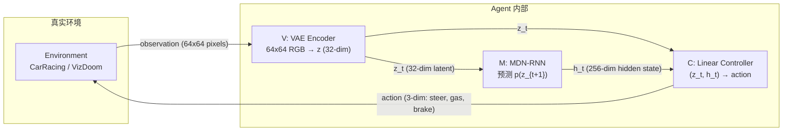
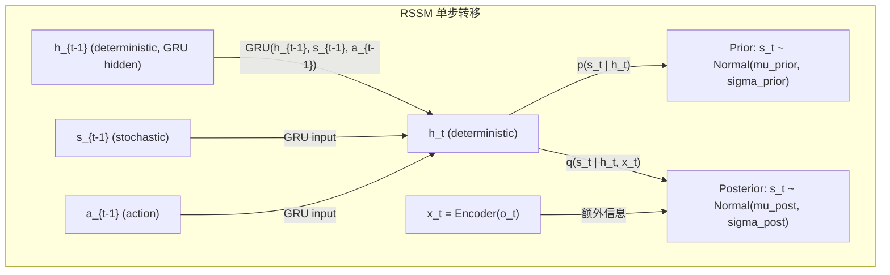
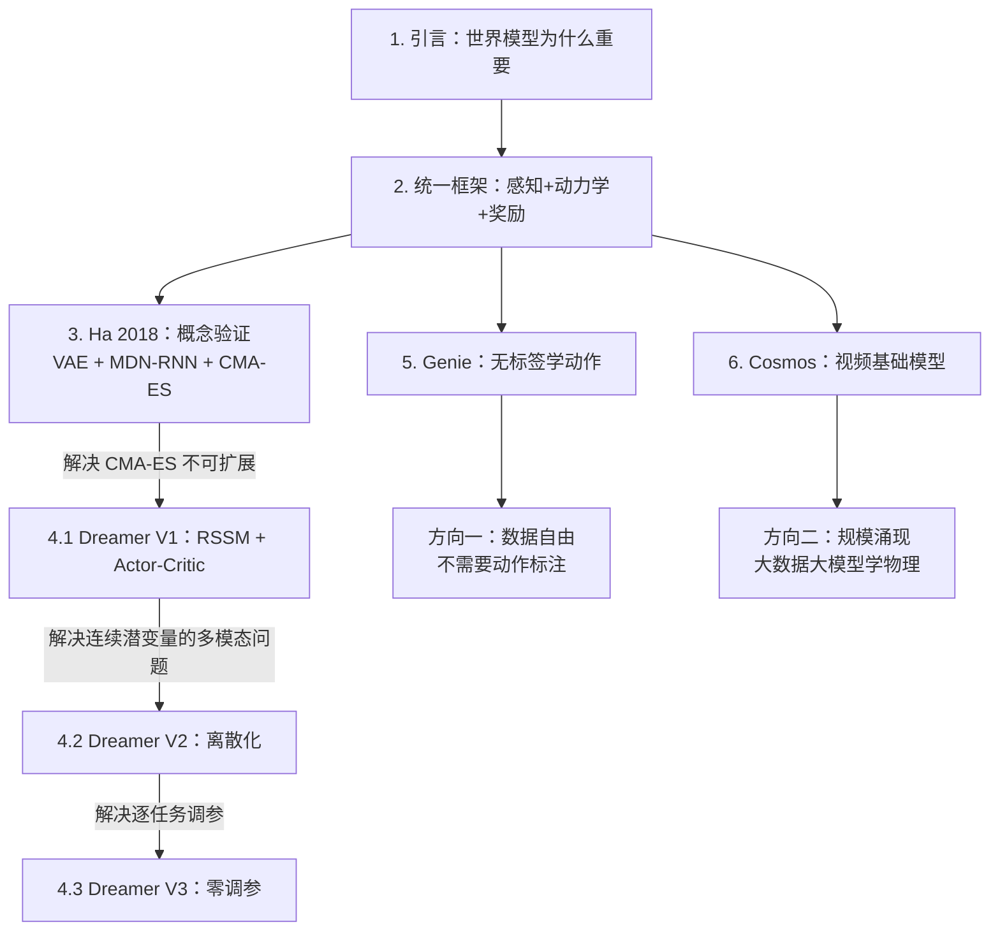
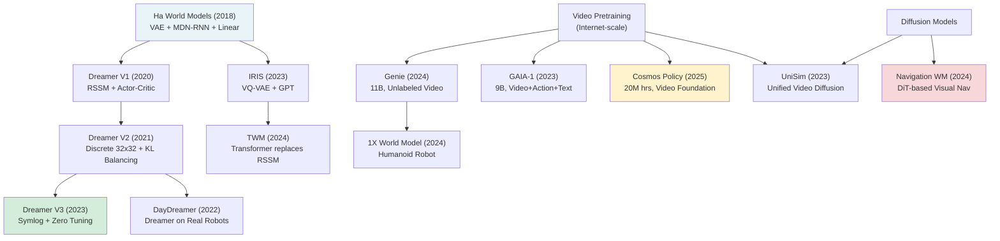

# Ch15: 世界模型——World Models / Dreamer / Genie / Cosmos Policy

> Part 3: 核心主线精读
> 前置章节：[Ch14: 模仿学习——DAgger / ACT-ALOHA / UMI，你做给它看](ch14-imitation-learning.md)
> 后续章节：[Ch16: 强化学习基础——PPO / SAC / Reward Shaping](ch16-rl-basics.md)

---

## 1. 从"真实练习"到"脑内模拟"

想象你正在学国际象棋。

初学阶段，你只能通过一盘一盘的对局来进步。每下一盘棋都要花费真实时间——摆好棋子、逐步走完、等对手回应、犯错了只能等下一盘重来。这个过程不能加速：你不可能把一天 24 小时的真实对局压缩到 1 分钟里完成。

这就好比 [Ch14](ch14-imitation-learning.md) 中的模仿学习：机器人必须在真实世界中执行动作、收集数据，才能慢慢变强。每一次真实世界的尝试都有成本——时间（一个抓取动作 3-5 秒）、能耗（伺服电机在消耗功率）、风险（撞到东西可能损坏关节），以及人力（需要有人监督和重置环境）。

但国际象棋大师不是这样练的。

Magnus Carlsen 可以闭上眼睛，在脑子里"看到"棋盘的完整局面。他可以想象自己走了 e4，对手回应 e5，自己再走 Nf3……在脑中推演三四步之后的局面，评估"这个变化对我有利还是不利"，然后决定是否真的采用这个开局。整个过程不需要一个真实的棋盘、不需要对手在场、甚至不需要睁开眼睛。他在几秒钟内就能"模拟"数十种走法，而这些走法如果真正走出来可能需要数小时的真实对局时间。

这种"脑内模拟"就是世界模型的核心思想：在头脑中建立一个环境的心理模型（mental model），然后在想象中练习和规划，而不是每次都付出真实互动的代价。

认知科学家很早就注意到了人类大脑的这种能力。Kenneth Craik 在 1943 年的著作 "The Nature of Explanation" 中就提出，人类大脑维护着外部世界的"小规模模型"，用于预测事件、推理因果、做出决策。这个概念在 2018 年被 Ha & Schmidhuber 明确引入机器学习——他们的论文标题 "World Models" 就直接致敬了这个认知科学传统。所以世界模型不只是一个工程技巧，而是试图赋予机器人一种人类本身就拥有的核心认知能力。

回到机器人的场景。在 Ch14 中，我们看到模仿学习的路径是"你做给它看"——收集人类示教数据，让机器人学着做。这条路走通了，但有两个根本性瓶颈：

- **数据成本高**：每一条训练轨迹都需要人类花时间去录制。ALOHA 让硬件便宜了，UMI 让采集解耦了，但人的时间始终是稀缺资源。
- **泛化受限**：机器人只学到了"看到 X 就做 Y"的映射，但没学到"做 Y 之后世界会变成什么样"。一旦遇到训练中没见过的初始状态，它就不知道该怎么办——因为它不理解自己动作的后果。

世界模型给出了第三条路：让机器人先从少量真实经验中学习"世界是怎么运行的"——建立一个内部的环境模拟器；然后在这个模拟器中"做梦"，反复练习成千上万次——不消耗真实交互样本，不冒损坏硬件的风险，不需要人监督。

这个想法并不新。早在 1989 年，Juergen Schmidhuber 就在博士论文中提出了"让神经网络学一个环境的前向模型，然后在模型内部做规划"。1990 年代，一系列关于"学到的前向模型用于控制"的工作陆续出现。但受限于当时神经网络的表达能力和计算资源，这些尝试都没有在复杂任务上取得成功。

直到 2018 年，David Ha 和 Schmidhuber 的论文 "World Models" 才真正把这个想法在视觉任务上落地并引爆了学术界的关注——这篇论文的交互式网页版本（worldmodels.github.io）获得了超乎寻常的关注度，成为了深度强化学习社区中传播最广的论文之一。那之后的演化路径清晰而迅速：

- **2018 Ha & Schmidhuber**：VAE + RNN + 线性控制器，首次在"梦中"训练出能跑赛车的 Agent
- **2020-2023 Dreamer 三部曲**：Hafner 等人把 RSSM（循环状态空间模型）从概念验证一路推到 Minecraft 挖钻石
- **2024 Genie**：DeepMind 用 11B 参数从 20 万小时无标签视频中自动发现动作，生成可交互世界
- **2025 Cosmos Policy**：NVIDIA 用 2000 万小时视频预训练物理直觉，接入机器人策略

这条演化路径展现了一个清晰的趋势：世界模型从"小规模、任务特化"逐步走向"大规模、通用泛化"。前两个里程碑（Ha / Dreamer）解决的是"如何高效地学好一个任务的世界模型"；后两个里程碑（Genie / Cosmos）解决的是"如何学一个适用于所有任务的通用世界模型"。两条路线目前并行发展，最终可能融合。

本章覆盖这条主线的完整四个里程碑模型（Ha → Dreamer 三部曲 → Genie → Cosmos），以及它们如何与具身 AI 的其他模块产生联动。

**阅读建议：** 本章约 750 行，阅读时间 25-35 分钟。如果你之前对 RL 基础完全陌生，建议先快读 Section 2（建立概念框架），然后重点精读 Section 3（Ha 的 World Models 是理解后续所有工作的基础）。Section 4（Dreamer 三部曲）是技术深度最大的部分，如果第一遍读不完全理解也没关系——后续 Ch15 下篇会有代码级别的解释。Section 5-6（Genie / Cosmos）主要建立方向感，不需要记住细节。

**前置知识：** 本章假设你已经读过 Ch14（模仿学习），了解行为克隆的基本范式。如果你对 VAE（变分自编码器）和 RNN（循环神经网络）的基本概念不熟悉，建议先花 10 分钟快速了解——不需要理解数学推导，只需要知道"VAE 把图片压缩成一个短向量"和"RNN 可以处理时间序列"这两点。

---

## 2. 什么是世界模型？

### 2.1 一句话定义

世界模型（World Model）是一个学习出来的函数，给定当前状态 s_t 和动作 a_t，预测下一个状态 s_{t+1}（以及可能的奖励 r_t）。

用公式写就是：

```
s_{t+1} = f(s_t, a_t)
```

但这个公式太理想化了。现实中的世界不是确定性的——同一个状态做同一个动作可能有不同结果。你投篮的姿势完全一样，但球可能进也可能不进（因为手指力度的微小差异、风向、球的旋转等无法完全观测的因素）。所以更准确的表述是学一个条件概率分布：

```
p(s_{t+1} | s_t, a_t)
```

这个分布告诉我们"在状态 s_t 做了动作 a_t 之后，各种可能的下一状态 s_{t+1} 出现的概率是多少"。

注意世界模型和"模拟器"（simulator）的区别。模拟器（如 Unity、Gazebo）是由人类工程师根据已知物理定律编写的精确程序；世界模型是从数据中学出来的近似函数。模拟器精确但需要大量人工建模（你要定义每个物体的形状、摩擦系数等），世界模型不精确但只需要观察数据。在很多现实场景中（杂乱桌面上的物体操作、不规则地形上的行走），精确建模成本太高，而观察数据相对容易获取——这正是世界模型有用武之地的场景。

### 2.2 日常类比：脑中的"物理引擎"

你站在阳台上，手里举着一个苹果。你还没松手，但你已经"知道"松手之后苹果会怎样——它不会飞上天，不会左右飘，不会静止在空中，而是直直地往下落，速度越来越快，最后砸在地上。你是怎么知道的？你的大脑里有一个关于重力的内部模型。

这个内部模型还能做更复杂的预测。如果你把苹果斜着抛出阳台呢？你大致能预判它会走一个抛物线——先向前向上，然后弧线向下落。你不需要真的每次都扔一个苹果出去验证——你可以在脑中"模拟"这个抛物线。

再复杂一些：如果你把苹果用力扔向一面墙呢？你知道它会反弹（但方向可能不太确定），可能会碎（取决于墙的硬度和力度），碎了之后果汁会飞溅。这些预测都来自你过去的经验——你见过东西落地、碰墙、碎裂的样子，你的大脑从这些经验中抽象出了物理规律。

机器人的世界模型做的事情完全一样：从过去的经验中学习"世界是怎么运行的规律"，然后用这个学到的规律在内部做预测和模拟——不需要每次都在真实世界中试一遍。

值得注意的是，你的大脑内部模型不是完美的。你预测的抛物线和实际的抛物线会有偏差（你可能低估了风的影响）；你以为碰墙会碎的物体可能弹了回来（原来是橡胶做的）。世界模型也一样——它的预测总是近似的，而且会在长期预测中累积误差。本章的一个核心主题就是：如何让世界模型的预测"足够好"以至于在其中训练出的策略能迁移到真实世界。从 2018 年 Ha 的初步尝试到 2023 年 Dreamer V3 的成熟方案，这个"让预测足够准"的工程挑战被逐步解决。

### 2.3 三个核心组件

一个完整的世界模型系统通常由三个组件协作：

**感知模块（Perception / Encoder）：** 把高维的原始观测（比如 64x64 的 RGB 图像，有 64x64x3 = 12288 个维度）压缩成低维的潜在表示 z_t（比如 32 个浮点数）。

为什么要压缩？因为直接在像素空间做预测既低效又困难——两张视觉上几乎一样的图片（比如一个像素的差异）在像素空间的距离可能和两张完全不同的图片差不多。压缩到潜在空间后，"语义上相似的观测"会被映射到"数值上相近的向量"，让后续的动力学预测变得更容易。

就像你看一个房间不会记住每个像素的颜色值，而是记住"桌子在左边、椅子在右边、杯子在桌上"这样的抽象信息。

**动力学模块（Dynamics / Transition Model）：** 给定当前的潜在状态 z_t 和动作 a_t，预测下一个潜在状态 z_{t+1}。这是世界模型的心脏——它编码了"世界如何响应你的动作"这个知识。如果感知模块是"眼睛"，动力学模块就是"脑中的物理引擎"。

**奖励模块（Reward Predictor）：** 给定潜在状态 z_t，预测当前能获得多少奖励 r_t。在强化学习场景中需要这个组件来告诉策略网络"在想象中走到这个状态是好还是坏"。如果是纯规划（不用 RL），这个模块可以替换为一个目标检测器。

三个组件的关系可以这样理解：感知模块让机器人"看懂"世界，动力学模块让机器人"预判"世界，奖励模块让机器人"评估"世界中的好坏。

用做菜来类比三个组件：

- **感知模块**像是你的眼睛和手感——看到锅里的食材是什么颜色（是否焦了）、用筷子戳一下判断软硬程度，把复杂的视觉和触觉信息压缩成简短的判断"五分熟"。
- **动力学模块**像是你的烹饪直觉——"如果现在把火调大，鸡蛋 10 秒后就会焦；如果加一点水，温度会降下来"。这是你从过去无数次做菜的经验中学到的"如果…那么…"关系。
- **奖励模块**像是你的味觉评估——"现在这个状态是好的（快熟了）"还是"坏的（焦了）"。

### 2.4 Model-Based vs Model-Free RL

在强化学习的框架下，存在两种截然不同的学习哲学：

**Model-Free（无模型）方法**：不学环境的转移函数，直接从大量真实交互经验中学习"看到状态 s 时该做什么动作 a"。代表算法包括 PPO、SAC、TD3 等。它的好处是简单直接——不需要学一个准确的世界模型；坏处是需要海量的交互样本（sample inefficient），因为每一次策略更新的信号都来自真实环境。

**Model-Based（基于模型）方法**：先从数据中学一个世界模型（即环境的转移函数），然后在这个世界模型中做规划或训练策略。好处是样本效率高——一次真实交互产生的数据可以在想象中被"重播"和"扩展"无数次；坏处是世界模型可能不准确——如果你的"想象"和现实不符，练出来的策略在真实世界就会翻车。

这里有一个学习方式的类比：Model-Free 像死记硬背做题的学生——做了大量习题，见过足够多的题型之后考试就会做了，但如果出了一道没见过的变体就可能蒙住。Model-Based 像理解公式推导的学生——做的习题虽然少一些，但因为理解了底层原理所以能举一反三，推广到新情况。代价是，如果对原理的理解有偏差（模型不准确），推导出来的答案就可能全都是错的。

我们可以量化这种数据效率差异。以 Atari 游戏为例：

- Model-Free 的 Rainbow DQN 需要约 2 亿帧（约 38 天的游戏时长）才能达到人类水平
- Model-Based 的 SimPLe（2019）仅用 10 万帧真实数据（约 2 小时游戏时长）就学会了多款 Atari 游戏的基本策略
- 数据效率相差约 2000 倍

这个效率差距在真实机器人场景中更为关键——真实机器人每一步交互都涉及硬件磨损、时间成本和安全风险。如果需要 200 万次真实碰撞才能学会避障，没有实验室承受得起。世界模型让机器人可以在"脑内排练"中完成大部分学习，只在关键时刻与真实环境交互来校正模型。

当然，Model-Based 方法也有自己的挑战：

1. **模型偏差累积**：预测误差随时间步指数增长。如果每步预测有 1% 的误差，50 步之后累积误差就达到 ~40%，想象的轨迹和真实轨迹可能已经完全不同
2. **计算开销**：维护一个高质量的世界模型本身需要大量参数和计算资源——你需要训练一个能"想象"出整个世界的网络
3. **探索困境**：模型只能在已观察过的区域做出准确预测。如果 agent 从未见过悬崖边的场景，模型对悬崖的预测就是随机猜测

后续的 Dreamer 系列通过一系列精巧的设计来缓解这些挑战——特别是用 RSSM 的随机/确定性双分支来对抗误差累积。

### 2.5 为什么世界模型对具身 AI 特别重要？

这个问题需要从具身 AI 和游戏 AI 的核心区别来理解。

在 Atari 游戏里，Agent 可以用每秒几千帧的速度和模拟器交互，24 小时不间断地收集几亿帧的经验。模拟器跑在 GPU 上，几乎免费。所以 Model-Free 方法在游戏里是可行的——数据不值钱。

但在真实机器人上，情况完全不同：

- **真实交互很慢**：一个抓取动作要 3-5 秒，一个做菜任务要 5-10 分钟。一天 8 小时最多也就收集几百条轨迹。
- **真实交互有风险**：机器人撞到墙可能损坏关节电机（修一个 Franka 的关节要数千美元），打翻水杯可能弄坏电路板。
- **真实交互很贵**：机器人硬件的折旧、电费、以及需要有人在旁边监督和重置环境的人力成本，每小时上百美元。
- **真实交互不可逆**：游戏可以读档重来，真实世界摔碎了的杯子不能复原。

这些约束让 Model-Free 方法在真实机器人上几乎不可用——你负担不起几百万步的真实交互。世界模型提供了解法：在真实世界中收集少量数据（几千步），学出环境的内部模型，然后在模型中"做梦"练习几百万步。这把"样本效率"从学术论文中的一个指标变成了工程上的生死线。

还有一层被频繁忽视的好处：安全探索。在真实世界中，"探索"意味着尝试未知动作——对机器人来说，这可能意味着把手臂伸到桌子边缘之外（掉下去报废）、用力推一个未知物体（如果是玻璃杯就碎了）。而在世界模型中探索是零风险的——模型预测出"这个动作会导致碰撞"后，Agent 可以避免这个动作，从来不在真实世界中真的碰撞。这对于和人类共享空间的协作机器人（collaborative robots）尤其重要：你不能让一个正在"探索"的机器人手臂不小心打到旁边的工程师。

世界模型还能用于迁移学习（transfer learning）：在一个环境中学到的世界模型，其中的物理知识（重力、摩擦、碰撞弹性）在新环境中往往仍然适用。你不需要每换一个房间就从头学"东西会掉下来"这个事实。这和人类的经验迁移是类似的——你搬到一个新公寓，虽然家具位置变了，但你不需要重新学习"杯子从桌边滑落会摔碎"。

这些理论上的优势在 2022 年得到了实际验证。DayDreamer（Wu et al., 2022）首次将 Dreamer V2 直接部署到真实的四足机器人和机械臂上，展示了以下关键结果：

- A1 四足机器人仅用 1 小时的真实行走数据就学会了稳健的步态控制
- UR5 机械臂用 10 分钟的真实抓取经验就掌握了基本的物体拾取技能
- 整个学习过程中没有任何仿真环境参与——世界模型完全从真实传感器数据中学习

这些数字让世界模型从"有趣的学术想法"变成了"工程上可行的方法"。作为对比，同等难度的任务用 Model-Free 方法通常需要几十到几百小时的真实交互。DayDreamer 的成功标志着世界模型正式跨过了从仿真到真实机器人的鸿沟。

---

## 3. Ha & Schmidhuber 的 World Models (2018)

### 3.1 背景和论文定位

2018 年 3 月，David Ha（时任 Google Brain 研究员）和 Juergen Schmidhuber（LSTM 发明者、世界模型概念的最早提出者）联合发表了论文 "World Models"。这篇论文有一个精心设计的交互式网页版本（worldmodels.github.io），让读者可以直观地看到 Agent 在"梦中"跑赛车的画面。

这篇论文的核心贡献不在于提出了什么新的神经网络模块——VAE（2013 年提出）和 RNN（几十年的历史）都是现成的技术——而在于清晰地展示了一个完整的闭环范式：Agent 可以在自己学到的世界模型中训练策略，完全不接触真实环境，然后直接部署。

论文的实验证明了一件关键的事：如果 Agent 学到的"梦境"足够准确，那么在梦中练出来的策略可以直接迁移到真实环境中使用。这为后续所有的"在想象中训练"的工作奠定了基础。

有一个常见的误解值得澄清：世界模型不等于物理仿真器。物理仿真器（如 Unity Physics、MuJoCo）是人类工程师根据物理定律手写出来的程序，它们的预测是"精确但有限"的——你需要手动指定每个物体的质量、摩擦系数、碰撞形状等。而世界模型是从数据中学到的，它的预测是"近似但泛化"的——你不需要告诉它物理参数，它自己从观察中总结规律。两者各有优劣：仿真器在它能建模的范围内预测极其准确，但面对不规则形状、柔性物体、流体等复杂场景时需要极高的工程投入；世界模型则能自然地处理任何它在数据中见过的场景，但预测精度不如仿真器。

从更大的历史视角看，这篇论文出现在一个有趣的时间节点。2018 年正是 NLP 领域的大预训练时代（BERT / GPT-1 同年发表），学术界刚开始意识到"先学通用表示，再做具体任务"这种范式的威力。Ha & Schmidhuber 的工作虽然没有直接借鉴语言模型的方法论，但它在精神上是类似的——先让 Agent "广泛地观察和学习世界"（训练 V 和 M），然后在这个学到的知识基础上快速掌握具体技能（训练 C）。这种"先理解世界、再学做事"的范式到 2024-2025 年已经成为了具身 AI 领域的主流思路。

### 3.2 V-M-C 三模块架构

整个系统由三个独立模块组成，职责清晰分离，像一条流水线上的三道工序：



**V — Vision（视觉模块）：**

V 是一个变分自编码器（Variational Autoencoder, VAE），负责把 64x64x3 = 12288 维的原始图像压缩成仅仅 32 维的潜在向量 z。

VAE 的训练目标是"能从 z 重建回原始图像"——如果重建出来的图和原图很像，说明 z 保留了关键信息。VAE 相比普通 Autoencoder 的优势在于它学到的潜在空间是连续且有结构的：相似的画面（比如赛车偏左和偏左多一点）会被映射到相近的 z 向量，而不是分布在潜在空间的两个遥远角落。

日常类比：V 就像一个速写画家——看到一个复杂的场景，用几笔就画出关键轮廓（32 个数字）。虽然丢失了细节（具体哪个像素是什么颜色），但保留了结构信息（赛道弯向哪边、车在什么位置）。

技术细节：VAE 的损失函数有两部分——重建误差（让解码出来的图像像原图）和 KL 正则化项（让潜在空间的分布接近标准正态分布）。KL 项的作用是让潜在空间"平滑"——z 空间中任意一个点都能解码出有意义的图像，而不是只有训练数据恰好映射到的那些点才有意义。这在后面 M 需要在 z 空间中做预测时非常重要：M 预测出的 z_{t+1} 可能和训练数据中的任何 z 都不完全一样，但因为空间是平滑的，它仍然能解码出合理的画面。

**M — Memory（记忆模块）：**

M 是一个 MDN-RNN（Mixture Density Network + Recurrent Neural Network）。它有两个职责：

第一个职责是记忆。RNN 部分（具体用的是 LSTM，256 维隐状态 h_t）维护了对历史的压缩记忆。h_t 可以理解为"到目前为止发生过什么事的摘要"。

第二个职责是预测。MDN 部分接收 h_t，输出一个高斯混合分布（Mixture of Gaussians），描述"下一帧的 z_{t+1} 可能是什么"。具体地，它输出 5 个高斯分量，每个分量有自己的均值、方差和混合权重。

为什么用混合分布而不是单个高斯？因为未来往往是多模态的——同一个局面可能演化成多种截然不同的下一帧。比如赛车接近一个 Y 型分岔口：下一帧可能是左转后的画面，也可能是右转后的画面。如果用单个高斯来预测，它只能给出两种可能的"平均值"——某个既不像左转也不像右转的模糊帧。而混合高斯可以清晰地用两个分量分别表达"左转的可能"和"右转的可能"。

**C — Controller（控制器）：**

C 是整个系统中最简单的部分——一个线性映射加一个 tanh 激活。它把 z_t（32 维）和 h_t（256 维）拼接成一个 288 维的向量，通过一个矩阵乘法映射到 3 维的动作向量（方向盘角度、油门、刹车）。

```
action = tanh(W * [z_t; h_t] + b)
# W: 3x288 矩阵, b: 3维偏置
# 总参数量: 288*3 + 3 = 867
```

参数量极少：在 CarRacing 实验中，C 只有 867 个参数。这个设计是刻意的——作者想要证明一个核心论点："如果世界模型学得足够好，一个极简的控制器就够了"。智能不在控制器里（它只是一个线性映射），而是在对世界的理解中（V 和 M 编码了环境的全部复杂性）。

这和人类的情况其实类似：你的"决策规则"往往很简单（比如"如果前面有障碍物就转弯"），复杂的部分是你对世界的感知和预测能力——能在复杂的视觉场景中识别出什么是障碍物、预判它几秒后会在哪里。

### 3.3 训练流程：三阶段独立训练

训练分三个严格独立的阶段——每个模块单独训练，不进行端到端联合优化：

**阶段 1——收集数据并训练 V：** 在真实环境中用完全随机的策略（随机按按钮）跑 10000 个 episode，收集大量 (observation, action) 对。用这些图像训练 VAE——目标是最小化重建误差加 KL 正则项。训练完成后，V 就能把任何 64x64 的游戏画面压缩成 32 维的向量。

一个关键细节：随机策略收集的数据质量"很差"——因为是随机按按钮，赛车可能大部分时间在转圈或撞墙。但这并不影响 V 的训练——V 只需要看到各种可能的画面（赛道直道、弯道、草地、墙壁），不需要这些画面是"好的驾驶"产生的。这里的洞察是：理解世界（学 V 和 M）和做出好决策（学 C）是两个独立的任务——你不需要是一个好司机才能理解"方向盘打左车就会左转"这个物理规律。

**阶段 2——训练 M：** 用同一批数据，但这次我们关注的是序列关系。对每个 episode 中的图像序列，先用训练好的 V 逐帧编码成 z 序列，得到 (z_1, a_1, z_2, a_2, ..., z_T, a_T) 的时间序列。用这些序列训练 MDN-RNN——目标是最大化 p(z_{t+1} | z_{1:t}, a_{1:t})，即给定历史潜在状态和动作序列，准确预测下一帧的潜在状态分布。

**阶段 3——在梦中训练 C：** 这一步是整篇论文最核心的贡献。C 的训练完全在 M 的"梦境"中进行——从这一步开始，真实环境就再也不参与了。过程如下：

1. 从真实数据中采样一个初始帧的编码 z_0（这是和真实环境的最后一次联系）
2. 启动"做梦"循环：C 根据当前 (z_t, h_t) 输出动作 a_t → 把 a_t 送给 M → M 从混合高斯中采样出 z_{t+1} 并更新 h_{t+1} → 循环重复
3. 在这个虚拟循环中记录每一步的"奖励"（用一个从真实环境学到的奖励预测器）
4. 用 CMA-ES 优化 C 的 867 个参数，使得累积奖励最大

为什么用 CMA-ES（协方差矩阵自适应进化策略）而不是梯度下降？两个原因：第一，C 只有 867 个参数——参数空间极小，CMA-ES 在低维空间中效率很高；第二，奖励信号是累积的、非可微的（你不能对"游戏总分"求关于参数的梯度），而 CMA-ES 是黑箱优化——它只需要一个评分函数"给我这组参数的总分"就能工作。

CMA-ES 的工作方式很直觉：维护一群"候选参数"（比如 64 组不同的 C 参数），让它们各自在梦中跑一遍，然后淘汰得分低的、保留得分高的，并朝得分高的方向微调分布。像生物进化——适者生存。

```python
# 伪代码：CMA-ES 优化 Controller
import cma  # CMA-ES 库

def evaluate_in_dream(params, world_model, dream_length=1000):
    """在世界模型的梦境中评估一组 Controller 参数"""
    z_t = sample_initial_state()       # 从真实数据采样初始潜在状态
    h_t = zeros(256)                   # RNN 初始隐状态
    total_reward = 0
    for step in range(dream_length):
        action = tanh(params @ concat(z_t, h_t))  # 线性 Controller
        z_t, h_t = world_model.predict(z_t, h_t, action)  # M 预测下一状态
        reward = reward_predictor(z_t)  # 预测奖励
        total_reward += reward
    return total_reward

# CMA-ES: 64 组候选参数，迭代进化
es = cma.CMAEvolutionStrategy(867 * [0], 0.1)  # 867 维参数空间
while not es.stop():
    candidates = es.ask()  # 生成 64 组候选参数
    scores = [evaluate_in_dream(c, world_model) for c in candidates]
    es.tell(candidates, [-s for s in scores])  # 负号因为 CMA-ES 做最小化
```

注意整个 `evaluate_in_dream` 函数从头到尾没有调用真实环境——所有的状态转移和奖励都来自世界模型的预测。这就是"在梦中训练"的具体含义。

### 3.4 实验结果

**CarRacing-v0（赛道驾驶）：** Agent 需要在随机生成的赛道上驾驶赛车，尽可能快地跑完一圈而不冲出赛道。评分标准是 tile 覆盖率（跑过多少路面块）减去时间惩罚。World Models 在"梦中训练"后直接部署到真实环境，获得了 906 分（满分约 950）。作为对比，不用梦中训练、直接在真实环境中用 CMA-ES 优化的基线大约在 870 分左右。这证明了一件关键的事：在梦中练出来的驾驶技能不仅能在真实环境中工作，还能超过在真实环境中训练的基线。

更令人惊讶的是，梦中训练只需要大约 20 分钟的 CPU 时间（在 M 中展开虚拟轨迹 + CMA-ES 优化），而真实环境训练需要数小时。这个效率差异预示了世界模型在真实机器人上的巨大潜力。

**VizDoom（Take Cover）：** 3D 第一人称射击游戏中躲避火球。Agent 只能左右移动，需要理解火球的运动轨迹并及时规避。梦中训练的 Agent 学会了有效的躲避策略，平均存活时间达到 1100 帧。值得注意的是，Agent 在梦中训练时从未"真正"见过火球——它看到的只是 M 生成的 z 向量序列。它需要在这些抽象表示中识别出"危险"并学会规避。

**"增大温度"实验（最有趣的发现）：** 作者发现，如果让 M 在生成梦境时增加采样温度（temperature > 1.0），等于放大了预测的不确定性——梦中的火球移动得更快更诡异，赛道弯道更急更突然。在这种"加了难度的噩梦"中训练出来的 Agent 在真实环境中反而表现更好。原因是它在训练中见过了比真实环境更极端的情况，获得了更强的鲁棒性。这和运动员在高海拔（低氧）训练后回到平原表现更好是同一个道理。

这个发现暗示了一种训练策略：你可以故意让世界模型的梦境比真实世界"更难"——更快的障碍物、更极端的扰动、更随机的环境变化。如果 Agent 在这种极端梦境中仍然能存活，它在真实的、相对温和的环境中就有更大的安全余量。这在机器人安全领域被称为"域随机化"（domain randomization）的思路——虽然 Ha 的论文没有用这个术语，但核心原理是一样的。后续的 sim-to-real 工作（如 OpenAI 的 Rubik's Cube 机械手）大量使用了类似的思想。

### 3.5 局限性与遗留问题

尽管开创性极强，这篇论文的方法也有明显的天花板：

- **模型误差累积（compounding error）**：M 的每一步预测都有微小误差，当梦境展开 50、100、200 步之后，误差会像滚雪球一样指数放大。Agent 在长时间的梦境中可能"走火入魔"——发现了只在错误模型中管用、但在真实世界中完全无效的"作弊策略"。这个问题在强化学习文献中有一个专门的名字叫"模型利用"（model exploitation）——Agent 不是在"利用世界模型的知识"，而是在"利用世界模型的漏洞"。就像学生发现了考试系统的 bug（比如某个答案填 C 总能得分），他就不再学习知识本身了。Dreamer 系列通过缩短梦境长度（只展开 15 步）和改进模型架构（RSSM 的确定性路径帮助减少误差漂移）来缓解这个问题，但没有彻底解决。

- **线性控制器表达力不足**：C 只是一个线性映射，对于需要复杂决策的任务（比如需要记忆的迷宫、需要长期规划的策略游戏），867 个参数完全不够用。

- **CMA-ES 不可扩展**：当 C 的参数量增加到几千个以上，CMA-ES 的效率就会急剧下降。它只适合"几百个参数"这个量级。要理解这个局限：CMA-ES 需要维护一个"参数分布的协方差矩阵"，对于 N 个参数，这个矩阵是 N×N 大小的。867 参数时矩阵有 ~75 万个元素，尚可接受。但如果 C 是一个 10000 参数的小型神经网络，矩阵就有 1 亿个元素——内存和计算都无法承受。这就是为什么 Dreamer V1 转向了基于梯度的 Actor-Critic 方法——梯度下降对参数数量的扩展性远好于进化策略。

- **VAE 重建模糊**：VAE 的损失函数（均方误差 + KL 散度）天然倾向于生成模糊的平均重建——这意味着细节信息（比如小物体的精确位置）可能在编码时丢失了。

- **没有长期价值估计**：CMA-ES 优化的是梦境中的累积奖励，但梦境长度有限（通常几百步）。对于需要数千步规划的任务，这种方法看不到足够远的未来。

这些局限性为两年后 Dreamer 的出现埋下了伏笔——Dreamer 用 RSSM 替换 VAE+RNN、用 Actor-Critic 替换 CMA-ES、用离散潜变量替换连续高斯，逐一解决了上述问题。

**对比表：Ha's World Models vs 传统 Model-Based RL**

为了理清 Ha 的工作在历史中的位置，这里做一个对比。在 2018 年之前，Model-Based RL 的主流方法是 PILCO（2011）和 Neural Network Dynamics Models（2017）。这些方法的特点是：

| 维度 | PILCO / NN Dynamics | Ha's World Models |
|------|-------------------|-------------------|
| 状态空间 | 低维（关节角度等） | 高维图像（64x64 RGB） |
| 模型类型 | 高斯过程 / 小型 MLP | VAE + RNN（序列模型） |
| 规划方法 | MPC（每步重新规划） | 开环策略（CMA-ES 一次性优化） |
| 梦境训练 | 不训练策略在梦里 | 完全在梦里训练策略 |
| 可视化 | 无法生成可视化的预测 | 可以解码出预测的画面 |

Ha 的关键突破是第一次在视觉观测空间（而不是低维状态空间）中实现了完整的"学模型→在模型中训练策略→部署"闭环。虽然他的方法在很多技术细节上不如 PILCO 精致，但他打开了一扇门——证明了视觉世界模型是可行的。

---

## 4. Dreamer 三部曲

如果说 Ha & Schmidhuber 的 World Models 是世界模型的"概念验证原型机"，那么 Danijar Hafner 主导的 Dreamer 系列就是把这个概念打磨成量产工具的工程迭代过程。从 2020 到 2023 年，三篇论文逐步解决了前一代的核心瓶颈，最终让一个 Agent 在 Minecraft 中从零开始、不用人类示教、纯靠在梦里练习就学会了挖到钻石——一个需要超过一万步连贯决策的长期规划任务。

### 4.1 Dreamer V1 (2020)：RSSM + Actor-Critic in Imagination

**论文全称**：Dream to Control: Learning Behaviors by Latent Imagination

**解决的核心问题**：Ha 的工作用 CMA-ES 训练线性控制器，不可扩展到复杂策略。Dreamer V1 引入了两个关键升级——RSSM 状态模型和 Actor-Critic 梯度训练——让世界模型框架第一次具备了训练复杂非线性策略的能力。

**RSSM（Recurrent State-Space Model）——循环状态空间模型：**

RSSM 的核心洞察：一个好的潜在状态应该同时包含确定性成分和随机性成分。



- **确定性路径 h_t（GRU 隐状态）**：像一条主干道，维护跨时间步的确定性信息流。GRU 接收上一步的 h_{t-1}、s_{t-1} 和 a_{t-1}，输出新的 h_t。它编码了"基于到目前为止观察到的一切，确定性的趋势是什么"。

- **随机路径 s_t（随机潜变量）**：在 h_t 之上叠加一层随机性，表示环境中不可约的不确定性。分两种情况：
  - **Prior**：在没有看到当前观测 o_t 的情况下，仅从 h_t 预测 s_t 的分布 p(s_t | h_t)——这在想象中使用
  - **Posterior**：看到了当前观测 o_t 后，结合 h_t 和编码后的 o_t 推断 s_t 的分布 q(s_t | h_t, o_t)——这在真实训练中使用

为什么需要两条路径？想象你在看一个弹球游戏。球碰到挡板后会反弹，反弹的大致方向可以从物理规律确定性地推出（确定性部分），但因为球表面的粗糙程度、接触角度的微小差异等因素，精确的反弹角度有随机性（随机部分）。

如果只有确定性路径：模型无法表达不确定性，面对多种可能的未来只能给出一个"平均"预测。如果只有随机路径：模型丢失了时间上的连贯性记忆，每步预测都像是"独立猜测"。RSSM 的设计让两者共存互补。

从工程实现角度看：确定性路径 h_t 通常是 200-600 维的 GRU 隐状态向量，承载了大部分的"记忆容量"。随机路径 s_t 通常是 30-50 维（V1）或 32×32 的离散变量（V2/V3），主要负责表达预测中的不确定性部分。两者拼接后的总状态维度（h_t, s_t）用于解码观测、预测奖励和训练策略。这种设计让模型能精确控制"哪些信息是确定的"（通过 h_t）和"哪些信息是不确定的"（通过 s_t 的分布宽度）。

**三个训练损失：**

1. **重建损失（Reconstruction Loss）**：从状态 (h_t, s_t) 解码回观测图像 o_t，最小化解码结果和真实观测之间的差距。确保潜在空间保留了视觉信息。
2. **奖励预测损失（Reward Loss）**：从状态 (h_t, s_t) 预测即时奖励 r_t。让模型理解"什么状态是好的"。
3. **KL 散度损失（KL Divergence）**：让 prior p(s_t | h_t) 尽可能逼近 posterior q(s_t | h_t, o_t)。为什么这很重要？因为在想象中（梦境中）没有真实观测，模型只能使用 prior。如果 prior 和 posterior 差距很大，梦中的预测就不准。KL 损失迫使 prior 变得准确。

**Actor-Critic in Imagination——想象中的策略梯度：**

这是 Dreamer V1 相比 Ha 的最大升级。训练流程如下：

1. 从经验回放缓冲区（存储了真实交互数据的池子）中随机采样一批起始状态
2. 从每个起始状态出发，在 RSSM 中展开 H=15 步的想象轨迹：Actor 选动作 → RSSM 的 prior 预测下一个 s_{t+1} → Reward head 预测 r_{t+1} → 循环
3. Critic 网络估计每个想象状态的长期价值 V(s_t)
4. 用 lambda-return（TD-lambda）计算每个想象状态的回报目标
5. 反向传播梯度通过整条想象轨迹来更新 Actor（让它选出更高回报的动作）

关键区别：Ha 用 CMA-ES（黑箱进化，不用梯度）优化 867 参数的线性控制器；Dreamer 用反向传播梯度来优化任意复杂的神经网络策略。这意味着 Actor 可以是一个多层 MLP 甚至更复杂的架构，能学到比线性映射丰富得多的行为策略。

这里要强调一个关键的技术细节：梯度可以从 Critic 的价值预测一路反向传播通过 RSSM 的转移动态到达 Actor 的参数。这意味着 Actor 不仅知道"当前动作的即时价值"，还能通过世界模型的微分链路知道"当前动作如何影响未来若干步的状态"。这种"可微规划"（differentiable planning）是世界模型方法独有的优势——Model-Free 方法中策略梯度只能依赖采样估计，噪声很大；而 Dreamer 的梯度是从世界模型的解析结构中精确计算出来的。

**实验结果：** 在 DeepMind Control Suite 的 20 个连续控制任务（行走、奔跑、平衡、抓取等）上，Dreamer V1 只用了 Model-Free 方法（D4PG）十分之一的环境交互量就达到了相同性能水平。换算到真实机器人：如果 D4PG 需要 100 小时的真实运行时间，Dreamer 只需要 10 小时——这个差距可能意味着"不可行"和"可行"之间的区别。

**为什么 10 倍的数据效率这么重要？** 一个直觉的计算：假设一个机器人抓取任务中，每次试错（reset + execute + observe）平均需要 10 秒。Model-Free 方法需要 1000 万步交互，那就是大约 28000 小时 = 3.2 年的不间断运行。Dreamer 只需要 100 万步，约 2800 小时 = 4 个月。考虑到机器人不能 24 小时不停工作（需要充电、维护、有人监督），实际差距更大。这就是为什么世界模型对真实机器人几乎是必需品，而不是锦上添花。

**V1 的遗留问题：** 尽管 V1 在连续控制领域表现出色，它在 Atari 级别的复杂视觉任务上还不够好。核心原因是连续高斯潜变量在表达多模态分布时的局限性。当一个游戏画面中存在多种等概率的未来可能性时（比如敌人可能从左边也可能从右边出现），连续高斯分布只能给出一个"模糊的平均"，丢失了关键的离散结构信息。此外，V1 的 KL 散度损失有时候会过于激进地压缩 posterior 中的信息——模型为了让 prior 和 posterior 接近，会牺牲 posterior 的信息容量，导致潜在状态"太简单"而无法编码复杂场景。在高维视觉观测（如 Atari 的 210x160 图像）上，这种信息丢失尤其严重，训练稳定性也会下降。这两个问题直接导向了 V2 的核心改进。

**DayDreamer（2022，V1 的延伸工作）：** 值得一提的是，Hafner 等人在 2022 年发表了 DayDreamer，首次把 Dreamer 框架部署到真实的物理机器人上。他们在一个四足机器人（A1）上做了实验：白天让机器人在真实世界中行走几分钟收集数据，晚上在世界模型中"做梦"训练策略，第二天早上部署新策略。经过几个这样的"白天-晚上"循环，机器人学会了在各种地形上稳定行走。这是世界模型从"游戏/仿真中的概念验证"走向"真实机器人上的实用技术"的关键一步。整个过程只需要约 1 小时的真实交互数据——如果用纯 Model-Free 方法，同样的任务需要在仿真中跑几千万步。

### 4.2 Dreamer V2 (2021)：离散化突破 Atari

**论文全称**：Mastering Atari with Discrete World Models

**解决的核心问题**：V1 的连续高斯潜在变量在高维视觉观测（Atari 210x160 图像）上表现不够好——连续空间在表达多模态分布时有天然的困难。V2 把潜在变量从连续高斯换成了离散分类分布，带来了本质性的提升。

**关键改进一——32x32 离散分类潜变量：**

V1 中 s_t 是一个 30 维的连续高斯向量（每维有均值和方差，共 60 个参数描述分布）。V2 把 s_t 改成了 32 个独立的分类变量（categorical variables），每个变量有 32 个可能的类别。总共有 32^32 种可能的组合——这是一个天文数字级别的表达能力。

为什么离散比连续好？核心原因是多模态表达能力。想象一个十字路口，车可以左转、右转、直行或掉头——四种截然不同的未来。用一个连续高斯分布来表示这四种可能，它只能给出一个"平均方向"（大概朝前方略偏某侧）——这个平均值实际上不对应任何一种合理的选择。而离散分类分布可以给四个类别分别赋予 25% 的概率，精确表达"有四种等概率的可能"。

另一个好处是梯度的信息量更大。连续高斯的重参数化技巧（reparameterization trick）虽然能传递梯度，但这个梯度本质上只有方向和大小信息（"均值该往左还是往右调"）。离散分类的 straight-through 梯度则包含了每个类别的概率调整信息（"类别 3 的概率该增加还是减少"），信号更丰富，训练更稳定。

从信息理论角度看：32 个 32-类的独立变量可以表示 32^32 ≈ 1.46 × 10^48 种不同的状态——比连续 30 维高斯（实际只能可靠区分几千种状态）多出了天文数量级的表达容量。当然，不是所有组合都有物理意义，但这个巨大的表达空间给了模型足够的"房间"来编码复杂环境中的各种细微区别。

**关键改进二——KL Balancing (alpha=0.8)：**

训练 RSSM 时的 KL 散度同时作用于 prior 和 posterior——它像一根弹簧连接两端。如果弹簧拉力平均分配（alpha=0.5），posterior 被拉得过于"简单"，丢失了观测中的信息。

V2 的解决方案是不对称的力：80% 的梯度推动 prior 向 posterior 靠拢（"你的预测要更准！"），只有 20% 的梯度约束 posterior 向 prior 靠拢（"你可以保持信息丰富"）。结果是 posterior 能编码足够多的信息，同时 prior 被迫变得越来越准确——两全其美。

**关键改进三——Straight-Through Gradients：**

离散变量有一个根本性的问题：argmax 操作不可微。当你从 32 个类别中选出概率最大的那个时，这个"选择"操作没有梯度——你无法对"选了第 3 类还是第 5 类"求导。

Straight-through estimator 的解法很巧妙：前向传播时正常做 argmax（得到 one-hot 向量），反向传播时假装这步是 softmax（用 softmax 的概率值来近似梯度）。这相当于告诉优化器"虽然前向是离散选择，但你可以把梯度当作连续的来传"。不够精确，但实践中效果很好。

一个直觉的理解：想象你在一个有 32 个门的走廊里。前向传播时，你选择了第 7 号门走进去（离散选择，argmax）。反向传播时，梯度想告诉你"下次应该更偏向第 9 号门"。如果严格地处理离散性，梯度会说"你选了 7，对了就是对了，错了就是错了"——信息太少了。Straight-through 的做法是用 softmax 概率来"软化"这个信息："你有 40% 的概率选 7，35% 选 9，15% 选 3……"，这样梯度就可以温和地调整各个门的概率。

**实验结果：** 在 55 个 Atari 游戏上达到了人类玩家的中位数水平——世界模型方法第一次在 Atari 这个经典基准上展示了和顶尖 Model-Free 方法（Rainbow DQN）以及 MuZero 的竞争力。

**为什么 Atari 是一个重要的里程碑？** Atari 游戏基准自 2015 年（DQN 论文）以来就是强化学习的"标准考试"。在 V2 之前，世界模型方法在这个考试中的成绩一直落后于 Model-Free 的最优方法。V2 第一次证明了"在梦中训练"不仅能在简单的连续控制任务上高效，在复杂的视觉决策任务上也能和最强的方法正面竞争。这消除了很多研究者的疑虑——之前人们担心世界模型的"不精确"会在复杂任务上成为致命瓶颈，V2 证明这个瓶颈可以被克服。

**V2 的遗留问题：** V2 在 Atari 上很强，但有一个实际问题——它需要为每个新领域（DMC vs Atari vs 其他环境）单独调整超参数。学习率、损失权重、奖励缩放系数等都对最终性能有很大影响。如果目标是做一个"通用的"世界模型框架，这种逐任务调参是不可接受的。

这个问题在实践中比听起来更严重。假设一个研究者想把 Dreamer V2 用在一个新的机器人任务上——他需要花几天到几周的时间调参，才能找到一组让模型稳定训练的超参数。而在真实机器人上，每次"尝试一组新超参数"都意味着几小时的真实数据收集。如果前 5 组超参数都不 work，你就浪费了几十小时的机器人时间。这种"调参负担"严重限制了 V2 的实际应用范围——它只适合有充足资源和经验的研究团队，而不适合希望快速上手的工程师。

### 4.3 Dreamer V3 (2023)：零调参通吃所有任务

**论文全称**：Mastering Diverse Domains through World Models

**解决的核心问题**：V1 和 V2 虽然在各自的基准上很强，但每个新领域都需要花数天时间调参——学习率怎么设、损失权重怎么配、奖励怎么缩放，这些超参数对最终性能影响巨大。对于一个想要"通用"的框架来说，逐任务调参是不可接受的。V3 的目标是真正的零调参——同一套超参数从 Atari 到 Minecraft 全部直接跑。

**核心技术一——Symlog 预测：**

不同任务的奖励尺度差异巨大。Atari Pong 每局得 -1 或 +1；Atari Breakout 总分可以到几百；Minecraft 的钻石可能价值上千。如果用原始尺度做回归预测，网络的输出层需要能覆盖从 0.01 到 10000 的范围——学习率和 loss 权重必须针对每个任务单独调整。

Symlog 变换解决了这个问题：

```
symlog(x) = sign(x) * ln(|x| + 1)
symexp(y) = sign(y) * (exp(|y|) - 1)   # 逆变换
```

这是一个对称的对数压缩——大的值被压缩、小的值被保留。symlog(1) = 0.69, symlog(100) = 4.62, symlog(10000) = 9.21。无论原始值的尺度有多大，变换后都落在一个合理的范围内。这就像人的听觉用分贝（对数尺度）而不是帕斯卡来感知声音——让耳语和雷鸣都处于可感知的范围。

"sym"（symmetric）体现在它对正数和负数的处理是对称的——symlog(-100) = -4.62，这对于可能为负的奖励信号（如惩罚）很重要。普通的 log 不能处理负数，而 symlog 优雅地解决了这个问题。

所有的预测头（奖励、价值、重建）都在 symlog 空间中做预测，解码时用逆变换 symexp 恢复原始尺度。这个简单的变换让整个训练过程对奖励尺度不敏感——无论是 Pong 的 ±1 还是 Breakout 的 0~400，网络看到的都是 symlog 空间中 ±6 以内的值，梯度幅度自然保持合理。

**核心技术二——Two-Hot 编码：**

对连续值的预测不用传统的回归（MSE 损失），而是先把值域离散化成一系列 bin（比如 -20 到 +20 分成 255 个 bin），然后做分类预测。如果真实值恰好落在两个 bin 的边界之间（比如 3.7 落在 bin[3] 和 bin[4] 之间），就用 two-hot 编码——对两个相邻 bin 按距离比例分配概率（30% 给 bin[4]，70% 给 bin[3]）。

为什么分类比回归好？因为分类的交叉熵损失不会被极端值带偏。如果有一个样本的奖励是 10000（其余都在 0-10 之间），回归的 MSE 会被这个极端值主导，导致网络对正常值的预测变差。而分类只是"多了一个高 bin 有概率"，不影响其他 bin 的预测。

**核心技术三——Free Bits (1 nat)：**

KL 散度设一个最小阈值：当 KL 已经低于 1 nat 时，不再施加惩罚梯度。为什么？因为过低的 KL 意味着 posterior 被压扁到和 prior 一样简单——也就是 posterior 放弃了编码观测中的信息。这叫 posterior collapse，是 VAE 系列模型的经典问题。Free bits 给了模型一个"安全区"：你可以自由使用至少 1 nat 的信息量来编码有用的东西，我不会惩罚你。

**核心技术四——Unimix Categoricals (1% 均匀)：**

在每个分类变量的 softmax 输出上混入 1% 的均匀分布。即：

```
p'(class_i) = 0.99 * softmax(logit_i) + 0.01 * (1/32)
```

这确保所有 32 个类别始终有不低于 0.01/32 的概率——永远不会有类别的概率降为零。好处是避免了"死类别"问题：如果某个类别的概率变成了精确的 0，梯度也会变成 0，这个类别就再也不会被选中——训练中的一个随机事件可能永久性地杀死一个有用的表示类别。

**旗舰实验——Minecraft Diamond：**

V3 在 Minecraft 中展示了世界模型方法最令人印象深刻的成就：从一个完全随机初始化的 Agent 开始，不使用任何人类示教数据、不使用课程学习、不使用分层策略——纯粹通过在世界模型中做梦训练——学会了以下完整的技能链：

砍树 → 合成木板 → 合成工作台 → 合成木镐 → 挖圆石 → 合成石镐 → 找到铁矿 → 挖铁矿 → 建造熔炉 → 冶炼铁锭 → 合成铁镐 → 找到钻石矿层 → 挖到钻石

这个流程需要超过 10000 步的连贯决策，错误任何一步都不会得到钻石的奖励（奖励极其稀疏——只有最终拿到钻石时才有正奖励，中间几万步全是零奖励）。这证明了世界模型不仅可以做短期控制（CarRacing 几百步），还能做超长期的规划和探索。

为什么 Minecraft 钻石如此有标志意义？因为它结合了几乎所有 RL 中最难的要素：极度稀疏的奖励（只有最后一步有奖励）、超长的时间跨度（上万步）、需要发现和执行复杂的技能链（不是单一动作重复）、3D 视觉观测（第一人称视角）、开放世界的探索（不是固定的关卡）。在 V3 之前，即使是专门为 Minecraft 设计的方法也很难稳定地挖到钻石。V3 用一个通用框架做到了，这说明世界模型的"在梦中做长期规划"能力已经达到了实用水平。

**150+ 任务统一表现：** 用完全相同的超参数（学习率、网络大小、损失权重一切不变）跑了 7 个领域的 150 多个任务：Atari 100K、Atari 200M、DMC Proprioceptive、DMC Vision、BSuite、Crafter、Minecraft。在绝大多数领域上达到或超过了为该领域专门调参的最优方法。

这里列举 V3 在不同领域的标志性成绩来感受它的通用性：在 Atari 100K（只用 10 万步交互，约 2 小时游戏）上达到了人类中位数性能的 1.5 倍；在 DMC Vision（从像素观测做连续控制）上超越了专门为连续控制设计的 TD-MPC；在 BSuite（诊断 RL agent 各项能力的基准套件）上几乎满分；在 Crafter（一个类 Minecraft 的开放世界 2D 生存游戏）上大幅刷新了之前的最佳记录。所有这些——用的是完全一样的代码和超参数。

### 4.4 三代演化对比表

| 维度 | V1 (2020) | V2 (2021) | V3 (2023) |
|------|-----------|-----------|-----------|
| 潜在表示 | 连续高斯 30-dim | 离散 32x32 categorical | 离散 32x32 + unimix 1% |
| 优化策略 | Actor-Critic (lambda-return) | Actor-Critic (lambda-return) | Actor-Critic (lambda-return) |
| KL 处理 | 标准对称 KL | KL Balancing alpha=0.8 | KL Balancing + Free Bits 1 nat |
| 奖励/值处理 | 原始值回归 | clip / 手动 scale | symlog + two-hot 分类 |
| 关键突破 | RSSM 架构 + 想象训练 | 离散化 + Atari 人类级别 | 零调参 + Minecraft 钻石 |
| 任务广度 | 20 DMC 任务 | 55 Atari 游戏 | 150+ tasks, 7 大领域 |
| 真实机器人 | 无 | DayDreamer (2022) 延伸 | DayDreamer 继续适用 |

从 V1 到 V3 有一条清晰的主线：每一代都在减少需要人工干预的程度，同时扩大适用范围。V1 证明了"在想象中训练"可行；V2 证明了它能和最强的 Model-Free 方法竞争；V3 证明了它能用一套配置通吃所有领域。这种"越来越通用、越来越少调参"的趋势和大语言模型从 BERT（需要 task-specific 微调）到 GPT-4（zero-shot 通吃）的演化路径惊人地相似。

**一个关于"复利效应"的思考：** Dreamer 系列的演化还展示了一个重要的研究策略——每一代只解决 1-2 个核心瓶颈，但因为架构的模块化设计，改进是可以叠加的。V2 把潜在空间换成离散的，V3 把训练目标换成 symlog + two-hot，两个改进互不冲突。这种"正交改进可叠加"的特性让 Dreamer 系列能够快速迭代——每年一代，每代解决一两个问题，三年后就从"20 个简单任务"进化到了"150+ 任务跨 7 个领域"。

这对做研究的人有一个启示：好的架构设计应该是模块化的——让你可以单独替换一个组件而不影响其他部分。Dreamer 的 RSSM + Actor-Critic + 解码器的三模块设计就具备这个特性：V2 只改了 RSSM 的潜变量类型（连续→离散），V3 只改了损失函数的数值处理（原始→symlog），两者之间没有交互影响。如果架构设计得太"紧耦合"，一个组件的改变就会牵一发动全身，迭代速度就会大大降低。

**和 MuZero 的关系（常见困惑点）：** 读到这里你可能会问：DeepMind 的 MuZero 不也是在学到的模型中做规划吗？它和 Dreamer 有什么区别？核心区别在于——MuZero 学的是一个完全在潜在空间中运作的模型，它从不尝试重建观测（没有 Decoder），它的潜在状态只为"做出好决策"服务，不需要对应任何可解释的物理意义。而 Dreamer 学的世界模型能解码回图像，它的潜在状态有物理含义（你可以把 z 解码出来看看模型想象的画面是什么样的）。MuZero 的哲学是"我不需要理解世界的样子，只需要理解决策的后果"；Dreamer 的哲学是"我要建立一个真正理解世界的模型"。两者各有优劣，但在具身 AI 中，能重建观测的世界模型更有价值——因为你可以用它做视觉化调试、合成训练数据、以及迁移到新任务。

---

## 5. Genie (2024)：从无标签视频中诞生的互动世界

### 5.1 一个反直觉的问题

之前所有的世界模型——无论是 Ha 的 World Models 还是 Dreamer——都依赖一个隐含假设：训练数据包含动作标签。具体地说，它们都需要 (s_t, a_t, s_{t+1}) 三元组——你得知道 Agent 在每一步做了什么动作，才能学"动作导致什么后果"。

但互联网上存在海量的视频数据——YouTube 上的游戏录屏、机器人操作视频、自动驾驶行车记录仪——它们展示了物理世界如何运行，但没有附带动作标签。没有人给每一帧标注"这一刻玩家按了跳跃键"或者"这一刻驾驶员打了方向盘"。

Genie 提出了一个大胆的问题：能不能只从纯视频序列中（完全没有动作标注），学出一个可以交互控制的世界模型？

直觉上这似乎不可能——如果你不知道玩家做了什么动作，你怎么学"动作导致什么结果"？但仔细想想，人类观看游戏视频时其实也能推断出"这一刻玩家按了跳跃键"——因为角色突然向上运动了。换句话说，即使没有显式的动作标签，动作的效果已经隐含在帧间变化中了。关键问题是：神经网络能像人一样，从帧间变化中自动推断出"什么是动作"吗？

2024 年 2 月，DeepMind 发表了 Genie（Generative Interactive Environments）——答案是肯定的。这篇论文之所以重要，不是因为它生成的 2D 游戏画面有多逼真，而是因为它证明了一个原则性的可能：物理世界的动态规律可以从纯观察中习得，不需要亲自"做过"。这就像一个从来没有滑过冰的人，通过看大量花样滑冰比赛的视频，理解了"向左倾斜身体会向左转弯"这样的动力学知识。

### 5.2 核心架构：三组件协作

Genie 是一个 11B（110 亿）参数的生成式世界模型，由三个组件协作：

**Video Tokenizer（视频分词器）：** 用 VQ-VAE（Vector-Quantized VAE）把每一帧视频图像离散化为一组 token（类似把图像切成小块，每块用一个"单词"来表示）。这一步让后续的 Transformer 可以像处理文本一样处理视频。

具体来说，一张 256x256 的图像会被分词器切成 16x16 的 patch，每个 patch 映射到一个离散 codebook 中的某个 token ID。所以一帧图像变成了 16x16=256 个 token 的序列。VQ-VAE 的"VQ"（Vector Quantization）核心是维护一本"视觉词典"——比如有 1024 个视觉"单词"，每个 patch 被迫选择最接近的那个单词来表示自己。这个离散化的约束迫使模型学到有语义意义的"视觉词汇"：某些 token 对应"地面纹理"、某些对应"角色轮廓"、某些对应"天空"。

为什么要离散化？因为离散 token 让 Transformer 可以用 next-token prediction 的成熟范式来生成视频——和 GPT 生成文本的方式一模一样。如果保持连续表示，就需要扩散模型或者 flow matching 等更复杂的生成方式。离散化是把视频生成问题"翻译"成语言模型已经解决的问题。

**Latent Action Model（LAM，潜在动作模型）：** 这是 Genie 最核心的创新。LAM 的任务是：给定相邻两帧 frame_t 和 frame_{t+1}，推断出"从 t 到 t+1 之间发生了什么动作"。注意——它不是从人工标注中学动作，而是自己发明了一套 8 个离散动作（对应着"左移"、"右移"、"跳"等人类概念，但完全是自动发现的）。

它怎么做到的？核心机制是信息瓶颈（Information Bottleneck）。给定 frame_t 和 frame_{t+1} 的 token，LAM 被要求用一个极窄的瓶颈（仅 8 个离散 token）来编码"从 t 到 t+1 发生了什么变化"。因为瓶颈太窄了，它不可能编码所有变化（如背景的自然滚动、NPC 的随机移动等），只能编码最关键的、最有"控制意义"的变化——即玩家的动作。那些和动作无关的变化（环境自身的动态）会被自动忽略，因为它们在瓶颈中"放不下"。

用一个邮政类比：如果你要用一封只能写 8 个字的明信片告诉朋友"从上一张照片到这一张照片之间发生了什么变化"，你会写什么？你不会写"天空的云朵形状微微变了"（不重要），你会写"人往左走了一步"或"人跳起来了"——你自然而然地会选择最有信息量的、最能解释变化的因素来传递。LAM 的信息瓶颈做的就是同样的事，只不过是由神经网络自动学会"什么是值得传递的"。

**Dynamics Model（ST-Transformer，时空 Transformer）：** 一个在空间维度和时间维度上交替做 self-attention 的 Transformer。给定过去若干帧的视频 token 和 LAM 推断出的动作 token，自回归地预测下一帧的视频 token。空间 attention 处理帧内的像素关系（物体形状、位置），时间 attention 处理帧间的运动关系（物体移动方向、速度）。

为什么要用"时空交替"而不是直接把所有 token 一起做 attention？效率问题。如果视频有 16 帧，每帧 256 个 token，全做 attention 的序列长度是 16×256=4096，注意力矩阵是 4096×4096=1677 万个元素。而时空交替的做法是：先对每帧内的 256 个 token 做空间 attention（256×256），再对同一空间位置跨 16 帧做时间 attention（16×16）。计算量从 O(T²N²) 降到 O(TN² + T²N)，在保持表达力的同时显著降低了内存和计算开销。

三个组件的训练是端到端联合的——Loss = 重建损失（Tokenizer）+ 动作预测损失（LAM）+ 下一帧预测损失（Dynamics Model）。三个损失同时优化，让三个模块互相配合：Tokenizer 学会生成"对 Dynamics Model 友好的"token 表示，LAM 学会提取"对预测下一帧最有用的"动作信息。

### 5.3 训练数据和规模

Genie 在从互联网上收集的 20 万小时 2D 平台游戏视频上训练。这些视频全部是无标签的——没有人告诉模型"这一帧玩家按了左键"或者"这一帧玩家跳了"。数据来源包括 YouTube 上的游戏直播、游戏录屏、speedrun 视频等。

模型总参数量达到 11B，在世界模型领域是前所未有的规模。作为参考：Dreamer V3 大约有几百万参数（小 1000 倍），GPT-2 Large 是 774M（Genie 比它大 14 倍）。这个规模选择反映了一个信念：理解物理世界的规律需要大模型 + 大数据。

这个规模选择也和 NLP 领域的 Scaling Laws 经验相呼应——GPT 系列论文反复证明了"模型越大、数据越多，性能就越好"的幂律关系。DeepMind 的团队赌的是物理世界的理解也服从类似的 Scaling Laws：当你把模型从 1B 扩大到 11B、数据从 2 万小时扩大到 20 万小时时，模型对物理规律的理解会有质的飞跃。从实验结果看，这个赌注至少部分成功了——11B 模型生成的交互世界在物理一致性上确实显著优于小模型。

### 5.4 能力展示：一张图变成可玩游戏

训练完成后，Genie 展示了一个惊人的能力：给它一张从未见过的图片（可以是手绘草图、AI 生成图、甚至是真实照片），它能基于这张图片生成一个可交互的 2D 世界。用户可以通过那 8 个自动发现的离散动作来控制画面中的角色——移动、跳跃、与平台交互。

换句话说：你画一张关卡草图，Genie 就能生成一个基于这张草图的可玩小游戏。这和传统世界模型的用法完全不同——Dreamer 是"为一个特定任务学环境动态"，而 Genie 是一个"通用互动世界生成器"。

这里有一个有意思的对比。传统游戏引擎（如 Unity、Unreal）需要程序员手动编写物理规则、碰撞检测、动画系统才能生成一个可玩的世界。Genie 做到了同样的事（虽然画面质量差很多），但完全不需要人写任何规则——它纯粹从观察视频中学到了"角色站在平台上会被支撑"、"角色走到平台边缘会掉下去"、"跳跃有一个抛物线轨迹"这些物理规律。

这也暗示了 AI 游戏设计的未来——也许有一天，"设计一个游戏"就是描述一下你想要的视觉风格和玩法概念，AI 会自动生成一个可玩的完整世界，包括物理规则、关卡设计和交互逻辑。Genie 是迈向这个方向的第一步，虽然还非常初级。

### 5.5 对具身 AI 的深远影响

Genie 的重要性不在于它现在能做什么（2D 平台游戏的交互质量还不完美），而在于它验证的方向：

- **无标签学习**：不需要昂贵的动作标注，纯视频就够了。互联网上有几乎无限的视频数据。
- **动作自动发现**：模型可以自己"悟"出什么是"动作"。这对于那些动作空间不确定的场景（比如新型机器人形态）特别有价值。
- **Foundation Model 范式**：大规模预训练一个通用的物理世界理解模型，然后微调到具体任务。

如果这条路能从 2D 平台游戏推广到真实世界的 3D 场景——机器人操作、室内导航、户外行走——那意味着我们可以用 YouTube 级别的数据量来训练通用的物理世界模型。数据瓶颈将不再是"如何采集带标注的机器人数据"，而只是"如何从互联网视频中高效学习"。

**Genie 和 RL 训练环境的关系：** 一个容易被忽视的应用方向是——Genie 可以作为无限的 RL 训练环境生成器。传统强化学习受限于可用的环境数量：你想训练一个平台游戏 Agent，就必须有人手工设计关卡。但 Genie 本身就是一个"环境"——你给它不同的初始图片，它就生成不同的可交互世界。这意味着 RL Agent 可以在 Genie 生成的无穷多样的环境中训练，获得更强的泛化能力。DeepMind 的论文中也探索了这个方向：用 Genie 生成的世界来训练 RL Agent，然后把 Agent 部署到真实环境中。

**Genie 的局限性（诚实评估）：** 当然，Genie 也有明显的不足。它目前只处理 2D 平台游戏，生成的帧率较低（约 1 fps），画面分辨率有限，且生成的交互世界在物理一致性上还不如手工编程的游戏引擎。那 8 个自动发现的动作有时会出现语义不清晰的情况（比如某个动作在不同场景中效果不同）。但作为概念验证，它的价值是不可否认的——正如 2018 年 Ha 的 World Models 在 CarRacing 上的演示一样，重要的不是当前的性能，而是它打开的方向。

**Genie 2（2024 年末预告）：** DeepMind 在 2024 年底发布了 Genie 2 的技术预告，将能力从 2D 平台游戏拓展到了 3D 第一人称视角的复杂场景。Genie 2 可以从单张图片生成一个可探索的 3D 世界——包括室内环境、户外街景等——并且支持更丰富的交互（走路、开门、拾取物品等）。帧率和分辨率都有显著提升。虽然完整技术细节尚未公布论文，但从 demo 来看，Genie 的技术路线确实在快速进化中。这进一步证实了"从视频学世界模型"这条路不是死胡同，而是一个快速发展的研究前沿。

---

## 6. Cosmos Policy (NVIDIA, 2025)：视频基础模型接入机器人

### 6.1 从 Genie 到 Cosmos：规模的进一步跃升

如果 Genie 证明了"从大量视频中学物理直觉"是可行的，那 NVIDIA 的 Cosmos 就是把这条技术路线推到当前工业能力的极限，并且直接对准了真实机器人的部署需求。

Genie 和 Cosmos 之间的关键区别在于：Genie 还停留在"证明概念"的阶段（2D 平台游戏、1fps 的帧率、学术研究定位），而 Cosmos 直接瞄准了工业部署需求（高分辨率 3D 场景、实时帧率目标、商业产品路径）。从 Genie 到 Cosmos 的跨越不仅仅是规模的增长，更是从"学术可能性论证"到"工程可行性论证"的转变。

Cosmos 的定位很明确：它要做的是 Physical AI 领域的 GPT。就像 GPT 先用海量文本学语言的通用规律，然后微调到聊天、代码、翻译等具体任务——Cosmos 先用海量视频学物理世界的通用规律（重力、碰撞、摩擦、物体恒久性），然后微调到自动驾驶、机器人操作、仓储物流等具体的物理任务。

这是 NVIDIA 在 2024-2025 年"Physical AI"战略的核心技术组件之一，和他们的 Isaac Sim（物理仿真平台）、Omniverse（数字孪生）、Gr00t（人形机器人基础模型）共同构成了一个完整的技术栈。

NVIDIA 在这个方向上的投入规模值得关注。在 GTC 2025 大会上，Jensen Huang（黄仁勋）把 Physical AI 列为 NVIDIA 未来三大战略方向之一（另外两个是 Data Center AI 和 Agentic AI）。Cosmos 背后的研发团队据称有超过 100 人，使用了数千张 H100 GPU 进行训练。这种资源投入的规模已经接近 OpenAI 训练 GPT-4 的量级——信号很明确：NVIDIA 相信"视频理解物理"这条技术路线会像大语言模型一样具有变革性。

### 6.2 三阶段技术路径

**阶段 1：大规模视频预训练（Video Foundation Model）。**

在 2000 万小时（约 2300 年）的多样化视频数据上训练一个大规模的视频生成模型。这些视频来自各种场景——室内、室外、工厂、道路、厨房——覆盖了人类日常生活中能观察到的大量物理现象。

让我们感受一下 2000 万小时意味着什么。如果一个人每天看 8 小时视频、一年 365 天不间断，看完这些视频需要 6849 年。这个数据量远超任何人一辈子能积累的视觉经验。从信息论的角度，如果每秒 30 帧、每帧 1080p，原始数据量约 2000PB（200 万 TB）。当然实际训练时会做下采样和压缩，但规模仍然是空前的。

此时的模型还没有"动作"的概念。它做的事情只是"给定前 N 帧视频，预测后续帧长什么样"。但为了做好这个预测，模型必须隐含地学到大量物理知识：重力让物体下落、碰撞让物体改变方向、手推杯子杯子会滑动、桌面有摩擦力所以杯子会停下来。这些知识不是显式编程的，而是从数据中涌现出来的。

这里有一个很重要的认知：视频预测任务本身就是一种"物理学习"。当模型学会预测"一个球被扔出去后轨迹是抛物线"时，它不需要知道牛顿力学公式——它只需要看过足够多的抛物体视频，就能统计性地学到"向上抛出的东西会减速、停顿、然后加速下落"这个模式。这和人类婴儿学物理直觉的方式很相似——婴儿也不懂 F=ma，但几个月大就知道松手后物体会掉落。

**阶段 2：动作条件化微调（Action-Conditioned Fine-tuning）。**

给预训练好的视频模型增加一个动作输入接口。现在模型回答的问题从"下一帧长什么样？"变成了"如果机器人做了这个动作 a_t，下一帧会长什么样？"这一步把一个被动的"视频预测器"变成了一个主动的"动作后果模拟器"——这正是世界模型的定义。

微调数据来自带动作标注的机器人数据集（相比预训练数据量小得多，但质量更高、更有针对性）。这一步的数据量级可能是几千到几万小时——相比 2000 万小时的预训练只是一个零头，但它给模型注入了"动作→后果"的因果理解能力。

这个过程可以类比语言模型：GPT 先在万亿 token 的文本上做预训练（学会语言的通用规律），然后用几千条人类偏好数据做 RLHF 微调（学会按人类期望的方式回答问题）。Cosmos 先在 2000 万小时视频上预训练（学会物理的通用规律），然后用几千小时的机器人数据微调（学会"动作→结果"的因果映射）。

技术上，"增加动作输入接口"的实现方式有多种选择：可以把动作嵌入（action embedding）和视频 token 在 Transformer 的输入端拼接；可以通过 cross-attention 让视频 token attend 到动作 token；也可以用 FiLM（Feature-wise Linear Modulation）层把动作信息以条件调制的方式注入到网络的每一层。不同选择会影响模型对动作的敏感程度——如果动作的影响被过度稀释，模型会退化成一个无条件视频预测器，忽略动作输入。

**阶段 3：策略头（Policy Head）。**

在动作条件化的世界模型之上接一个策略网络。策略网络的任务是"在当前世界模型模拟的未来场景中，选出能获得最高回报的动作序列"。具体实现可以是 Actor-Critic（像 Dreamer 那样在想象中训练）、可以是扩散策略（像 Ch13 讲的 Diffusion Policy）、也可以是基于搜索的规划器（像 AlphaGo 的 MCTS）。

策略头的训练同样可以大量利用世界模型的"做梦"能力——在模型内部展开无数条想象轨迹，评估哪些动作序列能到达目标状态。这和 Dreamer 的 Actor-Critic in Imagination 是同一种思想，只是底层的世界模型从"几百万参数的 RSSM"换成了"几十亿参数的视频基础模型"。

### 6.3 和 Dreamer 系列的哲学对比

| 维度 | Dreamer V3 | Cosmos Policy |
|------|-----------|---------------|
| 数据来源 | 任务特定的 Agent 交互数据 | 2000 万小时通用互联网视频 + 少量任务微调数据 |
| 模型规模 | 几百万参数 | 数十亿至上百亿参数 |
| 训练范式 | 从零开始为每个任务训练 | 大规模预训练 + 小规模微调 |
| 泛化策略 | 靠 zero-tuning 的通用架构 | 靠预训练数据的多样性 |
| 计算需求 | 单 GPU 可训练 | 需要数百至数千 GPU 的集群 |
| 物理知识来源 | 从任务交互中学 | 从视频观察中学 |
| 哲学立场 | "每个任务独立学好世界模型" | "先学通用物理直觉，再适配具体任务" |

一个直觉的类比：Dreamer 像一位在每个新棋类游戏中从零学起的棋手——每学一个新游戏都从规则开始摸索，但因为学习方法好（RSSM + Actor-Critic），所以比别人学得快。Cosmos 像一位看了几十年所有棋类比赛录像的观察者——他见过围棋、象棋、跳棋、桥牌的无数对局，对"策略游戏"有通用的理解。当他要学一个新的棋类时，只需要看几盘例棋就能上手。

还有一个重要的技术差异：Dreamer 的世界模型在紧凑的潜在空间（几百维向量）中做预测，速度极快——一次前向传播几毫秒。Cosmos 的世界模型在高维视频像素空间中做预测，每生成一帧可能需要几百毫秒到几秒。对于需要实时决策的机器人控制（控制频率 20-100 Hz），Dreamer 的方案直接可用，而 Cosmos 需要额外的加速手段（模型蒸馏、缓存、或者只在规划层面使用而不在控制回路中实时调用）。

### 6.4 当前状态与展望

截至 2025 年上半年，NVIDIA 在 GTC 2025 上展示了 Cosmos 在以下场景中的能力：

- 自动驾驶场景合成：给定一段道路视频和驾驶动作序列，生成逼真的未来场景（包括车道变换时周围车辆的合理反应）
- 机器人操作模拟：预测机械臂执行抓取动作后场景的变化（包括物体被抓起后桌面的遮挡变化）
- 多视角一致性：从不同相机角度观察同一动作时生成的视频在物理上一致（物体不会在换视角时"跳跃"或消失）
- 长时间一致性：生成 30 秒以上的连贯视频，物体形状和物理属性保持稳定

需要诚实地说，截至 2025 年中，Cosmos 还没有公开的、可复现的基准测试结果——大部分展示都是精心挑选的 demo 视频。在工业界的 AI 产品中，demo 和实际部署之间往往有巨大的差距。但即使打了折扣，Cosmos 展示的方向性价值仍然是显著的。

Cosmos 的重要性更多在于方向性信号——它代表了"视频基础模型 → 物理世界理解 → 具身智能"这条技术路线上的工业级投入。如果这条路成功，它可能像 GPT 系列改变 NLP 一样改变机器人学习的范式：不再为每个任务单独学世界模型，而是所有物理任务共享一个"懂物理"的基础模型。

这也引出了一个关于未来路线之争的问题：是 Dreamer 式的"小而精、任务特化"最终会赢，还是 Cosmos 式的"大而全、预训练通吃"会赢？历史上 NLP 领域的经验（BERT → GPT 系列的胜出）暗示了大模型路线的潜力，但物理世界比语言更复杂、更不可预测——答案尚不确定。

也许最终的答案是"混合路线"：用 Cosmos 式的大模型做粗粒度的长期规划（"要做什么"——比如"先把碗搬到柜子旁，再打开柜门，再放进去"），用 Dreamer 式的轻量模型做细粒度的实时控制（"具体怎么做"——比如"抓取力度 5N，手腕角度 30 度，移动速度 0.1m/s"）。类似于人类的决策系统：Daniel Kahneman 描述的"系统 2"（慢思考、战略规划）对应大模型；"系统 1"（快思考、即时反应）对应轻量模型。这种层级化的世界模型架构是一个活跃的研究方向，2024-2025 年已经有多篇论文在探索。

**Cosmos 和 Simulation 的关系：** 一个自然的问题是——为什么不直接用物理仿真器（如 MuJoCo、Isaac Sim）来做"世界模型"？仿真器本身就是一个完美的动力学模型，而且没有预测误差。答案是仿真器有两个根本局限：第一，你需要手工定义仿真环境中所有物体的几何形状、物理属性（摩擦系数、弹性、密度）和初始状态——这个过程极其费人工，而且对非结构化环境（如杂乱的厨房台面）几乎不可能穷举。第二，仿真器和真实世界之间存在 sim-to-real gap：仿真中的光照、纹理、接触力学都和真实世界有差距。Cosmos 的路线是"从真实视频中学物理"，直接绕过了 sim-to-real gap——因为它学的就是真实世界的规律。代价是学到的模型不如仿真器精确，但在泛化性上有本质优势。

### 6.5 Cosmos 对实践者的意义

对于一个做具身 AI 的团队来说，Cosmos 的出现意味着什么？

**如果你是大公司（有大量 GPU 资源）**：你可能会考虑预训练自己的视频基础模型，或者直接微调 NVIDIA 发布的 Cosmos 权重。这给了你一个"物理直觉"的起点，不需要从零学起。

**如果你是小团队或学术组**：短期内 Cosmos 对你的直接帮助可能有限（你没有几千张 GPU 来微调一个几十亿参数的模型）。但 Dreamer V3 仍然是一个极好的选择——它可以在单 GPU 上训练，样本效率高，适合资源有限的场景。

**长期趋势**：就像 NLP 领域中小模型（BERT-base）逐渐被大模型的 API 服务（GPT-4）替代，具身 AI 领域也可能出现类似趋势——将来可能有人提供"物理世界模型 API"，你只需要上传你的机器人数据做微调就行。但这个未来还需要时间。

**一个关键的开放问题：** Cosmos 式的大规模视频世界模型面临一个根本性的评估难题——我们怎么衡量一个世界模型"好不好"？对于 Dreamer，答案很清楚：Agent 在真实环境中的累积奖励。但对于 Cosmos 这种通用的视频世界模型，目前还没有一个统一的评价标准。FID/FVD 衡量的是视频生成质量，但一个生成画面很漂亮的模型不一定物理规律准确；物理规律准确的模型不一定对 downstream policy 有帮助。这个评估问题可能会成为这个方向发展的一个瓶颈——如果你没法衡量进步，就很难系统地改进。

---

## 7. 检查点

用以下问题验证你对本章核心内容的理解。尝试不看原文回答——如果某个问题卡住了，回到对应章节重读。

1. 世界模型的三个核心组件（感知、动力学、奖励）分别负责什么？用"做菜"的类比重新解释它们各自的角色。

2. Ha 的 World Models 中，为什么用高斯混合分布（MDN）而不是单个高斯来预测下一帧？举一个具体的物理场景说明单高斯会出什么问题。

3. Dreamer V1 的 RSSM 为什么要同时维护确定性路径（h_t）和随机路径（s_t）？如果去掉确定性路径会怎样？如果去掉随机路径又会怎样？

4. 从 CMA-ES（Ha 的方法）到 Actor-Critic（Dreamer 的方法），核心的改进是什么？为什么 Actor-Critic 对复杂任务不可或缺？

5. Dreamer V2 把连续高斯换成 32x32 的离散分类变量。用"十字路口"的例子解释为什么离散表示对多模态预测更好。

6. Dreamer V3 的 symlog 变换解决了什么实际问题？如果不用它，当你想用同一个模型跑 Pong（奖励 +1/-1）和 Breakout（奖励 0~400）时会出什么事？

7. Genie 从无标签视频中发现动作的核心机制是信息瓶颈。解释为什么"瓶颈太窄"能迫使模型只编码动作，而忽略背景变化。

8. 假设你要训练一个厨房机器人的世界模型（任务：把碗从水槽搬到碗柜）。你会选 Dreamer 路线还是 Cosmos 路线？请从数据获取难度、计算资源和泛化需求三个维度分析。

9. 解释 DayDreamer 的"白天-晚上"循环。为什么说它代表了世界模型"从仿真走向真实"的关键步骤？如果世界模型在真实机器人上的预测偏差太大，会导致什么后果？

10. 把 World Models（2018）→ Dreamer V1 → V2 → V3 的演化整理成一个表格，每代写清楚"解决了前一代的什么瓶颈"和"自身留下了什么新瓶颈"。这个练习能帮你理解工程迭代的"每代只解决 1-2 个核心问题"的研究策略。

**答题提示：**

- 题目 1-6 是理解性验证——如果你能用自己的话解释清楚（而不是复述原文的句子），说明你真的理解了。尝试向一个完全不懂 AI 的朋友解释你的答案。
- 题目 7-8 是应用性验证——需要你把多个章节的知识综合起来做判断。没有唯一正确答案，关键是你的推理过程是否考虑了正确的权衡因素。
- 题目 9-10 是综合性验证——要求你看到整个技术脉络的演化逻辑。如果做完第 10 题的表格后发现"每一代的新瓶颈恰好是下一代要解决的核心问题"，你就抓住了研究社区迭代的节奏感。

---

## 8. 过渡段：下半部分预览

到这里，你已经掌握了世界模型的核心脉络——从 Ha 的概念验证，经过 Dreamer 三代迭代的工程打磨，到 Genie 和 Cosmos 代表的"大规模化"新方向。你知道了 what（世界模型是什么）、why（为什么具身 AI 需要它）、以及 how 的高层概述（各模型怎么工作）。

但如果你想真正把世界模型用到自己的研究或项目中——无论是复现 Dreamer 做实验、还是在团队里评估是否该采用 Model-Based 方法——你还需要更深入的技术细节和实践经验。

进一步探索的方向：

- RSSM 家族、Transformer 序列家族、视频基础模型家族、导航专用家族的完整分类与技术演化
- RSSM 的技术深潜：prior / posterior / deterministic path 的完整数学推导和直觉解释
- DayDreamer 案例分析：Dreamer 如何从仿真环境走到真实的四足机器人腿上
- 生态全景：IRIS、TWM、UniSim、GAIA-1、Navigation World Models 等其他重要工作

**为什么需要分上下两篇？** 这不是随意的切割。上篇（本章）的目标是让你理解世界模型的"是什么"和"为什么"——建立正确的心智模型和直觉。下篇的目标是让你"能动手"——给出足够的技术细节和代码，让你可以复现实验或在实际项目中做技术选型。这两个目标对应不同的认知层次：上篇是"知道"（knowledge），下篇是"会用"（competence）。没有上篇的直觉，下篇的数学推导会变成符号操弄；没有下篇的细节，上篇的理解会停留在"大概知道是怎么回事"。

**建议的学习节奏：** 先确保自己能不看笔记回答上面 10 道检查点题目中的至少 7 道。如果某道卡住了，回到对应小节重读。准备好了就翻到下一页继续。

### 本章核心知识图谱

让我们最后梳理一下本章各节的内部逻辑关系：



从这张图可以看到两条不同的技术路线正在并行发展：一条是 Dreamer 系列代表的"精巧架构"路线（用更好的模型设计来提高效率），另一条是 Genie/Cosmos 代表的"暴力规模"路线（用更多的数据和更大的模型来提高泛化）。这两条路线不是互斥的——未来很可能会融合：用 Dreamer 式的精巧架构设计来让大规模世界模型训练得更高效。

还有第三条正在浮现的路线值得关注：**混合式方法**。2024-2025 年间出现了一些工作（如 TD-MPC2、DreamerPro）尝试把 Model-Based 和 Model-Free 的优点结合起来——在规划层面用世界模型做"粗粒度搜索"（缩小候选动作范围），在执行层面用 Model-Free 的策略做"细粒度动作输出"（避免模型误差在长时间步后累积）。这类似于人类开车时的思维模式：你会用心智模型粗略规划路线（"下一个路口右转，然后走快速路"），但方向盘的微操作（如何平滑转弯、如何保持车道居中）是靠"肌肉记忆"（Model-Free 策略）完成的。

世界模型是具身 AI 中最核心的技术方向之一。它解决的不是"从哪里获取数据"的问题（那是模仿学习的领地），也不是"如何定义目标"的问题（那是强化学习的领地），而是"如何高效利用有限的经验"的问题。在真实世界中学习的成本高昂，而世界模型让机器人可以用少量真实经验换来大量虚拟练习——这是具身 AI 从实验室走向产品化的关键一步。

如果要用一句话总结本章的核心信息：**世界模型让 Agent 可以"三思而后行"——在脑内模拟大量可能的未来，选择最优的行动方案，而不必为每次试错付出真实世界的代价。**

**延伸阅读路标：**

如果你读完本章想深入某个方向，以下是推荐的优先级排序：

- 想复现实验 → 直接读 Dreamer V3 论文（Hafner et al., 2023）和官方 JAX 代码库，它是目前最干净的 MBRL 实现
- 想理解数学细节 → 先读 Kingma & Welling 2013（VAE 原论文），再读 Hafner et al. 2019（RSSM 首次提出）
- 想了解最新进展 → 关注 ICML/NeurIPS 2024-2025 的 World Models Workshop，以及 Yann LeCun 关于 JEPA（Joint Embedding Predictive Architecture）的系列演讲——他提出的世界模型蓝图和本章讨论的技术有深刻联系
- 想看工业应用 → 关注 NVIDIA Cosmos 和 Tesla 的 FSD V12（据报道也在使用世界模型做预测性规划）

---

---

上半部分我们跟着一位棋手的"想象力"类比，走过了世界模型的定义、Ha 的 World Models（V/M/C + 梦中训练）、Dreamer 三部曲（V1 RSSM、V2 离散分类、V3 symlog + Minecraft 钻石）、Genie（11B 参数从无标签视频中学动作）、以及 Cosmos Policy（2000 万小时视频预训练到机器人策略）。

下半部分，我们先把这些散落的模型收归成体系——它们属于哪些"技术家族"？演化脉络是什么？然后对 Dreamer 系列最核心的架构组件 RSSM 做一次彻底的技术深潜。接着用一段可运行的代码把概念落地，最后用 DayDreamer 案例看看"在梦里练过的策略"怎么真正跑到四足机器人的腿上。

---

## 9. 世界模型技术家族

> **一句话预告**：世界模型不是一棵独苗——从 2018 年至今，它已经分化成四个技术家族，就像从一条主干河流分出的四条支流，各自灌溉不同的田地。

### 9.1 四大家族概览

如果把过去七年的世界模型按"核心动力学建模方式"分类，可以清晰地分出四支：

**第一支：RSSM 家族。** 以循环状态空间模型（Recurrent State-Space Model）为核心，用 GRU 隐状态 + 随机变量建模环境动态。代表作从 Dreamer V1（2020）到 V2（2021）再到 V3（2023），一路把同一个架构做到极致。DayDreamer（2022）则把 Dreamer V2/V3 直接部署到了真实机器人上。这一支的特点是"架构稳定、持续迭代、工程成熟"——像丰田把同一款发动机打磨了二十年。

**第二支：Transformer 序列家族。** 核心思路是把世界模型问题重新表述为序列建模问题——观测和动作的历史就是一条 token 序列，预测下一个 token 就是预测下一个状态。IRIS（2023）用 VQ-VAE 把观测离散化为 token，再用 GPT 风格的 Transformer 做自回归预测，在 Atari 100K 基准上取得了当时的最优成绩。TWM（Transformer-based World Model, 2024）进一步用 Transformer 完全替代了 RSSM 中的 GRU 模块，同时保留了离散 VQ-VAE 编码。这一支的哲学是"既然 Transformer 在语言上碾压了 RNN，为什么不在世界模型上也试试？"

**第三支：视频基础模型家族。** 不再为单一任务训练小型世界模型，而是在海量视频数据上训练超大规模的生成式模型，然后把这个"理解物理世界"的能力迁移到具体任务上。Genie（2024, DeepMind, 11B）从 20 万小时无标签视频中学会了生成可交互的 2D 世界。GAIA-1（2023, Wayve, 9B）把视频、动作和自然语言文本三种模态联合建模，面向自动驾驶。Cosmos Policy（2025, NVIDIA）在 2000 万小时视频上预训练基础模型，加上动作条件化和策略头后变成机器人策略。UniSim（2023, Google）用统一的动作条件化视频扩散模型同时处理机器人操作、导航和游戏场景。这一支的信条是"规模即泛化"——先用海量视频学物理直觉，再微调到具体任务。

**第四支：导航专用家族。** 针对视觉导航任务设计的世界模型，用 DiT（Diffusion Transformer）架构做基于扩散的视觉预测。Navigation World Models（2024）就是典型代表：给定当前视角图像和导航动作（前进、左转、右转），用扩散模型预测下一帧视角——像在脑海中"走一步看看会看到什么"。这一支规模不大但问题聚焦，是世界模型在导航领域的专门化应用。

### 9.2 演化脉络图



### 9.3 四大家族的技术对比

在深入趋势之前，先用一张表把四大家族的核心技术选择摆在一起：

| 维度 | RSSM 家族 | Transformer 序列家族 | 视频基础模型家族 | 导航专用家族 |
|------|-----------|---------------------|-----------------|-------------|
| 动态建模 | GRU + 随机变量 | 自回归 Transformer | 视频生成模型 | 扩散 Transformer |
| 状态表示 | 连续/离散隐变量 | 离散 VQ-VAE token | 像素级视频帧 | 像素级视角图 |
| 训练数据 | 任务内 rollout | 任务内 rollout | 互联网视频(万-千万小时) | 导航数据集 |
| 参数规模 | ~10M | ~50-100M | 1B-20B+ | ~100M-1B |
| 推理速度 | 快(GRU 单步) | 中(KV cache) | 慢(视频生成) | 中(扩散采样) |
| 代表优势 | 样本效率高, 工程成熟 | 并行训练, 长上下文 | 泛化能力强, 跨任务迁移 | 问题聚焦, 视觉质量好 |

一个有意思的观察：四大家族在"数据规模 vs. 模型通用性"这条轴上形成了清晰的梯度。RSSM 家族用最少的数据但模型只能用于训练时的那个环境；视频基础模型家族用最多的数据但模型能跨环境迁移。Transformer 序列家族处于中间——比 RSSM 需要更多数据（因为 Transformer 参数更多），但比视频基础模型需要的少得多。

### 9.4 关键趋势

从上面的演化图和对比表可以读出三个趋势。

**趋势一：从任务专用到通用基础。** Ha 的 World Models 只能跑 CarRacing 一个环境，Dreamer V3 能跑 150+ 个任务但每个任务仍然需要从头训练世界模型，而 Cosmos Policy 是一个预训练好的基础模型——微调一下就能用到不同机器人上。这条演化路径跟 NLP 领域从 task-specific LSTM 到 GPT 基础模型的演化如出一辙。

**趋势二：从 RNN 到 Transformer。** RSSM 家族用 GRU 维持时序记忆，IRIS/TWM 用 Transformer 的注意力机制实现同样的功能。Transformer 的优势是并行训练更快、能处理更长的上下文窗口。劣势是推理时需要缓存整个序列的 KV，内存开销更大。目前两支共存——RSSM 在低资源场景仍有优势，Transformer 在大规模预训练场景更受青睐。

**趋势三：多模态融合越来越深。** 早期世界模型只处理图像和动作两种输入（Ha、Dreamer）。GAIA-1 加入了自然语言文本——你可以用文字描述"前方有一辆卡车在变道"，世界模型据此生成未来画面。1X World Model 面向人形机器人，整合了本体感觉（关节角度）、视觉和动作。模态越来越多，世界模型越来越像一个"全感官的大脑模拟器"。

---

## 10. RSSM 技术深潜

> **一句话预告**：RSSM 是 Dreamer 三部曲的心脏。如果你只能深入理解世界模型的一个技术组件，选 RSSM。

### 10.1 为什么需要双路径？

先用一个日常场景建立直觉。想象你在预测明天的天气。

有些信息是**确定性的**——比如季节（冬天比夏天冷）、纬度（北京比广州冷）、昨天的趋势（昨天降温了今天可能继续降）。这些信息是可以从历史中稳定推断的，像一条铁轨，知道上一站就能推出下一站在哪。

另一些信息是**随机的**——比如会不会突然来一阵冷空气，今天的云量精确值是多少。这些信息即使你知道了所有历史数据也无法精确预测，因为大气系统本身就有混沌性。

RSSM 的设计哲学就是把这两种信息流分开处理：

**确定性路径**用一个 GRU 循环单元维护隐状态 $h_t$。它接收上一步的隐状态 $h_{t-1}$、上一步的随机状态 $s_{t-1}$ 和当前动作 $a_{t-1}$，输出新的隐状态 $h_t$。GRU 擅长"记住长期规律"——它就是那条铁轨，捕捉环境中可预测的动态。典型维度是 200-400 维。

**随机路径**在每一步从 $h_t$ 中采样一个随机状态 $s_t$。它代表了"即使你知道所有历史，仍然无法确定的那部分信息"。在 Dreamer V1 中 $s_t$ 是一个 30 维的高斯分布（均值 + 标准差），在 V2/V3 中变成了 32 个分类分布、每个 32 类的离散表示——总共 32x32 = 1024 个离散选项。

**为什么不能只用一个？** 只用确定性路径（纯 GRU），模型会退化成一个点预测器——给定历史后只能预测一个确定的未来，无法表达"多种可能的未来"。当一辆车接近十字路口时，它可能左转、直行或右转——纯确定性模型会预测一个"平均方向"（可能是墙），而随机路径允许模型表达"有三种可能，各有概率"。只用随机路径（纯 VAE），模型会失去长期记忆——每一步的预测只依赖上一步的采样结果，没有跨越多步的信息传递。想象一个没有任何记忆的天气预报：每天都只看昨天的采样结果来预测今天，完全忽略了"这周一直在降温"这种长程趋势。

### 10.2 Prior vs. Posterior：训练与想象的分裂

RSSM 有两个分布，理解它们的区别是理解"梦中训练"的关键。

**后验分布（Posterior）**：$q(s_t | h_t, o_t)$。在训练时使用。它同时看到了确定性隐状态 $h_t$ 和**真实观测** $o_t$（比如摄像头拍到的真实画面）。因为看到了真实信息，后验分布通常很"自信"——它知道环境到底变成了什么样。

**先验分布（Prior）**：$p(s_t | h_t)$。在想象（imagination）时使用。它**只**看到确定性隐状态 $h_t$，**看不到**真实观测——因为想象中没有真实观测可看。它必须仅凭历史推断当前状态，所以通常更"不确定"。

训练的核心目标之一就是**让先验逼近后验**——用 KL 散度 $D_{KL}[q(s_t|h_t,o_t) \| p(s_t|h_t)]$ 作为损失项。直觉上：我们在教模型"即使闭着眼睛（不看真实观测），也能猜出环境大概是什么样"。当先验足够接近后验时，世界模型在想象中的预测就足够可靠，策略才能安全地在"梦里"训练。

### 10.3 Dreamer 的三个损失

Dreamer V1 的完整训练有三个损失，分别对应世界模型的三个职责：

**观测重建损失**：$\mathcal{L}_{obs} = -\ln p(o_t | h_t, s_t)$。能不能从隐状态还原出真实画面？这确保编码器没有丢掉重要视觉信息。

**奖励预测损失**：$\mathcal{L}_{rew} = -\ln p(r_t | h_t, s_t)$。能不能从隐状态预测出即时奖励？这让策略在想象中能估算"这条轨迹的回报是多少"。

**KL 正则化损失**：$\mathcal{L}_{KL} = D_{KL}[q(s_t|h_t,o_t) \| p(s_t|h_t)]$。先验和后验差多远？如上所述，这让模型在想象中也能做出好的预测。

Dreamer V2 引入了**KL 平衡**（KL Balancing, $\alpha = 0.8$）：KL 损失的 80% 用来更新先验（让先验追后验），20% 用来更新后验（让后验不要离先验太远）。为什么不平均分？因为我们更希望先验去追后验（先验需要学会在不看观测时预测），而不是后验去迁就先验（那会让后验变得不准确）。

Dreamer V3 加入了**自由比特**（free bits）：KL 低于某个阈值时不计入损失。这防止模型为了追求极低的 KL 而让先验和后验都坍缩成一个无意义的简单分布——保留了随机状态的"表达力"。

### 10.4 变分自由能视角

如果你有贝叶斯背景，RSSM 的训练可以用变分自由能（Variational Free Energy）的框架统一理解。世界模型在最小化：

$$\mathcal{F} = \underbrace{-\mathbb{E}_q[\ln p(o_t | s_t, h_t)]}_{\text{重建误差}} + \underbrace{D_{KL}[q(s_t | h_t, o_t) \| p(s_t | h_t)]}_{\text{复杂度惩罚}}$$

第一项要求模型能解释观测数据（"你的想象要能还原出真实画面"），第二项要求模型不要过于依赖观测来推断状态（"闭着眼也要能猜个大概"）。两项的平衡决定了世界模型在"记住细节"和"泛化想象"之间的 trade-off。

这和 VAE 的 ELBO（Evidence Lower Bound）本质上是同一回事——RSSM 可以看作是 VAE 在时序上的推广：每一步都有一个"编码→采样→解码"的循环，只是编码器和解码器之间多了一条 GRU 维护的时序链。

### 10.5 RSSM 的实现细节备忘

几个读论文时容易忽略的工程细节：

**隐状态维度**：Dreamer V1/V2/V3 中 GRU 的确定性隐状态 $h_t$ 通常是 200-600 维。更大的维度能记住更复杂的历史，但计算开销更高。随机状态 $s_t$ 在 V1 中是 30 维高斯（60 个参数：30 均值 + 30 对数方差），在 V2/V3 中是 32 个 32 类分类分布（$32 \times 32 = 1024$ 个参数）。

**unimix（V3）**：为了防止分类分布退化到某个类别的概率为零（导致梯度消失），V3 在采样前把每个分类分布和一个均匀分布做混合——$p_{\text{mix}} = 0.99 \cdot p_{\text{model}} + 0.01 \cdot p_{\text{uniform}}$。这保证每个类别至少有 $0.01/32 \approx 0.03\%$ 的概率，防止了"死神经元"问题。

**时序展开长度**：训练时从经验回放缓冲区采样一段连续序列，V1 用 50 步，V2/V3 通常用 64 步。这段序列用来展开 RSSM 并计算三个损失。想象阶段的轨迹长度是 15 步——远短于训练序列，因为想象轨迹越长，累积的模型误差越大。

**并行想象**：Dreamer 在每次想象中不是展开一条轨迹，而是从当前经验缓冲区中采样一大批起始状态（比如 batch size = 50），对每个起始状态并行展开 15 步想象。这让 GPU 利用率大大提高，也让 actor-critic 的更新更稳定（梯度方差更小）。

---

## 11. 代码实战：最小世界模型

> **一句话预告**：光看文字理解 RSSM 容易"觉得自己懂了但其实没懂"。下面这 60 行代码是能跑的最小世界模型——读完它，你就真正知道隐状态是怎么流动的。

### 11.1 核心架构

```python
import torch
import torch.nn as nn
import torch.nn.functional as F
from torch.distributions import Normal


class SimpleWorldModel(nn.Module):
    """
    最小世界模型：编码 → 预测 → 解码
    对应 Dreamer V1 的简化版 RSSM
    """
    def __init__(self, obs_dim=64, action_dim=4, 
                 latent_dim=32, hidden_dim=200):
        super().__init__()
        # ---- 编码器：观测 → 后验分布参数 ----
        # 对应 RSSM 的 posterior q(s_t | h_t, o_t)
        self.encoder = nn.Sequential(
            nn.Linear(obs_dim + hidden_dim, 128),  # 注意：拼接了 h_t
            nn.ReLU(),
            nn.Linear(128, latent_dim * 2)  # 输出 mean 和 logvar
        )
        
        # ---- 确定性路径：GRU ----
        # 对应 RSSM 的 h_t = f(h_{t-1}, s_{t-1}, a_{t-1})
        self.rnn = nn.GRUCell(
            input_size=latent_dim + action_dim,  # 输入：上一步的 s + a
            hidden_size=hidden_dim               # 输出：当前的 h
        )
        
        # ---- 先验网络：从 h_t 预测 s_t（不看观测）----
        # 对应 RSSM 的 prior p(s_t | h_t)
        self.prior_net = nn.Sequential(
            nn.Linear(hidden_dim, 128), nn.ReLU(),
            nn.Linear(128, latent_dim * 2)  # 同样输出 mean 和 logvar
        )
        
        # ---- 解码器：(h_t, s_t) → 重建观测 ----
        self.decoder = nn.Sequential(
            nn.Linear(latent_dim + hidden_dim, 128), nn.ReLU(),
            nn.Linear(128, obs_dim)
        )
        
        # ---- 奖励预测头 ----
        self.reward_head = nn.Sequential(
            nn.Linear(latent_dim + hidden_dim, 64), nn.ReLU(),
            nn.Linear(64, 1)
        )
        
        self.latent_dim = latent_dim
        self.hidden_dim = hidden_dim
    
    def _sample(self, params):
        """重参数化采样：mean + std * epsilon"""
        mean, logvar = params.chunk(2, dim=-1)
        std = (logvar * 0.5).exp()
        eps = torch.randn_like(std)
        return mean + std * eps, Normal(mean, std)
    
    def forward(self, obs_seq, act_seq):
        """
        训练模式：用真实观测计算后验，同时训练先验
        obs_seq: (T, B, obs_dim)  — T 步观测
        act_seq: (T, B, act_dim)  — T 步动作
        """
        T, B = obs_seq.shape[:2]
        h = torch.zeros(B, self.hidden_dim, device=obs_seq.device)
        s = torch.zeros(B, self.latent_dim, device=obs_seq.device)
        
        recon_loss = 0.0
        kl_loss = 0.0
        reward_loss = 0.0
        
        for t in range(T):
            # 1) 确定性路径：GRU 更新 h_t
            h = self.rnn(torch.cat([s, act_seq[t]], dim=-1), h)
            
            # 2) 先验：只看 h_t，不看观测
            prior_params = self.prior_net(h)
            _, prior_dist = self._sample(prior_params)
            
            # 3) 后验：看 h_t + 真实观测 o_t
            post_params = self.encoder(
                torch.cat([h, obs_seq[t]], dim=-1)
            )
            s, post_dist = self._sample(post_params)  # 训练时用后验采样
            
            # 4) 三个损失
            # 观测重建
            obs_hat = self.decoder(torch.cat([h, s], dim=-1))
            recon_loss += F.mse_loss(obs_hat, obs_seq[t])
            # KL 散度：后验 → 先验
            kl_loss += torch.distributions.kl_divergence(
                post_dist, prior_dist
            ).mean()
            
        return {
            'recon_loss': recon_loss / T,
            'kl_loss': kl_loss / T,
            'total_loss': (recon_loss + kl_loss) / T
        }
    
    def imagine(self, initial_h, initial_s, action_seq):
        """
        想象模式：没有真实观测，只用先验预测
        这就是 Dreamer 的"梦中训练"
        
        initial_h: (B, hidden_dim) — 起始确定性状态
        initial_s: (B, latent_dim)  — 起始随机状态
        action_seq: (T, B, act_dim) — 想象中要执行的动作序列
        
        返回：想象出的状态序列和预测的奖励
        """
        states = []
        rewards = []
        h, s = initial_h, initial_s
        
        for t in range(len(action_seq)):
            # 确定性更新
            h = self.rnn(torch.cat([s, action_seq[t]], dim=-1), h)
            # ↓ 关键区别：用 prior 而不是 posterior（因为没有真实观测！）
            prior_params = self.prior_net(h)
            s, _ = self._sample(prior_params)
            # 预测奖励
            r = self.reward_head(torch.cat([h, s], dim=-1))
            states.append((h.clone(), s.clone()))
            rewards.append(r)
        
        return states, torch.stack(rewards)
```

### 11.2 训练 vs. 想象：两种模式的区别

上面这段代码最重要的区别藏在一个细节里：`forward`（训练）和 `imagine`（想象）在第 3 步的处理不同。

训练时，模型调用 `encoder`——把真实观测 $o_t$ 和隐状态 $h_t$ 一起输入，得到**后验分布**，从后验中采样 $s_t$。这保证了 $s_t$ 是"看过真实情况后"给出的高质量估计。

想象时，模型没有真实观测可用。它只能调用 `prior_net`——仅从 $h_t$ 中猜测 $s_t$ 应该是什么。这就是为什么 KL 损失如此重要：如果先验（`prior_net`）和后验（`encoder`）差距太大，想象出来的轨迹就会跟真实环境脱节，策略在梦里学到的东西到真实环境就不管用了。

### 11.3 梦中策略优化的循环

Dreamer 的完整训练循环分两个阶段交替进行：

**阶段一：学世界。** 用真实环境中采集的 (观测, 动作, 奖励) 数据训练世界模型（调用 `forward`），更新编码器、GRU、先验网络、解码器和奖励头。

**阶段二：练策略。** 从当前状态出发，用世界模型的 `imagine` 函数展开一段想象轨迹（比如 15 步），用想象出来的奖励更新策略网络（actor）和价值网络（critic）。策略网络学的是"在想象中怎么做能拿到最多奖励"。

这两个阶段的关系像是一个人白天经历真实世界（收集数据更新世界模型），晚上做梦复盘白天的经历（在想象中优化决策）。Dreamer 论文中汇报的 10x-100x 样本效率提升就来自这种"梦中反复练习"——真实环境只需要提供少量数据来维护世界模型的准确性，大量的策略优化都在想象中完成，不消耗真实交互。

### 11.4 训练循环伪代码

把上面的模型放进 Dreamer 的完整训练循环，伪代码如下：

```python
# 初始化
world_model = SimpleWorldModel()
actor = PolicyNetwork()       # 策略网络：state → action
critic = ValueNetwork()       # 价值网络：state → expected return
replay_buffer = ReplayBuffer()
env = make_env()

for iteration in range(num_iterations):
    # === 阶段一：与真实环境交互，收集数据 ===
    obs = env.reset()
    for step in range(collect_steps):
        action = actor(world_model.encode(obs))  # 用当前策略选动作
        next_obs, reward, done = env.step(action)
        replay_buffer.add(obs, action, reward, next_obs)
        obs = next_obs
    
    # === 阶段二：用真实数据训练世界模型 ===
    for _ in range(train_steps):
        batch = replay_buffer.sample(batch_size=50, seq_len=64)
        losses = world_model(batch.obs, batch.actions)
        world_model_optimizer.step(losses['total_loss'])
    
    # === 阶段三：在世界模型中"做梦"训练策略 ===
    start_states = replay_buffer.sample_states(batch_size=50)
    for _ in range(imagine_steps):
        # 从真实数据的状态出发，展开 15 步想象
        imagined_actions = actor.plan(start_states, horizon=15)
        imagined_states, imagined_rewards = world_model.imagine(
            start_states.h, start_states.s, imagined_actions
        )
        # 用想象的奖励更新 actor 和 critic
        returns = critic.compute_returns(imagined_rewards)
        actor.update(imagined_states, returns)    # 策略梯度
        critic.update(imagined_states, returns)   # 价值回归
```

注意这三个阶段的交替：白天收集真实数据（阶段一）→ 用真实数据更新大脑的世界认知（阶段二）→ 晚上在脑子里反复练习（阶段三）→ 第二天带着更好的策略再去真实环境……这就是 DayDreamer 中"日间做梦"的完整循环。

### 11.5 与真实 Dreamer 的差距

上面的代码是教学简化版。真实 Dreamer 的实现有以下不同：

**离散化**：V2/V3 用 32x32 离散分类代替高斯分布。用 `straight-through` 梯度估计解决离散采样不可导的问题。

**图像编码**：真实系统用 CNN 编码器处理图像（而不是直接接收平坦向量），解码器也是反卷积网络。

**symlog 变换**（V3）：对观测值和奖励做 $\text{symlog}(x) = \text{sign}(x) \cdot \ln(|x| + 1)$ 变换，压缩极端值的范围，让同一套超参数能处理奖励尺度差异巨大的不同任务。

**two-hot 编码**（V3）：把连续的奖励值投影到两个相邻的离散桶上，既保留了离散化的稳定性，又不丢失精度。

但核心的"确定性 + 随机性双路径"架构和"训练用后验、想象用先验"的逻辑完全一致。理解了上面的简化代码，读 Dreamer V3 的论文就只剩下工程细节，没有概念障碍。

---

## 12. 从游戏到机器人：DayDreamer 案例

> **一句话预告**：Dreamer 在 Atari 游戏和 Minecraft 里表现惊艳——但如果只能在虚拟世界里"做梦"，那跟现实机器人有什么关系？DayDreamer 回答了这个问题：它把 Dreamer 搬到了真实的四足机器人上，1 小时学会走路。

### 12.1 从模拟到真实的鸿沟

在 Atari 和 Minecraft 里训练世界模型有个隐含的便利——"真实环境"本身就是一个模拟器。模拟器速度快、不怕摔坏设备、可以无限并行采集数据。但真实机器人不一样：每次摔倒都可能损坏硬件，数据采集速度受物理时间限制，不能"暂停→回退"。

DayDreamer（Wu et al., 2022）的贡献就是证明了 Dreamer 的"梦中训练"范式在面对这些约束时仍然有效。关键洞察：**正因为真实数据昂贵，梦中训练的价值反而更大**——每一条真实数据都被用来更新世界模型，然后在世界模型内部用想象轨迹"放大"成成百上千条虚拟经验。

### 12.2 A1 四足机器人：1 小时学会走

DayDreamer 在宇树（Unitree）A1 四足机器人上的实验最令人印象深刻。训练流程如下：

1. **真实交互**：A1 在地面上随机执行动作，收集约 10 分钟的（图像, 关节角度, 动作, 奖励）数据。奖励信号很简单——前进的速度。
2. **世界模型更新**：用这 10 分钟的真实数据训练 Dreamer V2 的世界模型（RSSM + CNN 编码器）。
3. **梦中训练**：在更新后的世界模型中展开数千条 15 步的想象轨迹，用 actor-critic 算法优化行走策略。
4. **重复**：把优化后的策略放回真实 A1，再采集一批数据，再更新世界模型，再在梦中训练——如此循环。

整个流程大约 1 小时的真实交互时间，A1 就学会了稳定行走。对比之下，传统的 model-free RL 在同样的任务上通常需要数小时到数十小时的仿真训练（在仿真中已经不限制时间），然后还有 sim-to-real 的迁移难题。

### 12.3 UR5 机械臂：学会抓取和放置

DayDreamer 也在 UR5 工业机械臂上做了实验，任务是从桌面抓起一个物体放到指定位置。同样的流程：少量真实交互 → 更新世界模型 → 大量梦中训练 → 重复。结果是大约 2.5 小时的真实交互就学会了抓放任务。

### 12.4 Sim-to-Real vs. Dream-to-Real

传统的 sim-to-real 方法是在 MuJoCo 或 Isaac Gym 等精确模拟器中训练策略，然后直接部署到真实机器人上。这条路线的核心难题是**模拟-真实差距**（sim-to-real gap）——模拟器中的物理参数（摩擦系数、电机延迟、传感器噪声）不可能完美匹配真实世界，所以在模拟器中效果好的策略到真实环境可能严重退化。

DayDreamer 把这个问题换了一种形式：不用手工建的模拟器，而是用从真实数据中学出来的世界模型做"模拟器"。差距从 sim-to-real 变成了**dream-to-real**——世界模型的预测和真实环境的差距。关键优势在于：dream-to-real gap 是可以自我修正的。每一轮真实交互都会产生新数据，新数据用来更新世界模型，世界模型变得更准确，下一轮梦中训练的策略就更贴近真实。传统的 sim-to-real 方法则需要人工调整模拟器参数（domain randomization 等），这个过程更费力且不可自动化。

### 12.5 关键启示

DayDreamer 揭示了一个重要的工程原则：**世界模型的质量不需要完美，只需要"足够好"**。真实 A1 的动力学远比 Atari 游戏复杂——关节有弹性、地面有摩擦力变化、电机有延迟。Dreamer 的世界模型不可能精确模拟所有这些细节。但它不需要精确模拟——它只需要在局部时间尺度（15 步想象轨迹）上提供"大致正确"的预测，让策略能在想象中学到有用的行为模式。然后通过不断用新的真实数据修正世界模型，逐步缩小想象与现实的差距。

这跟人类学习的方式很像。你第一次骑自行车时，脑子里对"转弯的感觉"的模型是很粗糙的——但粗糙的模型已经足以让你知道"往左偏了要往右打方向"。骑了几圈之后，你的内部模型被真实体验不断修正，变得越来越精细。DayDreamer 就是机器人版本的"边骑边学"。

DayDreamer 也揭示了世界模型方法一个容易被忽略的实用优势：**调试和可解释性**。当策略在真实环境中失败时，你可以在世界模型中重放同样的场景，观察模型的预测和真实观测的差异，定位到底是世界模型预测不准（需要更多数据）还是策略本身有问题（需要更多想象训练）。这比 model-free RL 的"黑箱调试"方便得多。

---

## 13. 自测题

> 以下八道题覆盖本章的核心概念。尝试先自己回答，再看提示。如果某道题完全没有头绪，说明对应的章节需要回去重读。

**Q1：世界模型的三个核心组件是什么？Ha 的 World Models 和 Dreamer 各自怎么实现这三个组件？**

提示：三个组件分别负责"压缩看到的东西"、"预测接下来会发生什么"、"决定做什么"。Ha 用 VAE/MDN-RNN/线性控制器，Dreamer 用 CNN 编码器/RSSM/actor-critic。特别注意 Dreamer 的"决策器"不再是简单的线性映射——它是一个在想象轨迹上用 actor-critic 训练的神经网络策略。

**Q2：RSSM 为什么同时需要确定性路径和随机性路径？如果只用其中一个会怎样？**

提示：纯确定性（GRU-only）会退化为点预测，无法表达多模态未来（十字路口左转还是右转）。纯随机（VAE-only）会丧失长期记忆——每步的预测只依赖上一步采样，丢失跨越多步的趋势信息。双路径让模型既能记住长期规律（确定性），又能表达不确定性（随机性）。

**Q3：Dreamer V2 为什么从连续高斯分布换成 32x32 离散分类？这对训练有什么影响？**

提示：连续高斯的后验坍缩（posterior collapse）问题——KL 项过度约束导致随机状态变得无信息。离散分类天然避免了这个问题，因为每个类别都是"有意义的"（不像连续空间中可以无限接近零方差）。同时离散表示更容易优化：straight-through 估计的梯度方差比连续重参数化更低。代价是表达力有限——32x32 = 1024 个离散选项比连续空间的表达力弱，但实验证明在 55 个 Atari 游戏上达到人类水平已经足够。

**Q4：Genie 的 LAM（Latent Action Model）怎么从完全无标签的视频中发现"跳"和"走"是不同的动作？**

提示：LAM 是一个 VQ-VAE，给定连续两帧 $o_t$ 和 $o_{t+1}$，它把两帧之间的差异压缩成一个离散 token——这个 token 就是"动作"的离散表示。直觉上，如果两帧之间角色的位置没变，对应的 token 代表"站着不动"；如果角色向上移动了，对应的 token 代表"跳"。LAM 不知道这些 token 叫什么名字（没有标签），但它学到了不同的变化模式应该映射到不同的离散编码——这就是无监督动作发现。

**Q5："梦中训练"最大的风险是什么？世界模型的错误会怎样传播到策略上？**

提示：核心风险是 model exploitation——策略可能学会利用世界模型的缺陷而非真实环境的规律。比如世界模型在某个状态区域预测错误地给出了高奖励，策略就会反复"去"那个区域，在想象中拿到高回报但在真实环境中完全失败。这就像一个学生在模拟考试中发现了出题漏洞，专门练习利用漏洞拿分——真正考试时这些技巧毫无用处。缓解方法包括：限制想象轨迹长度（Dreamer 用 15 步）、持续用真实数据修正世界模型（DayDreamer 的循环更新）、以及 ensemble 多个世界模型来检测预测不一致的区域。

**Q6：Cosmos Policy 和 Dreamer 的根本区别是什么？预训练数据量差多少个数量级？**

提示：Dreamer 是"每个任务训练一个小世界模型"——CarRacing 有 CarRacing 的世界模型，Minecraft 有 Minecraft 的世界模型。Cosmos Policy 是"先在 2000 万小时视频上预训练一个通用物理理解模型，然后微调到具体机器人任务"。这跟 NLP 中"每个任务训练一个 LSTM"vs"先预训练 GPT 再微调"的范式转变完全一样。数据量上，Dreamer V3 在 Minecraft 上用了大约数百万步交互（换算成视频不到 100 小时），Cosmos 用了 2000 万小时——差了五个数量级。

**Q7：如果世界模型完美准确（预测和真实环境完全一致），我们还需要真实环境吗？**

提示：理论上不需要——完美的世界模型就是一个完美的模拟器，可以完全替代真实环境。但这在实践中不可能。一是奥卡姆障碍：要完美模拟真实物理需要的计算量可能不亚于直接运行真实物理（你需要一个和宇宙一样复杂的模型来完美模拟宇宙）。二是自举问题：世界模型本身需要真实数据来训练——你必须先有一些真实经验才能建立世界模型。三是分布偏移：即使模型在已见过的状态区域很准确，策略可能探索到模型从未见过的新区域，此时预测就不可靠了。所以真实环境的角色从来不是"被完全替代"，而是"用更少的真实交互达到相同的性能"——这才是世界模型的真正价值。

**Q8：世界模型和 Ch14 模仿学习可以怎么结合？设想一个具体的流程。**

提示：一种组合是"用模仿学习初始化策略 + 用世界模型微调"。具体来说，先用少量人类示教数据训练一个行为克隆策略（Ch14），获得一个"还行但不完美"的初始策略。同时用这些示教数据训练一个世界模型。然后让初始策略在世界模型中"做梦"执行任务，用 actor-critic 在想象中进一步优化策略——不需要额外的人类示教，也不需要大量的真实机器人交互。这结合了模仿学习的"启动快"和世界模型的"样本高效"。Cosmos Policy 的方法其实隐含了类似思路：用视频（可视为一种被动示教）预训练世界模型，然后在模型内部优化策略。

---

## 14. 关键数字速查表

| 模型 | 年份 | 核心架构 | 关键数字 | 训练方法 |
|------|------|----------|----------|----------|
| World Models (Ha) | 2018 | VAE(32-dim) + MDN-RNN + Linear | CarRacing 900+ | CMA-ES 进化策略 |
| Dreamer V1 | 2020 | RSSM + Actor-Critic | 20 个 DMC 任务, 10x 效率 | 想象中 AC 训练 |
| Dreamer V2 | 2021 | 离散 32x32 + KL Balancing(0.8) | 55 个 Atari 达人类水平 | 同上 + 离散化 |
| Dreamer V3 | 2023 | Symlog + two-hot + free bits | 150+ 任务, Minecraft 钻石 | 零超参调优 |
| DayDreamer | 2022 | Dreamer V2/V3 on real robot | A1 走路 1h, UR5 抓取 2.5h | 真实-想象循环 |
| IRIS | 2023 | VQ-VAE + GPT | Atari 100K 当时 SOTA | RL 即序列建模 |
| TWM | 2024 | VQ-VAE + Transformer 替 RSSM | 离散化动力学建模 | Transformer 序列预测 |
| Genie | 2024 | 11B, LAM + ST-Transformer | 200K hrs 无标签视频 | 自监督动作发现 |
| GAIA-1 | 2023 | 9B, 自回归 video+action+text | 自动驾驶视频生成 | 多模态自回归 |
| UniSim | 2023 | 统一动作条件视频扩散 | 机器人+导航+游戏 | 扩散模型 |
| Cosmos Policy | 2025 | 视频基础模型 + 策略头 | 2000 万 hrs 视频预训练 | 预训练→微调 |
| 1X World Model | 2024 | Genie-style, 人形机器人 | EVE/NEO 人形平台 | 无标签视频学习 |
| Nav World Models | 2024 | DiT-based 扩散 | 视觉导航预测 | 扩散 Transformer |

**速读提示**：如果只记三个数字——Dreamer V3 在 150+ 任务上零调优达到 SOTA，Genie 从 20 万小时无标签视频中发现动作，Cosmos 用 2000 万小时视频预训练出机器人策略。这三个数字代表了世界模型从"一个任务一个模型"到"一个模型所有任务"的范式转变。

**时间线速览**：

- 2018: Ha World Models — 证明"梦中训练"的概念可行
- 2020: Dreamer V1 — RSSM + actor-critic，让梦中训练真正高效
- 2021: Dreamer V2 — 离散化 + KL 平衡，打通 Atari 55 个游戏
- 2022: DayDreamer — 梦中训练走出仿真，上了真实机器人
- 2023: Dreamer V3 / IRIS / GAIA-1 / UniSim — 百花齐放的一年
- 2024: Genie / TWM / 1X World Model / Nav-WM — 视频基础模型崛起
- 2025: Cosmos Policy — 2000 万小时视频预训练，范式确立

---

## 15. 常见误区与澄清

### 误区一："世界模型就是物理引擎"

**错误认知**：世界模型像 MuJoCo 或 Isaac Gym 一样精确模拟物理定律——牛顿力学、碰撞检测、摩擦系数，一个不差。

**正确理解**：世界模型是从数据中**学出来的近似模型**，不是手工编写的精确模拟。它学到的是"统计上大致正确的预测"——给定当前画面和动作，下一帧画面大概率长什么样。它可能不知道牛顿第二定律的精确公式，但它从大量视频中学会了"球抛出去会走抛物线"的模式。优势是不需要精确的物理参数（摩擦系数是多少？弹性模量是多少？），劣势是预测不可能像物理引擎一样精确——尤其在训练数据未覆盖的场景下。

### 误区二："梦中训练不需要任何真实数据"

**错误认知**：有了世界模型就可以完全在想象中训练策略，再也不用碰真实环境了。

**正确理解**：世界模型本身的 V（视觉编码器）和 M（动态预测器）必须用真实数据训练。没有真实的 (观测, 动作, 奖励) 数据，世界模型无法建立。DayDreamer 清楚地展示了这一点：它仍然需要 1 小时的真实 A1 交互数据。"梦中训练"减少的是策略优化所需的真实交互量，而不是完全消除真实数据需求。正确的表述是"世界模型让你用更少的真实数据达到相同或更好的性能"。

### 误区三："Dreamer V3 在所有任务上都是最优"

**错误认知**：既然 Dreamer V3 在 150+ 任务上实现了零调优的 SOTA，它应该在每个具体任务上都打败 model-free 方法。

**正确理解**：Dreamer V3 的"零调优 SOTA"是指它用**同一套超参数**在所有任务上取得了有竞争力的结果——这本身就是了不起的成就。但在某些特定任务上（特别是 Atari 中的某些游戏），专门调优过的 model-free 方法（如 MuZero、BBF）仍然能取得更高分数。世界模型方法的核心优势是样本效率（少量真实交互）和泛化性（同一套参数多任务），而不是在每个具体任务上追求绝对最高分。

### 误区四："Genie 可以替代游戏引擎"

**错误认知**：Genie 从视频中学会了生成可交互的世界，它可以像 Unity 或 Unreal 那样用来开发游戏。

**正确理解**：Genie 目前只能生成分辨率较低的 2D platformer 风格画面，且每次交互需要较高的计算开销。它生成的"世界"在时间一致性和物理合理性上远不如手工构建的游戏引擎。Genie 的真正价值不在于替代游戏引擎，而在于**从无标签视频中自动发现动作空间**——这对机器人学习意义重大，因为获取标注好的动作数据比获取原始视频难得多。

### 误区五："视频生成就等于世界理解"

**错误认知**：如果一个模型能生成逼真的未来视频帧，那它一定"理解"了物理世界的运作规律。

**正确理解**：生成逼真视频和理解物理规律是两回事。一个模型可能学会了"球碰到地面后画面会出现向上运动的球"（视觉模式匹配），但它不一定理解"弹性碰撞会让球反弹到低于初始高度"（能量守恒）。Sora 在 2024 年初发布时生成了极其逼真的视频，但仔细看会发现物理上的不合理之处（比如椅子穿过桌面）。真正的物理理解需要能够在**未见过的情况下做出正确预测**——这是目前所有视频生成模型尚未完全解决的挑战。

### 误区六："世界模型只对强化学习有用"

**错误认知**：世界模型是 RL 的专属工具，如果我用模仿学习或端到端 VLA 就不需要关心世界模型。

**正确理解**：世界模型的应用场景远超 RL。在模仿学习中，世界模型可以做数据增强——从少量真实示教出发，用世界模型生成大量"如果专家在稍微不同的初始条件下会怎么做"的虚拟示教。在 VLA 预训练中，Cosmos Policy 展示了视频世界模型可以作为视觉-语言-动作模型的骨干。在规划中，世界模型可以做 MPC（Model Predictive Control）——不训练策略网络，而是在每一步用世界模型展开多条候选轨迹，选奖励最高的那条执行。世界模型是一种"通用的环境认知能力"，不绑定于任何特定的下游学习范式。

---

## 16. 本章与导读全局的连接

### 向上回溯

**Ch14 模仿学习** → 模仿学习提供了高质量的示教数据，世界模型可以利用这些数据学习环境动态。更深层的联系是：模仿学习的核心瓶颈是"需要大量真实示教"，而世界模型的核心价值恰好是"用少量真实数据在想象中放大训练"。两者天然互补——先用模仿学习快速启动一个还行的策略，再用世界模型在想象中精炼它。

**Ch13 扩散策略** → Cosmos Policy 使用扩散模型做视频生成，UniSim 和 Navigation World Models 也采用扩散架构。扩散模型从"生成图片"到"生成动作"（Ch13）再到"生成未来画面"（本章），展现了同一个技术在不同层面的应用：Ch13 用扩散擦出动作序列，本章用扩散擦出未来视觉场景。

### 向下预览

**Ch16 强化学习基础** → 世界模型最重要的应用之一就是让强化学习变得样本高效。Dreamer 的 actor-critic 在想象轨迹上优化——这就是 RL。没有 RL 的基础知识（什么是策略梯度？什么是价值函数？什么是 actor-critic？），很难深入理解世界模型是怎么用的。下一章会系统讲解 PPO、SAC 和奖励塑形，这些工具直接被 Dreamer 在梦中训练阶段使用。

### 横向关联

**Ch11/12 VLA** → 世界模型可以作为 VLA 的预训练手段。Cosmos Policy 的思路就是：先用视频预训练一个理解物理世界的基础模型，然后在这个基础上加策略头。这跟 RT-2 用 VLM 预训练然后微调为 VLA 的逻辑一致——只是"预训练任务"从"理解图文"变成了"预测视频"。

**Ch13 扩散 + 本章世界模型** → 未来的一个重要方向是"扩散世界模型"（Diffusion World Models）。UniSim 已经展示了用扩散模型做动作条件化视频生成的可行性。Navigation World Models 用 DiT 架构做导航预测。这条线把 Ch13 的扩散技术和本章的世界模型概念深度融合——用扩散模型替代 RSSM 或 Transformer 来做动态预测，可能兼得扩散模型的多模态表达力和世界模型的想象能力。

### 一张关系网图

把上面的连接画成一张图，可以看到世界模型在整个具身 AI 技术栈中的枢纽位置：

```
Ch13 扩散策略 ──→ Cosmos/UniSim 用扩散做视频生成
       ↑                      ↓
Ch14 模仿学习 ──→ 提供示教数据 ──→ 【Ch15 世界模型】 ──→ Ch16 RL 做梦中优化
       ↑                      ↓
Ch11/12 VLA ←── Cosmos Policy 提供预训练骨干
```

世界模型不是一个孤立的模块，而是连接感知（VLM/VLA）、决策（RL/IL）和生成（扩散模型）的桥梁。理解了世界模型，就理解了具身 AI 技术栈的"中央调度器"。

---

## 17. 章节总结与导航

### 全章回顾

世界模型的核心思想可以用一句话概括：**先学会"想象后果"，再利用想象来优化行动**。

这个思想从 2018 年 Ha 的"V + M + C"原型起步——用 VAE 压缩画面、用 MDN-RNN 预测下一帧、用线性控制器在梦中学策略。Dreamer 三部曲把它打磨成了一个工程可用的系统——RSSM 的双路径架构（确定性 GRU + 随机采样）解决了"记忆"和"不确定性"的双重需求，V2 的离散化和 KL 平衡提升了训练稳定性，V3 的 symlog/two-hot/free bits 让同一套超参数跑遍 150+ 个任务。DayDreamer 证明了这套系统不只是游戏玩具——真实的四足机器人 1 小时就能学会走路。

然后规模化浪潮到来。Genie 展示了从 20 万小时无标签视频中自动发现动作的可能性——不需要人标注"这一帧到下一帧做了什么动作"，VQ-VAE 自己学会了。GAIA-1 把视频、动作和语言三种模态联合建模，面向自动驾驶。Cosmos Policy 用 2000 万小时视频预训练出通用物理理解模型，然后一步微调到机器人策略。

从"一个任务一个小模型"到"一个基础模型所有任务"，世界模型的演化轨迹和大语言模型的演化轨迹惊人地平行——只是输入从文本换成了视频，输出从下一个 token 换成了下一帧画面。

### 三条核心教训

**教训一：想象力的价值在于放大稀缺数据。** 世界模型最大的贡献不是"取代真实环境"，而是"让每一条真实数据产生十倍甚至百倍的训练价值"。Dreamer 用 15 步想象轨迹在模型内部生成海量虚拟经验，DayDreamer 用 1 小时真实交互就训练出了能走路的策略。在真实机器人交互成本极高的场景下，这种数据放大能力是决定性的优势。

**教训二：架构的稳定性比新颖性更重要。** Dreamer V1 到 V3 的核心架构 RSSM 基本没变，变的是表示方式（连续→离散）、损失函数（KL 平衡、free bits）和数值处理（symlog）。每次改进都是在同一个框架上做精细调优，而不是推倒重来。这种"持续打磨一个好架构"的策略在工程上比"每年换一个新架构"更有价值——V3 论文的标题就叫"Mastering Diverse Domains without Data Engineering or Hyperparameters"，强调的是"不用调"而非"很新颖"。

**教训三：视频是世界模型的"互联网语料"。** GPT 系列模型之所以强大，很大程度上因为互联网上有海量文本供其学习。世界模型领域正在发生类似的转变——互联网上有海量视频（YouTube、游戏录像、行车记录仪），这些视频隐含了丰富的物理规律。Genie、GAIA-1、Cosmos 的共同点是利用这些"免费"的视频数据来预训练世界理解能力。这可能是世界模型走向通用智能的关键路径：不需要每个任务都从头建模，而是从视频中学到通用的物理直觉，然后迁移到具体场景。

### 一个开放问题

在结束之前值得思考一个尚未解决的根本问题：**世界模型的"想象"什么时候是可信的？** 目前所有方法都依赖一个隐含假设——世界模型在想象轨迹的范围内是"大致准确的"。但没有一个系统性的方法来量化这个"大致"到底有多准确。Dreamer 用短轨迹（15 步）来限制误差累积，DayDreamer 用频繁的真实数据修正来维持精度，但这些都是工程上的近似处理。一个严格的"想象可信度"度量——能告诉我们"在当前状态下展开 15 步，模型的预测误差的置信区间是多少"——仍然是一个开放的研究问题。

解决这个问题可能需要结合不确定性估计（比如 ensemble 多个世界模型取方差）、分布外检测（检测想象轨迹是否偏离了训练数据的分布）和主动学习（在模型不确定的区域主动收集更多真实数据）。这些方向都在活跃研究中，值得关注。

### 通向下一章

本章讨论的世界模型让机器人可以在"脑海中"练习——但练习本身需要一种优化方法。在想象轨迹上，Dreamer 用的是 actor-critic 算法；DayDreamer 在真实交互和想象交互之间交替更新策略。这些"怎么从经验中变得更好"的方法有一个统一的名字：**强化学习**（Reinforcement Learning）。

下一章我们正式进入 RL 基础。我们会讲策略梯度的直觉（"多做好事，少做坏事"）、PPO 如何用"裁剪比率"防止策略更新太激进、SAC 如何用最大熵鼓励探索、以及 Reward Shaping 如何设计一个好的奖励函数让学习更高效。这些工具不仅是 Dreamer 梦中训练的基础，也是整个具身 AI 领域中"从试错中学习"的核心方法论。

世界模型让你拥有"想象力"，强化学习让你拥有"从想象中进步的能力"——两者结合，就是 Dreamer 系列取得突破性成果的完整秘诀。

---

> 前置章节：[Ch14: 模仿学习——DAgger / ACT-ALOHA / UMI，你做给它看](ch14-imitation-learning.md)
> 后续章节：[Ch16: 强化学习基础——PPO / SAC / Reward Shaping](ch16-rl-basics.md)
> [返回目录](README.md)
