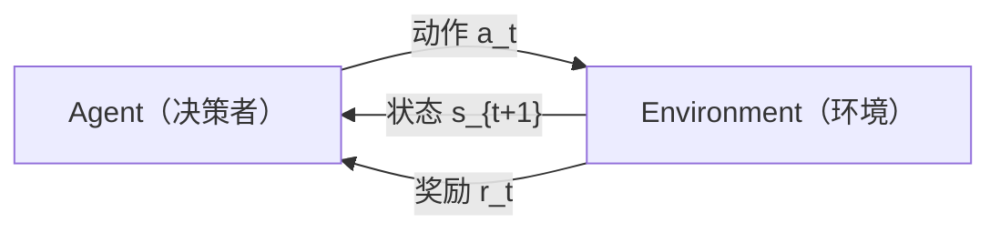
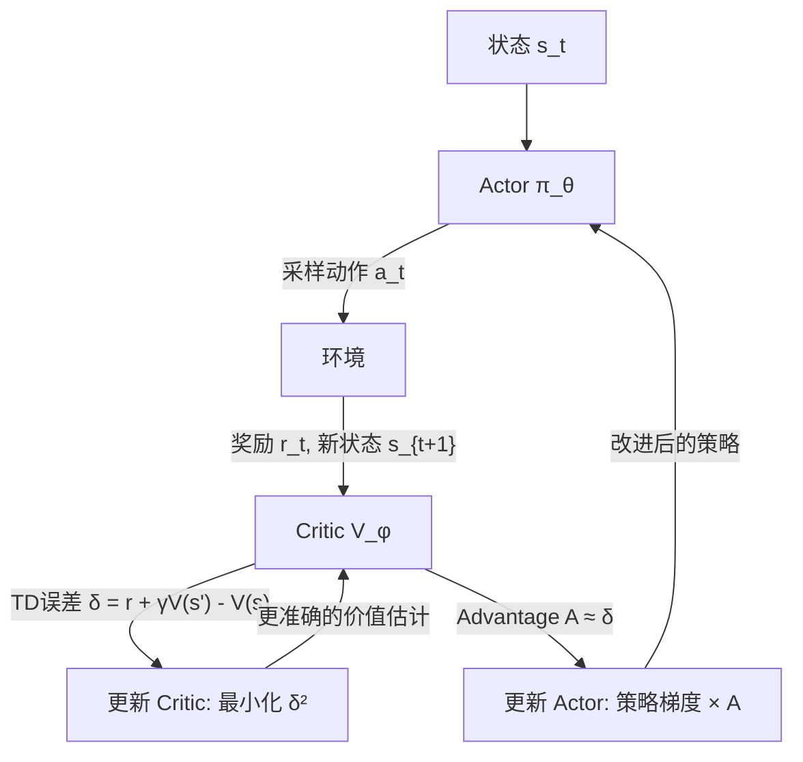

# Ch16: 强化学习基础——PPO / SAC / Reward Shaping

> Part 3: 核心主线精读
> 前置章节：[Ch15: 世界模型——World Models / Dreamer / Genie / Cosmos Policy](ch15-world-models.md)
> 后续章节：[Ch17: Sim-to-Real——仿真训练与真机部署](ch17-sim-to-real.md)

---

## 1. 从"抄作业"到"自己摸索"

回想一下你上学时的两种进步方式。

第一种：抄学霸的作业。学霸写了什么你就写什么，一道题一道题照着来。好处是立竿见影——交上去就能拿高分。坏处也很明显：你不知道为什么这么写。学霸如果突然转学了，没人给你抄了，你面对一道新题就傻眼了。更深层的问题是，学霸的解法不一定是最好的——也许有更巧妙的做法，但因为你从来只抄不想，你永远不会发现它。

这就是 [Ch14](ch14-imitation-learning.md) 模仿学习的本质。人类示教是"学霸的作业"，行为克隆是"照抄"，DAgger 是"抄的时候遇到不会的可以问学霸"，ACT 是"一次多抄几道题减少问学霸的次数"。所有这些方法的共同点是：学习信号来自专家的示范动作。没有专家，学习就停止了。

第二种：自己做题，然后看成绩。你不需要学霸的答案——你自己写，交上去，老师打分。80 分？还行，但这道题我换个解法试试。90 分？不错，这个方向继续。60 分？这条路走不通，换一种。经过足够多次考试，你不仅学会了做题，还可能发现比学霸更好的解法——因为你不受学霸思路的限制，你在自由探索解空间。

这就是强化学习（Reinforcement Learning, RL）。你不需要任何人示范正确动作，你只需要一个"评分标准"——在 RL 的术语里叫**奖励函数**（reward function）。机器人自己尝试各种动作，环境返回一个数字（奖励）告诉它"这次做得怎么样"。机器人的目标是：经过反复试错，找到一种行为策略，让累积奖励最大。

两种学习方式各有各的适用场景。模仿学习（抄作业）数据效率高——50 条人类示教就能让机器人学会基本操作——但上限受限于示教质量，而且需要人付出时间录制。强化学习（自己做题）上限更高——理论上可以发现超越人类的策略（AlphaGo 就是例子）——但前期要"交很多次试卷才能看出门道"，数据效率远低于模仿学习。

真实的具身 AI 系统通常两者结合：先用模仿学习做一个"还行"的初始策略（warm start），再用强化学习去打磨和超越。这就像先抄几份作业建立基本概念，然后自己做题追求真正的理解。这种组合在实践中已经被反复验证——例如 DPPO 先用模仿学习训练 Diffusion Policy，然后用 PPO 在仿真中微调；又如 Dreamer 先从少量真实交互中学世界模型，然后在想象中用 RL 训练策略。

强化学习的历史比模仿学习更长、更深。它的数学根基可以追溯到 1950 年代 Richard Bellman 的动态规划理论（Bellman equation 的名字就是从他来的）。但真正让 RL 在机器人领域产生巨大影响的是最近十年的三个里程碑事件：2013 年 DQN 用 RL 打 Atari 游戏达到人类水平，证明了深度 RL 的可行性；2016 年 AlphaGo 击败世界围棋冠军，证明了 RL 可以超越人类；2022 年 ChatGPT 用 RLHF（基于人类反馈的 RL）实现了人类偏好对齐，证明了 RL 连语言模型都能优化。在具身 AI 中，RL 同样不可或缺——Isaac Gym 用 PPO 在几分钟内训练出四足机器人的行走策略，这是纯模仿学习无法做到的。

世界模型（[Ch15](ch15-world-models.md)）在这个过程中扮演什么角色？它是一个"模拟考试系统"。在真实世界里做一次尝试代价很大——机器人可能撞坏东西、浪费时间。世界模型让你可以在"脑中"做无数次模拟考试——Dreamer 的"梦中训练"就是在世界模型的想象轨迹上跑强化学习算法。世界模型提供了想象力，强化学习提供了从想象中进步的能力——两者结合，就是 Dreamer 系列取得突破的完整秘诀。

本章覆盖强化学习的基础工具箱。路线图如下：

- Section 2：RL 的基本框架——agent/环境/状态/动作/奖励/策略/价值函数
- Section 3：策略梯度——"多做好事，少做坏事"的数学表达
- Section 4：Actor-Critic——学生和老师的配合
- Section 5：PPO——安全更新策略的工业标准
- Section 6：SAC——重用旧数据 + 鼓励探索的连续控制利器
- Section 7：检查点自测
- Section 8：过渡到下半部分（Reward Shaping、代码、FAQ）

**阅读建议：** 本章前半部分约 750 行，阅读时间 25-35 分钟。Section 2-3 建立直觉，即使数学公式看不太懂也没关系——重要的是理解"为什么要这样做"。Section 5（PPO）和 Section 6（SAC）是本章的核心，如果只有时间读两节，就读这两节。

**前置知识：** 本章假设你已读过 Ch14（模仿学习）和 Ch15（世界模型），了解行为克隆和 Dreamer 的基本思路。如果你对概率论和微积分的基础概念不熟悉（概率分布、期望值、梯度），建议先花 10 分钟快速复习——不需要严格推导，只需要知道"梯度是函数变化最快的方向"和"期望值是多次采样的平均结果"。

---

## 2. 强化学习的基本框架

### 2.1 Agent-环境循环

RL 的整个世界可以用四个字概括：**试错学习**。但"试错"这两个字背后有一套严格的数学框架，我们一步步来搭建。

想象你在学做菜。

你站在厨房里（这是你的**环境**），你就是那个做决定的人（**agent**）。你看到案板上有食材、锅里有油在冒烟、调味料摆在一旁——这些你看到的一切就是当前的**状态**（state, s）。你做了一个决定——往锅里加一勺盐（这是你的**动作**，action, a）。加完盐之后，你尝了一口汤——太咸了！这个"太咸"就是环境给你的**奖励**（reward, r），是一个负的信号。同时，厨房的状态也变了——汤变咸了，你的调味料少了一勺——这是新的状态 s'。

整个过程不断循环：观察状态 → 采取动作 → 收到奖励 → 进入新状态 → 观察新状态 → 采取新动作 → ……

用更正式的语言：

```
t=0: 观察状态 s_0 → 执行动作 a_0 → 获得奖励 r_0 → 进入状态 s_1
t=1: 观察状态 s_1 → 执行动作 a_1 → 获得奖励 r_1 → 进入状态 s_2
t=2: 观察状态 s_2 → 执行动作 a_2 → 获得奖励 r_2 → 进入状态 s_3
...
```

这个循环用一张图表示：



在机器人场景下：agent 是机器人的控制程序，环境是物理世界（或仿真器），状态可能是摄像头画面加关节角度，动作是关节力矩或末端位姿指令，奖励是人为设计的任务完成度量——比如"夹爪和目标物体之间的距离"。

值得注意的是，RL 框架中的"环境"不一定是真实的物理世界。它可以是仿真器（Isaac Gym、MuJoCo），可以是世界模型（Dreamer 的 RSSM），甚至可以是人类评判者（RLHF 中的奖励模型）。只要你有一个能接收动作、返回奖励和下一状态的东西，RL 的算法就能用。这种通用性是 RL 框架的一大优势——同一套 PPO 代码，可以训练四足机器人走路，也可以训练 ChatGPT 说话。

### 2.2 策略：决策规则

Agent 做决定的规则叫**策略**（policy），用希腊字母 π 表示。策略是一个从状态到动作的映射——看到状态 s，应该做什么动作 a。

策略可以是确定性的：π(s) = a（看到这个状态，就做这个动作）。但更常见的是**随机策略**：π(a|s) 是一个条件概率分布——看到状态 s，做各种动作的概率分别是多少。

为什么要随机？因为确定性策略在探索阶段太死板。想象你在一个迷宫里找出口。如果你的策略是"每次都左转"，你可能会一直绕圈。如果你的策略是"70% 概率左转，20% 概率右转，10% 概率直走"，你虽然大部分时候左转，但偶尔的右转和直走能让你发现新路线。随机性就是探索的引擎。

在深度 RL 中，策略 π 通常用一个神经网络表示——输入是状态（图像、关节角度），输出是动作的概率分布参数。对于连续动作空间（机器人关节力矩），通常输出高斯分布的均值 μ 和标准差 σ，然后从 N(μ, σ²) 中采样动作。对于离散动作空间（如 Atari 游戏中的上下左右），通常输出一个 softmax 概率向量，然后按概率采样。

在训练过程中，策略会逐渐从"几乎随机"进化到"大部分时候选好动作，偶尔探索"。训练早期的高随机性是必要的——你不知道哪个方向好，多尝试才能找到；训练后期随机性降低，因为你已经大致知道该怎么做了。PPO 和 SAC 在处理这个"从探索到利用"的过渡时采用了完全不同的策略——这是它们的核心区别之一，后面会详细展开。

### 2.3 累积折扣奖励

Agent 的目标是让**累积奖励最大化**。但不是简单地把所有奖励加起来——而是加一个折扣因子 γ（gamma，通常 0.99）：

```
G_t = r_t + γ·r_{t+1} + γ²·r_{t+2} + γ³·r_{t+3} + ...
    = Σ_{k=0}^{∞} γ^k · r_{t+k}
```

为什么要折扣？三个原因。

第一，**未来是不确定的**。你今天确定能拿到的 100 块钱，比一年后可能拿到的 100 块钱更值钱——因为一年后有各种意外。γ 就是这种"未来不确定性"的数学表达。

第二，**数学上的方便**。如果 γ=1 且奖励序列无穷长，累积奖励可能是无穷大——这在数学上没法优化。γ<1 保证了级数收敛。

第三，**鼓励效率**。如果 γ=0.99，那么 100 步之后的奖励被打了 0.99^100 ≈ 0.37 的折扣，200 步之后的奖励只值 0.99^200 ≈ 0.13。这鼓励 agent 更快地完成任务——早拿到的奖励更值钱。

γ 的选择对学习行为影响很大。γ 接近 1（如 0.999）：agent 目光长远，会为了未来大奖而放弃眼前小利。γ 小（如 0.9）：agent 短视，只关注最近几步的奖励。具身 AI 中通常用 0.99 或 0.995——既要让 agent 有足够的远见来完成多步任务，又不能太远（否则学习信号太弱）。

### 2.4 价值函数和 Q 函数

有了策略 π 和折扣因子 γ，我们可以定义两个核心概念。

**状态价值函数 V^π(s)**：在状态 s 下，按照策略 π 行动，未来能拿到的期望累积折扣奖励。

```
V^π(s) = E_π [Σ_{k=0}^{∞} γ^k · r_{t+k} | s_t = s]
```

直觉：V(s) 回答的问题是——"我现在处于状态 s，按照当前的策略继续走下去，平均能拿多少分？" 下棋时，这就是"当前局面下我赢的概率有多大"。做菜时，这就是"菜做到这个阶段了，最终端上桌的菜平均能得几分"。

回到机器人抓杯子的例子。假设杯子在桌上，机器人有三个关键状态：夹爪在起始位置（状态 A）、夹爪悬停在杯子上方（状态 B）、夹爪已经合拢夹住杯子（状态 C）。直觉上，V(C) 应该远大于 V(A)——因为从 C 出发只需要抬起来就完成任务了，而从 A 出发还有一长串动作要做。V 函数量化了这种"离目标还有多远"的直觉。

**动作价值函数 Q^π(s, a)**：在状态 s 下，先做动作 a，然后按照策略 π 行动，未来能拿到的期望累积折扣奖励。

```
Q^π(s, a) = E_π [Σ_{k=0}^{∞} γ^k · r_{t+k} | s_t = s, a_t = a]
```

直觉：Q(s, a) 回答的问题是——"在状态 s 下做动作 a 有多好？" V(s) 是"这个状态整体有多好"，Q(s, a) 是"这个状态下做这个具体动作有多好"。两者的关系是 V(s) = E_{a~π} [Q(s, a)]——V 是 Q 在策略 π 下对所有动作的期望。

继续抓杯子的例子。在状态 B（夹爪悬停在杯子上方）时，机器人有多个可选动作：向下移动（a1）、向左移动（a2）、合拢夹爪（a3）。Q(B, a1) 会比较高——因为向下移动让你更接近杯子。Q(B, a2) 会比较低——向左移动偏离了目标。Q(B, a3) 也不高——现在合拢夹爪什么也夹不到，白白浪费一步。V(B) 则是把所有这些 Q 值按当前策略选择各动作的概率加权平均——一个好策略大概率选 a1，所以 V(B) 会接近 Q(B, a1)。

### 2.5 Bellman 方程：递归的自洽性

V 和 Q 满足一组优美的递归关系，叫 **Bellman 方程**：

```
V^π(s) = E_π [r + γ · V^π(s') | s_t = s]
```

翻译成人话：**一个状态的价值 = 当前能拿到的即时奖励 + 折扣后的下一个状态的价值**。

这就像估算一栋房子的价值。你可以说"这栋房子值 500 万"——这是直接估计。你也可以说"这栋房子今年能收租 20 万，加上明年这栋房子（折旧后）值 490 万，所以总价值 = 20 + 0.99×490 ≈ 505 万"——这是递归估计。Bellman 方程就是后一种思路：通过相邻状态之间的一致性关系来定义价值。

为什么 Bellman 方程重要？因为它给了我们一种**迭代学习价值函数的方法**。我们不需要从头算"从 s 开始一直走到终点的累积奖励"——我们只需要看一步：拿到即时奖励 r，到达下一个状态 s'，然后用 s' 的价值估计来补全剩余部分。这种"看一步然后用估计值填补"的方法叫 **TD 学习**（Temporal Difference Learning），是整个 RL 算法家族的核心计算模式。

Q 函数也有类似的 Bellman 方程：

```
Q^π(s, a) = E [r + γ · E_{a'~π} [Q^π(s', a')] | s_t = s, a_t = a]
```

这两个方程是后面 Actor-Critic、PPO、SAC 所有算法的数学根基。

用一个具体的机器人例子感受一下 Bellman 方程的实际含义。假设机器人的任务是拿起桌上的杯子。当前状态 s：夹爪在杯子正上方 10cm。动作 a：向下移动 5cm。即时奖励 r = -0.1（小的惩罚，鼓励快点完成）。新状态 s'：夹爪在杯子正上方 5cm。如果我们的 V 估计是 V(s) = 3，V(s') = 5，那么 Bellman 方程的等式左边 V(s) = 3，右边 r + γV(s') = -0.1 + 0.99×5 = 4.85。左边和右边不相等，差值 4.85 - 3 = 1.85——这就是 TD 误差，告诉我们 V(s) 估低了，应该往上调。多次迭代之后，V 会收敛到一个自洽的状态——Bellman 方程对所有状态同时成立。

### 2.6 On-policy vs Off-policy 预览

在进入具体算法之前，有一个贯穿全章的核心区分需要提前铺垫——**on-policy**（在策略）和 **off-policy**（离策略）。

On-policy 算法只用**当前策略产生的数据**来学习。你更新了策略之后，之前收集的数据就"过时"了——因为它反映的是旧策略的行为，不能代表新策略的行为分布。就像一个运动员只看自己最近一场比赛的录像来改进——上周的录像已经不反映他现在的水平了。PPO 是 on-policy 的代表。

Off-policy 算法可以用**任何策略产生的数据**来学习——不管是当前策略的、旧策略的、甚至是别的 agent 的。就像一个运动员不仅看自己的录像，还看对手的录像、去年的比赛录像、甚至是不同联赛的录像——从所有经验中汲取教训。SAC 是 off-policy 的代表。

这个区分直接决定了算法的**样本效率**：off-policy 算法更高效（每条数据被反复利用），但也更容易不稳定（旧数据可能"误导"当前的学习）。后面在 PPO（Section 5）和 SAC（Section 6）中我们会看到这个 trade-off 如何具体表现。

### 2.7 小结

把 RL 的基本概念串起来：agent 在环境中循环交互（状态→动作→奖励→新状态）。agent 的行为由策略 π 决定。目标是找到一个策略，最大化累积折扣奖励。价值函数 V 和 Q 衡量"从某个状态/状态-动作对出发，能拿多少分"。Bellman 方程给出了价值函数的递归结构，让我们可以通过 TD 学习逐步逼近真实价值。On-policy 和 off-policy 是两种根本不同的数据使用策略，分别对应 PPO 和 SAC。

下一个问题是：知道了价值函数之后，怎么改进策略？

---

## 3. 策略梯度：多做好事，少做坏事

### 3.1 核心直觉

改进策略的思路非常直觉——和人类的试错学习一模一样。

你学投篮。第一次投出去，进了！你心想："刚才那个手感不错，下次还这么投。" 第二次换了个姿势，没进。你心想："这个姿势不行，以后少用。" 第三次用了第一次的姿势但稍微调高了角度，又进了。你心想："这个更好，继续强化。"

策略梯度（Policy Gradient）就是这个过程的数学版本：**增加好结果对应动作的概率，减少坏结果对应动作的概率**。

具体的数学表达是 REINFORCE 算法（Williams, 1992）。策略 π_θ 是一个参数为 θ 的神经网络。我们想调整 θ，让累积奖励的期望 J(θ) = E_π[G] 最大。J 对 θ 的梯度是：

```
∇_θ J = E_π [∇_θ log π_θ(a|s) · G_t]
```

这个公式虽然有数学符号，但直觉非常清晰。拆解一下：

- ∇_θ log π_θ(a|s)：这是"让动作 a 在状态 s 下更可能被选中"的方向。如果我们沿这个方向更新 θ，策略会更倾向于在状态 s 下选择动作 a。
- G_t：这次采样得到的累积奖励。如果 G_t > 0（好结果），那么乘上去之后，梯度方向就是"增加动作 a 的概率"——多做好事。如果 G_t < 0（坏结果），梯度方向翻转，变成"减少动作 a 的概率"——少做坏事。
- E_π[...]：对很多次采样取平均。一次投篮不能说明问题，多投几百次才能看出规律。

这就是策略梯度的全部本质：采样一批轨迹，算每条轨迹的回报，回报高的轨迹中的动作被强化，回报低的被抑制。

注意策略梯度和监督学习的根本区别。在监督学习（如 [Ch14](ch14-imitation-learning.md) 的行为克隆）中，你有"正确答案"——专家在这个状态下做了什么动作，你直接最小化你的预测和专家动作之间的差距。在策略梯度中，你**没有正确答案**——你只知道"do something, get reward"，你需要自己通过试错发现什么是好的。这是 RL 比 IL 更难但也更强大的根本原因——它不受限于“老师的水平”。

### 3.2 Advantage：你比平均水平好了多少？

REINFORCE 用的是原始回报 G_t，但这有个严重问题——**高方差**。

想象你在考试。你考了 80 分。这算好还是不好？如果平均分是 60，那 80 分很好——你应该保持这次考试的策略。如果平均分是 90，那 80 分就不好——你应该改变策略。光看 80 分这个绝对数字，没有任何信息。

同样的问题出现在 REINFORCE 中。假设某个环境的奖励范围是 [50, 100]，所有轨迹的 G_t 都是正数。那么策略梯度 ∇_θ log π · G_t 永远在"增加所有动作的概率"——连坏动作的概率也在增加（只是增加得少一些）。这效率太低了。

解决方案是引入**优势函数**（Advantage Function）：

```
A(s, a) = Q(s, a) - V(s)
```

A(s, a) 回答的问题是："在状态 s 下做动作 a，比在状态 s 下按策略平均表现，好了多少？"

- A > 0：这个动作比平均水平好——增加其概率
- A < 0：这个动作比平均水平差——减少其概率
- A = 0：和平均水平一样——不变

用 Advantage 替换原始回报，策略梯度变为：

```
∇_θ J = E_π [∇_θ log π_θ(a|s) · A(s, a)]
```

回到考试的例子：Advantage = 你的分数 - 平均分。80 - 60 = +20（好，保持），80 - 90 = -10（差，改进）。信号清晰得多。

### 3.3 REINFORCE 的局限

尽管策略梯度的思想直觉而优雅，REINFORCE 算法本身有三个实际问题：

**问题一：方差太高。** 即使用了 Advantage，策略梯度的估计仍然依赖于采样轨迹。一条轨迹中可能有些步骤运气好得了高奖励，有些步骤运气差。用少量轨迹估计的梯度噪声很大——就像只用 10 个人的考试成绩来估计全校平均分，误差会很大。

**问题二：没有价值函数就算不了 Advantage。** 要算 A = Q - V，你需要知道 V(s)——但 REINFORCE 本身不学 V，它只学策略网络。没有 V 就只能用蒙特卡洛估计（跑完整条轨迹再算回报），这既慢（要等轨迹结束）又噪（一条轨迹一个数据点）。

**问题三：只能 On-policy。** REINFORCE 的梯度公式要求采样轨迹来自当前策略 π_θ。一旦 θ 更新了，所有旧轨迹就"过期"了，必须重新采样。这意味着每次更新都要从零开始收集数据——在真实机器人上这种浪费是不可接受的。

这三个问题共同指向一个解决方案：不要只训练一个策略网络，同时训练一个**价值网络**来评估状态好坏。策略网络负责"做决定"，价值网络负责"打分"。两个网络互相配合，就是下一节要讲的 Actor-Critic 架构。

---

## 4. Actor-Critic：学生和老师的配合

### 4.1 两个网络的分工

Actor-Critic 架构由两个神经网络组成：

**Actor（演员/学生）**：策略网络 π_θ(a|s)。输入状态 s，输出动作分布。它负责"做决定"——在每个状态下选择做什么动作。训练目标是让策略变得更好——增加好动作的概率，减少坏动作的概率。

**Critic（评论家/老师）**：价值网络 V_φ(s) 或 Q_φ(s, a)。输入状态（和动作），输出一个标量——对当前局面的"评分"。它负责"打分"——告诉 Actor "你刚才做得怎么样"。训练目标是让评分更准确——预测值和真实回报越接近越好。

用一个类比来理解。想象学钢琴的场景：Actor 就是坐在琴凳上弹琴的学生，Critic 就是站在旁边的老师。学生弹完一段，老师给个评价——"这段弹得不错，比你平时水平好"或"这段退步了，节奏不稳"。学生根据评价调整演奏，老师根据学生的进步调整评判标准。两个人在互动中一起进步。

为什么不能只有 Actor 没有 Critic？因为 Actor 自己不知道"做得好不好"——它需要一个参考基准。如果没有 Critic，Actor 只能等一整条轨迹跑完后用蒙特卡洛回报来更新，这就回到了 REINFORCE 的老路——高方差、不高效。

为什么不能只有 Critic 没有 Actor？因为 Critic 只会"评分"不会"做事"。你知道每个状态有多好，但还是需要一个从状态到动作的映射来实际执行。纯 Critic 方法（如 DQN）在离散动作空间可以通过"选 Q 值最大的动作"来做决定，但在连续动作空间（机器人关节力矩是连续值）中不可行——你没法枚举无穷多个连续动作去找 Q 最大的那个。

### 4.2 训练循环

Actor-Critic 的训练是一个交替进行的过程。每一步的流程如下：

```
Step 1: Actor 在状态 s_t 下采样动作 a_t ~ π_θ(·|s_t)
Step 2: 环境返回奖励 r_t 和下一状态 s_{t+1}
Step 3: Critic 计算 TD 误差 δ = r_t + γ·V_φ(s_{t+1}) - V_φ(s_t)
Step 4: 更新 Critic → 最小化 δ²（让价值估计更准确）
Step 5: 更新 Actor → 用 δ 作为 Advantage 的估计，做策略梯度更新
```

Step 3 中的 TD 误差 δ 是核心。它的含义是："实际拿到的奖励 r_t 加上对未来的估计 γ·V(s')，和我之前对这个状态的预估 V(s) 相比，差了多少。"

如果 δ > 0：说明"实际情况比预期好"——当前动作的回报超出预期，Actor 应该增加这个动作的概率。就像学生弹了一段出人意料地好，老师说"不错，比我预期的好"——学生下次会更倾向于这样弹。

如果 δ < 0：说明"实际情况比预期差"——当前动作的回报不如预期，Actor 应该减少这个动作的概率。就像学生弹砸了，老师说"这次不如你平时水平"——学生下次会避免这种弹法。

两个网络的进步是互相促进的。更准确的 Critic → 更可靠的 Advantage 估计 → Actor 的策略梯度更新方向更正确 → Actor 变强后会遇到新的挑战性状态 → Critic 必须学会评估这些新状态 → Critic 也跟着进步。这个良性循环是 Actor-Critic 高效的核心原因。

用一个图来展示这个训练循环的数据流：



注意 Critic 的训练本质上是一个监督学习问题——输入是状态，标签是 r + γV(s')（bootstrapped target），目标是让 V(s) 尽可能接近这个标签。唯一特殊的地方是标签本身也在变——因为 V 在不断更新。这种"用自己的估计值来训练自己"的方式叫 **bootstrapping**，是 TD 学习的核心特征，也是它和监督学习的本质区别。

### 4.3 GAE：平衡偏差和方差

TD 误差 δ = r + γV(s') - V(s) 是 Advantage 的一个估计，但它只看了**一步**。这有一个问题：如果 Critic 的 V 不够准确（训练早期几乎肯定不准），那么 δ 的偏差就会很大——你在用一个不靠谱的估计值来替代真实回报。

另一个极端是蒙特卡洛估计：从当前步一直走到轨迹结束，用真实的累积回报 G_t 减去 V(s) 作为 Advantage。这没有偏差（不依赖 V 的准确性），但方差很大——一条轨迹中的随机性全部体现在估计值里。

**GAE**（Generalized Advantage Estimation, Schulman et al., 2016）是一个精巧的折中方案。它用一个参数 λ 来混合不同步数的 TD 估计：

```
A^GAE(γ,λ) = Σ_{l=0}^{∞} (γλ)^l · δ_{t+l}
```

其中 δ_{t+l} = r_{t+l} + γV(s_{t+l+1}) - V(s_{t+l}) 是每一步的 TD 误差。

λ 控制了偏差和方差的 trade-off：

- λ = 0：A = δ_t = r + γV(s') - V(s)，纯一步 TD。低方差（只看一步），高偏差（完全依赖 V 的准确性）。
- λ = 1：A = G_t - V(s_t)，纯蒙特卡洛。低偏差（不依赖 V），高方差（累积了整条轨迹的随机性）。
- λ = 0.95（典型值）：在两个极端之间取了一个实践中效果最好的平衡点。

类比：你想知道一家新开的餐厅好不好。一步 TD（λ=0）就像只看了菜单上第一道菜就下结论——快但可能不准。蒙特卡洛（λ=1）就像把整本菜单上所有菜都点一遍再给评价——准但太慢太贵。GAE（λ=0.95）就像点几道招牌菜试试——兼顾了效率和准确性。

PPO 内部使用的就是 GAE。所以理解了 GAE，就理解了 PPO 计算 Advantage 的方式。

### 4.4 Actor-Critic 的历史地位

Actor-Critic 不是一个具体算法，而是一个**架构范式**。PPO 是 Actor-Critic 架构上的一个具体实现（on-policy + clipping），SAC 是另一个具体实现（off-policy + 最大熵）。Dreamer 的梦中训练也是 Actor-Critic——Actor 在想象轨迹上优化策略，Critic 评估想象状态的价值。DDPG、TD3、A3C——这些你可能在论文中见过的算法名字，全部是 Actor-Critic 的变种。它们的区别在于：怎么更新 Actor（策略梯度 vs 确定性梯度）、怎么训练 Critic（单 Q vs Twin Q vs V）、数据怎么用（on-policy vs off-policy）。

学会了 Actor-Critic 的通用架构，后面的 PPO 和 SAC 就只是在这个架构上做不同的设计选择——就像同一种房子的不同装修方案。

---

## 5. PPO 深度剖析

### 5.1 核心问题："怎么更新策略才安全？"

到目前为止，策略梯度的故事看起来很完美：算梯度，沿着梯度方向更新策略，策略就会变好。但在实践中有一个致命问题——**步子迈得太大会摔跤**。

想象你在走一条山脊上的小路。你知道大致方向（梯度），但如果你一步迈出去太远，可能一脚踩空掉下悬崖。在 RL 中，"掉下悬崖"对应的是策略崩溃——一次过大的更新让策略变得极差，而一旦策略变差，它采集到的数据质量也变差，导致下一次更新更差，形成恶性循环，再也恢复不了。

Vanilla 策略梯度没有任何机制防止这种情况。你算出梯度方向后，乘以学习率走一步——但没人告诉你这一步有多大才安全。

TRPO（Trust Region Policy Optimization, Schulman et al., 2015）是第一个严肃解决这个问题的方法。它的核心想法是：每次更新策略时，**约束新策略和旧策略之间的 KL 散度不超过一个阈值**——确保新策略不会偏离旧策略太远。这在数学上很优雅，效果也好，但计算成本很高——需要计算二阶导数（Fisher 信息矩阵）和做共轭梯度求解。

PPO（Proximal Policy Optimization, Schulman et al., 2017）用一个简单得多的方法达到了类似的效果——**裁剪概率比率**（clipping the probability ratio）。它放弃了 TRPO 严格的数学约束，换成了一个计算便宜的近似——而且在实践中效果几乎一样好，有时甚至更好。

PPO 的设计哲学可以用一句话概括：**不要追求理论上的最优更新，要追求实践中稳定可靠的更新。**

### 5.2 Ratio Clipping 机制

PPO 的核心机制基于一个简单的量——**概率比率**（probability ratio）：

```
r(θ) = π_θ(a|s) / π_θ_old(a|s)
```

分子是新策略在状态 s 下选择动作 a 的概率，分母是旧策略（更新前）在同一状态下选择同一动作的概率。这个比率衡量了"策略变化了多少"：

- r(θ) = 1：新旧策略完全一样——策略没有变化
- r(θ) > 1：新策略更倾向于选择这个动作——概率增加了
- r(θ) < 1：新策略更不倾向于选择这个动作——概率减少了
- r(θ) = 1.5：新策略选择这个动作的概率是旧策略的 1.5 倍

PPO 的做法是：**把 r(θ) 裁剪到 [1-ε, 1+ε] 的范围内**，其中 ε 通常取 0.2。也就是说，不管梯度多大，策略每次更新最多只能让某个动作的概率变化 ±20%。

裁剪后的损失函数是：

```
L^CLIP = E [min(r(θ)·A, clip(r(θ), 1-ε, 1+ε)·A)]
```

这个 min 操作取两个值中较小的那个——即"悲观估计"。为什么要悲观？因为我们宁可保守一点也不要冒险——具体原因见下一节。

类比：想象你开车，导航说"前方右转"。你知道要右转（梯度方向），但 PPO 给你加了一个"限速标志"——你可以右转，但转弯幅度不能超过 20 度。即使导航说"急转弯"，你也不能猛打方向盘——因为高速急转弯会翻车（策略崩溃）。限速标志让你每次温和转弯，多转几次也能到目的地，而且全程安全。

### 5.3 为什么是 min？

PPO 损失函数中的 min 操作是整个算法最精巧的部分。分两种情况理解：

**情况一：Advantage A > 0（这是一个好动作，应该增加概率）**

- 不裁剪的项：r(θ)·A，希望 r(θ) 越大越好（更多增加好动作概率）
- 裁剪的项：clip(r(θ), 0.8, 1.2)·A，当 r(θ) > 1.2 时被截断为 1.2·A
- min 取两者较小的：当 r(θ) > 1.2 时，裁剪项更小，被选中 → 阻止了过度增加
- 效果：**对好动作，不让你过度兴奋**——即使一个动作表现很好，也不要一下子把概率拉得太高

**情况二：Advantage A < 0（这是一个坏动作，应该减少概率）**

- 不裁剪的项：r(θ)·A。因为 A < 0，r(θ) 越小（概率减少越多）→ r(θ)·A 越"正"（损失越大）。优化器在做梯度上升（最大化 L），所以它会倾向于让 r(θ) 变小。
- 裁剪的项：clip(r(θ), 0.8, 1.2)·A。当 r(θ) 已经降到 0.8 以下时，裁剪项锁定在 0.8·A——不再随 r 变化。
- min 取两者较小的：当 r(θ) < 0.8 时，裁剪项 0.8·A 比不裁剪项 r(θ)·A 更小（更负）。min 选了裁剪项，而裁剪项关于 θ 的梯度为零——于是不再有动力继续减小 r。
- 效果：**对坏动作，也不让你过度惩罚**——即使一个动作表现很差，也不要一下子把概率打到接近零。

总结两种情况的规律：min 操作在 r(θ) 越过 [1-ε, 1+ε] 边界后，自动"关闭"了梯度信号。边界内（0.8 到 1.2 之间），不裁剪项和裁剪项相等，算法正常运行。边界外，裁剪项成为常数，梯度归零，不再推动策略进一步变化。

**一句话核心**：PPO 的 min + clip 做的事情就是——**移除梯度中"让策略变化超过 ε 的那部分激励"**。无论是增加好动作概率还是减少坏动作概率，一旦概率比率越过 [1-ε, 1+ε] 的边界，裁剪就把梯度"关掉"了。策略可以在后续的优化步骤中继续变化（新一批数据会重新计算 r(θ)），但单次优化步骤中的变化幅度被限制住了。

这就像给策略更新装了一个"刹车系统"。你可以加速（增加好动作概率），但加速到一定程度刹车就自动踩下。你可以减速（减少坏动作概率），但减速到一定程度刹车也会踩下。这个刹车的阈值就是 ε=0.2——每次最多变 20%。

下图展示了裁剪损失函数相对于 r(θ) 的形状：

```
L^CLIP 相对于 r(θ) 的示意图

当 A > 0 (好动作):
   L
   ↑          ╱‾‾‾‾‾‾‾  ← 裁剪：r > 1+ε 时梯度为 0
   |        ╱
   |      ╱
   |    ╱
   |  ╱
   +--+--------+------→ r(θ)
      0.8     1.2

当 A < 0 (坏动作):
   +--+--------+------→ r(θ)
   |  0.8     1.2
   |          ╲
   |            ╲
   |              ╲
   ↓               ╲___  ← 裁剪：r < 1-ε 时梯度为 0
   L
```

关键观察：在裁剪区域之外，损失函数是平坦的——梯度为零，不再推动策略变化。这就是 PPO 的"信任区域"效果——不需要显式计算 KL 散度，裁剪自然地限制了策略的变化幅度。

### 5.4 PPO 在具身 AI 中的应用

PPO 之所以成为强化学习的"默认选择"，不仅因为它简单稳定，更因为它已经在多个关键领域被验证有效：

**Isaac Gym 大规模并行训练。** NVIDIA 的 Isaac Gym 可以在一块 GPU 上同时运行 4096 个仿真环境。4096 个机器人同时试错、同时收集数据，然后 PPO 用这些海量数据做一次策略更新。因为 PPO 是 on-policy 算法（需要大量来自当前策略的数据），而 Isaac Gym 的并行化恰好能以极低成本提供海量数据，两者是天然搭配。结果：一个四足机器人的行走策略，用 Isaac Gym + PPO 可以在几分钟内训练完成——而同样的任务在真实世界中可能需要几周。

**Dreamer 的梦中训练。** [Ch15](ch15-world-models.md) 中我们看到 Dreamer 用 actor-critic 在想象轨迹上训练策略。这个 actor-critic 就是 PPO 风格的更新——Actor 用策略梯度（带 Advantage）优化，Critic 用 TD 学习逼近价值函数。世界模型生成想象轨迹充当"虚拟的 Isaac Gym"——PPO 在想象中训练，和在仿真中训练用的是同一套算法。

**RLHF：PPO 微调大语言模型。** ChatGPT 之所以能"对齐"人类偏好，靠的就是 PPO。流程是：用人类偏好数据训练一个奖励模型（哪个回答更好），然后用 PPO 微调语言模型——让模型生成的回答在奖励模型上得分更高。这和机器人 RL 本质上是同一件事——只是"动作"从关节力矩变成了文本 token，"奖励"从任务完成度变成了人类偏好评分。同一个 PPO 算法，跨越了机器人控制和语言模型两个看似完全不同的领域。

**DPPO：PPO 微调扩散策略。** [Ch13](ch13-diffusion-policy.md) 中的 Diffusion Policy 用模仿学习训练——但模仿学习有上限（受限于示教质量）。DPPO 的做法是：先用模仿学习训练一个 Diffusion Policy 作为初始策略，然后用 PPO 在仿真环境中进一步优化。这就是"先抄作业建立基础，然后自己做题超越学霸"的具体实现。

### 5.5 PPO 的局限

PPO 的最大弱点用一个词就能概括：**浪费数据**。

PPO 是 on-policy 算法——它只能用当前策略采集的数据来更新。一旦策略更新了（哪怕只更新了一点点），之前所有采集的数据就"过期"了——因为这些数据来自旧策略，不能代表新策略的行为分布。PPO 通常会在每批数据上做 3-10 个 epoch 的优化（裁剪机制让这样做是安全的），但之后这批数据就必须丢弃。

在仿真环境中这不是大问题——Isaac Gym 可以用 GPU 并行化在几毫秒内生成几千条新轨迹。在世界模型中也不是大问题——Dreamer 可以随意生成想象轨迹。但如果你在真实机器人上训练，每条轨迹都需要真实时间（一次抓取 3-5 秒）和真实风险（撞到东西可能损坏硬件），数据浪费就是不可接受的。

这就引出了一个自然的问题：有没有一种算法可以重用旧数据？一条经验用了一次之后，能不能存起来以后再用？答案是 SAC——下一节的主角。

PPO 的其他局限还包括：对超参数虽然比 TRPO 不敏感但仍需要调整（ε、GAE 的 λ、epoch 数、batch size），以及在需要精细操作的连续控制任务（如灵巧手操作）中有时不如 SAC 表现好。

把 PPO 的核心训练循环写成伪代码，帮你建立从数学到实现的对应关系：

```
PPO 训练循环伪代码
─────────────────
初始化 Actor 网络 π_θ（策略）和 Critic 网络 V_φ（价值函数）

for iteration = 1, 2, 3, ... do:
    # 第一阶段：收集数据（rollout）
    用当前策略 π_θ 和环境交互 T 步
    存储每步的 (s_t, a_t, r_t, s_{t+1}, log π_θ_old(a_t|s_t))
    
    # 第二阶段：计算 Advantage（用 GAE）
    对每个时间步 t，用 Critic 计算 TD 误差 δ_t = r_t + γV(s_{t+1}) - V(s_t)
    用 GAE 公式计算 A_t = Σ_{l=0} (γλ)^l · δ_{t+l}
    
    # 第三阶段：优化（在同一批数据上跑 K 个 epoch）
    for epoch = 1 to K do:           # K 通常 = 3~10
        for 每个 mini-batch do:
            计算概率比率 r(θ) = π_θ(a|s) / π_θ_old(a|s)
            裁剪损失 L = min(r(θ)·A, clip(r(θ), 1-ε, 1+ε)·A)
            Critic 损失 = (V_φ(s) - V_target)²
            
            用梯度上升更新 Actor（最大化 L）
            用梯度下降更新 Critic（最小化 Critic 损失）
    
    # 第四阶段：丢弃全部数据，回到第一阶段
```

注意第四阶段——收集的数据在 K 个 epoch 之后就全部丢弃了。这就是 on-policy 的代价。

一个具体的数字可以说明 on-policy 的浪费程度。假设你在一个任务中收集了 10000 步数据（大约 100 条轨迹），PPO 在这批数据上做 10 个 epoch 的优化，然后全部丢弃——总共用了 10000×10 = 100000 次，但这 10000 步数据从此再也不会被使用。而 SAC 的 replay buffer 可以存 100 万步数据，每次更新从中随机抽 256 步——同一步数据在训练过程中可能被抽中几十次甚至上百次。在数据获取昂贵的场景中（真实机器人、高保真仿真），这种效率差距是决定性的。

---

## 6. SAC 深度剖析

### 6.1 核心问题："可以重用旧数据吗？"

PPO 每次更新完就丢弃数据。SAC（Soft Actor-Critic, Haarnoja et al., 2018）走了一条完全不同的路：**把所有经验都存进一个"记忆库"（replay buffer），更新时随机抽取一小批来用。**

类比：PPO 像一个"看一遍就扔"的学生——每次考完试把试卷扔掉，下次考试全靠新的刷题。SAC 像一个"建错题本"的学生——每次做过的题都记下来，复习时随机翻几页重新做。后者显然更高效——同一道题可以被反复利用，而且你还能回顾很久以前做过的题，发现新的规律。

这种"存旧数据、重用旧数据"的做法在 RL 术语中叫 **off-policy**（离策略）。与之对应的是 PPO 的 **on-policy**（在策略）——只用当前策略的数据。Off-policy 的核心优势是**样本效率**：同样多的环境交互，off-policy 算法能从中学到更多，因为每条经验被反复使用了。

Replay buffer 的具体实现很简单：一个固定大小的队列（通常 100 万条），每次和环境交互得到 (s, a, r, s') 就往里存。满了就把最老的数据丢掉。训练时随机从 buffer 中抽取一个 mini-batch（通常 256 条），和监督学习的数据加载方式几乎一样。

但 off-policy 有一个微妙的问题：buffer 里的旧数据是用旧策略采集的，和当前策略不一致。在 on-policy 的策略梯度中，这会导致梯度估计有偏。SAC 巧妙地绕过了这个问题——它不直接用策略梯度，而是用 Q-learning 风格的更新，结合一个独特的"最大熵"目标。

### 6.2 最大熵目标

SAC 和传统 RL 的根本区别在目标函数上。

传统 RL 的目标是：**最大化累积奖励**。

```
π* = argmax_π E_π [Σ r_t]
```

SAC 的目标是：**最大化累积奖励 + 策略的熵**。

```
π* = argmax_π E_π [Σ (r_t + α · H(π(·|s_t)))]
```

这里 H(π(·|s_t)) 是策略在状态 s_t 下的**熵**——衡量策略的"随机程度"。熵越高，策略越随机（各种动作的概率越均匀）；熵越低，策略越确定（几乎总是选同一个动作）。α 是温度系数，控制熵的权重。

翻译成人话：SAC 要求 agent **在完成任务的同时，保持尽可能多的随机性**。不是"找到一种做法然后死磕"，而是"找到尽可能多种能完成任务的做法"。

为什么要鼓励随机性？这似乎违反直觉——完成任务不应该越确定越好吗？

有三个深层原因：

**原因一：防止过早收敛。** 传统 RL 容易陷入"局部最优"——agent 发现了一种"还行"的做法，就一直重复这种做法，再也不探索其他可能性。就像一个只会一道菜的厨师——他发现炒鸡蛋不会失败，就每天只炒鸡蛋，再也不尝试其他菜。最大熵目标迫使 agent 保持探索——即使你已经找到了一种好方法，也要继续尝试其他方法，以防有更好的。

**原因二：鲁棒性。** 如果 agent 学到了多种完成任务的方式，当其中一种方式被阻断时（比如抓取路径上突然出现障碍物），它可以自然地切换到另一种方式。确定性策略只有 Plan A，最大熵策略有 Plan A/B/C/D——抗干扰能力天然更强。

**原因三：探索效率。** 高熵策略在探索阶段覆盖状态空间更广——因为它不会反复访问同一批状态。这让 agent 更快地发现环境中的高奖励区域。

类比：想象你是一个探案的侦探。**确定性策略**的侦探一旦发现了一条线索，就死盯着这条线索不放——如果这条线索通向死胡同，就浪费了所有时间。**最大熵策略**的侦探同时追踪多条线索——每条线索都花一些时间调查，虽然单条线索的进展可能慢一些，但更可能找到真正的突破口，而且不会因为某条线索断了就陷入僵局。

温度系数 α 控制了"随机性"和"确定性"之间的平衡。α 大：更随机，更倾向于探索。α 小：更确定，更倾向于利用已知的好策略。SAC 的一个关键设计是 **α 自动调整**——算法在训练过程中自动寻找一个合适的 α 值，让策略的熵保持在一个目标水平附近。训练早期 α 大（多探索），训练后期 α 自动减小（多利用）。你不需要手动调这个参数。

### 6.3 Twin Q-Networks

SAC 使用 Q-learning 来更新 Critic——但纯 Q-learning 有一个老问题：**过高估计**（overestimation）。

Q-learning 的更新规则是 Q(s, a) ← r + γ · max_{a'} Q(s', a')。那个 max 操作会系统性地高估 Q 值——因为它总是选 Q 最大的动作，而 Q 的估计本身有噪声。想象 Q 对每个动作的估计都有 ±5 的随机误差：真实值分别是 [10, 12, 11]，但估计值可能是 [14, 9, 15]。max 选了 15，而真实最大值只有 12。这种偏差会随训练不断放大——高估的 Q 值通过 Bellman 方程传播到其他状态，导致整个 Q 网络变得"虚高"。

SAC 的解决方案简单而有效：**训练两个独立的 Q 网络 Q_1 和 Q_2，取两者中较小的那个。**

```
Q_target = min(Q_1(s', a'), Q_2(s', a'))
```

两个网络的随机初始化不同，训练过程中看到的 mini-batch 不同（因为是随机采样的），所以它们的过高估计方向不同。取 min 就像让两个裁判分别打分然后取较低分——任何一个裁判的"手松"都会被另一个裁判拉回来。

这个技术叫 **Clipped Double-Q Learning**（或 Twin Q），最早由 TD3 算法提出，SAC 直接采用了。

### 6.4 Reparameterization Trick

SAC 需要对策略网络（Actor）做梯度更新——让策略选择那些能获得高 Q 值同时保持高熵的动作。但这里有一个技术难题：策略输出的是一个概率分布（高斯分布），动作是从这个分布中**采样**出来的，而采样操作本身不可微分——你没法对"从分布中随机抽一个数"做反向传播。

**重参数化技巧**（Reparameterization Trick）解决了这个问题。核心思想是把采样拆成两步：

```
a = μ_θ(s) + σ_θ(s) · ε,  其中 ε ~ N(0, 1)
```

策略网络输出均值 μ 和标准差 σ（这两个量依赖于参数 θ），然后用一个与 θ 无关的标准正态噪声 ε 来引入随机性。最终的动作 a 仍然是随机的（因为 ε 是随机的），但 a 对 θ 是可微的（因为 μ 和 σ 都是 θ 的可微函数）。

这就像问"我想让随机掷骰子的结果和某个参数有关，但掷骰子本身是纯随机的"。重参数化的做法是：先掷一个公平骰子得到随机数 ε，然后让结果 = f(θ)·ε + g(θ)。随机性来自 ε，但 f 和 g 关于 θ 可微——梯度可以流过 f 和 g，而不需要流过 ε。

有了这个技巧，SAC 就可以用标准的反向传播来更新 Actor 网络：

```
∇_θ J_π = E [∇_θ α·log π_θ(a|s) - ∇_θ Q(s, a)]
```

让策略同时最大化 Q 值（做得好）和最大化熵（保持随机）。

SAC 的训练循环和 PPO 差异很大，用伪代码对比：

```
SAC 训练循环伪代码
─────────────────
初始化 Actor π_θ, 两个 Critic Q_1, Q_2, 两个 Target Q'_1, Q'_2
初始化 Replay Buffer B（容量 100 万）

for step = 1, 2, 3, ... do:
    # 第一阶段：和环境交互一步，存入 buffer
    观察状态 s，用 π_θ 采样动作 a
    执行 a，观察 r, s'
    把 (s, a, r, s') 存入 B
    
    # 第二阶段：从 buffer 中随机抽一批数据训练
    从 B 中随机抽取 256 条 (s, a, r, s')
    
    # 更新 Critic（两个 Q 网络独立更新）
    a' ~ π_θ(·|s')                         # 用当前策略在 s' 采样
    y = r + γ · (min(Q'_1(s',a'), Q'_2(s',a')) - α·log π(a'|s'))
    最小化 (Q_1(s,a) - y)² 和 (Q_2(s,a) - y)²
    
    # 更新 Actor
    a_new ~ π_θ(·|s)（用重参数化）
    最大化 min(Q_1(s, a_new), Q_2(s, a_new)) - α·log π(a_new|s)
    
    # 软更新 Target 网络
    Q'_i ← τ·Q_i + (1-τ)·Q'_i    # τ=0.005，缓慢追踪
    
    # 自动调整温度 α
    更新 α 使策略熵接近目标熵
```

对比 PPO 的伪代码，关键区别一目了然：SAC 每步只和环境交互一次，但每步都做一次梯度更新（甚至多次）；PPO 先收集一大批数据再集中更新。SAC 用旧数据训练（off-policy），PPO 只用新数据（on-policy）。SAC 有 target 网络做稳定化，PPO 靠 clipping 做稳定化。

### 6.5 PPO vs SAC 选型指南

现在我们有了两个完整的 RL 算法。面对一个具体的具身 AI 任务，应该选哪个？

核心判断标准是 **数据成本**。

如果你在**仿真中训练**（Isaac Gym, MuJoCo），数据几乎免费——GPU 每秒能生成成千上万的轨迹。这时 PPO 的数据浪费不是问题，而 PPO 的简单性和稳定性是优势。PPO 更适合 locomotion（行走、奔跑、跳跃）类任务——这类任务的动作空间相对低维（四足机器人 12 个关节），奖励信号密集（每步都能计算姿态偏差），而且 Isaac Gym 可以跑几千个并行环境。

如果你在**真实机器人上训练**，每条数据都有时间和金钱成本。这时 SAC 的样本效率是决定性优势——同样 1000 条数据，SAC 能从中学到的东西远多于 PPO。SAC 更适合 manipulation（抓取、装配、操作）类任务——这类任务的动作空间是连续的（末端位姿 6-DoF），奖励信号通常比较稀疏（只有抓到了才有奖励），需要精细的探索。

| 维度 | PPO | SAC |
|------|-----|-----|
| 数据使用 | On-policy，用完就丢 | Off-policy，存 buffer 反复用 |
| 样本效率 | 低（但仿真可补偿） | 高 |
| 稳定性 | 高，裁剪天然防崩溃 | 中等，更多超参数需调 |
| 超参数敏感度 | 低 | 中 |
| 典型场景 | Locomotion, 仿真训练, RLHF | Manipulation, 真机训练 |
| 动作空间 | 离散/连续均可 | 连续为主 |
| 探索能力 | 依赖初始随机性 | 最大熵天然鼓励探索 |
| 代表案例 | Isaac Gym, Dreamer, ChatGPT | 灵巧手操作, 真机抓取 |
| 实现复杂度 | 低 | 中 |

实践中的拇指法则：

- 有 GPU 并行仿真（Isaac Gym）→ PPO
- 数据量受限（真实机器人 / 昂贵仿真）→ SAC
- 不确定选哪个 → 先试 PPO（更简单，更不容易出问题）
- 两者都试过、PPO 性能不够 → 换 SAC

还有一种越来越常见的混合范式：先在仿真中用 PPO 大规模训练一个初始策略（利用 GPU 并行化的廉价数据），然后在真实机器人上用 SAC 进行微调（利用 SAC 的样本效率让少量真实数据产生最大价值）。这种"仿真 PPO + 真机 SAC"的组合兼得了两者的优势。

### 6.6 SAC 的局限

SAC 不是万能的。它有自己的局限：

**调参更难。** SAC 比 PPO 多了几个关键超参数——replay buffer 大小、soft update 系数 τ（target 网络更新速率）、初始温度 α（虽然是自动调整的，但初始值和目标熵仍需设置）。这些参数的不当设置可能导致训练不收敛或收敛极慢。

**内存消耗。** Replay buffer 需要存储大量过去的经验。如果状态是高维的（比如图像），buffer 的内存消耗可能很大。100 万条 84×84 的灰度图像帧需要约 7GB 内存；如果是 RGB 图像就要 21GB。

**高维动作空间的挑战。** SAC 的 reparameterization trick 假设动作空间是连续的，通常用高斯分布建模。在高维动作空间（如 24-DoF 灵巧手）中，高斯分布可能不是最好的选择——多个关节之间的耦合关系很复杂，单个高斯分布难以捕捉。不过这个问题在最近的工作中正在被解决（如用 Normalizing Flows 替代高斯分布）。

**Off-policy 的不稳定性。** Buffer 中旧数据和当前策略的偏差过大时，Q 网络的学习目标会变得不一致。极端情况下（buffer 中大部分数据来自很早期的随机策略），Q 网络可能学到完全错误的价值估计。实践中通过限制 buffer 大小和使用 target 网络来缓解，但这仍然是理论上的隐患。

---

## 7. 检查点

以下问题覆盖本章前半部分的核心概念。建议先不看原文，用自己的话回答。如果某个问题完全无头绪，说明对应的章节需要重读。

**RL 基本框架**：

1. RL 中的 agent-环境循环包含哪四个元素？它们之间的因果关系是什么？
   - 提示：画一个循环图，标出箭头方向。

2. 价值函数 V(s) 和动作价值函数 Q(s, a) 分别回答什么问题？两者之间的数学关系是什么？
   - 提示：V 是 Q 的什么操作的结果？

3. 折扣因子 γ 从 0.9 变到 0.999，agent 的行为会如何变化？γ=1 为什么在数学上有问题？
   - 提示：想想无穷级数的收敛条件。

**策略梯度与 Actor-Critic**：

4. REINFORCE 算法为什么用 Advantage 替代原始回报 G？用一个考试打分的例子说明。
   - 提示：80 分到底算好还是坏？

5. Actor-Critic 中如果 TD 误差 δ > 0，Actor 和 Critic 分别怎么更新？
   - 提示：δ > 0 意味着"实际比预期____"。

6. GAE 的 λ=0 和 λ=1 分别对应什么？为什么取 λ=0.95 是一个好选择？
   - 提示：偏差和方差的 trade-off。

**PPO**：

7. PPO 的概率比率 r(θ) = 1.5 意味着什么？ε=0.2 时这个值会被裁剪到多少？
   - 提示：1.5 > 1+ε 吗？

8. 为什么 PPO 的损失函数用 min 而不是 max？用"限速标志"的类比解释。
   - 提示：min 选择悲观估计还是乐观估计？

9. PPO 是 on-policy 算法。这意味着什么？为什么这在真实机器人上是个问题？
   - 提示：想想数据的"保质期"。

**SAC**：

10. SAC 的最大熵目标和传统 RL 目标有什么区别？给出一个鼓励随机性有实际好处的场景。
    - 提示：Plan A 被阻断时怎么办？

11. Twin Q-Networks 解决了什么问题？为什么取 min 而不是取 mean？
    - 提示：两个裁判中有一个"手松"时，取平均还是取较低分更保守？

12. PPO 和 SAC 各自适合什么场景？如果你有一台真实的 UR5 机械臂需要学抓取，你选哪个？为什么？
    - 提示：真实机器人的核心约束是什么？

**跨章连接**：

13. [Ch15](ch15-world-models.md) 中 Dreamer 的 actor-critic 在"想象中"训练。它属于 on-policy 还是 off-policy？为什么在想象中做 on-policy 训练不浪费？
    - 提示：想象轨迹的生成成本是多少？

14. 模仿学习（[Ch14](ch14-imitation-learning.md)）和强化学习的核心区别是什么？为什么真实系统往往两者结合？
    - 提示：各自的学习信号来自哪里？

---

## 8. 过渡：从算法到工程

> **一句话预告**：前半部分给了你两把“刀”（PPO 和 SAC）；下半部分教你怎么磨刀、用刀、以及刀和其他工具怎么配合。

本章前半部分建立了强化学习的核心算法工具箱：策略梯度给出了"多做好事少做坏事"的基本思路，Actor-Critic 用"学生+老师"的配合让学习高效稳定，PPO 用裁剪机制防止策略更新过猛，SAC 用 replay buffer 和最大熵目标实现了样本高效的连续控制。

用一张图总结前半部分的技术关系：

```
策略梯度 (REINFORCE)
    │  问题：高方差、无价值函数
    ↓
 Actor-Critic (加入 Critic 解决上述问题)
    ├── GAE (偏差-方差平衡)
    │
    ├── On-policy 路线 ──→ PPO (裁剪 + 安全更新)
    │       │
    │       ├── Isaac Gym (并行仿真补偿数据浪费)
    │       ├── Dreamer (想象中训练)
    │       └── RLHF / DPPO
    │
    └── Off-policy 路线 ──→ SAC (重用数据 + 最大熵)
            │
            ├── 真机微调 (样本效率优先)
            └── 操作任务 (精细探索)
```

但算法只是故事的一半。几个关键的工程问题还没有回答：

**奖励函数怎么设计？** 我们一直假设"奖励 r 是环境给的"，但在真实的机器人任务中，奖励函数是人设计的——而且设计得好不好直接决定了学习成不成功。如果奖励太稀疏（只有完成任务时才给 +1），agent 可能永远学不到任何东西。如果奖励设计不当，agent 可能找到"作弊"的捷径——比如机器人学会把杯子踢到目标位置而不是端过去，因为踢的距离变短更快但不是你想要的行为。下半部分的 Reward Shaping 章节会系统讲解如何设计好的奖励函数，以及 Eureka（2023）如何用 LLM 自动生成和迭代奖励函数。

**代码长什么样？** 读了这么多理论，PPO 和 SAC 的实际代码是怎样的？关键的数据结构（replay buffer、rollout buffer）怎么实现？从数学公式到 Python 代码之间还有哪些工程细节？下半部分会给出最小可运行示例，用 CleanRL 风格的代码展示 PPO 和 SAC 的核心循环。

**RL 和前面章节的技术怎么组合？** Dreamer 在想象中用 PPO——具体怎么接？DPPO 微调 Diffusion Policy——具体流程是什么？RLHF 里的 PPO 和机器人 PPO 有什么区别？下半部分会画一张"RL 在具身 AI 中的连接图"，把 Ch13-Ch15 的技术和本章的 RL 方法串联起来。

**常见的坑和 FAQ。** RL 训练出了名的不稳定——"我的 reward 曲线怎么突然塌了？""为什么 SAC 训练了 100 万步还没学到任何东西？""PPO 的 clip ratio 应该设多少？"下半部分会整理一份常见问题清单和诊断指南。

**On-policy vs Off-policy 的历史脉络。** RL 的算法发展史就是一部 on-policy 和 off-policy 之间反复拉锯的历史。早期 Q-learning（1989）是 off-policy 的，DQN（2013）用 replay buffer 在 Atari 游戏上大获成功。然后人们发现 DQN 在连续动作空间不好用，DDPG（2015）尝试解决但不够稳定。TRPO（2015）和 PPO（2017）回到 on-policy 路线，用简单稳定换取数据效率。TD3（2018）和 SAC（2018）又把 off-policy 做稳了，在连续控制上取得了最好的样本效率。目前的趋势是：仿真中用 on-policy（PPO + 大规模并行），真机微调用 off-policy（SAC），两条路线不是替代关系而是互补关系。下半部分会展开这段历史，帮你理解"为什么在这个时间节点出现了这个算法"。

---

上篇我们建立了强化学习的核心框架：策略梯度告诉我们"往好的方向走"，PPO 用裁剪比率防止走过头，SAC 用最大熵鼓励多探索。但上篇一直在回避一个关键问题——"好的方向"由谁定义？答案是奖励函数（reward function）。

一个好的奖励函数可以让 PPO 在几分钟内训练出流畅的四足行走策略；一个坏的奖励函数可以让同一个 PPO 训练出"用脸着地向前滑行"的怪异行为（因为这样确实"向前移动"了）。奖励函数的设计水平，往往比算法的选择更能决定最终效果。

本篇（下篇）系统讲解奖励函数的设计与陷阱（Reward Shaping），展示 RLHF 和机器人 RL 之间惊人的结构同构性，然后用两段代码实战把 PPO 和 Reward Shaping 从公式变成可运行的 Python。最后是自测题、速查表、误区澄清和全局连接。

**阅读建议：** 本篇约 600 行，阅读时间 20-30 分钟。Section 9（Reward Shaping）是理论核心，建议精读；Section 11-12（代码实战）适合边读边跑。如果你赶时间，可以跳过 Section 13 的自测题留到复习时做。

---

## 9. Reward Shaping 深度剖析

> **一句话预告**：奖励函数是 RL 的灵魂——设计得好，机器人学得快又对；设计得差，机器人学得慢还学歪。

### 9.1 稀疏奖励的困境

先从一个极端情况开始理解问题。

你教一个从没进过厨房的人做红烧肉。你不告诉他任何中间步骤——不说怎么切肉、怎么焯水、怎么调料、怎么控制火候。你只在他端出成品的时候给一个评判："好吃"或者"不好吃"。在这种反馈模式下，他需要多少次尝试才能做出好吃的红烧肉？恐怕成千上万次——因为他前面的每一步都是在黑暗中摸索，完全没有方向感。

这就是稀疏奖励（sparse reward）的困境。用数学表达：

```
r(s, a) = +1   如果任务完成（比如物体放到目标位置）
r(s, a) =  0   其他所有情况
```

问题在于，一个刚初始化的策略是完全随机的。它在高维动作空间中胡乱尝试，偶然完成任务的概率极低。想象一个 7 自由度机械臂在连续动作空间中随机运动——它可能需要数百万步随机探索，才能"碰巧"把一个方块放到目标位置上。而在那之前，它收到的奖励全是 0，策略梯度的期望也是 0，策略完全没有更新的方向。

这不只是"学得慢"的问题。在很多任务中，随机策略永远也不会碰巧成功——稀疏奖励让学习根本无法启动。就像你让一只猴子随机敲键盘，理论上它终究会打出莎士比亚全集，但实际上宇宙的寿命都不够。

### 9.2 密集奖励设计

解决稀疏奖励的直觉很自然：既然只有终点反馈不够，那就在过程中也给反馈。回到红烧肉的例子——如果你在每一步都给指导（"肉切得大小合适 +1""焯水时间刚好 +1""酱油放多了 -0.5"），学习者就能在每一步都知道自己做得对不对，学习效率大幅提升。

密集奖励（dense reward）有几种常见设计模式。

**基于距离的奖励。** 最直觉的方式——离目标越近，奖励越高：

```
r(s) = -||gripper_position - object_position||
```

机械臂的爪子离物体越近，负值越小（越接近 0），相当于"越近越好"。这给了策略一个持续的梯度信号：无论你在空间的哪个位置，总有一个明确的"变好"方向。

**基于进度的阶梯奖励。** 把一个复杂任务拆成几个里程碑，每到一个就给一次奖励：

```
r = +0.1   到达物体附近（reaching）
r = +0.3   成功抓住物体（grasping）
r = +0.6   把物体提起来（lifting）
r = +1.0   把物体放到目标位置（placing）
```

这种设计的好处是每个子目标都比最终目标更容易达到。策略先学会靠近（容易），再学会抓取（中等），再学会放置（困难），形成一个自然的课程。

**时间惩罚。** 在每个时间步施加一个小的负奖励：

```
r_time = -0.01  每一步
```

这迫使策略尽快完成任务，避免学到"在原地晃来晃去但不犯错"的消极策略。没有时间惩罚的话，机器人可能学会"永远不尝试抓取，这样就永远不会失败"——一种合理但无用的策略。

**复合奖励。** 实践中通常把多个项加权组合：

```
r = w1 * r_distance + w2 * r_progress + w3 * r_time + w4 * r_orientation
```

权重 w1...w4 的选择本身就是一门"手艺"。设得不好，策略会过度优化某一个容易提升的项而忽略其他项。比如 w1（距离）设得太大，策略可能学会"以最快速度冲向物体"但不学抓取——因为靠近物体带来的奖励已经足够可观了。

### 9.3 Potential-Based Shaping（Ng et al., 1999）

密集奖励虽然加速了学习，但引入了一个新风险：你添加的奖励信号可能改变最优策略。

什么意思？假设原始任务的最优策略是 A，但你为了加速学习添加了一些密集奖励。这些额外奖励可能让策略 B 的累计奖励超过策略 A——于是算法收敛到 B 而不是 A。你本来想"引导"学习，结果"误导"了学习。

1999 年，Andrew Ng 等人提出了一个优雅的理论解决方案。他们证明了：如果你的额外奖励 F 满足一种特定形式——基于势函数的形式（potential-based shaping）——那么最优策略一定不会改变。

具体来说，定义一个势函数 Φ(s)，它为每个状态赋予一个标量值。然后构造额外奖励：

```
F(s, s') = γ · Φ(s') - Φ(s)
```

其中 γ 是折扣因子，s 是当前状态，s' 是下一个状态。Ng 证明了一个定理：**将 F 加到原始奖励上，不会改变原始 MDP 的最优策略集合。**

直觉理解：如果你把一整条轨迹上的 F 加起来——

```
F(s0,s1) + F(s1,s2) + ... + F(sT-1,sT)
= [γΦ(s1) - Φ(s0)] + [γΦ(s2) - Φ(s1)] + ...
```

这是一个 telescoping sum（伸缩求和）。大部分中间项互相抵消，最终只剩下首尾两项。换句话说，无论你走的路径是什么，F 的累计值只依赖于起点和终点——它不会偏好某条路径胜过另一条。这就是为什么它不改变最优策略的原因。

实际应用中，一个常用的势函数是：

```
Φ(s) = -||s_current - s_goal||
```

即"离目标越近，势越高"。这样 F 就自然奖励了"朝目标靠近"的进步，同时有严格的理论保证不会扭曲最优解。

这个结果的重要性怎么强调都不为过。它意味着你可以大胆地在奖励中加入引导信号来加速学习，只要你确保额外奖励满足 potential-based 的形式。这是 reward shaping 领域最重要的理论结果之一——也是少数几个"有严格数学保证"的 RL 工程技巧。

### 9.4 Reward Hacking

理论上有了安全的 shaping 方法，但实践中工程师往往不严格遵循 potential-based 的形式（因为设计 Φ 本身也需要领域知识），而是凭直觉写出各种 ad-hoc 的奖励函数。这时候一个危险的现象就出现了：reward hacking——智能体找到了一种最大化奖励但完全不符合设计者意图的行为。

几个经典的例子：

**"最小化距离"陷阱。** 你想让机器人把杯子从 A 搬到 B，奖励设为"机械臂与目标位置 B 之间的距离越小越好"。结果机器人学会了把杯子推向自己（这样机械臂就更靠近 B 了），而不是抓起杯子放过去。奖励函数被完美优化了，但行为完全不是你想要的。

**"最大化前进速度"陷阱。** 你想训练一个双足机器人走路，奖励设为"躯干前进速度越快越好"。结果机器人学会了一种"策略"——身体向前倾倒，在摔地面的瞬间获得一个极高的前进速度。它确实在最大化前进速度，只是它不是在"走"，而是在"摔"。

**"存活时间"陷阱。** 你给行走机器人加了一个"每存活一步 +1"的奖励来防止摔倒。结果机器人学会了蹲在原地不动——永远不摔倒，每步都拿 +1。完美的奖励最大化策略，完全无用的行为。

Reward hacking 不只是机器人领域的问题。在 RLHF 训练大语言模型时，同样的现象频繁出现。当人类偏好训练出的奖励模型（reward model）被 PPO 过度优化时，LLM 会学到一些"讨好奖励模型"的策略——比如生成冗长但空洞的回答（因为奖励模型倾向于给长回答更高分），或者不断重复用户的问题以显得"认真"。这和机器人"摔倒以最大化前进速度"在本质上是同一种现象。

缓解 reward hacking 的常用策略：

- 使用多个互补的奖励项，让"钻空子"的难度增大
- 人工检查训练出的行为，发现异常后修正奖励
- 使用课程学习（curriculum），逐步增加任务难度
- 对奖励模型做正则化，限制策略偏离参考策略太远（RLHF 中的 KL 惩罚）

### 9.5 Eureka：LLM 自动写奖励

既然手工设计奖励函数又难又容易出错，能不能让 AI 自己来写？

2023 年，NVIDIA 的 Eureka 项目给出了一个惊人的回答：用 GPT-4 自动生成奖励函数代码，在 Isaac Gym 中评估效果，然后根据结果迭代改进——循环几次之后，LLM 写出的奖励函数超越了人类专家手工设计的版本。

Eureka 的工作流程：

1. 给 GPT-4 提供环境的描述（状态空间、动作空间、任务目标）
2. GPT-4 生成一段 Python 格式的奖励函数代码
3. 在 Isaac Gym 中用 PPO 训练策略，评估任务完成率
4. 把训练曲线和结果反馈给 GPT-4，让它分析问题并改进奖励函数
5. 重复步骤 2-4

关键洞察在于：奖励函数的设计本质上是一个编码问题——你要把"我希望机器人做什么"翻译成一段数值计算程序。而编写代码恰好是 LLM 最擅长的事情之一。这和 Ch10 讲的 Code-as-Policies 有异曲同工之处——在那里 LLM 写的是控制代码，在这里 LLM 写的是奖励代码。

最令人印象深刻的结果是笔旋转（pen spinning）任务。Eureka 经过几轮迭代生成的奖励函数，训练出的灵巧手策略在笔旋转速度和稳定性上超过了人类专家手工设计奖励函数训练出的策略。这个结果有两层含义：一是 LLM 确实有能力捕捉到人类可能忽视的奖励设计细节；二是迭代反馈机制（生成→评估→改进）比一次性设计更强大。

Eureka 也揭示了一种新的人机协作模式：人类不再需要自己写奖励函数（这需要深厚的 RL 经验），而是用自然语言描述任务目标，让 LLM 来做"翻译"。这大幅降低了 RL 的使用门槛——理论上任何人都可以用自然语言驱动机器人学习。

---

## 10. RLHF 与机器人 RL 的同构性

> **一句话预告**：训练 ChatGPT 和训练机器人手臂的过程，在结构上几乎完全一样——换了皮肤的同一套方法论。

如果你已经了解了 ChatGPT 背后的 RLHF（Reinforcement Learning from Human Feedback）流程，那么理解机器人 RL 会非常自然——因为两者的三阶段管线几乎完全对称。

**RLHF 三阶段：**

1. **SFT（监督微调）**：用人类标注的高质量对话对 LLM 做监督学习 → 得到一个"基本能对话"的初始策略
2. **训练奖励模型**：收集人类对两个回答的偏好（"A 比 B 好"），训练一个神经网络来预测人类偏好 → 得到一个自动打分器
3. **PPO 微调**：用 PPO 优化 LLM 策略，使其生成的回答在奖励模型上得分更高，同时用 KL 散度惩罚防止策略偏离 SFT 基线太远

**机器人 RL 三阶段：**

1. **行为克隆 / 模仿学习**：用人类遥操作数据训练初始策略 → 得到一个"基本能执行动作"的初始策略
2. **设计或学习奖励**：手工设计密集奖励，或从人类偏好中学习奖励模型 → 得到一个自动评估动作好坏的标准
3. **PPO / SAC 微调**：用 RL 优化策略，使其在奖励函数下的累积回报最大化

对应关系可以画成一张表：

```
RLHF                          机器人 RL
─────────────────────────────────────────────
LLM（语言模型）                  策略网络（控制器）
Token（离散词汇）                关节速度/力矩（连续值）
文本对话                        动作轨迹
人类偏好对比                     任务完成度/人类评分
Reward Model                   奖励函数 / 学到的 RM
KL 惩罚（不偏离 SFT 太远）       行为约束（不偏离 demo 太远）
PPO                            PPO / SAC
```

最关键的共同点是：两者都从示范数据出发（SFT / 行为克隆），然后通过 RL 超越示范水平。行为克隆有天花板——它最多和示教者一样好。RL 能突破这个天花板，因为它通过试错发现了示教者没有展示过的、更好的策略。

Ch13 讲的 DPPO（Diffusion Policy Policy Optimization）就是这种范式在机器人领域的最新体现：先用扩散策略做行为克隆（相当于 SFT），然后用 PPO 在扩散策略的去噪步骤上做微调（相当于 RLHF 的第三阶段）。DPPO 把去噪过程建模为一个内部 MDP——每一步去噪就是一个"动作"，去噪完成后在真实环境中执行得到的奖励就是这个内部 MDP 的回报。

这种跨领域的结构同构不仅是学术上的美感。它意味着两个领域的研究进展可以互相迁移：RLHF 中防止 reward hacking 的 KL 惩罚技巧可以直接用到机器人 RL 中；机器人 RL 中的 reward shaping 经验也能启发更好的 RLHF 奖励模型设计。理解一个领域就等于半理解了另一个。

---

## 11. 代码实战：最小 PPO

> **一句话预告**：把上篇的公式变成能跑的 Python——所有"裁剪""优势""更新"从抽象符号变成具体的张量运算。

### 11.1 Actor-Critic 网络

PPO 需要两个网络：Actor（策略网络，输出动作分布）和 Critic（价值网络，估计状态价值）。最简单的实现是共享底层、分出两个头：

```python
import torch
import torch.nn as nn
from torch.distributions import Normal

class ActorCritic(nn.Module):
    """最小 Actor-Critic 网络。
    Actor 输出动作均值（方差用可学习参数）；
    Critic 输出标量状态价值 V(s)。
    """
    def __init__(self, obs_dim, act_dim):
        super().__init__()
        # Actor: 观测 → 动作均值
        self.actor = nn.Sequential(
            nn.Linear(obs_dim, 64), nn.Tanh(),
            nn.Linear(64, 64),     nn.Tanh(),
            nn.Linear(64, act_dim)            # 输出维度 = 动作维度
        )
        # Critic: 观测 → 标量价值
        self.critic = nn.Sequential(
            nn.Linear(obs_dim, 64), nn.Tanh(),
            nn.Linear(64, 64),     nn.Tanh(),
            nn.Linear(64, 1)                  # 输出维度 = 1
        )
        # 可学习的对数标准差（所有动作维度共享初始值）
        self.log_std = nn.Parameter(torch.zeros(act_dim))

    def forward(self, obs):
        action_mean = self.actor(obs)
        value = self.critic(obs).squeeze(-1)
        return action_mean, value

    def get_distribution(self, obs):
        """返回动作的高斯分布，用于采样和计算 log_prob。"""
        mean = self.actor(obs)
        std = self.log_std.exp()              # 保证标准差为正
        return Normal(mean, std)
```

几个要点值得注意。Actor 输出的是动作的均值而不是动作本身——实际动作要从高斯分布 N(mean, std) 中采样，这样才有探索性。Critic 只输出一个标量——它估计的是"处于这个状态能拿多少累计回报"，和具体采取什么动作无关（这是 V 函数而不是 Q 函数）。Tanh 激活函数在 RL 中比 ReLU 更常见，因为它的输出有界，梯度更稳定。

### 11.2 GAE（广义优势估计）

上篇提到 GAE 是 PPO 中计算优势函数的标准方法。它的代码实现比公式看起来更直观：

```python
def compute_gae(rewards, values, dones, gamma=0.99, lam=0.95):
    """
    计算 GAE-Lambda 优势估计。
    rewards: [T] 每步奖励
    values:  [T+1] 每步价值估计（包含最后一步的 V(s_T)）
    dones:   [T] 是否终止
    gamma:   折扣因子
    lam:     GAE lambda，控制偏差-方差权衡
    """
    T = len(rewards)
    advantages = torch.zeros(T)
    gae = 0.0
    for t in reversed(range(T)):               # 从后往前算
        # TD 误差：δ_t = r_t + γV(s_{t+1}) - V(s_t)
        next_value = values[t + 1] * (1 - dones[t])  # 终止后价值为 0
        delta = rewards[t] + gamma * next_value - values[t]
        # GAE 递推：A_t = δ_t + γλ · A_{t+1}
        gae = delta + gamma * lam * (1 - dones[t]) * gae
        advantages[t] = gae
    returns = advantages + values[:-1]          # 回报 = 优势 + 价值基线
    return advantages, returns
```

从后往前递推是关键。每一步的优势 A_t 等于当前的 TD 误差 delta_t 加上未来优势的衰减累积。lambda=0.95 意味着距离越远的 TD 误差权重衰减越快——平衡了偏差（只看一步太短视）和方差（看太多步噪声太大）。

### 11.3 PPO 更新

核心的裁剪目标函数实现如下：

```python
def ppo_update(model, optimizer, states, actions, old_log_probs,
               advantages, returns, clip_eps=0.2, epochs=4):
    """
    PPO 的 K 个 epoch 更新。
    关键：用同一批数据更新 K 次（通常 K=3~10），然后丢弃。
    """
    # 归一化优势（减小方差，经验上很重要）
    advantages = (advantages - advantages.mean()) / (advantages.std() + 1e-8)

    for _ in range(epochs):
        # 用当前策略重新计算 log_prob
        dist = model.get_distribution(states)
        new_log_probs = dist.log_prob(actions).sum(-1)  # 多维动作求和
        entropy = dist.entropy().sum(-1)

        # 重要性采样比率
        ratio = torch.exp(new_log_probs - old_log_probs)

        # 裁剪代理目标
        surr1 = ratio * advantages
        surr2 = torch.clamp(ratio, 1 - clip_eps, 1 + clip_eps) * advantages
        actor_loss = -torch.min(surr1, surr2).mean()   # 取悲观估计

        # Critic 损失：均方误差
        values = model.critic(states).squeeze(-1)
        critic_loss = (values - returns).pow(2).mean()

        # 熵奖励（鼓励探索，系数通常 0.01）
        entropy_loss = -entropy.mean()

        # 总损失
        loss = actor_loss + 0.5 * critic_loss + 0.01 * entropy_loss

        optimizer.zero_grad()
        loss.backward()
        nn.utils.clip_grad_norm_(model.parameters(), 0.5)  # 梯度裁剪
        optimizer.step()
```

逐行解释核心逻辑。ratio = exp(new_log_prob - old_log_prob) 就是上篇讲的重要性采样比率 π_new/π_old。当策略没变时 ratio=1；当新策略比旧策略更倾向于选择这个动作时 ratio>1，反之 ratio<1。clamp 把 ratio 限制在 [0.8, 1.2] 之间。torch.min 取两个代理目标中更小的那个——这就是 PPO 的"悲观主义"：无论更新方向如何，都取保守估计，防止一次更新迈步太大。

### 11.4 训练循环

把上面的组件组装成完整的训练循环：

```python
def train_ppo(env, model, optimizer, total_steps=100000, rollout_len=2048):
    """
    PPO 完整训练循环。
    节奏：收集 rollout_len 步 → 计算 GAE → 更新 K 个 epoch → 丢弃数据 → 重复。
    """
    obs = env.reset()
    for step in range(0, total_steps, rollout_len):
        # --- 阶段 1: 收集轨迹 ---
        states, actions, rewards, dones, log_probs, values = [], [], [], [], [], []
        for _ in range(rollout_len):
            obs_t = torch.FloatTensor(obs)
            with torch.no_grad():
                dist = model.get_distribution(obs_t)
                action = dist.sample()
                log_prob = dist.log_prob(action).sum(-1)
                value = model.critic(obs_t).squeeze(-1)

            next_obs, reward, done, _ = env.step(action.numpy())
            states.append(obs_t)
            actions.append(action)
            rewards.append(reward)
            dones.append(done)
            log_probs.append(log_prob)
            values.append(value)
            obs = next_obs if not done else env.reset()

        # 最后一步的价值估计（bootstrap）
        with torch.no_grad():
            last_value = model.critic(torch.FloatTensor(obs)).squeeze(-1)
        values.append(last_value)

        # --- 阶段 2: 计算优势 ---
        advantages, returns = compute_gae(
            torch.FloatTensor(rewards),
            torch.stack(values),
            torch.FloatTensor(dones)
        )

        # --- 阶段 3: 更新策略 ---
        ppo_update(model, optimizer,
                   torch.stack(states), torch.stack(actions),
                   torch.stack(log_probs).detach(),
                   advantages.detach(), returns.detach())
        # 注意：更新完后，这批数据就丢弃了（on-policy）
```

三个阶段的节奏清晰：收集 → 计算优势 → 更新 → 丢弃。这就是 on-policy 的代价——每批数据只用一次（虽然在更新阶段内会复用 K 个 epoch）。对比 SAC：SAC 会把所有数据存进 replay buffer，反复抽样使用，数据效率高得多。代价是 SAC 需要额外维护 buffer、twin Q 网络、自动温度调节等组件，代码复杂度也高得多。

---

## 12. 代码实战：Reward Shaping 对比

> **一句话预告**：同一个抓取任务，三种奖励函数，学习曲线天差地别。

### 12.1 三种奖励函数实现

```python
import numpy as np

def sparse_reward(achieved_goal, desired_goal, threshold=0.05):
    """稀疏奖励：只在任务完成时给 +1，其余全是 0。
    就像考试只告诉你"及格/不及格"，不告诉你哪道题错了。
    """
    distance = np.linalg.norm(achieved_goal - desired_goal)
    return 1.0 if distance < threshold else 0.0

def dense_reward(achieved_goal, desired_goal):
    """密集奖励（基于距离）：离目标越近，奖励越高。
    就像温度计——"热了热了"或"冷了冷了"，始终有方向感。
    """
    return -np.linalg.norm(achieved_goal - desired_goal)

def shaped_reward(state, next_state, desired_goal, gamma=0.99):
    """Potential-based shaping（Ng 1999）：理论保证不改变最优策略。
    势函数 Phi(s) = -distance(s, goal)
    额外奖励 F = gamma * Phi(s') - Phi(s)
    """
    phi_s = -np.linalg.norm(state - desired_goal)
    phi_s_next = -np.linalg.norm(next_state - desired_goal)
    shaping_bonus = gamma * phi_s_next - phi_s
    # 通常加在原始稀疏奖励上
    base = 1.0 if np.linalg.norm(next_state - desired_goal) < 0.05 else 0.0
    return base + shaping_bonus
```

### 12.2 学习曲线差异

如果你在一个简单的机械臂抓取任务中分别用这三种奖励训练 PPO，典型的学习曲线大致如下：

```
成功率 (%)
100 |                                          ___dense___
    |                                    ___---
 80 |                              ___---      ___shaped___
    |                        ___---      ___---
 60 |                  ___---      ___---
    |            ___---      ___---
 40 |      ___---      ___---
    | ___---      ___---
 20 |         ---                              ___sparse___
    |                                    ___---
  0 |________________________________________---____________
    0      200k     400k     600k     800k     1M
                        训练步数
```

密集奖励学得最快（约 300k 步达到 90% 成功率），因为每一步都有明确的梯度信号。Potential-based shaping 略慢但同样有效，且保证最终收敛到最优策略。稀疏奖励最慢，在这个简单任务上可能需要 800k 步以上才能起步——如果任务更复杂（比如多阶段操作），稀疏奖励可能根本学不出来。

### 12.3 Potential-Based 的数学直觉

为什么 gamma * Phi(s') - Phi(s) 这个形式如此特殊？把一条完整轨迹的 shaping bonus 加起来：

```
sum_t F(s_t, s_{t+1})
= [γΦ(s1) - Φ(s0)] + [γΦ(s2) - γΦ(s1)] + [γΦ(s3) - γ²Φ(s2)] + ...
```

严格展开（考虑折扣因子的累积）后，这个和只依赖于 Φ(s0) 和终点处的 Φ 值。无论中间走了什么路径，总 bonus 相同。所以它不会让某条路径比另一条"更有吸引力"——最优策略不变。

这就像两座城市之间修了很多条路。你在每条路上加收了相同的过路费（只取决于起点和终点的海拔差，不取决于路线），那么"最省油的那条路"还是原来那条——过路费不会改变排名。

---

## 13. 自测题

> 以下 8 道题覆盖本章（上下篇）核心概念。建议先不看提示自己想，想不出来再看。

**Q1：策略梯度中为什么用优势函数 A(s,a) 而不是原始回报 R？**

提示：考虑方差。如果所有轨迹的回报都是正的（比如 100、101、102），乘以 ∇log π 后会怎样？

答案方向：原始回报全为正时，所有动作的概率都会增大，只是增大的幅度略有不同——方差极大，学习信号被噪声淹没。优势函数减去了基线 V(s)，让"好于平均"的动作获得正信号、"差于平均"的获得负信号，方差大幅降低。这也是 REINFORCE 到 actor-critic 演进的核心动机。

**Q2：PPO 的 clip 机制防止了什么？如果去掉 clip 会怎样？**

提示：想象 ratio 变成了 10 或 0.01。

答案方向：clip 防止策略在一次更新中变化过大。如果去掉 clip，当某个动作的优势很大时，ratio 可能被推到极端值——策略瞬间大幅偏移，后续收集的数据和当前策略严重不匹配，训练崩溃。这就是 PPO 之前的 TRPO 要解决的问题，只不过 TRPO 用的是 KL 散度约束（需要二阶优化），PPO 用 clip 一行代码就近似实现了同样效果。

**Q3：SAC 为什么要最大化熵？在什么情况下高熵反而有害？**

提示：想想"灵活应变"vs"精确执行"。

答案方向：最大化熵鼓励策略保持多样性——在多个差不多好的动作之间不过早 commit，保持探索能力。这在学习初期和状态空间大的任务中至关重要。但在需要高精度的任务中（比如微米级的芯片插装），高熵意味着动作有更大的随机抖动，可能导致精度不够。实际中可以通过 SAC 的自动温度调节 alpha 来平衡——alpha 在需要探索时自动增大，在需要精确时自动减小。

**Q4：On-policy vs Off-policy——如果你只有一台真实机器人（不能并行），选哪个？为什么？**

提示：真实交互非常昂贵，每一步都要珍惜。

答案方向：选 off-policy（SAC）。真实机器人每次交互的成本很高（时间、磨损、安全风险），你不能像 Isaac Gym 那样并行 4096 个环境。Off-policy 的 replay buffer 让每条经验被反复利用，数据效率远高于 PPO 的"用一次就扔"。这正是 SAC 在机器人操作领域（特别是真实机器人实验）中比 PPO 更常用的原因。PPO 的主场在仿真环境中——Isaac Gym 可以用 GPU 并行数千个环境，暴力补偿数据效率的不足。

**Q5：Reward hacking 的例子——"最大化前进速度"导致机器人摔倒。怎么修？**

提示：只加一个额外约束就行。

答案方向：最直接的修法是在奖励中加入"存活惩罚"——摔倒就给大的负奖励（比如 -10）。但要小心：如果存活奖励太大，机器人又可能学会"站着不动"以避免摔倒风险。更好的做法是组合多个条件：前进速度奖励 + 姿态稳定奖励（躯干倾角小于阈值）+ 步态对称性奖励 + 适度的时间惩罚。实际工程中，奖励设计几乎总是一个反复试错的过程——或者用 Eureka 让 LLM 来做这个试错。

**Q6：Potential-based shaping 为什么能保证最优策略不变？**

提示：把一整条轨迹的 F(s,s') 加起来，看看总和取决于什么。

答案方向：F(s_t, s_{t+1}) = γΦ(s_{t+1}) - Φ(s_t)。对一条完整轨迹求和时形成 telescoping sum，中间项抵消，总额外奖励只取决于起始状态和终止状态的势函数值。无论走哪条路径，额外奖励的总量相同——所以 F 不会改变不同策略之间的相对排名，最优策略不变。这是 Ng et al. 1999 的核心定理，也是 reward shaping 领域最重要的理论保证。

**Q7：RLHF 和机器人 RL 的结构是"同构"的——具体映射是什么？**

答案方向：SFT ↔ 行为克隆（都从示范数据学初始策略）；Reward Model ↔ 奖励函数设计或学习（都定义"什么是好的"）；PPO 微调 ↔ PPO/SAC 微调（都用 RL 超越示范水平）。关键区别：LLM 的动作空间是离散的（词汇表中选 token），机器人的动作空间是连续的（关节速度/力矩）；LLM 用 KL 惩罚约束偏离 SFT 基线，机器人用类似的行为正则化。Ch13 的 DPPO 是这种同构性最直接的体现——在扩散策略的去噪步骤上做 PPO。

**Q8：Dreamer 在想象轨迹上用 actor-critic——如果世界模型不准确，RL 会学到什么？**

提示：想象一个人在错误的地图上做导航规划。

答案方向：RL 会学到一个在"想象世界"中最优、但在真实世界中可能次优甚至有害的策略。这就像用一张比例失真的地图做路线规划——你规划出的"最短路线"在真实道路上可能绕了远路。这也是为什么 Dreamer 限制想象轨迹长度为 15 步（短轨迹内模型误差累积有限），以及 DayDreamer 频繁用真实数据更新世界模型（及时修正偏差）。更根本的解决方向是对世界模型做不确定性估计——在模型"不确定"的区域减少想象训练的权重。

---

## 14. 关键数字速查表

```
算法/概念      | 年份 | 类型       | 关键参数/特征              | 典型应用场景
──────────────┼──────┼───────────┼──────────────────────────┼─────────────────
REINFORCE     | 1992 | on-policy  | 高方差，需要基线           | 教学示例，简单任务
PPO           | 2017 | on-policy  | clip ε=0.2, K epoch 复用  | 行走、RLHF、Isaac Gym
SAC           | 2018 | off-policy | 最大熵, twin Q, auto-α    | 抓取、操作、真实机器人
GAE           | 2016 | —          | λ=0.95, 偏差-方差权衡     | PPO/A2C 的标配
Potential     | 1999 | —          | F=γΦ(s')-Φ(s)            | 安全加速学习
Shaping       |      |            | 最优策略不变保证           |
Eureka        | 2023 | —          | GPT-4 写奖励, 迭代改进    | 灵巧手笔旋转
DPPO          | 2024 | on-policy  | PPO 微调扩散策略           | 扩散策略 + RL
Isaac Gym     | 2021 | 仿真       | 4096 并行环境, GPU 加速   | 分钟级行走训练
──────────────┼──────┼───────────┼──────────────────────────┼─────────────────

选择指南：
• 仿真 + 可大量并行 → PPO（Isaac Gym 4096 环境，暴力出奇迹）
• 真实机器人 + 数据珍贵 → SAC（replay buffer 反复利用每条经验）
• 扩散策略微调 → DPPO（去噪步骤上的内部 MDP）
• 不知道奖励怎么写 → Eureka（让 LLM 帮你写）
• 有想法但怕改变最优解 → Potential-based shaping（有理论保证）
```

---

## 15. 常见误区与澄清

**误区一："RL 不需要数据"**

这是最常见的误解。RL 不需要人工标注的（状态，最优动作）对——这是它和监督学习的区别。但它需要大量的交互数据——智能体必须和环境互动千百万次来收集（状态，动作，奖励，下一个状态）四元组。数据从哪来？要么从仿真器中生成（Isaac Gym 可以 GPU 并行，每秒生成数百万步），要么在真实世界中一步步收集（慢且昂贵）。"RL 是无监督学习"这个说法也不准确——奖励信号就是一种监督，只是比逐样本标注更弱、更稀疏。

**误区二："PPO 在所有任务上都比 SAC 好"**

PPO 和 SAC 各有最佳战场。PPO 在可以大规模并行的仿真环境中表现出色——Isaac Gym 跑 4096 个并行环境，PPO 的 on-policy 数据效率低不是问题，因为数据生成几乎免费。但在真实机器人或者不能并行的场景中，SAC 的 off-policy 数据效率优势就凸显出来——同样 10 万步交互数据，SAC 通常能学到比 PPO 好得多的策略。操作类任务（抓取、插入、组装）中 SAC 更常见，行走类任务中 PPO 更常见。选择取决于数据成本，不是算法"优劣"。

**误区三："Reward shaping 是作弊"**

有人觉得给 RL 添加密集奖励是"降低难度"的偷懒行为，认为"真正的 RL"应该从稀疏奖励中自己摸索。这种想法忽略了两个事实。第一，potential-based shaping 有严格的数学证明不改变最优策略——它不是降低难度，而是在不改变问题本质的前提下提供学习引导。第二，人类学习也离不开中间反馈——老师不会等你写完一整篇论文才告诉你"写得不好"，而是在每一段、每一句上给你反馈。密集奖励是好的教学设计，不是作弊。

**误区四："RL 在真实机器人上不可用"**

五年前这是事实，现在不是了。DayDreamer 用 Dreamer V2 在真实四足机器人上 1 小时学会行走——世界模型把少量真实交互放大成大量虚拟训练经验。Isaac Gym + PPO 在仿真中训练、然后 sim-to-real 迁移到真实机器人的流程已经在多个实验室和公司验证。关键进展在于两条路：一是世界模型大幅提高了数据效率（少量真实数据就够），二是 GPU 加速仿真让 sim-to-real 变得可行（在仿真中训练足够鲁棒的策略，直接部署到真机上）。Ch17 会详细讲这第二条路。

**误区五："RLHF 和机器人 RL 没关系"**

Section 10 已经详细分析了两者的同构性。这里再强调一点：两个领域的核心挑战也是相同的——reward hacking。LLM 在 RLHF 中学会生成冗长但空洞的回答来"骗"奖励模型高分，和机器人学会摔倒来"骗"前进速度奖励，是完全同构的现象。解决方案也类似：多样化评估标准、正则化约束、迭代人类反馈。理解一个领域的 reward hacking，就等于理解了另一个领域的。

---

## 16. 本章与导读全局的连接

本章（上下篇合计）覆盖了 RL 的核心方法论。它在整个导读的知识图谱中处于一个枢纽位置——向上连接前几章的学习范式，向下为后续的部署和迁移提供方法基础，横向则与 LLM 领域的 RLHF 互通。

**向上：Ch15 世界模型。** Dreamer 在想象轨迹上用 actor-critic 训练策略——那个 actor-critic 就是本章讲的 PPO/SAC 的变体。没有本章的 RL 基础，你无法理解 Dreamer 为什么要在"梦中"做 15 步展开、为什么 actor 和 critic 要分开训练、以及 lambda-return 是什么。现在回头看 Ch15 的训练循环，每一个步骤都应该清晰了。

**向上：Ch14 模仿学习。** 行为克隆给了机器人一个"及格线"的初始策略，但天花板是示教者的水平。RL 是突破这个天花板的方法——先克隆，再用 RL 微调到超越示教者。这就是 RLHF 三阶段范式（SFT → RM → PPO）的机器人版本。Ch14 提供了起点，本章提供了进步的引擎。

**向上：Ch13 扩散策略。** DPPO 把 PPO 的裁剪目标函数应用到扩散策略的去噪过程上。把每一步去噪视为一个"动作"，去噪完成后在环境中执行的回报作为奖励信号——这构成了一个内部 MDP，可以直接用 PPO 优化。理解了本章的 PPO 机制，DPPO 的设计就顺理成章。

**向下：Ch17 Sim-to-Real。** 本章训练出来的策略住在仿真环境里。下一章要解决的核心问题是：怎么把这个策略搬到真实机器人上，还能正常工作？核心工具是域随机化（domain randomization）——在训练时随机扰动仿真环境的物理参数（摩擦力、质量、延迟等），迫使策略对环境不确定性保持鲁棒。另一个重要技巧是非对称 actor-critic：训练时 critic 可以看到仿真环境的"特权信息"（精确物理参数、地面真值状态），但 actor 只能看到真实机器人也能获得的传感器数据。这样 critic 训练更稳定（信息更充分），actor 部署时不受限（不依赖特权信息）。Isaac Gym 跑 4096 个并行环境、GPU 加速 PPO、分钟级训练出行走策略——这些数字的背后是 Ch17 要讲的完整工程流水线。

**横向：RLHF。** 如 Section 10 所述，机器人 RL 和 LLM RLHF 在结构上完全同构。两个领域的进展互相启发：RLHF 中的 KL 正则化、reward model ensemble、iterative human feedback 等技巧都可以迁移到机器人奖励设计中；反过来，机器人 RL 中成熟的 reward shaping 理论（potential-based guarantee）也对 RLHF 的奖励模型设计有指导意义。

---

## 17. 章节总结与导航

### 全章回顾

强化学习的核心思想可以用一句话概括：**让智能体通过反复试错自己发现最优行为，而不是由人手把手教每一步。**

上篇建立了方法论框架。策略梯度（REINFORCE）给出了"用经验回报加权更新策略"的基本方向，但方差太大；actor-critic 引入价值基线把方差降下来；PPO 用裁剪比率（ε=0.2）在一行代码里解决了策略更新幅度的控制问题，成为行走和 RLHF 领域的默认选择；SAC 用最大熵和 replay buffer 把数据效率拉到适合真实机器人交互的水平。

下篇解决了"奖励从哪来"这个更根本的问题。稀疏奖励让学习几乎无法启动，密集奖励加速学习但可能扭曲最优策略，potential-based shaping 在理论上保证了安全加速。Reward hacking 是一个在机器人 RL 和 RLHF 中同时存在的核心挑战——智能体总能找到你奖励设计中的漏洞。Eureka 展示了用 LLM 自动迭代奖励函数的新范式，可能是解决"奖励设计困难"这个瓶颈的方向。

### 三条核心教训

**教训一：算法不如奖励重要。** 在实际项目中，PPO 和 SAC 的选择通常不如奖励函数的设计影响大。一个好的奖励函数配上基础的 PPO 就能训练出流畅的行为；一个坏的奖励函数配上再精巧的算法也会训练出怪异的策略。投入在奖励设计上的时间几乎总是值得的。

**教训二：On-policy 和 off-policy 不是优劣之分，而是场景之分。** 能大规模并行仿真？用 PPO。数据珍贵且不可并行？用 SAC。有世界模型做数据增强？用 actor-critic 在想象轨迹上训练。不存在"最好的 RL 算法"——只有最适合当前约束的算法。

**教训三：机器人 RL 和 LLM RLHF 是同一套方法论的两种实例化。** 理解其中一个就大幅降低了理解另一个的门槛。两个领域共享的不只是 PPO 这个具体算法，而是"从示范出发 → 定义好坏标准 → 用 RL 超越示范"这个完整范式。

### 通向下一章

你已经知道怎么在仿真环境中用 PPO 训练出一个行走策略，或者用 SAC 训练出一个抓取策略。策略在仿真中表现完美——成功率 99%，动作流畅，效率高。

但你把这个策略直接部署到真实机器人上，它瘫了。

在仿真中地面的摩擦系数是 0.7，真实世界是 0.5。在仿真中电机响应延迟是 0 毫秒，真实世界是 10 毫秒。在仿真中物体的质量精确已知，真实世界中随便放一个新杯子质量就不同了。这些"仿真和现实之间的差距"（sim-to-real gap）是所有仿真训练方法必须跨越的最后一道坎。

下一章讲的就是怎么跨过这道坎——域随机化让策略在训练时就"见过"各种物理参数的变化，非对称 actor-critic 让训练更稳定，Isaac Gym 的 4096 并行环境让这一切在工程上可行。从仿真到真实，这最后一公里，往往是最难的一公里。

---

> 前置章节：[Ch15: 世界模型——World Models / Dreamer / Genie / Cosmos Policy](ch15-world-models.md)
> 后续章节：[Ch17: Sim-to-Real——仿真训练与真机部署](ch17-sim-to-real.md)
> [返回目录](README.md)
