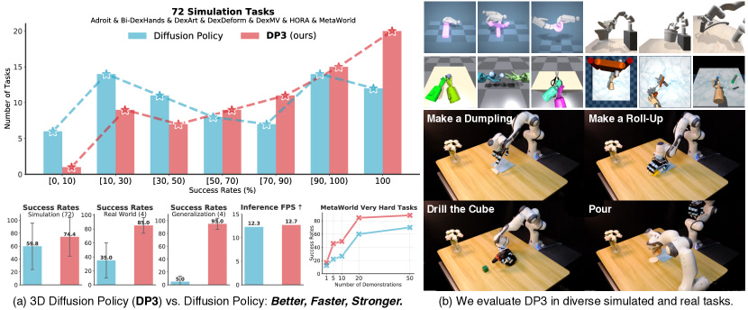
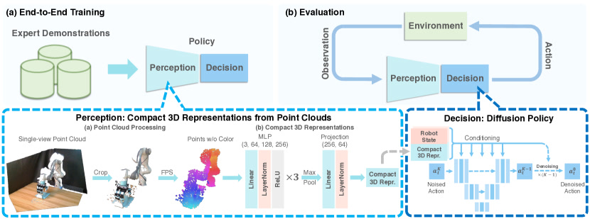
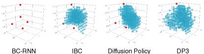

# 3D Diffusion Policy：给机器人换上"立体眼"，10 条示教就够

> 这是一份给"完全没接触过 AI"的读者看的精读笔记。语言尽量像聊天，公式全部翻译成人话。

## 一句话讲什么（TL;DR）

让机器人改看 3D 立体形状（点云）而不是 2D 照片来学动作，10 条示范就够，72 个任务平均比原版强 24.2%，真机成功率从 35% 涨到 85%，安全违规率 0%。

*所以这一节是想说：DP3 把视觉模仿学习里"靠 2D 照片猜 3D 动作"这个根本错位修好了，代价只是加一个三层 MLP。*

---

## 这是个什么场景

想象你蒙着一只眼睛伸手去拿桌上的水杯。你能看到杯子的轮廓，但很难判断它"离手还有多远"——很可能一把抓空，或者撞翻。

机器人现在面临的就是这种"独眼"困境。**模仿学习（imitation learning）** 是教机器人最省心的办法：人遥控机械手做一遍（比如包一次饺子），录下"我看到什么 -> 我做了什么"，机器人照葫芦画瓢。比强化学习好，因为不用让真机摔几千次去试错。

但有个让人头大的老毛病：**特别费示教数据**。

原版 Diffusion Policy（DP，2023 RSS）每个真实任务要 100-200 条人工演示。一条演示要遥操几十秒到几分钟。演示一多手就抖、容易出错、要重录，整个数据收集能拖好几天。

为什么这么费？因为机器人是**通过 RGB 照片**看世界的，跟"独眼看杯子"一个毛病——它知道"杯子在画面左边"，不知道"杯子离我 30cm 还是 60cm"。结果就是：灯光换了（早上拍 vs 晚上拍）失效；摄像头挪了 5 度失效；杯子从蓝色换成红色失效。每出现一种新情况，都得多录一批演示来补。

DP3 这篇文章问：**要是直接给机器人一双"立体眼"（看 3D 点云），能不能从根上解决？**

答案是"能"，而且代价极低——整篇论文最核心的改动就是把 Diffusion Policy 的图像编码器换成一个三层 MLP 点云编码器，其他全部不动。

*所以这一节是想说：模仿学习贵在示教，而示教贵的根因是 2D 图像不够"懂空间"——这给了 3D 表征一个出场的理由。*

---

## 之前的人怎么做

DP3 出现之前，机器人视觉策略大致两条路：

**路线 A：2D 图像派（主流）**

代表：BCRNN（行为克隆 + RNN）、IBC（隐式行为克隆）、Diffusion Policy（DP）。输入一张或几张 RGB 图，用图像编码器（一般是 ResNet）压成特征再喂给策略网络。缺点是缺空间感，要应对视角和外观变化只能"狂喂数据 + 数据增强"。Diffusion Policy 是这条线的天花板——它已经证明了"用扩散模型生成动作序列"比 BCRNN 这类 RNN 式方法强很多，但它的"眼睛"还是 2D 的。

**路线 B：3D 派（小众但在长大）**

代表：PerAct、GNFactor、Act3D、RVT、3D Diffuser Actor。这条路也用 3D 信息（点云、神经辐射场、体素），但有两个共同问题。第一是"关键帧+规划的设定"：它们不是连续生成动作，而是预测几个关键位姿再用规划器连起来，对高维任务（多指灵巧手包饺子，22 维关节）行不通——关键帧根本表达不出连贯运动。第二是推理慢：PerAct 才 2.23 FPS，3D Diffuser Actor 1.67 FPS，机器人跟不上动态环境。

**DP3 的位置就是把两边的强项拼起来**：用 Diffusion Policy 的"扩散生成连续动作"能力，加上 3D 表征的空间理解能力。

*所以这一节是想说：2D 派强在动作生成、弱在空间感；3D 派强在空间感、弱在高维任务和速度。DP3 把两边的长处拼成一家。*

---

## 新想法

DP3 的核心想法非常朴素，可以浓缩成一句话：

> **用稀疏点云 + 轻量 MLP 编码器**替换 Diffusion Policy 里的图像编码器，其它都不动。

听起来像"改个零件"，但藏着几个反直觉的设计选择：

**1. 用点云，不用 RGB-D，不用体素，不用 NeRF。** 直觉上 RGB-D（图像+深度）信息更多应该更强。但作者发现 RGB-D 还是被图像编码器主导，深度信息没被好好利用。点云直接把"哪些 xyz 位置有东西"摆在那，反而更纯粹。

**2. 不用颜色（只 xyz）。** 直觉上颜色应该有帮助。但作者发现拿掉颜色后对外观变化的泛化能力大涨——因为模型根本没机会"作弊地依赖颜色"。消融实验：保留颜色 72.0%，去掉颜色 78.3%。

**3. 用一个"傻"的三层 MLP，不用 PointNet/PointNet++/Point Transformer 这些复杂网络。** 消融实验发现：PointNet 平均 15.7%，PointNet++ 2.2%，DP3 自家 MLP **78.3%**。原因是 PointNet 里的 T-Net（学坐标变换）和 BatchNorm 拖了后腿。

**4. 稀疏，不密集。** 只用 512 或 1024 个点，远少于一般点云任务的几千到几万个。

**5. 单视角，不多视角。** 只用一个深度相机把深度图转成点云。这个选择是为了真实可部署。

*所以这一节是想说：DP3 的新意不在"加新模块"而在"做减法"——简单的表征 + 简单的编码器 + 单相机，反而打过更复杂的方案。*

---

## 它分几步做的（方法）

<!-- paper-figures:begin -->



*上图说明：Figure 1（ar5iv 原图）（论文原图）。*



*上图说明：Figure 2（ar5iv 原图）（论文原图）。*



*上图说明：Figure 3（ar5iv 原图）（论文原图）。*
<!-- paper-figures:end -->

把 DP3 跑一次（训练 + 推理）拆成 6 步。整体节奏像做菜：先拿食材（拍照）-> 切配（点云处理）-> 压味（编码器）-> 下锅（扩散）-> 出餐（执行）-> 再从头切一盘新菜（滚动重规划）。这一节占整篇笔记最大篇幅，因为**方法就是这篇论文的全部贡献**。

### 步骤 1：拍一张深度图

像用手机的"人像模式"拍一张——只是这次相机（Intel RealSense L515）拍的不是颜色，而是"哪里近哪里远"的灰度图，84x84 像素。每个像素值告诉你"这一点离相机多少厘米"。

**为什么只用一个深度相机？** 之前的 3D 方法（PerAct、GNFactor）一般要多个相机围着机器人摆。DP3 选择单相机是为了实际可部署：真实场景里很难在机器人四周架三四个标定好的相机。论文真机实验全部用一个 RealSense L515 完成。

**为什么不用 RGB 图像？** DP3 的原版 Diffusion Policy 用 ResNet-18 编码 RGB 图像。DP3 把这条路整个砍掉，只用深度相机拍到的纯几何信息。这是一个刻意的"减法"设计——后面的消融实验会证明它比加法方案更好。

**为什么是 84x84 而不是更高分辨率？** 这个分辨率看起来很低（手机拍照动辄几千像素），但对于桌面操作场景完全够用。在 0.5-1 米工作距离下，84x84 的深度图反投影后相邻两个点的间距约 5-10mm——足以分辨一个直径 3cm 的螺丝钉轮廓。更高分辨率（如 424x240，RealSense 的原始分辨率）反投影后会产生更多的点，增加后续 FPS 下采样的计算量，但最终都会被压缩成 512/1024 个点，高分辨率的额外信息被 FPS 丢弃了。论文在仿真中用 84x84 是因为仿真器（IsaacGym/MuJoCo）渲染低分辨率深度图更快。

*所以这一步是想说：DP3 的视觉输入极简——一个深度相机、一张 84x84 的灰度图。分辨率虽低但对桌面操作足够，因为后续流程会把信息压缩成几百个点。*

### 步骤 2：深度图 -> 点云

像把一张地形等高线地图"撑"起来变成立体沙盘。利用相机的内参（焦距等）和外参（位置朝向），把每个深度像素反投影成 3D 空间里的一个 (x, y, z) 点。

反投影的数学本质是"倒过来"做相机成像。正向成像是：3D 世界里一个点，经过相机光学系统投影到 2D 像素位置并记录距离。反投影是：已知像素位置和距离值，加上相机的焦距和位置，就能唯一确定这个点在 3D 空间里的坐标。

具体来说，对于深度图上像素位置 (u, v) 对应的深度值 d，反投影公式为：x = (u - cx) * d / fx，y = (v - cy) * d / fy，z = d。其中 fx、fy 是焦距，cx、cy 是光心位置——这四个参数合称"相机内参"，在相机出厂时标定好，是固定值。把这些点再用相机外参（相机在世界坐标系中的位置和朝向）变换一次，就得到世界坐标系下的 3D 点云。

84x84 的深度图反投影后最多得到 7056 个 3D 点——但大多数是桌面、地面、远处墙壁等无关信息。下一步就要把它们清理掉。

**深度图的常见噪声来源**：RealSense L515 使用 LiDAR 测距，在理想条件下精度约 5mm。但几种情况会让深度值不可靠：(a) 物体距离超过 9 米（L515 的工作范围限制）；(b) 物体表面高反光或透明（激光被折射或散射）；(c) 极端角度的表面（激光掠过而非正射）。DP3 论文回避了这些情况——实验中的物体都是不透明、漫反射的材质（硅胶饺子皮、塑料方块、木碗等），工作距离在 0.5-1.5 米之间。

*所以这一步是想说：深度图只是 3D 信息的"压缩格式"，反投影后才是机器人真正需要的三维空间表示。反投影的数学很简单——一个除法和一个矩阵乘法——但深度数据的质量直接决定了后续所有步骤的天花板。*

### 步骤 3：裁剪 + 下采样

像在一锅原料里挑出今天要用的部分，再切成均匀大小。

**裁剪（Crop）**：用一个长方体把工作区框出来，扔掉桌面、地面、远处墙等无关点。这步影响巨大——消融实验显示去掉裁剪后平均成功率从 78.3% 掉到 45.3%（Table VII）。裁剪框是手动设定的，需要知道机器人工作空间的大致范围。

**下采样（Farthest Point Sampling, FPS）**：从剩下的点里挑 512 或 1024 个。FPS 算法的策略是每次选离已选点集最远的那个新点，保证采样后的点尽可能均匀分布在整个工作空间中，不会全挤在一个角落。这比随机采样好在哪里？随机采样可能把小物体（如螺丝刀尖端）上的点全部丢失——那个区域的点太少，随机采不到；FPS 保证即使是小区域也至少有代表性的点。

**为什么不用更多点？** 太少（256）分辨率不够，小物体形状细节丢失；太多（4096）计算量增大，实时性下降。512-1024 是实验确定的平衡点。论文全部仿真和真机实验都在这个范围内。

**FPS 算法的工作流程**：(1) 随机选一个点作为起始；(2) 计算所有未选点到已选点集的最小距离；(3) 选距离最大的那个点加入已选集；(4) 重复 (2)(3) 直到选够 512/1024 个。这个贪心策略的时间复杂度是 O(N * K)（N 是原始点数，K 是要选的点数），在几千个点的规模上耗时约 1-2ms，可以忽略不计。相比之下，随机采样虽然更快（O(K)），但质量不可控——论文没有直接消融 FPS vs 随机采样，不过从 PointNet 文献可知 FPS 在各种任务上稳定优于随机采样。

**裁剪框的设置是手动的——这是 DP3 方法中少数几个需要人类先验知识的地方**。裁剪框的参数包括：中心位置（通常是机器人基座正前方的桌面中心）和三个方向上的长宽高（覆盖机器人手臂能到达的范围）。设置不好的后果：框太小会截掉任务关键区域（比如碗放在框外就看不到）；框太大会引入过多无关点（天花板、远处的架子），降低信噪比。论文的仿真环境裁剪框是统一设定的，真机每个任务场景微调了一次。

*所以这一步是想说：裁剪保证"只看该看的"，FPS 保证"看得均匀"——两步加起来把几千个点精简成 512-1024 个高质量的点。裁剪框是需要人手调的超参数，FPS 是全自动的算法——两者一起构成了 DP3 的"视觉预处理管线"。*

### 步骤 4：DP3 Encoder —— 点云 -> 64 维向量

这是 DP3 最核心、也最反直觉的设计。把成百上千个散乱的 3D 点压成一个 64 维的小向量——像把一篮散乱的食材全榨成一小杯浓缩汁。

**网络结构（PyTorch 代码直接来自论文 Appendix A）**：

```python
class DP3Encoder(nn.Module):
    def __init__(self, channels=3):
        self.mlp = nn.Sequential(
            nn.Linear(channels, 64),  nn.LayerNorm(64),  nn.ReLU(),
            nn.Linear(64, 128),       nn.LayerNorm(128), nn.ReLU(),
            nn.Linear(128, 256),      nn.LayerNorm(256), nn.ReLU())
        self.projection = nn.Sequential(
            nn.Linear(256, 64), nn.LayerNorm(64))

    def forward(self, x):
        # x: [B, N, 3]   B=batch, N=点数(512/1024), 3=xyz
        x = self.mlp(x)           # [B, N, 256] — 每个点独立过三层MLP
        x = torch.max(x, 1)[0]    # [B, 256]    — 沿N维取最大值
        x = self.projection(x)    # [B, 64]     — 投影到低维
        return x
```

**逐行解读**

三层 MLP 部分：`Linear(3, 64) -> LayerNorm -> ReLU -> Linear(64, 128) -> LayerNorm -> ReLU -> Linear(128, 256) -> LayerNorm -> ReLU`。每个点独立通过这三层——也就是说，如果有 1024 个点，这三层会被并行执行 1024 次，每个点各自从 3 维 xyz 变成 256 维特征向量。注意这里每个点互不感知——A 点不知道 B 点的存在。

MaxPool 部分：`torch.max(x, 1)[0]` 沿着 N（点数）这个维度取最大值，把 1024 个 256 维向量压成 1 个 256 维向量。这一步有两个关键效果：(a) 让输出和点的输入顺序无关——因为取最大值和排列顺序无关，而点云本来就是无序的集合；(b) 做了信息压缩——从"每个点都说话"变成"只留每个特征通道里声音最大的那个"。

Projection Head 部分：`Linear(256, 64) -> LayerNorm` 把 256 维压到 64 维。消融实验（Table VII）显示去掉这个投影头（让特征保持 256 维）对准确率几乎没影响（78.3 vs 77.7），但 64 维推理更快。

**LayerNorm vs BatchNorm——一个看似微小但影响巨大的选择**

DP3 在三层 MLP 中都用了 LayerNorm 而不是 BatchNorm。这不是随意选的：PointNet 系列用 BatchNorm，而 BatchNorm 在小 batch 训练时统计量不稳定（DP3 的 batch size 是 128，但每个 batch 内的样本高度相关——因为来自连续的示教轨迹）。消融实验（Table VII）显示去掉 LayerNorm 后准确率从 78.3% 掉到 73.0%。Table VI 更直接地表明：在 PointNet 上把 BatchNorm 和 T-Net 同时去掉（其余不变），准确率从 15.7% 跳到 72.3%——接近 DP3 Encoder 的 78.3%。

**为什么这个"傻"MLP 比 PointNet/PointNet++/Point Transformer 都强？**

论文在 Table V 给出了惊人的对比：DP3 Encoder 78.3%，PointNet 15.7%，PointNet++ 2.2%，PointNeXt 2.3%，Point Transformer 1.0%，预训练 PointNet++ 6.8%，预训练 PointNeXt 8.8%。简单 MLP 把所有"高级"网络打得满地找牙。

论文在 Table VI 做了一个系统的消融："逐步把 PointNet 改造成 DP3 Encoder"。结论是 T-Net 和 BatchNorm 是两个主要"凶手"：

- **T-Net**（学一个 3x3 坐标变换矩阵来对齐输入点云）在控制任务里反而有害。原因是 DP3 使用固定相机，坐标系不会变，T-Net 试图学一个不存在的变换，引入了额外的不稳定性。
- **BatchNorm** 在小数据（10 条示教）+ 高相关性 batch 下统计量不稳定，梯度忽大忽小。

把这两个拿掉的 PointNet 就接近 DP3 Encoder 了（72.3% vs 78.3%）——剩下的差距来自 DP3 用更低维的特征（256 vs 1024）和 LayerNorm。

**参数量对比——轻到什么程度？**

DP3 Encoder 的参数量可以手算：Linear(3,64) = 256，Linear(64,128) = 8320，Linear(128,256) = 33024，三层 LayerNorm 各有 2*dim 个参数（共 64+128+256=448 个），projection Linear(256,64) = 16448，projection LayerNorm = 128。总计约 58,624 个参数——不到 6 万。对比 PointNet 约 3.4M 参数、PointNet++ 约 1.5M 参数、ResNet-18 约 11M 参数。DP3 Encoder 用不到 PointNet 的 1/50 的参数量，却在控制任务上全面碾压——这再次说明"参数多 ≠ 效果好"，关键是网络结构是否适配任务特征。

参数量小带来的实际好处：训练快（在 10 条示教上过拟合风险低，不需要太多正则化）、推理快（前向传播只有矩阵乘法和取最大值，GPU 上不到 1ms）、调试方便（结构简单到可以手动验算每一层的输出形状）。

**机器人状态编码**

机器人自己的位姿 q（关节角度等，维度因机器人而异：Allegro Hand 是 22 维，Franka Gripper 是 7 维）也走一个小 MLP：`Linear(DimRobo, 64) -> ReLU -> Linear(64, 64)`，编成 64 维。和点云编码的 64 维向量**拼接**得到 128 维条件向量，作为扩散策略的输入。

为什么点云和状态各占 64 维？论文没有消融这个比例，但可以推测：让两种模态的信息量对等，避免一方压过另一方。如果点云编码是 256 维而状态只有 64 维，拼接后的 320 维向量中点云信息占绝对主导，机器人状态（自己的关节角度）会被"稀释"——而对于很多操作任务来说，知道自己手在哪比知道物体长什么样更重要。

*所以这一步是想说：整个编码器就是三层 MLP + 一次 max pool + 一个投影头，总共不到 6 万参数。没有 T-Net、没有 BatchNorm、没有注意力机制、没有层级特征聚合——能跑通 72 个任务靠的是"对的归一化 + 对的维度 + 不加多余东西"。*

### 步骤 5：把条件向量喂给扩散策略

先慢一拍——**扩散策略（Diffusion Policy）到底在做什么？**

类比：想象一张被雪花盖满的电视屏（纯噪声），你拿橡皮一遍一遍擦，擦着擦着画面浮出来，最后看到一段"机械手该怎么动"的动画。"扩散"就是这个反向擦除的过程。

正式说，这是一个**条件去噪网络** epsilon_theta。训练时：从演示里取真实动作 a_0，加 k 步噪声变成 a_k，让网络猜"刚才加进去的噪声 epsilon_k"长什么样。损失函数是 MSE(epsilon_k, epsilon_theta(a_k, k, v, q))——人话说就是"让网络预测我刚才加的噪声是什么样，预测得越准损失越小"。推理时：从一团随机噪声 a_K 出发，迭代 K 次去噪，每一步擦掉一点点，最后得到 a_0 = 一段动作序列。

**DP3 的扩散策略和原版 Diffusion Policy 有什么不同？** 几乎没有区别——唯一的改动是条件从"ResNet-18 编码的图像特征"变成了"DP3 Encoder 编码的 128 维点云+状态向量"。去噪网络本身（CNN 版的 1D 时序卷积 UNet）一模一样。这正是 DP3 的设计哲学：**只改感知模块，不动决策模块**。

**Sample Prediction vs Epsilon Prediction**

原版 Diffusion Policy 用 epsilon prediction（预测加入的噪声），DP3 用 sample prediction（直接预测干净动作 a_0）。消融实验和 Figure 7 显示 sample prediction 在高维动作（Allegro Hand 22 维）下收敛更快。直觉解释：预测 22 维动作本身比预测 22 维噪声更直观——噪声在高维空间里缺乏结构，动作序列有物理约束（相邻时间步的关节角不会突变），所以直接预测动作让网络更容易学。

**噪声调度器和步数**

DP3 使用 DDIM（Denoising Diffusion Implicit Models）作为噪声调度器。训练时用 100 个去噪时间步（K=100），推理时只用 10 步——DDIM 的核心能力就是"跳步采样"：训练一次，推理时可以选择走完全部 100 步（慢但精确）或者只走 10 步（快且几乎不掉精度）。

为什么 DDIM 能跳步但 DDPM 不行？直觉解释：DDPM 的每一步去噪是"随机的"——每步都要采样一次高斯噪声，前一步的随机性会影响后一步，所以不能跳。DDIM 把这个过程变成"确定性的"——给定同一个初始噪声，每次走出来的轨迹完全一样，所以可以直接跳到中间任意一步。代价是丢失了多样性（同一个噪声只能生成一个动作序列），但在控制任务里多样性不是好事——你希望给定同一个场景，机器人每次做同样的动作。

消融实验（Table VII）还对比了 DDIM 和另一个快速采样器 DPM-solver++。DPM-solver++ 在图像生成领域表现优异，但在 DP3 上惨败（48.3% vs 78.3%）。论文推测原因是高维动作空间（22 维 Allegro Hand）对采样器的数值稳定性要求更高——DPM-solver++ 的高阶修正项在高维空间里容易累积误差。

**去噪网络的结构**

DP3 使用 CNN 版的 1D 时序 UNet 作为去噪网络（和原版 Diffusion Policy 相同，论文未做改动）。输入是一段含噪动作序列 a_k（长度 H=4，每步维度 = 动作维度），加上时间步编码 k（告诉网络"当前噪声水平"）和条件向量（128 维的点云+状态编码）。输出是预测的干净动作 a_0（sample prediction 模式）。

UNet 的具体结构：下采样路径有若干 1D 卷积 + GroupNorm + Mish 激活层，中间有残差连接；上采样路径是对称的转置卷积。条件向量通过 FiLM（Feature-wise Linear Modulation）机制注入到每层——每层的特征会被条件向量做一次仿射变换（缩放 + 偏移），让网络的行为随"看到什么"而变化。时间步 k 通过正弦位置编码后也以同样的 FiLM 方式注入。

**训练目标的数学形式**

用 sample prediction 模式时，DP3 的损失函数可以写成：L = E[|| a_0 - f_theta(a_k, k, v, q) ||^2]，其中 a_0 是演示中的真实动作序列，a_k = sqrt(alpha_k) * a_0 + sqrt(1-alpha_k) * epsilon 是加了 k 步噪声后的动作（alpha_k 是噪声调度决定的信噪比，k 越大 alpha_k 越小），f_theta 是 UNet 网络，v 是点云编码，q 是机器人状态编码。训练时 k 从 1 到 K 中均匀随机采样，每个 batch 里不同样本可能用不同的 k。这意味着网络需要学会处理各种噪声水平——从"几乎干净"（k=1）到"纯噪声"（k=K）。

**动作预测和执行的窗口**

DP3 使用短 horizon：预测 H=4 步动作，观察 Nobs=2 帧，只执行最后 Nact=3 步。这比原版 Diffusion Policy 的 H=16 / Ta=8 短得多。论文 Table XV 的消融显示短 horizon 和长 horizon 准确率几乎一样（78.3 vs 78.2），但短 horizon 更适合真实环境——因为真机操作中人可能随时干预，策略需要能快速切换动作。

**为什么只执行后 3 步而不是前 3 步？** 直觉上似乎应该先执行第一步。但 DP3 和原版 Diffusion Policy 的设计哲学是：前面几步是"暖场"——它们帮助扩散模型建立上下文（因为动作序列是连贯的，前面的动作约束了后面的动作），但前面的动作本身受到观察窗口边界效应的影响，预测质量不如中间和后面的步骤。这和时序卷积的感受野有关——UNet 的 1D 卷积在序列边缘会"看不全"。

**训练细节**

batch size 128，MetaWorld 训 1000 epoch（任务简单），其他训 3000 epoch。DP3 典型在 500 epoch 就收敛，而原版 Diffusion Policy 经常 3000 epoch 还没收敛或停在次优。端到端训练——点云编码器和扩散网络的权重一起更新，不冻结任何部分。

数据归一化：动作和观测的每个维度独立缩放到 [-1, 1]，这对 DDIM 的稳定性至关重要。不做归一化的后果：不同维度的量纲不同（比如关节角是弧度制的 [-pi, pi]，末端位置是米制的 [0, 1]），DDIM 的噪声调度假设所有维度的尺度一致，不归一化会导致某些维度的噪声太大、另一些太小，去噪过程无法均匀收敛。

优化器使用 AdamW（weight decay 1e-6），学习率 1e-4，无学习率调度（固定学习率直到训练结束）。论文发现这种"懒人设置"在所有 72 个任务上都足够好——不需要精心调超参数。这也是 DP3 的一个隐性优势：超参数鲁棒性高，不像很多强化学习方法需要逐任务调参。

*所以这一步是想说：扩散策略本身没有改——DP3 的全部贡献在感知端。把 128 维条件向量（64 维点云 + 64 维状态）塞给一个标准的 CNN 版 Diffusion Policy，就完事了。*

### 步骤 6：执行

像厨师只把刚出锅最热的几勺端上桌，剩下的下次再做。预测出 H=4 步动作，只执行最后 Nact=3 步。执行完后，从新的深度图开始，重复步骤 1-5 生成下一批动作。

为什么只执行 3 步而不是全部 4 步？这是"滚动时域控制"（Receding Horizon Control）的思想：预测的后面几步越远越不准，不执行它们就不会犯错。每 3 步重新获取一次观察做修正。

**完整的一轮推理时间线**

```
拍深度图(~1ms) -> 反投影+裁剪+FPS(~5ms) -> DP3 Encoder(~1ms)
-> 10步DDIM去噪(~70ms) -> 取后3步动作 -> 执行3步(~300ms@10Hz)
-> 拍新深度图 -> 重复
```

整个推理流程约 80ms，DP3 达到 12.7 FPS——比原版 Diffusion Policy 的 12.3 FPS 还快一点。这打破了"3D 方法更慢"的刻板印象（PerAct 2.23 FPS，3D Diffuser Actor 1.67 FPS）。

论文还做了一个精简版 **Simple DP3**——通过去掉 UNet backbone 中的冗余组件（减少卷积层数和通道数），推理速度翻倍到 25.3 FPS，准确率只从 74.4% 掉到 70.2%（Table XVI）。如果需要 20+ FPS 的实时控制，可以选 Simple DP3。

**控制频率和延迟分析**：10Hz 控制频率意味着每 100ms 执行一步动作。DP3 的 80ms 推理时间包含在这 100ms 里，剩余 20ms 的余量足够处理通信延迟和电机执行。如果 DP3 推理超过 100ms（比如用更复杂的编码器或更多去噪步数），就会掉帧——机器人来不及在下一个控制周期之前算出动作。这就是为什么 Simple DP3 的 25.3 FPS（约 40ms 推理）有价值——它给系统留出更多余量应对偶发的延迟尖峰，在对实时性要求更高的场景（比如高速拣选）中更可靠。

**多相机扩展**：虽然论文只用了单相机，但方法可以自然扩展到多相机——每个相机各自拍一张深度图、各自反投影和裁剪、把所有点云合并后一起做 FPS 采样和编码。论文没有做这个实验，但指出这是一个低工程成本的扩展方向，可以解决单相机的遮挡盲区问题。

*所以这一步是想说：方法本身不复杂——拍深度图 -> 切成点云 -> MLP 压成向量 -> 喂给一个标准扩散策略 -> 每 3 步重规划——每一步都用最朴素的选择。总推理时间约 80ms，和纯 2D 方案持平，且有精简版可以进一步提速。*

---


下图概括本篇在「关键数字」节前的核心结果脉络（便于对照后文表格）：

```
【3D Diffusion Policy: Generalizable … · 关键结果概览】

   设定 / 数据          方法要点              主结果
        │                   │                    │
        ▼                   ▼                    ▼
   Point cloud（DP3）      ──► 78.3%                  ──► …
   DP3 Encoder（三层 MLP）   ──► 78.3%                  ──► ↑ 论文主结论

   （对照下方表格中的原文数字与消融）
```

---

## 关键数字

挑出论文里最该记住的数字，按类别组织。所有数字都来自论文正文和附录的表格。

### 整体战绩

| 指标 | DP3 | Diffusion Policy (2D) | 含义 |
|------|-----|----------------------|------|
| 仿真 72 任务平均成功率 | 74.4% (std 29.9) | 59.8% (std 35.9) | 相对提升 24.2%，且方差更小 |
| 仿真成功率>90%的任务数 | ~30 | <15 | DP3 稳定性更好 |
| 仿真成功率<10%的任务数 | 0 | >10 | DP3 没有彻底失败的任务 |
| 真机 4 任务平均成功率 | 85% | 35% | 真实世界差距比仿真更大 |
| 真机安全违规率 | 0% | 32.5% | DP3 从不做危险动作 |

### 数据效率

| 场景 | DP3 | 对比 |
|------|-----|------|
| 仿真大部分任务 | 10 条示教就够 | 原版 DP 100-200 条 |
| 真机 4 任务 | 每任务 40 条示教，85%成功率 | 原版 DP 40条只有35% |
| 收敛速度 | ~500 epoch | 原版 DP 3000 epoch 常还没收敛 |

### 视觉表征对比（6 个消融任务平均成功率，Table IV）

| 表征 | 平均成功率 | 说明 |
|------|-----------|------|
| Oracle State（直接给真实物体状态） | 76.8% | 理论上限 |
| **Point cloud（DP3）** | **78.3%** | 打过 oracle state |
| Image | 40.7% | 2D 图像 |
| Depth | 32.0% | 纯深度图走 2D 编码器 |
| RGB-D | 34.7% | RGB-D 走 2D 编码器 |
| Voxel | 32.3% | 体素表征 |

注意：**点云甚至打过 oracle state**——直接给真实物体状态都没"看 3D 点云"好。可能的原因是 oracle state 缺少物体的形状信息（只给位置和姿态），而点云隐式编码了形状。

### 点云编码器对比（Table V）

| 编码器 | 平均成功率 |
|--------|-----------|
| **DP3 Encoder（三层 MLP）** | **78.3%** |
| PointNet | 15.7% |
| PointNet++ | 2.2% |
| PointNeXt | 2.3% |
| Point Transformer | 1.0% |
| PointNet++（预训练） | 6.8% |
| PointNeXt（预训练） | 8.8% |

### 设计选择消融（Table VII）

| 改动 | 平均成功率 | 说明 |
|------|-----------|------|
| 完整 DP3 | 78.3% | 基线 |
| 去掉裁剪 | 45.3% | 裁剪是最关键的预处理 |
| 去掉 LayerNorm | 73.0% | 训练稳定性下降 |
| 换成 epsilon prediction | 67.0% | 高维动作下收敛更慢 |
| 去掉 projection head | 77.7% | 几乎不影响准确率，但推理变慢 |
| 保留颜色 | 72.0% | 泛化能力下降 |
| DDIM 换 DPM-solver++ | 48.3% | 高维控制任务不稳定 |

### 真机详细结果（Table VIII，每任务 10 次测试）

| 任务 | DP3 | Diffusion Policy | DP (Depth) |
|------|-----|------------------|------------|
| Roll-Up（卷包子皮） | 90% | 0% | 40% |
| Dumpling（包饺子） | 70% | 30% | 20% |
| Drill（抓电钻触碰方块） | 80% | 70% | 10% |
| Pour（倒碗） | 100% | 40% | 10% |

### 推理速度（Table XVI）

| 方法 | FPS | 说明 |
|------|-----|------|
| Diffusion Policy | 12.3 | 2D 基线 |
| DP3 | 12.7 | 比 2D 还快一点 |
| Simple DP3 | 25.3 | 精简 UNet，速度翻倍 |

*所以这一节是想说：从准确率到安全性到速度，DP3 几乎在每条指标上都把基线甩开一大截。最值得记住的数字是：72 任务 +24.2%、真机 85% vs 35%、安全违规 0% vs 32.5%、10 条示教就够。*

---

## 实验结果说明了什么

上一节列了数字，这一节换个角度：这些实验回答了哪些科学问题？

**问题一：3D 表征真的比 2D 好吗？好多少？**

Table I 给出了全景答案：72 任务跨 7 个 domain（Adroit、Bi-DexHands、DexArt、DexDeform、DexMV、HORA、MetaWorld），DP3 在绝大多数 domain 上胜出，且方差更小（29.9 vs 35.9）。真机实验更极端——从 35% 涨到 85%，说明 3D 表征在真实环境中的优势比在仿真中更明显。原因是真实世界有更多的深度变化、光照变化、视角偏移等干扰，这些都是 2D 图像的天然弱点。

Table IV 的对比更有教育意义：RGB-D（34.7%）比纯 Image（40.7%）还差。这说明"给 2D 编码器多喂一个深度通道"是没用的——ResNet 不知道怎么利用深度信息。必须用真正的 3D 编码器（点云 + MLP/MaxPool）才能释放深度的价值。

**问题二：为什么简单编码器比复杂编码器好？**

Table V 和 Table VI 联合回答了这个问题。关键发现：PointNet 失败的根因是 T-Net（在固定相机场景下学一个不存在的变换）和 BatchNorm（在小 batch + 高相关性数据下统计量不稳）。把这两个去掉后 PointNet 就接近 DP3 Encoder（72.3% vs 78.3%）。这不是"简单天然比复杂好"，而是"为分类设计的网络直接搬到控制任务上会水土不服"。

**问题三：DP3 的泛化能力有多强？**

论文在真机上测了四种泛化，全部用同一组 40 条示教训练的策略：

- **空间泛化**（Table IX）：把碗放到训练时没见过的 5 个位置。DP/DP-Depth 全部失败，DP3 成功 4/5。
- **外观泛化**（Table X）：训练时用绿色方块，测试时换 5 种颜色。DP/DP-Depth 全部失败，DP3 全部成功（因为根本不看颜色）。
- **实例泛化**（Table XI）：训练时用方块，测试时换成鼠标、玩具、杯子、马克杯、玩具手等 5 种日常物体。DP3 全部成功，基线最多通过 1/5。
- **视角泛化**（Table XII）：小幅改变相机角度。DP3 三个视角全部成功，基线全部失败。

这四种泛化揭示了一个深刻的道理：DP3 学到的不是"当像素模式 X 出现时执行动作 Y"，而是"当工作空间中位置 P 处有物体时运动到位置 Q"——这是空间级别的策略，天然不受视角和外观影响。

**问题四：DP3 为什么更安全？**

Table XIV 显示 DP3 在全部真机实验中安全违规率为 0%——没有一次需要人工紧急停止的危险动作。而 Diffusion Policy 在 Roll-Up 任务里 90% 的运行会出现需要人停手的危险行为。论文给出的直觉解释：因为机器人在 3D 空间里操作，直接观测 3D 信息能精确判断自己和障碍物之间的距离，从而避免碰撞。2D 方法因为不确定深度，经常撞到东西。

**问题五：在杂乱环境里行不行？**

Table XIII 展示了在堆满杂物的桌面上做 pick & place 任务。DP3 成功率 80%（50 条示教），且能泛化到不同颜色的方块、充电器、圆柱体、绳子等训练时没见过的物体。对比 DP3 w/ color（保留颜色信息）只能搞定训练时的黄色方块（80%），换颜色就全部失败——再次验证了"去掉颜色反而更好"的结论。

*所以这一节是想说：实验不仅证明"数字好看"，还系统回答了五个关键问题——3D 比 2D 好、简单编码器比复杂的好、四种泛化都强、更安全、杂乱环境也行。每个结论都有消融表格支撑。*

---

## 你应该懂的几个新词

**Imitation Learning（模仿学习）**：让机器人看人示范然后照做。对应词是 reinforcement learning（强化学习，靠试错）。本论文属于模仿学习中的"行为克隆"（behavior cloning）分支——直接从演示数据里学一个状态到动作的映射。

**Visuomotor Policy（视觉运动策略）**：输入是视觉（图像/点云），输出是动作（关节角、末端位姿等）的策略函数 pi。"visuo-"是视觉，"motor"是运动。

**Diffusion Model（扩散模型）**：从噪声里反向还原数据的生成模型。原来用来生图（DDPM、Stable Diffusion），这里用来生动作。类比：给一团雾，慢慢吹散，雾里出现的形状就是答案。

**Point Cloud（点云）**：一堆 (x, y, z) 点的集合，用来描述 3D 物体表面。类比：把世界扎一堆图钉，每个图钉位置就是一个点。点云是无序的——打乱所有点的排列，信息不变。

**Voxel（体素）**：3D 版的像素，把空间切成立方格子。类比：乐高积木堆出来的世界。体素的问题是内存消耗大——分辨率翻倍，内存翻 8 倍。

**Farthest Point Sampling（FPS，最远点采样）**：从大量点里挑代表点的算法，每次挑"离已选点最远的"那个，保证均匀分布。注意和帧率 FPS（frames per second）撞名了，论文上下文区分。

**MLP（多层感知机）**：最基本的神经网络——几层 Linear 夹激活函数。DP3 的核心编码器就是一个 MLP。

**MaxPool / 最大池化**：从一组数里只留最大值。在点云这里用来把 N 个点的特征压成 1 个全局特征，且**和点的顺序无关**——这点很关键，因为点云本身就是无序的。

**LayerNorm（层归一化）**：对每个样本的特征做归一化。这里用它替代 BatchNorm 是因为小 batch 时 BN 不稳定。

**DDIM（Denoising Diffusion Implicit Models）**：扩散模型的快速采样器，能用更少的去噪步数得到差不多的质量。DDPM 需要 1000 步推理，DDIM 10 步就够。和 DDPM 共享同一个训练好的模型——不需要重新训练。

**Sample prediction vs Epsilon prediction**：扩散模型训练时让网络预测什么——直接预测"干净样本 a_0"叫 sample prediction，预测"添加的噪声 epsilon"叫 epsilon prediction。DP3 选了前者，理由是高维动作时更稳定。

**T-Net**：PointNet 里用来学一个 3x3 变换矩阵对齐输入点云的子网络。在 DP3 的固定相机场景下没必要且有害。

**Allegro Hand**：一种 16 自由度的多指机械手，论文真机实验用的就是它。动作维度 22（包含手腕关节）。

**RealSense L515**：Intel 的一款消费级深度相机，用 LiDAR 测距。DP3 全部真机实验只用了一个。

*所以这一节是想说：术语本身都不难，理解的关键是"点云=无序 3D 点集"和"扩散模型=从噪声里抠出答案"这两个直觉。*

---

## 它有什么搞不定的

DP3 自己承认或可以合理推测的局限：

**1. 长 horizon 任务还是难。** 论文明说"this work does not delve into tasks with extremely long horizons"。Roll-Up、Dumpling 已经是多阶段任务，但相比"折叠衣服 5 分钟"这种还是短的。DP3 的短预测窗口（H=4）让它在超长 horizon 任务上缺乏远见。

**2. 大幅度视角变化撑不住。** 文中 Table XII 的 view generalization 是"小幅"视角变化。如果相机大幅移动（比如从正面换到侧面），DP3 也没法自动迁移——还得手动调整裁剪框。论文自己也承认"significant changes might be hard to handle"。

**3. 单相机带来的盲区。** 只有一个深度相机意味着遮挡严重时点云就是缺的。比如一个物体完全被另一个物体挡住，DP3 看不到它。论文没解决遮挡问题，靠 max pool 的鲁棒性兜着。

**4. 真机示教仍然不便宜。** 虽然从 100-200 降到 40，但 40 条多指灵巧手示教（用视觉重定向）还是费时——一条示教平均要几十秒到两分钟，加上失败重录，每个任务的数据收集仍需数小时。论文里说这正是为什么真机只跑 4 任务。

**5. "为什么 PointNet 系不行"还没完全弄清。** 作者通过修改 PointNet 找到了 T-Net 和 BatchNorm 是凶手，但**为什么**这两个东西在控制任务里有害，论文只给了猜测性解释（固定相机不需要 T-Net / 小 batch BN 不稳），留作 future work。

**6. 仿真到真实的 gap 没系统讨论。** 虽然真机也跑了 4 个任务，但训练全在真机数据上，没尝试 sim-to-real transfer。点云在 sim-to-real 中可能有天然优势（仿真和真实的深度图比 RGB 更接近），但论文没有验证。

**7. 没有语言/任务条件。** DP3 是"一个任务一个策略"，没有像 PerAct、3D Diffuser Actor 那样接语言指令做多任务。这意味着不能直接用作通用机器人大脑。

**8. 深度相机对特殊材质不友好。** RealSense L515 对透明物体（玻璃杯）和高反光表面（金属）的深度估计不准确。论文的任务都用不透明的塑料/泥/木头，回避了这个问题。

*所以这一节是想说：DP3 在"短 horizon 单任务模仿"这个设定里很强，但要真正做通用、长 horizon、多任务的机器人，它只是奠基的一块砖。每个局限都指向了具体的后续工作方向。*

---

## 它和别的论文是什么关系

DP3 的位置可以画在两条家谱上：

**家谱 A：Diffusion Policy 这条线（2D -> 3D -> 更远）**

DDPM（Ho et al., 2020 NeurIPS）是扩散模型本体，最初用来生成图像。Diffusion Policy（Chi et al., 2023 RSS）把扩散模型从"生成图像"搬到"生成动作"，输入是 RGB 图像，开创了机器人扩散策略分支。DP3（Ze et al., 2024 RSS，本篇）把 RGB 输入换成点云，加入 3D 空间理解。Simple DP3（本篇附录）精简 UNet，速度翻倍。DP3 是 Diffusion Policy 的"3D 化身"，直接把 Chi et al. 列在核心引用里。

**家谱 B：3D 机器人策略这条线**

PerAct（Shridhar et al., CoRL 2023）用体素 + Transformer 做关键帧预测。GNFactor（Ze et al., CoRL 2023，和 DP3 同一作者）用 NeRF 特征做多任务策略。Act3D（Gervet et al., 2023）用 Transformer + 3D 注意力。RVT（Goyal et al., 2023）用虚拟视角 + Transformer。3D Diffuser Actor（Ke et al., 2024）类似 DP3 的思路但用 attention + language，是 DP3 最直接的"竞品"。DP3 是这条线里最朴素的那个——单视角、无语言、用 max pool 而不是 attention。

**DP3 vs 3D Diffuser Actor**（最容易混淆的一对）

3D Diffuser Actor 用多视角输入、有语言条件、用 attention 机制处理点云。DP3 用单视角、无语言、用 max pool。DP3 更快更简但功能更窄——3D Diffuser Actor 能做"把红色杯子放到左边"这种语言条件任务，DP3 不行。在相同设置（CALVIN 基准）下两者的推理时间接近（DP3 581ms vs 3D Diffuser Actor 600ms），说明速度差异主要来自设定不同而非架构优劣。

**DP3 引用但和它思路不同的一类**：DexMV、DexDeform 等灵巧手任务的论文——它们贡献的是任务和数据，DP3 贡献的是算法。

**后续工作**：iDP3（Ze et al., 2024，把 DP3 推到人形机器人的野外环境）、RDT-1B（大规模扩散 Transformer）。3D + 扩散这条线还在长。

*所以这一节是想说：DP3 = Diffusion Policy 的 3D 升级版，同时也是 3D 机器人策略家族里"最朴素的那一个"——简洁性是它最大的卖点。*

---

## 和本导读的关系

本笔记对应导读 [Ch13: 扩散策略——Diffusion Policy / 3D-DP / pi0](../guide/ch13-diffusion-policy.md) 的第二个模型（Section 4）。

导读 Ch13 讲了三个模型的演进线：Diffusion Policy（2023，学术原型验证）-> 3D Diffusion Policy（2024，加入三维感知）-> pi0（2024，产业级基础模型）。本笔记深入拆解的是第二个节点——DP3 如何把 Diffusion Policy 的 2D 输入升级为 3D 点云输入，以及为什么一个三层 MLP 比所有专业点云网络都好。

DP3 在演进线中的定位是**感知升级**：它证明了"把 Diffusion Policy 的眼睛从 2D 换成 3D"能带来巨大的性能飞跃和泛化能力提升，而且代价极低（只改编码器）。这为后续 pi0 的"规模化部署"奠定了信心——如果感知端能如此轻量，那策略端就有空间做大。

从知识图谱角度，本笔记往上连接 Ch13 的 Diffusion Policy（理解 DP3 必须先理解扩散策略的"加噪->去噪"框架和滑动窗口机制），往下连接 Ch13 的 pi0（pi0 用 Flow Matching 替代标准扩散实现 10-100 倍采样加速，并接入 VLM 做跨机体基础模型），往旁边连接 Ch14（模仿学习基础——DAgger / ACT-ALOHA / UMI），那一章讲的是 DP3 所属的模仿学习大家族里其他重要成员。

*所以这一节是想说：本笔记是导读 Ch13 的第二块拼图——读完 Diffusion Policy 笔记理解了"扩散生成动作"后，本笔记告诉你"加上 3D 输入会怎样"。下一步沿 pi0 继续，就能看到扩散策略路线从原型到产品的完整演进。*

---

## 思考题

以下问题用来检验你是否真正理解了论文的核心思路，而不只是记住了结论。每题附有折叠提示，建议先自己想 30 秒再展开。

**Q1：DP3 用 3D 点云替换 2D 图像作为输入。请说出 2D 图像在机器人操作中的三个根本性缺陷，以及点云如何分别解决它们。**

<details>
<summary>提示</summary>

三个缺陷：(a) 深度模糊——同一张照片中，近处的小杯子和远处的大杯子可能占据相同像素区域，机器人无法判断该伸手 30cm 还是 60cm。点云直接给出 xyz 坐标，深度是显式的。(b) 视角敏感——稍微换一个摄像头角度，2D 投影就完全不同，策略失效。点云在 3D 空间中表示，小幅视角变化只改变可见的点的子集，不改变已有点的空间坐标。(c) 外观敏感——2D 图像包含颜色和纹理，受光照和物体外观变化影响。DP3 的点云只用 xyz、不用颜色，天然对外观变化免疫。Table IX-XII 的四种泛化实验就是对这三个优势的系统验证。
</details>

**Q2：DP3 Encoder 是一个三层 MLP + MaxPool。为什么 MaxPool 在这里是必须的？如果换成 MeanPool（取平均值），会有什么问题？**

<details>
<summary>提示</summary>

MaxPool 在这里有两个作用。第一，置换不变性：点云是无序的集合，MaxPool 的结果和输入顺序无关（取最大值不关心哪个点贡献的），MeanPool 也有这个性质。第二，鲁棒性差异：MaxPool 只保留每个特征通道里"最显著"的信号，忽略掉不重要的点（比如空白区域的背景点）。MeanPool 会被大量背景点"稀释"——如果 1024 个点里有 900 个是桌面，100 个是物体，MeanPool 会让物体信号被桌面信号淹没。在 DP3 的场景里，裁剪后仍然可能有不少非物体的点，MaxPool 的"只留最大"策略更适合提取物体特征。PointNet 原论文也选 MaxPool 并给了类似的理由。
</details>

**Q3：论文发现 PointNet 在 DP3 的任务上只有 15.7% 的成功率（vs DP3 Encoder 的 78.3%）。Table VI 逐步把 PointNet 改造成 DP3 风格后达到了 72.3%。请解释 T-Net 和 BatchNorm 各自为什么在控制任务里有害。**

<details>
<summary>提示</summary>

T-Net 的问题：T-Net 是 PointNet 用来学一个 3x3 变换矩阵的子网络，目的是对齐输入点云的坐标系——这对物体分类很有用（椅子从任何角度看都应该被识别为椅子），但 DP3 使用固定相机，点云的坐标系永远不变。T-Net 试图学一个不存在的变换，引入了额外的自由度和不稳定性，反而干扰了对空间位置的编码（而空间位置恰恰是控制任务最需要的信息）。BatchNorm 的问题：BatchNorm 用 batch 内所有样本的统计量（均值和方差）来归一化。DP3 的训练数据是连续的示教轨迹，同一个 batch 内的样本高度相关（可能来自同一段录像的相邻帧），导致 batch 统计量不稳定、波动大。LayerNorm 只看单个样本内部的统计量，不受 batch 组成的影响，因此更稳定。
</details>

**Q4：DP3 选择不使用颜色（只用 xyz）。在什么场景下这个选择反而会成为劣势？请举出至少两个具体例子。**

<details>
<summary>提示</summary>

(a) 需要区分颜色的任务：比如"把红色杯子放到左边、蓝色杯子放到右边"。如果两个杯子形状一模一样，纯 xyz 点云无法区分它们。(b) 形状高度相似但功能不同的物体：比如一把刀和一把尺子，侧面轮廓接近，点云的几何特征可能很像，但颜色（金属色 vs 木色）能帮助区分。(c) 需要检测物体状态的任务：比如判断肉是否烤熟（颜色从粉色变成褐色），纯几何信息无法感知。DP3 论文自己也承认"去掉颜色"是为了泛化而做的 trade-off——在泛化比识别更重要的设定下（10 条示教、单任务），这个 trade-off 划算；但在多任务、需要语义区分的设定下可能不划算。
</details>

**Q5：DP3 在真机实验中安全违规率为 0%（vs Diffusion Policy 的 32.5%）。请从 3D 表征的角度解释为什么 DP3 更安全，以及这个安全性保证在什么情况下可能失效。**

<details>
<summary>提示</summary>

3D 表征让机器人能精确感知自己的末端执行器和周围物体在空间中的相对位置（包括距离）。当策略预测的动作会导致碰撞时，点云里"障碍物的点离机器人的点很近"这个信号会被编码器捕捉，训练过程中模型学到了"避开这类配置"。2D 图像缺少深度信息，无法精确判断距离，所以更容易产生碰撞指令。这个安全性保证可能失效的情况：(a) 遮挡——如果障碍物被其他物体完全挡住（单相机看不到），点云里没有它的信息，机器人可能撞上去。(b) 深度相机盲区——RealSense L515 有最小工作距离（约 10cm），太近的物体深度值不准确。(c) 透明/反光物体——深度相机对这些材质的测距不可靠，可能产生错误的 3D 信息。(d) 训练数据中没有足够的"接近碰撞"的样本——模型学到的安全边界取决于训练数据的覆盖范围。
</details>

**Q6：论文使用 sample prediction（直接预测干净动作 a_0）而不是 epsilon prediction（预测噪声）。请解释为什么在高维动作空间（如 Allegro Hand 的 22 维）下 sample prediction 更好。**

<details>
<summary>提示</summary>

高维噪声缺乏结构：22 维的高斯噪声在每个维度上独立、随机，没有物理含义。网络需要从含噪动作中精确分离出这个无结构的噪声——在高维空间里这是一个困难的逆问题。相比之下，22 维的动作序列有丰富的结构：相邻时间步的关节角度相关（机械手不能瞬间跳变）、不同关节之间有协调模式（五指抓握时各指关节同步）。直接预测有结构的动作比预测无结构的噪声更容易收敛。Figure 7 的学习曲线验证了这一点：sample prediction 在多数任务上 500 epoch 内收敛，epsilon prediction 需要更多步或收敛到次优。在低维动作空间（如 Franka Gripper 的 7 维）下，两种方式差别不大——因为 7 维噪声不算"高维"。
</details>

**Q7：如果你要把 DP3 从实验室搬到一个真实的仓库环境（机器人需要在货架间取放不同大小的包裹），你预见会遇到哪些挑战？请针对 DP3 的具体设计（不是泛泛而谈）列出至少三个。**

<details>
<summary>提示</summary>

(a) 裁剪框问题：DP3 需要手动设定裁剪框来限定工作空间。仓库里货架高度不同、包裹位置变化大，一个固定裁剪框覆盖不了所有场景，要么动态调整裁剪框（需要额外的定位系统），要么用一个很大的裁剪框（会引入大量无关点，降低信噪比）。(b) 单任务策略：DP3 是"一个任务一个策略"。仓库里取放任务千差万别（不同大小、重量、摆放方式的包裹），需要语言条件或任务条件来切换行为，DP3 不具备这个能力。(c) 长 horizon 和多阶段：真实取放流程可能包含导航到货架、伸手到对的层、抓取、检查、放到传送带等多个阶段，远超 DP3 的 H=4 步预测窗口。(d) 深度相机在仓库中的挑战：包裹可能有反光的包装膜、透明的塑料封面，深度相机对这些材质测距不准。(e) 遮挡严重：货架环境里物体被遮挡是常态，单相机的盲区问题会放大。
</details>

**Q8：DP3 论文说"去掉颜色后成功率从 72.0% 提升到 78.3%"。请设计一个实验来验证：到底是"颜色信息本身有害"还是"颜色信息在仅 10 条示教的小数据场景下导致过拟合"。**

<details>
<summary>提示</summary>

核心思路是控制变量——改变示教数量。实验设计：(a) 在相同的 6 个消融任务上，分别用 10、50、100、200 条示教训练"有颜色 DP3"和"无颜色 DP3"。(b) 如果"颜色导致过拟合"假说成立，预期会看到：数据量增大后，有颜色版本和无颜色版本的差距缩小甚至反转（因为足够多的数据能压制过拟合）。(c) 如果"颜色信息本身有害"假说成立，预期会看到：无论数据量多少，无颜色版本都更好（因为颜色引入了和任务无关的信息维度）。(d) 更精细的实验可以测试"颜色+数据增强"（随机改变颜色）vs"无颜色"，看数据增强能否弥补颜色带来的问题。如果能，说明颜色的问题是过拟合而非信息有害。
</details>

*所以这一节是想说：真正理解 DP3 需要能回答"为什么这样设计"和"换个条件会怎样"这两类问题。*

---

## 我建议这样读这篇

如果你是第一次读 DP3，建议按这个顺序：

先读 Section 1 Introduction 的前两段，理解动机（为什么 2D 不够）和定位（Diffusion Policy 的 3D 扩展）。然后跳到 Section 5 Experiments 的 Table I 和 Table IV，先看结果——知道 DP3 好用之后再回去看它怎么做的，动力更足。

然后读 Section 4 Method，重点关注 Figure 3 的系统架构图和 Algorithm 1 的训练伪代码。论文的方法写得很清楚——每一步都有明确的输入输出。代码在 Appendix A，建议对照着看。

最值得细读的是 Section 5.3（消融实验），尤其是 Table V（编码器对比）和 Table VI（逐步改造 PointNet）——这两张表是整篇论文最有教育价值的部分，因为它们回答了"为什么简单的更好"这个反直觉的问题。

如果你读过 Diffusion Policy 那篇论文，可以跳过 Section 3（背景），因为 DP3 对扩散部分没做改动。如果没读过，建议先看我的 [Diffusion Policy 精读笔记](diffusion-policy.md)，理解"加噪->去噪"的基本框架后再来看 DP3——否则 Section 4 的训练目标和 DDIM 推理会看不懂。

Appendix 很值得看：A 给了完整的 PyTorch 代码（不到 20 行就实现了核心编码器），B-E 是各类消融实验的详细结果。

*所以这一节是想说：先看结果（Table I/IV）建立信心，再看方法（Section 4 + Appendix A），最后看消融（Table V/VI）获得深层理解。*

---

## BibTeX

```bibtex
@inproceedings{ze2024dp3,
  title={3D Diffusion Policy: Generalizable Visuomotor Policy Learning via Simple 3D Representations},
  author={Ze, Yanjie and Niu, Gu and Chen, Kangning and Lin, Ruishi and Wang, Zhen and Xu, Huazhe},
  booktitle={Robotics: Science and Systems (RSS)},
  year={2024}
}
```

---

## 更新日志

| 日期 | 动作 |
|------|------|
| 2026-06-25 | 升级为 deep-read，重写全部 15 节 |
