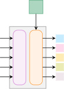

# 3DShape2VecSet：把 3D 模型「装进卡片盒」的论文

> 这是给完全零基础读者的精读笔记。所有术语第一次出现都用初高中常识做类比，绝不假设你学过编程或人工智能。

## 一句话讲什么（TL;DR）

把一个 3D 物体（比如一只椅子）压缩成 512 张小卡片，每张卡片只记录"特征"不记录"位置"；电脑学会这些卡片的规律之后，就能从一团随机噪声里凭空造出全新的 3D 模型——还能根据文字描述、单张照片、或半个点云来指挥它造什么。

*所以这一节是想说：这是一篇关于"怎么让电脑用最聪明的格式来表示 3D 模型、进而生成新 3D 模型"的论文。*

---

## 这是个什么场景

想象你在某个 App 里打字「一只戴墨镜的柯基」，几秒后屏幕跳出一张图——这就是大家熟悉的「文字变图」（text-to-image）。

但如果你想把这只柯基**做成手办**呢？3D 打印机要的不是平面图，而是一个能 360 度旋转、能切片打印的立体模型。这时候需要的是「文字变 3D 模型」（text-to-3D）。

到 2023 年，这条路一直走不通。**不是因为电脑不会画画了，而是没人想清楚一个更前面的问题：3D 模型这种东西，到底该用什么"格式"递到电脑手里？**

打个比方——同样是去菜市场买菜：

- 你可以拎一个袋子，所有东西堆一起——这是"点云"
- 也可以推一辆带格子的小推车，每格放一种菜——这是"体素网格"
- 还可以拍张照片回家照着复述——这是"全局向量"

哪种"装法"决定了回到家做饭顺不顺手。3D 模型也一样：有好几种"装法"，但每种都有明显缺陷，导致电脑学不动或学不好。

这篇论文要做的就是给 3D 模型设计一种**全新的"装法"**——让电脑拿到手就能学、学了就能造新的。而且这种装法直接继承了 2D 图像生成（比如 Stable Diffusion）的套路，只不过把"像素网格"换成了"卡片集合"。

在具身智能（embodied AI）的大图景里，3D 形状理解是机器人"看懂世界"的重要一环。一个能把任意物体编码成固定长度向量的方法，可以让机器人在操作、导航、场景理解等任务中更好地表征物体几何。[Ch18](../guide/ch18-multimodal.md) 把本文定位为"把 3D 形状也变成可对齐的向量"的代表性技术路线。

*所以这一节是想说：论文要解决的核心问题是"3D 模型该用什么格式让电脑既能高质量压缩、又能高质量生成"。*

---

## 之前的人怎么做的，为什么不够好

3D 模型常见的几种「记法」，各有各的毛病：

| 记法 | 日常类比 | 优势 | 致命缺陷 |
|------|----------|------|----------|
| 体素（voxel） | 把空间切成 3D 魔方小格子 | 规则，好用卷积处理 | 分辨率翻一倍，存储翻 8 倍。64^3 已经卡死 |
| 点云（point cloud） | 在物体表面戳一堆针孔 | 简单，信息量大 | 点和点之间是空的，表面坑坑洼洼 |
| 网格（mesh） | 手工课折的纸壳三角形模型 | 表面连续，下游可用 | 拓扑关系复杂，电脑很难直接学 |
| 全局向量 | 用一句话描述整个房子 | 极度紧凑 | 细节全丢——"耳朵纹路"和"尾巴卷度"全挤在同一句话里 |
| 规则网格向量 | 每个 8x8x8 小格子贴便利贴 | 能恢复一些局部细节 | 分辨率低（8^3=512 个格子）。想提高就训不动 |
| 不规则网格向量（3DILG） | 在物体表面选锚点，每个锚点贴便利贴 | 更紧凑 | 每张便利贴绑定了 3D 坐标，增加了要学的东西 |

关键观察：在 2D 图片领域，Stable Diffusion 证明了「先把图片压缩到潜空间（latent space），再在潜空间做扩散生成」是最有效的思路。但要把这条路搬到 3D，前提是先有一种**既紧凑又高保真**的 3D 潜表示。上面列出的所有方法要么太大（体素网格）、要么太粗（全局向量）、要么太杂乱（点云/不规则网格）。

> **潜空间（latent space）**：经过压缩后的"精华信息空间"。类比：一篇 5000 字的论文被导师压缩成 500 字的摘要——摘要所在的那个"500 字世界"就是潜空间。

> **扩散模型（diffusion model）**：一种生成新东西的电脑算法。先把训练数据揉成纯噪声，再教电脑学"去噪声"。学会了之后，从纯噪声开始一步步去噪，就能造出全新数据。类比：一张照片被打湿模糊了，电脑学着把它擦干净——擦熟练了，给它白纸它也能画一张新照片。

*所以这一节是想说：现有的所有"3D 记法"要么太占内存，要么太粗糙，要么太混乱，没有一个适合直接拿来做生成。*

---

## 这篇论文的新想法

**核心创新用一句话说**：把 3D 模型压成「一组固定数量的卡片」，每张卡**只记特征，不记位置坐标**。

具体来说，之前所有方法都把"特征"和"位置"绑在一起——每个向量都挂着一个 3D 坐标，告诉电脑"这张便利贴贴在物体表面的哪个位置"。本文第一次说：**"位置不写也行，电脑能自己从特征里反推出来。"**

**类比**：你整理旅行照片。老办法是每张照片背后写"这是巴黎铁塔 / 拍摄角度 30° / 距离 200 米"——特征 + 位置全写上。本文的新办法：只写"铁塔尖尖的"、"金属质感"、"透视收窄"。至于这描述的是哪个建筑、在哪个角度拍的——让看照片的人自己从内容里推断出来。

这看起来是微小的改变，但带来三个巨大好处：

1. **表示更紧凑**：不用额外存 3D 坐标，每个向量省掉 3 个数字。512 个向量就省 1536 个数字。
2. **天然适配 Transformer**：一组无序向量就是 Transformer 最擅长处理的"token 序列"。不需要为 3D 网格额外设计架构。
3. **位置信息可学习**：电脑自己决定怎么编码空间信息，而不是人为规定"用欧氏距离"。这更灵活，通常效果更好。


*所以这一节是想说：论文的核心创新是"扔掉位置坐标，只留一组固定大小的特征卡片"——简单但影响深远。*

---

## 它分几步做的（方法）

整个方法是一个标准的"两阶段"流程：第一阶段训一个自动编码器（把 3D 模型压成卡片 → 从卡片还原 3D 模型），第二阶段在卡片空间上训扩散模型（学会从噪声生成新卡片）。我们按逻辑顺序把它拆成 6 个子步骤详细讲解。


---

### 步骤 1：设计"卡片"的数学形式——从 RBF 到交叉注意力

**这一步要解决的问题**：给定 3D 空间中任意一个查询点 x，如何利用那 512 张卡片来回答"这个点在物体内部还是外部"？

**输入**：一组卡片 {f_1, f_2, ..., f_512}，每张是 C 维向量；一个查询点 x 的 3D 坐标。

**输出**：一个 0~1 之间的数（占有率/occupancy），表示"x 在不在物体内部"。

**从老办法 RBF 出发**

很久以前的图形学就有一招叫「径向基函数（RBF）」——用一堆带权重的小山包叠加出曲面。数学形式是：

```
O_RBF(x) = Σ_i λ_i · φ(x, x_i)
```

人话翻译：要知道点 x 是不是在物体内部？就去问每个锚点 x_i："你离我多远？"用一个距离公式 φ 算出"影响力"，然后把所有锚点的权重 λ_i 按影响力加起来。

类比：想象你站在一片空地上，周围有很多灯塔。每座灯塔有一个亮度值（λ_i），离你越近的灯塔对你照射越亮。你站的位置的"总亮度"就是所有灯塔亮度按距离衰减后的总和。

RBF 的问题：距离公式 φ 是人写死的（比如"欧氏距离的高斯核"），不能学；而且要让形状细节准确，需要几万个锚点（M = 80,000），太大了。

**本文的改进：把 RBF 变成"可学习版"**

作者的关键洞察：如果我把 RBF 里的"按距离加权"换成 Transformer 的"交叉注意力（cross-attention）"，效果会好得多。具体公式：

```
F_hat(x) = Σ_i v(f_i) · [1/Z] · exp(q(x)^T k(f_i) / sqrt(d))
```

人话翻译：要知道点 x 的特征？就让 x 去问每张卡片 f_i："我们有多像？"用内积衡量相似度（q(x)^T k(f_i)），然后按相似度对每张卡的值 v(f_i) 做加权平均。

对比 RBF：

| 对比项 | 老 RBF | 本文 |
|--------|--------|------|
| "影响力"怎么算 | 人写死的距离公式 | 可学习的内积相似度 |
| 锚点带什么 | 权重 λ_i + 坐标 x_i | 只带特征向量 f_i |
| 查询怎么做 | 基于坐标距离 | 基于特征相似度 |
| 需要多少锚点 | 几万个 | 512 个就够 |

> **交叉注意力（cross-attention）**：让一组向量（查询方）去"问"另一组向量（被查询方）"你们谁和我最像"，按相似度做加权平均。类比：一个新转学生（查询点 x）来到班上，想了解班级情况，就去问每个同学（卡片 f_i）："你觉得我们像不像？"越像的同学说的话权重越大。

> **内积（dot product）**：两个向量对应位置数字相乘再相加。高中学过——两个向量内积越大，说明它们方向越一致（越像）。

最后，把加权平均得到的特征 F_hat(x) 过一个全连接层，输出 0~1 的占有率值：

```
O_hat(x) = FC(F_hat(x))
```

**为什么这步有用**：

- 论文不是凭空发明新机制，而是把图形学 30 年来的老方法（RBF）升级成可学习形式。审稿人容易接受，读者容易理解。
- 用"特征相似度"代替"空间距离"，让模型自己决定什么信息重要——这正是深度学习的优势所在。
- 512 个卡片就能达到以前几万个锚点的效果，压缩比提高了两个数量级。

*所以这一节是想说：本文的查询机制本质上是"可学习版 RBF"——用交叉注意力代替人写死的距离公式。*

---

### 步骤 2：制卡机（编码器）——从 2048 个点压缩到 512 张卡


**这一步要解决的问题**：给定一个 3D 物体的表面点云（2048 个点），怎么把它压成 512 张卡片？

**输入**：物体表面均匀采样的 2048 个点的 3D 坐标，X ∈ R^(3×2048)。

**输出**：512 张卡片 {f_1, ..., f_512}，每张是 C=512 维向量。

**两种方案对比**

论文试了两种方案：

**方案 A：可学习查询（Learnable Queries）**

准备 512 个"空白卡片"L ∈ R^(512×512)，它们是网络参数的一部分，不依赖具体输入。让这些空白卡片通过交叉注意力去"询问"输入点云，从点云中提取信息：

```
Enc_learnable(X) = CrossAttn(L, PosEmb(X))
```

类比：班上来了一批空的"调查问卷"（L），每份问卷去问全班同学（X）一些问题，把答案记在自己身上。问题是——这些问卷是固定的，不管来的是椅子还是飞机，问的都是同一套问题。

**方案 B：点查询（Point Queries）**——论文最终选择的方案

先从 2048 个点里用 FPS（最远点采样）挑出最分散的 512 个点作为"代表"，再让这些代表点通过交叉注意力去问全体 2048 个点：

```
Enc_points(X) = CrossAttn(PosEmb(FPS(X)), PosEmb(X))
```

类比：班上有 2048 人，先选出分布最均匀的 512 个人当"组长"（用 FPS 保证每个角落都有组长）。然后每个组长去"采访"全班同学，汇总信息写在自己的报告上。因为组长就是从班上选的，他们自带对班级的了解，效果自然比空白问卷好。

> **FPS（最远点采样 / Farthest Point Sampling）**：从一堆点里挑出空间分布最均匀的子集。做法很简单：先随便选一个点，然后每次选离已选点集合距离最远的那个点。重复 512 次就得到 512 个分散的代表点。类比：在教室里安排座位观察员——第一个随便坐，第二个坐离第一个最远的位置，第三个坐离前两个都最远的位置……这样观察员就不会全挤在一个角落。

> **位置编码（positional embedding / PosEmb）**：把一个 3D 坐标 (x, y, z) 这 3 个数字变成一个高维向量（比如 512 维）的函数。为什么要变？因为 3 个数字信息量太少，网络不好学。类比：把"东经 116 度、北纬 40 度"两个数字变成一篇描述"北京的地理特征"的短文——信息更丰富了。本文用的是正弦/余弦位置编码，和 Transformer 原论文一样。

**实验结论**：点查询方案在所有类别上都优于可学习查询方案——因为代表点来自输入本身，自带对具体物体的先验知识。

**为什么这步有用**：

- 让代表点从输入里选（而非凭空学），加速收敛、提高效果。
- FPS 保证 512 个代表点均匀覆盖整个物体——不会全挤在耳朵上。
- 交叉注意力天然是"集合到集合"的操作，不需要假设输入有任何空间结构。

*所以这一节是想说：编码器用 FPS 从输入点云选 512 个代表点，再用交叉注意力让它们汇总全局信息，输出 512 张 512 维的卡片。*

---

### 步骤 3：KL 正则化瓶颈——把每张卡从 512 维压到 32 维


**这一步要解决的问题**：512 张卡 × 每张 512 维 = 总共 262,144 个数字。在这么大的空间上训扩散模型太难了。需要进一步压缩，并让分布"规整化"。

**输入**：512 张 512 维卡片 {f_1, ..., f_512}。

**输出**：512 张 C'=32 维的"压缩卡片" {z_1, ..., z_512}，总共 16,384 个数字。

**怎么做的**：

1. 用两个独立的全连接层（FC_μ 和 FC_σ）把每张 512 维卡片分别映射为 32 维的均值 μ 和 32 维的对数方差 log σ^2。
2. 用"重参数化技巧"从这个分布里采样：z = μ + σ · ε，其中 ε 是标准正态随机数。
3. 加一个 KL 散度惩罚项，逼迫这些分布靠近标准正态分布 N(0,1)。
4. 用的时候，把 32 维的 z 通过另一个全连接层（FC_up）投影回 512 维，再送给解码器。

数学上的 KL 损失：

```
L_reg = (1/M·C') Σ_i Σ_j [μ_{i,j}^2 + σ_{i,j}^2 - log(σ_{i,j}^2) - 1] / 2
```

人话翻译：对每张卡片的每个维度，如果均值偏离 0、或方差偏离 1，就扣分。扣分权重设为 0.001（很小），表示"规整化很重要但不能喧宾夺主，首先要保证能还原"。

> **VAE（变分自编码器 / Variational Autoencoder）**：一种"带正则化的编码-解码器"。普通编码器把数据压成向量，VAE 额外要求这些向量的分布"规整"——靠近标准正态分布。这样做的好处是：在这个规整的空间里随便采一个点，解码出来大概率是有意义的东西。类比：如果所有学生的身高都"正态分布"（大多数在 160-180cm），那你随便说一个 170cm 的身高，对应的大概率是个正常人。但如果身高分布很怪（大部分是 50cm 或 300cm），你随便说 170cm 可能对应的"人"根本不存在。

> **KL 散度（Kullback-Leibler Divergence）**：衡量两个概率分布有多不同的指标。如果两个分布完全一样，KL=0；如果差异越大，KL 越大。这里用来强迫编码器输出的分布靠近标准正态。

> **重参数化技巧（reparameterization trick）**：一个训练技巧。采样操作（从分布里随机取数）无法反向传播梯度，但如果写成 z = μ + σ·ε（ε 是外部随机数），就可以对 μ 和 σ 求梯度了。类比：掷骰子本身不能"学习"，但如果你说"结果 = 偏移量 + 大小·骰子点数"，那"偏移量"和"大小"就是可以学习的参数。

**消融实验（论文 Table 5）**：

| C' | IoU（还原准确度）↑ | 生成 FID（越低越好）↓ |
|----|-------|-------|
| 1 | 0.727 | 崩了 |
| 4 | 0.957 | 可以 |
| 32 | 0.963 | **17.08**（最好） |
| 64 | 0.964 | 24.24（变差） |

结论：C'=32 是"还原够好 + 生成最优"的甜点。太大了（64）还原微微好一点，但生成反而变差——因为扩散模型要在更大的空间里学习，更吃力。

**为什么这步有用**：

- 把总参数从 26 万压到 1.6 万，让第二阶段扩散模型可训练。
- KL 正则让潜空间"规整"，从潜空间随机采样时不容易落到"无意义区域"。
- 压缩比可以很激进（从 512 维到 32 维，16 倍压缩）而几乎不影响还原质量。这说明 512 维里大部分信息是冗余的。

*所以这一节是想说：把每张卡再压短到 32 个数字、让分布规整，给第二阶段扩散模型创造一个"紧凑且规则"的战场。*

---

### 步骤 4：解码器——从卡片还原 3D 形状

**这一步要解决的问题**：给定 512 张压缩后的卡片，如何还原出完整的 3D 形状？

**输入**：512 张 32 维卡片（经 FC_up 投影回 512 维后）。

**输出**：3D 空间 128^3 网格上每个点的占有率（0 或 1），最终用 Marching Cubes 算法提取表面网格。

**怎么做的**：

1. **自注意力增强**：先让 512 张卡片互相"交流"——用 L 层自注意力（self-attention）块，让卡片之间互通信息。

   ```
   {f_i} ← SelfAttn^(l)({f_i}), for l = 1, ..., L
   ```

   类比：512 个组长各自有自己的笔记，但还没互相通过气。自注意力就是让他们开一轮圆桌会议——每个人听听别人怎么说，更新自己的笔记。开完会，每个人的笔记都更"全面"了。

2. **查询预测**：在 128^3 = 约 200 万个网格点中，对每个点 x，用步骤 1 的交叉注意力公式去问 512 张卡"这个点是不是物体内部"：

   ```
   F_hat(x) = CrossAttn(PosEmb(x), {f_i})
   O_hat(x) = FC(F_hat(x))
   ```

3. **表面提取**：用 Marching Cubes 算法在 128^3 网格上找到 O_hat(x) = 0.5 的等值面，输出三角网格。

> **自注意力（self-attention）**：和交叉注意力一样的机制，只不过"查询方"和"被查询方"是同一组向量——自己问自己。类比：圆桌会议上，每个人既是提问者也是回答者，互相交换信息。

> **Marching Cubes**：一种经典算法，能把"每个网格点的 0/1 值"转换成光滑的三角形表面。类比：给你一张"等高线地图"（每个点标注了海拔），Marching Cubes 就是那个把等高线连成平滑曲线的程序。1987 年发明，至今仍是 3D 领域的标准工具。

> **占有率（occupancy）**：3D 空间中某点是不是在物体"内部"。0 = 外面（空气），1 = 里面（实体）。0.5 的等值面就是物体表面。

**训练损失**：

```
L_recon = E_{x∈R^3} [BCE(O_hat(x), O(x))]
```

人话翻译：对空间中随机采的点，比较模型的占有率预测 O_hat(x) 和真实占有率 O(x)，用二元交叉熵（BCE）衡量预测有多准。每次训练随机采 1024 个点从整个空间 + 1024 个点从物体表面附近（表面附近更需要精确）。

**为什么这步有用**：

- 自注意力让卡片之间互通信息，弥补了"每张卡只看到局部"的局限。
- 交叉注意力查询是连续的——可以在任意分辨率上查询，不受网格分辨率限制。
- 整个解码过程是确定性的——同一个卡片盒每次解码出同一个形状（噪声不在这里引入）。
- 最后用 Marching Cubes 算法把占有率网格转成三角形网格，得到可以渲染、3D 打印的最终模型。

*所以这一节是想说：解码器用自注意力让卡片互通，再用交叉注意力回答"空间中这个点是不是物体内部"的问题。*

---

### 步骤 4：KL 正则化压缩块 — 再瘦身一道


**输入**：512 张卡片，每张 512 维（共 512x512 = 262,144 个数字）

**输出**：512 张卡片，每张 32 维（共 512x32 = 16,384 个数字）

**类比**：

你有一本 500 页的笔记，要塞进一个只能装 30 页的信封寄给朋友。怎么办？把每一页的核心提炼成一句话，30 页足够装下全书精华。收到后朋友用一句话猜出原来那页大概写了什么。

**数学机制**：

对每张卡 f_i（512 维），用两个线性层分别预测：

- 均值 mu_i（C' 维，C'=32）
- 对数方差 log(sigma_i^2)（C' 维）

然后用"重参数化技巧"采样：

```
z_i = mu_i + sigma_i * epsilon,  epsilon ~ N(0, 1)
```

人话翻译：每张卡被压成 32 个数字，这 32 个数字围绕一个"平均位置"(mu)有一点随机抖动(sigma * epsilon)。抖动让电脑不会死记硬背某个形状，而是学到"大概是什么样"。

**KL 正则化损失**：

```
L_reg = (1 / M*C') * sum_i sum_j [mu_{i,j}^2 + sigma_{i,j}^2 - log(sigma_{i,j}^2) - 1] / 2
```

人话翻译：惩罚卡片的分布偏离"标准正态分布"太远。如果卡片分布太偏或太窄，就扣分。这保证了不同形状的卡片盒住在同一个"标准空间"里——后面的扩散模型才能在这个空间里自由游走。

论文实验中 KL 权重设为 0.001（很小），因为太大会严重损害重建质量。

**关键消融实验**（Table 5）：

| C' 维数 | IoU ↑ | Chamfer ↓ | 生成 FID ↓ |
|---------|-------|-----------|------------|
| 1 | 0.727 | 0.133 | 崩溃 |
| 4 | 0.957 | 0.038 | 可用 |
| 32 | 0.963 | 0.038 | **17.08** |
| 64 | 0.964 | 0.038 | 24.24 |

关键发现：C'=32 和 C'=64 的重建质量几乎一样，但生成质量 C'=32 远好于 C'=64。原因是维度越高，扩散模型的学习空间越大，越难收敛。32 是"甜点"。

**为什么这步有用**：

- 把 26 万个数字压到 1.6 万个，扩散模型才训得动。
- KL 正则让所有形状的卡片住在同一个"标准空间"里，扩散模型不用面对奇形怪状的分布。
- 压缩率不是越高越好——存在一个最优平衡点。

*所以这一节是想说：用 VAE 的瓶颈把每张卡从 512 维压到 32 维，让分布规整，为扩散模型铺路。*

---

### 步骤 5：潜空间扩散模型 — 学会从雪花造新形状



**输入**：训练时——真实形状的卡片盒 {z_i}；推理时——纯随机噪声

**输出**：训练时——去噪后的卡片盒（应尽量接近干净版本）；推理时——全新的卡片盒 → 解码成新 3D 形状

**类比**：

想象你有一张清晰的照片。你每天往上面撒一层灰尘——第 1 天还能看清，第 50 天已经完全看不出原图了。现在你训练一个人：给他看不同程度积灰的照片，让他学"怎么擦掉一层灰"。擦熟练了之后，给他一张纯灰尘的纸，让他一层一层擦，最终他能"擦"出一张全新的、从未存在过的照片。

**数学机制**：

前向过程（加噪）：

```
z_i^noisy = z_i + n_i,  n_i ~ N(0, sigma^2 * I)
```

人话翻译：往干净的卡片上加上强度为 sigma 的随机噪声。sigma 从小到大取很多值——小噪声时卡片还能认出来，大噪声时完全变成乱码。

去噪目标（Eq. 23 from paper）：

```
L_diffusion = E_{n~N(0,sigma^2*I)} [ (1/M) * sum_i || Denoiser({z_i + n_i}, sigma, C)_i - z_i ||^2 ]
```

人话翻译：给去噪器看一组加了噪声的卡片 + 噪声强度 sigma + 可选条件 C，让它猜原来干净的卡片是什么样。猜错越多扣分越多。在所有噪声强度上都要学。

**去噪网络结构**：

- 无条件生成（Figure 7a）：每层由两个自注意力块组成。卡片之间互相看，学"去噪后应该长什么样"。
- 条件生成（Figure 7b）：每层 = 自注意力 + 交叉注意力。自注意力让卡片互通，交叉注意力让卡片去"问"条件信息。

**条件注入方式**：

| 条件类型 | 编码方式 | 注入方式 |
|----------|----------|----------|
| 类别（55 类） | 可学习嵌入向量 | 交叉注意力 |
| 单张图片 | ResNet-18 提取全局特征 | 交叉注意力 |
| 文字 | BERT 提取全局特征 | 交叉注意力 |
| 部分点云 | 本文编码器（步骤 2）编码成卡片集 | 交叉注意力 |

**采样过程**：

使用 EDM（Elucidating Diffusion Models）的采样器，只需 18 步去噪即可得到高质量卡片盒。具体是求解一个常微分方程（ODE）或随机微分方程（SDE）。

**训练配置**：

- 4 张 A100 GPU
- Batch size 256
- 8000 epochs
- 学习率先线性升到 1e-4，再余弦衰减到 1e-6

**为什么这步有用**：

- 在压缩后的卡片盒（16,384 个数字）上做扩散，比在原始点云（几十万个坐标）上做扩散高效得多。
- 卡片盒是无序集合，天然适合用自注意力处理——不需要设计复杂的卷积核。
- 条件注入通过交叉注意力实现，统一了所有条件类型的接口。

*所以这一节是想说：在压缩后的卡片盒上做"加噪-去噪"扩散训练，电脑就能从纯噪声生成新的 3D 形状，还能听文字 / 图片 / 点云的"指挥"。*

---

### 方法总结：五步一览表

| 步骤 | 输入 | 输出 | 核心操作 | 类比 |
|------|------|------|----------|------|
| 1. 编码 | 2048 个表面点 | 512 张卡片（512 维） | FPS + 交叉注意力 | 选班委采访全班 |
| 2. 解码 | 512 张卡片 + 查询点 x | x 的占有率 0/1 | 自注意力 + 交叉注意力 + FC | 查卡片回答"这里有没有东西" |
| 3. KL 压缩 | 512 张卡片（512 维） | 512 张卡片（32 维） | 线性投影 + 重参数化 | 500 页笔记压成 30 页摘要 |
| 4. 扩散训练 | 干净卡片盒 + 噪声 | 去噪后卡片盒 | 自注意力去噪器 | 学擦照片上的灰尘 |
| 5. 生成 | 纯噪声 + 条件 | 新卡片盒 → 新 3D 形状 | 18 步 ODE 采样 + 解码 | 从灰尘"擦"出新照片 |

**端到端流程图**：

```
[3D mesh/点云] 
   → 表面采样 2048 点 
   → FPS 选 512 个代表点 
   → 交叉注意力编码 → 512×512 卡片集 
   → KL 压缩 → 512×32 卡片集 (z)
   → 扩散训练: z + noise → Denoiser → z_hat
   
生成时:
   纯噪声 → 18步去噪 → 512×32 卡片集
   → FC_up 升维 → 512×512 卡片集
   → 自注意力 → 交叉注意力查询 128^3 网格点
   → Marching Cubes → 三角形网格 → 最终 3D 模型
```

*所以这一节是想说：整个方法是"编码压缩 → 扩散学习 → 采样解码"三段式流水线，核心创新在第一段的表示设计。*

---

## 关键数字（What works）

每个数字四个角度看：**怎么测的 / 数字是多少 / 跟谁比 / 现实里意味着什么**。

| 指标 | 本文 | 最强对手 | 改进幅度 | 意义 |
|------|------|----------|----------|------|
| 重建 IoU ↑ | 0.963 | 3DILG: 0.949 | +1.4% (逼近天花板) | 编码不丢细节 |
| Chamfer ↓ | 0.038 | 3DILG: 0.043 | -12% | 表面更贴合 |
| 生成 Rendering-FID ↓ | 17.08 | PVD: 270.64 | 16x 好 | 生成质量碾压 |
| 生成 Surface-FPD ↓ | 0.76 | 3DILG: 4.03 | 5.3x 好 | 3D 结构更真实 |
| 多样性 Recall ↑ | 0.86 | NeuralWavelet: 0.57 | +51% | 不会只画"标准椅子" |
| 精度 Precision ↑ | 0.86 | NeuralWavelet: 0.89 | -3% | 质量略逊但差距极小 |

*所以这一节是想说：本文在重建和生成两个维度都大幅超越同期方法，尤其是生成质量比直接在点云上做扩散好了一个数量级。*

---

## 实验结果说明了什么

论文的实验回答了五个关键问题：

**问题 1："不记位置"真的比"记位置"好吗？**

答：好。本文（不记位置）vs 3DILG（记位置）：IoU 0.963 vs 0.949，Chamfer 0.038 vs 0.043。证明位置信息可以被电脑隐式学出来，不需要人手动编码。

**问题 2：从输入选代表点 vs 让电脑自学代表点，哪个好？**

答：从输入选（Point Queries）全面优于自学（Learned Queries）。这说明让代表点"扎根"在实际输入上比让它们凭空学习更有效。

**问题 3：卡片数量和维度怎么选？**

答：卡片数 M=512 是计算量和质量的平衡点（继续加边际收益极低）。维度 C'=32 是重建和生成的交叉最优（重建不受影响但生成显著更好）。

**问题 4：在卡片盒上做扩散 vs 在原始点云上做扩散？**

答：卡片盒 FID 17.08 vs 点云 PVD 270.64 —— 16 倍差距。彻底证明"先压再扩"范式在 3D 领域同样成立。

**问题 5：模型会不会只是死记硬背训练数据？**

答：形状新颖性分析（Section 8.7）表明，生成的形状与训练集中最相似的形状有明显区别——模型确实在"创造"新形状。

*所以这一节是想说：实验系统地验证了"去掉位置"、"从输入选点"、"32 维甜点"、"先压再扩"四个核心设计决策。*

---

## 你应该懂的几个新词

| 术语 | 一句话解释 | 类比 |
|------|-----------|------|
| 神经场 (Neural Field) | 用神经网络定义的连续函数，输入坐标，输出属性 | 用公式代替查表手册 |
| 占有率 (Occupancy) | 空间中某点是否在物体内部，0~1 | "这个格子有没有人？" |
| 潜向量 (Latent Vector) | 电脑内部的压缩表示 | 速记笔记 |
| 集合 (Set) | 无序不重复的元素集合 | 一盒没标号的卡片 |
| 交叉注意力 (Cross-Attention) | 一组向量去问另一组"你们和我多像" | 班委采访全班同学 |
| 自注意力 (Self-Attention) | 一组向量互相问"我们之间什么关系" | 小组讨论互通信息 |
| 径向基函数 (RBF) | 用带权重的小山包叠加出连续曲面 | 地形图上的等高线 |
| FPS (最远点采样) | 选空间分布最均匀的子集 | 站队时"散开别挤一起" |
| KL 散度 | 衡量两个概率分布差多远的数 | "你的笔记尺寸偏离标准多少" |
| Marching Cubes | 把占有率网格转成三角形网格的算法 | 用等高线画出山的轮廓 |
| EDM | 扩散模型的一种高效训练框架 | "擦灰尘"的标准教程 |
| VAE | 变分自编码器，带"抖动"的压缩器 | 有容错的压缩算法 |

*所以这一节是想说：这 12 个词是理解本文的最小词汇表。*

---

## 它有什么搞不定的

1. **两阶段训练成本高**：第一阶段 8 张 A100 训 1600 epochs，第二阶段 4 张 A100 训 8000 epochs。论文自己承认这是主要缺点。如果换了新数据集，第一阶段要重新训练。

2. **只学过工业品**：训练数据是 ShapeNet 的 55 类人造物体（椅子、桌子、车）。没有人体、动物、自然物（树、石头）。换到这些类别效果完全未知。

3. **512 张卡装不下大场景**：512 个潜向量足以表示一把椅子，但一整个房间或一辆完整汽车（含内饰）可能不够用。论文没有讨论如何扩展到场景级别。

4. **只有几何没有外观**：只生成形状（占有率），不生成颜色、纹理、材质。要做完整的 3D 资产还需额外模型。

5. **文字驱动效果有限**：ShapeGlot 的文字标注很少且简单，导致文字生成远不如 2D 文本到图片那样惊艳。

6. **不能生成动态形状**：只能造静态物体，不支持骨骼动画或形变序列。

7. **物理合理性无保证**：生成的椅子可能三条腿粗细不一、桌子重心偏移。模型没有物理约束。

*所以这一节是想说：这篇论文是学术突破而非商用方案——成本高、范围窄、功能有限。但它为后续工作铺了路。*

---

## 它和别的几篇是什么关系

**上游（本文从它们学来）**：

- **Latent Diffusion / Stable Diffusion (2022)**："先压再扩"两段式范式的来源。本文把这个 2D 图片范式完整移植到了 3D 领域。
- **3DILG (2022, 同一作者)**：本文的直接前作。3DILG 用"位置+特征"的不规则网格，本文去掉位置只留特征——是一次"减法"创新。
- **Perceiver (2021)**：用交叉注意力把大输入压成小集合的思想来源。本文编码器直接借鉴了 Perceiver 的设计。
- **EDM (2022)**：扩散模型训练和采样的具体配方。本文第二阶段的超参数几乎全部来自 EDM。

**同期（不同思路的竞争者）**：

- **NeuralWavelet (2022)**：用小波变换代替学习表示。数学优雅但性能被本文超越。
- **TriplaneDiffusion (2022)**：用三个 2D 平面代表 3D，是另一种"压缩 + 扩散"思路。
- **LION (2022)**：在点云的潜空间做扩散，但最终产出还是点云不是连续曲面。

**下游（站在本文肩膀上）**：

- **CLAY (2024, 同一作者)**：把本文的卡片盒思想扩展到 15 亿参数 + 百万级 3D 数据，是当前最强开源 3D 生成模型之一。
- **Michelangelo (2023)**：在本文卡片盒上做文本-3D 对齐，解决了文字驱动弱的问题。
- **TripoSR (2024)**：图到 3D 的工业实现，秒级出结果，部分借鉴了本文的集合表示思想。

```
时间线：
2022  Stable Diffusion / 3DILG / Perceiver / EDM
         ↓
2023  本文 (3DShape2VecSet)  ← 把以上四者融合
         ↓
2023-2024  CLAY / Michelangelo / TripoSR
```

*所以这一节是想说：本文是"2D 潜扩散范式"到"3D 生成"的关键翻译层，后续 3D 大模型基本都站在它肩膀上。*

---

## 和本导读的关系

本文对应导读 [Ch18: 多模态生态](../guide/ch18-multimodal.md) 的 Part 2 内容。在 Ch18 的叙事中，3DShape2VecSet 解决的是"把 3D 形状变成可对齐的向量"这一核心问题——它让 3D 模态能够参与跨模态对齐（如与文本、图像做对比学习）。

具体来说：

- Ch18.1.6 提到的"路线三：把 3D 形状也变成可对齐的向量"正是本文的贡献。
- 本文的"卡片盒"表示（固定长度的向量集合）天然适合作为多模态对齐中 3D 模态的 token 输入。
- 后续工作 Michelangelo 直接在本文的卡片盒上做文本-3D 对齐，验证了这条路线的可行性。

在整个导读的知识图谱中，本文的位置是：

- 和 [Ch08 CLIP](../guide/ch08-clip.md) 共享"对比学习 + 跨模态对齐"的底层思想
- 和 [Ch13 Diffusion Policy](../guide/ch13-diffusion-policy.md) 共享"扩散模型做生成"的范式
- 和 [Ch17 Sim-to-Real](../guide/ch17-sim-to-real.md) 共享"3D 理解对机器人很重要"的动机

*所以这一节是想说：本文是多模态生态中"3D 模态如何参与对齐"的基础设施，在导读中起承上启下的作用。*

---

## 思考题

**Q1：为什么本文选择去掉位置坐标而不是保留它？去掉之后信息不会丢失吗？**

<details>
<summary>提示</summary>

想想交叉注意力的 query 是什么——是查询点 x 的位置编码。位置信息并没有真正"丢失"，只是从"写在卡片上"变成了"查询时由 x 提供"。模型可以把位置信息隐式编码在 key/value 中。回忆 RBF 和交叉注意力的对应关系：RBF 用 ||x - x_i|| 度量距离，交叉注意力用 q(x)^T k(f_i) 度量相似度——后者更灵活因为它可以学到非欧几里得的"距离"。
</details>

**Q2：如果把卡片数从 512 增加到 4096，你预期会发生什么？**

<details>
<summary>提示</summary>

从 Table 4 看趋势：M=256→512 只降 2.5% 误差，边际收益已经很低。增加到 4096 重建可能略好，但：(1) 自注意力是 O(M^2) 复杂度，计算量翻 64 倍；(2) 扩散模型要在 4096x32 = 131,072 维空间学习，可能更难收敛；(3) 论文作者后续的 CLAY 确实增加了潜向量数量，但配合了更大的模型和更多数据。
</details>

**Q3：为什么 C'=64 的生成质量反而比 C'=32 差？**

<details>
<summary>提示</summary>

扩散模型需要学习数据分布。C'=64 意味着每个样本是 512x64=32,768 维——比 C'=32 的 16,384 维多一倍。在训练数据量固定（约 5 万个形状）的情况下，更高维的空间更难被充分覆盖——"维度诅咒"让扩散模型的去噪更困难。重建不受影响是因为自编码器只需"记住"训练集，而生成需要"学会"整个分布。
</details>

**Q4：本文的方法能直接用在 NeRF（辐射场）的生成上吗？需要改什么？**

<details>
<summary>提示</summary>

本文的解码器输出是标量（占有率 0/1），而 NeRF 输出是颜色 (r,g,b) + 密度 (sigma)——4 个值。理论上只需把最后的 FC 层从输出 1 维改为输出 4 维。但实际困难在于：NeRF 的颜色还取决于观察方向（view-dependent），需要额外把方向信息注入解码器。此外 NeRF 场景通常比单物体复杂得多，512 张卡片可能不够。
</details>

**Q5：如果训练数据从 ShapeNet（5 万个）扩大到 Objaverse（80 万个），你预期哪些超参数需要重新调？**

<details>
<summary>提示</summary>

至少三个：(1) M 可能需要增大——更多样的形状需要更多卡片来覆盖细节；(2) C' 的甜点可能从 32 变大——数据多了扩散模型能承受更高维度；(3) 去噪网络可能需要更多层/更宽——5 万和 80 万的分布复杂度完全不同。CLAY 的实践验证了这一点：它用了更多潜向量、更大网络、更长训练。
</details>

**Q6：本文用 BCE 损失训练占有率。如果改用 SDF（有符号距离场）作为目标，会有什么好处和坏处？**

<details>
<summary>提示</summary>

好处：SDF 提供了"离表面多远"的梯度信号，比 0/1 二值更丰富——模型能学到"快要到表面了"的过渡信息，理论上重建更精细。坏处：SDF 的值域是 (-∞, +∞)，用 BCE 就不行了，需要换成 L1/L2 回归损失。回归损失对异常值更敏感，训练可能不稳定。DeepSDF 就是用 SDF 的代表，但本文选 occupancy 是因为它更简单且够用。
</details>

**Q7：为什么扩散模型在"卡片盒"上比在"原始点云"上好 16 倍？从信息论角度怎么理解？**

<details>
<summary>提示</summary>

原始点云是 2048x3 = 6144 维，且点的排列无序（同一个形状有 2048! 种排列方式都合法）。扩散模型需要学一个 6144 维空间上的分布，同时还要处理排列不变性。卡片盒是 512x32 = 16,384 维——虽然数字更大，但它已经经过编码器"整理"过，信息密度更高、冗余更少，且 KL 正则让分布接近标准正态——扩散模型面对的是一个"更整齐"的目标分布。就像让你学写字：在干净的方格纸上学，比在撒了一地的纸片上学容易得多。
</details>

---

## 一些好奇心问答（FAQ）

### Q：模型参数量是多少？

论文没有明确报告总参数量。粗略估算：编码器约 2000 万参数（交叉注意力 + 位置编码），解码器约 2000 万（自注意力 + 交叉注意力 + FC），扩散去噪器约 5000-8000 万。总计大约 1-1.5 亿参数。作为对比，Stable Diffusion v1.5 的 U-Net 约 8.6 亿参数。

### Q：训练需要多久、多少钱？

- 第一阶段（自编码器）：8 张 A100，1600 epochs，大约 3-5 天。
- 第二阶段（扩散模型）：4 张 A100，8000 epochs，大约 5-7 天。
- 按云服务价格（约 2 美元/GPU/小时），总训练成本约 3000-5000 美元。

### Q：生成一个新形状要多久？

18 步去噪 + Marching Cubes 提取表面。在单张 A100 上大约几秒到十几秒。不算很快——后续 TripoSR 优化到了亚秒级。

### Q：我能在 RTX 4090 上训练吗？

单卡训练理论可行但极慢（batch size 要缩小很多倍）。推理（生成）完全没问题。

### Q：ShapeNet 数据集是什么？

斯坦福维护的免费学术 3D 模型数据集，约 5.2 万个人造物体，分 55 类。学术使用免费，商业使用需联系授权。每个模型是三角形网格格式。

### Q：为什么不用 GAN 而用扩散模型？

2022-2023 年扩散模型在 2D 图片生成上全面超越 GAN（更多样、更稳定、不会模式坍塌）。本文把同样的结论验证到了 3D 领域。GAN 在 3D 上的尝试（如 3D-GAN）效果远不如扩散方法。

### Q：Marching Cubes 是什么？

1987 年发明的经典算法。在一个 3D 网格中，每个顶点有一个"在物体内/外"的值。算法扫描每个小方块，根据 8 个顶点的内外状态查表，确定三角形怎么穿过这个方块。最终所有三角形拼成完整表面。本文在 128^3 分辨率上做 Marching Cubes。

*所以这一节是想说：模型规模适中、训练成本约数千美元、生成需几秒、数据来自 ShapeNet、选扩散模型是因为比 GAN 强。*

---

## 如果你想再深入

按"和本文关系紧密度"排序：

1. **Latent Diffusion / Stable Diffusion** (Rombach et al., 2022) — 本文范式的直接来源。先看这篇才懂"先压再扩"为什么有效。
2. **3DILG** (Zhang et al., 2022) — 本文的直接前作。对比阅读能清楚看到"去掉位置坐标"这一步创新的价值。
3. **CLAY** (Zhang et al., 2024) — 本文作者的续作，把卡片盒思想 scale 到工业规模。看完本文再看 CLAY 是最自然的路径。
4. **EDM** (Karras et al., 2022) — 本文扩散模型训练的具体配方来源。想复现必读。
5. **Perceiver** (Jaegle et al., 2021) — 用交叉注意力压缩大输入的思想来源。
6. **NeRF** (Mildenhall et al., 2020) — 3D 神经场的另一个方向（辐射场 vs 占有率场），拓宽视野。

---

## 原文信息

```bibtex
@article{zhang2023dshape2vecset,
  title={3DShape2VecSet: A 3D Shape Representation for Neural Fields and Generative Diffusion Models},
  author={Zhang, Biao and Tang, Jiapeng and Niessner, Matthias and Wonka, Peter},
  journal={ACM Transactions on Graphics (SIGGRAPH)},
  year={2023}
}
```

- 代码：[https://1zb.github.io/3DShape2VecSet/](https://1zb.github.io/3DShape2VecSet/)
- 作者机构：KAUST（沙特）+ TU Munich（德国）
- 发表会议：SIGGRAPH 2023

<!-- papers: 3dshape2vecset -->