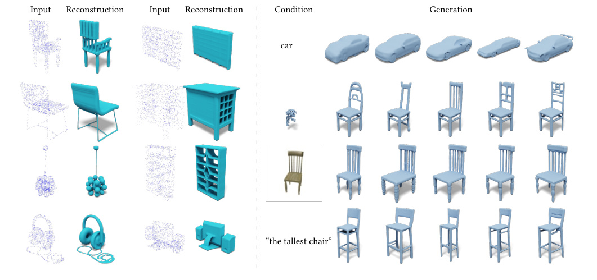
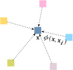
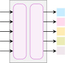
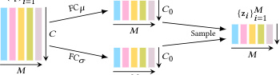
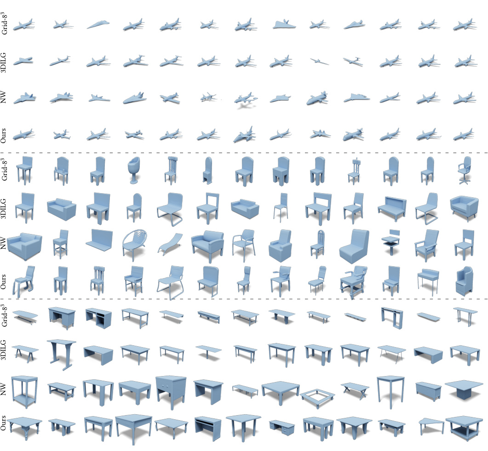
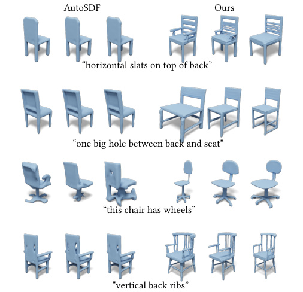

# 3DShape2VecSet：把 3D 模型「装进卡片盒」的论文

> 这是给完全零基础读者的精读笔记。所有术语第一次出现都用初高中常识做类比，绝不假设你学过编程或人工智能。

## 一句话讲什么（TL;DR）

把一个 3D 模型（比如一只柯基）压成 512 张「索引卡」，然后教电脑像生成图片一样生成新的 3D 模型。

*所以这一节是想说：这是一篇关于"怎么让电脑造 3D 模型"的论文。*

---

## 这是个什么场景

你大概玩过这种应用：打字「一只戴墨镜的柯基」，几秒后屏幕上就出来一张图。这是「文字→图」。

这篇论文想做的是「文字→3D 模型」——出来的不是平面图，而是能在电脑里旋转、能用 3D 打印机打出来的立体狗。

但这件事到 2023 年都不怎么行得通。**不是因为生成技术不行，而是因为没人想清楚「3D 模型这个东西，应该用什么形式喂给电脑」。**

打个比方：

- 你要写读书笔记，可以用一段话、一张思维导图、一张表格、一些卡片。
- 不同的笔记形式，决定你之后多容易复习、多容易加新内容。
- 同样地，3D 模型也有好几种「记法」，不同记法决定电脑学得动学不动。

这篇论文就是来挑一种最适合电脑学习的「3D 模型记法」。

*所以这一节是想说：论文要解决的问题是"3D 模型该用什么形式让电脑好学"。*

---

## 之前的人怎么做的，为什么不够好

3D 模型常见的几种「记法」，各有各的毛病：

- **体素（voxel）**：把空间切成一个个小立方体，每格记"这里有没有东西"。
  - 像素是 2D 方格，体素就是 3D 方格——把空间想成一个 3D 魔方。
  - 缺点：分辨率每翻一倍，要存的格子数翻 8 倍。很快电脑内存就爆了。
- **点云（point cloud）**：在物体表面撒一堆点，记下每个点的坐标。
  - 像在土豆表面戳无数针孔，看针尖位置。
  - 缺点：点和点之间是空的，表面坑坑洼洼，不光滑。
- **网格（mesh）**：把物体表面用三角形拼起来，像纸壳模型。
  - 类似手工课折纸做的多面体。
  - 缺点：哪个三角形挨着哪个三角形——这种"邻居关系"非常乱，电脑很难看懂。
- **一个全局向量**：让电脑用一个向量（比如 256 个数字）总结整个形状。
  - 像让你用一句话描述整个房子："一个有屋顶的方盒子"。
  - 缺点：太粗了，细节全丢。
- **3D 网格里塞向量**：每个 8×8×8 的小格子里放一组向量。
  - 像把房子分成 64 个房间，每个房间贴一张便利贴。
  - 缺点：分辨率太低，想提高分辨率就训不动。

> **向量（vector）**：一组有顺序的数，比如 (3, 5, 2)。高中学过的"3 维向量"。本文里出现的"512 维向量"就是 512 个数排成一列。

*所以这一节是想说：现有的所有"3D 记法"要么太占内存，要么太粗糙，要么太混乱。*

---

## 这篇论文的新想法

**把 3D 模型压成「一组卡片」，每张卡片只记特征，不记位置。位置让电脑自己悟。**

听起来好像没区别？区别大着呢——之前的所有方法，都把"特征"和"位置"绑在一起记。这篇论文是第一次说："位置可以不记，电脑能从特征里反推出位置。"



*所以这一节是想说：论文的核心创新是"扔掉位置坐标，只留特征卡片"。*

---

## 它分几步做的（方法）

整个方法可以拆成 5 步。每一步解决一个具体问题。



### 1. 卡片盒表示 — 抛掉坐标只留特征

**类比**：

把柯基模型装进一个卡片盒，里面塞 512 张索引卡。每张卡只写一句话——"耳朵尖尖"、"四条腿圆圆的"、"尾巴卷卷"——但**绝对不写"我描述的是哪个部位"**。位置让看卡片的人自己猜。

**它在干什么**：

把任何 3D 形状压成 512 张卡片，每张卡片是一个 512 维的向量（即 512 个数字）。这 512 张卡是无序的——打乱顺序也没关系，整个集合代表的形状不变。

**关键术语解释**：

> **潜向量（latent vector）**：电脑内部"压缩理解"出来的向量。可以理解成一张速记笔记——人看不懂，但电脑能用它还原原信息。

> **集合（set）**：高中学过的概念，元素无序、不重复。本文的"卡片盒"就是 512 个潜向量构成的集合。

> **特征（feature）**：描述某个东西的某个方面的数值。比如描述一只狗，"毛长"是一个特征，"耳型"是另一个特征。

**为什么这步有用**：

- 几何上："耳朵在头顶才是耳朵"——特征和位置本来就纠缠。强行拆开反而让电脑多学一道。
- 工程上：把 3D 形状变成"一组卡片"后，电脑里有现成的工具可以处理"一组东西"，不用专门为 3D 网格写新工具。

*所以这一节是想说：用一组无序的卡片来代表一个 3D 模型，去掉位置信息。*

---

### 2. 把老办法（RBF）写成现代形式

**类比**：

很久以前的图形学就有一招叫「径向基函数（RBF）」——用一堆带权重的小球叠加出曲面。

想象你在桌子上撒一把不同高度的小山包，山包之间会互相重叠成一个连绵的山脉。每个山包覆盖一片区域，离它越近影响越大，离它越远影响越小。这就是 RBF 的思想。

**它在干什么**：

作者发现，他们用的"卡片查询机制"和 RBF 在数学上长得一模一样——只是把「山包的形状」从人手写改成了让电脑学。

具体来说，要查询「3D 空间里某个点 x 在不在物体内部」时：

- **老 RBF 做法**：x 离每个锚点有多远 → 按距离加权 → 加起来。距离公式是人写死的。
- **本文做法**：让 x 去问每张卡片："你跟我有多像？"按相似度加权 → 加起来。"相似度"是电脑学出来的。

**关键术语解释**：

> **RBF（径向基函数 / Radial Basis Function）**：图形学老办法，用一堆带权重的小山包叠加出曲面。本文把它升级成"可学习版本"。

> **内积**：两个向量对应位置数字相乘再相加。高中学过——两个向量内积大，说明它们方向接近。本文用内积来度量"两张卡片有多像"。

> **相似度**：两个向量像不像。最常用的衡量方法就是内积——两个向量夹角越小，内积越大，越像。

**为什么这步有用**：

- 论文不是凭空发明新办法，而是把图形学 30 年来的老方法（RBF）写成可以让电脑学的形式。这让审稿人和读者更容易接受。
- "用相似度加权汇总"是一种很通用的工具，不只 3D 能用，处理一组卡片基本都能用。

*所以这一节是想说：本文的查询机制可以看成"可学习的 RBF"，不是凭空冒出来的怪招。*

---

### 3. 制卡机（编码器）— 选 512 个代表点



**类比**：

班上有 2048 个学生（输入点云的 2048 个表面采样点），但卡片盒只能装 512 张卡。怎么选这 512 张？

- **办法 A**：准备 512 张空白卡，让电脑自己学"我代表谁"。问题是这些空白卡跟具体哪个学生无关，每只柯基都用同一组空白卡。
- **办法 B**：从 2048 个学生里挑出**分布最分散**的 512 个（一个角落不能挤一堆人）。然后让这 512 个去采访其他所有人，把信息写在自己的卡上。

本文用办法 B。挑分散点的方法叫**最远点采样（FPS）**。

**它在干什么**：

1. 在物体表面均匀撒 2048 个点，记下每个点的 3D 坐标。
2. 用 FPS 算法挑出最分散的 512 个点。
3. 让这 512 个点去"问"全部 2048 个点："我们之间什么关系？"问完每个代表点带回一张卡。
4. 输出：512 张卡，每张 512 个数字。

**关键术语解释**：

> **点云（point cloud）**：物体表面撒的一堆点，每个点是一个 3D 坐标。

> **FPS（最远点采样 / Farthest Point Sampling）**：从一堆点里挑出空间分布最均匀的子集的算法。先随便选一个，然后每次选离已选点都最远的那个。

> **位置编码（positional embedding）**：把一个 3D 坐标 (x, y, z) 变成一个高维向量（比如 256 维）的方法。类比：把"东经 116 度"和"北纬 40 度"两个数变成一句话描述"北京"——更丰富但保留原信息。

> **编码器（encoder）**：负责把原始数据压成卡片的那部分电脑程序。本文的编码器吃 2048 个点，吐 512 张卡。

**为什么这步有用**：

- 让代表点从输入里选，比让它们凭空学，电脑收敛得更快、效果更好。
- FPS 保证 512 个代表点不会全挤在一只耳朵上，能均匀覆盖整个物体。

*所以这一节是想说：从输入里挑 512 个分散的代表点，让它们汇总信息成卡片。*

---

### 4. 再压一次 — 让卡片更短，方便后续学习



**类比**：

512 张卡，每张 512 个数字 = 一共 26 万个数字。让电脑在 26 万个数字的空间里学习"怎么生成新柯基"，相当于让你在一本超厚字典里盲打——理论可行，实际崩溃。

所以再压一道：**每张卡只留 32 个数字**，整个形状被压到 1 万 6 千个数字。

**它在干什么**：

- 在 512 张原始卡的基础上，过一道"瘦身"——把每张卡从 512 个数字压到 32 个数字。
- 同时让这些数字「分布得规整一点」，方便下一步用。
- 用的时候再线性升回 512 个数字。

**关键术语解释**：

> **概率分布**：随机一个数会落在哪些位置、各位置的可能性多大。比如全国人的身高有一个分布——160-175 cm 概率高，220 cm 概率极低。

> **标准正态分布**：一种最常见的钟型概率分布，中心在 0、宽度大致 ±3。物理上很多自然现象（测量误差、身高、考试成绩）都接近这个形状。

> **KL 正则**：一种"惩罚机制"——电脑生成的卡片如果分布偏离标准正态，就给电脑扣分。让卡片"长得规整"。
> 类比：要求所有同学的笔记本都裁成同一尺寸，方便统一装订。

> **扣分（Loss）**：考试扣分总和——越小越好，电脑学习的目标就是想办法把这个分数降下来。本文里"扣分"由两部分组成：
> 1. 重建扣分：还原物体不准确就扣分。
> 2. 规整扣分：卡片分布不规整就扣分。

**为什么这步有用**：

- 第一阶段（编码 / 还原）即使不压，也能学得不错。但第二阶段（生成新形状）必须压。
- 论文做了一组实验：每张卡留 1 个数字时崩了；留 4 个就够好；留 64 反而最后效果变差。**32 是甜点**。

*所以这一节是想说：把每张卡再压短到 32 个数字，让分布规整，方便第二阶段使用。*

---

### 5. 在卡片盒里做"扩散"— 学会生成新模型

**类比**：

前 4 步教电脑「怎么把柯基塞进卡片盒」。这一步教电脑「怎么从一堆雪花变出新的卡片盒，再解码出新柯基」。

**怎么做**：

- 拿一个真柯基的卡片盒。
- 往每张卡上随机撒"雪花"（随机数字噪声）——卡片越来越花。
- 教电脑：看到一张花的卡片，能不能猜出原来干净的是什么样？
- 学会了之后，反过来——给电脑一堆纯雪花，让它一步一步擦干净，最终变出一个全新的卡片盒，再解码成新柯基。

**它在干什么**：

- 在 512×32 的卡片盒上做"加噪 - 去噪"训练。
- 想让电脑听条件（比如"画一只椅子"）？把条件信息翻译成几个向量，每次去噪时让电脑「参考一下这些向量」。
- 条件可以是：类别（椅子 / 飞机）、单张图、一段文字、半个点云。
- 生成时：从纯雪花开始，做 18 步去噪，得到新卡片盒，再解码成 3D 形状。

**关键术语解释**：

> **扩散模型（diffusion model）**：一种生成新东西的电脑算法。先把训练数据揉成雪花，再教电脑学"擦雪花"，最后让电脑从纯雪花反推出全新数据。
> 类比：一张照片被打湿模糊了，电脑学着把它擦干净——擦熟练了，给它白纸它也能画一张新照片。

> **去噪器（denoiser）**：扩散模型里负责"擦雪花"的电脑程序。

> **条件生成（conditional generation）**：让生成的结果听话——你说"画椅子"，它就画椅子，不会画飞机。靠的是把"条件"翻译成向量喂给去噪器。

> **采样（sampling）**：从纯雪花开始一步步去噪、最后得到新东西的过程。本文采样需要 18 步。

**为什么这步有用**：

- 这个套路完全跟 2D 图片生成一致（你听过的"AI 画图"基本都是这个思路），只是把战场从图片像素换成了卡片盒。
- 之前的人在原始点云上做扩散，效果差很多——因为点云本身就乱。在干净的卡片盒上做就稳得多。

*所以这一节是想说：在压好的卡片盒上做"加噪-去噪"训练，电脑就学会从零生成新 3D 模型。*

---

## 关键数字（What works）

每个数字四个角度看：**怎么测的 / 数字是多少 / 跟谁比 / 现实里意味着什么**。

### 数字 1：还原准确度 96.3%（IoU 0.963）

- **怎么测的**：拿一个真柯基 → 编码成卡片盒 → 解码回 3D → 测和原柯基重合度。
- **数字**：96.3%。
- **跟谁比**：之前最好的方法 94.9%，再之前 88.4%，最早的 78.1%。
- **现实意义**：96% 以上重合度意味着还原出来的柯基在 3D 软件里肉眼挑不出毛病。这是后续生成新柯基的"地基"。

> **IoU（交并比 / Intersection over Union）**：两个形状重合度。完全一样是 1.0，完全不重合是 0。

### 数字 2：卡片数翻 8 倍只换来 22% 提升

- **怎么测的**：固定其他参数，只改卡片数 M ∈ {64, 128, 256, 512}，看还原误差。
- **数字**：M=64 误差 0.049，M=512 误差 0.038。
- **跟谁比**：M 翻 8 倍，误差只降 22%；从 256 翻到 512 只降 2.5%。
- **现实意义**：512 张卡是"够用"和"训得动"之间的妥协。继续加卡边际收益很低。普通人能拿到的开源版本就锁死在 512。

### 数字 3：每张卡 32 个数字是最优解

- **怎么测的**：测两件事——还原准确度 + 生成质量。
- **数字**：还原 → 越多越好（64 最好）；生成 → 32 最好，64 反而变差。
- **跟谁比**：32 和 64 在还原上几乎一样（0.963 vs 0.964），但在生成上 32 比 64 好得多（17.08 vs 24.24）。
- **现实意义**：这是论文最有指导价值的发现——**压缩率不是越低越好，存在一个甜点**。换数据集时 32 不一定是最优，得自己试。

### 数字 4：生成质量比"原始点云扩散"强 16 倍

- **怎么测的**：让模型生成 1000 个新形状，跟真实形状比"看起来像不像"。
- **数字**：本文 17.08；旧方法 PVD 270.64。
- **跟谁比**：差 15.85 倍——一个完整的数量级。
- **现实意义**：这条数据基本宣告"不要在原始点云上做扩散，要在卡片盒上做"。后续 3D 大模型（CLAY、Michelangelo、TripoSR）都遵循这条结论。

> **FID**：电脑生成的东西和真实数据"看起来有多像"的分数。越低越像。

### 数字 5：多样性覆盖度 86%（Recall 0.86）

- **怎么测的**：让模型生成各种椅子，看能不能覆盖训练集里所有椅子样式。
- **数字**：本文 86%；之前的方法 65% / 57% / 23%。
- **跟谁比**：本文领先第二名 21 个百分点。
- **现实意义**：高覆盖率意味着模型不会只生成几把"标准椅子"，而是各种奇形怪状都能造出来。





*所以这一节是想说：本文在还原准确度、生成质量、多样性覆盖三方面都比同期方法强。*

---

## 你应该懂的几个新词

读完上面这些步骤后，下面这些词你应该都见过了。这里再统一整理。

> **潜向量（latent vector）**：电脑内部"压缩理解"出来的向量，相当于速记笔记。

> **集合（set）**：无序、不重复的元素集。本文用集合来装卡片，因为顺序不重要。

> **占有率（occupancy）**：3D 空间某点是不是在物体内部，0~1 之间的数。本文的最终输出。

> **神经场（neural field）**：用一个公式（具体说就是一个学习好的电脑程序）告诉你"3D 空间任何一点的某个属性"。本文的解码器就是一个神经场。
> 类比：用一个公式代替一张超大的查表手册。

> **交叉查询（cross-attention）**：让一组向量去问另一组向量"你们和我多像"。本文的编码器和解码器都用这个机制。

> **径向基函数（RBF）**：图形学老办法。一堆带权重的小山包叠加出连续曲面。

> **最远点采样（FPS）**：从一堆点中挑出最分散子集的算法。

> **位置编码**：把 3D 坐标变成高维向量的方法。

> **概率分布**：随机一个数落在哪儿、概率多大。

> **标准正态分布**：钟型分布，中心在 0、宽度约 ±3。

> **KL 正则**：让卡片分布"靠近标准正态"的扣分机制。

> **扩散模型**：先把数据揉成雪花、再教电脑擦雪花的生成算法。

*所以这一节是想说：把所有新词整理一遍，下次再看到不会懵。*

---

## 它有什么搞不定的

下面这些是论文自己承认或我从图表看出的局限：

- **训练成本太高**：第一阶段需要 8 张顶级显卡（A100，每张约 10 万人民币）训练 3-5 天；第二阶段又要 4 张训 5-7 天。普通人玩不起，公司也心疼。
- **只学过工业品**：所有训练数据是椅子、桌子、车、飞机这种规整工业品。换成树、石头、人、动物，效果完全未知。
- **场景太大就不行**：512 张卡装一只椅子刚好，装一整间房子会爆。
- **没有颜色和材质**：只生成几何形状，不带纹理。要做带颜色的成品还得另外加一个模型。
- **不会动的形状**：只能造静态物体，不会造关节运动（比如人挥手的动作）。
- **文字驱动效果一般**：你说"一把腿很细的椅子"，效果远不如"AI 画图"那种惊艳。原因是 3D 数据集里的文字标注非常少。
- **物理合理性差**：生成的椅子可能"看起来对"但腿粗细不一致、重心不稳。这是 3D 生成普遍痛点。

*所以这一节是想说：这论文很强但远不能商用——成本高、范围窄、不带颜色、文字驱动弱。*

---

## 它和别的几篇是什么关系

用集合关系画一下：

- **它的爸爸辈**（本文从这些方法学来）：
  - **稳定扩散（Stable Diffusion）**：2D 图片生成的代表作。本文的"先压再扩"两段式套路完全继承自它，只是战场从图片换成 3D。
  - **3DILG**：本文作者团队的前作。本文是把 3DILG 简化升级——拿掉了"位置坐标"这个累赘。
  - **Perceiver**：用"交叉查询"做一组到一组转换的源头。本文的编码器就是 Perceiver 风格。

- **它的兄弟辈**（同时期不同思路）：
  - **NeuralWavelet**：不学卡片表示，直接在数学上的"小波系数"做扩散。本文把它比下去了。
  - **TriplaneDiffusion**：用三个 2D 平面来代表 3D，是另一种"压缩思路"。

- **它的儿子辈**（基于本文骨架的新工作）：
  - **CLAY**：本文作者的"工业版"，把卡片盒思想 scale 到 15 亿参数 + 几百万 3D 模型。当前最强开源 3D 生成模型之一。
  - **Michelangelo**：在本文卡片盒上对齐文字，解决了本文文字驱动弱的问题。
  - **TripoSR**：图变 3D 的工业实现，秒级出结果。

时间线大概是：

```
2022 Stable Diffusion
2022 3DILG (本文前作)
       ↓
2023 本文（3DShape2VecSet）
       ↓
2023-2024 CLAY / Michelangelo / TripoSR
```

*所以这一节是想说：本文是"2D 图片生成范式"在 3D 领域的奠基性翻译，后续 3D 大模型基本都站在它肩膀上。*

---

## 我建议这样读这篇

零基础读者建议路线：

1. **先看 Fig. 1（img_000.jpg）**——一眼看清楚"这论文能干什么"：单图变 3D、文字变 3D、点云补全、按类别生成。先有动机再深入。
2. **跳到 Fig. 2（img_006.jpg）四种 3D 记法对比**——全文最关键的一张图。看完你就懂"卡片盒"和前人有什么不一样。
3. **读第 4 节方法的前半部分（4.1-4.2）**——RBF → 交叉查询的推导。如果数学卡住，记住一句话：交叉查询是"可学习的 RBF"。
4. **看 Fig. 6（img_018.jpg）整体流程图 + 第 5 节训练设置**——把抽象方法落到具体步骤。
5. **跳过实验细节，直接看 Table 3 + Table 4 + Fig. 11**——拿数字感受一下方法的强弱即可。
6. **回头看第 2 节相关工作**——读完方法再看相关工作，比一开始读它信息量大十倍。

*所以这一节是想说：先看图找直觉，再看核心数学，最后回看相关工作。*

---

## 一些好奇心问答（FAQ）

### Q1：这模型多大？

论文没明说参数量。粗略估算：整个流程大概 1 亿到 2 亿参数。作为对比，AI 画图模型 SD v1.5 是 8.6 亿参数，差不多大一个数量级。

### Q2：训练数据从哪来？

主要来自一个叫 **ShapeNet** 的免费学术数据集，里面有约 5 万个人造物体的 3D 模型，分 55 类（椅子、桌子、车、飞机等）。学术免费用，商用要联系作者授权。

### Q3：我能在自己电脑上跑吗？

- **生成（推理）**：可以。一张 RTX 3090 / 4090（约 1-2 万人民币）就能跑生成。但生成的形状只能是 ShapeNet 那 55 类。
- **训练**：基本不可能。需要至少 4 张 A100，普通人买不起也租不起。

### Q4：为什么不直接用 3D 网格 / 点云？

都试过了：
- 体素 / 网格：分辨率太低存不下细节，分辨率高了内存爆。
- 点云：表面坑坑洼洼，扩散模型在上面学，效果差 16 倍。
- 卡片盒：紧凑、连续、好学。

### Q5：512 张卡是怎么定的？

实验定的。卡片数从 64 翻到 512 误差降 22%，但从 256 翻到 512 只降 2.5%——明显的边际递减。再加 8 张顶级显卡的训练成本，512 是甜点。

### Q6：每张卡 32 个数字也是实验定的？

是。论文做了完整对比：1 / 2 / 4 / 8 / 16 / 32 / 64。结论是 1 太少崩了，4 起够用，但要做生成的话 32 最好，64 反而变差。这条曲线长得像 U 形。

### Q7：跟"AI 画图"是同一种思路吗？

骨架完全一样：先把数据压成"潜表示"，再在潜表示上加噪去噪学生成。区别只在潜表示的形状——AI 画图是 2D 网格（图片像素），本文是 1D 集合（卡片盒）。

### Q8：生成时随机性来自哪里？

来自最开始那堆"纯雪花"——每次生成时电脑会重新随机一堆雪花，去噪 18 步出来一个新形状。换不同雪花就出不同形状。

*所以这一节是想说：模型规模是中等、数据是 ShapeNet、能在好显卡上跑生成、和 AI 画图同根同源。*

---

## 如果你想再深入

按"和本文关系紧密度"排：

1. **稳定扩散（Stable Diffusion / Latent Diffusion）**——本文范式来源。先看这篇你才知道"先压再扩"为什么是当代生成的主流。
2. **3DILG**——本文前作，本文的直接对照组。读完你才懂"扔掉位置坐标"是多大的简化。
3. **CLAY**——本文作者的工业版续作。如果你只读一个续作就读这个。
4. **NeRF（神经辐射场）**——3D 神经场入门必读。和本文是不同方向但共享"用网络代表 3D"的思想。
5. **Marching Cubes**——把占有率网格转成三角网格的经典算法。本文最后一步用它出最终模型。

*所以这一节是想说：先看 SD 懂范式，再看 3DILG 懂动机，再看 CLAY 看续作，NeRF 拓宽视野。*
