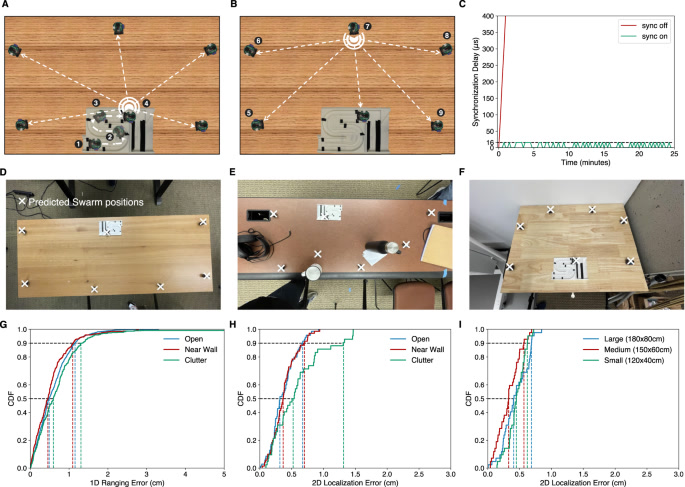
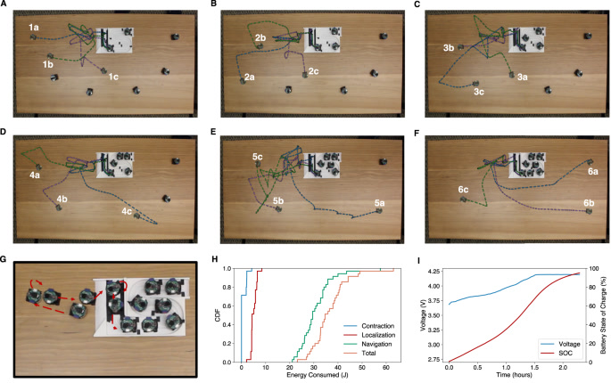

# 声学蜂群：让一群小机器人自己爬上桌变成"超级耳朵"

> 给"完全没接触过 AI / 机器人 / 音频信号处理"的读者写的精读笔记。所有专业词第一次出现都会解释清楚。只看这份笔记就能理解全文机制。

---

## 一句话讲什么（TL;DR）

七个骰子大小的小机器人，从充电底座自己爬上桌子、散成一圈，靠互相"喊一嗓子"算出各自的精确坐标，然后联手把桌旁几个同时说话的人一一分清——谁在哪、说了啥，全部搞定。整个过程不需要头顶装摄像头、不需要人手摆放、不需要扯一根线。

*所以这一节是想说：这是一群会自动布阵的小麦克风机器人，把"摆麦克风"这件苦力活完全自动化了。*

---

## 这是个什么场景

周末聚餐，一桌六个人围着火锅。姑姑在跟你妈聊孩子，舅舅在讲股票，小表弟在抢虾滑——三波对话同时在飞。你掏出手机想给远方的奶奶录一段，回放时只剩一锅"嗡嗡嗡"，连自己说的"干杯"都挑不出来。

原因很朴素：手机就一只麦克风，所有方向的声音同时涌进来，它分不清"对面那位"和"左手边那位"。

那人为什么能分清？因为你有两只耳朵，左右隔着约 17 厘米。同一个声音先到左耳、再到右耳，中间差那么一丁点时间，大脑就能反推出"声音从左前方来"。这个能力叫做"双耳定位"，它的精度和两只耳朵之间的距离直接相关——距离越大，时间差越明显，方向判断越准。

麦克风也是一样的道理：只要把好几只麦克风摆得离得远，就能靠"到达时间差"把不同方向的人拆开。这里有一个关键概念：

> **麦克风阵列的孔径（aperture）**：一组麦克风里最远两只之间的距离。类比望远镜的镜片口径——口径越大，分辨率越高，能看清越远的细节。对麦克风来说，孔径越大，分辨不同方向声源的能力越强。

问题是，谁会在火锅桌上摆 7 只麦克风、量好坐标、再扯一堆线连到电脑？这事得让它自己去办。

这就是 Acoustic Swarms（声学蜂群）要解决的场景：把"布置大孔径麦克风阵列"这件原本需要人工的事情，交给一群会自己爬行的小机器人去自动完成。

*所以这一节是想说：单个麦克风分不清多人说话；要分清就要把多个麦克风摆远，但人手摆不现实，需要机器人自动完成。*

---

## 之前的人怎么做的，为什么不够好

在 Acoustic Swarms 之前，学界已经有很多"小机器人群"的工作，但每一种都被某个条件卡死了：

| 方案 | 怎么做的 | 日常类比 | 卡在哪 |
|------|---------|---------|--------|
| 头顶摄像头定位 | 天花板装相机看着机器人 | 体育馆的鹰眼系统 | 离开装有相机的房间就没法用 |
| 投影仪打条纹 | 往桌上投特殊图案，机器人靠看图案定位 | 舞台灯光标记 | 撤了投影仪就摸瞎 |
| 红外测距 | 机器人之间发红外光测距 | 近视眼看东西 | 只能 10 厘米内有效，太短了 |
| IMU 自估算 | 靠"我走了几步"推算位置 | 闭着眼走路 | 走十步还行，走五十步就偏到墙角 |
| 带相机的大机器人 | 装视觉系统做 SLAM 建图 | 扫地机器人 | 太大、太贵，而且摄像头有隐私问题 |

总结：没有任何一个之前的方案能同时做到三件事——自己散开、厘米级精度定位、多人语音分离。要么需要外部设备（相机、投影仪），要么测距范围太短（红外），要么会漂移（纯 IMU），要么太大太贵（带相机的大机器人）。

还有一类工作是"分布式麦克风阵列"——不是机器人，而是在房间各处放若干固定麦克风。这类工作的问题也不少：要精确知道每个麦克风的位置（谁来量？）、要用线连起来同步（怎么布线？）、只能定位 1-2 个说话人（太少了）、或者需要事先知道有几个人在说话（实际场景不可能提前报数）。

*所以这一节是想说：以前的方案要么靠外部设备、要么测距太短、要么会漂移，没人三件事一起做到。*

---

## 这篇论文的新想法

做一个类比：你家的扫地机器人——从充电底座出发、自己在房间里绕一圈打扫、回底座充电。它知道自己走过哪里，不需要你操心。

Acoustic Swarms 干的是同款故事，只不过主角换成了"会爬桌面的小麦克风"，目标从"扫干净地"换成了"听清每个人说话"。

具体来说：七个厘米级的小机器人从充电底座自己爬上桌面散开，互相用声波"喊一嗓子算时间差"反推彼此坐标，然后整个桌面就成了一张大麦克风网，开始听人说话、分离每个人的声音、定位每个人的位置。任务完成后，它们原路退回底座自己充电。

一句话总结核心创新：**机器人自己当摆放工，把麦克风阵列在桌上铺开。** 没有头顶相机、没有投影仪、没有人帮忙摆、没有一根线。

从听觉智能的三层架构来看——这篇论文对应的是**硬件/阵列层**。它和本导读中另外两篇听觉论文形成互补：

- **Acoustic Swarms（本篇）= 硬件/阵列层**：解决"麦克风往哪摆"的物理问题，把单设备听觉扩展为分布式空间听觉
- **[Proactive Hearing](proactive-hearing.md) = 决策层**：解决"听谁不听谁"的选择问题，用对话节奏自动锁定你正在跟谁聊天
- **[NeuralAids](neuralaids.md) = 神经处理层**：解决"在极端资源约束下也能分离"的计算问题，把 AI 降噪塞进助听器芯片

三篇合起来就是一个完整的"机器人耳朵"：Acoustic Swarms 铺好麦克风网，Proactive Hearing 决定关注谁，NeuralAids 在边缘设备上实时跑分离算法。

*所以这一节是想说：机器人自己布阵，不靠任何外部设备；它是听觉三连中的"硬件/阵列层"。*

---

## 它分几步做的（方法）

<!-- paper-figures:begin -->



*上图说明：Fig. 2: 2D localization of swarm robots.（论文原图）。*



*上图说明：Fig. 4: Acoustic swarm returning to the base.（论文原图）。*
<!-- paper-figures:end -->

整个流程像七个小演员演一出戏：从化妆间排好队 -> 一个个上台站位 -> 报告各自坐标 -> 开始听观众说话 -> 结束后回化妆间充电。下面逐步拆解。

下图是整套系统的端到端流程（硬件动作 + 声学信号 + 算法处理）：

```
┌──────────────────────────────────────────────────────────────┐
│  底座（充电+已知坐标轨道）                                      │
│  ┌────┐┌────┐┌────┐┌────┐  ← 7 台机器人随机排队               │
│  └────┘└────┘└────┘└────┘                                     │
└───────┬──────────────────────────────────────────────────────┘
        │ ① 排队(碰撞检测) → ② 分方向(360°/N-1) → ③ A*绕路
        ▼
┌──────────────────────────────────────────────────────────────┐
│  桌面散开（大孔径阵列）                                         │
│   ·robot        ·robot         ← 光电对管防掉桌 / 加速度计防撞  │
│         ·robot        ·robot                                   │
│   ·robot     ·灯塔(底座)   ·robot                              │
└───────┬──────────────────────────────────────────────────────┘
        │ ④ chirp 超声波测距(飞行时间×声速) → 两两距离
        ▼  ⑤ 已知锚点破平移/镜像歧义 → 优化求解 (x,y)
┌──────────────────────────────────────────────────────────────┐
│  14 通道音频 (7×2 麦克风) + 每个麦克风绝对坐标                  │
└───────┬──────────────────────────────────────────────────────┘
        │ ⑥ 定位: SRP-PHAT 粗筛 → U-Net+Transformer 细筛
        │ ⑦ 分离: 交替注意力(人内 Conformer / 人间 Transformer)
        ▼
   每个说话人：位置 (x,y) + 一份干净语音
        │ ⑧ 灯塔引导原路返航 → 入坞充电
        └──────────────────────────────────────────────────────►
```

*上图说明：硬件"自布阵"（①-⑤）先把麦克风铺成大孔径阵列并测出坐标，算法层（⑥-⑦）再在这张网上先定位后分离，最后返航充电。*

### 第 0 步：先认识一下这个机器人

在讲流程之前，得先看看这些小家伙长什么样。

每个机器人只有 3.0 cm x 2.6 cm x 3.0 cm——跟一颗方糖差不多大。它身上塞了这些东西：

| 部件 | 型号 | 干什么的 | 日常类比 |
|------|------|---------|---------|
| 主芯片 | Nordic nRF52840 | 控制一切 + 蓝牙通信 | 手机的处理器 |
| 陀螺仪 | ISM330DLCTR | 感知旋转 | 手机里的方向传感器 |
| 加速度计 | MC3419 | 感知加速/碰撞 | 手机里的计步器 |
| 麦克风 x2 | ICS-41352 | 听声音 | 手机的麦克风 |
| 扬声器 x1 | AS01008MR-3 | 发出声音（chirp） | 手机的喇叭 |
| 光电对管 x2 | GP2S700HCP | 检测桌沿 | 倒车雷达 |
| 电池 | 3.7V 100mAh | 供电 | 手表电池 |
| 电机 x2 | FA-GM6-3V-25 | 驱动轮子移动 | 玩具车的马达 |

关键点：两个麦克风 + 一个扬声器。两个麦克风让每个机器人本身就是一个"微型双耳"，可以做初步的方向判断；扬声器用来发出超声波 chirp 信号供其他机器人测距。

底座是一个 3D 打印的塑料轨道，有入口坡道和出口坡道。轨道上贴着黑色标记点（checkpoint），机器人靠光电对管识别这些标记来确认自己在底座里的位置。轨道底部可以贴导电胶带通 6V 直流电，机器人底部的铝球触碰到导电轨道就开始充电。

机器人通过蓝牙把 48kHz 的 16 位音频实时传到主机电脑。因为蓝牙带宽有限（2 Mbps），所以用 Opus 编码把音频压缩到 32kbps——7 台机器人同时传也不丢包。

*所以这一节是想说：每个机器人是 3cm 见方的"会爬的麦克风"，带双麦克风 + 扬声器 + 陀螺仪 + 加速度计 + 光电对管。*

---

### 第 1 步：用声音测距离（chirp 测距）

**日常类比**：打雷数秒数。闪电一闪，你默数"一千零一、一千零二、一千零三"，三秒钟就说明雷打在约一公里外。因为声速大约 343 米/秒，知道时间就能算距离。

**输入**：一个机器人发出一段 chirp 信号。

**处理**：其他机器人记录"什么时候收到这段 chirp"，减去"发出时刻"，得到飞行时间 delta_t。距离 = 声速 x delta_t。

**输出**：两个机器人之间的 1D 距离，精度 0.45-0.48 cm（中位数）。

这里面有几个关键细节值得展开：

**为什么用 chirp 而不是普通的"嘀"一声？**

> **chirp（扫频音 / 啁啾信号）**：一段几毫秒长的声音，频率从低到高（或从高到低）连续滑动，像警车鸣笛由低变高。

屋里有回声——声音碰到墙壁、桌面、杯子都会反弹回来。如果发一声普通的"嘀"，原声和回声会糊在一起，分不清哪个先到。但 chirp 因为频率在连续变化，接收端可以用一种叫"匹配滤波"的数学方法精确锁定原始信号的"首达时间"——就像在一堆类似的信号里，只有和"模板"完全对上的那个会产生一个尖锐的峰。这个原理和雷达、声呐完全一样，是信号处理里最经典的技术之一。

**为什么用超声波频段？**

这些 chirp 的采样率是 62.5 kHz，发出的信号频率在人耳听不到的范围（人耳极限约 20 kHz）。这样做的好处是：测距信号不会干扰正常的说话声——机器人一边测距一边听人说话，互不干扰。

**时间同步怎么解决？**

要算"飞行时间"，必须知道"发出时刻"和"收到时刻"——但这两个时刻分别记录在两台不同的机器人上，它们的内部时钟不一定同步。论文设计了一个全局时钟同步算法，把所有机器人的时钟对齐，同步误差不超过 1 个采样点（62.5 kHz 下约 16 微秒）。16 微秒对应约 0.55 cm 的距离误差——这已经足够精确了。

**双麦克风算法**

每个机器人有两个麦克风。论文设计了一个"双麦克风融合算法"：把同一个 chirp 在两个麦克风上的接收信号合起来分析，利用两个麦克风之间的微小间距产生的相位差来更精确地锁定直达路径（而不是反射路径）。这在有强烈多径干扰的室内环境里尤其重要。

> **多径（multipath）**：声音从声源出发后，除了直接到达麦克风的那条路径（直达路径），还有经过墙壁、天花板、桌面反射后到达的多条路径。这些反射信号会和直达信号叠加，造成干扰。类比你在浴室里拍手，听到"啪-啪-啪"的多次回声，就是多径效应。

*所以这一节是想说：用超声波扫频信号（chirp）在机器人之间飞来飞去，靠"飞行时间 x 声速"算出两两距离，精度不到半厘米。*

---

### 第 2 步：把"两两距离"变成"绝对坐标"（2D 定位）

**日常类比**：你在一个完全陌生的空旷草地上。有人告诉你"A 离 B 是 3 米，B 离 C 是 4 米，A 离 C 是 5 米"。你能在纸上画出这三个人的位置关系吗？能——画一个 3-4-5 的直角三角形。但你会发现，这个三角形画在纸上的"哪个位置"和"朝向"是任意的——你可以把它往右平移，也可以把它镜像翻转，距离都不变。

这就是从两两距离反推坐标时的两个数学歧义：

- **平移歧义**：所有点同时往右挪 5 cm，距离全都不变——你不知道原点在哪。
- **镜像歧义**：把整张图沿一条线翻过来，距离也全都不变——你不知道哪边是左哪边是右。

要破这两个歧义，必须引入"已知坐标的锚点"。

**输入**：所有机器人之间的两两 1D 距离。

**处理**：

1. **制造已知坐标的锚点**：底座里留一个机器人，它沿着轨道滑动，每滑到一个黑色标记点（checkpoint）就发一次 chirp。这些标记点的坐标是已知的（因为轨道是固定的、3D 打印好的）。外面的机器人记下自己到每个标记点的距离——这就相当于在"GPS 卫星"和"手机"之间建立了距离关系。
2. **补充更多距离约束**：底座里的机器人做完后，外面的机器人之间轮流发 chirp，互相补测距离。
3. **数学求解**：把所有距离（到已知锚点的 + 机器人之间的）喂进一个优化算法，反推每台外部机器人的 (x, y) 坐标。优化器会自动处理测距误差中的异常值（outlier），比如被桌上物体阻挡导致的偏大距离。

**输出**：每台机器人在底座坐标系下的绝对 2D 坐标，中位误差 0.37-0.38 cm。

**为什么锚点要在一条直线上？** 轨道上的多个标记点排成一条直线，坐标已知。这条线同时破了两个歧义：因为锚点坐标已知，原点确定了（破平移歧义）；因为锚点在一条直线上且有方向，镜像翻转后锚点会跑到错误的位置（破镜像歧义）。

论文还测试了不同大小的桌面（1.2m x 0.4m 到 1.8m x 0.8m），2D 定位精度几乎不变——这说明这套方法可以在更大的桌面上使用而不会精度下降。

*所以这一节是想说：用底座轨道上的已知标记点当"GPS 卫星"，把一堆两两距离反推成每台机器人的绝对坐标，破解了平移和镜像两个数学歧义。*

---

### 第 3 步：让机器人自己散开（swarm dispersal）

**日常类比**：切披萨。机器人从底座出来后按等分角度往外扩散，像从披萨中心切几刀，每条切线方向跑一台机器人。

**输入**：N 个机器人在底座里，不知道桌子形状、不知道桌上有什么。

**处理**分三个阶段：

**阶段 A：底座里排队**

机器人被放进底座的顺序是随机的，系统首先要搞清楚"谁在前面谁在后面"。方法很聪明也很暴力：让一台机器人往前推，它会撞到前面那台——加速度计检测到碰撞的瞬间尖峰。多次这样的"碰撞实验"加上光电对管识别轨道两端的标记，系统就能反推出底座里所有机器人的顺序。

然后机器人们需要重新排好位置，停在底座轨道上的各个标记点上。因为初始分布可能不均匀（两台挤一个标记点），论文设计了一套"前进-碰撞-后退-找标记"的协作协议来解决冲突。

**阶段 B：分配出走方向并导航到起始点**

把 360 度等分成 N-1 份（留一台在底座当灯塔），每台机器人分一个角度。但有些角度在底座的"另一边"——机器人需要先绕过底座本身才能到达出发点。这里用了 A* 算法在网格上规划绕路路径。

> **A* 算法**：一种经典的"找最短路"算法。它对每条可能的路线打分——已经走了多少（确定成本）+ 估计还要走多少（启发式成本），优先尝试总分最低的那条。类比手机地图给你导航时计算"绕路最短路线"——它不会蠢到走直线撞进建筑物，也不会绕太大圈浪费时间。

**阶段 C：散开 + 边缘/碰撞检测**

机器人到达起始点后，朝着自己分配到的角度一直往外走，直到遇到桌沿或撞到物体：

- **检测桌沿**：机器人底部的光电对管（photointerruptor）朝下发红外光。桌面在的时候光会反射回来，传感器读数高；如果到了桌沿、下面是悬空，反射消失，读数骤降。机器人检测到这个变化就立刻停下并后退一点，避免掉下去。最高支持 18 cm/s 的速度下仍能可靠检测。
- **检测碰撞**：撞到桌上物体（杯子、笔记本电脑等）时，加速度计会出现一个瞬时尖峰。超过阈值就判定"撞了"，机器人停下后退。最低 10 cm/s 的碰撞速度就能可靠检测。

**输出**：机器人散布在桌面上，尽可能远离彼此，形成一个大孔径的麦克风阵列。

**关键数字**：

| 指标 | 数值 |
|------|------|
| 排队 + 散开总时间（7 台） | 约 1 分 45 秒 |
| 单台散开耗时 | 11.8 +/- 7.0 秒 |
| 散开能耗 | 22.3 焦耳（约 1.7% 电量） |
| 桌面占用率 | > 75%（各方向） |

**为什么用"等分角度"这种看似简单的策略？** 因为机器人事先不知道桌子是圆的还是方的、桌上有没有物体。任何"最优方案"都需要先建图（把桌面走一遍画出地图），但建图本身就要走一遍桌面——鸡生蛋蛋生鸡。等分角度是"最坏情况下也不会太差"的稳妥办法，类似于"不知道考试范围时把每章都看一遍"。

*所以这一节是想说：机器人在底座里先排好队、分好方向，然后按等分角度往外散开，碰到桌沿或物体就停。*

---

### 第 4 步：边走边校准（IMU-声学融合导航）

**日常类比**：你闭着眼走路，靠脚底的感觉估计自己走了多远——走十步可能还行，走五十步就偏到墙角了。但如果每走十步就睁一次眼看一下参照物（比如路灯）重新对齐，你就能走得很远也不偏。

**输入**：机器人靠 IMU 持续推算自己的位置和朝向。

> **IMU（惯性测量单元）**：一颗能告诉机器人"自己在转"（陀螺仪）和"自己在加速"（加速度计）的小芯片。手机里也有，用来计步和判断方向。

**问题**：只靠 IMU 推位置，传感器的微小噪声会被积分放大成越来越大的漂移——陀螺仪每秒 0.1 度的漂移，30 秒后就是 3 度角度误差，对应米级的位置错误。

**处理**：移动中的机器人每 200 毫秒发一次 chirp。留在底座的"灯塔机器人"收到 chirp 后测距，反馈给移动机器人。移动机器人拿"声学测出来的距离"和"按 IMU 推出来的应有距离"做比较，有差就纠正——就像闭眼走路时每十步睁一次眼校准。

**输出**：校准后的实时位置和朝向，漂移被控制在可接受范围。

**为什么不用相机做 SLAM？**

> **SLAM（同步定位与建图）**：机器人一边走一边画地图、一边知道自己在地图哪里。最常见的做法是用相机看周围的特征点。

但这些机器人只有 3 cm 大，根本装不下相机。即使装了微型相机，桌面的视觉特征（一片白色桌面）也太单调，很难提取有用的特征点。声学测距是这个尺度下唯一实用的"绝对参考"手段。

*所以这一节是想说：IMU 单用会漂移，靠超声波每 200ms 校准一次位置，和 GPS 校准手机定位是同一个思路。*

---

### 第 5 步：听人说话——先定位再分离

到这里硬件部分搞完了：机器人自己排好队、散开了、知道彼此的精确坐标了。下面是整个系统最核心的算法部分——怎么从这 14 个麦克风（7 台机器人 x 2 麦克风）的信号里，搞清楚"房间里几个人在说话，分别在哪，分别说了啥"。

这个任务分两大步：**先定位（找到有几个人、坐在哪），再分离（给每个人输出一份干净的语音）**。

#### 5a. 第一步：定位——"粗筛 + 细筛"找人

**日常类比**：你丢了钥匙，先在每个房间快速扫一眼（粗筛），排除明显没钥匙的房间；然后在"可能有钥匙"的那两个房间里仔细翻（细筛）。

**输入**：14 通道的混合音频信号 + 14 个麦克风的已知坐标。

**核心思路（对齐 + 检测）**：

把空间切成网格（像棋盘一样的小格子）。对每个候选格子，假设这个格子里有人在说话：声音从这格传到 14 个麦克风的路径长度不同，对应不同的"到达时间"。把每个麦克风的信号按照这些时间差"对齐回去"——如果格子里真有人，对齐后 14 个麦克风的信号会"同步"，叠加起来很响；如果格子里没人，对齐后是噪声乱叠加，叠出来很弱。

> **TDoA（Time Difference of Arrival，到达时间差）**：同一个声音被多个麦克风听到的时间差。类比：闪电一闪，你和你朋友站在不同位置，你先听到雷声、朋友后听到——这个时间差就能推算出闪电的方向。

论文把搜索做成两步：

**粗筛——SRP-PHAT 算法**

> **SRP-PHAT（Steered Response Power with Phase Transform）**：一种经典的声源定位算法。对每个候选位置，把所有麦克风信号按照那个位置应有的时间差对齐后求和，看总能量（功率）有多大。能量高的地方可能有人。PHAT 是一种加权技巧——只保留信号的相位信息、去掉幅度信息，这样对混响（房间反射造成的干扰）更鲁棒。

SRP-PHAT 计算量小，能快速扫描整个 3D 空间，把"明显没人"的区域砍掉。论文显示它能把搜索空间缩小 200-446 倍（取决于说话人数），只留下少数"看起来有人"的候选区域。

为什么要搜索 3D 空间而不是 2D？因为说话人站着或坐着，头的高度不同（90-160 cm），而麦克风在桌面上。高度差导致额外的时间延迟，不考虑高度会定错位。

**细筛——神经网络分离检测**

在 SRP-PHAT 留下的候选区域里，跑一个神经网络做精细判断。这个网络是一个语音分离模型，它的架构是 **U-Net + Transformer**：

> **U-Net**：一种神经网络的"形状"。先把输入信号一层层压缩（编码器，像把一篇文章精简成一句话），再一层层展开恢复原始大小（解码器，像把一句话展开成段落）。压缩和展开的对应层之间有"跳跃连接"把细节直接传过去，防止压缩过程中丢失信息。最早用在医学影像分割，后来被广泛应用于各种信号处理任务。

> **Transformer**：一种神经网络结构。它的核心机制叫"自注意力（self-attention）"——处理一段序列时，让序列里任意两个位置互相"看一眼"，计算它们之间的关联程度。类比你读一句话时会同时看前面的主语和后面的谓语来理解意思，而不是只看相邻的字。这让它特别擅长捕捉长距离依赖关系。

网络的工作方式：把 14 通道信号按候选位置的 TDoA 对齐后输入 U-Net 编码器压缩，中间经过 Transformer 瓶颈层在时间维度上做自注意力（识别"哪些时间段有人在说话"），再由 U-Net 解码器展开输出分离后的信号。如果输出信号振幅大，说明这个位置确实有人在说话；如果输出几乎为零，说明这是个空位置。

**四个提高鲁棒性的技巧**：

1. **两级分辨率**：先用大格子粗搜，保留有信号的区域后再分裂成小格子细搜——像拼图先按颜色粗分类再精细对接。避免一上来就全空间细搜导致计算量爆炸。
2. **训练时随机扰动麦克风位置**：故意把训练数据中的麦克风坐标随机偏移最多 4 个采样点（对应约 2.8 cm），让网络学会容忍真实部署时 swarm 定位的小误差。
3. **去除幻影声源**：屋里有回声，一个真实的说话人可能在网络输出上呈现为多个"幻影"（直达声和反射声分别被检测为不同声源）。论文通过聚类把输出相似的声源合并掉。
4. **TDoA 空间离散化**：不是在 3D 欧几里得空间中均匀切格子，而是按 TDoA 值均匀离散化。TDoA 相同的 3D 点映射到同一个区域，这样不管麦克风阵列的形状如何，网络都能适配——实现了对不同麦克风分布的泛化。

**输出**：所有说话人的数量和 2D 坐标。中位定位误差 9-10 cm（仿真），14-15 cm（真实环境）。

*所以这一节是想说：把空间切成格子，对每格做"对齐 + 检测"看有没有人，先用 SRP-PHAT 粗筛缩小范围，再用神经网络细筛精确定位。*

---

#### 5b. 第二步：分离——"内部找规律 + 互相压串音"

**日常类比**：鸡尾酒会效应。一桌人都在说话，你想听对面那位。你的大脑会自动把左右两人的声音"压低"、把对面那位的声音"放大"。这一步在数学上做的就是这件事。

**输入**：14 通道音频 + 上一步找到的 S 个说话人的 2D 位置。

**处理**：

为什么不直接用定位步骤的网络输出作为最终的分离结果？因为那个网络的目标是"判断有没有人"，不是"提取干净语音"。它的输出里会有残留的串音（一个人的信号里混着其他人的声音）。而且，它没有充分利用"其他人的位置"这个信息——知道了所有人的位置后，可以更精准地去除串音。

论文设计了一个专门的分离网络，架构如下：

对每个已定位的说话人，先把 14 通道信号按照这个人的位置做 TDoA 对齐。然后把所有 S 个人的对齐信号（S x 14 通道）一起喂进网络。

网络的核心是一个"交替注意力"机制，分两步交替进行：

1. **同一人内部（intra-speaker attention）**：用 Conformer 网络分析每个人在时间维度上的语音特征。

   > **Conformer**：一种混合神经网络结构，把"擅长抓局部细节"的卷积网络和"擅长看全局关系"的 Transformer 串联起来用。卷积层像显微镜看细胞结构，Transformer 像站在高处俯瞰全景——两者结合既看得清细节也抓得住大局。

2. **不同人之间（inter-speaker attention）**：用 Transformer 做"说话人间注意力"——让每个人的语音特征"看一眼"其他人的特征，识别"这段声音是不是从隔壁串过来的"，把串音抑制掉。

这两步交替执行多次，串音就被一层层压下去。类比洗衣服——第一遍能洗掉大部分脏东西，但还有残留；第二遍第三遍继续洗，越洗越干净。

**架构的一个重要优点**：因为"说话人间注意力"是在说话人维度上做的（而不是把说话人数量硬编码进网络），所以不管有 2 个人还是 5 个人，都用同一套网络——只是注意力矩阵的大小随 S 变化。这让系统天然支持不同数量的说话人，无需为每种人数训练不同的模型。

**输出**：每个说话人一份干净的语音信号。

*所以这一节是想说：知道每个人坐哪后，网络在每个人内部找语音规律，在多人之间互相压串音，两步交替多次，输出每人一份干净语音。*

---

### 第 6 步：返航 + 充电

**日常类比**：晚上回家。早上出门时你记得每条街怎么走，晚上原路返回。到家门口靠门灯重新确认位置，对准钥匙孔开门。

**输入**：电量低或任务完成的信号。

**处理**：

1. **原路返回**：论文做了一个关键假设——散开时机器人是直线走出去的，且走出去之后这条路径上没有新放置物体。所以返航只需沿着来时的路反向走即可，不需要重新建图。
2. **灯塔引导**：底座里留着的机器人以 5 Hz 频率发 chirp，返航中的机器人靠它做 1D 测距，实时知道自己离底座多远。
3. **进入安全圈**：当距离底座 25 cm 以内（称为 clear zone，要求无障碍物）时，所有外部机器人停下，执行一次完整的 2D 定位，获得精确坐标。
4. **对接校准**：靠近底座入口时，因为陀螺仪漂移，机器人的朝向估计已经不准了。它做一次直线运动 + 多次声学测量来反推真实朝向，然后调整自己对准入口。
5. **依次入坞**：机器人按照散开的反序一台台进入底座。每台进入后，底座里的其他机器人挪位置腾空间，并更新自己的坐标作为新的地标，供下一台返航的机器人使用。

**输出**：所有机器人回到底座，开始充电。

| 指标 | 数值 |
|------|------|
| 单台返航 + 对接耗时 | 40.4 +/- 4.5 秒 |
| 满充时间 | 约 2.5 小时 |
| 灯塔 chirp 频率 | 5 Hz |
| 安全圈半径 | 25 cm |

*所以这一节是想说：原路退回 + 灯塔测距引导 + 安全圈精定位 + 对接朝向校准 + 依次入坞充电。*

---

下图聚焦最核心的算法链路——从 14 通道混音到"每人一份干净语音"的两级处理：

```
        14 通道混合音频 + 14 个麦克风坐标
                     │
        ┌────────────┴────────────┐
        │  定位（先找有几个人）    │
        │  ┌────────────────────┐ │
   3D空间→│ SRP-PHAT 粗筛       │ │  砍掉 208-446× 搜索空间
   切格子 │ (对齐求功率, 抗混响)│ │
        │  └─────────┬──────────┘ │
        │            ▼            │
        │  ┌────────────────────┐ │
        │  │ U-Net 编码 ─┐      │ │  按候选点 TDoA 对齐后
        │  │             ▼      │ │  判断"这格有没有人"
        │  │  Transformer 瓶颈  │ │
        │  │             │      │ │
        │  │ U-Net 解码 ◄┘      │ │
        │  └─────────┬──────────┘ │
        └────────────┼────────────┘
                     ▼  S 个说话人的 (x,y)
        ┌────────────┴────────────┐
        │  分离（给每人一份语音）  │
        │  按各人位置 TDoA 对齐    │
        │  ┌────────────────────┐ │
        │  │ 人内注意力(Conformer)│ │ ┐
        │  │        ⇅           │ │ ├ 交替多次
        │  │ 人间注意力(Transf.) │ │ ┘ 层层压串音
        │  └─────────┬──────────┘ │
        └────────────┼────────────┘
                     ▼
        每个说话人：一份干净语音 (SI-SDRi >10 dB)
```

*上图说明：定位网络回答"有几个人、在哪"，分离网络在已知全部位置后用"人内找规律 + 人间压串音"的交替注意力输出每人一路干净语音。*

---

## 关键数字（What works）

| 指标 | 数值 | 对比基准 | 这意味着什么 |
|------|------|---------|-------------|
| 1D 测距精度 | 中位 0.45-0.48 cm | 红外测距只能 10cm 内有效 | 误差比一颗黄豆还小，是后续所有处理的基础 |
| 2D 定位精度 | 中位 0.37-0.38 cm | 以前靠头顶相机才能做到 | 厘米内精度，不被硬件拖后腿 |
| 说话人计数（5人） | precision & recall > 89% | 大多数前作要求预知人数 | "不用报数"是产品级必需 |
| 真实环境定位（中位） | 14-15 cm | 仿真 9-10 cm | 仿真到现实只损失约一半，没崩 |
| 真实环境分离质量 | SI-SDRi > 10 dB | SepFormer +5dB, 比 IRM oracle +4.8dB | "勉强分清"变成"像单独麦克风录的" |
| 挤在 10cm 圆环 | precision 71%, recall 54% | 散开版 89%+ | 直接证明"大孔径"是核心魔法 |
| 散开能耗 | 22.3 J（约 1.7% 电量） | - | 可以反复工作几十次 |
| SRP-PHAT 搜索空间缩减 | 208x - 446x | - | 让实时处理成为可能 |
| 小模型推理（3s 音频） | 中位 1.82s | 大模型 > 3s | 小模型可实时 |

> **SI-SDRi（Scale-Invariant Signal-to-Distortion Ratio improvement）**：衡量分离后声音"纯不纯"的指标，单位 dB，越高越好。i 代表 improvement（提升），指的是和未处理的原始混合信号相比提升了多少。10 dB 提升意味着干扰信号的能量被压到了约原来的 1/10。

*所以这一节是想说：测距毫米级、定位厘米级、5 人场景准确率 > 89%，但把机器人挤在一起精度就崩——空间分布是核心。*

---

## 实验结果说明了什么

论文的实验可以分成四层递进的验证：

**第一层：合成数据验证算法上限。** 在电脑里模拟虚拟房间，用公开语音数据集（LibriSpeech 等）放在不同位置叠加。2-5 个说话人场景下，precision 和 recall 都在 89% 以上；SI-SDRi 在 2 人场景下超过 oracle 方法 IRM 4.8 dB。这说明算法本身很强。

**第二层：真实环境验证鲁棒性。** 在办公室、客厅、实验室、厨房等训练时从未见过的环境里测试。精度有所下降（中位定位误差从 9-10 cm 升到 14-15 cm），但 precision/recall 仍然 > 90%。这说明从仿真到现实的迁移损失在可控范围。

**第三层：杂物场景验证实用性。** 桌面上随机放了手机、笔、笔记本电脑、水瓶、书、线缆等日常物品。这些物品会遮挡机器人之间的声学路径，也会遮挡机器人和说话人之间的路径。结果：定位中位误差 14 cm，SI-SDRi 仍然 > 10 dB。说明系统在真实使用场景（桌面有东西）下也能工作。

**第四层：真人说话验证。** 五位成年人（三男两女，不同口音）在四个房间的不同位置说英语短语。中位定位误差 14 cm。还测试了人头朝向的影响：135 度以内精度稳定，超过 135 度（基本是背对阵列）误差飙升。靠墙 < 60 cm 时误差也显著上升。

**核心实验——"挤在一起" vs "散开"**：把 7 台机器人挤在一个直径 10 cm 的圆环里（和散开的桌面级孔径形成对比），precision 从 89%+ 降到 71%，recall 从 89%+ 降到 54%。这是整篇论文最重要的消融实验——**直接证明了"散开 = 大孔径"才是这套系统的核心魔法**，不是神经网络本身有多神。

*所以这一节是想说：从仿真到真实、从干净桌面到杂物桌面、从扬声器播放到真人说话，系统一步步接近现实，精度有下降但没崩。"挤在一起就崩"证明大孔径才是关键。*

---

## 你应该懂的几个新词

| 术语 | 一句话定义 | 日常类比 |
|------|-----------|---------|
| chirp（扫频音） | 频率从低到高连续滑动的一段声音 | 警车鸣笛由低变高 |
| TDoA（到达时间差） | 同一声音到达不同麦克风的时间差 | 闪电和雷声的时间差推方向 |
| SRP-PHAT | 把信号"指向"每个候选点看能量高低的定位算法 | 拿手电筒往各方向照，亮的地方有东西 |
| Aperture（孔径） | 麦克风阵列中最远两个之间的距离 | 望远镜镜片口径，越大分辨率越高 |
| U-Net | 先压缩再展开、跨层有跳跃连接的神经网络 | 先做笔记精简成一句话，再展开成段落，中间回头看原稿 |
| Transformer | 让序列里任意两个位置互相"看一眼"的网络结构 | 读一句话时同时看前面的主语和后面的谓语 |
| Conformer | 卷积 + Transformer 混合结构 | 显微镜 + 俯瞰图的组合 |
| SI-SDRi | 分离声音纯度提升的指标（dB），越高越好 | 洗衣机洗完后衣服比洗前干净了多少 |
| IMU（惯性测量单元） | 测加速度和旋转的小芯片 | 手机里的计步器 + 方向传感器 |
| Multipath（多径） | 声音经墙面/桌面反射产生多条路径的干扰 | 浴室里拍手听到多次回声 |
| A* 算法 | 经典的最短路径规划算法 | 手机地图导航找最优路线 |
| Opus Codec | 开源音频压缩格式，VoIP 常用 | 微信语音通话用的压缩方式 |
| Photointerruptor（光电对管） | 红外发射 + 接收器，靠反射探物 | 倒车雷达，但用光不用声 |
| SOC（电池电量百分比） | 电池剩余电量的百分比 | 手机右上角的电量条 |

*所以这一节是想说：14 个术语覆盖了信号处理、神经网络、机器人硬件三个领域的基础词汇。*

---

## 它有什么搞不定的

实验数据和系统设计里能看出至少五个明显的局限：

**1. 人背对阵列说话（头朝向 > 135 度）。** 定位误差从 < 20 cm 飙到 > 50 cm。原因：人后脑勺辐射的声波能量比前方低 10+ dB，高频衰减尤其严重。系统依赖的时间差特征在高频段最清晰，能量不够就算不准了。

**2. 人靠墙太近（< 60 cm）。** 定位误差显著上升。原因：墙壁会产生强反射（镜像声源），和真实声源距离很近时聚类算法也难以分辨。

**3. 散开后桌面状态变化。** 返航假设"原路上没有新放置的物体"——如果你在机器人散开后顺手放了一杯咖啡在它的返航路径上，机器人就会撞上。这个假设在真实使用中很脆弱。

**4. 底座不能被挪动。** 所有坐标都以底座为原点。底座被人碰一下移了位置，整个坐标系就失效了，分离输出变成乱码。

**5. 只能在平面上工作。** 机器人是 2D 移动的差速驱动小车。沙发、地毯、不规则曲面都跑不了。要推广到 3D（比如空中无人机集群）需要完全不同的硬件和导航策略。

**6. 纯声学环境。** 系统没有融合视觉信息。如果有人在动嘴但没发出声音（比如在做口型），系统完全看不到。如果两个人坐在几乎同一个方向但不同距离上说话，在某些阵列构型下可能难以区分。

*所以这一节是想说：背对阵列、靠墙、桌面被改、底座被挪、只能平面、没有视觉融合——六个局限画出了系统的边界。*

---

## 它和别的几篇是什么关系

**听觉三连（本导读重点）**

| 论文 | 角色 | 核心贡献 | 类比 |
|------|------|---------|------|
| Acoustic Swarms（本篇） | 硬件/阵列层 | 让麦克风自己走到最优位置 | 蚁群搬家——每只蚂蚁很弱但协作后很强 |
| [Proactive Hearing](proactive-hearing.md) | 决策层 | 不用声纹注册，靠对话节奏自动锁定你在跟谁聊 | 人的注意力——嘈杂酒吧里你能自动锁定聊天伙伴 |
| [NeuralAids](neuralaids.md) | 神经处理层 | 把 AI 降噪塞进 299KB 的助听器芯片 | 把整个录音棚压缩成一颗纽扣 |

三篇从不同维度解决"机器怎么在嘈杂环境中听清人说话"的问题。Acoustic Swarms 扩大物理感知范围，Proactive Hearing 做智能选择，NeuralAids 压缩到极致硬件。

**同一研究组的前作（Gollakota 组）**

- **ClearBuds**（MobiSys 2022）：定义了"低带宽蓝牙音频流 + Opus 压缩 + 神经网络后处理"的工程范式。Acoustic Swarms 的蓝牙传输 + Opus 压缩方案直接继承自 ClearBuds。
- **Cone of Silence**（NeurIPS 2020）：提出"用神经网络做空间感知语音分离"的雏形——本文分离网络的直接思想前身。

**同方向的竞争对手**

- **Kilobot**（Science 2014）：千台规模的机器人群开山之作，但用红外测距只能 10 cm 内有效。Acoustic Swarms 用超声波替换了红外，把工作距离推到 1+ 米。
- **Zooids**（UIST 2016）：桌面机器人 UI 交互系统，但需要顶置投影仪——正是 Acoustic Swarms 要去掉的"外部基础设施"。

**上层应用**

- 和 VLA（Vision-Language-Action）方向互补：Acoustic Swarms 提供空间化的听觉输入（"妈妈在厨房左后方 2 米处说'帮我拿碗'"），可以作为 VLA agent 的感知层输入。

*所以这一节是想说：听觉三连各管一层（硬件-决策-计算），同组前作是方法来源，Kilobot/Zooids 是对标竞品，VLA 是上层应用方向。*

---

## 和本导读的关系

本篇对应 [Ch20: 听觉智能](../guide/ch20-auditory.md) 中的 20.9 节"Acoustic Swarms：移动麦克风阵列"。

Ch20 从声音的物理本质（声波是机械波）讲起，经过数字音频基础、音频 token 化（SoundStream / EnCodec）、语音识别（Whisper）、音频生成（AudioLM），最后到应用层的三篇论文：Proactive Hearing（主动选择听谁）、NeuralAids（边缘设备降噪）、Acoustic Swarms（多机器人协作听觉）。

Acoustic Swarms 在 Ch20 的听觉能力进化阶梯中处于最高层——"主动靠近"：不只是被动处理收到的音频信号，而是主动改变自身物理位置来获取更好的信号。这和具身 AI 的核心理念完全一致：智能不仅仅是计算，更是与物理世界的主动交互。

导读中用了一个精确的类比：传统固定麦克风阵列像路灯——只能照亮脚下那片区域；Acoustic Swarms 像一群萤火虫——散布在整个空间中，从不同角度协作照亮目标。

*所以这一节是想说：本篇在 Ch20 的进化阶梯中代表"主动靠近"——具身听觉的最高层级。*

---

## 思考题

**Q1：如果把 7 台机器人全部固定在桌面中央一个 10cm 的圆环里（不散开），系统还能工作吗？定位精度和分离质量会发生什么变化？为什么？**

<details>
<summary>提示</summary>

论文做了这个消融实验。precision 从 89%+ 降到 71%，recall 降到 54%。原因是孔径（aperture）太小——不同方向的声源到达各麦克风的时间差几乎一样，系统失去了方向分辨能力。这就像两只眼睛靠太近就失去立体视觉一样。这个实验直接证明了"散开 = 大孔径"才是核心贡献，不是网络架构本身。
</details>

**Q2：论文用 SRP-PHAT 做粗筛、神经网络做细筛。能不能反过来——用神经网络做粗筛、SRP-PHAT 做细筛？或者干脆只用一种？**

<details>
<summary>提示</summary>

只用 SRP-PHAT：分辨率不够，无法精确定位，也无法分离语音。只用神经网络：需要对整个 3D 空间每个格子都跑一遍网络，计算量爆炸（SRP-PHAT 缩小了 200-446 倍搜索空间）。反过来用也不行：神经网络计算量大，不适合做全空间粗扫描；SRP-PHAT 虽然快但分辨率粗，做精细定位不够用。所以"信号处理粗筛 + 神经网络细筛"是计算量和精度的最优折中。
</details>

**Q3：Acoustic Swarms 和 Proactive Hearing 都做语音分离，但解决的核心问题有什么本质区别？如果要为一个家用机器人设计听觉系统，你会怎么组合这两篇的方法？**

<details>
<summary>提示</summary>

Acoustic Swarms 解决的是"物理层"问题——怎么布置传感器让信号质量尽可能好；Proactive Hearing 解决的是"决策层"问题——在信号已经录好的前提下，怎么选择该听谁。一个家用机器人可以这样组合：用 Acoustic Swarms 的思想让家里的多个设备（音箱、台灯底座等）组成分布式阵列获取高质量多通道音频，然后用 Proactive Hearing 的 turn-taking 机制自动识别"主人正在跟谁说话"并增强那个人的声音。
</details>

**Q4：论文假设"散开后原路上不会有新放置的物体"。这个假设在真实使用中很脆弱。你能想到什么方法来放松这个假设？**

<details>
<summary>提示</summary>

几个方向：(a) 返航时持续发 chirp 做前方测距，检测到距离突然变短就绕路——类似扫地机器人的避障；(b) 保留散开时的地图，返航时用 A* 重新规划路径；(c) 在机器人底部加一个朝前的超声波测距传感器（不用光电对管朝下检测桌沿的那个，另外加一个朝前的）。论文截至发表时没有解决这个问题。
</details>

**Q5：为什么定位要在 3D 空间搜索而不是 2D？麦克风不是都在桌面上（同一个平面）吗？**

<details>
<summary>提示</summary>

虽然麦克风在同一个平面（桌面），但说话人不在这个平面上——人的嘴巴在 90-160cm 高处。高度差会引入额外的传播时间延迟：如果只在 2D 桌面平面搜索，会把这个高度导致的延迟误解为水平方向的距离偏移，导致定位错误。所以必须在 3D 中搜索，找到的位置自然包含了高度信息。
</details>

**Q6：论文用合成数据训练神经网络，但测试时在真实环境中表现良好。从仿真到现实的迁移为什么能成功？有哪些因素可能导致失败？**

<details>
<summary>提示</summary>

成功原因：(a) 训练时随机扰动麦克风位置（最多 2.8cm），让网络学会容忍位置误差；(b) 训练时使用了多种混响设置模拟不同房间；(c) 输入是 TDoA 对齐后的信号，这种表示对阵列几何有一定的不变性。可能导致失败的因素：(a) 训练时没见过的极端混响环境；(b) 桌面物体造成的声学遮挡（合成数据中可能没有模拟桌面物体的影响）；(c) 机器人自身电机噪声在训练数据中未被充分模拟。
</details>

**Q7：每个机器人有 2 个麦克风，7 台就是 14 个通道。如果只用每个机器人的 1 个麦克风（总共 7 个通道），你预期性能会怎么变化？为什么？**

<details>
<summary>提示</summary>

性能会下降，但可能不会减半。两个层面的影响：(a) 在 chirp 测距阶段，论文的"双麦克风算法"利用两个麦克风的相位差来区分直达路径和反射路径，只用一个麦克风会让多径干扰更严重，测距精度下降；(b) 在语音分离阶段，14 通道变 7 通道，空间采样密度降低，分辨能力下降。但因为大孔径（机器人散开的距离）是分辨力的主导因素，而不是麦克风密度，所以性能下降程度可能是温和的。
</details>

---

## 一些好奇心问答（FAQ）

**Q1：这个模型多大？我的电脑跑得动吗？**

论文没有明确报告参数量。按 U-Net + Transformer 的典型配置估计在几十 M 到 100 M 参数级别。一般家用显卡（比如 RTX 4070，12 GB 显存）推理肯定够。但真正的瓶颈不是显卡，是那 7 台带 chirp 的机器人——没有硬件就只能跑算法部分（用合成数据验证）。

**Q2：训练数据从哪来？**

全用合成数据：在电脑里模拟虚拟房间，把公开语音数据集（LibriSpeech、VCTK 等）随机放在房间不同位置，模拟反射后叠加，得到 14 通道混合信号。真实测试数据涉及参与者隐私未公开。

**Q3：能用在沙发上吗？**

不行。机器人是差速驱动的 2D 小车，只能在硬质平面上移动。沙发、地毯、不规则曲面都跑不了。要推广到 3D 空间需要无人机或腿式机器人，那是完全不同的研究。

**Q4：推理一次要多久？能实时吗？**

处理 3 秒音频：小模型 1.82 秒中位数（能实时），大模型 > 3 秒（不能实时）。所有神经网络运算在主机电脑上完成，机器人本地只做录音和 Opus 压缩。

**Q5：为什么不让大家戴麦克风？**

戴麦克风改变了交互形式——人需要主动配合。这篇论文追求的是"用户什么都不戴，桌上摆个底座就能用"的零干预体验。这是产品定位的根本差异，不是技术路线的优劣问题。

**Q6：会不会有隐私问题？**

能听清每个人说什么的家用设备同时也是潜在窃听器。论文没有讨论硬件级隐私保护方案（比如本地处理、物理开关、数据不上传）。这是后续产品化必须解决的问题。而且——对比"桌上摆 7 台带麦克风的机器人"和"天花板装摄像头"，声学方案至少避免了视觉隐私问题。

**Q7：代码开源吗？**

论文 2023 年发表于 Nature Communications，作者是华盛顿大学 Shyamnath Gollakota 组。算法代码部分可能开源，但硬件 BOM / PCB 设计文件不一定全公开——这类软硬件一体的工作复现门槛极高。

**Q8：这个方向接下来会怎么发展？**

短期：解决"散开后桌面状态变化"的脆弱假设（在线重规划返航路径）、融合视觉传感器做多模态定位。中长期：和语言模型、视觉-语言-动作（VLA）模型融合，让家用机器人能"听到声音 -> 知道是谁 -> 主动响应"。更远的未来：从桌面 2D 扩展到 3D 空间（无人机蜂群在废墟上空定位呼救声）。

---

## 如果你想再深入 + 原文信息

**必读前传**

- **ClearBuds**（MobiSys 2022）：同组的耳机降噪工作，奠定了蓝牙 + Opus + 神经网络的工程范式
- **Cone of Silence**（NeurIPS 2020）：本文分离网络的直接思想前身——用神经网络做空间感知语音分离

**互补阅读**

- **Conformer**（Interspeech 2020，Google）：本文分离网络用到的具体网络结构
- **VarArray**（ICASSP 2022，Microsoft）：几何无关的分布式麦克风阵列，路径不同但目标相似
- **Kilobot**（Science 2014）：千台规模机器人群的开山之作，理解硬件演进背景

**听觉三连的另外两篇**

- [Proactive Hearing（UIST 2024）](proactive-hearing.md)：决策层——自动识别对话伙伴
- [NeuralAids（MobiCom 2024）](neuralaids.md)：处理层——把 AI 降噪塞进助听器

**原文信息**

```bibtex
@article{iravantchi2023creating,
  title={Creating speech zones with self-distributing acoustic swarms},
  author={Iravantchi, Yasha and Gollakota, Shyamnath},
  journal={Nature Communications},
  volume={14},
  pages={5684},
  year={2023},
  publisher={Nature Publishing Group}
}
```

论文链接：[https://www.nature.com/articles/s41467-023-40869-8](https://www.nature.com/articles/s41467-023-40869-8)

*所以这一节是想说：前传两篇看出方法来源，互补三篇看清技术生态，听觉三连互相引用形成完整知识网络。*
