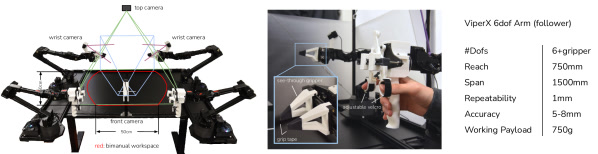
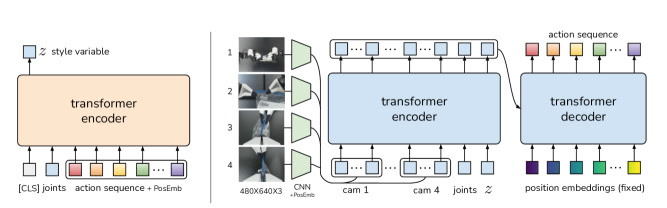
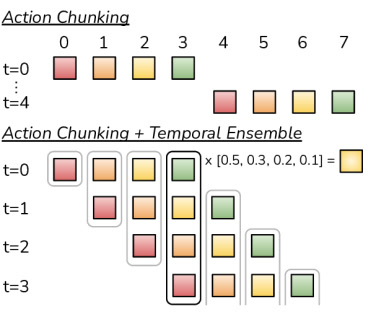

# ACT / ALOHA：低成本双臂精细操作

> 这是一份给"完全没接触过 AI / 机器人"的读者写的精读笔记。所有专业词第一次出现都会解释清楚，并用生活场景打比方。

## 一句话讲什么（TL;DR）

用约 2 万美元搭一套"主从臂遥操 + 四摄像头"的双臂系统（ALOHA），让人示范 50 次约 10 分钟，再用 ACT 算法让机器人**一次预测未来 100 步动作**而不是一步一步猜——开调料杯、插电池这类毫米级精细活，成功率能到 80–96%。

*所以这一节是想说：这篇论文同时解决了"买不起高端机器人"和"模仿学习误差滚雪球"两个问题，硬件和算法缺一不可。*

---

## 这是个什么场景

周末你瘫在沙发上，对厨房里的机器人喊：

> "帮我把遥控器里的电池插进去。"

对人类来说，这不过是：拿起电池 → 对准槽 → 轻轻推到底。对机器人来说，每一步都是地狱模式：

- 电池槽里有一根弹簧，你推电池时遥控器会**反向滑动**，另一只手必须按住。
- 电池和槽的间隙只有几毫米，推偏一点就卡住。
- 透明或半透明的物体（调料杯、保鲜袋）在普通深度相机眼里几乎"隐形"。

更现实的问题是：**专业双臂示教系统动辄几十万美元**，普通实验室根本买不起。就算买了，传统模仿学习（Behavior Cloning，行为克隆——给观察、学动作，像监督学习）还有一个老毛病叫**复合误差**：第一帧偏 1 毫米，第二帧基于"已经偏了"的画面再偏 1 毫米，十步之后完全跑偏，像学骑自行车时只看完美视频、从不练"歪了怎么修"。

Tony Zhao 等人（Stanford + UC Berkeley + Meta）在 RSS 2023 提出 **ALOHA**（硬件）+ **ACT**（Action Chunking with Transformers，用 Transformer 做动作分块的算法），目标很明确：**低成本硬件 + 聪明的学习方式 = 精细双手操作也能学**。

*所以这一节是想说：论文要解决的是"便宜机器人能不能做细活"以及"少样本模仿怎么不翻车"——两个痛点同时存在。*

---

## 之前的人怎么做的，为什么不够好

研究者之前主要走了三条路，每条在"精细操作"场景下都有硬伤：

**路 A：行为克隆（BC）逐步预测**

做法：每一帧输入摄像头画面 + 关节角度，网络输出**下一帧**该做什么动作。类比：你教小孩写字，只允许他看笔尖前 1 毫米——每一笔都微抖，一行字越写越歪。

问题：**复合误差**（compounding error）。论文 Table I 显示，BC-ConvMLP 在真实任务 Slot Battery 上最终插入成功率 **0%**；在模拟任务 Bimanual Insertion 上插入成功率仅 **1%**（人类数据）。

**路 B：在线纠偏（DAgger 等）**

做法：让机器人在执行中偏离轨迹时，专家实时标注"此时应该怎么做"。

问题：精细操作里，偏离往往已经不可逆；遥操作时专家也很难在 50Hz 下持续纠错。论文明确说：对 fine manipulation，演示时注入噪声会直接导致任务失败。

**路 C：高端硬件 + 任务空间遥操**

做法：用 Franka、Shadow Hand、VR 手柄做末端位姿映射，配合力反馈手套。

问题：单臂 Franka 约 2–3 万美元；Shadow 双臂遥操系统 **40 万美元以上**。6 自由度机械臂在奇异点附近逆运动学（IK，Inverse Kinematics——从"手要到哪"反算"各关节转多少"）频繁失败，精细操作恰恰常工作在奇异点附近。

**结论**：缺的不是"会不会 BC"，而是 **(1) 买得起的示教硬件** 和 **(2) 适合高频视觉闭环的输出结构**。

*所以这一节是想说：逐步 BC 误差累积、DAgger 不现实、贵硬件不普惠——ACT/ALOHA 从硬件和算法两侧同时换路。*

---

## 这篇论文的新想法

论文贡献可以拆成两块，像"造好厨房"和"写好菜谱"：

**硬件侧 ALOHA**：两套比例缩放的商用臂——人操作小臂 WidowX（约 3300 美元），大臂 ViperX（约 5600 美元/台）跟随，**关节空间直接映射**（leader 转 30°，follower 也转 30°），不用算 IK。加 3D 打印"手柄+剪刀"机构减轻回驱阻力，四路 Logitech 网络摄像头（480×640），整套 **约 2 万美元**。

**算法侧 ACT**：三个环环相扣的设计——

1. **Action Chunking（动作分块）**：不预测下一帧，一次预测未来 **k=100 步**（每步 14 维关节目标），有效决策 horizon 缩短 100 倍。
2. **Temporal Ensembling（时序集成）**：每个时刻都重新 query 策略，对"同一时刻被多次预测的动作"做指数加权平均，动作更平滑。
3. **CVAE 训练目标**：人示范本身有多模态（同一种观察有多种合法轨迹），用条件变分自编码器建模，避免"求平均"产生怪动作。

*所以这一节是想说：ALOHA 解决"数据从哪来、贵不贵"，ACT 解决"怎么从少量噪声示范里学出稳定精细策略"。*

---

## 它分几步做的（方法）

<!-- paper-figures:begin -->



*上图说明：Figure 1（ar5iv 原图）（论文原图）。*



*上图说明：Figure 2（ar5iv 原图）（论文原图）。*



*上图说明：Figure 3（ar5iv 原图）（论文原图）。*
<!-- paper-figures:end -->

### 5.1 ALOHA 硬件：输入 → 处理 → 输出

**输入**：操作者双手回驱 leader 臂（WidowX 250，6 DoF + 夹爪）；四路 RGB 图像。

**处理**：
- **关节空间映射**：leader 关节角 → 实时同步 → follower（ViperX 300）关节角。好处：(1) 不跑 IK，6 DoF 无冗余臂在奇异点附近仍可控；(2) leader 自重阻尼，人不会动太快。
- **"Handle and Scissor" 机构**：3D 打印件降低回驱力，夹爪可连续开合而非二值开关。
- **橡胶筋配重**：部分抵消 leader 重力，支持 **>30 分钟**连续遥操。
- **自定义透明手指 + 防滑胶带**：薄边可 Pry 开盖，透视线缆不挡视野。

**输出**：
- Follower 双臂各 7 DoF（6 关节 + 1 夹爪）= **14 维动作**（绝对关节目标位置）。
- 四相机：顶视、前视（旋转 90° 扩垂直视野）、左右腕部相机。
- 控制与录制频率：**50 Hz**（论文 user study：降到 5 Hz，完成时间慢 **62%**，p < 0.001）。

**关键规格**：

| 组件 | 参数 |
|------|------|
| Follower 臂 | ViperX 6-DoF，payload 750g，臂展 1.5m，重复精度 5–8mm |
| Leader 臂 | WidowX 250，约 3300 USD |
| 单台 Follower | 约 5600 USD（现货） |
| 整套预算 | 约 20000 USD（含相机、框架） |
| 图像 | 4× Logitech C922x，480×640 RGB |
| 动作维度 | 14（双臂各 7） |

*所以这一节是想说：ALOHA 的核心设计是"关节直连 + 高频视觉 + 低成本"，用结构换精度，而不是靠贵传感器。*

---

### 5.2 数据采集：示范里到底记什么

**输入**：人通过 ALOHA 遥操完成任务。

**处理**：
- **动作标签用 leader 关节位置**，不用 follower 的——因为 leader/follower 之间的位置差隐含了"用了多大力"（低层 PID 控制器负责跟踪）。
- **观察** = follower 当前关节位置 + 四路 RGB 图像。
- 每个 episode **8–14 秒**（50 Hz 下约 400–700 步）。
- 每任务 **50 条**示范（Thread Velcro 100 条），合计约 **10–20 分钟**有效操作数据；含重置和失误，墙钟时间约 30–60 分钟。

**输出**：(观察, 未来动作序列) 训练对。

*所以这一节是想说：数据极省——每个任务不到一小时人类劳动，但要求 50Hz 精细遥操，ALOHA 为此做了大量机械设计。*

---

### 5.3 ACT 网络结构

论文 Figure 2 的架构可以用下面 ASCII 概括：

```
训练时:
  [示范动作 a_{t:t+k}] + [关节位置] ──▶ CVAE Encoder (BERT式) ──▶ z (风格变量)
                                                                    │
  [4×RGB 图] + [关节] + [z] ──▶ ResNet18×4 ──▶ Transformer Encoder ──┼──▶ Transformer Decoder ──▶ â_{t:t+k} (k×14)
                                                                    
推理时: 丢弃 Encoder，z := 0（先验均值），输出确定性动作块
```

**CVAE Encoder（仅训练用）**
- **输入**：`[CLS]` token + 关节位置 embedding + 长度 k 的动作序列 embedding → 长度 k+2 的序列。
- **处理**：4 层 Transformer Encoder（hidden 512, 8 heads）。
- **输出**：对角高斯分布的 μ, σ → 采样 **z**（风格变量，类似"这次示范是哪种操作风格"）。

**CVAE Decoder / Policy（推理时的策略）**
- **输入**：
  - 4 张 480×640 图 → ResNet18 → 15×20×512 feature map → 展平为 300 token/图 → 加 2D 正弦位置编码 → 共 **1200×512**；
  - 关节位置、z 各线性投影到 512 维；
  - 合计 **1202×512** 进 Transformer Encoder（4 层）。
- **处理**：Transformer Decoder（7 层）用 cross-attention 读 encoder 输出；query 为 k 个固定位置 embedding。
- **输出**：MLP 投影为 **k×14** 张量 = 未来 k 步双臂关节目标。默认 **k=100**。

**损失函数**（Algorithm 1）：

$$\mathcal{L} = \underbrace{\text{MSE}(\hat{a}_{t:t+k}, a_{t:t+k})}_{\text{重建：预测像不像示范}} + \beta \underbrace{D_{KL}(q_\phi(z|\cdot) \| \mathcal{N}(0,I))}_{\text{正则：z 别乱飘}}$$

- 重建用 **L1** 而非 L2（作者发现 L1 对精细动作更准）。
- **β = 10**（Table III）。
- 动作是绝对关节位置，不是 delta（增量）；用 delta 性能下降。

**规模与速度**：约 **80M** 参数；单卡 RTX 2080 Ti（11GB）训练约 **5 小时**；推理约 **0.01 秒**。

**超参数（Table III 原文）**：lr=1e-5，batch=8，encoder 4 层 / decoder 7 层，ff dim=3200，hidden=512，heads=8，dropout=0.1。

*所以这一节是想说：ACT = 多视角 ResNet + Transformer 序列模型 + CVAE，一次吐出 100 步 14 维动作，而不是单步回归。*

---

### 5.4 Action Chunking：为什么一次预测 100 步

**朴素 chunking**：每 k 步看一次图，生成 k 步，依次执行——像每 100 米才看一次路，中间闭着眼走，容易 jerk（ jerk = 动作突变）。

**ACT 的做法**（Figure 3 逻辑）：

```
时刻 t:   预测 [a_t, a_{t+1}, ..., a_{t+k-1}]
时刻 t+1: 预测 [a_{t+1}, ..., a_{t+k}]      ← 与上一段重叠 k-1 步
...
同一绝对时刻 t* 会被多个 chunk 预测 → Temporal Ensemble 加权融合
```

**Temporal Ensembling 公式**：

$$w_i = \exp(-m \cdot i), \quad a_t = \frac{\sum_i w_i A_t[i]}{\sum_i w_i}$$

- $A_t[i]$：第 i 个"预测来源"对时刻 t 的动作估计；
- $w_0$ 对应**最旧**的预测；$m$ 越小，越信任新预测。

**输入 → 处理 → 输出**：
- 输入：FIFO 缓冲区里同一时刻的多个预测；
- 处理：指数加权平均；
- 输出：平滑后的单步执行动作。

**消融**（Figure 6a，4 设定平均）：k=1 成功率 **1%** → k=100 **44%** → k=200/400 略降（太 open-loop，缺反应性）。

*所以这一节是想说：chunking 降 horizon 是核心增益；temporal ensembling 是免费午餐，只增推理计算、不增训练成本。*

---

### 5.5 CVAE：为什么要"风格变量"

**问题**：同一张桌子、同一个扎带，人每次 handover 位置都不同——若 BC 学"平均轨迹"，可能两只手相撞。

**CVAE 训练时**：Encoder **偷看**完整示范动作序列 + 关节状态，压缩成 z；Decoder 必须靠 z + 当前观察重建整段动作。

**推理时**：z := **0**（标准正态先验均值），输出确定性策略，方便评测。

**消融**（Figure 6c）：
- 脚本数据（确定性）：去掉 CVAE ≈ 无差别；
- **人类数据**：有 CVAE **35.3%** vs 无 CVAE **2%** —— CVAE 对人类噪声示范几乎必需。

*所以这一节是想说：CVAE 不是花活，而是"多种合法示范怎么不糊成一锅"的关键；对脚本数据可有可无，对人手数据生死攸关。*

---

### 5.6 八个任务各自在考什么（实验设计）

论文在 **MuJoCo 模拟 2 项 + 真实 6 项** 上评测，全部要求**双手 + 毫米级 + 视觉闭环**：

| 任务 | 难点（一句话） |
|------|----------------|
| **Slide Ziploc** | 右夹滑扣、左夹袋身；袋半透明、皱褶干扰感知 |
| **Slot Battery** | 电池入槽 + 左臂按住遥控器（弹簧反推） |
| **Open Cup** | 右指弹倒小杯 → 左夹抬起 → 右指 Pry 开盖（不能捏杯身） |
| **Thread Velcro** | 空中穿 3mm×25mm 环；第一次抓偏会在插入阶段放大到 >10mm |
| **Prep Tape** | 裁胶带 → 空中 handover → 贴盒边（双臂时序严格） |
| **Put On Shoe** |  tight fit 穿鞋 + 粘扣带；松手后鞋不能掉 |
| **Transfer Cube (sim)** | 右臂拾 cube 放入左夹爪，间隙 ~1cm |
| **Bimanual Insertion (sim)** | 空中 peg-in-socket，插入间隙 ~5mm |

**随机化**：真实任务物体沿 15cm 白线随机放置；模拟任务在 2D 区域均匀采样——测的是**闭环纠偏**，不是死记坐标。

**对比基线**：BC-ConvMLP、BeT（Transformer 但单步 + 冻结视觉 encoder）、RT-1（离散 action bin + 历史）、VINN（测试时检索最近邻示范）。ACT 是唯一 **连续动作 + chunking + 联合训练视觉** 的组合，动机就是 fine manipulation 需要亚厘米精度，离散 bin 不够。

*所以这一节是想说：任务设计刻意选"低对比度感知 + 双臂协调 + 接触丰富"，不是 pick-and-place 玩具题。*

---

## 关键数字（What works）

以下数字均来自论文 Table I–II 与系统配置段；**粗体**为 ACT 相对基线的决定性差距。

### 主实验成功率（%）

**Table I — 模拟 + 2 个真实任务（最终阶段 Insert / Open / Place 等）**

| 方法 | Cube Transfer (sim, 人类数据) Transfer | Bimanual Insert (sim, 人类数据) Insert | Slide Ziploc (real) Open | Slot Battery (real) Insert |
|------|----------------------------------------|----------------------------------------|--------------------------|----------------------------|
| BC-ConvMLP | 17 | 0 | 1 | 0 |
| BeT | 51 | 1 | 4 | 0 |
| RT-1 | 33 | 0 | 0 | 0 |
| VINN | 9 | 0 | 1 | 0 |
| **ACT** | **90** | **50** | **88** | **96** |

**Table II — 其余 4 个真实任务（最终成功）**

| 任务 | BeT | ACT |
|------|-----|-----|
| Open Cup（开调料杯） | 0% | **84%** |
| Thread Velcro（穿扎带） | 0% | **20%** |
| Prep Tape（裁胶带挂盒边） | 0% | **64%** |
| Put On Shoe（穿鞋） | 0% | **92%** |

### 训练与系统

| 项目 | 数值 |
|------|------|
| 示范数量/任务 | 50（Thread Velcro: 100） |
| 示范时长/任务 | ~10–20 分钟 |
| Chunk size k | 100 |
| 参数量 | ~80M |
| GPU 训练 | ~5 h / RTX 2080 Ti |
| 推理延迟 | ~0.01 s |
| 控制频率 | 50 Hz |

*所以这一节是想说：ACT 相对 BeT/RT-1 不是小幅提升，而是在多个真实精细任务上从"几乎做不了"到"80%+ 可用"；Thread Velcro 仍是短板（感知难）。*

---

## 实验结果说明了什么

1. **Action chunking 是通用技巧**：给 BC-ConvMLP、VINN 也加上 chunking，成功率随 k 增大而升——不只 ACT 专属，但 ACT 仍大幅领先（Figure 6a）。

2. **Temporal ensembling 白捡 3.3%**（ACT）到 4%（BC-ConvMLP），对检索式 VINN 反而有害（Figure 6b）——平滑的是参数模型的预测噪声，不是检索误差。

3. **50Hz 控制对精细任务必要**：穿扎带 5Hz 平均 33s vs 50Hz 20s；分杯 16s vs 10s。

4. **失败模式可解释**：Thread Velcro 从第一阶段 92% 逐段跌到最终 20%——黑色扎带在黑色桌面占像素极少，Stage 2 过早闭合夹爪、Stage 3 插入不准是主因。

5. **ACT 也学不会的任务**： unwrap candy（50 示范，10 试全失败在"撕开"阶段——包装缝合线视觉不可辨）；平放 ziploc 袋的中段空中调整——透明袋形变敏感。

*所以这一节是想说：实验支持"chunking + CVAE + 高频视觉"叙事，但也诚实展示感知极限和 open-loop chunk 的上界。*

---

## 你应该懂的几个新词

- **Behavior Cloning（BC，行为克隆）**：监督学习式模仿——观察 → 动作。简单但有复合误差。
- **Compounding Error（复合误差）**：每步小错改变下一帧输入分布，误差滚雪球；fine manipulation 里毫米级即致命。
- **Action Chunking（动作分块）**：一次预测未来 k 步而非 1 步；有效 horizon ÷ k。
- **Temporal Ensembling（时序集成）**：重叠 chunk 对同一时刻的预测做指数加权平均。
- **CVAE（Conditional VAE，条件变分自编码器）**：训练时把动作序列压成 latent z，推理时 z=0；处理多模态示范。
- **Teleoperation（遥操作）**：人远程操控机器人；ALOHA 用主从关节映射。
- **Joint-space mapping（关节空间映射）**：直接同步关节角，不做末端 IK。
- **Pixel-to-action**：端到端从 RGB 像素到关节命令，不建显式物理模型。

*所以这一节是想说：掌握这 8 个词，就能跟读后续 Mobile ALOHA、Diffusion Policy、UMI 时不迷路。*

---

## 它有什么搞不定的

1. **多指协同**：儿童安全药瓶（一手压盖、一手旋盖）需要多指，平行夹爪做不到。
2. **大扭矩任务**：拧死瓶盖、开易拉罐、重物 lifting——Dynamixel 电机扭矩不足。
3. **指甲级操作**：揭胶带起始边、开铝罐——薄夹爪仍不够。
4. **极端感知**：透明/半透明物体 + 低对比度小物体（Thread Velcro、平放 ziploc）成功率骤降。
5. **长 horizon open-loop**：k 过大（200–400）性能回落——仍需足够频繁的视觉闭环。
6. **单任务从头训**：每个任务单独训练 80M 模型 5 小时，无跨任务泛化（后续 Mobile ALOHA 才扩数据）。
7. **无 force/tactile**：纯视觉 +  proprioception（本体感觉 = 关节角度），靠 PID 隐式力控，极限接触任务受限。

*所以这一节是想说：ALOHA/ACT 是"低成本精细操作"的重要一步，不是万能手。*

---

## 它和别的几篇是什么关系

- **上游 · DAgger**：在线纠偏路线；ACT 选择 offline + 改输出结构，避免专家实时标注。
- **同期 · Diffusion Policy（Chi et al. 2023）**：同样用 action chunk、解决多模态；DP 用扩散模型拟合动作分布，表达力更强但推理更慢。社区常并论。
- **下游 · Mobile ALOHA / ALOHA 2**：同团队把 ALOHA 装到底盘、扩数据到千级，ACT 仍是默认 baseline。
- **对照 · RT-1 / OpenVLA**：海量多任务 + VLM 主干 vs ACT 单任务少样本专精——两条路线正融合（大模型先验 + chunk 结构下游精控）。
- **互补 · UMI（本站 Ch14）**：UMI 解"数据采集成本"，ACT 解"怎么从示范学"；UMI 部署端常用 Diffusion Policy，但 chunking 思想同源。

*所以这一节是想说：ACT 是 imitation learning 从"BC 太弱"到"BC+结构就够细"的范式转折点。*

---

## 和本导读的关系

本章对应 **[Ch14: 模仿学习——DAgger / ACT-ALOHA / UMI](../guide/ch14-imitation-learning.md)** 的第 3 节核心案例。建议阅读顺序：

1. Ch14 §2 理解 BC 复合误差；
2. 读本笔记 Method（5.3–5.5）；
3. Ch13 Diffusion Policy 对比"chunk + 生成模型"的另一条实现；
4. Ch12 OpenVLA 看"通用 VLA"与"专精 ACT"如何分工。

ALOHA 硬件细节在 Ch14 有系统展开；本笔记补充 Table I/II 原始数字与 CVAE 消融。

*所以这一节是想说：把 Ch14 当叙事线，本笔记当 Table 级机制与数字手册。*

---

## 思考题

**Q1：为什么 ACT 用 leader 关节位置当 action label，而不是 follower 的实际关节位置？**

<details>
<summary>提示</summary>

想 PID 跟踪误差与"隐式力"的关系：leader 目标 vs follower 实测的差值，低层控制器用了多大力去追？

</details>

**Q2：k=100 时有效 horizon 缩短 100 倍，为什么 k 继续增大到 200/400 反而掉点？**

<details>
<summary>提示</summary>

分两种 failure：复合误差 vs 开环反应迟钝。chunk 太长 = 很久才重新看图。

</details>

**Q3：CVAE 推理时为什么设 z=0 而不是随机采样？**

<details>
<summary>提示</summary>

训练先验是 N(0,I)；评测要可重复；随机 z 会让同一观察产生不同动作块。

</details>

**Q4：Temporal Ensembling 和"对相邻时刻动作做滑动平均"有什么本质区别？**

<details>
<summary>提示</summary>

论文强调 aggregate **同一 timestep 的多个预测**，不是相邻 timestep——后者会引入 bias。

</details>

**Q5：Thread Velcro 第一阶段 92% 但最终只有 20%，你会优先改算法还是改感知？**

<details>
<summary>提示</summary>

看 failure mode：夹爪过早闭合、插入 miss——更像"看不清扎带在哪"还是"动力学学不会"？

</details>

**Q6：ALOHA 选 joint-space 而非 task-space（VR 末端位姿）的两个工程理由是什么？**

<details>
<summary>提示</summary>

6 DoF 无冗余 + 精细操作常在奇异点附近；leader 自重阻尼限制人手速度。

</details>

**Q7：若把控制频率从 50Hz 降到 5Hz 但数据量 ×10，你认为 ACT 能否补回来？**

<details>
<summary>提示</summary>

对照 user study：5Hz 人 teleop 慢 62%。低频丢的不只是数据量，还有闭环修正机会。

</details>

---

## 一些好奇心问答（FAQ）

**ALOHA 名字什么意思？**  
**A**loha = **A** Low-cost **O**pen-source **H**ardware **A**ssystem（低成本开源硬件系统），双关夏威夷问候语。

**2 万美元贵不贵？**  
相对 Shadow 40 万+、DexPilot 10 万级，是"实验室买得起的双臂"；相对单臂 WidowX 数据收集平台，是"为精细双手操作专门设计的溢价"。

**ACT 和 ChatGPT 的 Transformer 是一回事吗？**  
同族不同任务：这里 Transformer 编码多相机 + 解码 **动作序列**，不是 token 文本；CVAE Encoder 借鉴 BERT 的 [CLS] 设计。

**能否用 ACT 训 OpenVLA？**  
思路可借（chunking、temporal ensemble），但 OpenVLA 走离散 action token + 多任务大数据；ACT 是单任务 continuous joint BC。

---

## 如果你想再深入

1. **项目主页 + 视频**：https://tonyzhaozh.github.io/aloha — 先看 teleop 能力再读 Method。
2. **Hardware Appendix A**：与 Shadow / DexPilot 成本能力对照表。
3. **Follow-up**：Mobile ALOHA（2024）看移动家务；ALOHA 2 看硬件迭代。
4. **对比阅读**：本站 `diffusion-policy.md`（Ch13）— 另一种 chunk + 生成式动作建模。
5. **复现**：Interbotix ViperX/WidowX + 开源 CAD — 非专家 **<2 小时**组装（论文 claim）。

---

## 原文信息

```bibtex
@inproceedings{zhao2023act,
  title     = {Learning Fine-Grained Bimanual Manipulation with Low-Cost Hardware},
  author    = {Tony Z. Zhao and Vikash Kumar and Sergey Levine and Chelsea Finn},
  booktitle = {Robotics: Science and Systems (RSS)},
  year      = {2023},
  url       = {https://arxiv.org/abs/2304.13705}
}
```

- **arXiv**：[2304.13705](https://arxiv.org/abs/2304.13705)
- **Project**：https://tonyzhaozh.github.io/aloha
- **机构**：Stanford University, UC Berkeley, Meta
