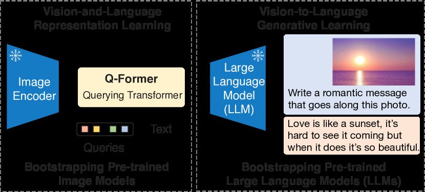
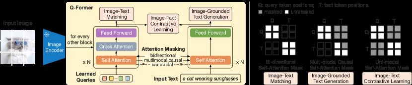
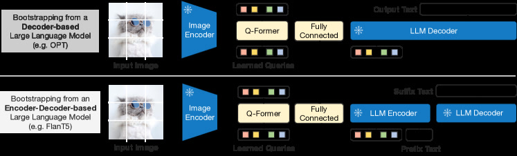

# BLIP-2: Bootstrapping Language-Image Pre-training with Frozen Image Encoders and Large Language Models

> 这是一份给"完全没接触过 AI"的读者看的精读笔记。语言尽量像聊天，公式全部翻译成人话。

## 一句话讲什么（TL;DR）

不动两个大模型——一个负责看图、一个负责说话——只在中间训练一个小"翻译官"，就让 AI 学会了看图说话，而且比动辄 800 亿参数的 [Flamingo](flamingo.md) 效果更好、成本低一个数量级。

*所以这一节是想说：BLIP-2 证明了"只训中间桥、两端全冻"也能做到顶尖 VLM 效果。*

---

## 这是个什么场景

你出去玩拍了一堆照片，想让手机帮你"看图写文案"。市面上"看得懂图"的模型（比如 ViT、[CLIP](clip.md)）只会把图编成一堆数字，不会说人话；而"会说人话"的大模型（比如 GPT、OPT）只读得懂文字，看不见图。两边都已经被人花了几亿美元训好了，你不可能为了这一个需求把它们重新烧一遍。

换个生活类比：你雇了一个**只会看画不会说话的画家**和一个**只会写文章但眼睛蒙着的作家**，两位都是大师级，但互相听不懂对方的话。之前别人解决这问题，要么把两位大师关起来重新一起培训（端到端训练，烧钱），要么在作家脑子里插很多"看图电极"（[Flamingo](flamingo.md) 的做法，复杂）。

BLIP-2 的做法：雇一个**便宜的小翻译**站中间，画家和作家原地不动、脑子一点不改，只让小翻译反复练习"怎么把画家看到的东西，转述成作家爱听的话"。两位大师加起来几十上百亿参数全部冻住，真正在训练的只有 1.88 亿参数的小翻译——**成本一下降了 54 倍**。

*所以这一节是想说：BLIP-2 用一个极小的桥梁模块连接了两个冻结的巨型模型，开创了"参数效率极高"的 VLM 路线。*

---

## 之前的人怎么做的，为什么不够好

- **方案 A：端到端联合训练**（[BLIP](blip.md)-1、SimVLM、CoCa）。图像编码器 + 文本解码器一起训，效果好但训练成本巨大，每出一代新视觉/语言主干都得从头烧一遍。
- **方案 B：冻结视觉、微调 LLM**（Frozen、ClipCap）。让视觉特征通过简单 projector 接进语言模型再 fine-tune LLM。问题是 LLM 越大越不敢动它，而且微调会导致灾难性遗忘。
- **方案 C：冻结 LLM、在内部插层**（[Flamingo](flamingo.md)）。在 LLM 每隔几层插入 cross-attention 的 GATED XATTN-DENSE 层，效果强但工程成本高——你得改 LLM 内部结构，换一个 LLM 就得重新设计插入点。
- **方案 D：[CLIP](clip.md) 类对比学习**。图文对齐能力强，但天然不会生成自然语言——只能"选"不能"说"。
- **核心痛点**：要么算力贵（A），要么要侵入式改 LLM 内部（C），要么只对齐不会生成（D），要么微调导致遗忘（B）。

*所以这一节是想说：在 BLIP-2 之前，没有人找到"两端全冻 + 桥梁极轻 + 效果还好"的方案。*

---

## 这篇论文的新想法

**核心洞察三层递进**：

第一层：**两端都不动**。视觉编码器和 LLM 全程冻结，参数完全不更新。就像装修房子时不动承重墙，只在中间加一道隔断。明天 EVA-CLIP 出新版、LLM 换成更强的，不用重训。

第二层：**只训中间一个 Q-Former 小模块**。Q-Former 内部有 32 个**可学习的 Query 向量**——想象 32 个带着固定问题清单的面试官，通过 cross-attention 反复向冻结的图像特征"问问题"，把一整张图压缩成 32 个语义向量。这 32 个向量就是图像的"压缩摘要"。

第三层：**两阶段训练**。第一阶段让 Q-Former 学会"从图里提取对语言有用的信息"（表征学习）；第二阶段让 Q-Former 的输出直接当 LLM 的"软提示"，让 LLM 在冻结状态下做生成（生成学习）。两阶段解耦，各自聚焦一个目标。

*所以这一节是想说：核心创新是"32 个可学习 Query 通过信息瓶颈强制提炼视觉精华"，加上"两阶段训练把对齐和生成解耦"。*

---

## 它分几步做的（方法）

<!-- paper-figures:begin -->



*上图说明：Figure 1（ar5iv 原图）（论文原图）。*



*上图说明：Figure 2（ar5iv 原图）（论文原图）。*



*上图说明：Figure 3（ar5iv 原图）（论文原图）。*
<!-- paper-figures:end -->

把整件事想成"训练一位外交口译"：这位口译需要先学会"从画家的画里提炼关键信息"（第一阶段），再学会"把关键信息翻译成作家听得懂的话"（第二阶段）。

### Step 1. Q-Former 的内部结构：32 个面试官的工作台

**类比**

你是一家大公司的 HR 总监，面试时间紧，只能派 32 个面试官。每个面试官有自己擅长的方向——有的专问技术、有的专问沟通、有的专问领导力。面试完一位候选人后，32 个面试官各写一段评语交给老板决策。

Q-Former 就是这"32 人面试团"。

**它在干什么**

Q-Former 本质上是一个 BERT 风格的 Transformer，但有两路输入并行运作：

1. **左路：32 个可学习 Query 向量**（每个 768 维）——这就是那 32 个面试官。它们是随机初始化的，训练中慢慢学出各自"擅长问什么"。
2. **右路：文本 token**——在第一阶段的某些任务中会用到（比如需要判断图文是否匹配时）。

Q-Former 内部有**三种注意力交互**：

| 注意力类型 | 谁问谁 | 作用 |
|-----------|--------|------|
| Query self-attention | 32 个 Query 互相看 | 让面试官们协调，避免问重复问题 |
| Query-to-Image cross-attention | Query 去看冻结的图像特征 | 面试官从图里"采信息" |
| Query-Text self-attention | Query 和文本 token 互相看 | 让面试官的采信息过程受文本引导 |

这三种注意力通过**不同的 mask 策略**在三个训练任务间切换——这是 Q-Former 最精巧的设计。

**为什么要用 BERT 初始化而不是从零训？**

Q-Former 的权重从 BERT-base 预训练模型初始化。这不是偷懒，而是深思熟虑：BERT 已经有了基础的文本理解能力和注意力模式，Q-Former 只需要在此基础上"学会看图"，比从零开始快得多。消融实验确认：BERT 初始化比随机初始化高约 2-3 分。

**32 个 Query 为什么是"信息瓶颈"？**

ViT-G 的图像编码器输出约 256 个 patch token（每个 1408 维）。如果直接把这 256 个 token 全丢给 LLM：
- LLM 要处理 256 个额外 token，attention 计算量暴增
- 大量 token 是冗余的（天空、纯色背景、重复纹理）
- LLM 不知道哪些视觉信息对当前任务重要

32 个 Query 强制 Q-Former 做"信息选择"——只保留对语言任务最重要的 32 条信息。这个压缩比约 8:1，好处是：计算量常数级、迫使模型学会抽象、过滤掉噪声。

**和 [Flamingo](flamingo.md) Perceiver Resampler 的对比**

| 维度 | Perceiver Resampler (Flamingo) | Q-Former (BLIP-2) |
|------|------|------|
| 查询数 | 64 | 32 |
| 参数初始化 | 随机 | BERT-base |
| 训练信号 | 只靠下游 LM loss | 三种自监督损失 (ITC+ITM+ITG) |
| 与 LLM 的关系 | 在 LLM 内部插入 cross-attn | 只在 LLM 输入端拼 soft prompt |
| 工程可移植性 | 差（换 LLM 要重设计插入点） | 好（换 LLM 只改 Linear 维度） |

*所以这一节是想说：Q-Former 是一个"带限额的面试团"——32 个 Query 从海量图像特征中只提取最精华的 32 条摘要，比 Flamingo 的 64 个 Query 更紧凑但更高效。*

---

### Step 2. 第一阶段：表征学习——让口译学会"从画里提炼关键信息"

**类比**

口译的第一课不是翻译，而是"理解画家在画什么"。老师拿来一堆画和对应的文字描述，让口译做三种练习：
- 练习 1：看一幅画，写出关键词，看看和真实描述是否匹配（对比学习）
- 练习 2：看一对（画，描述），判断这是不是同一幅画的描述（匹配判断）
- 练习 3：只看画，试着自己写出描述（生成练习）

**它在干什么**

第一阶段冻结视觉编码器（ViT-L/14 或 EVA-CLIP ViT-G），只训 Q-Former。三个损失函数联合优化：

**ITC（Image-Text Contrastive，图文对比）**

做的事：让 Q-Former 的 Query 输出和文本的 [CLS] 表征在同一空间对齐。

具体机制：
- Query 通过 cross-attention 看图像特征，得到 32 个输出向量
- 文本走 Q-Former 的文本编码路径，得到 [CLS] 向量
- 对 32 个 Query 输出分别和 [CLS] 算相似度，取最大值作为图文相似度
- 用 InfoNCE loss 拉近匹配对、推远不匹配对

Mask 策略：Query 和 Text 之间**不互相看**（bi-directional masking），避免信息泄露。

**ITM（Image-Text Matching，图文匹配）**

做的事：细粒度二分类——给一对（图，文），判断是否匹配。

具体机制：
- Query 既看图像（cross-attention）也看文本（self-attention 中 Query 和 Text 互相可见）
- 每个 Query 的输出过一个二分类头，32 个结果投票得出最终匹配概率
- 用 hard negative mining（选最难的不匹配对）提高学习效率

Mask 策略：Query 和 Text **双向可见**，因为任务需要对两者做细粒度对比。

**ITG（Image-grounded Text Generation，图文生成）**

做的事：给定图像，让 Q-Former 自回归生成对应文本。

具体机制：
- Query 通过 cross-attention 看图像
- Text 部分用 causal mask（因果掩码）——每个 text token 只能看到前面的 token
- Query 对 Text 可见（Text 的生成可以参考 Query 从图里提取的信息）
- 但 Text 对 Query 不可见（防止 Query "偷看答案"）

Mask 策略：**单向**——Query -> Text 可见，Text -> Query 不可见。

**三种 mask 的对比**

| 任务 | Query 看 Image | Query 看 Text | Text 看 Query |
|------|---------------|---------------|---------------|
| ITC | Yes (cross-attn) | No | No |
| ITM | Yes (cross-attn) | Yes (bi-dir) | Yes (bi-dir) |
| ITG | Yes (cross-attn) | No (causal) | Yes (causal) |

这三种 mask 共用同一个 Q-Former 网络，只是在 self-attention 层换不同的 mask 矩阵——工程上非常优雅，不需要三份参数。

**第一阶段的训练数据**

约 1.29 亿图文对：COCO (11.5 万)、Visual Genome (10 万)、CC3M (300 万)、CC12M (1200 万)、SBU (100 万)、LAION-400M 子集 (1.15 亿)。

**第一阶段完成后 Query 的状态**

经过三任务联合训练，32 个 Query 已经学会了：
- 从图像中提取语义信息（ITC 教的）
- 区分细粒度图文关系（ITM 教的）
- 按语言逻辑组织视觉信息（ITG 教的）

此时 Query 输出已经是"对语言任务友好的视觉摘要"了。

*所以这一节是想说：第一阶段用三个互补的任务教会 Q-Former "怎么从图里提取对语言有用的信息"，三种 mask 让同一个网络扮演三种角色。*

---

### Step 3. 第二阶段：生成式预训练——让口译学会"翻译成作家听得懂的话"

**类比**

口译的第二课：拿着你提炼的关键信息摘要，递给作家。但作家说的是"另一种语言"（LLM 的 embedding 空间），你得先把摘要"翻译"成作家能懂的格式。

**它在干什么**

1. Q-Former 照常接收图像特征，输出 32 个 Query 向量（每个 768 维）
2. 这 32 个向量过一个**线性投影层（FC layer）**，从 768 维映射到 LLM 的词嵌入维度（比如 OPT 是 2048 维，FlanT5 是 2048 维）
3. 投影后的 32 个向量当作"软提示（soft prompt）"，拼在文本 token 前面，送入冻结的 LLM
4. LLM 自回归生成图像描述

**为什么只需要一层线性投影？**

因为第一阶段已经把 Query 训成了"对语言友好的摘要"——它们已经在语义空间里了，只需要一次简单的维度变换就能进入 LLM 的 embedding 空间。如果第一阶段没做好，这里的线性投影是不够用的。

**支持两种 LLM 架构**

| LLM 类型 | 代表 | 训练目标 | 效果 |
|----------|------|----------|------|
| Decoder-only | OPT-2.7B/6.7B | 预测下一个 token | 54.3 (VQAv2) |
| Encoder-Decoder | FlanT5-XL/XXL | encoder 看图, decoder 生文 | 65.0 (VQAv2) |

FlanT5-XXL 效果更好——因为 encoder-decoder 架构天然适合"条件生成"格式，加上 FlanT5 经过指令微调有更强的任务理解能力。

**为什么 LLM 不需要微调？**

LLM 的 attention 机制天然能处理任何连续向量输入——只要这些向量在它的 embedding 空间里有意义。线性投影确保了 Q-Former 的输出在 LLM 空间里是"有意义的语义点"，LLM 把它们当作"前缀上下文"来处理。

*所以这一节是想说：第二阶段就做一件事——把 Q-Former 的输出"翻译"成 LLM 能理解的格式，让 LLM 在冻结状态下生成文本。一层 Linear 就够了，因为第一阶段已经打好了基础。*

---

### Step 4. 整体数据流和参数效率

**完整数据流**

```
输入图像
    |
    v
冻结 ViT-G/14 (1.1B 参数, 不训练)
    |  输出: 256 个 patch tokens (每个 1408 维)
    v
Q-Former (188M 参数, 训练)
    |  32 个 Query cross-attend 图像特征
    |  输出: 32 个 Query 向量 (每个 768 维)
    v
线性投影层 (少量参数, 训练)
    |  768 维 -> LLM embedding 维度
    v
冻结 LLM (OPT-6.7B 或 FlanT5-XXL, 不训练)
    |  32 个 soft prompt + 文本 -> 自回归生成
    v
输出文本
```

**参数效率对比**

| 模型 | 总参数 | 可训练参数 | 可训练占比 | VQAv2 zero-shot |
|------|--------|-----------|-----------|-----------------|
| Flamingo-80B | 80B | ~10B | ~12% | 56.3 |
| Flamingo-9B | 9B | ~1.5B | ~17% | 51.8 |
| BLIP-2 (ViT-G + FlanT5-XXL) | ~12.1B | 188M | **1.6%** | **65.0** |
| BLIP-2 (ViT-G + OPT-6.7B) | ~8.0B | 188M | **2.4%** | 54.3 |

BLIP-2 用 1.6% 的可训练参数，超越了训练参数 50 倍以上的 Flamingo-80B。

**高效的三个原因**

1. **信息瓶颈**：32 个 Query 迫使 Q-Former 学会"什么信息对语言生成重要"，过滤掉无关细节
2. **两端冻结复用**：ViT 和 LLM 的预训练知识被完整保留，不需要重新学习
3. **两阶段解耦**：每阶段只聚焦一个目标，不存在多任务冲突

*所以这一节是想说：BLIP-2 的参数效率是碾压级的——只训 1.6% 的参数，效果超过训了 12% 参数的 Flamingo-80B。*

---

### Step 5. 桥梁设计空间的对比总结

三种"桥梁"放一起看全局：

| 维度 | Perceiver Resampler ([Flamingo](flamingo.md)) | Q-Former (BLIP-2) | 线性投影 (LLaVA) |
|------|------|------|------|
| 查询数 | 64 | 32 | 无（全部 patch） |
| 是否改 LLM 内部 | 是（插 cross-attn） | 否（输入端拼 prompt） | 否 |
| 信息压缩 | 有（64 token） | 有（32 token） | 无（保留全部） |
| 训练复杂度 | 高 | 中 | 低 |
| LLM 是否微调 | 否 | 否 | 是 |
| 后续社区接受度 | 低（闭源） | 中 | 高（简单好用） |

后续历史：LLaVA 路线在开源社区胜出——因为当 LLM 够大且可以 LoRA 微调时，"信息选择"这件事 LLM 自己就能做。但 Q-Former 在多图/视频场景仍有优势。

*所以这一节是想说：BLIP-2 在桥梁设计空间中占据"中等复杂度"位置。后来社区转向 LLaVA，但 Q-Former 的"信息瓶颈"思想影响深远。*

---


下图概括本篇在「关键数字」节前的核心结果脉络（便于对照后文表格）：

```
【BLIP-2: Bootstrapping Language-Imag… · 关键结果概览】

   设定 / 数据          方法要点              主结果
        │                   │                    │
        ▼                   ▼                    ▼
   训练           ──► 方法核心                   ──► …
   评测           ──► 主指标提升                  ──► ↑ 论文主结论

   （对照下方表格中的原文数字与消融）
```

---

## 关键数字（What works）

| # | 数字 | 怎么算的 | 对比 | 人话 |
|---|------|----------|------|------|
| 1 | VQAv2 zero-shot 65.0 | ViT-G + FlanT5-XXL, 不做任务特定训练 | Flamingo-80B: 56.3 | 参数少 6 倍、效果高 9 分 |
| 2 | 可训练参数仅 188M | Q-Former + Linear | Flamingo 训约 10B | 训练量差 54 倍 |
| 3 | NoCaps CIDEr 121.6 | zero-shot image captioning | 之前 SOTA 需微调 | 泛化能力极强 |
| 4 | 32 个 Query vs 256 patch | 8:1 压缩比 | LLaVA 保留全部 576 token | 信息瓶颈强制抽象 |
| 5 | 去掉第一阶段 -> 掉约 5 分 | 消融实验 | 直接第二阶段 | 表征学习不可跳 |
| 6 | FlanT5 比 OPT 高 10+ 分 | 同参数量不同 LLM | OPT 纯预训练 | 指令微调 LLM 更好用 |

*所以这一节是想说：BLIP-2 用极少参数和计算，在多个 benchmark 上超越重量级选手。*

---

## 实验结果说明了什么

**结论 1：信息瓶颈确实有效**。32 个 Query 不是"丢信息"而是"提纯"。LLM 更喜欢精炼摘要而非原始海量特征——就像给老板写 3 页 summary 比丢 100 页原始数据更有效。

**结论 2：两端冻结是最优策略**。解冻 ViT 会让视觉表征漂移，解冻 LLM 会灾难性遗忘。两端冻结不是"不得已"——它是保持预训练最佳状态的唯一方式。

**结论 3：FlanT5 > OPT**。指令微调过的 LLM 在视觉问答上显著更好，因为它不只"能说话"还"理解问题"。这直接启发了后来的 InstructBLIP。

**结论 4：BLIP-2 涌现了对话能力**。虽然训练数据只有图文对（非对话格式），接上 FlanT5 后能做初步视觉对话——证明"好的视觉输入 + 好的 LLM = 涌现能力"。

**结论 5：Query 数量的甜蜜点**。16 个太少（信息损失），64 个收益递减（冗余），32 是平衡点。

*所以这一节是想说：实验证明 BLIP-2 每个设计选择都有数据支撑——信息瓶颈有效、冻结最优、指令微调 LLM 更好、32 Query 是甜蜜点。*

---

## 你应该懂的几个新词

> **Q-Former（Querying Transformer）**：BLIP-2 核心模块，用 32 个可学习 Query 通过 cross-attention 从冻结图像特征中提取语义摘要。类比 DETR 的 object queries，但问的是"语义"而不是"物体框"。

> **可学习 Query（learnable queries）**：随机初始化、训练中更新的向量。每个像"带问题的面试官"，训练后各自学会关注哪些视觉信息对语言任务有用。

> **信息瓶颈（information bottleneck）**：32 个 Query 远少于 ViT 的 patch 数（256+），强制模型压缩只保留最重要信息。BLIP-2 的核心归纳偏置。

> **ITC / ITM / ITG**：图文对比 / 图文匹配 / 图文生成，三种自监督目标合力训 Q-Former。

> **软提示（soft prompt）**：不是离散文字，而是直接拼在 LLM embedding 层的连续向量。Q-Former 输出过 Linear 后变成 LLM 的 soft prompt。

> **两阶段预训练**：第一阶段学"看图提摘要"，第二阶段学"把摘要翻译给 LLM"。解耦两个目标。

> **冻结（frozen）**：参数不更新。BLIP-2 同时冻结视觉编码器和 LLM，只训 Q-Former + Linear。

> **Hard Negative Mining**：在 ITM 任务中，特意挑"最容易搞混的错误配对"来训练，提高模型的判别精度。

*所以这一节是想说：Q-Former 和信息瓶颈是理解 BLIP-2 的两个关键词，后续 VLM 论文反复引用这些概念。*

---

## 它有什么搞不定的

- **空间理解弱**：32 个 Query 把整张图压成摘要，丢失精确空间位置信息。问"左上角有什么"时表现差。后来 Shikra、Kosmos-2 专门加了 grounding 能力。
- **多图/视频不自然**：Q-Former 设计时只考虑单图。处理多图对话需额外工程，不如 [Flamingo](flamingo.md) 天然支持图文交错。
- **Q-Former 训练不稳定**：三个损失平衡微妙，社区复现时经常训练不收敛。
- **依赖大规模图文对**：第一阶段需约 1.29 亿图文对。相比 LLaVA 只需 15 万对话数据就能类似效果，数据需求更重。
- **推理有额外开销**：每张图都要过 Q-Former（多层 Transformer），在实时场景增加延迟。
- **被 LLaVA 路线超越**：当 LoRA 等高效微调技术普及后，"微调 LLM + 简单 MLP"的 LLaVA 路线在效果和工程简洁性上都胜过 Q-Former。

*所以这一节是想说：BLIP-2 在空间理解、多图场景、训练稳定性上有硬伤，后来的 LLaVA 路线用更简单的方法绕过了问题。*

---

## 它和别的论文是什么关系

- **时间轴**：[CLIP](clip.md)(2021) -> [BLIP](blip.md)(2022.1) -> [Flamingo](flamingo.md)(2022.4) -> **BLIP-2(2023.1)** -> LLaVA(2023.4) -> LLaVA-1.5(2023.10)
- **和 [BLIP](blip.md)**：同团队升级版。BLIP 端到端训，BLIP-2 改为"冻结两端只训中间"。
- **和 [Flamingo](flamingo.md)**：都做"冻结 LLM + 视觉桥接"，但 Flamingo 侵入 LLM 内部，BLIP-2 只在输入端加 prompt。用 1/54 可训练参数超过 Flamingo-80B。
- **和 LLaVA**：哲学对立。BLIP-2 用复杂 Q-Former + 冻结 LLM，LLaVA 用简单 MLP + 微调 LLM。后来社区选了 LLaVA。
- **和 InstructBLIP**：InstructBLIP = BLIP-2 + 指令微调，Q-Former 路线的最终形态。
- **和 [RT-2](rt-2.md)/[OpenVLA](openvla.md)**：RT-2 的视觉接入和 BLIP-2 类似（视觉 token -> LLM），BLIP-2 证明了"冻结 + 桥梁"在具身领域也可行。

*所以这一节是想说：BLIP-2 是"精巧桥"路线的巅峰，此后开源世界转向 LLaVA 的"简单桥"。*

---

## 和本导读的关系

本导读关注"从看懂到能动"的 AI 路线。BLIP-2 在其中：

**向上连接**：
- [CLIP](clip.md)：提供冻结视觉编码器
- [BLIP](blip.md)：验证"对比+匹配+生成"三任务的有效性
- [Flamingo](flamingo.md)：证明"冻结 LLM + 桥接"可行，BLIP-2 做了更高效版本

**向下辐射**：
- LLaVA/LLaVA-1.5：简化桥梁（Q-Former -> MLP），继承两阶段思想
- InstructBLIP：BLIP-2 + 指令微调 = 对话能力
- [RT-2](rt-2.md)：把"视觉 token -> LLM"搬到机器人
- [OpenVLA](openvla.md)：BLIP-2 的"信息瓶颈"影响了其 token 压缩设计

**核心贡献**：BLIP-2 证明了"冻结两大模型 + 训小桥 = 甚至超过端到端"，这个结论直接影响了后续 VLM/VLA 的训练流程。

*所以这一节是想说：BLIP-2 是"冻结 + 桥梁 + 两阶段"范式的集大成者。*

---

## 思考题

**Q1：BLIP-2 的 Q-Former 用 32 个 Query，Flamingo 用 64 个。为什么 BLIP-2 更少反而更好？**

<details>
<summary>参考思路</summary>

关键不在数量而在训练信号密度。Perceiver Resampler 只靠 LM loss 训 64 个 queries，信号弱。Q-Former 有三个信号（ITC+ITM+ITG）同时训 32 个 queries，梯度信息密度更高。加上 BERT 初始化已有语言先验，起点更高。
</details>

**Q2：为什么分两阶段而不是一阶段直接接 LLM？**

<details>
<summary>参考思路</summary>

一阶段就接 LLM 时，Q-Former 还没学会"看图"就要同时学"翻译给 LLM"——两个目标冲突。分两阶段：第一阶段 Q-Former 专心学视觉理解（三个监督信号），第二阶段只学一个 Linear 映射——任务简单得多。先学单词再学造句。
</details>

**Q3：如果把 32 个 Query 压到 4 个或扩到 256 个会怎样？**

<details>
<summary>参考思路</summary>

4 个：瓶颈太窄，复杂图像细节大量丢失，VQA 下降显著。256 个：瓶颈太宽，Q-Former 可能"偷懒"原样传特征，失去压缩好处，且占用 LLM context window。32 是实验甜蜜点。
</details>

**Q4：LLaVA 用 MLP 替代 Q-Former 且效果更好，那 Q-Former 的价值何在？**

<details>
<summary>参考思路</summary>

Q-Former 价值：(1) LLM 完全冻结不需微调；(2) 32 token 比 256+ token 省 KV cache；(3) 换 LLM 只需重训 Linear。LLaVA 需要微调 LLM。在"不允许动 LLM"的场景（API-only LLM、边缘设备内存限制），Q-Former 仍有价值。
</details>

**Q5：三个损失（ITC、ITM、ITG）为什么要同时用？去掉一个呢？**

<details>
<summary>参考思路</summary>

ITC 教粗粒度对齐，ITM 教细粒度判别，ITG 教生成能力。去 ITG：第二阶段 LLM 生成差（Query 没学会视觉->语言转化）。去 ITM：细粒度理解差（VQA 下降）。去 ITC：整体对齐质量降。三者互补缺一不可。
</details>

**Q6：冻结 LLM 是 BLIP-2 的核心策略，但 LLaVA 微调 LLM 效果更好。谁对？**

<details>
<summary>参考思路</summary>

都对，适用场景不同。BLIP-2 时代（2023.1），全参微调大 LLM 成本高且不稳定，冻结是安全选择。后来 LoRA/QLoRA 普及，低成本微调成为可能。冻结优势：换 LLM 不重训、保持通用能力、API 场景唯一选择。微调优势：效果更好、LLM 能深度适配视觉任务。
</details>

**Q7：设计机器人 VLM 时选 Q-Former 还是 MLP？**

<details>
<summary>参考思路</summary>

看约束。追求最低延迟选 MLP（计算简单可量化）；内存有限或不能动 LLM 选 Q-Former（32 token vs 256+ token 省 KV cache）。RT-2 选了类似 Q-Former 路线（Token Learner），OpenVLA 选了 MLP。关键看部署约束。
</details>

---

## 一些好奇心问答（FAQ）

**Q1：BLIP-2 多大？能自己跑吗？**

最大版 ViT-G + FlanT5-XXL 约 12.1B 总参，单卡 A100-80G 可跑推理。ViT-L + FlanT5-XL（约 4B）单卡 4090-24G 可跑。Hugging Face 有现成 checkpoint。

**Q2：Q-Former 能处理视频吗？**

原始设计只做单图。后续 Video-BLIP-2 / InstructBLIP 把它扩展到视频——对每帧提取 32 Query，帧间加时间注意力。但不如 Flamingo 原生多图设计自然。

**Q3：为什么 BERT 初始化 Q-Former？**

Q-Former 需处理文本（ITG 生成、ITM 理解），用 BERT 初始化已有语言能力，只需追加"看图"能力。比从零训快且效果好。

**Q4：BLIP-2 和 MiniGPT-4 什么关系？**

MiniGPT-4 直接复用了 BLIP-2 的预训练 Q-Former，只把 LLM 换成 Vicuna + 少量对话微调。证明 Q-Former 学到的视觉表征通用性很强。

**Q5：32 个 soft prompt 不会占太多 context window 吗？**

32 个 token 相对 LLM 通常 2048-4096 的 context 来说很少。相比 LLaVA 的 256-576 个 visual token，BLIP-2 对 context window 更友好。这也是 Q-Former 在"长对话"场景的优势。

*所以这一节是想说：BLIP-2 的 Q-Former 被后续大量工作复用，证明其通用性。*

---

## 如果你想再深入

1. **前传：[BLIP](blip.md)（2022.1）** — 同团队前作，理解从端到端到冻结+桥梁的思路演化
2. **前传：[Flamingo](flamingo.md)（2022.4）** — 直接对标，理解"侵入式"vs"非侵入式"桥
3. **同期对手：LLaVA（2023.4）** — 哲学对立面，"极简桥 + 好数据"路线开创者
4. **续作：InstructBLIP（2023.6）** — BLIP-2 + 指令微调，Q-Former 路线最终形态
5. **续作：LLaVA-1.5（2023.10）** — 证明 MLP 路线在 scale 上更优
6. **衍生：[RT-2](rt-2.md) / [OpenVLA](openvla.md)** — VLM 范式搬到机器人领域

*所以这一节是想说：BLIP-2 + Flamingo + LLaVA 是 VLM 桥梁设计的三种范式，读完就理解整个设计空间。*

---

## 原文信息

- **标题**：BLIP-2: Bootstrapping Language-Image Pre-training with Frozen Image Encoders and Large Language Models
- **作者**：Junnan Li, Dongxu Li, Silvio Savarese, Steven Hoi (Salesforce Research)
- **发表**：ICML 2023
- **链接**：https://arxiv.org/abs/2301.12597

```bibtex
@inproceedings{li2023blip2,
  title={BLIP-2: Bootstrapping Language-Image Pre-training with Frozen Image Encoders and Large Language Models},
  author={Li, Junnan and Li, Dongxu and Savarese, Silvio and Hoi, Steven},
  booktitle={International Conference on Machine Learning},
  year={2023},
  organization={PMLR}
}
```
