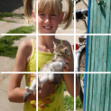
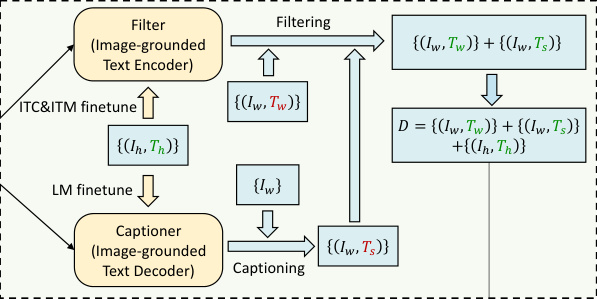
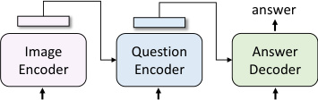

# BLIP: Bootstrapping Language-Image Pre-training for Unified Vision-Language Understanding and Generation

> 这是一份给"完全没接触过 AI / 机器视觉"的读者写的精读笔记。所有"专业词"第一次出现都会解释清楚，并用生活场景打比方。只看这份笔记就能理解全文机制。

## TL;DR

一句话：让一个模型同时学会看图和写字，再让它帮自己把网上烂配文重写干净，回头再用干净数据训一遍——多个任务全线变强。

三个关键贡献：

- **MED**（Multimodal mixture of Encoder-Decoder）：一个模型三种身份切换——纯编码器、看图的文本编码器、看图的文本解码器，三种身份共享大部分参数。
- **CapFilt**（Captioning + Filtering）：用预训练好的模型派生出一个"配字员"和一个"过滤器"，给 1 亿多张网图重新生成 caption 并把脏的扔掉。
- **跨任务通吃**：图文检索、image captioning、VQA、NLVR²、VisDial、零样本视频检索全部 SOTA。

*所以这一节是想说：BLIP 同时治理"模型偏科"和"数据脏乱"两个老毛病，用一个模型 + 一套数据清洗流程把视觉语言预训练带进新阶段。*

---

## 这是个什么场景

想象你在用手机相册搜图：输入"我家猫趴在窗台"，相册要找出对应的照片；或者你拍了张菜市场的照片，App 帮你自动配一句"清晨的鱼摊"。这两件事看着相近，其实需要两套本事——前者是"看图找文字配对"（理解/判别），后者是"看图自己写文字"（生成）。视觉语言预训练（Vision-Language Pre-training, VLP）就是想训出一个"通用大脑"，让它两件事都能干，而且训一次就能去搜图、配字、视觉问答各种活儿都用。就像让小孩先翻一万本带插图的绘本，以后不管考"看图说话"还是"看文字找图"都不打怵。

但 2021 年前后业界遇到两个尴尬：

第一个尴尬是模型**偏科**——像两个学生各只会做半套题：

- [CLIP](clip.md) 这类双塔模型擅长"图和文字到底配不配"的选择题（搜图很快），但让它"看图写一段话"就抓瞎，因为它根本没装"写字"的零件（解码器）。
- 反过来，纯 encoder-decoder 模型（如 SimVLM）能写文字，但做检索时要把每张图和每段文字两两过一遍，慢得像每次找东西都把整个家翻一遍。

第二个尴尬是数据**脏**——食材烂但只能硬吃：

- 大模型像个永远吃不饱的孩子，需要海量图文对；但人工标注（COCO、Visual Genome）只有几百万对，喂不饱。
- 于是大家从网上爬"图 + alt-text"。问题是网图的 alt-text 经常胡说八道——比如一张风景照配文"在朋友家门口拍的"，跟图里的山水半毛钱关系都没有。
- 之前的应对是写几条简单规则筛一筛，然后赌"数据多够大噪声会被平均掉"。

BLIP 同时瞄准这两个问题。

*所以这一节是想说：图文预训练当时卡在"模型只能干一类活"和"数据脏但没人认真治"两个瓶颈上，BLIP 就是冲着这两件事来的。*

---

## 之前的人怎么做

把同期主流方法按"模型形态 × 数据策略"分成几类：

**模型形态维度**：

- **双塔 encoder（[CLIP](clip.md) / ALIGN / ALBEF）**：图一个塔，文一个塔，最后用对比学习对齐。检索快、判别强，但不能生成文字。
- **encoder-decoder（SimVLM / VL-T5）**：图进 encoder，文从 decoder 出来。能配字、能 VQA，但检索时要 N×M 次前向，效率劝退。
- **统一 encoder-decoder（VLP / Unified VLP）**：想兼顾两者，但单一架构在两类任务上都不算最强。

**数据策略维度**：

- **规则过滤**：CC3M / CC12M 用启发式规则筛 alt-text。
- **暴力堆量**：ALIGN 干脆爬 1.8B 图文对，靠"量大噪声平均"硬扛。
- **CLIP 过滤**：LAION 用预训练的 [CLIP](clip.md) 给图文打分，相似度太低的扔掉。

BLIP 之前最接近的工作是同组的 **ALBEF**：双 encoder + cross-attention 融合 + ITC + ITM 损失 + momentum distillation。BLIP 直接在 ALBEF 基础上加了两件事——给它接一个解码器（变成 MED），再让 MED 自己反过来清洗数据（CapFilt）。

类比一下：之前是"请最严格的语文老师批改学生作文"（CLIP 过滤），BLIP 干的是"让会写作文的老师亲自重写一遍范文，然后让会判分的老师把烂作文丢掉"。

*所以这一节是想说：BLIP 的家世清楚——架构沿 ALBEF 走，但加了解码器；数据上跳出"规则过滤+暴力堆量"，做了"模型自产自校"的新闭环。*

---

## 新想法

BLIP 的核心 insight 其实可以浓缩成两条：

**Insight 1：理解任务和生成任务不必分两个模型，但需要共享得有讲究。**

文本编码器（理解）和文本解码器（生成）的差别本质上只在 self-attention 是双向还是因果——双向的可以"前后文都看"，因果的只能"看前面预测后面"。其他层（embedding、cross-attention、FFN）功能其实一样，可以共享。共享后参数从 361M 降到 252M，反而效果更好（实验表 3 验证）。

**Insight 2：预训练好的模型本身就是最好的数据清洗工具。**

之前用规则、用 CLIP 过滤，但这些工具都是"外人"。BLIP 想的是：既然预训练模型已经懂图文了，为什么不让它自己当老师？派一个分身去"重写 caption"，再派另一个分身去"判这条 caption 配不配图"。两个分身从同一个母体出来但分别 fine-tune，避免同源偏见（confirmation bias）——表 4 验证了"两个分身共享参数会变差"。

把这两件事拼在一起：MED 让一个模型同时具备"配字"和"判分"能力 → 抽出来当 captioner 和 filter → 清洗网图数据集 → 拿干净数据再训一个新的 MED → 这就是"bootstrapping"（自举）的来源。

类比：你做菜不好吃，先看菜谱（人工标注 COCO）打底学会基本功，然后买一堆便宜但参差不齐的食材（网图 alt-text）。你边做边记笔记修正菜谱，下一轮用这本修正过的菜谱再炒一次——菜会越做越好。

*所以这一节是想说：BLIP 的两大新意是"理解+生成共享同一参数集合"和"模型自产自校数据"，自举循环让数据和模型一起进步。*

---

## 方法分步

> 这是全文最核心的章节。BLIP 的方法分两大阶段：先搭 MED 做联合预训练，再用 CapFilt 清洗数据做"自举"。理解这两阶段就理解了 80% 的论文。

### 阶段一：搭建 MED 并做联合预训练

#### Step 1：MED 架构——一人三岗

类比：MED 像一家小餐馆雇了一个全能员工，胸前挂着三块名牌——切到"前台"模式负责认菜（理解），切到"配菜"模式负责把图和说明对得上，切到"后厨"模式负责现场写菜单（生成）。同一个人，换名牌干不同活，省人手。

MED = 一个图像编码器（ViT）+ 一个文本网络，文本网络可以切换三种模式。



**图像端**：标准 ViT-B/16 或 ViT-L/16，图片切 patch + [CLS] token，输出一串 embedding。

> 等等，先慢一拍 —— ViT 是什么？把图切成 16×16 的小方块（patch），每块当成一个"词"扔进 Transformer，模型就能像处理文字一样处理图。[CLS] 是开头加的一个汇总位，最后用它代表整张图。

**文本端三种模式**（共享大部分参数，只有 self-attention 不同）：

| 模式 | 用什么 self-attention | 用 cross-attention 吗 | 特殊 token | 训练时干什么 |
|------|----------------------|----------------------|-----------|--------------|
| Unimodal encoder | 双向 SA | 不用 | [CLS] | ITC 对比学习对齐图文 |
| Image-grounded text encoder | 双向 SA | 用，注入图片信息 | [Encode] | ITM 二分类判图文配不配 |
| Image-grounded text decoder | 因果 SA | 用 | [Decode] / [EOS] | LM 看图写句子 |

每条图文对一次训练时：图像走一次 ViT（计算最重），文本走三次（每次切一种模式算一种 loss），三种 loss 加起来反向传播。这样的设计让理解和生成在一个统一框架里互相促进——ITC 提供粗粒度全局对齐，ITM 提供细粒度二分类判别，LM 提供生成能力。

**参数共享策略的关键设计**：文本编码器和文本解码器之间共享所有参数 **除了 self-attention 层**。为什么？

- **可以共享的层**：embedding 层把文字变数字、cross-attention 层从图获取信息、FFN 做非线性变换——这些在编码和解码任务中功能完全一致。
- **必须分开的层**：self-attention 在编码器中是双向的（看完整上下文），在解码器中是因果的（只看过去预测未来）——两种注意力模式有冲突，硬共享会"打架"。

实验验证（表 3）：共享除 SA 以外的所有层得到 252M 参数，比完全不共享的 361M 少了 30%，但效果反而更好。完全共享（含 SA）会因为编码/解码冲突导致退化。

**MED vs 之前架构的关键差异**：

| 架构 | 能做检索？ | 能做生成？ | 参数效率 | 代表模型 |
|------|----------|----------|---------|---------|
| 双塔 encoder | 快（余弦距离） | 不能 | 高 | CLIP, ALIGN |
| encoder-decoder | 慢（需两两过） | 能 | 中 | SimVLM, VL-T5 |
| 统一 encoder-decoder | 勉强 | 勉强 | 低（互相拖后腿） | Unified VLP |
| **MED（BLIP）** | **快（ITC 粗筛 + ITM 精排）** | **能** | **高（SA 分开其余共享）** | **BLIP** |

MED 的创新不在于"发明了新组件"，而在于"找到了正确的共享方式"——让一个模型承担三种角色，通过 SA 分离避免冲突，通过其余层共享避免参数爆炸。这是一个精心设计的工程折中，比简单粗暴地"把 encoder 和 decoder 拼在一起"高明得多。

**ViT 图像端的具体数据流**：

以 ViT-B/16 处理 224×224 图像为例：

1. 图片切成 14×14 = 196 个 16×16 patch。
2. 每个 patch 通过线性投影变成 768 维向量。
3. 加上可学习的位置编码（196 个位置 + 1 个 [CLS]）。
4. 过 12 层 Transformer（每层含 SA + FFN）。
5. 输出 197 个 768 维向量：[CLS] 用于 ITC 全局表示，其余 196 个 patch embedding 作为 key/value 供 cross-attention 使用。

注意：ViT 是用 ImageNet 监督预训练的权重初始化的（不是随机初始化），这给了模型一个"已经能看图"的起点。fine-tune 到 384×384 时，patch 数量变成 24×24 = 576 个，位置编码通过插值扩展。

#### Step 2：三种损失同时训

类比：像同时请三个老师批改一张作业——一个看大方向（粗筛），一个抠细节（精判），一个让你重写一遍（背诵）。三种反馈加起来才学得透。

**ITC (Image-Text Contrastive Loss)**：像在教室里给同桌靠拢、跟陌生人保持距离。拉近匹配的图文 embedding，推远不匹配的。沿用 ALBEF 的 momentum encoder 和 soft label 设定。

- 为什么要 momentum encoder？训练中 batch 里的负样本可能"名不副实"——有些图文对虽然不在同一个 pair 里，但内容确实相关（比如两张猫图配了不同描述，但都是"猫"）。momentum encoder 给这些"可能其实是正样本"的对分配 soft label，避免错误惩罚。
- 具体操作：维护一个参数按指数移动平均（EMA）更新的 encoder 副本，用它产生特征给当前 batch 当 soft target。

**ITM (Image-Text Matching Loss)**：像验钞机——光看个大概不够，得对着光仔细瞧。二分类 head，输入融合后的多模态 embedding（来自 image-grounded text encoder 的 [Encode] 位输出），输出"配 / 不配"。

- ITC 和 ITM 的区别在哪里？ITC 只看图和文本各自的全局向量的余弦距离，是粗筛；ITM 把图的每个 patch 信息通过 cross-attention 融进文本每个 token，是细看。比如 ITC 可能觉得"一只猫"和"一只虎斑猫"的图差不多近，但 ITM 能区分到底是不是虎斑。
- **Hard negative mining**：不随便抽负样本，而是从当前 batch 里挑那些 ITC 余弦相似度高但确实不匹配的对——就是那些"最容易骗过粗筛"的假阳性。这样训练效率高很多。

**LM (Language Modeling Loss)**：像默写课文，一个字一个字往下接。自回归预测下一个 token 的交叉熵，加 0.1 的 label smoothing。

- 为什么不用 BERT 那种 MLM（在句子中间挖空让模型填）？因为 LM 训出的解码器才能直接做 image captioning 这类"从零开始写一段"的生成任务。MLM 是"完形填空"，LM 是"从头写作"——后者更接近下游需要。
- label smoothing=0.1 的作用：别让模型对"正确答案"太过自信，留点概率给近义词，避免过拟合。

**三种损失为什么必须"三合一"——互补性分析**：

单独用其中任何一种 loss 都有盲区：

- 只用 ITC：模型学到的是全局粗粒度对齐。一张"日落海边跑步"的图和"海边日落"的文本会被拉近，但模型不知道图里到底有没有"跑步"这个细节。
- 只用 ITM：模型能做细粒度判别，但因为没有生成目标，cross-attention 层学到的表示偏向"分辨真假"而非"理解内容结构"。
- 只用 LM：模型能写字，但没有显式的对比信号，生成的 caption 可能跟图"有关但不精确"——比如看到一条狗写出"一只可爱的动物"。

三种 loss 合起来形成一个"理解-判别-生成"三角互补：ITC 给全局锚点 → ITM 在锚点附近精细对齐 → LM 把精细对齐的理解转化为可输出的文字。训练时三个 loss 同时反向传播，梯度互相补充。

**cross-attention 的具体工作方式**：

在 Image-grounded text encoder/decoder 中，每个 transformer block 的结构是：self-attention → cross-attention → FFN。cross-attention 的工作方式：

- Query (Q) = 文本 token 的表示（来自 SA 层输出）
- Key (K) = 图像 patch 的表示（来自 ViT 最后一层）
- Value (V) = 图像 patch 的表示（同 K）
- 计算：Attention(Q, K, V) = softmax(QK^T / √d) V

直觉上：每个文本 token 通过 cross-attention "查看"所有图像 patch，然后根据注意力权重加权聚合图像信息。比如当文本 token 是"猫"时，cross-attention 会把注意力集中在图中"猫所在 patch"上，把猫的视觉信息注入到"猫"这个词的表示里。

这就是为什么 Image-grounded encoder（带 cross-attention）比 Unimodal encoder（不带 cross-attention）做 ITM 效果好——它真的在逐 token 级别把视觉和语言对齐了。

**训练效率设计**：

三种 loss 都需要文本前向，但图像只需要过一次 ViT。ViT-B/16 处理一张 224×224 图需要 196 个 patch token + 1 个 [CLS]，计算量远大于文本端（BERT-base 12 层）。所以"图只过一次，文过三次"的设计在效率上是合理的——瓶颈在图，不在文。

**三种损失的训练数据流**：

```
一张图 + 一段配文 →
  [图 → ViT → 图特征]  ← 只做一次前向（最贵的部分）
  
  [文 → Unimodal Encoder → ITC loss]        ← 第 1 次文本前向
  [文 + 图 → Image-grounded Encoder → ITM loss]  ← 第 2 次文本前向
  [文 + 图 → Image-grounded Decoder → LM loss]   ← 第 3 次文本前向
  
  Total loss = ITC + ITM + LM → 反向传播
```

#### Step 3：预训练数据和超参数

- **数据**：14M 设定 = COCO(113K) + Visual Genome(100K) + CC3M(3M) + CC12M(10M) + SBU(860K)；129M 设定额外加 LAION(115M，每 epoch 用 1/5)。
- **硬件**：2 个 16-GPU node = 32 张 GPU。
- **batch size**：2880（ViT-B）/ 2400（ViT-L）。
- **学习率**：warmup 到 3e-4（ViT-B）/ 2e-4（ViT-L），然后线性衰减（decay rate 0.85）。
- **输入分辨率**：预训练 224×224，fine-tune 时提升到 384×384。
- **训练 epoch**：20。
- **优化器**：AdamW，weight decay 0.05。

### 阶段二：CapFilt 数据自举

#### Step 4：CapFilt 全流程

类比：你想学做菜，但买回来的食材一半是烂的。聪明的做法是——先用基础食材学会基本功，再让自己当"采购员"重写采购清单，再让自己当"质检员"把烂食材扔掉，下一轮就能用更干净的食材。CapFilt 就是这个套路。



预训练完一轮后：

1. **派出 captioner（采购员）**：把 image-grounded text decoder 拿出来，在 COCO 上用 LM 损失 fine-tune。给每张网图 $I_w$ 用 nucleus sampling 生成一条新 caption $T_s$。
2. **派出 filter（质检员）**：把 image-grounded text encoder 拿出来，在 COCO 上用 ITC + ITM 损失 fine-tune。让它对每条 caption 打分，ITM head 判为"不匹配"的就丢掉。
3. **filter 同时审两边**：原始 web 文本 $T_w$ 和合成文本 $T_s$ 都过滤，留下来的合在一起，再加上人工标注的 COCO/VG，组成新数据集 $D'$。
4. **新模型从头训**：拿 $D'$ 重新预训一个新 MED（实验表 13 证明：从老模型继续训反而不如从头训）。

**为什么从头训比继续训好？** 类比知识蒸馏：学生不应该从老师的参数出发（不然还是带着老师的偏见），应该重新开始但用"更好的教材"（bootstrapped dataset）。

#### Step 5：Captioner 的生成策略——为什么 nucleus 而非 beam search

| 策略 | 原理 | 噪声率 | 效果 |
|------|------|--------|------|
| Beam search | 贪心取每步概率最高的 k 条路 | 19% | 更低 |
| Nucleus sampling (p=0.9) | 从累计概率 ≥ p 的最小 token 集合里随机采 | 25% | 更高 |

**Nucleus sampling 具体是怎么工作的？**

每一步生成时，模型给词表里所有可能的下一个 token 算概率分布。Nucleus sampling 的做法是：

1. 把所有 token 按概率从高到低排列。
2. 从最高概率的 token 开始累加，直到累计概率 ≥ p（这里 p=0.9）。
3. 只从这个"核"（nucleus）内的 token 里按概率随机采样。

举例：假设下一个 token 的概率分布是 {"cat": 0.4, "dog": 0.3, "kitten": 0.15, "animal": 0.1, "thing": 0.05}。
- p=0.9 的 nucleus = {"cat", "dog", "kitten"}（累计 0.85 < 0.9）+ {"animal"}（累计 0.95 ≥ 0.9）= 前 4 个。
- 从这 4 个中按归一化概率随机采一个。

对比 beam search：beam search 维护 k 条路径（比如 k=5），每步只扩展每条路径上概率最高的 token，最后取总概率最高的路径输出。结果是确定性的——同一张图永远生成同一条 caption。

**为什么确定性输出反而不好？**

beam search 的输出是整个训练集上"最不容易出错"的 caption 模板，往往是高频套话。对于模型来说，这些"安全"的 caption 大概率已经在 web text 里以某种形式出现过了——等于给模型重复信息，学不到新东西。nucleus 采样让 captioner 冒点险、写出一些"不太常见但描述了图片真实细节"的句子——比如把"a bird"扩展成"a small yellow bird perched on a metal fence"——这些细节正是模型在 noisy web text 中很难学到的高价值信息。

为什么噪声高反而效果好？beam search 倾向给"最安全"的常见 caption，都是"a man is standing"之类空话，对模型学新东西没增益。nucleus 采样更"野"：虽然偶尔翻车生出脏 caption，但 filter 会兜底扔掉；而没被扔掉的那些"有趣的、多样的"caption 提供了更多新信息，模型从中获益更大。

类比：写作文时让 AI"老老实实写最稳的句子"信息量低，让它"放飞一点写得有趣"虽然偶尔翻车但学到的更多——反正有老师改卷兜底。

**Filter 的判定机制具体是什么？**

Filter 是 Image-grounded text encoder 在 COCO 上用 ITC + ITM fine-tune 后得到的。判定一条 caption 是否保留的逻辑很简单：

1. 把图像和 caption 输入 filter。
2. cross-attention 让文本 token 融合图像信息。
3. [Encode] 位的输出过一个线性层（ITM head）→ 二分类 logit。
4. 如果 ITM head 输出"不匹配"（概率 > 0.5），这条 caption 就被丢弃。

这个 filter 相当于一个专门在 COCO 上训练过的"图文匹配审核员"。它见过什么是"好的图文对"（COCO 的人工标注），所以能判断一条 caption 是否真的在描述图中的内容。


#### Step 6：Captioner 与 Filter 必须解耦

**关键约束**：captioner 和 filter 必须**单独 fine-tune**，不能共享参数。

为什么？共享参数会让 captioner 生成的脏 caption 在 filter 看来"自家产的没问题"——好比让同一个人既当采购员又当质检员，自家货怎么舍得退？这就是 **confirmation bias（确认偏见）**。

实验验证（表 4）：

| 设定 | 噪声被过滤率 | 下游效果 |
|------|-------------|---------|
| 共享参数 | 8% | 较差 |
| 解耦（各自 fine-tune）| 25% | 更好 |

共享时 filter 只过滤了 8% 的 caption——大量脏数据混了进去。解耦后 filter"敢于向自己人开刀"，过滤率升到 25%，数据质量大幅提升。

#### Step 7：CapFilt 的数据组成细节

理解 CapFilt 产出的数据集 D' 的组成对理解最终效果至关重要：

**原始数据**（CapFilt 前）：

- 人工标注：COCO 约 567K 条文本 + VG 约 769K 条文本 → 这些是"金标准"，不经过 filter。
- 网图 alt-text：CC3M + CC12M + SBU ≈ 13.8M 条 → 质量参差不齐。

**CapFilt 后的数据**（D'）：

- 人工标注：保持不变（COCO + VG），直接放入 D'。
- 过滤后的原始 web text：从 ~13.8M 条中扔掉约 25% ≈ 保留 ~10.4M 条。
- 过滤后的合成 caption：每张网图生成 1 条 → 13.8M 条 → 扔掉约 25% ≈ 保留 ~10.4M 条。
- 最终 D' 总 text 数量 ≈ 1.3M(人工) + 10.4M(过滤后 web) + 10.4M(过滤后合成) ≈ 22.1M 条。

关键 insight：CapFilt 后每张图平均从 1 条 text 变成了 ~1.5 条（原始被保留的 + 合成被保留的），数据量增加但质量也同步提升——这就是 captioner 和 filter 的互补效应。captioner 负责"增量"（多一条高质量描述），filter 负责"减噪"（删除原始脏描述和合成的坏描述）。

**数据规模与 CapFilt 的 scalability**：

表 1 展示了从 14M 图扩展到 129M 图（加入 LAION）时，CapFilt 的增益不减反增。而且用更大的 captioner/filter（ViT-L）清洗数据给更小的模型（ViT-B）用，也能持续获益。这证明了 CapFilt 是一个可扩展的框架——不会因为数据量变大而失效，反而噪声越多的大数据集越需要 CapFilt。

#### Step 8：下游任务适配——预训练模型如何变身

BLIP 预训练完成后，同一个模型通过不同方式的重新组合，可以适配到 5 种不同的下游任务。这种灵活性是 MED 架构的核心优势。



**图文检索（Image-Text Retrieval）**：

- 用 ITC + ITM 两阶段做推理。
- 第一阶段（粗筛）：用 Unimodal encoder 算图和所有候选文本的余弦相似度，取 top-k（COCO k=256，Flickr30K k=128）。
- 第二阶段（精排）：对这 k 个候选，用 Image-grounded text encoder 过 ITM head 重新打分排序。
- 为什么不一开始就用 ITM？因为 ITM 需要图和文 cross-attention 融合，计算量是 O(N)。而 ITC 的余弦相似度可以预先算好所有文本特征存起来，在线查询时只算一次图特征 → 速度差几个数量级。
- Fine-tune 时用 ITC + ITM 两个 loss。

**图像描述（Image Captioning）**：

- 用 Image-grounded text decoder，fine-tune 时用 LM loss。
- 推理时用 beam search（beam=3，max_length=20）生成 caption。
- trick：在每条 caption 前面加 prompt "a picture of"，略微提升效果。
- 评估指标：CIDEr（共识）、SPICE（语义）、BLEU@4（n-gram 精确率）。

**视觉问答（VQA）**：

- 重新排列模型：image + question → Image-grounded text encoder → 多模态 embedding → Answer decoder。
- 把 VQA 当"生成答案"而非"从 3128 个候选答案里选一个分类"。这使得 BLIP 能做 open-ended VQA（不限于固定答案集）。
- Fine-tune 时用 LM loss，ground truth 答案作为 target。
- 推理时用 decoder 对 3128 个候选答案做 ranking（比直接生成更稳定）。

**自然语言视觉推理（NLVR²）**：

- 需要判断一个句子是否描述了一对图片。
- BLIP 的做法：在 Image-grounded text encoder 的每个 transformer block 里放**两个** cross-attention 层，分别处理两张输入图。
- 两个 CA 层的输出合并策略：前 6 层用平均池化，后 6 层用拼接 + 线性投影。
- 最后在 [Encode] 输出上接 MLP 分类器。
- 两个 CA 层从同一组预训练权重初始化。

**视觉对话（VisDial）**：

- 把图像 embedding 和 caption embedding 拼接，通过 cross-attention 传给 dialog encoder。
- dialog encoder 拿到完整对话历史 + 图像 + 当前问题，用 ITM loss 判断每个候选答案是否正确。
- 这是 discriminative 设定（排序候选答案），不是 generative 设定。

**零样本视频迁移**：

- 直接用图像模型处理视频：均匀采样 n 帧（检索 n=8，QA n=16），每帧过 ViT 得 patch embedding，所有帧的 embedding 拼成一个长序列当做"一张很大的图"。
- 完全不加任何时序建模（no positional encoding between frames, no temporal attention）。
- 为什么这么粗暴的方法也能 work？因为 BLIP 的图文对齐能力极强，单帧语义理解已经足够回答大多数 MSRVTT/MSVD 的问题。

#### 方法小结

```
第一阶段：联合预训练
  ┌─────────────────────────────────────────────────────┐
  │  图像 → ViT → 图特征                                │
  │  文本 → MED (三模式) → ITC + ITM + LM               │
  │  训练数据：14M/129M 图文对（含噪声 web 数据）         │
  └─────────────────────────────────────────────────────┘
          ↓ 预训练完成后
第二阶段：CapFilt 数据自举
  ┌─────────────────────────────────────────────────────┐
  │  Captioner = Decoder 在 COCO fine-tune              │
  │  Filter = Encoder 在 COCO fine-tune                 │
  │  → Captioner 给网图生成新 caption (nucleus)          │
  │  → Filter 审核原始 + 合成 caption，扔掉不匹配的      │
  │  → 干净数据 D' = 过滤后 web + 合成 + 人工标注        │
  └─────────────────────────────────────────────────────┘
          ↓ 拿 D' 从头训新模型
第三阶段：最终模型 + 下游适配
  ┌─────────────────────────────────────────────────────┐
  │  新 MED 从 scratch 预训练 on D'                      │
  │  → 检索：ITC 粗筛 + ITM 精排                         │
  │  → Captioning：Decoder + LM                         │
  │  → VQA：Encoder 编码问题 + Decoder 生成答案           │
  │  → NLVR²：双 CA 处理两图 + MLP 分类                  │
  │  → VisDial：拼接 caption + history → ITM 判断        │
  │  → Video：帧拼接，不加时序建模                        │
  └─────────────────────────────────────────────────────┘
```

*所以这一节是想说：方法分两阶段——先把 MED 三模式联合预训，再用预训模型派生 captioner+filter 清洗数据，干净数据回头训新模型。参数共享策略（SA 不共享）、nucleus sampling（多样性 > 安全性）、captioner/filter 解耦（破确认偏见）、从头训新模型（不继续训旧模型）是四个让方法 work 的关键工程细节。而 MED 的"一人三岗"设计让同一个预训练模型可以灵活适配检索、生成、判别等多种下游任务——这是 BLIP 相比专注单一任务的 [CLIP](clip.md) 或 SimVLM 的结构性优势。*

---

## 关键数字

| 类别 | 指标 | 数值 |
|------|------|------|
| 模型规模 | ViT-B/16 参数量 | 86M |
| 模型规模 | ViT-L/16 参数量 | 307M |
| 模型规模 | 文本端（BERT-base 初始化） | ~110M |
| 模型规模 | BLIP-Base 总参数（共享后） | 252M |
| 模型规模 | 不共享 SA 时的总参数 | 361M |
| 数据规模 | 14M 设定 | COCO+VG+CC3M+CC12M+SBU = 14M 图 |
| 数据规模 | 129M 设定 | 上面 + LAION 115M（每 epoch 用 1/5）|
| 数据规模 | 人工标注 vs 网图（14M） | 1.2M : 12.8M |
| 训练成本 | GPU 数量 | 32（2×16-GPU node）|
| 训练成本 | batch size | 2880（ViT-B）/ 2400（ViT-L）|
| 训练成本 | 训练 epoch | 20 |
| 训练成本 | 预训练分辨率 / fine-tune 分辨率 | 224×224 / 384×384 |
| 性能（vs ALBEF 14M） | COCO TR@1 | 77.6 → 80.6（+3.0）|
| 性能（vs ALBEF 14M） | COCO IR@1 | 60.7 → 63.1（+2.4）|
| 性能（vs ALBEF 14M） | COCO Captioning CIDEr | 127.8 → 129.7 |
| 性能（vs ALBEF 14M） | VQA test-dev | 75.84 → 77.54（+1.70）|
| 性能（零样本视频） | MSRVTT 检索 R@1 | 18.7(FiT) → 43.3（超 fine-tune 方法 +12.4）|
| CapFilt 增益（14M, ViT-B） | 无 CapFilt | TR@1=78.4, IR@1=60.7, CIDEr=127.8 |
| CapFilt 增益（14M, ViT-B） | 只 captioner | TR@1=79.7, IR@1=62.0, CIDEr=128.9 |
| CapFilt 增益（14M, ViT-B） | 只 filter | TR@1=79.1, IR@1=61.5, CIDEr=128.2 |
| CapFilt 增益（14M, ViT-B） | captioner + filter | TR@1=80.6, IR@1=63.1, CIDEr=129.7 |
| CapFilt 细节 | nucleus 过滤率 | 25% |
| CapFilt 细节 | beam search 过滤率 | 19% |

*所以这一节是想说：BLIP 用比 SimVLM 少 13 倍的数据、比 LEMON 低很多的输入分辨率，跑出更好的成绩；CapFilt 单独贡献 +1~3 个点，captioner 和 filter 必须配合用才能叠加效益。*

---

## 实验结果说明了什么

BLIP 的实验部分分三块：CapFilt ablation（证明方法本身 work）、SOTA 对比（证明够强）、零样本视频迁移（证明泛化力）。

### CapFilt Ablation 的启示

**表 1（CapFilt 效果）** 把 captioner 和 filter 拆开看：

- 单独 captioner（+1.3 TR@1）和单独 filter（+0.7 TR@1）都有正贡献。
- 两者结合是 +2.2 TR@1——说明两者功能互补，不是"做同一件事"。直觉上，captioner 负责"补充信息多样性"，filter 负责"去除噪声"。
- 大 captioner/filter（ViT-L）给小模型（ViT-B）清洗数据也能提升——相当于"请更厉害的老师出题，给水平一般的学生用"。

**表 2（解码策略）** 证明了"多样性比准确性更重要"这个反直觉发现。nucleus 的噪声率比 beam search 高 6 个百分点（25% vs 19%），但所有下游指标都更好。这是因为 beam search 的 caption 太同质化（都是"safe" 描述），对模型没有新增信息。

**表 3（参数共享）** 证明了"SA 必须分开，其余可共享"——这是 MED 设计的核心工程决策。完全共享（224M）因为编码/解码冲突导致所有任务下降；完全不共享（361M）参数多但没额外收益。

**表 4（captioner/filter 解耦）** 是对 confirmation bias 假设的直接验证。

### SOTA 对比的要点

**图文检索（表 5/6）**：14M 数据下，BLIP 比 ALBEF（用同样数据训的最强前作）在 COCO TR@1 上赢 3 个点。129M 数据下进一步提升。ViT-L 版本最强。

**Image Captioning（表 7）**：BLIP 14M 就超过了用 200M 数据的 LEMON-base，而且不需要 LEMON 依赖的 object detector（推理快很多）。

**VQA（表 8）**：formulate 为 answer generation（不是多选分类），开放作答。14M 超 ALBEF +1.7；129M 甚至超过用 1.8B 数据的 SimVLM-base。

**NLVR²（表 8）**：需要对两张图做推理。BLIP 的做法很巧——在 image-grounded text encoder 里放两个 cross-attention 分别处理两张图，6 层平均 + 6 层拼接。14M 已超除 SimVLM 外的所有方法，但加 web 图收益很小——作者承认是 domain gap。

**Visual Dialog（表 9）**：把对话历史和图片 caption 拼起来喂给 encoder，ITM loss 判 answer 真假。在 VisDial v1.0 validation 上 SOTA。

### 零样本视频迁移的意义

这是 BLIP 最"惊艳"的数字：零样本视频检索在 MSRVTT R@1 上拿 43.3%，超过所有 **fine-tune 过的** 方法 +12.4%。做法极其简单——把视频抽 8 帧（retrieval）或 16 帧（QA），每帧过 ViT 得到特征，把所有帧特征拼成一个长序列，完全忽略时序。

这说明什么？

1. BLIP 学到的图文对齐能力极强，泛化到视频帧时"自带理解力"。
2. 当时的视频数据集（MSRVTT/MSVD）对时序要求其实不高——很多问题看关键帧就能答对。
3. 但这也是伏笔：强时序任务（动作分类、因果推理）BLIP 就会暴露——因为没有任何时序建模。


### 额外 Ablation

**表 12（不是因为训久了）**：把原始 web text 复制一份让 epoch 数据量对齐，效果没变。说明 CapFilt 的增益来自数据**质量**而非**量**。

**表 13（从头训 > 继续训）**：在 bootstrapped 数据上继续训旧模型反而不如从头训新模型。和知识蒸馏一致——student 不该从 teacher 初始化。

*所以这一节是想说：实验不只证明"BLIP 比别人强"，更通过精心的 ablation 解释了"为什么强"——CapFilt 的三个设计决策（nucleus、解耦、从头训）和 MED 的参数共享策略都有对照实验背书。*

---

## 应该懂的新词

- **VLP (Vision-Language Pre-training)**：视觉语言预训练。先在图文对上预训出通用表示，再 fine-tune 到下游任务。
- **encoder-only / encoder-decoder / decoder-only**：模型只能编码（像 BERT、[CLIP](clip.md)）/ 编码后再解码（像 T5、SimVLM）/ 只解码自回归生成（像 GPT）。BLIP 的 MED 是把前两者合并并加生成支路。
- **ITC / ITM / LM**：BLIP 三个 loss。ITC 拉近匹配嵌入；ITM 细粒度二分类；LM 自回归生成。
- **cross-attention vs self-attention**：self-attention 是同一序列内 token 之间互看；cross-attention 是 query 来自一边、key/value 来自另一边（BLIP 里 query 是文本 token，key/value 是图像 patch）。
- **causal self-attention**：因果掩码的 self-attention，每个位置只能看到自己和前面位置——为生成任务必备。
- **Nucleus sampling (top-p sampling)**：解码时只从累计概率 ≥ p 的最小 token 集合里采。比 beam search 多样、比 top-k 自适应。
- **Beam search**：解码时维护 k 条最优候选路径，每步扩展取分数最高的 k 条。倾向"安全平庸"。
- **CIDEr / SPICE / BLEU@4**：image captioning 的评测指标。CIDEr 看 n-gram 共识；SPICE 看场景图语义匹配；BLEU@4 看 4-gram 精确率。
- **R@1 / TR@1 / IR@1**：检索 recall@1，Top-1 命中率。TR = text retrieval（用图搜文），IR = image retrieval（用文搜图）。
- **Bootstrapping（自举）**：用模型当前的能力去改进数据/模型本身，再迭代。和"自蒸馏"、"自训练"是亲戚。
- **Confirmation bias（确认偏见）**：自己 fine-tune 出的 captioner 生成的脏 caption，自己的 filter 反而更难发现——因为它们看世界的方式相似。
- **Hard negative mining**：训练时不随便抽负样本，专挑那些"很容易被搞混"的负样本，逼模型学细节。
- **Momentum encoder**：维护一个参数缓慢移动平均的 encoder 副本，用它产生 soft label，缓解 noisy 数据下的对比学习不稳。

*所以这一节是想说：读 BLIP 至少要熟 VLP、ITC/ITM/LM、cross/causal-attention、nucleus sampling、bootstrapping 这五组词，否则后面的实验讨论看不进去。*

---

## 搞不定的

BLIP 没解决也明说了的问题：

- **没多轮自举**：作者自己点出"多轮 bootstrapping 是未来方向"。BLIP 只做了一轮 captioner→filter→重训。理论上多轮迭代可以继续提升数据质量，但也可能累积偏差。
- **每张图只有一条合成 caption**：可以一图多 caption 进一步扩充语料多样性。
- **没做 captioner/filter 的 ensemble**：训多个版本组合可能更鲁棒。

更宏观的局限：

- **零样本 video 任务靠"丢帧拼序列"**：直接把 8 或 16 帧 ViT 特征拼起来，**完全忽略时序**。video QA / video retrieval 表面 SOTA，但任何强时序需求（动作识别、因果推理）就会暴露。
- **CapFilt 依赖人工标注的 COCO 做 fine-tune**：本质上还是 COCO 的"先验"在驱动。完全没有人标的领域（医学、卫星图）是否能 bootstrap 出干净 caption 是问号。
- **filter 的判定边界是 ITM 二分类**：阈值附近的 caption 可能"半对半错"，简单二分会丢信息——未来可以用 soft score 或者分级。
- **NLVR² 加 web 图收益弱**：作者承认是 web 数据和下游数据的 domain gap 导致——表明 BLIP 不是万能的。
- **没用 vision-only self-supervision**：ViT 是 ImageNet 监督初始化的，没用 MAE 之类的自监督做更强 visual encoder。后续 EVA-CLIP / BEiT-3 证明自监督 ViT 能进一步提升。

后续工作怎么补：

- BLIP-2（同组）：把 LLM 接进来，CapFilt 思路升级成 Q-Former bridging。
- InstructBLIP：再加指令微调，做"会聊天的看图模型"。
- [Flamingo](flamingo.md)：用 few-shot 范式避免 fine-tune，走了不同的路径。

*所以这一节是想说：BLIP 是"统一+清洗"的框架级胜利，但视频时序、领域迁移、多轮自举都还是开放问题；后来的 BLIP-2 / LLaVA 系列就是来填这些坑的。*

---

## 与别篇关系

**直接前作（架构和损失继承）**：

- **[CLIP](clip.md) (Radford 2021)**：双塔 + ITC 对比学习。BLIP 把它的 ITC 拿来当三个 loss 之一，但比 CLIP 多了 ITM 细粒度判别和 LM 生成能力。
- **ALBEF (Li 2021)**：BLIP 的"亲哥"——同一作者团队，双 encoder + cross-attention + ITC + ITM + momentum distillation。BLIP = ALBEF + LM 解码器 + CapFilt。
- **ViT (Dosovitskiy 2021)**：图像 backbone。
- **BERT (Devlin 2019)**：文本 backbone 初始化来源。

**同期对比方法**：

- **SimVLM (Wang 2021)**：encoder-decoder + 1.8B 数据。BLIP 用 1/13 数据超它。
- **ALIGN (Jia 2021)**：1.8B 暴力堆量的代表。BLIP 证明"清洗 100M 比硬堆 1.8B 更香"。
- **VinVL / LEMON / OSCAR**：依赖 object detector 提取 region feature 的旧路线，BLIP 走 detector-free 路线，推理更快。

**思想关联**：

- **Knowledge Distillation (Hinton 2015) / Self-distillation**：CapFilt 可以看成 VLP 版本的自蒸馏——captioner 用合成 caption 蒸馏知识，filter 用过滤行为蒸馏知识。
- **Noisy Student (Xie 2020)**：用学生模型给伪标签训新学生的自训练，CapFilt 在视觉语言版本上做了类似事。
- **数据增强**：CapFilt 是面向 VLP 的数据增强，与 NLP 里"用 LM 生成增强文本"思路同源但更大胆。

**后续衍生**：

- **BLIP-2 (2023)**：保留 ITC/ITM/LM 三 loss，但把文本侧换成冻结的 LLM，用 Q-Former 做轻量 bridge。
- **InstructBLIP**：BLIP-2 + 指令微调。
- **LLaVA / MiniGPT-4**：受 BLIP 系列启发，但用 GPT-4 / ChatGPT 生成的指令数据。
- **EVA-CLIP / OpenCLIP**：继承 [CLIP](clip.md) 思路但用更大数据。

**在 embodied AI / VLA 谱系里的位置**：

- BLIP 不直接做 embodied AI，但它是 [RT-2](rt-2.md)、PaLM-E、[OpenVLA](openvla.md) 等 VLA 的"上游能力来源"——VLA 模型能看图理解任务，根子就在 BLIP/[CLIP](clip.md) 这条 vlm-foundation 链上。
- [Flamingo](flamingo.md) 和 BLIP 是同期的两条平行线——DeepMind vs Salesforce，few-shot vs bootstrapping，但都指向"让 VLM 更通用"。

*所以这一节是想说：BLIP 是 ALBEF 的直接升级，是 CLIP 的"会写字版本"，也是 BLIP-2/LLaVA 的祖先；理解它就理解了 2022 年前后视觉语言基础模型的拐点。*

---

## 和本导读的关系

本导读系列从 [CLIP](clip.md) 出发建立"视觉语言对齐"的基线认知，BLIP 是紧跟其后的第二个里程碑。在阅读路线中，BLIP 起到承上启下的桥梁作用：

- **承上**：BLIP 的 ITC 损失直接继承自 [CLIP](clip.md)，如果你已经读懂 CLIP 的对比学习是怎么把图文拉到同一空间的，那 BLIP 的第一种模式（Unimodal encoder + ITC）就是你已知的东西。
- **启下**：BLIP 引入的 MED 三模式架构和 CapFilt 自举思路，直接影响了 [Flamingo](flamingo.md) 的"冻结视觉+桥接 LLM"设计和后续 BLIP-2 的 Q-Former。读完 BLIP 后再读 Flamingo，你会发现两者在"怎么把视觉信息传给语言模型"这个问题上走了不同路径——BLIP 选参数共享，Flamingo 选 Perceiver 桥接。

在 embodied AI 的链路上，BLIP 的位置是"为 VLA 提供视觉语言理解能力的基础设施"。[RT-2](rt-2.md) 之所以能看图直接输出机器人动作，是因为底层的 VLM 已经具备了"看图理解文字指令"的能力——这个能力的技术根就在 CLIP → BLIP → BLIP-2 这条线上。

*所以这一节是想说：读 BLIP 是从"纯对齐"（CLIP）过渡到"对齐+生成"的关键一步，也是理解后续 Flamingo / BLIP-2 / RT-2 的必修前置课。*

---

## 思考题

> 这些题不需要背——如果你能用自己的话回答，说明你真正理解了 BLIP。

**Q1：为什么 MED 的三种模式只在 self-attention 层不同，其他层可以共享？**

<details>
<summary>参考思路</summary>

编码器需要双向 SA（每个 token 看到所有其他 token），解码器需要因果 SA（只看前面）。这两种注意力模式在权重分布上有本质冲突——双向 SA 学到的是"根据完整上下文判断词义"，因果 SA 学到的是"根据已有信息预测下一个"。但 embedding 层（把文字变数字）、cross-attention 层（从图获取信息）、FFN（非线性变换）在两种任务中做的事情功能上一致，所以共享不冲突。实验表 3 直接验证了这个直觉——共享 SA 效果下降，其余共享效果持平甚至更好。
</details>

**Q2：如果我把 CapFilt 改成多轮迭代（训完一轮再用新模型做下一轮 captioner/filter），你觉得会无限变好还是有收益递减？为什么？**

<details>
<summary>参考思路</summary>

大概率收益递减。第一轮 bootstrapping 从"很脏"到"较干净"提升最大；后续轮次的 captioner/filter 质量虽然更高，但能纠正的剩余噪声越来越少。而且多轮迭代可能累积系统性偏差——captioner 越来越倾向生成某种风格的 caption，filter 也越来越习惯放行这种风格，多样性反而下降。这类似 self-training 中观察到的 confirmation bias 随迭代加剧的现象。不过适量（2-3 轮）可能还有收益，作者只是在 1 轮时就停了。
</details>

**Q3：BLIP 做零样本视频检索时完全不建模时序，却大幅超过 fine-tune 过的方法。这是 BLIP 真的很强还是 benchmark 有问题？**

<details>
<summary>参考思路</summary>

两者都有。一方面 BLIP 的图文对齐确实学得极好，泛化到单帧理解时自带强语义。另一方面，MSRVTT/MSVD 这类数据集的很多问题确实不需要时序理解——看关键帧就能答对。所以这个"SOTA"某种程度上暴露了 benchmark 对时序推理的考察不足。真正考时序的任务（Something-Something V2 动作分类、COIN 步骤分解）BLIP 不会有这么好的表现。后续 TimeSformer、VideoMAE 等专门做时序建模的模型在这类任务上才是正解。
</details>

**Q4：假设你有一个全新领域（如医学影像），没有 COCO 这样的人工标注数据来 fine-tune captioner/filter。你怎么把 CapFilt 思路用上？**

<details>
<summary>参考思路</summary>

几种可能的方案：(1) 用少量（几百到几千）领域专家标注做 fine-tune，验证最低标注量需求；(2) 用通用预训练的 captioner/filter 直接在新领域试——它们的"图文是否匹配"判断能力可能有一定泛化性；(3) 用 GPT-4V 之类更强的模型当"外部 teacher"做初始标注，再用这些标注 bootstrap。核心问题是 CapFilt 的质量上限由 fine-tune 数据决定——没有领域先验，captioner 可能生成"通用但不精确"的描述，filter 也可能漏判领域特有术语。
</details>

**Q5：BLIP 的 filter 用 ITM 二分类（匹配/不匹配）做决策。如果改成给 caption 打连续分数（0到1），然后按分数加权使用，你觉得会更好还是更差？**

<details>
<summary>参考思路</summary>

直觉上应该更好——因为硬二分类在阈值附近会丢掉"半对半错"的 caption（它们可能描述了图的部分内容但不完整），软加权能保留这些部分信息的价值。实际上后续的 DataComp 和 LAION 过滤工作就是走 soft score 路线的。但软加权也引入了新问题：怎么设定权重曲线？权重过高的"半正确"数据是否会教给模型错误关联？需要额外超参数调优。BLIP 选硬截断可能是为了工程简洁——"要么留要么扔"比"留多少比例"容易实现和调试。
</details>

**Q6：BLIP 和 CLIP 的根本区别是什么？如果你只需要做图文检索（不需要生成），BLIP 比 CLIP 强在哪里？**

<details>
<summary>参考思路</summary>

根本区别：CLIP 只有 ITC（对比学习），BLIP 有 ITC + ITM + LM 三个目标。即使只做检索，BLIP 也比 CLIP 强，原因有两点：(1) ITM 提供的细粒度判别训练信号（hard negative + cross-attention 融合）让模型学到了更精细的图文对齐——不只是"大方向对"，还要"细节也对"；(2) LM 目标虽然直接服务生成，但训练过程中迫使 cross-attention 层更深入地理解图像内容（要写出合理 caption 必须真正"看懂"图），这种理解能力间接提升了检索质量。加上 CapFilt 让训练数据更干净，基础就更牢。
</details>

**Q7：表 13 说"继续训不如从头训"。这跟我们平时做 fine-tune 的直觉相反（通常预训练→继续训效果好），为什么在 CapFilt 场景下反过来了？**

<details>
<summary>参考思路</summary>

关键区别在于：fine-tune 是"用更精确的小数据精调已有能力"，而 CapFilt 后的重训是"用更干净的大数据重新学全部能力"。继续训时，旧模型带着在脏数据上学到的"偏见"（比如某些噪声 pattern 已经被记进参数了），新数据再干净也很难完全覆盖掉这些旧偏见。从头训则是白纸一张，直接在干净数据上建立表示。这和知识蒸馏的经验一致——student 从 random init 开始学 teacher 的 soft label，比从 teacher 的权重继续训效果更好，因为"重新学"比"纠正"容易。
</details>

---

## FAQ

**Q1：MED 算"一个模型"还是"三个模型"？**
答：参数上是一个模型——三种模式共享 embedding、cross-attention、FFN，只有 self-attention 那部分会切换（双向 SA 给 encoder，因果 SA 给 decoder）。所以是"一组参数三个工作模式"，不是三套独立权重。

**Q2：CapFilt 是不是就是数据清洗？为什么要叫"自举"？**
答：因为清洗工具（captioner / filter）不是外人，是从模型自己派生的。模型先用脏数据训出基础能力，用这个能力清洗数据，清洗后的数据再训新模型——能力和数据互相 boost，所以叫 bootstrapping。

**Q3：为什么 captioner 和 filter 要解耦？让一个网络又生成又判断不行吗？**
答：实验上不行（表 4：解耦后效果好且过滤率从 8% 升到 25%）。直觉解释：共享参数会让 captioner 生成的脏 caption 在 filter 看来"自家产的没问题"，confirmation bias 让坏数据混过去。

**Q4：为什么生成 caption 要用 nucleus 而不是 beam search？**
答：beam search 倾向给"最高概率"的安全 caption，结果都是"a man is standing"这种空话，对模型学新东西没增益。nucleus 采样多样性强，虽然噪声率高但 filter 会兜底，最终增益更大（表 2）。

**Q5：为什么不用过滤好的数据"接着训"老模型？**
答：表 13 直接验证了——继续训不如从头训。作者类比知识蒸馏：学生不该从老师那里直接初始化（不然学到的还是老师的偏见），应该重新开始。

**Q6：BLIP 在视频上零样本 SOTA 是怎么做到的，不是说没建模时序吗？**
答：直接抽 8 / 16 帧 ViT 特征拼成长序列喂给 image-grounded text encoder，像处理"很多张图一起"一样。能 work 是因为 MSRVTT/MSVD 这类任务很多帧都长得差不多，时序不关键；但碰到强时序任务（动作分类）就会原形毕露。

**Q7：CapFilt 是不是只能用 COCO 做 fine-tune？换个领域行不行？**
答：论文只在 COCO 上 fine-tune captioner/filter。换领域理论上可行（拿那个领域的少量人标对 fine-tune 就行），但 fine-tune 数据集质量决定了"清洗师傅"的水平上限——这是 BLIP 没回答的问题。

**Q8：BLIP 和 CLIP 到底什么关系？**
答：[CLIP](clip.md) 只做 ITC（对比学习）一件事，是 BLIP 的"理解任务子集"。BLIP 在 CLIP 的能力上多加了 ITM（细粒度判别）和 LM（生成），并且补了 CapFilt 数据治理。可以把 BLIP 看成"CLIP + 解码器 + 数据自洁"。

**Q9：BLIP 训练成本贵吗？**
答：32 张 GPU × 20 epoch，batch size ~2880。在 2022 年是中等规模——比 CLIP 的 256 V100 × 12 days 便宜很多（因为数据少 1 个数量级），比 SimVLM-huge 那种 1.8B 数据更便宜。但比 ALBEF 略贵（多了 LM 损失和 CapFilt 重训）。

**Q10：我自己想用 BLIP 做下游任务，从哪开始？**
答：直接用 HuggingFace 的 `Salesforce/blip-*` 系列 checkpoint（image-captioning-base / vqa-base / itm-base）。零样本能用就别 fine-tune；要 fine-tune 看 BLIP 官方仓库 README。如果是新任务，建议先试 BLIP-2，已经默认接 LLM、能力更强。

*所以这一节是想说：MED 本质是"参数共享但模式切换"，CapFilt 本质是"模型自产自校的数据自举"，两者解耦训练 + nucleus 采样 + 从头重训是三个让方法 work 的关键工程细节。*

---

## 延伸阅读

**前作打底**（按读顺序）：

1. [CLIP](clip.md) (Radford et al., 2021) — 对比学习对齐图文，BLIP 的 ITC 来源。
2. ViT (Dosovitskiy et al., 2021) — BLIP 图像 backbone。
3. ALBEF (Li et al., 2021) — BLIP 的直接前身，必读。
4. ALIGN (Jia et al., 2021) — 1.8B 暴力堆量代表。

**同期对比**：

- SimVLM (Wang et al., 2021) — encoder-decoder 路线代表。
- VinVL / OSCAR (Zhang/Li et al.) — 依赖 detector 的旧路线。
- LEMON (Hu et al., 2021) — captioning 老 SOTA。

**直系后续**：

- BLIP-2 (Li et al., 2023) — Q-Former + 冻结 LLM。
- InstructBLIP — 指令微调版本。
- [Flamingo](flamingo.md) (Alayrac et al., 2022) — DeepMind 的对手作品，few-shot 多模态。
- LLaVA / MiniGPT-4 — 把 BLIP 思路接到 GPT-4 数据上。

**思想关联**：

- Knowledge Distillation (Hinton et al., 2015) — 自蒸馏鼻祖。
- Noisy Student (Xie et al., 2020) — 自训练 ImageNet 突破。
- CC3M / CC12M / LAION — BLIP 用的预训练数据集，配合 paper 看数据规模。

**embodied AI 链路**（理解 BLIP 在更大图谱里的位置）：

- [Flamingo](flamingo.md) / PaLM-E / [RT-2](rt-2.md) — 把视觉语言能力接到机器人控制上。
- VC-1 / R3M / Voltron — 机器人专用视觉编码器，但思路上都受 [CLIP](clip.md)/BLIP 影响。

**实操**：

- HuggingFace `Salesforce/blip-*` 官方 checkpoint
- 官方仓库：github.com/salesforce/BLIP
- Colab demo：仓库里有 image-captioning / VQA / retrieval 三个 notebook

*所以这一节是想说：把 BLIP 放进"CLIP → ALBEF → BLIP → BLIP-2 → LLaVA / RT-2"这条链里读，能看清整个 vlm-foundation 谱系的传承——以及它最终怎么影响了 embodied AI。*

---

## 原文信息

- **标题**：BLIP: Bootstrapping Language-Image Pre-training for Unified Vision-Language Understanding and Generation
- **作者**：Junnan Li, Dongxu Li, Caiming Xiong, Steven Hoi
- **机构**：Salesforce Research
- **会议**：ICML 2022
- **代码**：https://github.com/salesforce/BLIP
- **模型**：HuggingFace `Salesforce/blip-*`

```bibtex
@inproceedings{li2022blip,
  title={BLIP: Bootstrapping Language-Image Pre-training for Unified Vision-Language Understanding and Generation},
  author={Li, Junnan and Li, Dongxu and Xiong, Caiming and Hoi, Steven},
  booktitle={International Conference on Machine Learning (ICML)},
  year={2022}
}
```
