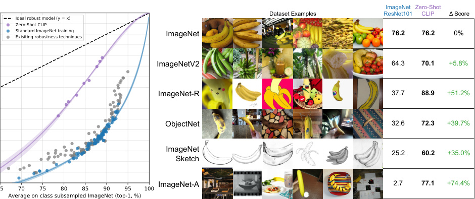
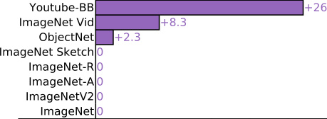

# CLIP: Learning Transferable Visual Models From Natural Language Supervision

> 这是一份给"完全没接触过 AI / 机器视觉"的读者写的精读笔记。所有"专业词"第一次出现都会解释清楚，并用生活场景打比方。只看这份笔记就能理解全文机制。

## 一句话讲什么（TL;DR）

教 AI 同时认图和认字，把 4 亿对网上图文塞进同一张坐标。之后你说"一只猫"，它就能从新图里挑出猫——不用为新任务再训一遍。

*所以这一节是想说：CLIP 用"图文对靠近"这个朴素目标，把视觉模型从"必须训一个分类头"的旧范式里解放出来，让一个模型直接听懂自然语言描述的任意类别。*

---

## 这是个什么场景

想象你在手机相册里翻找"去年在海边吃的那盘海鲜面"。相册 App 能不能直接搜到？以前不行——因为它只学过"猫/狗/人脸"这种固定标签，没学过"海鲜面"，更没学过"去年在海边"。要让它学会，你得人工再标 1000 张海鲜面照片，重新训一遍模型。每加一种菜都要重来。

这就是 2021 年之前视觉模型的老路：

1. 找一堆标好的图（比如 1000 张猫、1000 张狗）。
2. 训一个 CNN，末尾接一个"猫/狗"分类头。
3. 想识别第三种东西（兔子）？重训。换个领域（医学片）？重训。

两条死胡同：

**第一条：人工标注太贵**。给 100 万张图打"金标"贵到只有大公司玩得起。
**第二条：类别表是死的**。训完只能输出"猫/狗"，你说"穿蓝毛衣的柯基"它就傻了——softmax 头里根本没这个槽。

但同一时期 NLP 那边已经变天了：GPT 证明**直接读互联网原文**就能学会翻译、问答、写摘要，不用人工标注。论文一开头就追问一句很尖锐的话——**互联网上每张图旁边不都带着标题、alt 文字、网页说明吗？这些不就是天然的"监督信号"吗？为什么视觉不能这么学？**

CLIP 要解决的就是这个：**把网上随处可见的图文对（图 + 它周围的文字）当训练材料，让训出来的模型像 GPT 一样，看到新数据集不用重训也能干活。**



*所以这一节是想说：传统视觉模型被"固定类别 + 人工标注"两条铁链锁住，CLIP 的目标是把这两条链都解开，方法是借鉴 NLP 的"从原始文本中学"思路。*

---

## 之前的人怎么做的，为什么不够好

CLIP 不是第一个想"用文本监督学图像"的工作，论文老老实实列了一长串前辈：

- **1999 年 Mori 等人**：用图像配对的文档预测里面出现的名词形容词，做图像检索。
- **2016 年 Joulin 等人**：用 YFCC100M 数据集（1 亿张 Flickr 图）里的标题、描述、hashtag 训练 AlexNet 做"词袋多标签分类"，证明这种预训练能学到不错的表征。
- **2017 年 Visual N-Grams（Li 等人）**：把"类别名"转成 n-gram，让模型预测最可能的 n-gram 序列。这是第一个尝试 zero-shot 迁移到标准图像分类的工作，但 ImageNet 上只有 **11.5%** 准确率。
- **2020 年 VirTex / ICMLM / ConVIRT**：用 transformer + 图像 caption 任务做表征学习。证明可行，但只在 10-20 万张图上跑过。
- **2018 年 Mahajan 等人（Instagram hashtag）/ 2019 年 Kolesnikov 等人（JFT-300M）**：用"弱监督 + 大数据"路线，预测 1000 或 18291 个 hashtag/类别。性能不错，但被限制在了一个**固定的、有限的类别表**里——这正是 CLIP 想打破的束缚。

**关键差距**：之前的"自然语言监督"工作要么数据量太小（百万级），要么类别表是死的。CLIP 把这两件事同时做掉：**4 亿对数据 + 完全开放的文本类别**。

CLIP 还有个重要的"反思先驱失败"过程：他们一开始也试了 VirTex 那套——让模型预测图像对应的精确 caption。结果发现 transformer 语言模型预测 caption 学 ImageNet **比 bag-of-words 基线慢 3 倍**。原因：精确预测每个词太难、监督信号噪声大。换成对比学习（只预测"这张图配哪段文字"，不要求逐字匹配）之后，效率又涨了 4 倍。

*所以这一节是想说：自然语言监督这条路走了 20 年，但要么规模不够、要么任务太死板。CLIP 的贡献不是"想到了"，而是"找到了规模 + 对比学习这套高效组合"。*

---

## 这篇论文的新想法

CLIP 的关键想法拆成 3 个递进的洞察，每个先用一个生活类比开个头。

**洞察 1：把"图文匹配"当成预训练任务**

像办相亲大会——你不要求每个参会者写小作文介绍自己（太累），也不要求按"理工/文科"贴标签（太粗）。你只让大家在大厅里互相站位，**把真情侣牵到一起**就行。

具体到 CLIP：不让模型预测每个词（太难），也不让它预测固定类别（太死）。每个 batch 取 N 张图和 N 段文字，目标是把对角线上的 N 个真对认出来，把其他 N²-N 个假对推开。

**洞察 2：用同一个嵌入空间**

像把中文和法文都翻成"世界语"，然后看哪两条翻完意思最近。

图像编码器把图变成 512 维向量；文本编码器把句子变成 512 维向量；两个都做 L2 归一化后塞进同一个空间。"匹配"的判定就是简单的**余弦相似度**（cosine similarity，两个单位向量的点积，越接近 1 越像）。

**等等，先慢一拍——"嵌入空间"是什么？**
想象一张超高维的坐标图。"猫"图和"a photo of a cat"两段输入，被两个编码器分别投到这张图上的某个点。训练目标就是把这两个点拉近。

**洞察 3：训完后用"说话"召唤分类器**

像点菜——以前每开一家新餐厅都要重新印一本菜单；现在你只要说出菜名，菜单当场生成。

训练完 CLIP 后，下游分类任务（比如 ImageNet 1000 类）这样做：

1. 把 1000 个类名套进模板"a photo of a {label}"，丢给文本编码器，得到 1000 个 512 维文本向量。
2. 把这 1000 个向量当成一个**线性分类器的权重矩阵**（每个类一行）。
3. 来一张新图，过图像编码器得到 512 维向量，跟这 1000 个文本向量算余弦相似度，最大的那个就是预测类别。

论文一句话总结这个视角：**文本编码器是一个 hypernetwork（超网络，能生成另一个网络权重的网络），它根据自然语言描述，动态生成线性分类器的权重**。

*所以这一节是想说：CLIP 的核心创新是把"分类问题"重新表述成"图文检索问题"，并通过文本编码器把"训分类头"变成"念咒语生成分类头"。*

---

## 它分几步做的（方法）

具体到工程实现，CLIP 的 forward pass 简单到可以用 7 行 numpy 写完（论文 Figure 3 直接给了伪代码）。下面分步拆解：

### Step 1：构造数据集 WIT

**输入**：互联网上海量的网页（图 + 周围文字）。

**处理**：
- 从英文维基百科取出现 ≥ 100 次的所有词，加上高 PMI（pointwise mutual information，衡量两个词共现频率是否超出随机预期的指标）双词组合、高搜索量维基词条名、剩余 WordNet synsets（同义词集合），凑出 50 万个 query。
- 用这些 query 去爬互联网，每个 query 至多保留 2 万对（图，文），最终 4 亿对。

**输出**：WIT（WebImageText）数据集——4 亿个（图像, 文本）对。

**为什么这么做**：这一步本质是**类别均衡的搜索**——避免数据集被某几个高频概念（如"cat"、"dog"）主导。如果不限额，数据集会被热门概念淹没，冷门概念学不到。50 万 query × 至多 2 万对 = 理论上限 100 亿对，实际清洗后剩 4 亿对，可见过滤很严格。



### Step 2：编码器结构

CLIP 是"双塔"结构（dual encoder）：一个塔处理图像，一个塔处理文本，两个塔互相独立，只在最后的投影空间里"见面"。

**图像编码器（Image Encoder）**：

- **ResNet 系列**：ResNet-50（带改良：用 attention pooling 替代 global average pooling；加了 anti-aliased rect-2 blur pooling；用 Group Norm 替代 Batch Norm）。论文还训了 RN101、RN50x4、RN50x16、RN50x64 共 5 个版本——后面的 x4/x16/x64 表示宽度是标准 RN50 的几倍，按 EfficientNet 的复合缩放规则放大。
- **ViT 系列**：Vision Transformer，把图像切成固定大小的 patch（比如 14×14 像素一块），把每块当作一个"词"丢给 transformer。论文训了 ViT-B/32、ViT-B/16、ViT-L/14 三个版本。**最强版本是 ViT-L/14@336px**——L 表示 Large（24 层 transformer、1024 维隐藏层、307M 参数），14 表示 patch size 14×14，336 表示微调时把输入分辨率从 224 提升到 336。

**输入**：一张 RGB 图像，resize 到 224×224（或 336×336）。
**输出**：一个 d_i 维特征向量（ResNet 输出 2048 维，ViT-L 输出 1024 维）。

**文本编码器（Text Encoder）**：

- 12 层 transformer，宽度 512，8 个注意力头，共 63M 参数。
- 分词用 BPE（Byte Pair Encoding，一种子词分词方法），词表大小 49152。
- 最长 76 token——超过就截断。
- 取最后一层 [EOS] 位置（序列末尾的特殊标记）的激活作为整段文本的表征。

**输入**：一段英文文本（通常是图片的 caption / alt-text / 标题）。
**输出**：一个 d_t 维特征向量（512 维）。

**为什么两个编码器独立**：独立意味着推理时可以分开缓存——比如 zero-shot 分类时，1000 个类名的文本向量只需要算一次，后面来多少张图都只过图像编码器就行。这比交叉注意力模型（如 ViLBERT 那种"把图 patch 和文本 token 混在一起"的做法）推理快几十倍。

### Step 3：投影到统一空间

两个编码器输出维度不一样（图像 d_i 维 vs 文本 d_t 维），要把它们投影到同一个 d_e 维空间才能比较。

```
I_f = image_encoder(I)        # [N, d_i]  图像特征
T_f = text_encoder(T)          # [N, d_t]  文本特征
I_e = l2_normalize(I_f @ W_i)  # [N, d_e]  投影 + 归一化
T_e = l2_normalize(T_f @ W_t)  # [N, d_e]  投影 + 归一化
```

**输入**：图像编码器输出 I_f（N 个样本 × d_i 维）和文本编码器输出 T_f（N 个样本 × d_t 维）。

**处理**：各自乘一个**可学习的线性投影矩阵** W_i（d_i × d_e）和 W_t（d_t × d_e），然后做 L2 归一化（每个向量除以自己的长度，变成单位向量）。

**输出**：在同一个 d_e = 512 维空间里的单位向量 I_e 和 T_e。

**一个细节**：之前的对比学习（如 SimCLR）流行用非线性投影头（线性层 + ReLU + 线性层），CLIP 实验后发现线性投影就够了，干脆简化掉。论文分析可能是因为 CLIP 只做图文匹配而 SimCLR 做增强对比，目标更简单所以不需要更复杂的投影。

### Step 4：计算相似度矩阵

```
logits = (I_e @ T_e.T) * exp(t)   # [N, N]
```

**输入**：N 个图像嵌入和 N 个文本嵌入（都是单位向量）。

**处理**：矩阵乘法 I_e × T_e^T 得到 N×N 的余弦相似度矩阵——第 i 行第 j 列表示"第 i 张图和第 j 段文字有多像"。然后乘以 exp(t)。

`t` 是一个**可学习的温度参数**（temperature），在训练中作为标量参数被优化。直接学 log τ（即这里的 t = log τ）而不是 τ 本身，避免温度变负或变零。论文还把 exp(t) 上限 clip 到 100，防止训练不稳定。

**为什么需要温度**：余弦相似度范围在 [-1, 1]，如果直接丢给 softmax，概率分布会非常"平"——模型很难分辨正确配对和错误配对。乘以一个大的 exp(t)（比如 100）让 softmax 输出更"尖锐"，梯度信号更强。温度太低则梯度消失，太高则数值不稳定——所以让模型自己学。

**输出**：N×N 的 logits 矩阵，对角线上的值应该最大（因为第 i 张图应该和第 i 段文字最匹配）。

### Step 5：对称交叉熵损失

```
labels = arange(N)              # [0, 1, 2, ..., N-1] 对角线就是 ground truth
loss_i = cross_entropy(logits, labels, axis=0)  # 图→文方向
loss_t = cross_entropy(logits, labels, axis=1)  # 文→图方向
loss = (loss_i + loss_t) / 2
```

**输入**：N×N 的 logits 矩阵 + 对角线标签。

**处理**：
- **图→文方向**（axis=0）：对每行（每张图）做 softmax，要求"它对应的那段文字"概率最大。人话：给定一张图，在 N 段文字里挑出正确的那段。
- **文→图方向**（axis=1）：对每列（每段文字）也做 softmax，要求"它对应的那张图"概率最大。人话：给定一段文字，在 N 张图里挑出正确的那张。
- 两个方向取平均。

**人话翻译整个损失**：同一个 batch 里有 N 张图和 N 段文字。真配对只有 N 对（对角线），假配对有 N²-N 对。损失函数要求真配对的相似度远高于假配对。batch 越大，负样本越多，任务越难，学到的表征越好。

这个 loss 在度量学习里叫 N-pair loss，在对比学习里叫 InfoNCE（Info Noise Contrastive Estimation）。CLIP 的贡献不是发明它，而是把它放大到 N=32768、batch 跨 GPU sharding。

**输出**：一个标量 loss 值，反向传播更新所有参数。

### Step 6：训练规模

训了 8 个模型（5 个 ResNet + 3 个 ViT），这里列最关键的工程决策：

- **Batch size 32768**：这是 CLIP 能 work 的关键之一。对比学习里"负样本数 = batch_size - 1"，batch 越大、负样本越多、信号越强。32768 意味着每张图要和 32767 个"假对"区分——这就像在一个 3 万多人的相亲大会上找到唯一的"真命天子"，难度上去了，学到的眼光也就更准了。
- **32 epochs**：每张图看 32 遍，总共 4 亿 × 32 = 128 亿次 forward pass。
- **AdamW 优化器**：带权重衰减的 Adam，cosine 学习率衰减（开始快、后来慢，像刹车一样渐渐减速）。
- **算力**：最大模型 RN50x64 训了 **18 天 / 592 块 V100**；ViT-L/14 训了 **12 天 / 256 块 V100**。
- **混合精度训练**：用 FP16 加速计算，FP32 保持精度关键处（如 loss 计算）。
- **梯度 checkpointing**：用时间换显存——不存中间激活值，需要时重新计算。
- **跨 GPU sharding 相似度计算**：32768 × 32768 的相似度矩阵太大，按行分片到不同 GPU 上算。

### Step 7：Zero-shot 推理

训练完之后，CLIP 可以在从未见过的数据集上直接做分类——不需要任何该数据集的训练样本。

**输入**：一个新数据集（如 ImageNet 1000 类）的类名列表 + 测试图像。

**处理**：
1. 把每个类名套进文本模板（如 "a photo of a {label}."），丢给文本编码器，得到每个类的 512 维文本向量。论文最终用了 **80 个不同模板**做 ensemble（如 "a blurry photo of a {label}"、"a sculpture of a {label}" 等），取平均向量。
2. 来一张测试图，过图像编码器得到 512 维向量。
3. 计算测试图向量和所有类文本向量的余弦相似度，argmax 就是预测类别。

**输出**：预测类别标签。

**prompt engineering 是 CLIP 的"小秘密"**——论文说光是把 "{label}" 改成 "a photo of a {label}." 就能在 ImageNet 涨 1.3%。为什么？因为训练数据里的文本大多是"a photo of..."这种格式，加上这个前缀让推理时的文本分布更接近训练时的分布。80 个模板 ensemble 再涨 3.5%；总共 prompt 工程能涨 5%，相当于免费多 4 倍算力。

对于特定领域数据集，prompt 可以更精细——比如卫星图用 "a satellite photo of a {label}"，花卉分类用 "a photo of a {label}, a type of flower"。这些都是**元数据先验**，不需要训练样本。

*所以这一节是想说：CLIP 的算法本身极其简单（7 行 numpy 伪代码），真正难的是规模化训练（32K batch、600 GPU、混合精度）和 prompt 工程的工程经验。方法的每一步都很朴素，但组合起来在 4 亿数据上产生了涌现式的效果。*

---

## 关键数字（What works）

| 指标 | 数值 | 意义 |
|------|------|------|
| WIT 数据集规模 | 4 亿对 | 是当时学术界最大公开图文数据集 YFCC100M 的 4 倍 |
| 搜索 query 数 | 50 万 | 每 query ≤ 2 万对，做类别均衡 |
| 训练 batch size | 32768 | 对比学习里负样本数 = batch-1，batch 越大效果越好 |
| 文本最大长度 | 76 token | 超过截断，覆盖绝大多数 alt-text |
| ImageNet zero-shot top-1 | 76.2% | ViT-L/14@336px，追平有监督 ResNet-50 |
| ImageNet zero-shot top-5 | 95% | 追平 Inception-V4 |
| Prompt engineering 收益 | +5% | 80 模板 ensemble，等价于白送 4 倍算力 |
| 超越有监督基线的数据集数 | 16/27 | zero-shot 超过 ResNet-50 特征上的 logistic regression |
| Zero-shot 等价 few-shot | 4-shot | 零样本表现 ≈ 在同特征空间上跑 4-shot LR |
| 到 SOTA 还需 | 1000x 算力 | "用现有硬件不可行" |
| RN50x64 训练成本 | 18 天 / 592 V100 | 最大 ResNet 版本 |
| ViT-L/14 训练成本 | 12 天 / 256 V100 | 最强 ViT 版本 |
| MNIST zero-shot | 88% | 比原始像素 LR 还差——OOD 脆弱性 |
| 累计看图量 | 128 亿张 | 4 亿 × 32 epochs，"看 405 年" |
| Linear probe SOTA 数据集数 | 21/27 | 在 27 个数据集上 21 个 CLIP 线性探针最强 |
| ImageNet linear probe | 85.4% | ViT-L/14@336px，超越所有先前表征 |

*所以这一节是想说：4 亿数据 + 32K batch 是规模性突破的两个关键数字；76.2% zero-shot ImageNet 是结果性突破；MNIST 上的 88% 提醒你这个模型并非万能。*

---

## 实验结果说明了什么

论文做了三组核心实验，每组回答一个关键问题。

**实验一：Zero-shot Transfer（3.1 节）——不训练能用吗？**

CLIP 在 27 个数据集上做 zero-shot 评估（不用任何训练样本），和"在 ResNet-50 特征上拟合有监督 logistic regression"做对比。结果：16/27 个数据集上 zero-shot CLIP 直接超过有监督基线。特别是在 ImageNet 上，76.2% 的 zero-shot 准确率追平了从头训练的 ResNet-50——这意味着一个从未在 ImageNet 上训练过的模型，靠"念出类名"就能打平一个在 128 万张 ImageNet 图上训了几十个 epoch 的有监督模型。

但也有惨败案例：在需要细粒度识别（如区分 100 种花 Flowers102、37 种宠物 OxfordPets）、抽象推理（如计数 CLEVRCounts）、专业领域（如卫星图 EuroSAT）的数据集上，CLIP 远不如有监督基线。结论：CLIP 的 zero-shot 泛化力取决于概念是否出现在互联网图文对里。

**实验二：Representation Learning（3.2 节）——特征本身好不好？**

冻住 CLIP 的视觉编码器，在输出特征上训练线性分类器（linear probe）。这个实验剥离了"prompt engineering"的影响，纯评估表征质量。结果：ViT-L/14@336px 在 27 个数据集中 21 个达到 SOTA——超越了 Instagram hashtag 预训练的模型、JFT-300M 预训练的 BiT 模型、以及各种自监督方法。ImageNet linear probe 达到 85.4%，刷新了表征学习的记录。

这说明 CLIP 不仅是"零样本好用"，它学到的视觉表征本身就是当时最强的通用视觉特征。

**实验三：Robustness（3.3 节）——换了环境还行吗？**

在 ImageNet 的 7 个分布偏移变体上测试（ImageNet-V2、ImageNet-R、ImageNet-A、ImageNet-Sketch、ObjectNet 等）。传统有监督模型在这些变体上性能大幅下降（比如从 76% 掉到 20%），而 zero-shot CLIP 几乎不掉——在 ImageNet-Sketch 上甚至比有监督 ResNet-101 高 14 个点。

论文的解释：有监督模型过度拟合了 ImageNet 数据集的特定"视觉偏差"（如特定角度、特定背景），而 CLIP 因为训练数据极其多样，没有学到这些偏差。但这个鲁棒性不是免费的——在真正 OOD 的 MNIST 上，CLIP 直接拉胯。

**综合结论**：CLIP 证明了一件事——**自然语言监督 + 规模化对比学习可以学到既通用又鲁棒的视觉表征**，代价是需要海量数据和算力，且在训练分布之外的真 OOD 数据上仍会失败。

*所以这一节是想说：三组实验分别证明了 zero-shot 可用、表征质量最强、分布偏移鲁棒——但都有同一个边界条件：概念必须在互联网图文对里出现过。*

---

## 你应该懂的几个新词

- **对比学习（Contrastive Learning）**：一类自监督学习方法，目标是让"相似样本"靠近、"不相似样本"远离。生活类比：在一堆照片里找到你认识的人——你不需要知道每张照片里的人叫什么名字（无标签），你只需要判断"这张和那张是不是同一个人"。CLIP 把"配对的图文"当作正样本对，"不配对的"当作负样本。

- **嵌入空间（Embedding Space）**：把不同模态（图、文）通过编码器映射到的同一个高维向量空间。生活类比：像世界语——不管你说中文还是法语，翻译成世界语之后就能互相比较意思远近了。CLIP 用 512 维。

- **余弦相似度（Cosine Similarity）**：两个向量夹角的余弦值，等于 L2 归一化后的点积。范围 [-1, 1]，越大越像。生活类比：两个人面朝同一方向的程度——完全同向是 1，垂直是 0，反向是 -1。CLIP 整个训练目标都是基于这个相似度。

- **InfoNCE 损失**：对比学习的标准损失函数，本质是带温度的多分类交叉熵，把"正样本对"当成正确类别，把同 batch 其他样本当成错误类别。名字来自 Noise Contrastive Estimation（噪声对比估计）的信息论版本。

- **Zero-shot Transfer（零样本迁移）**：模型在不见任何下游数据集训练样本的情况下直接评测。生活类比：你从没去过日本，但因为看了很多日本美食纪录片，到了东京能认出大部分菜——你"零样本"掌握了分类能力。CLIP 把 NLP 里的 zero-shot 概念引进了 CV。

- **Prompt Engineering（提示工程）**：通过修改输入文本模板来提升模型表现。生活类比：问路时说"请问到地铁站怎么走？"比说"地铁站？"能得到更好的回答——措辞影响结果。CLIP 在 GPT-3 之后把这个概念正式带进 CV。

- **温度参数 τ**：softmax 内部的缩放因子，控制概率分布的锐度。τ 越小分布越尖锐（"非黑即白"），τ 越大越平缓（"模棱两可"）。CLIP 把它做成可学习参数，省去人工调整。

- **Hypernetwork（超网络）**：一个生成另一个网络权重的网络。论文把 CLIP 的文本编码器解释成"根据类名生成线性分类器权重"的 hypernetwork——这是理解 CLIP zero-shot 能力的最佳视角。

- **Linear Probe（线性探针）**：评估表征质量的标准方法——冻住主干网络，只在特征上拟合一个线性分类器。如果线性探针准确率高，说明特征已经把类别信息编码好了。

- **ViT（Vision Transformer）**：把图像切成 patch 后用 transformer 处理，2020 年由 Dosovitskiy 等人提出。生活类比：把一张大照片切成小方块拼图，然后让 transformer 分析这些方块之间的关系。CLIP 用它做最强版本的图像编码器。

- **BPE（Byte Pair Encoding）**：一种子词分词方法，把"unhappiness"拆成"un + happi + ness"。好处是能处理任何新词而不需要巨大的词表。CLIP 文本编码器用 49152 大小的 BPE 词表。

- **WIT（WebImageText）**：CLIP 自己构造的 4 亿对图文数据集，名字源自维基百科风格的开放领域。**注意**：这个数据集没开源，只有模型权重开源了。后来社区复制出了 LAION-400M / LAION-2B 作为替代。

- **分布外（Out-of-Distribution，OOD）泛化**：模型在训练数据分布之外的数据上的表现。CLIP 在 ImageNet 系列变体（Sketch、A、R）上 OOD 鲁棒性很好，但在 MNIST 上很糟——因为互联网图文对里没有手写数字。

*所以这一节是想说：CLIP 引入或带火了"对比学习 + 嵌入空间 + zero-shot + prompt engineering"这一整套词汇，后续 VLM 论文几乎都在这个词典里讨论问题。*

---

## 它有什么搞不定的

CLIP 自己列了一长串 limitation，挑最重要的几条：

**1. 复杂、抽象、专业的任务很弱**
- 细粒度分类（车型、花种、飞机型号）不行，因为预训练数据里这些细分概念出现频率低。
- 计数（CLEVRCounts）不行——CLIP 看不出"3 个红立方体"和"4 个红立方体"的区别。
- 距离估计（KITTI）不行——它没有 3D / 几何理解能力。
- 卫星图（EuroSAT、RESISC45）和医学图（PatchCamelyon）不行——这些视觉概念在互联网图文对里几乎不出现。

**2. 真 OOD 数据上脆弱**
- 经典反例：MNIST 上 zero-shot CLIP 只有 88%，**比在原始像素上跑 logistic regression 还差**。
- 原因：互联网图文对里几乎没有手写数字这种像 MNIST 的图。
- 论文一句话点破：**"CLIP 没有解决深度学习的脆弱泛化问题，只是寄希望于把数据放大到一切都在分布内"**——MNIST 一个简单反例就证伪了这个假设。

**3. 仍受限于"给定的类别集合"**
- CLIP 只能在你提供的 N 个类名里选最可能那个，**不能像 image captioning 那样生成新描述**。
- 论文建议未来工作：把对比目标和生成目标联合训练（这个方向后来变成了 [BLIP](blip.md) / CoCa）。

**4. Few-shot 反而比 zero-shot 差**
- 这是个反常现象。给 CLIP 加 1-shot 训练样本（在特征上拟合 logistic regression），性能反而下降，因为线性分类器一开始拟合不好"自然语言生成的初始分类器"。
- 4-shot 才追平 zero-shot，16-shot 才超过。
- 这跟人类完全相反——人类一张例图就能学会新概念。

**5. 算力天花板**
- 论文估算 zero-shot CLIP 想到 SOTA 还要 **1000 倍算力**——"用现有硬件不可行"。
- 这是后续 SigLIP、EVA-CLIP 等工作要解决的问题。

**6. 数据效率没解决**
- 32 epochs × 4 亿对 = 128 亿次图像 forward。"如果每秒看一张，要看 405 年"。
- CLIP 是"用规模换效率"的典型，没解决根本的数据效率问题。

**7. 评估方式有"作弊"嫌疑**
- 论文坦白：他们在开发过程中反复在完整 validation set 上调试，这本身就违反了 zero-shot 的精神。
- 27 个评估数据集是"cherry-picked"——为了配合 CLIP 的优势挑出来的。

**8. 社会偏见**
- 训练数据没过滤，CLIP 学到了大量种族、性别偏见。论文 7.1 节专门讨论。
- 在 FairFace 上做的初步探针显示偏见明显存在。

*所以这一节是想说：CLIP 的能力边界很清晰——能做的是"互联网常见视觉概念上的开放分类"，不能做的是"细粒度、抽象推理、专业领域、真 OOD"，并且整套训练流程在数据效率和评估严谨性上都有遗留问题。*

---

## 它和别的几篇是什么关系

CLIP 处于多条研究线的交汇点：

**上游（CLIP 借鉴了什么）**：
- **GPT-1/2/3**（Radford 等，2018-2020）——zero-shot transfer 的概念、prompt engineering 的雏形、"任务无关预训练"的哲学全都来自 GPT 系列。CLIP 团队就是 OpenAI 自己。
- **InfoNCE / SimCLR / MoCo**（Oord 2018, Chen 2020, He 2019）——对比学习损失函数和大 batch 训练的工程经验。
- **ConVIRT**（Zhang 等，2020）——医学图像领域的对比图文预训练，CLIP 直接说自己是"ConVIRT 的简化版 + 大规模化"。
- **Visual N-Grams**（Li 等，2017）——第一个尝试 zero-shot 迁移到标准分类数据集的工作，CLIP 把它的 11.5% 提升到 76.2%。
- **ViT**（Dosovitskiy 等，2020）——CLIP 最强版本的图像编码器。

**下游（CLIP 启发了什么）**：
- **DALL-E 2 / Stable Diffusion**——文生图模型几乎全部用 CLIP 文本编码器作为条件输入，因为它把文本嵌进了视觉空间。
- **[Flamingo](flamingo.md) / [BLIP](blip.md) / [LLaVA](../notes/llava.md) / CoCa**——后续视觉-语言基础模型，要么直接用 CLIP 视觉编码器，要么把 CLIP 的对比目标和生成目标联合起来。
- **OpenSeg / GroupViT / SAM 文本头**——开放词表分割，把 CLIP 的"文本生成分类器"思路从分类扩展到分割。
- **Open-vocabulary Detection**（OVD）——开放词表检测，类似思路。
- **CLIP-as-evaluator**——CLIP score 被广泛用作评估生成模型（图像生成、视频生成）的指标。

**和具身智能（embodied AI）的关系**：
- 在本研究路径里，CLIP 是 **vlm-foundation** 这个 topic 的"founder"代表作。
- 具身智能里的 VLA（视觉-语言-动作）模型，比如 [RT-2](rt-2.md)、[OpenVLA](openvla.md)，都用 CLIP 风格的视觉编码器把"语言指令 + 视觉观察"对齐到同一空间。
- [ImageBind](imagebind.md) 把 CLIP 的双模态对齐扩展到六模态——CLIP 是它的直接灵感来源。
- [3D-Shape2VecSet](3dshape2vecset.md) 处理 3D 形状表征时参考了 CLIP 的对比训练范式。
- 视觉导航（如 CLIP-Nav）直接用 CLIP 算"当前画面和目标描述的相似度"作为导航信号。
- 没有 CLIP 把视觉和语言放进同一空间，后面所有"用语言指令操控机器人"的工作都没有落脚点。

**同 Batch 论文关系**：
- **[BLIP](blip.md)**：BLIP 可以看作 CLIP 的"升级版"——它不满足于只做对比（判别），还要做生成（caption）和匹配（ITM），三个目标联合训练。BLIP 解决的正是 CLIP "搞不定的 #3"——不能生成描述。
- **[Flamingo](flamingo.md)**：Flamingo 把 CLIP 的视觉编码器作为"眼睛"接在大语言模型前面，用 Perceiver Resampler 做视觉 token 压缩。如果说 CLIP 教会了 AI "认图"，Flamingo 就是教它"看图聊天"——从判别到生成的飞跃。

*所以这一节是想说：CLIP 是 2021 年后视觉-语言研究的"地基"，往前继承了 GPT 和对比学习两条主线，往后辐射了文生图、VLM、open-vocabulary、VLA 整个生态。同 batch 的 BLIP 和 Flamingo 分别在"生成能力"和"对话能力"上补了 CLIP 的短板。*

---

## 和本导读的关系

CLIP 对应导读的 **[第 8 章：VLM 地基 (I)](../guide/ch08-clip.md)**，是整个"视觉-语言基础模型"主线的第一站。导读 Ch08 从"手机相册搜不到海鲜面"这个故事引入，用"相亲大会"类比 InfoNCE 对比学习，最后还额外补充了 CLIP 的后继者（OpenCLIP、SigLIP、EVA-CLIP、CLIPA）和工业部署经验——这些内容本笔记没有展开，建议配合阅读。

在导读全局路径中，CLIP 的位置是：

```
Ch01-07（基础：RL、Transformer、LLM）
    ↓
Ch08 CLIP ← 你在这里
    ↓
Ch09 BLIP-2 & LLaVA（从"认图"到"看图说话"）
    ↓
Ch10 规划（SayCan、Code-as-Policies、PaLM-E）
    ↓
Ch11-12 VLA（RT-1/2、OpenVLA）
```

CLIP 是这条路径的"地基层"——后面所有需要"把图像理解为语言能描述的东西"的工作，都直接或间接站在 CLIP 提供的视觉-语言对齐空间上。

*所以这一节是想说：在本导读体系里，CLIP 是 Ch08 的核心论文，理解了它才能理解后续 BLIP/LLaVA 为什么要加生成能力（Ch09）、为什么 VLA 能用语言指令控制机器人（Ch11-12）。*

---

## 思考题

**Q1：如果把 CLIP 的 batch size 从 32768 降到 256，你预期会发生什么？为什么？**

<details>
<summary>提示</summary>

对比学习中负样本数量 = batch_size - 1。想想相亲大会的类比：在 32767 人里找到正确配对 vs 在 255 人里找到正确配对，哪个任务更难？更难的任务训练出来的"眼光"更准。论文的 ablation 也直接证实了这一点——batch 越大性能越好，且关系不是线性而是对数的。
</details>

**Q2：CLIP 在 MNIST 上表现极差（88%），如果你要让 CLIP 在 MNIST 上达到 99%+，有哪些策略？各自的代价是什么？**

<details>
<summary>提示</summary>

至少三条路：(1) 在 WIT 数据集里加入大量手写数字图文对重新训练——代价是重训整个 4 亿数据集；(2) 在 CLIP 特征上训练线性分类器（linear probe）——论文证明这样做 MNIST 能达到 99%+，但失去了 zero-shot 的优势；(3) 用 prompt engineering 尝试更好的文本模板——但论文实测这对 MNIST 帮助有限，因为根本问题是图像分布 OOD。
</details>

**Q3：论文说"文本编码器是 hypernetwork"。请具体解释：当你做 ImageNet 1000 类 zero-shot 分类时，文本编码器"生成"了一个什么形状的"网络"？这个"网络"的输入输出分别是什么？**

<details>
<summary>提示</summary>

文本编码器把 1000 个类名各编码为 512 维向量，堆起来形成 1000×512 的权重矩阵 W。这等价于一个线性分类器：输入是 512 维图像特征 x，输出是 W·x = 1000 维 logits。所以文本编码器"生成"了一个输入 512 维、输出 1000 维的线性层的权重。
</details>

**Q4：为什么 CLIP 选择对比学习而不是让模型逐词预测 caption？论文给出了什么实验证据？**

<details>
<summary>提示</summary>

论文 Section 2.3 的 Figure 2 直接对比：用 transformer 语言模型预测精确 caption 学 ImageNet zero-shot 比 bag-of-words 预测基线**慢 3 倍**（达到同等准确率需要 3 倍训练计算量）。切换到对比目标后效率又涨了 **4 倍**。原因：caption 预测要求模型学会精确描述图像的每个细节（"一只棕色的大狗躺在红色沙发上"），但大量互联网文本是噪声很大的（alt-text 经常和图片半相关），逐词预测目标让模型把计算量浪费在拟合噪声上。对比目标只问"这张图和哪段话配对？"——更宽松也更高效。
</details>

**Q5：如果有人告诉你"CLIP 能理解任何图像"，你会怎么反驳？请给出至少 3 个具体的失败类型。**

<details>
<summary>提示</summary>

(1) 计数——CLIP 分不清"3 个苹果"和"5 个苹果"，因为 InfoNCE 只学"有没有苹果"不学"几个"；(2) 空间关系——CLIP 分不清"猫在箱子里"和"猫在箱子上"，因为对比学习不建模词序语义；(3) 专业领域——手写数字（MNIST 88%）、组织切片（PatchCamelyon）、卫星图等互联网罕见图像；(4) 组合性——"红色的杯子和蓝色的盘子"vs"蓝色的杯子和红色的盘子"，CLIP 可能分不清属性绑定。
</details>

**Q6：CLIP 和 ALIGN（Google 同期工作）的方法几乎相同，但数据处理策略不同。CLIP 用 50 万 query 均衡采样 4 亿对，ALIGN 用 18 亿对未过滤数据。你认为哪种策略更好？在什么情况下结论会反转？**

<details>
<summary>提示</summary>

CLIP 的均衡策略保证了尾部概念的覆盖（如"海葵"这种冷门词也有 2 万对），避免热门概念主导梯度。ALIGN 的策略更简单、数据量更大，但热门概念可能过度代表。当你关心尾部类别（如细粒度分类、罕见物体检测）时 CLIP 策略更好；当你只关心头部概念的泛化或者数据清洗成本太高时 ALIGN 策略更实用。LAION-5B 后来证明"极大量数据 + 轻过滤"也能 work——这个争论至今没有定论。
</details>

**Q7：CLIP 的 prompt engineering 对 zero-shot 效果影响很大（+5%），但对 linear probe 几乎没影响。为什么？**

<details>
<summary>提示</summary>

Zero-shot 依赖文本向量作为分类器权重——文本模板越接近训练时的文本分布，权重越"正确"。Linear probe 则完全忽略文本编码器——它只用图像编码器的特征，训练自己的分类权重。所以 prompt 的好坏只影响"文本生成的权重质量"，不影响"图像特征本身的质量"。
</details>

---

## 一些好奇心问答（FAQ）

**Q1：CLIP 和"图像 caption 模型"有什么本质区别？**
A：caption 模型（生成式）要预测每个词，目标是"输出最可能的描述"；CLIP（判别式 / 对比式）只要求"在 N 个候选里挑出真 caption"，不关心生成。论文 Figure 2 直接对比：caption 模型学 ImageNet 比 CLIP 慢 12 倍。

**Q2：为什么 batch size 必须那么大（32768）？**
A：对比学习里负样本数 = batch_size - 1。负样本越多，模型要"推开"的"假对"越多，监督信号越强。batch 太小（比如 256）训出来的 CLIP 性能会差很多。这也是为什么 CLIP 必须用 600 块 V100 训的原因之一——单卡放不下这么大 batch。

**Q3：温度参数 τ 为什么要可学习？**
A：τ 控制 softmax 锐度（小 τ 锐、大 τ 平）。手调很难——大模型和小模型最佳 τ 不一样，训练初期和末期最佳 τ 也不一样。CLIP 把 log τ 做成参数让模型自己学，省去一个调参。

**Q4：为什么 zero-shot CLIP 能追平有监督 ResNet-50？**
A：本质是数据量碾压。ResNet-50 看 128 万张图、1000 类；CLIP 看 4 亿对图文、覆盖几乎所有英文维基百科概念。规模扩大到这个程度，"自然语言监督"的弱信号反而成了"概念多样性"的优势。

**Q5：prompt engineering 真的有那么重要吗？**
A：对 zero-shot 重要。光是把 "{label}" 改成 "a photo of a {label}." 在 ImageNet 涨 1.3%；80 个模板 ensemble 再涨 3.5%。这个量级相当于"白送 4 倍算力"。但对 linear probe 不重要——线性分类器会自己学好。

**Q6：CLIP 能做开放词表的"图像生成"吗？**
A：本身不能。CLIP 是判别模型，不是生成模型。但 DALL-E 2 / Stable Diffusion 把 CLIP 的文本编码器当成"语言→视觉空间"的桥梁，再叠一个 diffusion decoder 完成生成——CLIP 是它们的关键组件之一。

**Q7：WIT 数据集开源了吗？**
A：**没有**。OpenAI 只开源了模型权重和代码，4 亿对原始数据没放。后来 LAION 团队复刻出了 LAION-400M、LAION-2B 等开源版本，被 OpenCLIP、SigLIP 等开源项目使用。

**Q8：CLIP 和 ALIGN（Google 同期工作）什么关系？**
A：ALIGN（Jia 等，2021）和 CLIP 几乎同时出现，思路非常相似——也是图文对比 + 大规模数据。ALIGN 用了 18 亿对噪声更大的图文数据，证明"数据可以更脏"。两篇可以视为孪生工作，但 CLIP 因为开源 + 名字好记 + OpenAI 影响力更大，最终成了行业标准。

**Q9：为什么 CLIP 在 MNIST 上反而很差？**
A：互联网图文对里几乎没有手写数字图——CLIP 见过的"数字"几乎都是印刷体或屏幕渲染。MNIST 是真正的 OOD 数据，CLIP 直接抓瞎。这个例子被反复用来证明"大数据并不等于解决了泛化问题"。

**Q10：我现在能用 CLIP 做什么实际项目？**
A：开箱即用的场景非常多——用 cosine similarity 做开放词表的图像检索（"找出所有戴帽子的人"）；给生成模型当条件输入或评估指标（CLIP score）；zero-shot 分类器做新数据集的快速基线；配合 FAISS 做大规模图文检索；做"图像-文本对齐度"的过滤器（如清洗噪声数据集）；在具身智能里做"语言指令对齐当前观察"的相似度信号。

*所以这一节是想说：CLIP 的关键问题大多围绕"为什么这么简单的方法能 work"和"这个方法的能力边界在哪里"——理解了规模、对比目标、自然语言监督这三件事的相互作用，大部分疑问就能自答。*

---

## 如果你想再深入

**直接前置（建议先读）**：
- **GPT-2 / GPT-3**（Radford 2019, Brown 2020）——zero-shot transfer 范式来源。
- **SimCLR**（Chen 2020）——对比学习在视觉表征上的代表作，CLIP 借鉴了 InfoNCE 和大 batch 思路。
- **ViT**（Dosovitskiy 2020）——CLIP 最强版本的图像编码器。
- **ConVIRT**（Zhang 2020）——医学图像领域的图文对比预训练，CLIP 直接说自己是它的简化版 + 大规模化。

**直接后续（CLIP 之后必读）**：
- **ALIGN**（Jia 2021）——Google 同期工作，孪生方法，18 亿数据。
- **DALL-E 2**（Ramesh 2022）——CLIP + diffusion 文生图。
- **[Flamingo](flamingo.md)**（Alayrac 2022）——CLIP 视觉编码器 + 大语言模型 = 通用 VLM。
- **[BLIP](blip.md) / BLIP-2**（Li 2022/2023）——把对比、匹配、生成三个目标联合训练。
- **[LLaVA](../notes/llava.md)**（Liu 2023）——CLIP 视觉特征 + LLM 微调，开源 VLM 标杆。
- **OpenCLIP / LAION**（Schuhmann 2022）——开源复现 CLIP，加上更大的数据集。
- **SigLIP**（Zhai 2023）——把 CLIP 的 softmax 损失换成 sigmoid，单卡也能训。
- **EVA-CLIP**（Sun 2023）——更高效的训练 + 更大模型规模。

**和具身智能交叉**：
- **CLIP-Nav / VLN-CLIP**——用 CLIP 做视觉语言导航。
- **[RT-2](rt-2.md)**（Brohan 2023）——VLM 输出动作 token，CLIP 思想的具身版。
- **[OpenVLA](openvla.md)**（Kim 2024）——开源 VLA 模型，视觉编码器用 CLIP / SigLIP。
- **CLIPort**（Shridhar 2021）——CLIP + Transporter Networks 做语言条件操作。

**批判 / 反思类**：
- **Failure modes of CLIP**（多篇 follow-up）——细粒度、计数、组合性、空间推理上的失败案例。
- **Bias in CLIP**（Agarwal 等）——CLIP 在性别、种族上的偏见量化。
- **Reproducing CLIP**（OpenCLIP 的工程笔记）——复现 CLIP 时遇到的全部坑。

*所以这一节是想说：CLIP 是一个生态的起点，往前读 GPT/SimCLR/ViT 理解它从哪里来，往后读 BLIP/Flamingo/LLaVA 理解它走向哪里，再读 SigLIP/OpenCLIP 理解工程上怎么用。*

---

## 原文信息

**论文标题**：Learning Transferable Visual Models From Natural Language Supervision

**作者**：Alec Radford, Jong Wook Kim, Chris Hallacy, Aditya Ramesh, Gabriel Goh, Sandhini Agarwal, Girish Sastry, Amanda Askell, Pamela Mishkin, Jack Clark, Gretchen Krueger, Ilya Sutskever

**机构**：OpenAI

**发表**：ICML 2021

**链接**：
- 论文：https://arxiv.org/abs/2103.00020
- 代码：https://github.com/openai/CLIP
- 博客：https://openai.com/research/clip

**BibTeX**：

```bibtex
@inproceedings{radford2021learning,
  title={Learning Transferable Visual Models From Natural Language Supervision},
  author={Radford, Alec and Kim, Jong Wook and Hallacy, Chris and Ramesh, Aditya and Goh, Gabriel and Agarwal, Sandhini and Sastry, Girish and Askell, Amanda and Mishkin, Pamela and Clark, Jack and Krueger, Gretchen and Sutskever, Ilya},
  booktitle={International Conference on Machine Learning (ICML)},
  year={2021},
  organization={PMLR}
}
```
