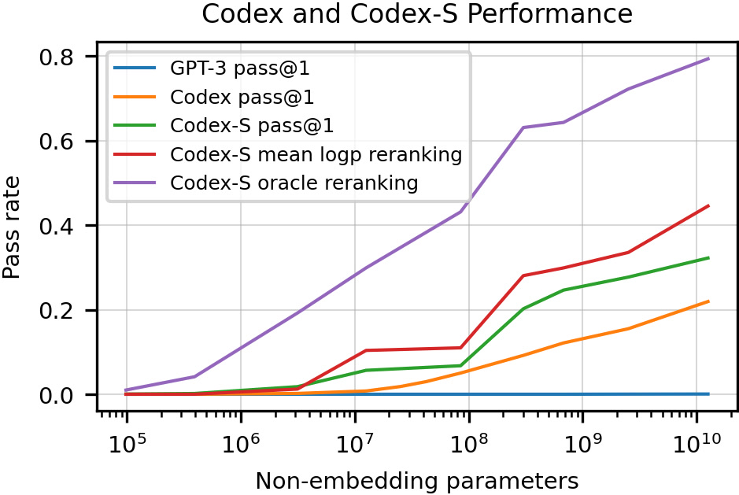
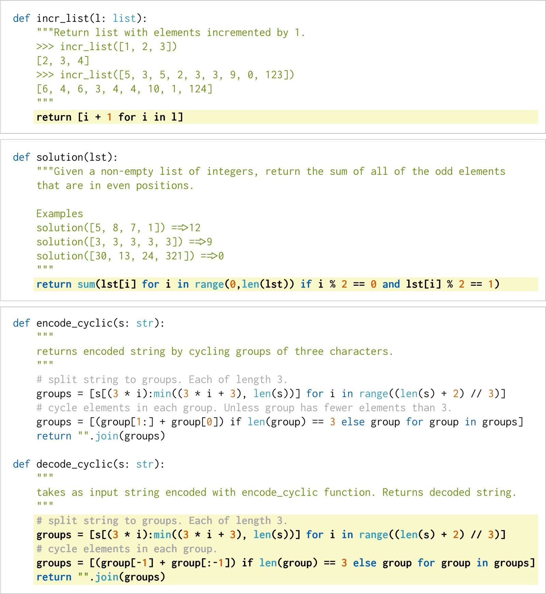
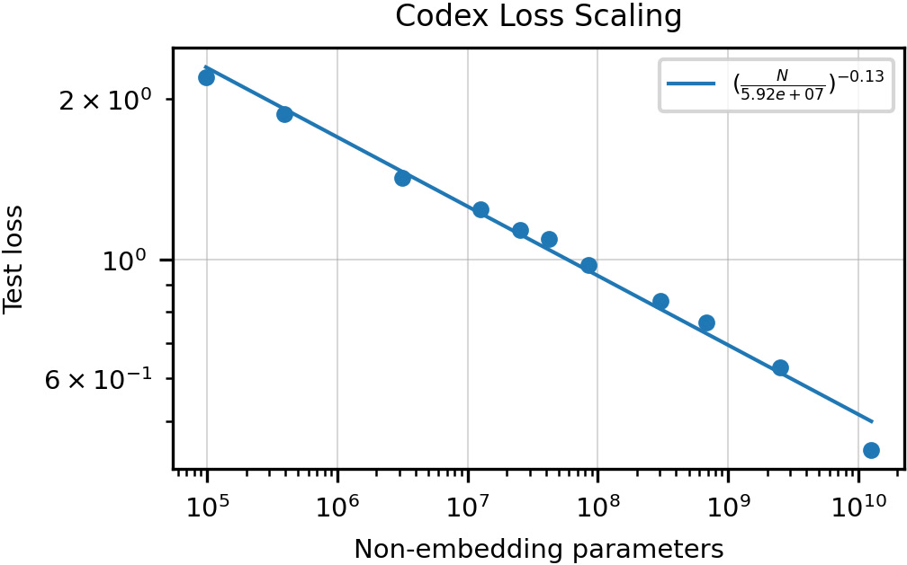

# Code as Policies: Language Model Programs for Embodied Control

## 1. TL;DR

让 LLM 直接写 Python 代码作为机器人的策略（policy），而不是从预训练技能库中选动作。代码可以包含循环、条件判断、NumPy 运算、递归函数定义，因此能在不做任何额外训练的情况下，通过 few-shot prompting 让机器人执行任意复杂度的新指令——只要感知和控制 API 覆盖得到。

*所以这一节是想说：CaP 的核心贡献是把"LLM 输出自然语言计划"升级为"LLM 输出可执行代码"，一举获得编程语言的全部表达力。*

---

## 2. 场景

目标场景是**自然语言指令 → 机器人执行**的全链路：用户用日常语言描述一个操作任务（"把颜色不一样的方块放进对应颜色的碗里""画一个比刚才小一点、稍微靠左的金字塔""从桌上拿可乐放到水果中间"），系统需要理解指令并在真实或仿真环境中完成动作。

论文演示了四个实际平台：(a) UR5e 桌面机械臂做 pick-and-place；(b) UR5e 配白板做 2D 画图（画六边形、金字塔、对称图案）；(c) 仿真 Ravens 环境做 10 blocks + 10 bowls 的大规模定量评测；(d) Everyday Robots 移动机械臂在真实厨房做导航 + 抓取任务。

共同特征：任务高度开放（open-ended），用户可以随时说出从未在训练数据或示例中出现过的新指令，且指令往往包含精确的空间几何推理（"往右移 10cm""沿对角线排列""画一个圆包住某物体"）。

*所以这一节是想说：CaP 不是针对一个特定操作任务的解决方案，而是一个跨平台、跨任务的通用框架——只要能定义 API，就能换装。*

---

## 3. 之前方法

2022 年前让机器人理解自然语言的主流路线有四条，每条都有致命短板：

**词法解析（Lexical Parsing）**——把自然语言映射成预定义的语义表示（如 TAMP 中的 PDDL）。问题：覆盖不了新表达、不能泛化。

**端到端模仿/强化学习**——用 behavior cloning 或 RL 从大量示范中训策略（如 BC-Z、CLIPort）。问题：每个新任务要采集成千上万条演示数据，换机器人或换场景就作废。

**LLM 当语言规划器（SayCan / Huang et al. 2022）**——LLM 输出自然语言步骤列表，从固定的预训练技能库中逐步选执行。问题：技能集封闭——用户说"往右移 10 厘米"，如果库里没有对应的技能就直接失败；所有逻辑、循环、空间计算都被锁死在有限的技能标签里。

**Socratic Models**——多模态模型互相对话生成计划。问题：本质还是调用预定义的语言条件策略，无法现场写出新的控制逻辑。

共同瓶颈用一句话概括：**LLM 只能"挑"动作，不能"造"动作**。一旦遇到需要算坐标、写循环、组合库函数的指令，整个流水线就崩溃。

论文中最精彩的对比：让系统执行 "move the coke can a bit to the right"——SayCan 输出 `1. Pick up coke can / 2. Move a bit right / 3. Place coke can`，但第 2 步在技能库里不存在，卡死。CaP 则直接写出 `pos.y + 0.1` 的 Python 代码，根本不依赖任何预训练技能。

*所以这一节是想说：CaP 之前的方案用 LLM 做"技能选择器"，表达力被技能库的上限卡住；CaP 把 LLM 升级为"代码生成器"，表达力变成了编程语言本身。*

---

## 4. 新想法

核心创新可以用一句话讲清：**让 LLM 不从固定菜单里挑技能，而是当场写 Python 代码，代码本身就是机器人的 policy。**

这行得通有三个前提洞察：

1. **代码 = 控制流 + 算术 + 库调用**。`if/else`、`for/while`、NumPy 向量加法、Shapely 几何操作——这些是 LLM（Codex）在 GitHub 代码上预训练时就已经学会的。用代码表达策略，免费拿到了编程语言的全部表达力。

2. **LLM 自带数值常识**。你说 "a bit to the left"，它写 `+ [-0.1, 0]`；你说 "way to the left"，它写 `+ [-0.5, 0]`。这种"对模糊描述的数值映射"是预训练时从代码注释中隐式习得的，不需要任何机器人领域的训练数据。

3. **分层递归定义函数**。LLM 写代码时可以调用一个还没定义的函数（如 `is_empty(bowl)`），CaP 会再调一次 LLM 把这个子函数也写出来。这允许复杂逻辑像写论文一样"先列大纲再展开"——作者称之为 hierarchical code generation。

由此诞生的术语叫 **LMP（Language Model Program）**——泛指 LLM 生成、由系统直接执行的程序。Code as Policies 就是 LMP 在机器人领域的实例化。

*所以这一节是想说：核心思想极其简洁——"让 LLM 写代码当策略"，但它之所以 work 是因为 Codex 已经把"编程+常识"两件事都学好了。*

---

## 5. 方法

<!-- paper-figures:begin -->



*上图说明：Figure 1（ar5iv 原图）（论文原图）。*



*上图说明：Figure 2（ar5iv 原图）（论文原图）。*



*上图说明：Figure 3（ar5iv 原图）（论文原图）。*
<!-- paper-figures:end -->

方法占全文篇幅最大，因为 CaP 的价值全在"怎么设计 prompt + 怎么让生成的代码安全跑起来"这些工程细节上。下面按执行流水线逐步拆解，每步都展开到"够你自己复现"的程度。

### 5.1 Prompt 架构设计——告诉 LLM"你能用什么、该怎么用"

每个 LMP 的 prompt 由两大组件构成，二者协同定义了 LLM 的"行为边界"：

**Hints（提示/暗示）——以 import 语句传递 API 清单和类型约定**

Hints 部分形如：

```python
import numpy as np
from utils import get_obj_names, get_pos, put_first_on_second
from utils import get_obj_bbox_xyxy
```

LLM 看到这些 import 就"知道"自己可以调用哪些函数。但 Hints 传递的信息远不止"有哪些函数"——**函数命名本身就是一种隐式的类型文档**：

- `get_` 前缀：暗示"这个函数返回一个值"
- `put_first_on_second`：暗示"两个参数，第一个被放到第二个上面"
- `_xyxy` 后缀：暗示返回值是 `(x_min, y_min, x_max, y_max)` 格式的 bounding box
- `_np` 后缀：暗示变量或返回值是 NumPy 数组
- `_2d` / `_3d` 后缀：暗示坐标维度

作者在附录 A 中反复强调：**命名越遵循 Python 社区惯例，LLM 生成正确调用的概率越高**。比如把变量命名为 `point` 就有歧义（tuple? NumPy array? Shapely Point?），但命名为 `pt_np` 就明确告诉 LLM 该用 NumPy 向量运算。再比如 import 语句必须用 `from utils import get_pos` 而不是 `import get_pos`——如果用后者，LLM 可能把 `get_pos` 当作包名而写出 `get_pos.get_pos()`。

**Examples（示例）——few-shot 的核心载体**

Examples 是几对"注释形式的自然语言指令 → 对应的 Python 代码"，让 LLM 看着格式、调用风格、坐标系约定去模仿。论文中一个完整的 first-party 库 prompt 长这样：

```python
import numpy as np
from utils import get_pos, put_first_on_second
objs = ['gray block', 'gray bowl']
# put the gray block on the gray bowl.
put_first_on_second('gray block', 'gray bowl')
objs = ['purple block', 'purple bowl']
# move the purple bowl toward the left.
target_pos = get_pos('purple bowl') + [-0.3, 0]
put_first_on_second('purple bowl', target_pos)
```

几个精心设计的决策值得注意：(a) 每对示例前会列出当前场景中的可用物体（`objs = [...]`），让 LLM 知道当前环境中有哪些物体名可引用；(b) "toward the left" 对应 `+ [-0.3, 0]` 隐式建立了"左 = x 减小"的坐标系约定；(c) `put_first_on_second` 的第二个参数在不同示例中展示了两种用法——物体名（`'gray bowl'`）和坐标位置（`target_pos`）——让 LLM 学会这个 API 的多态性。

**Prompt 工程的七条关键法则（总结自附录 A）**：

1. 示例代码必须零 bug——prompt 里有 bug，LLM 会忠实模仿错误模式
2. 变量类型暗示要全局一致——不能一会把 `point` 当 NumPy 数组，一会当 Shapely Point
3. import 语句用 `from utils import func` 不用 `import func`
4. 多用 explicit type hints 后缀（`_np`、`_xyxy`、`_2d`）
5. 每个示例只展示一个核心能力（列表推导 / 坐标加法 / while 循环），不混杂
6. 第三方库显式 import 比隐式使用更可靠
7. 格式一致性胜过示例数量——5 个风格一致的示例效果好于 10 个风格混乱的示例

### 5.2 拼接用户指令与行为常识——"客人点菜"

用户说的新指令被格式化为 Python 注释，追加到 prompt 末尾。整个 prompt 的最终结构形如：

```
[Hints: import statements]
[objs = current scene objects]
[Example 1: # instruction → code]
[Example 2: # instruction → code]
...
[Previous session history: instruction_1 + code_1, instruction_2 + code_2]
[# new user instruction]    ← LLM 从这里开始续写
```

例如用户说 "move the red block a bit to the right"，拼接后 LLM 续写：

```python
# move the red block a bit to the right.
target_pos = get_pos('red block') + [0.1, 0]
put_first_on_second('red block', target_pos)
```

**行为常识（Behavioral Commonsense）——论文最惊艳的发现之一**。LLM 对模糊量词有上下文相关的数值直觉，这些映射不是硬编码的规则表，而是从 GitHub 代码 + StackOverflow 回答中隐式习得的：

- `"a bit"` → `0.1`（约 10cm）
- `"a little"` → `0.05`（约 5cm）
- `"way"` / `"far"` → `0.5`（约 50cm）
- `"faster"` → `velocity *= 2`（而非 `*= 1.001`）
- `"slower"` → `velocity *= 0.5`

更微妙的是这种映射是**上下文相关**的：如果示例中 "left" 对应 `[-0.3, 0]`，那 "a bit to the left" 会自动缩小为 `[-0.1, 0]`。LLM 是在模仿示例中的"量级比例关系"，而非记忆固定数字。这意味着只要 prompt 中的示例设定了合理的"基准幅度"，LLM 就能按比例推理出其他修饰词对应的数值。

这也解释了为什么 prompt 中的数值示例如此重要——它们不仅展示"语法格式"，更在隐式定义这个机器人环境中"一步多大""快是多快"的物理尺度。

### 5.3 LMP 组合（Composition）——微服务式的多专家分工

复杂任务不是一个 prompt 打天下。CaP 的核心架构设计是把系统拆成多个独立的 LMP，每个有专属 prompt 和职能，通过嵌套调用协作：

**顶层 UI LMP（tabletop_ui / mobile_ui / draw_ui）**：接收用户原始指令，判断该调用哪个下游 LMP，组合它们的返回值执行动作。类比：主厨看订单，决定分给烧烤站还是冷菜站。

**parse_obj_name LMP**：把自然语言物体描述映射为具体物体名。这个 LMP 本身能做复杂的语言+空间推理——例如输入 "the left most block"，它会用 NumPy 比较所有 block 的 x 坐标：

```python
block_names = ['red block', 'blue block']
block_positions = np.array([get_pos(name) for name in block_names])
left_block_name = block_names[np.argmin(block_positions[:, 0])]
ret_val = left_block_name
```

它也能处理语义描述——"sea-colored block" → 推理出是 "blue block"；"the other block" → 排除上文提到的那个，返回剩下的。

**parse_position / parse_shape_pts LMP**：把自然语言位置描述映射为坐标或路径点序列。比如 "a line from the red bowl to the blue bowl with 5 points" → `np.linspace(get_pos('red bowl'), get_pos('blue bowl'), 5)`。画图域中还有 transform_shape_pts 子 LMP 负责几何变换——"make it bigger" → 坐标乘缩放因子；"rotate 45 degrees" → 旋转矩阵。

**function_generation LMP**：专门生成还未定义的辅助函数（详见 5.6 分层代码生成）。

**为什么要拆开而不是用一个大 prompt？** 三个原因：(a) 每个 prompt 更短，有限的 token budget 留给更多相关示例——parse_obj 的 prompt 不需要包含画图示例；(b) 职能隔离让每个 LMP 的示例更聚焦，LLM 生成准确率更高；(c) 可以独立优化每个 LMP 的 prompt 而不影响其他部分。代价是每次用户指令可能触发多次 LLM 调用（一次 UI + 一次 parse_obj + 一次 function_gen = 3+ 次 API call），增加延迟和 cost。

### 5.4 安全检查——"出菜前安检"

生成代码在执行前必须通过静态安全扫描。检查三类禁止项：

- **禁止 `import` 语句**——防止加载危险库（如 `os`、`subprocess`、`socket`）。所有允许使用的库已经在 globals_dict 中预注入。
- **禁止 `__` 开头的特殊变量**——防止访问 Python 内部机制（如通过 `__builtins__.__import__` 绕过 import 检查，或通过 `__class__.__subclasses__()` 遍历类层次）。
- **禁止 `exec` / `eval` 调用**——防止嵌套执行（LLM 生成的代码不能再 exec 另一段动态字符串）。

检查方式是简单的字符串匹配扫描（非 AST 级语义分析），通过则放行。这个安全机制是"必要但不充分的"——它防不了所有攻击向量（比如通过已注入的 API 函数的副作用来执行危险操作），但在受控的机器人环境中、且代码由 LLM 而非恶意用户生成的前提下，实际够用。

### 5.5 用 `exec` 执行——代码直接驱动硬件

通过安全检查后，在受控的命名空间中执行生成代码：

```python
exec(generated_code, globals_dict, locals_dict)
```

这三个参数的设计是 CaP 运行时的核心：

**globals_dict 是能力的边界**。它预先装好了所有感知 API（`get_pos`、`get_obj_names`、`get_obj_bbox_xyxy`、`is_obj_visible`）、控制 API（`put_first_on_second`、`set_velocity`、`goto_pos`、`pick_obj`）、以及第三方库引用（`numpy`、`shapely`）。LLM 生成的代码只能调用 globals 中存在的东西——**这本质就是 API 层面的沙箱**。

**locals_dict 是执行结果的容器**。传入空字典，执行完毕后会填满 LLM 定义的所有变量和函数。如果 LMP 需要返回值（比如 parse_obj 要返回物体名），约定用 `ret_val` 变量名存储，调用方从 `locals_dict["ret_val"]` 取出。

**无中间层直接执行**——`put_first_on_second('red block', target_pos)` 被 exec 时，真的会触发机器人的 pick-and-place 原语：吸盘移动到物体上方 → 下降到接触 → 吸住 → 抬起 → 移动到目标位置 → 放下。没有"先模拟再确认"的安全网。这是 CaP 最大胆也最受争议的设计选择——效率极高（一次 exec 就完事），但出错成本大（代码逻辑写错可能导致机械臂撞击物体）。

**为什么敢这么做**：三重保护——(a) 前步安全检查过滤了明显危险代码；(b) globals 只注入安全的 API 函数，不含 `os.system` 之类系统级调用；(c) 底层控制原语内置了物理安全约束（关节力矩限制、碰撞检测、工作空间边界）。实际环境中机器人的动作空间本就受限——pick-place 有高度上限，velocity 有速度上限——所以"写了离谱的代码"顶多任务失败，不太会造成人身或设备损坏。

### 5.6 分层代码生成（Hierarchical Code-Gen）——本文最大的工程贡献

当 LLM 在顶层代码中调用了一个不在 globals_dict 中的函数时，CaP 不会报错，而是启动递归补全流程。这是论文最核心的技术创新——让 LLM 像写论文一样"先列大纲再展开细节"。

**Step 1: 用 AST 发现未定义函数**

用 Python 标准库 `ast` 模块解析生成代码的抽象语法树，遍历所有 `ast.Call` 节点，检查被调用的函数名是否存在于当前 scope（globals + 已生成的 locals）中。不存在的就加入"待生成"队列。

**Step 2: 调用 function_generation LMP 补全**

对每个未定义函数，构造一个新的 prompt。function_generation LMP 的 prompt 中包含 Hints（可用的底层 API）和 1-2 个函数生成示例，新指令形如：

```python
# define function: get_objs_bigger_than_area_th(obj_names, bbox_area_th).
```

LLM 续写函数体：

```python
def get_objs_bigger_than_area_th(obj_names, bbox_area_th):
    return [name for name in obj_names
            if get_obj_bbox_area(name) > bbox_area_th]
```

注意：这个生成的函数里又调用了 `get_obj_bbox_area`——一个同样未定义的函数。

**Step 3: 深度优先递归**

对 `get_obj_bbox_area` 重复 Step 1-2：

```python
# define function: get_obj_bbox_area(obj_name).
def get_obj_bbox_area(obj_name):
    x1, y1, x2, y2 = get_obj_bbox_xyxy(obj_name)
    return (x2 - x1) * (y2 - y1)
```

这次 `get_obj_bbox_xyxy` 在 globals 中（是 Hints 里 import 过的 API），递归终止。

**Step 4: 回溯拼装执行**

把所有递归生成的函数加入 locals_dict 的 scope，然后从顶层代码继续 exec。整个过程是**深度优先**的——先写叶子函数，回溯到中间函数，最后执行顶层逻辑。

**分层为什么有效？**

三个核心原因：(a) **降低单次生成复杂度**——每次 LLM 只需写一个短函数（通常 3-8 行），不需要在一段代码中铺平所有逻辑层；(b) **复用**——生成的辅助函数留在 scope 中，后续任务可以直接调用而不用重新生成，系统越用越强；(c) **对齐编程习惯**——好的程序员也是先写 high-level 逻辑再实现 helper，LLM 在训练时见过大量这种分层模式。

**为什么小模型分层反而无效？**

RoboCodeGen 上的数据清楚显示：GPT-3 6.7B 分层只比 flat 好 2 点（3% → 5%），cushman 在某些泛化类型上反而下降。原因：分层的前提是 LLM 能"合理地决定哪些逻辑该抽成子函数"——这本身是一个高阶的代码架构能力。小模型的抽象能力不够：(a) 要么把所有逻辑铺平不调用子函数（等同于 flat）；(b) 要么把不该拆的地方拆开，导致函数签名含糊，递归生成的子函数参数对不上。必须先达到一定的"代码设计能力阈值"（约 175B 参数或 Codex davinci 级别），分层才能正向叠加。

**分层不只对机器人有效——HumanEval 通用基准验证**

在 HumanEval（164 题通用 Python）上：Hierarchical 的 Greedy 通过率 53.0%，显著优于 Flat + No Prompt 的 45.7%（+7.3 点）和 Flat + Flat Prompt 的 50.6%（+2.4 点）。P@100 达 95.7%，超过同期 code-davinci-001（81.7%）和 PaLM Coder（88.4%）。164 题中只有 6.5% 触发了分层代码生成（即 LLM 选择调用未定义函数），但在这些题目上分层版本通过率 56% vs flat 的 44%——触发分层时效果更强。

### 5.7 会话维持（Session）——"记住上一句话"

每次指令-代码对执行完毕后，被追加回 prompt 的尾部。后续指令可以引用前面的上下文：

```python
# move the red block to the left.
target_pos = get_pos('red block') + [-0.2, 0]
put_first_on_second('red block', target_pos)
# undo the last action.
target_pos = get_pos('red block') + [0.2, 0]
put_first_on_second('red block', target_pos)
```

用户说 "undo that" 时 LLM 可以看到上一步做了什么（左移 0.2），生成反向操作（右移 0.2）。在移动机器人的实验中，会话机制更强大——LLM 可以在 Python scope 中存储变量（如 `pos_1 = get_robot_pos()`），后续说 "go back to where you were" 时引用 `goto_pos(pos_1)`。

这个机制的本质是**把 Python 执行环境当作短期记忆**：(a) prompt 中的历史提供"做过什么"的文本记忆；(b) locals_dict 中的变量提供"当时的数值是什么"的状态记忆。两者结合让 CaP 具备了简单的多轮对话能力，不需要额外的 memory 模块。

代价是**prompt 越来越长**——每轮对话增加几十到上百 token，当时 4k-8k 的 context window 很快被撑满。论文没有讨论如何管理 prompt 溢出——这在后续工作（如 ChatGPT for Robotics、Voyager）中才被系统处理（通过摘要、滑动窗口等策略）。

### 5.8 整体流水线串联

把上述所有步骤串在一起：

```
用户指令（自然语言）
  → 格式化为 Python 注释
  → 拼入 [Hints + Examples + 历史 + 新指令]
  → 发送给 LLM，续写代码
  → 安全检查（禁 import / __ / exec / eval）
  → Python exec(code, globals_dict, locals_dict)
  → 检查是否有未定义函数？
      → 是：调 function_generation LMP → AST 递归 → 加入 scope → 继续 exec
      → 否：直接执行完毕
  → 把本轮 (指令, 代码) 追加到 prompt 历史
  → 等待下一条指令
```

**整个系统零训练、零微调、零梯度反传**——所有"智能"来自 (a) prompt 的结构设计 + (b) LLM 在 GitHub 代码上的预训练知识。这种范式后来被广泛称为 training-free / in-context learning 方法。相比端到端学习方案（CLIPort 需要 30k 演示），CaP 的部署成本极低：写好 prompt + 接好 API = 上线。

### 5.9 反应式控制——LMP 不只是规划器

除了 waypoint-based（目标位置）的 pick-and-place 策略，LMP 还可以写出**反应式控制器（reactive controller）**——包含感知-动作反馈循环的 while 循环：

```python
# while the red block is to the left of the blue bowl, move it right 5cm at a time.
while get_pos('red block')[0] < get_pos('blue bowl')[0]:
    target_pos = get_pos('red block') + [0.05, 0]
    put_first_on_second('red block', target_pos)
```

更惊人的是，LMP 甚至能写出经典控制理论中的 PD 控制器和阻抗控制器：

```python
# CartPole 平衡器（附录 F 中的完整示例）
def keep_pole_upright_with_pd_control(x, x_dot, theta, theta_dot):
    kp, kd = 1, 1
    error = theta
    control = kp * error + kd * theta_dot
    direction = 0 if control < 0 else 1
    return direction
```

这意味着 CaP 不仅是高层规划框架（"先拿可乐再放桌上"），也能直接参数化底层控制——只要控制逻辑能用代码表达。LLM 之所以能写出 PD 控制器，是因为控制理论的代码实现大量存在于 GitHub 教程和教材代码中——预训练时已经"见过"。

当然，论文也承认这些生成的控制器是简化版的——CartPole 的 PD 控制器只在接近平衡点时有效，阻抗控制器没有补偿 Coriolis 力和重力。更复杂的连续控制任务需要基于执行反馈调参，而 CaP 目前不支持这种闭环调优。

*所以这一节是想说：CaP 的方法本质是"精心设计 prompt → LLM 写代码 → 安全检查 → exec → 递归补函数 → 拼历史"，全程无训练。分层代码生成是最大的工程亮点；LMP 组合架构让系统可扩展；反应式控制能力展示了代码作为策略的表达力上限。*

---

## 6. 关键数字

- **HumanEval P@1**：Flat 34.9% → Hierarchical **39.8%**（+5 点）；Greedy 模式 45.7% → **53.0%**（+7.3 点）。数字超过同期 code-davinci-001 和 PaLM Coder 的报告值。
- **RoboCodeGen（37 题，本文新基准）**：Codex davinci Flat 81% → Hierarchical **95%**（+14 点）；GPT-3 175B Flat 68% → Hierarchical **84%**（+16 点）；GPT-3 6.7B Flat 3% → Hierarchical 5%（小模型涨幅忽略不计）。
- **Table III 仿真 pick-and-place（每任务 50 trials）**：
  - SA SI Long-Horizon：CLIPort 78.8% / NL Planner 86.4% / CaP **97.2%**
  - UA UI Long-Horizon：CLIPort 0.0% / NL Planner 64.0% / CaP **80.0%**
  - UA UI Spatial-Geometric：CLIPort 0.01% / CaP **62.0%**（NL Planner 不适用）
- **代码 vs 自然语言推理（Table IV）**：Object Selection 准确率——Vanilla NL 39% / CoT 68% / LMP **96%**；Position Selection——Vanilla 30% / CoT 48% / LMP **100%**。代码在精确数值推理上碾压自然语言。
- **训练成本**：**0**——无任何模型训练，全靠 prompt + 预训练 Codex。
- **演示平台**：4 种 embodiment（UR5e 桌面臂、UR5e 画图臂、Ravens 仿真、Everyday Robots 移动臂），统一框架换 API 即可适配。
- **Prompt 长度**：每个 LMP 的 prompt 约占几百到一千 token；会话累积会逼近当时 4k-8k 的 context 上限。

*所以这一节是想说：CaP 在泛化能力（unseen task/attribute）上远超模仿学习基线，且用代码做推理比自然语言推理准确率高 30-60 个百分点。*

---

## 7. 实验结果说明了什么

论文的实验分为三大块：

**代码生成基准（IV-A）**：在 HumanEval（164 题通用 Python）和 RoboCodeGen（37 题机器人主题）上比较 flat vs hierarchical code generation。跨四个模型（GPT-3 6.7B / 175B / Codex cushman / davinci）。结论：分层一致优于扁平，且模型越大增益越大；小模型需先达到一定代码能力阈值才能从分层中获益。还做了五类泛化分析（Systematicity / Productivity / Substitutivity / Localism / Overgeneralization），分层对 Productivity（更长/更多层的代码）帮助最大。

**仿真定量评估（IV-D）**：在 10 blocks + 10 bowls 的 Ravens 环境中设计 8 个 seen 任务 + 6 个 unseen 任务，交叉 seen/unseen 属性，共形成 SA-SI / UA-SI / UA-UI 三种条件。每个条件 50 trials 随机初始化。对比 CLIPort（30k 演示训练的模仿学习）和 NL Planner（few-shot LLM 用自然语言规划）。CaP 在所有 unseen 条件上大幅领先，在 seen 条件上也竞争力强。

**真实机器人演示（IV-B/C/E）**：画图（UR5e 白板）、桌面操控（UR5e pick-and-place）、移动操作（Everyday Robots 厨房）。这些实验是定性演示（无定量 success rate），展示 CaP 在新指令上的灵活组合能力。另有附录中的 CartPole 平衡和阻抗控制，展示 reactive policy 能力。

感知模块使用 off-the-shelf 开放词表检测模型（MDETR 和 ViLD），不做任何微调。控制原语是预先脚本化的 pick-place、goto、set_velocity 等。

*所以这一节是想说：实验设计"基准+仿真+真机"三层覆盖，核心结论来自仿真定量评测，真机实验负责验证跨平台可行性。*

---

## 8. 新词

- **LMP（Language Model Program）**：LLM 生成的可执行程序。CaP 中 LMP 特指"生成后直接 exec 在机器人上跑"的 Python 代码片段。
- **Hierarchical Code-Gen（分层代码生成）**：上层代码调用未定义函数，递归让 LLM 写函数体。用 AST 检测缺失定义，深度优先递归补全。
- **Few-shot Prompting（少样本提示）**：不训练模型，只在 prompt 里放几个示例让 LLM 模仿。CaP 100% 依赖这个技术。
- **Behavioral Commonsense（行为常识）**：LLM 对模糊描述的数值映射——"faster" → `velocity *= 2`，"a bit left" → `+ [-0.1, 0]`。从训练语料中隐式习得。
- **Policy（策略）**：从观测到动作的映射函数。CaP 中策略就是一段 Python 代码。
- **Embodiment（具身）**：机器人本体。CaP 跨 embodiment 只需换 API 列表和示例。
- **AST（Abstract Syntax Tree）**：Python 代码的结构化解析树。CaP 用它自动发现未定义函数。
- **Open-Vocabulary Detection（开放词表检测）**：能识别任意自然语言描述物体的视觉模型（ViLD、MDETR）。CaP 依赖它实现感知。
- **RoboCodeGen**：本文新建的 37 题基准，鼓励使用 NumPy 和未定义函数，测试 LLM 的机器人代码生成能力。
- **P@k（Pass@k）**：生成 k 个候选中至少一个通过测试的概率。k=1 对应贪心解码的实际场景。
- **CLIPort**：CLIP 视觉 + Transporter 动作预测的模仿学习基线，用 30k 演示训练。
- **Training-free**：不训练任何模型参数——CaP 全靠 prompt 设计 + 预训练 LLM。

*所以这一节是想说：核心术语就十来个，理解 LMP / 分层 / few-shot / behavioral commonsense 就能读懂全文。*

---

## 9. 搞不定的（局限性）

1. **感知 API 决定天花板**：CaP 只能处理感知模块能描述的东西。当前的开放词表检测器能给出"物体名+位置+bounding box"，但不能描述轨迹是否"颠簸"、形状是否"C 形"、表面是否"滑"。超出 API 表达能力的指令，CaP 无法理解。

2. **控制 API 限定动作空间**：可调参数只有目标位置、速度等低维输入。"用方块搭一栋房子"需要的精细力控和多步 3D 构建不在 API 里，CaP 搭不出来。

3. **Prompt 长度硬上限**：每多一个示例 / 多一轮历史，prompt 就长一点。当时 4k-8k token 的上限很快被撑满，限制了示例覆盖的任务风格数和会话深度。

4. **指令复杂度有限**：远超示例难度的指令（如只给过 pick-place 示例却要求"build a house"）会让 LLM 翻车。生成代码质量强烈依赖示例的相关性和覆盖度。

5. **不检查指令可行性**：CaP 假设用户说的都能做——它不会判断"把月亮摘下来"不可行，会硬写出一段必然失败的代码。没有 affordance 检查机制。

6. **无执行反馈闭环**：代码跑一次就完了，不像 Inner Monologue 会把执行结果（成功/失败/当前状态）喂回 LLM 进行重规划。失败了无法自动修复。

7. **跨具身泛化脆弱**：论文附录 M 展示了同一任务在不同 API 下生成不同代码的能力，但作者明确承认"this ability is brittle with existing LLMs"。换个全新的机器人需要重写一整套 prompt。

8. **LLM 代码正确性无保证**：微小的 coding bug（调错参数、类型不对）会导致执行失败。虽然代码可读可 debug，但无法在部署前自动验证正确性（没有 unit test 环境）。

*所以这一节是想说：CaP 的天花板被三件事卡住——API 设计的表达力、prompt 长度的硬限、LLM 本身的代码可靠性。最关键的缺失是没有执行反馈机制。*

---

## 10. 关系

**直接前驱**：
- **Codex (Chen et al. 2021)**：CaP 的引擎。整个方法建立在"LLM 能可靠地写 Python"这个前提上。
- **SayCan (Ahn et al. 2022)**：CaP 直接对标——SayCan 从固定技能里选，CaP 现场写代码。CaP 论文中 NL Planner 基线就是 SayCan 类方法的简化实现。
- **Huang et al. 2022 (LLM as Zero-Shot Planners)**：用 LLM 把任务拆成自然语言步骤。CaP 的实验直接对比了这种"NL planning"路线。

**同期/互补**：
- **Inner Monologue (Huang et al. 2022b)**：同一课题组同期工作，走"执行反馈→重规划"路线。CaP 是"写代码"，Inner Monologue 是"看反馈"。两者可叠加——后续 ChatGPT for Robotics 等工作就在做这种组合。
- **Socratic Models (Zeng et al. 2022)**：多模态模型互相对话。CaP 在数值精确任务上更强（代码能算 `+ [0.1, 0]`，NL 不行）。

**对比基线**：
- **CLIPort (Shridhar et al. 2021)**：30k 演示训练的模仿学习模型。CaP 在 seen 任务上打平，在 unseen 任务上碾压（CaP 62% vs CLIPort 0.01%）。

**后续影响**：
- **VoxPoser (Huang et al. 2023)**：把 CaP 思路扩展到 3D 体素空间生成 affordance map。
- **PaLM-E (Driess et al. 2023)**：视觉直接进 LLM，规划+控制更紧密。
- **RT-2 (Brohan et al. 2023)**：端到端 VLA，把动作编码为 token——和 CaP 的"分层+代码"路线形成对极。
- **现代 Agent 框架**：Claude Code、OpenAI Codex CLI、SWE-Agent 等本质都在做"LLM 写代码 + exec + 看反馈"，CaP 是这条路线在机器人领域的奠基。

*所以这一节是想说：CaP 是 SayCan→CaP→VoxPoser 这条"代码生成规划"主线的核心节点，与 Inner Monologue 互补，与 RT-2 类端到端方案代表两极路线之争。*

---

## 11. 和本导读的关系

本篇属于 **Ch10（高层规划）** 的核心精读之一。在导读体系中，Ch10 同时覆盖 SayCan、Code-as-Policies、Inner Monologue 三种 2022 年的规划方案，它们代表了"让 LLM 当机器人大脑"的三种思路。

CaP 在本导读中的独特贡献是：**证明了代码生成 > 文本规划用于精确控制**。导读 Ch10 的蒙眼食客类比中，CaP 对应"自己写菜谱"方案——最灵活，但菜谱可能写错且蒙眼写菜谱本身有风险。

理解 CaP 的局限（无反馈、API 受限、prompt 长度）是理解后续两章的前提：
- Ch11 的 RT-1/RT-2 选择"推翻模块化、走端到端"来绕开 CaP 的 API 瓶颈
- Inner Monologue 选择"加反馈闭环"来弥补 CaP 的一次性执行缺陷

*所以这一节是想说：CaP 在导读 Ch10 中扮演"代码路线代表"，它的成功证明了代码表达力的价值，它的失败解释了为什么后续要走端到端。*

---

## 12. 思考题

<details><summary>Q1：CaP 让 LLM 输出代码而非自然语言文本，核心好处是什么？至少列三点。</summary>

(1) 代码自带控制流（if/while/for），能表达条件分支和循环，自然语言做不到精确循环。(2) 代码能调用第三方库（NumPy、Shapely）做精确算术和几何运算，自然语言只能模糊描述数值。(3) 代码可读、可调试、可重用——出错了人能直接看代码定位 bug，比黑箱模型更可控。(4) 代码可以通过 exec 直接执行，不需要额外的"自然语言→动作"翻译层。

</details>

<details><summary>Q2：CaP 的 API 抽象层（Hints + Examples）起什么作用？如果去掉 Hints 只保留 Examples 会怎样？</summary>

Hints 告诉 LLM 当前 scope 中有哪些函数可调用以及它们的类型约定。如果去掉 Hints，LLM 只能从 Examples 的代码中推断有哪些 API——容易漏掉未在示例中出现的 API，也容易搞错参数类型（比如把坐标当标量）。论文强调 Hints 中的 import 语句和类型暗示（如 `_np` 后缀）显著提高生成代码的可靠性。

</details>

<details><summary>Q3：为什么说代码能做"空间推理"而自然语言不行？举一个具体例子。</summary>

"画一条从蓝碗到红碗之间等间距插 3 个点的线段"——用自然语言只能说"在两者之间均匀放三个点"，LLM 无法在文字层面精确计算坐标。用代码：`np.linspace(get_pos('blue bowl'), get_pos('red bowl'), 5)[1:-1]` 可以精确计算出三个内插点的坐标。Table IV 的实验直接验证了这一点：Position Selection 任务中 LMP 达 100% 准确率，CoT 只有 48%。

</details>

<details><summary>Q4：Few-shot prompting 在 CaP 中具体是怎么用的？为什么要 few-shot 而不是 zero-shot？</summary>

Few-shot 体现在 prompt 中放置 2-5 对"注释指令→代码"示例，让 LLM 看着示例的格式和 API 调用模式去模仿。Zero-shot（不给示例）的问题是：(a) LLM 不知道该用哪些 API 函数；(b) 不知道输出格式（该写 `ret_val = ...` 还是 `print(...)`）；(c) 不知道坐标系约定（x 向右还是向上）。Few-shot 本质是用示例来"编程" LLM 的行为模式，而不是用训练数据来改权重。

</details>

<details><summary>Q5：分层代码生成（Hierarchical Code-Gen）的具体流程是什么？为什么小模型（GPT-3 6.7B）用分层反而效果不好？</summary>

流程：(1) 顶层 LMP 生成代码；(2) 用 AST 解析找出未定义函数；(3) 调 function_generation LMP 写函数体；(4) 对新函数体递归重复。深度优先直到所有函数都有定义。

小模型用分层效果差的原因：分层要求 LLM 在写顶层代码时"合理地抽象出子函数"，这本身就需要强大的代码架构能力。小模型写出的"子函数划分"往往不合理（比如把简单逻辑拆得太碎、或函数签名暗示不清），导致递归生成的子函数也跟着错。模型必须先达到一定的"代码设计能力阈值"，分层才能带来增益。

</details>

<details><summary>Q6：CaP 的最大弱点"没有反馈闭环"具体意味着什么？Inner Monologue 是怎么解决这个问题的？</summary>

CaP 执行代码后不检查结果——如果 pick_place 没抓到物体（比如滑了）、或物体位置偏了、或感知检测出错，CaP 不会知道，更不会尝试修复。它是"开环执行"。

Inner Monologue 的解决方案：每执行一步后，把三种反馈拼回 prompt——(1) 成功检测器（"那一步完成了吗？"）；(2) 场景描述（"现在桌上还有什么？"）；(3) 人类干预（"你抓错了，该抓红色那个"）。LLM 基于更新后的 prompt 重新规划下一步。代价是每步都多调一次 LLM + 感知，速度慢且 prompt 增长更快。

</details>

<details><summary>Q7：如果你要把 CaP 部署到一个全新的机器人（比如四足机器人），需要改什么？不需要改什么？</summary>

需要改：(1) 控制 API 列表——四足机器人的动作空间是步态控制、速度方向，不是 pick_place；(2) 感知 API——可能需要 LiDAR 而不只是摄像头；(3) Prompt 中的 Hints 和 Examples——全部要重写以适配新 API。

不需要改：(1) 整体架构（prompt→LLM→exec→递归补函数→拼历史）不变；(2) 安全检查逻辑不变；(3) LLM 本身不需要重新训练；(4) 分层代码生成机制不变。

这正是 CaP 的设计哲学——框架跨 embodiment，只换 API 层。

</details>

<details><summary>Q8：CaP 论文说"分层代码生成 = 用代码写的 chain-of-thought"，这个类比合理吗？两者有什么本质区别？</summary>

类比的合理之处：分层时 LLM 先写高层逻辑（类似 CoT 的"步骤 1…步骤 2…"），再逐层展开细节，确实是一种"分步推理"。且好的变量名本身就是一种"用代码写的中间推理过程"。

本质区别：(1) CoT 的中间步骤是自然语言，只有人能读，不能被机器直接执行；分层代码的中间步骤是可执行代码，既可读又可跑。(2) CoT 在一个连续的 token 序列中完成所有推理；分层代码是多次 LLM 调用，每次 scope 更小、任务更聚焦。(3) 分层代码生成的"子函数"可以被后续任务复用（函数被加入 scope），CoT 的中间步骤不可复用。

</details>

---

## 13. FAQ

**Q：CaP 生成的代码出 bug 怎么办？**
代码可读——人可以直接看生成代码找 bug，比调试黑箱神经网络容易得多。但系统本身没有自动 debug 机制（论文试过用 LLM 修 bug 但效果不稳定）。

**Q：能换成开源 LLM 吗？**
可以，但效果会下降。表 I 显示模型大小决定能力——GPT-3 175B 比 6.7B 高 60+ 分。今天用 GPT-4o / Claude 3.5 Sonnet 跑 CaP 框架，效果会远超原论文。

**Q：和 ChatGPT Code Interpreter 有什么区别？**
本质一样——都是"LLM 写代码 + 执行"。CaP 的特殊之处：(a) prompt 更结构化（Hints + Examples），(b) 多了安全检查和分层递归，(c) 代码不在沙箱跑而是直接驱动真实机器人。

**Q：感知出错怎么办？**
CaP 假设感知 API 给的结果是对的。ViLD/MDETR 检测错了，代码就跑错。论文不解决这个问题——后续 Inner Monologue 类工作通过反馈部分缓解。

**Q：CaP 过时了吗？**
方法本身没过时——思想已经融入现代 agent 框架（Claude Code / Codex CLI / SWE-Agent 都在做"LLM 写代码→exec→看反馈"）。原始 prompt 框架用更强的 LLM 跑效果更好。但 2023 年后 VLA（RT-2 等）走了另一条端到端路线，在某些闭环控制场景下更有优势。

---

## 14. 再深入

按优先级：

- **必读前驱**：[Codex (Chen et al. 2021)](https://arxiv.org/abs/2107.03374)——理解 CaP 的引擎为什么能写出靠谱的代码
- **配套三件套**：[SayCan](https://say-can.github.io/) + [Inner Monologue](https://innermonologue.github.io/) + CaP 本身——2022 年 Google Robotics 三种规划范式的完整图景
- **后续代码路线**：[VoxPoser (Huang et al. 2023)](https://voxposer.github.io/)——CaP 思路扩展到 3D affordance map
- **后续端到端路线**：[RT-2 (Brohan et al. 2023)](https://robotics-transformer2.github.io/)——和 CaP 对极的 VLA 路线
- **视觉规划融合**：[PaLM-E (Driess et al. 2023)](https://palm-e.github.io/)——视觉+语言一体化的下一代规划器
- **官方资源**：[code-as-policies.github.io](https://code-as-policies.github.io/)——视频、Colab 笔记本、全套 prompt 文本
- **本仓库笔记**：[inner-monologue.md](inner-monologue.md) / [saycan.md](saycan.md) / [rt-2.md](../papers/rt-2/) / [openvla.md](openvla.md)

---

## 15. 原文信息

- **标题**：Code as Policies: Language Model Programs for Embodied Control
- **作者**：Jacky Liang, Wenlong Huang, Fei Xia, Peng Xu, Karol Hausman, Brian Ichter, Pete Florence, Andy Zeng
- **机构**：Robotics at Google
- **发表**：ICRA 2023（arXiv: 2209.07753, v4 May 2023）
- **关键词**：LLM, code generation, robot policy, few-shot prompting, hierarchical code-gen
- **官网**：https://code-as-policies.github.io
