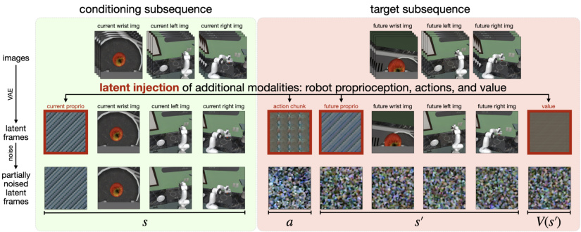
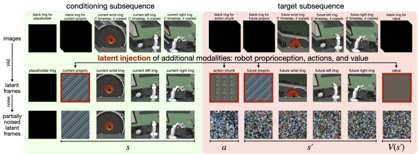
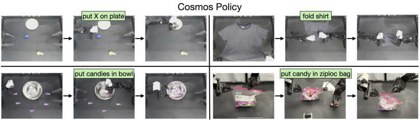
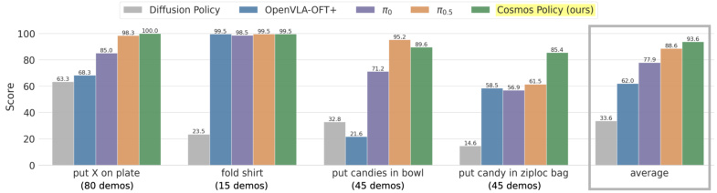

# Cosmos Policy：把"会脑补下一秒视频"的模型，训成会动手的机器人

> 这是写给读者的版本。用学校生活、考试、拍照、下棋这些常识来讲清楚一篇关于机器人的论文。

## 一句话讲什么（TL;DR）

把一个会"脑补下一秒视频"的大模型，再练一遍，就能让它指挥机械臂做家务。

*所以这一节是想说：核心创意只有一句话——别从零做，拿"会脑补视频的大脑"改造成"会动手的大脑"。*

---

## 这是个什么场景

周末你赶着出门，从厨房顺手抓一把糖塞进密封袋——左手撑住袋口、右手把糖倒进去、捏紧拉链。从看到糖到拉好袋子，前后两秒钟，你几乎没在想。

现在让一台机器人替你做这件事。它得在两秒里完成下面这串"心算"：

- 看清楚糖在哪、袋子在哪、袋口现在开了多大
- 想清楚两只手怎么配合（一只撑袋口、一只塞糖）
- 还得知道"手歪一毫米糖就撒了"

换句话说，它需要两种本事：

1. **物理直觉**：手伸下去会发生什么、东西会不会倒、塑料袋会不会瘪。
2. **动作多样性**：同一个目标，可能有十种合理的伸手路线，模型要能挑一种走，而不是卡死在一条路上。

> **机器人策略（policy）**：一个函数，输入是"眼前看到的画面"，输出是"接下来手要怎么动"。可以理解为机器人的"反应公式"。

打个考试的比方：你做物理题时，看到题面（输入），写出解题步骤（输出）。policy 干的就是这件事，只不过输入换成了摄像头画面，输出换成了"每个关节转多少度"。

*所以这一节是想说：让机器人做家务的难点是又要懂物理、又要会变通。*

---

## 之前的人怎么做的，为什么不够好

之前的主流做法叫 VLA。

> **VLA（Vision-Language-Action，视觉-语言-动作模型）**：一个大网络，能看图、能读指令、能输出动作。代表作是 OpenVLA、π0、π0.5。

VLA 的"地基"是看了几亿张**图配文字**训出来的——它见过"苹果"配"红色水果"、"猫"配"四条腿动物"。

但 VLA 没看过视频。

类比：你只让一个小孩看绘本（静止画面 + 文字）却不让他看动画片（连续画面）。他能认识"苹果"，但说不出"苹果从桌上滚下去会怎样"。这就是缺了**对时间的直觉**。

之前方法不够好的几条原因：

- **VLA 派**：看的是"图 + 文"，没看过视频，缺乏对"事情怎么演化"的直觉。就像只背公式不做实验。
- **从头训视频模型派**：有人想用视频模型当地基，但他们丢掉了别人辛苦在几亿小时视频上训好的成果，从零开始——相当于上考场前撕掉自己背了三年的笔记。
- **两阶段拼接派**：另一些人先训一个视频网络，再外挂一个"动作输出头"。结果两个东西没融合好——像把英语作文和数学计算分给两个互不交流的人做。
- **小模型派**：用一个小网络从干净示教数据训。简单但没"地基知识"，复杂任务一塌糊涂。
- **L1 回归派**：让模型直接预测动作的"平均值"。问题是面对两颗糖时，平均位置正好在两颗糖中间——伸手就抓空了。

*所以这一节是想说：之前的人要么没看过视频、要么没融合好、要么没地基知识。*

---

## 这篇论文的新想法

打个比方：邻居家有位会画连环画的大叔，看一眼场景就能给你画出"下一格会发生什么"。你想让他帮你指挥机器人手臂——常规做法是另请一位机器人专家，或者给大叔配个助手。这篇论文不一样：**不换人、不加助手，就让大叔在画下一格画的时候，顺手在角落写一行字告诉你"主人公接下来该往哪走"**。

落到模型上就是一句话：

**直接拿一个会预测下一秒视频画面的现成大网络（叫 Cosmos-Predict2），不动结构、不加新部件，只是再训练一轮，让它顺便吐出机器人动作。**

> **Cosmos-Predict2**：NVIDIA 训好的视频预测大模型，看了几亿小时视频，已经具备"东西会不会掉、会不会滑"的物理直觉。

*所以这一节是想说：不动结构、只改训练数据，是这篇最大的胆量。*

---

## 它分几步做的（方法）

### 1. 把动作"伪装"成视频画面

**类比**：你的笔记本本来只能写汉字。现在你要在里面记英文单词——但你不想换笔记本。怎么办？把每个英文单词翻译成对应的汉字塞进去，本子完全不知道你在记新东西，照常翻页。

**它在干什么**：

视频模型本来一帧一帧地处理画面。每一帧都被压缩成一种"特征数据块"（你可以想成一张特殊的"信息卡片"）。这篇论文的做法是：

- 把机器人手臂的关节角度（一串数字）
- 把接下来要做的动作（也是一串数字）
- 把"这条路最终能拿多少分"（一个数字）

**全部塞进同样大小的"卡片"里**，假装它们也是视频帧。模型分不清这些是真画面还是伪装的，就会按它原来处理视频的方式一起处理。

> **VAE（变分自编码器，Variational Auto-Encoder）**：一个会把大图压成小卡片、又能把小卡片还原成大图的网络。你可以理解为视频的"压缩软件"。
>
> **潜帧（latent frame）**：被压缩之后的"小卡片"。比原图小很多但保留了关键信息。

**关键术语**：

> **扩散模型（diffusion model）**：一种生成图片/视频的方式。先往图里加一堆雪花点（噪声），让网络学怎么把雪花点擦掉还原原图。学会之后给它纯雪花点它就能"擦"出新图。
>
> **去噪（denoising）**：擦掉雪花点的过程。一步一步擦，越擦越清楚。

**为什么这么设计**：

- 不动结构 = 几亿小时视频训练出来的"物理直觉"被原封不动地继承下来。等于白嫖几年的训练成果。
- 复制铺满看起来浪费，但好处是模型用同一套机制处理新数据，不用学新规则。

**读到这里你应该懂了**：动作被伪装成视频帧，模型按处理视频的方式一起处理它们。





*所以这一节是想说：核心招数就是——把不是图像的东西伪装成图像，让旧模型一起处理。*

---

### 2. 一个模型同时干三件事

**类比**：想象一个学生同时学三门课——化学（怎么反应）、物理（反应后会怎样）、考试评分（这次考多少分）。普通做法是请三个家教，这篇的做法是同一个学生轮流戴三顶帽子。

**它在干什么**：

每次训练时，把一批数据分成三份，让**同一个网络**（同一组参数）轮流学三件事：

1. **当机器人**（50% 数据）：看到当前画面，输出"我该做什么动作"。
2. **当物理模拟器**（25% 数据）：看到画面 + 给定一个动作，预测"做完之后画面变成什么样"。
3. **当评分员**（25% 数据）：看到画面 + 动作 + 做完后的画面，估计"这条路最后能拿多少分"。

> **世界模型（world model）**：一个会脑补"做了某动作之后世界会变什么样"的模型。相当于脑子里的物理实验室。
>
> **价值函数（value function）**：给"当前局面"打分的函数。下棋时教练说"这个局面值 +3"，就是价值函数。

**评分是怎么来的**：录一条机器人完成任务的过程。如果最后成功 = 1 分，失败 = 0 分。然后把这个分往前回传——离成功越近的画面分数越高，离失败越近越低。

**关键术语**：

> **梯度（gradient）**：一个数学量，告诉你"参数往哪调能让分数变高/损失变低"。
>
> **梯度下降（gradient descent）**：根据梯度一步一步调参数。像下山找最低点，每一步都往最陡的下坡方向迈。
>
> **损失（loss）**：考试扣分总和。模型预测错了多少，就扣多少。模型的全部目标就是让 loss 越小越好。

**为什么这么设计**：

- 用同一组参数学三件事 = 三件事互相帮忙。学物理直觉时学到的"东西会掉"，能帮策略不犯傻。
- 50/25/25 不是拍脑袋——当机器人那一份难度最大（输入信息最少），所以多分点训练数据给它。

*所以这一节是想说：一个网络戴三顶帽子，能让三件事互相提分。*

---

### 3. 顺手预测未来，反而考得更好

**类比**：让一个学生只背公式他考 70 分。让他**顺带预测出题人下一题会问什么**——他反而考 85 分。因为"预测出题方向"逼他理解了公式背后的逻辑。

**它在干什么**：

第 2 节里说，模型当机器人时，本来只需要输出"动作"。但论文硬要它**同时**预测"做完后画面什么样"和"这条路值多少分"。

听起来是浪费时间——这些预测在真正部署时不需要呀。但消融实验显示砍掉这些"多余预测"反而会大幅掉分。

> **消融实验（ablation study）**：故意拿掉模型的某一个部件再测一次，看分数掉多少，从而知道这个部件值不值钱。像化学课对照实验：一组加催化剂、一组不加，看反应速度差多少。

论文给的实验数据（在 RoboCasa 厨房任务上）：

- 完整版本：67.1 分
- 拿掉评分员训练数据：66.6 分（掉一点点）
- 再拿掉物理模拟器训练数据：64.0 分（掉得更多）
- 再让模型不预测"未来分数"：62.5 分
- 再让模型不预测"未来画面"：**44.4 分**（暴跌 22.7 分）

最后一刀最狠——拿掉"预测未来画面"，分数从 62.5 直接掉到 44.4。

**为什么**：

被迫预测"做完之后画面什么样"，模型就被逼着真的理解了**动作的物理后果**，而不是靠死记硬背"看见 X 就做 Y"的浅层关联。

类比学车：只背口诀（向左打 90 度）的人开不好车。能在脑子里看到"打了之后车会往哪偏"的人才能开好。

*所以这一节是想说：让模型顺手预测未来，是它真正"开窍"的钥匙。*

---

### 4. 像下棋一样想 8 步再走

**类比**：下棋高手不会随手就走。会在脑子里想 8 种走法 → 推演每种走完会怎样 → 挑最好的那种落子。

**它在干什么**（部署时）：

1. 让机器人模型生成 **8 个不同的候选动作**。
2. 对每个候选动作，用世界模型（脑内物理模拟器）预测"做了之后画面变什么样"——预测 3 次（因为预测有随机性，多算几次更准）。
3. 对每个预测出的未来画面，用评分员打分——打 5 次。
4. 这样每个候选动作就有 3 × 5 = 15 个分数。
5. **挑分数最高的那个候选动作真正执行**。

> **采样（sampling）**：从一个能产生很多可能结果的模型里抽一次结果。掷骰子就是从 {1,2,3,4,5,6} 里采一次样。模型采样有随机性——同样输入，多采几次得到的结果会有微小不同。

**关键数字**：

- 8 个候选 × 3 次未来预测 × 5 次评分 = **120 次打分**。
- 全部过程在 8 张高级显卡上并行，大约 5 秒输出一个动作。

**为什么打分要做 majority mean（多数派均值）而不是简单平均**：

模型对"抓住糖"会打 0.9 分，对"抓滑了"会打 0.1 分。如果简单求平均得 0.5——但 0.5 这个分数很误导，事实上结果非黑即白。

正确做法是先看 15 个分数里多数判成功还是失败，再在多数那一组里取平均。这就像选举投票——看大多数人意见，而不是把所有人意见数值平均。

**代价**：

每次出动作要 5 秒。所以这套规划只用在"慢活"上——折衣服、装糖。接抛球肯定不行。

*所以这一节是想说：先脑补 8 种方案、再选最优，能涨分但很慢。*

---

### 5. 出题人和改卷人要分开

**类比**：自己改自己的卷子容易高估自己。让另一个老师改才靠谱。

**它在干什么**：

- 拿一个"基础策略"模型 A 出动作（出题人）。
- 部署 A 跑很多次，记录 648 条真实运行过程（包括成功和失败的）。
- 用这 648 条数据再训练一份模型 B，专门当世界模型 + 评分员（改卷人）。
- 真正部署时：A 出 8 个候选动作，B 评分。

**为什么**：

如果用同一个模型既出动作又评分，它评分时见过的画面**全都是成功示教里的画面**。一旦真实运行去到"奇怪的中间状态"（比如机器人初始位置稍微偏一点），评分员根本没见过——就只能瞎打分。

让 B 见过 A 真实运行过的"奇怪状态"（包括失败），评分才靠谱。

*所以这一节是想说：评分员要见过真实世界的混乱，不能只见过教科书里的标准答案。*



---

## 关键数字（What works）

### 数字 1：仿真任务平均成功率 98.5 分

- **设置**：4 套测试 × 10 任务 × 50 次 × 3 个不同随机种子 = 6000 次试验。
- **数字**：98.5 分。其中"长程多步任务"子集 97.6 分，超过第二名 95.4 分。
- **对比**：上一代最强的几个对手是 97.4、97.1、96.9。
- **生活语言**：在一个已经被卷到天花板的考试上多 1 分都很难。这里把第二名甩开 2 分，等于把"先开冰箱再放东西"这种长串任务的失败率几乎砍半。

### 数字 2：用 50 条示教就拿 67.1 分

- **设置**：24 个厨房任务，每任务只给 50 次人类演示。
- **数字**：67.1 分。
- **对比**：另一个最强对手用了 300 次演示拿 64.1 分。某个老方法用 3000 次演示才拿 57.3 分。
- **生活语言**：**数据效率高 60 倍**。普通家庭买一台机器人时，肯定不会演示 3000 次叠衣服才让它学。50 次能用，意味着进入门槛被拉低一个数量级。

### 数字 3：真实双臂机器人平均 93.6 分

- **设置**：4 个家务任务，101 次试验，185 条人类示教。
- **数字**：Cosmos Policy 93.6 / 第二名 88.6 / 第三名 77.9 / 老方法 33.6。
- **生活语言**：最弱的方法 100 次有 66 次失败，最强的 100 次只失败 7 次。从"绝对不能商用"到"工业流水线可以试试"。

### 数字 4：装糖入袋任务领先对手 23.9 分

- **数字**：Cosmos Policy 85.4 分；最强对手 π0.5 只有 61.5 分。
- **为什么**：这个任务要毫米级精度（拉链滑块只有几毫米宽）。视频模型见过几亿小时连续画面，对"东西会不会滑"有直觉。VLA 模型只看过静态图，对滑动没感觉。
- **生活语言**：从"碰运气"（每三次成功两次）跳到"基本能用"（每四次成功三到四次）。

### 数字 5：加规划再涨 12.5 分

- **数字**：在两个最难的任务上，不带规划 78 分，带规划 90.5 分。
- **代价**：每次出动作从 1 秒变 5 秒。
- **生活语言**：折衣服可以接受，乒乓球肯定不行。

*所以这一节是想说：仿真和真实任务上都拿了第一，数据效率最猛。*



---

## 你应该懂的几个新词

> **VLA（Vision-Language-Action）**：会看图、会读指令、会输出动作的三合一模型。像一个会听话的服务员。

> **视频基础模型（video foundation model）**：在几亿小时视频上训练过的大网络。可以理解为"看遍了短视频平台的物理直觉机"。

> **VAE（变分自编码器）**：把大图压成小卡片、又能还原的网络。视频的"压缩软件"。

> **扩散模型（diffusion model）**：通过"先加雪花点 → 再学着擦掉"来生成图片或视频的方法。

> **去噪步（denoising step）**：擦雪花点的步数。步数越多越清晰但越慢。

> **潜帧（latent frame）**：被压缩之后的画面"小卡片"。

> **世界模型（world model）**：会预测"做完动作之后世界变什么样"的网络。脑内物理模拟器。

> **价值函数（value function）**：给"当前局面"打分。下棋时教练给局面 +3，就是这个东西。

> **策略（policy）**：输入画面、输出动作的"反应公式"。

> **梯度下降（gradient descent）**：调参数让 loss 变小的方法。像下山，每步往最陡下坡方向迈。

> **Loss（损失）**：考试扣分总和。模型学习的目标是想办法让它越小越好。

> **消融实验（ablation study）**：故意拿掉模型的某个部件再测一次，看分数掉多少。

> **OOD（Out-of-Distribution，分布外）**：测试时见到训练里没出现过的物体或场景。

> **采样（sampling）**：从一个有随机性的模型里抽一次输出。同样输入采两次结果会略不同。

*所以这一节是想说：这些词是后面所有讨论的"通行证"，背下来不亏。*

---

## 它有什么搞不定的

**问题 1：太慢**

带规划时一次出动作 5 秒。让它陪小孩打乒乓——别想了。
**用户实际场景**：折衣服 OK，接抛球不行。

**问题 2：换个新厨房就不灵**

测试时换没见过的颜色衬衫、没见过的厨房风格，分数就掉得多。对手 π0.5 在这种情况下反而更稳——因为 π0.5 训练时看过几亿条机器人轨迹。
**用户实际场景**：机器人在你家用得好 ≠ 在邻居家用得好。

**问题 3：要先跑很多次才好用**

加规划那一招需要先用基础策略跑 600+ 次真实运行，记录失败案例，再训改卷员。
**用户实际场景**：小实验室没钱跑这么多次真机，只能用基础版本，拿不到那 12.5 分加成。

**问题 4：长程任务还是不行**

只往前看 1 步。如果任务是"先开冰箱、再拿菜、再切菜"3 大步，单步预测帮不上忙。
**用户实际场景**：一气呵成做晚餐？不行。

*所以这一节是想说：精度和数据效率赢了，速度和泛化还输着。*

---

## 它和别的几篇是什么关系

用集合的语言：

- {VLA 派} = OpenVLA、π0、π0.5、CogVLA
- {视频派} = Cosmos Policy、UVA、UWM
- {世界模型派} = Dreamer、TD-MPC

Cosmos Policy 同时落在 {视频派} ∩ {世界模型派} 里——它是这两条路线在大模型时代的合流。

时间线：

```
2023：Diffusion Policy（用 diffusion 出动作的开山作）
       ↓
2024：OpenVLA（VLA 范式标杆）
       ↓
2025：π0、π0.5（VLA 巅峰）
       ↓
2026：Cosmos Policy（视频派反击）← 我们读的这篇
```

因果关系：

- 因为 Diffusion Policy 证明了"diffusion 适合建模动作"——所以 Cosmos Policy 把这套放大到 20 亿参数。
- 因为 VLA 在 OOD 上表现好——所以 Cosmos Policy 在 OOD 仍然输给 π0.5。
- 因为 Dreamer 证明了"世界模型 + 规划"思路有效——所以 Cosmos Policy 把这套放进大模型。

*所以这一节是想说：这篇是"视频派 + 世界模型派"的合流，和 VLA 派各有胜场。*

---

## 我建议这样读这篇

5 步走：

1. **第 1 步**：看摘要 + 第一张图（30 秒）。抓住"用视频模型当机器人脑子 + 不加新结构"这两件事。原因：标题加图就是结论的两句话版。

2. **第 2 步**：直接跳到论文 Figure 2（潜帧注入示意图）。看那串小方块，理解"动作和分数被塞进哪些位置"。原因：这张图是全文方法的灵魂。

3. **第 3 步**：回到 4.1 节读潜帧注入。配着图把"灰块=动作、彩块=分数"对应清楚。原因：这是论文唯一真正新的技术贡献。

4. **第 4 步**：跳读 5.1 实验设置 + 主表格。知道在三个测试平台上 Cosmos Policy 赢了多少。原因：论文的"凭什么相信你"全在这里。

5. **第 5 步**：扫第 4.3 节（规划部分）+ 那张规划流程图。知道 12.5 分的提升怎么来的。原因：规划是最 fancy 的部分，但**也是延迟瓶颈**，知道代价才能判断要不要照搬。

可以跳过：联合训练的数学推导细节、附录里的噪声采样魔改（除非你要复现论文）。

*所以这一节是想说：先看图再看字，先看分再看法。*

---

## 一些好奇心问答（FAQ）

**Q1：模型多大？我家电脑跑得动吗？**

模型 20 亿参数。训练用了 8 到 64 张高级显卡（每张 80GB 显存，单价相当于一台中档轿车）。
- 你家普通游戏卡（12GB 显存）：训练完全不行。推理可能勉强，但慢得多。
- 真要复现：得用学校算力中心或者云计算。

**Q2：数据从哪来？**

三个来源：
- LIBERO（仿真平台，公开免费）
- RoboCasa（仿真厨房，公开免费）
- ALOHA（作者自己用真双臂机器人录的 185 条家务示教，论文说会公开）

**Q3：训练一次要多少钱？**

按云端高级显卡每小时 4.5 美元算：
- 仿真任务一次复现 ≈ **1.4 万美元**
- 真实任务一次复现 ≈ 1700 美元
- 学术圈有便宜价 + 自建集群可以打 3-5 折。

**Q4：为什么不用更简单的方法？**

试过了。论文里有一个对照——用一个 1.5 亿参数的小网络从干净数据训。结果在长程任务上 50.5 分，Cosmos Policy 是 97.6 分。说明**预训练大底模是新地板**，小模型撑不到天花板。

**Q5：为什么要做"预测未来"这种看起来没用的事？**

被迫预测"做完动作之后会怎样"，模型就被逼着理解**动作的物理后果**。如果只让它输出动作，它会偷懒——背"看见 X 就做 Y"，而不是真懂物理。消融实验显示去掉这一招会暴跌 22 分。

**Q6：为什么不直接用 ChatGPT 那种文字模型？**

文字模型没看过视频，不知道"把杯子推过去会不会洒"。机器人需要的是**对连续画面的直觉**，文字模型给不了这个。

**Q7：作者有没有推荐先读哪几篇？**

按重要性：π0.5（最强对手）→ OpenVLA（VLA 标杆）→ Diffusion Policy（动作建模奠基）→ Dreamer V3（世界模型经典）。

**Q8：这套方法能用在自动驾驶吗？**

理论上能。NVIDIA 的 Cosmos 系列就是给"物理 AI"（自动驾驶 + 机器人 + 仿真）当地基设计的。但自动驾驶还要解决延迟（5 秒太慢）、安全验证、长尾事件等问题。

*所以这一节是想说：常见疑问基本能从论文找到答案，不需要再搜外网。*

---

## 如果你想再深入

按重要性排序：

1. **π0.5（Physical Intelligence 2025）** — 当下最强 VLA 之一，是 Cosmos Policy 在 OOD 上仍输的对手。读完才能形成完整的对照视野。

2. **OpenVLA / OpenVLA-OFT（Stanford 2024）** — VLA 派开源标杆，理解 VLA 范式的起点。Cosmos Policy 的一作 Moo Jin Kim 同时是 OpenVLA-OFT 的一作——他自己跨过两条路线。

3. **Diffusion Policy（Chi 等 2023）** — 用 diffusion 建模动作的奠基作。Cosmos Policy 把这个思路放大到 20 亿参数。

4. **Cosmos World Foundation Model（NVIDIA 2025）** — Cosmos-Predict2 的来源。讲清楚"为什么 NVIDIA 想训物理 AI 底模"。

5. **Dreamer V3（Hafner 2023）** — 经典世界模型派代表。和 Cosmos Policy 思路一脉相承——learn dynamics + plan with it。看完会明白 Cosmos Policy 是"Dreamer 在大模型时代的重做"。

*所以这一节是想说：想看更多就按这个顺序，能形成完整的领域地图。*
