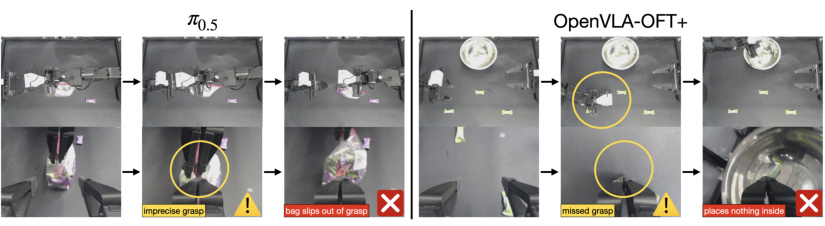

# Cosmos Policy: Fine-Tuning Video Models for Visuomotor Control

> 这是机器辅助生成的客观摘要笔记。教学版精读笔记由用户按节奏触发后单独成稿。

## 一句话讲什么（TL;DR）

把一个会"预测下一秒视频"的大模型直接微调成机器人策略，不加任何新模块。

## 这篇论文要解决什么问题（Why this paper）

想象你买了一台会做家务的机器人，你让它"把糖放进密封袋"。这个动作你做起来就两秒，但机器人要先看到糖、看到袋子、估计袋口开度、计算两只手怎么配合、还得知道"夹歪一毫米糖就掉了"。这种事难就难在：它既需要**物理直觉**（手伸下去会发生什么），又需要**动作多样性**（同一个目标，10 种合理的伸手轨迹）。

以前主流做法叫 VLA（vision-language-action，视觉-语言-动作模型，代表作 OpenVLA、π0），它们的底子是看"图配文字"训出来的——大模型见过几亿张照片配描述，但**没看过视频**。这就像你只让小孩看绘本却不让看动画片，他能认识"苹果"，但说不出"苹果从桌子上滚下来会怎样"。

之前方法不够在哪里：

- VLA 派的底模型缺**时空先验**（spatiotemporal priors，对时间和空间上"事情怎么演化"的直觉）。
- 已经有人想用视频生成模型当底子（Video Policy、UVA、UWM 等），但他们要么走两阶段（先训视频、再外挂一个动作模块），要么干脆从头训视频模型，丢掉了大规模预训练的视频先验。

Cosmos Policy 的主张：用一个预训练好的视频生成模型 Cosmos-Predict2-2B（NVIDIA 出的 20 亿参数视频底模），**只做一阶段微调**，**不加任何新结构**，就能直接当机器人策略用。一句话：把会"脑补下一秒"的视频模型，硬塞机器人数据进去再训一轮，它就学会了出动作。

### 它和你日常用的产品的关系

很多人对"机器人 paper"无感，因为感觉离自己很远——但这条研究脉络的兄弟姐妹其实就在你手机里：

- **VLA 之于 ChatGPT 的图像功能**：你给 ChatGPT 发张照片让它分析菜谱，那个能力的根子就是 vision-language model（视觉语言模型）。VLA 就是把"看图说话"模型再加一只手，让它不光会说"这是西红柿"，还会给出"右手伸向坐标 (0.3, 0.5) 抓取它"的动作向量——本质是把语言模型的"输出 token"换成了"输出关节角"。
- **视频生成模型之于 Sora / 可灵 / 即梦**：Cosmos-Predict2 和 Sora 是同代产物，都是吃几亿小时视频训出来的"会脑补下一秒"的大网络。区别是 Sora 给你产出 demo 短片，Cosmos 在 NVIDIA 的设定里是给"物理 AI"（自动驾驶 / 机器人 / 仿真）当底模——同一个底模在这篇 paper 被改造成"机器人脑子"。
- **世界模型派之于扫地机器人**：你家扫地机器人现在主要靠"看到什么就反应"（无脑撞墙改方向）；下一代扫地机要做"先想象 5 秒后家里被推倒了什么再决定下一步"，这就是这篇 paper 里世界模型 + 价值函数那套思路在消费级产品的潜在落地形态。
- **Best-of-N 规划之于 GitHub Copilot 的多候选补全**：Copilot 给你弹三个补全候选让你挑——Cosmos Policy 让 GPU 同时想 8 个动作候选再用世界模型当"代码 reviewer"挑最好的那个。底层是同一类思路（生成多样 + 模型筛选），只不过一个出代码、一个出关节角。

## 用了什么方法（How）

### 1. Latent frame injection（潜帧注入）—— 把动作"伪装"成视频帧

类比：想象视频模型是一台只看得懂"幻灯片序列"的老式投影仪。它每张幻灯片都是 H×W×16 的格子。作者要让它顺便"输出动作"，但不想换投影仪——于是把关节角、动作序列、价值打分这些数据**全压成同样格式的幻灯片**夹塞进序列里，投影仪完全察觉不到这是新东西，照常按它原来的去噪流程一起处理。

**它在干什么**：
视频模型本来吃的是一串 latent frame（潜帧，每帧是 H'×W'×16 的张量，由 VAE 把原图压缩出来的"压缩包"）。作者把机器人本体感知（关节角）、动作块（action chunk）、状态价值 V(s′) 这些**非图像数据**填进同形状的潜帧里。模型完全感知不到这是新模态，照常按它原来的 latent diffusion（潜空间扩散）流程一起去噪。

**关键步骤（以 ALOHA 双臂机器人为例，3 个相机的设定）**：

1. **占位**：在原始图像序列里塞进若干"全零图片"作为占位符（一个相机视角对应一张占位图，外加要新增的模态各一张）。
2. **VAE 编码**：用 Wan2.1 VAE 把整组图（含占位图）压成潜帧序列。压缩比是 (1+T)→(1+T/4)，H→H/8，W→W/8，通道变 16。换句话说视频被折成"特征字典"，不再是像素。
3. **覆盖注入**：占位图对应的潜帧被**完全覆盖**——把要塞的非图像数据（如 14 维关节角、50×14 的动作块、1 个标量价值）先归一化到 [-1, +1]，然后**复制铺满**整个 H'×W'×16 的体积。
4. **加噪**：对要预测的潜帧（target）加高斯噪声，作为条件的潜帧（condition）保持干净。
5. **去噪**：模型学会"看条件帧 → 还原 target 帧"，跟它预训练时干的活完全一样。
6. **反编码**：推理时直接从生成的动作潜帧里取所有副本求平均，再反归一化回真实关节角范围——非图像模态**不需要走 VAE 解码**，因为它们就是直接被注入的，不在视觉流形上。

**关键数字（论文给的具体配置）**：
- ALOHA：序列共 11 个潜帧，包括 1 张占位、1 帧本体感知、3 帧当前相机、1 帧动作、1 帧未来本体感知、3 帧未来相机、1 帧未来价值。
- 每个潜帧体积 H'×W'×16；动作块归一化到 [-1, +1] 后被铺满整个体积，重复次数 ≈ (H'×W'×16) / (50×14)。
- 一帧只对应一个时间点；不堆历史帧，也不预测多个未来时间步。

**为什么这么设计**：
- 不改架构 = 完整继承预训练权重和优化器配置，等于"白嫖"了 NVIDIA 在几千万小时视频上训练的物理直觉。
- 复制铺满看似浪费空间，但能让模型用同一套位置编码、同一套注意力头处理新模态——是"用算力换简单性"。
- "归一化到 [-1, +1]" 是为了对齐 VAE 输出的数值范围；如果不归一化，新模态的尺度会和图像潜帧差几个数量级，模型梯度会爆。

**如果换成别的方法会怎样**（消融实验答案）：
- 不用预训练权重、随机初始化训：LIBERO 平均 94.6%，比 98.5% 掉 3.9 分；ALOHA "fold shirt" 从 99.0 掉到 80.8（-18.7 分），且动作"抖动得能把机器人弄坏"。
- 不做 latent injection 而外挂动作头（同行做法）：论文没直接做这个消融，但同类 video policy（UVA、Video Policy）在 LIBERO Long 上是 90.0/94.0，比 Cosmos Policy 的 97.6 都低 3-7 分——侧面证明"统一架构"比"模块拼接"更香。


> 读到这里你可能在想：把动作伪装成图像帧，模型真能学会吗？答案是能，但要靠下一节的训练技巧——让模型同时扮演三个角色。

### 2. 一个模型同时是策略 / 世界模型 / 价值函数

类比：想象一个厨师，他要同时学三件事——怎么做菜（策略）、菜做完端上桌客人会什么反应（世界模型）、这道菜值多少分（价值函数）。普通方案是请三个人，这篇方案是同一个厨师轮流戴三顶帽子。

**它在干什么**：
每个训练 batch 内部按比例切成三份，分别用同一组权重学三个不同的"条件 → 目标"映射。技术上靠"哪部分给条件、哪部分要预测"切换角色——也就是改 mask 而已。

**具体每个 batch 怎么分**：

| 比例 | 数据来源 | 角色 | 条件 | 目标（要预测的） |
|------|----------|------|------|------------------|
| 50% | demonstrations | 策略 | s | a, s′, V(s′) |
| 25% | rollouts | 世界模型 | s, a | s′, V(s′) |
| 25% | rollouts | 价值函数 | s, a, s′ | V(s′) |

**关键公式人话翻译**：

- 策略部分学的目标是 **p(a, s′, V(s′) | s)** = "看到当前画面 s，同时预测：我该做什么动作 a / 做完后世界变成什么样 s′ / 那个未来值多少分 V"。三件事一起预测。
- 世界模型部分学 **p(s′, V(s′) | s, a)** = "给我画面 s 和动作 a，告诉我做完后世界变什么样 s′ 以及那个未来的价值 V"。
- 价值函数学 **p(V(s′) | s, a, s′)** = "现在的画面 s、刚做的动作 a、以及做完之后的画面 s′ 都给你，估一下这条路最终能拿多少分"。

V(s′) 的"分数"是怎么来的？用 **Monte Carlo return（蒙特卡洛回报）**：在录制 rollout 时，看每条轨迹最终成功（拿到 1 分）还是失败（0 分），再用折扣因子 γ 把这个最终得分往前回传——离成功还有 H-t 步的状态，价值就是 γ^(H-t) × 1。简单粗暴但够用。

**关键超参**：

- LIBERO：40K 梯度步 / 64 张 H100 / 全局 batch=1920 / 48 小时 / 动作块 16 步。
- RoboCasa：45K 步 / 32 张 H100 / batch=800 / 48 小时 / 动作块 32 步（执行 16 再 requery）。
- ALOHA：50K 步 / 8 张 H100 / batch=200 / 48 小时 / 动作块 50 步（2 秒 @ 25Hz，全块执行）。
- 全模型 fine-tune（不冻任何层，2B 参数全更新）。

**为什么这么设计**：
- 50/25/25 不是拍脑袋——策略需要更多样本，因为它要从 s 这个最不充分的条件里推出 3 件事；世界模型和价值函数条件更丰富，难度低，分得少。
- 用同一套权重而非三个独立模型：参数 share 让"动力学知识"和"策略知识"互相强化（消融实验里去掉辅助监督会掉 1.5 分就是证据）。
- rollouts 数据只给世界模型/价值用：因为它们包含失败轨迹（人类操作失误的、或后期机器人采集的），模型从中学到"失败长什么样"——这是策略不该学的（策略只该模仿成功）。

### 3. 辅助监督（auxiliary targets）—— 顺手预测未来"反而"涨点

类比：让一个学生只背公式他能考 70 分，让他**顺带预测出题人下一题会问什么**，他反而能考 85 分——因为"预测未来"逼他理解了公式背后的逻辑。

**它在干什么**：
策略部分本来只需要学 p(a|s) = "看到当前画面，给出动作"。但这篇硬要让它同时预测 s′ 和 V(s′)。这看起来是浪费算力（部署时根本不需要预测未来），但消融实验显示**砍掉反而会掉点**。

**RoboCasa 上的逐项消融**（论文表 5）：

| 配置 | 平均成功率 |
|------|-----------|
| 完整 Cosmos Policy（50/25/25 + 辅助预测 s′ + V） | 67.1% |
| 去掉价值函数训练样本（50% 策略 + 50% 世界模型） | 66.6%（-0.5） |
| 再去掉世界模型训练样本（100% 策略） | 64.0%（-3.1） |
| 再去掉策略的辅助 V 目标（只学 p(a, s′\|s)） | 62.5%（-4.6） |
| 再去掉策略的辅助 s′ 目标（裸 p(a\|s)） | **44.4%（-22.7）** |

**为什么这么设计 / 消融告诉我们什么**：
- 最大跌幅在"去掉预测未来状态"这一刀（62.5 → 44.4，掉 18 分）——这是论文最 surprising 的发现。**预测未来这个看似无用的辅助任务，是 Cosmos Policy 涨点的真正秘密**。
- 解释：当模型必须预测"做完这个动作未来长什么样"时，它被迫**学到动作的物理后果**，而不是只学"看见 X 就做 Y"的浅层映射。这跟人类学车一样——只背口诀（向左打 90 度）的人开不好车，能在脑子里看到"打了之后车会往哪走"的人才能开好。
- 价值预测的辅助效果较小（-0.5 到 -2.1）但仍正向——因为价值函数已经间接通过世界模型受益了。

> 读到这里你可能在想：训练时让它预测未来有用，那部署时这些未来预测能干嘛？答案就是下一节的"规划"。

### 4. Best-of-N 规划（model-based planning）—— 下棋一样想 8 步

类比：下棋时不会随手就走，而是先在脑子里想 8 步候选 → 看看每步走完局面如何 → 挑最好的那一步落子。

**它在干什么**：部署时把"出动作"变成一个搜索问题——先生成多个候选动作 → 用世界模型推演每个候选的后果 → 用价值函数给后果打分 → 挑得分最高的那一个真正执行。

**完整伪代码（基于论文 4.3 节 + 附录 A.4.2）**：

```
输入: 当前观察 s
N = 8  # 候选数（每个分一块 H100 并行）

# 第 1 阶段：N 个 GPU 并行采样动作候选
candidates = []
for i in 1..N:
    a_i = policy_model.sample(s, denoising_steps=10)
    candidates.append(a_i)

# 第 2 阶段：每个候选动作，世界模型预测 3 次未来状态
all_scores = []
for a_i in candidates:
    futures = []
    for j in 1..3:
        s_prime_j = planning_model.predict_state(s, a_i, denoising_steps=5)
        futures.append(s_prime_j)
    
    # 第 3 阶段：每个未来状态，价值函数打分 5 次
    scores_for_a_i = []
    for s_prime_j in futures:
        for k in 1..5:
            v = planning_model.predict_value(s, a_i, s_prime_j, denoising_steps=5)
            scores_for_a_i.append(v)
    # 总共 3×5=15 个价值预测
    
    # 第 4 阶段：majority mean 聚合
    success_count = count(v > threshold for v in scores_for_a_i)
    if success_count > 7.5:  # 多数判成功
        final_score = mean([v for v in scores_for_a_i if v > threshold])
    else:
        final_score = mean([v for v in scores_for_a_i if v <= threshold])
    all_scores.append(final_score)

# 第 5 阶段：选最高分的那个动作执行
best_action = candidates[argmax(all_scores)]
execute_full_chunk(best_action)  # 全块执行（不是 receding horizon）
```

**关键数字**：
- N=8 候选；每个候选 10 步去噪生成动作（约 0.95 秒）。
- 每个动作 3 次未来预测，每次 5 步去噪。
- 每个未来 5 次价值预测，每次 5 步去噪。
- **共 8 × 3 × 5 = 120 个价值打分**；总耗时约 4.9 秒（8 张 H100 并行）。
- 部署时执行**完整 50 步动作块**（2 秒），不做 receding-horizon——为的是把"思考开销"摊到执行时间里。

**为什么 majority mean 而不是简单平均**：
价值预测在难任务上经常**双峰分布**——比如"抓住糖了"会给 0.9，"抓滑了"会给 0.1，平均得 0.5 误导性极强。先看多数预测成功还是失败，再在多数那组里取均值，等于先做了一次 voting 再看大势。

**为什么搞那么复杂**（设计选择）：
- 单次世界模型预测有噪声（diffusion 是随机生成的）→ 多次集成
- 单次价值预测也有噪声 → 多次集成
- 干脆别用 mean → 用 majority mean 抗多模态分布
- 这套 pipeline 的代价是巨高的延迟（5 秒），所以**只用在难任务且没有时间约束的场景**——折衣服、装糖之类的"慢活"。

**如果换成别的方法会怎样**（model-free Q 函数版的对比）：
论文还试了"不用世界模型，直接学 Q(s,a) 给候选动作打分"的 model-free 版。结果 model-based V(s′) 版赢——作者归因于"rollout 数据有限时，学 Q 更难，且 Q 的输入维度更高更容易过拟合"。换句话说**世界模型是数据效率更高的中间表示**。

### 5. 双模型部署（dual deployment）—— 出动作的人和打分的人要分开

类比：考试时让自己改自己的卷子容易高估，让另一个老师改才靠谱。原始 checkpoint 当策略用（"出题"）；用 rollout 数据再微调一份当"规划模型"（"改卷"）。这样规划模型见过的状态分布**就是原策略真实会去到的地方**，打分更准。

**它在干什么**（具体步骤）：

1. 用示教数据训出"基础 Cosmos Policy"——这是策略模型 A。
2. 部署 A 跑很多 rollout（论文里收 648 条：之前评测攒了 505 条，再单独为"装糖入袋"补了 143 条）。
3. 把 A 的权重再 fine-tune 一份，**这次 batch 配比换成 90% 训世界模型+价值函数 / 10% 训策略**——产出"规划模型 B"。
4. 部署：A 出动作候选，B 当世界模型 + 价值函数。

**关键数字**：
- 收的 rollout 总数 648 条（含别的方法的 505 条 + Cosmos 自己的 143 条）。
- "为什么要补 143 条 ziploc 任务"：作者说该任务低相机可见度（机器人手臂自己挡了视线）+ 高度随机（毫米级差异决定成败），所以需要更多失败样本让世界模型学到"抓滑了之后画面什么样"。

**为什么这么设计**：
- 如果用同一个 checkpoint 当策略和评分员：评分员见过的状态分布全是"成功演示里的状态"，碰到现实里因为初始位置稍偏就会去到的"奇怪状态"，它根本没见过 → 打分瞎估。
- 用 rollout 数据 fine-tune 的好处：rollout 来自原策略 A 的真实运行，**B 见过的就是 A 真实会去到的地方**。这是经典 imitation learning + DAgger 思路的现代化版本。
- 90/10 比例 reverse 了基础训练的 50/25/25：因为这一阶段重点是给 A 配一对"更准的眼睛"，策略本身只需要做轻度更新。




### 6. 噪声分布魔改 —— 一个不起眼但涨点的细节

类比：原本练习的卷子都是简单题，遇到难题就崩了——现在强行加 30% 难题进训练集，模型就更稳了。

**它在干什么**：
原始 Cosmos-Predict2 的噪声采样是 EDM 标准 log-normal 分布：ln(σ) ∼ N(P_mean=1.39, P_std²=1.2²)。这个分布把训练样本的 σ 集中在中等水平，对图像/视频生成够用，但对动作生成不够——因为：

1. 扩散采样从 σ_max=80（接近纯噪声）开始；
2. 如果训练时高 σ 区间见得太少，模型在"刚开始去噪"那几步预测就不准；
3. 误差会**串联放大**到后面所有去噪步骤；
4. 动作只要差 1mm 就可能"抓不到"，这种放大特别致命。

**作者的改法**：
- **训练时**：70% 概率用原 log-normal + 30% 概率从 uniform[1.0, 85.0] 采。等于强行往高噪声区间塞 30% 的训练量。
- **推理时**：σ_min 从 0.002 抬到 4——意思是去噪到"几乎干净"的最后几步直接跳过。原因是低信噪比下模型预测精度反而不如保留一点噪声。
- **比例 0.7/0.3** 是作者拍的，没调过。

**为什么这么做有用**：
低 σ 时模型已经看到接近真值的潜帧，"再做最后微调"对图像问题没啥伤害；但对动作来说，那些"微调"反而引入数值噪声、降低精度。直接停在 σ=4 等于"差不多就行别再纠结"。

**经验**：作者说这个细节带来 measurable 的涨点（论文用 L1 loss 衡量）。这是一个**典型的"超参不是装饰"案例**——同样的模型 + 同样的数据，光改噪声采样就能看到差别。

## 关键实验结果（What works）

每个数字按"具体设置 + 数字 + 对比 + 现实意义"四行写。

**1. LIBERO 平均成功率 98.5%**
- **设置**：4 个子任务套件 × 10 任务 × 50 episode × 3 seed = 6000 trial。所有方法都从同样 500 条示教数据训。
- **数字**：Spatial 98.1 / Object 100.0 / Goal 98.2 / Long 97.6，平均 98.5。Long 子集 97.6 远超第二名 CogVLA 的 95.4。
- **对比**：CogVLA 97.4%，OpenVLA-OFT 97.1%，π0.5 96.9%，Diffusion Policy 72.4%。
- **现实意义**：LIBERO 是机器人模仿学习"已被打到天花板"的榜，在这种榜上多 1 分都不容易。Cosmos Policy 把 Long（长程任务）从 95 推到 97.6，意味着"先开冰箱再拿东西放回去"这类多步任务的成功率提升明显——失败率减半。

**2. RoboCasa 平均成功率 67.1%（仅用 50 条人类示教）**
- **设置**：24 个厨房任务 × 50 trial × 3 seed = 3600 trial。两种 OOD 场景（未见过的物体、未见过的场景风格）都覆盖。
- **数字**：67.1%，比第二名 GR00T-N1.5+HAMLET 的 66.4 高 0.7 分。
- **对比**：GR00T-N1.5（300 demo）64.1、π0（300 demo）62.5、UWM（1000 demo）60.8、DP-VLA（3000 demo）57.3。
- **现实意义**：**数据效率最高 60 倍**——Cosmos Policy 用 50 条达到 67.1，DP-VLA 用 3000 条只到 57.3。对小实验室和初创公司含义巨大：你不需要堆 5 万条示教就能训出能用的策略，这把进入门槛拉低了至少一个数量级。

**3. 真实 ALOHA 双臂任务平均得分 93.6%**
- **设置**：4 任务（put X on plate / fold shirt / put candies in bowl / put candy in ziploc bag）× 共 101 trial。185 条示教训一个共用策略。所有 baseline 同样 48 小时 H100 训练预算。
- **数字**：Cosmos Policy 93.6 / π0.5 88.6 / π0 77.9 / OpenVLA-OFT+ 62.0 / Diffusion Policy 33.6。
- **对比 in-distribution vs OOD**（论文表 3）：ID 上 Cosmos 96.3 vs π0.5 87.8（Cosmos 完胜），OOD 上 Cosmos 89.3 vs π0.5 92.5（**π0.5 反超 3.2 分**）。
- **现实意义**：在原始训练分布内 Cosmos 比所有人强，但 OOD 上 π0.5 更稳——这是因为 π0.5 用了几亿条机器人轨迹预训练。对用户：你买的机器人在你家厨房能用 ≠ 在邻居家也能用，分布外鲁棒性还是 VLA 派强。

**4. 高精度任务（毫米级）的领先尤其大**
- "put candy in ziploc bag" 上 Cosmos Policy 85.4，π0.5 只有 61.5——**领先 23.9 分**。
- π0.5 的失败模式（图 5）是右臂抓不到拉链滑块、或左臂没夹住袋子边。OpenVLA-OFT+ 的失败模式是"伸手伸到两颗糖的中间"，作者归因于其 L1 回归的动作头建模不了多模态分布（同一目标多种合理路径）。
- **现实意义**：从"60% 碰运气"跳到"85% 能用"是质变——前者绝不能商用（每三次失败一次），后者已经可以放进工业流水线做挑拣了。


**5. 加规划后两个最难任务平均提升 12.5 分**
- **设置**：在 ziploc 和 candies 两个最难任务上，与不带规划的 base Cosmos Policy 对比。648 条 rollout fine-tune 出规划模型。
- **数字**：base 78%（粗略平均）→ 带规划 90.5%。
- **对比**：model-free Q 函数版本规划比 V(s′) 版本低，证明世界模型这个中间表示更高效。
- **现实意义**：12.5 分的提升不算小，但**代价是延迟从 0.95 秒涨到约 5 秒**（8 张 H100 并行）。换算：原本机器人每 1 秒动一下，加规划后每 5 秒动一下——接抛球肯定不行，折衣服这种慢活完全够用。

**6. 推理速度 / 计算成本（附录数据）**
- 不带规划：1 张 H100，5 步去噪 0.61 秒（LIBERO/RoboCasa），10 步去噪 0.95 秒（ALOHA）。
- 带规划：8 张 H100 并行 4.9 秒。
- 1 步去噪极速版：0.16 秒（4 倍提速），RoboCasa 上 66.4%（仅掉 0.7 分）——说明降低质量换速度的空间确实存在。

## 数据集 / 实验设置详情

**三个评测平台的来源和性质**：

| 平台 | 类型 | 任务数 | 训练数据 | 评测规模 | 输入 |
|------|------|--------|----------|----------|------|
| LIBERO | 仿真 | 4 套件 × 10 任务 = 40 | 每套件 500 demo（10 任务 × 50） | 6000 trial | 单臂 Franka + 单 RGB |
| RoboCasa | 仿真 | 24 个厨房任务 | 每任务 50 demo（人类遥操） | 3600 trial | 单臂 Franka + 多视角 |
| ALOHA | 真实 | 4 个家务任务 | 共 185 demo | 101 trial | 双臂 ViperX300 + 3 RGB（顶 + 双腕） |

**LIBERO 拆解**：
- LIBERO-Spatial：物体相同位置不同——测空间泛化。
- LIBERO-Object：物体不同位置相同——测物体识别。
- LIBERO-Goal：物体位置都相同但任务目标不同——测语言指令理解。
- LIBERO-Long（10）：长程多步任务——测规划能力。
- 每套件 500 条示教中**约 10-20% 是失败的人类录制**——这些被 filter 掉训策略，但保留训世界模型/价值函数。

**RoboCasa 设置细节**：
- 每任务在 5 个不同厨房场景里测，每场景 10 trial。
- **5 个场景中 2 个用了训练时没见过的"风格"**（厨柜颜色 / 地砖纹理 / 灯光不同）——这是 OOD 测试。
- 物体实例**全是没见过的**（同类别不同具体物体）。
- 实际上有 1000 条 MimicGen 自动合成数据可用，但作者**故意只用 50 条人类数据**为了证明数据效率。

**ALOHA 真实任务详情**：
- "put X on plate"（80 demo，简单语言跟随）：把指定物体放到盘子上，30 trial（20 ID + 10 OOD）。
- "fold shirt"（15 demo，长程操作）：折 T 恤多步任务。3 件已知 T 恤 + 1 件未见的粉色 T 恤。20 trial（12 ID + 8 OOD）。
- "put candies in bowl"（45 demo，多模态抓取）：把 5 颗散落的糖放进碗里。25 trial（15 ID + 10 OOD）。
- "put candy in ziploc bag"（45 demo，毫米级精度）：开拉链袋装糖。26 trial（20 ID + 6 OOD）。
- 评分：每任务有详细 rubric——比如折衣服分 10 个步骤每步 10 分；装糖 5 步每步 20 分。

**硬件配置详解**：
- LIBERO：64 张 H100，48 小时，全局 batch 1920。
- RoboCasa：32 张 H100，48 小时，batch 800。
- ALOHA：8 张 H100，48 小时，batch 200。
- 三个任务**全都全模型 fine-tune**（不冻任何层，2B 参数全更新）。
- baseline（π0.5/π0/OpenVLA-OFT+）也用同样 8 H100 × 48 小时预算确保公平——尽管不同模型在同等时间内能跑的梯度步数差很多（π0.5 跑 400K 步，OpenVLA-OFT+ 只跑 32K）。
- Diffusion Policy 是个 150M 小模型，单卡 H100 训 48 小时，等于跑了 190 个 epoch。

**为什么挑这些 baseline**：
- VLA 派代表：OpenVLA、π0、π0.5、CogVLA、UniVLA、DP-VLA、GR00T-N1.5——覆盖"图文底模 + 微调"主流方案。
- 视频模型派：UVA、UWM、Video Policy——同方向竞争对手。
- 从零训的小模型：Diffusion Policy——用来证明"小模型 + 干净数据"已经撑不到天花板。
- Dita / FLARE / DreamGen / DUST / HAMLET——各种创新方法的代表，全都被 Cosmos Policy 在 SOTA 榜单上压住。

## 关键公式 / 算法（人话翻译版）

### 公式 1：扩散去噪损失（基础）

```
L(D_θ, σ) = E_{x_0, c, n} ||D_θ(x_0 + n; σ, c) - x_0||²
```

**人话翻译**：训练目标 = "把加噪图变回原图"的均方误差。
- x_0：原始干净潜帧（VAE 编码后的）
- n：高斯噪声 ∼ N(0, σ²I)
- σ：噪声强度
- c：文本条件（T5-XXL 嵌入）
- D_θ：要训的去噪 Transformer

**怎么用**：每次训练随机抽 σ → 给 x_0 加对应强度的噪声 → 模型看着加噪版猜原版 → 算 loss。

### 公式 2：价值函数（蒙特卡洛回报版）

```
V_π(s) = E_τ∼π[γ^(H-t) · R(s_H, a_H) | s_t = s]
```

**人话翻译**：从状态 s 出发跟着策略 π 走完整局，最终得分（0 或 1）打个折扣 γ^剩余步数 当作 s 的价值。
- 折扣因子 γ：让"离成功越近的状态价值越高"
- R(s_H, a_H)：终末奖励，0 = 失败，1 = 成功（[0, 1] 之间也可）
- 简化版：每条 rollout 只用最终结果回传，不用学 Q-learning 那套迭代

**怎么用**：录 rollout → 看每条最终成败 → 给路径上每个 (s, a) 标 γ^(H-t) × 终末分 → 当监督信号训价值函数。

### 公式 3：Cosmos Policy 的三种联合分布

```
Policy:        p(a, s', V(s') | s)
World Model:   p(s', V(s') | s, a)
Value:         p(V(s') | s, a, s')
```

**人话翻译**：
- 策略 = "看现在 → 同时蹦出动作 + 未来画面 + 未来分数"
- 世界模型 = "看现在 + 你要做的动作 → 蹦出未来画面 + 未来分数"
- 价值函数 = "看现在、动作、和已经发生的未来 → 蹦出那个未来值多少分"

三个公式**用同一组权重**。条件越多预测越简单（信息更多），所以训练样本分配 50/25/25。

### 公式 4：噪声混合分布

```
σ ∼ 0.7 · LogNormal(P_mean=1.39, P_std=1.2) + 0.3 · Uniform(1.0, 85.0)
```

**人话翻译**：训练时 70% 概率按视频生成原配方采噪声强度，30% 概率从 1 到 85 均匀采。等于强行把"高噪声训练样本"补到 30%，不让模型在"刚开始去噪"那几步抓瞎。

## 实操 FAQ（如果你想复现）

**Q：模型多大？显存多少？我的 4070 跑得动吗？**

模型是 Cosmos-Predict2-2B（20 亿参数）。训练用了 8-64 张 H100（每张 80GB）。
- **训练**：4070（12GB）肯定跑不动 fine-tune。最低需要 H100-80GB 才能塞下 batch_size=2 的全 fine-tune；要复现作者效果至少 8 张。
- **推理**：单卡 H100 上 0.95 秒一个动作块；4070 应该能塞 inference（用 fp16 + 削减 batch），但延迟会高很多（猜测 3-5 秒一块）。**不带规划的版本理论上能跑**，带规划那 8 卡并行的事 4070 不用想。

**Q：数据集在哪下？要授权吗？**

- LIBERO：[github.com/Lifelong-Robot-Learning/LIBERO](https://github.com/Lifelong-Robot-Learning/LIBERO) 公开免费，MIT 协议。
- RoboCasa：[robocasa.ai](https://robocasa.ai) 公开免费，MIT。
- ALOHA：作者收的真实数据 185 条；论文项目页"release code, models, and training data"——大概率公开。

**Q：代码在哪？官方 repo 还活着吗？**

项目页 [research.nvidia.com/labs/dir/cosmos-policy/](https://research.nvidia.com/labs/dir/cosmos-policy/)。论文里写"我们 release 代码、模型、训练数据"。具体 GitHub 路径论文未给出仓库 URL，应该在项目页有链接。论文是 2026 年新作（NVIDIA 内部研究），repo 应该处于活跃维护期。

**Q：推理一次要多久？**

- LIBERO/RoboCasa（5 步去噪）：0.61 秒/动作块。
- ALOHA（10 步去噪）：0.95 秒/2 秒动作块（也就是"想 0.95 秒、动 2 秒"）。
- 极速版（1 步去噪）：0.16 秒/块（RoboCasa 仅掉 0.7 分）。
- 带规划：4.9 秒/块（8 卡并行）。

**Q：训练一次要烧多少卡时？预估成本？**

- LIBERO：64 H100 × 48h = 3072 卡时
- RoboCasa：32 H100 × 48h = 1536 卡时
- ALOHA：8 H100 × 48h = 384 卡时
- AWS H100 按需价 ≈ $4.5/卡时 → LIBERO 单次复现 ≈ **$13800**；ALOHA ≈ $1700。学术研究有 spot instance 或自建集群可以打 3-5 折。
- 三个评测全跑加上消融研究估计需要 1 万-3 万美元的算力费。
- **小白复现路线**：跳过 LIBERO（最贵），直接跑 RoboCasa 50-demo 设置，是性价比最高的入门选择。

## 失败案例与边界

**论文给的具体 failure case**（图 5 + 图 6 + 表 3）：

1. **base Cosmos Policy 在 OOD 上输给 π0.5**：未见过的厨房风格 / 不同颜色衬衫 / 不同尺寸袋子上掉点更明显。**告诉我们**：视频先验给了"物理直觉"，但没给"语义/视觉泛化"——后者是 π0.5 这种海量机器人轨迹预训练特有的优势。
2. **base 模型的世界模型预测不出失败状态**：图 6 上面行显示——base 模型预测"开拉链"动作时，预测的未来画面**永远是成功打开**，从来不预测"抓滑了"的失败状态。**告诉我们**：只用成功示教训世界模型 = 训出一个永远乐观的预测器，规划起来等于瞎子。
3. **微调后修复了 #2**：图 6 下面行显示，648 条 rollout 微调后，世界模型能正确预测"抓滑"——这才让规划有用武之地。
4. **OpenVLA-OFT+ 在多模态任务（candies）伸手伸到两颗糖中间**：作者解释是 L1 回归动作头无法建模多模态分布——L1 loss 倾向于输出"分布的均值"，两颗糖中间正好是 mean。**告诉我们**：动作建模必须用 diffusion 或类似支持多模态的方式，不能用 L1/L2 回归。
5. **π0.5 在 ziploc 任务失败率高**：右臂经常抓不住滑块（毫米级精度问题）；左臂经常没夹紧袋子。**告诉我们**：海量预训练只能给"看 / 听"的鲁棒性，给不了"摸 / 拧"的精度——后者还是要靠 diffusion 在动作空间细致建模。

**论文承认的边界**：
- 推理慢（带规划 5 秒）→ 动态任务不行。
- 规划需要充足 rollout → 小数据场景废。
- 只搜 1 层（best-of-N，不是 MCTS 多层）→ 长程规划上限受限。
- OOD 不如 π0.5 → 视频先验 ≠ 机器人轨迹先验。

## 这篇论文之后的延伸阅读

按重要性排：

1. **必读：π0.5（Physical Intelligence 2025）** — 当下最强 VLA 之一，是 Cosmos Policy 在 OOD 上仍然输的对手。读完才能形成"VLA vs video policy"的完整对照。
2. **必读：OpenVLA / OpenVLA-OFT（Stanford 2024）** — VLA 派的开源标杆，理解 VLA 范式的起点。Cosmos Policy 一作 Moo Jin Kim 同时是 OpenVLA-OFT 的一作——他自己跨过两条路线，这篇相当于他从 VLA 转投 video policy 的代表作。
3. **必读：Diffusion Policy（Chi et al. 2023）** — diffusion 建模动作的奠基作。Cosmos Policy 把这个 idea 放大到 2B 参数底模。读了才知道为什么 diffusion 是动作建模的"地板"。
4. **强烈推荐：Cosmos World Foundation Model（NVIDIA 2025）** — Cosmos-Predict2 的来源论文。讲清楚"为什么 NVIDIA 想训物理 AI 底模"以及预训练数据是什么。
5. **推荐：Dreamer V3（Hafner 2023）** — 经典世界模型派代表。和 Cosmos Policy 思路一脉相承（都是 learn dynamics + plan with it），但规模小很多。看完会明白 Cosmos Policy 是"Dreamer 在 LLM 时代的重做"。
6. **可选：UVA / UWM / Video Policy** — 同样基于视频的同行作品。读这些只是为了知道"Cosmos Policy 凭什么比同方向更简洁"——但工程价值大于学术价值。
7. **可选：FLARE（NVIDIA 2025）** — 给 diffusion transformer 加可学习"未来 token"的方法。和 Cosmos Policy 的辅助预测目标思路类似，但实现路径不同。

## 我读完后该懂的几个术语

- **Video foundation model（视频基础模型）** — 像 GPT 但吃视频、生成视频。本文用的是 Cosmos-Predict2-2B（NVIDIA 出，20 亿参数）。类比：一个看了几亿小时短视频的"物理直觉机"。出现在第 1 节起就是全文的底模。

- **Latent diffusion（潜空间扩散）** — 不直接在像素上加噪去噪，而是先用 VAE 压缩成"潜帧"再操作。类比：不在原图改像素，而是在压缩包里改字节，省算力。出现在第 3 节预备知识，是模型的训练目标核心。

- **Action chunk（动作块）** — 一次预测未来 16/32/50 步连续动作而不是单步。类比：写字时不是写一笔停一下，而是写完整个字再看。出现在第 3 节 MDP 形式化处，所有 ALOHA 实验用 50 步（2 秒）一块。

- **World model（世界模型）** — 学"做了这个动作之后世界会变成什么样"。类比：脑子里的物理模拟器。出现在第 4.2 节联合训练目标里，是 Cosmos Policy 三个角色之一。

- **Value function V(s′)（价值函数）** — 估"到达这个未来状态后，最终能拿到多少奖励"。类比：下棋时给当前局面打分。出现在第 4.2 节，本文用 Monte Carlo return 标注，简单粗暴。

- **Best-of-N planning（N 选优规划）** — 同时想 N 套方案，挑预期最好的那个执行。类比：买菜前在心里比较 N 家店再决定去哪家。出现在第 4.3 节，是论文最贵也是最 fancy 的部分。

- **VLA（vision-language-action）** — 把"看图 + 读指令 + 输出动作"打包的模型范式（OpenVLA、π0、π0.5 都是）。类比：会看图、会听话、会动手三合一的服务员。论文把自己定位为"不是 VLA，是 video-based policy"。出现在第 1 节 Introduction 的对比段。

- **Latent frame injection（潜帧注入）** — 把非图像数据"伪装"成视频帧塞进 diffusion 序列。类比：把一封信折成幻灯片塞进幻灯片堆，投影仪一帧帧放出来时就把信也读了。出现在第 4.1 节，是这篇方法的"核心招数"。

- **VAE（Variational Auto-Encoder，变分自编码器）** — 把高维数据压成低维潜表示再还原的网络。本文用 Wan2.1 spatiotemporal VAE，时间压缩 4 倍空间压缩 8 倍。类比：把一段视频压成 zip 包，处理 zip 比处理原视频省算力得多。

- **EDM（Elucidating Diffusion Models）** — Karras et al. 2022 提的扩散训练公式，把噪声调度参数化得更优雅。本文继承它的训练目标但魔改了 σ 采样分布。

- **Denoising step（去噪步）** — diffusion 模型推理时迭代去噪的步数。LIBERO 5 步、ALOHA 10 步、极速版 1 步——步数越多越精细但越慢。

- **MDP（Markov Decision Process，马尔可夫决策过程）** — RL 里描述"状态-动作-奖励-转移"的标准框架。本文把机器人任务建模为 finite-horizon MDP（有时间上限的 MDP）。

- **Q(s, a) vs V(s)** — Q 是"在状态 s 做动作 a 之后能拿多少分"；V 是"在状态 s 跟着策略走完能拿多少分"。本文比较了这两种规划变体，发现 V(s′) + 世界模型的"模型基础"路线胜过 Q(s, a) 的"无模型"路线。

- **OOD（Out-of-Distribution，分布外）** — 测试时见到训练里没出现过的物体/场景/光线。本文 ALOHA 测试 30% trial 是 OOD，结果显示 Cosmos 在 OOD 上输给 π0.5。

- **MimicGen** — Mandlekar et al. 2023 的数据合成系统，能从少量人类示教自动生成大量合成示教。RoboCasa 提供了 MimicGen 1000 条额外数据，但本文**故意不用**为了证明 50 条够用。

- **Receding-horizon control（滚动时域控制）** — 经典控制思路：每次预测一段动作但只执行第一段，下次再重新预测。本文**故意不用**，而是预测多长执行多长，省时间。

## 这篇论文的局限 / 我看出的疑点

- **推理慢**。带规划时一次出动作要约 5 秒（8 块 H100 并行），动态任务（抓飞行物、行走平衡）基本没法用。
  - **用户实际会遇到**：你买这台机器人帮你折衣服 OK，但让它陪小孩打乒乓——别想了。
  - **后续工作有没有解决**：作者自己承认这是首要 future work。可能路径包括 distillation（蒸馏到小模型）、cached attention、KV cache for diffusion。但论文未给具体方案。

- **规划要 rollout 数据才好用**。只用示教数据训出来的世界模型只见过成功路径，预测不出"抓滑了"这种失败状态，所以规划没用。需要先跑 600+ 条策略 rollout 收集失败案例后再微调。
  - **用户实际会遇到**：小实验室没钱跑这么多真机 rollout，只能用直接策略模式（不带规划），那就只能拿到 ALOHA 那 93.6% 而拿不到额外那 12.5 分。
  - **后续工作有没有解决**：作者明确说"learning from fewer rollouts" 是 future work。学界方向是用仿真 rollout 替代真机（sim-to-real gap）或合成数据增强，但都还没完全跑通。

- **OOD 泛化输给 π0.5**。表 3 显示在分布外条件下 π0.5 拿 92.5 反超 Cosmos Policy 的 89.3，作者归因于视频底模没在大规模机器人动作数据上预训练。
  - **用户实际会遇到**：换个新厨房、新颜色的衬衫，Cosmos Policy 可能比 π0.5 更不稳。换句话说，"视频先验 vs. 大规模动作监督"哪个更香还没定论。
  - **后续工作有没有解决**：理论上把 Cosmos-Predict2 的预训练再加一层"机器人轨迹中预训练"就能补上，但这需要 NVIDIA 这种巨头才能搞——等同于做"视频版的 OpenX-Embodiment"。论文没做。

- **best-of-N 搜索只搜 1 层**。论文只做"采 N 个候选 + 各推 1 步未来 + 打分"，没做 MCTS 那种多层树搜。
  - **用户实际会遇到**：长程任务（比如要规划"先开冰箱、再拿菜、再切菜"3 步）效果会随步长指数衰减——单层 lookahead 帮不了。
  - **后续工作有没有解决**：作者把"扩展世界模型预测步长 + 规划到更深"列为 future work，但没做。

- **数据效率好但还是要 50-185 条真实示教**。看似很少，但对家用机器人场景（每用户一台机器人各自学）还是嫌多。
  - **用户实际会遇到**：你买回家想让它学"按你家方式叠衣服"，要先示教 10+ 次它才能学好。
  - **后续工作有没有解决**：one-shot imitation learning / few-shot adaptation 是热门方向，但目前没看到 Cosmos Policy 团队的后续工作。

## 与其他 12 篇的关联

- **vs. OpenVLA / π0.5（VLA 主线）**：同样做机器人模仿学习，但底模选型相反——VLA 走"图+文"，Cosmos Policy 走"视频"，两边押注的先验不同：VLA 押"语义泛化"（认得新物体新指令），视频派押"时空直觉"（猜得到下一秒物理）。在 ALOHA 真机上 Cosmos Policy 平均更高（93.6 vs 88.6），但 OOD 上 π0.5 更稳。这两条路线大概率会长期并存，因为优势区间互补。

- **vs. Diffusion Policy**：都用 diffusion 出动作，但 Diffusion Policy 是从零训的小网络（150M 参数），Cosmos Policy 是从 2B 视频底模微调，结果在 LIBERO Long 上 97.6% vs 50.5%——量级差距。这说明"小模型 + 干净数据"已经撑不到上限，**预训练大底模是新地板**。Diffusion Policy 的 idea（用 diffusion 建动作分布）被 Cosmos Policy 完整继承了，但放大到了几十倍参数的规模。

- **vs. UVA / UWM / Video Policy（同样基于视频的同行）**：那几个要么两阶段（先训视频再外挂动作模块），要么自己从头训统一视频-动作模型放弃预训练底模。Cosmos Policy 主打"一阶段 + 用预训练底模 + 不改架构"，是该方向的简化派代表。某种意义上它在告诉同行："你们想得太复杂了，扔进 latent diffusion 一起训就行"。

- **vs. Dreamer / TD-MPC（经典世界模型派）**：经典派的世界模型从头训，规模小，在简单任务上漂亮。Cosmos Policy 用 2B 视频底模当世界模型，规模大了几个量级，但**核心思路是一脉相承**的——learn dynamics + plan with it。这篇论文相当于在 LLM 时代重做了 Dreamer 的故事。

## 我建议的阅读顺序

面向零基础读者，给一条 5 步路线：

1. **先看 Abstract 和 Figure 1**（第 1 页）—— 30 秒抓住"用视频模型当机器人策略 + 不加新结构"两件事。**为什么这么读**：论文标题加图就是结论的两句话版。

2. **直接跳 Figure 2（latent frame injection）**（第 4 页）—— 看那张潜帧序列图，理解"动作和价值是怎么伪装成视频帧的"。**为什么这么读**：这张图是全文方法的灵魂，不看图读文字会很抽象。

3. **回到第 4.1 节读 latent injection**（第 4-5 页）—— 配着图 2 把"灰色块=动作、紫色块=价值"对应清楚。**为什么这么读**：这是论文唯一真正新的技术贡献，其他都是工程细节。

4. **跳读 5.1 实验设置 + 表 1、表 2**（第 8 页）—— 知道 LIBERO / RoboCasa / ALOHA 是什么、Cosmos Policy 在哪个榜上赢了多少。**为什么这么读**：论文的"凭什么相信你"全在这里。

5. **快速扫第 4.3 节规划 + 图 7**（第 10 页）—— 看 best-of-N 是怎么用世界模型 + 价值函数搜的，以及那 12.5 分的提升是怎么来的。**为什么这么读**：规划是论文里最 fancy 的部分，但**也是延迟瓶颈**，知道代价才能判断要不要照搬。

6. **可跳过**：第 4.2 节关于联合训练的 mask 推导细节（除非你要复现）；附录 A 的全部噪声分布魔改（除非要复刻精度）。

## 为什么值得读 / 不值得读

世界模型派进入机器人控制的代表作之一：**示范了"不动结构、只换底模"也能刷 SOTA**。如果你只能读 1 篇视频驱动机器人方向的论文，就读这篇——它的方法最简洁、效果最强、代码权重都开源。如果你能读 3 篇，配套读 OpenVLA 和 π0.5 形成"VLA vs. video policy"的对照视野。如果你能读 5 篇，再加 Dreamer V3 和 TD-MPC2 看世界模型的经典脉络，会发现 Cosmos Policy 是这两条线在大模型时代的合流。

不值得读的场景：你只关心 VLA 主线（语言泛化、长尾任务），那看对照表知道结论就够了，方法细节可以略过。
