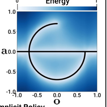
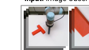
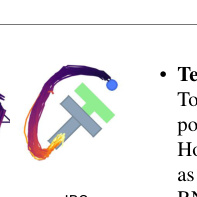

# Diffusion Policy：让机器人像"擦掉杂音"那样擦出动作

> 这是一份给"完全没接触过 AI"的读者看的精读笔记。语言尽量像聊天，公式全部翻译成人话。

## 一句话讲什么（TL;DR）

让机器人像调电视雪花一样产生动作：从满屏乱码开始，擦几下，下一步该怎么动就擦出来了。

*所以这一节是想说：这篇论文换了一种姿势让机器人"产生动作"——不是直接说出来，而是从噪声里磨出来。*

---

## 这是个什么场景

想象你在桌上把一本书推到桌角的某个位置。你不会想太多：可以从左边推、也可以从右边推；推一下歪了就微调；快到位时手会自己慢下来。

现在让机器人手臂干这件事——把一个 T 字形木块推到红色目标位。它没你这种"手感"，它能做的只有一件事：**看一眼摄像头画面，输出一个动作（手往哪边动几厘米）**。这种"看一眼、动一下"的循环，每秒要跑十几次，跟你打游戏一帧一帧操作差不多。

那怎么教它？常见做法叫 **模仿学习（imitation learning）**：

> 录几百段"专家演示"——研究员握着机器人手臂亲手做一遍。然后让神经网络学一个映射：看到画面 X 就输出动作 Y。

听起来像背单词题：见到 X 写下 Y。但这门考试有三个坑：

1. **同一个画面对应多个合理答案**：木块挡在中间，从左绕、从右绕都对。两种都见过的网络容易"取平均"，学出一个走中间撞上去的动作——就像问你"周末去公园还是看电影"，你回答"去公园看电影"。
2. **动作要连贯**：人推东西是有节奏的连续动作，不是一帧一帧蹦。一帧一帧独立决策的网络容易抖。
3. **训练不稳定**：当时最有希望的方法（IBC）训练时损失曲线看着在降，可成功率却像过山车上下乱跳，只能"训几百次挑最好的一次"。

Diffusion Policy 想一次性把这三件事都解掉。

*所以这一节是想说：机器人模仿学习卡在"多种合理动作 + 动作连贯 + 训练稳"三件事上，这篇论文是来解这道老题的。*

---

## 之前的人怎么做的，为什么不够好

- **方案 A：直接回归（Explicit Policy）**
  类比：网络看到画面，直接说出"手臂往右移 0.3cm"。问题：如果数据里"往右"和"往左"都对，网络会输出"往中间"——把两种好答案平均成一个差答案。

- **方案 B：把动作切成格子分类（Discretized Action）**
  类比：把可能的动作分成 100 个格子，让网络选其中一个。问题：动作有 6 个维度，每维 100 格 → 总共一万亿个格子。维度一多就爆炸。

- **方案 C：混合高斯（GMM）**
  类比：网络说"我有 60% 想往左走，40% 想往右走"，输出几个钟形分布。问题：要提前指定"几个模式"，模式选少了表达不出来，多了训练不稳。

- **方案 D：Implicit Policy / IBC**
  类比：网络不直接说动作，而是给每个候选动作打分（叫"能量"），动作越好分越低。预测时找分最低的。问题：训练时需要"造假动作做对照组"，假动作造得不好，整个训练就崩。论文里 IBC 在多个任务上得分是 0.00。

- **核心难题**：上面这些方法都在和"如何同时表达多种合理动作 + 训练稳 + 高维空间"做权衡，没人能三者全占。

*所以这一节是想说：之前的方法各有取舍，IBC 最接近理想但训练崩；缺一个能把这三件事一锅端的新方案。*

---

## 这篇论文的新想法

**类比**：你看过雕塑家做石膏像吗？他不是上来就有一张完美的脸——他先看着一团粗糙的石膏胚，然后一刀一刀刮掉多余的部分，刮到最后那张脸就出来了。

Diffusion Policy 让机器人产生动作的方式跟这个一模一样：

> 把"机器人接下来该怎么动"当成一张要刻出来的画。**起点是一团完全随机的雪花，让网络一步一步刮掉噪声，刮 K 次后剩下的那张图就是要执行的动作序列。**

等等，先慢一拍——为什么"刮雪花"比"直接说动作"更好？

关键在两件事：第一，每次从不同的雪花起点开始刮，会刮出**不同的合理动作**（左推一次、右推一次都行），不会被迫取平均；第二，"刮一点点"这个动作比"一次说对答案"容易学得多，所以训练特别稳。这正好对应前面三个老难题里的两个。

这套"加噪 + 去噪"的框架就是图像生成里大火的 **扩散模型（diffusion model）**——Stable Diffusion、DALL·E 2 都是这个思路。Diffusion Policy 把它从"画图"搬到"画动作"，开了机器人模仿学习的新分支。

*所以这一节是想说：把"决定下一步动作"重写成"从噪声里反复擦出动作"，借扩散模型的能力一次搞定老难题。*

---

## 它分几步做的（方法）

<!-- paper-figures:begin -->



*上图说明：Figure 1：扩散策略从噪声迭代去噪得到动作轨迹（论文原图）。*



*上图说明：Figure 2：Diffusion Policy 整体架构（观测编码 + 1D U-Net 去噪）（论文原图）。*



*上图说明：Figure 3：多模态动作分布——同一状态下多个合理动作簇（论文原图）。*
<!-- paper-figures:end -->


整篇论文做了 4 件关键事：把扩散模型搬到动作上、设计网络结构、用"边走边规划"接好闭环、加视觉条件。下面逐一展开，每一件都从"类比 → 机制 → 公式人话翻译 → 为什么有用"的顺序讲清楚。

### 1. 用"擦噪声"代替"直接说动作"

**类比**

老式宝丽来相纸刚拍出来时是一片模糊的灰色，过一会儿才慢慢显出图像。Diffusion Policy 让网络做的事就像这种"显影"——但反过来：

> 给网络一张"全是雪花的乱码"，让它擦一点雪花、再擦一点、再擦一点……擦 K 次后，剩下的就是清晰的"该执行什么动作"。

再换个类比帮助理解"前向过程"。想象你有一杯清水（代表一条清晰的专家动作轨迹），你往里面逐滴滴入墨汁（代表加噪声）。每滴一滴，水就更浑浊。滴了 1000 滴后，这杯水和纯墨水没什么区别了——你看不出原来清水的样子。扩散模型要学的，就是如何从这杯黑水出发，一滴一滴"反向吸出"墨汁，最终恢复出一杯清水——虽然不一定是原来那杯，但它同样是一杯合格的清水。

**前向过程（加噪）的具体步骤**

给定一条"干净"的动作轨迹 a_0（比如机械臂在 16 个时间步的关节角度序列），前向过程在每一步 t 上叠加一点高斯噪声。原文公式：`a_t = sqrt(α_t) · a_{t-1} + sqrt(1-α_t) · ε`，其中 ε 是从标准正态分布随机采样的噪声。人话翻译："**含噪版动作 = 上一步的动作缩小一点点 + 一份随机噪声**"。α_t 是一个接近 1 的数（比如 0.9999），控制每步缩小多少。经过 T 步后（DDPM 通常 T=1000），a_T 变成几乎纯粹的高斯白噪声——完全丢失了原始动作的信息。

这里有个精妙的数学性质：因为每步加噪都是线性操作且噪声互相独立，你可以跳过中间所有步，直接用一个公式从 a_0 算出任意时间步 t 的含噪版本。这意味着训练时不需要真的走 1000 步加噪——随机选一个 t，一步就能算出 a_t。这让训练效率大幅提升。

**反向过程（去噪）的具体步骤**

1. 训练时：找一段专家演示，把里面真正的动作（比如"手往前 2cm"）人为加上一些随机噪声变模糊。
2. 让网络看着模糊版动作 + 当前画面，去**预测加进去的噪声是什么样的**。
3. 推理（用的时候）：从纯噪声开始，让网络反复"猜噪声 → 减掉噪声"K 次，最后剩下的就是动作。

> **扩散模型（Diffusion Model）**：图像生成里红极一时的方法（Stable Diffusion、DALL·E 2 都基于它）。核心思路是"先把好图加噪变烂图，训练时教网络如何反过来去噪"。
>
> **DDPM（Denoising Diffusion Probabilistic Model）**：这套去噪过程的具体数学版本，是 2020 年由 Ho 等人提出的。前向过程 T=1000 步，反向过程也 1000 步（每步一次网络前向传播），每步有随机性。图像生成质量极高，但对机器人控制来说太慢——如果控制频率是 10Hz，每步只有 0.1 秒，1000 次前向传播远超时限。
>
> **得分函数（score function）**：数学上是"概率分布的梯度方向"，即 ∇_a log p(a)。直觉理解：在动作空间这片大地图上，每个点都有一个箭头，告诉你"往哪边走，更像专家会做的动作"。网络学的就是这个箭头方向。为什么这对多模态分布至关重要？因为得分函数在左峰附近指向左峰、在右峰附近指向右峰——从噪声出发时，你落在哪个"引力范围"内就被吸引到哪座峰，永远不会被拉到两峰之间的山谷。

**关键公式翻译成人话**

去噪迭代公式——原文：`x^(k-1) = α(x^k - γ·ε_θ(x^k, k) + N(0, σ²I))`

人话："**新一轮的动作 = 旧一轮的动作 - 网络猜出来的噪声 + 一点点随机扰动**"。就是"挪一小步往更清晰的方向去，再加一点随机抖动避免卡死"。这里的随机扰动项非常关键——它保证了同一个起点多次去噪可以产生不同结果（不同的合理动作），是多模态表达的数学来源。

**训练损失翻译成人话**

原文：`L = E[||ε - ε_θ(a_t, t)||²]`

人话："**随机选一个时间步 t，随机加一个噪声 ε 到真实动作上，让网络预测这个噪声，和真实噪声比较均方误差**"。这个损失函数出人意料地简单——你不需要显式建模动作的概率分布（不需要定义高斯混合、不需要设计 VAE 的隐空间），只需要训练一个"噪声预测器"。分布的复杂度被隐式编码在了去噪路径中。

对比 IBC 的训练方式就能看出简单在哪：IBC 用 Info-NCE loss，需要对每个真实动作构造一批"负样本"（随机造的假动作），让模型学会给真动作低能量、假动作高能量。高维空间里随机造的负样本几乎不可能落在"好动作"附近——模型看到的都是"明显很差"的样本，学不到有区分度的能量地形。Diffusion Policy 完全绕过了负采样这个坑。

**从图片到动作：维度的变化**

扩散模型最初为图像生成设计。迁移到动作生成时，数据形状从 [H, W, 3]（像素网格，典型维度 512x512x3 = 786,432）变成了 [T, D]（时间步 x 动作维度，典型维度 16x7 = 112）。维度降低了四个数量级，意味着动作空间的扩散比图像扩散快得多——10 步 DDIM 就够了，不需要图像生成领域常见的 50-100 步。但也有新挑战：动作轨迹有强时序依赖。第 3 步的关节角度和第 4 步的关节角度之间有物理约束（机械臂不可能瞬间跳转 90 度）。Diffusion Policy 用 1D 时序卷积来建模这种依赖，确保去噪后的轨迹在时间维度上平滑连续。

**为什么这步有用**

- **天然能表达多种合理动作**：每次从不同的雪花起点开始擦，会擦出不同的合理动作（一会儿向左推、一会儿向右推）——再也不会平均成"中间撞上去"了。用得分函数的语言来说：动作空间里有两座"山峰"——一座代表"左绕"，另一座代表"右绕"。得分函数在左峰附近指向左峰顶点，在右峰附近指向右峰顶点。从噪声出发时，随机落在左侧就被引导到左峰，落在右侧就被引导到右峰——永远不会被拉到两峰之间的"山谷"（那个无效的取平均动作）。对比传统 BC：MSE loss 训练出的模型直接输出一个点估计，这个点被两座山峰同时拉扯，最终停在山谷——概率最低的位置。
- **训练超级稳**：不像 IBC 要造"对照假动作"，扩散模型只需要预测"我加了什么噪声"，损失曲线一路下降。论文实测：IBC 训练 1000 个 epoch 成功率上下抖动（Figure 6），Diffusion Policy 一路平稳上升。论文用 two-number 报告法——"(最佳 checkpoint 成绩) / (最后 10 个 checkpoint 平均成绩)"——来量化这种稳定性。Diffusion Policy 两个数字通常很接近（如 1.00/0.98），IBC 差距极大（如 0.79/0.41）。
- **能直接吐一串动作**：擦出来的不是一个数字，可以是一整串"接下来 16 步该怎么动"。扩散模型在高维空间表现优异——这是它在图像生成中已经验证过的能力——直接迁移到高维动作序列上。维度从图像的 786K 降到动作的 112，去噪快四个数量级——10 步 DDIM 就够。

*所以这一节是想说：把"输出动作"重写成"逐步去噪"，三个老难题（多模态/稳/高维）一次性解决。训练只需预测噪声，推理只需反复减噪声——简单到令人意外。*

---

### 2. 一次预测一串动作 + 滚动重规划（Receding Horizon Control）

**类比**

老司机开车不会"看一眼路想一下，再看一眼想一下"。他会**先在脑子里规划接下来 5 秒的动作**（轻踩油门、过弯减速、变道），然后真的执行其中前 1-2 秒，剩下的边开边重新规划。这就是机器人控制里说的"滚动时域控制"。

**它在干什么**

设三个时间窗：

- **观察窗 To**：往回看 2 帧画面（比如最近 0.2 秒）。为什么是 2 而不是 1？因为两帧之间的差异提供了运动信息——类似于光流。单帧是静态的，无法判断物体是否在移动。
- **预测窗 Tp**：往后规划 16 步动作（比如未来 1.6 秒）。为什么要预测这么远？因为动作轨迹有时间相关性——当前动作受未来目标的影响。只预测下一步是"近视"的；预测 16 步让模型能规划更连贯的运动。
- **执行窗 Ta**：真的执行其中前 8 步，到第 8 步停下来重新规划。为什么 Ta < Tp？后半段预测（第 9-16 步）越远越不准，不执行它们就不会犯错。执行 8 步后获得新观察，可以根据实际情况调整计划。

> **Receding Horizon Control（滚动时域控制）**：控制论里几十年的老办法。每次预测一长段未来动作，但只执行其中前几步，然后向前滚一段，再次预测一长段。汽车自动驾驶、电厂调度都用它。
>
> **Action Horizon（动作视野）**：执行窗 Ta 的步数。Ta=1 是"一步一停"，Ta 太长则反应迟钝。论文里实测 Ta=8 是甜点。

**为什么这步有用**

- **抗抖动**：如果每一步独立预测，相邻两步可能恰好分别选了"左路"和"右路"两种合理但**互相打架**的方向，输出就会左右横跳变成抖动。一次预测一串就强制每串内部协调。这是扩散模型的一个精妙优势——因为它一次性去噪整个动作序列，所以序列内部的时间一致性是被数学保证的，不需要额外的平滑后处理。具体来说，去噪网络用的 1D 时序卷积天然让相邻时间步的动作值在特征空间里互相关联——你无法只改一步的动作而不影响周围几步。
- **抗"演示者发呆"**：人在演示时偶尔会停几秒（比如等液体倒满），单步策略学完后会"卡在停那一步出不来"，因为输入没变它就一直输出"不动"。多步预测能记住"这是个临时停顿，过几步就该继续"。论文在酱料倒取任务中实测了这一点：LSTM-GMM 在 15/20 次里舀完酱料后无法抬起勺子（卡在"等液体"状态），Diffusion Policy 则顺利过渡到下一阶段。原理很直观：多步预测的网络在训练时看到的是一整段轨迹（含"停 → 继续"的过渡），它学到的是"停 3 秒后该抬手"这个完整的时序模式，而单步策略只看到当前帧的"不动"，无法判断"已经停够了"。
- **抗延迟**：摄像头采图、网络推理、电机响应加起来有 100-300ms 延迟。一次规划一长串就能吸收这种延迟。论文实测：4 步延迟内成功率不下降。而速度控制受延迟影响更大——因为速度误差会累积（这一帧速度算错一点，下一帧位置就偏一点，几秒后就漂走了），位置控制每帧重新看绝对位置，没有累积。

**三个参数的选择依据**

为什么 To=2、Tp=16、Ta=8 是默认值？To=2 是因为单帧没有运动信息（你看一张照片无法判断球在往哪飞），两帧给出最小必要的速度线索。Tp=16 是在"预测得够远以保证连贯性"和"不要太远以免预测失准"之间的折中——论文扫了从 4 到 64 的范围，16 步在大多数任务上最优。Ta=8 是 Tp 的一半，保证执行窗口内的动作质量高（离当前时刻越近的预测越准），同时每 8 步重新获取一次观察做修正。论文 Figure 5 左图展示了 Ta 从 1 扫到 128 的完整曲线，Ta=8 附近有一个清晰的峰值。

*所以这一节是想说：和老司机一样"一次想一段、滚动地想"，比"一步一停"稳得多。三个窗口参数的具体取值都有消融实验支撑。*

---

### 3. 视觉条件：把摄像头画面当"提示词"塞进去

**类比**

你让画家画"一只在沙发上的橘猫"。"橘猫"+"沙发"是提示词，画家根据提示词在白纸上画。你不会让画家**先画沙发再画猫**——猫和沙发应该一起画。

Diffusion Policy 的视觉处理也是这个思路：图像不是要预测的东西，而是"提示"。

**它在干什么**

1. 当前画面经过 ResNet-18 编码成一串数字（视觉特征）。
2. 这串数字塞给去噪网络当**条件**——每一步去噪时网络都看着它。
3. 关键：图像编码只跑**一次**，K 次去噪迭代里都共用这一份编码。

> **Conditional Diffusion（条件扩散）**：让扩散过程参考一个外部条件（这里是图像）。和 Stable Diffusion 用文字 prompt 控制画图一个道理。
>
> **FiLM（Feature-wise Linear Modulation）**：把条件变成一组缩放和平移系数，作用在网络中间层上。可以理解成"用图像在网络里调旋钮"。
>
> **ResNet-18**：一个经典的图像识别网络。这里被改了几处：把全局平均池化换成空间 softmax（保留位置信息）、把 BatchNorm 换成 GroupNorm（配 EMA 训练更稳）。

**对比 Janner 等人的"联合去噪"方案**

为什么图像必须当条件而不是当去噪目标？之前 Janner 等人（Diffuser，2022）的做法是把"画面 + 动作"拼成一个大向量一起去噪——每轮去噪迭代都要重新处理图像。假设去噪 K=10 步，图像编码就要跑 10 次，而每次编码一张 224x224 图像本身就是一笔不小的计算。Diffusion Policy 把图像提到去噪循环外面：编码一次得到特征向量，10 步去噪里都复用这个向量。这一改就把图像相关的计算量砍掉了 10 倍。

更深层的好处是：当图像只当条件时，去噪过程只作用在动作空间上。动作空间维度低（112 vs 图像的 786K），去噪收敛快、采样质量高。如果图像也参与去噪，去噪过程要同时在两个性质完全不同的空间里工作——图像的空间结构和动作的时序结构差异很大，网络很难两头兼顾。

**视觉编码器的选择：一个有趣的消融实验**

论文在 Robomimic 的 Square 任务上对比了三种视觉编码器（ResNet-18、ResNet-34、ViT-B/16）和三种训练策略（从头训练、冻结预训练权重、微调预训练权重）：

- 从头训 ViT 只有 22% 成功率——数据太少撑不起大模型。ViT 参数量比 ResNet-18 大一个数量级，200 个 demo 不够它收敛。
- 冻结预训练编码器效果也差——说明 Diffusion Policy 需要的视觉表征和 ImageNet/CLIP 预训练学到的不同。ImageNet 训练的特征关注"这是猫还是狗"这种语义信息，而机器人控制需要的是"这个物体的精确位置和姿态"。
- 微调预训练 ViT-B/16（CLIP）达到 98% 成功率——最佳方案。微调让预训练知识作为起点，再根据任务需求微调特征空间的几何结构。
- 但各架构微调后的最终差距其实不大（ResNet-18 微调 92%，ResNet-34 微调 94%，ViT-B/16 微调 98%）——这意味着视觉编码器的选择没有扩散策略本身的设计那么关键。实际工程中 ResNet-18 + 端到端训练就够用了。

**ResNet-18 的三处定制修改**

论文没有直接拿标准 ResNet-18，而是做了三处修改：第一，把全局平均池化（Global Average Pooling）换成空间 softmax——前者把整张特征图压成一个数字，丢掉了"物体在图像哪个位置"的信息；空间 softmax 保留了位置信息，输出的是"最显著特征点的坐标"。第二，把 BatchNorm 换成 GroupNorm——因为 Diffusion Policy 使用 EMA（指数移动平均）来稳定训练，BatchNorm 的统计量依赖 batch 内的样本分布，和 EMA 的权重更新机制冲突；GroupNorm 只在通道内做归一化，不依赖 batch 统计量，更稳定。第三，降低了图像输入分辨率以加快推理速度。

**为什么这步有用**

- **省算力**：图像编码只跑一次，K 次去噪迭代共用同一份编码。比"联合去噪"方案快 K 倍。
- **能实时**：在 RTX 3080 上 0.1 秒推完一次 → 可以达到 10Hz 控制。
- **图像编码可以端到端训练**：因为是条件不是目标，图像编码器的权重也跟着扩散过程一起调，比"用冻结的预训练编码器"效果更好（实测从 22% 涨到 98%）。端到端训练让编码器学会提取"对控制有用的特征"——比如物体的精确 2D 坐标、相对距离——而不是 ImageNet 式的语义标签。

*所以这一节是想说：图像不参与去噪，只在旁边提示——又快又准。三处 ResNet 定制修改都是为了让视觉编码适配实时控制场景。*

---

### 4. 网络结构：CNN 还是 Transformer 都能用

**类比**

要写一篇文章，可以用 Word（什么都能干，复杂、慢）也可以用记事本（简单、快）。Diffusion Policy 提供了两套去噪网络让你选。

**两个版本的详细对比**

- **CNN 版（默认推荐）**：用 1D 时间卷积处理动作序列。具体来说，网络输入是含噪动作序列（形状 [Tp, D]，Tp 是预测步数，D 是动作维度），经过多层 1D 卷积后输出预测噪声（形状相同）。视觉条件通过 FiLM 层注入——在每个卷积块之间，图像特征生成一组缩放系数和偏移系数，对卷积输出做 "scale and shift"。去噪时间步 k 通过正弦位置编码转换成向量，也用 FiLM 注入。优点：开箱即用，不太需要调超参；缺点：天生偏好"低频信号"——动作变化太快太尖锐时会被卷积"抹平"。为什么偏好低频？因为卷积核是个局部加权平均操作，它把相邻时间步的动作值混合在一起，天然会平滑掉高频跳变。这在控制论里叫"频谱偏差"（spectral bias），是 CNN 架构固有的特性。
- **Transformer 版**：用 minGPT 风格的因果注意力。输入序列的每个 token 对应动作序列中的一个时间步。视觉条件和去噪步信息作为额外 token 拼接在序列前面——类似于 GPT 中的"系统提示"。因果注意力的掩码保证每个时间步只看到自己和之前的时间步，生成是自回归的。优点：注意力机制让每个时间步可以直接关注序列中的任何其他时间步（在掩码范围内），不受局部感受野限制，因此能处理"动作每帧都剧烈变化"的任务（比如速度控制）；缺点：超参敏感（学习率、层数、头数都需要仔细调整），不好调。实测在 BlockPush p2 上 Transformer 版（0.94）远超 CNN 版（0.11），因为 BlockPush 要求两次推块动作之间有急转弯，CNN 会把这个急转弯抹平。

> **Causal Attention（因果注意力）**：每个时刻只能看到自己和过去的时刻，看不到未来。语言模型 GPT 也用这个机制，保证生成顺序合理。
>
> **DDIM（Denoising Diffusion Implicit Model）**：扩散模型的快速采样技巧——训练时用 100 步去噪，推理时只用 10 步。能 10 倍加速且几乎不掉精度。Diffusion Policy 用它达到实时控制。和 DDPM 共享同一个训练好的模型——不需要重新训练。训练一次，推理时自由切换。

**位置控制 vs 速度控制：一个关键设计选择**

论文的消融实验发现了一个重要结论：Diffusion Policy 配位置控制（position control）远胜速度控制（velocity control），而之前的基线方法（LSTM-GMM、BET、IBC）则用速度控制更好。原因是什么？

位置控制是"我要去 X 这个点"，速度控制是"我要以多快往哪边走"。速度控制有"误差累积"——这一帧速度算错一点，下一帧位置就偏一点，几秒后就漂走了。之前的方法因为每帧独立预测，速度控制的累积误差还算可控。但 Diffusion Policy 一次预测 16 步，如果用速度控制，16 步里前面的速度误差会在后面放大。位置控制每帧直接指定绝对位置，没有累积效应——完美匹配 Diffusion Policy 的多步预测设计。

**作者的推荐顺序**

1. 先试 CNN 版（FiLM 条件 + 1D 时序卷积）。
2. 如果任务里动作变化特别快、精度要求特别高，再换 Transformer 版。

*所以这一节是想说：去噪用什么网络都行——卷积简单稳，Transformer 强但难调。位置控制和多步预测是天生一对。*

---

## 关键数字（What works）

数字本身不重要，重要的是它们告诉你哪种"设计选择"是关键。

### 数字 1：15 个任务平均提升 46.9%

| 维度 | 数据 |
|------|------|
| 覆盖范围 | 4 个 benchmark（Robomimic / Push-T / BlockPush / Kitchen），共 15 个任务 |
| 实验规模 | 每个任务 3 个 seed x 50 个初始条件 = 1500 次实验 |
| 对比基线 | LSTM-GMM / IBC / BET |
| 关键含义 | 不是"在某个任务上比之前强"——而是"在所有 benchmark 上一律稳赢平均近一半"。这是"奠基性"的标志。 |

### 数字 2：Kitchen p4 提升 213%

| 维度 | 数据 |
|------|------|
| 任务 | Kitchen 里 7 个家具，p4 = 完成 4 个或以上家具操作的成功率 |
| Diffusion Policy | 0.99 |
| BET（之前最强） | 0.44 |
| 关键含义 | 长程多模态（不同家务可以任意顺序做）是所有方法里最难的，Diffusion Policy 几乎做满了。 |

### 数字 3：IBC 在 7/10 个任务上是 0.00

| 维度 | 数据 |
|------|------|
| 涉及任务 | Robomimic 的 Can / Square / Transport / ToolHang 等 |
| IBC 成功率 | 0.00（多次重复都是 0%） |
| Diffusion Policy | 同样数据，这些任务都到 0.95+ |
| 关键含义 | 能量模型理论上很好但工程上崩，是 Diffusion Policy 出来后被取代的核心原因。 |

### 数字 4：现实世界 Push-T 95% vs 0% (IBC) vs 20% (LSTM-GMM)

| 维度 | 数据 |
|------|------|
| 硬件 | UR5 机械臂，真实推 T 字块 |
| 指标 | 最终位置 IoU（0.80 vs 人类 0.84） |
| 关键含义 | 这是真机数据——不是模拟器作弊。Diffusion Policy 第一个把 push-T 这种"高精度 + 多模态"任务真机做到接近人。 |

### 数字 5：DDIM 加速到 0.1 秒推理

| 维度 | 数据 |
|------|------|
| 训练去噪步数 | 100 步 |
| 推理去噪步数 | DDIM 10 步 |
| 硬件 | 单卡 RTX 3080 |
| 关键含义 | 能跑到 10Hz，意味着真的能做闭环机器人控制——不是"研究 demo 跑一帧 5 秒那种"。 |

### 数字 6：动作视野 Ta=8 是甜点，太长反而掉

| 维度 | 数据 |
|------|------|
| 实验 | Ta 从 1 扫到 128，绘制成功率曲线 |
| 最佳点 | Ta=8 |
| 关键含义 | 太短抖、太长反应慢。这条曲线让后续所有用 Diffusion Policy 的人省掉一轮调参。 |

*所以这一节是想说：数据告诉我们三件事——这方法稳、强、能上真机。*

---

## 实验结果说明了什么

上一节列了数字，这一节换个角度：这些实验回答了哪些科学问题？

**问题一：扩散模型真的能表达"多个正确答案同时存在"吗？**

回答这个问题需要两类任务。第一类是**短程多模态（short-horizon multimodality）**：同一个即时目标有多种达成方式。Push-T 任务里，T 形木块在中间，左推和右推都行。论文 Figure 3 展示：Diffusion Policy 学到从左右两侧等概率接近接触点，而 LSTM-GMM 偏向一侧，IBC 在两侧之间犹豫不决，BET 则无法承诺到单个模态上（动作分散在两个模态之间）。第二类是**长程多模态（long-horizon multimodality）**：不同子目标的完成顺序可以互换。Kitchen 任务有 7 个物体可操作，p4 指标要求完成 4 个以上且顺序任意。Diffusion Policy 的 p4 达到 0.99（几乎每次都能完成 4 个以上），比 BET 的 0.44 高出 213%。这说明扩散过程不仅能在"下一秒该往左还是往右"上做出选择，还能在"先开灶台还是先开微波炉"这种跨十几秒的宏观计划上保持一致性。

**问题二：训练稳定性到底好多少？**

论文 Figure 6 给出了直接的可视化对比。IBC 训练 1000 个 epoch，评估成功率从 0% 到 80% 来回乱跳，研究员只能"训完几百次挑最好的"——这在工程上是灾难，因为你不知道什么时候该停。Diffusion Policy 的损失一路平稳下降，成功率单调上升，最终 checkpoint 就是最好的。这不是个别现象：论文用了 two-number 报告法——"(最佳 checkpoint 成绩) / (最后 10 个 checkpoint 平均成绩)"。Diffusion Policy 这两个数字通常很接近（比如 1.00/0.98），说明训练后期每个 checkpoint 都好；IBC 的两个数字差距极大（比如 0.79/0.41），说明训练极度不稳定。

**问题三：真机上行不行？只有模拟器好看是没用的。**

论文在四类真机任务上验证：单臂 Push-T（UR5，136 个 demo）、酱料倒取与铺撒（UR5，90 个 demo）、翻杯子（UR5，250 个 demo）、双臂蛋打器/卷垫子/叠衬衫（两个 Franka Panda，210-284 个 demo）。Push-T 成功率 95%（人类 100%），双臂叠衬衫 75%，卷垫子 75%，蛋打器 55%。双臂任务的主要失败模式不是策略错误，而是初始抓取失败（手没抓到目标物），说明扩散策略本身的规划能力在真机上是过关的。

**问题四：面对没见过的扰动，会不会死机？**

最让人惊喜的实验是扰动鲁棒性测试。三种扰动都测了：遮挡摄像头 3 秒（手在镜头前晃），机器人微微抖了一下但没偏离路线；推动目标物体改变位置，机器人停顿不到一秒后从相反方向绕过来重新推；在机器人已经完成推块、正走向终点时把块挪走，机器人立刻折返去修正。论文写道："Diffusion Policy may be able to synthesize novel behavior in response to unseen observations。"——面对从未见过的干扰，它能临场组合出新行为。这不是提前录好的"如果被干扰就这样做"，而是滚动重规划 + 多模态采样的自然结果。

**问题五：位置控制和速度控制的差距为什么这么大？**

这是论文最出乎意料的发现之一。在基线方法（LSTM-GMM、BET）中，速度控制普遍更好——这和当时的文献一致。但 Diffusion Policy 配位置控制后，成绩大幅反超。论文通过消融实验（Figure 4）展示了这一点，并在 Section 4.5 从控制论角度解释：位置控制下，Diffusion Policy 的行为等价于一个开环的最优轨迹规划器加一个闭环的位置追踪器。轨迹规划器输出参考轨迹，位置追踪器（通常是 PID 控制器）保证实际执行跟上参考。这种"规划 + 追踪"的两层结构和经典控制理论完全一致，让 Diffusion Policy 天然获得了工业控制几十年积累的稳定性保障。

*所以这一节是想说：实验不仅证明"数字好看"，还系统回答了五个关键科学问题——多模态表达、训练稳定性、真机可行性、扰动鲁棒性、以及为什么位置控制更好。*

---

## 你应该懂的几个新词

> **Behavior Cloning（行为克隆）**：模仿学习里最简单的一种。给定专家演示数据（画面 + 动作），训一个网络把画面映射到动作。本论文就属于这一支。

> **Visuomotor Policy（视觉运动策略）**：输入是图像、输出是机器人动作的策略函数。"visuo-"是视觉，"motor"是运动。

> **Diffusion Model（扩散模型）**：先给数据加噪、再训网络去噪的生成模型。Stable Diffusion、DALL·E 2 是它在图像上的应用，本论文是它在动作上的应用。

> **DDPM（Denoising Diffusion Probabilistic Model）**：扩散模型的标准数学版本。Ho 等人 2020 年提出。

> **DDIM（Denoising Diffusion Implicit Model）**：扩散模型的"快进按钮"。训练时 100 步，推理时只跑 10 步。

> **Score Function（得分函数）**：动作空间这张地图上每个点的"箭头方向"——指向"更像专家"的方向。网络真正学的就是这个箭头。

> **Multi-modal Action Distribution（多模态动作分布）**：同一个画面对应多个合理动作（比如左推、右推都行）。是模仿学习老大难。

> **Receding Horizon Control（滚动时域控制）**：每次预测一长串动作只执行前几步。控制论老办法，自动驾驶/电厂调度都用。

> **FiLM（Feature-wise Linear Modulation）**：把条件信息变成"调旋钮"的方式注入网络。这里用来把图像信息塞进去噪网络。

> **Energy-Based Model（能量模型）**：给每个候选动作打"能量分"，分越低越好。IBC 就是这一支，训练不稳。

> **Stochastic Langevin Dynamics（随机朗之万动力学）**：物理里描述粒子在势能场里乱走的方程。扩散模型的采样过程数学上等价于这个——所以"沿得分函数走 + 随机扰动"。

> **End-to-end Training（端到端训练）**：图像编码器 + 去噪网络 + 一切组件一起训练，不冻结任何部分。本论文实测端到端比"冻结预训练 ResNet"效果好得多。

*所以这一节是想说：上面这十几个词以后看任何机器人论文都会反复出现，先把它们和生活类比挂钩。*

---

## 它有什么搞不定的

Diffusion Policy 不是万能的，论文自己也老实交代了几个翻车点：

- **推理慢一点点**：扩散需要 K 步迭代，比直接前向慢。即使用 DDIM 加速到 10 步，也不如 LSTM-GMM 一帧一帧跑那么快。100Hz 以上的高频控制不太适合。后续工作 Consistency Policy 和 Flow Matching（如 π0 用的方案）就是针对这个瓶颈发力的——前者把去噪步数压缩到 1-2 步，后者用直线路径替代曲线路径加速采样。
- **演示数据决定一切**：扩散模型表达能力强，但学的还是演示里有的动作。演示者从没做过的招式，它编不出来（虽然推 T 块的实验里它显示出一些"组合动作"的迹象）。这和大语言模型的情况类似——模型能力的上限被训练数据锁死。
- **CNN 版怕"快变信号"**：动作要每帧大变（比如速度控制场景），CNN 卷积偏好低频会抹平。要换 Transformer 版还得调超参。在 BlockPush p2 上 CNN 版只有 0.11，Transformer 版 0.94——差距悬殊，说明网络结构选择不是可以忽略的细节。
- **真机数据贵**：210 个 demo 训蛋打机、162 个训卷地垫、284 个训叠衬衫——demo 还得带触觉手柄做。这是"演示驱动"路线的通病。后续 π0 通过跨机体预训练 + 少量微调来缓解这个问题，但没有根本解决。
- **没有语言接口**：Diffusion Policy 只接受图像输入，不能理解自然语言指令（比如"把红色杯子放到左边"）。后续 OpenVLA-OFT 和 π0 把扩散动作头接到视觉-语言模型上，才补上了这一环。

*所以这一节是想说：Diffusion Policy 解了多模态/稳/高维老题，但没解"演示数据贵"、"高频控制慢"和"不懂语言"的根问题。每个局限都催生了后续工作。*

---

## 它和别的论文是什么关系

- **时间线**：DDPM（2020 图像生成）→ Diffusion Policy（2023 RSS）→ 一票"Diffusion + 机器人"工作（3D Diffuser Actor、Octo、π0 等）→ Cosmos Policy（2025 用世界模型微调）。
- **集合关系**：你可以把"机器人模仿学习"想成一个大集合 M。Diffusion Policy 是这集合里第一个**用扩散模型做策略**的成员，定义了一个新分支。
- **因果关系**：
  - DDPM 出现 **导致** 了 Diffusion Policy 能成立。
  - Diffusion Policy 出现 **导致** 了后续大量"VLA + 扩散动作头"的工作（比如 OpenVLA、Cosmos Policy 都用扩散思想生成动作）。
  - Receding Horizon Control 是 60 年代控制论老想法，**被复用进** Diffusion Policy 用来做闭环。
- **对比关系**：
  - 和本仓库已有的 **OpenVLA**：OpenVLA 用大语言模型当策略骨架（输入图像 + 语言指令、输出动作 token），动作表达方式偏离散；Diffusion Policy 用扩散过程连续生成动作，但没接语言。两者结合就是后续工作的方向（先理解语言再用扩散落动作）。
  - 和本仓库已有的 **Cosmos Policy**：Cosmos Policy 把"会脑补未来视频"的世界模型微调成策略，扩散思想还在但策略骨架变成了视频模型。可以看作 Diffusion Policy 思想 x 大世界模型的下一代。
  - 和 **LLaVA**：LLaVA 是 VLM，想方设法让 AI"看图说话"；Diffusion Policy 是"看图做事"。两者都是 2023 年定义新范式的开山作，方向不同但思路类似——都把别的领域成熟工具（GPT-4 出题 / 图像扩散）借到自己领域。

*所以这一节是想说：Diffusion Policy 在机器人模仿学习里相当于 LLaVA 在 VLM 里——一个开新分支的"祖宗模板"。*

---

## 和本导读的关系

本笔记对应导读 [Ch13: 扩散策略——Diffusion Policy / 3D-DP / π0](../guide/ch13-diffusion-policy.md) 的第一个模型。

导读 Ch13 讲了三个模型的演进线：Diffusion Policy（2023，学术原型验证）→ 3D Diffusion Policy（2024，加入三维感知）→ π0（2024，产业级基础模型）。本笔记深入拆解的是第一个节点——Diffusion Policy 本身的四个技术贡献（扩散去噪、滚动时域、视觉条件、双网络结构）。

读完本笔记后，建议按导读 Ch13 的路线继续：先看 3D Diffusion Policy 笔记（它把 2D 图像输入升级为 3D 点云，解决了深度信息缺失的问题），再看 π0 笔记（它用 Flow Matching 替代标准扩散以实现 10-100 倍采样加速，并接入 VLM 做跨机体基础模型）。三篇笔记连起来，就是导读 Ch13 "从方法验证到感知升级到规模化部署"这条线的完整细节。

从知识图谱角度，本笔记往上连接 Ch12（OpenVLA / VLAS / MLA）——Ch12 结尾提到 MLA 的扩散动作头和 OpenVLA-OFT 的连续动作选项"已经暗示了一种完全不同的动作生成范式"，本笔记就是那个范式的系统展开。往下连接 Ch14（模仿学习基础——DAgger / ACT-ALOHA / UMI），那一章讲的是 Diffusion Policy 所属的模仿学习大家族里其他重要成员。

*所以这一节是想说：本笔记是导读 Ch13 的第一块拼图，读完后沿 3D-DP → π0 继续，就能看到扩散策略路线从原型到产品的完整演进。*

---

## 思考题

以下问题用来检验你是否真正理解了论文的核心思路，而不只是记住了结论。每题附有折叠提示，建议先自己想 30 秒再展开。

**Q1：为什么扩散模型能天然表达多模态动作分布，而直接回归（MSE loss）不行？请用"山峰与山谷"的类比解释。**

<details>
<summary>提示</summary>

想想动作空间里有两座山峰（两个合理动作）。MSE loss 训练的模型输出一个点估计，这个点被两座山峰同时拉扯，最终停在概率最低的山谷。扩散模型学的是得分函数（每个点的梯度箭头），从噪声出发时随机落在哪座山峰附近，就被箭头引导到那座山峰顶——永远不会被拉到山谷。关键区别：MSE 求的是"离所有正确答案的平均距离最小"，扩散求的是"沿梯度走到某一个正确答案"。
</details>

**Q2：Receding Horizon Control 的核心参数是 To / Tp / Ta。如果你把 Ta 设得等于 Tp（预测多少就执行多少），会出什么问题？如果 Ta 设成 1 呢？**

<details>
<summary>提示</summary>

Ta = Tp 意味着不做滚动重规划——预测的后半段（越远越不准的部分）也会被执行，相当于"闭着眼开完全程"。Ta = 1 意味着每一步都重新预测，好处是反应灵敏，但坏处是相邻两次预测可能选了不同的模态（这次向左、下次向右），输出会左右横跳抖动。Ta = 8 是两个极端之间的甜点——既保证序列内部一致性，又保留定期修正的机会。
</details>

**Q3：论文发现 Diffusion Policy 配位置控制远胜速度控制，而之前的基线方法（LSTM-GMM 等）用速度控制更好。为什么同一个"位置 vs 速度"的选择，对不同方法影响相反？**

<details>
<summary>提示</summary>

速度控制有误差累积——每帧的速度预测误差会在后续帧叠加。单步预测的方法（每帧独立推理）每帧只犯一次小误差，累积不严重。但 Diffusion Policy 一次预测 16 步序列，16 步的速度误差会层层叠加，放大为巨大的位置偏移。位置控制直接指定绝对位置，没有累积效应——第 16 步的目标位置不受前 15 步误差影响。所以多步预测 + 位置控制是天生一对。
</details>

**Q4：IBC 和 Diffusion Policy 都能表达多模态动作分布，理论上都很好。但 IBC 在 7/10 个任务上成功率是 0.00。请解释 IBC 训练崩溃的根本原因，以及 Diffusion Policy 如何绕过了这个问题。**

<details>
<summary>提示</summary>

IBC 是能量模型（EBM）：给每个候选动作打能量分，分越低越好。训练时需要 Info-NCE loss，而这个 loss 需要"负样本"——造一些不好的动作让模型学会给它们打高分。问题：高维空间里随机造的负样本几乎不可能落在"好动作"附近，模型看到的都是"明显很差"的样本，学不到有区分度的能量地形。Diffusion Policy 绕过了负采样：它不学能量函数本身，而是直接学能量函数的梯度（得分函数）。训练目标变成了"预测噪声"，只需要真实数据加噪声，不需要造负样本。
</details>

**Q5：CNN 版 Diffusion Policy 在 BlockPush p2 上只有 0.11，Transformer 版达到 0.94。请解释为什么 CNN 在这个任务上特别差——这和 CNN 卷积操作的什么性质有关？**

<details>
<summary>提示</summary>

BlockPush 要求机器人先推一个块到一个角，然后急转弯去推另一个块到另一个角。这个"急转弯"在动作序列里表现为高频跳变——相邻两个时间步的动作方向突然完全改变。CNN 的 1D 卷积核是局部加权平均操作，天然偏好低频信号。经过多层卷积后，急转弯信号被"抹平"成了缓慢转向——机器人做不出那个干脆利落的方向切换。Transformer 用注意力机制，每个时间步可以独立决定自己的动作（受所有其他时间步影响但不被局部平均），因此能保留高频跳变。
</details>

**Q6：论文在真机扰动测试中观察到 Diffusion Policy 能"合成从未见过的新行为"（synthesize novel behavior）。这种能力来自哪里？是因为模型"聪明"吗？**

<details>
<summary>提示</summary>

不是因为模型"聪明"或"理解"了任务。这是滚动重规划 + 多模态采样的自然结果。当扰动改变了场景（比如目标物体被人推走），下一次重规划时模型看到了新的观察，从新的噪声起点开始去噪，会采样到一个对当前场景合理的动作序列——可能是训练数据中某几段不同演示片段的"组合"。模型本身不知道自己在做什么新事——它只是在当前条件下采样了一个高概率的动作序列。但因为扩散过程能表达复杂分布，这个采样结果恰好看起来像"临场应变"。
</details>

**Q7：如果你要把 Diffusion Policy 应用到一个需要 100Hz 控制频率的任务（比如高速灵巧手操作），你会遇到什么瓶颈？有哪些可能的解决方向？**

<details>
<summary>提示</summary>

10Hz（0.1 秒一次推理）到 100Hz（0.01 秒一次推理）需要 10 倍加速。瓶颈是去噪迭代：即使 DDIM 只用 10 步，每步都是一次完整的网络前向传播。可能的方向包括：Consistency Policy（训练一个"一步去噪"的蒸馏模型，把 10 步压缩到 1-2 步）；Flow Matching（π0 用的方案，用直线路径替代 DDPM 的曲线路径，理论上只需 1 步采样）；模型蒸馏（用大模型教小模型，让小模型一步输出足够好的结果）；或者增大 Ta（一次推理后执行更多步，减少推理次数），但这会牺牲反应速度。
</details>

*所以这一节是想说：能回答这 7 个问题，就说明你真正理解了 Diffusion Policy 的设计逻辑和权衡取舍，不只是记住了"效果好 46.9%"。*

---

## 一些好奇心问答（FAQ）

**Q1：扩散模型不是用来画图的吗？怎么跑动作？**

数学上没区别。扩散模型本质是"学习一个数据分布的得分函数"——只要你能定义"什么是好数据"，它就能从噪声里采样出好数据。图像的"好数据"是清晰图，动作的"好数据"是专家轨迹。换个数据集而已。

**Q2：每次推理都要去噪 100 步？机器人不会卡住？**

训练时 100 步，推理时用 DDIM 加速到 10 步，单 GPU 0.1 秒。能跑 10Hz 闭环。比起"研究 demo 跑一帧几秒"，这已经是真机可用了。但比起 100Hz 高频控制还是不够。

**Q3：为什么"位置控制"比"速度控制"好？**

直觉解释：位置控制是"我要去 X 这个点"，速度控制是"我要以多快往哪边"。后者会有"误差累积"——这一帧速度算错一点，下一帧位置就偏一点，几秒后就漂走了。位置控制每帧重新看绝对位置，没有累积。Diffusion Policy 又能优雅表达多模态，所以用位置控制最划算。

**Q4：演示数据要多少？**

论文实验里：模拟器任务用 100-300 个 demo，真机 push-T 用 136 个 demo，蛋打机 210 个，叠衬衫 284 个。比强化学习省好几个数量级，但比"零样本指令跟随"贵——还得人手把着机器人录。

**Q5：CNN 版还是 Transformer 版？**

作者明确建议先试 CNN 版——开箱即用、几乎不用调超参。只有当任务里动作变化非常快（比如要做高频速度控制）CNN 抹平太严重时，再换 Transformer 版，并准备好调好几天超参。

**Q6：训练稳定具体稳到什么程度？**

论文 Figure 6 显示：IBC 训练 1000 个 epoch，评估成功率从 0% 到 80% 来回乱跳，研究员只能"训完几百次挑最好的"。Diffusion Policy 损失一路平稳下降，成功率单调上升，最终 checkpoint 就是最好的。这一点对于实验室复现门槛影响巨大。

**Q7：能用 Diffusion Policy 跑多大的机器人？**

论文的真机实验从 6DoF 单臂（UR5）到 14DoF 双臂（两个 Franka 协作）都试了。**自由度数量不是瓶颈**——扩散模型在高维空间表现很好。瓶颈是控制频率（10Hz 适合慢任务，更快的还得加速）。

**Q8：之后该看什么？**

最直接的下一步是 **3D Diffuser Actor**（把 Diffusion Policy 扩展到 3D 点云输入）和 **Octo**（用 Diffusion Policy 思想做通用机器人基础模型）。如果想看"扩散 + 大模型"路线，看 **Cosmos Policy** 和 **π0**。如果想理解扩散模型本身，先读 **DDPM 原文（Ho et al. 2020）**。

*所以这一节是想说：实操问题（数据、速度、规模、跟进路线）作者都想到了，用法已经很成熟。*

---

## 我建议这样读这篇

零基础读者不要从头读到尾。建议这样走：

1. **看 Figure 1 三幅小图**（5 分钟）：Explicit Policy / Implicit Policy / Diffusion Policy 三种动作表达方式。一眼记住核心创新是什么。
2. **跳到第 2 节"Diffusion Policy Formulation"**（15 分钟）：搞懂"加噪 → 去噪"这套流程的数学骨架。公式 1-5 是核心。
3. **读第 3 节"Key Design Decisions"**（10 分钟）：CNN vs Transformer 怎么选、视觉编码怎么接、噪声调度选什么。
4. **跳到第 4 节"Intriguing Properties"**（15 分钟）：这一节才是这篇论文的灵魂——为什么扩散能解多模态、为什么训练稳、为什么位置控制更好。
5. **快速扫消融实验**（5 分钟）：动作视野选多长、视觉编码用什么——后续工作都会引用这几张表的结论。
6. **跳过 5/6/7 节的具体任务**：除非你要复现，否则知道"15 个任务全赢"就够了，具体细节用时再查。

读完这 6 步大约 50-70 分钟，已经能在和别人讨论机器人策略时报出 Diffusion Policy 的核心思路。

*所以这一节是想说：精华全在第 2 节的"加噪去噪"和第 4 节的"为什么扩散能解老问题"，工程细节可以略读。*

---

## 如果你想再深入

按"前传 → 同期对手 → 续作 → 衍生方向"排序：

1. **前传：DDPM（Ho et al. 2020）** — 扩散模型的奠基论文。读完才知道 Diffusion Policy 用的"加噪 → 去噪"具体什么样、为什么这么训练。
2. **前传：IBC（Florence et al. 2021）** — Diffusion Policy 直接打败的对手。能量模型路线代表作。读它能理解"为什么 IBC 训练不稳"是 Diffusion Policy 出来的关键动机。
3. **同期：Diffuser（Janner et al. 2022）** — 几乎同一时间用扩散做规划（不是策略）的工作。和 Diffusion Policy 思路相似但更强调长程规划，对照能看出"做策略 vs 做规划"的两条路。
4. **续作：3D Diffuser Actor（2024）** — 把 Diffusion Policy 输入从 2D 图像换成 3D 点云，效果再涨。
5. **衍生：Octo / OpenVLA / π0** — 把 Diffusion Policy 思想嵌入更大的视觉-语言-动作（VLA）模型，做通用机器人基础模型。本仓库已有 **OpenVLA** 笔记可对照。

*所以这一节是想说：把 DDPM + IBC + Diffusion Policy 这三篇连起来读，就能看到 2020-2023 年机器人模仿学习的范式转换全貌。*

---

## 原文信息

**BibTeX**

```bibtex
@inproceedings{chi2023diffusionpolicy,
  title     = {Diffusion Policy: Visuomotor Policy Learning via Action Diffusion},
  author    = {Chi, Cheng and Xu, Zhenjia and Feng, Siyuan and Cousineau, Eric and Du, Yilun and Burchfiel, Benjamin and Tedrake, Russ and Song, Shuran},
  booktitle = {Proceedings of Robotics: Science and Systems (RSS)},
  year      = {2023}
}
```

**链接**

- 论文主页：[diffusion-policy.cs.columbia.edu](https://diffusion-policy.cs.columbia.edu)
- 代码仓库：[github.com/real-stanford/diffusion_policy](https://github.com/real-stanford/diffusion_policy)
- arXiv：[arxiv.org/abs/2303.04137](https://arxiv.org/abs/2303.04137)
- 演示视频：论文主页有 UR5 Push-T、酱料倒取、双臂叠衬衫等任务的完整视频

*所以这一节是想说：这是 Chi et al. 2023 年发表在 RSS 的工作，代码和数据全部开源，是机器人扩散策略方向被引用最多的论文之一。*

---

## 最后一个画面

想象这样的场景：实验室里 UR5 机械臂正在推一个 T 字木块。你伸手把木块往边上挪了挪——研究员在演示 Diffusion Policy 的"扰动鲁棒性"。

机械臂看到画面变了，并没有继续按原计划走。它停顿了不到一秒（10Hz 重规划），然后**从相反方向**绕过来重新推。论文里写："Diffusion Policy may be able to **synthesize novel behavior** in response to unseen observations（Diffusion Policy 似乎能针对没见过的情况合成新行为）"。

这一刻，从"模仿照搬演示"到"看着情况临场反应"，机器人模仿学习走完了一个台阶。

*所以最后一节是想说：Diffusion Policy 不只是技术指标好看——它让机器人在面对没见过的扰动时，也能临场组合出新的合理行为。这是机器人模仿学习的一个标志性瞬间。*
