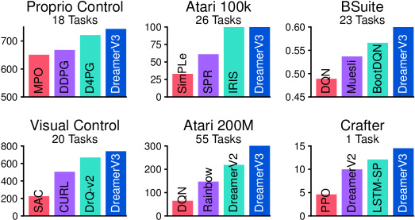
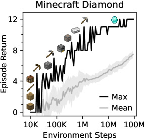
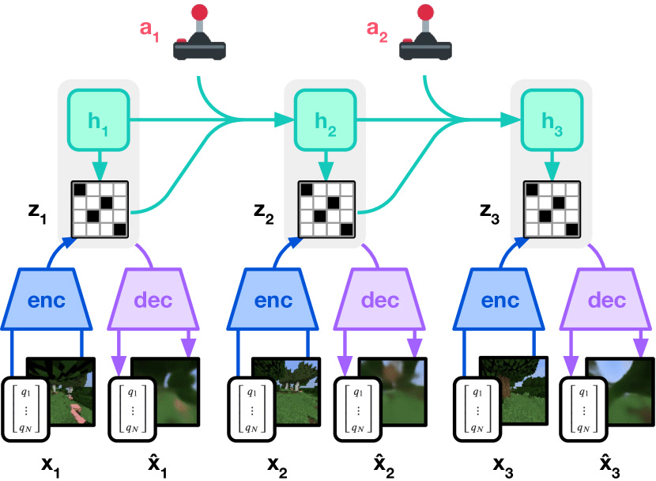

# Dreamer V3: Mastering Diverse Domains through World Models

> 这是一份给「完全没接触过强化学习」的读者写的精读笔记。语言尽量像聊天，公式全部翻译成人话。材料基于 arXiv:2301.04104 全文与 Nature 发表版。

## 1. 一句话讲什么（TL;DR）

DreamerV3 用**同一套固定超参数**，在 150 多种完全不同的任务上同时训练一个「脑内世界模型 + 演员 + 教练」三件套，不靠人类示范数据，第一次让 AI 从零开始在《我的世界》里挖到钻石。

*所以这一节是想说：这篇论文的核心成就是「一套参数打天下」，并在 Minecraft 钻石任务上证明了世界模型路线的上限。*

---

## 2. 这是个什么场景 — 日常类比

想象你刚买了一台万能游戏机，里面塞了 150 款风格完全不同的游戏：

- 有的是**节奏超快**的打砖块（每一秒都要反应）；
- 有的是**慢棋**（走几十步才知道输赢）；
- 有的是**开放世界生存**（奖励极其稀疏，要砍树、造工具、挖矿，最后才给一颗钻石当奖励）。

按常规做法，每换一款游戏，工程师就得**重新调一遍手柄灵敏度、奖励缩放、探索力度**——像换乐器就要换老师。这在**强化学习**（Reinforcement Learning，RL：让 AI 通过试错拿奖励来学做事）里是长期痛点：Pong 的奖励是 ±1，Breakout 可以到几百，Minecraft 挖钻石可能要几十万步才有一次正反馈——尺度差几个数量级，同一套神经网络很容易「被大奖励的任务带偏」或「在小奖励任务上完全不动」。

DreamerV3 想做的事就一句话：**手柄只调一次，150 款游戏全用同一套**。它的窍门是：让 AI 先在脑子里建一个「小世界模型」（world model：对环境的内部模拟器），在脑内「做白日梦」反复演练策略，再回到真实环境里少量验证；同时用一组**数值稳定技巧**（symlog 压缩、two-hot 编码、回报分位数归一化等）把不同游戏的奖励尺度「压平」，让训练过程不再依赖人工调参。

最有冲击力的场景是 **Minecraft 钻石挑战**：每局随机生成无限 3D 世界，Agent 从像素画面出发，要经过砍树 → 合成工具 → 找铁矿 → 炼铁 → 做铁镐 → 挖钻石等 12 个里程碑，全程几乎只有稀疏的 +1 里程碑奖励。熟练人类大约 20 分钟能拿到钻石；在此之前的 VPT 用了 720 张 V100 GPU 训练 9 天，且依赖大量人类键盘鼠标示范；DreamerV3 用 **1 张 A100、约 9 天、100M 环境步**，无人类数据、无课程学习，**全部 10 个随机种子在训练过程中都至少挖到过钻石**。

*所以这一节是想说：DreamerV3 面对的是「跨领域、跨奖励尺度、跨输入模态」的通用控制问题，并以 Minecraft 钻石作为最难的招牌实验。*

---

## 3. 之前的人怎么做的，为什么不够好

- **无模型 RL（PPO、SAC、Rainbow 等）**：直接从环境采样训策略，实现简单、工程成熟，但样本效率低，且每个新领域通常要单独调学习率、熵系数、奖励归一化——PPO 作者自己也承认「37 个实现细节」里很多对性能影响巨大。
- **Dreamer V1 / V2**：开创了「在 latent 想象空间里训 actor-critic」，V2 在 Atari 上接近人类水平，但**换领域就要改 beta、KL 权重、奖励缩放**——DMC 和 Atari 不能共用一套数。
- **MuZero**：用学到的模型做树搜索，棋类/Atari 极强，但实现复杂、算力贵，且**没有公开完整复现**，离散/连续控制往往要不同变体。
- **SimPLe / EfficientZero / IRIS 等**：专攻 Atari 100k 等**单一 benchmark**，通过早停关卡、优先回放、Transformer 等技巧刷榜，**不追求跨 8 个领域零调参**。
- **Minecraft 先前路线**：MineRL 竞赛依赖人类数据集；VPT 先行为克隆再 RL，需要 720 GPU·天；课程学习（Kanitscheider 等）要手工设计阶段目标——**都不能「开箱即用、纯稀疏奖励、无人类数据」端到端挖钻石**。

共性缺陷：**奖励量级差异**（Atari 几千分 vs DMC 0~1）、**KL 表示学习在不同视觉复杂度下需要不同正则强度**、**价值/回报回归在极端值下梯度爆炸**——导致「通用算法」长期停留在口号。

*所以这一节是想说：前人要么专精单域，要么依赖人类数据/课程；DreamerV3 针对的是「固定超参 + 跨域 + 无示范」这个空白。*

---

## 4. 这篇论文的新想法

> 卡住「脑内演练 + 真实出手」成为通用算法的，往往不是算力，而是**训练过程像傻瓜相机一样——换什么光线都不用重调曝光**。

作者的三层贡献：

1. **三网络并行、梯度不共享**：世界模型、 critic（教练）、actor（演员）从**同一份 replay 经验**各自更新，但**损失之间不回传梯度**——世界模型主要靠「重建画面」这种与任务无关的信号学表征，策略网络只在抽象 latent 轨迹上学习。论文消融表明：性能** predominantly 依赖世界模型的无监督重建**，而非仅靠奖励/价值梯度——这与多数 RL 算法相反，也为未来「先预训练世界模型再训策略」铺路。
2. **symlog / symexp + two-hot**：把「预测几千分还是预测 0.01」变成「预测压缩后的数 + 在 255 个桶上做软分类」，梯度幅度与目标尺度**解耦**。
3. **KL balancing + free bits（1 nat）+ 1% unimix**：固定表示学习的「上下闸门」，避免 posterior collapse 或 KL 尖峰，使 3D Minecraft 与 2D Atari **共用同一 KL 系数**。

整篇最有冲击力的结论不是某一个 trick，而是：**这些技巧凑齐后，一套超参横扫 150+ 任务**，且模型从 12M 到 400M 参数**单调变好**，大模型甚至**更少环境交互**就能解任务。

*所以这一节是想说：创新点是「稳定数值 + 解耦训练 + 固定超参」的系统工程，而不是换了一个更大的 backbone。*

---

## 5. 它分几步做的（方法）

<!-- paper-figures:begin -->



*上图说明：Figure 1（ar5iv 原图）（论文原图）。*



*上图说明：Figure 2（ar5iv 原图）（论文原图）。*



*上图说明：Figure 3（ar5iv 原图）（论文原图）。*
<!-- paper-figures:end -->

整体流程可以想成**三个打工人共用一个经验仓库，各干各的活，下班不对接梯度**：

```
  真实环境                    经验回放 (replay)
      │                              │
      ▼                              ▼
 ┌─────────┐   latent 轨迹    ┌─────────┐
 │ 世界模型 │ ───────────────► │  Actor  │  选动作
 │ (RSSM)  │   想象 rollout   └────┬────┘
 └────┬────┘                       │
      │                            ▼
      │                      ┌─────────┐
      └────────────────────► │ Critic  │  估回报
                             └─────────┘
      （三者训练互不共享梯度）
```

### 5.1 数据收集与训练节奏

**输入**：Agent 在环境里执行动作，得到观测 \(x_t\)（图像或向量）、动作 \(a_t\)、奖励 \(r_t\)、是否结束 \(c_t\)。

**处理**：
- 均匀 replay + 在线队列：每个 minibatch 先取**不重叠的在线轨迹**，再用 replay 里均匀采样的旧轨迹填满。
- Replay 里**存 latent 状态**，回放时用存好的 latent 初始化 RSSM，训完再把新 latent 写回——避免每次从像素重新编码整条序列。
- **Replay ratio**（每收集 1 步环境数据做多少步梯度）随 benchmark 固定，例如 Atari 200M 帧用 ratio=32，Minecraft 100M 步用 ratio=32。
- 默认 **200M 参数**模型、单张 **Nvidia A100**；优化器用 **LaProp + Adaptive Gradient Clipping (AGC)**，与 loss 尺度解耦。

**输出**：持续更新的三份网络权重；环境交互时 actor **直接采样动作**，不做 MPC 树搜索。

*所以这一节是想说：工程上靠 replay ratio 和 latent 缓存，把「真环境步数」和「梯度步数」解耦，单卡可复现。*

---

### 5.2 世界模型（RSSM）— 脑内沙盘

**类比**：下棋高手在脑子里「提前走十几步」——不需要每步都摆真实棋子。

**输入**：一段序列 \((x_{1:T}, a_{1:T}, r_{1:T}, c_{1:T})\)。

**处理**（Recurrent State-Space Model）：

| 组件 | 输入 | 输出 | 人话 |
|------|------|------|------|
| 编码器 | 当前观测 \(x_t\) + 循环状态 \(h_t\) | 随机表示 \(z_t\)（32 组 × 32 类 softmax） | 把画面压成「关键摘要」 |
| 序列模型 GRU | \(h_{t-1}, z_{t-1}, a_{t-1}\) | \(h_t\) | 记住历史，像「棋局记忆」 |
| 动力学预测器 | \(h_t\) | \(\hat z_t\) | **想象时**用：猜下一步 latent |
| 解码器 | \(h_t, z_t\) | \(\hat x_t\) | 重建画面，保证 latent 有信息 |
| 奖励/继续预测 | \(h_t, z_t\) | \(\hat r_t, \hat c_t\) | 猜奖励和游戏是否结束 |

**向量观测**进编码器前先做 **symlog** 压缩，防止大数值观测产生巨大重建梯度。

**损失**（三者加权，\(\beta_{pred}=1, \beta_{dyn}=1, \beta_{rep}=0.1\)）：

1. **预测损失** \(L_{pred}\)：重建 \(x_t\)、奖励 \(r_t\)、终止 \(c_t\)（重建与奖励用 symlog 平方误差；终止用 logistic）。
2. **动力学损失** \(L_{dyn}\)：\(\mathrm{KL}\big(\mathrm{sg}(q(z_t|h_t,x_t)) \,\|\, p(\hat z_t|h_t)\big)\) — 让**先验**追**后验**（后验梯度被 stop）。
3. **表示损失** \(L_{rep}\)：\(\mathrm{KL}\big(q(z_t|h_t,x_t) \,\|\, \mathrm{sg}(p(\hat z_t|h_t))\big)\) — 让**后验**可被先验预测（先验梯度被 stop）。

这就是 **KL balancing**（DreamerV2 起沿用）：两个方向的 KL 分开、用 stop-gradient 分配学习压力，避免「先验还没学好就拽偏后验」。

**Free bits**：\(L_{dyn}\) 和 \(L_{rep}\) 各自 **\(\max(1, \mathrm{KL})\)** — KL 已经低于 **1 nat**（约 1.44 bit）时不再惩罚，防止为压 KL 而丢掉观测信息（posterior collapse）。1 nat 是**固定常数**，不随任务改。

**1% unimix**：所有 categorical（编码器、动力学、actor）输出 = 99% softmax + 1% 均匀分布，避免某类概率为 0 导致 KL 无穷大。

**公式人话**：世界模型在做三件事——「画面像不像」「下一步 latent 猜不猜得准」「latent 里有没有足够信息」；KL 的两个方向像**双向拉力**，free bits 是「已经够好了就别再瞎拧」。

**输出**：在想象阶段，从 replay 里某个 \((h,z)\) 出发，用**先验** \(p(\hat z_t|h_t)\) 自回归 rollout **T=16 步**，得到抽象轨迹 \((s_{1:T}, a_{1:T}, \hat r_{1:T}, \hat c_{1:T})\)，**不经过像素解码**。

*所以这一节是想说：世界模型用 RSSM + KL balancing + free bits 学可预测的 latent，想象训练在 latent 空间完成以省算力。*

---

### 5.3 Critic（教练）— two-hot 分布学回报

**输入**：想象轨迹上的 model state \(s_t=\{h_t,z_t\}\)，以及 bootstrapped **λ-return** \(R^\lambda_t\)（折扣 \(\gamma=0.997\)，λ 为 standard TD(λ)）。

**处理**：
- Critic 不直接回归一个标量，而是输出 **255 个指数间隔桶** \(B=\mathrm{symexp}(-20,\ldots,+20)\) 上的 softmax 概率。
- 预测值 = 各桶中心的概率加权平均；训练目标是把 **two-hot 编码**的 \(R^\lambda_t\) 的交叉熵最小化。
- **Two-hot**：若真实值落在相邻桶 \(b_k, b_{k+1}\) 之间，只在这两桶上按距离分配概率（和为 1），其余为 0——像「3.7 分在 3 档和 4 档之间 7:3 投票」。
- 奖励头同样用 **symexp two-hot** 预测 \(\hat r_t\)。
- 除想象轨迹外，还在 **replay 真实轨迹**上加 critic 损失（权重 \(\beta_{val}=1\)，\(\beta_{repval}=0.3\)），用想象起点的 \(R^\lambda\) 当初值算 replay 上的 λ-return。
- **Target network**：critic 对自己参数的指数滑动平均做正则；奖励头与 critic **输出层权重初始化为 0**，避免训练开头「幻觉出巨大奖励」。

**公式人话**：不让网络直接猜「这步值 847 分」（梯度会被 outlier 支配），而是猜「落在哪个区间」——分类的梯度大小与分数绝对值无关。

**输出**：每个状态的期望价值 \(v_t = \mathbb{E}[v_\psi(\cdot|s_t)]\)，供 actor 的 baseline 和 λ-return 计算。

*所以这一节是想说：critic 用 255 桶 two-hot 学 symlog 空间的回报分布，跨任务尺度稳定。*

---

### 5.4 Actor（演员）— REINFORCE + 固定熵 + 分位数归一化

**输入**：想象轨迹 \((s_t, a_t, R^\lambda_t, v_t)\)。

**处理**：
- 离散/连续动作统一用 **REINFORCE**（策略梯度）：\(\nabla \log \pi_\theta(a_t|s_t)\) 乘以 advantage \(R^\lambda_t - v_t\)。
- **熵正则**固定 \(\eta = 3\times 10^{-4}\)，鼓励探索。
- **回报归一化**：把 \(R^\lambda_t - v_t\) 除以尺度 \(S\)，再进 loss。\(S\) = 当前 batch 回报的 **5%–95% 分位数差**的指数滑动平均（EMA 0.99）；且 **\(S\) 至少为 1**（\( \max(1, S)\)）——小回报不被放大，大回报被压下来，稀疏奖励任务不会因标准差≈0 而爆炸。
- 论文强调：归一化 **returns** 而非 advantages，与固定熵配合，在稀疏/稠密奖励域都能保持合适探索强度。

**输出**：更新后的策略 \(\pi_\theta(a|s)\)；环境交互时从中采样动作。

*所以这一节是想说：actor 用 REINFORCE + 分位数归一化，使固定熵系数跨域可用。*

---

### 5.5 symlog / symexp — 跨量级预测的通用尺子

**定义**：
\[
\mathrm{symlog}(x) = \mathrm{sign}(x)\cdot\ln(|x|+1),\quad
\mathrm{symexp}(y) = \mathrm{sign}(y)\cdot(e^{|y|}-1)
\]

**人话**：正数负数都能压；接近 0 时近似恒等，远离 0 时像对数一样压缩。Pong 的 ±1 和 Breakout 的 400 在 symlog 空间里都在个位数，网络「看得过来」。

用于：向量观测、解码目标、奖励预测、critic 桶位置（symexp 间隔）。

*所以这一节是想说：symlog 是全文跨域稳定性的底座，不是可选 trick。*

---

### 5.6 三网络如何协同（无共享梯度）

1. **世界模型步**：用 replay 序列更新 \(\phi\)，重建 + KL + 奖励/continue；**actor/critic 梯度不回传到 \(\phi\)**。
2. **想象步**：冻结 \(\phi\)，从 replay 初始 state rollout T=16，更新 \(\psi\)（critic）和 \(\theta\)（actor）。
3. **环境步**：actor 在真环境收集数据 → 回到 1。

这与 DreamerV2「想象时冻结世界模型」一致，但 V3 进一步强调：**表示质量主要靠重建**，任务头（奖励/价值）是在已有表征上微调。

**和 V2 的关键差异清单**（便于对照前作）：观测 symlog；奖励/价值用 symexp two-hot 替代 MSE；回报分位数归一化替代 advantage 标准化；free bits 1 nat 替代 V2 里因任务而变的表示正则；优化器从 Adam 换 LaProp+AGC；Block-diagonal GRU + RMSNorm + SiLU；replay 更大并缓存 latent。架构仍是 RSSM + 想象 actor-critic，**换的是「傻瓜相机」级别的数值配方**。

**Minecraft 环境工程（方法外延）**：观测含 64×64 第一人称 RGB、400+ 维背包计数、里程碑 one-hot、生命/饥饿等标量；12 个里程碑各 +1（每 episode 一次）；episode 最长 36000 步（30 分钟 @20Hz）；修复了原版「挖钻石矿即终止导致漏奖」等 bug，否则 world model 会把「成功画面」学错。这些不改 RL 公式，但决定 sparse reward 能否被 credit assignment 到。

*所以这一节是想说：方法核心是「重建驱动的 latent + 固定数值技巧 + 解耦三网络」，想象 horizon T=16，折扣 0.997；V3 相对 V2 是稳定训练配方升级，Minecraft 靠环境修正 + 同一配方端到端。*

---

### 5.7 方法一览图（原文 Figure 3 精神复刻）

```
  观测 x_t ──► [Encoder] ──► z_t ──┐
                                    ├──► model state s_t = {h_t, z_t}
  动作 a_{t-1} ──► [GRU h_t] ───────┘         │
                                              ├──► [Decoder] ──► x̂_t  (重建)
                                              ├──► [Reward head] ──► r̂_t  (two-hot)
                                              ├──► [Continue head] ──► ĉ_t
                                              └──► [Actor] ──► a_t
                                                       │
                    想象 rollout (T=16, 无真图像) ◄──────┘
                              │
                              ▼
                    [Critic two-hot] ──► v_t, 训练目标 R^λ_t
```

*所以这一节是想说：一张图串起「编码→预测→想象→策略/价值」，对应原文 Figure 3 的数据流。*

---

## 6. 关键数字（What works）

| 指标 | 数值 | 对比 / 语境 | 人话 |
|------|------|-------------|------|
| 任务覆盖 | **150+** 任务，**8** 个 benchmark 域 | 同一套超参 | 从 Atari 到 Minecraft 零改表 |
| 默认模型 | **200M** 参数 | 12M–400M 可缩放 | 控制任务可用 12M（0.1 GPU·天级） |
| Atari 200M | 超越 **MuZero**、Rainbow、IQN | MuZero 算力远高于单 A100 | 全帧预算下 SOTA 级 |
| Atari100k 400K 步 | Gamer mean **125%** / median **49%** 人类 | SimPLe 33/13，SPR 62/40，IRIS 96/51 | 低样本 Atari 领先（未用 EfficientZero 的早停等） |
| DMLab 100M 步 | 超 IMPALA/R2D2+ @ **1B** 步 | 基线 10× 数据 | 样本效率 >1000% |
| ProcGen 50M | 匹配 **PPG**，超 Rainbow | PPO 固定超参 ≈ 官方 tuned PPO | 泛化型 2D 游戏 |
| BSuite | **SOTA**（10 seeds） | Boot DQN 等 | 尤其在 reward scale 鲁棒性 |
| Minecraft 100M 步 | **10/10** 训练 run 曾挖到钻石；episode 内钻石率 **0.4%**；Return **9.1** | IMPALA 7.1，Rainbow 6.3，PPO 5.1 | 基线最高到铁镐，无钻石 |
| Minecraft 算力 | **1× A100，~8.9 GPU·天**，64 并行 env | VPT：**720× V100，9 天** + 人类视频 | 无示范、单卡级 |
| 缩放 | 12M→400M **单调升**；更大模型 **更少 env 步** | Crafter + DMLab 子任务 | 算力换样本效率可预测 |
| 消融（14 任务均值） | 去 KL / 去 return norm / 去 two-hot 均显著掉分 | Figure 6 | 每项技巧在部分任务上「致命」 |

*所以这一节是想说：数字支撑「固定超参仍 SOTA」与「Minecraft 钻石里程碑」，且 scaling 规律清晰。*

---

## 7. 实验结果说明了什么

**广度**：8 域覆盖离散/连续动作、像素/本体感觉输入、稠密/稀疏奖励、2D/3D、程序生成关卡——Dreamer **全面超过**同设置下的 **PPO**（Acme 高质量实现、跨域调过的固定超参），并在多数域超过**为该域专门调参的专家算法**。

**Minecraft 解读要分两个指标**：
- **训练 run 成功率**：10 个 seed 全部在 100M 步内出现过钻石（Figure 5）——说明算法**可靠**，不是单次运气。
- **单 episode 成功率 0.4%**：在 100M 步预算、episode 最长 36000 步（30 分钟）下，随机一局拿到钻石仍然很难——**远未人类水平**，留给后续研究。

**世界模型可视化**：DMLab 迷宫、四足机器人、Minecraft 上，给 5 帧上下文 + 动作序列，可预测未来 **45 帧**像素（Figure 4/7）——说明 latent 学到了空间结构，不只是刷分。

**消融含义**：去掉重建梯度会 cripple 表示；去掉 KL balancing / symlog / two-hot / return norm 会在不同子集上崩溃——**没有单一万能 trick，是组合拳**。

**Scaling**：更大模型 + 更高 replay ratio → 更高分 + 更少交互；对想砸算力换样本效率的 lab 是明确杠杆。

*所以这一节是想说：实验不仅「赢分」，还论证了「无监督重建为主 + 数值稳定技巧 = 可扩展的通用 MBRL」。*

---

## 8. 你应该懂的几个新词

- **世界模型（world model）**：学 \(p(\text{下一状态}, \text{奖励} \mid \text{当前状态}, \text{动作})\) 的内部模拟器；类比「推杯子前先想它会倒不会倒」。
- **RSSM**：Dreamer 系列的骨架——**确定性** GRU 状态 \(h_t\) + **随机** categorical \(z_t\)，兼顾记忆与不确定性。
- **想象训练（imagination）**：策略在 world model rollout 的 latent 轨迹上更新，不消耗真实环境步数。
- **symlog / symexp**：对称对数压缩与逆变换，把跨几个数量级的标量压到网络好学的范围。
- **two-hot encoding**：把连续标量变成「相邻两个桶上的软标签」，用分类损失学回归。
- **free bits（1 nat）**：KL 低于 1 nat 不再惩罚，给表示留最低「信息配额」。
- **λ-return**：多步回报按 \(\lambda\) 指数加权，平衡偏差与方差。
- **replay ratio**：每采 1 步环境数据训练多少步——Dreamer 的「算力旋钮」。

*所以这一节是想说：读懂 V3 只需抓住「latent 想象 + symlog/two-hot + KL/free bits」几个桩。*

---

## 9. 它有什么搞不定的（局限）

1. **单 episode 钻石率仍极低（0.4%）**：虽然每个训练 run 都能挖到，但部署时「开一局就挖到」不现实；长 horizon + 稀疏奖励仍极难。
2. **每个任务仍单独训一个 agent**：150+ 任务是**同一套超参**，不是**同一个权重**通玩所有游戏——与 Gato/Genie 式「单模型多任务」不同；跨任务迁移、共享世界知识未解决。
3. **想象 horizon 仅 T=16**：更长依赖靠 critic bootstrap；极长远期（钻石链上万步）主要靠 replay 慢慢拼，世界模型长期 rollout 误差会累积。
4. **算力与 wall-clock**：Minecraft ~9 GPU·天、ProcGen ~16 GPU·天；比 VPT 省，但比纯 PPO 单域仍重；默认 200M 参数对边缘设备不友好。
5. **并非每域绝对最高分**：某些 Atari 游戏上专项 tuned 的 model-free（如 BBF）仍可更高；V3 卖的是**零调参下的竞争力**，不是每项纪录。
6. **依赖环境可微模拟器接口**：仍是「仿真里练」；真机 sim2real、安全约束需 DayDreamer 等后续工作。

*所以这一节是想说：V3 是通用 MBRL 的里程碑，不是 Minecraft 或真实机器人的终局。*

---

## 10. 它和别的几篇是什么关系

**纵向（Dreamer 线）**：
- [World Models (2018)](../notes/world-models-ha.md)：VAE + RNN + 进化策略 — 奠基「梦中训练」。
- [Dreamer V1 (2020)](../notes/dreamer-v1.md)：RSSM + actor-critic 想象，限连续控制。
- [Dreamer V2 (2021)](../notes/dreamer-v2.md)：离散 latent + KL balancing，Atari 人类级，但**跨域要调参**。
- **Dreamer V3（本篇）**：symlog + two-hot + free bits + return 分位数 norm → **零调参 + 钻石**。

**横向**：
- **MuZero**：模型用于搜索，不重建像素；更强更贵，难复现。
- **PPO/SAC**：无模型基线；V3 对标「你们调参，我不调」。
- **VPT / Voyager**：VPT 靠人类视频 + 720 GPU；Voyager 靠 LLM + 手工 bot API — 与 V3「纯 RL 像素」路线正交。
- **Genie / Cosmos**：走向「一个超大预训练世界模型」；V3 证明**控制侧** world model + imagination **work**，且可在单卡规模复现。

**后续**：[DayDreamer](../notes/daydreamer.md) 把 Dreamer 搬到真机；IRIS/TWM 用 Transformer 替 RSSM；具身圈常与 [Diffusion Policy](../notes/diffusion-policy.md)、VLA 并列为不同路线。

*所以这一节是想说：V3 是 Dreamer 三部曲的「通用化封顶」，也是 Ch15 世界模型主线的枢纽。*

---

## 11. 和本导读的关系

本章在 **[Ch15: 世界模型](../guide/ch15-world-models.md)** 的 **§4.3 Dreamer V3** 有同步讲解（symlog、two-hot、free bits、Minecraft 钻石链）。建议阅读顺序：

1. 先读 Ch15 §2–§4.2，建立 RSSM 与 V1/V2 脉络；
2. 再读本笔记 **§5 方法**（更细的输入→输出与数字）；
3. 回到 Ch15 §4.4 三代对比表，然后继续 Genie / Cosmos 看「预训练世界模型」如何接棒。

Ch15 用国际象棋「闭眼推演」类比想象训练；本笔记用「三工人共用仓库、互不传梯度」强调 V3 工程解耦——两视角互补。

*所以这一节是想说：把 [guide/ch15-world-models.md](../guide/ch15-world-models.md) 当地图，把本笔记当 V3 的放大说明书。*

---

## 12. 思考题

**Q1：为什么世界模型、actor、critic 故意不共享梯度？如果让 critic 的梯度回传到 RSSM，可能更好吗？**

<details>
<summary>提示</summary>

论文消融：停掉重建梯度 vs 停掉奖励梯度——前者性能崩溃，后者影响小。说明**表征主要靠无监督重建**。若 critic 梯度主导 RSSM，表示可能过拟合当前任务的 value，损害跨任务稳定与长期预测。想想「为考试刷题」vs「先理解物理」哪个更通用。
</details>

**Q2：symlog 为什么比「除以 running mean/std」更适合跨域固定超参？**

<details>
<summary>提示</summary>

Running 统计随训练变 → 目标非平稳；稀疏奖励下 std≈0 → 放大噪声。symlog 是**固定函数**，不依赖 batch 统计；near 0 近似恒等，far 压缩，正负对称。对比 Pong ±1 与 Breakout 400 在 symlog 后的范围。
</details>

**Q3：two-hot 255 桶 vs 直接 MSE 回归价值，梯度行为差在哪？**

<details>
<summary>提示</summary>

MSE 梯度 ∝ 误差大小 → 一个 10000 分样本主导 batch。交叉熵只改「哪几个桶的概率」→ 梯度与目标绝对值解耦。two-hot 把连续值变「相邻两档的软标签」。想想「猜温度是 23.5°C」用选择题做 vs 直接报数。
</details>

**Q4：free bits 1 nat 和 beta-VAE 的 β>1 有什么本质区别？**

<details>
<summary>提示</summary>

β-VAE **整体放大** KL，鼓励解耦；free bits 是 **max(1, KL)** 下限——KL 已经够小就**不再压**，防止 posterior collapse。V3 还配合 KL balancing 两个方向。1 nat 是**常数阈值**，不随任务改。
</details>

**Q5：回报用 5%–95% 分位数差归一化，为什么比 min-max 更鲁棒？**

<details>
<summary>提示</summary>

ProcGen 等域 episode 回报方差大，偶尔超高 return 会把 min-max 范围拉爆，其余样本 advantage 全变小 → 探索不足。分位数忽略极端 5%，EMA 平滑。再想想 \(\max(1,S)\) 对稀疏任务的作用。
</details>

**Q6：Minecraft「10/10 run 有钻石」但「episode 钻石率 0.4%」矛盾吗？**

<details>
<summary>提示</summary>

前者是**训练过程**中是否曾成功（跨 episode 累计）；后者是 **100M 步预算末尾**随机一局成功率。像「练车期间都倒过一次库」vs「拿证当天一次过概率仍低」。说明策略还不稳定，但算法可行。
</details>

**Q7：更大模型为何反而需要更少环境交互（Figure 6c）？**

<details>
<summary>提示</summary>

更大容量 → 世界模型 sample efficiency 更高、想象 rollout 更准 → 每步真实数据「信息量」更大。类似更好学生做更少习题也能考高分——但 GPU 梯度步更多。权衡 env steps vs compute。
</details>

**Q8：V3 与 VPT 路线（人类视频预训练）各适合什么场景？**

<details>
<summary>提示</summary>

VPT：有海量人类操作、动作空间对齐、算力集群，快速获得像人操作。V3：无示范、只有稀疏奖励、要**端到端 RL 自主探索**——更「科学问题」，但样本与 wall-clock 仍贵。机器人：若有遥操作数据可模仿；若只有成功/失败奖励可借鉴 V3 数值技巧 + 小 world model。
</details>

*所以这一节是想说：思考题覆盖梯度解耦、数值稳定、指标解读与路线选择——读完后应能「讲给别人听」。*

---

## 13. 一些好奇心问答（FAQ）

**Q：DreamerV3 和 ChatGPT 那种大模型有关系吗？**  
A：没有直接共用架构；但「固定训练 recipe 跨任务」的哲学类似。V3 的 world model 可看作**任务专用的中小模型**（200M），不是互联网预训练。

**Q：玩 Minecraft 时需要在线规划/树搜索吗？**  
A：不需要。交互时 actor **单步采样**；「规划」体现在训练阶段的 latent 想象 rollout（T=16），不是 MuZero 式 MCTS。

**Q：150 个任务是同一个神经网络吗？**  
A：不是。每个 benchmark/任务**独立训练一套权重**，只是** hyperparameter table 完全相同**。

**Q：为什么 Nature 关心这篇？**  
A：「通用 RL 算法 + 固定超参 + 长期稀疏奖励里程碑（钻石）」组合具有领域标志性；且开源 JAX 实现可复现。

**Q：我能在家复现吗？**  
A：Atari100k / DMC 12M 模型可在单卡 **0.1–0.3 GPU·天**级尝试；Minecraft 100M 步约 **9 A100·天**，需 MineRL 环境。

*所以这一节是想说：FAQ 澄清常见误解——尤其是「同一权重通玩」和「在线搜索」。*

---

## 14. 如果你想再深入

1. **原文 + 代码**： [arXiv:2301.04104](https://arxiv.org/abs/2301.04104) ；官方 JAX 实现见论文 project website（复现 Table 2 全部 8 域）。
2. **先修**：未读过 RSSM 建议补 [Dreamer V2 笔记 §5](../notes/dreamer-v2.md) 的 KL balancing 与想象 MDP。
3. **对照读**：Ch15 §4.4 三代对比表；[MuZero](https://arxiv.org/abs/1911.08265) 理解「搜索型 vs 想象型」模型 RL。
4. **延伸应用**： [DayDreamer](../notes/daydreamer.md)（真机）；Crafter  benchmark（同作者 Hafner，2D 生存，V3 scaling 实验场）。
5. **实现细节坑**：LaProp+AGC、critic 正/负桶分开求期望防溢出、Minecraft jump 200ms 按住、钻石矿 early termination 修复——均在 supplementary。

*所以这一节是想说：深入路径是 V2→V3 论文→官方代码→DayDreamer/Genie 对比。*

---

## 15. 原文信息

**标题**：Mastering Diverse Domains through World Models  
**作者**：Danijar Hafner, Jurgis Pašukonis, Jimmy Ba, Timothy Lillicrap  
**期刊**：Nature（预印本 arXiv 2023）  
**链接**：[https://arxiv.org/abs/2301.04104](https://arxiv.org/abs/2301.04104)

```bibtex
@article{hafner2023dreamerv3,
  title={Mastering Diverse Domains through World Models},
  author={Hafner, Danijar and Pa{\v{s}}ukonis, Jurgis and Ba, Jimmy and Lillicrap, Timothy},
  journal={Nature},
  year={2025},
  note={arXiv:2301.04104},
  url={https://arxiv.org/abs/2301.04104}
}
```

**Figure 参考（原文）**：
- Figure 3：三组件训练流程（encoder → RSSM → actor/critic 想象）
- Figure 5：Minecraft 各 milestone 发现率；Dreamer 唯一稳定发现 diamond
- Figure 6：消融 + 模型规模 / replay ratio scaling

*所以这一节是想说：引用与链接见上，精读以 arXiv 2301.04104 为准。*
