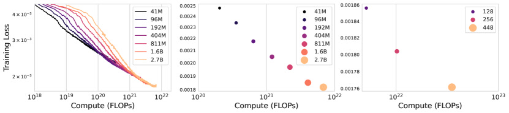
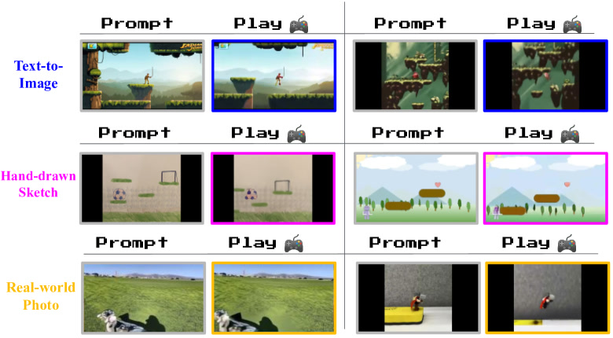
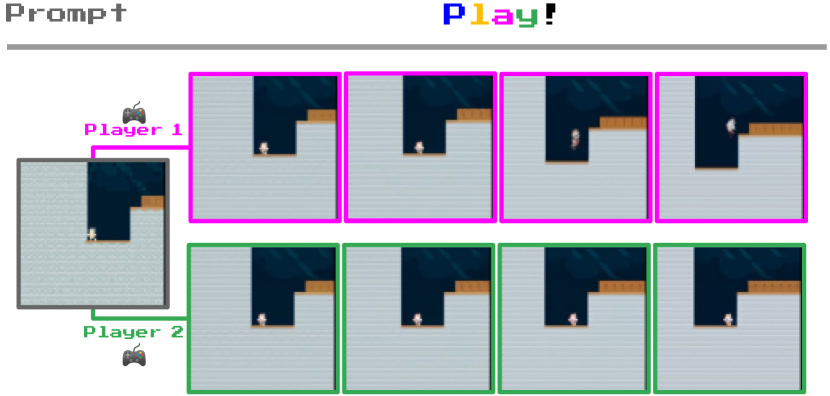

# Genie: Generative Interactive Environments

> 这是一份基于 ICML 2024 原文（arXiv:2402.15391）的精读笔记。语言尽量像聊天，公式全部翻译成人话。

## 一句话讲什么（TL;DR）

Genie 从海量无标注游戏录屏里，自己"猜"出每两帧之间按了什么键，再用这个猜出来的虚拟按键续画下一帧——把死视频变成单张图片就能开玩的互动世界。

*所以这一节是想说：Genie 是第一个只用视频、不用动作标签，就能帧级可控生成的"基础世界模型"。*

---

## 这是个什么场景

你小时候看哥哥打《超级马里奥》，但你看不到他的手柄，只能盯着电视屏幕。看了几百小时后，你脑子里其实悄悄学会了一件事：马里奥忽然向右动一下，那哥哥八成按了右键；马里奥腾空了，那肯定是跳键。你没看过按键，但从画面变化里反推出来了。

回到 AI 这边——网上有海量游戏录屏，但**没人给视频配按键标注**（"这一帧按了右键"这种数据极度稀缺）。

- **一般视频生成模型**（Sora、Stable Video Diffusion 等）：只学着续画下一帧，是个被动的"视频接龙"，你没法控制画面走向
- **传统世界模型**（Dreamer 系列）：能按动作预测下一帧，但必须在 RL 仿真环境里采集带 `(状态, 动作, 下一状态)` 标注的轨迹
- **Genie 反过来做**：它先**自己从相邻两帧的差异里反推"刚才大概按了哪个键"**，把这个反推出来的"虚拟按键"压成离散 token（叫**潜动作 latent action**）。学会以后，你给它一张静态图当开局，再随手按一个虚拟按键，它就能一帧一帧续画出可玩的画面

类比：像一个没碰过吉他但听了一万首歌的人，他能反推"这里大概是 G 和弦"，然后自己照着这个猜测弹出新曲子。

DeepMind 把这类系统叫做 **Generative Interactive Environments（生成式互动环境）**：不是生成一段固定视频让你看，而是生成一个你可以"走进去、按按钮、探索"的虚拟世界。

*所以这一节是想说：Genie 解决的是"互联网视频海量但无动作标签，怎样做出可交互世界"这个核心矛盾。*

---

## 之前的人怎么做的，为什么不够好

| 路线 | 代表工作 | 训练需要什么 | 缺什么 |
|------|----------|--------------|--------|
| 经典世界模型 | Dreamer / IRIS / TDM | 仿真环境里的 `(s, a, s')` 轨迹 | 动作标签贵，域外泛化弱 |
| 被动视频生成 | Phenaki / MaskViT / Sora | 只要视频（+ 可选文本） | 只能"看"，不能"玩" |
| 可玩视频生成 | Playable Video Generation (PVG) | 特定域的无标注视频 | 不能从单图 prompt 造全新世界，规模小 |
| 逆动力学 + 行为克隆 | VPT | 少量人工标注动作 + 海量视频 | 动作标签依赖人类，跨游戏泛化有限 |
| 带动作的世界模型 | GAIA-1 / UniSim | 视频 + 文本 + 真实动作 | 标注成本极高，难用互联网裸视频 |

具体痛点可以概括为三条：

- **动作标签是瓶颈**：YouTube 上有 20 万小时以上的游戏视频，但几乎没有任何一条配了"这一帧按了 A 键"的标注。VPT 的做法是请人类标一小部分，再用逆动力学模型去"贴标签"，但标注仍贵且可能不泛化。
- **视频模型缺"代理性"**：Sora 能生成很美的镜头，但控制粒度是"整段视频风格/主题"，不是"这一帧按左键角色向左走"。ChatGPT 能对话，视频模型还远没达到那种"你说一句它回一句"的交互密度。
- **小规模 PVG 无法 foundation 化**：Menapace 等人的 PVG 已经用潜动作控制特定游戏视频，但架构和规模限制在"已有游戏片段的可控编辑"，不能从一张草图凭空造出一个新世界。

Genie 的切入点：**动作信息已经编码在帧间变化里，只是没人去无监督地"捡"出来**——然后用信息瓶颈逼模型只保留"可玩的控制信号"，丢掉"作弊用的整帧拷贝"。

*所以这一节是想说：前人要么缺动作标签，要么缺帧级交互；Genie 用无监督潜动作把两条路接上了。*

---

## 这篇论文的新想法

核心洞察一句话：**按键数据贵得要死，但"按了什么键"已经写在画面变化里了，只是没人去捡。**

像侦探看监控录像——监控里没有罪犯的口供，但前后两帧画面的差异本身就在告诉你"他刚才往左跑了"。Genie 就是这个侦探。

它把整个事情拆成三个组件，分两阶段训：

```
┌─────────────┐     ┌──────────────┐     ┌─────────────────┐
│ Video       │     │ Latent Action│     │ Dynamics Model  │
│ Tokenizer   │────▶│ Model (LAM)  │────▶│ (MaskGIT ST-T)  │
│ (VQ-VAE)    │     │ 8 个离散动作  │     │ 预测下一帧 token │
└─────────────┘     └──────────────┘     └─────────────────┘
      阶段 1 单独训              阶段 2 与 Dynamics 联合训
```

**关键设计 1：信息瓶颈。** LAM 的码本只有 **8 个**离散潜动作（\|A\|=8）。8 个 token 装不下一整帧像素，LAM 只能挑"最关键的那点意图"塞进去（"角色向右"、"跳"这种高层信号），没法把下一帧整张抄进动作里作弊。

**关键设计 2：LAM 吃原始像素，不吃 token。** 消融实验表明，若 LAM 输入 tokenized 图像而非像素，可控性指标 ΔPSNR 显著下降——token 化会丢失运动细节。

**关键设计 3：推理时 LAM 拿掉。** 训练完后，用户（或 AI agent）直接选一个 0–7 的整数当"虚拟手柄"，Dynamics 模型据此续画。潜动作跨 prompt 语义一致——像学新游戏手柄，按几次就知道哪个键是"跳"。

**关键设计 4：ST-Transformer 全家桶。** 三个组件都用时空 Transformer（空间注意力看单帧 patch，时间注意力看跨帧因果链），计算复杂度对帧数线性而非二次，才能训 16 帧 × 10 FPS 的长上下文。

*所以这一节是想说：Genie 的创新不是某个单点 trick，而是"无监督潜动作 + 信息瓶颈 + 大规模 ST-Transformer 世界模型"的组合拳。*

---

## 它分几步做的（方法）

<!-- paper-figures:begin -->



*上图说明：Figure 1（ar5iv 原图）（论文原图）。*



*上图说明：Figure 2（ar5iv 原图）（论文原图）。*



*上图说明：Figure 3（ar5iv 原图）（论文原图）。*
<!-- paper-figures:end -->

整个方法可以拆成 **共享骨干 ST-Transformer**、**三组件**、**两阶段训练**、**推理闭环** 四块。下面按数据流从输入到输出讲清楚。

### 0. 共享骨干：ST-Transformer

**输入**：一段 T 帧视频，每帧被切成 H×W 个 patch token。

**处理**：堆 L 个时空块，每块里先**空间注意力**（同一时刻所有 patch 互看），再**时间注意力**（同一 patch 位置跨帧互看，带因果 mask——不能偷看未来），最后过一个 FFN。注意：每个 ST 块只在时空注意力之后放一个 FFN（省掉 post-spatial FFN），把算力留给更大模型。

**输出**：每个 patch 位置的上下文向量，供各组件做编码/解码。

**为什么重要**：普通 Transformer 对 T×H×W 个 token 做全局注意力，复杂度 O((THW)²)，视频稍长就爆显存。ST-Transformer 把主导项压到 O(T·(HW)²)，帧数 T 只线性增长——这是 Genie 能训 16 帧序列、再 scale 到 11B 的前提。

### 1. 视频 Tokenizer（Video Tokenizer）

**类比**：把每一帧电影胶片切成小方块，每个方块查一本 1024 页的"视觉字典"，用字典编号代替原始像素——压缩后 Transformer 才推得动。

**输入**：T 帧原始视频 x₁:T，分辨率训练时为 160×90，16 秒 clip、10 FPS 对应 160 帧，但模型序列长度用 **16 帧**窗口。

**处理**：
- 编码器：ST-Transformer + VQ-VAE，patch size = 4
- 码本：**1024** 个离散 code，embedding dim = 32
- 因果结构：第 t 帧的 token z_t 包含 x₁:t 的信息（不能看未来）
- 解码器：20 层、1024 维，比编码器（12 层、512 维）更大——论文发现**放大解码器**比放大编码器更划算

**输出**：每帧一个离散 token 序列 z₁:T ∈ ℤ^{T×D}，D 为每帧 token 数。

**训练目标**：标准 VQ-VAE 重建 loss，先**单独训 300k steps**，再冻结给 Dynamics 用。

**与 prior 的差异**：Hong / Wu 等只做空间压缩；Phenaki 的 C-ViViT 做时空压缩但复杂度二次。Genie 的 **ST-ViViT** 在 token 化阶段就引入 temporal dynamics，FVD 81.4 vs C-ViViT 272.7（同参数量级）。

### 2. 潜动作模型（Latent Action Model, LAM）

**类比**：监控员看 t 和 t+1 两帧监控，猜"嫌疑人刚才做了什么动作"——但猜的结果只能从一个 8 键小键盘里选，不能写小作文描述整帧。

**输入**：
- 所有历史帧 x₁:t **加上**下一帧 x_{t+1}（训练时）
- **必须是原始像素**，不是 tokenizer 输出（消融验证）

**处理**：
- 编码器：20 层 ST-Transformer，patch size = 16，d_model = 1024
- VQ 量化：码本 **\|A\| = 8** 个潜动作，latent dim = 32
- 因果 mask：一次前向可产出整段视频的 ã₁:T-1
- 训练用解码器：拿 x₁:t + ã₁:t 重建 x̂_{t+1}——**这个解码器推理时扔掉**，只为给 LAM 提供梯度

**输出**：帧间离散潜动作 ã_t ∈ {0,…,7}

**为什么 8 个够**：这是**信息瓶颈**。若码本有 1024 个动作，LAM 可以把下一帧的大部分像素信息塞进动作 token，Dynamics 变成摆设；8 个 forces LAM 只编码"对预测下一帧最关键、且人类/agent 可重复使用的控制因子"。

**与 Dynamics 的联合训练**：Dynamics 的 loss 反传到 LAM（动作 embedding 不做 stopgrad 到 LAM 侧），让潜动作对"世界怎么变"真正负责。

### 3. 动力学模型（Dynamics Model）

**类比**：你已经知道棋盘上前几步的棋谱（历史帧 token）和对手刚走了哪一步（潜动作），现在要猜下一步棋盘长什么样——但不是一次写完，而是"先全盖住、再按把握从高到低逐步填格子"（MaskGIT）。

**输入**：
- 历史帧 token z₁:t-1
- 对应潜动作 embedding ã₁:t-1（训练时对 ã 做 **stopgrad**，稳定 LAM）
- 训练时 z₂:T-1 还会被随机 mask（mask rate 从 Uniform[0.5, 1] 采样）

**处理**：
- Decoder-only ST-Transformer + **MaskGIT** 并行解码
- 潜动作不作为 concat，而是**加性 embedding**（additive embedding）——论文发现比传统 world model 的 concat 动作更可控
- 最终 Genie 动力学模型：**10.1B 参数**，48 层，36 heads，d_model = 5120

**输出**：下一帧 token 预测 ẑ_t

**训练目标**：ẑ₂:T 与 ground truth z₂:T 的交叉熵。

**推理采样**：每帧 **25 步** MaskGIT 迭代，temperature = 2，随机采样。

### 4. 两阶段训练流程

```
阶段 1：只训 Video Tokenizer（300k steps，AdamW，cosine lr）
         ↓ 冻结 tokenizer
阶段 2：联合训 LAM（300M）+ Dynamics（scale 到 10.1B）
         - LAM 从像素推断 ã
         - Dynamics 用 ã + z 预测下一帧
         - 主 loss 在 Dynamics；LAM 通过重建 decoder + Dynamics 梯度一起更新
```

**Platformers 主实验数据**：
- 原始：关键词过滤 YouTube → 55M 个 16s clip，约 **244k 小时**
- 质量过滤：10k 人工标注 + ResNet18 分类器 → **6.8M clip，30k+ 小时**（160×90，10 FPS）
- 论文摘要写 "200K+ hours" 指原始未精选池；**实际训练用 curated 30k hours**

**最终 Genie 规模**：
- Tokenizer 200M + LAM 300M + Dynamics 10.1B ≈ **10.7B（称 11B）**
- Batch 512，125k steps，256 TPUv5p，共 **942B tokens**
- Scaling 实验：Dynamics 从 40M 扫到 2.7B，loss 单调下降，验证架构可 scale

### 5. 推理：从单图到可玩环境

**输入**：用户提供的初始图像 x₁（可以是游戏截图、Imagen2 生成图、手绘草图、真实照片）

**逐步流程**：
1. x₁ → tokenizer encoder → z₁
2. 用户选 a₁ ∈ {0,…,7} → 查 VQ codebook 得 ã₁
3. Dynamics(z₁, ã₁) → ẑ₂ → tokenizer decoder → x̂₂
4. 重复 2–3，自回归生成轨迹

**两种玩法**：
- **回放模式**：用 LAM 从真实视频推断 ã，再喂给 Dynamics——检验重建 fidelity
- **创作模式**：用户随意选 ã 序列——检验 controllability 和 OOD prompt 泛化

### 6. 实现细节：为什么这些"小选择"很重要

**加性动作 embedding vs 拼接（concat）**：很多 prior world model（IRIS、Transformer World Model 等）把动作向量拼在状态向量后面。Genie 实验发现，把潜动作做成与帧 token **同维度的 embedding 再相加**，生成的画面更听"按键"的话——ΔPSNR 上体现为更好的 controllability。人话翻译：concat 像把"操作说明书"贴在画面旁边，模型有时忽略；additive 像把"操作意图"直接注入每个 patch 的语义里。

**Dynamics 侧 stopgrad 动作**：训练 Dynamics 时，来自 LAM 的 ã 梯度被截断，LAM 只通过自重建 decoder 和（若启用）其他路径更新。这样可以避免 Dynamics 和 LAM 互相"共谋"——Dynamics 不会把 LAM 拉成只服务自己的私有编码；LAM 仍必须产出对人类/agent 有意义的离散控制。

**随机 mask 训练 Dynamics**：训练时对 z₂:T-1 以 0.5–1 的随机比例 mask，强迫模型在"缺图"条件下仍根据动作猜下一帧——这和 BERT/MaskGIT 一脉，是并行解码能 work 的关键；推理时则从全 mask 起步，25 轮逐步 unveil。

**QK norm + bfloat16**：10B 级 Dynamics 训练用 QK normalization 和 bfloat16 混合精度，防止 attention logits 爆炸——这是大模型训练工程上的稳定器，不是花活；没有它，125k steps 的 long run 很难收敛。

**数据过滤 pipeline 也是方法的一部分**：55M 原始 clip 里混了大量菜单、主播摄像头、非 gameplay 片段。团队人工标 10k 条（约 10 人时）训练 ResNet18 二分类，再按置信度过滤——最终 6.8M 高质量 clip 训出的 580M 模型 FVD 54.8，优于 55M 全量训的 61.4。说明 Genie 的"方法"不只在神经网络框图里，也在**如何把互联网垃圾过滤成可学的物理片段**。

**Robotics 分支验证架构通用性**：同一套三组件 hyperparam  largely 照搬到 RT-1 视频（仿真 + 20 万 episodes 级真实机器人演示），训 2.5B 模型得 FVD 82.7，且学到下/上/左/形变物体等语义动作——证明 Platformers 不是 overfit 某个视觉风格，而是 LAM+Dynamics 范式可迁移到其他"帧间变化≈控制"的域。

*所以这一节是想说：Genie = ST-ViViT 压缩世界 + 8 码本 LAM 无监督发现动作 + MaskGIT Dynamics 帧级续写；推理时 LAM 退场，用户直接"按键玩模型"。细节（additive embedding、stopgrad、数据过滤）和主架构同等重要。*

---

## 关键数字（What works）

### 表 1：Genie 核心规模与配置

| 项目 | 数值 | 含义 |
|------|------|------|
| 总参数量 | **11B**（10.7B：200M + 300M + 10.1B） | 首个 ICML 级"基础世界模型" |
| 训练视频（精选） | **6.8M clips / 30k+ hours** | 2D 平台游戏 YouTube 过滤 |
| 原始视频池 | **55M clips / ~244k hours** | 摘要中"200K+ hours"来源 |
| 潜动作码本 | **\|A\| = 8** | 信息瓶颈，人类可"学手柄" |
| 视频 token 码本 | **1024 codes** | 每帧离散表示 |
| 序列长度 / FPS | **16 frames @ 10 FPS** | 训练窗口 |
| 训练分辨率 | **160×90** | Platformers 主设置 |
| 训练 tokens | **942B** | 最终 Dynamics 训练量 |
| 算力 | **256 TPUv5p**，125k steps | 工业级规模 |
| 推理速度 | **~1 FPS** | 25 MaskGIT steps/帧 |
| MaskGIT 推理 | **25 steps，temperature 2** | 每帧并行解码 |

### 表 2：Scaling 与消融（Dynamics / Tokenizer）

| 实验 | 配置 | FVD ↓ | Δ₄PSNR ↑ | 说明 |
|------|------|-------|----------|------|
| Dynamics scaling | 40M → 2.7B | loss 单调降 | — | 架构可扩展 |
| Batch scaling | 2.3B, batch 128→448 | loss 降 | — | 大 batch 有效 |
| Tokenizer ViT（空间 only） | 230M | 114.5 | 1.39 | 基线 |
| Tokenizer C-ViViT | 225M, 1.6GB | 272.7 | 1.37 | 过拟合严重 |
| **Tokenizer ST-ViViT** | 205M, 0.9GB | **81.4** | **1.66** | 论文选用 |
| LAM pixel-input | Platformers 2.5B | 40.1 | **1.91** | 默认 |
| LAM token-input | Platformers 2.3B | 38.8 | 1.33 | FVD 略好但可控性更差 |
| 数据精选 | 55M→6.8M videos, 580M model | 61.4→**54.8** | — | 质量 > 数量 |

### 表 3：跨域与下游

| 设置 | 结果 | 说明 |
|------|------|------|
| Robotics 模型 | **2.5B**，FVD **82.7** | RT-1 等机器人视频，无动作标签 |
| CoinRun BC（hard） | **200** 条专家样本 ≈ Oracle | 潜动作迁移到未见 RL 环境 |
| 数据集 curation | 10k 人工标注 → ResNet18 过滤 | ~10 人时 |

*所以这一节是想说：数字支撑三条结论——scale 有效、ST-ViViT + pixel-LAM 关键、数据质量比裸规模更重要。*

---

## 实验结果说明了什么

### 1. 可玩性：OOD prompt 上的零样本互动

Platformers 模型**只在训练集游戏视频上训练**，但推理时用完全 OOD 的 prompt：Imagen2 文生图、儿童手绘、真实风景照。论文展示：对同一潜动作连按 4 次，角色有明显方向性移动（跳、左、右、noop）。说明模型学到的是**跨视觉风格的平台物理**，不是死记某几个游戏纹理。

 emergent 能力还包括：
- **视差（parallax）**：前景动得多、背景动得少——典型 2D 平台侧-scroll 规律
- **可 deformable 物体**：机器人数据集上学到的袋子/芯片形变

### 2. 潜动作一致性与语义

Appendix 图 16：Platformers 四张不同起始帧，同一潜动作连按 5 次，列方向行为一致——左、右、跳、空操作。Robotics 图 12：下、上、左语义稳定。这验证 \|A\|=8 的瓶颈没有牺牲"可重复的控制语义"。

### 3. Scaling 规律

40M→2.7B Dynamics 训练 loss 平滑下降；2.3B 模型增大 batch（1.9M→6.6M tokens/step）同样收益。符合 foundation model 叙事：**算力+数据+参数** 三轴同时推。

### 4. 下游：潜动作 → 真实 RL 策略

CoinRun（Procgen）上：
- 用**冻结的 Internet 视频 LAM** 给专家视频打潜动作标签
- 训 π(a_t \| x_t) 模仿潜动作
- 仅用 **200 条**带真实动作的专家片段做 latent→real 映射
- 结果：**LAM-BC 达到与 Oracle BC（全程有真实动作标签）相同的通关率**

含义：Internet 上学到的 8 维潜动作空间带有**可迁移的 motor prior**，不是游戏专用噪声。

### 5. 局限性的实验暗示

- FVD 是视频级指标，不完全等于"可玩性"或物理正确性
- 16 帧上下文 → 长 horizon 一致性差（论文 Discussion 自述）
- ~1 FPS → 离实时游戏远
- CoinRun 仍是 2D 平台域，和真实 3D 机器人差距大

*所以这一节是想说：实验核心论证了"无监督潜动作 + 大规模训练 = 可 prompt 的互动世界 + 可迁移的控制基元"，而非单纯 FVD 刷榜。*

---

## 你应该懂的几个新词

> **潜动作（Latent Action）**：模型自己发明的离散"虚拟按键"（0–7），不是真实手柄码。功能上类似动作，但从帧间差分无监督学出。

> **生成式互动环境（Generative Interactive Environment）**：Genie 提出的新类别——训练只要视频，推理时帧级可控，用户/agent 能"玩"生成世界。

> **VQ-VAE（Vector Quantized VAE）**：把连续向量**四舍五入**到有限码本里的离散 token。类比：把无限多的颜色压成 256 色色卡。

> **信息瓶颈（Information Bottleneck）**：故意限制中间表示容量（8 个动作码），逼模型只保留控制相关因子，丢弃冗余像素信息。

> **ST-Transformer（Spatiotemporal Transformer）**：空间层看单帧内 patch 关系，时间层看跨帧同一 patch 的因果演化。Genie 三组件共用此骨架。

> **MaskGIT**：Masked Generative Image Transformer。生成时先全 mask，再多轮按置信度填 token——比逐 token 自回归快，Genie 每帧 25 步。

> **FVD（Fréchet Video Distance）**：衡量生成视频与真实视频分布距离的指标，越低越好。Genie 用来评 fidelity。

> **ΔₜPSNR（Controllability 指标）**：PSNR(真帧, 用推断动作生成) − PSNR(真帧, 用随机动作生成)。差越大，说明潜动作越"控得住"画面。

> **Foundation World Model**：像 LLM 之于语言——大规模预训练、可 prompt、可迁移到下游的世界模型。Genie 自称首个此类实例。

*所以这一节是想说：掌握这 9 个词，读 Genie 2、UniSim、Cosmos 等后续工作不会迷路。*

---

## 它有什么搞不定的

论文 Discussion 和实验边界写得很诚实，至少五条硬局限：

1. **帧率与延迟**：推理约 **1 FPS**（每帧 25 次 MaskGIT），远达不到人类玩游戏所需的 30–60 FPS。交互更像"翻幻灯片"而非实时操控。
2. **记忆长度仅 16 帧**：约 1.6 秒历史。长关卡、慢节奏解谜、需要 backtracking 的场景里，环境状态容易"漂移"或自相矛盾。
3. **幻觉与物理不一致**：继承自回归 Transformer 的通病——物体凭空出现/消失、穿模、重力偶发失效。不如 Unity 等手工引擎可靠。
4. **动作语义仅 8 维**：对复杂游戏（多按钮组合、射击、背包）表达力不够；码本增大又损害 human playability（Appendix C 承认 trade-off）。
5. **域限制**：主结果在 **2D 平台**；机器人实验是概念验证（FVD 82.7，非实时控制）。3D 第一人称、精确 manipulation 需 Genie 2 等后续工作。
6. **无可复现权重**：论文明确**不发布** checkpoint 与训练数据，社区只能跑 Appendix F 的小规模 TPU/GPU demo。

*所以这一节是想说：Genie 是方向性突破，不是可部署的游戏引擎——读它是为了学范式，不是为了今天就能商用。*

---

## 它和别的几篇是什么关系

| 对比对象 | 关系 | 一句话差异 |
|----------|------|------------|
| **Dreamer V3** | 同族不同路 | Dreamer 要环境动作标签、服务 RL；Genie 无标签、服务生成+迁移 |
| **Ha & Schmidhuber World Models** | 精神前驱 | Ha 在 CarRacing 用小 RSSM "做梦"；Genie 用 11B ST-Transformer "做梦"整个平台宇宙 |
| **Phenaki / MaskViT / TECO** | 视频生成堂兄弟 | 同用 token + MaskGIT，但缺 latent action 接口，不能帧级玩 |
| **Playable Video Generation** | 直接前作 | PVG 域内可控；Genie 去掉域偏置、加 prompt 造新世界、scale 1000× |
| **VPT** | 竞争路线 | VPT 用人类标动作 + 逆动力学；Genie 完全无 GT action，用 8 码本瓶颈 |
| **GAIA-1 / UniSim** | 同期世界模型 | 它们要文本+动作；Genie 只要视频，更 radical 的数据假设 |
| **Genie 2（2024 末）** | 直接后继 | 3D、更长 horizon、更高 fps——同路线 scale up |
| **Cosmos / 1X World Model** | 并行演进 | 把"视频预训练世界知识"推向机器人/自动驾驶产品化 |

时间线位置：**Dreamer 解决"怎么学 WM" → Genie 解决"能不能只用互联网视频学 WM" → Genie 2 / Cosmos 解决"能不能变成通用模拟器"**。

*所以这一节是想说：Genie 在 world model 族谱里是"无监督 + 生成式 + 基础模型化"的分叉点。*

---

## 和本导读的关系

本笔记对应具身 AI 导读 **[Ch15: 世界模型——World Models / Dreamer / Genie / Cosmos Policy](../guide/ch15-world-models.md)** 第五节「Genie (2024)：从无标签视频中诞生的互动世界」。

导读里的学习路径建议：

- **先读 Ch15 §2–§4**（世界模型定义 → Ha → Dreamer 三部曲），建立"动作条件化下一帧预测"baseline，再读 Genie 才能体会"去掉动作标签"有多 radical。
- **Genie 在导读 §5** 被定位为第三条演化支线的里程碑：**Video Pretraining → Foundation World Model**，与 Dreamer 的"精巧 RSSM"路线并行。
- 导读 §7 的思考题第 7 题直接考 Genie：**"信息瓶颈为什么能逼出动作？"**——与本笔记 Method §2 呼应。
- 后续 **§6 Cosmos Policy** 被刻画为 Genie 路线的工业级延伸；读 Genie 原文有助于理解 Cosmos "从视频学物理直觉"的动机。

若你按导读「Ha → Dreamer → Genie → Cosmos」顺序精读，Genie 是**从"任务内 world model"跳到"互联网级 foundation world model"**的桥。

*所以这一节是想说：把本笔记当作 Ch15 第五节的技术加深版，而不是孤立一篇论文。*

---

## 思考题

**Q1：为什么 LAM 的码本只有 8 个条目，而不是 1024 个（像 video tokenizer 那样）？若把 \|A\| 改成 256，训练 loss 可能更低，但 Genie 认为这反而是坏事——为什么？**

<details>
<summary>提示</summary>

从"信息瓶颈"和"decoder 能否作弊"两个角度想：Dynamics 只能看到历史 + 动作，若动作能装下整帧像素，LAM 还会学"控制语义"吗？Appendix C 也提到 action 数 vs playability 的 trade-off。
</details>

**Q2：LAM 输入 pixel 而 Dynamics 输入 token——同一条 pipeline 里为何故意用两种表示？表 2 的 ablation 说明了什么机制？**

<details>
<summary>提示</summary>

Tokenizer 丢的是什么信息？运动细节、亚像素位移、动态模糊……若 LAM 也吃 token，ΔPSNR 下降说明 controllability 受损，即使 FVD 略好。
</details>

**Q3：训练时对 Dynamics 的 latent action 做 stopgrad，但对 LAM 仍通过重建 decoder 更新——这套梯度"断路"设计各起什么作用？**

<details>
<summary>提示</summary>

想"两个学生互相批改作业"：若 Dynamics 梯度直接拉扯 LAM embedding，会不会 collapse 成 Dynamics 的私有码？stopgrad 稳定训练，重建 decoder 保证 LAM 仍学到帧间因果。
</details>

**Q4：Genie 用 MaskGIT 而非逐 token 自回归解码下一帧——这对"可玩"（交互延迟）和"视频质量"分别有什么 trade-off？**

<details>
<summary>提示</summary>

25 步并行 refinery vs AR 的 O(序列长) 串行；temperature=2 带来随机性。为何 1 FPS 仍是瓶颈？还能从哪优化？
</details>

**Q5：CoinRun 实验里，LAM-BC 只需 200 条真实动作样本就能匹配 Oracle——这能否证明"Internet 潜动作 = 真实动作空间的 good basis"？还需要什么反证实验？**

<details>
<summary>提示</summary>

映射字典 D 不含观测信息；若 200 样本换随机映射会怎样？换 3D 游戏或连续控制任务还成立吗？Oracle 上限在哪？
</details>

**Q6：数据从 55M 滤到 6.8M 视频 FVD 反而更好——这和 VPT、DINOv2 等"数据质量>数量"的结论有何共通逻辑？若你是作者，会如何设计过滤 pipeline 的 failure case 检测？**

<details>
<summary>提示</summary>

菜单界面、主播脸、非 gameplay 片段如何污染 dynamics？10k 人工标 + ResNet18 二分类的局限？主动学习/自训练风险？
</details>

**Q7：Genie 称自己是 foundation world model——对照 NLP 里 GPT 的"foundation"标准（scale、prompt、few-shot transfer），Genie 满足了哪些、还缺哪些？**

<details>
<summary>提示</summary>

11B scale ✓；单图 prompt ✓；CoinRun few-shot ✓；缺公开权重、缺统一 action 语义命名、缺 multi-task agent 端到端 SOTA……
</details>

**Q8：若把 Genie 当作 RL 环境替代 Procgen，reward 从哪来？生成分布漂移（hallucination）会对 policy 训练造成什么 bias？**

<details>
<summary>提示</summary>

Model-based RL 里的 compounding error；Genie 1 FPS 对 sample efficiency；能否用真实环境 fine-tune Dynamics 校正？
</details>

---

## 一些好奇心问答（FAQ）

**Q1：11B 参数具体怎么分配？**

200M Video Tokenizer + 300M LAM + 10.1B Dynamics ≈ 10.7B；网站 demo 另训更大 decoder 输出 360p，参数量再涨一点，论文统称 11B Genie model。

**Q2：8 个潜动作分别对应 jump/left/right 吗？**

论文**不保证**固定语义。作者原话：像学新手柄，多试几次就摸出门道；跨 prompt 同一整数动作效果一致，但是否对应"跳"取决于你的解读，不是硬编码标签。

**Q3：200K hours 和 30K hours 矛盾吗？**

不矛盾。关键词过滤后原始池 ~244k hours（55M clips）；经质量分类器精选后**实际训练**用 6.8M clips / 30k+ hours。摘要"200K+ hours"指互联网规模语境。

**Q4：我能自己复现吗？**

完整 11B 不现实（256 TPUv5p）。Appendix F 给了**单卡 TPU/GPU** 可跑的 CoinRun 小例子：缩小 tokenizer/LAM/Dynamics，3 天单 TPU 训 tokenizer。权重和数据均不公开。

**Q5：Genie 和 Sora 谁更"先进"？**

不可比。Sora 追视频 fidelity 与长镜头一致性；Genie 追**帧级交互**与无动作学习。一个是 cinema，一个是 arcade prototype。

**Q6：为什么 additive action embedding 比 concat 更好？**

论文只报告 empirical 结果：concat 是 prior world model 常见做法（IRIS 等），Genie 发现加法 embedding 提升 controllability。机制上可能减少 action 与 visual token 的维度纠缠，但无 formal proof。

**Q7：Robotics 实验和 Platformers 共用架构吗？**

是。同一套三组件 + ST-ViViT，Hyperparam  largely 共享；Robot 数据混合 RT-1 仿真+真实 ~130k demo + 旧数据 209k episodes，**仍不用任何动作标签**。

---

## 如果你想再深入

1. **前传：Playable Video Generation (Menapace et al., 2021–22)** — 理解 Genie 从域内 PVG 到 open-domain 的架构跳跃。
2. **视频 token 线：Phenaki (C-ViViT) / MaskViT / TECO** — 对比 ST-ViViT 的线性时间时空编码设计。
3. **动作标签线：VPT (Baker et al., 2022)** — 逆动力学 + 人类标注的规模化 BC，与 Genie 无标签路线对照。
4. **后继：Genie 2 blog / tech report** — 3D 可探索世界，验证路线未被 1 FPS/2D 限制堵死。
5. **下游 agent：本论文 Appendix E + Edwards et al. 2019 imitation from observation** — 潜动作→策略的完整 pipeline。
6. **导读延伸：[Ch15 §6 Cosmos Policy](../guide/ch15-world-models.md)** — 同一条"视频预训练→机器人策略"支线的工业级放大版。
7. **MaskGIT 原论文 (Chang et al., 2022)** — 理解 25-step 并行解码的实现细节与 temperature 含义。

*所以这一节是想说：Genie 是枢纽论文，向前看 PVG/VPT，向后看 Genie 2/Cosmos，横向看 Dreamer 与 video diffusion。*

---

## 原文信息

**标题**：Genie: Generative Interactive Environments

**作者**：Jake Bruce, Michael Dennis, Ashley Edwards, Jack Parker-Holder, et al. (Google DeepMind)

**发表**：ICML 2024

**链接**：
- arXiv: https://arxiv.org/abs/2402.15391
- Project page: https://deepmind.google/discover/blog/genie-a-generative-interactive-environment/

**BibTeX**：

```bibtex
@inproceedings{bruce2024genie,
  title={Genie: Generative Interactive Environments},
  author={Bruce, Jake and Dennis, Michael and Edwards, Ashley and Parker-Holder, Jack and others},
  booktitle={International Conference on Machine Learning (ICML)},
  year={2024},
  eprint={2402.15391},
  archivePrefix={arXiv},
  primaryClass={cs.LG}
}
```

---

## 架构一图（ASCII）

```
  用户/Agent                         训练阶段（视频片段 x_{1:T}）
      │                                      │
      ▼                                      ▼
  初始图 x₁ ──▶ [Tokenizer Enc] ──▶ z₁     [Tokenizer Enc/Dec] ──▶ z_{1:T}
      │              │                       │
      │         潜动作 a_t ∈ {0..7}          ▼
      │              │                  [LAM on pixels]
      │              ▼                       │
      └──────▶ [Dynamics + MaskGIT] ──▶ ẑ_{t+1} ──▶ x̂_{t+1}
                     │              ▲            （重建 loss + CE loss）
                     ▼              │
               [Tokenizer Dec]   ã_{1:T-1}
                     │
                     ▼
                 下一帧 x̂_{t+1}  （~1 FPS，25 steps/frame）
```

*所以最后一节是想说：Genie 把"看视频"变成了"造世界 + 无监督学手柄 + 帧级玩起来"——这是 foundation world model 路线的起点，而不是终点。*
