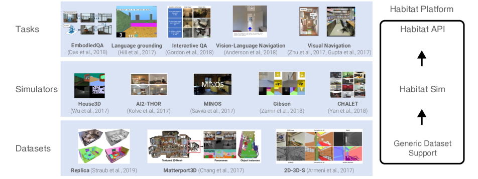
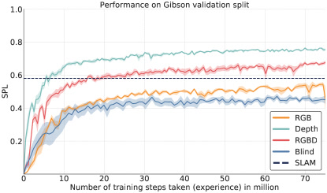
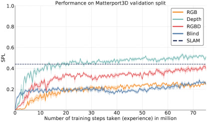

# Habitat: A Platform for Embodied AI Research

> 这是一份给"完全没接触过 AI"的读者看的精读笔记。语言尽量像聊天，公式全部翻译成人话。

## 一句话讲什么（TL;DR）

给家用机器人造一个跑得飞快的"VR 房子"，让它在里面绕路撞墙练几千万步，再上岗去你家。

*所以这一节是想说：这篇论文做出了一个跑得飞快的 3D 室内仿真平台，让具身 AI 终于能"大规模训练"。*

---

## 这是个什么场景

下班回家，你瘫在沙发上跟家里那台扫地机器人说："去厨房看看我那杯咖啡是不是还在桌上，在的话端过来。" 这一句话听着简单，机器人却得同时干好几件事——**听懂你说的话** + **认出咖啡杯和桌子** + **在客厅厨房之间找路、绕开椅子腿**。

问题来了：这种机器人怎么训练出来？最直观的想法是——买 1000 台真机器人放进 1000 个真房子里练。但你想想：

- 真实世界**只能 1 倍速**：现实一天就是 24 小时，没法按快进键。
- 真实房子**不可并行**：你不能让 8 台机器人在同一个客厅里各自试错，会撞作一团。
- 真实世界**容易出事**：练失败的机器人可能把花瓶撞下桌、把猫吓飞。
- 真实世界**贵到爆**：1000 台机器人 + 1000 间样板间，预算直接劝退。
- 真实世界**没法重来**：上一次撞翻咖啡的那个光线、那只猫的位置，永远复刻不出来。

那怎么办？做一套"机器人版的赛车游戏"——把真实房子用 3D 扫描器扫进电脑，让一个虚拟的机器人在屏幕里的房子里转悠、撞墙、找路。撞坏了重启就行，速度还能开 1000 倍快进。**这就是 Habitat 要造的东西**：一个专门给"室内机器人"练功的虚拟房子。

*所以这一节是想说：Habitat 要造的是"室内机器人"的 VR 训练场，让它在虚拟房子里学走路、学认物。*

---

## 之前的人怎么做的，为什么不够好

具身 AI 圈在 2017-2018 年其实已经有一堆仿真器（House3D、AI2-THOR、MINOS、Gibson、CHALET），各做各的。问题是：

- **跑得太慢**：大多数只能跑 10-100 帧每秒。意思是 AI 训练 1 个月，相当于在虚拟世界里只走了几百万步。**实验跑不完**，没法判断"模型到底学没学到位"。
- **任务、模拟器、数据集焊死在一起**：比如 Gibson 仿真器只能用 Gibson 自己的房子数据，AI2-THOR 只能跑它内置任务。**换个房子或换个任务就要重写一切**。
- **机器人参数写死了**：智能体大小、能转多少度、能走多远，都写在源码里。**想做对照实验比如"机器人换大一点会怎样"，得改源码**。
- **结果没法跨平台对比**：A 论文用 House3D，B 论文用 MINOS，**两边数字根本不能放一起比**。
- **不能随便摆家具**：想测试机器人遇到障碍物会怎么办，没法用代码动态摆个椅子上去。

论文引用的 Mishkin et al. [20] 和 Kojima & Deng [16] 两篇工作比较了学习方法和经典 SLAM，但都只跑了 5-10M 步就下结论——因为仿真器太慢，多跑不起。这导致社区形成了"SLAM 比学习强"的共识，而这个共识后来被证明是错的。

总结一句话：每个仿真器都是个"封闭花园"，社区没法形成合力。Habitat 的目标就是当那个**通用的、跑得超快的、能让所有人接进来的底座**。

*所以这一节是想说：以前的仿真器又慢又封闭，研究做不大也做不公平，Habitat 要把整个软件栈打通。*

---

## 这篇论文的新想法

**把仿真器底层写成 C++ + 极致优化的渲染管线，让单线程飙到几千 FPS、多进程飙到 10000 FPS；再上面套一层灵活的 Python API，把数据集、任务、智能体都解耦。**

这个想法可以拆成三句话理解：

1. **速度即科学**：跑得快不是炫技——速度直接决定了"能不能让 AI 训练 7500 万步"这种过去做不了的实验。当你把训练时间从"几个月"压缩到"两天"，以前不敢做的对照实验（跨数据集、跨传感器、跨方法族）全都变得可行。
2. **解耦即生态**：把数据集、仿真器、任务三层拆开，谁都能插自己的模块进来。不再是"用了 A 的仿真器就被绑死在 A 的数据和任务上"。
3. **基础设施即科学贡献**：论文明确把"做一个又快又通用的平台"本身当作贡献——它改变了结论。这在 AI 领域不常见：大多数论文的贡献是模型或算法，而 Habitat 的贡献是"让做实验变得可能"。

*所以这一节是想说：核心创新是"把仿真器做到比训练 AI 还快"，从此瓶颈不再是仿真，而是模型本身。*

---

## 它分几步做的（方法）

<!-- paper-figures:begin -->



*上图说明：Figure 1（ar5iv 原图）（论文原图）。*



*上图说明：Figure 2（ar5iv 原图）（论文原图）。*



*上图说明：Figure 3（ar5iv 原图）（论文原图）。*
<!-- paper-figures:end -->

把整篇论文想成"装修一套出租屋"：先把毛坯房的水电（**渲染引擎**）做到极致快；再把家具（**数据集**）做成宜家那种自由组装；再把电器接口（**任务 API**）做成统一插座；然后定义一个公平的比赛项目（**PointGoal 导航**）；最后请几个朋友（智能体）来实测——结果发现以前的"经验之谈"全都被推翻了。

具体就是 5 件事：底层渲染引擎、数据集解耦、任务 API、PointGoal 实验设计、用这套东西做一组以前没法做的大规模实验。

下图是 Habitat 解耦的三层软件栈（数据集 / 仿真器 / 任务 各自可替换）：

```
┌───────────────────────────────────────────────────────────┐
│  Habitat-API (Python, 任务层)  ── 换任务只改 yaml 一行      │
│  ┌─────────┐ ┌─────────┐ ┌─────────┐ ┌─────────┐          │
│  │ Task    │ │ Agent   │ │ Sensor  │ │ Episode │  可替换   │
│  │PointNav │ │圆柱1.5m │ │RGB/D/GPS│ │起点+目标│          │
│  │/EQA/VLN │ │4离散动作│ │/Compass │ │+最短路  │          │
│  └─────────┘ └─────────┘ └─────────┘ └─────────┘          │
│  扩展: RL(PPO) / SLAM / Imitation baselines                │
└───────────────────────────┬───────────────────────────────┘
        观测 obs ▲           │ 动作 action ▼
┌───────────────┴───────────────────────────────────────────┐
│  Habitat-Sim (C++/Magnum/OpenGL, 渲染+仿真层)              │
│  Simulator → SceneGraph(树: 房间→家具→零件)               │
│  ResourceManager(缓存复用 Mesh/Texture/Shader)            │
│  一次渲染同出 RGB+Depth+语义 (uber-shader) · 显存直通      │
└───────────────────────────┬───────────────────────────────┘
        统一场景图格式 ▲      │ 加载 3D 资产
┌───────────────┴───────────────────────────────────────────┐
│  数据集层 (USB 式插拔)                                      │
│  Matterport3D(90套) · Gibson(筛106套) · Replica(18套高精)  │
└───────────────────────────────────────────────────────────┘
```

*上图说明：三层解耦——数据集像 USB 插拔、仿真器统一成场景图、任务零件可替换，让"换房子/换传感器/换任务"从重写代码变成改一行配置。*

### 1. Habitat-Sim：把渲染速度榨到极致

**类比**

老式仿真器像家用打印机——一张一张慢慢出图，要给彩色 / 深度 / 语义各打一遍。Habitat-Sim 像复印店的工业打印机——**一次走纸三色同出**，机器只过一遍。

**架构总览**

Habitat-Sim 的内部结构可以拆成四个核心模块，论文的 Figure 6 画了完整的类图：

- **ResourceManager**：管理所有 3D 资源（网格几何体、纹理贴图、着色器程序）。关键是**缓存复用**——同一个椅子模型在 100 个房间里只占一份内存。ResourceManager 下面挂着 Texture、Material、Shader、Mesh 四类资源对象。
- **Simulator**：整个仿真的入口。它管理一个 SceneManager，SceneManager 管理 SceneGraph（场景图），SceneGraph 由若干 SceneNode 组成。每个 SceneNode 代表环境中的一个物体或区域。
- **Agent**：物理上具身的智能体，挂在 SceneGraph 的某个 SceneNode 上。Agent 可以有多个 Sensor。
- **Sensor**：附着在 Agent 上，每帧从环境中采集观测数据（RGB 图、深度图、语义掩码等）。

这四个模块的数据流是：ResourceManager 加载 3D 资产 → SceneGraph 组织成树状结构 → Agent 和 Sensor 挂到树上 → Simulator 每步更新 Agent 位置并通过 Sensor 返回观测。

**渲染管线的三个关键优化**

优化 1：**C++ 后端 + Magnum 图形库**。不用 Python 做渲染，直接用 C++ 调用 Magnum（一个轻量级跨平台图形中间件）走 OpenGL。Python 只是上层 API 的壳。这一步就把基础速度拉高了一个数量级。

优化 2：**多附件渲染（multi-attachment uber-shader）**。传统做法是渲彩色图跑一遍 GPU、渲深度图再跑一遍、渲语义分割再跑一遍——三遍 GPU 开销。Habitat-Sim 把三种输出合并到一个 uber-shader 里，**一次渲染同时产出 RGB、深度、语义三张图**。原理是 OpenGL 的 multi-attachment framebuffer：一个 framebuffer 可以挂多个颜色附件，每个附件输出不同信息，但只需一次几何处理。这不只是"省 2/3 时间"——因为 GPU 渲染的大头开销在几何处理和光栅化，多附件只增加了极少的像素着色开销。

优化 3：**GPU 显存直通（OpenGL-CUDA 互操作）**。渲染完的图像通常要走 GPU → CPU → GPU 的拷贝链路才能给 PyTorch 用。Habitat-Sim 通过 OpenGL-CUDA interop 让渲染结果直接留在 GPU 显存里，跳过 CPU 中转。论文的 Table 3 和 Figure 7 展示了三种内存传输策略的对比：

| 传输策略 | 1 进程 RGB FPS | 5 进程 RGB FPS | 特点 |
|---|---|---|---|
| GPU→CPU→GPU | 2,346 | 7,784 | 传统路径，有两次拷贝开销 |
| GPU→CPU | 3,919 | 11,598 | 只拷贝到 CPU（适合非 GPU 训练） |
| GPU→GPU（CUDA interop） | 4,538 | 7,279* | 零拷贝，分辨率增大几乎不降速 |

(*注：5 进程 GPU→GPU 数字低于 GPU→CPU 是因为多进程竞争 GPU 资源，但 Figure 7 显示 GPU→GPU 在高分辨率下优势巨大——分辨率从 128 增到 512 时，GPU→CPU→GPU 速度暴跌，GPU→GPU 几乎不变。)

**场景图（Scene Graph）的设计**

场景图是一棵树：根节点是整个房间，子节点是家具，孙节点是家具上的细节（比如椅子上的靠垫）。这个数据结构有三个好处：

1. **统一不同数据集**：不管底层是 Matterport3D 的激光扫描还是 Replica 的高精度合成，都翻译成同一种场景图格式。
2. **程序化操控**：想在房间里加一把椅子？往场景图上挂一个新 SceneNode 就行。想移动桌子？改父节点的变换矩阵，所有子节点跟着动。
3. **资源共享**：同一种椅子模型只加载一次，场景图的多个节点可以引用同一份网格数据。

**速度到底有多快**

论文在 Matterport3D 的一个测试场景（id: 17DRP5sb8fy）上用 Intel Xeon E5-2690 v4 CPU + Nvidia Titan Xp GPU 跑出的数据：

| 配置 | 128×128 FPS | 256×256 FPS | 512×512 FPS |
|---|---|---|---|
| 1 进程 RGB | 4,093 | 1,987 | 848 |
| 1 进程 RGB+Depth | 2,050 | 1,042 | 423 |
| 5 进程 RGB | 10,592 | 3,574 | 2,629 |
| 5 进程 RGB+Depth | 5,223 | 1,774 | 1,348 |

对比同期仿真器：AI2-THOR / CHALET 几十 FPS，MINOS / Gibson 约 100 FPS，House3D 约 300 FPS。Habitat-Sim 比最快的 House3D 快约 **30 倍**，比 MINOS / Gibson 快约 **100 倍**，比 AI2-THOR / CHALET 快约 **1000 倍**。

速度高到一种程度：**比从硬盘读图片还快**。论文原文说"it is often faster to generate images using Habitat-Sim than to load images from disk"。这意味着不用预存数据集，每次训练都能现渲染，体验还更新鲜——消除了数据增强的需求。

**为什么渲染速度是"科学贡献"而不只是"工程优化"**

论文的核心论点是：仿真速度变一个数量级，科学结论就会被改写。以前的仿真器一秒跑 100 帧，训练 5M 步就要好几天；Habitat 一秒跑 10000 帧，训练 75M 步只需两天。在 5M 步处 SLAM 赢学习派，在 75M 步处学习派反超 SLAM——**如果你的仿真器只能跑到 5M 步，你会得到错误的科学结论**。

*所以这一节是想说：底层用 C++ + 一次渲多图 + 显存直通，把速度提到比读硬盘还快，训练再也不卡仿真。渲染管线的每一步优化都直接影响了后面实验的可行性。*

---

### 2. 通用数据集 API：换房子像换墙纸

**类比**

旧仿真器就像 Wii 的专属游戏卡——AI2-THOR 卡只能塞 AI2-THOR 主机。Habitat 像 USB——**Matterport3D / Gibson / Replica 三种数据集插上就能用**，写代码时不用 care 自己用的是哪一种。

**三个数据集的差异和特点**

| 数据集 | 来源 | 场景数 | 特点 | 质量 |
|---|---|---|---|---|
| Matterport3D | Matterport 公司专业 3D 扫描 | 90 套真实建筑 | 含语义标注，房间大，路径长 | 高，但有扫描盲区 |
| Gibson | 斯坦福大学视觉重建 | 572 套（Habitat 筛选后保留 106 套） | 房间小，路径短，重建瑕疵多 | 参差不齐，需人工筛选 |
| Replica | Facebook Reality Labs 合成 | 18 套 | 超高精度，无重建瑕疵 | 最高，但数量少 |

**Gibson 数据集的人工筛选过程**值得特别说一下。原始 572 套场景中，大量存在地板破洞、纹理错乱、浮空表面等重建瑕疵。论文团队按 0-5 分人工标注质量（Figure 11），只保留 4 分及以上的场景（无破洞、重建好、纹理问题可忽略）。筛选后留下 106 套。这个工作量不小，但对实验公平性至关重要——如果地板有洞，导航智能体会掉进去，实验结果就不可信。

**统一接口是怎么做的**

所有数据集都被翻译成 Habitat 的场景图格式。用户代码只需：

```python
config = habitat.get_config(config_file="pointnav.yaml")
env = habitat.Env(config)
observations = env.reset()
```

三行代码建立一个具身环境。换数据集只改 yaml 里的一行（场景路径）。换传感器也只改 yaml 里的一行。这看起来简单，但背后是 Habitat-Sim 层面对三种数据集的格式转换、坐标系对齐、网格质量筛选等大量脏活。

**Episode 数据集的设计**

Habitat 团队为 Matterport3D 和 Gibson 各预计算了大规模的 PointGoal 导航 episode 数据集：

| 数据集 | 训练场景/episode 数 | 验证场景/episode 数 | 测试场景/episode 数 | 平均 GDSP |
|---|---|---|---|---|
| Matterport3D | 58 / 4.8M | 11 / 495 | 18 / 1008 | 11.5m / 11.1m / 13.2m |
| Gibson | 72 / 4.9M | 16 / 1000 | 10 / 1000 | 6.9m / 6.5m / 7.0m |

每个 episode 包含：场景 id、起始位置和朝向、目标位置、最短路径的测地距离（GDSP）。注意 Gibson 的平均 GDSP 比 Matterport3D 短得多（6.9m vs 11.5m），这意味着 Gibson 上的任务更简单——后面实验结果会印证这一点。

**防止"过于简单"的 episode**：论文做了拒绝采样（rejection sampling），把测地距离与欧几里得距离之比在 [1, 1.1] 范围内的 episode（即几乎直线的 episode）从 37% 降到 10%。这一步在之前的工作中从未做过，论文指出不做这步"all metrics appear inflated"。

*所以这一节是想说：数据集和仿真器解耦，换房子就像换 yaml，跨数据集实验从此能做。Episode 数据集的精心设计是实验可信度的基础。*

---

### 3. Habitat-API：把任务、智能体、传感器都拆开

**类比**

旧仿真器像一体机：键盘鼠标主机焊在一起。Habitat-API 像组装台式机——**CPU、显卡、键盘、鼠标各自一块，谁不喜欢谁就换**。

**API 架构（Figure 8 的解读）**

Habitat-API 分两层：核心 API 和扩展实现。

核心 API 定义了四个可替换的抽象组件：

- **Agent（智能体）**：物理上的机器人。定义了身高（1.5m）、直径（0.2m）、形状（圆柱体）、能做哪些动作。换个轮椅形状的智能体？改一行配置。论文设定的动作空间是四个离散动作：`turn_left`（左转 10°）、`turn_right`（右转 10°）、`move_forward`（前进 0.25m）、`stop`（宣布到达）。
- **Sensor（传感器）**：RGB 相机、深度相机、GPS、指南针、接触传感器……自由组合。想加一个 LIDAR？写个插件接进去。论文的实验配置了一个放在 1.5m 高度、正前方朝向、90° 视角、256×256 分辨率的视觉传感器，深度传感器参数相同。
- **Task（任务）**：定义"什么算完成"和"怎么打分"。Task 继承 Simulator 的 Observations 类和动作空间，加上任务特有的终止条件和评估指标。点目标导航 PointGoal、问答 EmbodiedQA、视觉语言导航 VLN，都用同一套 API。
- **Episode（一次训练片段）**：包含起点位置和朝向、场景 id、目标位置、最短路径长度。Episode 是 Task 的一个实例。

扩展实现层包括：RL Environment（强化学习环境封装）、RL baselines（PPO 等）、SLAM baseline、Imitation Learning baseline。这些都是可替换的。

**碰撞动力学的设计选择**

这个细节对实验结果影响很大，值得单独说。以前的仿真器用两种极端方式处理碰撞：

1. **粗粒度导航图**（如 VLN [3]）：智能体在预定义的稀疏节点之间"传送"（1-2m 一跳），没有碰撞概念。
2. **精细网格**（如 EmbodiedQA [9]）：0.01m 分辨率的网格，智能体只在空闲格子上移动，没有碰撞或部分移动。

Habitat 用了更现实的方式：智能体在连续空间中移动，碰撞时会"滑动"——比如走向墙壁时不会穿墙，而是沿墙面滑行。这意味着 `move_forward(0.25m)` 执行后智能体实际前进的距离可能小于 0.25m。因此，即使没有执行噪声，里程计也不是简单的加法——这让任务更接近真实世界。

**评估指标：SPL**

SPL（Success weighted by Path Length）= S × l / max(p, l)，其中 S 是成功与否（到达目标 0.2m 以内且执行 stop 动作），l 是最短路径长度，p 是实际走的路径长度。这个指标同时考核"是否到达"和"是否走了捷径"——只走对了不够，还要走得短。在最短路径上完美完成给 1.0 分，原地兜圈子完成给接近 0。500 步上限远超最优智能体需要的步数（Gibson 中位数 60 步，最大 207 步）。

**为什么这步有用**

同一份代码可以测 4 种传感器配置（Blind、RGB、Depth、RGBD）× 2 种数据集（Gibson、Matterport3D）× 多种基线方法。**16+ 组对照实验**只需写一份训练脚本。后续社区基于这套 API 长出了 Habitat 2.0、Habitat 3.0（加物理 / 加人类）、ObjectNav、ImageNav 等等，**它成了具身 AI 的事实标准**。

*所以这一节是想说：把任务零件拆开，做对照实验从"重写代码"变成"改一行 yaml"。碰撞动力学和评估指标的精心设计让实验结果更接近真实、更可信。*

---

### 4. PointGoal 导航实验设计：把所有变量都控制住

**类比**

做科学实验最重要的是"控制变量"。就像药品临床试验——给实验组吃新药、对照组吃安慰剂、其他条件完全一样。Habitat 的实验设计就是在做具身 AI 的"临床试验"。

**任务定义中的微妙选择**

论文花了大量篇幅讨论 PointGoal 任务定义中那些"看起来不重要但影响结果"的细节：

**目标坐标是静态还是动态？** 之前的论文 [16, 20, 13] 都在每一步给智能体更新目标的相对坐标（动态），相当于给了一个"随时告诉你目标在哪"的 GPS。Habitat 做了一个概念上更清晰的切分：**任务定义用静态目标**（只在开始时告诉一次目标位置），**但传感器套件里加了理想化的 GPS+Compass**。两者在数学上等价（静态目标 + GPS = 动态目标），但概念上把"任务是什么"和"传感器给了什么"分开了，方便后续实验逐个拆除（比如未来实验去掉 GPS，看智能体还行不行）。

**Episode 难度控制**：前面提到的拒绝采样是关键——去掉几乎直线的 episode 后，剩余 episode 的测地距离/欧几里得距离比值更大，导航更需要"绕路"，更考验策略能力。

**参赛选手（Baselines）**

论文设置了 6 种基线方法，涵盖"什么都不做"到"最强经典方法"的完整谱系：

| 基线 | 类型 | 描述 |
|---|---|---|
| Random | 随机 | 从三个动作中等概率随机选，到目标 0.2m 内自动 stop |
| Forward Only | 规则 | 永远前进，到目标 0.2m 内自动 stop |
| Goal Follower | 规则 | 始终朝目标方向走，偏了就转 |
| RL (PPO) Blind | 学习 | 强化学习，只有 GPS+Compass，没有视觉 |
| RL (PPO) RGB/Depth/RGBD | 学习 | 强化学习，有不同视觉传感器 + GPS+Compass |
| SLAM [20] | 经典 | ORB-SLAM2 定位 + 经典规划，用 RGB+Depth |

**RL 智能体的网络架构和训练细节**

RL 智能体的模型结构是：视觉输入 → CNN（{Conv 8×8, ReLU, Conv 4×4, ReLU, Conv 3×3, ReLU, Linear, ReLU}）→ 视觉 embedding → 拼接目标相对向量 → GRU（actor）+ Linear（critic）。

奖励函数：r_t = d_{t-1} - d_t + lambda（普通步），r_t = s + d_{t-1} - d_t + lambda（到达目标时），其中 s=10（成功奖励），lambda=-0.01（时间惩罚），d_t 是第 t 步到目标的测地距离。这个设计鼓励"每步都靠近目标"并"尽快到达"。

训练配置：Gibson 用 8 个并行仿真进程，Matterport3D 用 6 个。每个进程分配到一组场景，建立 500 episode 一个 block，打乱 block 顺序。所有进程累计训练到 **75M 步**——是之前工作的 **15 倍**。

训练总耗时：Blind 320 GPU-小时、RGB 566 GPU-小时、Depth 475 GPU-小时、RGBD 906 GPU-小时，合计 **2267 GPU-小时**（约 $2200 云成本）。

**为什么实验设计这么细致**

论文花这么大篇幅讨论看似琐碎的实验设计选择，是因为作者发现之前的工作之间结果不可比的根源就在这些细节：有人用动态目标，有人用静态目标；有人的智能体能穿墙，有人的不能；有人的 episode 全是直线走廊，有人的有复杂拐弯。把这些全部标准化、写清楚，是 Habitat 作为"通用基座"的关键价值。

*所以这一节是想说：实验设计的每个微小选择（目标静态 vs 动态、碰撞滑动 vs 传送、episode 拒绝采样）都会影响结论，Habitat 论文难得地把这些全部说清楚了。*

---

### 5. 大规模实验：学习 vs SLAM 终极对决

**类比**

以前给两个跑步选手比赛，跑 50 米就喊停——结果 A 赢了。但其实 A 只是起跑快，B 在 200 米处会反超。Habitat 的速度让我们**把赛道延长到 7500 万步**，看到了完全不同的结论。

**实验一：学习 vs SLAM 的 scaling 曲线（Figure 3）**

这是全文最关键的图。横轴是训练步数（0-75M），纵轴是 SPL：

- **0-5M 步**（之前论文的实验范围）：SLAM 常数线在 0.59（Gibson）/ 0.42（MP3D），所有学习方法都低于它。如果在此处停止实验，你会得到"SLAM 赢了"的结论——这正是 Mishkin et al. [20] 和 Kojima & Deng [16] 的结论。
- **5-10M 步**：Blind 和 RGB 开始饱和，Depth 仍在快速爬升。
- **10M 步（Gibson）/ 30M 步（MP3D）**：RL (PPO) Depth 追上 SLAM。
- **75M 步**：Depth-RL 在 Gibson 拿 0.79 SPL，大幅超越 SLAM 的 0.51。差距达 **28 个 SPL 点**。

**实验二：跨数据集泛化（Figure 5）**

在一个数据集上训练，在另一个数据集上测试。这是之前从未做过的实验：

| 智能体 | Gibson→Gibson | Gibson→MP3D | MP3D→Gibson | MP3D→MP3D |
|---|---|---|---|---|
| Blind | 0.42 | 0.34 | 0.28 | 0.25 |
| RGB | 0.46 | 0.40 | 0.25 | 0.30 |
| Depth | **0.79** | **0.68** | 0.56 | 0.54 |
| RGBD | 0.70 | 0.53 | 0.44 | 0.42 |

关键发现：

1. **所有智能体跨数据集都掉分**，但 Depth 掉得最少（0.79→0.68，只掉 0.11），RGB 掉得最多。
2. **在 Gibson 上训练的智能体，即使在 MP3D 上测试也比在 MP3D 上训练的强**。论文解释：Gibson 场景小、episode 短、更容易探索到正向奖励，因此学习效率更高。这暗示了**课程学习**（curriculum learning）的潜力。
3. **Depth 泛化能力远超 RGB**。RGB 学到的是"这种沙发后面通常有走廊"这种和装修风格绑定的伪规律，换个装修风格就失效。Depth 学到的是"哪里有空间能走"这种纯几何信息，跨场景也管用。

**实验三：800M 步验证（附录 C）**

为了确认趋势不会在更长训练后反转，论文在附录中汇报了 800M 步（是主实验的 10 倍多）的结果。排序保持不变：Depth > RGBD > RGB > Blind。这证明了 75M 步的结论是稳定的，不是过拟合。

**Habitat Challenge（Section 6）**

论文还发起了 Habitat Challenge（CVPR 2019）——具身 AI 的"ImageNet 比赛"。核心创新是**交代码不交答案**：参赛者上传 Docker 容器，组织方在云端跑未见过的场景。这从根本上改变了评测范式——从"被动预测"到"主动决策"。

论文还列出了下一届 Challenge 计划增加的三个难度：去掉动态目标坐标（静态目标 + 无完美定位）、加入执行噪声（基于真机标定的噪声模型）、加入传感器噪声（RGB 和深度）。这些改变的方向都是**缩小 sim-to-real gap**。

*所以这一节是想说：Habitat 的速度让"训练 75M 步"变得日常，反转了"SLAM 比学习强"的旧结论。跨数据集实验进一步揭示了"深度传感器是跨场景泛化的关键"这一设计原则。*

---

下图拆解让速度"比读硬盘还快"的两个核心渲染优化——一次渲多图 + 显存零拷贝：

```
【优化A: uber-shader 一次几何处理，多附件同出】
   3D 场景几何 ──► 顶点变换 + 光栅化 (最贵的一步, 只做一次)
                         │
                    像素着色 (multi-attachment framebuffer)
                    ┌────────┬─────────┬──────────┐
                    ▼        ▼         ▼          
                 [RGB]    [Depth]   [Semantic]   ← 一趟同出三张图
   传统做法: 几何处理跑 3 遍 (RGB/Depth/语义各一次) → 慢 3 倍

【优化B: OpenGL-CUDA 互操作，渲染结果不下 GPU】
   传统:  渲染(GPU) ─► 拷回CPU ─► 再拷回GPU ─► PyTorch  (两次拷贝)
   Habitat: 渲染(GPU) ═══════════════════════► PyTorch  (零拷贝)
            └── 高分辨率(128→512)时优势最大, 几乎不降速 ──┘

   结果: 单进程 4093 FPS / 5 进程 10592 FPS (128×128)
        比 House3D 快 ~30×, 比 AI2-THOR 快 ~1000×
```

*上图说明：uber-shader 让 RGB/深度/语义共享唯一一次昂贵的几何处理，OpenGL-CUDA 互操作让图像留在显存直供 PyTorch，两者叠加把仿真速度推到"比从硬盘读图还快"。*

---

## 关键数字（What works）

数字本身不重要，重要的是它们告诉你什么"设计选择"才是关键。

### 性能基准

| 指标 | 数值 | 对比 | 生活语言 |
|---|---|---|---|
| 单线程 RGB FPS（128×128） | 4,093 | House3D ~300, MINOS/Gibson ~100, AI2-THOR/CHALET ~几十 | 一秒看 4000 张图，比上一代快 30-100 倍 |
| 多进程 RGB FPS（5 进程×128×128） | 10,592 | 之前没有仿真器进过 5 位数 | 一张消费级 GPU 撑起 5 个并行训练流 |
| GPU→GPU 直通 FPS（1 进程 RGB） | 4,538 | GPU→CPU→GPU 只有 2,346 | 零拷贝比传统路径快近 2 倍 |

### 实验核心数据

| 指标 | 数值 | 对比/含义 |
|---|---|---|
| 训练步数 | 75M | 之前论文只跑 5-10M，这次是 15 倍 |
| Depth-RL SPL（Gibson 测试集） | 0.79 | SLAM 只有 0.51，差 28 个点 |
| Depth-RL SPL（MP3D 测试集） | 0.54 | SLAM 0.39，差 15 个点 |
| RGBD-RL SPL（Gibson） | 0.70 | 比纯 Depth 低 0.09——加 RGB 反而拖后腿 |
| Blind SPL（Gibson） | 0.42 | 没有视觉也能拿 0.42，靠"贴墙走"策略 |
| 跨数据集泛化掉分（Depth） | 0.79→0.68 | 只掉 0.11，泛化最好 |
| 跨数据集泛化掉分（RGBD） | 0.70→0.53 | 掉 0.17，加 RGB 后泛化也变差 |
| 训练总 GPU 时间 | 2,267 GPU-小时 | 约 $2,200 云成本，单个研究组负担得起 |

### 噪声鲁棒性（附录 C.2）

| 条件 | Depth-RL SPL | SLAM SPL | 说明 |
|---|---|---|---|
| 无噪声 | 0.79 | 0.51 | 主实验 |
| 低噪声（σ=0.4 逆深度） | 0.66 | 0.49 | Depth-RL 掉 0.13，SLAM 只掉 0.02 |
| 高噪声（σ=0.1 逆深度） | 0.12 | 灾难性失败 | SLAM 在高噪声下崩溃 |

*所以这一节是想说：这些数字共同说明——基础设施的速度提升直接改变了科学结论的样子。深度传感器在性能和泛化上都是最佳选择，但对噪声敏感——指向了 sim-to-real 的核心挑战。*

---

## 实验结果说明了什么

把上面零散的数字收拢成几条可以带走的结论：

**结论 1：规模改变结论。** 在 5M 步处 SLAM 赢学习，在 75M 步处学习赢 SLAM。这不是"方法 A 比方法 B 强"的简单故事，而是"如果你的基础设施不够快、实验跑不够久，你会得到错误的结论"。这对整个 AI 领域都有方法论意义：不要在计算预算不够的时候过早下判断。

**结论 2：传感器模态比模型架构更重要（在这个任务上）。** PointGoal 导航的关键信息是"哪里有空间能走"——深度图直接给出答案，RGB 提供了大量与导航无关的纹理噪声，反而增加了过拟合风险。纯 Depth 的 SPL（0.79）甚至高于 RGBD（0.70）——加信息反而掉分。这指向了一个更一般的设计原则：**任务和传感器要匹配**。

**结论 3：深度是跨场景泛化的关键。** RGB 学到的是和训练场景装修风格绑定的特征（"这种颜色的墙后面通常有门"），换个场景就崩。Depth 学到的是纯几何特征，天然具备域不变性。这个发现直接启发了后来 sim-to-real 研究的方向：优先用深度信号。

**结论 4：训练场景的"难度"影响泛化。** Gibson 上训练的智能体在 MP3D 上测试，居然比 MP3D 自己训练的还强。原因是 Gibson 场景小、episode 短，智能体更容易获得正向奖励，学习效率更高。这暗示了课程学习——**先让 AI 在简单场景上学会基本策略，再迁移到复杂场景**——可能是更好的训练策略。

**结论 5：盲智能体的 SPL 揭示了任务设计的漏洞。** 没有任何视觉输入的 Blind 智能体在 Gibson 上拿到 0.42 SPL，靠的是"贴墙走"策略加上完美 GPS。这说明 PointGoal + GPS 组合下，视觉的边际价值被压缩了。后续工作（Habitat Challenge 后续版本）逐步去掉了理想化 GPS，让视觉变得不可或缺。

*所以这一节是想说：Habitat 的实验不只是比了几个数字，而是揭示了"规模改变结论""传感器比模型重要""深度是泛化关键"这些对后续研究有指导意义的原则。*

---

## 你应该懂的几个新词

> **具身 AI（Embodied AI）**：让 AI 不只是看图分类，而是能"动起来"——在环境里看、走、抓、问。"互联网 AI"研究的是被动识别，"具身 AI"研究的是主动行动。

> **仿真器（simulator）**：用代码模拟真实世界的程序。具身 AI 的仿真器要能渲染房子、模拟物理、让虚拟智能体动起来。

> **FPS（frames per second）**：仿真器每秒能产出多少张图。直接决定 AI 训练速度。

> **场景图（scene graph）**：3D 世界的树状数据结构。根是房间，子是家具，孙是家具上的零件。Habitat 用它统一了不同来源的数据集。

> **uber-shader**：一段集成了多种渲染功能的 GPU 程序，一次跑完同时产出多种图（彩色、深度、语义）。Habitat 的核心渲染优化之一。

> **OpenGL-CUDA 互操作（interop）**：让 OpenGL 渲出来的图直接留在 GPU 显存里给 CUDA（PyTorch）用，跳过 GPU→CPU→GPU 的拷贝。Habitat 性能的第二个关键优化。

> **PointGoal 导航**：最基础的具身任务——"从这里走到东北方 5 米的目标点"。SPL 是它的标准打分。

> **SPL（Success weighted by Path Length）**：成功率 × 最短路径 / 实际路径。完美走一遍给 1.0，瞎绕给接近 0。

> **SLAM（Simultaneous Localization and Mapping）**：经典机器人导航——"边走边画地图"。靠几何特征推理位置，不需要训练。

> **PPO（Proximal Policy Optimization）**：一种强化学习算法。让 AI 在仿真器里反复试错，学出策略。

> **Depth sensor（深度传感器）**：每像素返回"这点离相机多远"的设备。不受光照、贴图影响，只看几何。是跨场景泛化的最佳传感器。

> **Sim2Real（仿真到现实）**：把在仿真里训练好的模型部署到真机器人上。深度信号比 RGB 更容易迁移。

> **Episode**：一次训练片段。包含起点、终点、场景 id、最短路径长度。一个 episode 就是 Task 的一个具体实例。

> **GDSP（Geodesic Distance along Shortest Path）**：从起点到终点沿最短可通行路径的距离。比直线距离更能反映导航真实难度。

*所以这一节是想说：上面这些词以后看任何具身 AI 论文都会反复出现，先把它们和生活类比挂钩。*

---

## 它有什么搞不定的

Habitat 不是万能的，论文自己也老实交代了局限，后续工作也暴露了更多问题：

1. **没有物理交互**：2019 版只能"看 + 走 + 转"，不能拿东西、推门、踢沙发。论文 Section 7 明确说近期路线图是加入物理仿真和物理交互。后来的 Habitat 2.0（2021）才补上物理引擎和可移动物体。这意味着 Habitat 1.0 只能做导航类任务，做不了操控（manipulation）类研究。

2. **没有动态环境**：房间是静态扫描的，没有来回走动的猫、没有被风吹动的窗帘、没有其他人。复杂的社交导航（在人群中穿行）、动态避障、人机协作都无法研究。Habitat 3.0（2023）才加入虚拟人类。

3. **GPS+指南针太理想**：实验里的智能体被给了"完美定位"——任何时刻都精确知道自己的位置和朝向。真实机器人室内 GPS 几乎不能用（精度几米级），视觉里程计有漂移，SLAM 定位会失败。论文的 Blind 智能体能拿 0.42 SPL 本身就说明了 GPS 给得太多。后续 Habitat Challenge 逐步移除了理想化 GPS。

4. **Sim2Real gap 没解决**：仿真里的 RGB 和真摄像头的画风差很远（光照、噪声、运动模糊、色温）。论文的附录 C.2 做了深度噪声实验，发现加噪后 Depth-RL 掉了 0.13 SPL，说明学习到的策略对传感器噪声敏感。仿真到真实的迁移是后续整个 sim-to-real 方向的核心课题。

5. **执行是理想化的**：`move_forward(0.25m)` 总是精确前进 0.25m（碰撞除外），没有执行噪声、轮胎打滑、地面摩擦差异。论文承认支持噪声执行但本文实验未使用。后续 Challenge 引入了基于真机标定的噪声模型。

6. **场景规模和多样性有限**：Gibson 筛选后只有 106 套，Matterport3D 58 套训练场景，Replica 18 套。和真实世界几十亿个房间比，训练场景的多样性远远不够。训练出来的智能体可能过拟合了这些场景的特定布局和建筑风格。

*所以这一节是想说：Habitat 1.0 只是"能看能走"的训练舱，"能拿能推""对接现实""去掉理想化假设"还要后面几代继续补。了解局限才能理解后续工作为什么朝那些方向走。*

---

## 它和别的几篇是什么关系

- **时间线**：House3D / AI2-THOR / MINOS / Gibson（2017-2018，第一代仿真器，速度慢）→ **Habitat（2019，速度爆发）** → Habitat 2.0（2021，加物理）→ Habitat 3.0（2023，加人类）→ 一票后继工作。
- **集合关系**：Habitat 是"具身 AI 软件栈"的基座层。LLaVA 一类视觉语言模型站在云端，**Habitat 是给它们提供"训练数据 + 评估场地"的地基**。
- **对照本系列其他论文**：
  - 和 **LLaVA** 比：LLaVA 是"会看图聊天的脑子"，Habitat 是"让脑子在房子里走的身体"。两者完全互补——LLaVA 的视觉能力可以接到 Habitat 的智能体上做 EmbodiedQA。
  - 和 **PaLM-E / RT-2 / OpenVLA**（VLA 系）比：那些工作在做"视觉+语言→动作"的端到端模型，但训练时往往**就跑在 Habitat 或它的后代仿真器里**。Habitat 是它们的"练功房"。
- **因果关系**：
  - Habitat 速度跨越 **导致** 后来 PointNav、ObjectNav、ImageNav 这些 benchmark 才有可能办起来。
  - Habitat 的"深度比 RGB 跨域更稳"**指向**了后来"用 depth + 深度补图"的多个工作。
  - Habitat Challenge（CVPR 2019 起）**塑造**了具身 AI 评测的标准范式——上传 Docker 容器，云端跑 unseen 场景。

*所以这一节是想说：Habitat 是具身 AI 时代的基建，相当于 ImageNet 之于计算机视觉——它定义了大家共用的"考场"。*

---

## 和本导读的关系

本导读的第 17 章（sim-to-real）讨论的核心问题是：在仿真器里训练出来的策略能不能用到真机器人上？而 Habitat 正是这个问题的**起点和实验台**。

**Habitat 在 sim-to-real 链条中的位置**：Habitat 是 sim 端的基础设施——它让"在仿真中大规模训练导航策略"变得可行。但 Habitat 1.0 自己并不解决 sim-to-real gap；它做的是让你能**快速迭代、大规模实验**，从而发现哪些策略更容易迁移到真实世界。

**Habitat 的实验直接启发了 ch17 的核心结论之一**：深度图像训练的策略 sim-to-real 迁移成功率远高于 RGB 图像。ch17 中引用的 Meta 2022 年数据（深度 68% vs RGB 31%）正是在 Habitat 及其后续工作上做出的。而 Habitat 1.0 在 2019 年就已经发现了"Depth 跨数据集泛化最好"这一前兆信号——跨数据集泛化和 sim-to-real 迁移本质上是同一个问题的不同粒度：你的策略能不能在"没见过的环境"里工作？

**ch17 提到的三种 sim-to-real gap 来源**（物理参数差异、传感器差异、执行延迟差异），Habitat 1.0 论文已经在 Section 6（Habitat Challenge 未来计划）中预见到了前两种，并规划了具体的解决路径：引入基于真机标定的执行噪声模型和传感器噪声模型。

简而言之：如果说 ch17 讲的是"从仿真到现实的桥怎么搭"，那 Habitat 就是"桥这头的码头"——它让你有东西可以"发货"。

*所以这一节是想说：Habitat 是 sim-to-real 研究的发射台——它不解决 gap 本身，但它让你能做足够多的实验去理解和缩小这个 gap。*

---

## 思考题

以下问题帮你验证是否真正理解了这篇论文的核心思想，而不只是记住了几个数字。

<details>
<summary>Q1：Habitat-Sim 的 uber-shader 为什么能比"分三次渲染"快很多？如果只需要 RGB 一种输出，uber-shader 还有速度优势吗？</summary>

GPU 渲染的主要开销在**几何处理**（顶点变换、光栅化）——把 3D 三角形投影到 2D 屏幕上。这一步不管你要什么输出都要做一遍。uber-shader 的优化在于：三种输出共享同一次几何处理，只在像素着色阶段多做了一点点计算（输出到不同的 framebuffer attachment）。如果分三次渲染，几何处理要做三遍，开销近乎三倍。如果只需要 RGB 一种输出，uber-shader 和普通 shader 速度几乎一样——优势只在"多种输出共享几何开销"的场景下才体现。
</details>

<details>
<summary>Q2：为什么 Depth 传感器的 RL 智能体比 RGBD 传感器的还强？加信息不是应该更好吗？</summary>

PointGoal 导航的核心信息是"哪里有空间能走"——深度图直接告诉你。RGB 提供了大量纹理、颜色、光照信息，但对这个特定任务来说是**噪声而非信号**。更糟糕的是，RGB 的信号方差极大（每个房子装修不同），网络很容易学到"这种沙发后面通常有走廊"这类伪相关，在训练场景上表现好但在新场景上崩溃。RGBD 包含了 RGB 的噪声成分，所以也被拖累。**加信息不一定更好——如果额外信息的噪声大于信号，反而增加了过拟合风险。**
</details>

<details>
<summary>Q3：Blind 智能体没有任何视觉输入，为什么在 Gibson 上还能拿 0.42 SPL？它是怎么做到的？</summary>

Blind 智能体有两个"作弊工具"：理想化 GPS 和指南针。每一步都知道自己离目标多远、目标在哪个方向。它学到的策略是"贴墙走"（wall following）：朝目标方向走，碰到墙就沿墙滑行。这在小房间（Gibson 场景平均 GDSP 只有 6.9m）里效果不错。在大房间（Matterport3D，GDSP 11.5m）里就掉到 0.25——因为大房间需要"看到走廊入口在哪"才能高效导航，光贴墙走不行。**这也反过来说明 GPS+Compass 给的信息量其实非常大**，后续工作逐步去掉了这个理想化假设。
</details>

<details>
<summary>Q4：论文做了 rejection sampling 把"几乎直线"的 episode 从 37% 降到 10%。如果不做这一步，实验结果会怎样？</summary>

所有方法的 SPL 都会被**虚假抬高**。直线 episode 几乎不需要策略——Goal Follower 甚至 Forward Only 都能完成。Blind 智能体的 SPL 会从 0.42 进一步升高，让人误以为"不需要视觉也行"。更重要的是，方法之间的差异会被压缩——本来 Depth 比 RGB 强 33 个 SPL 点的差距可能变成只有十几个点，让人低估了传感器选择的重要性。论文说"without this filtering, all metrics appear inflated"——指标膨胀会导致错误的研究结论。
</details>

<details>
<summary>Q5：为什么在 Gibson 上训练的智能体，在 Matterport3D 上测试时比在 MP3D 上训练的还强？这说明了什么？</summary>

Gibson 场景小、episode 短（GDSP 6.9m vs 11.5m），智能体更容易在随机探索中偶然到达目标，获得正向奖励。这意味着学习的**引导信号更密集**，策略收敛得更快。在相同的 75M 步训练预算下，Gibson 训练的智能体获得了更多有效学习。这暗示了**课程学习**（curriculum learning）的潜力：先在简单场景上建立基本导航能力，再迁移到复杂场景。反过来，MP3D 的大场景让智能体在早期很难获得正向奖励（"走了几百步都没碰到目标"），学习效率低。
</details>

<details>
<summary>Q6：Habitat Challenge 要求参赛者上传 Docker 容器而不是预测结果。这和 ImageNet 比赛"交答案文件"相比，为什么必须这样做？</summary>

ImageNet 是静态分类任务——给你 5 万张图，你返回 5 万个标签。数据集是固定的，答案也是固定的。但 PointGoal 导航是**序列决策**任务——智能体的每一步行动取决于它之前看到了什么、走到了哪里。所以你没法预先生成一套"标准答案"——答案取决于智能体的策略。唯一的办法是让参赛者把**策略本身**（代码）交上来，组织方在云端用**未见过的测试场景**运行它。这也意味着参赛者没法针对测试集"刷分"——他们根本看不到测试场景。这种"交代码而非交答案"的范式后来被 ObjectNav、RxR、OVMM 等具身 AI 竞赛沿用，成为了领域标准。
</details>

<details>
<summary>Q7：论文用了 idealized GPS+Compass 传感器。如果去掉这个理想化假设，实验结论会怎么变？</summary>

去掉 GPS+Compass 意味着智能体不再知道"目标在我东北方 5 米"这个关键信息。首先，Blind 智能体会彻底失效——它之前全靠 GPS 知道方向，没有视觉也没有定位就是"又瞎又聋"。其次，视觉智能体必须自己做定位（visual odometry 或 visual SLAM），这会引入累积误差。论文作者也承认这是后续工作的方向。后来的 Habitat Challenge 2020 就引入了噪声执行模型，2021 版更进一步只在起点给一次目标坐标（static goal），迫使参赛者解决定位问题。实验表明去掉理想化传感器后，所有方法的 SPL 都会大幅下降，但深度传感器的优势依然保持。
</details>

*所以这一节是想说：这些问题覆盖了从底层渲染到上层实验设计的关键理解点，能答对说明你真正理解了 Habitat 的设计逻辑。*

---

## 一些好奇心问答（FAQ）

**Q：Habitat 自己能跑在我笔记本上吗？**

可以。Habitat-Sim 在 macOS / Linux / Windows 都能装，只要有 OpenGL 即可（不强求 GPU）。但训练智能体需要 GPU。CPU 模式也能渲染，看 demo / 试 API 完全没问题。

**Q：Matterport3D / Gibson / Replica 这三个数据集要单独申请吗？**

是的。Matterport3D 要签学术使用协议，Gibson 类似，Replica 要 Facebook 学术许可。对学生免费，但都是非商用。Habitat 自己开源，但数据集不是它的。

**Q：为什么深度传感器比 RGBD 还强？**

论文给的解释：PointGoal 导航的关键信息是"哪里有空间能走"——深度图直接告诉你。RGB 提供的纹理 / 颜色对这个特定任务没用，反而增加了过拟合风险（每个房子装修不一样，模型学到的可能是"这种沙发后面通常有走廊"这种伪规律）。这说明任务和传感器要匹配——做物体识别 RGB 必不可少，但做导航深度更胜任。

**Q：Habitat 现在还在更新吗？**

非常活跃。Habitat 2.0（2021）加了物理引擎和可交互物体；Habitat 3.0（2023）加了虚拟人类，做"人机协作"研究。最新代码在 github.com/facebookresearch/habitat-lab 和 habitat-sim。

**Q：Habitat 仿真里训出来的智能体能直接搬到真机器人上吗？**

不能直接搬，但比纯仿真已经好很多。论文末尾就提到 Sim2Real gap 是接下来的核心问题。后续的 Habitat 衍生工作（如 PyRobot 桥接、Sim2Real benchmark）就在专门补这个缺口。用深度传感器训出来的模型迁移成功率比 RGB 高得多——这是 Habitat 实验给出的关键启示。

**Q：为什么 Blind 智能体居然能拿 0.42 SPL？**

因为它有 GPS+Compass。每一步都知道自己离目标多远。它学到的策略是"贴墙走"——遇到墙就右拐。这虽然蠢但确实能在小房子（Gibson）里走到目标。在大房子（Matterport3D）里就拉胯了，掉到 0.25。这反过来说明 Gibson 测试集偏简单，论文也承认了这点。

**Q：Habitat Challenge 和 ImageNet 比赛有什么不一样？**

ImageNet 比赛交"答案文件"——你预测的 1000 张图分类标签。Habitat Challenge 交"代码文件"——你的智能体行为程序，组织方在云端跑它走未见过的房子。这是从"被动预测"到"主动决策"的范式转变。这种"交容器"的评测方式后来被很多具身 AI benchmark 沿用。

**Q：我现在该用 Habitat 还是 Isaac Gym / Genesis 这些更新的仿真器？**

看任务。做导航 / EmbodiedQA / 视觉语言导航：Habitat 仍是首选，生态最成熟。做精细操作（抓、拧、装配）：Isaac Lab、Genesis、ManiSkill 物理更准。做大规模 RL（百万级并行）：Isaac Gym 走 GPU 物理更快。三者各有所长，不互斥。

*所以这一节是想说：实操问题（多少钱跑、跨域怎么办、和现代仿真器比怎样）作者基本都想到或预言了。*

---

## 如果你想再深入

按"前传 - 同期对手 - 续作 - 衍生方向"四类排序：

1. **前传：Gibson Env（CVPR 2018）** — Habitat 之前最强的真实房子仿真器，但只能用 Gibson 自己的数据。读完它再读 Habitat，能清楚看到"专用平台 - 通用平台"的演化。
2. **前传：MINOS（2017）** — Savva 等人之前的工作（同一作者团队），导航任务的早期仿真器。Habitat 在很多设计上吸取了 MINOS 的经验。
3. **同期对手：AI2-THOR（2017）** — Allen Institute 做的可交互家庭仿真器，强在物体交互和厨房任务。Habitat 强在导航速度。两者长期并行发展。
4. **续作：Habitat 2.0（NeurIPS 2021）** — 同一组人加上物理引擎和可移动家具，开始做"重新整理房间"这种带交互的任务。真要做现代具身 AI，请直接读这版。
5. **衍生：Habitat-Web（2022）** — 在 Habitat 上收集人类演示数据，给模仿学习用。是连接 Habitat 和 imitation learning / VLA 路线的桥梁。

*所以这一节是想说：把 Habitat + Habitat 2.0 + Gibson Env 这三篇连起来读，就能看到 2018-2021 年具身 AI 仿真器的全貌。*

---

## 原文信息

```bibtex
@inproceedings{savva2019habitat,
  title     = {Habitat: A Platform for Embodied AI Research},
  author    = {Savva, Manolis and Kadian, Abhishek and Maksymets, Oleksandr and Zhao, Yili and Wijmans, Erik and Jain, Bhavana and Straub, Julian and Liu, Jia and Koltun, Vladlen and Malik, Jitendra and Parikh, Devi and Batra, Dhruv},
  booktitle = {Proceedings of the IEEE/CVF International Conference on Computer Vision (ICCV)},
  year      = {2019}
}
```

- 论文链接：[arXiv:1904.01201](https://arxiv.org/abs/1904.01201)
- 项目主页：[https://aihabitat.org](https://aihabitat.org)
- 代码仓库：[github.com/facebookresearch/habitat-sim](https://github.com/facebookresearch/habitat-sim) / [github.com/facebookresearch/habitat-lab](https://github.com/facebookresearch/habitat-lab)
- 数据集许可：Matterport3D（学术协议）、Gibson（学术协议）、Replica（Facebook 学术许可）

*所以这一节是想说：想复现实验或引用论文，上面的信息足够起步。*