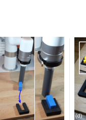

# Implicit Behavioral Cloning

> 这是一份给"完全没接触过 AI"的读者看的精读笔记。语言尽量像聊天，公式全部翻译成人话。

## 一句话讲什么（TL;DR）

别让模型直接报"动作是这个"，而是让它给一堆候选动作打分、挑最低分那个——机器人的手就突然变巧了。

*所以这一节是想说：把"输出动作"换成"给动作打分再挑"，模仿学习能学到原来学不会的精细动作。*

---

## 这是个什么场景

想象你在教一个新员工切水果。你切给他看 50 次，他要照着你的样子切。问题来了——同一个西瓜，你这刀从左切、下一刀从右切，**两种都对**；可如果叫他"把两种切法平均一下"，他就会一刀劈在西瓜中间最硬的那条棱上，刀拐了。

再想另一个画面：把蓝色方块塞进只多 1 毫米空隙的卡扣。还没碰到卡扣时，可以慢慢推；**碰到的那一瞬间，必须立刻停手**，多推半毫米就卡死。中间没有过渡地带。

这两件事正是机器人模仿学习的硬骨头：

- 同一个状态下有**多个合理动作**（左推右推都行）
- 动作之间有**断点**（碰到之前慢慢推、碰到瞬间立刻停，没有中间速度）
- 有时**精度要求 1 毫米**（太轻塞不进、太重会卡死）

传统的"看一眼 → 算出动作"网络在这种场合特别容易翻车——它本质上是在画一条平滑的曲线，而真实的最优动作既不平滑也不唯一。

IBC 想做的事，是**换一种办法让机器人决定动作**——不是直接算出来，而是先给一堆候选动作打分，再挑分数最低的那个。

*所以这一节是想说：模仿学习里的硬骨头是"动作不连续 + 多个合理答案"，传统做法对此无能为力。*

---

## 之前的人怎么做的，为什么不够好

- **方案 A：均方误差（MSE）回归**
  类比：让网络对所有合理动作"求平均"。如果两位老师傅一个推左、一个推右，机器人会学成"往中间推"——结果撞墙。这是这篇论文的头号靶子。

- **方案 B：混合密度网络（MDN）**
  类比：让网络承认"答案可能有几种"，每种打个概率。能处理多答案，但训练不稳定，超参数调起来像哄小孩，**而且仍然假设动作分布是连续光滑的**。

- **方案 C：离线强化学习（CQL、S4RL 等）**
  类比：除了看示范，还要看每一步打了多少分。需要标注奖励信号——大多数真实数据没奖励，标起来很贵。

- **方案 D：分布匹配 / GAIL**
  类比：让机器人和老师"互相评判"，需要不停在线试错，**真机部署成本高**。

- **核心难题**：所有这些方案，骨子里都是"输入 o，直接吐出动作 a = F(o)"。这种"显式函数"天然对不连续和多答案不友好。

*所以这一节是想说：以前的模仿学习要么爱"求平均"，要么需要奖励信号，根子里都没改"直接输出动作"这件事。*

---

## 这篇论文的新想法

**别让网络直接说"动作是这个"，而是让它对"状态+候选动作"打分，再用搜索找出分数最低的那个动作当输出。**

形式上一行：把 `a = F(o)` 改成 `a = argmin_a E(o, a)`。少了点直觉但效果惊人。

为什么这一步改变就如此关键？因为显式函数 F(o) 必须是一个连续映射——它只能画出一条平滑曲线，遇到分叉和断崖就"画不出来"。而能量函数 E(o, a) 是一个曲面，曲面本身可以是连续平滑的，但它的 argmin（谷底位置）完全可以突然跳变。就像一片山脉里最深的山谷可以从东边突然跳到西边——山坡本身没有断裂，但"谷底的位置"断裂了。这就是隐式模型的数学魔法：**用一个连续的东西表达不连续的答案**。

*所以这一节是想说：核心创新就是把"输出"换成"打分 + 搜索"，让模型有能力学不连续、多答案的动作分布。*

---

## 它分几步做的（方法）

<!-- paper-figures:begin -->


*上图说明：Figure 1：Implicit BC 能量模型与采样动作流程（论文原图）。*



*上图说明：Figure：IBC 与 CQL/IQL 等 offline RL 基线成功率对比（论文原图）。*
<!-- paper-figures:end -->


整篇论文围绕 4 个核心动作展开：换公式、训练打分网络、推理时搜索、万能逼近理论。每一步都先讲"日常这件事像什么"，再翻译成网络在干嘛。

### 第一步：把策略改写成能量函数 argmin

**类比**

假设你周末跟朋友选餐厅，有两种问法：

- 问法 A：朋友直接说"就去这家"（显式策略，对应 `a = F(o)`）。
- 问法 B：朋友递给你一份"难吃指数表"——每家餐厅打一个分，你自己挑分数最低那家（隐式策略，对应 `a = argmin_a E(o, a)`）。

问法 A 最怕"两家一样好"——朋友要么卡壳，要么折中说"那家也不错"，但折中的那家可能根本不存在。问法 B 不会卡壳：分数表上两家都是 1 分、第三家 5 分，挑哪个都对，照单全收。

> **能量函数（Energy Function）**：本质就是个评分网络。给输入打一个数，数越小越"合理"。名字来自物理——物理系统总是趋向能量最低的状态。
>
> **隐式模型（Implicit Model）**：输出不是直接算出来的，而是"argmin/argmax 出来的"。需要在推理时多做一步搜索。
>
> **argmin**：在所有候选里挑分数最低的那个。

**它在干什么**

- 训练一个网络 `E_theta(o, a)`：输入是观测 o（图像 / 状态向量）和一个候选动作 a，输出是一个标量"能量"。
- 训练目标：让真实演示中的（o, a）能量低，让其他不该选的动作能量高。
- 推理（机器人执行时）：给定 o，搜索一组候选动作 a，挑能量最低那个执行。

**为什么这步有用**

- 同一个 o 可以让多个 a 同时取得最低能量——天然支持多答案（multi-modal）。
- 能量在动作空间里可以**陡变**——天然支持不连续。
- 论文 Section 5 给了证明：argmin 一个连续函数，就足以表达任意"集合值函数"和不连续函数。这是显式网络做不到的事。

**网络结构细节**

显式策略和隐式策略用的几乎是同一个网络架构——ReLU 激活的全连接多层感知器（MLP），唯一的区别是：显式网络输入只有 o，输出是 a；隐式网络输入是 (o, a) 拼在一起，输出是一个标量能量值。对于有图像输入的任务，论文采用"late fusion"架构：先用卷积网络（ResNet）提取图像特征，再把特征和候选动作拼接后送入 MLP 出能量。这意味着图像只需编码一次，之后可以并行评估成千上万个候选动作。

*所以这一节是想说：argmin + 能量函数这一行公式的改动，就把模型的"表达能力"扩大到了不连续和多答案。*

---

### 第二步：用 InfoNCE 损失训练能量函数

**类比**

要让评分网络学会打分，得找"反例"。就像教小朋友认水果：

- 给他一个真苹果，说"这是苹果"（正例）。
- 同时摆几个橘子、香蕉，说"这些不是苹果"（负例）。
- 让他打分：苹果分越低、其他越高就奖励。

> **InfoNCE 损失**：一种"对比学习"风格的损失。直觉上写成"正例分数 vs 一堆负例分数的相对位置"，很像 softmax 分类——把"正确动作"当成正确分类。
>
> **负例采样（Negative Sampling）**：在动作空间里随便撒一把假动作，让网络学会区分"老师演示的"和"瞎蒙的"。

**它在干什么**

对每条训练数据 (o_i, a_i)：

1. 把演示动作 a_i 当**正例**（应该能量最低）。
2. 在动作空间随机采若干个**负例** a_tilde（应该能量较高）。论文典型配置：batch size = 512，每个样本配 256 个负例。
3. 用 InfoNCE 损失：让正例的能量比一堆负例都低。

**关键公式人话翻译**

原文长长一串带 exp、求和、log。翻译过来：

> 把所有候选动作（1 个正例 + N 个负例）的能量取负数再做 softmax，要求正例那一项的 softmax 概率尽可能大。如果正例能量最低，它的 exp(-E) 最大，softmax 概率接近 1，损失接近 0；如果某个负例分数比它还低，概率下降，就罚一下。

用数学符号写出来是：

```
L = -log[ exp(-E(o, a_positive)) / (exp(-E(o, a_positive)) + sum_j exp(-E(o, a_negative_j))) ]
```

这和你在分类任务里见过的交叉熵损失完全同构——只不过"类别"变成了"动作"，"logit"变成了"负能量"。

**训练细节**

- 所有观测和动作都做了 per-dimension 标准化（零均值、单位方差）。
- 学习率 1e-3，每 100 步乘以 0.99 的衰减系数。
- 论文发现 Dropout 不帮助 EBM 训练——可能因为负例采样本身就起到了正则化的效果。
- 负例来源：最简单的做法是在动作空间里均匀随机采样 `a_tilde ~ U(a_min, a_max)`。还可以在正例附近做局部采样，增加"难负例"的比例。

**为什么这步有用**

- 不需要奖励信号，跟标准的"行为克隆"用的数据一模一样（只要 o 和 a）。
- 负例采样让模型学到"动作空间里别的地方都是错的"，比 MSE 那种只见过正例的训练方式信息量大得多。
- 对比学习的目标天然适合多答案场景——只要求正例能量低于负例，不要求正例唯一。

*所以这一节是想说：训练用对比学习——让真实动作分数低、随机假动作分数高，本质就是教网络识别"专家动作的形状"。*

---

### 第三步：推理时搜索——怎么把 argmin 真的算出来

**类比**

你拿到一份菜单上的"难吃指数表"，要挑分数最低的那家。怎么挑？

- 笨办法：每家都问一遍，挑最便宜。
- 聪明办法：先大致看一眼哪个区域评分低，再在这个区域挑。
- 进阶办法：把指数表想成等高线图，从任意一点开始往低处滑。

IBC 论文给了三种推理实现，形成一个从简单到复杂的"工具箱"：

#### 方法 a：无导数采样优化（Derivative-Free Optimization, DFO）

**适用场景**：动作维度 <= 5D，如真机推方块（2D 动作空间）。

**算法流程**（Algorithm 1）：

1. 在动作空间均匀随机撒 N_samples = 16,384 个候选动作。
2. 对每个候选动作计算能量 E(o, a_tilde)。
3. 用 softmax 把能量转换成"概率"：概率高 = 能量低 = 可能是好动作。
4. 按概率做带权重采样（Multinomial resampling with replacement）——好动作被多次复制，差动作被淘汰。
5. 给存活下来的动作加一点高斯噪声（抖一抖位置），缩小噪声尺度 sigma。
6. 重复 N_iters = 3 轮。最终轮取概率最高的那个动作输出。

论文用的典型参数：sigma_init = 0.33, K = 0.5（每轮噪声减半），3 轮迭代，16,384 个样本。这个算法很像 Cross-Entropy Method (CEM)，但有几点不同：不用固定 elite 数量、用 softmax 加权而非硬截断、噪声按固定 schedule 衰减。

**为什么行**：16,384 个候选动作在 GPU 上并行计算能量只要几毫秒。三轮下来，搜索范围从"整个动作空间"缩小到"能量谷底附近"，精度足够。

#### 方法 b：自回归坐标下降（Autoregressive DFO）

**适用场景**：中高维动作空间（3D–12D），如平面扫粒子（3D）和双臂铲送（12D）。

**核心思路**：把 N 维动作空间拆成 N 个 1D 子问题。训练 N 个能量模型，第 j 个模型的输入是 (o, a_1, ..., a_j)，它只负责评估第 j 维的好坏。推理时逐维优化：先固定其他维度、在第 1 维做 DFO 找最优；再固定第 1 维结果、在第 2 维做 DFO；循环到第 N 维。

**代价**：需要 N 个独立模型（内存 N 倍），但避免了在高维空间里均匀撒样本的"维度诅咒"。

#### 方法 c：Langevin MCMC（梯度方法）

**适用场景**：高维动作空间（9D–30D），如 D4RL 的灵巧手任务（24D–30D）。

**核心思路**：利用 E(o, a) 对 a 的梯度——从随机起点出发，沿着能量下降最快的方向走，同时加一点噪声防止陷入小坑。

> **Langevin 采样**：一种"带噪声的梯度下降"。更新公式：a_new = a_old - (lambda/2) * grad_a E(o, a) + noise。噪声让它有机会跳出局部最小值，最终收敛到全局低能量区域的分布。

**额外要求**：训练时必须加 gradient penalty——约束能量函数梯度的大小，保证 Langevin 步长合理。论文用 spectral normalization + 梯度惩罚项 L_grad = sum max(0, ||grad_a E|| - M)^2，M 通常设为 1。

**训练时**：负例不再是随机采样，而是用 Langevin chain 生成——从均匀分布出发，跑若干步 MCMC 得到"接近正例但不完全是正例"的硬负例。这让训练信号更强。

**推理时**：从均匀分布初始化，跑训练时两倍的 Langevin 步数，取最终能量最低的样本。

#### 三种方法的选择指南

| 动作维度 | 推荐方法 | 原因 |
|----------|----------|------|
| 1D–5D | DFO（无导数采样） | 最简单，撒 16K 个点足够覆盖 |
| 3D–12D | 自回归 DFO | 逐维优化避免维度诅咒 |
| 9D–30D | Langevin MCMC | 利用梯度信息在高维空间高效搜索 |

论文在 N-D 粒子任务上做了对比：DFO 在 5D 之后崩溃，自回归和 Langevin 都能撑到 16D，32D 仍有非零成功率。

**推理时间实测**

论文在真机视觉任务上测了延迟：隐式模型用 DFO（1024 个样本、3 轮迭代）在单张 RTX 2080 Ti 上推理只要 7.22 ms。对照组显式模型是 3.49 ms。两者都远低于 5 Hz（200 ms）的控制周期，实时性完全没问题。

*所以这一节是想说：推理时多花点算力做搜索，换来的是表达能力的飞跃；GPU 并行让这个代价在真机上可控。*

---

### 第四步：万能逼近定理——为什么隐式模型理论上更强

**类比**

经典的万能逼近定理（Cybenko 1989）说：一个足够大的神经网络可以逼近任意连续函数。但注意——这里有个限制词"连续"。如果函数有断崖，或者同一个输入对应多个输出（集合值函数），经典定理就不适用了。

IBC 论文的 Section 5 给了两个新定理，扩展了万能逼近到隐式模型：

> **定理 1**：对任意闭图集合值函数 F(x)（包括不连续函数），都存在一个连续函数 g(x, y)，使得 argmin_y g(x, y) = F(x)。

人话翻译：不管你的目标函数多么疯狂（有断崖、有分叉、有多值），总存在一个平滑的能量曲面，它的谷底位置恰好是你要的答案。

> **定理 2**：这个连续函数 g 可以被神经网络以任意精度 epsilon 逼近，使得 argmin 的误差也不超过 epsilon。

人话翻译：不仅理论上存在这样的能量曲面，而且神经网络学得出来。

**直觉理解**

想象一片山脉。山坡是连续的（没有悬崖），但"最深谷底的位置"可以从地图左边跳到右边——只要中间某个点的谷底变浅了、旁边一个谷底变深了。这就是 argmin 能表达不连续的核心原因：**能量曲面本身是光滑的，但它的极小值位置可以突变**。

论文 Fig. 10 给出了一个构造性的例子：目标函数 f(x) = {1,0} if x=1, 1 if x>1, 0 otherwise（这是一个既不连续又多值的函数）。构造方法是把 g(x,y) 设为"(x,y) 到 f 的图的最小距离"。这个距离函数显然是连续的（两个点越近距离越小），但 argmin_y g(x,y) 恰好落在 f(x) 的图上——也就是不连续的目标。

**定理的数学精度**

定理 1 要求 F 的图是闭集——直观上就是"没有开放的边界"。绝大多数机器人任务满足这个条件，因为物理量（位置、速度、力）都在有限闭区间内。定理 2 进一步保证了"近似误差可控"：如果神经网络逼近 g 的误差不超过 epsilon，那 argmin 的输出和真实答案的距离也不超过 epsilon。这个误差传播的有界性是隐式模型实际可用的理论保障。

**实际意义**

显式网络要学一个陡变的函数，需要权重数值巨大（产生大梯度），导致训练不稳定、泛化差。隐式模型的能量函数可以始终保持有界的 Lipschitz 常数（梯度不爆炸），陡变"转嫁"给了 argmin 这个数学操作本身。论文还证明了一个推论（Corollary 1.1）：任意大或任意小 Lipschitz 常数的显式函数，都可以被有界 Lipschitz 的隐式函数逼近。这意味着隐式模型不需要让自己的梯度"爆炸"就能表达"爆炸性"的输出变化——这是显式模型做不到的根本优势。

*所以这一节是想说：不只是实验好用——理论上，隐式模型能表达的函数类严格大于显式模型，对不连续和多值有天然优势。*

---

### 第五步：跨 6 个任务族的"显式 vs 隐式"对照实验

**类比**

要证明"打分挑动作"比"直接输出动作"更好，得在很多种场地比一次。论文像办了一场体能测试，让两种方法做 6 套不同项目的"全能赛"。

**它在干什么**

把 EBM（隐式）和 MSE/MDN（显式）放进 6 个环境对比：

1. **D4RL 人类专家任务**（厨房、灵巧手），动作维度高达 30D，数据只有 19–601 条演示，用 Langevin 方法。
2. **N-D 粒子积分器**：1D 到 32D 的人造任务，专门隔离"不连续"这一个变量。2,000 条演示，不连续来自"到达第一个目标后立即切换到第二个目标"。
3. **模拟 xArm6 推方块**：单目标 / 多目标 / 视觉输入，2D 动作空间，2,000 条演示。
4. **平面扫粒子**：50–100 个小颗粒扫进区域，纯视觉，3D 动作空间，50 条人类遥操作演示。
5. **双臂铲送**：两个 KUKA 协作，把粒子分到两个碗，12D 动作空间，1,000 条脚本演示，图像 + 状态输入。
6. **真机操作**：xArm6 推积木 + 1mm 公差插入 + 多色分拣，纯 RGB 图像输入 5Hz，遥操作演示 95–502 条。

**实验设计要点**

- 所有对比都用"几乎相同的网络架构"——唯一区别是输出层（能量标量 vs 动作向量），确保性能差异只来自"显式 vs 隐式"这个设计选择。
- 每个任务跑 3 个随机种子，每个种子 100 次评估（真机 20 次），报告均值和标准差。
- 还加了 Nearest-Neighbor 基线——用来证明任务需要泛化能力，不能靠死记硬背（NN 在推方块上只有 0-4% 成功率）。
- EBM 变体的选择严格按维度：2D 动作用 DFO（真机推方块）、3D 用自回归（扫粒子）、12D 用自回归（双臂铲）、24-30D 用 Langevin（D4RL 灵巧手）。
- 真机任务用鼠标遥操作收集演示数据，RGB 图像 90x120 像素，5Hz 控制频率，任务最长 60 秒。动作空间是 2D delta Cartesian（下一步相对位移），机器人被约束在桌面上方平面运动以确保安全。

**为什么这步有用**

- 单看一个任务，提升可能是巧合。论文要证明"换隐式表达"是普遍性的好处，所以才铺这么大场子。
- 真机 1mm 插入是最有说服力的——这种精度对 MSE 几乎是死刑，因为接触时动作必须**陡变**（碰到框就停，没碰到就继续推）。

*所以这一节是想说：不只在一处做实验，6 个领域里隐式都比显式好，证明"能量+argmin"是普适改进。*

---

### 第六步：视觉泛化——隐式模型在图像任务上的额外优势

论文 Section 3 还专门做了一个"视觉坐标回归"实验（Fig. 4），揭示了隐式模型在视觉任务上的一个意外优势：

**任务**：给一张图像，图中有一个绿色小点，输出该点的 (u, v) 坐标。这是卷积网络的一个"臭名昭著"的难题——即使有 CoordConv 加持，显式网络在训练数据凸包外的泛化仍然很差。

**结果**：

- 只有 10 张训练图像时，MSE 网络连训练集都拟合不好；EBM 用 late fusion 架构就能外推到整个图像范围。
- EBM 在低数据区域的测试误差比 MSE 低 1-2 个数量级。

**为什么**：隐式模型的 late fusion 架构天然做了"视觉特征"和"候选坐标"的比较——它不需要从图像"直接回归"出一个坐标（这对 CNN 很难），而是问"这个候选坐标和图像里的绿点特征匹不匹配？"。这把回归问题转化成了匹配问题，对卷积网络更友好。

*所以这一节是想说：除了多答案和不连续的优势，隐式模型在视觉回归任务上还有"不需要从图像直接输出坐标"这个结构性优势。*

---

## 关键数字（What works）

数字本身不重要，重要的是它们告诉你"换成隐式"到底改善了什么。

| 任务 | 隐式（EBM） | 显式（MSE） | 倍数 | 说明 |
|------|------------|------------|------|------|
| 1mm 插入（真机） | 83.3% | 6.7% | 12.4x | 接触瞬间的陡变，MSE 学不会"立刻停手" |
| 分拣 4蓝+4黄（真机） | 48.3% | 19.6% | 2.4x | 大量分支决策（先抓哪个？），多答案场景 |
| 多目标推方块（真机） | 88.3% | 55.0% | 1.6x | 先推红还是先推绿都对，MSE 折中 |
| 推红再推绿（真机） | 85.0% | 35.0% | 2.4x | 长时间接触+方向切换 |
| D4RL pen-human | 2586 | 2141(MSE) / 1214(CQL) | 1.2x/2.1x | 不用奖励信号却超过用奖励的 CQL |
| N-D 粒子 95%维度上限 | 16D | 8D | 2x | 维度越高不连续点越多，MSE 越先崩 |
| 扫粒子（图像） | 82.6% | 56.6% | 1.5x | 所有 ResNet 深度/编码器配置都领先 |
| 分拣 4蓝+4黄（真机） | 48.3% | 19.6% | 2.5x | 组合决策最多的任务 |
| 视觉坐标回归(10样本) | 1-2 OOM更低误差 | 基线 | 10-100x | 小数据+外推能力 |
| 双臂铲粒子 | 78.2% | 63.9% | 1.2x | 12维动作+多阶段模式切换 |

**训练与推理开销对比**

| 指标 | 隐式 BC (EBM) | 显式 BC (MSE) | 备注 |
|------|------|------|------|
| D4RL 训练+评估总时间 | 3.4h | 0.66h | 100k步，Langevin 100迭代 |
| 真机推理延迟 | 7.22ms | 3.49ms | 1024采样×3轮DFO，单GPU |
| 真机训练时间 | 5.0h | 5.8h | 视觉处理主导，差异小 |

*所以这一节是想说：数字反复指向一件事——隐式策略在不连续、高维、多答案、小数据这些"硬场景"全面领先，代价是推理时多花 2-5 倍算力。*

---

## 实验结果说明了什么

把上面那堆数字拎出来看，有几个关键结论：

**结论 1：表达形式比模型大小重要。** 1mm 插入任务里，EBM 和 MSE 用的是几乎一样的网络结构（同样的 ConvMLP），唯一区别是输出方式——一个直接吐动作，一个打分再搜索。成功率从 7% 跳到 83%，不是靠更大的模型、更多的数据，而是靠换了一行公式。

**结论 2：隐式策略对数据质量更敏感。** D4RL 实验里，加 RWR（只用前 50% 高回报演示）对 EBM 的提升比对 MSE 大得多。这说明隐式策略更善于"挑好数据学"——垃圾数据对它的伤害也更大。

**结论 3：图像输入 + 隐式 > 状态输入 + 显式。** 扫粒子任务里，用像素图像的 EBM（82.6%）远超用精确状态向量的 MSE（28.9%）。这暗示隐式策略能更好地利用图像中的空间对称性。

**结论 4：维度是显式策略的死穴。** 粒子积分器实验专门隔离了"不连续"这一个变量，然后加维度——MSE 在 8D 崩溃，EBM 撑到 16D。维度越高，不连续点在空间中分布越密，MSE 的"求平均"病就越严重。

**结论 5：BC 没死，只是之前被"显式"拖累了。** IBC 在 D4RL human-expert 子集上不用奖励信号就打平甚至超过 CQL——这件事让"BC 已死"的叙事被逆转。核心信息是：简单的模仿学习 + 对的表达形式，比复杂的离线 RL 更实用。

*所以这一节是想说：实验反复证明"表达形式本身就是天花板"——不是模型不够大、数据不够多，而是输出方式选错了。*

---

## 你应该懂的几个新词

> **Behavioral Cloning（行为克隆，BC）**：最简单的模仿学习——把"老师做什么 -> 学生做什么"当成一道监督学习题。输入观测、输出动作，照着 demo 训。

> **Implicit Model（隐式模型）**：输出不直接算出来，而是"对所有候选输入打分，再挑分数最低的"。需要在推理时多一步搜索。

> **Energy-Based Model（能量模型，EBM）**：一种隐式模型的实现方式——网络输出一个标量分数（"能量"），数越小越合理。

> **InfoNCE Loss**：对比学习里的常用损失。让正例分数明显低于一堆负例，本质上等于做"正例 vs 负例"的 softmax 分类。

> **Langevin MCMC**：一种在能量函数里"找谷底"的采样方法。沿负梯度滑下山，加点随机噪声防止卡在小坑。

> **Mixture Density Network（MDN，混合密度网络）**：显式模型应对"多答案"的方案——输出一组高斯分布参数，每个高斯代表一种可能动作。论文的对比靶子之一。

> **Multi-modal / Multi-valued（多模态 / 多值）**：同一个观测下有多个合理动作。比如机器人抓杯子，从左侧抓和从右侧抓都对。

> **Discontinuity（不连续）**：动作随状态突变。最经典的例子是接触——碰到物体之前可以慢慢推，碰到瞬间必须停。

> **D4RL**：离线强化学习的标准 benchmark，包含 Franka 厨房、Adroit 灵巧手等场景。IBC 在它的 human-expert 子集上做对比。

> **CQL / S4RL**：当时最强的离线 RL 算法，需要奖励信号。IBC 在不用奖励的前提下打平甚至超过它们。

> **Universal Approximation（万能逼近）**：神经网络的经典理论——足够大的网络能任意逼近连续函数。论文 Section 5 把这个结论扩展到了"argmin 一个连续函数"，从而能逼近不连续和集合值函数。

> **RWR（Reward-Weighted Regression）**：用奖励给数据加权的简单技巧。论文里用一个简化版：只用前 50% 高回报的演示数据。

> **Derivative-Free Optimization（无导数优化，DFO）**：不需要计算梯度的搜索方法。IBC 的默认推理方式——撒一把候选动作、打分、缩小范围、再撒。类似 Cross-Entropy Method。

*所以这一节是想说：理解 IBC 只需要这 12 个词，每个都对应方法中的一个具体角色。*

---

## 它有什么搞不定的

1. **推理慢、算力贵**：argmin 需要每步采样数千个动作并行评估。论文在 5 Hz 控制下勉强够用（7.22ms/步），但更高频率（比如 100 Hz 力控）的任务跑不起来。对比显式策略只需一次前向传播（3.49ms），隐式策略的推理开销是 2-5 倍。

2. **训练不如显式好调参**：负例采样数、Langevin 步长、能量光滑度（gradient penalty 的 M 值）、采样噪声衰减率都会影响训练稳定性。MSE 调一调学习率就跑了，EBM 是手艺活——论文自己也承认在 Gym-Mujoco 等非人类数据上 EBM 表现不稳定。

3. **没解决"复合误差"问题**：行为克隆固有的缺陷——执行时错一步就偏离训练分布，后续误差雪球式累积。IBC 只改了表达形式（怎么生成单步动作），没改决策方式（还是逐步预测）。后来的 Diffusion Policy 加入了"动作分块"（一次预测未来多步）才部分缓解这个问题。

4. **负例质量是隐性瓶颈**：训练依赖"负例和正例形成对比"，但在高维动作空间里，随机撒的负例大概率远离正例，对比信号太弱。论文用 autoregressive 和 Langevin 缓解，但没有根本解决——后续 Diffusion Policy 完全绕开了负例采样这个问题。

5. **缺乏序列建模能力**：EBM 只在单步 (o, a) 上建模，没有对动作序列的时序结构进行显式建模。这意味着它学不到"先慢后快"或"先抬再放"这类跨多步的动作模式——必须靠网络隐式从观测历史中推断。

6. **理论保证与实践有差距**：Theorem 1-2 说"argmin 连续函数能表达任意不连续函数"，但前提是能量函数被完美学到。实际训练中能量曲面总有噪声峰值（spurious minima），argmin 可能跳到错误的谷底。论文没有给出避免 spurious minima 的系统方法。

*所以这一节是想说：IBC 强在表达能力，弱在工程负担、训练稳定性和单步决策的根本局限——这些短板直接催生了 Diffusion Policy。*

---

## 它和别的论文是什么关系

- **直接前传**：标准 BC 范式（Pomerleau 1989 的 ALVINN），这篇就是想替换掉它的输出层。
- **直接后继**：**Diffusion Policy**（Chi et al. 2023）——把"argmin 能量"换成"扩散去噪"。本质上扩散模型也是隐式生成动作，思路和 IBC 一脉相承，但训练更稳（不需要负例采样）、效果更好（加了动作分块）。如果说 IBC 是隐式策略的开山之作，Diffusion Policy 就是把它工业化。
- **任务对照**：和 [openvla](openvla.md) 比，OpenVLA 用大语言模型直接吐离散 token 当动作；IBC 在连续动作空间用 argmin 搜索。两条不同路线——OpenVLA 押宝预训练，IBC 押宝表达形式。
- **范式对照**：和 [saycan](saycan.md) 比，SayCan 是高层任务规划（"先抓杯子，再倒水"）；IBC 是底层动作生成（"机械臂下一时刻怎么动"）。完全不同的层级，但 SayCan 给出的子任务最终需要 IBC/Diffusion Policy 这种底层策略来执行。
- **同期对照**：CQL、S4RL 这些离线 RL 用奖励信号；IBC 不用奖励却能打平。这件事让"行为克隆已死"的舆论被反转——只要表达形式选对，BC 一点也不弱。
- **理论传承**：Cybenko 1989 的万能逼近定理只保证逼近连续函数；IBC 的 Theorem 1-2 把万能逼近扩展到了不连续和集合值函数——代价是输出层从 F(x) 变成 argmin E(x,y)。

*所以这一节是想说：IBC 是从行为克隆到 Diffusion Policy 之间最关键的中间站，定义了"隐式策略"这条路线。*

---

## 和本导读的关系

本导读的 [Ch14: 模仿学习](../../guide/ch14-imitation-learning.md) 系统讲了行为克隆的致命缺陷（分布偏移、误差累积），DAgger 如何用在线纠正解决分布偏移，ACT-ALOHA 如何用动作分块减少决策次数。IBC 在这个体系中的位置是：

**它解决的是 Ch14 没覆盖的第三个痛点——"多答案 + 不连续"的表达能力问题。**

- Ch14 讲的 DAgger 解决"偏离轨迹后怎么办"（分布偏移）
- Ch14 讲的 ACT 解决"逐步预测误差累积太快"（动作分块）
- IBC 解决"同一状态多个合理动作时 MSE 会求平均"（表达形式）

三者不互斥：你可以用 IBC 的能量模型思想 + ACT 的动作分块 + DAgger 的在线纠正。事实上，Diffusion Policy 正是这么做的——它继承了 IBC 的"隐式生成"思路，加入了 ACT 的"分块预测"，成为了 2023-2024 年模仿学习的事实标准。

同时，[Ch13: 扩散策略](../../guide/ch13-diffusion-policy.md) 正是 IBC 的直接后继。读完 IBC 再读 Ch13，你会发现 Diffusion Policy 的每一个设计选择都在回应 IBC 的局限：用去噪代替 argmin 搜索（解决推理效率）、用 DDPM 损失代替 InfoNCE（解决负例采样不稳定）、用动作序列代替单步动作（解决误差累积）。

*所以这一节是想说：IBC 是连接 Ch14（模仿学习基础）和 Ch13（扩散策略）的桥梁——它提出了问题（表达能力不够），给出了第一个答案（能量+argmin），而 Diffusion Policy 给出了更好的答案。*

---

## 思考题

**Q1：为什么 argmin E(o,a) 能表达不连续函数，而 F(o) 不能？**

<details><summary>提示</summary>想想 argmin 操作本身的性质——当能量曲面上两个谷底的深度关系发生微小变化时，argmin 的输出会怎样跳变？F(o) 作为连续函数能不能产生这种跳变？</details>

**Q2：如果把负例采样数从 256 减到 4，训练会怎么变？从信息论角度解释。**

<details><summary>提示</summary>InfoNCE 损失的下界与 log(负例数+1) 相关。负例越少，损失能提供的互信息上界越低——网络能从每个 batch 里"学到"的区分能力就越弱。想想在 1024 维动作空间里只有 4 个负例意味着什么。</details>

**Q3：Langevin 采样为什么要加噪声？只用梯度下降不行吗？**

<details><summary>提示</summary>纯梯度下降会确定性地收敛到最近的局部最小值。但如果能量曲面有多个谷底（多答案），你希望采样能覆盖所有谷底而不是只落入一个。噪声的作用类似于模拟退火中的温度。</details>

**Q4：论文说 EBM 训练时比 MSE "难调参"。具体哪些超参数是敏感的？为什么 Diffusion Policy 不需要调这些？**

<details><summary>提示</summary>IBC 的敏感超参包括：负例数量、Langevin 步长/步数、gradient penalty 的 M 值、采样噪声衰减率。Diffusion Policy 用 DDPM 的去噪损失代替了 InfoNCE——DDPM 损失不需要负例，训练目标是"预测加进去的噪声"，这个目标天然稳定。</details>

**Q5：假设一个任务的动作空间是连续的、单峰的（只有一个正确答案），IBC 还比 MSE 好吗？为什么？**

<details><summary>提示</summary>看论文的模拟推方块单目标任务——EBM 100%、MSE 98.3%。差距很小。当动作分布是单峰连续时，MSE 的"求平均"恰好就是正确答案，不会翻车。IBC 的优势在多峰/不连续时才显现。</details>

**Q6：为什么论文在低维任务用无导数采样（DFO），高维任务用 Langevin？中间的分界线大概在哪？**

<details><summary>提示</summary>DFO 均匀撒点，维度越高需要的点数指数增长（维度灾难）。论文实测 5D 以下 DFO 够用，5D 以上需要 autoregressive 或 Langevin。Langevin 用梯度信息引导搜索方向，不受维度灾难影响，但需要 gradient penalty 保持能量光滑。</details>

**Q7：IBC 的 Theorem 1 说"对任何闭图集合值函数都存在连续 g 使得 argmin g = F"。这个"闭图"条件在实际机器人任务中会不会不满足？举一个例子。**

<details><summary>提示</summary>闭图意味着"如果一系列(x_n, y_n)都在函数图上，且收敛到(x*, y*)，则(x*, y*)也在图上"。大多数物理系统满足这个条件。但如果动作空间有"开集"约束（比如"速度严格小于 v_max"但不能等于），那边界处的图就不闭。实际中通常取闭区间所以问题不大。</details>

*所以这一节是想说：如果你能回答这 7 道题，你就真正理解了 IBC 的核心思想、工程取舍和理论边界。*

---

## 一些好奇心问答（FAQ）

**Q1：argmin 推理那么贵，真的能在真机 5 Hz 跑吗？**

可以。论文用无导数采样，每步采 1024 个动作（不是 16384——那是训练时的负例数）并行算能量，3 轮迭代，在单 RTX 2080 Ti 上 7.22ms 完成。5 Hz 意味着每 200ms 决策一次，远远来得及。但如果是 100 Hz 力控任务，就需要把推理压到 10ms 以下——可能要减少采样数或换成 Langevin 少迭代几步。

**Q2：负例怎么采样？随便撒就行吗？**

基线方法确实是在动作空间均匀采样（U(y_min, y_max)）。论文的 DFO 方法还用了"逐轮缩小范围"——第一轮均匀撒，第二轮只在上一轮低能量区域附近撒。Langevin 方法更进一步：用梯度引导负例走向低能量区域，相当于"自适应负例"。负例质量直接影响训练效果——这是 EBM 训练的核心工程难点。

**Q3：MDN 也能处理多答案，凭什么 EBM 更好？**

MDN 假设答案是"几个高斯的混合"，每个高斯都是连续光滑的。当真实分布有不连续（如接触瞬间），MDN 仍然要在两个动作模式之间画一条平滑的过渡——治标不治本。更实际的问题：MDN 需要预设高斯数量（论文用 10 个），真实任务的模式数未知且随状态变化。EBM 直接用神经网络拟合任意能量曲面，没这两个限制。

**Q4：为什么不连续这么难？我直觉觉得网络可以学陡变啊。**

可以，但需要很大的梯度。学一条几乎垂直的曲线，相当于让网络的权重数值巨大，训练时数值不稳定，泛化也差。论文 Appendix 的 Corollary 1.1 专门说明了这个问题：显式函数要逼近 Lipschitz 常数为 L 的不连续函数，自身的 Lipschitz 常数也必须至少为 L。但隐式函数 g(x,y) 可以保持有界的 Lipschitz 常数，因为陡变发生在 argmin 这一步——argmin 本身就是一个不连续操作。

**Q5：Langevin 那种带梯度的方法不是更现代吗？为啥论文还推荐采样？**

Langevin 需要训练时加 gradient penalty 和 spectral normalization 保持能量光滑，超参数比无导数采样多。论文实测（Appendix B.4）：DFO 在 5D 以下又快又稳，autoregressive DFO 在 12D 以下够用，只有 D4RL 的 24-30D 任务才必须上 Langevin。选方法看动作维度。

**Q6：这篇和 Diffusion Policy 啥关系？**

Diffusion Policy（Chi et al. 2023）也是隐式生成动作，但用扩散模型代替 EBM。关键改进：(1) 训练用 DDPM 去噪损失代替 InfoNCE——不需要负例采样，训练更稳；(2) 输出是动作序列而非单步——减少误差累积；(3) 推理用去噪而非 argmin 搜索——速度和 EBM 差不多但更可控。本质关系：IBC 证明了"隐式生成动作可行"，Diffusion Policy 找到了更好的实现方式。

**Q7：D4RL 任务上 BC 居然比 CQL 强，这正常吗？**

是的，这一发现让整个离线 RL 圈重新审视了 BC 的价值。关键洞察：D4RL 的 human-expert 数据质量很高（人类专家演示），CQL 的保守估计在这种高质量数据上反而是拖累——它过度惩罚了正确的动作。IBC 证明：在高质量 demo 上，表达能力比奖励信号更重要。

**Q8：我能在自己电脑上跑吗？**

模拟环境（D4RL、PyBullet 推方块）可以，单 GPU（GTX 1080 以上）即可。真机部分需要 xArm6 + 工作台 + Intel RealSense 相机，硬件成本约 $10-15K。代码已开源。如果只是想体验 EBM 的训练和推理过程，建议从论文的 1D 函数拟合实验开始——几行 PyTorch 就能复现 Fig. 2 和 Fig. 3。

*所以这一节是想说：实操问题（推不推得动、调不调得稳、能不能复现）作者给的答案是"勉强可以但有手艺成分"——这也是后来 Diffusion Policy 崛起的原因。*

---

## 如果你想再深入

按"前传 -> 同期对手 -> 续作 -> 衍生方向"四类排序：

1. **前传：LeCun 的 EBM tutorial（2006）** — 能量模型的祖师爷文。读完能搞清"EBM 不是某种特定网络结构，而是一种损失函数视角"。
2. **同期对手：D4RL benchmark（Fu et al. 2020）** — 离线 RL 的标准考场，IBC 在它的 human-expert 子集上和 CQL/S4RL 正面对比。读完能搞清"演示数据 + 奖励数据"两类范式的差别。
3. **续作：Diffusion Policy（Chi et al. 2023）** — 同思路的强化版。把 argmin EBM 换成扩散去噪，训练更稳、性能更好，目前是模仿学习的事实标准。强烈推荐紧跟着这篇读。
4. **衍生：3D Diffuser Actor / RDT（2024）** — 把 Diffusion Policy 扩展到 3D 点云、双臂操作、多任务等更复杂场景。
5. **理论延伸：Cybenko 1989 的万能逼近定理** — 神经网络逼近能力的"祖宗定理"。IBC Section 5 的两个定理是它的隐式版本，读完能理解"为什么 argmin 神经网络比直接神经网络更能表达不连续"。

*所以这一节是想说：IBC -> Diffusion Policy -> 3D Diffuser Actor 三篇连起来读，就是 2021-2024 模仿学习底层策略发展史。*

---

## 原文信息

```bibtex
@inproceedings{florence2021implicit,
  title={Implicit Behavioral Cloning},
  author={Florence, Pete and Lynch, Corey and Zeng, Andy and Ramirez, Oscar and Wahid, Ayzaan and Downs, Laura and Wong, Adrian and Lee, Johnny and Mordatch, Igor and Tompson, Jonathan},
  booktitle={Conference on Robot Learning (CoRL)},
  year={2021}
}
```

- 论文 PDF：[arXiv:2109.00137](https://arxiv.org/abs/2109.00137)
- 项目页面：[implicitbc.github.io](https://implicitbc.github.io)
- 代码仓库：[google-research/ibc](https://github.com/google-research/ibc)

*所以这一节是想说：这是 Google Robotics 2021 年的工作，发表在机器人学习顶会 CoRL，代码和数据均已开源。*

---

## 最后一个画面

想象机器人面前有一个蓝色方块和一个 1mm 公差的插槽。MSE 训练的策略推过去——一推就过头，方块滑出去；再回来，又过头；反复几次后超时失败。

换成 IBC——机器人推到接触瞬间，**能量函数突然在"立刻停下"这个动作上变得最低**，机器人立刻收手；微调几下，方块咔哒一声卡进去。

成功率从 7% 跳到 83%，靠的不是更好的视觉、不是更多数据、不是更大模型——而是把"输出动作"换成了"打分挑动作"。

这就是 IBC 想让你看到的事：**有时候表达形式本身就是天花板**。

*所以最后一节是想说：选对表达形式，比堆数据堆模型更能解决精细操作任务——这是这篇论文留给具身 AI 的最重要遗产。*
