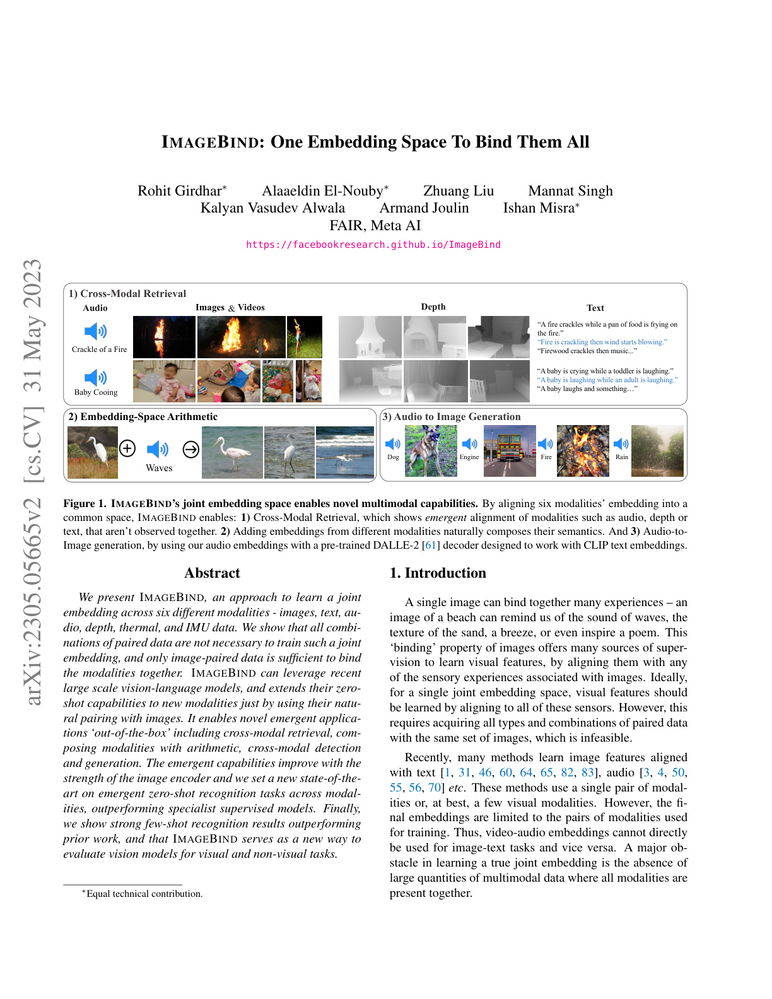
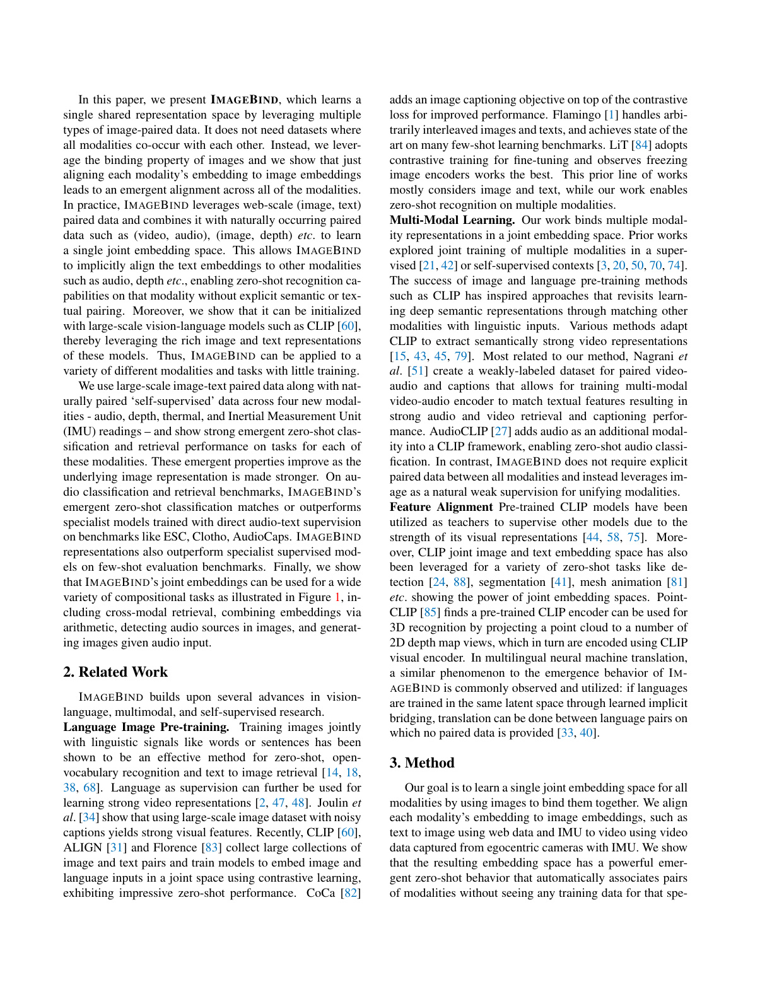

# ImageBind: One Embedding Space To Bind Them All

> 这是一份给"完全没接触过 AI"的读者看的精读笔记。语言尽量像聊天，公式全部翻译成人话。

## 一句话讲什么（TL;DR）

把图片当翻译官，六种感官（图、文、声、深度、热、动作）就能互相听懂彼此说话——而且不需要让它们两两见过面。

*所以这一节是想说：ImageBind 用图作为唯一的中心枢纽，只靠 (图, X) 配对训练就能让六种模态在同一个嵌入空间里互相对齐，包括从未一起训练过的模态对也能涌现出对齐能力。*

---

## 这是个什么场景

你刷到一张海滩的照片，脑子里立刻自动播放出一整个夏天：

> 海浪声、脚底烫沙、咸咸的海风、还有想发的那条朋友圈文案。

人类一张图就能"调"出五感，AI 不行。AI 像一群只会两两互译的翻译员，各做各的：

- **CLIP**（图+文）：会中英互译的人，但听不懂粤语。
- **AudioCLIP**（声+文）：会粤英互译的另一个人，但不会中文。
- 想让"中文"和"粤语"对上？得**再请人编一本"中粤词典"**。

更糟的是模态一多，词典数量就爆炸——6 种模态要做 C(6,2) = 15 本词典。而且像"热成像 + 文字"这种配对数据，**现实里根本没人采集过**。

ImageBind 干的事就一句话：**让所有模态都只跟图片对齐，剩下的两两关系会自己长出来**——像所有城市都通北京，那从上海去广州中转一下就行，不用再修一条直飞航线。

*所以这一节是想说：ImageBind 解决的是"模态太多、配对数据缺"——用图当桥，绕开了配对组合爆炸，把数据收集复杂度从 O(N^2) 压到 O(N)。*

---

## 之前的人怎么做的，为什么不够好

- **方案 A：CLIP 这种"两两对齐"**
  类比：每两种语言专门做一本词典。要 6 种模态全互通，就得做 15 本词典。问题是——"热成像配音频"这种词典**根本没人编**，原始数据都没有。

- **方案 B：AudioCLIP 把音频塞进 CLIP**
  类比：在中英词典里硬加一栏粤语。它确实能处理"声音"，但每加一种模态就要重训一次整个 CLIP，**不可扩展**，而且需要大量"声音+文字"配对。更关键的是：AudioCLIP 在训练时使用了 AudioSet 的类名作为文字监督，所以它的"零样本"其实不那么零。

- **方案 C：MultiMAE 之类的多模态联合训练**
  类比：把所有翻译人员关在一个房间一起训练。听起来美好，但要求**同一份样本同时具备所有模态**——现实中没人能给你一段同时含图、声、深度、热成像、IMU 的视频。

- **方案 D：监督式专家模型**
  类比：每种感官请一位专科医生（音频专家、深度专家……）。准是准，但**互不相通**，给你深度图的医生看不懂声音。而且每个模型都需要大量带标注的领域数据。

- **核心难题**：要把 N 个模态全连起来，传统思路要 O(N^2) 份配对数据，而真实世界只有 O(N) 份（每个模态都有跟图配的）。

*所以这一节是想说：之前要么数据不够、要么扩展性差、要么各做各的——核心瓶颈是"全模态共现的训练数据不存在"。*

---

## 这篇论文的新想法

类比一下：班里同学都跟班长玩得熟，结果你会发现**同学之间也自然认识了**——因为大家共享了同一个朋友圈。

ImageBind 就是这招：**只让每种模态去跟"图"对齐，模态之间的对齐就会自动浮现出来**——作者起了个名字叫"涌现对齐"（emergent alignment）。

具体而言，这个想法包含三层：

1. **图是天然枢纽**：摄像头和麦克风同录就有了视频-音频对，RGBD 相机同时输出 RGB+深度，红外相机和 RGB 相机并排就有了图-热成像对，Ego4D 设备同时记录视频和 IMU。图像几乎和所有传感器模态都有天然的配对数据。
2. **冻结 CLIP 当锚点**：不从零训图-文对齐，而是直接用 OpenCLIP 的 ViT-H 作为图编码器且冻结不动。这样嵌入空间的"坐标系"就固定了，新模态只需要学会"搬进去"。
3. **涌现零样本**：训练完之后，从未一起训练过的模态对（比如音频-深度）居然也能互相检索和分类。这是因为它们都对齐到了同一个图空间，间接获得了彼此的对齐。

神奇之处在于：明明没让"热成像"和"声音"互相训练过，它俩居然也能互相检索。为什么？后面会拆开讲。

*所以这一节是想说：核心创新是用图当中心枢纽，靠向量空间的传递性让涌现对齐自然浮现，把 O(N^2) 配对压成 O(N)。*

---

## 它分几步做的（方法）

<!-- paper-figures:begin -->



*上图说明：Figure 1：ImageBind 联合嵌入空间与跨模态能力（论文原图）。*



*上图说明：Figure 2：ImageBind 架构总览（六模态以图像为锚点对齐）（论文原图）。*
<!-- paper-figures:end -->

整篇论文做了 4 件事：定义"图配 X"训练范式、设计编码器、用对比学习对齐、展示涌现行为和下游应用。下面按顺序拆解。

### 1. 用图当总站，每种模态各自配上图

**类比**

想象一个机场枢纽：北京（图片）。

- 上海（文字）有飞北京的航班
- 广州（音频）有飞北京的航班
- 深圳（深度）有飞北京的航班
- 重庆（热成像）有飞北京的航班
- 杭州（IMU 姿态）有飞北京的航班

**没有**直飞"上海到广州"的航班。但只要每个城市都通北京——你想从上海去广州，**经北京中转就行**。ImageBind 就是这个机场枢纽思路。

**它在干什么**

把六种模态分成两类：

- **天然有图配对的数据**：直接拿来用
  - 图 + 文：从大规模网络数据来（继承自 OpenCLIP 训练的数十亿图文对）
  - 视频 + 音频：YouTube 视频自带音轨（用 AudioSet，约 200 万段 unbalanced split）
  - 图 + 深度：SUN RGB-D 数据集（带 RGBD 相机的室内房间扫描，约 5K 对，论文中复制 50 倍到约 250K）
  - 图 + 热成像：LLVIP 数据集（同一场景拍可见光+红外，约 12K 对，论文中复制 25 倍）
  - 视频 + IMU：Ego4D（第一视角穿戴相机自带运动传感器，约 51 万训练片段）

- **不需要凑齐**：不需要"图同时配文+声+深度+热+IMU"的样本，**每对独立训练**就行。训练时每个 mini-batch 只采样一种模态对（比如这个 batch 全是视频-音频对，下个 batch 全是图-深度对）。

> **模态（modality）**：信息的一种来源形式。图片是一种、文字是一种、声音是一种、深度图是一种。人有五感，AI 也在学多模态。
>
> **嵌入空间（embedding space）**：把任何东西（一张图、一句话、一段声音）变成一串几百到几千维的数字向量后，所有这些向量住的"空间"。语义相近的两个东西在这空间里就会挨得近。
>
> **涌现（emergent）**：你没专门教它，但它自己学会了。这里指模态 A 和模态 B 没直接训过，却能互相对齐。

**为什么这步有用**

- 配对数据从"15 种组合"压缩到"5 种组合"——**省 3 倍**。
- 每对都有现成的大规模数据集，**不用重新采集**。
- 想加新模态（比如"气味"）？只要有"气味+图"配对数据，**直接接上就能用**，不用动现有训练。扩展一个模态只需训一个新编码器——**O(1) 成本**。

*所以这一节是想说：把图设成中心枢纽，所有模态各自跟图配对，就能避开"全模态共现样本不存在"的死结，而且扩展新模态极其便宜。*

---

### 2. 给每种模态配一个翻译器（编码器）

**类比**

想象六个语言不通的人坐一桌：

- 每个人手里都有一台"翻译器"，把自己的母语翻成统一的"世界语"。
- 翻完之后大家说的都是世界语，自然能交流。

ImageBind 给每种模态都配了一个独立的"翻译器"（叫编码器），把原始信号变成 1024 维的向量。注意：所有编码器的**输出空间是共享的**（都是 1024 维），但**权重不共享**（因为不同模态的原始数据格式差异太大——图像的 2D 像素和 IMU 的 1D 时序信号需要完全不同的处理方式）。

> **编码器（encoder）**：把输入变成数字向量的神经网络。比如图片编码器把 224x224 像素变成一串 1024 个数字。
>
> **ViT（Vision Transformer）**：一种把图片切成 16x16 小块（patch）、再用注意力机制整合的图片编码器。ImageBind 用的是最大号的 ViT-H（Huge），约 6.3 亿参数。
>
> **梅尔频谱（mel-spectrogram）**：把声音波形变成"二维图"——横轴时间，纵轴频率，颜色深浅是能量。这样声音就能用看图的网络处理。

**它在干什么**

| 模态 | 输入 | 编码器 | 备注 |
|------|------|--------|------|
| 图 / 视频 | 224x224 像素（视频取 2 帧） | ViT-H（630M 参数） | 跟 OpenCLIP 共用，**冻结不训** |
| 文字 | 一句话 | Transformer（302M 参数） | 跟 OpenCLIP 共用，**冻结不训** |
| 音频 | 2 秒梅尔频谱（128 bin x 200 帧） | ViT-B（768 维，12 层，12 头） | 把声音当二维图处理，patch size 16、stride 10 |
| 深度 | 视差图（一通道） | ViT-S（384 维，12 层，8 头） | 转成视差（disparity）以保持尺度不变性 |
| 热成像 | 单通道红外 | ViT-S | 当一通道图处理 |
| IMU | 6x2000 时序（5 秒 @400Hz） | 1D 卷积（kernel=8）+ 6 层 Transformer（512 维，8 头） | 含加速度计 + 陀螺仪 XYZ |

每个编码器的最终输出都经过一个**模态特定的线性投影头**，映射到统一的 d=1024 维，再做 L2 归一化。

**关键设计细节**

1. **图和文字的编码器借用 OpenCLIP 训练好的、再也不动**（冻结）。为什么？因为图编码器已经从数十亿张图文配对里学到了丰富的语义表示。冻结它意味着嵌入空间的"坐标系"固定，新模态只需要学会对齐到这个坐标系——这比让所有编码器同时调整要稳定得多。如果解冻图编码器，在用 (图, 音频) 数据训练时，图编码器可能"忘记"从 CLIP 学到的图-文对齐，发生灾难性遗忘。

2. **其他四个新模态的编码器从头开始训**。它们的目标只有一个：把自己的输出对齐到冻结的图编码器的输出。

3. **投影头用线性层**，不用 MLP。消融实验（Table 5b）表明线性投影比 MLP 好——这和 SimCLR 等自监督方法"MLP 头更好"的经验相反。作者的解释是：这里的目标不是学好的自监督表示（SimCLR 的场景），而是对齐到一个已有的冻结空间，线性映射更简洁直接。

4. **音频的"二维化"技巧**：2 秒的 16kHz 音频先转成 128x200 的梅尔频谱图，然后用和图像一样的 ViT 架构处理——只是 patch size 和 stride 不同（16 和 10），因为频谱图的频率轴和时间轴的语义和图像的空间轴完全不同。

5. **深度图用视差（disparity）而不是绝对深度**：因为视差 = 1/深度，在不同场景尺度下更稳定。论文还做了 in-filling 预处理来填补深度图中的空洞区域。

**整体数据流**

```
任意模态输入
→ 模态特定的预处理（RGB: patch化; 音频: 梅尔频谱图→patch; 深度/热: 单通道→patch; IMU: 时间片段→token）
→ 模态特定的线性投影
→ 加上模态特定的位置编码（独立学习，不共享）
→ 独立的 Transformer 编码器（架构类似、权重不同）
→ 取 [CLS] token
→ 模态特定的线性投影头（映射到 1024 维）
→ L2 归一化
→ 共享嵌入空间中的 1024 维单位向量
```

**为什么这步有用**

- 图编码器是"标准答案"——已经从数十亿张图文配对里学到了丰富语义。其他模态只要"对齐到它"，就能继承这套语义。
- 不动 CLIP 那部分，省显存、训练快、不会把已有能力训坏。
- 给"声音/深度/热/IMU"这种小数据集模态，找了个**强壮的老师**。
- 架构设计的精髓是"底层多样化，顶层统一化"：底层每种模态有自己的预处理和编码器（因为原始数据格式千差万别），但顶层所有输出都映射到同一个 1024 维空间（因为在语义层面，"狗叫声"、"狗的照片"、"狗的深度图"说的都是同一件事）。

*所以这一节是想说：每模态各配一个独立的 Transformer 编码器，但只让新模态的编码器学着对齐到 CLIP 已有的冻结"图+文"空间，相当于站在巨人肩膀上。关键工程选择——线性投影头、冻结图编码器、视差表示——每个都经过消融验证。*

---

### 2.5 视频怎么处理——时序膨胀与帧采样

ImageBind 把视频"降级"成极短的两帧图像序列来处理，这是一个刻意的工程简化。

**做法**：从 2 秒视频中均匀采样 2 帧。ViT 原本只处理 2D 图像，要让它接受视频输入，作者用了 **temporal inflation**（时序膨胀）技巧——把 patch 投影层的 2D 卷积核沿时间轴复制一份变成 3D 卷积核（kernel 从 `[1, P, P]` 变成 `[2, P, P]`），这样同一个 ViT 既能处理单帧图像（当成 T=1 的视频），也能处理双帧视频（T=2）。

**为什么只取 2 帧**：这看起来"信息损失巨大"，但有几个考量：(1) ImageBind 的目标不是细粒度的视频动作识别（那是 VideoMAE 等模型的地盘），而是提取视频的**场景级语义**——"这段视频是在海边"还是"在厨房"——2 帧足够传达场景信息。(2) 训练效率：处理更多帧意味着更长的 token 序列（ViT 的计算量和序列长度成平方关系），2 帧把成本压到最低。(3) 和音频的时序对齐也只需要 2 秒窗口——音频取 2 秒片段，视频也取对应的 2 秒片段里的 2 帧，保持时间上的对应。

**推理时**：对于长视频，均匀采样多个 2 秒 clip，分别编码后**取特征平均**。这是一种简单但有效的聚合策略——等价于假设"整段视频的语义可以用各片段语义的平均来近似"。

---

### 2.7 数据增强：不同模态需要不同的"加工方式"

这是论文消融实验（Table 5d-h）揭示的一个核心工程发现：**不存在通用的数据增强策略，每种模态对需要定制化的增强方案**。

**图-深度对的增强要点**

深度的关键原则是**空间对齐**：图和深度做随机裁剪时，必须裁同一个区域（spatially aligned crops）。乱裁会掉 10 分以上（Table 5e：SUN-D 从 26.7% 跌到 16.0%）。此外，RandErase（随机擦除图像的一小块区域）反而有帮助（Table 5f：24.2% → 26.7%），可能是因为 RandErase 迫使编码器不要过度依赖某个局部区域，而去学习更全局的场景语义。对于更激进的增强（RandAugment + RandErase），在深度这种小数据集上也有正向作用（Table 5d：SUN-D 从 25.4% 提到 26.7%）——小数据集需要更多变化来防止过拟合。

**视频-音频对的增强要点**

音频对的情况正好相反：(1) 视频帧的强增强（RandAugment）会**严重损害**音频分类性能——ESC 从 56.7% 暴跌到 22.6%（Table 5d），掉了 34 个百分点。原因是：强增强会彻底改变视频帧的视觉外观（颜色翻转、极端对比度），使得帧和音频之间的语义对应被破坏——"一只正在叫的狗"的视频帧被增强成完全不像狗的样子，但音频还是"狗叫声"，对比学习就被错误的信号误导了。(2) 时序对齐（temporally aligned，即视频帧和音频来自同一时刻）比随机配对好 1 个百分点（Table 5g：55.7% → 56.7%）。(3) 音频侧的频率遮蔽增强（frequency masking，随机遮盖梅尔频谱图的某些频率带）有微小正向作用（Table 5h：56.5% → 56.7%）。

**热成像和 IMU 的增强**

论文对这两种模态的增强没有做详尽消融，但从最终训练配置（Table 9）可以推断：热成像用基础增强（毕竟数据集只有 12K），IMU 作为一维时序数据，增强方式与图像完全不同（可能包括时间裁剪和高斯噪声注入，但论文未详述）。

**总结规律**：模态对之间有严格空间/时序对应（图-深度、视频-音频）→ 必须做对齐裁剪/采样，不能随机；小数据集的图像侧可以加适度正则（RandErase），但不能加太强的外观变换（RandAugment）；音频侧的增强收益微乎其微，最主要的增强信号来自对比学习本身的负样本多样性。

---

### 2.8 训练动态：batch size 与训练长度的模态依赖性

除了温度和增强，论文还系统研究了 batch size 和训练 epoch 这两个超参对涌现性能的影响（Table 5c, Table 7），发现它们同样需要因模态而异。

**Batch size 的影响（Table 7）**

对比学习的负样本来自同一 mini-batch 中的其他样本，所以 batch size 直接决定了"负样本的多样性"。理论上 batch 越大、负样本越多、对比信号越强。但实际情况取决于数据集大小：

- **音频**（AudioSet，200 万段）：batch size 从 512 → 2048 时，ESC 从 39.4% → 56.7%（+17.3 点），显著提升。因为数据量够大，大 batch 能采样到更多样化的负样本，让"狗叫"和"猫叫"的区分更精确。
- **深度**（SUN RGB-D，5K 对 × 50 倍 ≈ 250K）：batch size 从 512 → 4096 时，NYU-D 从 47.3% → 39.9%（-7.4 点），反而下降。因为数据量太小，大 batch 意味着同一轮训练里重复样本更多，负样本的真实多样性并没有增加，反而让优化变得不稳定。

这个发现在工程实践中非常重要：**不能照搬 CLIP 的 32K 大 batch 经验到小数据集模态**。

**训练 epoch 的影响（Table 5c）**

训练更长一致地带来提升：SUN-D 从 26.7%（16 epoch）→ 29.9%（64 epoch），ESC 从 56.7% → 62.9%。但提升速度递减——从 16 到 32 epoch 的增益大于从 32 到 64 epoch。最终版模型训了 64 epoch（音频和深度）和 8 epoch（IMU，因为 Ego4D 数据量大且 IMU 编码器小）。

**为什么 IMU 只训 8 epoch**：Ego4D 有 51 万训练片段，数据量在四个新模态中最大，而 IMU 编码器只有 6 层 Transformer（远小于音频的 12 层 ViT-B），收敛速度快。训太久反而可能过拟合——论文选了 8 epoch 作为 IMU 的最优点。

---

### 2.9 零样本分类的具体机制：文字怎么给"没见过文字"的模态做分类

这是理解涌现能力最关键的机制细节，但容易被忽略。

**步骤拆解**

假设我们要用 ImageBind 对一段音频做"零样本分类"——判断它是"狗叫"还是"猫叫"还是"打雷"：

1. **准备文字提示**：对每个类别（如 ESC-50 的 50 个类），用 CLIP 原版的 80 个文字模板生成描述。比如对"狗叫"这个类，生成"a photo of a dog barking"、"a picture of dog barking"等 80 个变体。
2. **编码文字**：把所有文字描述送入 ImageBind 的**冻结文字编码器**（来自 OpenCLIP），得到每个描述的 1024 维嵌入向量。对同一类别的 80 个变体取平均，得到每个类别的**类别原型向量**。
3. **编码音频**：把目标音频送入 ImageBind 的音频编码器，得到 1024 维嵌入向量。
4. **计算相似度**：算音频向量和每个类别原型向量之间的**余弦相似度**（因为都做了 L2 归一化，余弦相似度就是内积），取最大的作为预测类别。

**为什么这能工作**

关键在于：步骤 2 的文字嵌入和步骤 3 的音频嵌入**住在同一个 1024 维空间**里。训练时，音频编码器学会了把"狗叫声"对齐到图编码器里"狗的图像"附近；而 CLIP 训练时已经让"a photo of a dog barking"的文字嵌入对齐到了"狗的图像"附近。所以在共享空间中，"狗叫声"的音频嵌入和"a dog barking"的文字嵌入自然挨在一起——即使它们从未在训练中直接见过。

**为什么用 CLIP 的 80 个模板**

CLIP 论文发现，单一的"a photo of {class}"模板不够鲁棒——不同数据集的图像风格差异很大。80 个模板（包括"a drawing of..."、"a close-up photo of..."等）取平均后，能得到更稳健的类别表示。ImageBind 直接沿用了这套模板，即使被分类的不是图像——因为这些文字模板编码的是"类别的语义中心"，和具体模态无关。

*所以这一节是想说：零样本分类的工作原理是"文字和音频在同一空间 → 算内积挑最近"，本质是一个 nearest-centroid 分类器。80 个文字模板取平均是保证类别表示鲁棒性的工程细节。*

---

### 3. 对比学习：把对的拉近，把错的推开

**类比**

教小孩认动物。你拿一张狗的照片，让他从一堆词卡里挑——"狗"那张应该被拉到照片旁边，"猫"和"鸡"那些应该被推远。

ImageBind 用的就是**对比学习**：每个 mini-batch 里，正确的"图-音"配对要互相靠近，跟其他不相干的样本要互相远离。

> **对比学习（contrastive learning）**：训练目标是"正样本拉近，负样本推远"。这里"正"指真实配对，"负"指同一 batch 里其他无关样本。
>
> **InfoNCE 损失**：对比学习常用的扣分公式，本质是"让正样本的相似度比所有负样本都高"。形式上就是一个多分类问题：在 batch 中的 N 个候选里挑出正样本。
>
> **温度（temperature τ）**：一个调节"对错差距"的旋钮，越小越严格（softmax 分布越尖锐，必须把正样本拉得贼近），越大越宽松（分布越平，模型对差异不太敏感）。

**它在干什么**

对每张图 I_i 和它配对的另一模态 M_i（比如声音），算两个归一化向量的内积（即余弦相似度）。然后用 InfoNCE 损失：

> 公式翻译成人话：在所有"图 i 和模态里候选 j"的相似度里，"正样本 j=i"那一份占的比例要尽可能接近 100%。把这件事变成一个负对数似然——分母是所有候选的 exp(相似度/τ) 之和，分子是正样本的 exp(相似度/τ)。扣分越小越好。

实际训练用对称损失：L_{I,M} + L_{M,I}，图找模态一遍，模态找图一遍，最终取平均。

**训练超参数（来自论文 Table 9）**

| 模态对 | batch size | 温度 τ | 训练 epoch | 学习率 | 数据复制倍数 |
|--------|-----------|--------|-----------|--------|------------|
| 视频-音频（AudioSet）| 2048 | 0.05 | 64 | 1.6e-3 | 1.25x |
| 图-深度（SUN RGB-D）| 512 | 0.2 | 64 | 1.6e-3 | 50x |
| 图-热成像（LLVIP）| 512 | 0.1 | 64 | 5e-4 | 25x |
| 视频-IMU（Ego4D）| 512 | 0.2 | 8 | 5e-4 | 1x |

注意几个重要细节：

1. **每种模态对的温度不同**。音频用很严格的 τ=0.05（必须精确匹配），深度和 IMU 用较宽松的 τ=0.2。消融实验发现固定温度比可学习温度好（和 CLIP 的做法相反）。
2. **小数据集做了大量复制**：SUN RGB-D 只有约 5K 对，复制 50 倍才勉强够用。LLVIP 约 12K 对，复制 25 倍。
3. **batch size 也因模态而异**：音频用 2048 的大 batch（因为 AudioSet 有 200 万段），深度只用 512（数据少，大 batch 反而让负样本多样性不够，见 Table 7）。
4. **优化器统一用 AdamW**，β₁=0.9, β₂=0.95，warmup 2 epoch。

**关键发现：涌现对齐**

训练时只让"图-音"配对、"图-深"配对独立各练。但训练完一测试——**音频和深度居然也对齐了**：你给一段狗叫声，能在深度图里检索到"有狗的房间深度"。

为什么？关键在于向量空间的**传递性**。

类比：A 和 B 都说普通话交流。B 和 C 也说普通话交流。A 和 C 虽然从没直接对话过，但他们说的是同一种"语言"（嵌入空间的坐标系），所以当他们碰面时可以直接用普通话交流。用数学说：如果 audio("狗叫") ≈ image("狗")（训练了音频-图像对），depth("狗形深度图") ≈ image("狗")（训练了深度-图像对），那么 audio("狗叫") ≈ depth("狗形深度图")——因为它们在嵌入空间中都挨着 image("狗")。

这个传递性成立的前提是：所有模态都对齐到**同一个**图空间，而且这个空间足够**语义结构化**（CLIP 训练出来的空间"狗"附近是"猫""狼""动物"）。新模态对齐到这个空间时，被迫继承了这套语义结构。

论文把这种未经直接训练就能跨模态的零样本能力叫做"emergent zero-shot"，和传统的"zero-shot"（有过文字监督但没见过特定数据集）做了区分。

**为什么这步有用**

- 不需要"音频+深度"配对数据（**根本没有**），却能完成跨模态任务。
- 这个性质来自**统一的语义空间**——只要每个模态都对齐到同一个图空间，它们之间就免费获得对齐。
- 论文消融发现：温度 τ 用固定值最好（音频 0.05，深度 0.2）；用 CLIP 风格的可学习温度反而变差——这跟 CLIP 的经验不一样，是工程上一个重要的踩坑提醒。

*所以这一节是想说：用最朴素的 InfoNCE 对比学习"拉近正、推开错"，再借图当中介，就涌现出"我没训过的模态对"也能互相理解。关键工程参数（温度、batch size、数据复制）因模态而异，不能照搬 CLIP 的设定。*

---

### 4. 下游应用：共享空间的"即插即用"能力

**类比**

学会世界语之后，你不只能两两翻译——还能**把两种语言的句子拼起来表达更复杂的意思**。

ImageBind 训练完只有一个对齐目标，但作者发现这个共享空间能玩出一堆**不用再训练**的应用：

**应用 1：跨模态检索**

给一段"火焰噼啪声"，能从文字库里检索到"火焰在燃烧"，从图片库里检索到火堆照片，从深度图库里检索到相应场景。方法就是算向量的余弦距离，取最近邻。

**应用 2：嵌入空间算术**

图片"水果在桌上"的向量 + 声音"鸟叫"的向量 = 检索出"鸟在水果旁"的图（Figure 4）。做法：两个向量各乘 0.5 再相加，L2 归一化后做检索。**向量相加居然就是语义合成**——这证明嵌入空间具有线性结构。

**应用 3：音频做目标检测**

把一个开源检测器 Detic 里的"文字类别向量"换成 ImageBind 的"声音向量"，**不用重训**它就能用声音定位画面里的物体。比如给"狗叫声"的音频嵌入替换 CLIP 的文字嵌入，Detic 就能检测画面中的狗（Figure 5）。阈值设为 0.9。

**应用 4：音频生成图片**

把 DALLE-2（文生图模型）的"文字提示向量"换成 ImageBind 的"声音向量"——**不用重训**就能听声画图（Figure 1 右侧）。能做到是因为 ImageBind 的音频嵌入和 CLIP 的文字嵌入住在同一个空间。

**应用 5：IMU 检索**

给一句"Cooking a meal"的文字查询，能从 Ego4D 的 IMU 数据库中检索出对应的运动模式（Figure 7）。这意味着手机/手表的 IMU 传感器可以被文字索引——在医疗健康和活动识别领域有直接应用价值。

**为什么这步有用**

- 这些功能**全部不需要再训练**——只是把不同模态的向量塞进已有的"用 CLIP 文字向量"的接口。
- 证明这个共享空间不只是"两两能查"，而是真的**结构化、可组合**的语义空间。
- 给开发者一个新模板：以后做多模态产品，**只对齐一次**就能装出多种花样。已有的 CLIP 生态（检测器、生成模型、检索系统）都可以直接接入。

*所以这一节是想说：训练只盯着一个 InfoNCE 对齐目标，但共享空间自然涌现出一堆"不用再训"的下游能力——跨模态检索、向量算术、音频检测、音频生图、IMU 检索——这才是这篇真正的杀手锏，也是它对 CLIP 生态最大的贡献。*

---


下图概括本篇在「关键数字」节前的核心结果脉络（便于对照后文表格）：

```
【ImageBind: One Embedding Space To B… · 关键结果概览】

   设定 / 数据          方法要点              主结果
        │                   │                    │
        ▼                   ▼                    ▼
   训练           ──► 方法核心                   ──► …
   评测           ──► 主指标提升                  ──► ↑ 论文主结论

   （对照下方表格中的原文数字与消融）
```

---

## 关键数字（What works）

数字本身不重要，重要的是它们告诉你"什么决定胜负"。

### Table 2：涌现零样本分类全景

| 数据集 | 模态 | 任务 | ImageBind | Text Paired 基线 | 监督 SOTA |
|--------|------|------|-----------|------------------|----------|
| IN1K | 图 | 分类 | 77.7% | — | 91.0% |
| ESC | 音频 | 分类 | **66.9%** | AudioCLIP 68.6%† | 97.0% |
| SUN-D | 深度 | 分类 | **35.1%** | OpenCLIP 25.4%* | 64.9% |
| NYU-D | 深度 | 分类 | **54.0%** | OpenCLIP 41.9%* | 76.7% |
| LLVIP | 热成像 | 分类 | **63.4%** | — | — |
| Ego4D | IMU | 分类 | **25.0%** | — | — |
| VGGS | 音频 | 分类 | 27.8% | — | 52.5% |
| AS-A | 音频 | 分类 | 17.6% | AudioCLIP 28.4%† | 49.6% |

†AudioCLIP 用了 AudioSet 类名做文字监督，严格来说不算"零样本"
*OpenCLIP 直接把深度图当灰度图跑

**关键观察**：
- ESC 的 66.9% vs AudioCLIP 的 68.6%，差距只有 1.7%——但 ImageBind **没用过任何音频-文字配对**。
- 深度分类（SUN-D 35.1%, NYU-D 54.0%）大幅超过直接用 OpenCLIP 的基线——说明 ImageBind 的图-深度对齐比简单地把深度图当灰度图好得多。

### Table 3：涌现零样本音频检索

| 数据集 | 指标 | ImageBind（涌现） | AVFIC（用了音频-文字监督） |
|--------|------|------------------|--------------------------|
| Clotho | R@1 | **6.0%** | 3.0% |
| Clotho | R@10 | **28.4%** | 17.5% |
| AudioCaps | R@1 | **9.3%** | 8.7% |
| AudioCaps | R@10 | **42.3%** | 37.7% |

**关键观察**：没专门训过的 ImageBind 反而在检索上**打赢了**专门用音频-文字配对训练的 AVFIC——这是"涌现对齐"最直接的数字证据。在 Clotho 上 R@1 翻了一倍（6.0% vs 3.0%）。

### Figure 6：图编码器越强，其他模态越好

图编码器从 ViT-B → ViT-L → ViT-H，其他模态编码器**保持不变**时：

| 编码器 | ESC (音频) | SUN-D (深度) | NYU-D (深度) | LLVIP (热) | Ego4D (IMU) |
|--------|-----------|-------------|-------------|-----------|-------------|
| ViT-B | ~56 | ~27 | ~47 | ~58 | ~18 |
| ViT-H | ~60 | ~29 | ~54 | ~63 | ~25 |

**关键观察**：图当老师，老师越强、学生（其他模态）越好——哪怕老师本身**根本没看过声音和深度**。这说明"图编码器质量"是整套体系的命根。

### Figure 3：少样本音频/深度分类

- 音频：ImageBind 的零样本起点已经高于 AudioMAE 的 2-shot。1-shot 到 4-shot 区间，ImageBind 的曲线**全程领先**专门为音频训过的模型（包括有监督版本）。
- 深度：ImageBind 全程领先 MultiMAE（后者用了图像+深度+语义分割三种数据联合训练）。

**关键观察**：先有"通用基础"再适配，比"从头专精"还好用——这验证了"大模型微调赢小模型从头训"的基础模型范式。

### Table 5：消融实验核心发现

| 消融项 | 最优选择 | 对比选择 | 差距 |
|--------|---------|---------|------|
| 温度 | 固定 0.05 (音频) / 0.2 (深度) | 可学习 | +2~6 点 |
| 投影头 | 线性 | MLP | +5.7 (ESC) |
| 空间对齐裁剪 (深度) | 对齐 | 随机 | +10.7 (SUN-D) |
| 数据增强 (音频) | 基础增强 | 强增强 | +34 (ESC) |
| 时序对齐 (音频) | 对齐 | 随机 | +1.0 (ESC) |

**关键观察**：
1. **温度不能照搬 CLIP**：CLIP 用可学习温度效果好，这里反而固定温度更好，而且不同模态最优温度不同。
2. **空间对齐至关重要**（深度）：图和深度做的随机裁剪必须在同一空间位置，不对齐直接掉 10 分。原因是图和深度严格像素对应，不像 CLIP 那样做自监督增强时可以随便裁。
3. **强增强对音频有害**：音频配对的视频帧做强增强后 ESC 掉了 34 点。可能因为 RandAugment 等变换破坏了视频帧和音频之间的语义对应。

### Table 6：编码器容量的不对称效应

| 图编码器 | 音频编码器 ViT-S | 音频编码器 ViT-B | 深度编码器 ViT-S | 深度编码器 ViT-B |
|---------|----------------|----------------|----------------|----------------|
| ViT-B | 52.8 | 56.7 | **30.7** | 26.7 |
| ViT-H | 54.8 | **60.3** | **33.3** | 29.5 |

**关键观察**：深度用小编码器（ViT-S）反而更好，音频用大编码器（ViT-B）更好。原因：深度数据集太小（只有 5K 对），大模型过拟合；音频数据集有 200 万段，大模型能吃得下更多信息。

*所以这一节是想说：决定胜负的不是某个单一技巧，而是一组协调的设计选择——"图编码器够强 + 温度按模态调 + 空间/时序对齐到位 + 数据增强因模态而异 + 编码器容量匹配数据量"。*

---

## 实验说明

### 训练设置

所有实验在 32GB V100 或 40GB A100 GPU 上完成，共用 32 张卡。最终版用 OpenCLIP ViT-H + ViT-L text encoder 初始化并冻结图和文字编码器，其余四个模态编码器从头训练。每种模态对独立采样 mini-batch，不混合。优化器统一用 AdamW（β₁=0.9, β₂=0.95），warmup 2 epoch，使用随机深度（stochastic depth）正则化。

### 评估协议

- **涌现零样本分类**：对 9 个数据集（Table 1）做零样本评估。使用 CLIP 原版的 80 个文字模板对每个类名生成提示，然后在嵌入空间中计算输入和所有类提示之间的余弦相似度，取最大的作为预测类别。
- **检索**：在 Clotho、AudioCaps 上做 text→audio 检索；在 MSR-VTT 上做 text→video/audio 检索。指标为 Recall@K。
- **少样本**：冻结编码器参数，只训线性分类器。每类 k 个样本（k=1,2,4,8）。
- **推理细节**：音频/视频在推理时均匀采样多个 2 秒 clip 覆盖全长，特征做平均聚合。IMU 取 5 秒 clip。

### ImageBind 作为视觉模型的评估工具

Table 8 用了一个巧妙的实验：把 ImageBind 的图编码器换成 DINO 或 DeiT，看涌现零样本分类的变化。发现自监督的 DINO 比有监督的 DeiT 在音频/深度涌现任务上更好——而且涌现性能和 ImageNet 准确率不相关。这说明 ImageBind 可以作为衡量视觉模型"多模态潜力"的新工具。

*所以这一节是想说：实验设置中值得注意的是——评估用的文字模板来自 CLIP（即使评估的是非视觉模态），推理时做了多 clip 聚合，以及 ImageBind 本身可以反过来评估不同的视觉模型。*

---

## 你应该懂的几个新词

> **多模态（multimodal）**：同时处理两种以上输入。ImageBind 一次处理 6 种。

> **嵌入空间（embedding space）**：把任何东西变成数字向量住的高维空间。语义相近的住得近。

> **共享嵌入空间（joint / shared embedding）**：多种模态住同一个空间。CLIP 是 2 模态共享，ImageBind 是 6 模态共享。

> **涌现（emergent）**：没专门教过却自动出现的能力。这里指"模态 A、B 没配对训过却能互查"。

> **涌现零样本（emergent zero-shot）**：作者新造的词。区别于普通零样本——普通的是"有过文字监督但没见过特定数据集"，涌现的是"连文字监督都没有，纯靠图当桥间接获得文字对齐"。

> **对比学习（contrastive learning）**：训练目标是"正样本拉近，负样本推开"。InfoNCE 是它的标配损失公式。

> **零样本（zero-shot）**：模型没见过这个任务任何训练样本，只靠通用知识直接做。CLIP 让这个词出圈，ImageBind 把它扩展到 6 种模态。

> **IMU（Inertial Measurement Unit）**：手机/手表/AR 眼镜里都有的运动传感器，含加速度计 + 陀螺仪。能感知"你在走路/跑步/跳"。输出 6 维时序数据（3 轴加速度 + 3 轴角速度）。

> **梅尔频谱（mel-spectrogram）**：声音的二维"图"，横时间纵频率，颜色深浅是能量强度。声音处理网络的标准输入格式。128 个 mel bin 是常见配置。

> **视差图（disparity map）/ 深度图**：每个像素记录"这一点离相机多远"。视差 = 1/深度，在不同尺度下更稳定。RGBD 相机（如 Kinect）拍的就是这种图。

> **CLIP / OpenCLIP**：图+文对齐的祖宗模型，训练于数亿到数十亿图文对。ImageBind 整个体系建在它的基础上。OpenCLIP 是其开源复现版。

> **温度 τ**：对比学习里调节"严格度"的标量。越小 softmax 分布越尖锐（越苛刻），越大越平（越宽松）。不同模态对的最优温度不同。

> **灾难性遗忘（catastrophic forgetting）**：模型学新任务时忘掉旧知识。ImageBind 通过冻结图编码器来避免这个问题。

*所以这一节是想说：这些词以后看任何多模态论文都会反复出现，把它们和生活类比挂钩，重点理解"涌现零样本"这个 ImageBind 独有的概念。*

---

## 它有什么搞不定的

ImageBind 不是万能，作者老实交代了几条短板，加上从实验数据和后续研究中可以额外挖出来的：

1. **不是 SOTA 专家**：和"为某任务专门训的"模型比，绝对分数仍然落后。IN1K 77.7% vs SOTA 91.0%，ESC 66.9% vs 97.0%。它强在"通用 + 零样本"，不在单项冠军。想做产品级的音频分类或深度分类，还需要在 ImageBind 表示上面加 task-specific 微调。

2. **数据集偏狭**：热成像数据全是 LLVIP 的户外街景（行人检测场景），深度数据全是 SUN RGB-D 的室内房间——所以模型对"户外深度"或"室内热成像"反而抓瞎。这不是方法的问题，而是数据覆盖的问题，但用户在部署时容易踩坑。

3. **静态对齐，无跨模态交互**：每种模态独立编码成一个 1024 维向量，编码时不知道其他模态的存在。不能做"听到声音→影响如何解读图像"这种动态融合。AnyMAL 和 PaLM-E 后来通过把多模态 token 送入 LLM 的自注意力来解决了这个问题。

4. **涌现对齐的精度受限于最弱链路**：传递性的精度取决于每条链路中最差的那条。图-热成像只有 1.6 万对数据，对齐精度远不如图-文的数十亿对。通过热成像中转传递的跨模态能力会受此瓶颈限制。

5. **承袭 CLIP 偏见**：CLIP 训练数据里的性别、地域、文化偏见**会原样传到所有 6 种模态**，影响下游公平性。论文 Appendix F 明确讨论了"unintentional associations"的风险。

6. **图中心假设的局限**：有些模态（如 EEG 脑电）和图像的天然配对很弱。LanguageBind（2023）探索了以文本为中心的替代方案，在某些语义任务上表现更好。

7. **研究原型**：作者明确说**不能直接商用**（"research prototype"），需要更多审慎研究再落地。

*所以这一节是想说：ImageBind 是"广而不深"的开拓性工作，核心局限在于静态对齐（无跨模态推理）、数据偏狭（某些模态覆盖不足）、以及图中心假设不一定适用于所有模态。要做产品还得在它基础上专精或配合 LLM 做动态融合。*

---

## 它和别的论文是什么关系

- **直接前传：CLIP（2021）** — ImageBind 整套思路是 CLIP 的"模态扩展版"。CLIP 解决"图+文"对齐，ImageBind 把它升级成 6 模态。**先看 CLIP 再看 ImageBind 才能体会创新点**。ImageBind 的图和文字编码器直接从 OpenCLIP 初始化。
- **同期对手：AudioCLIP（2021）** — 把音频塞进 CLIP，但需要"音频+文字"显式监督（用了 AudioSet 类名）。ImageBind 证明**不需要**这种显式监督，靠图当桥就够了，而且在检索任务上反超。
- **和 LLaVA 的关系**：LLaVA 是"VLM 祖宗模板"（眼睛+翻译器+嘴巴），处理图+文聊天。ImageBind 是"多模态嵌入祖宗模板"，做底层共享空间。两者**层次不同**——LLaVA 在做"理解+生成"应用层，ImageBind 在做"统一表示"基础层。后续工作（如 Macaw-LLM、PandaGPT、AnyMAL）就把 ImageBind 当多模态前端塞给 LLM。
- **和 AnyMAL 的关系**：AnyMAL 直接使用 ImageBind 的编码器作为感知层，加上轻量投射模块和冻结 LLM，实现了多模态理解+推理。ImageBind 提供"统一表示"，AnyMAL 提供"用表示做推理"。
- **和具身 AI 的连接**：embodied AI 的传感器组合（RGB+深度+IMU+触觉）天然多模态，ImageBind 给了一种**统一处理框架**——把所有传感器都对齐到图空间。这条路通向后来 RDT、Octo 这些机器人基础模型。
- **和 milliMap / WiFi 感知系列的关系**：这些 RF 工作做单模态深度学习。ImageBind 暗示一条新路：**只要有"RF + 图"配对**（比如 RF-Pose 那种师生范式），就能把 WiFi、毫米波雷达接进来共享空间。

*所以这一节是想说：ImageBind 是"多模态对齐"这个家族的奠基工作，往上接 CLIP，往下被 AnyMAL 等多模态 LLM 和具身 AI 系统继承。*

---

## 和本导读的关系

ImageBind 是 ch18（多模态生态）的核心论文之一。它在导读中的定位：

- **承前**：ch08 的 CLIP 解决了图-文两模态对齐，ch09 的 BLIP-2/LLaVA 在 CLIP 基础上加了 LLM 推理能力但仍只支持图文。ImageBind 把 CLIP 的对齐思想扩展到六种模态，回答了"怎么把 N 个模态全连起来"这个 ch18 开篇提出的核心问题。
- **核心洞察**：你不需要所有模态两两配对——只要每种模态都和图像配对过，就能通过图像这个"中间人"间接实现所有模态之间的对齐。这就是 ch18 §18.3 "以图像为枢纽的对齐"路线。
- **承后**：ImageBind 的编码器被 AnyMAL（ch18 §18.4）直接复用为感知层，说明"统一表示"是"多模态推理"的前置条件。同时 ImageBind 的"图中心"假设和 LanguageBind 的"文字中心"假设形成对照，说明枢纽的选择不是唯一解。
- **和具身 AI 主线**：机器人天然是多传感器系统（RGB+深度+IMU+触觉），ImageBind 给了"把所有传感器拉进同一个空间"的可行路径。从 ch11 的单模态 VLA 到 ch18 的多模态统一，ImageBind 是关键的桥梁论文。

*所以这一节是想说：ImageBind 在导读中的作用是证明"不需要所有模态两两配对数据，只用图当桥"这个洞察，为后续多模态 LLM（AnyMAL）和具身 AI 的多传感器融合奠定了表示层基础。*

---

## 思考题

<details>
<summary>Q1：为什么 ImageBind 选图像而不是文字当中心枢纽？如果用文字当中心，会有什么不同？</summary>

图像有两大优势：(1) 图天然跟其他感官对齐——一段视频自带音频、深度相机自带图+深度、Ego4D 自带图+IMU，这些配对数据天然存在且规模大。相比之下，"音频+文字"或"IMU+文字"的大规模配对数据很少或需要人工标注。(2) 图的信息密度比文字高——"狗叫声"对应的视频包含具体的画面、姿态、环境，而"a dog barking"这句文字只有抽象语义。

但以文字当中心也有优势：文字本身就是语义的载体，和"概念"的对应最直接。2023 年的 LanguageBind 正是探索了文字中心方案，在某些语义理解任务上超过了 ImageBind。取舍的核心是：图中心适合"有天然传感器配对"的场景（具身 AI、视频理解），文字中心适合"语义驱动"的场景（问答、描述生成）。
</details>

<details>
<summary>Q2：如果有人说"涌现对齐只是传递性，没什么神奇的"，你怎么反驳？传递性在什么条件下会失效？</summary>

传递性在数学上看起来简单，但它能成立的前提条件并不平凡：

第一，锚定空间必须足够语义结构化。如果 CLIP 训出来的图空间是混乱的（"狗"和"卡车"挨在一起），传递性也会传递错误。ImageBind 能成功正是因为 CLIP 在数十亿图文对上训出了高质量的语义空间。

第二，每条对齐链路都必须足够精确。如果图-音频对齐很好（"狗叫"→"狗图"）但图-深度对齐很差（"狗的深度图"→"随机房间"），那传递过去的音频-深度对齐也会很差。传递性的精度受限于最弱的那条链路。

传递性失效的典型场景：(1) 语义模糊的配对，比如"流水声"同时出现在"瀑布"和"水龙头"两种完全不同的视觉场景中；(2) 配对数据量极小的模态（如热成像只有 1.6 万对），对齐精度本身就低；(3) 离图像语义距离很远的模态（如 EEG 脑电），和图像的对应关系天然很弱。

所以"涌现对齐"的真正贡献不是发现了传递性本身，而是证明了：在 CLIP 已有的高质量图文空间基础上，用 InfoNCE 对比学习做的模态-图像对齐足够精确，使得传递性在实践中真的可以工作。
</details>

<details>
<summary>Q3：为什么 ImageBind 用固定温度比可学习温度好，而 CLIP 用可学习温度更好？</summary>

核心区别在于训练设置的不同。CLIP 在训练时图和文字编码器都是可学习的——可学习温度能和编码器参数协同优化，找到整体最优。而 ImageBind 的图编码器是冻结的——嵌入空间的"坐标系"已经固定了，新模态编码器只需要学会"搬进去"。在这种非对称设置下，可学习温度可能引入不必要的自由度，让优化变得不稳定。

另外不同模态的语义粒度差异很大：音频（如"狗叫" vs "猫叫"）需要很精细的区分（τ=0.05），而深度（如"卧室" vs "厨房"）只需要粗略的场景级区分（τ=0.2）。固定温度让每种模态可以独立设定最优的"严格度"，而不是让一个可学习参数试图同时服务所有模态。
</details>

<details>
<summary>Q4：如果你想把"触觉"作为第七种模态加入 ImageBind，你会怎么做？主要困难是什么？</summary>

技术路径很清晰：

1. 收集"触觉+图像"配对数据——比如用 GelSight 触觉传感器抓取物体时，同时用 RGB 相机拍摄抓取场景。每个触觉读数（高分辨率的凝胶形变图像）对应一帧 RGB 图像。
2. 设计触觉编码器——GelSight 的输出本身就是一张 2D 图像（凝胶表面的形变图），可以直接用 ViT 处理。BioTac 的输出是多维时序信号，处理方式类似 IMU。
3. 冻结 ImageBind 已有的图编码器，只训触觉编码器+线性投影头。

主要困难：

(1) 数据规模。触觉数据采集极慢——每个样本需要物理接触，不像图-文或视频-音频可以从互联网批量爬取。目前最大的触觉数据集也只有几万量级。
(2) 语义对应的模糊性。触觉主要感知局部的力/纹理/温度信息（"这个表面是粗糙的"），而同时拍到的 RGB 图像可能包含整个场景（"桌子上有很多东西"）。触觉和图像的语义粒度差异可能比音频-图像更大。
(3) 传感器标准化。不同触觉传感器的输出格式差异极大——GelSight 输出 2D 图像，BioTac 输出 19 维时序信号，力矩传感器输出 6 维力矩——需要统一的数据表示。
</details>

<details>
<summary>Q5：嵌入空间算术（图片向量 + 声音向量 = 合成语义）能成立的前提条件是什么？什么时候会失败？</summary>

能成立的前提：嵌入空间具有近似线性的语义结构——相似概念之间的向量关系是一致的。这类似于 Word2Vec 中 king - man + woman ≈ queen 的现象。在 ImageBind 中，这种线性结构继承自 CLIP 的高质量训练。

具体地，ImageBind 的做法是：两个向量各乘 0.5 相加后 L2 归一化，然后做最近邻检索。这个操作假设了：(1) 语义信息在向量空间中是可加的，(2) 不同模态的向量在同一空间中有兼容的尺度。

会失败的场景：

(1) 语义冲突——"冰雪图片" + "火焰声音"，这两个概念在语义上矛盾，加在一起的向量可能落在一个无意义的区域。
(2) 主导模态压制——如果一个模态的向量在某些维度上信号特别强，简单的 0.5 等权加法可能让另一个模态的信息被淹没。
(3) 高度非线性的语义关系——"一群人" + "笑声" 应该得到"聚会"而不是"一群人在笑"，但这种抽象的概念组合需要非线性推理，简单的向量加法可能无法捕捉。
</details>

<details>
<summary>Q6：为什么深度数据做空间对齐裁剪那么重要（差了 10 分），而 CLIP 做图-图自监督时随机裁剪反而有效？</summary>

核心区别在于配对数据的语义对应关系不同。

CLIP 做图-图自监督（如 SimCLR）时，两个随机裁剪都来自同一张图片——无论怎么裁，两个 crop 的语义标签（"这是一只狗"）不会变。随机裁剪强制模型学会忽略位置信息、只关注语义——这是自监督的核心目标。

但图-深度配对完全不同。一张 RGB 图和它的深度图在空间上是**逐像素对应**的：RGB 图左上角的椅子，在深度图左上角也是椅子。如果你在 RGB 上裁左上角的椅子，在深度图上裁右下角的地板，这个"配对"在语义上就是错的——你在训练模型把"椅子"和"地板"拉近。这就是不对齐裁剪掉 10 分的原因。

总结：对于有严格空间对应的模态对（图-深度、图-热成像），必须用对齐裁剪；对于只有语义对应的模态对（图-文），随机裁剪反而帮助泛化。这告诉我们对齐策略要根据模态对的空间语义关系来选择。
</details>

<details>
<summary>Q7：ImageBind 能不能用于实时的多模态检索系统？工程上有哪些考虑？</summary>

可以，而且 ImageBind 在工程上有几个对实时系统友好的特性：

(1) 各模态编码器独立运行，可以并行推理。图编码器处理图像的同时，音频编码器可以在另一张卡上处理音频。
(2) 最终输出只有 1024 维向量，检索用余弦相似度（等价于内积），可以用 FAISS 等向量数据库做亚毫秒级近邻搜索。
(3) 编码器本身的推理延迟可控——ViT-B 级别的音频/深度编码器在 GPU 上约 5-10ms。

但也有工程上需要注意的：

(1) ViT-H 图编码器有 630M 参数，单次推理约 20-30ms（A100），对于实时视频每帧都编码可能太慢。可以降级到 ViT-L 或做帧采样。
(2) 音频推理需要先做梅尔频谱变换，这步的 CPU 开销不可忽略。
(3) 跨模态检索的精度和编码器质量直接挂钩——如果部署时用了更小的编码器（减少延迟），涌现对齐的质量会下降（Figure 6 的启示）。
(4) Hugging Face 已经提供了 `imagebind_huge` 的预训练权重，20 行代码就能搭建一个基础的跨模态检索器。
</details>

<details>
<summary>Q8：从 CLIP 到 ImageBind 到 AnyMAL，这条技术演进路线的核心逻辑是什么？每一步解决了什么新问题？</summary>

这条路线有清晰的递进关系：

**CLIP（2021）**：解决了"图-文对齐"——让图和文字住在同一个嵌入空间，实现了零样本分类和跨模态检索。但只支持 2 种模态，而且只能判断"像不像"，不能推理。

**ImageBind（2023）**：解决了"多模态对齐"——把 CLIP 的思路从 2 模态扩展到 6 模态，核心创新是"图当桥"的 O(N) 对齐策略和涌现式零样本。但仍然只做"表示"（把东西变成向量），不做"推理"（用向量做事）。

**AnyMAL（2023）**：解决了"多模态推理"——把 ImageBind 的编码器作为感知层，加轻量投射模块桥接到冻结的 LLM，实现了多模态输入的理解+推理+生成。核心是"统一表示 + LLM 推理 = 多模态智能"。

核心逻辑：每一步都站在前一步的肩膀上——CLIP 提供了高质量的图文空间，ImageBind 在这个空间上扩展了更多模态，AnyMAL 在这些表示上接入了推理能力。这种"分层复用"的思路使得每一步的训练成本都远低于从零构建。
</details>

---

## 一些好奇心问答

**Q：训练完，我能给它输入"任意 5 个模态组合"吗？**

技术上可以——各模态编码器独立运行，可以同时提取多个模态的向量。但论文只验证了"两两对齐"和"两两相加"。三模态及以上的组合（图+音频+深度同时输入做加法）效果如何，作者没系统测——这是后续工作的空间。

**Q：复现要多大算力？**

完整版用了 ViT-Huge 图编码器 + 32 张 V100/A100。但**最大开销是预训练好的 CLIP**——作者直接用 OpenCLIP 现成的权重。所以新增训练只是"4 个小编码器"——成本远比看上去低。每种模态对的训练配置见 Table 9，最大 batch size 是 2048（音频），其余都是 512。总 batch size 远小于 CLIP 的 32K。学术机构能复现。

**Q：能不能加"气味"或"味觉"模态？**

理论上可以，只要你能搞到"气味传感器读数 + 同时刻的图片"配对数据。难点不在算法，在数据采集——化学传感器的响应速度和 RGB 相机的帧率差异极大，时序对齐是挑战。这条路是 ImageBind 给后来研究者的"开放扩展接口"。

**Q：为什么涌现零样本能接近甚至超过显式训练的模型？**

以 Clotho 检索为例，ImageBind（R@1=6.0%）超过了显式训练的 AVFIC（R@1=3.0%）。原因可能是 ImageBind 继承了 CLIP ViT-H 的 630M 参数视觉表示——这是在数十亿图文对上训出来的极其丰富的语义空间。AVFIC 的音频-文字对齐虽然是直接训的，但它的表示能力远不如 CLIP 强。这验证了一个更普遍的规律：大基础模型的间接对齐能力可以超过小专用模型的直接对齐能力。

**Q：为啥不是 CLIP4Audio、CLIP4Depth 一个个加？**

那种做法每加一种模态都要重训整个 CLIP，或至少微调图编码器——扩展性差，还有灾难性遗忘的风险。ImageBind 的设计是"**新模态自己学，CLIP 不动**"——加一个模态只需训一个小编码器，O(1) 成本，而且不会影响已有模态的性能。

**Q：实操能用上的最小例子是什么？**

最简单的：用 Hugging Face `imagebind_huge` 权重，给一段 wav 文件提取音频向量、给一张 jpg 提取图向量，算余弦相似度——你就有了一个**音画检索器**。20 行代码起步。进阶的用法是做嵌入空间算术或替换 Detic/DALLE-2 的文字嵌入接口。

*所以这一节是想说：ImageBind 的门槛远比想象低，复现成本可控，扩展空间也大。核心经验是"大基础模型的间接对齐 > 小专用模型的直接对齐"。*

---

## 如果你想再深入

按"前传 → 同期 → 续作 → 衍生"四类排序：

1. **前传：CLIP（Radford et al., 2021, ICML）** — 必读。理解 ImageBind 必须先理解 CLIP 的 InfoNCE + 图文对齐。ImageBind 整个体系建在 CLIP 的基础上。
2. **前传：OpenCLIP / LAION-5B（Cherti et al., 2023; Schuhmann et al., 2022）** — ImageBind 用的就是这套。看完知道"图+文"配对数据怎么来的，以及开源复现 CLIP 的工程细节。
3. **同期：AudioCLIP（Guzhov et al., 2021）** — 直接对手。读完会意识到"显式监督扩展" vs "图当桥涌现"两条路的差别。
4. **同期：MultiMAE（Bachmann et al., 2022, ECCV）** — "多模态联合训练"路线的代表，和 ImageBind 的"分别训练+涌现"路线形成对比。
5. **续作：PandaGPT / Macaw-LLM（2023）** — 把 ImageBind 当多模态前端塞给 LLM。是 ImageBind + LLaVA 的合体。
6. **续作：AnyMAL（Meta, 2023）** — 直接使用 ImageBind 编码器 + 轻量投射层 + 冻结 LLaMA-2，实现多模态 LLM。
7. **续作：LanguageBind（Zhu et al., 2023）** — ImageBind 的逆向版本：用文字当中心。两篇对照看，能体会"中心模态选谁"的取舍。
8. **衍生方向：具身 AI 中的多传感器对齐** — RDT、Octo 这些机器人基础模型，本质都在解"多模态共享表示"问题，跟 ImageBind 一脉相承。

*所以这一节是想说：把 CLIP + ImageBind + LanguageBind 这三篇连起来读，就能看清 2021-2023 年多模态对齐的完整脉络。往应用走，读 AnyMAL / PandaGPT 看怎么把表示变成推理。*

---

## 原文信息

```bibtex
@inproceedings{girdhar2023imagebind,
  title     = {{ImageBind}: One Embedding Space To Bind Them All},
  author    = {Girdhar, Rohit and El-Nouby, Alaaeldin and Liu, Zhuang and Singh, Mannat and Alwala, Kalyan Vasudev and Joulin, Armand and Misra, Ishan},
  booktitle = {CVPR},
  year      = {2023}
}
```

- **作者机构**：FAIR, Meta AI
- **论文链接**：arXiv:2305.05665
- **代码 / 权重**：https://facebookresearch.github.io/ImageBind
- **关键数据集**：AudioSet, SUN RGB-D, LLVIP, Ego4D, ESC-50, Clotho, AudioCaps, VGGSound, NYU-v2
- **核心模型配置**：ViT-H 图编码器（630M，冻结自 OpenCLIP）+ 4 个独立模态编码器 + 线性投影头 → 1024 维共享嵌入空间
