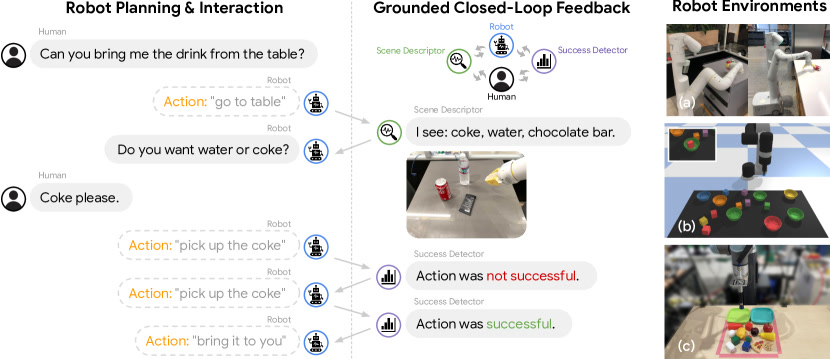
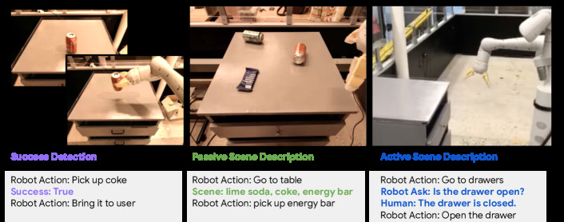
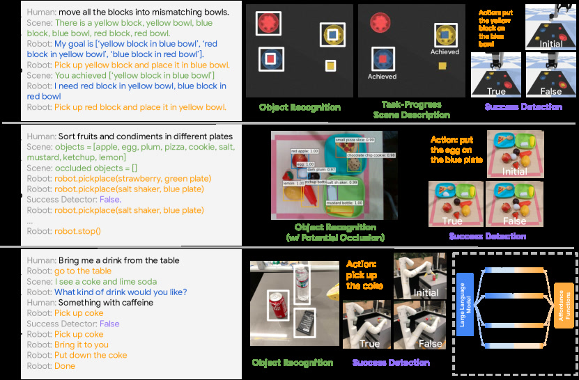

# Inner Monologue: Embodied Reasoning through Planning with Language Models

> 这是给"完全没碰过 AI / 机器人"的读者写的版本。专业词第一次出现都会用一两句话讲清，并尽量用日常生活打比方。

## 一句话讲什么（TL;DR）

让机器人边干活边在心里念叨：看到啥、做成没、人改主意没，全翻成文字塞回 AI，它就能边做边改计划。

*所以这一节是想说：这篇论文给机器人装了一个"内心独白"，让它一边做一边想下一步。*

---

## 这是个什么场景

周末你在家做番茄炒蛋，突然发现冰箱里没鸡蛋了，你会怎么办？

正常人会这样：

1. 打开冰箱看一眼——"诶，鸡蛋没了。"
2. 喊一声："老妈，咱家还有蛋吗？"
3. 老妈说："你爸刚拿去煮面了。"
4. 你心想："那不能炒蛋了，要不改做番茄汤？"
5. 顺手拿个锅，重新开始。

注意这个过程：你**一边看一边想一边问一边改**。看到→想→改主意→再看，这是人干活的常态。

可在 2022 年，让 AI 帮机器人"列计划"的主流做法，更像那种死板的菜谱卡：

- 开做之前一次性列好 1-2-3-4 步。
- 然后闭着眼睛照单子往下做。
- 中途打翻了油、火关了、家人喊"别炒了改煮汤"——它一律听不见，继续按老单子炒。

Inner Monologue 想干的事，就是把机器人从"照菜谱卡硬执行"变成那个会**抬头看冰箱、会喊话、会改主意**的下厨人。

*所以这一节是想说：让机器人从"开局列计划，闭眼往前冲"变成"走一步看一步、随时改主意"。*

---

## 之前的人怎么做的，为什么不够好

- **方案 A：传统任务规划（TAMP）**
  类比：每天上班前在纸上写好一份精确到分钟的行程表，路上堵车也不改。**写得很细但完全不抗意外**——一旦真实世界稍微偏一点，整个计划就报废。

- **方案 B：分层强化学习（HRL）**
  类比：上面是经理，下面是工人，经理只发"高层指令"，工人自己想办法。**问题**：经理不会说话也不会读说明书，新任务来了完全不会扩展。

- **方案 C：直接让 LLM 列计划（Huang et al. 2022）**
  类比：你给一个超博学但从没去过你家的朋友打电话，让他口述"怎么做番茄炒蛋"。他会给你一份完美单子——但说完就挂电话了，**之后你切到手、煤气没气、鸡蛋摔了，他都不知道**。

- **方案 D：SayCan**
  类比：博学朋友 + 会做饭的厨师组队。朋友每说一步，厨师都自评"我会不会做这步"，两人投票选最该做的。**进步**：知道自己会不会。**短板**：但厨师不会**回头告诉朋友**"我刚才那步翻车了"，朋友还是闭眼按原计划往下报。

- **共同的核心问题**：LLM 是**单向的**——只发指令不收反馈。机器人的世界本质上随机会失败、人会改主意，**没有反馈环路 = 闭着眼睛干活**。

*所以这一节是想说：之前的方法要么不抗意外，要么就算自评也只是单向输出，从没真正闭环。*

---

## 这篇论文的新想法

**把环境里发生的所有事都翻译成文字塞回 LLM 的提示词里，让 LLM 边读边接着写下一步——形成一个像"内心独白"的连续段落。**

不需要重新训练、不需要新模型、不需要复杂工程，**就是一直把新发生的事拼到 prompt 后面**。

用一句话归纳核心贡献：**第一次系统性地提出并验证"用自然语言做环境反馈环路"是一种独立的设计维度**。之前所有工作（SayCan、Zero-Shot Planner）都是开环的——LLM 只发指令，不收环境回信。Inner Monologue 补上了这条回路，让 LLM 同时扮演"规划者"和"反思者"。

*所以这一节是想说：核心创新就是"什么都用文字塞回去"——简单得令人发指，但没人这样做过。*

---

## 它分几步做的（方法）

<!-- paper-figures:begin -->



*上图说明：Figure 1（ar5iv 原图）（论文原图）。*



*上图说明：Figure 2（ar5iv 原图）（论文原图）。*



*上图说明：Figure 3（ar5iv 原图）（论文原图）。*
<!-- paper-figures:end -->

整个系统的骨架可以拆成五个层次：问题定义、反馈分类学、信息拼接机制、思维链增强、以及三套异构实现。下面逐层展开。

### 层次一：问题定义——机器人规划的"接地难题"

> **接地问题（Grounding Problem）**：LLM 的知识悬在空中（它知道"该做什么"），但不知道当前世界长什么样、机器人能不能做到、前一步成功没有。把知识"落地"到具体物理环境的过程就叫接地。

在 Inner Monologue 的问题设定中，你有三样东西：

1. **一条自然语言指令 i**——比如"把饮料拿给我"。
2. **一组预训练的低层技能库 Π = {π₁, π₂, ...}**——每个技能做一件短时间的事（抓、放、走到），并且有一段文字描述 ℓₖ（比如 "pick up the coke"）。
3. **一个 LLM 规划器**——它看到 prompt 后输出下一个技能的文字描述，由系统去技能库里匹配执行。

传统做法（Huang et al. 2022, SayCan）的流程是：

```
用户指令 → LLM 一次性生成 Step 1, 2, 3, ... → 逐步执行 → 结束
```

问题在于：执行过程中世界会变（物体被撞掉了、人改了指令、抓取失败了），但 LLM **看不到这些变化**。Inner Monologue 在这个流程里插了一根"回路管道"：

```
用户指令 → LLM 写 Step 1 → 执行 → 收集反馈 o₁ → 反馈拼回 prompt → LLM 写 Step 2 → ...
```

用公式写就是：在时间步 t，LLM 看到的 prompt = [指令 i, 历史动作 a₁...aₜ₋₁, 历史反馈 o₁...oₜ₋₁]，然后预测 aₜ。这就是所谓的"内心独白"——一段越来越长的自言自语。

**生活类比**：就像你在考试时，答完一题后回头检查答案，发现"第三步算错了"，于是修正后面的步骤。LLM 在这里也是一样：做一步、看结果、调下一步。

**形式化表达**：

用数学语言写出来就是——在时间步 t，LLM 的输入是：

```
prompt_t = [示范例子] + [指令 i] + [a₁, o₁, a₂, o₂, ..., aₜ₋₁, oₜ₋₁]
```

其中 aₖ 是第 k 步的动作文本，oₖ 是第 k 步之后收到的反馈文本。LLM 的输出 aₜ = LLM(prompt_t) 就是下一步动作。

> 用日常话说：这段"接龙文字"越来越长，每一行新内容都包含了"我刚才做了什么"和"世界回了我什么"。LLM 看着整段历史，自然会写出"那下一步应该做什么"。

**与 SayCan 的数学关系**：

SayCan 的公式是 a* = argmax [P_LLM(a|i, history) x P_affordance(a|state)]。Inner Monologue 并没有去掉这个公式——在厨房实验中它**保留了 affordance grounding**。它做的是：把 history 从"假设每步都成功的理想历史"替换成"包含真实反馈的真实历史"。换句话说，Inner Monologue 改的不是决策公式本身，而是**公式的输入质量**。

*所以这一小节是想说：问题的本质是把开环规划变成闭环规划，方法就是在每一步之间插入一段反馈文本。*

---

### 层次二：反馈分类学——三种"嘴"各说各话

**一句类比**：就像打游戏时屏幕上的三种提示——结算画面、小地图、NPC 对话框，每种说的话不一样。

论文把所有可以塞回 LLM 的反馈分成三大类：

**第一类：Success Detection（成功检测）——"这步做成了没？"**

> **成功检测器（Success Detector）**：一个小模型或简单规则，看一眼当前状态，输出 True（做成了）或 False（没做成）。

实现方式随环境不同：

- **仿真环境**：直接读仿真器的 ground-truth 状态（物体坐标有没有到位）——相当于"上帝视角判定"。
- **真实桌面环境**：用 MDETR（一个开放词汇的物体检测模型）的 bounding box 变化来做启发式判断——如果物体位置发生了预期变化，就算成功。
- **真实厨房环境**：训练一个视觉分类模型，输入动作前后的图片对，输出成功/失败的概率。

成功检测被翻译成一行文字塞回 prompt：`Success: True` 或 `Success: False`。

**第二类：Passive Scene Description（被动场景描述）——"周围有什么？"**

> **被动场景描述**：每走一步，系统**自动**把当前看到的东西告诉 LLM，无需 LLM 主动询问。

具体形式：

- **Object feedback（物体列表）**：用物体识别模型列出"现在看到哪些物体"。例如：`Scene: I see coke, water, chocolate bar.`
- **Scene feedback（任务进度描述）**：不只列物体，还说明"目前已完成了哪些子目标"。例如：`Scene: Completed ['Yellow block is in blue bowl.']`

被动场景描述的核心价值是让 LLM **知道世界变了**——比如有人趁机器人不注意把可乐移走了，下次 Object feedback 里就不再出现 coke，LLM 会知道"诶，可乐不见了"。

**第三类：Active Scene Description（主动场景查询）——"我自己问一句"**

> **主动查询**：LLM 在规划过程中**自己生成一个问题**，由人或 VQA 模型回答，答案再塞回 prompt。

实现方式：LLM 输出一行 `Robot Ask: Is the drawer open?`，系统检测到这是一个问题格式，于是把问题转发给人（或 VQA 模型），得到回答 `Human: The drawer is closed.`，然后把问答对一起追加到 prompt 里。

**三类反馈的对比**：

| 反馈类型 | 触发方式 | 信息粒度 | 生活类比 |
|---------|---------|---------|---------|
| Success Detection | 每步自动 | 二值（是/否） | 考试后看"对/错" |
| Passive Scene | 每步自动 | 结构化列表 | 小地图自动刷新 |
| Active Scene | LLM 主动发问 | 非结构化自然语言 | 举手问老师 |

**为什么要分三类？** 因为论文的核心实验逻辑就是做 ablation（消融实验）——依次加上不同类型的反馈，看哪种最值钱、哪种组合最强。分类越清晰，对照实验越可控。

> **消融实验（Ablation Study）**：像外科手术一样，一次"切掉"系统中的一个组件，看性能变化多少，从而判断该组件的价值。Inner Monologue 的消融逻辑是：先只给 Object → 再加 Success → 再加 Scene，逐层叠加看涨幅。

**三类反馈之间的信息互补关系**：

为什么三类反馈组合效果大于各自之和？因为它们覆盖了不同的"信息盲区"：

- 只有 Object 时：LLM 知道"世界里有什么"，但不知道"我刚才的动作成功了没"——可能白忙一场不自知。
- 加上 Success 后：LLM 知道"这步翻车了"，可以重试——但如果连续失败是因为目标物体已经不在了（被人拿走），它还是不知道为什么失败。
- 再加上 Scene 后：LLM 知道"当前整体进度到哪了"——哪些子目标完成了、哪些还没有。这让它在多步骤任务中不会"迷路"。

这三层信息构成了一个递进的"认知层次"：物体感知（what）→ 动作结果（did it work）→ 全局进度（where am I）。

*所以这一小节是想说：先把"机器人能拿到的反馈"分成三类，剩下的工作就是让 LLM 同时读懂这三种。*

---

### 层次三：信息拼接机制——"所有人都说普通话"

**一句类比**：跨国会议上有人讲粤语、有人讲四川话、有人写邮件——老板拍板：一律翻成普通话写到白板上排队，谁都看得懂。

Inner Monologue 的"白板"就是 LLM 的 prompt。所有视觉模型、所有传感器、所有人类输入，**全部翻成一句英文**，按时间顺序拼进去。

每走一步，prompt 末尾追加的格式长这样：

```
Robot Action: pick up the coke
Success: False
Robot Action: pick up the coke
Success: True
Scene: I see coke in the gripper
Robot Action: bring it to user
```

LLM 看到这个越来越长的段落，自然会接着续写下一行 `Robot Action: ...`——这就是它在预训练时学过的"文字接龙"能力。

> **prompt（提示词）**：你给 LLM 看的那一段输入。LLM 是个"文字接龙引擎"，它的任务永远是预测"下一段最合理的文字"。
>
> **few-shot prompting（少样本提示）**：在 prompt 开头放 2-3 个示范例子，LLM 看到例子就照葫芦画瓢。Inner Monologue 全靠这个实现规划，没微调任何模型。

**关键设计决策**：

1. **不搞多模态融合架构**——不把图片向量和文字向量在 transformer 内部拼接（那是后来 PaLM-E 干的事）。
2. **不训新模型**——所有 LLM 都是预训练原版（PaLM、InstructGPT），所有视觉模型也是现成的。
3. **信息走同一根管道**——不管是成功检测器的 True/False、物体识别模型的列表、还是人类的自然语言回答，全部先翻译成英文字符串，再按时间顺序拼入 prompt。

这个设计为什么聪明？因为它把"如何让 LLM 理解多模态反馈"这个难题**完全转嫁给了自然语言的通用性**——LLM 本来就最擅长读连续段落、续写下一句，把机器人状态翻成段落是让 AI 干它最擅长的事。

换 LLM（从 InstructGPT 换成 PaLM）、换机器人（从 UR5e 换成 Everyday Robots）、换任务（从桌面摆放换成厨房取物）——prompt 格式微调一下就行，核心逻辑完全不变。

**实际代码的极简骨架**：

如果你要用 Python 实现 Inner Monologue 的核心循环，伪代码大约长这样：

```python
prompt = few_shot_examples + f"Human: {instruction}\n"
while not done:
    action = llm.generate(prompt)          # LLM 续写下一步
    execute(action)                         # 机器人执行
    success = success_detector()            # 成功了吗？
    scene = scene_descriptor()              # 现在周围有什么？
    prompt += f"Robot Action: {action}\n"
    prompt += f"Success: {success}\n"
    prompt += f"Scene: {scene}\n"
    if action == "done":
        done = True
```

整个系统的"算法复杂度"就是一个 while 循环加字符串拼接。没有梯度下降、没有反向传播、没有训练循环。这也是 Inner Monologue 的最大魅力之一——**工程实现极其轻量**，核心逻辑不到 20 行。

*所以这一小节是想说：只要把世界全部翻译成英文塞进同一段 prompt，LLM 自然会接龙规划下一步。*

---

### 层次四：思维链增强——让 LLM "想出声"

**一句类比**：考试时老师让你"写出解题过程"，你的正确率立刻上去——人想清楚了再下笔，AI 也一样。

> **Chain of Thought（思维链，CoT）**：让模型在给答案前先把推理步骤写出来。Wei et al. 2022 提出，证明这能让 LLM 在数学/推理题上准确率显著提升。

在仿真桌面任务中，prompt 里特意鼓励 LLM 写出 `Robot thought: ...` 这一行：

```
Robot action: Pick the red block and place it in the purple bowl.
Scene: Completed ['Red block is in purple bowl.']
Robot thought: One more block is needed to be inside the purple bowl.
Robot action: Pick the purple block and place it in the purple bowl.
Scene: The purple block is too heavy to be picked up. What's your new plan?
Robot thought: I need to find a lighter block.
Robot action: Pick the blue block and place it in the purple bowl.
```

**为什么 CoT 在这里特别有用？**

在"Object + Scene"反馈组合中，LLM 需要同时追踪"哪些子目标完成了、哪些没完成"。如果不写思考步骤，LLM 容易在多个物体之间搞混。加上 `Robot thought`，相当于给 LLM 一个"草稿纸"，让它先复盘再决策。

论文发现，加了 CoT 之后，LLM **涌现出一堆没在 prompt 里教过的能力**：

> **涌现能力（Emergent Capabilities）**：模型表现出 prompt 里没显式示范过的行为。

具体涌现了 5 种：

1. **多语言交互**：用中文给指令，LLM 自动翻译成英文目标继续执行。
2. **自提目标**：原计划被堵死（紫色块太重），LLM 自己提出"找个轻的"。
3. **交互式场景理解**：任务结束后人问"碗里有什么？"，LLM 能根据历史反馈准确回答。
4. **对反馈顺序鲁棒**：打乱 feedback 的出现顺序，LLM 照样能正确规划。
5. **对拼写错误鲁棒**：人类指令里有 typo，LLM 照样理解意图。

*所以这一小节是想说：让 LLM 写出来"我在想什么"，不仅规划更稳，还冒出一堆没教过的本事。*

---

### 层次五：三套异构实现——同一骨架三种皮肤

论文没有只做一个环境然后宣布胜利。它**刻意**在三个完全不同的环境中实现了 Inner Monologue，用不同的 LLM、不同的反馈源、不同的底层策略——证明这个框架是通用的。

**实现 A：仿真桌面摆放（Simulation Tabletop Rearrangement）**

| 组件 | 具体选择 |
|------|---------|
| LLM | InstructGPT (GPT-3 指令微调版) |
| 低层策略 | CLIPort-like 视觉抓放 primitive |
| Object 反馈 | 脚本读仿真器状态 |
| Success 反馈 | 脚本读仿真器状态（oracle） |
| Scene 反馈 | 脚本生成任务进度描述 |
| 任务类型 | 8 种：4 seen + 4 unseen，如"把方块放到颜色匹配/不匹配的碗里" |
| 噪声 | 测试时给像素观测加 N(0,3)、给策略 heatmap 加 N(0,2.5)、给放置位置加 N(0,0.02m) |

关键设计：这里用了 **oracle scene descriptor**（脚本直接读真实状态），所以可以干净地测试"反馈对 LLM 规划有多大帮助"，排除"感知模型不准"的干扰。

**实现 B：真实桌面摆放（Real-World Tabletop Rearrangement）**

| 组件 | 具体选择 |
|------|---------|
| LLM | InstructGPT |
| 低层策略 | 零训练的吸盘式抓放（用 MDETR 定位物体中心，直接去抓） |
| Object 反馈 | MDETR 开放词汇物体检测（列出可见物体 + 刚消失的物体） |
| Success 反馈 | MDETR bounding box 变化的启发式规则 |
| 机器人 | UR5e 机械臂 + Intel RealSense RGB-D 腕部相机 |
| 噪声 | 人为注入策略噪声 σ=4mm |

关键设计：这里**没有 oracle**了——物体识别和成功检测都是真正的模型，会出错。目的是测试"真实感知误差下，闭环反馈还有没有用"。

**实现 C：真实厨房移动操控（Real-World Kitchen Mobile Manipulation）**

| 组件 | 具体选择 |
|------|---------|
| LLM | PaLM-540B |
| 低层策略 | SayCan 预训练的 RL 策略 + affordance grounding |
| Object 反馈 | 人工提供（oracle） |
| Success 反馈 | 训练过的视觉分类模型 |
| Human 反馈 | 人直接用自然语言回复 LLM 的提问 |
| 机器人 | Google Everyday Robots（移动底盘 + 单臂） |
| 对抗测试 | 人为干扰：撞机械臂、把物体移走、挡路 |

关键设计：这里**保留了 SayCan 的 affordance grounding**——LLM 的候选动作仍然要乘以价值函数打分。但在 SayCan 基础上**额外加了 Success + Object 反馈环路**。这样可以公平对比"有反馈 vs 无反馈"。

**三套实现的对比总结**：

| 维度 | 仿真桌面 | 真实桌面 | 真实厨房 |
|------|---------|---------|---------|
| LLM | InstructGPT | InstructGPT | PaLM-540B |
| 反馈来源 | 脚本/oracle | 学习模型 | 学习模型 + 人 |
| affordance grounding | 无 | 无 | 有（SayCan） |
| 主要测试什么 | 反馈类型的价值 | 真实感知下的鲁棒性 | 长周期 + 对抗干扰 |

**为什么要这样做？**

刻意让三套实现在 LLM 型号、反馈方式、底层策略上全部不同，是为了证明 Inner Monologue 是一个**与具体实现无关的通用框架**。如果只在一个环境里做，别人可以说"这只对 InstructGPT 有效"或"只对桌面任务有效"。三套异构实现堵住了这类质疑。

*所以这一小节是想说：三个实验刻意用不同 LLM + 不同反馈 + 不同机器人，证明"内心独白"是通用框架而非特定实现。*

---

### 层次五·补：完整系统的运行流程（以厨房场景为例）

把上面五层组装起来，一次完整的 Inner Monologue 执行长这样（简化版）：

```
[Prompt 开头：few-shot 示范 + 用户指令]
Human: Bring me a drink from the table.

[Step 1: LLM 生成动作]
Robot Action: go to the table

[Step 1 反馈：Object]
Scene: I see coke, lime soda, chocolate bar.

[Step 2: LLM 生成问题（Active Scene）]
Robot Ask: What kind of drink would you like?
Human: Something with caffeine.

[Step 3: LLM 生成动作]
Robot Action: pick up the coke

[Step 3 反馈：Success]
Success: False

[Step 4: LLM 生成动作（重试）]
Robot Action: pick up the coke

[Step 4 反馈：Success]
Success: True

[Step 5: LLM 生成动作]
Robot Action: bring it to you

[Step 5 反馈：Success]
Success: True

[Step 6: LLM 终止]
Robot Action: done.
```

注意这里发生了什么：

- Step 1 之后 LLM **看到了物体列表**，才知道有 coke 和 lime soda。
- Step 2 LLM **主动问人**想要什么——这不是 prompt 里硬编码的行为，而是 LLM 自己判断"信息不足"时涌现出的。
- Step 3 失败了（Success: False），LLM **看到了失败**，于是 Step 4 **重试同一动作**。
- 如果连续失败多次，LLM 可能会切换策略（比如换一个动作），这也是涌现行为。

整个过程中 LLM 的权重**一个也没变**——它只是在不停地做"看 prompt → 续写下一行"这件事。所有的"智能"来自 prompt 越拼越长、信息越来越全。

*所以这一小节是想说：整个系统的运行就是"执行 → 收反馈 → 拼回 prompt → 续写"的循环，简单到只有一个 while 循环。*

---

## 关键数字（What works）

数字本身不重要，重要的是它们告诉你**哪一种反馈最值钱**。

### 表 1：仿真桌面任务

| 方法 | Seen 任务平均 | Unseen "mismatched bowls" | Unseen 平均 |
|------|-------------|--------------------------|-------------|
| CLIPort + oracle termination | ~15% | 0% | 0% |
| LLM + Object (开环) | ~58% | 62% | ~35% |
| Inner Monologue: Object + Success | ~61% | 76% | ~43% |
| Inner Monologue: Object + Scene | **~68%** | **86%** | **~50%** |

- **CLIPort 是 0%**：因为它从未在"颜色错配"任务上训练过，完全泛化不了。
- **LLM + Object 已经很强**：光靠"告诉 LLM 有哪些物体"，就能在未见任务上做到 62%。这是 LLM 泛化能力的体现。
- **加 Success 再涨**：从 62% 到 76%——知道"上一步翻车了"能让 LLM 重试。
- **加 Scene 最强**：从 76% 到 86%——知道"目前进度到哪了"比只知道"成没成"更有用。

### 表 2：真实桌面任务

| 方法 | 3-block stacking | Sort fruits | 总计 |
|------|-----------------|------------|------|
| LLM Object (开环/一次) | 20% | 20% | 20% |
| Inner Monologue: Object (闭环) | 40% | 50% | 45% |
| Inner Monologue: Success (只) | 40% | 40% | 40% |
| Inner Monologue: Object + Success | **100%** | **80%** | **90%** |

- **20% → 90%（4.5 倍）**：最便宜的升级——只加"成功检测"和"闭环物体列表"。
- **Object 和 Success 互补**：单独加 Object 解决的是"漏看被遮挡物体"的问题；单独加 Success 解决的是"动作失败不重试"的问题。两者加在一起 = 几乎完美。

### 表 3：真实厨房（对抗干扰 vs 无干扰）

| 方法 | 无干扰总计 | 有干扰总计 | 全部 120 次 |
|------|-----------|-----------|------------|
| SayCan (开环) | 61.1% | 4.2% | 30.8% |
| IM: Success | 65.3% | 31.5% | 48.7% |
| IM: Object + Success | **83.3%** | **50.9%** | **60.4%** |

- **SayCan 在干扰下 → 接近 0%**：因为它不知道动作失败了，继续按原计划往下走。
- **Inner Monologue 在干扰下 → 50.9%**：知道失败了可以重试或换计划。
- **总计 30.8% → 60.4%，几乎翻倍**。

### 关键数字 4：零训练零微调

所有 LLM（PaLM-540B、InstructGPT）都是预训练原版，没改一行权重。所有实验的"代码"本质上就是写 prompt + 拼字符串 + 调 API。传统机器人方法动辄需要数万 GPU 小时训练，Inner Monologue 把"具身 AI 实验"门槛压低到**只要会写 prompt**。

### 关键数字 5：涌现 5 种 prompt 没教过的能力

作者列出了 5 种 prompt 没显式示范的行为：多语言交互（中文）、自提目标、交互式场景理解、对反馈顺序鲁棒、对拼写错误鲁棒。这些都是在"想出声"过程中自然涌现的。

*所以这一节是想说：数据告诉我们"加反馈环路 = 翻倍以上的鲁棒性"，且最便宜的成功检测就能带来巨大涨幅。*

---

## 实验结果说明了什么

从三张表里可以提炼出四条 take-away：

**1. 反馈的价值是"超线性"的**——加第一种反馈（Object）涨一截，加第二种（Success）再涨一截，两种一起的效果远大于各自之和。这说明不同类型的反馈在解决不同类型的失败：Object 解决"世界变了我不知道"，Success 解决"动作失败了我不知道"。

**2. Scene > Success > Object 在信息密度排序上**——但 Scene 的获取成本也最高（需要 oracle 或强视觉模型）。最"性价比"高的升级是加 Success Detection（一个二值分类器就够）。

**3. 开环方案在"正常条件"下还行，一加干扰就崩**——SayCan 在无干扰时 61% 并不差，但一旦有人捣乱就暴跌到 4%。这揭示了一个深层事实：**开环系统的评测数字可能虚高**，因为实验室条件太理想了。

**4. 框架比模型重要**——从 InstructGPT 换到 PaLM，prompt 微调一下就能跑。这暗示了后续所有 LLM agent 工作的一个共同特征：**框架设计（如何组织信息流）比底层模型选择更决定性能上限**。

*所以这一节是想说：实验的核心发现是"闭环 > 开环"这件事在所有条件下都成立，且反馈越丰富效果越好。*

---

## 你应该懂的几个新词

> **Embodied AI（具身 AI）**：让 AI 不只是聊天，而是有"身体"——能看、能动、能影响物理世界。机器人是其中一种典型形态。

> **LLM（Large Language Model，大语言模型）**：一个超大的"文字接龙机器"。GPT-3、PaLM 都是。它的本职工作就是看一段文字预测下一段。

> **Inner Monologue（内心独白）**：本文的核心抽象。把环境反馈、人类指令、动作记录全部翻成文字塞进 LLM 的 prompt，让规划过程像一段连续的"自言自语"。

> **Closed-loop / Open-loop（闭环 / 开环）**：闭环 = 边做边收反馈再决策；开环 = 一次发完指令不管。Inner Monologue 是闭环；之前的 LLM-as-planner 是开环。

> **Affordance（可供性）**：一个动作"在当前情况下做不做得到"的概率。SayCan 用价值函数估它。可以理解成机器人对自己的能力自评。

> **Success Detector（成功检测器）**：看一眼图（或读状态）判断"这一步动作做成了没"的小模型。Inner Monologue 把它的输出翻成 True/False 字符串塞回 prompt。

> **Scene Description（场景描述）**：把当前看到的东西用一句话说出来。比如"我看到可乐、水、巧克力棒"。

> **Visual Question Answering（VQA，视觉问答）**：给图 + 问题，模型回答。这里 LLM 主动反问时由 VQA（或人）回答。

> **Few-shot Prompting（少样本提示）**：在 prompt 开头放几个例子，LLM 模仿例子的格式。Inner Monologue **完全靠这个**实现规划，没微调任何模型。

> **Chain of Thought（思维链，CoT）**：让 LLM 写出"我在想什么"的中间步骤，能显著提升推理任务表现。论文在桌面任务里直接复用了这个套路（`Robot thought: ...`）。

> **Emergent Capabilities（涌现能力）**：模型表现出 prompt 里没显式教过的行为。Inner Monologue 涌现了多语言交互、自定目标、跨指令切换等 5 种能力。

> **Grounding（接地）**：把 LLM 的抽象知识"落地"到具体物理环境的过程。包括环境接地（世界长什么样）、能力接地（机器人能做什么）、状态接地（当前进行到哪一步了）。

*所以这一节是想说：上面这些词以后看具身 AI / LLM agent 论文都会反复出现，先把它们和生活类比挂钩。*

---

## 它有什么搞不定的

1. **场景描述依赖 oracle**：仿真和厨房实验中，scene description 是用脚本或人工提供的"上帝视角"。换到完全自动的视觉模型上，准确率会显著下降。论文在附录中做了初步测试（Table 5），用学习型 scene descriptor 替换 oracle 后性能确实跌。这意味着 Inner Monologue 的上限被感知模型的可靠性卡住了。

2. **被低层策略的能力天花板卡死**：哪怕 LLM 推理再聪明，下面的抓取策略不会拧瓶盖，整套系统也拧不开瓶盖。Inner Monologue **不能凭空提升机械臂的物理能力**——它只能更聪明地调度已有技能。如果技能库里没有对应的 primitive，LLM 规划出来的步骤根本无法执行。

3. **LLM 偶尔"硬刚"反馈（幻觉问题）**：作者发现有时 LLM "无视"反馈——明明 scene 里没有某物体，它还是要去抓。这是 LLM 的通病（幻觉），在具身场景下后果更严重：不是输出一段错文字，而是机器人撞到不存在的物体。

4. **没有不确定性建模**：所有反馈都被"硬翻译"成肯定句（`Success: True` 或 `Success: False`），LLM 看不到"这个检测器对自己只有 60% 把握"。如果成功检测器给了一个 False Positive（实际没成功但说成功了），LLM 会在错误的状态上继续规划，越走越偏。论文把"让反馈带置信度"留作 future work。

5. **Prompt 长度限制**：随着任务变长，prompt 会无限增长，最终超过 LLM 的 context window。论文没有讨论这个问题（2022 年的 context window 只有 2048-4096 tokens），但在更长的任务中这会成为瓶颈。

6. **无法处理并行动作**：Inner Monologue 是严格串行的——做一步、等反馈、再做一步。真实世界中很多任务需要同时做多件事（比如一只手拿碗、另一只手搅拌），这种并行性在当前框架里无法表达。

*所以这一节是想说：天花板有三层——感知模型的可靠性、低层动作策略的能力、以及 LLM 本身的幻觉倾向，三者中任何一个都能成为瓶颈。*

---

## 它和别的几篇是什么关系

- **直接前作：SayCan（2022.4）**
  SayCan 解决"LLM 不知道自己会不会做"的问题，加了 affordance 自评。但**仍然是开环**——动作做完了不告诉 LLM 结果。Inner Monologue 建立在 SayCan 之上，**补上了反馈环路**。本仓库 [saycan.md](saycan.md) 就是直接前作。

- **方法论前辈：Chain of Thought（2022.1）**
  Wei et al. 证明"让 LLM 写出思考步骤"能提升推理能力。Inner Monologue 在桌面任务中直接复用了 `Robot thought: ...` 的格式。CoT 是 Inner Monologue 的"软件工具"之一。

- **方法论亲戚：LLaVA（2023）**
  LLaVA 是"让 LLM 长眼睛"，把视觉编码塞进 LLM 架构内部。Inner Monologue 走的是另一条路：**不动 LLM 架构，把视觉信息全部翻成英文塞 prompt**。两条路最后都通向"多模态智能"，但 Inner Monologue 的路更轻量、零训练。详见 [llava.md](llava.md)。

- **直接后继：ReAct（2022.10）**
  "Reasoning + Acting"——把 Inner Monologue 的闭环思路推到纯文字 agent（搜索引擎 + API 调用）。骨架完全一样：Thought → Action → Observation → Thought → ...。Inner Monologue 早 3 个月，但 ReAct 在 NLP 圈传播更广。

- **后继应用：Voyager（2023.5）**
  Minecraft 里的 LLM agent，骨架就是 Inner Monologue + 代码生成。能直观看到"内心独白"在游戏里跑起来什么样。

- **后继：PaLM-E（2023.3）**
  同一批作者做的下一步工作——不再"翻译成文字"了，直接把视觉 token 和文字 token 一起塞进同一个 transformer。Inner Monologue 证明了"语言做桥梁"可行后，PaLM-E 进一步问"如果不用翻译呢？"

- **后继家族：OpenVLA / VLA**
  到 2024 年，业界把 LLM + 视觉 + 动作**全部塞进一个端到端模型**（Vision-Language-Action）。Inner Monologue 是这条路的"前身"——它证明了**用语言做所有桥梁是可行的**，但还没把动作输出也塞进 LLM。详见 [openvla.md](openvla.md)、[vlas.md](vlas.md)。

- **集合关系**：你可以把"用 LLM 控制机器人"想成一棵进化树。Inner Monologue 是树干上的关键分叉——之前所有方案都开环，从它开始**所有人都做闭环**。

- **因果链**：
  - CoT（2022.1）+ SayCan（2022.4）→ **Inner Monologue（2022.7）**：把"会想"和"会做"合起来
  - Inner Monologue → **ReAct（2022.10）**：同一思路到纯文字 agent
  - Inner Monologue → **Voyager（2023.5）**：同一思路到游戏
  - Inner Monologue → **PaLM-E（2023.3）**：从"翻译成文字"进化到"原生多模态"

*所以这一节是想说：Inner Monologue 是"LLM 控机器人"从开环跨到闭环的分水岭，后面的 LLM agent 都长得像它。*

---

## 和本导读的关系

本笔记对应导读 **Ch10: 高层规划——SayCan / Code-as-Policies / Inner Monologue**。

在 Ch10 的框架中，Inner Monologue 的定位是：

- **它解决了 SayCan 的什么问题？** SayCan 只有"能力接地"（affordance 打分），但没有"状态接地"（不知道上一步成没成）。Inner Monologue 在 SayCan 基础上补了状态接地。
- **它和 Code-as-Policies 什么关系？** 两者攻克不同维度——Code-as-Policies 追求灵活性（写代码组合新行为），Inner Monologue 追求鲁棒性（失败了能重试）。它们不互斥，可以组合。
- **它为什么是 Ch11（端到端 VLA）的铺垫？** Inner Monologue 证明了"用语言做一切桥梁"可行，但代价是需要一堆外部感知模型。PaLM-E 和 RT-2 的做法是"既然语言桥梁有效，那不如把视觉也塞进同一个模型里"——从模块化走向端到端。

读完本笔记 + [saycan.md](saycan.md)，你应该能清楚画出：开环（Huang 2022）→ 有 affordance 的开环（SayCan）→ 闭环（Inner Monologue）→ 原生多模态闭环（PaLM-E）这条演进线。

*所以这一节是想说：Inner Monologue 是 Ch10 三篇中"补完 SayCan 最后一块拼图"的那篇，也是通往端到端方案的跳板。*

---

## 思考题

**Q1：如果 Success Detector 总是输出 True（永远说"成功了"），Inner Monologue 会退化成什么？**

<details>
<summary>提示</summary>
想想：如果 LLM 永远看到 "Success: True"，它还会重试吗？它还和 SayCan 有什么区别？—— 它会退化成一个有 Object 反馈但不会重试的开环系统，行为接近"LLM + Object (no retry)"。
</details>

**Q2：为什么论文在三个环境中刻意使用不同的 LLM（InstructGPT vs PaLM）？如果只用一个 LLM 做全部实验，论文的说服力会降低在哪里？**

<details>
<summary>提示</summary>
如果只用一个 LLM，读者可以质疑"也许只有这个特定 LLM 对反馈敏感"。用不同 LLM 证明了框架本身的价值独立于底层模型选择。这是做系统论文（而非模型论文）时的标准策略。
</details>

**Q3：SayCan 的 affordance 打分和 Inner Monologue 的 Success Detection 都在告诉 LLM"能不能做"，它们的区别是什么？**

<details>
<summary>提示</summary>
时态不同！Affordance 是"事前预测"（这步大概率能做到吗？），Success Detection 是"事后检验"（这步刚才做到了吗？）。前者防止尝试不可能的动作，后者让系统知道已尝试的动作失败了。两者互补——SayCan 有前者没后者，Inner Monologue 把两者都有了。
</details>

**Q4：如果你要在自己的项目里用 Inner Monologue 的思路做一个"LLM 控制浏览器自动化"的 agent，三种反馈分别对应什么？**

<details>
<summary>提示</summary>
Success Detection = 检测动作是否生效（比如点击按钮后 URL 有没有变化、表单有没有提交成功）。Passive Scene = 当前页面的 DOM 结构或截图描述（自动提供）。Active Scene = LLM 主动提问"这个下拉菜单有几个选项？"然后由视觉模型或 DOM 解析器回答。
</details>

**Q5：论文说 Inner Monologue 涌现出了"多语言能力"——LLM 收到中文指令后自动翻译成英文目标。但这真的是"涌现"吗？有没有更简单的解释？**

<details>
<summary>提示</summary>
可以争论：PaLM/InstructGPT 本来就在多语言文本上训练过，翻译是它们的"已有能力"。但"涌现"在这里的含义是：prompt 里没有任何中文示例，也没有"收到非英文指令时先翻译"的显式指示——LLM 自己决定了这样做。所以它是"在此特定上下文中首次被激活的已有能力"，而非"从零学会一个新技能"。
</details>

**Q6：假设 prompt 长度无限，Inner Monologue 在理论上有没有做不了的任务？它的根本瓶颈是什么？**

<details>
<summary>提示</summary>
根本瓶颈有两个：(1) 技能库的覆盖范围——如果没有对应的低层 primitive，再聪明的规划也执行不了。(2) 感知模型的准确度——如果 Success Detector 或 Scene Descriptor 持续给错误信息，LLM 会在幻觉世界里规划。框架本身不能超越这两个外部限制。
</details>

**Q7：Inner Monologue 和 ReAct 的核心循环都是 Thought → Action → Observation。如果你只能改一个设计让 Inner Monologue 比 ReAct 更强，你会改什么？为什么？**

<details>
<summary>提示</summary>
Inner Monologue 比 ReAct 多一个维度：它的 Observation 来自**物理世界**（有延迟、有噪声、有随机失败），而 ReAct 的 Observation 来自搜索引擎（确定性高、无延迟）。所以最值得改的是"给 Observation 加置信度"——告诉 LLM "这个检测器 70% 确信成功了"，让 LLM 在不确定时选择主动查询或多试一次。这正是论文留作 future work 的方向。
</details>

*所以这一节是想说：能回答这些问题说明你真正理解了"闭环反馈"对 LLM 规划的价值，以及它的边界在哪里。*

---

## 一些好奇心问答（FAQ）

**Q1：这篇有 train 模型吗？**

完全没有。所有 LLM（PaLM、InstructGPT）都是预训练原版，所有视觉模型也是现成的。整篇论文的"代码"基本就是**写 prompt + 把信息拼进 prompt + 调 API**。这也是它影响力大的关键——门槛极低。

**Q2：那为什么能发 CoRL 这么好的会议？**

因为它**第一次明确提出"用语言做反馈环路"是一个独立的研究问题**，并系统性地拆出三种反馈、三个机器人环境、对照实验。后来所有 LLM agent 论文都默认这是一个独立的设计维度。定义问题本身比解决问题更难——这篇论文定义了"闭环 LLM 规划"这个问题。

**Q3：Inner Monologue 和 ReAct 啥关系？**

ReAct（2022.10）几乎是 Inner Monologue 的"无身体版"：把"环境反馈"换成"搜索引擎结果"，把"动作"换成"调 API"。骨架完全一样。Inner Monologue 早 3 个月，但因为 ReAct 在 NLP 圈火得更快，很多人误以为是 ReAct 先做的。

**Q4：成功检测器自己也会出错怎么办？**

会，论文承认了：False Negative（明明做对了说没做对）会让机器人无谓重试；False Positive（没做对说做对了）会让 LLM 在错的状态上规划，走得越来越偏。论文没解决这个，只是分析了失败模式。**未来工作之一**就是让反馈带不确定性。

**Q5：为什么仿真和真实机器人用的 LLM 不一样（InstructGPT vs PaLM）？**

作者在三个独立环境里都做了实验，刻意用不同 LLM 证明**方法本身和具体 LLM 无关**。换模型、prompt 微调一下就行。这是论文的鲁棒性证据。

**Q6：能不能让两个 Inner Monologue agent 互相对话？**

论文没做，但理论上可以——两个 LLM 互相把对方的输出当反馈塞进自己的 prompt。后来的 multi-agent 系统（ChatDev、AutoGen）走的就是这条路。

**Q7：中文能直接用吗？**

可以。Figure 5c 展示了 LLM 收到中文指令"请把蓝色方块也放到蓝色的碗里面"后，自动翻译成英文 goal state，再继续规划。这条**没在 prompt 里教**，是涌现能力。

**Q8：能跑在我家机器人上吗？**

如果你有：(1) 一个能调 API 的 LLM（OpenAI / Claude / 本地 Llama 都行）；(2) 一个能识别物体的视觉模型；(3) 一组预训练的低层动作（抓、放、移）。把它们全部翻译成文字接到 prompt 里——就能跑。**核心代码不到 200 行**。

*所以这一节是想说：实操问题（要不要训、能不能换模型、能不能跑中文、能不能在家做）作者基本都想到了，复现门槛很低。*

---

## 如果你想再深入

按"前作 → 同期 → 后继 → 衍生"四类排序：

1. **前作：Huang et al. 2022 "Language Models as Zero-Shot Planners"**（arXiv 2201.07207）— 第一篇用 GPT-3 给机器人列计划的论文。读它能理解 Inner Monologue **多解决了什么**：闭环。
2. **前作：SayCan（arXiv 2204.01691）**— 同一作者团队的直接前身。Inner Monologue 在它上面加了反馈环。本仓库有 [saycan.md](saycan.md) 笔记。
3. **同期：Chain of Thought（arXiv 2201.11903）**— Wei et al. 提出"让 LLM 写思考步骤"。Inner Monologue 在桌面任务里直接复用了这个套路（`Robot thought: ...`）。
4. **后继：ReAct（arXiv 2210.03629）**— "Reasoning + Acting"。把 Inner Monologue 的思路推到纯文字 agent 上。如果你只能读一篇 LLM agent 论文，读这个。
5. **后继：PaLM-E（arXiv 2303.03378）**— 同一批作者的下一步：不再翻译成文字，直接把视觉 token 塞进 LLM。Inner Monologue 的思想继承者。
6. **衍生：Voyager（arXiv 2305.16291）**— Minecraft 里的 LLM agent，骨架就是 Inner Monologue + 代码生成。能直观看到"内心独白"在游戏里跑起来什么样。

*所以这一节是想说：把 SayCan + Inner Monologue + ReAct 这三篇连着读，能看清"LLM agent"这个词在 2022 年怎么从开环走到闭环的。*

---

## 原文信息

```bibtex
@inproceedings{huang2022inner,
  title={Inner Monologue: Embodied Reasoning through Planning with Language Models},
  author={Huang, Wenlong and Xia, Fei and Xiao, Ted and Chan, Harris and Liang, Jacky and Florence, Pete and Zeng, Andy and Tompson, Jonathan and Mordatch, Igor and Chebotar, Yevgen and Sermanet, Pierre and Brown, Noah and Jackson, Tomas and Luu, Linda and Levine, Sergey and Hausman, Karol and Ichter, Brian},
  booktitle={Conference on Robot Learning (CoRL)},
  year={2022}
}
```

- arXiv: [2207.05608](https://arxiv.org/abs/2207.05608)
- 项目主页: [https://innermonologue.github.io](https://innermonologue.github.io)
- 机构: Robotics at Google (现 Google DeepMind)

*所以这一节是想说：需要引用或追溯原文时，上面有完整的 BibTeX 和链接。*
