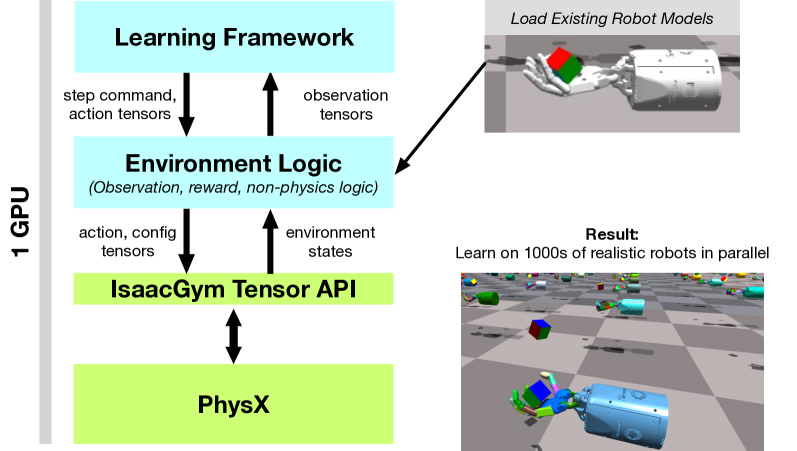
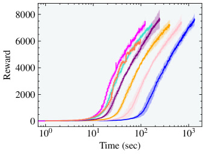
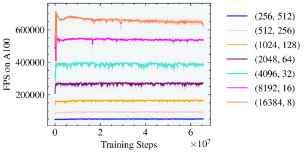

## TL;DR

一句话：把"算物理"和"训神经网络"塞进同一张显卡，机器人学走路从"几千台 CPU 跑一晚"压成"一张卡跑几分钟"。

类比：以前训机器人像切菜、炒菜、装盘分三个房间，端来端去比真做菜还累；Isaac Gym 把厨房合并，菜不动、工具换着上。

效果对照：OpenAI 训魔方机械手用 6144 CPU 核 + 8 张 V100 跑 30 小时；Isaac Gym 用 1 张 A100、1 小时打平——让 PhD 学生本地一张卡就能跑完整套实验。

*所以这一节是想说：Isaac Gym 不是新算法，是把训练流水线整体搬上 GPU 的工程胜利，让机器人 RL 从"集群级实验"变成"单卡级实验"。*

---

## 这是个什么场景

想象你在教小孩骑自行车，但这小孩特别笨——必须摔几百万次才能摸到平衡感。你要是只摆一辆车让他练，等到天荒地老都学不会；所以你得同时摆几千辆，让几千个分身一起摔，再统计哪种动作最不容易摔。这就是机器人强化学习（RL，Reinforcement Learning）干的事。

把"小孩"换成虚拟蚂蚁（Ant）。每一帧（1/60 秒）要走五步：

1. **物理引擎**根据关节角度、地面摩擦、重力，算出蚂蚁下一帧的位置和姿态
2. **观察函数**把关节角度、速度、目标位置打包成向量
3. **神经网络（policy，策略网络）**吃这个向量，吐出 8 个关节力矩
4. **奖励函数**根据它走了多远、有没有摔倒打个分
5. (state, action, reward) 三元组进 buffer，攒够一批就更新网络

要让蚂蚁学得动，得**同时摆 4096 只**一起摔——样本量瞬间 4096 倍。

但传统做法（MuJoCo / PyBullet）把物理放 CPU、神经网络放 GPU，一根 CPU 核管一只蚂蚁，64 核顶天 128 只。OpenAI 当年训魔方机械手用了 **920 台 32 核机器 = 29440 个 CPU 核**跑 30 小时才收敛——这种规模个人和小实验室根本玩不起。

Isaac Gym 的目标就一句：**让单卡 GPU（A100）顶替整个 CPU 集群**。

*所以这一节是想说：机器人 RL 卡在样本量瓶颈，传统 CPU+GPU 异构方案到了几千环境就炸，需要一种新的并行化哲学。*

---

## 之前的人怎么做

历史路径大致分三代：

**第一代：纯 CPU 物理（MuJoCo / PyBullet / DART / V-Rep）**
- 每个环境一个 CPU 线程，同步靠多进程或多线程
- 瓶颈：核数有限，超过 128 环境基本就不动了
- 想堆量必须上集群，OpenAI 魔方就是极致代表

**第二代：GPU 物理 + CPU 接口（Liang et al. 2018，PhysX 早期）**
- 物理 step 跑 GPU，但物理状态要拷回 CPU 算 observation/reward
- action 在 GPU 上由 policy 算出来，又要拷回 CPU 转换成物理引擎的输入
- 每一步都过两次 PCIe 总线，伪并行
- 而且只测了简化场景，没做真实机器人和 sim-to-real

**第三代（同期对手）：Brax（Google，2021）**
- 用 JAX 写一个**完全可微的**物理引擎，全 GPU/TPU 跑
- 优点：differentiable，能直接梯度回传穿物理
- 缺点：物理保真度还在追赶，接触建模简化（不太能撑接触富集任务）

Isaac Gym 选的路线是**第三代的另一支**：不重写物理引擎，而是改造已有的 NVIDIA PhysX——给它加两个新能力：

1. **GPU step 不再每步同步回 CPU**（之前 step 完默认 CPU 能拿到结果）
2. **直接 GPU API**：用户能从 GPU buffer 读状态、写控制量

这样 PhysX 仍然提供工业级保真的接触求解，但接口不再被 CPU 绑死。

*所以这一节是想说：之前要么 CPU 限速、要么 GPU 物理但接口没改造干净；Isaac Gym 是第一个把 NVIDIA 自家成熟物理引擎改造成"全 GPU 数据通路"的方案。*

---

## 新想法

核心 insight 一句话：**数据应该在 GPU 内存里循环，永远不下来。**

类比：你在厨房做菜，传统做法是切菜在 A 桌、炒菜在 B 桌、装盘在 C 桌，每一步都端着盘子走过去，路上时间比真做菜还长。Isaac Gym 是把所有工具都搬到一张操作台上——菜不动，工具切换。

具体做法：

1. **物理状态 = PyTorch tensor**：actor 根状态、DOF 状态、刚体状态、接触力，全部以 PyTorch tensor 形式暴露给 Python（通过 CUDA interoperability 直接 wrap，**零拷贝**）
2. **Observation/reward 用 PyTorch 算**：你不用写 C++/CUDA kernel，直接用 PyTorch 向量化操作，几千个环境同时算
3. **Action 也是 tensor**：policy 输出后直接 view 成 (N_actor, dof) 的 tensor 喂回去，不出 GPU
4. **同代码 CPU/GPU 切换**：开关一个 flag 就能换设备，方便调试

第二个 insight：**所有环境塞同一个 scene**。
CPU 时代要把 1024 个环境拆成 8 个 scene 各 128，因为单 scene 太大同步开销爆炸。GPU 上反过来：要让 SM（streaming multiprocessor）吃饱，就得把所有 actor 塞进一个大 scene，靠 contact filter 防止互相碰撞。

类比：CPU 像一个有 8 张办公桌的小房间，人多了挤；GPU 像一个仓库，越满越好——它有几千个并行计算单元等着干活，环境不够多反而浪费。

*所以这一节是想说：Isaac Gym 的关键不是"GPU 跑物理"这个动作本身（前人做过），而是"数据通路全 GPU 化 + 单 scene 巨型场景"这两条工程哲学。*

---

## 方法分步

<!-- paper-figures:begin -->



*上图说明：Figure 1（ar5iv 原图）（论文原图）。*



*上图说明：Figure 2（ar5iv 原图）（论文原图）。*



*上图说明：Figure 3（ar5iv 原图）（论文原图）。*
<!-- paper-figures:end -->

按训练一次 Ant 的时间轴拆开：

下图是"数据永不下 GPU"的端到端训练闭环（对比传统 CPU-GPU 来回搬运）：

```
【传统方案: 每步两次过 PCIe 总线 (伪并行)】
   PhysX(CPU物理) ─拷─► GPU(policy) ─拷─► CPU(obs/reward) ─...
        └────────── 搬运时间 > 计算时间 ──────────┘

【Isaac Gym: 全链路在 GPU 显存内循环】
   ┌──────────────────── GPU 显存 ─────────────────────┐
   │                                                     │
   │  ①PhysX GPU solver(TGS) ──► 物理状态 buffer         │
   │            ▲                      │ 零拷贝 wrap      │
   │            │                      ▼                  │
   │  ⑤写回 control tensor      ②PyTorch 算 observation  │
   │  set_dof_*_target             (TorchScript JIT)     │
   │            ▲                      │                  │
   │            │                      ▼                  │
   │  ④rl_games PPO 更新 ◄── reward ◄─③policy 前向        │
   │                                                     │
   └─────────────────────────────────────────────────────┘
     全程无 .cpu() / 无 host-device 拷贝
```

*上图说明：物理状态以零拷贝 tensor 暴露给 PyTorch，观测/奖励/策略/回写全在 GPU 显存内闭环，彻底消除传统方案每步两次过 PCIe 的搬运瓶颈。*

### 步骤 0：并行化策略选择（架构决策）
**类比：你要开一千间完全一样的面包店。CPU 方案是给每间店派一个经理，经理人数就是店铺上限；GPU 方案是在一个超级大工厂里摆一千条流水线，只需要一个总调度员。**

在动手搭场景之前，Isaac Gym 做了一个奠基性的架构决策：**单 scene 大并行**。这个决策的背景和推理值得展开。

CPU 并行的标准做法是"一线程一环境"：64 核 CPU 开 64 个线程，每个线程管一个独立的 PhysX scene。这种做法的天花板是物理核数——64 核顶多 128 环境（超线程），再多就要加机器组集群。为了缓解这个问题，CPU 方案可以"多环境塞一个 scene"：把 1024 个环境拆成 8 个 scene、每个 scene 128 个环境，靠 collision filter 隔离。但 CPU 上单线程跑一个大 scene 反而慢（没法利用多核），所以只能用少量中等 scene。

GPU 并行的逻辑完全反转。GPU 的计算单元（SM）数量在几十到一百以上，每个 SM 上有几十个 warp（每个 warp 32 个线程），总共几千到上万个并行线程。但 GPU 的单线程性能很弱——它靠的是**吃满并行度来掩盖单线程延迟**。如果你给 GPU 很多小 scene，每个 scene 的 actor 太少，GPU 的大量 SM 处于空闲状态（occupancy 低）。反过来，把所有 actor 塞进一个巨大的 scene，broadphase（碰撞预筛选）、narrowphase（精确碰撞检测）、constraint solver 的每一步都有几千到几万个并行工作单元，GPU 才能吃满。

Isaac Gym 选择了**极致的单 scene 方案**：所有 4096（甚至 16384）个环境都在同一个 PhysX scene 中。环境之间通过 collision group 和 contact filter 隔离——物理上它们互不感知，但在 GPU kernel 调度层面它们是同一个 batch 的 workload。这个设计决策带来三个连锁效应：

1. **broadphase 效率最大化**：PhysX 的 GPU broadphase 使用空间哈希或 BVH（bounding volume hierarchy），几千个 actor 的 broadphase 可以完全并行化
2. **constraint solver 并行度最高**：TGS 的每次迭代中，不同环境的约束是完全独立的，可以并行求解
3. **数据连续性最好**：所有 actor 的状态在内存中连续排列，GPU 的 coalesced memory access 效率最高

代价也很明显：你不能在训练中动态增减环境数（因为整个 scene 的 buffer layout 在初始化时就固定了），而且 broadphase 的开销随 actor 总数增长——论文中 Humanoid 在 4096 环境之后 FPS 开始饱和，部分原因就是 broadphase 成为瓶颈。

### 步骤 1：搭场景（CPU 跑一次性配置）
**类比：开学第一天，老师把 4096 套同样的桌椅摆进同一个礼堂。**

- 用户写 Python，调 `gym.create_env()` 构造一个环境（比如一只 Ant + 一块地面）
- 加载 URDF / MJCF（行业标准的机器人描述文件，描述 link、joint、惯量、视觉网格）
- 复制 N 份（比如 4096）到同一个 PhysX scene
- 设置每个 actor 的 collision filter，让它们物理上互不干扰但视觉上叠在一起
- 此阶段跑在 CPU 上是刻意选择：场景搭建是一次性操作（秒级），为了给用户灵活的 per-instance 配置自由度（比如每个环境可以有不同的地面材质、不同的机器人初始姿态），CPU 的灵活控制流比 GPU 更合适

Table 4 列出了每个环境的关键配置参数。以 Ant 为例：simulation dt = 1/120 秒（物理引擎步长），control dt = 1/60 秒（策略输出频率），action dims = 8（8 个关节力矩）。这意味着每个控制周期内物理引擎跑 2 步——论文称之为"sub-stepping"。更复杂的环境 sub-step 比更高：ANYmal 是 1/200 vs 1/50 = 4 步，TriFinger 也是 4 步。Sub-stepping 的作用是让 TGS solver 在每个控制周期内有更多的求解机会来达到准确的接触力，本质上是用时间换精度。

场景搭建阶段还有一个重要操作：配置 joint drives。Isaac Gym 支持三种控制模式——(1) force/torque 控制（直接给关节施加力矩，Ant 和 Humanoid 用这种），(2) position target（给关节一个目标角度，PhysX 内部 PD 控制器跟踪，ANYmal 和 Shadow Hand 用这种），(3) velocity target（给关节一个目标速度）。用户在搭建时设定每个 joint 的 drive stiffness（PD 的 Kp）和 damping（Kd），这些参数可以在训练中被域随机化改变（通过 setter API 写入新值，不需要重建 scene）。

### 步骤 2：拿 tensor 句柄（一次性）
**类比：你拿到的是一份"共享文档"链接，不是文档拷贝——物理引擎写一笔，你立刻看到。**

等等，先慢一拍——这里的 **tensor**（张量）是什么？可以理解成一张超大表格，每行代表一只蚂蚁，每列是它的一个状态数字（位置、速度等）。Isaac Gym 把 PhysX 内部那张表直接"借"给 PyTorch 看，物理引擎更新一格，PyTorch 这边自动同步，**不需要复制一份**——这就是"零拷贝"。

```python
root_state_desc = gym.acquire_actor_root_state_tensor(sim)
root_states = gymtorch.wrap_tensor(root_state_desc)  # 零拷贝 wrap
```
- `root_states` 形状 `(N_actor, 13)`：3 位置 + 4 四元数 + 3 线速度 + 3 角速度
- DOF state 形状 `(N_dof, 2)`：关节位置 + 速度
- 这些 tensor 从此和 PhysX 内部 buffer 共享内存

论文中 Table 1 列出了 8 种物理状态 tensor（actor root state、DOF state、rigid body state、DOF forces、rigid body forces、net contact forces、Jacobian matrix、mass matrix），Table 2 列出了 5 种控制 tensor（DOF actuation forces、DOF position/velocity targets、rigid body forces/torques）。这些 tensor 构成了完整的读/写接口：用户通过 Table 1 读取仿真状态，通过 Table 2 写入控制信号，全部在 GPU 上完成。

值得注意的是 Jacobian 和 mass matrix 的暴露。这两个矩阵是做逆运动学（IK）和操作空间控制（OSC）的核心——论文在 Franka Cube Stacking 任务中用了 OSC 控制器，它需要实时访问 Jacobian 来从末端执行器空间的力映射回关节力矩。传统做法需要自己实现正运动学链然后数值求导，Isaac Gym 直接在 GPU tensor 里暴露这些矩阵，让 OSC 的实现变成几行 PyTorch 运算。

### 步骤 3：训练循环（每帧）
**类比：流水线上的厨师——前一道菜还在锅里就准备下一道，所有动作不离这张操作台。**

```
loop:
    # 1. 物理步进（GPU 内）
    gym.simulate(sim)         # PhysX 跑 TGS solver
    gym.fetch_results(sim, True)

    # 2. 算 observation（PyTorch tensor 操作，GPU 内）
    obs = compute_obs(root_states, dof_states)

    # 3. policy 前向（GPU 内）
    action = policy(obs)

    # 4. 算 reward（PyTorch，GPU 内)
    rew = compute_reward(obs, action)

    # 5. 写回 control tensor（GPU 内）
    gym.set_dof_actuation_force_tensor(sim, action)
```
**关键：整个 loop 没有 .cpu() 调用，没有 host-device 拷贝**——数据从头到尾不下 GPU。

这个循环里有一个容易忽略的细节：`gym.fetch_results(sim, True)` 中的 `True` 参数控制是否等待 GPU 完成。在 GPU pipeline 下，这一步**不会**把数据拷贝回 CPU——它只是一个同步点，确保 GPU 上的物理 step 已经完成，之后你用 PyTorch 读取的 tensor 是最新的。这和传统 PhysX 的 `fetch_results`（会把状态全部拷回 CPU 内存）有本质区别。

另一个工程细节是 observation 和 reward 的计算方式。论文推荐用 `@torch.jit.script` 装饰器标记这些函数，让 TorchScript JIT 编译器将 Python 函数编译为高效的 GPU kernel。论文附录中展示了 Shadow Hand 的 reward 计算代码——用 `torch.norm`、`torch.where`、`torch.asin` 等标准 PyTorch 操作，在 16384 个环境上同时计算，完全向量化。这意味着用户**不需要写 CUDA C++** 就能达到接近手写 kernel 的性能。

以 Shadow Hand 的 reward 为例（Appendix A.2.3），reward 由三项构成：R = w_dist * R_dist + R_rot + w_act * R_act。距离项 R_dist 是物体和目标的欧氏距离（惩罚偏离），旋转项 R_rot = 1/(|rot_dist| + 0.1) 是当前朝向和目标朝向的四元数角度差的倒数（越接近越高），动作平滑项 R_act 是动作向量的 L2 范数（惩罚大动作）。成功 bonus：当 rot_dist < success_tolerance（0.4 rad 或 0.1 rad）时给 250 的奖励并换一个新目标。掉落惩罚：当物体到目标距离超过 fall_dist（0.24m）时触发 episode 结束。

这个 reward 的计算完全由 `torch.norm`、`torch.asin`、`torch.clamp`、`torch.where` 等 PyTorch 操作构成——每一行都是对 (N_env,) 形状的 tensor 做逐元素操作，N_env=16384 时相当于一次 CUDA kernel 处理 16384 个标量运算。TorchScript JIT 会将整个函数编译为一个融合的 CUDA kernel（operator fusion），避免每行 PyTorch 操作都 launch 一次 kernel 的开销。

控制信号的写入也有多种模式。`gym.set_dof_actuation_force_tensor(sim, forces_tensor)` 直接设置关节力矩（Ant 和 Humanoid 使用），`gym.set_dof_position_target_tensor(sim, targets_tensor)` 设置 PD 控制器的目标角度（ANYmal 和 Shadow Hand 使用）。关键区别在于：力矩控制给了策略最大的自由度但学习更难（策略需要自己稳定机器人），位置控制让 PhysX 内部 PD 处理稳定性但牺牲了一些灵活性。论文为每个任务精心选择了控制模式——Table 4 中 Ant/Humanoid 用 Joint Torques，ANYmal/Shadow Hand 用 Joint Position Targets，Franka 用 OSC，Ingenuity 用 Rigid Body Forces（直接给旋翼施力）。

### 步骤 4：物理引擎内部（PhysX TGS solver）
**类比：以前是"一步迈大步、反复修正"，现在改成"小碎步快走、每步只修一次但累加"——总路程一样，更稳更快。**

TGS = Temporal Gauss-Seidel，来自 Macklin et al. 2019 "Small Steps in Physics Simulation"。要理解 TGS 为什么关键，需要先理解传统物理求解器的困境。

传统 Gauss-Seidel 求解器（PGS）的工作方式是：给定一个大的时间步长 dt（比如 1/60 秒），在这一步里反复迭代求解约束（接触点、关节连接），每迭代一次就更准一点，但每次迭代都有成本。要求精确就得多迭代（比如 16 次），成本线性增长。

TGS 的核心观察是：与其在一个大 dt 里迭代 N 次，不如把 dt 拆成 N 个 dt/N 的小步，每步只迭代 1 次。数学上效果几乎等价——小步迭代的累积效果和大步多次迭代一样好——但实现上有一个巨大优势：**不需要真的跑 N 次完整的 substep**。TGS 通过一个"累积 delta buffer"把 N 次小步的效果折叠进单步迭代过程中，具体做法是在每次迭代后计算末速度，将其按 dt/N 缩放后累加到 per-body 的 delta buffer 中，再将 delta buffer 投影到约束 Jacobian 上修正偏置项。这使得单次迭代的成本只比传统 PGS 多了几个加法和乘法（投影 + 累加），但收敛效果等价于做了 N 次 substep。

对关节约束，TGS 额外计算了一个旋转修正项来处理非线性运动的线性化误差（比如关节绕轴大角度旋转时，线性近似会偏移）。但对接触约束则不加这个修正——因为接触的法向量本身每帧都在变，加了反而引入伪力。

论文 Table 3 列出了用户可调的求解器参数，其中最关键的是 position iterations 和 velocity iterations。position iterations 是带位置误差修正的求解迭代（消除穿透），velocity iterations 是纯速度修正迭代（确保速度一致性）。对于 Ant 这类简单环境，默认迭代数就够了；对于 Shadow Hand 这类接触密集的环境，论文把仿真 dt 设为 1/120 秒（比 Ant 的 1/120 更激进的是控制 dt 设为 1/20，意味着物理跑了 6 步才出一次控制信号），靠小步长而非多迭代来保证精度。

机器人在 PhysX 中建模为 **reduced coordinate articulation**，而非传统的 maximal coordinate 自由刚体 + 约束。区别在于：maximal coordinate 给每个刚体独立 6 个自由度，再用约束方程把关节处"绑"在一起——自由度多、约束多、数值容易不稳；reduced coordinate 直接用关节角度描述整条链，一只 7-DOF 机械臂只用 7 个状态变量，没有冗余约束。代价是需要显式写出正运动学链（从关节角到 Cartesian 位置的映射），但 PhysX 内部处理了这些。

单独的自由刚体（比如桌上的方块）也可以包装成"单链 articulation"统一处理——论文 Section 3 说"articulations with a single link and rigid bodies are equivalent and interchangeable"——这让整个 scene 里所有物体都走同一套 reduced coordinate pipeline，简化了 GPU kernel 的调度。reduced coordinate 的另一个好处是天然支持关节限位（joint limits）——只需在关节角范围上加一个 clamp 即可，不像 maximal coordinate 需要额外的约束方程来限制关节活动范围。这对 Shadow Hand 这种有 24 个带限位关节的机器人尤其重要——如果用 maximal coordinate 加约束的方式，每个关节限位就多 2 个约束方程（上限和下限），24 个关节多 48 个额外约束，求解器开销显著增加。

### 步骤 5：环境重置（部分子集）
**类比：4096 张考卷里第 17、203、999 张写错了，你只擦掉这三张重发，不打扰别人。**
- 当某只 Ant 摔了，需要单独 reset 这只，不影响其他 4095 只
- 通过 index buffer 指定要 reset 的 actor 子集，把对应 root state / DOF state 写回初始值
- 这一步是 RL 训练的核心 trick，CPU 时代要么全 reset 要么各种 hack，Isaac Gym 用 tensor index 一次搞定

环境重置的 API 设计值得展开。Root state tensor 和 DOF state tensor 是仅有的两种可写的 state tensor（Table 1 中其他都是只读）。对于 fixed-base 机器人（比如 Franka 机械臂），DOF state tensor 完全描述了它的状态（因为 base 不动），写 DOF state 即可完成重置。对于 free-base 机器人（比如 ANYmal 四足），需要同时写 root state（设定 base 位置/姿态/速度）和 DOF state（设定关节角度/速度）。两种写操作都支持 index buffer——你传一个 int32 的 index 数组，只重置对应 actor 的状态，其他 actor 的物理完全不受影响。

这种 partial reset 的能力对大规模 RL 至关重要。如果 4096 个环境中有 100 个需要 reset，传统做法是暂停整个 scene、reset、重启——其他 3996 个环境白白等着。Isaac Gym 的 partial reset 让 reset 的开销和 reset 的数量成正比，而不是和 scene 总大小成正比。

### 步骤 6：算法（PPO + rl_games）
**类比：教练只让学生在"上次动作的小范围内"调整，避免一夜之间学坏；这就是 PPO（Proximal Policy Optimization，近端策略优化）。**
- 用 Schulman et al. 2017 的 Proximal Policy Optimization
- 跑 rl_games（一个 GPU 端到端向量化的 PPO 实现）
- 默认对称 actor-critic（policy 和 value 共享网络），sim-to-real 时切到非对称（policy 只看真实可观测的，value 看上帝视角）

rl_games 的选择不是随意的——这是一个专门为 GPU 端到端训练优化的 PPO 实现，由 Denys Makoviichuk 编写（和论文第一作者 Viktor Makoviychuk 同姓，不是巧合）。它的核心特性是 **observation 和 action 的向量化全部在 GPU 上完成**，从 rollout 收集到 advantage 计算到 policy 更新全程不落 CPU。这和 Stable-Baselines3 等常见实现不同——后者通常假设环境在 CPU 上。

论文 Table 17 展示了所有环境的 PPO 超参。几个值得注意的设计选择：

- **自适应学习率**：不是固定 lr，而是监控 KL 散度。每个环境有不同的 KL threshold（Ant 用 8e-3，AMP 用 2e-1），KL 超过阈值就降 lr，低于就升 lr。AMP 是唯一用固定 lr（2e-5）和固定 KL 阈值的环境，因为对抗训练的梯度本身不稳定，自适应反而加剧振荡。
- **Horizon 和 minibatch 的权衡**：总样本量 = 环境数 x horizon。Ant 用 4096 envs x 16 steps = 65536 样本/batch；Shadow Hand Standard 用 16384 envs x 8 steps = 131072 样本/batch。环境越多 horizon 越短，但 horizon 太短会导致 credit assignment 困难（PPO 需要足够长的 rollout 来估计优势函数）。
- **网络结构**：简单环境用 3 层 MLP（256-128-64），复杂环境（Shadow Hand）用 4 层（512-512-256-128），AMP 只用 2 层（1024-512）。LSTM 变体在 input 后面接 1024 维 LSTM 层再接 512 维 MLP——这和 OpenAI 的"先 MLP 1024 再 LSTM 512"顺序不同，论文发现 Isaac Gym 下先 LSTM 效果更好。

非对称 actor-critic 是 sim-to-real 的关键技巧。Policy（actor）只接收真机上能拿到的观测（比如关节位置、速度、fingertip 力传感器），Value function（critic）额外接收仿真特权信息（比如物体的精确位置、速度、接触力、关节力矩）。训练时 critic 用特权信息学到更准的 value 估计，帮助 actor 更快收敛；部署时只需要 actor 网络，不需要特权信息。Shadow Hand OpenAI 的 actor 观测只有 42 维（Table 14），critic 观测有 211 维（Table 13），差了 5 倍——这个信息差就是 asymmetric 的"非对称"。

### 步骤 7：域随机化（Domain Randomization, DR）

论文在 Shadow Hand OpenAI 和 ANYmal sim-to-real 任务中使用了系统性的域随机化。DR 的核心思想是：如果你在训练时让 policy 见过各种"不准确"的物理参数组合，它就会学到对参数变化鲁棒的行为——部署到真机时，真机的参数只是它见过的众多变体之一。

具体的随机化范围（Table 18）：

- 物体尺寸：均匀缩放 0.95-1.05x
- 物体和机器人连杆质量：均匀缩放 0.5-1.5x（最大 2 倍变化）
- 表面摩擦系数：均匀缩放 0.7-1.3x
- 关节阻尼系数：对数均匀缩放 0.3-3.0x（10 倍范围）
- 执行器力增益（P 项）：对数均匀缩放 0.75-1.5x
- 关节限位：加高斯噪声 N(0, 0.15) rad
- 重力向量：每个分量加高斯噪声 N(0, 0.4) m/s^2

此外还有对 observation 和 action 的相关/不相关噪声注入，以及随机施加外力模拟未建模动力学（论文跟随 OpenAI 的做法，以 p~loguniform(0.001, 0.1) 的概率在每个时间步对物体施加随机力）。

Isaac Gym 提供了一个高层 API，让用户在 YAML 配置文件中声明随机化参数和调度，不需要自己写 CUDA kernel。随机化参数在每次环境 reset 时重新采样（最小间隔 720 步），这意味着一个 rollout 内的物理参数是固定的，但不同 rollout 之间在变。

ANYmal rough terrain 的 sim-to-real 还用了额外两个技巧：(1) **actuator network**——一个小型神经网络模拟真实电机的非线性响应（输入目标力矩 + 关节状态，输出实际力矩），跟随 Hwangbo et al. 2019 的方法预训练；(2) **自动课程学习**——地形难度从平坦逐步增加到台阶、斜坡、障碍物，机器人在某个难度等级通过后自动升级。论文预先生成一张包含所有难度等级的大型地形 mesh，通过改变 reset 位置来控制难度，避免训练中重新生成地形的开销。

### 步骤 8：环境重置（Selective Reset）与数据流全景

训练中最容易被忽略的工程细节是环境重置。在传统串行环境中，episode 结束后调用 `env.reset()` 重新初始化就行。但当 16384 个环境并行运行时，每个环境的 episode 长度不同——有的环境 200 步就失败了（比如物体掉落），有的可能跑满 500 步。Isaac Gym 的方案是 **selective reset**：每一帧只重置那些标记为 done 的环境，其他环境继续跑。

具体实现通过 `gym.set_actor_root_state_tensor_indexed(sim, root_state_tensor, indices, len(indices))` 完成——`indices` 是一个整数 tensor，包含需要重置的环境 ID。PhysX 只对这些环境修改 root state（位置、旋转、线速度、角速度），其他环境的物理状态完全不受影响。关节状态的重置类似，用 `gym.set_dof_state_tensor_indexed`。这种"按索引选择性写入"是 Tensor API 的核心设计模式——所有 `_indexed` 后缀的 API 都支持。

从宏观角度看，Isaac Gym 的数据流形成了一个闭环：(1) PhysX GPU solver 推进物理，状态写入 GPU buffer；(2) Tensor API 将 buffer 零拷贝暴露为 PyTorch tensor；(3) Python 端用 PyTorch 计算 observation 和 reward（TorchScript JIT 编译）；(4) rl_games PPO 用这些 tensor 做梯度更新，产生 action tensor；(5) action tensor 通过 Tensor API 写回 PhysX buffer（`set_dof_*_target_tensor`）；(6) 回到步骤 1。整个循环中数据从未离开 GPU 显存——这就是论文反复强调的"end-to-end GPU"。

这个设计产生了一个有趣的工程约束：所有环境必须共享同一个 PhysX scene（单 scene 多 actor 设计），因为跨 scene 的 tensor 拼接会引入内存拷贝。这也是为什么步骤 0 中讨论的"单 scene"方案是唯一正确的并行化选择——它确保 `gym.acquire_*_tensor` 返回的是一块连续的 GPU 内存，对应形状为 (N_env, dim) 的二维 tensor，可以直接被 PyTorch 操作。

下图对比 CPU 时代"多小场景"与 Isaac Gym"单巨型场景"的并行哲学反转：

```
【CPU 时代: 一线程一环境 / 少量中等 scene】
   核0│核1│核2│ ... │核63    ← 天花板 = 物理核数
   [env][env][env] ... [env]    64 核顶多 ~128 环境
   想再多 → 只能加机器组集群 (OpenAI: 29440 CPU 核)

【Isaac Gym: 所有环境塞进同一个 PhysX scene】
   ┌──────────── 单个巨型 scene (GPU) ────────────┐
   │  env0  env1  env2  env3  ...  env4095         │
   │  ▓▓▓   ▓▓▓   ▓▓▓   ▓▓▓         ▓▓▓            │
   │  用 collision filter 隔离 (物理互不感知)      │
   └───────────────────┬──────────────────────────┘
                       ▼ 同一 batch 的 workload
   broadphase / narrowphase / TGS solver 全部并行
   几千~上万并行工作单元 → 吃满 GPU 的 SM (occupancy 高)
   状态在内存连续排列 → coalesced access, 单卡 A100 70 万 FPS
```

*上图说明：GPU 靠"吃满并行度"掩盖单线程弱性能，所以把全部环境塞进一个巨型场景（靠碰撞过滤隔离）才能让 broadphase / solver 都跑满，这与 CPU 的多小场景哲学正好相反。*

*所以这一节是想说：训练循环本身没变（还是 PPO + 环境 step），变的是循环里所有步骤都在 GPU tensor 上完成，靠 PhysX 的两个新 API（GPU step 不回 CPU + 直接 GPU buffer 访问）打通最后一环。方法的核心不是算法创新，而是系统工程的全链路 GPU 化——从物理引擎改造（TGS solver + reduced coordinate articulation）到数据接口设计（Tensor API + 零拷贝 wrap）到训练框架适配（rl_games GPU 向量化 PPO）到 sim-to-real 技巧（asymmetric AC + DR + actuator network + curriculum），每一环都针对"消除 CPU-GPU 数据搬运"这个统一目标设计。*

---

## 关键数字

下面这些数字是论文最有说服力的部分，对照看才知道"2-3 个数量级"是什么概念：

| 任务 | 老方案 | Isaac Gym (1x A100) | 加速比 |
|------|--------|---------------------|--------|
| Ant locomotion (reward 3000) | / | **20 秒** | / |
| Humanoid locomotion (reward 5000) | / | **4 分钟** | 4x 比上代 GPU 物理 |
| ANYmal flat-terrain | / | **<2 分钟** | / |
| ANYmal rough terrain (sim-to-real) | / | **20 分钟**（A6000） | / |
| AMP 角色动画 spin-kick | 30 小时 / 16 CPU 核 (PyBullet) | **6 分钟** | **300x（2.48 数量级）** |
| Shadow Hand 立方体旋转（OpenAI 配置 FF） | 30 小时 / 384x16 CPU + 8x V100 | **~1 小时** | **30x** |
| Shadow Hand LSTM 37 连续成功 | 17 小时 / 同上集群 | **6 小时**（最佳种子 2.5 小时） | **3-7x** |
| Franka 立方体堆叠 | / | **<25 分钟** | / |
| Shadow Hand Standard 20 连续成功 | / | **<35 分钟** | / |

吞吐量（FPS = 每秒环境步数，A100 单卡）：
- Ant：**70 万 FPS**（8192 envs）
- Humanoid：**20-30 万 FPS**（4096 envs）
- Shadow Hand：**15 万 FPS**（16384 envs）

环境数 sweet spot：
- 简单环境（Ant）-> 8192 envs，再多反而 horizon 太短学不动
- 中等（Humanoid）-> 4096 envs
- 接触富集（Shadow Hand）-> 8192-16384 envs

PhysX 求解器迭代：position iter + velocity iter，关键是 TGS 让每步只需 1 个 solver iter 就有 N 个 iter 的效果。

*所以这一节是想说：Isaac Gym 的 "2-3 个数量级加速" 不是吹牛——AMP 是 300x、Shadow Hand 是 30x、单卡 vs 6144 CPU 核的对照证据扎实。*

---

## 实验结果说明了什么

论文实验覆盖了 8 个环境，按三种维度可以分类理解：

**按任务复杂度**

低复杂度的 Ant（4 腿 8-DOF）和 Humanoid（21-DOF）是经典 MuJoCo 基准，主要用来展示 Isaac Gym 的仿真吞吐量和训练速度。Ingenuity（NASA 火星直升机简化模型）更多是趣味性展示。这三个环境的价值在于"可以和社区已有结果直接对比"——Ant reward 3000 在 MuJoCo PPO 基准中通常需要几十分钟到几小时，Isaac Gym 压到 20 秒。

中等复杂度的 ANYmal（四足 12-DOF）和 Franka Cube Stacking（7-DOF 机械臂 + 物体）开始触及真实机器人任务。ANYmal 环境有 flat terrain 和 rough terrain 两个版本，后者是论文最重要的 sim-to-real 展示之一——训练 4096 个并行环境在 A6000 上 20 分钟完成，部署到真实 ANYmal 机器人上成功行走。Franka 是唯一使用 OSC 控制器（而非关节力矩控制）的环境。

高复杂度的三个灵巧手环境（Shadow Hand、TriFinger、Allegro Hand）是论文的重头戏。Shadow Hand 有 24-DOF + 可动手腕 = 26 个自由度，加上物体的 6-DOF，接触点极为密集。论文设置了多种变体来系统性展示能力：Standard（对称 AC、无 DR、最快训练）、OpenAI FF（非对称 AC + DR、可 sim-to-real）、OpenAI LSTM（序列网络、最高性能）。

**实验设计的亮点和局限**

亮点：(1) 所有训练结果平均 5 个随机种子并画 mu +/- sigma 区间，统计意义强；(2) 和 OpenAI 2018 的 Shadow Hand 结果直接对比，用了几乎相同的任务定义和评测指标（连续成功次数），对照干净；(3) FPS-vs-环境数的曲线（Figure 5-8）不只展示最好结果，还展示了"环境数太多反而退化"的现象，有工程诚实度。

局限：(1) 所有对比中的"老方案"数据来自 OpenAI 2018 年的论文，硬件也是当时的 V100——如果用 2021 年的 A100 集群跑 MuJoCo 多进程，差距会缩小（但量级差仍然存在）；(2) 只用了 PPO 一种 RL 算法，没有测试 SAC 等 off-policy 方法的适配性——Isaac Gym 的设计（大 batch on-policy 采集）天然偏向 PPO，对 SAC 这类需要 replay buffer + 小 batch 更新的算法可能优势不那么明显；(3) sim-to-real 结果只给了 ANYmal 和 TriFinger 两个，且 TriFinger 成功率 55%，并不算特别亮眼——论文没有对 Shadow Hand 做 sim-to-real。

*所以这一节是想说：论文的实验设计在吞吐量和训练速度的展示上非常充分，但在 sim-to-real 验证和算法多样性方面留了空白——这些空白后来由 Legged Gym、AMP、TriFinger 后续论文逐步填补。*

---

## 应该懂的新词

| 术语 | 日常类比 | 技术定义 |
|------|---------|---------|
| **Actor** | 一个"角色" | URDF/MJCF 文件描述的一个连体（机器人/物体），由 rigid bodies + joints 构成 |
| **Rigid body** | 一个不会变形的零件 | 仿真里最小的物理单元，有 position/orientation/velocity |
| **DOF（Degree of Freedom，自由度）** | 关节能转动的"轴" | 转动 joint = 1 DOF，球关节 = 3 DOF，固定 joint = 0 DOF |
| **Reduced coordinate articulation** | 描述机器人的"骨架式坐标" | 用关节角度直接描述链条状态，对比 maximal coordinate（每个 link 独立 6DOF + 约束） |
| **PhysX** | NVIDIA 的物理引擎 | NVIDIA 自家工业级物理库，原本给游戏用，加了 GPU API 后给 RL 用 |
| **TGS solver** | "小步快跑"的物理积分器 | Temporal Gauss-Seidel，每步只跑 1 个 Gauss-Seidel iter 但累加 delta，等价多次 substep |
| **URDF / MJCF** | 机器人 schematics | 行业标准描述文件，URDF 是 ROS 系，MJCF 是 MuJoCo 系 |
| **Domain Randomization (DR)** | "随机化训练场" | 训练时随机扰动质量、摩擦、重力等参数，让 policy 学到 robust 行为，迁移真机时不易翻车 |
| **Asymmetric actor-critic** | "学生看真实信息，老师看上帝视角" | policy 只能看真机能拿到的 obs，value function 额外看仿真特权信息（接触力等），训练更稳，迁移仍只用 policy |
| **Operational Space Control (OSC)** | "末端执行器空间控制" | 不直接控关节力矩，而是控末端位置/姿态，关节力矩通过逆动力学求出，对接触富集任务更友好 |
| **Sim-to-real** | 在虚拟训练场学完搬去真机 | 仿真训出 policy 直接（或微调）部署到物理机器人 |
| **PPO** | 一种 RL 算法 | Proximal Policy Optimization，2017 OpenAI，工业上最常用的 on-policy 方法 |
| **AMP（Adversarial Motion Priors）** | "GAN 版动作克隆" | 用判别器区分专家动作和 policy 动作，给 policy 隐式 reward |
| **CUDA Interoperability** | GPU 内存"共享文档" | 不同 CUDA 库（PhysX / PyTorch）能直接读写同一块显存，不需要拷贝 |
| **Horizon length** | 一次 rollout 走多少步 | PPO 里每个 worker 收集多少步样本，再统一更新，环境多了 horizon 通常要变短 |
| **Tendon** | "肌腱" | Shadow Hand 中连接多个关节的耦合机制，模拟真实手指的肌腱传动，包括 fixed tendon（沿关节链传递力）和 spatial tendon（空间直线距离约束） |

补充一个新人最容易混的概念三连：
- **Maximal coordinate**：每个刚体独立 6 个自由度（x/y/z/roll/pitch/yaw），关节用约束方程"绑在一起"——直观但数值不稳
- **Reduced coordinate**：直接用关节角描述链条，一只 7-DOF 机械臂只用 7 个变量——更稳但要写正运动学
- **Articulation**：PhysX 里的术语，一个用 reduced coordinate 描述的"多刚体连体"

Isaac Gym 默认所有机器人都建模为 articulation（reduced coordinate），单个自由刚体（比如桌上的方块）也可以包装成"单链 articulation"统一处理，这就是 Section 3 第一段说的"interchangeable"。

*所以这一节是想说：要读懂 Isaac Gym，先把"物理仿真术语"（actor / DOF / solver / URDF / tendon）和"RL 训练术语"（PPO / DR / asymmetric AC）都过一遍，不然论文的图表数字看不出门道。*

---

## 搞不定的

诚实列限制：

1. **不是 differentiable**：Isaac Gym 的物理 step 是黑盒，不能反向传梯度。Brax 的卖点恰恰是 differentiable physics。需要梯度回传穿物理（比如 model-based RL、可微仿真）的话，Isaac Gym 不合适。

2. **接触建模仍是近似**：PhysX 的接触求解很强（比 PyBullet 准），但和 MuJoCo 的 soft constraint 风格不同，部分 sim-to-real 仍需要细调摩擦/restitution；论文也承认 ANYmal sim-to-real 加了 actuator network 才稳。

3. **必须是 NVIDIA GPU**：底层是 CUDA + PhysX，AMD GPU、TPU 不支持。这点 Brax（JAX）就更通用。

4. **场景大小有上限**：所有 actor 塞一个 scene，几万环境后单 scene 的 broadphase（碰撞预筛选）也会变重；论文 Humanoid 在 4096 之后就不再加速。

5. **只测了 PPO**：Isaac Gym 是平台不是算法，但论文 benchmark 全跑 PPO + rl_games，对 SAC、Q-learning 等 off-policy 方法的适配论文没展开。

6. **观察空间还是手设计**：observation 不包含视觉（图片），全部是机器人状态向量。要做视觉 RL（policy 从图片学）需要额外接 NVIDIA Isaac Sim 的渲染管线，论文没在这里展开。

7. **TriFinger sim-to-real 成功率 55%**：不算特别高，证明就算有 DR + asymmetric AC，sim-to-real 还是有 gap。

8. **Shadow Hand 没做 sim-to-real**：论文最亮眼的 30x 加速对比（Shadow Hand OpenAI）只在仿真中复现了 OpenAI 的结果，但没有像 OpenAI 2018 那样实际部署到真实 Shadow Hand 上。这意味着"1 张 A100 顶 6144 CPU 核"的说法在训练速度上成立，但在 sim-to-real 可行性上没有独立验证。

9. **对比基准的硬件代差**：论文用 2021 年的 A100 对比 OpenAI 2018 年用的 V100 集群。如果给 CPU 方案也升级到 2021 年的硬件（比如 AMD EPYC 128 核 + A100），加速比会缩小——虽然量级差仍在，但数字上不会那么震撼。

*所以这一节是想说：Isaac Gym 是工程胜利，但它**不是万能灵药**——不可微、绑 NVIDIA、视觉不直接支持、sim-to-real 仍有 gap，了解这些边界才能用对。*

进一步说，"不可微"这件事在 2021 年看不算大问题（PPO 是 model-free 的，不需要梯度穿物理），但到 2024 年之后，model-based RL、可微 MPC、世界模型这些方向越来越吃可微仿真的红利。所以现在选型要看你做的是不是 model-free——如果是，Isaac 系仍然最快；如果在做可微 / model-based，要认真考虑 Brax、MJX、Genesis 这些后来者。

---

## 与别篇关系

把 Isaac Gym 放在 sim 这一支的脉络里看：

- **上游 / 同代对手**：
  - **MuJoCo**（Todorov 2012）：CPU 时代的标杆，物理保真度高、接触柔和；现在 DeepMind 有 MJX（JAX 端口）追 GPU
  - **PyBullet**（Coumans）：开源 C++ 物理引擎，业界默认的"够用就行"选项
  - **Brax**（Freeman et al. 2021）：Google 同期作品，JAX 写的可微物理，主打 TPU + 可微，但接触建模初期较弱
  - **Liang et al. 2018**：Isaac Gym 的"前作"，作者基本同一批人，第一次把 GPU 物理用于 RL，但接口没全 GPU 化

- **下游应用论文**（直接建在 Isaac Gym 上）：
  - **Legged Gym / "Walk in Minutes"**（Rudin et al. 2021，作者也在 NVIDIA）：用 Isaac Gym 训 ANYmal 在崎岖地形走路，**4096 envs，20 分钟训完**，是 RL 机器人圈的"破圈代表作"
  - **AMP**（Peng et al. 2021）：角色动画用对抗判别器学动作，Isaac Gym 是它的 6 分钟训练支点
  - **TriFinger sim-to-real**（Allshire et al. 2021）：远程真机操控的 6-DoF 重定位
  - **后续 Eureka / DrEureka（2024）**：用 LLM 自动生成 reward function，底层都是 Isaac Gym

- **生态进化**：
  - Isaac Gym（本论文）-> Isaac Lab（2024，NVIDIA 把 Isaac Gym 重写在 Isaac Sim 之上，加视觉渲染、ROS2 集成）
  - 现在 NVIDIA 主推的是 Isaac Lab，Isaac Gym 维护停滞，但 paradigm 没变

- **和 Embodied AI 主线的关系**：
  - 一切**机器人 RL 的 sim 训练**（locomotion、manipulation、whole-body control）都依赖这种"大规模并行仿真"
  - VLA（Vision-Language-Action）模型像 RT-2、OpenVLA 训练数据中很大一块仍来自仿真采集，Isaac 系列是首选
  - Diffusion Policy / Imitation Learning 不直接用 Isaac Gym 训，但用它做评测

*所以这一节是想说：Isaac Gym 不是孤立论文，它是机器人 RL "GPU 端到端时代" 的奠基性基础设施，往上承接 Liang 2018，平行对手是 Brax/MuJoCo MJX，往下衍生 Legged Gym / AMP / TriFinger / Isaac Lab 整条产业链。*

---

## 和本导读的关系

Isaac Gym 对应导读 **Ch17: Sim-to-Real** 的核心基础设施。Ch17 的主线是"仿真训练的策略如何部署到真机"，Isaac Gym 在这条主线中的角色是：

1. **高保真仿真平台**（17.2 节）：Isaac Gym / Isaac Lab 是 ch17 中介绍的四大仿真平台之一（另外三个是 MuJoCo/MJX、Habitat、SAPIEN），代表"NVIDIA 系"的技术路线——牺牲一些物理精度（TGS vs MuJoCo 直接法），换来 GPU 上的大规模并行能力。

2. **域随机化的工程实现**（17.4 节）：Ch17 讲的域随机化理论（Tobin et al. 2017 奠基）在 Isaac Gym 上有了高效的工程实现——Table 18 列出的物理参数随机化范围就是 ch17 中"让策略在各种参数下都见过"这一策略的具体落地。

3. **非对称训练的标准范式**（17.5 节）：Isaac Gym 的 asymmetric actor-critic 实现是 ch17 中"训练时用更多信息加速学习"策略的标杆案例——Shadow Hand OpenAI 变体的 42-dim actor obs vs 211-dim critic obs 就是非对称信息差的教科书级展示。

4. **Sim-to-real 的成功与局限**（17.1 节 gap 分析）：Isaac Gym 的 ANYmal sim-to-real 成功案例和 TriFinger 55% 成功率恰好印证了 ch17 开篇分析的三种 gap——物理参数差异需要 DR 应对，执行延迟差异需要 actuator network 弥补，sim-to-real 不是"训好直接搬"。

一句话总结：**Isaac Gym 让 ch17 中讨论的大规模域随机化 + 非对称训练从"理论上可行但算力不够"变成"单卡 20 分钟跑完"**——这才是灵巧手操作和四足运动的 sim-to-real 在 2021 年后爆发的直接原因。

---

## 思考题

**Q1：如果把 Isaac Gym 训练循环中的 `gym.fetch_results` 那一步改成 CPU 模式（即把物理状态拷回 CPU 再传回 GPU），FPS 会下降多少？从论文的数据中能估算吗？**

<details>
<summary>参考思路</summary>

论文 Figure 3 对比了传统方案（CPU 物理 + GPU 网络）和 Isaac Gym（全 GPU）。传统方案中每一步要经历两次 PCIe 传输：物理状态 GPU->CPU 和 action CPU->GPU。PCIe 3.0 x16 的带宽约 15.8 GB/s，一个 Ant 环境的 root state 是 13 个 float = 52 bytes，4096 个环境 = 208 KB。传输 208 KB 的延迟约 13 微秒（带宽受限）+ ~2 微秒（启动开销），来回约 30 微秒。但 CPU 端还需要处理 observation 和 reward 计算——即使用了 C++ 优化，4096 个环境的向量化计算在 CPU 上至少需要几百微秒。

Isaac Gym 全 GPU 模式下 Ant 4096 envs 的 FPS 约 54 万（Figure 5b），对应每帧约 1.85 微秒。如果加上 CPU 来回搬运和计算的 ~500 微秒，每帧变成 ~502 微秒，FPS 降到约 2000——下降 270 倍。实际下降可能没这么极端（CPU 端可以流水线化），但论文引用的 Liang et al. 2018（上代 GPU 物理 + CPU 接口）在相似环境下的 FPS 确实比 Isaac Gym 低 1-2 个数量级，和这个估算一致。
</details>

**Q2：为什么 Humanoid 在 4096 环境时训练最好，但在 8192 或 16384 环境时反而退化？如果你是工程师，怎么解决这个问题？**

<details>
<summary>参考思路</summary>

总样本量 = 环境数 x horizon。论文保持总样本量大致不变，所以 4096 envs 用 horizon=32，8192 用 horizon=16，16384 用 horizon=8。Humanoid 的 21-DOF 行走是一个需要长期 credit assignment 的任务——机器人需要在多步之间协调姿态才能平衡行走，而 horizon=8 意味着 PPO 的 advantage 估计只看未来 8 步的回报，对这种长期行为的估计不准确。

论文自己也验证了这个假说：Figure 7 把 horizon 统一加倍后（8192 envs 用 horizon=32），Humanoid 的训练恢复正常。代价是总样本量翻倍，训练时间延长。

工程解决方案：(1) 用 GAE(lambda) 的 lambda 调大（接近 1）来补偿短 horizon 的 value 估计偏差；(2) 增大 minibatch 数量但不增加 epoch 数，让更新更频繁但每次更新更小；(3) 或者干脆接受 4096 是 Humanoid 的 sweet spot，不强求更多环境。
</details>

**Q3：论文说 "零拷贝" 把 PhysX buffer 直接 wrap 成 PyTorch tensor。如果 PhysX 内部在某一帧修改了 buffer 的内存地址（比如扩容），PyTorch 这边会怎样？Isaac Gym 如何防止这种情况？**

<details>
<summary>参考思路</summary>

如果 PhysX 重新分配了底层 buffer 的内存（比如因为 scene 大小变化需要扩容），PyTorch 持有的旧指针就变成了 dangling pointer——读取时可能得到垃圾数据或触发 segfault。

Isaac Gym 的设计避免了这种情况：所有 tensor 的 acquire 操作发生在 scene 构建完成之后、仿真开始之前（步骤 2）。一旦仿真启动，PhysX scene 的 actor 数量不会改变（不能动态添加或删除 actor），buffer 大小固定，内存地址不会变。环境 reset 不会改变 actor 数量——它只是写入新的状态值到同一块 buffer。

这也解释了为什么 Isaac Gym 不支持训练过程中动态增减环境数——这是一个有意识的 trade-off：牺牲运行时灵活性，换来零拷贝的安全性。
</details>

**Q4：论文 Table 18 列出的域随机化范围中，关节阻尼用了 loguniform(0.3, 3.0) 而质量用了 uniform(0.5, 1.5)。为什么用不同的分布？什么时候应该用对数均匀而非均匀？**

<details>
<summary>参考思路</summary>

关键区别在于参数的物理语义和尺度跨越。关节阻尼的真实值可以跨越一个量级（干燥轴承 vs 润滑轴承 vs 有泥沙的轴承），0.3x 到 3.0x 是 10 倍范围；如果用 uniform(0.3, 3.0)，采样会偏向大值（2/3 的概率 >1.0），策略会在高阻尼上过度训练。loguniform 在 log 空间均匀采样，使得 0.3-1.0（低阻尼）和 1.0-3.0（高阻尼）各占 50%。

质量的变化范围相对小（0.5-1.5x，只有 3 倍），且质量的影响在线性尺度上更均匀——质量增加 50% 和减少 50% 的物理效果大致对称。所以 uniform 分布是合适的。

一般规则：当参数的合理范围超过一个量级，或参数的物理效果在对数尺度上更线性时（比如摩擦系数、阻尼系数、弹性模量），用 loguniform；当范围较小且效果在线性尺度上对称时（比如质量、长度、重力偏移），用 uniform 或 Gaussian。
</details>

**Q5：假设你有一个双臂机器人（2x7-DOF 手臂 + 2x16-DOF 灵巧手 = 46-DOF），要在 Isaac Gym 上训练双手协作抓取一个碗然后翻转。你会选择多少个并行环境？symmetric 还是 asymmetric AC？需要哪些域随机化？**

<details>
<summary>参考思路</summary>

环境数：46-DOF 的自由度比 Shadow Hand（26-DOF）高约 1.8 倍，接触密度也更高（两只手同时碰碗）。参考 Shadow Hand 用 8192-16384 envs，考虑到更高的内存占用（更多刚体和关节），初始尝试 4096 envs 比较保守。如果 A100 的显存（80GB）撑得住，可以试 8192 envs + horizon=16。

AC 类型：如果目标是 sim-to-real 部署，必须用 asymmetric AC。Actor 只看真机能拿到的信号（关节位置/速度、腕力传感器、fingertip 触觉），Critic 额外看碗的精确 6-DOF pose、接触力分布、真实质量和摩擦系数。双手协作任务特别需要 asymmetric——因为真机上很难精确测量碗在两手之间的相对位置，但仿真 critic 可以直接拿到。

域随机化：碗的质量（uniform 0.5-1.5x）、碗的尺寸（uniform 0.95-1.05x）、碗的摩擦系数（loguniform 0.7-1.3x）、两臂的关节阻尼（loguniform 0.3-3.0x）、手指力增益（loguniform 0.75-1.5x）、重力扰动（N(0,0.4) m/s^2）。额外加通信延迟随机化（1-5 帧随机延迟）来模拟真机的控制延迟。
</details>

**Q6：Isaac Gym 选择了 TGS solver 而非 MuJoCo 的凸优化求解器。在什么任务场景下这个选择会导致明显的物理不准确？给出一个具体的失败案例。**

<details>
<summary>参考思路</summary>

TGS 的弱点在于高度约束耦合的场景。一个具体失败案例：用 Isaac Gym 仿真一只灵巧手紧握一个刚性球（比如台球），五根手指同时施力。在这种场景下，5 个指尖的接触力需要满足一个全局平衡条件：合力为零、合力矩为零。MuJoCo 的凸优化求解器会同时考虑所有接触点，找到一个全局一致的力分布。TGS 是逐个接触点迭代更新，每更新一个接触点时其他接触点的力还是旧值——在单次迭代中无法达到全局一致。

实际表现：球可能会在手掌中微微振荡（因为接触力在每帧之间交替偏大偏小），严重时会"弹出"手掌。论文也承认了这一点——Shadow Hand 环境的仿真 dt 设为 1/120 秒，控制 dt 设为 1/20 秒（即物理跑 6 步才出一次控制信号），这种小步长配置正是为了补偿 TGS 在接触密集场景下的精度不足。如果你的任务是精确力控（比如研磨、抛光、精密装配），MuJoCo 的求解器会是更安全的选择。
</details>

**Q7：论文在 Shadow Hand OpenAI 实验中使用了 LSTM（序列网络），相比 Feed Forward 网络，LSTM 从 20 连续成功提升到了 37 连续成功。为什么序列记忆对这个任务这么重要？如果改用 Transformer 替代 LSTM 会怎样？**

<details>
<summary>参考思路</summary>

Shadow Hand 旋转方块任务有两个关键特性导致 LSTM 特别有效。第一，部分可观测性：asymmetric 模式下 actor 只看 42 维 obs（Table 14），不包含物体的精确角速度和接触力——这些被隐藏的信息需要从历史观测中推断。比如方块当前的旋转趋势需要对比前几帧的朝向变化才能判断，单帧的 feed forward 网络看不到这个趋势。

第二，域随机化引入了"隐藏状态"：每个 episode 的物理参数（摩擦、质量、阻尼）是随机采样后固定的，策略需要在前几步"感知"当前 episode 的参数组合并自适应——这本质上是一个 system identification 的在线学习问题，需要记忆。

如果改用 Transformer：理论上 self-attention 能捕获更长距离的依赖，但 PPO 的 rollout 序列很短（论文用 sequence_length=4），Transformer 的优势在短序列上发挥不出来。反而 Transformer 的计算量更大（self-attention 是 O(L^2)），在 16384 环境 x 4 步的场景下，每帧要处理 65536 个序列的 attention 矩阵，显存压力显著增大。实际上后续工作（如 NVIDIA 的 DextrAH 2024）确实尝试了 Transformer 变体，但收益有限——对于这种短序列部分可观测任务，LSTM 仍然是性价比最高的选择。
</details>

*所以这一节是想说：这些思考题覆盖了 Isaac Gym 的三个层面——系统工程（Q1/Q3 数据通路设计）、算法调参（Q2/Q4/Q7 环境数/分布/网络选择）、和系统设计 trade-off（Q5/Q6 任务建模决策）。真正理解 Isaac Gym 不是记住"单卡 300 倍加速"这个数字，而是理解这个数字背后每一环的工程选择和代价。*

---

## FAQ

**Q1：我应该用 Isaac Gym 还是 Isaac Lab？**
A：新项目直接 Isaac Lab。Isaac Lab 是 Isaac Gym 的精神继承人，2024 年后 NVIDIA 主推，集成 Omniverse 渲染、ROS2、更现代的 Python API。Isaac Gym 已经停止主要更新。但论文里讲的并行哲学、tensor API、TGS solver 全都在 Isaac Lab 里继承下来。

**Q2：和 MuJoCo MJX 比怎么选？**
A：保真度 / 接触富集任务（机械手、操作）选 PhysX 系（Isaac）；学术基准 / 机器人 locomotion 经典任务选 MuJoCo MJX；要可微选 Brax 或 MJX。MJX 是 MuJoCo 2024 的 JAX 端口，性能已追上 Isaac Gym 同档次。

**Q3：为什么"单 scene 装所有环境"反而更快？**
A：GPU 的并行单元（SM、warp）只有在数据量够大时才能吃满。多 scene 等于多个小 batch，GPU 反而闲。单 scene 上几千 actor 是 GPU 喜欢的"宽且浅"工作负载。CPU 反过来，单线程单 scene，多 scene 才能用上多核。

**Q4：训出来的 policy 真能放真机上跑吗？**
A：论文给了两个证据——ANYmal 在 rough terrain 上 sim-to-real 成功（外加 actuator network 和 DR）、TriFinger 远程真机 55% 成功率。结论是：可以，但需要 DR + asymmetric AC 等技巧，不是"训好直接搬"。

**Q5：为什么 reward 不下 GPU 算更省？我自己 PyTorch 算 reward 慢吗？**
A：不慢。论文反而推荐你用 PyTorch + TorchScript JIT 写 reward，因为：
- 数据已经在 GPU tensor 上，PyTorch 直接向量化算几千环境
- TorchScript 编译后接近 CUDA kernel 速度
- 不用写 C++/CUDA，调试方便

**Q6：horizon length 为什么和环境数有 trade-off？**
A：PPO 一次更新需要的总样本量大致固定（比如 16384 x 16 = 262144 步）。环境数翻倍，horizon 就要减半才能保持总量不变。但 horizon 太短（比如 8）某些复杂任务（Humanoid）学不到长期回报，policy 退化。所以才有"8192 envs 够用，16384 反而退化"的现象。

**Q7：如果我是初学者要复现，最容易踩的坑是什么？**
A：三个常见坑——(1) `acquire_*_tensor` 必须在每个 reset / refresh 之后重新 wrap，不然拿到 stale 数据；(2) `set_dof_state_tensor_indexed` 的 index buffer 要传 int32 不是 int64；(3) PPO 超参（KL threshold、minibatch、epoch）对环境敏感，直接用论文 Table 17 当起点。

**Q8：Isaac Gym 能不能做视觉 RL（policy 看图片）？**
A：本论文版本不直接支持高速渲染（NVIDIA 把视觉部分放在 Isaac Sim / Isaac Lab）。如果你要 vision-based RL，建议用 Isaac Lab 或 Habitat 这种带渲染的仿真器。

*所以这一节是想说：常见疑问大致围绕"和谁比 / 怎么选 / 真能 sim-to-real 吗 / 怎么调 / 怎么扩展视觉"，把这 8 个回答好，对论文就基本能复述。*

---

## 延伸阅读

- **Liang et al. 2018, "GPU-Accelerated Robotic Simulation for Distributed RL"** — 同一批作者的"前作"，理解 Isaac Gym 之前 GPU 物理为什么不够好
- **Macklin et al. 2019, "Small Steps in Physics Simulation"** — TGS solver 原始论文，搞懂为什么"小步快跑"等价于"大步多迭代"
- **Rudin et al. 2021, "Learning to Walk in Minutes Using Massively Parallel Deep RL"** — 用 Isaac Gym 训 ANYmal 的破圈作，理解大规模并行 RL 在真机上的最强战例
- **Peng et al. 2021, "AMP: Adversarial Motion Priors"** — 在 Isaac Gym 上 6 分钟训出 spin-kick 的角色动画论文
- **Allshire et al. 2021, "Transferring Dexterous Manipulation from GPU Sim to Remote Real-World TriFinger"** — Isaac Gym sim-to-real 的最完整范例
- **Freeman et al. 2021, "Brax"** — Google 的对照组，可微物理 + JAX，理解技术路线分叉
- **NVIDIA Isaac Lab 文档**（developer.nvidia.com/isaac-lab）— Isaac Gym 的现代继任者，新项目直接看这个
- **Schulman et al. 2017, "Proximal Policy Optimization Algorithms"** — PPO 原论文，论文用的 RL 算法基础
- **OpenAI et al. 2018, "Learning Dexterous In-Hand Manipulation"** — Shadow Hand 集群训练的对照组论文，看了才知道 Isaac Gym 加速 30x 是多大的事
- **Tobin et al. 2017, "Domain Randomization for Transferring DNNs from Simulation to the Real World"** — DR 的奠基论文，Isaac Gym 的 DR API 就是这套思想的实现

*所以这一节是想说：Isaac Gym 这条线最值得继续追的是 Legged Gym（应用爆款）、AMP（动画方向）、Brax（可微对照）和 Isaac Lab（现代版），把这四个看完就摸清整片地形了。*

---

## 原文信息

- **标题**：Isaac Gym: High Performance GPU-Based Physics Simulation For Robot Learning
- **作者**：Viktor Makoviychuk, Lukasz Wawrzyniak, Yunrong Guo, Michelle Lu, Kier Storey, Miles Macklin, David Hoeller, Nikita Rudin, Arthur Allshire, Ankur Handa, Gavriel State
- **机构**：NVIDIA
- **发表**：NeurIPS 2021 Datasets and Benchmarks Track
- **arXiv**：2108.10470v2
- **代码**：https://developer.nvidia.com/isaac-gym
- **项目页**：https://sites.google.com/view/isaacgym-nvidia