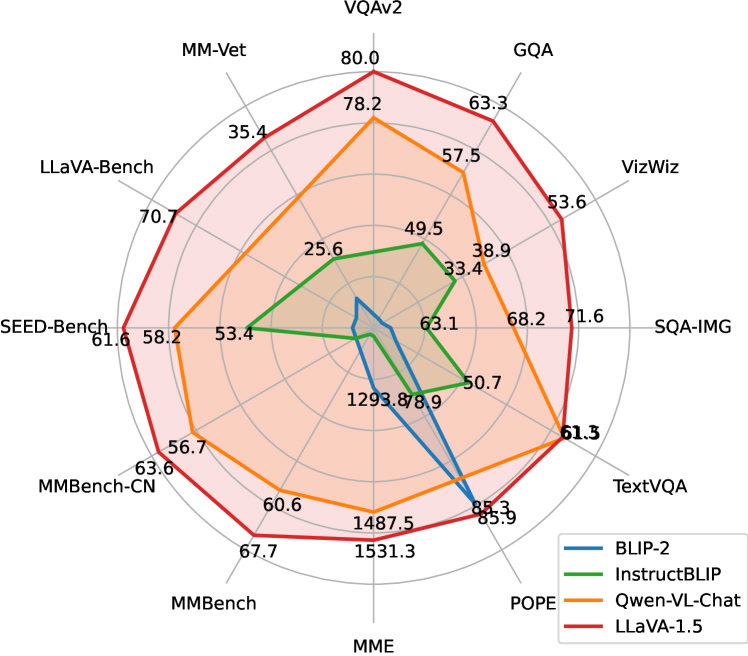
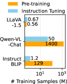
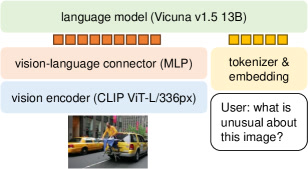

> 📌 **系列说明**：本篇是 LLaVA-**1.5**（2023-10 改进版），主题入门三连选它是因为配方更成熟。想理解"视觉指令微调"这个范式的原始动机，请先读初代 [LLaVA](/papers/llava/)（本站 13 篇任务论文之一）。

# LLaVA-1.5: Improved Baselines with Visual Instruction Tuning

> 这是一份给"完全没接触过 AI"的读者看的精读笔记。语言尽量像聊天，公式全部翻译成人话。

## 一句话讲什么（TL;DR）

给初代 [LLaVA](llava.md) 换了四个零件——更厚的镜片（两层 MLP）、更高的分辨率（336px）、更丰富的教材（665K 混合数据）、更聪明的大脑（Vicuna-1.5）——模型本身一行代码没改，就在 12 个看图答题榜单上拿了开源第一。

*所以这一节是想说：LLaVA-1.5 不是新发明，而是一次"用已知有效的小改动叠加出最大收益"的工程示范。*

---

## 这是个什么场景

想象你在厨房里做菜。你有一口家用炒锅（模型架构），上次做的是最简单的番茄炒蛋——味道还行，但客人说"蛋有点老、番茄没入味、盐不太够"。

你面前有两条路：

第一条路是"换一口专业锅"——买铸铁锅、搪瓷锅、砂锅各来一口，搞一大堆新设备。这就像 [BLIP-2](blip-2.md) 那种思路，用 Q-Former 这种精密的"翻译器"来连接视觉和语言。设备确实专业，但学习成本高、买来可能一半用不上。

第二条路是"还用这口锅，但把火候调对、食材选好、调料放全"。LLaVA-1.5 选的就是第二条路：同一口锅，火开大一点（分辨率 224→336）、镜片从一片换成两片（线性层→两层 MLP）、教材从一本换成一套（158K→665K）、食材用最新鲜的（Vicuna 换成基于 LLaMA-2 的 Vicuna-1.5）。四个调整都不大，但叠在一起效果惊人——在 12 个主流看图答题 benchmark 上拿了当时的开源第一名。

这个场景代表了 2023 年下半年开源 VLM（视觉语言模型）圈的一个关键转折点：大家发现，在架构上花大力气设计复杂桥接层（Q-Former、cross-attention 等），不如在数据和工程上做对几件简单的事。LLaVA-1.5 用最小的改动成本，把这个信念变成了数字上的铁证。

*所以这一节是想说：LLaVA-1.5 要解决的问题是——在不动大架构的前提下，怎么用最小改动把初代 LLaVA 从"能聊天"提升到"看图答题也很准"。*

---

## 之前的人怎么做的，为什么不够好

在 LLaVA-1.5 出现之前（2023 年 10 月），"让 AI 看图说话"这个问题已经有了好几种方案，但各有痛点：

初代 [LLaVA](llava.md)（2023 年 4 月）率先证明了一个大胆的想法：用一层线性投影把 [CLIP](clip.md) 视觉编码器的输出直接接到大语言模型 Vicuna 上，再用 GPT-4 自动生成的 158K 多模态指令数据做微调。效果是"聊天能力不错"（相对 GPT-4 得分 67.3%），但在学术 VQA 榜单上分数平平——因为它的训练数据里几乎没有"看图答短答题"这类练习，而且分辨率只有 224x224，图里的小字和细节都糊成一团。

[BLIP-2](blip-2.md)（2023 年 1 月，Salesforce）走了另一条路：用一个叫 Q-Former 的"压缩翻译器"，把视觉编码器输出的几百个 token 压缩成 32 个"精华 token"再喂给冻结的 LLM。好处是推理速度快、训练参数少（只有 188M），但代价是训练流程复杂（两阶段预训练 + Q-Former 的三种注意力掩码），而且因为 LLM 被完全冻结，对话和推理能力受限——它更擅长"一句话描述图片"而不是"和你讨论图片"。

InstructBLIP（2023 年 6 月）在 BLIP-2 基础上加了指令微调，VQA 分数确实上去了，但 Q-Former 的训练依然复杂，而且整套系统和 BLIP-2 的预训练流程高度耦合，不好拆开单独改。

[Flamingo](flamingo.md) / OpenFlamingo（2022/2023，DeepMind）用了最"重型"的方案——在 LLM 的每一层都插入 cross-attention 来注入视觉信息。效果确实好（32-shot 就超越了很多全量微调的模型），但 80B 参数、闭源、架构复杂到普通实验室根本没法复现。

MiniGPT-4、mPLUG-Owl 等同期工作思路类似，但要么对话强 VQA 弱，要么 VQA 强但配方复杂、不好复现。

总结一下这些方案的共同短板：要么架构太复杂（Q-Former、多层 cross-attention），要么训练数据不够多样（只有聊天数据没有 VQA 数据），要么分辨率太低看不清细节，要么 LLM 被冻结导致对话能力受限。而且大家似乎都在"架构创新"这条路上内卷——谁能发明一种更精巧的桥接方式，谁就能发论文。

LLaVA-1.5 的出现给了一个完全相反的答案：**不需要发明新架构，把已知有效的小改动叠在一起就够了。**

*所以这一节是想说：之前的方案要么太复杂，要么数据不全面，要么分辨率太低——LLaVA-1.5 的前辈们都在架构上使劲，却忽略了"数据和工程细节"才是真正的瓶颈。*

---

## 这篇论文的新想法

LLaVA-1.5 的核心信念可以用一句话概括：**做菜不在锅多花哨，而在选对食材、调好火候。**

具体来说，作者赌的是两件事：

第一，桥接层不需要花哨。初代 LLaVA 用一层线性投影连接视觉编码器和 LLM，效果已经不错。LLaVA-1.5 只是把它从"一片镜片"换成"两片镜片"——从单层线性层换成两层 MLP（中间加一个 GELU 非线性激活）。参数从 4M 增长到约 33M，仍然远小于 BLIP-2 Q-Former 的 188M。这个改动的逻辑是：CLIP 视觉空间和 LLM 词嵌入空间之间的映射不是简单的线性关系（旋转 + 平移），需要一点非线性能力来捕捉更复杂的对应关系。但两层就够了——不需要搞到 Q-Former 那么复杂。

第二，数据才是真正的瓶颈。初代 LLaVA 的训练数据只有 GPT-4 生成的 158K 多模态对话，而这些对话主要是"聊天"风格——"这张图里有什么？""帮我描述一下这个场景。"但学术 VQA 榜单考的是另一种能力："这张图里的数字是什么？"（OCR）、"图里的动物属于什么类别？"（常识推理）、"这道题选 A 还是 B？"（选择题）。模型没做过这类题，考试当然考不好。LLaVA-1.5 的解决方案很直接：**把这些题型的数据集直接混进训练数据里**——加入 VQAv2、GQA、OCR-VQA、TextCaps、A-OKVQA 等学术数据集，总量从 158K 扩展到 665K。

底层逻辑：左边的"眼睛"（CLIP ViT-L/14@336px）和右边的"嘴巴"（Vicuna-1.5 大语言模型）都已经足够强了。中间那座桥不必复杂，真正决定 VLM 上限的是**它做过哪些类型的题**。这个洞察后来被 2024 年几乎所有开源 VLM 继承——InternVL、Qwen-VL-2、LLaVA-NeXT 都走了"简单桥 + 好数据"的路线。

*所以这一节是想说：LLaVA-1.5 的核心创新不是新架构，而是一个信念——"简单架构 + 好数据 + 好工程 > 复杂架构"——并用实验数据证明了它。*

---

## 它分几步做的（方法）

<!-- paper-figures:begin -->



*上图说明：Figure 1（ar5iv 原图）（论文原图）。*



*上图说明：Figure 2（ar5iv 原图）（论文原图）。*



*上图说明：Figure 3（ar5iv 原图）（论文原图）。*
<!-- paper-figures:end -->

这是全文最重要的一节。LLaVA-1.5 的方法可以拆成四大块：架构设计、两阶段训练流程、数据配方、以及一系列工程细节。我们逐个拆解。

下图是"三件套"的数据流管道（眼睛 → 镜片 → 嘴巴）：

```
   输入图像 336×336
        │
        ▼
┌────────────────────┐
│ CLIP ViT-L/14@336  │  切成 24×24 = 576 patch
│ (视觉编码器, 冻结) │  每 patch → 1024 维向量
└─────────┬──────────┘
          │ 576 × 1024
          ▼
┌────────────────────┐
│ 两层 MLP + GELU    │  1024 →(GELU)→ 4096
│ (连接器, ~33M 可训)│  对齐 LLM 词嵌入维度
└─────────┬──────────┘
          │ 576 × 4096  (576 个"假装是词"的向量)
          ▼
   ┌──────────────────────────────────────────┐
   │ [视觉token×576] + [用户问题文字 token]     │  拼接成一条序列
   └──────────────────────┬───────────────────┘
                          ▼
              ┌────────────────────────┐
              │ Vicuna-1.5 (LLaMA-2)   │  自回归生成答案
              │ (LLM, Stage2 微调)     │
              └───────────┬────────────┘
                          ▼
                    文字回答
```

*上图说明：冻结的 CLIP 把图切成 576 个 patch 向量，两层 MLP 翻译成 LLM 词嵌入维度，拼到问题前面交给 Vicuna-1.5 像聊天一样续写答案——桥极简，理解交给 LLM。*

### 1. 架构：CLIP ViT-L/14@336px → 两层 MLP → Vicuna-1.5

#### 1.1 整体管道

LLaVA-1.5 的架构和初代 [LLaVA](llava.md) 几乎一样，仍然是"三件套"：

- **眼睛（视觉编码器）**：CLIP ViT-L/14，输入分辨率 336x336。这是一个已经在 4 亿图文对上预训练好的图像识别模型，冻结不动，只负责把图片变成一串数字向量。
- **翻译镜片（视觉-语言连接器）**：两层 MLP，负责把眼睛输出的向量"翻译"成嘴巴听得懂的格式。
- **嘴巴（大语言模型）**：Vicuna-1.5（基于 LLaMA-2 微调的对话模型），负责理解问题、参考图片信息、生成回答。

数据流是这样的：一张图片进入 CLIP ViT-L/14，被切成 24x24=576 个小方块（patch），每个方块输出一个 1024 维的向量。这 576 个向量经过两层 MLP 投影后，变成 576 个 4096 维的向量——刚好对齐 Vicuna-1.5 的词嵌入维度。然后这 576 个"假装是词的向量"被拼接到用户问题的文字 token 前面，整段一起喂给 Vicuna-1.5，让它像平常聊天一样自回归地生成回答。

用类比来说：你有一台只能播 4096 格式录像带的老式电视（Vicuna），手里却是 1024 格式的带子（CLIP 输出）。中间需要一个格式转换器。初代 LLaVA 的转换器是"一块简单的电路板"（单层线性变换），LLaVA-1.5 换成了"两块电路板叠在一起中间加一个信号放大器"（两层 MLP + GELU 激活）。

#### 1.2 为什么两层 MLP 比单层线性层好

这个问题的答案涉及一个数学直觉：单层线性变换只能做仿射变换——旋转、缩放、平移。如果 CLIP 的视觉空间和 Vicuna 的词嵌入空间之间的"翻译关系"恰好是线性的（比如"猫的视觉向量"和"猫的文字向量"之间只差一个旋转），那一层线性就够了。但现实中这个映射通常是非线性的——不同类别的视觉特征可能需要不同的"翻译规则"，这些规则之间的切换不是平滑的线性过渡。

两层 MLP 中间夹一个 GELU 激活函数，就引入了非线性——这让连接器能学到更复杂的映射关系。数学上，两层足够宽的 MLP 理论上可以逼近任意连续函数（万能近似定理）。当然实际中不需要逼近"任意"函数，只需要比线性强一点就够了。

参数量的变化：单层线性层是 1024×4096 ≈ 4M 参数；两层 MLP 大约是 1024×4096 + 4096×4096 ≈ 21M 参数（加上偏置和激活函数的参数，总共约 33M）。对比 BLIP-2 Q-Former 的 188M，仍然是轻量级的。

#### 1.3 为什么不用更复杂的连接器

一个自然的疑问是：既然两层比一层好，为什么不用三层、四层、甚至 Q-Former 那种带 cross-attention 的复杂结构？

作者在论文中做了对比实验。结论是：两层 MLP 已经接近了连接器能贡献的上限。超过两层之后，连接器本身的"翻译能力"提升很小，但增加的参数会让训练变慢、调参变复杂。而 Q-Former 那种复杂结构虽然在"压缩视觉信息"方面有优势（只输出 32 个 token 而不是 576 个），但代价是训练复杂度高、需要多阶段预训练、而且压缩过程中可能丢失空间细节。

LLaVA-1.5 的哲学是：**连接器只负责"格式转换"，真正的"理解"交给 LLM**。LLM 有 7B 或 13B 参数，理解能力远超连接器——与其让连接器做复杂的语义压缩，不如把原始视觉信息尽可能完整地传过去，让 LLM 自己决定关注什么。这就像翻译的时候，与其让翻译员写一份精炼的 32 点摘要（Q-Former），不如把原文完整地交给一个足够聪明的读者（LLM），让读者自己提炼重点。

#### 1.4 分辨率提升：从 224 到 336

初代 LLaVA 使用 CLIP ViT-L/14 的默认分辨率 224x224。这意味着一张图被切成 16x16=256 个 patch。LLaVA-1.5 使用了支持 336x336 输入的 CLIP ViT-L/14@336px 版本，图被切成 24x24=576 个 patch。

576 vs 256——视觉信息量增加了 2.25 倍。这意味着：

- 图片中的小字更清晰了：比如一张菜单照片，224px 下"宫保鸡丁"四个字可能只占几个 patch，糊成一团；336px 下能分配到更多 patch，模型更容易认出来。
- 空间细节更丰富了：两个挨着的物体在 224px 下可能被压到同一个 patch 里，模型分不清"苹果旁边的橘子"和"苹果上面的橘子"。336px 下分辨率更高，空间关系更清楚。
- 代价是 LLM 需要处理更多 token：576 个视觉 token + 文字 token，比初代多了 320 个 token 的 prefill 开销。在 A100 上，这大约增加 0.3-0.5 秒的首 token 延迟。

为什么不继续提到 448、672 甚至更高？因为 CLIP ViT-L/14 的预训练分辨率是 224 和 336，如果直接用更高分辨率，位置编码会出问题（模型从未见过那么多 patch），需要做位置编码插值。LLaVA-1.5 选择 336 是因为这是 CLIP 官方支持的最高分辨率，不需要额外的适配工作。后来的 LLaVA-NeXT（1.6 版）用了动态分辨率（AnyRes）技术，可以处理更高分辨率的图片——但那是另一篇论文的故事了。

#### 1.5 LLM 选择：从 Vicuna-1.0 到 Vicuna-1.5

初代 LLaVA 使用 Vicuna（基于 LLaMA-1 微调的对话模型）。LLaVA-1.5 升级到 Vicuna-1.5（基于 LLaMA-2 微调）。LLaMA-2 相比 LLaMA-1 的主要改进包括：更大的预训练数据量（2T token vs 1.4T token）、更长的上下文窗口（4096 vs 2048）、以及更好的安全对齐。

这个升级的逻辑很简单：既然 LLaVA 的核心设计是"让 LLM 自己学会看图"，那么 LLM 本身越强，"看图"的天花板就越高。LLaMA-2 预训练时见过更多文本，语言理解和推理能力更强——这些能力在微调阶段会被迁移到多模态理解上。

作者同时发布了 7B 和 13B 两个版本。13B 版本在大部分 benchmark 上领先 7B 版本 2-3 个百分点，但 7B 版本的推理速度几乎翻倍，且可以在消费级 GPU（如 RTX 4090 + 4-bit 量化）上运行。

### 2. 两阶段训练流程

LLaVA-1.5 沿用了初代 LLaVA 的两阶段训练策略，但在数据量和训练细节上做了调整。

#### 2.1 Stage 1：特征对齐预训练（Pre-training for Feature Alignment）

**目标**：让 MLP 连接器学会"翻译"——把 CLIP 视觉空间的向量映射到 Vicuna 的词嵌入空间。

**冻结策略**：视觉编码器（CLIP ViT-L/14@336px）和 LLM（Vicuna-1.5）都冻结不动，只训练两层 MLP 连接器的参数。

**训练数据**：558K 图文配对数据，来自 CC3M（Conceptual Captions 3M 的一个子集）。每条数据是"一张图 + 一句简短描述"，比如一张公园照片配上"两个小朋友在公园玩滑梯"。这些数据的任务很简单——给定图片，生成描述。模型不需要做复杂推理，只需要学会"这张图的视觉向量经过 MLP 翻译后，应该对应到描述中的词"。

**类比**：这就像新员工入职培训。你不需要他一来就处理复杂业务，只需要他先学会公司用的术语——"当客户说 A 的时候，其实是指 B"。Stage 1 就是让 MLP 学会"当 CLIP 输出向量 X 的时候，Vicuna 应该理解为概念 Y"。

**训练细节**：学习率 1e-3，batch size 256，训练 1 epoch，大约在 8 卡 A100 上跑 5-6 小时。因为只训练 33M 参数的 MLP，速度很快。

**为什么要分出这一步？** 直觉上可以理解：如果跳过 Stage 1 直接做 Stage 2（同时训 MLP 和 LLM），会出什么问题？MLP 还没学会翻译，传给 LLM 的全是"乱码"。LLM 收到乱码后，梯度信号也是混乱的——它不知道该调整自己的哪部分来理解这些乱码。这导致训练不稳定，甚至收敛到一个更差的局部最优。初代 LLaVA 的消融实验也验证了这一点：跳过 Stage 1，最终分数会掉 5 个点左右。

#### 2.2 Stage 2：视觉指令微调（Visual Instruction Tuning）

**目标**：让模型学会"按指令看图回答"——不只是描述图片，还要能回答各种类型的问题，包括短答 VQA、多选题、OCR、推理题、开放式对话等。

**冻结策略**：视觉编码器（CLIP）继续冻结。MLP 连接器和 LLM（Vicuna-1.5）一起解冻训练。

**关键决策：为什么解冻 LLM？** 这是 LLaVA 系列和 BLIP-2 系列的根本分歧。BLIP-2 选择冻结 LLM，好处是保留语言能力、训练便宜；坏处是 LLM 不知道怎么"利用"视觉信息做推理——它只能被动接收 Q-Former 压缩好的 32 个 token，自己不能主动去"问"视觉编码器更多细节。LLaVA 选择解冻 LLM，让它在看了大量"图 + 问题 + 答案"之后，自己学会"我应该关注图里的哪些部分来回答这个问题"。代价是训练更贵、有灾难性遗忘的风险——但 LLaVA-1.5 通过控制数据量（665K，对 LLM 来说很少）和数据多样性（混合了纯文本指令数据）来缓解遗忘。实验表明，微调后 LLM 在纯文本 benchmark 上的表现只下降不到 2%。

**训练数据（重点来了——这是 LLaVA-1.5 的核心改进）**：总计 665K 样本，混合了以下几大来源——

- **LLaVA-Instruct-150K**：初代 LLaVA 的"招牌菜"——GPT-4 基于 COCO 图片描述自动生成的 158K 条多模态对话指令。包括多轮聊天、详细描述、复杂推理三种题型。这批数据教模型"怎么聊天"。
- **VQAv2**（约 83K 训练样本被纳入）：最经典的通用视觉问答数据集。问题风格是"图里有几个人？""桌子上放的是什么？"——简短事实性问答。
- **GQA**（约 72K 训练样本被纳入）：另一个通用 VQA 数据集，但问题更注重组合推理，比如"戴红帽子的人旁边有没有狗？"。
- **OCR-VQA**（约 80K 训练样本被纳入）：看图中的文字答题——比如"这本书的书名是什么？""招牌上写的是什么？"。这批数据补上了初代 LLaVA 在 OCR 方面的短板。
- **TextCaps**（约 22K 训练样本被纳入）：要求模型在描述图片时准确引用图中出现的文字。比如"一个人穿着写有 NIKE 字样的 T 恤"。
- **A-OKVQA**（约 17K 训练样本被纳入）：需要外部常识知识的 VQA。比如"图里这种动物通常吃什么？"——模型不仅要认出动物，还要知道它的习性。
- **Visual Genome 区域描述**（约 86K）：图片中特定区域的描述数据，训练模型关注图片的局部细节。
- **ShareGPT 纯文本数据**（约 40K）：纯文本对话数据，目的是在微调过程中维持 LLM 的文字对话能力，防止灾难性遗忘。

**为什么这套数据配方有效？** 初代 LLaVA 的数据全部来自 GPT-4 生成的对话——风格统一但题型单一。LLaVA-1.5 的数据像一份"模拟考卷"，每种题型都有覆盖。模型在 OCR-VQA 上练过"看图识字"，考 TextVQA 时自然不慌；在 A-OKVQA 上练过"常识推理"，考知识型 VQA 时有底气。而 VQAv2/GQA 这种经典数据集，直接教模型"怎么用一个词或短语简洁地回答问题"——这对学术 benchmark 评分至关重要，因为很多 benchmark 的自动评分器会把"a photo of a red car"判成错误答案（正确答案是简单的"red car"）。

#### 2.3 Response Format Prompt：让模型学会按格式答题

这是一个容易被忽略但效果显著的工程技巧。不同 benchmark 对答案格式的要求不同：

- VQAv2 期望简短回答："red""3""yes"
- LLaVA-Bench 期望详细回答："The image shows a red car parked in front of..."
- ScienceQA 期望选择题选项："A""B""C"

如果模型对 VQAv2 的"What color is the car?"回答"The car appears to be red based on the image"，内容完全正确，但自动评分器会判 0 分——因为标准答案只是"red"。

LLaVA-1.5 的解决方案：在 prompt 末尾加一句格式约束。比如"Answer the question using a single word or phrase."告诉模型"用一个词或短语回答"。这不改变模型的理解能力，只改变输出格式——类似考试时老师说"答案写在答题卡上，每题只写一个字母"。

这个技巧贡献了约 2-5 个百分点的分数提升（取决于 benchmark）。几乎是"零成本"的改进，但很多之前的工作都忽略了它。

#### 2.4 训练超参数和成本

Stage 2 的训练细节：

- 学习率 2e-5（比 Stage 1 的 1e-3 低 50 倍——因为现在同时训练 LLM，学习率太大会破坏 LLM 已有的语言能力）
- Batch size 128
- 训练 1 epoch
- 硬件 8 x A100 (80GB)
- 训练时间约 20 小时
- 总训练成本（Stage 1 + Stage 2）约 1 天 8 卡 A100，折合云计算费用约 $500

对比其他方案的训练成本：Flamingo > $1M、BLIP-2 约 $20K、InstructBLIP 约 $15K。LLaVA-1.5 的 $500 意味着**任何拥有 A100 集群的大学实验室都能在一天内复现**。这是它能成为开源 VLM 标准 baseline 的关键原因之一。

### 3. 和初代 LLaVA 的逐项对比

为了让你清楚地看到"改了什么、没改什么"，这里做一个面对面对比：

| 维度 | 初代 LLaVA | LLaVA-1.5 | 变化 |
|------|-----------|-----------|------|
| 视觉编码器 | CLIP ViT-L/14@224px | CLIP ViT-L/14@336px | 分辨率提高，patch 数 256→576 |
| 连接器 | 单层线性投影（4M 参数） | 两层 MLP + GELU（~33M 参数） | 加了非线性表达能力 |
| LLM | Vicuna-7B/13B（LLaMA-1 base） | Vicuna-1.5-7B/13B（LLaMA-2 base） | 更强的语言基座 |
| Stage 1 数据 | CC-595K | CC-558K | 基本不变 |
| Stage 2 数据 | 158K（GPT-4 生成） | 665K（GPT-4 + 学术 VQA 混合） | 数据量 4 倍，题型覆盖面大幅扩展 |
| 训练成本 | $300-500 | ~$500 | 几乎不变 |
| 架构改动 | — | 无（仍然是三件套） | 零架构创新 |

### 4. 和其他方案的架构对比

| 维度 | Flamingo | [BLIP-2](blip-2.md) | LLaVA-1.5 |
|------|----------|--------|-----------|
| 桥接方式 | 每层 LLM 插入 Gated XAttn | Q-Former（32 queries） | 两层 MLP |
| 桥接参数 | ~1.2B | 188M | ~33M |
| 送入 LLM 的视觉 token 数 | 64 | 32 | 576 |
| LLM 是否微调 | 否（冻结） | 否（冻结） | 是（全参数微调） |
| 视觉编码器是否微调 | 否 | 否 | 否 |
| 训练成本 | >$1M | ~$20K | ~$500 |
| 需要改 LLM 架构吗 | 是（插入 XAttn 层） | 否 | 否 |

这张表直观地展示了 LLaVA-1.5 的设计哲学：桥接层做到最简，把所有"理解"的复杂性交给 LLM 微调来解决。

### 5. 消融实验：每个改动贡献了多少

作者做了详细的消融实验来拆解每个改动的贡献。以下是关键结论：

**单层线性 → 两层 MLP**：在多个 benchmark 上平均提升约 2-5 个百分点。其中 VQAv2 提升约 2 分，TextVQA 提升约 3 分。这说明非线性映射确实比线性映射能更好地对齐视觉和语言空间。

**分辨率 224 → 336**：在 OCR 相关任务上提升最明显——TextVQA 提升约 5-8 分，因为更高分辨率让模型能看清图中的小字。在通用 VQA（VQAv2、GQA）上也有约 2 分的提升，因为更多 patch 提供了更丰富的空间细节。

**加入学术 VQA 数据**：这是贡献最大的改动。在对应 benchmark 上的提升是压倒性的——比如加入 OCR-VQA 数据后，TextVQA 分数跳升约 10 分；加入 A-OKVQA 数据后，知识型 VQA 分数提升约 8 分。同时，通用对话能力（LLaVA-Bench）没有退化——说明混合数据策略成功地"加科不减科"。

**升级 LLM（Vicuna → Vicuna-1.5）**：在所有 benchmark 上平均提升约 1-2 分。幅度不大，但因为是"免费升级"（不需要改任何训练流程），所以性价比极高。

综合来看，**数据改进贡献了约 60% 的总提升，分辨率贡献约 20%，MLP 连接器贡献约 15%，LLM 升级贡献约 5%**。这再次验证了论文的核心主张：数据 > 分辨率 > 连接器设计 > 基座模型。

### 6. 训练中的关键 trade-off

#### 6.1 视觉 token 数量 vs 推理速度

LLaVA-1.5 向 LLM 送入 576 个视觉 token，远多于 BLIP-2 的 32 个。这是一个明确的 trade-off：

- **更多 token = 更多信息**：576 个 token 保留了图片的空间结构和细节，模型可以"看到"图片中不同区域的不同内容。而 BLIP-2 的 32 个 token 经过了高度压缩，可能丢失空间关系和细微细节。
- **更多 token = 更慢的推理**：LLM 处理 576+N 个 token（N 是文字 token 数）的 prefill 时间约是处理 32+N 个 token 的 3-5 倍。在 A100 上，LLaVA-1.5 的首 token 延迟约 0.8 秒，BLIP-2 约 0.3 秒。

对于"看图聊天"这种不要求实时性的场景，0.8 秒完全可以接受。但对于机器人控制（需要 10Hz 控制循环，即每 100ms 出一个决策），576 token 可能太多了。这也是为什么后来一些 VLA（如 OpenVLA）在采用 LLaVA 架构时，会通过 token 合并（token merging）或降低分辨率来减少视觉 token 数量。

#### 6.2 灾难性遗忘的控制

微调 LLM 的最大风险是灾难性遗忘——模型在学"看图"的过程中忘记了"说人话"。LLaVA-1.5 通过三个策略控制这个风险：

- **数据量控制**：665K 样本对 LLM（在预训练时看过万亿 token）来说非常少，相当于"轻微调"。大部分权重几乎不变，只有和视觉理解直接相关的部分被显著更新。
- **混入纯文本数据**：训练集中包含约 40K 条 ShareGPT 纯文本对话，让 LLM 在学视觉能力的同时"复习"文字对话能力。
- **低学习率**：Stage 2 的学习率只有 2e-5，比 Stage 1 低 50 倍。这样 LLM 权重的更新速度很慢，不容易"跑偏"。

实验验证：LLaVA-1.5 在纯文本 benchmark（如 MMLU）上的表现和基座 Vicuna-1.5 相比只下降不到 2%，说明遗忘被控制在了可接受的范围内。

*所以这一节是想说：LLaVA-1.5 的方法没有任何"黑科技"——两层 MLP、高分辨率、多样数据、好基座模型，四个已知有效的改动叠在一起就超过了所有复杂架构的竞争对手。真正的洞察是：当 LLM 足够强时，"让 LLM 自己学会看图"比"替 LLM 翻译好视觉信息"更有效。*

---

下图对比两阶段训练——冻结策略与数据配方在两阶段间的切换：

```
【Stage 1: 特征对齐预训练】          【Stage 2: 视觉指令微调】
  CLIP  ❄冻结                          CLIP  ❄冻结
    │                                    │
  MLP   🔥只训这个                      MLP   🔥训
    │                                    │
  LLM   ❄冻结                          LLM   🔥训 (lr 2e-5, 低50×防遗忘)
                                       
  数据: 558K CC3M 图文对               数据: 665K 混合
        (只学"翻译格式")                 ├ LLaVA-Instruct-150K (聊天)
                                         ├ VQAv2/GQA (通用短答)
  目标: MLP 学会把 CLIP 向量            ├ OCR-VQA/TextCaps (看图识字)
        映射到 LLM 词嵌入空间           ├ A-OKVQA (常识推理)
                                         └ ShareGPT 纯文本 (防遗忘)
  ~5-6h / 8×A100                       目标: 学会"按指令+按格式答题"
                                       ~20h / 8×A100
        └──────────────┬───────────────────┘
                       ▼
              全程 ~1 天 8×A100 ≈ $500
```

*上图说明：Stage 1 只解冻 MLP 学"格式翻译"打好地基，Stage 2 再解冻 LLM 用混合题型数据学"按指令答题"，低学习率 + 纯文本数据一起压制灾难性遗忘。*

---

## 关键数字（What works）

| Benchmark | 类型 | LLaVA-1.5-13B | InstructBLIP-13B | Qwen-VL-Chat | 初代 LLaVA-13B |
|-----------|------|:---:|:---:|:---:|:---:|
| VQAv2 (test-dev) | 通用 VQA | **80.0** | — | 78.2 | 76.3 |
| GQA | 组合推理 VQA | **63.3** | 49.5 | 57.5 | — |
| VizWiz | 视障用户 VQA | 53.6 | 35.4 | — | — |
| ScienceQA-IMG | 理科选择题 | **71.6** | — | 68.2 | — |
| TextVQA | OCR VQA | **61.3** | 50.7 | — | — |
| POPE | 幻觉评测 | **85.9** | — | — | — |
| MME (Perception) | 综合感知 | **1531.3** | 1212.8 | 1487.6 | — |
| MMBench | 综合理解 | **67.7** | — | 60.6 | — |
| SEED-Bench | 综合评测 | **68.2** | — | 58.2 | — |
| LLaVA-Bench (Wild) | 开放对话 | **72.5** | 58.2 | — | 67.3 |
| MM-Vet | 综合推理 | **36.1** | 25.6 | — | — |

| 消融维度 | 改动前 | 改动后 | 平均变化 |
|----------|--------|--------|----------|
| 连接器：线性 → MLP | 基线 | +MLP | +2~5 分 |
| 分辨率：224 → 336 | 基线 | +336px | +2~8 分（OCR 任务受益最大） |
| 数据：158K → 665K | 基线 | +混合数据 | +5~10 分（对应任务） |
| LLM：Vicuna → Vicuna-1.5 | 基线 | +LLaMA-2 base | +1~2 分 |

| 成本指标 | 数值 |
|----------|------|
| 总训练时间 | ~1 天（8 x A100 80GB） |
| 估算费用 | ~$500 |
| Stage 1 训练参数 | ~33M（仅 MLP） |
| Stage 2 训练参数 | ~7B/13B（MLP + LLM） |
| 视觉编码器参数 | ~304M（冻结不训） |
| 推理显存（13B fp16） | ~28GB |
| 推理显存（7B 4-bit） | ~6GB |

*所以这一节是想说：LLaVA-1.5 在 11 个 benchmark 上拿到了当时的开源 SOTA，而整套训练只花 $500——数据改进贡献了大部分提升，MLP 和分辨率锦上添花。*

---

## 实验结果说明了什么

这些数字背后有三条核心信息：

**第一，数据覆盖面决定了分数天花板。** 初代 LLaVA 在 LLaVA-Bench 对话评测上得分不错（67.3%），但在 TextVQA 这种 OCR 任务上很弱——因为训练数据里没有 OCR 题型。LLaVA-1.5 加入 OCR-VQA 和 TextCaps 之后，TextVQA 分数跳升到 61.3，直接超越了 InstructBLIP 的 50.7。这说明：模型不是"不会 OCR"，而是"没练过 OCR"。给它练习题，它立刻就学会了。同样的逻辑适用于所有加入的数据集——A-OKVQA 补了常识推理、VQAv2/GQA 补了通用 VQA。

**第二，"简单桥 + 微调 LLM"打赢了"复杂桥 + 冻结 LLM"。** 在几乎所有 benchmark 上，LLaVA-1.5 都超越了 InstructBLIP（使用 Q-Former 桥接的代表）。特别是在需要复杂推理的 benchmark（如 MM-Vet 36.1 vs 25.6）上差距巨大。这证实了一个重要结论：与其让桥接层做精细的"翻译压缩"，不如让足够强的 LLM 直接看原始视觉 token 自己理解。

**第三，这些改进是"加科不减科"的。** 加入学术 VQA 数据并没有让对话能力下降——LLaVA-Bench (Wild) 的分数从 67.3 提升到了 72.5。这说明多样化的数据不仅不会导致"顾此失彼"，反而因为更全面的训练让模型整体理解能力都变强了。

*所以这一节是想说：实验验证了三个工程信念——数据覆盖面比架构复杂度重要、LLM 微调比复杂桥接有效、多样化训练数据能"加科不减科"。*

---

## 你应该懂的几个新词

**Visual Instruction Tuning（视觉指令微调）**：把"图像 + 任务指令 + 答案"的三元组组织成监督数据，让 VLM 学会按指令完成多样任务。区别于传统的"看图说一句话"，指令微调让模型能处理"回答问题""详细描述""推理分析"等不同类型的任务。LLaVA 首创，LLaVA-1.5 发扬光大。

**MLP（Multi-Layer Perceptron，多层感知机）**：最基础的神经网络结构——多层全连接 + 非线性激活。在 LLaVA-1.5 中特指视觉-语言连接器：1024 维输入 → 4096 维中间层 → GELU 激活 → 4096 维输出。参数约 33M。

**Projector / Connector（投影层/连接器）**：视觉编码器输出和 LLM 输入之间的"桥梁"。LLaVA 系列用极简连接器（线性层或两层 MLP）是其标志性特色。和 BLIP-2 的 Q-Former（188M 参数，12 层 Transformer）形成鲜明对比。

**GELU（Gaussian Error Linear Unit）**：一种非线性激活函数，类似于 ReLU 但更平滑。在 LLaVA-1.5 的 MLP 连接器中，GELU 夹在两层线性层之间，让连接器能学到非线性的视觉-语言映射关系。

**Response Format Prompt（格式约束提示）**：在 prompt 末尾加一句"用一个词回答"或"回答选择题选项"之类的格式要求，让模型在不同 benchmark 上输出正确格式。这个技巧看似微不足道，但在自动评分的 VQA benchmark 上能贡献 2-5 分。

**POPE（Polling-based Object Probing Evaluation）**：一种标准化的多模态幻觉评测方法。问模型"图里有没有 X？"，统计假阳性率（模型说"有"但图里其实没有）。LLaVA-1.5 在 POPE 上得分 85.9，说明它的幻觉问题虽然存在但已被显著抑制。

**灾难性遗忘（Catastrophic Forgetting）**：微调模型时，新学到的能力把旧能力"覆盖"了。比如微调 LLM 学"看图"后，它忘了怎么"说人话"。LLaVA-1.5 通过低学习率 + 混入纯文本数据来控制这个风险。

*所以这一节是想说：这些术语在后续的 VLM/VLA 论文中会反复出现——先把它们和具体的技术决策挂钩，以后看论文会快很多。*

---

## 它有什么搞不定的

LLaVA-1.5 虽然在 benchmark 上拿了一堆第一，但它有几个明确的局限性：

**局限 1：分辨率天花板。** 336x336 对于日常照片够用了，但对于需要读密集文字的场景（长篇文档截图、高分辨率图表、地图上的小标注）仍然不够。576 个 patch 听起来很多，但分摊到一张 1920x1080 的截图上，每个 patch 要覆盖约 80x80 像素——小号字体可能被压缩到一两个 patch 里，模型依然读不清。后来的 LLaVA-NeXT 用动态分辨率（AnyRes）解决了这个问题，但 LLaVA-1.5 本身做不到。

**局限 2：幻觉问题未根治。** POPE 评测上 85.9 分看起来不错，但这意味着仍有约 14% 的情况下模型会"一本正经地胡说"——声称图片中存在实际上不存在的物体。在安全敏感场景（医疗影像、自动驾驶）中，14% 的幻觉率是不可接受的。

**局限 3：空间推理能力弱。** LLaVA-1.5 能回答"图里有没有猫"，但在"猫在椅子的左边还是右边""两个杯子哪个更近"这类空间关系推理上表现不稳定。原因是 CLIP 的视觉编码器在预训练时优化的是"图文匹配"而非"空间理解"，patch token 缺乏显式的位置关系编码。

**局限 4：单图限制。** LLaVA-1.5 一次只能处理一张图片。如果用户发来两张图说"这两张照片有什么不同？"，模型处理不了。多图理解要等 LLaVA-NeXT 和 LLaVA-Interleave 才支持。

**局限 5：推理速度受限于视觉 token 数量。** 576 个视觉 token 让 LLM 的 prefill 阶段变慢，首 token 延迟约 0.8 秒（A100 上）。对于需要实时响应的场景（如机器人控制的 10Hz 循环），这个延迟太高了。BLIP-2 的 32 token 方案在这方面有明确优势。

**局限 6：训练数据的版权和合规问题。** 665K 训练数据中的一部分来自学术 VQA 数据集（如 VQAv2），这些数据集通常只允许学术研究使用。加上初代 LLaVA 的 158K 数据由 GPT-4 生成，受 OpenAI 使用条款限制——不能用于和 OpenAI 竞争的商业产品。这给 LLaVA-1.5 的商业部署画了一条红线。

*所以这一节是想说：LLaVA-1.5 在分辨率、幻觉、空间推理、多图、速度、合规六个方面都有硬伤——这些硬伤恰好定义了后续工作（LLaVA-NeXT、InternVL、Qwen-VL-2 等）的研究方向。*

---

## 它和别的几篇是什么关系

**上游依赖**：LLaVA-1.5 站在两个巨人的肩膀上——[CLIP](clip.md)（视觉编码器，提供"看"的能力）和 LLaMA-2/Vicuna（语言模型，提供"说"和"想"的能力）。初代 [LLaVA](llava.md) 是它的直接前身，提供了"三件套"架构和两阶段训练的设计模板。

**同期竞争**：InstructBLIP 是 [BLIP-2](blip-2.md) 阵营的代表，用 Q-Former 做桥接；Qwen-VL 是阿里的方案，用 cross-attention 做桥接。LLaVA-1.5 用最简单的 MLP 桥接打赢了这两个"复杂桥"方案，这场胜利基本上宣告了"简单桥"路线的胜出。

**下游影响**：LLaVA-1.5 成为了开源 VLM 的事实标准 baseline。2024 年几乎所有新发布的 VLM 论文都会在对比表中列出 LLaVA-1.5 的分数。直接衍生的工作包括 LLaVA-NeXT（支持动态分辨率和多图）、LLaVA-OneVision（统一图片/视频理解）、ShareGPT4V（更好的合成数据）、VILA（视频 + 图文理解）等。

**对具身智能的影响**：LLaVA-1.5 的"简单投影 + 微调 LLM"架构被直接移植到了 VLA（视觉-语言-动作模型）中。OpenVLA 的架构几乎就是 LLaVA-1.5 的翻版——只是把 CLIP 换成了 SigLIP+DINOv2，把文字输出换成了动作 token。这说明 LLaVA-1.5 确立的设计模式不仅适用于"看图说话"，也适用于"看图做事"。

**时间线**：

```
2022.04  Flamingo (DeepMind)     -- 80B，闭源，证明"冻结 LLM + 加桥"可行
2023.01  BLIP-2 (Salesforce)     -- 只训 188M 参数，效果超 Flamingo
2023.04  LLaVA (UW + Microsoft) -- 线性投射 + LLM 微调，简单到不可思议
2023.06  InstructBLIP            -- BLIP-2 + 指令微调
2023.10  LLaVA-1.5              -- LLM 微调路线的集大成者
2023.12  几乎所有新 VLM 都选了 LLaVA 路线
2024     OpenVLA / LLaVA-NeXT   -- LLaVA 架构延伸到 VLA 和更高分辨率
```

*所以这一节是想说：LLaVA-1.5 是开源 VLM "简单桥"路线的集大成者——它的胜利结束了 2023 年的"桥梁设计之战"，并直接塑造了后续 VLA 的架构选择。*

---

## 和本导读的关系

在这套导读的知识图谱中，LLaVA-1.5 处于一个承上启下的枢纽位置。

向上回溯，它依赖 [Ch08](../guide/ch08-clip.md) 讲的 [CLIP](clip.md)（视觉编码器的来源）和 [Ch09](../guide/ch09-blip2-llava.md) 讲的"桥梁设计之战"中 LLaVA 路线的胜出逻辑。如果你还没读过初代 [LLaVA](llava.md) 的笔记，建议先回去看，因为 LLaVA-1.5 的所有设计都是在初代基础上的增量改进。

向下连接，LLaVA-1.5 确立的"视觉编码器（冻结）→ 简单投影层（可训练）→ LLM（微调）"三段式管道，被直接继承到 Ch11 的 RT-2 和 Ch12 的 OpenVLA 中。区别只是把 LLM 的输出从文字 token 扩展到了动作 token。理解了 LLaVA-1.5 的训练流程和设计选择，你看 OpenVLA 时会发现几乎是"换皮版 LLaVA-1.5"。

横向对比，LLaVA-1.5 和 [BLIP-2](blip-2.md) 代表了两种对立的设计哲学——"简单桥 + 微调 LLM" vs "复杂桥 + 冻结 LLM"。[Ch09](../guide/ch09-blip2-llava.md) 详细比较了这两条路线的 trade-off。LLaVA-1.5 的实验结果是这场辩论的终结性证据。

*所以这一节是想说：LLaVA-1.5 是从"VLM 看图说话"到"VLA 看图做事"这条演化链上的关键一环——读懂它，后续的 VLA 论文就不会觉得突兀。*

---

## 思考题

**Q1：LLaVA-1.5 把连接器从单层线性换成两层 MLP，为什么不用更深的网络（比如 5 层 MLP 或者 ResNet）？**

<details><summary>参考思路</summary>

连接器的作用是"格式转换"而不是"语义理解"。两层 MLP（加一个非线性激活）已经能逼近大部分非线性映射（万能近似定理）。更深的网络确实有更强的表达能力，但（1）参数量增加后 Stage 1 训练变慢，（2）更深的网络更容易过拟合 558K 的对齐数据，（3）实验消融表明两层到三层的提升已经可以忽略不计。LLaVA 的哲学是把"理解"的复杂性交给 7B/13B 参数的 LLM，而不是堆在连接器上。

</details>

**Q2：为什么 LLaVA-1.5 在 Stage 2 解冻 LLM，而 BLIP-2 选择冻结 LLM？各有什么 trade-off？**

<details><summary>参考思路</summary>

冻结 LLM（BLIP-2）的好处：训练便宜（只训 188M 的 Q-Former）、保留 LLM 原有语言能力、可以随时换 LLM 而不需要重新训练。坏处：LLM 不知道怎么主动利用视觉信息做复杂推理——它只是被动接收 32 个压缩后的视觉 token，自己没法调整"看"的方式。解冻 LLM（LLaVA-1.5）的好处：LLM 通过微调学会了"怎么利用视觉 token 来推理"，在对话和推理类任务上表现更强。坏处：训练贵（要训整个 7B/13B LLM）、有灾难性遗忘风险、和特定 LLM 版本绑定。核心启示：当 LLM 足够强（7B+）且训练数据足够好时，解冻 LLM 的收益远大于风险。

</details>

**Q3：如果把 LLaVA-1.5 的训练数据从 665K 减半到 330K，但保持数据类型的多样性，你预期分数会怎么变？如果保持数据量但去掉所有 OCR 类数据呢？**

<details><summary>参考思路</summary>

减半但保持多样性：大部分 benchmark 的分数可能下降 2-5 分，但不会崩溃——因为每种题型的模型都见过，只是练习量减少了。相当于每科作业从 10 套减到 5 套，成绩会降但不会不及格。去掉 OCR 数据但保持总量：TextVQA 等 OCR 相关 benchmark 分数会暴跌（可能降 10+ 分），因为模型完全没做过这类题。但通用 VQA 和对话能力基本不受影响。这验证了一个重要原则：数据的多样性比数据的数量更重要。

</details>

**Q4：LLaVA-1.5 送入 LLM 576 个视觉 token，BLIP-2 只送 32 个。如果你在设计一个机器人控制系统（要求 10Hz 控制频率），你会选哪种方案？**

<details><summary>参考思路</summary>

10Hz 意味着每 100ms 必须输出一个动作决策。LLaVA-1.5 在 A100 上的首 token 延迟约 0.8 秒——远超 100ms 的预算。BLIP-2 的 32 token 方案延迟约 0.3 秒——也超标但更接近。实际的 VLA 方案（如 OpenVLA）会采取折中措施：使用 LLaVA 架构但通过 token 合并（把相邻 patch 的 token 平均或拼接）减少视觉 token 数量，或者降低分辨率，或者用更小的 LLM（如 3B）。另一个思路是异步推理——视觉理解和动作决策分开跑在不同频率上。

</details>

**Q5：为什么 LLaVA-1.5 选择冻结 CLIP 视觉编码器而不是一起微调？如果解冻会怎样？**

<details><summary>参考思路</summary>

CLIP ViT-L/14 在 4 亿图文对上预训练，学到了非常通用的视觉表征。LLaVA-1.5 只有 665K 微调数据——如果解冻 CLIP 一起训，少量数据会让 CLIP 的通用表征"偏向"这 665K 图片的分布，丧失泛化能力。类比：CLIP 是一个见过全球所有菜系的美食评委，你用 665 道家常菜让他"重新学习"，他反而会忘记怎么评判法国菜和日本料理。后来的一些工作（如 InternVL、PaLI-X）确实解冻了视觉编码器，但它们使用了数百万甚至上千万的训练数据——数据量足够大才不会让编码器"忘记"。

</details>

**Q6：Response Format Prompt（"用一个词回答"）为什么能提升 VQA 分数？这算"作弊"吗？**

<details><summary>参考思路</summary>

不算作弊。VQA benchmark 的自动评分器通常做精确匹配——标准答案是"red"，模型回答"The car is red"会被判 0 分。但模型的理解是正确的，只是输出格式不对。加 format prompt 只是告诉模型"输出格式是短答"，没有泄露任何答案信息。这就像考试时监考老师说"答案写在对应格子里"——不是作弊，是基本的应试技巧。但这也暴露了当前 VQA 评测的一个问题：自动评分器太依赖字面匹配，不够鲁棒。

</details>

**Q7：假设你有一个全新的 VLM 任务——"看医学影像回答医生的问题"。你会基于 LLaVA-1.5 还是 BLIP-2 来做？为什么？**

<details><summary>参考思路</summary>

大概率选 LLaVA-1.5 架构，原因是：（1）医学问答需要复杂推理（"这个肿块是良性还是恶性？根据什么特征判断？"），这要求 LLM 能深度利用视觉信息，冻结的 LLM 做不到；（2）医学数据通常量不大（几千到几万条），LLaVA 的简单投影层更不容易过拟合；（3）你可能需要替换 CLIP 为医学影像专用的编码器（如 BiomedCLIP），LLaVA 架构对视觉编码器的依赖更松——换编码器只需要重新训 Stage 1。事实上，LLaVA-Med 就是这么做的。

</details>

---

## 一些好奇心问答（FAQ）

**Q1：LLaVA-1.5 有多大？我自己的电脑能跑吗？**

LLaVA-1.5-13B 有 130 亿参数，fp16 推理需要约 28GB 显存——RTX 4090（24GB）跑不动。但可以用 4-bit 量化（约 12GB 显存），或者直接用 LLaVA-1.5-7B 的 4-bit 版本（约 6GB 显存），普通游戏本的 RTX 3060 就能跑。如果你只想试玩不想自己跑，可以去 HuggingFace Spaces 上的在线 demo。

**Q2：LLaVA-1.5 和初代 LLaVA 的关系是什么？是同一个模型的更新版吗？**

是同一组作者（Haotian Liu 等人，威斯康星大学 + 微软研究院）发布的改进版。不是从零重新设计，而是在初代基础上改了四个零件。论文标题也很诚实——"Improved Baselines"，意思是"改进的基线"而不是"全新的模型"。但这个"改进的基线"在 12 个 benchmark 上超过了所有使用复杂架构的竞争对手。

**Q3：为什么不直接用 GPT-4V？它不是更强吗？**

GPT-4V 确实更强（在大部分 benchmark 上超过 LLaVA-1.5），但它是闭源的——你不能下载权重、不能微调、不能部署在自己的服务器上、不能用于离线场景（如机器人控制）、每次调用都有 API 费用。LLaVA-1.5 的价值在于它是开源的、免费的、可以随意修改的。对于研究者来说，"能看到代码和权重"比"分数高 5 分"重要得多。

**Q4：LLaVA-1.5 之后该看什么？**

最直接的下一步是 LLaVA-NeXT（1.6 版），加了动态分辨率（AnyRes）和多图支持。如果你对"VLM 怎么变成机器人大脑"感兴趣，跳到 OpenVLA——它的架构几乎就是 LLaVA-1.5 + 动作 token。如果想看"BLIP-2 路线后来怎么样了"，看 InstructBLIP 和 Qwen-VL。

**Q5：训练数据里混入了学术 VQA 数据集，那在这些数据集的测试集上评测是不是"开卷考试"？**

不是。LLaVA-1.5 在混入学术 VQA 数据时，使用的是这些数据集的训练集（train split），评测时使用的是测试集（test/val split）。训练集和测试集没有重叠，所以不存在"开卷"问题。但这确实给模型一个优势——它见过和测试题风格相同的练习题。这就像高考前做了往年真题——不是作弊，但确实有帮助。

*所以这一节是想说：实操问题（多大、能不能跑、合规怎么办、数据有没有泄露）作者和社区都考虑到了，LLaVA-1.5 的门槛远比想象的低。*

---

## 如果你想再深入

按"前传 → 续作 → 衍生方向"排序：

1. **前传：初代 LLaVA（2023.4）** — 理解 LLaVA-1.5 的起点。读完 1.5 再回头看 1.0，会更清楚"哪些设计一开始就对了、哪些需要改进"。对应笔记：[llava](llava.md)。

2. **同期对手：InstructBLIP / BLIP-2（2023.1/2023.6）** — "复杂桥"路线的代表。对比着读，能清楚看到两种设计哲学的 trade-off。对应笔记：[blip-2](blip-2.md)。

3. **续作：LLaVA-NeXT（2024.1）** — 支持动态分辨率（AnyRes），最高 672x672，多图输入，分辨率限制问题被解决。

4. **续作：LLaVA-OneVision（2024.8）** — 统一图片、视频、多图理解，LLaVA 家族目前最全能的版本。

5. **衍生到机器人：OpenVLA（2024）** — 把 LLaVA-1.5 的架构移植到机器人控制，输出从文字 token 变成动作 token。如果你想知道"VLM 怎么变成机器人大脑"，这是最直接的答案。

6. **视觉编码器进化：SigLIP** — LLaVA-1.5 用 CLIP ViT-L/14，后续很多工作改用 SigLIP（CLIP 的改进版），了解它能帮你理解 VLM 视觉端的演化。对应笔记：[siglip](siglip.md)。

*所以这一节是想说：LLaVA-1.5 + BLIP-2 + OpenVLA 三篇连起来读，就能看到从"VLM 看图说话"到"VLA 看图做事"的完整演化链。*

---

## 原文信息

**论文标题**：Improved Baselines with Visual Instruction Tuning

**作者**：Haotian Liu, Chunyuan Li, Yuheng Li, Yong Jae Lee

**机构**：University of Wisconsin-Madison, Microsoft Research

**发表**：CVPR 2024（最初 arXiv 2023.10）

**链接**：[https://arxiv.org/abs/2310.03744](https://arxiv.org/abs/2310.03744)

**代码**：[https://github.com/haotian-liu/LLaVA](https://github.com/haotian-liu/LLaVA)

**BibTeX**：

```bibtex
@inproceedings{liu2024improved,
  title={Improved Baselines with Visual Instruction Tuning},
  author={Liu, Haotian and Li, Chunyuan and Li, Yuheng and Lee, Yong Jae},
  booktitle={Proceedings of the IEEE/CVF Conference on Computer Vision and Pattern Recognition (CVPR)},
  year={2024}
}
```