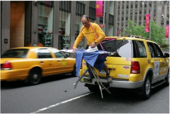

# LLaVA: Visual Instruction Tuning

> 这是机器辅助生成的客观摘要笔记。教学版精读笔记由用户按节奏触发后单独成稿。

## 一句话讲什么（TL;DR）
把"看图+按指令回答"做成端到端模型：用 GPT-4 自动造图文指令数据，再训一个能看图聊天的多模态助手。

## 这篇论文要解决什么问题（Why this paper）

想象你下班回家，拍了张冰箱内部照片发给一个 AI 助手，问它："今晚还能凑出一份酸奶燕麦碗吗？"——你期待它真的看图，然后说"还有一盒草莓酸奶和半袋燕麦，可以"。这件事在 2023 年初的开源世界里几乎不存在。

为什么？因为当时的 AI 工具是这样分工的：

- 视觉模型（CLIP、检测器、分割器）虽强，但每个都只解决一个固定任务，**接口僵硬**——你不能用自然语言切换它的"工作模式"。它们像只会做一道菜的厨师。
- 大语言模型（LLM，Large Language Model，大型语言模型）能听懂人话，但**眼盲**——只能处理文字。它像电话客服，听得懂你说什么但看不见你的冰箱。
- 已有的多模态模型（BLIP-2、Flamingo）虽然能"看图说话"，但**没专门用图文指令数据训过**，所以一让它"按指令回答"就退化成机械描述图片：你问"还有酸奶吗"，它回答"图片中有一个白色冰箱"。
- 关键缺口：**没有大规模的"看图+指令+回答"三元组数据**，因为人工标注又贵又难定义。

LLaVA 就是要补上这块：用纯文本 GPT-4 当"老师"自动造数据，把视觉编码器和 LLM 拼起来端到端微调。这是开源世界第一次把"视觉指令微调"（visual instruction tuning）这条路走通。

## 用了什么方法（How）

### 1. GPT-4 当数据厨子 — 用纯文本老师生成图文指令数据

**类比**：你想让外婆教徒弟做菜，但外婆住在另一个城市没法到现场。于是你把每道菜拍照、量好克数、写成菜谱寄过去，外婆看着菜谱写出一套"如果学徒问 X 你怎么回答"的教案。这里"外婆"是 GPT-4，"菜谱"是 caption + bounding box，"教案"是 158K 条指令数据。

**具体在干什么**：纯文本 GPT-4 看不见图，所以作者先把图片翻译成两类纯文字"骨架"——caption（场景描述，一两句话总结图里有什么）和 bounding box（物体框坐标，告诉 GPT "桌子在画面左下角，宽 0.3 高 0.2"）——再把这堆文字塞进 GPT-4 的 prompt，让它假装看到了图。

**三种生成出来的数据类型**：
- **Conversation（多轮对话）**：模拟用户和 AI 你来我往问图里的细节，例如"图里有几个人？""他们在做什么？"。**58K 条**。
- **Detailed description（详细描述）**：要求 AI 给出一段完整的图片描述。**23K 条**。
- **Complex reasoning（复杂推理）**：跨多个物体做逻辑推理，比如"假设这个人现在很饿，他会先去拿什么"。**77K 条**。

总共 **158K** 条。每种类型作者只手写了几个 seed example（种子样例）放在 prompt 里做 in-context-learning，剩下全靠 GPT-4 照葫芦画瓢。

**关键步骤（人话版）**：
1. 输入：COCO 数据集的图 + 该图的 5 条人工 caption + 该图的 bounding boxes。
2. 把这些信息拼成一段 prompt，开头写"想象你是一个能看见图的助手"。
3. 在 prompt 里塞 2-3 个手写示例（"如果场景是 X，你应该这样问答"）。
4. 让 GPT-4 顺着示例的语气生成新问答对。

**为什么这么设计**：人工标注图文指令数据贵到离谱（每条要懂图又要会写问答）。GPT-4 当老师能把单价从几美元降到几美分，且质量比 ChatGPT 更稳定（作者早期消融发现 GPT-4 的空间推理能力明显更强）。

**消融告诉我们什么**（Table 4，LLaVA-Bench COCO）：
- 全去掉 instruction tuning：总分 **21.5**（基本不会按指令回答）。
- 只用 conversation 数据：总分 **73.8**（聊天能力还行，复杂推理差 16 点）。
- 三种数据全用：总分 **85.1**。
- **结论**：detail + complex reasoning 数据虽然只占 63%（100K/158K），但贡献了 11 个点的提升——多样性比纯量更重要。

> 读到这里你可能在想：那模型本身长什么样？为什么 GPT-4 造的数据能直接训别的模型？答案是——架构故意做得极简，让"数据本身的质量"成为决定性变量。

### 2. 极简架构 — CLIP + 单层线性投影 + Vicuna 串成三明治

**类比**：你有一台只能播 PAL 制式磁带的老电视（Vicuna，只认词向量序列），手里却是一盘 NTSC 的录像带（CLIP 输出的视觉特征）。**单层线性矩阵 W** 就是那个最简陋的"制式转换器"——一块电路板，把 NTSC 信号一对一映射成 PAL，没有任何复杂解码逻辑。

**具体在干什么**：
- **CLIP ViT-L/14**（OpenAI 开源的视觉 Transformer，patch 大小 14×14，输入分辨率 224×224）把图切成 16×16=256 个 patch，每个 patch 经过 24 层 Transformer 后输出一个 1024 维向量。整张图变成 **256 个视觉 token**（外加 1 个 [CLS] token，作者实验里同时试了 grid features before/after the last Transformer layer）。
- 投影矩阵 **W**（一个 1024→4096 的全连接层，没有激活函数，没有 LayerNorm）把每个视觉 token 映射到 Vicuna 的词向量空间。
- 把这 256 个"伪词向量"和真正的文字 token 拼成序列，丢给 Vicuna 做自回归生成。

**关键公式（人话翻译）**：原文公式 (1) 是 `H_v = W · Z_v`，翻译成大白话就是"图片向量 × 一个矩阵 = 假装是词的向量"。一行矩阵乘法，没有任何 attention、gate、router。

**超参**：W 的输入维 1024（CLIP 输出），输出维 4096（Vicuna 词嵌入维度）。参数量约 4M——只占整个 13B 模型的 0.03%。

**为什么这么设计（极简的理由）**：
- 对比同期方案：Flamingo 用 gated cross-attention（复杂的双流交互，新增几亿参数），BLIP-2 用 Q-Former（一个独立的小 transformer 当桥梁，新增 188M 参数）。
- LLaVA 故意只用一个线性层 → 训练快、显存省、bug 少 → **作者能在两周内跑完十几组数据消融**。
- 论文原话："our simple projection scheme is lightweight, which allows us to iterate data centric experiments quickly."（轻量化是为了让数据实验更快迭代）

**消融告诉我们什么**：作者承认更复杂的接入方式（cross-attention、Q-Former）可能更强，但留作 future work——后续 LLaVA-1.5 把 W 换成 2 层 MLP 就涨了 ~2 点，证明这个接口确实有改进空间。但 LLaVA-1 用极简版已足够证明"数据 + 端到端微调"是 work 的。

> 读到这你可能在想：训这个怎么训？三个东西（CLIP / W / Vicuna）一起训会不会打架？答案是——分两阶段，每阶段只解冻一部分。

### 3. 两阶段训练 — 先对齐再指令微调

**类比**：教小孩学英语，先做"看图认词"（看见苹果说 apple），再做"按要求造句"（用 apple 写一段话）。第一阶段建立词汇对照表，第二阶段练表达能力。

**具体在干什么**：

- **Stage 1：Pre-training for Feature Alignment（预训练做特征对齐）**
  - **冻结**：CLIP 视觉编码器 + Vicuna 语言模型。
  - **只训**：投影矩阵 W（仅 4M 参数）。
  - **数据**：CC3M（Conceptual Captions 3M）筛过的 595K 图文对，每条转成单轮"请描述这张图 → 原始 caption"格式。
  - **超参**：lr=2e-3，batch=128，1 epoch，cosine 学习率 + 3% warmup。
  - **目的**：训练一个 compatible visual tokenizer（兼容的视觉分词器），让 W 学会"把图特征翻译成 Vicuna 能听懂的伪词向量"。
  - **耗时**：8×A100 上 4 小时。

- **Stage 2：Fine-tuning End-to-End（端到端微调）**
  - **冻结**：CLIP（始终冻结，避免破坏视觉表征）。
  - **解冻**：W + Vicuna 一起训。
  - **数据**：前面 GPT-4 造的 158K 指令数据，三种类型按均匀采样混合。
  - **超参**：lr=2e-5（比 Stage 1 小 100 倍，避免破坏 Vicuna 已有能力），batch=32，3 epochs。
  - **耗时**：8×A100 上 10 小时。
  - **目的**：让模型真正学会"按指令回答"而不只是描述。

**关键公式（人话翻译）**：原文公式 (3) 是 `p(X_a | X_v, X_instruct) = ∏ p_θ(x_i | X_v, X_instruct, <i, X_a, <i)`。翻译成大白话——"在看到图 + 指令的前提下，模型生成答案的总概率 = 一个一个 token 往外蹦，每个 token 都基于'图 + 指令 + 前面已经蹦出来的 token'决定下一个 token 是什么"。这就是普通 LLM 的自回归损失，只是把图当成额外的前缀塞进去。

**为什么这么设计**：
- 一阶段直接全部解冻 = 灾难。视觉特征还没对齐就改 Vicuna，会把 Vicuna 的语言能力毁掉。
- 两阶段把"对齐"和"指令"解耦，类似先学发音再学语法。
- CLIP 始终冻结：CLIP 的视觉表征是用 4 亿图文对预训练出来的，远超 LLaVA 微调的数据量，动它没意义且会过拟合。

**消融告诉我们什么**（Table 8，ScienceQA）：
- 完整两阶段：90.92%。
- 跳过 Stage 1 直接做 Stage 2：85.81%（**掉 5.11 个点**）。
- 7B 替代 13B：89.84%（掉 1.08 点）。
- 用 CLIP 倒数第二层而非最后一层特征：90.92% vs 89.96%（涨 0.96 点，因为最后一层偏向全局抽象，倒数第二层保留更多局部细节）。
- **结论**：alignment 阶段不能省；模型规模仍有红利但边际递减；视觉特征用倒数第二层更适合细粒度任务。

### 4. GPT-4 当裁判评测 — LLM-as-judge 范式开创

**类比**：高考作文，没有标准答案。请一位顶尖大学教授（GPT-4）按 1-10 分给两位考生（LLaVA + 看了答题提纲的 GPT-4 自己）的作文打分，再用比值报告（LLaVA / GPT-4 = 67.3%）。

**具体在干什么**：
1. 同一道题：图 + 问题 → 两份答案。
   - LLaVA 答案：直接看图回答。
   - 参考答案：让 text-only GPT-4 看 ground truth caption + bbox（相当于"作弊"看了图的标准描述）回答。
2. 让第三个 GPT-4 当裁判：同时看到问题、ground truth caption、两份答案，给每份打 1-10 分并写理由。
3. 报告 LLaVA 得分 / GPT-4 得分（百分比形式），把"绝对分难比较"问题转成"相对差距"。

**为什么这么设计**：
- 视觉指令任务没标准答案——同一张图同一个问题可以有 10 种合理答复，传统 BLEU/ROUGE 之类的字符串匹配会把所有非标准答案打成 0 分。
- GPT-4 裁判能理解"语义对了但措辞不一样"，相当于一个有判断力的人类。
- 用相对分数避开 GPT-4 自身的"打分偏置"（它倾向给所有合理答案打 7-9 分，绝对分挤在一起没区分度）。

**消融 / 验证**：作者跑三次同样的评测，std 都很小（0.5-2.0），说明这套裁判流程本身稳定。

**这套范式被广泛沿用**：MMBench、SEED-Bench、MM-Vet 全部基于 LLM-as-judge 思路，只是换了不同的题目集和打分维度。

## 关键实验结果（What works）

### 结果 1：LLaVA-Bench (In-the-Wild) 总分 67.3%

- **具体设置**：作者自建评测集，24 张图 + 60 个问题，覆盖室内/室外/表情包/绘画/素描，每张图配人工写的高细节描述当 ground truth。LLaVA-13B 看图回答，GPT-4 看 ground truth caption 回答，第三个 GPT-4 当裁判给 1-10 分，报相对百分比。
- **数字**：LLaVA 67.3% ± 2.0，BLIP-2 38.1% ± 1.0，OpenFlamingo 19.1% ± 0.4。
- **对比**：LLaVA 比 BLIP-2 高 **29 个点**，比 OpenFlamingo 高 **48 个点**。
- **现实意义**：这相当于从"勉强能用"跳到"可以日常聊天"。在没有视觉指令数据的情况下，BLIP-2 只能机械描述图片，而 LLaVA 能真正理解用户想问什么。同等规模下指令跟随能力第一次真正与闭源 GPT-4V 拉近距离。

### 结果 2：复杂推理子项 81.7%

- **具体设置**：LLaVA-Bench (In-the-Wild) 60 个问题里专门挑出复杂推理类的问题（如"假设这个人现在很饿，他会先去拿什么"），单独算分。
- **数字**：LLaVA 在复杂推理子项 81.7% ± 1.8。
- **对比**：BLIP-2 是 32.9，OpenFlamingo 是 19.1——差距更大（**LLaVA 是 BLIP-2 的 2.5 倍**）。
- **现实意义**：参考线是看了 ground truth caption 的纯文本 GPT-4（即"作弊"版），LLaVA 看真图做推理已经达到对手 81.7% 的水平。这说明指令微调对"推理"这件事真的起作用了——比起单纯的图文对齐，**指令数据中的复杂推理样本（77K 条）直接灌输了"步步推理"的输出范式**。

### 结果 3：ScienceQA 92.53%（LLaVA + GPT-4 ensemble）

- **具体设置**：ScienceQA 是 21K 多模态理科选择题（小学到高中物理化学生物），含 12726 train / 4241 val / 4241 test。LLaVA 单模型先训 12 epochs；ensemble 方案是当 LLaVA 和 GPT-4 答案不一致时，让 GPT-4 当裁判选最终答案。
- **数字**：LLaVA 单模型 90.92%，LLaVA + GPT-4 judge ensemble **92.53%**，前 SOTA MM-CoT_Large 91.68%，人类 88.40%。
- **对比**：LLaVA 单模型差 SOTA 仅 0.76 点；ensemble 后超 SOTA 0.85 点；超人类 4.13 点。
- **现实意义**：这是首次有开源通用 VLM 在标准学术 benchmark 上赢过专门为该任务设计的方法（MM-CoT 是为多步推理科学题特意设计的架构）。也是首次用 LLM-as-judge 做模型集成（不是简单投票，而是让 GPT-4 综合两份答案再决策）。

### 结果 4：核心消融（Table 4 + Table 8）

- **具体设置**：在 LLaVA-Bench (COCO) 和 ScienceQA 上变换训练数据/阶段，看分数变化。
- **数字**：
  - 跳过 Stage 1 直接训 ScienceQA → **掉 5.11 点**（85.81 vs 90.92）。
  - 7B 替代 13B → 掉 1.08 点（89.84 vs 90.92）。
  - 完全不做 instruction tuning → 掉 **63.6 点**（21.5 vs 85.1）。
  - 只用 conversation 数据 → 掉 11.3 点（73.8 vs 85.1）。
  - 用 CLIP 倒数第二层而非最后一层 → 涨 0.96 点。
- **对比**：instruction tuning 这个开关本身贡献 60+ 点，是 LLaVA 性能的根基；alignment 阶段只贡献 5 点但不可省；模型规模红利仅 1 点。
- **现实意义**：告诉后续研究者**优先级排序**——先保证 instruction tuning 数据质量与多样性，再调对齐流程，最后才是堆参数。这条经验后来被 LLaVA-1.5、InternVL、Qwen-VL 等后续工作完全遵循。

### 涌现行为（Emergent Behaviors）

- **Elon Musk 识别**（Fig. 6）：训练数据从未出现过 Elon Musk，但 LLaVA 能在头像照和"Elon Musk 扮成 doge"的表情包里都认出他。这说明 CLIP 视觉编码器的预训练数据见过他，且 LLaVA 学会了把视觉特征 → 名字这条通路。
- **HTML/CSS 代码生成**（Fig. 2）：用户画一张网站草图，LLaVA 能直接输出可渲染的 HTML/JS/CSS 代码（仅含一个小 bug）。这是 Vicuna 编程能力 + 视觉理解的复合效果。
- **OCR 能力**（Table 9）：训练数据里几乎没有专门的 OCR 任务，但 LLaVA 能读出 meme 上的英文。同样来自 CLIP 的预训练溢出。

## 我读完后该懂的几个术语

- **Visual Instruction Tuning（视觉指令微调）**：在"图+指令+回答"三元组数据上微调多模态模型，让它学会按人话办事而不是机械描述图片。类比"教学徒不只是认菜，还得听懂'帮我把这道菜咸度调低'"。**出现在标题与全文核心论点**。
- **CLIP ViT-L/14（视觉编码器）**：OpenAI 训的 Vision Transformer，patch 大小 14×14。把图切成马赛克小格子，每格输出一个特征向量。类比"把照片切成几百块拼图，每块单独给一串 DNA 编码"。**出现在 §4.1 Architecture**。
- **Projection Matrix W（投影矩阵）**：单层线性层，把 CLIP 输出的视觉向量映射到 LLM 词向量空间。类比"USB 转 Type-C 转接头"——LLaVA-1 故意只用一层；后续 LLaVA-1.5 升级成 2 层 MLP。**出现在 §4.1 公式 (1)**。
- **Vicuna（语言主干）**：基于 LLaMA、用 ShareGPT 用户对话数据微调的开源 LLM，13B 和 7B 两个尺寸。类比"已经会聊天的兄长"。**出现在 §4.1 选型说明**。
- **LMM (Large Multimodal Model，大型多模态模型)**：跟 LLM 一字之差但多了视觉。LLaVA 是这个词流行的起点之一。**出现在 §1 Introduction 和 §2 Related Work**。
- **In-context Learning Seed Examples（上下文学习种子样例）**：人工写几条样例放进 GPT-4 的 prompt，让它照葫芦画瓢生成更多。类比"先给厨师看两道范例菜，他就懂套路了"。**出现在 §3 数据生成**。
- **Symbolic Representation（符号化表示）**：把图翻译成 caption + bounding box 这种纯文字"骨架"，让纯文本 GPT-4 也能"伪装看到图"。**出现在 §3 第二段**。
- **LLaVA-Bench (In-the-Wild)**：作者自建的评测集，24 张图 60 个问题，覆盖室内外、表情包、绘画、素描，用来测真实世界泛化能力。**出现在 §5.1 评测**。

## 这篇论文的局限 / 我看出的疑点

- **"图当成 patch 袋子"问题**：LLaVA 把图当成无序 patch 集合，不能精细绑定语义。文中举例：冰箱里有酸奶+草莓，问"有草莓味酸奶吗"它会错答 yes，因为它把两个 patch 概念合并了。**用户实际遇到**：购物类问答、医学影像问答这种需要精确属性绑定的场景容易翻车。
- **分辨率与知识覆盖瓶颈**：CLIP ViT-L/14 输入分辨率 224×224，远不够识别招牌、品牌 logo、小字。**用户实际遇到**：拍菜单问"这家店有素食吗"、拍药盒问"成分里有阿司匹林吗"都做不好，需要 OCR + 高分辨率视觉。
- **数据由 GPT-4 自动生成**：质量上限被老师模型卡住，且会继承 GPT-4 的偏见和幻觉，缺乏严格的事实校验。**用户实际遇到**：碰到 GPT-4 也答错的题，LLaVA 大概率跟着错。
- **评测方式自我循环**：用 GPT-4 当裁判评 LLaVA 输出，可能存在系统性偏好（GPT-4 偏爱 GPT-4 风格的答案）。**用户实际遇到**：benchmark 分数高不一定等于真实体验好；后续 MM-Vet、SEED-Bench 等评测就是为了缓解这个问题。

## 与其他 12 篇的关联

- **范式开创：影响后续所有 VLM**——LLaVA 的"CLIP + 投影层 + LLM"成为后续 VLM 的默认架构。OpenVLA、π0、RT-2 这类 VLA（Vision-Language-Action）模型都复用了这套视觉接入方式：先用 CLIP-style encoder 把图变 token，再过一个轻量映射层喂给 LLM。区别只在投影层从 1 层 MLP 升级到 2 层、视觉 encoder 换成更强的 SigLIP/DINOv2。如果说 Transformer 是 LLM 的祖宗，LLaVA 就是开源 VLM 的祖宗。
- **与 SayCan / PaLM-E 的分工对比**——SayCan 是"高层任务规划"层（用 LLM 规划机器人下一步做什么），LLaVA 是"看图聊天"层（让模型能看图回答）。PaLM-E 把两者揉在一起做 embodied reasoning（具身推理）：它的视觉 token 化方案是 LLaVA 的一个工程化变种。LLaVA 提供了 PaLM-E 视觉接入方案的简化开源替代——你可以认为 PaLM-E 是 Google 闭源版的"LLaVA + 机器人"。
- **数据 reformation 思路被广泛复用**——"用强模型造指令数据"这一招，在 RT-2、OpenVLA 的 cotraining（混合训练）数据构造里都能看到影子：用 PaLI / LLaVA-Next 给机器人轨迹数据自动生成自然语言标注，扩展原本只有 action label 的数据集。

## 数据集 / 实验设置详情

**预训练数据：CC-595K**
- 来源：CC3M（Conceptual Captions 3M，Google 开源的图文对，从网页 alt-text 自动抽出来的）。
- 筛选过程：用 spaCy 抽 caption 里的名词短语（noun phrase），统计频次，去掉频次 <3 的稀有概念，再对频次 >100 的常见概念采样最多 100 条，最终留下 **595K**（约占原始 CC3M 的 1/5）。
- 用法：每条转成"请描述这张图 → 原始 caption"格式做单轮对话。

**指令微调数据：LLaVA-Instruct-158K**
- 图来源：COCO 2014 train（每张图都有人工 5 条 caption + bounding box，是构造 prompt 的天然原料）。
- 构造方法：见上文方法 1。
- 三种类型：Conversation 58K + Detail 23K + Complex 77K。
- 公开：HuggingFace 上能直接下载（liuhaotian/LLaVA-Instruct-150K）。

**评测集 1：LLaVA-Bench (COCO)**
- 30 张 COCO val 图，每张 3 个问题（conversation/detail/complex），共 **90 个问题**。
- 用途：消融实验主战场。

**评测集 2：LLaVA-Bench (In-the-Wild)**
- 24 张多样化图（室内/室外/meme/绘画/素描），60 个问题。
- 每张图人工写超详细 caption 当 ground truth。
- 用途：测真实世界泛化能力。

**评测集 3：ScienceQA**
- 21K 多模态理科选择题，覆盖 3 学科 / 26 主题 / 127 类别 / 379 技能。
- Split：12726 train / 4241 val / 4241 test。
- 用途：测推理能力的硬指标。

**Baseline 对比对象**：
- **BLIP-2**（Salesforce，2023）：Q-Former 接入方案。
- **OpenFlamingo**（LAION，2023）：Flamingo 的开源复刻，cross-attention 接入。
- **LLaMA-Adapter**（2023）：参数高效微调。
- **MM-CoT**（Amazon，2023）：ScienceQA 专用多模态思维链。
- **GPT-3.5 / GPT-4**（OpenAI）：纯文本上限。

**硬件 / 训练时长**：
- 全程 **8 × A100 (80GB)**。
- Stage 1 预训练：4 小时（CC-595K，1 epoch）。
- Stage 2 微调：10 小时（Instruct-158K，3 epochs）。
- ScienceQA 微调：4 小时。
- **总计约 18 小时 ≈ 144 A100-hours**——按 AWS 价格估算 $300-500，是研究生组也能负担的量级。这也是为什么 LLaVA 能引爆开源 VLM 浪潮：复现门槛低。

**优化器配置**：Adam，无 weight decay，cosine 学习率，warmup 比例 3%。开 BF16 + TF32 + FSDP（Full Shard Data Parallel）+ gradient checkpointing 省显存。

## 关键公式 / 算法（人话翻译版）

### 公式 1：视觉特征投影

**原文**：`H_v = W · Z_v, with Z_v = g(X_v)` （公式 1）

**人话翻译**："**伪词向量 = 投影矩阵 × 视觉特征**，其中视觉特征 = CLIP 处理图片的输出。"

**每一项的来源**：
- `X_v`：原始图像（224×224 像素）。
- `g(·)`：CLIP ViT-L/14 视觉编码器（OpenAI 预训练，全程冻结）。
- `Z_v`：256 个 patch 对应的 1024 维特征向量序列。
- `W`：单层线性矩阵（1024→4096，可训练，4M 参数）。
- `H_v`：256 个"伪词向量"，每个 4096 维，与 Vicuna 的词嵌入维度对齐，可以直接和真实词向量拼一起。

### 公式 2：多轮对话指令格式

**原文**：第一轮 `X^t_instruct = randomly choose [X^1_q, X_v] or [X_v, X^1_q]`；后续轮 `X^t_instruct = X^t_q`（公式 2）

**人话翻译**："**第一轮**用户问题里随机决定图片放在问题前还是问题后（比如'<图> 这是什么动物?' 或 '这是什么动物? <图>'），让模型对位置不敏感；**之后几轮**就只放问题，不再重复贴图（图片信息已经通过 KV cache 留在上下文里了）。"

**为什么这么设计**：避免模型死记硬背图片位置；同时省 token。

### 公式 3：训练损失函数

**原文**：`p(X_a | X_v, X_instruct) = ∏_{i=1}^{L} p_θ(x_i | X_v, X_instruct,<i, X_a,<i)` （公式 3）

**人话翻译**："给定图 + 指令，模型生成完整答案的概率 = 把答案里每个 token 的条件概率乘起来。每个 token 都基于'图 + 指令 + 当前位置之前已生成的所有 token'预测。"

**每一项的来源**：
- `X_a`：目标答案（assistant 那段绿色 token）。
- `X_v`：图（视觉前缀）。
- `X_instruct`：用户指令。
- `θ`：可训练参数（Stage 1 只是 W；Stage 2 是 W + Vicuna）。
- `x_i`：答案中第 i 个 token。
- `<i`：表示"当前位置之前的所有"。

**实际损失**：对 `log p` 取负数求和（cross-entropy），且**只在 assistant 答案的 token 上计算 loss**（Table 2 里绿色部分），用户指令和图 token 不参与监督。

## 实操 FAQ（如果你想复现）

**Q: 这模型多大？显存要多少？**
A: LLaVA-13B（默认）= Vicuna-13B (~26GB BF16) + CLIP ViT-L/14 (~600MB) + W (~16MB)。推理至少需要 28GB 显存，单张 A100/H100/L40S 能跑。LLaVA-7B 版本 14GB 显存就够，4090 (24GB) 能跑。训练用 8×A100 (80GB) 配 FSDP + gradient checkpointing。

**Q: 数据在哪？要授权吗？**
A:
- LLaVA-Instruct-158K：HuggingFace `liuhaotian/LLaVA-Instruct-150K`，研究用免费。
- CC-595K 子集：作者发布了筛选后的索引列表，图片要自己按 CC3M 协议抓（部分链接已失效，社区有 mirror）。
- COCO 2014：原始来源，研究用免费。
- ScienceQA：lupantech/ScienceQA，研究用免费。
- 注意：用 GPT-4 生成的指令数据受 OpenAI 条款限制——**不能用于训练直接竞争 OpenAI 的商业模型**，但学术研究和开源复现没问题。

**Q: 代码 repo 在哪？**
A: 官方代码：[github.com/haotian-liu/LLaVA](https://github.com/haotian-liu/LLaVA)（论文里给的是匿名 repo，正式发布后挪到这里）。Demo 站：[llava-vl.github.io](https://llava-vl.github.io)。HuggingFace 模型权重：`liuhaotian/llava-v1-13b`。

**Q: 训练一次烧多少卡时？**
A: 完整 LLaVA-13B 流程 = Stage 1 (4h) + Stage 2 (10h) + 可选 ScienceQA (4h) ≈ **18 小时 × 8 A100 = 144 A100-hours**。按 AWS p4d 实例 $32/小时折算，硬件成本约 $580。这是 2023 年开源 VLM 圈的"实验室友好"基准——任何有 8 卡 A100 的高校组都能复现。

**Q: 复现踩坑提示**：
- Vicuna 权重最初要先下 LLaMA 再加 delta，现在 HuggingFace 上有合并版（lmsys/vicuna-13b-v1.3）。
- CC3M 部分图片链接已失效，建议直接用 LAION-COCO 或 ShareGPT4V 做替代预训练数据（LLaVA-1.5 后官方也改用更干净的数据）。
- Stage 2 的 lr=2e-5 不要乱调高，调到 5e-5 会把 Vicuna 的语言能力训坏。

## 失败案例与边界

原文 §5.1 Limitations 和 Table 6 揭示了 LLaVA 的边界：

### 失败案例 1：草莓酸奶悖论（"bag of patches"问题）
**场景**：冰箱里同时有"草莓"和"原味酸奶"，问 LLaVA "有草莓味酸奶吗"。
**LLaVA 回答**：Yes（错）。
**根因**：LLaVA 把图当成 256 个无序 patch 的"袋子"，看到"草莓"概念 + "酸奶"概念就把它们合并成"草莓味酸奶"，**没有精细的属性绑定（attribute binding）**。这在购物问答、医学影像、零件识别等需要精确语义的场景会致命。

### 失败案例 2：高分辨率知识 OCR
**场景**：拍一张 ICHIRAN 拉面店的照片问"这家店叫什么名字"。
**LLaVA 回答**：常常错（"a Japanese restaurant"），看不清招牌上的小字。
**根因**：CLIP ViT-L/14 输入分辨率 **224×224**——一张菜单/招牌缩到这个分辨率小字基本糊成一团。这也是 LLaVA-1.5 后续把分辨率升到 336×336 的原因。

### 失败案例 3：Yogurt 品牌识别
**场景**：冰箱里有 Fage 蓝莓酸奶杯，问"那个蓝莓味酸奶是什么牌子"。
**LLaVA 回答**：常常猜不对或答 "I don't know"。
**根因**：双重瓶颈——分辨率不够 + CLIP 训练数据没有充分覆盖小众品牌 logo。

### 通用边界（论文 Broader Impact 段）
- **幻觉（hallucination）**：和所有 LLM 一样，LLaVA 可能编造图里没有的细节。
- **偏见（bias）**：从 CLIP 和 Vicuna 继承种族、性别、文化偏见。
- **OpenAI 条款限制**：用 GPT-4 生成的数据训出的模型不能商用对抗 OpenAI 自家产品。
- **能耗**：当前规模能耗不大，但放大到 65B 量级后就要重视。

## 这篇论文之后的延伸阅读

按"前传 → 同期对手 → 续作 → 衍生方向"四类排序：

1. **前传：BLIP-2（Li et al., 2023, ArXiv 2301.12597）** — 用 Q-Former 替代线性投影，是 LLaVA 之前最强的"冻结 LLM + 接入视觉"方案。读完 LLaVA 再读 BLIP-2 能清楚看到"线性层 vs Q-Former"的工程取舍。
2. **同期对手：Flamingo / OpenFlamingo（Alayrac et al., 2022; Awadalla et al., 2023）** — 用 gated cross-attention 接入，更强但更慢。LLaVA 在 LLaVA-Bench (In-the-Wild) 上把 OpenFlamingo 打得满地找牙（19.1 vs 67.3），是验证"端到端微调 vs 冻结 cross-attn"的关键对比。
3. **续作：LLaVA-1.5（Liu et al., 2023, ArXiv 2310.03744）** — 同一组人写的"改进版"。投影层从 1 层升到 2 层 MLP，分辨率 224→336，加入 academic VQA 数据。建议**所有真正想用 LLaVA 的人直接读 1.5 版**——这才是工业可用的基线。
4. **续作：LLaVA-NeXT（Liu et al., 2024）** — 支持任意分辨率（最高 672×672），多图理解，是当前 LLaVA 系列性能最强版。
5. **衍生：PaLM-E（Driess et al., 2023, ArXiv 2303.03378）** — Google 把 LLaVA 思路扩展到机器人具身控制，输入图 + 状态，输出动作。可以认为 PaLM-E 是 "LLaVA + 机器人"的闭源版。LLaVA 的视觉接入方案在 PaLM-E 中作为基础组件之一被引用。

## 我建议的阅读顺序

面向零基础读者，这篇论文不要从头读到尾。建议路线：

1. **先读 Abstract（摘要）+ §1 Introduction 第一段** — 知道这篇论文要解决"开源界没有图文指令数据"这个具体问题。**为什么这么读**：先建立动机，避免被后面的公式吓退。
2. **看 Figure 1（架构图，img_031）** — 一眼看清"CLIP → W → Vicuna"三件套。**为什么这么读**：架构图比 30 行公式更快建立心智模型。
3. **跳到 §3 GPT-assisted Visual Instruction Data Generation** — 重点看数据怎么造的、为什么能造（caption + bbox 当符号化骨架）。**为什么这么读**：这是这篇论文真正的创新点，方法部分反而很标准。
4. **读 §4.2 Training（两阶段训练）** — 理解 Stage 1 / Stage 2 各冻结什么、训什么。**为什么这么读**：未来你看任何 VLM 论文都会用类似 recipe，这是"基础工序"。
5. **跳过 §4.1 公式细节**（除非你想自己实现） — 知道是单层线性映射就够了。**为什么这么读**：公式 (1)-(3) 没有出乎意料的地方，时间花在 §3 更值。
6. **快速扫 §5 Experiments 的 Table 4 / Table 5** — 看消融表里"去掉 instruction tuning"和"只用 conversation"分别掉多少分。**为什么这么读**：表格直接告诉你哪些设计选择最重要，比读正文叙述高效。

读完这 6 步大约 40-60 分钟，已经能在和别人讨论 VLM 时报出 LLaVA 的核心思路。

## 为什么值得读 / 不值得读

VLM/VLA 入门**必读**。

- **如果你只能读 1 篇 VLM 论文**：就读它。架构最简、思路最清、消融最充分，是理解"为什么现代多模态助手都长一个样"的最佳起点。
- **如果你能读 3 篇**：LLaVA + BLIP-2 + Flamingo——三种不同的视觉接入方式（线性层 / Q-Former / Cross-attention）让你看清这条路上的设计空间。
- **如果你能读 5 篇**：再加 PaLM-E 和 LLaVA-1.5（如果算它的话）——看 LLaVA 思路怎么扩展到具身和怎么自我迭代。

不值得花太多时间在公式细节上：这篇论文的贡献是**数据 + 工程范式**，不是数学新意。把时间花在动手跑一遍官方 demo（llava-vl.github.io）比抠公式收益高 10 倍。
