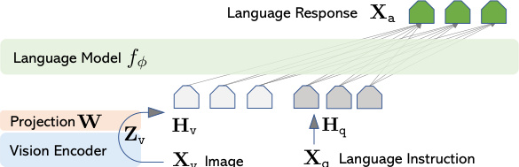
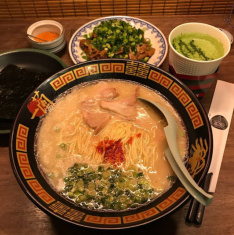
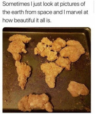

# LLaVA: Visual Instruction Tuning

> 这是一份给"完全没接触过 AI"的读者看的精读笔记。语言尽量像聊天，公式全部翻译成人话。

## 一句话讲什么（TL;DR）

让一个本来只会聊天的 AI，长出"眼睛"，能边看图边按你说的去回答问题。

*所以这一节是想说：这篇论文做出了一个"会看图的聊天 AI"。*

---

## 这是个什么场景

想象你周末在家，拍了一张冰箱里面的照片，发给一个 AI 助手：

> "我这冰箱还能凑出一份酸奶燕麦碗吗？"

你期待的回答是："看到一盒草莓酸奶 + 半袋燕麦，可以的"。

可在 2023 年初，市面上的 AI 大致分两种：

- **只会聊天的 AI**：能听懂你说话，但完全看不见图。像电话客服。
- **只会"看一眼"的 AI**：能识别一张图里有什么物体，但不会跟你聊天。像超市自助结账机器，扫到苹果只会蹦出"苹果 ¥4.5"，不会陪你商量晚饭吃啥。

LLaVA 想做的事，是把这两种 AI 缝合成一个：**既看得见图，又能按你说的话回答**。听上去理所当然，但当时开源世界里没有人做到。

*所以这一节是想说：LLaVA 要造的是一个"既有眼睛、又会聊天"的 AI 助手。*

---

## 之前的人怎么做的，为什么不够好

- **方案 A：把图片识别工具和聊天 AI 拼一起**
  类比：你对着翻译笔说话，翻译笔再把英文打字给一个不会英文的客服。中间要经过两个人转述，**容易丢信息**。

- **方案 B：用 BLIP-2 这类已有模型**
  类比：这种模型像"看到图就背一段固定描述"的导游。你问"这家店有没有素食"，它只会回答"图里有一家拉面店"——它**只会描述**，不会按你的问题作答。

- **方案 C：用 Flamingo 这种闭源模型**
  类比：能力强一点的导游，但讲解词都被锁在保险柜里——**不开源**，外面的人没法学也没法改。

- **核心难题：没有合适的"练习题"**
  要训练一个"看图 + 听指令 + 给答案"的 AI，得先有一大堆这样的练习题（图 + 问题 + 标准答案）。但**人手写一条这样的题超贵**——既要会看图、又要会编问题、还得写出像样的答案。

- **结论**：真正缺的不是模型本身，是"练习题"。

*所以这一节是想说：以前没人能做出这种 AI，主要是因为没人有这么大一套"看图问答"的练习题。*

---

## 这篇论文的新想法

**让一个根本看不见图的 GPT-4，靠"看着文字描述"批量出题，给后来的 AI 当练习册。**

听起来反直觉——一个看不见图的家伙怎么出"看图题"？后面会讲。

*所以这一节是想说：核心创新是用 GPT-4 自动出"看图练习题"，绕开了人工标注的高昂成本。*

---

## 它分几步做的（方法）

整个论文做了 4 件事：造练习题、设计模型结构、分阶段训练、设计评分方式。

### 1. 让 GPT-4 当出题老师，造 158K 道看图练习题

**类比**

你想教一个学徒做菜，但师傅住在另一个城市，没法到现场。怎么办？

> 你把每道菜：拍照、量好克数、写成文字菜谱，邮寄过去。
> 师傅根据菜谱，写出一套"如果学徒问 X，你该怎么回答"的练习题。

师傅其实**没看到菜本身**，只是看了菜谱。但因为菜谱足够详细，师傅出的题完全合理。

LLaVA 用的就是这个套路：

- **师傅**=GPT-4（一个非常会答题的纯文字 AI，不会看图）
- **菜谱**=每张图配的两种文字资料：
  - **图片描述**：一两句话写出图里有什么。
  - **物体框坐标**：告诉 GPT"桌子在画面左下角，宽 0.3，高 0.2"。
- **练习题**=158,000 条"图 + 问题 + 答案"。

> **图片描述（caption）**：人写的一两句话，总结一张图里发生了什么。比如"两个小朋友在公园玩滑梯"。
>
> **物体框（bounding box）**：用一个矩形框出图里某个东西的位置和大小。坐标就是这个矩形左上角和右下角在画面上的位置。

**它在干什么**

1. 拿一张已经有人写好描述和物体框的图（来自 COCO 这个公开图库）。
2. 把这些文字塞给 GPT-4，开头写一句："假装你能看到这张图……"。
3. 再给 GPT-4 看 2-3 个手写的示范题。
4. 让它照葫芦画瓢，编出更多问答。

**生成出来的三种练习题**

- **多轮对话**：模仿用户和 AI 一来一往。"图里有几个人？"→"两个"→"他们在干嘛？"→"在玩滑梯"。共 58,000 条。
- **详细描述**：要求 AI 用一段话把图描述清楚。共 23,000 条。
- **复杂推理**：跨多个物体动脑筋。"假设这个人很饿，他会先伸手拿哪样东西？"共 77,000 条。

**为什么这步有用**

- 人工写一条这种题要好几美元，GPT-4 自动出题只要几美分——**便宜 100 倍**。
- 三种题混合，让模型学到"会聊天 + 会描述 + 会推理"三种能力。后面的实验也证明：只要把"复杂推理"那 77K 条去掉，分数会掉很多。

*所以这一节是想说：用 GPT-4 当老师批量造题，用最低成本搞定了最缺的那块——练习册。*

---

### 2. 模型结构：把"眼睛"和"嘴巴"用一根管子接起来

**类比**

你有一台老式电视机，只能播一种格式的录像带。手里却是另一种格式的带子。怎么办？

> 中间塞一个简单的"格式转换器"——一块小电路板，把信号转成电视认识的格式。

LLaVA 就是这个思路：

- **眼睛**：一个已经训练好的图片识别模型（叫 CLIP）。给它一张图，它会输出一串数字向量，相当于"这张图的数字摘要"。
- **嘴巴**：一个已经训练好的聊天 AI（叫 Vicuna）。它本来只认"词的数字向量"。
- **格式转换器**：一个数字表格（论文里叫投影矩阵 W），负责把眼睛输出的数字翻译成嘴巴认识的格式。

> **向量**：就是一串数字，比如 (0.3, 0.7, -0.1, ...)。两个向量越像，几何上夹角越小——这点高中课本讲过。AI 把"一张图"或"一个词"变成几千维的向量来处理。
>
> **矩阵**：一张数字表格，有行有列。"矩阵 × 向量"是一种数字运算，效果就是把一个向量按某种规则变成另一个向量——可以理解成"用一张对照表查一下，把旧编码翻成新编码"。
>
> **CLIP**：OpenAI 训练的一个图片识别模型，给它一张图，能返回这张图的数字摘要。这里只用到它当"眼睛"，本身不再训练。
>
> **Vicuna**：一个开源的聊天 AI，可以理解成 ChatGPT 的免费亲戚。这里当"嘴巴"。

**它在干什么**

1. 给 CLIP 一张图（224×224 像素的小图）。
2. CLIP 把图切成 16×16=256 个小方块（像把照片裁成马赛克），每个方块输出一个 1024 维向量。
3. 用一个 1024→4096 的数字表格（W）把每个向量翻成 4096 维——刚好对上 Vicuna 的"词向量"格式。
4. 把这 256 个翻译后的向量当成"假装是词的输入"，和真正的文字一起塞给 Vicuna。
5. Vicuna 像平常聊天那样吐出回答。

**关键公式翻译成人话**

原文写：`H_v = W · Z_v`

人话："**翻译过的图向量 = 数字表格 × 原始图向量**"。一行查表运算，没了。

**为什么这步有用**

- 这种"格式转换器"做得**故意简单**——只用一层数字表格，参数只占整个模型的 0.03%。
- 简单的好处：训练快、显存省、bug 少。作者两周内就跑完了十几组对比实验。
- 同期别人做的"转换器"复杂得多（双向交互、加门控等），但 LLaVA 证明：**只要练习题够好，简单的接口也够用**。

*所以这一节是想说：眼睛和嘴巴之间只用了一个最简单的"格式转换器"，把复杂度全部留给了练习题。*

---

### 3. 分两阶段训练：先认词，再造句

**类比**

教小孩学英语，老师不会一上来就让他写作文，而是：

1. **第一阶段**：看图认词。看到苹果说 apple，看到狗说 dog。
2. **第一阶段**：用这些词造句、回答问题。

LLaVA 就是这样分两步。

> **训练**：让模型反复做练习题，根据答错的地方调整自己内部的数字。每次只调整一点点，做的题足够多以后整体就变好了。
>
> **冻结**：训练时**不动**某一部分的数字，只让其他部分变化。像考试时手不动键盘一样，让某些组件保持原样。
>
> **扣分（loss）**：模型回答和正确答案的差距，越小越好。模型训练的全部目标就是想办法让这个总扣分变低。
>
> **下山找最低点（梯度下降）**：训练的方法。把"扣分"想成一座山的高度，模型每次都试探一下哪个方向是最陡的下坡，然后往那个方向迈一小步，反复迈，最后落到山谷里——也就是扣分最少的状态。

**Stage 1（先认词）**

- **冻结**：眼睛（CLIP）和嘴巴（Vicuna）都不动。
- **只训**：中间那个数字表格 W。
- **练习册**：59.5 万条简单的"图 → 一句描述"。
- **目标**：让 W 学会"把图向量翻译成嘴巴听得懂的格式"。
- **耗时**：8 张高端显卡跑 4 小时。

**Stage 2（再造句）**

- **冻结**：眼睛（CLIP）继续不动。
- **解冻**：W 和嘴巴（Vicuna）一起训练。
- **练习册**：前面 GPT-4 出的 158K 条看图问答。
- **目标**：让模型学会按指令回答，不只是机械描述。
- **耗时**：8 张显卡跑 10 小时。

**关键公式翻译成人话**

原文是一长串符号。翻译过来：

> 在已经看到图 + 问题的前提下，模型要一个字一个字地往外蹦答案；蹦下一个字时，要参考"图 + 问题 + 已经蹦出来的所有字"。

把句子想成"接龙游戏"：**前面接什么，决定后面跟什么**。

**为什么这步有用**

- 如果一上来就让所有部分一起训练，会出大乱子：图还没翻译对，就开始改嘴巴，把嘴巴本来会说的话也搞坏了。
- 分两步的好处：先把"翻译器"调好，再让"嘴巴"配合改造。像先校准乐器再合奏。
- 实验数据：跳过 Stage 1，分数会掉 5 个点；完全不做 Stage 2 那种指令训练，分数掉 60 多个点。所以**Stage 2 是性能的命根**。

*所以这一节是想说：训练分两步——先让翻译器对齐，再让翻译器和嘴巴一起练习按指令回答。*

---

### 4. 用 GPT-4 当裁判打分

**类比**

高考语文作文没有标准答案。怎么打分？请几位顶尖大学的中文系教授来看，按 1-10 分打。这里 GPT-4 就是那位教授。

**它在干什么**

1. 同一道"看图题"出两份答案：
   - LLaVA 的答案：自己看图回答。
   - 参考答案：让 GPT-4 看着"图的文字描述 + 物体框"回答（相当于"作弊"看了答题大纲）。
2. 让第三个 GPT-4 当裁判：同时看到题目、答题大纲、两份答案，分别给 1-10 分。
3. 最后报告：LLaVA 的分 ÷ 参考答案的分，例如 67.3%。

**为什么这步有用**

- 看图题没有"唯一正确答案"——同一张图同一个问题可以有 10 种合理回答。
- 传统打分方法是逐字对比——只要措辞不一样就算错，太苛刻。
- 让 GPT-4 看语义，能识别"意思对了但说法不同"的回答，更接近真实判断。

**这套打分方式被后来很多论文继续用**——LLaVA 算是开了头。

*所以这一节是想说：作者顺手发明了一套"让 AI 当裁判"的打分体系，被后来的论文广泛沿用。*

---

## 关键数字（What works）

数字本身不重要，重要的是它们告诉你什么"设计选择"才是关键。

### 数字 1：聊天能力总分 67.3%

- **怎么算的**：在作者自己造的 24 张图 + 60 道题的评测集上，LLaVA 得分除以"作弊版 GPT-4"的得分。
- **对比**：BLIP-2 是 38.1%，OpenFlamingo 是 19.1%。
- **生活语言**：LLaVA 比上一代开源选手高出近 30 分。打个比方，原来开源 AI 是"勉强能用"，LLaVA 是"可以日常聊天"了。

### 数字 2：复杂推理子项 81.7%

- **怎么算的**：上面那批题里，专挑要"动脑子推理"的题再算一遍。
- **对比**：BLIP-2 是 32.9——LLaVA 是它的 **2.5 倍**。
- **生活语言**：在"假设这个人现在很饿，他会拿什么"这种题上，LLaVA 答得已经接近"作弊版 GPT-4"。说明那 77K 条复杂推理练习题真的把"会推理"刻进了模型里。

### 数字 3：理科选择题 92.53%

- **怎么算的**：在 ScienceQA（一套从小学到高中的物理化学生物多选题）上的正确率。
- **对比**：之前最强方法 91.68%，人类平均 88.40%。
- **生活语言**：第一次有"通用聊天 AI"在标准学术题库上**赢过为这道题专门设计的方法，也赢过普通人**。

### 数字 4：去掉指令练习题 → 掉 63.6 分

- **怎么算的**：训练时**不**用 GPT-4 出的那 158K 题，只用最早那批简单图文。
- **对比**：85.1（用了）vs 21.5（没用）。
- **生活语言**：相当于这是 LLaVA 的"命根"。如果不让它做这套练习册，模型几乎完全不会按指令回答。

### 数字 5：模型从 13B 减到 7B → 只掉 1.08 分

- **怎么算的**：13B 和 7B 是模型规模（参数个数，类比脑容量）。
- **对比**：90.92（13B）vs 89.84（7B）。
- **生活语言**：脑容量减半，能力只掉一点点。说明这套方法对"小模型"也很友好——你用消费级显卡也能跑。

### 数字 6：训练总耗时 ≈ 18 小时（8 卡）

- **怎么算的**：Stage 1 (4h) + Stage 2 (10h) + 微调 (4h)。
- **生活语言**：在云服务上租 8 张 A100 显卡，整套训练费用 $300-500。**研究生用零花钱都能复现**。这也是 LLaVA 引爆开源 AI 圈的关键——它没把门槛抬到天上去。

*所以这一节是想说：数据告诉我们——决定胜负的是练习题质量和多样性，不是模型有多大。*

---

## 你应该懂的几个新词

> **VLM（Vision Language Model，视觉语言模型）**：既能看图又能聊天的 AI。LLaVA 就是其中一种。

> **指令微调（Instruction Tuning）**：用"指令 + 标准答案"格式的练习题继续训练一个 AI，让它学会按人话办事。类比补习班里的针对性训练。

> **CLIP（视觉编码器）**：OpenAI 出的图片识别模型。给它一张图，返回一串数字摘要。LLaVA 把它当"眼睛"用，自己不动它。

> **Vicuna（语言模型）**：一个开源的聊天 AI，相当于 ChatGPT 的免费亲戚。LLaVA 把它当"嘴巴"用。

> **向量**：一串数字，比如 (0.3, -0.5, 0.8)。AI 内部到处用向量表示词、图、句子。两个向量越像，几何上夹角越小。

> **矩阵**：一张数字表格。"矩阵 × 向量"= 把旧编码翻译成新编码的查表运算。

> **投影矩阵 W**：LLaVA 中那个"格式转换器"。把眼睛输出的 1024 维向量变成嘴巴认识的 4096 维向量。

> **扣分（loss）**：模型回答和标准答案的差距。模型训练的目标就是让总扣分尽量小。

> **梯度下降**：训练用的方法。把"扣分"想成山高度，每次往最陡下坡迈一小步，最后走到山谷。

> **冻结 / 解冻**：训练时让某些部分保持不动叫"冻结"，让它跟着学叫"解冻"。LLaVA 的关键决策是"眼睛永远冻结，嘴巴在第二阶段解冻"。

> **多模态（multimodal）**：同时处理多种输入，比如又看图又听声音又读文字。LLaVA 是图 + 文。

> **LMM（Large Multimodal Model，大型多模态模型）**：LLM（聊天 AI）的多模态升级版。LLaVA 是这个词流行起来的标志之一。

*所以这一节是想说：上面这十几个词以后看任何 AI 论文都会反复出现，先把它们和生活类比挂钩。*

---

## 它有什么搞不定的

LLaVA 不是万能的，论文自己也老实交代了几个翻车场景：

- **草莓酸奶悖论**：冰箱里同时有"草莓"和"原味酸奶"，问"有草莓味酸奶吗？"——LLaVA 会答 Yes。原因：它把图当成 256 块小拼图随便看，看到"草莓"+"酸奶"就脑补成"草莓酸奶"，**不会精确分清属性属于哪个物体**。
- **小字看不清**：图片输入只有 224×224 像素（巴掌大），招牌、菜单、药盒上的小字基本糊成一团。所以问"这家拉面店叫什么名字"它常常答错。
  
- **会一本正经胡说**：和所有聊天 AI 一样，它可能会编造图里没有的细节。术语叫"幻觉"。
- **被老师天花板限制**：练习题是 GPT-4 出的——GPT-4 也答错的题，LLaVA 大概率跟着错。
- **商用受限**：用 GPT-4 数据训出来的模型，根据 OpenAI 条款，**不能用于和 OpenAI 竞争的商业产品**。

*所以这一节是想说：LLaVA 在精细识别、小字、商用方向上都有硬伤，需要后续工作来补。*

---

## 它和别的几篇是什么关系

- **时间线**：BLIP-2（2023.1）→ LLaVA（2023.4）→ LLaVA-1.5（2023.10）→ LLaVA-NeXT（2024）→ 后续一票模型（Qwen-VL、InternVL 等）。
- **集合关系**：你可以把"现代 VLM"想成一个大集合 V，LLaVA 是这个集合里**第一个开源、便宜、能复现**的成员。它定义了集合 V 的"标准长相"——一个眼睛 + 一个翻译器 + 一个嘴巴。
- **因果关系**：
  - LLaVA 出现 **导致** 了之后大量"VLM 长这样"的论文。
  - GPT-4 出现 **导致** 了 LLaVA 能造练习题。
  - LLaVA 思路 **被复用到** 机器人方向：把"聊天 AI 看图回答"扩展到"聊天 AI 看图给出动作指令"——这就是 PaLM-E、RT-2、OpenVLA 这些后续工作。
- **对比关系**：和 BLIP-2、Flamingo 比，LLaVA 的差异是"把翻译器做到极简，把劲都使在练习题上"。

*所以这一节是想说：LLaVA 是开源 VLM 的"祖宗模板"，后面所有家族成员都是它的衍生品。*

---

## 我建议这样读这篇

零基础读者不要从头读到尾。建议这样走：

1. **看摘要 + 引言第一段**（5 分钟）：明确这篇要解决"开源界没有看图问答练习题"这个问题。
2. **看 Figure 1 架构图**（1 分钟）：一眼记住"眼睛 → 翻译器 → 嘴巴"三件套。
3. **跳到第 3 节"GPT 造练习题"**（15 分钟）：这是这篇真正的创新点，方法部分反而很标准。
4. **读第 4.2 节"两阶段训练"**（10 分钟）：搞清楚每阶段冻结什么、训练什么。**未来你看任何 VLM 论文都会用类似套路**，这是基础工序。
5. **跳过公式细节**（除非你想自己实现）：知道"图向量经过一个数字表格 → 拼到文字前面 → 当成普通聊天去训练"就够了。
6. **快速扫消融实验表**（5 分钟）：看看哪些设计决定贡献最大——你会发现是练习题，不是模型大小。

读完这 6 步大约 40-60 分钟，已经能在和别人讨论 VLM 时报出 LLaVA 的核心思路。

*所以这一节是想说：这篇精华全在"练习题怎么造"，公式和模型可以略读，节省时间。*

---

## 一些好奇心问答（FAQ）

**Q1：模型有多大？我自己电脑能跑吗？**

LLaVA 默认是 13B 参数（130 亿），需要至少 28GB 显存。RTX 4090（24GB）跑不动 13B，但能跑 7B 版本。如果你只有普通游戏本，可以用 HuggingFace Spaces 或官方 demo 在线试。

**Q2：练习题数据从哪儿来？我能下载吗？**

可以。HuggingFace 上搜 `liuhaotian/LLaVA-Instruct-150K`，研究用免费。但根据 OpenAI 条款，**不能用它训"和 OpenAI 商业产品竞争的模型"**。

**Q3：为什么不用更复杂的"翻译器"？比如带交互的那种？**

作者承认更复杂的翻译器可能更强，但故意选最简单的，理由是：训练快 + 调参方便 + bug 少。事实证明就算用最简单的，分数也已经把同期对手拉开几十分。后来 LLaVA-1.5 把翻译器从"1 层"改成"2 层"，确实又涨了 2 分——所以这条路确实有上限。

**Q4：为什么"眼睛"训练时永远不动？**

那双"眼睛"（CLIP）已经用 4 亿张图训练过了。LLaVA 自己手里只有几十万图，**调它只会把它越调越差**——好比你拿一张试卷的内容去改高考大纲，越改越走偏。

**Q5：8 张 A100 我哪有？**

如果你只是想用，不用训练——直接去 llava-vl.github.io 在线玩。如果要复现训练，AWS 租 8 卡 A100 大约 $32/小时，整套训练 ~$580。学校实验室的 GPU 通常也够。

**Q6：这模型会有偏见吗？**

会。它从 CLIP 和 Vicuna 那里**继承**了原本数据里的偏见——比如某些职业默认是某性别、某些地区描述带刻板印象。论文里也专门提到这一点。

**Q7：为什么要让 GPT-4 当裁判？不能用更客观的指标吗？**

传统指标（比如逐字比对）会把"措辞不同但意思对"的答案判 0 分。看图问答没标准答案，必须靠"语义层面打分"。GPT-4 不完美但比死字面比对接近人类判断。

**Q8：LLaVA 之后该看什么？**

最直接的下一步是 **LLaVA-1.5**，同一组人写的"改进版"——分辨率从 224 升到 336，翻译器从 1 层升到 2 层，又加了不少新练习题。**真要用 LLaVA 做事，直接读 1.5 版**，1.0 主要是历史地位。

*所以这一节是想说：实操问题（多大、多贵、能不能跑、合规怎么办）作者都想到了，门槛远比想象低。*

---

## 如果你想再深入

按"前传 → 同期对手 → 续作 → 衍生方向"四类排序：

1. **前传：BLIP-2（2023.1）** — LLaVA 之前最强的"接眼睛"方案，用了一种更复杂的翻译器叫 Q-Former。读完 LLaVA 再读它，能清楚看到"线性层 vs 复杂翻译器"两条路的取舍。
2. **同期对手：Flamingo / OpenFlamingo（2022 / 2023）** — 用"双流交互"的方式接眼睛，能力强但慢。LLaVA 在自己的评测集上把 OpenFlamingo 打得 19.1 vs 67.3，说明"端到端微调"比"冻结 + 复杂交互"更划算。
3. **续作：LLaVA-1.5（2023.10）** — 同一组人的改进版。**真要用，请直接读这版**。
4. **续作：LLaVA-NeXT（2024）** — 支持任意分辨率（最高 672×672）和多图输入，是 LLaVA 系列目前最强的版本。
5. **衍生：PaLM-E（2023）** — Google 把 LLaVA 思路扩展到机器人控制：输入图 + 状态，输出动作。可以理解成"LLaVA + 机器人"的闭源版。这条路通往后来的 RT-2、OpenVLA 等具身 AI 模型。

*所以这一节是想说：把 LLaVA + LLaVA-1.5 + BLIP-2 这三篇连起来读，就能看到 2023 年开源 VLM 的全貌。*

---

## 最后一个画面

这是 LLaVA 论文里被反复讨论的一个例子。原帖说："I sometimes look at pictures of the earth from space and marvel at how beautiful it all is（我有时看着太空拍的地球照片，惊叹于它有多美）"，配图却是**鸡块拼成的地球**。

你问 LLaVA"这张图为什么好笑？"——它真的能解释出"图片说自己在看太空拍的地球，但其实是用炸鸡拼出来的，反差产生了幽默"。

这一刻，"会看图的聊天 AI"第一次在开源世界变成了能用的东西。

*所以最后一节是想说：LLaVA 不只是技术指标好看，而是真的能像人一样"看懂梗"——这是开源 VLM 时代的一个标志性瞬间。*
