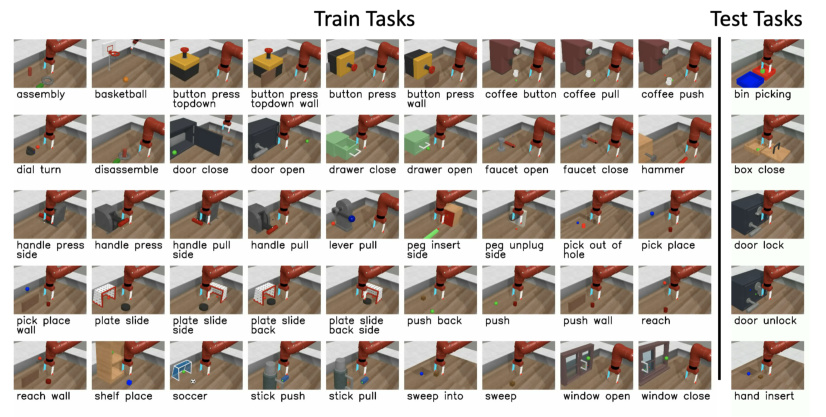
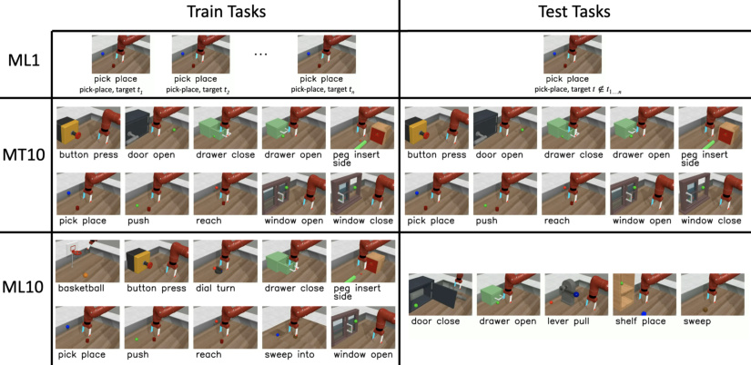

# Meta-World: A Benchmark and Evaluation for Multi-Task and Meta Reinforcement Learning

> 这是一份给"完全没接触过 AI"的读者看的精读笔记。语言尽量像聊天，公式全部翻译成人话。

## 一句话讲什么（TL;DR）

给那些号称"会举一反三"的机器人算法办一场 50 道动手题的统一考试，看它们是不是真的会。结论：没人及格。

*所以这一节是想说：这篇论文做的不是新模型，是一把统一的尺子——而这把尺子揭露了 2019 年元学习算法的集体虚弱。*

---

## 这是个什么场景

想象你刚买了个号称"超级聪明"的扫地机器人，店员说："它学得超快，换一间房间就能立刻适应！"

你回家一试——确实换了房间能用。但你仔细一想：从客厅到卧室，地板还是地板、家具还是家具，**这其实只是房间布局变了一点点，根本不算"新环境"**。如果让它去爬楼梯、去擦窗户、去叠被子，它还能"立刻适应"吗？

机器人强化学习圈在 2019 年前后就是这种尴尬：

- 大家都说自己的"元学习算法"能让机器人快速学会新技能。
- 但大家用的"考题"都是窄到不能再窄的小变化——同一个机器人朝不同方向跑、不同速度跑。
- 在这种考题上拿了高分，到底说明算法学到了"通用的学习能力"，还是只学会了"换个数字"？没人知道。

Meta-World 想做的事，就是**把这群算法拉到一个真正像样的考场里考一次**：50 道完全不同的机械臂操作题（按按钮、开抽屉、扣篮、敲钉子……），看你还吹不吹得动。

*所以这一节是想说：当一个研究领域的考试题目太水的时候，最迫切的事是先换一份像样的卷子。*

---

## 之前的人怎么做的，为什么不够好

- **方案 A：用 Atari 游戏当考题**
  类比：让一个学生同时学钢琴、围棋、踢足球，希望他从中找到"共同规律"。可惜这三件事根本没什么共同结构——结果是**学了 A 反而拖累 B**（论文叫"负迁移"）。
- **方案 B：让模拟机器人朝不同方向 / 不同速度跑**
  类比：高考语文模拟卷里 50 篇阅读理解，全是同一篇文章把"主人公"名字改一改。学生考满分，不代表他真的会做阅读理解。
- **方案 C：用迷宫导航 / 老虎机选臂**
  类比：考"找最优选项"的脑筋急转弯。能验证一些理论，但和"机器人在真实世界拧瓶盖"这种事相距很远。
- **共同毛病**：考题要么太散（彼此没共同点）、要么太窄（彼此差别太小），都不能验证"算法真的学到了举一反三"。
- **结果**：2019 年的元强化学习论文越来越多，但**没人知道哪种方法是真的强，哪种是把"窄考题"刷出花来**。

*所以这一节是想说：元学习领域的瓶颈不在算法，在没有合适的考场。*

---

## 这篇论文的新想法

**做一个有 50 道操作题、共用同一只机械臂、共用同一种状态格式、共用同一种奖励结构的统一考场，让所有元学习/多任务学习算法在同一个标尺下对比。**

关键洞察有两层：

1. **"非参数变化"（non-parametric variation）**：以前 benchmark 的任务差异都是"参数不同"——比如目标位置从 (1,0) 变成 (2,0)。Meta-World 要求任务之间有"质的不同"——按按钮和开抽屉在物理意义上完全不同，不能用改一个数字来描述它们的差异。
2. **"共享结构"**：50 道题虽然质上不同，但共享底层动作原语（伸手、推、抓）和同一个硬件平台——这让"正迁移"在理论上成为可能，也让"无法迁移"的结论更加有力。

*所以这一节是想说：核心贡献是一个 benchmark（基准），不是一个新算法。但这个 benchmark 的设计理念——"非参数变化 + 共享结构"——本身就是一个值得学习的思想贡献。*

---

## 它分几步做的（方法）

<!-- paper-figures:begin -->

*上图说明：Figure：Meta-World 50 任务与 MT10/MT50 多任务设定示意（论文原图）。*

*上图说明：Figure：各算法在 MT10/MT50 上的泛化成功率对比（论文原图）。*
<!-- paper-figures:end -->

整个论文做了 5 件事：设计任务集、统一观察/动作/奖励、设计五档难度、跑 7 个算法、得出"现有算法不够用"的结论。下面逐步拆解。

### 1. 50 道题：既要"互相不同"又要"互有关联"

**类比**

体育测试该怎么设计？

> 全测同一个项目（比如只测 100 米跑）——太窄。
> 体操、举重、游泳、马拉松全测——太散，结果一项练得好可能拖累另一项。
> **合理做法**：测 50 个**都属于田径**的项目（短跑、跳远、推铅球、跳高……），共用同一片场地、同一类身体能力，但每一项又都不一样。

Meta-World 选的就是这种"中等差异"的题目：50 个都用**同一只 Sawyer 机械臂**做的桌面操作，互相不同（按按钮 vs 扣篮 vs 拧水龙头）但共享底层动作（抓、推、伸手）。

> **任务（task）**：在 RL 里就是一道完整的题。Meta-World 中形式化定义为 (reward function, initial object position, target position) 这个三元组。
>
> **参数变化（parametric variation）vs 非参数变化（non-parametric variation）**：参数变化 = 同一个任务改初始/目标位置（如"reach puck"但目标点不同）；非参数变化 = 完全不同的任务（如"reach puck" vs "open window"）。Meta-World 两者都有：每道题内部有参数变化，题与题之间有非参数变化。
>
> **MuJoCo**：一个开源的物理仿真引擎，能模拟刚体、关节、接触力。Meta-World 全部任务都跑在它里面，相当于"虚拟实验室"。

**它在干什么**

- 收集 50 种操作场景：开门、开抽屉、按按钮、按横向把手、扣篮、敲钉子、拔插销、扫地、装螺母、塞插销……
- 全部用 MuJoCo 仿真，全部用同一只 Sawyer 机械臂操作。
- 每道题都加一层"位置随机化"：物体初始位置和目标位置每次随机抽——这样模型不能靠"看坐标背答案"作弊。论文中专门指出：如果不做参数随机化，模型可以直接根据"物体出现在哪"来记住"这是哪道题"而非学会"怎么做"。

**为什么需要"非参数 + 参数"两层变化**

- 纯参数变化（如以前的 benchmark）= 同一道题改数字，算法"刷分"容易但学不到真本事。
- 纯非参数变化（如 Atari 各种游戏）= 题与题之间没有共享结构，算法根本没法迁移。
- Meta-World 的精妙之处：**横向有非参数差异（50 种不同操作），纵向有参数变化（每种操作内部目标位置不同）**。两层叠加后，"重叠区域"自然涌现——比如"关抽屉"和"推木块"在某些初始/目标位置下看起来几乎一样，给元学习算法提供了"迁移的跳板"。

**为什么这步有用**

- 50 道题之间有"共享结构"，元学习才有可能从中抽出"通用本领"。
- 每道题内部又有"参数变化"，单道题本身就能当作以前那种窄 benchmark 用。
- 一句话：横向（任务种类）有差异、纵向（任务内部）有变化——以前的 benchmark 顶多有其中一维。

**50 道题的分类（举例）**

论文附录 A 列出了全部 50 道题。按交互类型大致可分几类：

- **推类**：push、sweep、push-with-stick（纯平面接触力，不需要抓起来）
- **抓+放类**：pick-and-place、bin-picking、basketball-dunk（需要抬离桌面）
- **旋转类**：open-door、open-window、turn-faucet（涉及 revolute joint）
- **滑动类**：open-drawer、close-drawer、slide-plate（涉及 prismatic joint）
- **精细插入类**：insert-peg-side、insert-hand（窄公差，需要精确对位）
- **按压类**：press-button-top、press-button-wall、press-handle-side（快速接触）
- **复合类**：shelf-place、hammer（多步组合：先抓工具→再用工具做事）

这些类别之间的"共享结构"是什么？几乎所有任务都可以分解为"reach → align → act"三阶段：先把手移到物体附近（reach），然后调整手的姿态对准接触点（align），最后执行操作动作（act = 推/抓/转/按）。这个三阶段结构就是元学习算法理论上能利用的"共享先验"。

**关键设计决策：任务选择的原则**

论文没有随便列 50 个任务——它遵循三条原则：

1. **单任务可解**：每道题用标准 SAC 独立训练必须能达到高成功率（附录 B 验证）。如果连单任务 RL 都解不了，放进 benchmark 没有意义。
2. **任务间有重叠区域**：部分任务对在某些参数配置下看起来几乎一样。例如"close drawer"（关抽屉）和"push block"（推木块），如果目标方向相同且距离相近，动作轨迹几乎可以互换。这种重叠为正迁移提供了可能。
3. **任务间有不可消除的差异**：另一些任务对无论怎么调参数都不会"退化"成同一个动作——比如"turn faucet"（拧水龙头，需要连续旋转）和"press button"（按按钮，需要快速垂直下压），它们的最优动作轨迹形状根本不同。

*所以这一节是想说：50 道题精挑过——既不是同一道题改数字，也不是完全无关联的杂烩。"非参数 + 参数"双层设计是这篇论文最重要的设计洞察。*

---

### 2. 统一观察、动作、奖励：让所有题"长得一样"

**类比**

如果体育考试每个项目都用不同评分单位（短跑用秒、跳远用厘米、举重用公斤），裁判没法横向比较。所以会**先统一成一个 0-100 分**的标准化分数。

Meta-World 也得让 50 道题在算法看来"长得一样"，否则单一模型根本同时学不会。

> **观察空间（observation space）**：模型每一步能"看到"的输入。这里是一个固定 39 维的向量。
>
> **动作空间（action space）**：模型每一步能"做"的输出。这里是 4 维：手末端在 3D 空间的移动量 + 夹爪开合力度。
>
> **奖励函数（reward function）**：环境告诉模型"这一步做得有多好"的分数。RL 全靠它指挥学习方向。

**具体接口设计**

观察向量（39 维）由六部分拼接：

1. 末端执行器 3D 笛卡尔位置（3 维）
2. 夹爪开合度的归一化测量（1 维）
3. 第一物体的 3D 位置 + 四元数姿态（7 维）
4. 第二物体的 3D 位置 + 四元数姿态（7 维）
5. 上述所有量在前一步的值（重复，提供速度信息）
6. 目标的 3D 位置（3 维）

不需要第二物体或目标的任务，对应维度填 0。这样无论哪道题，网络输入永远是 39 维。

动作空间（4 维）：末端执行器 3D 位移增量 (dx, dy, dz) + 夹爪力矩，范围 [-1, 1]。

**奖励设计的关键抉择：多组件结构化奖励**

论文设计了一个**可组合的多组件奖励函数**。以"抓起物体放到目标位置"为例：

- **Reaching reward**：手和物体的距离越小，分越高
- **Grasping reward**：物体被抬离桌面时给分
- **Placing reward**：物体和目标位置的距离越小，分越高

所有任务的奖励都是上述组件的某个子集（有的只需 reaching，有的需要全部三步），且**最终值域统一到 [0, 10]**。10 = 任务完成。

这套设计有两个目的：
1. 防止"高分任务独占梯度"——如果某道题奖励量级是别的 100 倍，多任务训练时模型只学那一道。
2. 给 RL 提供足够稠密的学习信号——如果只给"成功/失败"的 0/1 奖励，大多数 RL 算法在 500 步限时内根本学不动。

**为什么这步有用**

- 单一模型架构能直接吃 50 道题，不用每题改输入输出。
- 奖励统一量纲后，多任务训练不会被"高分任务"压倒。
- 这套接口直接复用 OpenAI Gym 习惯——熟悉 Gym 的人开箱即用。

*所以这一节是想说：50 道题外形完全统一，所以同一个模型能并行学。接口标准化是这个 benchmark 能活过 7 年的根本原因。*

---

### 3. 五档难度：从"小测验"到"奥赛"

**类比**

驾校考试有"科目一笔试"（最简单）、"科目二倒库"（中等）、"科目三路考"（综合）。Meta-World 也设了五档由浅到深的考法：

| 档位 | 任务数 | 测什么 | 给不给 task ID | 关键条件 |
|------|--------|--------|---------------|----------|
| ML1 | 1 | 单任务内参数变化的适应 | 不给 | 目标位置不在观察中 |
| MT1 | 1 | 单任务内多目标泛化 | N/A | 目标位置在观察中 |
| MT10 | 10 | 能不能同时学 10 道 | one-hot | 物体/目标位置固定 |
| MT50 | 50 | 能不能同时学 50 道 | one-hot | 物体/目标位置固定 |
| ML10 | 10 训练 + 5 测试 | 学完 10 道能不能快速上手新题 | 不给 | 位置随机 |
| ML45 | 45 训练 + 5 测试 | 学完 45 道能不能快速上手新题 | 不给 | 位置随机 |

> **ML = Meta-Learning，MT = Multi-Task**。ML 系列测的是"学会学习"的能力——见过一堆题之后，面对从没见过的新题能多快上手。MT 系列测的是"同时学"的能力——给你全部题同时练，看你能不能都学好。

**设计意图的层次**

- ML1 / MT1 ≈ 以前所有 benchmark 的难度（同一道题内的变化）。这是"保底"——连这都做不好，就别谈后面的了。
- MT10 / MT50 = 多任务学习的正面碰撞。给 one-hot task ID 意味着模型"知道"自己在做哪道题，理论上信息充足。但实验证明即使知道 task ID，学 50 道题对 2019 年的 RL 也太难了。
- ML10 / ML45 = 元学习的终极考验。**不给 task ID**——模型必须从几轮交互中"自己推断"当前任务是什么，然后快速适应。而且测试时的 5 道题是训练中**从未出现过**的。

**为什么测试任务是精心挑选的**

论文特意让测试任务和某些训练任务"结构相似"——比如训练集里有"开门"（revolute joint），测试集里有"开窗"（也是 revolute joint 但几何形状不同）。这不是"泄题"而是合理的——元学习的前提假设就是训练和测试来自同一个分布。如果测试任务和训练毫无关联，那连人类也不可能"快速适应"。

**MT 系列的具体任务分配**

MT10 精选的 10 道任务：reach、push、pick-and-place、open door、open drawer、close drawer、press button top-down、insert peg side、open window、open box。选择标准是"覆盖尽可能多的交互类型"——推、抓、旋转、滑动、按压都有代表，让模型必须学会多种行为模式。

MT50 则使用全部 50 道任务——这是纯粹的"压力测试"，看模型容量能否支撑。

**ML 系列的训练/测试划分逻辑**

ML10：10 道训练 + 5 道测试。测试任务与某些训练任务共享物理结构（如都含 revolute joint）但外形不同。
ML45：45 道训练 + 5 道测试。训练集几乎覆盖了所有交互类型，测试集选那些"和某几道训练任务都有点像但又不完全一样"的任务——测的是"从多种经验中抽取通用结构"的能力。

**成功率指标的定义**

论文为每道题定义了明确的成功阈值：当任务相关物体到目标位置的欧氏距离 ||o - g||_2 < epsilon（典型值 5 cm）时，判定为"成功"。这比直接用 reward 分数更有可解释性——reward 可能因 shaping 不同而跨任务不可比，但"物体是否到了该去的地方"是统一标准。

**为什么用"最大平均成功率"而非"最终成功率"**

论文报告的是训练曲线中的峰值（max success rate averaged over tasks），而非训练结束时的值。原因：多任务 RL 经常出现"catastrophic forgetting"——模型在某个训练阶段学会了 task A，但继续训练 task B 时把 A 忘了。如果只看最终值，会低估算法"能达到的上限"。

*所以这一节是想说：考场分五档，从小测一直到奥赛，覆盖整个元学习算法的能力光谱。五档渐进设计让研究者可以定位"算法在哪个难度上崩掉"。*

---

### 4. 跑 7 个主流算法：把"现有 SOTA"摆上来比

**类比**

新建一个考场，得让现役运动员先来跑一圈，看看现有水平在哪。

**它在干什么**

让 7 个 2019 年最常被引用的算法在 Meta-World 上一起跑。按用途分两组：

**多任务组（给 task ID，测"能不能同时学"）**

| 算法 | 类型 | 核心思路 |
|------|------|----------|
| PPO | on-policy | 策略梯度，每次更新"别走太远"（clip ratio） |
| TRPO | on-policy | PPO 的前身，用 KL 散度约束步幅 |
| SAC | off-policy | 最大化奖励 + 策略熵，复用 replay buffer |
| TE (Task Embeddings) | on-policy | 给每个任务学一个嵌入向量做身份标签 |

**元学习组（不给 task ID，测"能不能快速适应新题"）**

| 算法 | 类型 | 核心思路 |
|------|------|----------|
| MAML | on-policy | "二阶优化"——找一组初始权重使得"梯度下降一步"就能适应新任务 |
| RL-squared | on-policy | 把"学习过程本身"编码进 GRU 的隐藏状态，让网络自己学会探索 |
| PEARL | off-policy | 用变分推断把经验编码成任务的概率嵌入，再喂给 actor-critic |

> **on-policy / off-policy**：on-policy 只用"当前策略采的新数据"训练，浪费数据但稳定；off-policy 能复用 replay buffer 中的历史数据，省样本但容易不稳。这个区别在多任务设定下被放大——off-policy 能在 50 道题间共享数据。

**实验设置的关键细节**

- 所有实验跑 10 seeds，报告平均最大成功率。
- 成功率定义为"物体与目标的距离 < epsilon"（典型 epsilon = 5 cm）。
- 训练预算统一（on-policy 20M 环境步，off-policy 依算法而定）。
- 代码基于作者同步开发的 Garage 库，确保实现公平性。

**为什么选这 7 个算法**

这不是随便选的——它们代表了 2019 年元 RL 和多任务 RL 中**所有主流技术路线**的最佳代表：

- PPO/TRPO：策略梯度的两个代际（约束步幅 vs 裁剪步幅），验证"最基础的 on-policy 多任务有多弱"
- SAC：off-policy 的王牌，验证"replay buffer 共享是否能救多任务"
- TE（Task Embeddings）：验证"给任务学一个低维嵌入"是否比 one-hot 编码更好
- MAML：梯度式元学习的标杆
- RL-squared：记忆式元学习的标杆
- PEARL：off-policy 元学习的唯一代表

每条技术路线只选最强的一两个代表——这样结论是"这条路线不行"而非"这个具体算法不行"，对后续研究的指导价值更大。

**算法之间的公平性保证**

论文做了三件事确保对比公平：
1. 所有 on-policy 算法用同一个 PPO 训练框架（MAML 和 RL-squared 的外层优化都用 PPO）
2. 超参数用 grid search 在 ML1 上调优，然后固定给所有档位
3. 所有代码在同一个 Garage 库中实现，避免"不同代码库实现质量不同"的偏差

**为什么这步有用**

- 论文不是只描绘考场，还**第一次给出了"现有算法在新考场的成绩单"**——后续所有论文都会基于这个 baseline 比较。
- 暴露出"哪些算法在窄题上看着强，到了 50 题就崩"，给后续研究指明方向。
- 7 个算法覆盖了所有主流路线，使结论具有普遍性而非针对某一个算法的。

*所以这一节是想说：搭完考场马上拉 7 个明星算法上场考一遍，做出第一份成绩单。这份成绩单是后续 5 年所有 manipulation RL 论文的对照基线。*

---

### 5. 公布结论：现有算法都还差很远

**类比**

驾校教练宣布："今天 7 个学员都来考新版科目三。结果——3 个人在最简单的题上勉强及格，没人通过最难的题。"这就是"诚实交代现状"。

**三个核心结论**

1. **单任务可解，多任务崩溃**：单独训练 SAC 能解 50/50 道题，但让同一个模型同时学 50 道，最好也只有 38.5%。瓶颈 100% 在算法，不在任务。
2. **off-policy 在小规模多任务上领先，但不可扩展**：MT10 上 SAC (68.3%) >> PPO (30.5%)，但到 MT50 时 SAC 掉到 38.5%，和 PPO (35.4%) 差不多。off-policy 的 replay buffer 在 10 任务时是优势（共享数据），50 任务时反而成了负担（梯度冲突加剧）。
3. **元学习的"泛化承诺"远未兑现**：ML10 测试最高 35.8%（RL-squared），ML45 测试最高 39.9%（MAML）。意思是：即使见过 45 道题，面对第 46 道新题也只有四成把握。

**隐含的第四个发现：元训练性能本身就不够好**

容易被忽略的一点是：即使在元**训练**任务上（不是新任务！），RL-squared 在 ML10 上也只有 86.9%，MAML 只有 44.4%。这意味着"连训练题都没学好"——不仅泛化有问题，**优化本身**在多任务设定下就比单任务困难得多。PEARL 在 ML45 上的元训练成功率甚至只有 14.5%——几乎等于没学会。

这个发现的意义：它把"元学习失败"的归因分成了两层——一层是"优化层面学不好训练任务"（optimization challenge），另一层是"学好了训练任务但泛化不了"（generalization challenge）。当前的瓶颈主要在第一层，说明现有元 RL 的训练方法本身就有问题。

**对未来研究的影响**

论文在 Section 6 提出了具体的未来方向：

1. **算法层面**：多任务 RL 需要新的梯度处理方法（后来出现了 PCGrad、CAGrad）、更好的网络架构（后来出现了 Soft Modularization）、以及更稳定的 off-policy 多任务训练技术
2. **Benchmark 扩展层面**：(a) 加入图像观察替代状态向量；(b) 加入稀疏奖励替代 shaped reward；(c) 加入长时序组合任务；(d) 加入在线元学习（任务不是一次性给全，而是逐步出现）；(e) 减少环境重置频率（模拟真机的不便）
3. **开源生态层面**：提供标准化的评估代码和任务划分，让后续论文的对比完全可重复

这些结论把社区注意力从"设计更多任务"转向了"设计更好的多任务学习算法"。Meta-World 成了这些后续方法的标准测试平台。

*所以这一节是想说：考完一圈，发现现役选手都还远没合格——这本身就是最重要的科研结论。它定义了后续 5 年的研究方向。*

---

## 关键数字（What works）

数字本身不重要，重要的是它们告诉你"现有方法有多远"和"哪种思路更接近答案"。

### 多任务学习结果（Table 1 上半）

| 算法 | MT10 成功率 | MT50 成功率 | 变化 |
|------|------------|------------|------|
| Multi-task SAC | **68.3%** | **38.5%** | -43.6% |
| Multi-task PPO | 30.5% | **35.4%** | +16.1% |
| Multi-task TRPO | 31.3% | 21.0% | -32.9% |
| Task Embeddings | 20.9% | 11.8% | -43.5% |

**读法**：MT10→MT50，SAC 从第一名掉到"和 PPO 差不多"。任务从 10 扩到 50，off-policy 的优势消失——replay buffer 里混了太多不相关任务的数据，Q 函数拟合变难。PPO 反而微升，可能因为 on-policy 本身不存储旧数据，每次都用新数据更新，受"旧任务干扰"影响小。

### 元学习结果（Table 1 下半）

| 算法 | ML10 元训练 | ML10 元测试 | ML45 元训练 | ML45 元测试 |
|------|------------|------------|------------|------------|
| RL-squared | **86.9%** | **35.8%** | **70%** | 33.3% |
| MAML | 44.4% | 31.6% | 40.7% | **39.9%** |
| PEARL | 23.2% | 13% | 14.5% | 22% |

**读法**：RL-squared 在元训练任务上表现最好（86.9%），但泛化到新任务时优势不大（35.8% vs MAML 31.6%）——说明它可能"记住了"训练任务而非学到了"如何学习"。MAML 在 ML45 上反击超过 RL-squared（39.9% vs 33.3%），表明"梯度初始化"的思路在训练任务足够多时更具泛化性。PEARL 全面垫底——off-policy 元 RL 在高维多任务上遇到了严重的训练不稳定。

### 单任务基线

| 条件 | 结果 |
|------|------|
| SAC（每道题单独训练） | 50/50 全部可解 |
| PPO（每道题单独训练） | 大部分可解 |

**意义**：证明 50 道题本身不是不可能——多任务/元学习性能差完全是算法自身的多任务扩展性问题，不能怪任务太难。

### 其他关键规格数字

| 项目 | 数值 | 意义 |
|------|------|------|
| 观察维度 | 39 | 统一接口，模型一套权重通吃 |
| 动作维度 | 4 | 3D 位移 + 夹爪，简洁但覆盖所有操作 |
| 奖励范围 | [0, 10] | 标准化防偏科 |
| 每集步数 | 最多 500 | 短时长操作，无长链条任务 |
| 成功阈值 | ~5 cm | 物体到目标欧氏距离 |
| 任务数 | 50 | 非参数差异 |
| 随机种子 | 10 | 所有实验结果的统计基础 |

*所以这一节是想说：数据告诉我们——任务是可解的，但 2019 年的多任务和元 RL 算法还远未达到"举一反三"的水平。最核心的数字是 MT10→MT50 的"减半"现象。*

---

## 实验结果说明了什么

**实验目标**：回答两个问题——(1) 现有元 RL 算法能不能在广泛的任务分布上泛化到新任务？(2) 不同多任务/元学习算法在这个新设定下如何对比？

**硬件/软件环境**：
- 所有任务跑在 MuJoCo 物理引擎上
- 代码基于 Garage 库（作者团队维护的 RL 实验库）
- 接口兼容 OpenAI Gym / Multiworld

**训练细节**：
- On-policy 算法（PPO、TRPO、MAML、RL-squared）：约 20M 环境交互步
- Off-policy 算法（SAC、PEARL）：依照各自原论文设定
- 每个实验跑 10 个随机种子，报告种子间的平均
- 评估指标为**最大平均成功率**（训练曲线中达到的峰值）

**评估协议**：
- 成功率用距离阈值判定（物体到目标 < epsilon），而非 reward 分数
- 论文附录 B 单独验证了每道题的可解性
- ML 系列的元测试：给定少量交互回合（few episodes），看适应后的成功率

**控制变量**：
- MT 系列固定物体/目标位置（排除位置随机性的干扰，专测"多任务"能力）
- ML 系列随机位置（排除位置记忆的可能，专测"适应"能力）
- MT 系列给 one-hot task ID，ML 系列不给——后者必须自己推断任务

*所以这一节是想说：实验设计严谨——控制变量到位、统计基础充分、指标可解释。这是它被广泛引用的技术前提。*

---

## 你应该懂的几个新词

> **强化学习（Reinforcement Learning, RL）**：让一个智能体在环境里反复试错，每次靠"奖励"学会更好的策略。类比：训练宠物——做对给零食，做错不给。

> **多任务学习（Multi-Task Learning, MT-RL）**：让一个模型同时学多个任务。目标是学出一个 task-conditioned policy π(a|s,z)，z 为任务编码。类比：让一个学生同时学语文数学英语，希望他能在三科上找到共通学习方法。

> **元学习（Meta-Learning）**：学习"如何学习"。模型不是直接被训练去解某道题，而是学一个"快速适应新题的方法"。类比：教学生"一套通用解题套路"，遇到新题能快速上手。

> **元训练 / 元测试（meta-train / meta-test）**：元训练时让模型见过一组任务；元测试时抛出全新任务，量它适应得多快。

> **任务分布 p(T)**：所有任务背后的"出题集合"。元学习的关键假设：训练和测试任务都来自同一个分布，且这个分布有共享结构。

> **MDP（Markov Decision Process）**：RL 的数学骨架。每个任务 T 对应一个 MDP 元组 (S, A, P, R, H, gamma)。可以理解成一张棋盘游戏的规则手册。

> **参数变化 vs 非参数变化**：参数变化 = 改数字（目标位置变了）；非参数变化 = 改种类（从"推"变成"扣篮"）。这组概念是 Meta-World 的核心设计理念。

> **MuJoCo**：物理仿真引擎。Meta-World 用它把"机械臂操作"虚拟化成可以快速训练的环境。

> **Sawyer**：Rethink Robotics 的机器人手臂型号。Meta-World 用它的仿真模型作为统一硬件。

> **成功率（success rate）**：用"距离阈值"判定的二元成功/失败。比 reward 更接近人类对"完成度"的直觉。

> **MAML / RL-squared / PEARL**：三种典型元 RL 算法。MAML 学一个"容易适应的初始权重"；RL-squared 把整个学习过程压进 GRU；PEARL 把任务编码成概率向量。

> **on-policy / off-policy**：on-policy 只用当前策略采的最新数据训练（浪费但稳定）；off-policy 从 replay buffer 中复用历史数据（省样本但可能不稳）。

> **梯度冲突（gradient conflict）**：多任务训练时，不同任务的损失对同一组权重产生方向相反的梯度——模型被"拉扯"导致谁都学不好。这是 MT50 性能崩溃的核心机制。

> **负迁移（negative transfer）**：一起学多个任务反而比单独学每个任务效果更差的现象。Atari 多任务实验中普遍出现。

*所以这一节是想说：上面这 14 个词在所有强化学习论文里反复出现，先把它们和生活类比挂钩。*

---

## 它有什么搞不定的

Meta-World 不是完美 benchmark，作者自己也老实交代了几个短板：

1. **状态是"上帝视角"**：模型直接拿到物体的 3D 位置和姿态——真实机器人哪有这种特权，它只有相机图像。论文在"Future Directions"中承认这是最大的简化。后续工作（如 Meta-World 的 image-based variant、RLBench、LIBERO）才把视觉输入补上。

2. **奖励太稠密**：每一步都给连续奖励（结构化多组件），便于学习；但真实任务往往只有"成功/失败"的稀疏反馈。这导致在 Meta-World 上学到的策略往往依赖"密集的进度信号"，迁不到只有稀疏反馈的真实场景。

3. **任务都是"短时长"**：每集最多 500 步，没有那种"开冰箱→拿牛奶→倒进杯子"的长链条任务。现实中大多数有用的家务都是多步组合的。后续 CALVIN、LIBERO、BEHAVIOR-1K 专门补了这个空缺。

4. **没有动力学变化**：所有任务的物理参数（摩擦系数、物体质量等）是固定的。真实世界中这些参数会变——湿手拿杯子 vs 干手拿杯子物理表现完全不同。后续 ManiSkill 补了 domain randomization。

5. **sim-to-real gap 未被验证**：论文完全在仿真中完成，没有任何真机迁移实验。因此"Meta-World 上学到的能力能不能迁移到真 Sawyer"是开放问题。

6. **任务多样性有上限**：50 道题看似很多，但都是"单物体桌面操作"的范畴——没有双臂协作、没有柔性物体、没有液体倒注、没有接触力丰富的任务（如打磨、擦拭）。

*所以这一节是想说：Meta-World 是"入门级综合考场"，难度足够暴露算法短板，但和"真实机器人"还隔着好几层玻璃——图像、稀疏奖励、长时序、动力学变化、sim-to-real。每层玻璃后来都催生了新的 benchmark。*

---

## 它和别的论文是什么关系

- **它是后续机器人 benchmark 的"祖宗"**：在它之后，CALVIN、LIBERO、ManiSkill、RLBench 等机械臂 benchmark 一个接一个出现，全都借鉴了它"统一接口 + 多档难度"的设计。
- **它是 [diffusion-policy](diffusion-policy.md)、[openvla](openvla.md)、[saycan](saycan.md) 这些后续论文用来"自夸成绩"的常用 benchmark 候选**。当一个新模型出来，作者通常会跑 MT10 / MT50 来证明自己比 SAC、PPO 强多少。
- **和 [dreamer-v1](dreamer-v1.md) 的对比**：Dreamer 是"用世界模型当训练辅助"的算法，Meta-World 是"考场"。两者是"算法 vs 考场"的关系——Dreamer 系列后来真的在 Meta-World 上跑过对照实验。
- **和 [diffusion-policy](diffusion-policy.md) 的承接**：Diffusion Policy 是"用扩散模型生成动作"的算法，它也用 Meta-World 类型的 benchmark 来证明自己的效果。Meta-World 是这种新方法被推荐的"标配考场"之一。
- **Meta-World 的精神延续到 LLM 时代**：今天评测 VLM/VLA（参见 [openvla](openvla.md)）的时候，研究者依然会去思考"这套考题是不是太窄"——这种"benchmark 应当多样且共享结构"的设计原则，正是 Meta-World 留给整个圈子的最大遗产。

*所以这一节是想说：Meta-World 是个"工具型论文"——它不像 LLaVA 那样有惊艳新方法，但被引用千次，因为每个做机器人 RL 的人都用它当尺子。*

---

## 和本导读的关系

**对应章节**：Ch21（数据集全景）—— 21.4.1 节"RL 导向基准：Meta-World"

**在导读体系中的位置**：

Ch21 按"真机 → 仿真"的顺序梳理了整个机器人数据/基准生态。Meta-World 被归类为"仿真操作基准"中的 RL 导向类——它不是用来"训练"机器人的数据集，而是用来"考试"的标准化测试平台。导读特别强调了 Meta-World 的"MT10→MT50 性能减半"现象，将其解读为"瓶颈在算法不在任务"的关键证据。

**与导读其他章节的联系**：

- Ch11（RT-1/RT-2）和 Ch12（OpenVLA）：这些 VLA 模型在评测泛化能力时，沿用了 Meta-World 开创的"多任务统一评测"思路
- Ch13（Diffusion Policy）：Diffusion Policy 论文在 Meta-World 类型的 benchmark 上展示了 IL 方法相对纯 RL 方法的优势
- Ch17（Sim-to-Real）：Meta-World 纯仿真的局限正是 Ch17 讨论 sim-to-real gap 的出发点之一
- 21.4.2（RLBench）：RLBench 可以视为 Meta-World 的"加强版"——100 道题、视觉输入、更复杂操作
- 21.4.4-5（CALVIN/LIBERO）：这两个 benchmark 补全了 Meta-World 缺失的"长时序 + 语言条件"维度

**定位一句话**：Meta-World 是仿真操作基准中的"开山鼻祖"——它定义了"多任务统一评测"的范式，后续所有基准都在它的基础上补全某个维度（视觉/长时序/家庭场景/跨形态）。

*所以这一节是想说：在 Ch21 的"八大仿真基准"地图上，Meta-World 占据"RL + 多任务泛化"这个生态位，是理解整个评测体系演进的起点。*

---

## 思考题

Q1：MT10 和 MT50 的核心区别是什么？为什么 SAC 在 MT10 上 68.3% 但 MT50 上只有 38.5%？

MT10 让模型同时学 10 道不同任务，MT50 让模型同时学 50 道。区别不仅是数量——50 道题意味着梯度冲突的"方向"从 10 个增加到 50 个，模型的有限容量被 50 个方向同时拉扯。SAC 用一个 Q 函数拟合所有任务的价值，任务越多 Q 函数的拟合目标越矛盾。此外 replay buffer 里存了 50 个任务的混合数据，采样到的 batch 内部差异巨大，Q-learning 的 bootstrapping 变得不稳定。

核心机制：**梯度冲突 + Q 函数拟合难度 + replay buffer 稀释**。这三者叠加导致了"任务数 5x → 性能减半"的超线性退化。

Q2：ML10 和 MT10 测的东西有什么本质区别？为什么 ML 系列不给 task ID？

MT10 测"能不能同时学好 10 道题"（多任务学习），模型训练和评估在**同一组**任务上。ML10 测"见过 10 道题后，能不能快速学会第 11 道新题"（元学习），模型必须泛化到**从未见过**的任务。

ML 系列不给 task ID 是故意的设计：如果给了 task ID，模型可以为每道已见任务"记住"一套策略，而不需要"学会如何学习"。不给 task ID 强迫模型从交互经验中**自己推断**当前任务是什么——这才是元学习的核心能力（"从经验中识别任务结构并快速适应"）。

Q3：什么是"参数变化"和"非参数变化"？为什么 Meta-World 两者都需要？

参数变化（parametric variation）：同一个任务内部改连续参数——比如"伸手够目标"这道题，目标点坐标从 (0.3, 0.1) 变成 (0.5, 0.2)。任务的"种类"没变，只是"数字"变了。

非参数变化（non-parametric variation）：不同任务之间的质的差异——"按按钮"和"开门"不能用改几个数字来相互转换，它们在物理交互方式上根本不同。

两者缺一不可的原因：
- 只有参数变化 = 以前的窄 benchmark，不能验证真正的泛化
- 只有非参数变化 = Atari 式杂烩，任务间没有共享结构，正迁移不可能发生
- 两者共存 = "关抽屉"和"推木块"在某些参数配置下形成重叠，给元学习算法提供了"举一反三"的可能性跳板

Q4：Meta-World 的奖励设计为什么强调"多组件结构化 + 统一量纲 [0,10]"？如果不这样做会怎样？

如果不做：
1. 量纲不统一（比如 task A 奖励 [0,100]，task B 奖励 [0,1]）→ 多任务训练时梯度被高奖励任务主导，模型"偏科"只学高分任务
2. 奖励结构不统一（比如 task A 是 dense shaped reward，task B 是 sparse binary reward）→ 不同任务的学习速度差异巨大，快学的任务先收敛后被慢学的任务"拖回去"
3. 没有中间组件（只有最终成功/失败）→ 在 500 步时限内 RL 几乎无法发现"正确动作"，特别是需要"先够到、再抓住、再放到目标"的多步任务

多组件设计（reach + grasp + place）让奖励天然具有"共享结构"——不同任务用的是同一套组件的不同子集。这对多任务学习是巨大利好：网络可以先学会"reach 组件"然后在所有包含 reach 的任务中复用。

Q5：MAML 和 RL-squared 的元学习机制有什么根本区别？为什么在 ML45 上 MAML 反超？

**MAML** 的核心是"二阶优化"——它维护一组初始权重 theta_0，目标是让"在新任务上做一步/几步梯度下降后的权重 theta_k"的表现最好。训练时反向传播穿过梯度下降步本身（梯度的梯度）。本质是"找一个好起点"。

**RL-squared** 的核心是"学习过程即序列建模"——它用 GRU（一种 RNN）的隐藏状态来编码"我在这个新任务上积累的经验"。给它几轮交互数据，GRU 自动把"我应该怎么做"编码进隐状态。本质是"让网络本身成为一个学习算法"。

在 ML45 上 MAML 反超的原因：RL-squared 的 GRU 有固定的隐藏层大小，当元训练任务从 10 增加到 45 时，GRU 的容量不够"记住"所有任务的模式差异，倾向于过拟合训练分布中最频繁的模式。而 MAML 不依赖有限容量的记忆——它只优化"初始化点"，不需要在网络内部存储任务信息。任务数越多，"好的初始化"反而越通用（因为它必须同时对所有训练任务都"一步可达"），所以泛化性更好。

Q6：为什么单任务 SAC 能解 50/50 但多任务只有 38.5%？这说明了什么根本性问题？

这说明瓶颈在"多任务干扰"（multi-task interference），而非任务本身的难度。

具体机制：
1. **梯度冲突**：任务 A 的梯度 g_A 和任务 B 的梯度 g_B 方向相反时，网络无法同时优化两者。50 个任务产生 50 个方向的梯度，冲突概率远大于 10 个任务
2. **容量瓶颈**：一个固定大小的网络学 50 个不同策略需要足够的参数量。如果容量不够，任务之间必须"共享"表征——共享得好叫正迁移，共享得差叫遗忘
3. **负迁移**：学 task A 的经验可能主动"破坏"已学好的 task B——因为梯度更新了 B 也在用的权重

这个发现的深层意义：它证明了"多任务 RL 的扩展性"是一个独立的研究问题，不能简单地通过"给更多任务"来解决——需要全新的算法设计（如 soft modularity、gradient surgery、task routing）。

Q7：如果要设计一个"Meta-World 2.0"，你会补全哪些维度？为什么？

参考论文的 Future Directions + 后续 benchmark 的发展：

1. **视觉输入**（补"上帝视角"的缺陷）：把 39 维状态向量换成 RGB 图像。理由：真机无法直接获取物体 3D 位姿，必须从图像中推断。RLBench 和 LIBERO 已补全了这一点。

2. **稀疏奖励**（补"太稠密"的缺陷）：只在任务完成时给 1，其余时刻给 0。理由：真实场景不会有"越靠近目标越给分"的连续反馈。可以用 success metric 直接当奖励。

3. **长时序组合任务**（补"短时长"的缺陷）：多步链式任务如"开冰箱→拿牛奶→关冰箱→倒杯子"。CALVIN 和 LIBERO 走了这条路。

4. **语言条件**（补"沟通方式"的缺陷）：用自然语言描述目标而非 one-hot task ID。VLA 时代的核心需求。

5. **域随机化 / sim-to-real 验证**（补"纯仿真"的缺陷）：随机化物理参数（摩擦、质量），并在真机上验证仿真中学到的策略。

以上五点恰好对应了 LIBERO、CALVIN、RLBench、ManiSkill、RoboCasa 分别选择补全的维度——证明 Meta-World 的"短板"精准预言了后续 5 年的 benchmark 研究方向。

---

## 一些好奇心问答

**Q1：为什么不直接拿真实机器人来做 benchmark？**
A1：真机太慢、太贵、太脆。一个机械臂 200 万人民币，跑 50 道题做对比要一年。仿真里几小时就能跑完一组实验，迭代算法比真机快 1000 倍。Meta-World 就是"先在仿真里把算法过滤一遍，再去真机"。

**Q2：50 道题这个数字是怎么定下来的？**
A2：作者团队凭经验定的。少于 10 道就和以前的 narrow benchmark 没区别；多于 100 道仿真和评测都太慢。50 是个"够多但还能跑得动"的折中。

**Q3：为什么 SAC 在 MT10 牛但 MT50 就垮了？**
A3：因为 SAC 共用一个 Q 函数和策略网络去估计 50 个任务。任务越多，**梯度互相打架**越厉害——一个任务的梯度告诉网络"往左"，另一个任务说"往右"，最后谁都没学好。这种"梯度冲突"是后续多任务 RL 论文的核心研究方向。

**Q4：MAML 和 RL-squared 是不是同一种东西？**
A4：不是。MAML 思想是"用元梯度找一个好初始化"——训练完得到的是一组权重；RL-squared 思想是"让 RNN 把整个学习过程吃进隐藏状态"——它本身就是一个会自己探索的智能体。两者哲学不同，但目的都是"快速适应新任务"。

**Q5：Meta-World 上 30%-40% 的成功率到底算高还是低？**
A5：相对随机策略（基本 0%）算高，相对人类（接近 100%）算低。学界普遍认为：能在 ML45 上做到 70%+ 的算法才算"达到了元学习真正的承诺"。截至 2026 年，这个目标依然没被彻底攻克。

**Q6：这篇论文 2019 年发，到 2026 年还在被引用吗？**
A6：是的——它被引用 1500+ 次，且至今 manipulation 论文经常作为基线 benchmark。它的接口设计能扛过 7 年的算法演进，这本身就证明了 benchmark 的价值。

**Q7：如果我现在想入门机器人 RL，是不是该用 Meta-World 起手？**
A7：如果只想学概念——用更简单的 OpenAI Gym 经典任务（CartPole、HalfCheetah）。如果要做研究/写论文——Meta-World 仍是必跑的 baseline。但如果你的目标是真机/视觉控制/长时序——直接跳到 LIBERO、CALVIN 或 RoboCasa 更合适。

*所以这一节是想说：Meta-World 现在的位置是"经典必跑 benchmark"——研究门槛低，引用数高，但已经不是 SOTA 评测的唯一选择。*

---

## 如果你想再深入

- **MAML 原论文**（Finn et al., 2017, ICML）：元学习的方法论奠基作。看完 Meta-World 后强烈推荐配合读 MAML 的 5 页公式部分——理解"为什么对梯度求梯度能帮助泛化"。
- **PEARL 原论文**（Rakelly et al., 2019）：off-policy 元 RL 的代表作，理解"任务编码"思路以及为什么它在 Meta-World 上表现最差。
- **Dreamer 系列**（参考 [dreamer-v1](dreamer-v1.md)）：用世界模型大幅减少元学习样本量的思路。
- **CALVIN / LIBERO benchmark**：Meta-World 的直系后继。前者补全"长时序语言条件任务"，后者补全"小样本指令跟随"。
- **PCGrad（Yu et al., 2020）**：Meta-World 同一作者的后续工作——直接解决 MT50 上发现的"梯度冲突"问题，通过投影消除冲突方向。
- **Soft Modularization（Yang et al., 2020）**：另一个直接在 Meta-World 上验证的多任务 RL 方法，通过软性模块化路由不同任务到不同网络子模块。
- **OpenAI Gym / DM-Control**：和 Meta-World 同一时代的兄弟 benchmark。前者面向通用 RL，后者面向连续控制。读完 Meta-World 后扫一眼这两份的设计，你会发现"benchmark 的设计哲学"在那个时代有一波集中讨论。

*所以这一节是想说：理解 Meta-World 本身只用 1 小时，但要理解它"为什么这样设计"和它催生的后续研究方向，需要读 5-8 篇相关论文配合。*

---

## 原文信息

- **标题**：Meta-World: A Benchmark and Evaluation for Multi-Task and Meta Reinforcement Learning
- **作者**：Tianhe Yu*, Deirdre Quillen*, Zhanpeng He*, Ryan Julian*, Avnish Narayan*, Hayden Shively, Adithya Bellathur, Karol Hausman, Chelsea Finn, Sergey Levine（* 共同一作）
- **机构**：Stanford University, UC Berkeley, Columbia University, University of Southern California, Robotics at Google
- **发表**：3rd Conference on Robot Learning (CoRL 2019), Osaka, Japan
- **代码**：https://github.com/rlworkgroup/metaworld
- **项目页**：meta-world.github.io
- **引用数**：1500+（截至 2026 年）
- **BibTeX**：Yu et al., "Meta-World: A Benchmark and Evaluation for Multi-Task and Meta Reinforcement Learning", CoRL 2019
