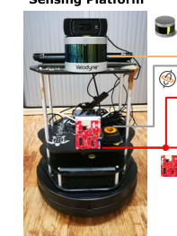
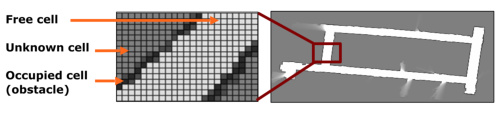

## TL;DR

机器人在浓烟里也能画出清晰的房间地图——靠一颗几十块的小雷达加一个会"脑补"的神经网络。

具体两招：
- 训练时让贵的激光雷达（lidar）和便宜的雷达坐同一辆车，把 lidar 的清晰图当作业答案喂给神经网络（cGAN），教雷达学会脑补。学完老师下车，雷达单飞。
- 认门/墙/玻璃/电梯不靠"反射多强"，靠"反射波形长啥样"——每种材料都有自己的波形指纹。

成绩：地图误差 < 0.2 m，材料认对率约 90%；浓烟里 lidar 完全瞎掉时，它依旧能稳稳画出走廊。

*所以这一节是想说：用最便宜的雷达 + 一个会"脑补"的神经网络，在 lidar 看不见的地方画出 lidar 级别的地图。*

## 这是个什么场景

想象你家半夜停电，又赶上厨房锅烧糊冒了一屋子烟。你举着手机想拍张照看清到底哪儿着火，结果屏幕里白茫茫一片——光被烟挡住了，相机彻底瞎。这就是消防员每天要面对的场景：一栋着火的写字楼，浓烟伸手不见五指，但他们必须冲进去救人。

理想情况下应该有一台小机器人先冲进去"扫"一遍楼，回传一张地图告诉消防员：走廊在哪、房间在哪、哪扇门能踹开、哪面是玻璃可以砸、哪部电梯还能逃生。这张地图救命。

问题是：现有"画地图"的传感器在这种场景全都瞎了。
- lidar（激光雷达）/ RGB 相机 / 深度相机：都靠光，遇到烟、尘、暗就失效。论文里有图：才一点轻烟，lidar 就在地图上画出一堆根本不存在的"障碍物"。
- 超声波 / 麦克风：不怕烟，但要么探测距离太短，要么环境一吵就聋。

毫米波雷达（mmWave radar，波长几毫米的电磁波）频率高到能穿透烟雾粉尘，自动驾驶产业链已经把它做成单芯片几十美元、几克重，正好能塞进小机器人或消防员头盔里。但它原生数据非常糟糕：单帧只有约 100 个点（lidar 的百分之一），最严重时 75% 是"鬼点"（ghost points，信号在墙之间来回弹，弹出一个"假目标"）。直接拿这种数据画地图就是一团乱麻。

milliMap 就是在解这个矛盾：用最便宜、最稀疏、最噪的雷达，画出最干净、最稠密、能用来导航的地图。

*所以这一节是想说：消防场景需要"穿烟视力"，毫米波雷达是唯一选项，但它给的数据太烂得救一救。*

## 之前的人怎么做

按照能否解决"穿烟成图"分成几路：

| 路线 | 代表 | 解决了什么 | 卡在哪 |
|---|---|---|---|
| 光学（lidar / 相机 / 深度相机）| LOAM、RGB-D mapping | 平时画图很准 | 烟、尘、暗一来全瞎 |
| 声学（麦克风、超声波）| BatMapper、AIM | 不怕光照变化 | 距离短、怕噪声、怕吸音材料 |
| 高端机械雷达 | CTS350-X | 穿烟、点也密 | 又重又贵又大，塞不进微型机器人 |
| 商用 WiFi 成像 | See-Through-Walls 系列 | 廉价、能穿墙 | 多用于人体检测，不画环境地图 |
| 早期单芯片毫米波 | 60GHz mobile imaging radar | 廉价 | 必须在物体前来回慢慢扫，不适合搜救 |
| 材质识别 | RSA、RadarCat | 用反射强度认材料 | 只看峰值；遇到夹层墙、扩散面就翻车 |

简单说：**便宜 + 穿烟 + 一边走一边画稠密图 + 还能识别材料**——这四件事之前没人同时做出来过。milliMap 想把这四件事一次解决。

*所以这一节是想说：要么贵要么瞎要么慢要么粗，milliMap 之前没有"四不要"的方案。*

## 新想法

作者的核心赌注有三条：

第一，**让 lidar 当临时家教，再把家教辞退**。雷达数据太稀疏太脏没人能手标，但 lidar 平时在干净环境里输出很稠密。那就让 lidar 和雷达并排坐机器人巡一次楼，自动用 lidar 的图当 ground truth 训一个 cGAN（条件生成对抗网络）。训完部署时，lidar 不上车了，雷达单独工作也能"脑补"出 lidar 级别的图。这个套路叫**跨模态监督**（cross-modal supervision）。

第二，**先画图再去噪，而不是先去噪再画图**。一种朴素思路是把每一帧雷达点云都先变成一张干净图再拼，但单帧太稀疏，网络只能学到"画直线"这种过拟合套路。milliMap 反过来：先用经典贝叶斯栅格映射（Bayesian grid mapping）把多帧雷达点累积成一张稀疏但完整的"半成品图"，再切成 6x6 米的小块（patch）让网络补全。这样网络看到的不再是孤立点而是"残缺的房子轮廓"。

第三，**把多径效应从敌人变成朋友**。识别材质时，过去的人只取反射的峰值（peak RSS）——但室内墙是夹心结构、表面粗糙，多径效应混进来一搅，光看峰值分不清玻璃和电梯。作者的反向操作：把峰值后面那一小段反射形状（SOI，segment of interest，6 个点宽约 16 cm）整段拿出来当指纹，让 1D-CNN 去学。这一段的形状和振幅恰恰由内部夹层、粗糙度、扩散决定，反而是材料的稳定签名。

*所以这一节是想说：让 lidar 当一次性老师 + 多帧拼图后再补图 + 把多径噪声当指纹。*

## 方法分步

<!-- paper-figures:begin -->

*上图说明：Figure 1：milliMap 系统总览（毫米波 + 语义 + 可达性地图）（论文原图）。*

*上图说明：Figure 2：Bayesian 栅格建图三态单元（自由/障碍/未知）（论文原图）。*
<!-- paper-figures:end -->

整套系统就像一支三人厨房：采购员（机器人）去市场拎回一篮歪瓜裂枣（稀疏点云），二厨（栅格映射）把它们粗洗码盘，主厨（cGAN）把残缺食材摆成像样的一盘菜，旁边还有个品酒师（1D-CNN）用尝一口判断这是哪种料。整套系统拆三块：机器人采数 -> 栅格图重建 -> 语义识别。

**系统架构的设计哲学**：整个流水线刻意保持模块解耦——栅格映射不知道后面有 cGAN，cGAN 不知道前面怎么采数据，语义模块和前两块完全独立。这带来两个好处：(1) 每个模块可以独立升级（比如用更好的里程计不用重训网络，换更好的网络不用改数据采集）；(2) 故障隔离——语义模块失效不影响几何地图输出，cGAN 在异常输入上崩了栅格映射本身的"半成品"图仍然可用作 fallback。这种"graceful degradation"在搜救场景尤其重要——宁可给消防员一张粗糙但靠谱的图，也不能因为某个模块失灵就完全没有输出。

### 步骤 1：硬件平台——给机器人装"眼睛"和"临时家教"

像组装一辆带摄像头的扫地机器人，只是把"摄像头"换成雷达，再额外搭一个"老师"在训练时坐副驾。

- 底盘：TurtleBot 2，标准两轮差速移动机器人，就像一辆低底盘的电动轮椅。
- 雷达（学生）：TI AWR1443 单芯片，77-81 GHz FMCW，4 GHz 带宽。这里要理解一组关键参数：
  - 距离分辨率 = c / (2B) = 3e8 / (2 x 4e9) 约 4 cm——能分清隔 4 cm 远的两面墙。
  - 方位角视场 120 度、俯仰 30 度——水平看得宽、垂直看得窄。
  - 3 发 4 收天线，等效 12 虚拟通道。角度靠天线间相位差解算（AoA），但天线少所以方位分辨率只有 15 度、俯仰 58 度——相当于你用高度近视的眼睛看世界，只能看到大模糊轮廓。
  - 单帧约 100 个点——对比 VLP-16 每帧几万点，少两个数量级。
- lidar（老师）：Velodyne VLP-16，16 线激光雷达，**只在训练阶段上车**，部署时拆掉。它提供的 ground truth 就像考试答案纸，训完即弃。
- 辅助：轮式里程计（wheel odometry，靠轮子转数推算走了多远和朝向）+ 一个 RGB 相机做对照实验。
- 软件栈：ROS 导航，Linux 笔记本做数据存储和通信。

关键设计决策：为什么选 TI AWR1443 而不是更好的雷达？因为追求极致便宜和小巧——单芯片只有指甲盖大小、成本几十美元，才能真正塞进消防员头盔或微型飞行器。代价就是数据极度稀疏和噪声。

**为什么 77-81 GHz 这个频段？** 两个原因：(1) FCC 已经给汽车雷达分配了这个频段，产业链成熟、芯片量产、成本低；(2) 77 GHz 波长约 3.9 mm，比烟粒子直径（0.1-1 um）大三到四个数量级，根据 Mie 散射理论，粒子远小于波长时散射截面趋近于零——所以毫米波"看不见"烟雾。作为对比，lidar 的 905 nm 波长和烟粒子尺寸同一量级，散射非常严重。

**传感器标定与同步**：lidar 和雷达安装在同一平台上，需要外参标定（rotation + translation）才能把两者的坐标系对齐。论文用的方法是在开阔场地放置几个角反射器（corner reflector，对毫米波是强反射体），在 lidar 点云和雷达检测中分别找到这些标定物，然后用 SVD 解刚体变换。时间同步靠 ROS 的时间戳机制（ros::Time::now()），因为两个传感器的帧率不同（lidar 10 Hz, radar 10 Hz，但 chirp 配置可以更快），需要做最近邻时间戳匹配。

**FMCW chirp 参数配置细节**：AWR1443 的射频前端集成了 VCO（压控振荡器）和 PLL（锁相环），通过 mmWave Studio 或 CCS（Code Composer Studio）配置以下参数：起始频率 77 GHz，带宽 4 GHz（扫到 81 GHz），chirp 持续时间约 50 us，idle time 约 7 us，帧周期 100 ms（10 Hz）。每帧包含多个 chirp（一般 64-256 个），用于 Doppler 估计（本文未用 Doppler，但硬件支持）。ADC 采样率 5 Msps，每 chirp 采 256 个 ADC 样本——这些样本做 256 点 FFT 就得到 range bin。

### 步骤 2：把雷达点云变成"半成品图"——贝叶斯栅格映射

像把一周拍的零碎照片拼成一张全景图：单张糊得离谱，但拼起来轮廓就出来了。

**FMCW 测距原理**（这是整个系统的物理基础）：

雷达发一个频率从低到高线性扫的连续波（chirp，像鸟叫"啾——"一声频率越来越高）。信号碰到墙壁反射回来时，由于来回跑了一段距离，接收到的回波相比发射波有一个固定的频率延迟。把回波和发射波做混频（multiply），得到一个中频信号（IF signal），其频率 f_IF 正比于目标距离：

d = (f_IF * c) / (2S)

其中 S 是 chirp 的频率斜率（Hz/s），c 是光速。对 IF 信号做 FFT，每个峰就对应一个距离上的反射体——这就是 range FFT profile。

**AoA 测角原理**：多根接收天线同时收到回波，由于天线间有物理间距 d_ant，同一个目标的回波到达各天线的相位不同。相位差 omega 和入射角 theta 的关系是：

theta = arcsin(lambda * omega / (2 * pi * d_ant))

天线越多、等效孔径越大，角度分辨率越好。但 AWR1443 只有 3x4=12 虚拟通道，所以方位分辨率只有 15 度——远处的两面相邻墙会"糊"成一坨。

**从稀疏点到栅格图的流水线**：

1. 每帧 FMCW 出约 100 个 (距离, 角度, 强度) 三元组，经过 CFAR 检测（一种自适应阈值算法，从噪底里挑反射峰）输出点云。
2. 硬截断：丢掉 > 6 m 的所有点。为什么是 6 m？因为实测发现远处的点绝大多数是多径鬼点（信号在墙之间弹了两三次才回来，算出来的距离比真实大）。6 m 是"有效点"和"鬼点"的经验分界线。
3. 用经典贝叶斯栅格映射（OctoMap 实现）融合沿轨迹的多帧点云。每个 1 dm x 1 dm 的格子维护一个占据概率：观测到反射就升高概率，射线穿过了但没反射就降低概率，从没扫到就保持 unknown。多帧叠加后，真墙的格子概率累积到很高，偶发鬼点的格子因为后续帧"穿过"它而被压低——这就是贝叶斯融合的自纠错能力。
4. 整张栅格图切成 6 x 6 m^2 的 patch（64 x 64 像素，1 dm/pixel）。训练时 50% 重叠 + 随机旋转/平移增广，凑出 12,000 个训练样本。部署时不重叠——每当机器人开出当前 patch 的边界，就沿行进方向切一个新 patch。

为什么选"先映射再稠密化"（patch-after）而不是"先稠密化再映射"（scan-before）？

论文做了对比实验（Table 1）：scan-before 方案把每一帧的稀疏 scan 先喂网络补全，再用补全后的 scan 做栅格映射。问题是单帧只有约 100 个点，转成 2D 图像后大部分像素是空的，相邻像素之间几乎没有空间相关性——网络学不到有用的局部模式，只能硬记"画直线"这种死规则，导致严重过拟合。patch-after 方案让多帧累积先给网络提供"残缺但有结构"的输入，网络看到的是"缺了几段的走廊轮廓"，补全任务变得合理很多。实测 patch 方案在 L1 上比 scan 方案好 20%，IoU 好 35% 以上。

**贝叶斯栅格映射的数学细节**：每个格子 m 的占据概率 P(m|z_1:t) 用 log-odds 表示：l(m|z_1:t) = l(m|z_1:t-1) + l(m|z_t) - l_0，其中 l = log(P/(1-P)) 是 log-odds 变换，l_0 是先验。每次观测只需做加法更新，高效且数值稳定。inverse sensor model l(m|z_t) 的设计：对于每帧的每个检测到的点 (r, theta, rss)，沿着从雷达原点到 (r, theta) 的射线，射线穿过的格子更新为"更可能 free"（l_free = -0.4），终点格子更新为"更可能 occupied"（l_occ = +0.85）。但毫米波有个特殊问题：15 度的方位角分辨率意味着每条"射线"实际是一个 15 度的扇面——论文的处理方式是把扇面内所有格子都做更新，但权重按高斯衰减（中心权重大、边缘权重小），避免把整个扇面都标为 free/occupied。

**数据增广策略的设计考量**：12,000 个训练样本里只有约 1,000 个是原始的（A 楼 1-3 层分别约 300+ 个 patch），其余靠 50% 重叠（让每个区域被不同位置的 patch 覆盖两次）+ 随机旋转（0/90/180/270 度）+ 随机平移（-3 到 +3 个像素）得到。旋转只用 90 度的倍数，因为室内建筑主轴通常是正交的，旋转 90 度后依然"像室内"。不做缩放增广——因为 1 dm/pixel 是固定的物理分辨率，缩放会改变物理尺度的语义。

*所以这一节是想说：FMCW 测距 + AoA 测角得到稀疏点云，贝叶斯映射把多帧累积成有结构的栅格图，再切成 64x64 小块给下一步处理。*

### 步骤 3：cGAN 把稀疏 patch 补全为稠密图——核心网络

像一个学过几千张装修平面图的设计师：你给他一张被涂改液糊掉一半的户型图，他能根据"室内一般长啥样"的经验把缺的墙补回来。这个"设计师"就是 cGAN。

**cGAN 快速回顾**：GAN 是两个神经网络左右互搏——生成器 G 负责造假图，判别器 D 负责辨真假，互相逼着对方变强。"c"是 conditional 的意思——给 G 一个输入条件（这里是稀疏 patch s），G 只生成"和这张条件图配套的完整图"，而不是凭空乱画。判别器 D 看到的不只是图本身，而是（条件 s, 输出 x）这个配对——它判断"这个配对是不是真的"。

为什么 cGAN 而不是简单的回归网络（如直接用 U-Net + L1 loss）？因为 L1 loss 的最优解是像素级均值——面对不确定性时会输出模糊的灰色，而不是清晰的"有墙/无墙"的二值决策。GAN 的判别器逼着生成器做出"像真图一样锐利"的输出——即使在不确定的地方也要赌一个方向（有或无），不能含糊。这对占据栅格图尤其重要，因为导航算法需要明确的"能走/不能走"边界。

**网络架构（基于 pix2pixHD）**：

- 生成器 G：U-Net 编解码器。编码器由 7 个下采样块组成（conv + BatchNorm + LeakyReLU），每块分辨率减半、通道数加倍：64x64x3 -> 32x32x64 -> 16x16x128 -> 8x8x256 -> 4x4x512 -> 2x2x512 -> 1x1x512。解码器对称地用 7 个上采样块（transposed conv + BatchNorm + ReLU + Dropout=0.5 in first 3 layers）。跨层 skip 连接把编码器第 i 层的输出 concatenate 到解码器第 (7-i) 层的输入上，保留低层空间细节（如墙的精确位置）。最终输出层用 tanh 激活映射到 [-1, 1]。总参数量约 54M（对 64x64 输入而言算冗余，但 pix2pixHD 架构本身为高分辨率设计，在低分辨率上的好处是完全不缺容量）。
- 判别器 D：多尺度版本（K=2 个判别器），分别在 1x 和 1/2x 分辨率下判别真假。每个判别器是 PatchGAN 结构——不对整张图输出一个"真/假"标量，而是对每个 70x70 感受野区域独立判断真假，输出一张"真假热力图"。这样做的好处是：(1) 参数量比全图判别器少很多；(2) 逼着生成器在每个局部都做好，不能靠"一片做得好来掩盖另一片做得差"；(3) 对 64x64 的输入，70x70 PatchGAN 的有效感受野覆盖整张图，所以同时兼顾了局部和全局。高分辨率判别器看局部细节（"这面墙的边缘锐不锐"），低分辨率判别器看全局一致性（"走廊的形状合不合理"）。两个 D 的梯度都传给 G，G 必须同时满足两者。

**四项损失函数（这是论文的核心技术贡献之一）**：

总损失 L_total = sum_k [L_cGAN(G, D_k) + lambda_1 * L_FM(G, D_k)] + lambda_2 * L_VGG(G) + lambda_3 * L_MP(G)

逐项解释：

1. **L_cGAN（条件 GAN 损失）**：标准对抗损失。G 试图让 D 把自己的输出判为真，D 试图区分真图和生成图。它提供"看起来像不像真的栅格图"这个大方向的梯度。

2. **L_FM（feature matching loss，特征匹配损失）**：不只比最终输出的真假，还比 G 的输出和真图在 D 各中间层的激活是否相似。直觉：D 的中间层学到了不同抽象层次的特征（边缘、角点、区域形状），要求它们也对齐，等于给 G 更细粒度的监督信号，大大稳定训练。实测去掉 L_FM 后 L1 误差劣化 16%-24%——这是最关键的稳定器。

3. **L_VGG（perceptual loss，感知损失）**：把生成图和真图分别喂进预训练 VGG 网络，比较中间层激活的 L1 距离。VGG 是在 ImageNet 上训的，它的中间层对"高层语义相似性"有感知——两张栅格图即使像素不完全对齐，但"整体布局相似"就会在 VGG 特征空间里靠近。去掉 VGG loss 后平均劣化约 7%。

4. **L_MP（map-prior loss，地图先验损失）**——**这是 milliMap 独创的贡献**：

   直觉：室内建筑大多是直墙直角，这是一条强几何先验。但上面三个损失都在"外观/纹理"空间工作，没有显式编码几何结构。L_MP 的做法是：取 M=4 个固定权重的线检测卷积核 h^(j)（覆盖 0/45/90/135 度四个方向），分别卷积生成图 G(s) 和真图 x，再求 L1 差：

   L_MP = E[ sum_j ||h^(j) * G(s) - h^(j) * x||_1 ]

   相当于把"直线结构"先提取出来，再要求生成图和真图在"直线程度"上一致。效果：加了 L_MP 后走廊更直、断墙更少（论文 Fig. 5 有可视化对比）。比 pix2pixHD 基线提升 9.6% L1、约 5% IoU。

   为什么用线检测而不是边缘检测？论文实验发现边缘检测对 lidar 监督信号自身的噪声敏感（lidar 在玻璃处会出错产生毛刺），而线检测看的是低频结构，对局部噪声鲁棒。

   **线检测核的具体实现**：4 个方向的核都是 3x3 大小。以 0 度（水平线）为例：上行 [-1,-1,-1]、中行 [2,2,2]、下行 [-1,-1,-1]——这等价于"中间亮、上下暗"的检测器，能响应水平墙。45 度是对角线版本，90 度是竖直版本，135 度是另一对角。卷积后输出的绝对值大的位置就是"这里有某方向的线段"。把四个方向的响应拼在一起，就得到了一张"线结构热力图"。要求生成图和真图的线结构热力图 L1 接近，就是在说"你的直线必须和真图里的直线位置、方向、强度对齐"。

   **四个损失的梯度方向对比**：L_cGAN 给出"整体看不看起来真"的宏观信号，梯度可能不稳定（因为 D 在训练中变化）；L_FM 给出"中间特征对不对"的中观信号，比较稳定（D 的中间层比顶层稳定）；L_VGG 给出"语义对不对"的高阶信号，完全稳定（VGG frozen）；L_MP 给出"几何对不对"的结构信号，同样稳定（固定卷积核）。四者从不同角度约束 G，缺一个都会在对应维度上退化。

**训练细节与训练动态**：

超参数设置：lambda_1=10, lambda_2=10, lambda_3=5, Adam 优化器 (beta1=0.5, beta2=0.999), lr=2e-3, batch size=16。训练数据来自 A 楼 1-3 层，测试在 A 楼 4 层（跨楼层）和 B 楼（跨建筑）。

**lambda 的选择依据**：lambda_1（FM loss）和 lambda_2（VGG loss）设为 10 是 pix2pixHD 原论文的推荐值，在这个任务上依然有效。lambda_3（map-prior loss）设为 5 是作者实验调出来的——太小（如 1）约束太弱，直线效果不明显；太大（如 20）会让网络过度"拉直"所有东西，把圆弧形的门框也拉成直角。5 是兼顾"多数直线"和"少数曲线"的甜点。

**训练稳定性**：GAN 训练出名的不稳定。本文的稳定策略有三：(1) FM loss 给 G 一个"绕过 D 最终层"的梯度通道，避免 D 太强导致 G 梯度消失；(2) multi-scale discriminator 分散了 D 的判别压力——单一 D 容易 mode collapse（只生成一种"安全"的输出），两个不同尺度的 D 则要求 G 兼顾全局和局部；(3) VGG loss 提供了一个不依赖 D 的固定锚点（VGG 权重冻结不更新），即使 D 暂时训崩了，VGG loss 仍然给 G 有意义的梯度。

**输入的 3 通道编码**：把栅格图编码成 3 通道不是 RGB，而是 semantic encoding——channel 0 是 free 概率（越白越确定是空的），channel 1 是 occupied 概率（越白越确定有墙），channel 2 是 unknown 概率（越白越不确定）。三通道之和在每个像素上约等于 1（归一化概率）。为什么不用单通道灰度图？因为"空"和"没扫到"是两种完全不同的含义——空说明那里确定没东西（贝叶斯融合证明了），没扫到说明不确定（可能有东西也可能没有）。网络需要区分这两种信息来决定"该不该在这里补一面墙"。

**为什么 pix2pixHD 而不是其他 GAN？** 论文对比了 CVAE（变分自编码器，输出模糊）、BicycleGAN（输出多样但不稳定）、原始 pix2pix（分辨率有限）。pix2pixHD 的核心优势是 multi-scale discriminator + feature matching loss 的组合，使得在 256x256 乃至 1024x1024 分辨率下都能稳定训练。虽然本文只用 64x64，但 FM loss 的稳定化效果在这个尺度上依然显著——消融实验证明去掉 FM loss 的劣化最大。

*所以这一节是想说：pix2pixHD 做骨架，四项损失各管一件事——对抗真假 + 中间层对齐 + 语义感知 + 几何先验——map-prior loss 是作者的独门秘方，把"楼是方的"这条常识硬编码进优化目标。*

### 步骤 4：语义识别——用多径指纹认材料

像中医号脉：不是只摸一下"跳得多重"，而是摸一段"跳起来的形状"，每种材料都有不同的波形签名。

**为什么传统方法（RSA）失败了？**

RSA 只看反射的峰值强度（peak RSS）来判断材料。这在简单物体（如一块均匀金属板）上还行，但室内建筑材料是多层夹心结构——一面普通内墙可能有 5 层（石膏板 + 空气 + 龙骨 + 空气 + 石膏板）。毫米波穿进去后在各层界面来回反射（multiple internal reflections），加上表面粗糙度造成的散射（diffuse scattering），最终接收到的 range FFT profile 不是一个干净的峰，而是一个带拖尾的复杂波形。只看峰值就丢掉了拖尾里的信息——而这些信息恰恰区分了不同材料。

从物理上理解：毫米波在两种介质的界面会发生部分反射、部分透射（Fresnel 方程）。反射比取决于两种介质的介电常数差异和入射角。多层结构每一层界面都产生一次反射，这些反射在时间上有先后（距离上有远近），叠加后形成 range profile 上的多个子峰——这就是"拖尾"。钢铁的介电常数近似无穷大（导体），几乎 100% 反射不穿透，所以只有一个极强主峰、没有拖尾。玻璃的介电常数约 6-8，反射约 20-30%、穿透 70-80%，穿透的那部分碰到后面的框架产生二次反射——所以有一个间隔清晰的次峰。

**milliMap 的做法**：

1. **找垂直入射姿态**：机器人停下来，水平旋转扫描一圈，找到反射强度最大的那个角度——这个角度对应"雷达正对物体表面"的姿态（垂直入射时镜面反射最强）。这一步是为了保证每次测量条件一致。

2. **取 range FFT profile**：在垂直姿态下记录完整的"距离-强度"曲线。

3. **定位 SOI（segment of interest）起点**：找 profile 中上升梯度最陡的那个点（第一个反射面的前沿），取它的前一个 index 作为起点。为什么取前一个？因为距离分辨率是 4 cm，可能有半个 bin 的偏移，取前一个确保不漏掉峰的上升沿。

4. **截取宽度 6 个点的 SOI**：约 6 x 4 cm = 24 cm... 不对，论文说 6 points 约 16 cm——这是因为 range bin 间距 = c/(2B*N_FFT) 取决于 FFT 点数设置，实际约 2.6 cm/bin，6 个 bin 约 16 cm。这段 SOI 包含了：主峰（表面镜面反射）+ 紧接着的几个次峰（内部多次反射和漫散射的尾巴）。不同材料的这段形状截然不同：
   - 电梯门（钢铁）：主峰极强、尾巴极短——金属几乎全反射，不穿透。
   - 玻璃：主峰中等、有一个明显的二次峰——光滑但部分穿透后面的框架也有反射。
   - 墙（多层复合）：主峰不高、尾巴长且起伏——多层内部反射叠加。
   - 门（木/空心）：主峰低、尾巴平缓——木材吸收多、反射弱。

5. **1D-CNN 分类器**：3 层 1D 卷积（kernel size 32, stride 1, ELU 激活）+ 1 个全连接层 + softmax 输出 4 类概率。为什么用 CNN 而不是 MLP？因为 SOI 是一段有序序列，相邻点的模式组合（如"先升后降"vs"持续震荡"）是判别关键，CNN 的局部感受野天然适合捕捉这种 pattern。实测 CNN 比 MLP 高 2-6 个百分点，比浅层方法（SVM/RF/KNN）高 5-15 个百分点。

6. **出集检测（unknown class）**：训练只见过 4 种材料，但真实环境里有桌椅、洗脸盆等。处理方式：如果 softmax 输出的最大概率 < 0.92，就标为 unknown。原理：网络对见过的类会输出尖峰分布（某一类概率极高），对没见过的类输出平坦分布（各类概率差不多）。实测阈值 0.92 时 96% 的 unknown 被正确拦截，只有 2.2% 的 known 被误杀。

**为什么 1D-CNN 的分类精度优于传统方法？** 关键在于"非线性局部特征组合"。传统方法的问题：KNN/SVM/RF 都需要手工设计全局特征（如峰值、均值、方差、峰峰比），这些统计量丢失了"形状的顺序信息"——一段先高后低的波形和先低后高的波形，均值方差可能一样，但物理含义完全不同。1D-CNN 的 kernel size=32 让它能看到约一半 SOI 长度内的局部上升/下降/震荡模式，3 层卷积逐步抽象出"低层：有没有突变" -> "中层：突变之间的间隔模式" -> "高层：综合签名"，这种层次化特征提取天然适合这种时序型数据。

**数据采集细节**：45,535 帧数据跨 A 楼和 B 楼的多种墙面、门、玻璃、电梯采集。每种材料在不同距离（0.5-4 m）、不同楼层、不同时间段采集多次，确保模型对距离和环境变化鲁棒。训练集 27,952 帧，测试集 17,583 帧，按照空间分割（不同楼层或不同建筑），避免训测泄漏。

**从分类结果到地图标注的流程**：语义识别是"点级"的——机器人在巡逻过程中遇到反射强的墙面时暂停扫描。分类结果以"这段墙面 = X 材料"的形式记录，然后映射到 occupancy grid 中对应位置的格子上，给格子加颜色标签。这意味着语义信息是稀疏的（只有雷达停下来扫描过的点才有标签），不是所有墙面都会被标注——但在搜救场景下，关键信息（哪扇门能踹、哪面是玻璃能砸、哪部电梯）只需要在经过时识别一次就够了。

*所以这一节是想说：传统只看峰值太粗糙，milliMap 取一小段完整波形当"材料指纹"，用 1D-CNN 做分类，还能检测出训练没见过的东西。*

### 步骤 5：实时拼接与部署

像扫地机一边走一边在 App 里画地图：每走过一格就刷新一格，互不重叠。

- 机器人沿轨迹移动，每跨出当前 6x6 m patch 的边界就触发一次 cGAN 推理。
- 部署时 patch 之间不重叠，所以不需要融合两张重叠预测的冲突——大大简化了实时流程。
- 稠密 patch 拼回全局大图，叠上语义标签（颜色编码：门绿色、玻璃蓝色、电梯黄色、墙黑色）。
- 最终输出：一张 occupancy grid map + 语义标注，消防员或后续机器人可以在上面跑定位和路径规划。

实时性保证：机器人最大速度 1 m/s，走完一个 6 m patch 至少需要 6 秒。即使在最弱的 RPi 3 上，cGAN 推理也只要 2.58 秒——时间富余。在 Jetson TX2 上 0.65 秒更宽裕。语义分类是 ms 级，完全可忽略。

使用 TensorFlow Lite 做模型压缩部署。模型量化方式是 post-training quantization（训练后量化，从 float32 转为 int8），对输出质量的影响极小（因为栅格图的值域本来就有限——只有 free/occupied/unknown 三个状态，量化后几乎不损失信息）。

**边界 patch 的处理**：机器人刚启动时还没走够一个 6 m patch 的距离，栅格图大部分是 unknown。此时网络输入的 unknown channel 几乎全白，网络学会了"看到大面积 unknown 就保守输出——不随便补墙"。随着机器人继续前进，新的 patch 覆盖了更多扫描区域，网络才开始积极补全。这个行为是从数据中自动学到的（训练样本中包含不同"完整度"的 patch）。

**里程计漂移的影响**：轮式里程计在平坦地面上精度约 2-5%。6 m patch 内漂移最多 0.3 m，折合 3 个像素——在网络的感受野（整个 64x64）内基本可以忽略。但如果累积漂移太大（比如连续走了 100 m，漂移可达 5 m），全局地图会有明显偏移。论文没有做 loop closure（回环检测修正），所以长轨迹的全局一致性依赖里程计精度。这也是为什么实验场地选了相对紧凑的楼层（环形走廊约 100-200 m），而没有做大尺度实验。

*所以这一节是想说：部署极简——每走一个 patch 推一次、不重叠不冲突、树莓派就能实时跑。*

### 步骤 6：训练与部署的完整分离

这个架构有一个非常优雅的特性：**训练和部署完全解耦**。

训练阶段：
- lidar + mmWave 都在车上
- 在正常环境（无烟无尘）巡楼一次，自动产生配对数据
- lidar patch = 标签，mmWave patch = 输入
- 不需要人工标注——完全自监督

部署阶段：
- 只剩 mmWave + 里程计 + 计算板
- 可以在训练时没去过的楼层甚至没去过的建筑里工作
- 可以在浓烟中工作（训练时没有烟，但测试时有烟——泛化能力来自"室内空间的通用结构"）

这意味着：你只需要在一栋楼的几层跑一次数据采集（大约几小时），训练一个模型，然后这个模型就能在各种室内环境"单雷达"工作。

**泛化的来源分析**：为什么 A 楼训的模型能在 B 楼用？网络学到的不是"A 楼的具体墙位置"（那就是过拟合），而是"室内环境的通用局部模式"：走廊是两条平行墙、房间是矩形封闭空间、门是墙上的缺口、T 字路口是三条走廊交汇。这些局部模式在大多数办公/住宅建筑里是通用的。6x6 m 的 patch 尺寸恰好能装下一个"局部结构单元"（一段走廊或一个房间入口），但不会大到看到整栋楼的全局布局——这是泛化的关键：局部模式可迁移，全局布局不可迁移。

**训练数据采集的工程细节**：一次完整的采集需要：(1) 机器人在 A 楼 1-3 层各自巡逻约 30-60 分钟，覆盖所有走廊和公共区域；(2) ROS 里同时记录 lidar 点云（rosbag）、雷达原始 ADC 数据、里程计；(3) 离线处理：先用 lidar 跑 SLAM（LOAM）得到精确的机器人轨迹和 lidar 地图，再用这个轨迹把雷达数据投影到同一坐标系；(4) 分别对 lidar 和 radar 做 occupancy grid mapping，切 patch，配对。整个离线流程自动化，不需要人工标注——这是"免费"获得大量训练数据的关键。

*所以这一节是想说：训练时 lidar 是一次性投入，之后纯雷达部署，实现了"贵传感器当老师、便宜传感器当学生"的经济模式。*

## 关键数字

### 硬件与数据规模

| 参数 | 数值 | 含义 |
|------|------|------|
| 雷达型号 | TI AWR1443 | 单芯片 77-81 GHz FMCW |
| 带宽 | 4 GHz | 决定距离分辨率 |
| 距离分辨率 | 约 4 cm | c/(2B) |
| 方位视场 / 俯仰视场 | 120 deg / 30 deg | 水平宽、垂直窄 |
| 方位角分辨率 / 俯仰分辨率 | 15 deg / 58 deg | 非常粗糙 |
| 天线配置 | 3Tx 4Rx | 12 虚拟通道 |
| 单帧点数 | 约 100 | lidar 的 1/100 |
| 多径鬼点比例（最坏） | 75% | 走廊拐角处 |
| 感知截断半径 | 6 m | 超过的多为鬼点 |
| patch 大小 | 6x6 m^2, 64x64 px | 1 dm/pixel |
| 训练集 | 12,000 augmented patches | A 楼 1-3 层 |
| 测试集 | 49 patches (A楼4层) + 12 patches (B楼) | 跨楼层 + 跨建筑 |
| 语义数据 | 45,535 帧, 4 类 | 训练 27,952 + 测试 17,583 |

### 重建性能

| 指标 | A 楼（跨楼层） | B 楼（跨建筑） |
|------|----------------|----------------|
| L1 误差 (dm) | 1.976 | 2.536 |
| L1 误差 (m) | < 0.2 | < 0.26 |
| IoU | 0.402 | 0.247 |
| 相比 pix2pixHD 基线 L1 提升 | 9.6% | 7.8% |
| 相比 pix2pixHD 基线 IoU 提升 | ~5% | ~3% |

### 语义分类性能

| 方法 | A 楼 Accuracy | A 楼 F1 | B 楼 Accuracy | B 楼 F1 |
|------|---------------|---------|---------------|---------|
| RSA (baseline) | 0.67 | 0.71 | 0.50 | 0.56 |
| KNN | 0.83 | 0.87 | 0.67 | 0.71 |
| SVM | 0.82 | 0.85 | 0.67 | 0.69 |
| Random Forest | 0.86 | 0.89 | 0.67 | 0.70 |
| MLP | 0.90 | 0.91 | 0.74 | 0.77 |
| **Ours (CNN)** | **0.92** | **0.91** | **0.80** | **0.88** |

### 系统效率

| 平台 | 地图重建延迟 | 语义分类延迟 |
|------|-------------|-------------|
| RPi 3 | 2.58 s/patch | 0.17 ms |
| RPi 4 | 1.01 s/patch | 0.08 ms |
| Jetson TX2 | 0.65 s/patch | 0.06 ms |
| Mini Netbook | 0.33 s/patch | 0.02 ms |

### 其他关键数字

| 项目 | 数值 |
|------|------|
| Unknown 检测召回率 | 96%（阈值 0.92） |
| Unknown 误判率 | 2.2% |
| 下游定位精度（A楼） | 0.285 m 平移 / 0.142 rad 朝向 |
| 下游定位精度（B楼） | 0.178 m 平移 / 0.140 rad 朝向 |
| 手持设备误差 | 约 0.83 m（无 retrain） |
| 烟雾测试场地 | 12 x 1.5 m^2 走廊，3 种浓度 |
| 机器人最大速度 | 1 m/s |
| SOI 最佳宽度 | 6 points（约 16 cm） |
| 训练 loss 权重 | lambda_1=10, lambda_2=10, lambda_3=5 |
| 优化器 / 学习率 | Adam / 2e-3 |
| 判别器尺度数 K | 2 |
| map-prior 方向数 M | 4 (0/45/90/135 deg) |

*所以这一节是想说：跨楼测的 0.2 m 误差 + 90% 材质识别 + 树莓派也跑得动，三件事都搞定了。*

## 实验说明

论文实验分为 7 个子实验，形成层层递进的验证结构：

**7.1 整体重建性能**：用跨楼层（A 楼 4 层）和跨建筑（B 楼）测试集评估 L1 和 IoU。对比了 5 种方法：LineFitting（经典几何方法）、CVAE、BicycleGAN、Pix2Pix、Pix2PixHD。还对比了 scan-before vs patch-after 两种输入表示。结论：patch-after + pix2pixHD + map-prior loss 组合最优。

**7.2 子组件消融**：分别去掉 FM loss、VGG loss、换 edge loss 替代 line loss、变换判别器尺度数（1/2/3）。发现 FM loss 贡献最大（16-24%），VGG loss 其次（约 7%），line loss 优于 edge loss，2-scale 是甜点。

**7.3 烟雾测试**：在 12x1.5 m 走廊用烟机制造三种浓度的烟。lidar 在轻烟下就严重失效（画出大量伪障碍），RGB 和深度相机同样失效。milliMap 在三种浓度下都能准确重建走廊结构——这是最有说服力的 demo，证明 mmWave 的穿烟能力 + cGAN 泛化能力的组合。

**7.4 手持设备**：直接用机器人训出的模型给手持设备用（用 PDR 替代轮式里程计），不重新训练。误差增大到 0.83 m，但仍然比原始点云可读得多。说明训练和部署的姿态/平台差异在一定范围内可容忍。

**7.5 下游定位**：用 amcl（ROS 粒子滤波定位）在 milliMap 重建的地图上跑 Monte Carlo 定位。50 次随机起点测试，A 楼平移误差 0.285 m、朝向 0.142 rad；B 楼 0.178 m / 0.140 rad。证明重建地图实际可用于导航。

**7.6 语义分类**：对比 6 种分类方法（RSA/KNN/SVM/RF/MLP/CNN），还探索了 SOI 宽度对分类的影响（1-9 个 bin），以及 out-of-set 检测的阈值选择。

**7.7 系统效率**：在 4 个平台（RPi 3/4、TX2、Netbook）上测实时性。结论：所有平台都能实时。

*所以这一节是想说：实验不是只看一个总分，而是从重建到消融到极端条件到下游任务到实时性全链路验证。*

## 应该懂的新词

- **mmWave radar（毫米波雷达）**：发射波长几毫米的电磁波（30-300 GHz），靠回波估距离、速度、角度。穿烟尘、不怕黑，但分辨率比 lidar 差。
- **FMCW（frequency modulated continuous wave，调频连续波）**：发一个频率随时间线性扫的连续信号，用回波频率差估距离，比脉冲雷达便宜稳定。
- **chirp**：一个 FMCW 周期内频率扫过的那段信号，听起来像鸟叫所以叫 chirp。
- **IF signal（中频信号）**：发射波和接收波混频后产生的差频信号，其频率正比于目标距离。
- **range FFT profile**：对 IF 信号做 FFT 后得到的"距离 vs 反射强度"曲线，每个峰对应一个距离上的反射体。
- **AoA（angle of arrival）**：回波到达天线的方向角，靠多天线相位差解出来。
- **point cloud（点云）**：一堆三维空间里的点，每点带反射强度。lidar 一帧几万点，单芯片毫米波一帧约 100 点。
- **multi-path（多径）**：信号从发射端到接收端走了不止一条路（直射 + 各种反射），到达时间不一致，叠加后产生伪影。
- **ghost points（鬼点）**：多径造成的"看起来在墙后面有个东西"的虚假点。
- **specular reflection（镜面反射）vs diffuse scattering（漫反射）**：镜面反射像镜子那样定向反射，漫反射四散。毫米波在光滑墙面以镜面为主，粗糙墙面有可观漫反射。
- **CFAR（constant false alarm rate）**：雷达里一种自适应阈值检测算法，用来从噪声底里挑反射峰。
- **occupancy grid map（占据栅格地图）**：把 2D 平面切成等大格子，每格记录"被占/空/未知"，机器人导航最常用的地图格式。
- **Bayesian grid mapping（贝叶斯栅格映射）**：用概率方式融合多帧观测更新每格状态，本文用 OctoMap 实现。
- **GAN（generative adversarial network，生成对抗网络）**：两个网络左右互搏——生成器造假、判别器辨真假——逼着生成器越造越像真的。
- **conditional GAN / cGAN**：生成器除了噪声还吃一个条件输入（比如稀疏图），生成符合条件的样本。
- **pix2pixHD**：高分辨率图像翻译网络，输入一种图像输出另一种，本文骨架。
- **U-Net**：编解码网络，编码器逐步降采样、解码器逐步上采样，跨层 skip 连接保细节。生成器内部用它。
- **multi-scale discriminator（多尺度判别器）**：多个判别器分别在不同分辨率下判别真假，让生成器既照顾大轮廓又照顾局部纹理。
- **feature matching loss**：在判别器中间层比较真图和生成图特征，稳定训练，本文最关键的稳定器。
- **perceptual loss / VGG loss**：在预训练 VGG 网络中间层比较激活，衡量"语义相似度"而不只是像素差。
- **map-prior loss**：本文新提，用线检测核卷积后比 L1，强行注入"室内多直线"的几何先验。
- **patch（图像块）**：把大图切成的小方块，神经网络分块处理省内存。
- **SOI（segment of interest，关注段）**：在 range profile 上从峰值前一个 index 开始截取的几个点，本文长度 6（约 16 cm）。
- **MUSIC**：一种高分辨率方向估计算法，靠协方差矩阵特征分解。本文未用但在 primer 中提及。
- **amcl（adaptive Monte Carlo localization）**：ROS 里基于粒子滤波的定位算法。
- **PDR（pedestrian dead reckoning，行人航位推算）**：靠 IMU 推算行人位置和朝向，便宜但漂移大。
- **cross-modal supervision（跨模态监督）**：用一种模态（lidar）的输出作为另一种模态（mmWave）的训练标签。
- **out-of-set / alien object（出集物体）**：训练时没见过的类别，需要检测并标记为 unknown。

*所以这一节是想说：术语没必要怕，毫米波雷达就是"高频调频回声 + 多天线相位差 + 一段反射形状当指纹"。*

## 搞不定的

作者自己列、加上读完能看出的局限：

1. **平台不鲁棒**：TurtleBot 2 太娇贵，真去火场会被卡死。需要履带、蛇形或飞行机器人。论文只是 proof-of-concept。

2. **烟雾测试太受控**：只在一个 12 m 的走廊里做，没在真火灾（温度 > 500 C、结构坍塌）、真粉尘工厂、真灾后倒塌建筑里跑过。烟浓度、烟粒子尺寸分布、温度梯度等因素在真实火场更复杂。

3. **跨建筑泛化有限**：语义精度从 A 楼 0.92 掉到 B 楼 0.80，重建 IoU 从 0.402 掉到 0.247。建筑差异越大（走廊宽度、材料种类、布局复杂度）越掉。目前训练集只覆盖 2 栋楼、1 种建筑风格（大学办公楼）。

4. **只有单机器人**：一个机器人扫一栋楼。真实搜救需要多机器人协作 SLAM，这带来地图融合、通信、任务分配等新问题，论文没涉及。

5. **map-prior loss 假设太强**：假设室内是直线/矩形结构。遇到曲面建筑（如体育馆穹顶）、复杂工业管道、不规则自然洞穴大概率失效。line detector 对非直线结构甚至可能产生负面效果。

6. **lidar 老师自身有错**：lidar 看玻璃就乱（红外光穿透玻璃产生伪点），所以训练监督信号本身在玻璃区域有标注错误。论文承认 A 楼有"ghost area"（把墙判成空地）就是因为 lidar 老师在玻璃前失明。目前没有系统的解决方案。

7. **语义识别不能在运动中做**：要求机器人停下来原地转一圈找垂直入射角度才能可靠识别——每个物体多花几秒。在争分夺秒的搜救中，这个开销可能不可接受。

8. **角分辨率仍是瓶颈**：距离分辨率 4 cm 已经够用，但方位 15 度的分辨率意味着 6 m 处两个相距 1.5 m 的反射体才能被分开。这也是为什么截断半径只设 6 m——再远就完全糊了。

9. **泛化靠归纳偏置**：网络能跨楼工作是因为"办公楼室内大体长成同一个样子"。给一个不像办公楼的环境（如工厂车间、仓库、地下停车场），模型可能崩。没有做过 out-of-distribution 场景的系统测试。

10. **没有 3D**：只做 2D 占据图。真实搜救还需要知道"楼梯在哪、天花板多高、有没有悬挂物"等 3D 信息。

*所以这一节是想说：原型机还很学院派，离真实火场还差几层鲁棒性，玻璃和奇形建筑是已知盲区。*

## 与别篇关系

- **承接经典 GAN/pix2pix 系列（Goodfellow 2014, Isola 2017, Wang 2018 pix2pixHD）**：方法直接用了 pix2pixHD，主要贡献是把它从图像翻译用到了"稀疏点云到稠密栅格图"。
- **承接 cross-modal 自监督（Weston 2018 ICRA）**：那篇用稠密 lidar 监督机械雷达，本文把套路压到了便宜单芯片毫米波 + 跨建筑泛化。
- **比 RSA（Zhu 2015 MobiCom）和 RadarCat（Yeo 2016 UIST）走得更远**：RSA 只用峰值反射、要在多个位置测；本文一段 SOI 一次测就能识别复杂夹层墙。
- **比 60GHz mobile imaging radar（Y. Zhu 2015, 2017）实用得多**：那系列要在物体前慢慢扫，搜救场景不允许；本文只要随便走一遍。
- **和 RF Pose / RF-Capture（Adib & Katabi 系列）正交**：那些用 WiFi 看人，本文用毫米波看环境。两者合在一起才是完整的搜救画面。
- **和 LOAM / OctoMap（Zhang 2014, Hornung 2013）互补**：OctoMap 提供 milliMap 的贝叶斯栅格基线，LOAM 是 lidar SLAM 的代表，论文里用作 ground truth 来源。
- **后续相关**（推荐顺路看的方向）：see-through-walls 系列、雷达-视觉融合 BEV 感知、室内材质识别（WiMi、TagScan、Liquid）、毫米波 SLAM（CartoRadar）、PanoRadar（3D mmWave 成像）。

*所以这一节是想说：milliMap 站在 cGAN + 跨模态监督 + RF 材质识别这三条路的交叉点上。*

## 和本导读的关系

milliMap 是 Ch19（RF Perception）中"形状层"的代表论文。Ch19 的三层结构是：

- **位置层（Where）**：RF-Pose 用 WiFi 穿墙定位人体关键点
- **形状层（What shape）**：milliMap 用毫米波重建 2D 占据图，PanoRadar 进一步做 3D 点云
- **语义层（What is it）**：mmCLIP 把 mmWave 对齐到 CLIP 语义空间

milliMap 直接回应了 Ch19 开篇提出的"着火大楼搜救"场景——用最便宜的硬件在最恶劣的条件下画出可用的地图。它也完美展示了 Ch19.1.3 中讨论的 RF 三大短板（分辨率低 / 多径干扰 / 缺纹理）以及如何用深度学习弥补：cGAN 弥补分辨率不足（稀疏到稠密），map-prior loss 利用几何先验抵消缺纹理的劣势，SOI 指纹把多径从"敌人变朋友"。

在导读的演进脉络中，milliMap 是从"RF 能感知"到"RF 能建图"的关键跳跃——后续的 PanoRadar 和 CartoRadar 在它的基础上把维度从 2D 推向 3D、把精度从分米推向厘米。

*所以这一节是想说：milliMap 是 RF 感知导读里"形状层"的奠基者，直连 Ch19 的搜救动机和三大短板-解法对应关系。*

## 思考题

Q1: mmWave 和 LiDAR 做室内建图各有什么核心优劣？在什么场景下你会选 mmWave 而不是 LiDAR？

LiDAR 优势在于极高的空间分辨率（0.1 度角分辨率、每帧几万到几十万个点）和成熟的 SLAM 算法生态，能产生厘米级精度的稠密 3D 地图。但它依赖光（近红外 905nm/1550nm），烟雾/粉尘/暗环境下严重失效，且价格高（VLP-16 约几千美元）。

mmWave 优势在于穿烟穿尘不怕黑（物理上烟粒子比毫米波波长小两个数量级，几乎不散射），硬件便宜轻小（单芯片几十美元、指甲盖大）。劣势是角分辨率差（15 度 vs 0.1 度）、点云极稀疏（100 点 vs 几万点）、多径鬼点严重。

选 mmWave 的场景：浓烟火场、粉尘工厂、完全黑暗的地下空间、重量/成本极度受限的微型机器人。核心判断标准是"环境中是否有遮挡光路的微粒或无光源"——如果有，mmWave 是唯一选项。

Q2: milliMap 面临的"点云密度"挑战具体体现在哪里？为什么不能直接用传统 SLAM 算法处理 mmWave 点云？

具体体现在三个层面：

第一，绝对数量少——单帧约 100 个点，而传统 SLAM（如 LOAM）假设输入有几万点才能做可靠的特征提取（平面、角点、边缘）。100 个点连一面墙都覆盖不满。

第二，噪声比例高——最坏情况 75% 是鬼点。传统 SLAM 假设"大部分点是真的"来做数据关联，75% 噪声会让配准算法（如 ICP）完全发散。

第三，角分辨率导致的"糊"——15 度的方位分辨率意味着近距离两面相邻墙的反射会合并成一个模糊的团，传统栅格映射的 ray casting 模型假设每条射线是一条线，但 15 度的锥形实际是一个大扇面，直接映射会把 free space 也标成 occupied。

所以直接用传统 SLAM 的结果就是论文 Fig. 3 和 Fig. 8 中 LineFitting 的效果——走廊被错误地关闭、到处是伪障碍物，IoU 只有 0.103-0.167。milliMap 的解决方案是"先容忍噪声做粗栅格映射，再用 cGAN 做全局补全/去噪"。

Q3: FMCW 雷达如何被用于建图？从发射 chirp 到最终得到 occupancy grid 的完整数据流是什么？

完整数据流：

1. 发射：雷达发出频率从 77 GHz 线性扫到 81 GHz 的 chirp（持续几十微秒）。
2. 接收：碰到障碍物反射回来的回波被 4 根接收天线同时接收。
3. 混频：回波和发射信号做 mix（乘法），产生中频（IF）信号。目标距离正比于 IF 频率。
4. Range FFT：对 IF 信号做 FFT，得到 range profile——每个峰对应一个距离处的反射体。用 CFAR 做自适应阈值检测，挑出有效峰。
5. 角度估计：对每个检测到的距离 bin，比较多根天线收到的相位差，用 AoA 公式算出方位角。
6. 输出点云：每帧约 100 个 (距离, 方位角, 强度) 三元组。
7. 坐标变换：用里程计把每帧点从雷达坐标系转到全局坐标系（考虑机器人位置和朝向）。
8. 截断：丢掉 > 6 m 的点。
9. 贝叶斯栅格映射：对每帧做 ray casting——从雷达位置到反射点的路径上，穿过的格子标为"更可能 free"，反射点所在格子标为"更可能 occupied"。多帧概率累加。
10. 切 patch：全局栅格图切成 6x6 m 的 64x64 像素块。
11. cGAN 推理：稀疏 patch -> 稠密 patch。
12. 拼接：稠密 patches 按空间位置拼回全局地图。

关键点：FMCW 的优势是能"同时"获取距离和角度信息（一个 chirp 周期内），不像脉冲雷达需要发多个脉冲。这使得它能以 10 Hz 频率持续产生点云。

Q4: 多径效应在室内毫米波建图中造成什么问题？milliMap 是如何"化敌为友"利用多径的？

**多径造成的问题（在建图模块中是敌人）**：

毫米波信号在室内环境中会在墙壁、地板、天花板之间多次反射。接收端收到的信号是直接路径 + 多条反射路径的叠加。问题是：AoA 和测距算法假设每个检测到的峰对应一个真实反射体，但多径路径经过多次反弹后"看起来"像一个在另一个距离/方向上的虚假目标。这就是 ghost points。

例如：一个走廊拐角处，信号先碰 A 墙反射到 B 墙再回来，AoA 算法会以为"B 墙方向的更远处有个东西"——画在地图上就是一个根本不存在的"幽灵墙"。在拐角处这种情况最严重（75% 鬼点）。

milliMap 在建图模块中用两种策略对抗：(1) 硬截断 6 m——大部分多弹路径总长 > 6 m，截断后自动排除；(2) 贝叶斯融合——鬼点是随机的，下一帧同一个格子的射线穿过了但没反射，概率就被压低回去。

**多径化为朋友（在语义模块中）**：

语义识别模块反过来利用多径：不同材料的内部结构（层数、厚度、粗糙度）决定了多径反射的时延模式。在 range FFT profile 上，主峰后面跟着的"尾巴"形状就是材料的多径签名。平坦钢铁的尾巴极短（几乎全反射、不穿透），多层墙的尾巴长且有多个起伏（每层界面都有次级反射），玻璃有一个清晰的二次峰（穿透后碰到框架再反射）。把这段 6 个点的 SOI 当作"指纹"交给 CNN 学习，就是在利用多径效应——而不是被它干扰。

这种"敌友转换"取决于你在做什么任务：建图时多径是噪声源，识材料时多径是信息源。

Q5: 如果要把 milliMap 用在真实消防场景中，你认为最大的 3 个工程挑战是什么？如何分别解决？

**挑战一：机器人平台的物理鲁棒性**

TurtleBot 2 两轮差速机器人在火场会面临：高温（几百度的热辐射）、水（消防水枪喷射）、碎片堵塞、楼梯/废墟地形不平。解决方向：(1) 用全封闭防水防热的履带机器人（如 PackBot 系列）；(2) 用蛇形机器人穿越缝隙和废墟；(3) 用微型无人机做快速侦察——mmWave 芯片的极轻重量（几克）天然适合飞行器。

**挑战二：里程计漂移**

轮式里程计在平坦地面上漂移约 2-5%，但在碎石、积水、倾斜面上会严重失准。火场地面可能有坍塌物、水渍、倾斜。解决方向：(1) 融合 IMU + 视觉里程计（但相机在烟中也不行）；(2) 用 mmWave 本身做 radar odometry（类似 CartoRadar 的做法——对比相邻帧雷达图做配准）；(3) 在重建后的地图上做 loop closure 修正累计漂移。

**挑战三：跨场景泛化**

训练数据来自两栋大学办公楼——布局规整、走廊宽窄相似。但真实火场可能是：商场（开阔大厅 + 不规则隔断）、老旧居民楼（窄楼梯 + 不规则加建）、工厂（大跨度钢结构 + 管道密布）。map-prior loss 的"直线假设"在这些场景可能失效。解决方向：(1) 数据多样化——收集更多建筑类型的训练数据；(2) 在 loss 中用可学习的 prior 代替固定线检测核，让网络自己学场景特有的几何结构；(3) 做 test-time adaptation——到新环境后先用少量 lidar 扫描做 fine-tune（但这又需要一次 lidar）。

Q6: map-prior loss 编码了"室内建筑大多是直墙"这条先验。如果你要把 milliMap 扩展到非直线环境（如体育馆、隧道），你会怎么修改这个 loss？

核心思路是让几何先验从"硬编码"变为"自适应"。几种方案：

**方案一：替换检测核**。对于隧道等圆弧场景，可以把线检测核换成曲率检测核（如 Hough circle 的局部版本）。但问题是你得事先知道场景类型来选核。

**方案二：可学习的核**。把 h^(j) 从固定权重变为可学习参数——让网络在训练中自己学出适合当前场景的几何模板。具体做法：把 map-prior loss 中的卷积核定义为 nn.Conv2d(requires_grad=True)，初始化为线检测核，但在训练中允许梯度更新。缺点是需要足够多的目标场景数据来驱动学习。

**方案三：对抗式几何约束**。不用固定核，而是训练一个"几何判别器"——它学习判断"这张 patch 看起来像不像真实建筑的几何结构"。在直线建筑上训练的几何判别器会倾向直线，在隧道数据上训练的会倾向曲线。这本质上是把 map-prior loss 也变成对抗式的。

**方案四：条件化**。给网络一个额外的场景类型标签（"办公楼"/"隧道"/"体育馆"），在 loss 权重上做条件选择——直线场景用 lambda_3=5 的线检测核，曲面场景用 lambda_3=0（干脆关掉 map-prior）或切换到曲率核。

实际中最有可能被采用的是方案二或方案三，因为它们不需要人工指定场景类型。

Q7: milliMap 的跨模态监督方案有一个致命弱点：lidar 在玻璃处会产生错误标签。如果你来解决这个问题，会怎么设计？

这是一个"老师自身有错"的问题，有几种解法：

**方案一：联合修正（最优雅）**。milliMap 的语义模块能独立识别"这里是玻璃"。可以在训练流程中加一步：先训一版粗模型 -> 用语义模块标出"这里是玻璃" -> 回到训练数据中把 lidar GT 在玻璃位置的标签覆盖为 "occupied"（因为 mmWave 能看到玻璃是不透的）-> 用修正后的标签重新训练。这是一个 iterative refinement 过程。

**方案二：不确定性感知训练**。不把 lidar GT 当"绝对正确"，而是给每个格子一个置信度权重。在已知 lidar 容易出错的区域（如高透射率材料区域）降低损失权重。可以用 lidar 返回的点数密度作为置信度代理——玻璃区域 lidar 点稀少或穿透后打到后方物体，密度异常低，自动降权。

**方案三：多模态投票**。训练时除了 lidar 还加一个深度相机和 mmWave 自身。三种模态投票：如果 lidar 说"free"但 mmWave 自己的原始数据说"occupied"（有强反射），就标记为 conflict 并在 loss 中 mask 掉这个格子不贡献梯度。

**方案四：domain adaptation**。把 lidar GT 视为"有噪声的标签"，用 noise-robust training 技术（如 label smoothing、co-teaching、MixUp）来容忍一定比例的错误标签。

论文作者在 FAQ 中暗示方案一（语义反馈修正 GT）是最有前景的后续方向。

Q8: 假设你有无限算力和数据，如何把 milliMap 从 2D 占据图扩展到完整的 3D 室内重建？关键技术挑战是什么？

扩展到 3D 需要解决几个递进的挑战：

**挑战一：垂直方向的信息**。AWR1443 俯仰视场 30 度、分辨率 58 度——垂直方向几乎没有分辨能力。解决：(1) 换多发多收的 MIMO 阵列（如 TI IWR6843 有更多天线）提升俯仰分辨率；(2) 机器人在不同高度扫描（如飞行器上下飞）获取垂直剖面；(3) PanoRadar 的做法——旋转天线产生合成大孔径来提升角分辨率。

**挑战二：3D 栅格的计算量爆炸**。2D 是 64x64=4096 个格子，3D 是 64x64x64=262,144 个格子。cGAN 的 3D 版本参数量和计算量暴增约 64 倍。解决：(1) 用稀疏 3D 卷积（如 MinkowskiEngine），只在有观测的体素上计算；(2) 用 NeRF-style 隐式表示——不存储显式栅格，用网络隐式表达 occupancy field；(3) 分层处理——先做 2D 平面图，再对每段墙做高度估计。

**挑战三：3D 的多径更复杂**。3D 环境中地板和天花板都是反射面，多径路径从 2D 的"左右弹"变成"上下左右全方位弹"，鬼点更多。解决：用更复杂的物理模型做多径预测和抑制，或者干脆接受更多噪声但加大网络容量来学。

**挑战四：3D ground truth 更难获取**。2D 时 lidar 做 2D SLAM 很成熟，但 3D 重建需要精确的 6DOF 位姿和 3D lidar SLAM（如 LIO-SAM）。lidar 的 3D 标签在玻璃/镜面等处同样有问题，而且 3D 配准的误差累积更大。

后续工作 PanoRadar（2024）已经在做这个方向——用旋转 mmWave 合成大孔径来做 3D 点云生成。

## FAQ

**Q1：为什么不直接拿好雷达？比如机械雷达 CTS350-X，点也密**

机械雷达又重又贵又大（论文 Fig. 4 直接对比），消防员头盔扛不动、微型机器人载不动。milliMap 整套硬件成本比它便宜大约一个数量级，且单芯片巴掌大小。搜救场景要求快速部署、多机器人/多人协作，成本和尺寸是硬约束。

**Q2：训练时要 lidar 当老师，那你们要先用 lidar 把每栋楼扫一遍才能用吗？这不还是要 lidar？**

只要训练一次。论文的关键发现是：A 楼训练的模型直接用在没见过的 B 楼依然能跑，说明它学到的不是"这栋楼长什么样"而是"室内空间一般长什么样"。所以现实里只需要一次性的训练采集（几小时），部署后纯雷达。这就像你教一个学生做数学题——训练时需要答案册，考试时答案册收走了学生也会做新题。

**Q3：为啥 patch 不能重叠（部署时）？**

省时间和避免融合冲突。训练时为了样本多用 50% 重叠 + 增广，部署时机器人沿轨迹滚动，每跨进一个新 6x6 m patch 才推一次稠密化，互不干涉。如果允许重叠就需要处理"两张稠密预测对同一区域的不同意见"，要做加权融合或置信度比较，增加延迟和复杂度。

**Q4：map-prior loss 用线检测核而不是边缘检测，差别多大？**

论文实测（Tab. 3）：换成边缘检测后 L1 从 1.976 劣化到 2.214（A 楼），IoU 从 0.402 掉到 0.319。原因有二：(1) lidar 监督标签在玻璃处有噪点（毛刺），边缘检测对这种高频噪声敏感，会把噪点也强行匹配，反而给生成器错误的梯度；(2) 线检测器编码的是"墙体是连续的长直线"这种低频先验，比泛泛的"有边缘"更具体、更能引导生成器产出合理结构。

**Q5：6 个点的 SOI 是怎么定的？**

实测扫了宽度 1 到 9（Fig. 14），4-6 之间最稳。短了信息不足（只看到主峰、丢失了反映内部结构的尾巴），长了把后面无关物体的反射也卷进来。在跨楼测试里过短惩罚比过长更狠——因为短了无法捕捉新建筑里更复杂的二次反射模式。跨建筑时过长的影响也加大（B 楼 F1 在 width > 6 时明显下降），因为不同建筑的"无关反射"差异更大，CNN 学到的"抑制无关信息"能力无法迁移。

**Q6：lidar 被玻璃骗了，训练集里就有错标，怎么办？**

作者承认这是 ghost area 的根源，目前没有系统解决。但有两个缓解方向：(1) 语义模块能独立识别"这块是玻璃"，可以后续做"语义反馈修正训练标签"的迭代；(2) scan-before 方案在玻璃处反而没有 ghost area（因为过拟合直线），暗示可以做 ensemble——在检测到玻璃的区域用 scan-before 结果覆盖 patch-after 结果。

**Q7：手持设备能用吗？**

实验 7.4 直接用机器人训出来的模型放手持设备（用 PDR 行人航位推算代替轮式里程计），误差增大到 0.83 m，但仍能给消防员一个明显比原始点云更可读的图。主要误差来源：(1) PDR 漂移大（步长估计不准）；(2) 手持高度和机器人高度不同，观测角度有系统偏差。论文认为在可接受范围内——搜救不需要 cm 精度，0.8 m 精度足够做路径规划。

**Q8：跑得动吗？**

在树莓派 3 上一个 6x6 m patch 推 2.58 秒，机器人 1 m/s 速度跨这个 patch 需要至少 6 秒，所以"完全实时"。Jetson TX2 上 0.65 s 更宽裕。语义识别一律 ms 级，可忽略。使用了 TensorFlow Lite 做模型压缩。

**Q9：这是 SenSys 还是 MobiSys 论文？**

Paper PDF 内署 MobiSys '20（ACM MobiSys 2020, Toronto），roster 里写 SenSys（投稿/版本不一致是常见的）。本笔记按 roster 元数据填写 venue。

**Q10：为啥部署时还要 lidar 输出做参考？**

不要。lidar 仅训练阶段在场，提供监督信号；部署阶段下车，机器人只剩雷达 + 里程计 + 算力。这正是这篇论文最经济的地方。

*所以这一节是想说：模型一次训完反复用、稀疏鬼点都能被网络兜住、树莓派也跑得动。*

## 再深入

- **pix2pixHD（Wang et al. 2018, CVPR）**：本文的生成器-判别器骨架，看完会理解 multi-scale discriminator 和 feature matching loss 的来源。
- **pix2pix（Isola et al. 2017, CVPR）**：cGAN 做图像翻译的开山，先看这篇再看 HD。
- **Probably Unknown: Deep Inverse Sensor Modelling in Radar（Weston et al. 2018, ICRA）**：cross-modal supervision 用机械雷达 + lidar 的前作，对照看会发现 milliMap 主要把硬件压到几十美元、把测试范围拉到跨建筑。
- **RSA（Zhu et al. 2015, MobiCom）**：60 GHz 反射强度做材料识别的代表；本文 RSA 在 Tab. 4 里就是基线。
- **RadarCat（Yeo et al. 2016, UIST）**：另一个材料识别经典，但要接触式。
- **BatMapper（Zhou et al. 2017, MobiSys）**：声学建图代表，对照能看出"声音 vs 雷达"在搜救场景的取舍。
- **See Through Walls with WiFi! / RF-Pose（Adib & Katabi 系列）**：RF 看人体的代表线，理解"无线信号 + 学习"如何换不同任务。
- **LOAM（Zhang & Singh 2014, RSS）**：lidar SLAM 的经典基准，理解 ground truth 来源。
- **OctoMap（Hornung et al. 2013）**：贝叶斯栅格映射的工程实现，论文用它做雷达 patch 累积。
- **PanoRadar（2024）**：把 mmWave 感知从 2D 推向 3D 的后续工作，旋转天线 + 合成孔径。
- **TI AWR1443 datasheet**：想动手复现这块板子是入口。
- **本作者后续：Chris Xiaoxuan Lu** 在 mmWave 室内感知方向有一系列后续，可顺藤摸瓜。

*所以这一节是想说：先 pix2pixHD 把骨架打通，再读 RSA 看为什么单点不够，再回看 milliMap 就一目了然。*

## 原文信息

| 字段 | 内容 |
|------|------|
| 标题 | See Through Smoke: Robust Indoor Mapping with Low-cost mmWave Radar |
| 作者 | Chris Xiaoxuan Lu, Stefano Rosa, Peijun Zhao, Bing Wang, Changhao Chen, John A. Stankovic, Niki Trigoni, Andrew Markham |
| 单位 | University of Oxford, University of Liverpool, University of Virginia |
| 会议 | MobiSys '20 (The 18th Annual International Conference on Mobile Systems, Applications, and Services) |
| 年份 | 2020 |
| DOI | 10.1145/3386901.3388945 |
| 代码 | https://github.com/ChristopherLu/milliMap |
| 关键词 | Millimeter wave radar; Indoor mapping; Emergency response; Mobile robotics |
