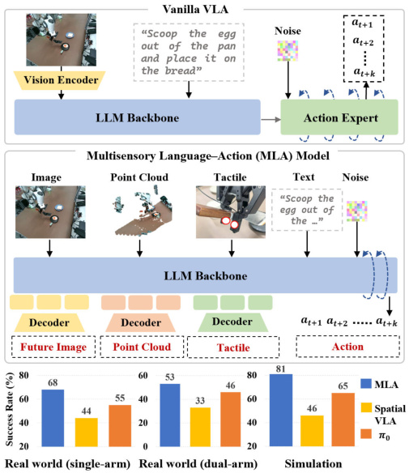
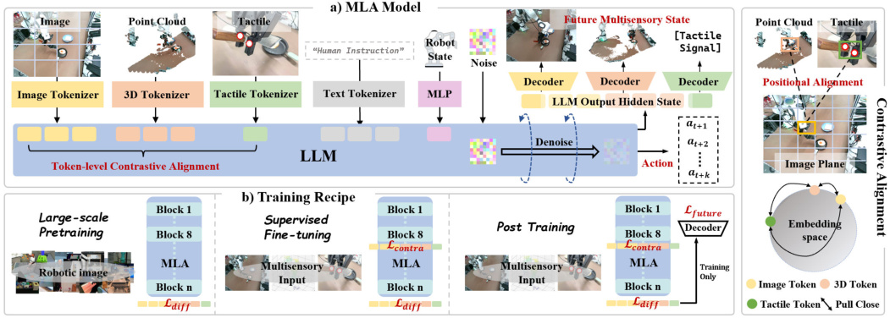
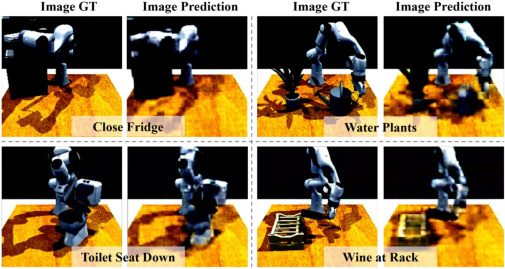
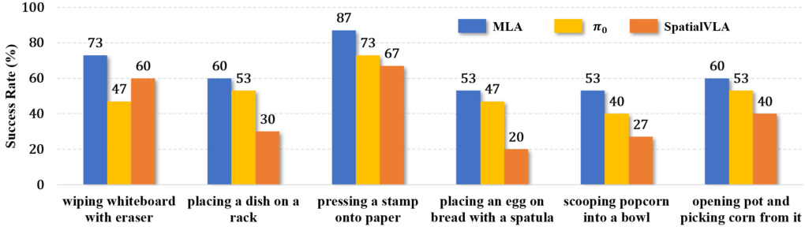
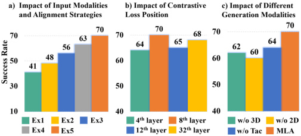
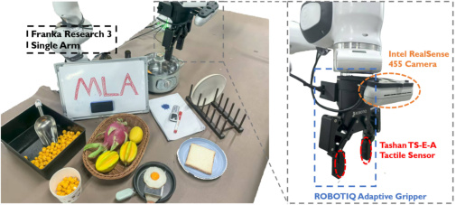

# MLA: Multisensory Language-Action Model

> 这是机器辅助生成的客观摘要笔记。教学版精读笔记由用户按节奏触发后单独成稿。

## 一句话讲什么（TL;DR）

让机器人不再只"看图听话"，而是同时融合 RGB 图像、3D 点云和触觉信号，并且预测未来多种感官状态来驱动动作。打个比方：以前的机器人像只用眼睛吃饭的人，MLA 让它同时用眼睛、距离感和指尖一起吃饭，还能"脑补"下一口的画面、形状和触感。

## 这篇论文要解决什么问题（Why this paper）

想象你在厨房擦白板：你眼睛看到要擦的字，但真正决定你能不能擦干净的，是**手腕感觉到的下压力度**和**肘关节对距离的拿捏**——压太轻擦不掉，压太重把白板弄花。如果只让你看着屏幕远程操作（只有视觉），你会很快崩溃。

机器人也一样。现实里它要"按图章"、"擦白板"、"把鸡蛋铲到面包上"这种活儿，光看摄像头是不够的——它得知道物体离手多远（空间），还得感觉到压下去够不够紧（触觉）。这类任务在论文里叫 **contact-rich task（接触密集任务，机器人需要跟物体反复接触施力的活）**。

之前的 VLA（Vision-Language-Action，视觉-语言-动作模型）方案有两个麻烦：

1. **要加新感官就得加新编码器**：想加点云就装个 3D encoder（专门处理三维坐标的小神经网络），想加触觉再装个触觉 encoder。这些 encoder 没在机器人数据上预训练过，跟 LLM（大语言模型）的 embedding 空间对不上，效率还低。这就好比你在英语团队里塞了个只会西班牙语的同事，他每次开口都得找翻译，开会效率直线下降。
2. **预测未来时只会预测下一帧图像**：好比开车的人只盯着前 1 米路面，无法估计远处障碍物的几何形状和接触力。对接触密集任务作用有限。

MLA 想一次回答：**能不能把多种感官塞进一个统一表示里，并且预测它们各自的未来，从而让动作生成更稳？**



### 它和你日常用的产品的关系

VLA 这条线和你日常已经在用的几样产品其实直接相关：

- **ChatGPT 的"看图说话"** ≈ VLM（视觉-语言模型），它是 VLA 的"前一代"，只回答问题不动手。MLA 的 LLaMA-2 backbone 就是被这条主线带火的。
- **扫地机器人 / 自动配送车**（小米扫拖、Roomba、美团无人车）= 早期机器人 policy，依赖**手工写好的状态机 + SLAM**，几乎没有"语言指令理解"。VLA 是想把这部分换成"听人话直接动"。
- **特斯拉 Optimus / Figure 02 / 小米 CyberOne** 这类人形机器人 demo——它们底层能不能跑通"擦白板"、"叠衣服"这种**接触密集任务**，正是 MLA 这类工作的目标场景。MLA 的 6 个真机任务（盖章、擦白板、铲蛋、铲爆米花、开锅取玉米）就是按这种"家务级灵巧操作"挑的。
- **特斯拉 FSD 端到端神经网络** ≈ 同样思路（视觉直接出控制），但只用 2D 摄像头。MLA 想说的是：在**手部接触场景**下，光学摄像头不够，必须把触觉和点云一起塞进同一个 LLM，才能稳。

## 用了什么方法（How）



### 1. Encoder-Free 多模态对齐 — 让 LLM 自己当"眼睛和手"

**类比**：不再请三个独立翻译，而是找一个会三国语言的人直接听。

**它在干什么**：传统 VLA 长这样——"图像 → SigLIP encoder → token → LLM"，触觉/点云也要各装一套。MLA 砍掉所有专用 encoder，直接 "图像 patch → 一个轻 tokenizer → 喂进 LLaMA-2 7B"。LLM 的前 8 层 transformer 就充当"感知模块"。

**关键步骤（pipeline）**：

1. **图像 tokenizer**：每张图切成 14×14 的 patch（不重叠），256 个 patch；每个 patch 投到 4096 维（LLaMA-2 的 hidden size）。最终 `f_img ∈ R^(B × 256 × 4096)`。
2. **点云 tokenizer**：原始点云 1024 × 3（1024 个三维点）。三层 block，每层做 FPS（最远点采样，挑最具代表性的 N 个中心点）+ KNN（K 近邻，给每个中心点找邻居）+ 一层线性层。输出同样 256 个 token、4096 维。
3. **触觉 tokenizer**：每个夹爪指尖装一个 Tashan TS-E-A 传感器，每个传感器读 6 维原始信号（法向力、切向力、切向力方向 2 维分量）。两个夹爪 → 12 维原始 → 一个 MLP → 1 个 4096 维 token。注意只有 1 个 token，因为触觉本身信息密度低。
4. **拼接**：image (256) + pointcloud (256) + tactile (1) + language tokens + robot state tokens + 噪声 token（放在末尾，给 diffusion 用）。整个序列丢进 LLaMA-2 7B 跑 32 层。

**关键超参**：
- LLM：LLaMA-2 7B（32 层，hidden_dim = 4096）。参数初始化继承自 Prismatic VLM。
- patch 尺寸 14×14（和 ViT-B/14 一致，方便复用 ImageNet 预训练直觉）。
- 点云 token 数 = 256（和图像对齐，方便后面做 token 级配对）。

**为什么这么设计**：
- **省一套 encoder**：少 200M-500M 参数，推理快 7%（消融数据），训练时不用先 pre-train encoder 再 align。
- **直接对齐 LLM 内部空间**：LLM 的 embedding 空间是它自己学出来的，外挂 encoder 永远在"敲门"。让 LLM 自己当感知层等于"开门让客人进客厅"。

**消融告诉我们什么（如果换别的方法）**：
- Ex1（只用图像）→ Ex3（图+点云+触觉，简单拼接，无对齐）已经能涨，但涨得有限。
- Ex3 → Ex5（加 token 级对比对齐）大涨——说明**模态多本身不够，要把它们对齐到同一空间才有用**。
- 如果你硬塞一个外挂 SigLIP（2D encoder）+ Lift3D（3D encoder），消融数据掉 7%——多一个"翻译官"反而拖累。

> 读到这你可能想：那把三种模态混在一起塞进 LLM，它怎么知道"这个 RGB 像素"和"这个 3D 点"说的是同一个东西？这就要靠下面这步——

### 2. 位置引导的 token 级对比学习（InfoNCE loss）— 强迫 LLM 知道"同一个东西"长什么样

**类比**：用相机参数做对照表。让你把同一个人不同时刻的照片归到一起，而不是"全班合照里所有人都是同一个人"。

**它在干什么**：在 LLM 的第 8 层 transformer 输出，加一个对比损失（contrastive loss）。把"同一空间位置"的 image / pointcloud / tactile token 当作正样本对，其余全部当负样本。

**关键步骤**：

1. 拿到当前点云的 256 个中心点（FPS 采样过的）。
2. 每个 3D 中心点 `(X, Y, Z)`，用相机内参 `K` 和外参 `[R|t]` 做投影：`(u, v) = K · [R|t] · (X, Y, Z, 1)`。这步就是 OpenCV 里 `cv2.projectPoints` 干的事。
3. 投到的 `(u, v)` 落在第几个 14×14 的 patch 里——这就是它对应的 image token 索引。
4. 触觉同理：夹爪在世界坐标里的 3D 位置投到相机平面，找到对应 patch。
5. 这些"同 patch"的 token 之间是正样本对，其余都是负样本。

**关键公式（人话翻译版）**：

原文公式 1：
```
L_img↔pc = -(1/256) Σᵢ log [ exp(⟨fⱼ_img, fᵢ_pc⟩/τ) / Σⱼ exp(⟨fⱼ_img, fᵢ_pc⟩/τ) ]
```

人话翻译：对每一个点云 token `fᵢ_pc`，找到它的"对应"图像 token `fⱼ_img`（投影到的那个 patch）。
- 分子：这两个的相似度（点积），除以温度 `τ`（一个超参数，控制对比的"锐度"）。
- 分母：这个点云 token 和**所有 256 个**图像 token 的相似度之和。
- 取 log 加负号 = 让分子尽量大、分母里其它项尽量小。
- 一句话：**让"对应位置"的 image token 和 pointcloud token 在嵌入空间里站一起，让"不对应位置"的离得远远的**。

原文公式 2（触觉的版本）：
```
L_tac↔img/pc = -log [ exp(⟨f_tac, f_{j/i}⟩/τ) / Σ exp(⟨f_tac, f_{j/i}⟩/τ) ]
```

人话翻译：触觉只有 1 个 token，所以只有 1 对正样本——"夹爪在图像里那个 patch"。其它 255 个都是负样本。把这 1 对拉近、其它推开。

总损失：`L_contrastive = L_img↔pc + L_tac↔img + L_tac↔pc`

**关键超参**：
- 接在第 **8 层**（LLaMA-2 7B 32 层的前 1/4 处）。
- 温度 τ 论文未明说具体值，按 SigLIP 类工作惯例约 0.07-0.1。
- 正样本对数：image-pc 是 256 对，tactile-img / tactile-pc 各 1 对（单臂；双臂翻倍）。

**为什么这么设计**：
- **位置而非语义**做正样本：因为机器人场景下"语义对齐"很难直接监督（什么叫"同一个物体"？），但"投影到同一像素"是几何上确定的。**用几何代替语义**是这篇论文最聪明的招。
- **接在第 8 层**：太浅（4 层）特征没成型；太深（32 层）已经被动作 loss 占满。8 层是"感知刚成型、还没开始决策"的位置。
- **token 级而非图像级**：图像级把整张图当一个向量，对齐粒度太粗。

**消融告诉我们什么**：
- Ex5 (token 级对比) vs Ex4 (image 级对比，简单地拿同一时刻所有 token 当正样本) → 涨 7%。
- 接在 4 / 8 / 12 / 32 层 → **8 层最好**。32 层最差，因为 final hidden state 已经在为 action 服务，再加对比损失就"分裂人格"。
- 如果完全不加对比损失（Ex3）vs 加了（Ex5）→ 涨更多（论文图 6a 显示约 10+ 个点）。

### 3. 未来多感官生成（Future Multisensory Generation）— 让机器人"脑补"下一步

**类比**：让机器人脑补下一步的快照。看连环画只盯转折页。

**它在干什么**：在 LLM 输出最后一层 hidden states 后，挂三个独立的 transformer decoder，分别预测**未来关键帧**的图像、点云、触觉。这三条预测分支**只在训练时用作辅助监督**，推理时整个 decoder 砍掉，不影响实际控制速度。

**关键步骤**：

1. **关键帧检测**：扫描整条轨迹，找机器人关节速度突变（速度二阶导数过阈值）和动作类型转换（如夹爪从张到合）的那几帧。一个 200 帧的演示里，关键帧通常只有 5-15 帧。
2. **图像预测分支**：4 层 transformer decoder，输入是 LLM 末层 hidden state，输出是未来关键帧的 RGB 图像。loss 用 MSE。**关键 trick**：只对前景像素算 loss——用 depth map 把背景像素 mask 掉，因为背景对动作决策没用，强行让模型重建背景反而浪费 capacity。
3. **点云预测分支**：参考 PointMAE（Masked Autoencoder for Point Cloud）。把 ground-truth 点云分成 G 个局部 patch（每个 patch 用 FPS 选中心 + KNN 选 M 个邻居），decoder 输出 `P_hat ∈ R^(G × M × 3)`。loss 用 **Chamfer Distance**：对每个预测点，找 ground-truth 里最近的点求距离；再反过来 ground-truth 每个点找预测里最近的——两个方向的距离取平均。
4. **触觉预测分支**：MLP-based decoder，输出 12 维触觉向量，MSE loss。
5. **组合 loss**：`L_post = L_diff + L_contrastive + L_future`，其中 `L_future = L_img + L_pc + L_tac`。

**关键公式（人话翻译版）— Chamfer Distance**：
```
CD(P, P_hat) = (1/|P|) Σ_p min_{p_hat} ||p - p_hat||² + (1/|P_hat|) Σ_{p_hat} min_p ||p_hat - p||²
```

人话翻译：左半"每粒沙子找对面最近的一粒"，右半"反过来再找一遍"。两堆沙子越像，这个值越小。

**关键超参**：
- decoder 层数：4（标准 self-attention + FFN）。
- post-training epoch：100。
- 关键帧间隔：动态决定（取决于速度变化），不是固定 N 帧。
- 图像 loss 只算前景（depth-based mask）。

**为什么这么设计**：
- **预测多模态而非只预测图像**：图像告诉你"看起来怎样"，点云告诉你"几何长什么样"，触觉告诉你"接触会怎样"。三个一起预测，相当于让 LLM 内部 hidden state 同时编码这三类信息——副产品是动作生成的 condition 更鲁棒。
- **预测关键帧而非下一帧**：连续帧之间差别小，预测下一帧基本是"复制粘贴当前帧 + 微调"，模型学不到长程动态。关键帧才是"动作转折点"。
- **训练用 / 推理不用**：是个工程妙招——既享受了预测带来的表征好处，又不付出推理代价。

**消融告诉我们什么**：
- 不预测图像、不预测点云、不预测触觉——任何一个砍掉都掉点（论文图 6c）。说明三种模态预测**互补不冗余**。
- 预测关键帧 (70%) vs 预测相邻帧 (64%) → 涨 6%。
- 如果你是做研究，最值得借鉴的是 **"训练时多任务、推理时砍辅助分支"** 这个范式——通用性强，不只用在 VLA。

> 读到这你可能想：训练时模型脑补这么多东西，不会拖慢推理吗？答案是不会——**这些预测分支只在 post-training 阶段用作辅助监督，推理时整个 future decoder 不跑**。机器人实际工作时还是只输出动作。



(论文 Fig 8 的图像预测可视化：左 ground truth、右 MLA 预测。可以看出未来关键帧的机械臂位姿、目标物状态、光照条件都被合理"脑补"出来——说明 hidden state 真的编码了这些 future 信息。)

### 4. 三阶段训练流水线 — 先学说话，再学认物，最后学预判

**类比**：婴儿先学语言+识图，再学摸东西的手感，最后学预判球会飞到哪里。

**它在干什么**：把整个训练拆成 3 个阶段，每个阶段引入新的输入和新的损失，让模型一步步消化。

**Stage 1 — 大规模 pretraining**：
- 数据：**570K 条轨迹、36M 帧**，从 28 个开源数据集混合采样（详见下文"数据集"章节）。
- 输入：**只有** image + language + robot state。点云和触觉的 token 位置**保留为空 token**（用 0 或 learnable placeholder 占位），保证 stage 1 和 stage 2 序列结构一致。
- 损失：只有 `L_diff`（diffusion action loss）。
- Epoch：10。
- **为什么**：开源数据集（Open-X、DROID、RoboMIND）几乎都没有触觉和点云。硬塞会让模型学到"空 token 是有意义的信号"。

**Stage 2 — SFT（Supervised Fine-Tuning）**：
- 数据：自采 6 个 contact-rich 任务，每任务 200 条 demo（共 1200 条 demo，比 Stage 1 数据量小三个数量级）。
- 输入：**全部模态**（image + pointcloud + tactile + language + robot state）。
- 损失：`L_sft = L_diff + L_contrastive`。这一步开始训对比对齐。
- Epoch：**300**。
- **为什么 epoch 这么多**：因为数据量少、任务专门化，需要充分学习对齐。

**Stage 3 — Post-training**：
- 数据、输入与 Stage 2 相同。
- 损失：`L_post = L_diff + L_contrastive + L_future`，加上未来生成损失。
- Epoch：**100**。
- **为什么再加一阶段而不是 Stage 2 一锅炖**：未来生成 loss 是辅助监督，过早引入会让模型"贪心"——在没建立好基础对齐时就硬学预测，效果反而差。先 SFT 把对齐打稳，再 post-training 加预测。这是论文里反复强调的"progressive equipping"。

**关键超参**：
- 优化器：AdamW。
- 推理采样：DDIM，4 步。
- 模型大小：~7B（LLaMA-2 7B 主体 + 三个 tokenizer + 三个 decoder + diffusion head）。
- 论文未公开学习率、batch size、训练硬件、训练时长——这是它的一个透明度问题（详见"局限"和"实操 FAQ"）。

**消融告诉我们什么**：
- 论文没单独消融"三阶段 vs 一阶段"，但根据公开数据特性反推：如果一阶段直接全模态，pretraining 的 570K 数据几乎都是空 token，会浪费这部分数据的图文先验。

> 读到这你可能想：为什么要分这么多阶段？一锅炖不行吗？因为公开机器人数据没有触觉、没有点云——硬塞进去要么模型学崩，要么模态间互相打架。先用图文打好底子，再逐步引入新模态和新目标，是更稳的训练学习节奏。

### 5. 动作头用 diffusion — 让控制信号像画家从噪点开画

**类比**：画家先画一团噪点再迭代擦干净。

**它在干什么**：动作预测不直接回归（一步算出 7 维向量），而是用扩散模型——给一个"加了噪声的动作"，让模型一步步把噪声去掉、还原出真实动作。

**关键步骤**：

1. 训练时：取真实动作 `a₀`（7 维或 14 维向量），加随机高斯噪声得到 `aₜ = a₀ + ε·t`（`t` 是噪声等级，0 到 T 之间）。
2. 把 `aₜ` 编码成 noise token，拼接在 LLM 输入序列末尾。
3. LLM 输出"预测的噪声 `ε̂`"。loss = MSE(ε̂, ε)。
4. 推理时：从纯噪声开始，迭代 4 步（DDIM），每步去掉一部分噪声，最后输出干净的动作向量。

**关键公式（人话翻译版） — 动作表示**：

单臂：`a_t = (Δx, Δy, Δz, Rᵣ, Rₚ, R_y, g)` 7 维
- 前 3 维：末端执行器（夹爪）下一步要移到的笛卡尔坐标增量（米）。
- 中 3 维：欧拉角（roll/pitch/yaw）。
- 第 7 维：夹爪开合宽度。

双臂：拼两个 7 维 = 14 维。

**为什么这么设计**：
- **diffusion 比直接回归好**：动作分布往往是多峰的（同一个状态下多种合理操作），直接 MSE 回归会把多峰平均成一个"中间值"，这个中间值往往不可执行。diffusion 自然处理多峰。
- **DDPM 训练 + DDIM 推理**：DDPM 训练稳定但采样慢（要 1000 步），DDIM 是同一个模型用更聪明的采样方式，4 步就够。这是 2024 年 VLA 主流配方（π₀、HybridVLA 都这套）。
- **拼在序列末尾**：让 LLM 的 attention 能看到所有感知 token，noise token 通过 self-attention 自然地"被引导"。

**关键超参**：
- 推理步数 `n = 4`。
- 动作预测 horizon `H` = 一段动作序列长度，论文未明示但 VLA 标配是 8-16 步。
- 关键帧 horizon `N` = 用来对应未来感官预测目标。

## 关键实验结果（What works）



每条结果都按 **设置 → 数字 → 对比 → 现实意义** 来读：

- **真实世界 6 任务平均成功率（单臂 4 + 双臂 2）**
  - 设置：每个任务 200 条 demo 训练，15 个 rollouts 评测，桌面物体起始位置随机。
  - 数字：MLA 比 π₀ 高 12 个点，比 SpatialVLA 高 24 个点。
  - 对比意义：π₀ 是 2024 年 2D VLA 的最强代表，SpatialVLA 是 2025 年专门为 3D 场景设计的 SOTA——MLA 在它们都最擅长的接触类活上一次性赢两位。
  - 现实意义：相当于一个新人同时打败了上届冠军和卫冕冠军。**对接触密集任务（擦白板、铲蛋），多模态 + 未来预测确实是关键。**

- **擦白板任务的细节**
  - 设置：用机械臂拿擦子在白板上擦色块，靠视觉判断"擦哪里"，靠触觉判断"压力够不够"。
  - 数字：消融拿掉触觉时这个任务掉的比其它任务多。
  - 现实意义：**触觉不是"锦上添花"，对真正需要施力的任务是 make-or-break**。如果你做的是 pick-and-place 这种"接触一下就放"的任务，触觉收益不大；但擦、按、铲这些"持续接触施力"的活，触觉是必需品。

- **RLBench 仿真 10 任务平均 81%**
  - 设置：CoppeliaSim 仿真器跑 RLBench 10 个标准任务，100 条演示训练，20 次 rollouts 评测。无触觉（仿真触觉不真实）。
  - 数字：MLA 81% > DreamVLA* 65% > HybridVLA 66% > π₀ 65% > SpatialVLA 46% > UP-VLA 42% > OpenVLA 40%。
  - 对比意义：仿真里砍掉触觉，MLA 依然 SOTA，且领先第二名 16 个点。
  - 现实意义：说明就算砍掉一根胳膊（触觉），**对齐机制 + 未来预测**这两个核心组件本身也站得住——不是靠"硬件优势"赢的。

- **泛化实验（最难的"鸡蛋铲到面包"任务）**
  - 设置：用没见过的物体（鸡蛋换生菜、改盘子颜色）和没见过的背景（堆杂物干扰）测试。
  - 数字：未见过物体 π₀ 47% → 35%（掉 26%），MLA 53% → 45%（掉 15%）；未见过背景 π₀ 47% → 25%（掉 47%），MLA 53% → 40%（掉 25%）。
  - 现实意义：旧方法换个新场景就**几乎对半折损**，MLA 只折损 1/4——这是从"实验室能跑"走向"现实世界能用"的关键一步。如果你目标是部署到客户家，泛化能力才是真考核。

- **对比 loss 接在第几层最好？**
  - 设置：消融试 LLaMA-2 7B 的 4 / 8 / 12 / 32 层接对比 loss。
  - 数字：第 8 层 > 12 层 > 4 层 > 32 层。
  - 对比意义：**第 8 层是 LLaMA-2 7B 32 层架构的"前 1/4"位置**——感知粗糙成型、还有 3/4 的容量留给后续推理，刚好合适。
  - 现实意义：浅层（4 层）的特征还没成型，强行对齐拽得太远；深层（32 层）已经被动作生成 loss 占满了，再加对比 loss 几乎没收益。**如果你抄方法，请别想当然挑最后一层**。

- **未来生成的模态消融**
  - 设置：在 SFT 之后的模型基础上，分别去掉图像生成、点云生成、触觉生成的 post-training。
  - 数字：去任何一个都掉点（论文图 6c 显示掉 3-7%）。
  - 现实意义：三种模态预测**互补不冗余**。点云贡献"空间感"，触觉贡献"接触感"，图像贡献"语义信息"。

- **关键帧 vs 相邻帧**
  - 设置：未来生成预测目标改成"下一帧" vs "下一关键帧"。
  - 数字：相邻帧 64% vs 关键帧 70%。
  - 现实意义：**预测目标越"硬"越好**。预测下一帧太简单（基本是复制粘贴），模型学不到东西；预测关键帧才迫使模型理解长程动态。

- **多余 encoder 的代价**
  - 设置：往 MLA 上额外塞 SigLIP（2D encoder）和 Lift3D（3D encoder）。
  - 数字：性能掉 7%。
  - 现实意义：**别"加料"**——多一个 encoder 不仅多算力，还引入"翻译间损耗"。





(论文 Fig 5 attention heatmap：MLA 的 attention 集中在机械臂和被操作物体上，而无对齐的变体 attention 散落整张图——可视化证明对比对齐让 LLM "知道该看哪里"。)

## 数据集 / 实验设置详情

### Stage 1 — Pretraining 数据
- **总量**：570K 轨迹、36M 帧。
- **来源**：从 Open-X-Embodiment、DROID、RoboMIND 这三个大开源池子里挑出 28 个高质量子集，自定义采样比例。
- **采样比例排前几**（论文 Table III）：
  - BridgeV2：20.93%（伯克利的桌面机器人数据，6 万条 demo）
  - Kuka：20.22%（Google 的 QT-Opt 数据集）
  - Fractal：13.67%（Google RT-1 数据）
  - Robo-Net：11.53%
  - Language Table：7.70%
  - BC-Z：7.54%
- **统一处理**：动作表示对齐到下游格式（end-effector pose），点云/触觉 token 位置占空。
- **为什么挑这些**：都是"图像 + 语言 + 动作"三元组完整的、动作格式可统一的、数据规模大的桌面操作数据。

### Stage 2/3 — 自采数据
- **平台**：Gello 远程操作系统（一个开源的低成本人手遥控机械臂的方案）。
- **每任务**：200 条高质量 demo。
- **6 个任务**：
  1. **盖章**（pressing a stamp）：先抓章再压纸，靠切向力突变判断完成。**视觉不参与判定**。
  2. **擦白板**：抓擦子识别色块，触觉判断接触和移动距离。
  3. **放盘到架**：抓盘边缘 → 大角度旋转 → 准确插入碗架。考验空间感知。
  4. **铲蛋上面包**：抓铲 → 滑铲底入蛋下 → 移到面包上。三个子任务串联，触觉判断"铲到底了"。
  5. **铲爆米花到碗**（双臂）：右臂铲、左臂端碗，需要双臂坐标对齐。
  6. **开锅取玉米**（双臂）：左臂开盖 → 右臂取玉米 → 左臂关盖。需要双臂避碰协作。

### 硬件配置
- **单臂**：Franka Research 3 + ROBOTIQ adaptive gripper + 2 × RealSense D455（一个三人称右前、一个手腕）+ 2 × Tashan TS-E-A 触觉传感器（夹爪两指尖各一个）。
- **双臂**：两台 Franka Research 3 并排 + 同款夹爪和触觉 + 3 × RealSense D455（一三人称 + 两手腕）。
- **跨模态对齐**只用三人称视图（手腕视图不参与对比 loss，但参与图像 token 输入）。

### Train/Eval 划分
- **训练**：每任务 200 条 demo 全部用于训练。
- **评测**：每任务 15 次 rollouts，桌面起始位置随机。**没有 held-out demo 集**——这是个小遗憾，意味着报告的成功率是"在见过的物体配置下"。
- **泛化实验**：单独换物体或换背景再测 15 次。

### Baseline 选择
- **π₀（2024）**：当时 SOTA 2D VLA。挑它代表"图像-only 的天花板"。
- **SpatialVLA（2025）**：专门为 3D 场景设计的 SOTA。挑它是因为它代表"加 3D encoder"这条路线。
- **HybridVLA（CVPR 2025）**：同作者团队前作，diffusion + autoregression 混合。
- **OpenVLA（2024）**：最广用的开源 VLA，代码社区基线。
- **UP-VLA、DreamVLA**：未来预测派代表。

**为什么挑这些**：覆盖了 VLA 的三条主流支线（2D-only / 3D / 未来预测），让 MLA 的赢面更有说服力。

## 关键公式 / 算法（人话翻译版）

### 公式 1 — 整体策略

原文：
```
a_{t:t+H}, I_{t+N}, P_{t+N}, T_{t+N} ~ π_θ(· | I_t, P_t, T_t, S_t, L)
```

人话翻译：在第 `t` 时刻，给定**图像 I、点云 P、触觉 T、机器人状态 S、语言指令 L**，策略 π_θ 同时采样输出两样东西：
- 接下来 `H` 步的动作序列 `a_{t:t+H}`（这是机器人真正要执行的）。
- 未来某个关键帧 `t+N` 时的图像、点云、触觉（这是辅助监督，推理时不算）。

### 公式 2 — Image-Pointcloud InfoNCE（详见上面方法部分已展开）

每一项的来源：
- `f_img`、`f_pc` 都来自第 8 层 transformer 的 hidden state。
- "对应位置"由相机投影几何决定（不是学出来的，是几何算出来的）。

### 公式 3 — 总损失

```
L_post = L_diff + L_contrastive + L_future
       = L_diff + (L_img↔pc + L_tac↔img + L_tac↔pc) + (L_img + L_pc + L_tac)
```

人话翻译：post-training 阶段同时优化 7 个 loss：
1. `L_diff`：动作扩散主损失（"动作预测对不对"）。
2. `L_img↔pc`、`L_tac↔img`、`L_tac↔pc`：3 个对齐损失（"模态间对得齐不齐"）。
3. `L_img`、`L_pc`、`L_tac`：3 个未来预测损失（"脑补的下一帧准不准"）。

论文未公开各 loss 的权重系数 `λᵢ`——这是个潜在的复现坑。

## 实操 FAQ（如果你想复现）

- **模型多大？显存要多少？4070 跑得动吗？**
  - LLaMA-2 7B 主体在 fp16 下大约 14GB 模型权重。加上 tokenizer、decoder、diffusion head、optimizer state（AdamW 占 model size × 2）和 activations，**训练**至少需要 80GB 显存 × 4-8 张（保守估计 H100/A100 节点）。**推理**模型本身可以塞进单张 24GB 卡（4070 Ti 显存 12GB 是不够的，4090 的 24GB 紧巴巴），但要跑实时控制需要更多 batch headroom。
  - 实际需求论文未公开。
- **数据集在哪下？要授权吗？**
  - Pretraining 数据：Open-X-Embodiment（HuggingFace）、DROID（公开）、RoboMIND（X-Humanoid 公开）。都不需要特殊授权。
  - 自采数据：**论文未承诺开源**。这是大头——想完全复现需要自己采。
- **代码在哪？**
  - 项目页 https://robotic-mla.github.io/。但截至论文发表时论文未提到 GitHub 链接，也没承诺开源代码。**这是个不确定性**——你想复现可能要等代码或自己重写。
- **推理一次要多久？**
  - 论文未公开具体延迟。但 DDIM 4 步 + LLaMA-2 7B 单次 forward，理论上能做到 5-10 Hz 控制频率（够慢操作用）。比纯回归 VLA 慢，但比 100 步 diffusion 快得多。
- **训练一次要烧多少卡时？**
  - 论文未公开。基于 OpenVLA 公开数据反推（OpenVLA 7B 在 64 张 A100 上跑 14 天），MLA 的 Stage 1 大约 7-14 卡天 × 64 = 数百卡天；SFT 300 epoch + post-training 100 epoch 在小数据上估计每个任务 1-3 张 H100 跑数天。
  - 总成本：粗估 5-20 万人民币（按云 GPU 价格）。这是个学术实验室级别的烧钱，不是个人项目。

## 失败案例与边界

论文没有专门的 failure case 章节，但从消融、泛化和图 5 attention 可视化能反推出几个边界：

- **极端泛化失败**（鸡蛋任务）：MLA 在背景大改时仍掉 25%。**对工业部署**意味着光照、桌面颜色等"看似无关"的变化仍可能让 success rate 腰斩。
- **触觉传感器失效场景**：论文没测"触觉传感器损坏 / 噪声大"时模型怎么办。**对真实部署**意味着传感器是单点故障——一个夹爪坏一颗触觉，模型在那几个任务上可能直接挂掉。
- **关键帧检测失败**：论文方法依赖 joint velocity 突变检测关键帧。如果你的任务是"匀速精细操作"（比如缓慢倒酒、写字），速度变化平滑，关键帧检测可能失效。
- **未见过的语言指令**：论文泛化实验只换物体和背景，**没换语言**（"place egg on bread" 始终是这句话）。如果用户说"把鸡蛋放到吐司上"模型能不能理解？未知。
- **跨 embodiment 泛化**：模型只在 Franka FR3 上训和测。换成 UR5 / xArm 能不能直接跑？没测。这是 VLA 整条线的共同问题，不是 MLA 独有。

## 这篇论文之后的延伸阅读

如果你想继续深入这条线，按"必读 → 续作 → 竞争"排：

1. **π₀（2024）**——"前传"必读。VLA 的最强 2D baseline，MLA 在每个任务都跟它对比。读它能让你理解"没有 3D 和触觉时 VLA 能做到什么"。`arXiv:2410.24164`
2. **OpenVLA（2024）**——开源代码量最大的 VLA，社区基线。如果你想动手跑，先跑通 OpenVLA 比直接复现 MLA 容易十倍。`arXiv:2406.09246`
3. **SpatialVLA（2025）**——"竞争对手"。它选的是"加专门 3D encoder"的相反路线，读它能看清两条 3D 路线的优缺点。`arXiv:2501.15830`
4. **DreamVLA（2025）**——同期未来预测派的最强代表。MLA 在仿真里和它直接对标，赢 16 个点。读它能知道"只预测 2D 未来能做到什么程度"。`arXiv:2507.04447`
5. **Lift3D Policy（CVPR 2025）**——MLA 的关键帧检测和点云分组直接抄自这篇。算 MLA 的"技术依赖"，想复现 MLA 不读它的点云模块基本写不出。
6. **TactileVLA / OmniVTLA（2025）**——纯做"触觉 + VLA"的两篇。读它们能让你理解"触觉模态本身有哪些套路"。`arXiv:2507.09160` / `arXiv:2508.08706`

如果你只能读 1 篇，挑 **π₀**——它是这条线的"标尺"。

## 我读完后该懂的几个术语

- **VLA (Vision-Language-Action model，视觉-语言-动作模型)**：给 VLM 接一个动作头，输入图+指令，输出机器人控制信号。本文 Section II 全篇都在跟它对比。
- **VLM (Vision-Language Model，视觉-语言模型)**：能看图说话的大模型，如 Qwen2-VL、Prismatic VLM。是 VLA 的基础。
- **Encoder-Free Alignment（无编码器对齐）**：不再外挂 SigLIP（Google 的图文对比预训练视觉编码器）那种专门 encoder，直接把 LLM 自身前几层当感知层用。类比"不请翻译，让会三国语言的人直接听"。本文 Section III-C 是核心。
- **Token-level InfoNCE**：一种对比损失。把"同位置的 image token / point token / tactile token"拉近，其它推远。类比"全班合影里同一个人不同时刻的照片要归到一起"。本文 Section III-C 公式 1-2。
- **Keyframe Prediction（关键帧预测）**：根据机器人关节速度变化挑出"动作转折点"那几帧来预测，而不是密集地预测下一帧。类比"看连环画只看转折页"。本文 Section III-D 和消融 64% vs 70% 那条。
- **Chamfer Distance（倒角距离）**：衡量两个点云相似度的损失。对每个点找对方最近邻求距离，然后取平均。类比"两堆沙子，每粒沙找对面最近的一粒，看平均差多远"。本文 Section III-D 点云预测用它。
- **DDPM / DDIM**：扩散模型的训练目标和加速采样方法。类比"画家从噪点画起、一步步擦干净"，DDIM 是 4 步采样的快速版。本文 Section III-E 动作头用它。
- **Contact-rich manipulation（接触密集操作）**：需要机器人和物体反复接触并施力的任务，如擦白板、按图章。本文实验全聚焦于此。
- **InfoNCE loss**：一种对比学习损失，公式核心是"拉近正样本对、推远负样本对"。本文用 token 级别的 InfoNCE 来做跨模态对齐。
- **FPS (Farthest Point Sampling，最远点采样)**：从一团点云里贪心地挑 N 个"互相离得最远"的点作为代表。点云 tokenizer 和点云预测都用它。
- **KNN (K-Nearest Neighbors，K 近邻)**：给每个 anchor 点找最近的 K 个邻居，组成一个局部 patch。点云 tokenizer 用它做局部聚合。
- **End-effector pose（末端执行器位姿）**：机器人手的位置和朝向。MLA 的 7-DoF 动作就是这个的增量。
- **DoF (Degrees of Freedom，自由度)**：能独立控制的轴数。单臂 7 = 3 平移 + 3 旋转 + 1 夹爪。双臂 14 = 两个 7。
- **DDPM 损失目标**：训练时让模型预测"加进去的噪声 ε"而不是"原始动作 a₀"。这是 2020 年 Ho et al. 的关键 trick。

## 这篇论文的局限 / 我看出的疑点

1. **触觉只在真机评测**——仿真里没真实触觉，所以"触觉 + 多感官生成"的真实收益其实只在 4 个 single-arm + 2 个 dual-arm 任务里被验证过，每任务 15 rollouts。
   - **用户视角**：如果你想复现，必须备齐 Tashan TS-E-A 触觉传感器和 Franka Research 3 机械臂——硬件门槛和成本不低（FR3 大约 25-35 万人民币，触觉传感器单价约几千），且每任务才 200 条 demo + 15 次评测，统计置信度其实不高。
   - **后续工作有没有解决**：触觉仿真本身是个独立研究领域（如 Tactile Gym、TacMAP），尚未达到能直接代替真机的水平。短期内这个限制改变不了。

2. **"keyframe vs adjacent frame"消融只给了 64% vs 70%**：差距 6 个点，未来工作能否结合两种预测方式论文没展开。
   - **用户视角**：如果你想在自己的项目里抄关键帧策略，要先确认你的任务有"明显的转折点"——速度变化平滑的任务（比如缓慢平移、连续轨迹追踪）这套关键帧检测可能效果不好。
   - **后续工作**：UP-VLA、CoT-VLA 一些工作开始尝试 hybrid prediction（既预测 dense frames 也预测 keyframes），但还没有明确证据说哪种更好。

3. **算力 / 训练时间未公开**：570K 轨迹 pretraining + 300 epoch SFT + 100 epoch post-training。
   - **用户视角**：实验室复现门槛不知道有多高——你不知道是要 4 张 H100 跑 3 天，还是要 32 张跑两周。这种成本数据缺失让"想试试"的人很难做预算决策。论文也没给学习率、batch size、loss 权重 λ 这些关键超参。
   - **后续工作没解决**：VLA 这条线整体透明度都偏低，π₀ / SpatialVLA 也类似。OpenVLA 是少数完整公开的。

4. **第 8 层为何是甜区，论文没给理论解释**——只是消融出来"凑巧最好"。
   - **用户视角**：换到 LLaMA-3、Qwen2、更大或更小模型上这个层数还成立吗？你抄方法的时候要重新搜超参，迁移成本不小。
   - **后续工作**：这是 transformer 内部表征研究的开放问题，没有简洁理论解。

5. **没有 video 模态**——MLA 只处理单帧图像 + 当前点云 + 当前触觉，没用历史帧序列。
   - **用户视角**：对需要"判断运动方向 / 速度"的任务（比如接住一个滚来的球）效果可能差。
   - **后续工作**：Fast-in-Slow（同作者团队 2025）等工作开始引入历史 context。

6. **代码和自采数据没承诺开源**。
   - **用户视角**：这是直接的复现门槛——除非你能拿到 200 条 × 6 任务 demo，否则只能跑 RLBench 仿真版（且没触觉）。
   - **后续工作**：项目页是否会放出 checkpoint 是关键。

7. **公平比较的疑问**：MLA 跟 π₀ / SpatialVLA 比的时候，三方都用相同 viewpoint 数量但 MLA 多了触觉输入。在真机 6 任务里 MLA 赢的部分到底是"方法本身好"还是"多用了一个传感器"？仿真里证明了"砍掉触觉也赢"，但赢 16 个点不等于"在所有任务上赢"。
   - **用户视角**：如果你的应用场景明确不能装触觉（比如远程作业），看仿真结果即可；但如果能装，触觉的边际收益还需要更多 ablation。

## 与其他论文的关联

- 和 **OpenVLA / π₀**：同属 VLA 主线，都用 LLM backbone + 动作头的范式。但 OpenVLA、π₀ 都是 2D-only baseline，输入只有图像和语言。MLA 是第一个把 image + point cloud + tactile **三模态**塞进同一 LLM 的工作，可以视为 π₀ 的"多感官升级版"，并且在 π₀ 的所有真机任务上都做对比，赢 12%。
- 和 **SpatialVLA**：都关心 3D 几何信息。但 SpatialVLA 的做法是**外挂一个专门的 3D encoder + ego-centric token**（专门为机器人第一视角设计的 3D 表示）。MLA 反过来——**砍掉 3D encoder**，用对比学习强制 LLM 自己对齐 3D 信息。两者对"3D 怎么进 VLA"给出了截然相反的答案。MLA 在仿真里赢 SpatialVLA 35 个点，说明"少装一个 encoder"反而效果更好。
- 和 **DreamVLA / CoT-VLA / UP-VLA**：同属"未来状态预测派"，都让模型去预测下一步的世界状态来辅助动作生成。但前三者都**只预测 2D 图像**或图像+depth。MLA 把预测扩展到点云和触觉——可以视为"未来预测派"的多模态泛化。论文复现 DreamVLA 后，MLA 在 RLBench 仍领先 16 个点，说明预测点云和触觉确实带来增量。
- 和 **Lift3D**：本文的关键帧检测策略和点云分组策略直接抄自 Lift3D（Yueru Jia 等人）。读 MLA 的方法部分会反复看到引用 [33]——那就是 Lift3D。

## 我建议的阅读顺序

面向零基础读者：

1. **先读摘要 + Fig 1（img_000.jpg）**——10 分钟知道这篇要干嘛、跟 vanilla VLA 的差异在哪。**为什么先看这个**：摘要把 12% 和 24% 这两个数字摆在最前，能立刻判断你要不要往下读。
2. **跳到 Fig 2（img_003.jpg）盯着看 5 分钟**——上半图是 forward pass，下半图是三阶段训练。看懂三个 tokenizer 在哪、对比 loss 和未来预测分支挂在哪。**为什么**：MLA 的所有创新都浓缩在这张图里，文字只是给图加注解。
3. **再读 Section III-C（Encoder-Free Multimodal Alignment）**——这是论文的核心创新点。读到 InfoNCE 公式不要怕，回到本笔记的"位置引导对比学习"那段类比。**为什么**：这段不读懂后面 III-D 都是空中楼阁。
4. **快速扫 Section III-D（Future Multisensory Generation）**——只需要记住"训练时预测三种未来，推理时不跑"。**为什么**：方法不复杂，但关系到为什么真机泛化能力强。
5. **跳到 Fig 3（img_004.jpg）和 Fig 6（img_006.jpg）**——直接看条形图，知道每个组件贡献多少 percent。**为什么**：消融图比文字更直观地告诉你"如果你只能抄一个组件该抄哪个"。
6. **可以跳过的部分**：Section IV-D 仿真实验细节、Appendix 数据集列表（除非你要复现）。

## 为什么值得读 / 不值得读

**值得读**：MLA 把"多感官融合"和"未来生成"两条 VLA 主流支线合在一篇里讲清楚，方法清晰、消融完整。如果你只能读 1 篇 contact-rich VLA，**这篇优先于 SpatialVLA 和 DreamVLA**——它一并回答了两边的问题。如果你能读 3 篇，建议配 π₀（2D baseline 的天花板）和 OpenVLA（开源代码量最大）一起读。如果你能读 5 篇，再加 SpatialVLA 看 3D 编码器的另一种思路、再加 DreamVLA 看纯未来预测派。

**慎读**：如果你只关心移动导航或纯 2D 桌面任务（pick-and-place），触觉和点云预测部分对你帮助有限，看 π₀ 就够了。
