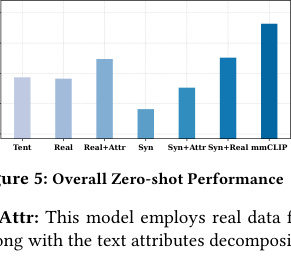

# mmCLIP：给毫米波雷达装上「语言层」，没见过的动作也能认

> 给完全没接触过 AI / 无线感知的读者写的精读笔记。RF 三连定位：[RF-SLAM](rf-slam.md) 回答「人在哪」，[NLOS-mmWave](nlos-mmwave.md) 回答「隔墙人在哪」，**mmCLIP 回答「人在干什么」**。

## 一句话讲什么（TL;DR）

用对比学习把毫米波雷达信号「翻译」进 CLIP 的文本语义空间——训练时见过走路、跑步，部署时只要写一句「太极拳」的文字描述，雷达就能认出来，**不需要为新动作再采雷达数据**。

*所以这一节是想说：mmCLIP 给雷达装了一个借 CLIP 现成的「语言理解层」，实现零样本人体动作识别。*

---

## 这是个什么场景

想象你在养老院做夜间监护。摄像头不能进卧室（隐私），可穿戴手环老人常常忘记戴。墙上装一颗几百块的毫米波雷达，它不拍照，只感知人体反射的电磁波——能知道「有人在房间里动」，但传统系统只会说「这是第 3 号动作」，而第 3 号是你训练时写死的类别列表里的。

明天养老院新增一项康复操「手臂画圈」。老办法：找 12 个志愿者对着雷达重复做 500 遍，重新训练模型——**每加一种新动作就要重新采数据、重新标注、重新训练**。

mmCLIP 想做的事是：护理员在系统里输入「a person is drawing circles with arms」（或用中文描述），雷达读到的信号就和这段文字在语义空间里对齐，**直接分类**，哪怕训练阶段从未见过「画圈」的雷达样本。

> **HAR（Human Activity Recognition，人体动作识别）**：从传感器数据判断人正在做什么——走路、坐下、跌倒等。
> **类比**：保安看监控辨认行为；HAR 是机器版，但传感器可以是摄像头、雷达、手环。

> **零样本（Zero-shot）**：测试时出现训练时没见过的类别，模型仍要能识别。
> **类比**：你只教过孩子认「猫」「狗」，第一次给他看「狐狸」的照片并告诉他叫 fox，他也能大致归类为「像狗的动物」——靠的是已有的语义结构，不是死记硬背。

> **毫米波雷达（mmWave Radar）**：工作在 ~77 GHz，波长约 4 毫米，能测距离和速度，且比摄像头更保护隐私。
> **类比**：蝙蝠超声波的电磁波版；穿烟雾、不依赖可见光。

*所以这一节是想说：隐私场景下雷达很适合做动作识别，但「每加新动作就要重训」是落地瓶颈，mmCLIP 用零样本解决这个痛点。*

---

## 之前的人怎么做的，为什么不够好

| 路线 | 做法 | 问题 | 类比 |
|------|------|------|------|
| 监督式雷达 HAR | 采 N 类动作雷达数据 → 训练分类器 | 新动作 = 重新采集 + 标注 + 训练 | 字典只有 20 个词，遇到第 21 个词就懵 |
| 直接把雷达图当图片喂 CLIP | 把 Time-Doppler 热力图当 RGB 图像 | 准确率约 31%，雷达图没有颜色纹理 | 把乐谱当照片给识图 AI |
| 经典零样本 ZSL（CADA-VAE 等） | 在手工特征空间做视觉-语义对齐 | 对雷达信号模态鸿沟大，约 53–58% | 用英语字典查中文谐音，对不上 |
| 可穿戴 IMU | 加速度计识别动作 | 需穿戴、老人配合差 | 必须每天戴手环 |

雷达数据为什么难采？

- 需要 TI IWR1443 等专用硬件、标定、同步
- 受试者要重复做动作，实验室场地有限
- 现有公开雷达 HAR 数据集往往只有十几类、规模小

CLIP 在图像上已能零样本分类，但雷达输出的是 **Time-Doppler / Time-Range / Time-Angle** 三张热力图，和自然图像统计特性完全不同。

*所以这一节是想说：不是没人做 HAR，而是雷达数据太少 + 和 CLIP 图像空间不对路，需要专门的「信号→文本」对齐桥。*

---

## 这篇论文的新想法

核心思路可以概括成三句话：

1. **借船出海**：不自己训语言模型，把 CLIP 的文本嵌入空间当作已经组织好的「语义地图」，只训练一个雷达信号编码器把信号投射上去。
2. **把动作拆成属性**：单词标签如 "walking" 太短；用 LLM 拆成「整体运动 / 躯干 / 手臂 / 腿 / 位置」五维描述，让相似动作（如「喝水」和「拿起物体」）在语义上靠近。
3. **合成数据 + 少量真实微调**：从 AMASS/BABEL 3D 人体网格合成雷达信号做预训练，再用少量真实雷达数据 LoRA 微调，Bridging sim-to-real gap。

反直觉点：**合成雷达不需要完美逼真**——只要覆盖足够多的运动模式；真实世界的噪声和多径反射，交给 Stage 2 的 LoRA 在少量样本上学。

*所以这一节是想说：对齐 CLIP 文本空间 + 属性分解 + 合成预训练，是 mmCLIP 区别于「直接当图片喂 CLIP」的关键。*

---

## 它分几步做的（方法）

<!-- paper-figures:begin -->


*上图说明：Figure 1：mmCLIP 信号—文本对齐框架总览（论文原图）。*



*上图说明：Figure 7：未见活动类别上的零样本 HAR 效果（论文原图）。*
<!-- paper-figures:end -->


整体可以想成「翻译学校」：CLIP 文本编码器是已经精通人话的翻译官（冻结）；mmCLIP 信号编码器是学生，用对比学习练习「这段雷达语和哪段文字说的是同一件事」。

```
┌─────────────────────────────────────────────────────────────┐
│                    mmCLIP 训练 / 推理总览                      │
├─────────────────────────────────────────────────────────────┤
│  文本侧（冻结 CLIP Text Encoder）                              │
│    动作名 "walking" → LLM 属性分解 → 5 条属性描述              │
│    → 5 个 512-d 文本嵌入 → MLP 融合 → 512-d 文本向量           │
├─────────────────────────────────────────────────────────────┤
│  信号侧（可训练 Signal Encoder + LoRA）                        │
│    雷达原始回波 → 3 张 heatmap (TD/TR/TA)                     │
│    → Patch Embedding → 6 层 Transformer → [CLS]               │
│    → 5 个并行 MLP head → 5 个 512-d 信号属性嵌入               │
├─────────────────────────────────────────────────────────────┤
│  对比学习：同一动作的信号属性 ↔ 文本属性 拉近；不同动作 推远      │
│  推理：cosine similarity 最高的文本类 = 预测动作                 │
└─────────────────────────────────────────────────────────────┘
```

### 步骤 1：属性分解——把「一个动词」展开成五句人话

**问题**：CLIP 对单词 "jogging" vs "running" 的区分度不够；更糟的是 "drink water" 和 "pick up object" 文字差很多，但肢体运动很像。

**做法**：用 LLM（论文用 ChatGPT）把每个动作拆成 5 个属性维度：

| 属性 | 含义 | walking 示例 |
|------|------|--------------|
| General Movement | 整体运动模式 | steady forward locomotion |
| Torso | 躯干 | slight forward lean, rhythmic sway |
| Arms | 手臂 | natural pendular swing |
| Legs | 腿 | alternating flexion-extension |
| Location | 空间位移 | continuous forward displacement |

每个属性单独过 CLIP 文本编码器 → 512 维；5 个拼接后再 MLP 压回 512 维。

**为什么 5 维？** 消融显示去掉任一维或减到 3 维都会掉点（完整系统 76.4% vs 只用类别名 61.3%）。

*所以这一节是想说：属性分解是在文本空间里给每个动作打多个锚点，让相似动作能「相遇」，不同动作能「分开」。*

---

### 步骤 2：跨模态信号合成——没有雷达数据就「算」出来

**输入**：AMASS / BABEL 3D 人体网格序列（公开、带动作标签）。

**输出**：合成的 Time-Doppler、Time-Range、Time-Angle 三张 64×64 热力图。

**流程**：

```
SMPL 人体网格每一帧
  → 各关节 3D 坐标 p_k(t)
  → 算相对雷达的距离 r_k、径向速度 v_k、角度 θ_k
  → 按关节 RCS（雷达散射强度）权重叠加到 heatmap 格子
  → 高斯核扩散（模拟雷达分辨率）
```

> **RCS（Radar Cross Section，雷达散射截面）**：物体「有多亮」地反射雷达波；不同身体部位反射强度不同。
> **类比**：镜子正对你很亮，侧面看几乎不反光。

合成信号比真实「更干净」——少了多径、家具反射、相位噪声。论文 Fig.6 对比显示真实 TD 图更「脏」。这正是 Stage 2 需要 LoRA 的原因。

*所以这一节是想说：用 3D 人体运动「物理仿真」雷达图，用海量合成样本补数据荒。*

---

### 步骤 3：信号编码器——Transformer 读三张热力图

**为什么用 Transformer 而不是 CNN？** 三张 heatmap 共享时间轴；Transformer 的自注意力可以在 TD/TR/TA 的 patch 之间做 early fusion。补充实验：ResNet-18 约 70.1% vs Transformer 76.4%。

**架构**：

```
3 × (64×64 heatmap)
  → 每张独立 Patch Embedding (4×4 patch)
  → + 位置编码 + modality embedding（标记 TD/TR/TA）
  → 6 层 Transformer (d=512, 8 heads)
  → [CLS] token
  → 5 个独立 MLP head → 5 个属性级信号嵌入
```

5 个 MLP **不共享权重**——手臂运动和多普勒模式与腿不同，共享 head 约掉 5 个点。

*所以这一节是想说：信号编码器为每个属性单独抽特征，和文本侧五属性一一对齐。*

---

### 步骤 4：对比学习训练——InfoNCE 把信号和文字拉到一起

**损失**（每个属性各算一次，再求和）：

$$L = -\log \frac{\exp(\text{sim}(s_i, t_i)/\tau)}{\sum_j \exp(\text{sim}(s_i, t_j)/\tau)}$$

> **人话**：在一个 batch 里，让「同动作的信号嵌入和文本嵌入」相似度最高；和其他动作的文本嵌入相比要明显更低。τ=0.07 让分布更「尖锐」，逼模型学细区分。

**属性级 vs 全局级**：在 5 个属性上分别对比，比融合后只对比一次高约 8%——强迫每个 head 真的学到对应部位信息。

**两阶段训练**：

| 阶段 | 数据 | 训练什么 | 目的 |
|------|------|----------|------|
| Stage 1 | ~50 万合成样本，120+ 动作类 | 信号编码器全部参数 | 学「运动模式↔语义」 |
| Stage 2 | 真实雷达，仅 **seen classes**（每类 ~50 条） | LoRA (rank=4) + MLP 最后一层 | 适配真实噪声，**unseen 数据绝不参与** |

LoRA 只动约 **0.25%** 参数（~12K / 4.8M），避免小样本全量微调过拟合。去掉 LoRA：62.1% vs 完整 76.4%。

*所以这一节是想说：先在大合成数据上学对齐，再用极少真实数据微调硬件特性，零样本公平性靠「unseen 不进训练集」保证。*

---

### 步骤 5：推理——7 毫秒做一次零样本分类

```
离线：所有候选动作的文本描述 → CLIP → 文本嵌入（可预计算缓存）

在线：雷达 → 3 heatmap → 信号编码器 → 信号嵌入
      → argmax cosine_similarity(信号, 文本_i)
```

推理不需要 ChatGPT（属性描述可提前写好），不需要 CLIP 图像编码器。论文报告单次前向约 **7 ms**（GPU），可边缘部署。

*所以这一节是想说：部署时就是一个「信号向量 vs 文本向量库」的最近邻搜索，轻量。*

---

## 关键数字（What works）

| 指标 | 数值 | 生活语境 |
|------|------|----------|
| 10 类 unseen 零样本准确率 | **76.4%** | 10 种从未在雷达上训练过的动作，约 3/4 能认对 |
| 直接 CLIP 图像编码器 | 31.2% | 比 mmCLIP 低 45 点——证明不能当普通图片 |
| CADA-VAE / f-CLSWGAN | 52.8% / 58.1% | 经典 ZSL 在雷达上不够 |
| 去掉属性分解 | 61.3%（-15.1） | 「walking」一个词不够，五属性描述是关键 |
| 去掉合成预训练 | 58.7%（-17.7） | 没合成数据就缺运动模式覆盖 |
| 去掉 LoRA | 62.1%（-14.3） | 真实雷达噪声必须适配 |
| 只用 TD heatmap | 68.2% | 速度信息最重要；三图融合 +8.2 |
| LoRA 参数量 | 0.25% | 12K 可训练参数，小样本友好 |
| 雷达硬件 | TI IWR1443, 77 GHz | 商用开发板，非实验室定制 |
| 受试者 / 环境 | 12 人，3 房间 | 跨房间掉点约 3–5% |
| 推理延迟 | ~7 ms | 实时监护场景可接受 |

*所以这一节是想说：76.4% 零样本是主结论；属性分解、合成预训练、LoRA 三者缺一不可，各贡献约 14–18 点。*

---

## 实验结果说明了什么

**主实验（Table 1）**：三组互不重叠的 10-class unseen split，mmCLIP 平均 **76.4%**，显著高于所有基线。

**跨房间**：Room A 训练、Room B/C 测试，准确率只降 3–5%——模型学的是动作本身，不是某间办公室的家具布局。

**跨人员**：Leave-one-subject-out，标准差 < 4%——体型差异未造成系统性失败。

**消融（Table 4 精神）**：

- 属性分解 +15.1%：文本侧信息密度是瓶颈
- 合成预训练 +17.7%：雷达真实数据太少，必须靠仿真补覆盖
- 三 heatmap 融合：TD 单独 68.2% 已不错，TR/TA 提供距离和角度补信息

**sim-to-real**：纯合成训练直接上真实会掉 15–20 点；Stage 2 LoRA 拉回大部分差距。

*所以这一节是想说：实验支持「对齐 CLIP 文本空间 + 属性 + 合成 + LoRA」整套设计，而不是某一个 trick 单独奏效。*

---

## 你应该懂的几个新词

| 术语 | 一句话 | 类比 |
|------|--------|------|
| Time-Doppler (TD) | 时间×速度热力图 | 录像里「多快在动」的折线图铺成网格 |
| Time-Range (TR) | 时间×距离 | 「目标离我多远」随时间变化 |
| Time-Angle (TA) | 时间×角度 | 「目标在左边还是右边」 |
| InfoNCE | 对比学习损失 | 班级点名：同名要起立，其他人坐着 |
| LoRA | 低秩适配，只微调小矩阵 | 大词典不改，只贴几张便签补新词 |
| Seen / Unseen classes | 训练见过的类 / 测试新类 | 考试：seen=复习过的题型；unseen=新题型 |
| Contrastive alignment | 正对拉近、负对推远 | 相亲会：配对成功坐一桌，其他人隔开 |

*所以这一节是想说：读 mmCLIP 只要抓住 heatmap、对比学习、零样本 split、LoRA 四个词。*

---

## 它有什么搞不定的

**作者自述 + 读者视角**：

1. **极相似动作**：「正手挥拍」vs「反手挥拍」——毫米波角度/速度分辨率 + 属性描述粒度都不够。
2. **属性描述质量依赖 LLM**：ChatGPT 若给出过于笼统的属性，文本嵌入区分度下降。
3. **单人场景**：多人重叠时需先做目标分割；论文未解决。
4. **近乎静态的动作**：「站立冥想」vs「站着发呆」——TD 图几乎空白，难以区分。
5. **代码未开源**：复现需自搭合成管线 + 采雷达，门槛中等偏高。
6. **LOS 假设**：默认视距；与 [NLOS-mmWave](nlos-mmwave.md) 结合是未来方向，非本文范围。

*所以这一节是想说：mmCLIP 强在「常见动态动作 + 零样本」，弱在「细粒度 / 多人 / 静态 / 穿墙」。*

---

## 它和别的几篇是什么关系

**RF 三连（能力栈）**：

```
硬件层：77 GHz FMCW 雷达 (IWR1443)
   ↓
空间层：[RF-SLAM](rf-slam.md) — 「人在 (x,y,z)」
   ↓
穿透层：[NLOS-mmWave](nlos-mmwave.md) — 「隔墙有体」
   ↓
语义层：mmCLIP — 「人在干什么」
```

组合愿景：「卧室 (3.2m, 1.5m) 处有人在做跌倒动作」= SLAM 定位 + mmCLIP 语义。

**与 CLIP 系**：

- 不训练新语言模型，**复用 CLIP 文本空间**——同 [SayCan](saycan.md) 借 LLM 知识、[OpenVLA](openvla.md) 借 VLM 的「借船出海」思路。
- 对比 [CLIP](clip.md) 原文：CLIP 对齐的是图像-文本；mmCLIP 把「对齐」扩展到雷达-文本。

**与同题 ZSL**：

- Tent 等工作对齐 IMU/多传感器与语言；mmCLIP 专注 **mmWave 物理仿真 + 属性分解**，76.4% vs 直接 CLIP 31.2%。

*所以这一节是想说：mmCLIP 在 RF 栈里补「语义层」，在 AI 栈里补「雷达进 CLIP 文本空间」。*

---

## 和本导读的关系

- 系统导读：[Ch19: 射频感知](../guide/ch19-rf-perception.md) — RF 三连中 mmCLIP 负责 HAR 语义
- 前置概念：[Ch08 CLIP](../guide/ch08-clip.md) — 理解对比预训练与文本嵌入空间
- 对比阅读：同章 [RF-SLAM](rf-slam.md)、[NLOS-mmWave](nlos-mmwave.md) 组成完整 RF 故事线

*所以这一节是想说：放在 Ch19 里，mmCLIP 是「从几何到语义」的那一步。*

---

## 思考题

**Q1：为什么 mmCLIP 用「乘法式」的属性级对比，而不是把 5 个属性 embedding 平均后只做一次全局对比？**

<details>
<summary>提示</summary>

属性级对比强迫每个 MLP head 提取对应部位信息（如 MLP_legs 关注 TD 图里下肢的多普勒模式）。全局对比会让信号编码器「偷懒」只学最容易的对齐维度。论文消融：属性级比全局高约 8%。
</details>

**Q2：Stage 2 微调为什么严禁使用 unseen classes 的真实数据？**

<details>
<summary>提示</summary>

否则零样本评估不再公平——模型在测试类上见过真实雷达波形，等于泄题。Stage 2 只用 seen classes ~50 条/类，学的是「真实噪声特性」，不是「记住 unseen 动作长什么样」。
</details>

**Q3：合成雷达数据「不逼真」为什么还能 work？**

<details>
<summary>提示</summary>

Stage 1 目标是学「运动模式 ↔ 语义属性」的对应，需要 **多样性** 覆盖 120+ 动作，而非完美复现多径反射。真实世界的「脏」特性（家具反射、相位噪声）由 Stage 2 LoRA 在少量真实样本上补。去掉合成预训练掉 17.7 点。
</details>

**Q4：直接把 TD heatmap 存成 PNG 喂 CLIP 图像塔，和 mmCLIP 差在哪？**

<details>
<summary>提示</summary>

雷达 heatmap 的统计分布与自然图像完全不同（无 RGB、纹理、边缘）。CLIP 图像塔在 4 亿图像上预训练，归纳偏置不对路 → 31.2%。mmCLIP 专门训信号 Transformer + 对齐 **文本** 空间，绕过图像塔。
</details>

**Q5：「喝水」和「捡起物体」文字标签差很多，mmCLIP 如何利用它们的相似性？**

<details>
<summary>提示</summary>

属性分解后两者在 arms/torso 描述上高度相似，文本嵌入距离近；信号侧也在属性空间对齐。模型可将在 seen 类上学到的「手臂前伸」模式迁移到 unseen 的类似动作——这是零样本能 work 的语义基础。
</details>

**Q6：若与 RF-SLAM 联用，pipeline 应怎样串？**

<details>
<summary>提示</summary>

RF-SLAM 输出多人轨迹与位置 → 对 each track 裁剪 ROI 内的雷达序列 → mmCLIP 做动作分类 → 输出「(x,y,z) 处 event=falling」。mmCLIP 不负责「在哪」，SLAM 不负责「在干什么」。
</details>

**Q7：LoRA rank 从 4 提到 16 可能出什么问题？**

<details>
<summary>提示</summary>

真实微调数据每类仅 ~50 条，rank 过高 → 可训练参数增多 → 过拟合 seen classes，unseen 泛化反而下降。论文补充材料：rank=8/16 在 seen 上涨但 unseen 掉；rank=4 是正则与适配的平衡点。
</details>

**Q8：IMU 手环也能做 HAR，mmCLIP 的非接触优势在什么场景不可替代？**

<details>
<summary>提示</summary>

卧室/浴室监护、 dementia 老人（不配合穿戴）、术后患者。雷达挂墙即测；代价是空间分辨率低、难辨细粒度手势。IMU 精确但需配合，雷达胜在「无感」。
</details>

---

## 一些好奇心问答（FAQ）

**Q：需要什么硬件才能复现？**

TI IWR1443 毫米波开发板（77 GHz FMCW）+ 单 GPU 训练。采集需 3 个房间、12 名受试者量级；真实数据集论文未公开。

**Q：推理时必须联网调 ChatGPT 吗？**

不需要。属性描述可离线预生成；推理只做信号编码 + 向量相似度。

**Q：76.4% 够不够用？**

监护场景「跌倒 vs 正常行走」类粗粒度任务足够做第一层告警；细粒度康复动作评估可能不够，需 few-shot 补充（论文 7-shot 会进一步涨点）。

**Q：和 WiFi 感知 HAR 比呢？**

WiFi CSI 更便宜但分辨率通常更低；mmWave 速度/角度分辨率更适合微动动作。mmCLIP 的思路可迁移到其他 RF 模态，但需重新训信号编码器。

**Q：代码开源吗？**

截至 SenSys 2024 论文，**未提供官方代码**；AMASS/BABEL 公开，合成管线需自实现。

*所以这一节是想说：mmCLIP 是研究原型级系统，思想可复用，工程复现要预期合成+采雷达成本。*

---

## 如果你想再深入

1. **前传：[CLIP](clip.md)** — 理解对比预训练与文本嵌入空间从哪来。
2. **同实验室 RF 栈**：[RF-SLAM](rf-slam.md) → [NLOS-mmWave](nlos-mmwave.md) → mmCLIP，按「定位→穿透→语义」顺序读。
3. **音频对标**：CLAP（audio-text alignment）——同一「对齐到 CLIP 式空间」范式的不同模态。
4. **数据基础**：AMASS / BABEL 3D 人体运动——理解合成管线源头。
5. **后续方向**：多人追踪 + 连续动作分割 + 与 LLM 生成自然语言活动描述。

*所以这一节是想说：mmCLIP 读完应接着补 CLIP 和 RF 三连另外两篇，形成完整 RF 感知叙事。*

---

## 原文信息

```bibtex
@inproceedings{cao2024mmclip,
  title={mmCLIP: Boosting mmWave-based Zero-shot HAR via Signal-Text Alignment},
  author={Cao, Qiming and Xue, Hongfei and Liu, Tianci and Wang, Xingchen and Wang, Haoyu and Zhang, Xincheng and Su, Lu},
  booktitle={Proceedings of the 22nd ACM Conference on Embedded Networked Sensor Systems (SenSys)},
  year={2024},
  doi={10.1145/3666025.3699331}
}
```

- 论文 DOI：[doi.org/10.1145/3666025.3699331](https://doi.org/10.1145/3666025.3699331)
- 本地原文：`papers/mmclip/paper.md`
