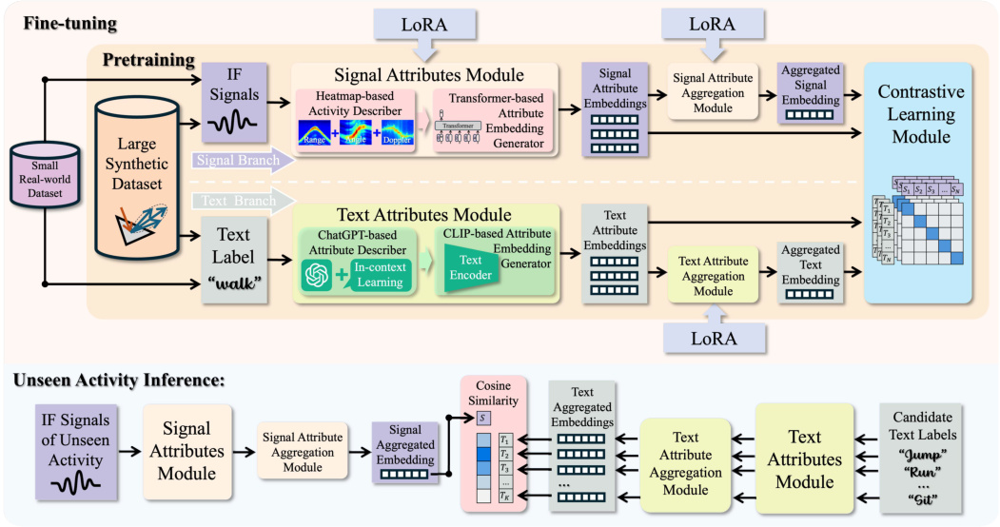
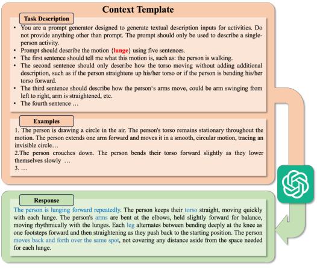
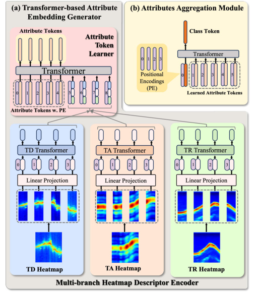
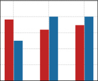
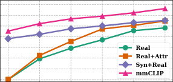
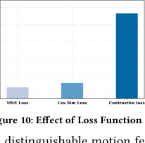

# mmCLIP：让一种"看不见人脸的雷达"也能认出新动作

> 这是机器辅助生成的客观摘要笔记。专为编程零基础读者重写。

## 一句话讲什么（TL;DR）

教一种"看不见脸"的小盒子雷达，**没学过的新动作也能猜个八九不离十**——比如老人半夜在黑卧室摔倒，它能感知到。

*所以这一节是想说：这论文教雷达"举一反三"。*

---

## 这是个什么场景

想象你**家里有位独居的爷爷**，你在外地上班。

- 半夜他爬起来上厕所，万一摔了——你想第一时间收到提醒
- 卧室和卫生间能装摄像头吗？不能——谁愿意自己睡觉、洗澡时被拍？
- 灯也是关着的，普通摄像头黑灯瞎火也看不清

有一种小东西能解决这事——**毫米波雷达**：

> **毫米波雷达（mmWave radar）**：一种插电的小盒子，朝外发射很短的电波，电波碰到人身上反弹回来，它就能算出"那边有人在动、动得快不快"。汽车前保险杠里就装了一个，便宜的几十块、贵的几百块。

它三个好处刚好对上面三个痛点：

- **看不见脸**：只感知到"那块有东西在动"，不会拍到长相，洗澡也能用
- **不怕黑**：电波不靠光，半夜跟白天一样
- **穿衣服没事**：电波能穿过薄被子、薄衣服

但有个**很麻烦的问题**——

- 你想让它认出 100 种动作（喝水、跌倒、翻身、扶墙站起来……），就得**真录 100 种动作的雷达数据**喂给它学
- 录数据特别累：这篇论文为了凑 6 小时真数据，找 8 个人配合录了好几天
- 而且一旦遇到没录过的新动作（比如"老人扶腰慢慢站起来"），它就完全抓瞎，跟没学过一样

*所以这一节是想说：雷达很适合夜里护理，但收数据太累，遇到新动作就废。*

---

## 之前的人怎么做的，为什么不够好

简单总结，过去有两条路，每条都卡住了：

- **第一条：用电脑模拟雷达数据**（"造假数据"派）
  - 类比：给学生出模拟题代替真题
  - 问题：必须**事先知道**要考什么动作，遇到没准备过的题还是抓瞎

- **第二条：把动作的名字（比如"喝水"）转成一串数字代号**（"语义投影"派）
  - 类比：每个动作发一张身份证，号码完全无关
  - 问题："喝水"和"拿东西"，**手臂动作几乎一样**，但身份证号码却完全不同——模型没法看出它们其实很像

- **共同的痛点**：每个研究组只能搞个小数据集，模型只认见过的那几类
- 换一组动作就**全废**

mmCLIP 想做的事：

- 让模型能识别**从来没训练过**的新动作
- 而且连"这个新动作的名字"都不用提前告诉它

> **零样本（zero-shot）**：模型从来没见过这个类别的训练数据，但你考它新类别它也能答对。类比一个会汉语的人第一次见到"日语汉字"也能猜出意思。

*所以这一节是想说：旧方法要么离不开"提前见过"，要么把动作之间的相似性丢光了。*

---

## 这篇论文的新想法

**核心点子**——像玩乐高：与其把每个动作背成一整个完整模型，不如**拆成 5 块小积木**（躯干怎么动、手臂怎么动、腿怎么动、位置怎么变、整体什么样），让模型学"积木块"，遇到没见过的新动作也能用旧积木拼出来。

举个超日常的例子：

- 旧方法看"喝水"和"拿东西"——当成两件毫不相关的事，分别死记
- mmCLIP 看这两件事——都拆成 **"手臂在抬 + 躯干没动 + 腿没动 + 站在原地"**——一拆开就发现，手臂那块**几乎一样**
- 那等模型遇到一个新动作"举手敬礼"，虽然没学过，但"手臂在抬 + 躯干没动 + 腿没动"这几块它都见过——拼一下就能猜对

*所以这一节是想说：与其死记一整个动作，不如把动作拆成零件，新动作靠零件拼。*

---

## 它分几步做的（方法）

先看这张总图，后面每个零件都对应图里一块：

骨架就 4 件事：

1. **造假数据**：用 3D 人体动画"虚拟拍摄"出雷达信号，扩大训练集
2. **拆动作**：让 ChatGPT 把每个动作名拆成 5 段细描述
3. **学对应**：让模型学会"雷达信号的 5 个方面"和"文字的 5 段描述"互相对得上
4. **少量真实数据微调**：最后用少量真实采集的数据修正一下

下面逐个拆开。

---

### 1. 用 3D 动画"虚拟拍摄"雷达数据

**类比**：

- 你想训练一个"识别猫"的 AI，但拍真猫太累
- 干脆用 3D 动画引擎渲染出几千只虚拟猫的图片当训练材料
- mmCLIP 干的是同样的事，只不过它"渲染"出来的不是图片，是雷达信号

**它在干什么**：

- 拿一个公开的"3D 人体动作数据库"（里面有几百个真人做各种动作的 3D 模型）
- 用一个**物理模拟器**（按物理公式计算电波怎么撞人怎么反弹）
- 把每一帧 3D 模型"虚拟拍成"对应的雷达信号
- 最后得到 **30 小时**的"假雷达数据 + 文字标签"配对

**关键术语解释**：

> **物理模拟器（physics simulator）**：一段按物理公式计算"电波怎么撞物体反弹"的程序。类比初中物理算"光从空气进水里折射多少度"，只不过这里算的是电波。

> **数据集（dataset）**：一大堆已经收集好、整理好的素材。类比你买的练习册题库。

**为什么这步有用**：

- 真实雷达数据采集要找 8 个人录好几天，6 小时就累趴
- 但 3D 人体动作的公开数据库已经有 50+ 小时
- 借力打力，凭空多出 5 倍训练数据

**消融告诉我们什么**（消融 = 去掉某一块看效果有多差）：

- 用真实姿势数据走模拟器再训练，准确率达到 89.7%
- 证明模拟器没瞎编，确实抓住了真实物理

*所以这一节是想说：与其死磕真实数据，不如用 3D 动画渲染雷达信号补足训练量。*

---

### 2. 让 ChatGPT 把动作名拆成 5 段细描述

**类比**：

- 老板交给你一个任务"做月报"
- 你先让秘书把它拆成"标题 / 数据 / 配图 / 总结 / 下月计划"5 块
- 这样每块能分头处理，比死记"做月报"3 个字有用得多

**它在干什么**：

- 把每个动作名（比如 "lunge" 弓步）丢给 GPT-4
- 要求它从 5 个角度描述：综合 / 躯干怎么动 / 手臂怎么动 / 腿怎么动 / 位置变化
- 不修改 ChatGPT 任何参数，纯靠**给它几个例子让它照样套**

**关键术语解释**：

> **GPT-4 / ChatGPT**：一种能理解和生成文字的 AI，你能跟它对话的那种。这里只用来"展开描述"。

> **上下文学习（in-context learning）**：在跟 ChatGPT 对话时给它几个例子，它就能照样输出新答案。类比考试前老师举两个例题你照着做。

**为什么这步有用**：

- 之前直接把动作名当 ID 编号——"喝水"和"拿东西"看起来毫无关系
- 拆到 5 个属性后，两者在"手臂"那段描述里很像
- 模型就能学到"动作之间共享的零件"

**消融告诉我们什么**：

- 把"5 段描述"减成"1 段"，准确率明显下降
- 5 段比 1 段好，但论文没试过 6/8/10 段会不会更好

*所以这一节是想说：让 ChatGPT 当秘书，把动作拆成 5 个细则，比一整个名字有用得多。*

---

### 3. 把雷达信号变成"三张热图"

**类比**：

- 医生看 CT 片，不会只看一张
- 一般会**横切、纵切、斜切**都看，每张片揭示不同信息
- mmCLIP 对雷达信号也做了类似的事

**它在干什么**：

雷达原始信号是一堆很难看懂的波形。论文把它**变换成三张热图**：

- **时间-速度图**：横轴时间、纵轴速度——看谁动得快、谁不动
- **时间-距离图**：横轴时间、纵轴远近——看人在远处还是近处、有没有走动
- **时间-方向图**：横轴时间、纵轴方向——看是顺时针动还是逆时针动

**关键术语解释**：

> **热图（heatmap）**：一张用颜色深浅表示数字大小的图。类比天气预报里中国地图上的温度色块——红的地方热，蓝的地方冷。

> **多普勒（Doppler）效应**：物体朝你来时电波频率变高，远离你时变低。类比救护车开过时鸣笛声"先尖后闷"。雷达靠这个判断速度。

**为什么这步有用**：

- 单看一张图模糊（速度图分不出顺逆时针，距离图分不出原地动作）
- 三张合一才能覆盖速度 + 距离 + 方向

**消融告诉我们什么**：

- 单独用一张图准确率明显下降
- 三张里"速度图"单独用最好，但还是远不如三张合用

*所以这一节是想说：把一团乱波变成"三张医生爱看的片"，让模型能从不同角度理解动作。*

---

### 4. 让模型从三张热图里"提取出 5 个属性"

**类比**：

- 派 3 个专科医生各看一张片，每人写报告
- 然后开会诊，让 5 个总结小组各自总结一份"躯干报告 / 手臂报告 / 腿报告 / ..."

**它在干什么**：

- 三张热图分别交给 3 个**特征提取器**处理
- 然后把 3 份处理结果合并
- 最后让 5 个"小组"各自从合并结果里"挑出"对应属性的特征
- 输出 5 个**向量**（一串数字）：分别代表躯干、手臂、腿等怎么动

**关键术语解释**：

> **向量（vector）**：高中学过——一串有顺序的数字，可以画成箭头。两个向量"夹角越小"表示越相似。这里每个属性的特征就是一串几百个数字组成的向量。

> **神经网络（neural network）**：一种由很多简单"乘加"操作堆起来的程序。类比一个有很多档位的过滤器，调好档位就能从一堆信号里挑出有用的部分。

> **特征提取器（feature extractor）**：一段神经网络，专门负责"从一团数据里抓出关键特征"。类比化学课上的过滤器，把溶液过滤出沉淀。

**为什么这步有用**：

- 每张热图先各看各的，保留独立特征
- 再融合，让 5 个属性"小组"分别提取自己关心的部分
- 这样后面才能跟"5 段文字描述"一一对上

*所以这一节是想说：让模型从三张片里挖出 5 个不同方面的特征向量。*

---

### 5. 文字端也走一遍同样的流程

**它在干什么**：

- 用一个叫 **CLIP** 的现成模型把 5 段文字描述各自变成一个向量
- 这部分**完全不训练**，直接用别人训好的

**关键术语解释**：

> **CLIP**：OpenAI 训练好的一个 AI，能把图片和文字翻译成"同一种向量语言"。类比一个会双语的速记员，把图片和句子映到同一个空间，"狗的照片"和"a dog"距离很近。

> **冻住（freeze）参数**：直接用别人训好的模型，自己不动里面任何东西。类比借朋友的现成笔记直接抄。

**为什么这步有用**：

- CLIP 已经在 4 亿张图文对上训练过，"语义"理解很稳
- 从零训一个新的会浪费数据、还容易出错
- 直接拿来用 = 免费的"通用语义底座"

*所以这一节是想说：文字端不用重新训练，借 CLIP 这个现成的"会双语的速记员"就行。*

---

### 6. 让两边的 5 个向量"对得上"——对比学习

**类比**：

- 相亲：把性格相似的两人**拉一起**，不合的**推开**
- 模型学的就是这件事——同一个动作的"雷达向量"和"文字向量"要靠近，不同动作的要远离

**它在干什么**：

- 一批数据里有很多组"雷达 + 文字"配对
- 让**同一个动作**的雷达向量和文字向量**夹角越小越好**（夹角小 = 相似）
- 让**不同动作**的雷达向量和文字向量**夹角越大越好**（夹角大 = 不像）

**关键术语解释**：

> **对比学习（contrastive learning）**：训练时同时给模型看"正确配对"和"错误配对"，让它学会拉近正确、推远错误。类比相亲——见过对的人才知道什么不对。

> **扣分（loss / 损失函数）**：模型每次猜错就给自己扣点分。所有错加起来 = 总扣分。模型学习的目标就是想办法让总扣分越来越低。类比考试错题扣分总和，越少越好。

> **批（batch）**：一次训练时同时处理的一小堆数据。类比每次背英语词卡 50 张一组，而不是 1 张 1 张来。

**为什么这步有用**：

- 只拉近同类不够（容易让所有向量挤成一团）
- 只推远不同类也不够（不知道什么算靠近）
- **两者结合**：空间被拉得既能区分类别又能保留细节

*所以这一节是想说：用"相亲规则"训练模型，相同动作的雷达和文字要靠拢，不同的要分开。*

---

### 7. 先大量假数据"打底"，再少量真数据"精修"

**类比**：

- 考研先用全国黄皮书打基础
- 临考前用本校历年真题精修一下

**它在干什么**：

- **第一阶段**：用 30 小时的合成假数据，**全部参数一起训练**
- **第二阶段**：用 6 小时真实数据，但**冻住所有原参数**，只在旁边贴一对小矩阵学差异

**关键术语解释**：

> **矩阵（matrix）**：一张数字表格，有行有列。两张表格相乘时行数列数要对得上。模型里的"参数"几乎都是这样的表格。

> **LoRA（低秩适配，Low-Rank Adaptation）**：原参数表格不动，旁边贴一对**小很多**的表格学差异。类比原书不动，旁边贴一沓便利贴。这个技术可以做到只训练 0.25% 的参数，但效果很好。

> **灾难性遗忘（catastrophic forgetting）**：用新数据微调时，把之前学的通用知识全忘了。类比为了应付期末考刷题，把基础知识全忘光。

**为什么这步有用**：

- 假数据多但和真实有差距，所以最后必须用真实数据修正
- 但**全模型微调**会"忘掉"假数据学的通用特征
- LoRA 既保留通用性又适配真实分布

**消融告诉我们什么**：

- 假数据 + 真实数据从头一起训：被假数据淹没，效果差
- 全参数微调：忘得快，效果次之
- LoRA：参数最少 + 准确率最高

*所以这一节是想说：先用大量假数据打底，再用 LoRA 这种"贴便利贴"的方法精修，最省事最有效。*

---

## 关键数字（What works）

每个数字按"设置 → 数字 → 对比 → 现实意义"四行说明。

**76.4% — 主结果：10 类零样本平均准确率**

- *设置*：从 60 个动作里挑 3 组各 10 类"模型从没见过"的，剩下 50 类用来训练
- *数字*：mmCLIP 76.4%，对手方法只有约 38%
- *对比*：随机瞎猜是 10%（10 选 1）；从勉强 D 跳到 A-
- *现实意义*：开盒即用部署时，能稳到 3/4 概率猜对一个新动作

**68%+ — 难度上调：16 类新动作仍稳**

- *设置*：把"模型没见过的类别"从 4 类涨到 16 类
- *数字*：mmCLIP 在 16 类时还有 68% 以上；对手在 16 类时全部跌破 50%
- *对比*：随机猜在 16 类是 6.25%
- *现实意义*：实际部署的动作集往往不止 10 类，越多类越能看出 mmCLIP 的优势

**89.7% — 模拟器质量验证**

- *设置*：用真实采集的姿势走自己的物理模拟器生成假雷达数据，再训练，再在真雷达上测
- *数字*：89.7%
- *对比*：直接用公开 3D 数据训出来的版本约 76%
- *现实意义*：证明模拟器抓住了核心物理特征——只要你的姿势数据真，就能凭空扩出几乎以假乱真的雷达数据

**0.25% — LoRA 微调极致省参数**

- *设置*：和全模型重训、半量混训对比
- *数字*：LoRA 只动 50 万 / 2000 万 = 0.25% 的参数，准确率最高（76.4%）
- *对比*：全参数微调精度差 5 个点，从头混训差 10 个点
- *现实意义*：以后部署到新房间/新人群只要存 50 万大小的"补丁包"就够，原模型不动

**约 7 毫秒 — 单次推理延迟**

- *设置*：单帧雷达数据的处理时间
- *数字*：约 7 毫秒（千分之七秒）
- *对比*：雷达常用 10 帧/秒，单帧预算是 100 毫秒；7 毫秒还能多塞 13 帧
- *现实意义*：边缘部署完全够用，不卡

**76.4% → 72.4% / 75.3% — 跨房间泛化**

- *设置*：会议室 A 训练，去会议室 B、休息区 C 测
- *数字*：A 房间 76.4%、B 房间 72.4%、C 房间 75.3%
- *对比*：典型雷达模型换房间能掉 20+ 个点
- *现实意义*：搬家后不用重新采数据

*所以这一节是想说：核心数字 76.4%，比对手好近一倍；推理快、能换房间、几乎不掉点。*

---

## 你应该懂的几个新词

> **HAR（Human Activity Recognition，人体动作识别）**：让机器看出你在做什么动作。类比手机记录步数，但要分得更细。

> **mmWave（毫米波）**：一种短波长电波。汽车毫米波雷达就在用，能感知到几毫米的胸腔起伏。

> **零样本（zero-shot）**：训练时模型从来没见过这类动作。考试遇到全新题型也能答对。

> **少样本（few-shot）**：给模型看 1~7 个新动作的例子，让它学着认。类比刚学日语只见过 3 个例句也能开始用。

> **CLIP**：OpenAI 训练好的图文对应模型。类比一个会双语的速记员，能把图片和文字翻译到同一种"向量语言"。

> **向量（vector）**：高中学过——一串有方向的数字。两个向量夹角越小越像。

> **矩阵（matrix）**：一张数字表格。模型里的参数几乎都是这种表格。

> **对比学习（contrastive learning）**：让相似的拉近、不像的推远的训练方式。类比相亲。

> **LoRA（低秩适配）**：不动原模型，旁边贴一对小表格学差异。类比原书不动，旁边贴便利贴。

> **扣分（loss）**：模型猜错的总分数。模型学习的目标就是降低这个分数。

> **属性分解（attribute decomposition）**：把一整个动作拆成 5 个方面（躯干 / 手臂 / 腿 / ...）分别处理。

> **模拟器（simulator）**：按物理公式假装生成数据的程序。类比初中物理算光路。

> **参数（parameter）**：模型里那些可调的"档位旋钮"。训练就是在调这些旋钮。

*所以这一节是想说：这 12 个词都首次出现就解释了，记住它们就能读懂大半射频感知论文。*

---

## 它有什么搞不定的

实际部署时你会遇到的问题：

- **必须正面对着雷达**
  - 论文里所有数据都是受试者**面对**雷达录的
  - 但客厅装在沙发对面的雷达，老人会侧身吃饭、背对去厨房
  - 这种姿势模型可能完全识别不出来

- **合成数据来源单一**
  - 模拟用的是健身房 / 日常动作的 3D 库
  - 老人摔倒、轮椅推行、拐杖步态这类**边缘情况**很可能没覆盖
  - 真要部署到老年人场景，要重新补数据

- **属性数固定为 5**
  - 换到手语识别（手指细节关键）或厨房动作（手腕角度关键）
  - 5 个方面可能不够细
  - 怎么设计新属性论文没给方法

- **零样本但不"零标签"**
  - "零样本"指训练时没见过这个**信号**
  - 但推理时还是要给一个**候选标签列表**让模型挑
  - 如果某个动作完全不在候选列表里，模型会强行猜成"最像的某个"，错得没声没息

- **多人场景没测**
  - 论文假设"单人在指定区域"
  - 多人同时活动、家具遮挡的场景没实验

*所以这一节是想说：实验里很好看，但有 5 个真实部署的坑没填。*

---

## 它和别的几篇是什么关系

用集合关系讲清：

- **CLIP（图 + 文）⊃ mmCLIP（雷达 + 文）**
  - mmCLIP 是 CLIP 思想从图文领域复制到射频领域
  - 共享同一个文字编码器
  - 区别在感知端是相机 vs 雷达

- **几何派（NLOS-mmWave、RF-SLAM）≠ mmCLIP**
  - 同样用毫米波，但目标完全不同
  - 几何派搞"穿墙重建"、"位置定位"
  - mmCLIP 搞"这是什么动作"
  - 实际系统可以**先用几何派定位人在哪 → 再用 mmCLIP 识别在做什么**

- **VLA（机器人）+ mmCLIP（隐私感知）**
  - SayCan、OpenVLA 这类"语言 + 视觉 + 动作"机器人系统需要"用户在做什么"作为输入
  - 卧室、卫生间这种相机不能装的场景
  - mmCLIP 输出文字描述刚好接 LLM 输入

- **Tent / RF-Net = 直接对手**
  - RF-Net 是少样本路线（每类 1~7 个例子）
  - Tent 是零样本但只用单点表示
  - mmCLIP 在零样本上比 Tent 高近 40 个点

*所以这一节是想说：mmCLIP 站在 CLIP 肩膀上，向射频领域复刻，然后能跟机器人系统对接。*

---

## 我建议这样读这篇

针对零基础读者的 5 步读图路线：

1. **先读摘要 + 引言（约 2 页）**
   - 搞清楚"零样本毫米波动作识别"这件事在生活里像什么

2. **跳到第 1 张架构图盯着看 5 分钟**
   - 把"两条分支、各自 5 个属性、最后对比学习"这个骨架记牢
   - 后面所有公式都是在解释这张图的某个零件

3. **读"系统总览"章节 + 属性拆解 + 三张热图**
   - 理解了"为什么要拆 5 个属性"和"三张热图分别看什么"，剩下 70% 的实验都能看懂

4. **跳过所有公式，直接看主实验 + 属性消融 + LoRA 消融**
   - 公式细节是 AI 圈标准操作，硬啃会卡死
   - 先看实验结论建立"哪些设计真有用"的直觉

5. **最后扫一眼讨论章节 + 跨场景实验**
   - 给出局限，让你判断这篇能不能直接用在你的项目

如果时间紧：1+2+5；中等：1-3+5；完整复现：再读所有公式。

*所以这一节是想说：先看动机和图，跳过公式看实验，最后看局限——比从头读省一半时间。*

---

## 一些好奇心问答（FAQ）

**Q: 这模型多大？我自己能跑吗？**
- 全模型 2000 万参数（相比一些大模型的几十亿，算非常小）
- 微调阶段只训 50 万参数
- 训练用 NVIDIA A100 GPU（一种专业显卡，云上租 1 小时几十块）
- 推理在游戏玩家用的 RTX 系列就够，单帧 7 毫秒

**Q: 数据从哪来？**
- 假数据：3 个公开 3D 人体动作数据库 + 物理模拟器，凑出 30 小时
- 真数据：作者自己采的 6 小时（8 个人，60 个动作）
- 真数据论文没明确开源，想复现要自己买雷达硬件（500-1000 美元）

**Q: 代码开源了吗？**
- 论文没给 GitHub 链接
- 想复现要自己实现模拟器和模型架构

**Q: 为什么不用更简单的方法（比如直接给摄像头）？**
- 摄像头侵犯隐私，卧室卫生间不能装
- 雷达看不见脸，黑天也能用
- 但雷达数据少、贵、难——这就是 mmCLIP 要解决的痛点

**Q: 训练一次要多久？**
- 论文没明说
- 估算：单 A100 卡 1-3 天

**Q: 换雷达硬件能行吗？**
- 模拟器里的雷达参数（电波频率等）必须和实采对齐
- 换同系列雷达迁移成本低，换厂家就要重新校准

**Q: 不用 CLIP 行不行？**
- 理论上可以
- 但 CLIP 见过 4 亿图文对，语义空间很稳定
- 换成纯文字模型可能丢失这种"跨模态先验"

*所以这一节是想说：模型不大、能跑、但数据和代码得自己想办法。*

---

## 如果你想再深入

按"打基础 → 看对手 → 学微调"的顺序：

1. **CLIP 原文**（Radford 等，2021）
   - mmCLIP 整套思路的根
   - 必读前传

2. **RF Genesis**（Chen 和 Zhang，2023）
   - 同实验室前作，提出了 mmCLIP 用的物理模拟器
   - 想自己实现模拟器要先读这篇

3. **Tent**（Ouyang 等，2024）
   - mmCLIP 的直接对手
   - 读完才能完全理解 mmCLIP 的"属性分解"为何有用

4. **RF-Net**（Ding 等，2020）
   - 经典少样本射频识别
   - 理解零样本和少样本路线分歧的入口

5. **LoRA 原文**（Hu 等，2021）
   - 想复现微调阶段必读
   - 理解为什么"贴便利贴"比"重写整本书"好

*所以这一节是想说：想再深入，先 CLIP 打底，再读对手 Tent，最后看 LoRA 学微调。*
