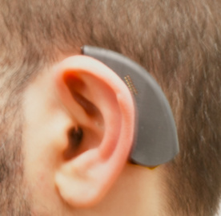
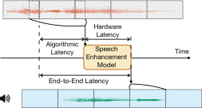
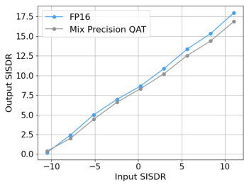

# NeuralAids: Wireless Hearables With Programmable Speech AI Accelerators

> 这是机器辅助生成的客观摘要笔记。教学版精读笔记由用户按节奏触发后单独成稿。

## 一句话讲什么（TL;DR）

把语音降噪深度学习模型，整个塞进一只助听器大小的无线耳机里实时跑，不用连手机。

## 这篇论文要解决什么问题（Why this paper）

想象一个画面：你 70 岁的爷爷戴着助听器去咖啡馆，旁边桌的人聊天声、咖啡机蒸汽声、背景音乐叠在一起，他听对面孙子说话只能靠猜。市面上"AI 助听器"的方案是什么？要么把麦克风的声音偷偷传到手机上算（一旦 Wi-Fi 抖、地铁信号断，回声就乱），要么在助听器里跑一个超级简化的小模型，结果是噪音确实小了，但你孙子的声音也变得像水里说话。

这篇论文要解决的就是这个尴尬：**能不能让助听器自己就把这件事做好，不依赖任何外部设备？**

具体的工程约束（被业界普遍认为"做不到"）：

- 助听器、耳塞这种小玩意，电池只有几百毫安时（mAh，电量单位，相当于汽油箱大小），芯片塞不下大模型，但用户希望它能"AI 降噪"。
- 之前的两种妥协：(a) 把音频偷偷传到手机/电脑上算 → 联网延迟高、网络一抖就卡，超过 10 ms 用户就会觉得"自己说话像在山洞里有回声"；(b) 用一个超简化的小模型 TinyDenoiser → 音质差、算法延迟还有 25 ms。
- 三个硬指标必须同时达成：每帧"低于 6 ms 算完"、模型小于 1.5 MB、功耗低于 100 mW（这样 675 号助听器电池能撑 6 小时以上）；并且音质要接近云端大模型——这三件事过去一直被认为在小硬件上做不到。

这篇论文要回答：到底能不能完全在助听器本体上跑现代深度学习语音降噪模型？

## 用了什么方法（How）

整篇论文做的事可以拆成三块：硬件平台、神经网络、量化协同。下面按这个顺序拆解，每一步先类比再揭示术语。

### 1. 五块 PCB 堆叠的硬件平台

类比：**乐高五层蛋糕**。一块板管充电（PWR）、一块板管蓝牙（BT）、一块板管 AI 计算（AI）、一块板管周边存储（PERIPH）、一块板管麦克风（MIC），五片印刷电路板（PCB，Printed Circuit Board，就是电路通过铜线印在板子上的硬件载体）叠在一起塞进耳后助听器壳里。

最关键的那块叫 AI 板，里面装的是一颗叫 **GAP9** 的芯片（GreenWaves Application Processor 9）。GAP9 是给"低功耗 AI 计算"专门优化的芯片，可以理解成"耳机里的小型显卡"——但它跟手机里的 GPU 完全不是一种东西，它只擅长做整数乘加（INT8 quantized multiply-accumulate，下面讲量化时会再提）。

### 2. Dual-path 时频域神经网络（基于 TF-GridNet 改）

读到这里你可能在想：硬件搭好了，那塞什么模型进去？这是论文的第二大块。

类比：**分开听节奏和音色**。当你在嘈杂酒吧听音乐时，你的耳朵其实同时在做两件事——一件是跟踪"鼓点何时出现"（**时间维度**），另一件是辨认"这是低音吉他还是钢琴"（**频率维度**）。dual-path（双路径）网络就是把这两件事用两条神经网络通路分开处理。

具体怎么做：

1. 先用 **STFT**（Short-Time Fourier Transform，短时傅里叶变换，把音频按小窗口逐个分解成频率成分）把 6 ms 的音频块切成时间-频率小方格。
2. 一条路径专门看"频率维度"上各个频点之间的关系（比如低频降噪不能动太大、高频降噪要小心齿音），叫 **spectral path**（光谱路径）。
3. 另一条路径专门看"时间维度"上前后 chunk 之间的连贯（说话人停顿、连读），叫 **temporal path**（时间路径）。
4. 这是当前语音增强（speech enhancement）的 SOTA（State-Of-The-Art，最佳水平）范式，论文起点是 **TF-GridNet**（一篇 2023 ICASSP 论文，把 dual-path 范式用到时频域的代表作）。

读到这你可能想：那 TF-GridNet 直接搬过来不就行了吗？答案是不能，因为它对硬件太贪了。所以论文做了三个魔改：

#### 魔改 a：频率压缩 + GRU 替代 LSTM

类比：**先把谱图横向压扁再处理**。原始 TF-GridNet 的 spectral path 用的是双向 LSTM（Long Short-Term Memory，长短期记忆网络，一种能记住远距离上下文的 RNN）顺序处理几百个频点——这就像让一个人逐个数完整本书所有的字才能告诉你这本书写啥，慢得离谱。

作者的做法：先用 **strided convolution**（步长卷积，一种把序列长度横向压缩的卷积）把频率维度"压扁"四倍，再用更轻的 **GRU**（Gated Recurrent Unit，门控循环单元，比 LSTM 少一个门，速度快一截但效果差不多）替代 LSTM——速度提上来还不掉点。

#### 魔改 b：Dual-window 重叠加（overlap-add）

类比：**两个不同尺寸的窗户错开开关**。标准的 overlap-add（音频重建时把相邻 chunk 加权拼接的标准操作）因为需要"等下一帧的回看部分"才能拼出当前帧，会引入额外算法延迟。

作者用一对**不对称的窗函数**——分析时用一个大窗（看得多）、合成时用一个小窗（不依赖未来）——把这个延迟省掉。最终算法延迟从 25 ms（TinyDenoiser）降到 10 ms。

#### 魔改 c：Cache state 复用

类比：**做菜留底汤**。streaming 推理每来一个 chunk 都要算一遍卷积、LSTM 状态、ISTFT，但其实很多中间结果跨 chunk 是可以复用的。作者维护四个缓存：STFT 帧缓存、dual-path 模块输出缓存、ISTFT 中间帧缓存、temporal LSTM 隐状态。这避免了重复计算。

读到这你可能想：神经网络改完就能跑了吗？答案还是不能，因为模型还是 float32（32 位浮点数，单个数 4 字节），太大太慢。所以论文还有第三块。

### 3. 混合精度量化 + QAT（量化感知训练）

类比：**训练时就让模型预演被压缩成整数后的损失**。

什么是量化？想象你原本用毫米精度量身高（179.834 mm），现在被迫只能用厘米精度（180 cm）——你丢了精度，但记录占的位数从 32 位降到 8 位，算起来快、占空间小。神经网络量化就是把权重和激活从 float32（32 位浮点）压成 int8（8 位整数），内存少 4 倍、整数乘法在低功耗芯片上比浮点快 5-10 倍。

但有个大问题：**直接压会崩**。论文实测，把整个网络全压成 int8（**PTQ**，Post-Training Quantization，训练后量化），SISDRi（衡量降噪质量的指标，下面术语章节有解释）从 8.65 dB 直接掉到 -1.70 dB——也就是说降完比不降还差，模型坏了。

作者的两步解法：

1. **Mixed-Precision（混合精度）**：第一层卷积和最后一层反卷积保持 bfloat16（16 位浮点，比 int8 精度高、比 fp32 省一半），其它层用 int8。逻辑是：第一层处理原始输入、最后一层产生原始输出，这两个位置最敏感，一旦丢精度全网崩。
2. **QAT**（Quantization-Aware Training，量化感知训练）：训练时就在 forward 里插入"假装量化"的算子（用 STE，Straight-Through Estimator，直通估计器，用 1 来近似量化算子的导数让梯度能传），让模型在训练阶段就"提前体验"被压成整数后的误差，并学着补偿。最终 mixed-precision + QAT 把性能从 0.90 dB 拉回到 8.19 dB——只比原始 fp32（8.65 dB）低 0.57 dB。

## 关键实验结果（What works）

每个数字后面我加一句"为什么这了不起"：

- **5.54 ms 推理 / 6 ms 音频块** —— 真正的 streaming 实时，比帧长还短。意味着每收到 6 ms 新音频，模型在 5.54 ms 内就处理完了，**留 0.46 ms 缓冲不会"赶不上"**；用户听到的回声延迟在感知阈值之下。
- **71.64 mW 功耗 + 299 kB 模型** —— 比之前 TinyDenoiser（1.2 MB）还小四倍。300 mAh × 3.85V = 1.155 Wh 的小电池，按 71.6 mW 持续跑可以撑 16 小时，去掉其它部件后**实测目标 6 小时以上无压力**。
- **SISDRi 8.19 dB**（量化后），TinyDenoiser 同条件 5.97 dB —— 提升 ~2.2 dB。这意味着同样的"信噪比改善"，本作比之前 SOTA on-device 模型多挤出了 2 dB；在主观感知上接近"从中等清晰度提到高清晰度"。
- **用户研究 28 人**：噪声抑制 MOS（主观评分）从 No AI 的 2.15 提升到 3.57；整体 MOS 从 2.96 提升到 3.38。**注意 TinyDenoiser 的整体 MOS 反而从 2.96 掉到 1.96**——它降噪同时也把语音弄失真了，这是"为了减肥把肌肉一起减掉"的反例。本作能同时降噪 + 不损害可懂度，是关键卖点。
- **量化 vs 浮点的差距：从 7.86 dB 缩到 0.57 dB** —— 这个 14 倍的差距压缩，是 mixed-precision + QAT 的净贡献。说明这俩技术不是噱头，对深网络是 must-have。

## 我读完后该懂的几个术语

- **GAP9**（GreenWaves Application Processor 9）—— 一颗专门为低功耗 AI 设计的 RISC-V 多核加速器（9 个 RISC-V 核 + 一个 NE16 神经网络加速器单元）。类比"耳机里的小型显卡，但只擅长整数乘加"。出现在 §2.1 硬件平台的核心。
- **STFT**（Short-Time Fourier Transform，短时傅里叶变换）—— 把一段音频切成小窗口逐个做傅里叶变换得到时间-频率二维表示。类比"把电影按秒切帧再分别看"。本文每个 6 ms 的 chunk 都先过 STFT，然后才进神经网络。
- **TF-GridNet** —— 2023 年提出的 SOTA 双路径时频域语音增强网络，本文的起点。Dual-path 指"频率"和"时间"两条独立路径，由 LSTM 并行建模。
- **SISDRi**（Scale-Invariant Signal-to-Distortion Ratio improvement）—— 衡量降噪后干净语音相对失真的提升量，单位 dB。类比"把信号比噪声响多少"的度量。出现在所有 Table 2/3 中作为客观主指标。
- **MOS**（Mean Opinion Score）—— 主观评分均值，1~5 分。类比"豆瓣评分"。出现在用户研究 §3.2，分两种：noise suppression MOS（噪声抑制单维度）和 overall MOS（整体感受）。
- **PTQ**（Post-Training Quantization，训练后量化）—— 训练完再压。类比"做完菜再冷冻——口感会差"。出现在 §2.3.3，作为对照基线。
- **QAT**（Quantization-Aware Training，量化感知训练）—— 训练阶段就模拟整数量化的误差，让模型学会"抗压"。类比"考试前先用真考试卷子练，而不是练习卷"。本文核心技术，出现在 §2.3.4。
- **algorithmic latency vs hardware latency**（算法延迟 vs 硬件延迟）—— 算法延迟是"模型设计上你必须等多久才能输出当前帧"（窗口、lookahead 决定），硬件延迟是"芯片实际算这一帧花多久"。两者都要 < 10 ms。出现在 Fig. 3A 的延迟分解。

## 这篇论文的局限 / 我看出的疑点

- **功耗数字假设 AI 加速器始终在跑**：没考虑 voice activity detection（VAD，语音活动检测，没人说话时就让 AI 休眠）触发的 duty-cycle 模式。论文自己也提了，未来工作。**用户实际感受**：在安静的图书馆 / 睡前静音环境戴 6 小时，电池没必要烧成这样，电池续航本可以翻倍。
- **只在一颗加速器上验证**：其他低功耗 AI 芯片（MAX78000、Ethos-U55、Kendryte K230）没测，所以"在小硬件上能跑"这个结论的泛化性还没完全建立。**用户实际感受**：换一家厂商的助听器（不用 GAP9），这套方法能不能直接搬，未知。
- **训练数据全是合成噪声混合**：硬件上没采集任何训练数据。在某些极端真实场景（比如风噪、强混响、多人快速切换说话）下表现是否稳健，论文用 6 个室内外环境做了 in-the-wild 但样本规模只有 28 人。**用户实际感受**：在地铁里、强风海边、教堂大堂这些声学奇葩场景，表现可能会显著掉。
- **只用 1 个麦克风**：硬件有 3 麦阵列但模型只用了 1 个。意味着空间信息（声源在左在右）完全没用上，未来如果加上 beamforming，性能可能再上一个台阶。**用户实际感受**：现在它降噪是"听起来变干净"，但如果你想"只听对面那个人不听旁边那桌"（target speech extraction），目前模型还没做到。
- **没针对听损人群个性化**：用户研究的入选标准只是"成年人 + 能听懂英语指令"，没区分听损者。听损用户的需求其实和正常听力者很不同（可能需要按医学处方做频段补偿）。**用户实际感受**：这其实更像一个"健康人降噪耳塞"，而不是真正意义上的智能助听器。

## 与其他 12 篇的关联

- **听觉智能主题的硬件落地代表**：这是 13 篇 reading list 中**唯一一篇研究"边缘 AI 部署"的工程论文**。和 VLA / 视觉机器人主线没有方法上的直接共享，但属于"具身 AI 的边缘部署"分支——把感知模型塞进真实穿戴设备里跑。和那些跑在 A100 / RTX 4090 集群上的 VLA 模型形成了一个有意思的对比：当算力不是问题时关心 emergent capability，当算力极度受限时关心 quantization 和 hardware-software co-design。
- **同组前作的延续**：和 ClearBuds（CHI '22）、Semantic Hearing（UIST '23）、Target Speech Hearing（CHI '24）（同组 UW Allen School Gollakota lab 的工作）一脉相承，但**这是第一篇把推理完全搬到耳机本体、不依赖手机/外置算力的**。前几篇都是"用耳机收音 + 手机算"，本文证明了"全程耳机内"是可行的，相当于这个研究路径的硬件天花板被推到了一个新位置。
- **和 VLA 模型部署到机器人 MCU 的工作共通**：方法论上的"模型压缩 + 硬件协同设计"思路，和任何想把大模型部署到机器人本体（而不是云端）的工作都共通——比如 MobileVLA、把 OpenVLA 蒸馏到 Jetson Nano 的尝试。**它们共享的核心思路是：mixed-precision + QAT 是把网络塞进低功耗芯片的钥匙**，离开这把钥匙基本没戏。
- **和 LLaVA / VLM 这类"大模型路线"形成方法论对照**：LLaVA 之类追求"参数越多能力越强"，本文走的是反方向——证明一个 299 kB 的极小模型在窄任务（语音降噪）上也能逼近 SOTA，前提是设计精细 + 硬件协同。这两条路线是具身 AI 部署的两端，未来会在某个点收敛。

## 我建议的阅读顺序

零基础读者建议这样读，每步给一句为什么：

1. **先看 abstract 和 Fig. 2（戴在耳后的照片）** — 1 分钟知道这是什么东西、解决了什么实际问题。如果你是冲方法来的，这步可以让你判断要不要继续读。
2. **跳到 Table 3** — 这是全文的"成绩单"。看四列数字（SISDRi / Memory / Runtime / Power）在四种量化策略下怎么变化。能看懂"为啥 int8 PTQ 是 -1.70 dB"就抓住了核心 motivation。
3. **回头读 §2.2.2 神经网络架构** — 配合 Fig. 3C 看 dual-path 是怎么从 TF-GridNet 改过来的。**频率压缩 + GRU 替代 LSTM** 这两个改动是关键，记住即可。
4. **读 §2.3.4 QAT 部分** — 这是论文真正的方法贡献。看懂"为啥 mixed-precision 不够还要 QAT"就理解了 7.86 → 0.57 dB 这个改进的意义。
5. **跳读 §3.2 用户研究** — 看 Fig. 8 的两组柱状图就够了。重点是 TinyDenoiser 的 overall MOS 反而下降这个反例。
6. **跳过 §2.1 硬件细节**（除非你做嵌入式硬件）— 五块 PCB 怎么连、I2S 时钟怎么对齐这种工程细节，零基础读者读了也用不上，看看 Fig. 1 的全家福印象即可。

## 为什么值得读 / 不值得读

如果你只能读 1 篇：跳过这篇，读 LLaVA 或 RT-2，因为它们方法论的影响面更广。

如果你能读 3 篇：还是不读，3 篇的预算不够覆盖这种垂直方向。

**如果你能读 5 篇且对边缘部署有兴趣，这篇必读**。它是把"streaming neural net 装进 sub-100mW 设备"的开门级工程参考——QAT + mixed-precision 这套打法，未来你做任何"机器人本体跑大模型"的工作都会用到。

如果你只关心 VLA 大模型和高层规划，这篇偏远，扫一眼 abstract 和 Table 3 就够，主要是了解"业界把模型部署到边缘需要哪几把钥匙"。
