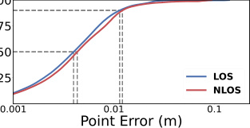

# mmNorm：隔着纸箱"看清"里面的东西

> 这是机器辅助生成的客观摘要笔记。基于完整论文 PDF 整理。面向读者重写。

## 一句话讲什么（TL;DR）

不直接问"东西在哪儿"，而是先猜"它的皮朝哪边翘"——雷达就能隔着纸箱看出里面是什么形状。

*所以这一节是想说：换一个提问方式，老硬件也能做到新效果。*

---

## 这是个什么场景

双十一你抢到一台电钻，快递盒还没拆。你掂了掂——想知道把手朝哪边、有没有磕碰、电池装没装。可是：

- 摄像头不行：盒子不透明，眼睛抓瞎。
- 拆开再封回去：胶带封不平，强迫症发作。
- 拉去医院做 X 光：贵、辐射、保安会拦你。

机器人在仓库里也会遇到一模一样的窘境：货架上几百个盒子，里面到底是螺丝刀还是扳手？姿态又是怎么躺的？人没法一个个拆。

有没有一种"便宜、安全、又能穿透薄壳"的办法？有——**毫米波雷达**。

> **毫米波雷达（mmWave Radar）**：发射一种波长只有几毫米的电磁波（频率 77 GHz 上下）。和蝙蝠靠超声波回声判断前方有没有墙是同一个套路，只是把声音换成了电磁波。它能轻松穿过纸板、布、薄塑料这些遮挡物。

这篇论文要做的事就一句话：**给机器人一台便宜的毫米波雷达，让它隔着包装看清盒子里那件东西长什么样**。

应用场景举例：

- 仓库机械臂：闭着眼伸手进盒子里抓螺丝刀。
- 扫地机器人：知道沙发底下是袜子还是充电线。
- AR 眼镜：让你"看穿"被布盖住的东西。
- 机场安检：比 X 光机便宜、又没辐射风险。

*所以这一节是想说：我们想要一种便宜、安全、能穿透薄遮挡物的"看见"工具。*

---

## 之前的人怎么做的，为什么不够好

之前这个领域的主流做法叫 **反向投影（backprojection）**。直觉上就是：

- 雷达对着场景扫一圈，每个位置都收到一些回波。
- 把回波"按光线方向倒推回去"，看每一小格空间累计收到了多少能量。
- 能量超过门槛的格子，就被当成"这里有物体"。

> **体素（voxel）**：3D 版的像素。可以想象成把空间用一堆小立方体（像乐高积木）填满，每块小立方体就是一个体素。

然后问题就来了：

- **分辨率太糊**：民用毫米波雷达的"看远近的精度"大概只有 4 cm。也就是说，一个真实只有 5 cm 厚的杯子，被它"看到"的厚度可能像 10 cm。
- **重建出的形状像一团云**：糊到机器人根本分不清"哪边是杯口、哪边是杯把"。
- **想提高精度只能换更宽的频段**：> 10 GHz 那种带宽的雷达，民用拿不到，是政府或军队专属。
- **不是硬件不够好，而是用法不对**：硬件已经摆在那，问题出在算法。

*所以这一节是想说：旧方法把"找东西"当成"找在哪些格子里有能量"——可惜这种问法在 4 cm 精度下注定糊成一团。*

---

## 这篇论文的新想法

类比：你在雾里画猫。硬猜"猫身上每一点在哪"，画出来是一团毛球；改成先猜"每根猫毛朝哪边竖"，把方向画对，猫的轮廓自己就浮出来了。

**不去问"哪里有东西"，而去问"东西的表面朝哪个方向"**。把"定位置"翻译成"估朝向"，剩下的几何问题就好办了。

*所以这一节是想说：换问题，比换硬件更有效。*

---

## 它分几步做的（方法）

整个流程分三大步，外加一步"复杂物体怎么处理"。先看一张总览图：

### 1. 让所有雷达位置"投票"，估出表面朝向

**类比**：上课老师问"答案是 A 还是 B"，每个同学举一只手投票。每个雷达位置就是一个同学，它投的是"这个表面朝我这个方向"。所有同学的票汇总起来，就能选出最可能的方向。

**它在干什么**：

- 机械臂拖着雷达走过一片 60 cm × 45 cm 的区域，沿途采了很多次回波。
- 对空间里的每一个小格子（体素），都问一句"这一点的表面朝哪？"
- 答案来自一个物理事实——**镜面反射**。

> **镜面反射（specular reflection）**：和浴室镜子一样。手电筒只有正对镜子时才会有强反光，斜着照基本不反。毫米波在大多数物体表面也有这个特点。

> **法向（surface normal）**：垂直于表面那根朝外的箭头。可以想象皮肤上每一个毛孔伸出的一根毛——这根毛指向哪，就是这一小块表面朝哪。

物理事实告诉我们：哪个雷达位置收到的回波最强，那一小块表面的"毛"就最可能指向那个雷达。

**关键术语解释**：

> **合成孔径雷达（Synthetic Aperture Radar，SAR）**：把一个小雷达拖着走一大片，等价于一个超大的天线。类比"用手机拍全景"——你边走边拍多张普通照片，软件帮你拼成一张超广角。

> **复数信号 / IQ 信号**：雷达收到的不是一个普通数字，而是一个"既有大小、又有方向"的箭头。可以把它画在一张二维平面上，用向量表示。

**怎么投票（高中向量版）**：

- 对每个体素 v，每个雷达位置 j：先画一根从 v 指向 j 的单位向量（高中里"单位向量"就是长度为 1 的箭头）。这是一根**候选方向**。
- 然后给这根候选方向**配一个票权**：这个雷达位置收到的回波有多"主流"？
- 最后把所有候选方向按票权加权求和，得到这一点的"最终朝向"。

**票权怎么算（用向量内积的语言）**：

- 把所有雷达位置的回波画成一堆向量，加起来得到一个"总向量" S。
- 单个雷达位置的回波向量 I_j 和总向量 S 算内积——内积大说明"它和大家方向一致"，票权就高。
- 高中学过：两个向量内积越大，说明它们越同向。这里就是这个意思。

读到这里你应该懂了：**这一步是把"信号"翻译成"每个体素朝哪"的一张 3D 朝向地图**。

*所以这一节是想说：信号最强的那个方向，就是表面"对着"的方向；多个雷达位置投票后，朝向地图就出来了。*

---

### 2. 从"朝向地图"反推"具体形状"

**类比**：等高线图只告诉你"地形在这里有多陡、坡朝哪"，并没有直接告诉你"这一点的海拔是多少"。同一片坡度，可能整体抬高 100 米也可能压低 100 米。

**它在干什么**：从一片"朝向地图"反推"表面究竟在哪条线上"。

**先解释两个新概念**：

> **有符号距离函数（SDF, Signed Distance Function）**：一个 3D 函数。空间中每一点的值 = 这一点到最近表面的距离。在物体外面取正、里面取负、表面上取 0。类比 GPS 给你"到最近海岸线还有多远"，正数代表你在陆地，负数代表你已经下海了。

> **等值面（isosurface）**：函数取相同值的那些点连成的面。例如把所有"SDF = 0"的点连起来，就是物体表面。类比 3D 版的等高线。

问题是——我们要解的就是"表面在哪"，但 SDF 又依赖"表面在哪"才能定义，是个先有鸡还是先有蛋的死循环。

**论文的巧解**：定义一个**相对版的 SDF（RSDF, Relative SDF）**：

- 选一个起点格子 v₀，规定它的 RSDF 值 = 0。
- 对其它每个格子 v，从 v₀ 走到 v 的路上，每走一步就问："我这一步的方向，跟这一点的法向夹角多大？"
- 用向量内积算每一步的"得分"，全部累加就得到 v 的 RSDF。
- 如果这一步是"顺着法向走"（夹角小、内积大），相对深度增加快；如果是"沿着表面走"（夹角接近 90°、内积接近 0），相对深度几乎不变。

最后得到的 RSDF 长得**几乎像真的 SDF**，只是整体差一个未知常数 C。也就是说真表面是 RSDF 的某一条等值面，只是不知道具体是 C 等于几那条。

读到这里你应该懂了：**这一步把"无数种可能的表面"压缩成了"一族平行的候选表面 + 一个未知常数 C"**。下一步只要挑出对的 C 就行。

**为什么这步有用**：把一个看起来无解的反演问题，浓缩成"在一族候选里挑一条"，问题维度从无穷掉到一维，太香了。

*所以这一节是想说：朝向地图不能直接告诉你形状，但可以告诉你"形状大约长这样、只差一个上下平移"，剩下就是确定上下挪多少。*

---

### 3. 用"假设 + 模拟 + 对答案"挑出真表面

**类比**：物理课做选择题，四个选项不知道哪个对，就把每个选项代回原题验算一下，哪个验算结果最贴合就选哪个。

**它在干什么**：

- 候选表面有很多条（C 取不同值时是不同的等值面）。
- 假设其中一条是真的，**用电磁学公式正向算"如果真表面就长这样、雷达就该收到什么样的回波"**。
- 把模拟出来的回波和实际收到的回波比一比。
- 哪条候选误差最小，就选哪条。

**关键术语解释**：

> **光线追踪（ray tracing）**：游戏里渲染光照常用的算法。从光源射出一束束光线，一根根追踪它们碰到物体后怎么反射。在这里我们用它模拟"雷达发出的电磁波碰到表面后怎么回来"。

> **频谱（spectrum）/ 傅里叶变换（FFT）**：傅里叶变换可以把一段随时间变化的信号拆成"它由哪些频率成分组成"。雷达里有个特点：信号频率和距离一一对应，所以**比频谱差就等价于比距离差**。

> **路径损耗（path loss）**：电磁波越远能量越弱，跟距离平方成反比。和声音越远越小听不清是一个道理。

> **代价函数 / 误差总和（loss）**：考试里的"扣分总和"。这里就是"模拟回波 vs 实际回波"差多少。值越小，说明这条候选表面越接近真相。算法的目标是把这个分降到最低。

**为什么这步有用**：第二步只能告诉你"表面是某一条等值面"，但具体哪一条还没定下来。这一步用物理模拟"对答案"，把最后那个 C 值定死。

读到这里你应该懂了：**这一步是用真实物理把候选表面挨个验算，挑误差最小那条做最终结果**。

*所以这一节是想说：方法没用神经网络，纯物理模拟"如果是这样会观察到什么"，然后跟实际观察对比。*

---

### 4. 复杂物体怎么办：先切块，再各算各的

**类比**：考试做大题，要先把一个复杂题分成几个子问题，分别解决再拼起来。

**它在干什么**：像马克杯（杯身 + 把手）这种有多个分离表面的物体，朝向地图在两块之间会出现"断点"。如果硬当一块整体来反推，会把好的部分也带歪。

处理三步走：

- 先把雷达图二值化（阈值之上是 1、之下是 0）。
- 找**连通分量**：地图里相邻 1 像素连成的一块块区域。

> **连通分量分析（connected component analysis）**：在一张二值图上找"哪些 1 像素是粘在一起的"。类比一张地图上把同一个国家的领土圈出来——同色相邻的就算一国。

- 每块单独跑前面的反演 + 优化，最后把各块的结果拼回来。

读到这里你应该懂了：**对于多块表面的物体，先分组再各自处理；这一步保证算法不会被复杂结构整体拖垮**。

*所以这一节是想说：复杂物体先切块再处理，避免一锅粥。*

---

## 关键数字（What works）

论文用 **YCB（Yale-CMU-Berkeley）日用物品集** 里的 61 件物品，每件做"看得见"和"被纸板盖住看不见"两组实验，共 116 次。

> **F-Score（F 分数）**：一个综合的"重建得分"，1.0 = 满分，越接近 1 越好。可以理解成"考试既要做对的多，也要别瞎写多"，两种错误一起惩罚。

**数字一：F-Score 96% vs 78% / 72%**

- mmNorm 拿到 **96%**。
- 旧方法（干涉法、反向投影）只有 **78% 和 72%**。
- **生活语言**：旧方法重建出来"勉强能看出是个杯子"；新方法重建出来"杯把和杯口的弧度都对得上"。

**数字二：85% 的点贴合到位（旧方法只有 44%）**

- mmNorm 重建出的点云里，**85% 的点位置误差小于物体本身尺寸的 5%**。
- 旧方法只有约 **44%**——也就是一半多的点是飘出去的。
- **生活语言**：机械臂去抓东西，绝大多数表面点都贴在真实物体上，抓取规划才有可能成功。

**数字三：朝向估计的余弦相似度中位数 0.99**

> **余弦相似度（cosine similarity）**：衡量两个向量方向有多接近的指标，1 = 完全同向、0 = 垂直、-1 = 反向。高中向量学过两个向量夹角的余弦——就是这个东西。

- mmNorm 朝向估得**特别准**，中位数 0.99。
- 旧方法只能到 0.54（反向投影）和 0.66（干涉法）。
- **生活语言**：表面那根"毛"指向几乎完美。

**数字四：被纸板盖住后基本不掉精度**

- 不挡住时点位中位误差 **0.39 cm**。
- 盖一层纸板后 **0.43 cm**。
- **生活语言**：很多"穿墙感知"研究在被遮挡情况下精度会掉一大截，这篇几乎没掉。

**数字五：消融实验告诉你"优化"那一步贡献了 3 倍精度**

- 不做第三步，只用第二步选中线：误差 1.6 cm。
- 完整方法：误差 **0.4 cm**。
- **生活语言**：第三步那个"对答案"过程是论文最后一根支柱，去掉就垮。

**数字六：硬件成本约 200 美元的雷达，做出了 4 GHz 带宽下的最优**

- 对比的高分辨率雷达需要 > 10 GHz 带宽（民用买不到）。
- mmNorm 用 200 美元的 TI 商用雷达，靠算法补硬件。
- **生活语言**：靠想法压过靠堆钱。

*所以这一节是想说：在民用便宜雷达上拿到了过去要军用级硬件才能拿到的精度。*

---

## 你应该懂的几个新词

> **毫米波雷达（mmWave Radar）**：波长几毫米的电磁波雷达，能穿薄遮挡物。类比"高频版蝙蝠回声定位"。

> **合成孔径雷达（SAR）**：让小雷达拖着走一大片，效果等于一个超大天线。类比手机拍全景。

> **体素（voxel）**：3D 版像素，把空间切成的小立方体。类比乐高积木堆出来的世界。

> **法向（surface normal）**：垂直于表面那个朝外的箭头。类比皮肤上一根根毛。

> **镜面反射（specular reflection）**：入射角 = 反射角。类比浴室镜子打灯，只有正对才反光。

> **有符号距离函数（SDF）**：3D 函数，每点值 = 到最近表面的距离，外正内负。类比 GPS 给你到海岸的距离。

> **等值面（isosurface）**：3D 函数取相同值的那些点连成的面。类比 3D 版等高线。

> **F-Score**：综合形状重建得分，1.0 满分。类比考试综合得分。

> **FMCW（调频连续波）**：雷达不发短脉冲、而是连续发"频率随时间变"的信号。类比一边发声一边滑哨子，听回声哪段最响就知道目标多远。

> **余弦相似度**：两个向量方向接近度，1 完全同向。高中向量直接讲过。

> **连通分量分析**：在二值图上找相邻 1 像素粘成一块的区域。类比在地图上把同一个国家圈出来。

> **路径损耗**：电磁波或声波随距离增加越来越弱，距离平方反比。类比声音越远越小。

*所以这一节是想说：把这 12 个词记住，再看论文不会被英文术语吓跑。*

---

## 它有什么搞不定的

论文老老实实给了几种失败例子：

- **空心物体**：比如空纸盒。雷达信号会同时打到顶面和底面，但算法只能给每块输出一条等值面——结果重建落在两面之间，哪面都没对上。**实际遇到**：纸盒、薄壁水瓶不行。
- **覆盖范围不够**：比如一个圆球，球的赤道部分朝向是横着指出去的，根本没有任何雷达扫到那个方向。**实际遇到**：圆球只能重建出顶半球，下半球完全缺失。
- **锐边过渡丢失**：比如芥末瓶身和瓶盖那条 90° 的折痕。瓶身重建得对、瓶盖重建得对，但中间的尖锐过渡被"圆滑"掉了。
- **金属遮挡完全失效**：毫米波穿不过金属。想看穿铁皮工具箱？做不到。
- **采集 + 计算时间长**：扫一片 60×45 cm 的区域要几分钟（雷达要慢慢爬），算一次要 GPU 跑分钟级——离实时还很远。
- **依赖机械臂的精确运动**：算法假设知道每个雷达位置在哪，机械臂晃一下精度就掉。

*所以这一节是想说：方法不是万能的，纸壳能穿、金属穿不过；薄壳容器、奇形怪状的边角还有路要走。*

---

## 它和别的几篇是什么关系

可以用三个集合圈来看（圆圈代表不同的射频感知能力）：

- **mmNorm（这篇）**：管"被遮挡的物体长什么样"。**形状层**。
- **RF-SLAM**：管"机器人自己在哪、整个房间地图什么样"。**位置层**。
- **mmCLIP**：管"看到的东西是什么"（杯子？电钻？）。**语义层**。

时间线：先有 RF-SLAM 类工作（位置），后有 mmCLIP 类工作（语义），mmNorm 是最近补上"形状"这一块。

因果链：

- RF-SLAM 告诉机器人"我在仓库 3 号货架前面"。
- mmCLIP 告诉机器人"前面货架的盒子里大概率是螺丝刀"。
- mmNorm 告诉机器人"螺丝刀的把手朝左 30° 倾斜"。
- 三层叠起来，机器人才能伸手进去抓对。

特别地，mmNorm 走的是**纯物理建模 + 优化**，不用神经网络；mmCLIP 走的是**学习模型路线**。两者范式正好对偶，组合起来很互补。

*所以这一节是想说：mmNorm 不是孤立的一篇，它正好补齐了射频感知"位置 / 形状 / 语义"三层里"形状"这一块。*

---

## 我建议这样读这篇

总共大约 90 分钟，跳过繁琐推导：

1. **读 Abstract + Section 1**（15 分钟）：搞清楚"为什么旧方法不行 / 新想法是什么"。
2. **看 Figure 1 和 Figure 2**（10 分钟）：Figure 1 一眼看出"糊 vs 准"的对比；Figure 2 是整套方法的结构图。
3. **跳读 Section 2（朝向估计）**（15 分钟）：理解"投票"那个直觉就够，公式可以先跳。
4. **重点看 Section 3**（20 分钟）：RSDF 是论文最巧妙的地方，必看。
5. **跳过 Section 4 公式细节，看 Section 6 实验**（20 分钟）：F-Score 和余弦相似度那两张图是硬证据。
6. **可选：扫 Section 7 相关工作**（10 分钟）：把 mmNorm 放进研究脉络里。

如果只有 30 分钟：第 1、2、5 步就够了。

*所以这一节是想说：先抓骨架，再抓巧妙之处，最后看实验数字——不要从头读到尾。*

---

## 一些好奇心问答（FAQ）

**Q1：这模型多大？我的电脑能跑吗？**

A：这**不是神经网络**，没有"参数量"。它是 GPU 加速的传统信号处理 + 优化算法。论文用的是 8 年前的 GTX 1080。现在主流游戏卡（比如 RTX 4070）跑会快很多。

**Q2：训练要多久？**

A：**完全不用训练**。这是它相对深度学习路线的最大优势——不用任何标注数据、不挑物体类型、即装即用。

**Q3：数据集在哪下？**

A：YCB 物品集在 ycbbenchmarks.com 公开下载，免费用。论文自己采的雷达数据 + 代码在 GitHub 的 signalkinetics/mmNorm 仓库。

**Q4：为什么不用更简单的办法、直接用更宽频段的雷达？**

A：> 10 GHz 带宽的雷达民用拿不到，是政府或军队专属。所以瓶颈是法律 / 成本，不是物理。论文的贡献正是在**民用 4 GHz 带宽**下做出了过去要军用级才能做出的效果。

**Q5：硬件成本多少？**

A：商用毫米波雷达约 200 美元，数据采集板约 600 美元，深度相机约 200 美元；最贵的是机械臂（UR5e 工业级约 4 万美元，但便宜的 6 自由度臂约 1500 美元也能凑合）。

**Q6：扫一次要多久？能边走边扫吗？**

A：单次扫 60×45 cm 区域要几分钟（雷达走得很慢，0.1 m/s）。**离实时还很远**。机场那种集成式毫米波扫描仪几秒就能扫完，但带宽更大。

**Q7：能在墙后看人吗？**

A：可以穿薄墙（石膏板、纸板、布、薄塑料），不能穿金属（铝箔、铁皮）和厚混凝土。

**Q8：为什么强调"不用神经网络"？**

A：一是免去标注数据和训练；二是不挑物体类别（学习方法通常只能在训练过的类别上跑得好）；三是有严格物理可解释性。这种"老物理 + 新算法"的工作在工程界也很受欢迎，因为可以预测它在哪些场景一定能成、哪些一定失败。

*所以这一节是想说：硬件便宜、不用训练、不挑类别——这是 mmNorm 的三个甜点。*

---

## 如果你想再深入

按从浅到深排：

1. **Figure 2 + Section 1**：先把整套方法的流程图看 5 遍。
2. **YCB 物品集官网（ycbbenchmarks.com）**：看一眼"机器人圈用什么物品做基准测试"，建立直觉。
3. **任何一篇 backprojection 入门博客**：搞懂"反向投影"在做什么，才能体会 mmNorm 为什么换路线。
4. **MIT Signal Kinetics 实验室主页**：这篇作者所在的组，做了一系列"用射频信号做精细感知"的工作，方法论一脉相承。
5. **mmNorm GitHub 官方仓库（signalkinetics/mmNorm）**：想真正理解每一步在干什么，最好读读代码（论文 §1 末尾给了链接）。

*所以这一节是想说：从"图 + 直觉"开始，最后才碰公式和代码。*
