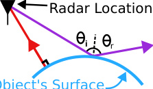

# mmNorm: Non-Line-of-Sight 3D Object Reconstruction via mmWave Surface Normal Estimation

> 这是机器辅助生成的客观摘要笔记。基于完整论文 PDF 整理。

## 一句话讲什么（TL;DR）

不去硬猜"哪里有东西"，而是先估"表面朝哪个方向"，毫米波就能隔着纸箱重建出物体表面。

## 这篇论文要解决什么问题（Why this paper）

**先讲个生活场景**：你网购了一箱东西，快递盒还没拆，你想知道里面摆的是不是你买的电钻、姿势对不对。摄像头隔着纸板看不到。X 光太贵也太危险。这时候有没有一种"廉价、安全、能穿透纸板"的雷达，让机器人在不打开盒子的前提下，看清里面物体长什么样、把手朝哪？这就是这篇论文想解决的问题。

把场景换成机器人，需求更具体：让机械臂去封闭纸箱里抓一个螺丝刀，或让 AR 眼镜"看穿"被布盖住的物体。摄像头不行——可见光被挡住就完了。**毫米波 (mmWave，工作在 77GHz 附近的雷达信号)** 能穿过纸板、布、塑料这类常见遮挡物，按理说很合适做"非视距 (NLOS, Non-Line-of-Sight，看不到目标的情况下感知)"重建。

但之前的方法不够用。主流做法叫 **backprojection（反向投影）**：扫一圈雷达信号，按"光线追踪"反推每个 **体素 (voxel，3D 版的像素，立方体小格子)** 有多少能量，然后把能量超过阈值的体素当作物体的点云。问题在于商用毫米波雷达的带宽只有 4GHz，深度分辨率约 4cm——这意味着重建出来的点云会在深度方向"糊"成一坨，体积差不多是原物体两倍大。机器人想据此规划抓取动作（手柄在哪？刀刃朝哪？）就完全无从下手。

更大的带宽（>10 GHz）确实能提高分辨率，但这种频段政府/军用专属，民用场景拿不到。所以瓶颈不是雷达不够好，而是**用法不对**。这篇论文的态度是：与其等更好的硬件，不如换一个根本性的提问角度。

## 用了什么方法（How）

mmNorm 的核心想法是绕开"占用分布"这条路：与其问"这里有没有物体"，不如问"这个点的表面朝哪个方向"。把"找东西"翻译成"估方向"，这是整篇论文的灵魂。下面是它的三段式流水线：

**关键观察：镜面反射 (specular reflection)** → 类比浴室镜子打灯。你拿手电筒照浴室镜子，只有当镜子正对你的角度时，光才反射回你眼睛；其他角度看到的反射都很弱。毫米波在大多数物体表面也是这样："入射角等于反射角"。所以**一个雷达位置只能收到那些"法向量正好指向自己"的表面点的强反射**。这把"信号强度"和"表面方向"绑定到了一起——这就是整套方法的物理根基。

读到这里你可能在想：知道"表面对着哪个方向就反射强"，怎么反推回"表面朝哪"？答案是投票。

**Step 1 — mmWave Surface Normal Estimation（毫米波表面法向估计）** → 类比"开会投票"。机械臂拖着雷达扫过一片区域（这种把雷达"走来走去合成一个超大天线阵列"的做法叫 **Synthetic Aperture Radar，SAR，合成孔径雷达**，类比手机移动拍多张照合成全景）。对 3D 空间里每个体素，从它指向每个雷达位置画一根候选 **法向 (surface normal，垂直于表面那个朝外的箭头)**；雷达接收信号越强，这根候选向量的"票数"越重；最后把所有候选向量加权求和，得到这个点的法向估计。这一步把"信号"翻译成了一张覆盖整个 3D 空间的"表面朝向地图"（vector field，向量场）。

读到这里你可能想：知道每个点的朝向，那把它们拼起来不就是表面了吗？没那么简单。法向场只告诉你"切线斜率"，不告诉你"具体高度"——这就引出第二步。

**Step 2 — mmWave Normal Field Inversion（法向场反演）** → 类比"等高线只告诉你地形起伏，不告诉你海拔多少"。同一个法向场可以对应无数条平行的、上下平移的表面。作者借了计算机图形学的 **Signed Distance Function (SDF, 有符号距离函数)** 思想——这是一个 3D 函数，告诉你每个点"到最近表面的距离"，外正内负。但因为我们不知道真实表面在哪，没法算出真正的 SDF。作者退一步定义 **Relative SDF (RSDF, 相对有符号距离函数)**：所有可能的表面被编码成同一个 3D 函数的不同 **等值面 (isosurface，函数取同一值的所有点连成的面，类比 3D 版等高线)**。剩下的事就是从这一族等值面里挑对的那条。

读到这里你可能想：那怎么知道哪条等值面是对的？答案是"用物理模拟去对答案"。

**Step 3 — Structural Isosurface Optimization（等值面结构优化）** → 类比"对答案"。挑一条候选等值面 → 用光线追踪模拟"如果真实表面长这样，雷达应该收到什么信号" → 跟实际收到的信号比 → 不对就换一条。最后选误差最小的那条作为最终重建表面。这一步把"反演"问题变成了"在一族候选中做优化"——优化目标明确、可计算。

**多表面分量处理** → 类比"分组解题"。像马克杯（杯身 + 把手）这种有多个分离表面的物体，法向场会在分量之间出现"断点"，整体反演会被拖累。mmNorm 先用低分辨率的毫米波图像把不同部位粗略圈出来（**connected component analysis，连通分量分析，找图里相邻像素连成一块的区域**），每块独立做 RSDF + 优化，最后再拼回去。

## 关键实验结果（What works）

在 116 次真实实验、61 个 YCB（Yale-CMU-Berkeley，机器人圈通用的标准物体集）数据集物体上：

- **3D F-Score 96%**（mmNorm）vs **78%**（Interferometric 基线）vs **72%**（Backprojection 基线）。F-Score 是衡量重建形状跟真实形状有多接近的综合指标，1.0 满分。**为什么这个数字了不起**：mmNorm 把误差从近 30% 砍到 4%，相当于从"勉强能看出是个杯子"提升到"杯把和杯口的弧度都对得上"。
- **85% 的点位移误差 < 物体尺寸的 5%**，而两条基线都只有 **44%**。**为什么这个数字了不起**：基线方法实际上有一半多的点是"飘"在物体真实表面之外的，机器人据此规划抓取就会抓空；mmNorm 让绝大部分点都贴合真实表面，下游抓取规划才有可能成功。
- **法向估计余弦相似度 (cosine similarity，两个向量方向的接近程度，1 表示完全同向) 中位数 0.99**，而 Backprojection 只有 **0.54**，Interferometric 只有 **0.66**。**为什么这个数字了不起**：直接验证了"先估法向"这条路本身就比"先估占用再算法向"准 4 倍以上；这是论文方法论选择的硬证据。
- **NLOS 与 LOS 性能几乎相同**：被纸板完全遮挡时，中位点误差 0.43cm，相比无遮挡的 0.39cm 几乎无衰减。**为什么这个数字了不起**：很多"穿墙感知"工作其实在 NLOS 下精度会掉一大截；mmNorm 几乎没掉，证明它在真正的"看不见"场景下也站得住。
- **位置误差 90 分位 2.4cm** vs 基线的 **4.3cm / 5.8cm**。**为什么这个数字了不起**：90 分位代表"最差的那批样本"——能在最差情况下也保持低误差，意味着方法的鲁棒性，不只是少数运气好。

## 我读完后该懂的几个术语

- **mmWave Radar（毫米波雷达）** —— 工作在 77GHz 附近的雷达；类比"高频版蝙蝠回声定位"，能穿薄遮挡物。本文用的是 TI IWR1443 商用雷达。
- **Synthetic Aperture Radar (SAR, 合成孔径雷达)** —— 把雷达装在机械臂上扫一片区域，等价于一个超大虚拟天线阵列；类比"用一台手机移动拍多张照合成全景"。本文整个数据采集流程都基于 SAR。
- **Specular Reflection（镜面反射）** —— 入射角=反射角；类比"浴室镜子打光"——只有从特定角度才看得到反光。本文§2 把这个特性当作整套方法的物理基础。
- **Surface Normal（表面法向）** —— 垂直于表面的箭头方向；类比"皮肤每个毛孔伸出的一根毛"，告诉你表面这一小块朝哪。本文 Step 1 估的就是它。
- **Voxel（体素）** —— 3D 版的像素，立方体小格子；类比"乐高积木把空间切成一块块"。本文整个 3D 空间被切成体素后逐个估算。
- **Signed Distance Function (SDF, 有符号距离函数)** —— 一个 3D 函数：每点的值 = 到最近表面的距离（外正内负）；类比"GPS 给你到最近海岸线的距离，正数在内陆负数在海里"。本文§3 借这个思想定义了 RSDF。
- **Isosurface（等值面）** —— 3D 函数取同一值的所有点连成的面；类比"地形图上同海拔的等高线"，但是 3D 版。本文 Step 2 把所有候选表面都编码成 RSDF 的不同等值面。
- **F-Score（F 分数）** —— 综合"召回 + 精确"的形状重建评估指标，1.0 满分；类比"考试既要做对的多，也要别瞎写"。本文§6 用 3D F-Score 作为主要评测指标。

## 这篇论文的局限 / 我看出的疑点

- **金属遮挡完全失效** —— 毫米波穿不过金属或太厚的物体。**用户实际会遇到的问题**：想"看穿铁皮工具箱"是做不到的，必须是纸板/布/塑料这类薄遮挡物。
- **空心物体只能重建一面** —— 一个 RSDF 分量只输出一条等值面。**用户实际会遇到的问题**：空纸盒的顶面和底面没法同时重建；机器人想知道盒子的厚度就不行。作者承认这是未来工作。
- **覆盖范围受限于孔径** —— 法向必须指向雷达扫过的那块区域才能被估到。**用户实际会遇到的问题**：圆球的赤道部分、跟孔径平行的侧面会丢失；想得到完整 360° 形状必须多角度扫描，时间翻倍。
- **采集时间长、计算重** —— 60×45 cm 的扫描网格、雷达走 0.1 m/s（爬行速度），加上 GPU 优化（CUDA + GTX 1080）才能跑动。**用户实际会遇到的问题**：离实时还很远，机器人不能边走边重建，只能"停下来扫一会儿"。
- **未对比深度学习基线** —— 文中只对比了两条 first-principles 基线，没跟基于神经网络的 mmWave 重建（比如人体重建那一系列）正面比。作者解释是后者只能在特定品类上跑，但读者会想看个数。

## 与其他 12 篇的关联

- **vs RF-SLAM** —— RF-SLAM 关心"我（机器人）和环境的相对位置"（定位 + 粗糙地图），mmNorm 关心"被遮挡的物体长什么样"（细粒度形状重建）。两者用的硬件相近（都是 mmWave），但产出维度不同：一个给"在哪"，一个给"什么样"。组合起来可以让机器人既知道自己在仓库哪个货架前、也知道箱子里的螺丝刀在哪个角度，是天然互补的两层。
- **vs mmCLIP** —— mmCLIP 走的是"毫米波 + 学习模型"路线（语义对齐），mmNorm 走的是 first-principles 物理建模路线（形状几何）。一个回答"是什么"（this is a mug），一个回答"长什么样"（杯把朝左 30°）。研究范式正好对偶：mmCLIP 把毫米波塞进 CLIP 借语义先验，mmNorm 死磕电磁波物理。可以串成"先用 mmCLIP 识别再用 mmNorm 精扫"的两阶段感知管线。
- **vs SayCan / OpenVLA** —— mmNorm 输出的高精度 NLOS 点云正好填补了 VLA (Vision-Language-Action) 框架中"摄像头看不到的物体"那个盲区。SayCan 决定"打开抽屉拿剪刀"时，VLA 模型只能看到抽屉外面；mmNorm 可以告诉它剪刀在抽屉里是怎么躺的、刀刃朝哪——直接接到下游抓取规划。属于"VLA 上层不变，下层换感知"的可插拔升级。

## 我建议的阅读顺序

面向零基础读者，建议这样读这篇论文（约 90 分钟，跳过推导细节）：

1. **先读 Abstract + Section 1（Introduction）**——15 分钟。建立"为什么 backprojection 不行 / mmNorm 换了什么思路"的高层认知。这是全文的故事骨架。
2. **看 Fig. 1 和 Fig. 2**——10 分钟。Fig. 1 直观展示"传统方法糊成一坨 vs mmNorm 贴合真实"，Fig. 2 是整套方法的图示总结，看懂这一张图等于看懂 60% 的论文。
3. **跳读 Section 2（Surface Normal Estimation）**——15 分钟。理解"投票"机制的直觉就够，公式 (1)–(6) 可以先跳过。
4. **重点看 Section 3.1 + 3.2（Surface Ambiguity + RSDF）**——20 分钟。这是论文最巧妙的地方：为什么需要 RSDF、它和 SDF 的差异。SDF 概念若完全陌生，先去搜个 5 分钟视频再回来。
5. **跳过 Section 4 公式细节，直接看 Section 6（Results）**——20 分钟。Fig. 12（F-Score / 位置误差 / 相对点误差三张 CDF 图）和 Fig. 13（法向余弦相似度）是 mmNorm 价值的硬证据。
6. **可选：扫一眼 Section 7（Related Work）**——10 分钟。把 mmNorm 放回 mmWave 重建研究的脉络里，理解它相对 backprojection / interferometric / 学习方法的差异定位。

如果只有 30 分钟：1 + 2 + 5 即可。

## 为什么值得读 / 不值得读

值得读。它代表了一种"不靠更大带宽、不靠堆数据，靠重新提问"的硬核 first-principles 思路：把"找占用"问题翻译成"估法向 + 反演 SDF + 优化等值面"，在商用 4GHz 带宽下做出了 96% F-Score——这种"用对方法压过用对硬件"的工作对零基础学习者很有启发。

**如果你只能读 1 篇 mmWave 论文**：读这篇。它的方法论示范价值（重新定义问题）超过单纯的技术新意。

**如果你能读 3 篇射频感知论文**：mmNorm + RF-SLAM + mmCLIP 这三篇能拼出"位置 + 形状 + 语义"的完整射频感知能力图。

**如果你只对深度学习感兴趣**：可以跳过这篇。本文几乎不涉及神经网络，是纯物理建模 + 优化求解；硬要硬读会觉得"为什么没用 transformer"——但那不是这篇的语言。
