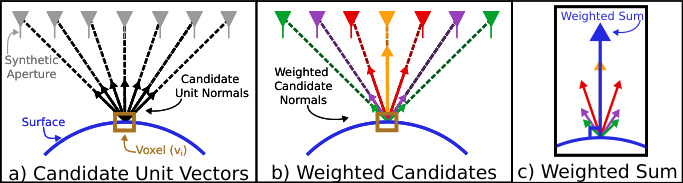
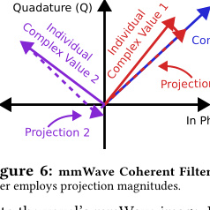
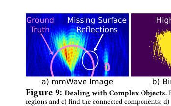
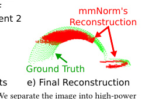
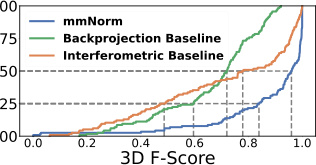
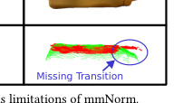

# mmNorm：隔着纸箱"看清"里面的东西——穿墙 3D 重建

> 给"完全没接触过 AI / 机器人 / 信号处理"的读者写的精读笔记。所有专业词第一次出现都会解释清楚。只看这份笔记就能理解全文机制。

## 一句话讲什么（TL;DR）

不直接问"东西在哪儿"，而是先猜"它的皮朝哪边翘"——用便宜的毫米波雷达就能隔着纸箱重建出里面物体的精确 3D 形状，F-Score 达到 96%，把旧方法的 78% 远远甩在身后。

*所以这一节是想说：换一个提问方式（从"定位置"到"估朝向"），老硬件也能做到过去军用级才能做的事。*

---

## 这是个什么场景

双十一你抢到一台电钻，快递盒还没拆。你掂了掂——想知道把手朝哪边、有没有磕碰、电池装没装。可是：

- 摄像头不行：盒子不透明，眼睛抓瞎。
- 拆开再封回去：胶带封不平，强迫症发作。
- 拉去医院做 X 光：贵、辐射、保安会拦你。

机器人在仓库里也会遇到一模一样的窘境：货架上几百个盒子，里面到底是螺丝刀还是扳手？姿态又是怎么躺的？人没法一个个拆。

有没有一种"便宜、安全、又能穿透薄壳"的办法？有——**毫米波雷达**。

> **毫米波雷达（mmWave Radar）**：发射一种波长只有几毫米的电磁波（频率 77 GHz 上下）。和蝙蝠靠超声波回声判断前方有没有墙是同一个套路，只是把声音换成了电磁波。它能轻松穿过纸板、布、薄塑料这些遮挡物。

这篇论文要做的事就一句话：**给机器人一台便宜的毫米波雷达，让它隔着包装看清盒子里那件东西长什么样**。

这正是射频感知（RF Perception）区别于相机和 LiDAR 的"独门绝技"——**穿墙感知**。相机再好，不透明就完蛋；LiDAR 再精，遇到遮挡也无计可施。毫米波天然能穿透纸板、布、薄塑料，这是物理层面的优势，不是靠堆算力能补回来的。

应用场景举例：

- 仓库机械臂：闭着眼伸手进盒子里抓螺丝刀，需要知道把手朝哪。
- 扫地机器人：知道沙发底下是袜子还是充电线。
- AR 眼镜：让你"看穿"被布盖住的东西。
- 机场安检：比 X 光机便宜、又没辐射风险。
- 物流质检：包裹不拆封就确认内容物完好。

*所以这一节是想说：我们想要一种便宜、安全、能穿透薄遮挡物的"看见"工具，而 mmNorm 就是用毫米波雷达实现这种"穿墙看形状"的能力——这是相机和 LiDAR 在物理上做不到的事。*

---

## 之前的人怎么做的，为什么不够好

之前这个领域的主流做法叫 **反向投影（backprojection）**。直觉上就是：

- 雷达对着场景扫一圈，每个位置都收到一些回波。
- 把回波"按光线方向倒推回去"，看每一小格空间累计收到了多少能量。
- 能量超过门槛的格子，就被当成"这里有物体"。

> **体素（voxel）**：3D 版的像素。可以想象成把空间用一堆小立方体（像乐高积木）填满，每块小立方体就是一个体素。

> **反向投影（backprojection）**：雷达成像的经典算法。想象你站在操场上，朝四面八方喊一声，然后听不同方向回来的回声。反向投影就是把每个方向的回声"放回"到它可能产生的位置上去，最后叠加在一起，回声重合最多的地方就是有东西的地方。

然后问题就来了：

| 问题 | 具体表现 | 后果 |
|------|---------|------|
| 分辨率太糊 | 民用雷达深度精度约 4 cm | 5 cm 厚的杯子看起来有 10 cm |
| 形状像一团云 | 点散布在物体体积的两倍区域 | 机器人根本分不清杯口和杯把 |
| 想提高精度只能换频段 | >10 GHz 带宽的雷达是政府/军队专属 | 民用拿不到 |
| 不是硬件不够好 | 硬件已经摆在那 | 问题出在算法的提问方式 |

还有一类做法叫**干涉法（interferometric）**，靠相位差估深度，但只在金属物体+消声室里验证过，换到真实环境就不行了。

*所以这一节是想说：旧方法把"找东西"当成"找在哪些格子里有能量"——可惜这种问法在 4 cm 精度下注定糊成一团。问题不是硬件差，而是问错了问题。*

---

## 这篇论文的新想法

类比：你在雾里画猫。

- 旧方法："猫身上每一点在哪？" → 画出来是一团毛球。
- 新方法："每根猫毛朝哪边竖？" → 把方向画对，猫的轮廓自己就浮出来了。

**不去问"哪里有东西"，而去问"东西的表面朝哪个方向"**。

物理依据是——毫米波在大多数物体表面表现出**镜面反射**特性：只有当表面的法向（垂直于表面的方向）正好指向雷达时，信号才会被强烈反射回来。这就意味着"哪个雷达位置收到最强信号"直接暴露了"那一点的表面朝哪"。

> **法向（surface normal）**：垂直于表面那根朝外的箭头。可以想象皮肤上每一个毛孔伸出的一根毛——这根毛指向哪，就是这一小块表面朝哪。

> **镜面反射（specular reflection）**：和浴室镜子一样。手电筒只有正对镜子时才会有强反光，斜着照基本不反。毫米波在大多数物体表面也有这个特点——入射角等于反射角。

这个方法完全不用神经网络，不用训练数据，是纯物理+纯算法路线。它的适用性不受物体类别限制——不管是杯子、电钻还是香蕉，只要表面能反射毫米波就行。

*所以这一节是想说：换问题（从"在哪"到"朝哪"），比换硬件更有效。这是一个"巧用物理"的方法，不靠大模型也不靠大数据。*

---

## 它分几步做的（方法）

整个流程分三大步，外加一步"复杂物体怎么处理"。先看一张总览图：



**全局鸟瞰**：

```
输入：雷达扫描区域内收到的一大堆回波信号
  ↓
Step 1：投票估朝向 → 输出：3D 法向量场（每个体素一个方向箭头）
  ↓
Step 2：法向量场反演 → 输出：相对有符号距离函数（RSDF），锁定"一族候选表面"
  ↓
Step 3：物理模拟 + 对答案 → 输出：唯一确定的最终表面
  ↓
输出：精确的 3D 表面点云
```

对于有多块分离面的复杂物体（比如马克杯的杯身+把手），在 Step 2 前多一步"切块"预处理。

---

### Step 1：让所有雷达位置"投票"，估出表面朝向

**输入**：雷达在合成孔径上每个位置收到的复数回波信号。

**输出**：3D 空间里每个体素对应一个法向估计（一个方向箭头），合在一起形成法向量场。

**类比**：上课老师问"答案是 A 还是 B"，每个同学举一只手投票。每个雷达位置就是一个同学，它投的是"这个表面朝我这个方向"。所有同学的票汇总起来，就能选出最可能的方向。

**硬件设置**：机械臂（UR5e）拖着一台 TI IWR1443Boost 毫米波雷达，走过一片 60 cm x 45 cm 的二维网格。每隔约 lambda/4（约 1 mm）采一次数据。这个过程叫做**合成孔径雷达（SAR）**。

> **合成孔径雷达（Synthetic Aperture Radar，SAR）**：把一个小雷达拖着走一大片，等价于一个超大的天线。类比"用手机拍全景"——你边走边拍多张普通照片，软件帮你拼成一张超广角。这里机械臂带着雷达走一圈，等于造了一个 60x45 cm 的虚拟大天线。

**物理事实**：由于镜面反射特性，某个体素（空间中的一个小格子）如果刚好在物体表面上，那么只有当雷达位置恰好在它法向方向时，那个雷达才能收到来自这个点的强反射。换句话说——**哪个雷达位置收到某个点的回波最强，那个点的法向就最可能指向那个雷达**。

**投票过程的三步详解**：

**(1) 构造候选方向**

对每个体素 v_i，画一根从 v_i 指向每个雷达位置 p_j 的单位向量（长度为 1 的箭头）。这就是一根"候选法向"。有多少个雷达位置，就有多少根候选。

> 公式人话翻译：u_{i,j} = (p_j - v_i) / ||p_j - v_i||，就是"从这个小格子指向第 j 个雷达位置的方向"。

**(2) 给每根候选方向配一个"票权"**

关键问题：怎么知道哪个雷达位置收到的回波"真的来自这个体素的表面"？答案是设计一个**相干滤波器（coherent filter）**。

> **复数信号 / IQ 信号**：雷达收到的不是一个普通数字，而是一个"既有大小、又有方向"的箭头（复数）。可以把它画在一张二维平面上，用向量表示。

工作原理：

- 雷达用 FMCW（调频连续波）扫频发射信号，回波经过处理后，每个雷达位置 j 对体素 v_i 贡献一个复数值 I_j(v_i)。
- 所有雷达位置的复数值加起来，得到总值 S(v_i)。
- 然后把每个单独的 I_j(v_i) 往总值 S(v_i) 上做**投影**（向量投影，高中数学学过）。投影大的，说明这个雷达位置的贡献和"大家的共识"方向一致——它的票权就高。投影小的或者反方向的，票权就低。

> **FMCW（调频连续波）**：雷达不发短脉冲、而是连续发"频率随时间变"的信号。类比一边发声一边滑哨子（从低音滑到高音），听回声在哪个频率最响就知道目标多远。

> 公式人话翻译：w_{i,j} = Re{I_j(v_i)} * Re{S(v_i)} + Im{I_j(v_i)} * Im{S(v_i)} / ||S(v_i)||。就是"把第 j 个雷达的复数值投影到总和方向上，看投影长度"。

**(3) 加权求和得到最终法向**

把所有加权后的候选方向加起来，再归一化（除以总长度），就得到这个体素的最终法向估计。

> 公式人话翻译：n_hat_i = sum(w_{i,j} * u_{i,j}) / ||sum(w_{i,j} * u_{i,j})||。就是"所有投票方向的加权平均，然后统一成长度为 1"。



**关键物理保障——为什么偏离法向的雷达不会捣乱**：

论文证明了一个优美的性质：那些不在法向方向的雷达位置，它们的投影值会正负交替振荡（oscillate），正的和负的加起来互相抵消。只有真正在法向方向的雷达，投影值才稳定为正。这就像投票时有些人乱按，但他们一半按 A 一半按 B，最终不影响结果；只有真正知道答案的人一致地按 A，A 就胜出了。

**关于非均匀材质的说明**：

看起来这个方法好像要求物体表面到处一样（同一种材质、同一种反射强度）。但其实不需要。因为 mmNorm 问的不是"对于一个雷达位置，物体表面哪一点反射最强"，而是反过来问"对于表面上一个固定的点，哪个雷达位置收到它的反射最强"。既然盯住了同一个点，材质变化就不影响。

**关于非严格镜面反射的鲁棒性**：

真实物体不是完美镜面。很多材质（混凝土、石膏板、大理石）在毫米波频段表现出"方向性漫反射（directive model）"——反射能量在镜面角附近呈对称分布。这种情况下，法向两侧的候选向量会对称出现，加权求和后仍然指向正确的法向方向。

*所以这一节是想说：Step 1 的核心是一个"投票"机制——每个雷达位置根据自己收到的信号强度投一票"表面朝我"，投票权由相干滤波器决定。最终把票加起来就得到每个体素的法向估计。*

---

### Step 2：从"朝向地图"反推"具体形状"——法向量场反演

**输入**：Step 1 输出的 3D 法向量场（每个体素一个方向箭头）。

**输出**：相对有符号距离函数（RSDF），它编码了一族平行的候选表面。

**类比**：等高线图只告诉你"地形在这里有多陡、坡朝哪"，并没有直接告诉你"这一点的海拔是多少"。同一片坡度，可能整体抬高 100 米也可能压低 100 米。

#### 2.1 表面歧义问题

一个法向量场并不能唯一确定一个表面。论文用一个 2D 例子说明了这一点：同一组绿色箭头（法向量场），可以画出红色、紫色等多条不同的曲线，它们都满足"垂直于每个箭头"的条件。这意味着仅凭法向信息无法直接恢复表面——存在无穷多个候选。



#### 2.2 设计相对有符号距离函数（RSDF）

为了把"无穷多候选"组织成一个可操作的结构，论文引入了一个核心概念：

> **有符号距离函数（SDF, Signed Distance Function）**：一个 3D 函数。空间中每一点的值 = 这一点到最近表面的距离。在物体外面取正、里面取负、表面上取 0。类比 GPS 给你"到最近海岸线还有多远"，正数代表你在陆地，负数代表你已经下海了。

> **等值面（isosurface）**：函数取相同值的那些点连成的面。例如把所有"SDF = 0"的点连起来，就是物体表面。类比 3D 版的等高线。

问题是——我们要解的就是"表面在哪"，但 SDF 又依赖"表面在哪"才能定义，是个先有鸡还是先有蛋的死循环。

**论文的巧解**：定义一个**相对版的 SDF（RSDF, Relative SDF）**：

- 选一个起点体素 v_0，规定它的 RSDF 值 = 0。
- 对其它每个体素 v_i，从 v_0 走到 v_i 的路上，每走一步就问："我这一步的方向 d_k，跟这一点的法向 n_hat_k 夹角多大？"
- 用向量内积 (n_hat_k . d_k) 算每一步的"得分"，全部累加就得到 v_i 的 RSDF。

> 公式人话翻译：f_R(v_i) = sum_{k in Path}(n_hat_k . d_k)。就是"沿着路走，每一步看方向和法向有多对齐，对齐的积累多、垂直的积累少"。

**直觉理解**：

- 如果你沿着法向方向走（垂直于表面往外走），每步内积接近 1，RSDF 快速增大——你在快速远离表面。
- 如果你沿着表面方向走（平行于表面），每步内积接近 0，RSDF 几乎不变——你在表面上滑行。
- 如果你朝物体内部走，内积为负，RSDF 减小——你在往表面里面钻。

最后得到的 RSDF 长得**几乎像真的 SDF**，只是整体差一个未知常数 C：

f(v_i) = f_R(v_i) - C

真表面是 f = 0 的等值面，也就是 f_R = C 的等值面。问题从"猜一个任意形状的表面"降维成了"猜一个数字 C"。

**为什么这步有用**：把一个看起来无解的反演问题（从无穷维搜索），浓缩成"在一族等值面里挑一条"（一维搜索），问题难度断崖式下降。

#### 2.3 复杂物体怎么办：先切块，再各算各的

像马克杯（杯身 + 把手）这种有多个分离表面的物体，法向量场在两块之间会出现"断点"——因为 SAR 只能看到法向指向自己的那部分表面，中间过渡区域如果法向朝别处，雷达就看不到，法向量场就断了。

如果硬当一块整体来反推 RSDF，会把好的部分也带歪。

**处理三步走**：

**(1)** 把雷达图（SAR 图像的幅值）二值化：能量超过阈值的赋 1、不超过的赋 0。阈值用 Li 自动阈值算法确定。

**(2)** 找**连通分量**：二值图里相邻的 1 像素粘在一起的区域算一块。

> **连通分量分析（connected component analysis）**：在一张二值图上找"哪些 1 像素是粘在一起的"。类比一张地图上把同一个国家的领土圈出来——同色相邻的就算一国。实现上用广度优先搜索（BFS），就是一层一层往外扩展，像往池塘里扔石子看水波扩散一样。

**(3)** 每块连通分量单独算 RSDF。最终得到多个独立的 RSDF 分量，每个有自己的未知常数 C_n。



**所以现在的问题变成了**：找到一组常数 C = {C_1, C_2, ..., C_N}，让每个 RSDF 分量选出正确的等值面。

*所以这一节是想说：法向量场不能直接告诉你形状，但可以告诉你"形状大约长这样、只差一个上下平移"。对于复杂物体先分块，每块独立反演，问题从"猜任意形状"降维到"猜 N 个数字"。*

---

### Step 3：用"假设 + 模拟 + 对答案"挑出真表面——等值面优化

**输入**：N 个 RSDF 分量 + 真实接收到的回波信号。

**输出**：唯一确定的一组常数 C_hat，定义出最终的 3D 表面。

**类比**：物理课做选择题，四个选项不知道哪个对，就把每个选项代回原题验算一下，哪个验算结果最贴合就选哪个。

**灵感来源**：计算机视觉领域的"可微渲染（differentiable rendering）"思想——不直接解逆问题，而是构造正向模拟，然后和观测比对，迭代优化。

**具体过程三步走**：

**(1) 正向模拟：从候选表面算出"应该收到什么信号"**

给定一组常数 C = {C_1, ..., C_N}，每个 RSDF 分量取 C_n 等值面作为候选表面。然后：

- 用**光线追踪（ray tracing）**找出雷达射向候选表面的所有交点。

> **光线追踪（ray tracing）**：游戏里渲染光照常用的算法。从光源射出一束束光线，一根根追踪它们碰到物体后怎么反射。在这里我们用它模拟"雷达发出的电磁波碰到候选表面后怎么回来"。

- 对每个交点，用**自由空间路径损耗模型**算出"信号到那个点再回来，强度会衰减多少"。

> **路径损耗（path loss）**：电磁波越远能量越弱，跟距离平方成反比。和声音越远越小听不清是一个道理。

- 把所有交点的贡献加起来，就得到模拟的接收信号 h_hat_j(t, C)。

> 公式人话翻译：对每个雷达位置 j，模拟信号 = 所有反射点的（1/距离）* exp(-j * 2pi * 距离 / 波长）求和。就是"把每个反射点的回波按距离加权加起来"。

**(2) 设计代价函数：模拟信号和真实信号差多少**

- 把模拟信号和真实信号各做一次 FFT（傅里叶变换），得到频谱。
- 比较两个频谱的幅值差异，把差异加起来就是代价函数 L(C)。

> **傅里叶变换（FFT）**：把一段随时间变化的信号拆成"它由哪些频率成分组成"。在 FMCW 雷达里，频率和距离一一对应，所以**比频谱差就等价于比距离差**。

> 公式人话翻译：L(C) = sum_j || |FFT(h_hat_j)| - |FFT(h_j)| ||。就是"所有雷达位置的频谱差异总和"。

**(3) 搜索最小代价的 C**

在候选的 C 值空间里（每个分量每隔 lambda/2 约 1.9 mm 采样一次），找让 L(C) 最小的那组 C_hat。

> 公式人话翻译：C_hat = argmin_C L(C)。就是"穷举所有候选，选误差最小的"。

**为什么这步能成功而不需要模拟噪声、表面反射率等复杂因素**：

论文指出，这和 SAR 或天线阵列系统用简单的自由空间模型就能成功匹配是同一个道理——主要信息在信号的相位和距离结构中，噪声和反射率的影响是次要的。

**计算复杂度**：

- Step 1（法向估计）：O(V x A)，V=体素数，A=雷达位置数，和标准反向投影一样，可以 GPU 并行。
- Step 2（RSDF）：O(V)，用 BFS 一遍过。
- Step 3（优化）：O(C x I x A x R x T)，其中 C<4 个分量，I<60 个候选等值面，R=光线数，T=频率采样数。同样可以高度并行化。

论文用 CUDA + Python/C++ 在 GTX 1080 上实现，体素大小 1mm x 1mm x 1mm。

*所以这一节是想说：Step 3 是用真实物理正向模拟"如果表面是这样的，雷达会看到什么"，然后跟实际观察对比，选出误差最小的候选。三步合起来：投票估方向 → 积分缩范围 → 模拟选答案。方法没用神经网络，纯物理模拟+优化。*

---

### 方法总结对比表

| 步骤 | 输入 | 输出 | 核心技巧 | 类比 |
|------|------|------|---------|------|
| Step 1 | 雷达回波 | 3D 法向量场 | 相干滤波器投票 | 全班投票选答案 |
| Step 2 | 法向量场 | RSDF（一族候选面） | 路径积分 + 切块 | 等高线反推海拔（差常数） |
| Step 3 | RSDF + 真实信号 | 确定的 3D 表面 | 正向模拟 + 代价最小化 | 选择题代入验算 |

---

## 关键数字（What works）

论文用 **YCB（Yale-CMU-Berkeley）日用物品集** 里的 61 件物品，每件做"看得见（LOS）"和"被纸板盖住看不见（NLOS）"两组实验，共 116 次。



| 指标 | mmNorm | Backprojection 基线 | Interferometric 基线 | 说明 |
|------|--------|-------------------|--------------------|----|
| 3D F-Score 中位数 | **96%** | 72% | 78% | 越高越好 |
| F-Score 25th 百分位 | **84%** | 60% | 49% | 衡量鲁棒性 |
| 点误差 <5% 物体尺寸的比例 | **85%** | 44% | 44% | 越高越好 |
| 法向余弦相似度中位数 | **0.99** | 0.54 | 0.66 | 1=完美 |
| 法向余弦相似度 25th | **0.94** | 0.22 | 0.36 | |
| 位置误差中位数 | **0.6 cm** | 0.8 cm | 1.3 cm | 越小越好 |
| 位置误差 90th | **2.4 cm** | 4.3 cm | 5.8 cm | |
| LOS 点误差中位数 | 0.39 cm | - | - | |
| NLOS 点误差中位数 | 0.43 cm | - | - | 遮挡几乎不掉精度 |

**消融实验（Ablation）**：

| 配置 | 中位点误差 | 90th 点误差 |
|------|-----------|------------|
| 完整 mmNorm | **0.4 cm** | **1.2 cm** |
| 去掉 Step 3，取 RSDF 中心 | 1.6 cm | 3.3 cm |
| 去掉 Step 3，取加权中心 | 1.1 cm | 2.9 cm |

Step 3（等值面优化）贡献了约 3 倍精度提升，是整个方法的"最后一根支柱"。

**硬件成本**：TI IWR1443Boost 雷达约 200 美元 + DCA1000EVM 数据采集板约 600 美元。对比需要 >10 GHz 带宽的军用级雷达，成本差了两个数量级。

*所以这一节是想说：在民用便宜雷达（4 GHz 带宽）上拿到了过去要军用级硬件才能拿到的精度。遮挡几乎不影响性能——这正是"穿墙感知"的价值所在。*

---

## 实验结果说明了什么

**说明一：算法 > 硬件**

mmNorm 用 200 美元雷达做出了比用昂贵设备的干涉法还好的效果。这证明了"换问题比换硬件更有效"——同样的物理约束（4 GHz 带宽），只要换一种利用信号的方式（从能量阈值到法向估计），就能突破看似不可逾越的分辨率瓶颈。

**说明二：穿墙几乎不掉精度**

LOS 0.39 cm vs NLOS 0.43 cm，差异可以忽略不计。这为真实的仓库/物流场景铺平了道路——机器人不需要先拆包装再感知，可以直接隔着纸箱规划抓取。

**说明三：适用物体范围广**

61 种 YCB 物体覆盖了金属、塑料、纸板、橡胶、泡沫、木头、玻璃等多种材质，形状从简单的盒子到复杂的电钻（多种材质组合）。方法不挑类别，因为它基于物理而非学习。

**说明四：法向估计是核心引擎**

余弦相似度中位数 0.99（基线只有 0.54/0.66），说明法向估得极准。后续的 RSDF 反演和等值面优化都建立在好的法向估计之上——法向不准，后面全白搭。

**说明五：多物体场景可行**

论文展示了同时重建叉子+刀+勺的场景，说明方法不限于单物体。

*所以这一节是想说：实验结果一致指向一个结论——"换问题 + 纯物理"这条路线，在穿墙 3D 重建这个任务上是极其有效的，而且具有很强的实用潜力。*

---

## 你应该懂的几个新词

> **毫米波雷达（mmWave Radar）**：波长几毫米的电磁波雷达，能穿薄遮挡物。类比"高频版蝙蝠回声定位"。本文用的是 77 GHz 频段，带宽 3 GHz（77.5-80.5 GHz）。

> **合成孔径雷达（SAR）**：让小雷达拖着走一大片，效果等于一个超大天线。类比手机拍全景。

> **体素（voxel）**：3D 版像素，把空间切成的小立方体。本文用 1mm x 1mm x 1mm 的体素。

> **法向（surface normal）**：垂直于表面那个朝外的箭头。类比皮肤上一根根毛。

> **镜面反射（specular reflection）**：入射角 = 反射角。类比浴室镜子打灯，只有正对才反光。

> **有符号距离函数（SDF）**：3D 函数，每点值 = 到最近表面的距离，外正内负。类比 GPS 给你到海岸的距离。

> **相对有符号距离函数（RSDF）**：SDF 的"偏移版"，只能确定相对距离关系，不知道哪条等值面是真表面。

> **等值面（isosurface）**：3D 函数取相同值的那些点连成的面。类比 3D 版等高线。

> **FMCW（调频连续波）**：雷达不发短脉冲、而是连续发"频率随时间变"的信号。类比一边发声一边滑哨子。

> **相干滤波器（coherent filter）**：利用信号的相位信息（不光看振幅大小，还看"箭头方向"）来做判断的滤波器。"相干"意味着它保留了信号的相位，而不仅仅是能量。

> **光线追踪（ray tracing）**：从源头射出光线，追踪碰到物体后的反射路径。游戏画面里的"光追"就是这个。

> **连通分量分析**：在二值图上找相邻 1 像素粘成一块的区域。类比在地图上把同一个国家圈出来。

> **F-Score（3D）**：综合形状重建得分。平衡"重建的点都对"（精确率）和"真实的点都被覆盖"（召回率），1.0 满分。

> **余弦相似度**：两个向量方向接近度，1 完全同向，0 垂直。高中向量里的 cos(theta)。

> **路径损耗**：电磁波随距离增加越来越弱，距离平方反比。类比声音越远越小。

*所以这一节是想说：把这 15 个词记住，再看论文不会被英文术语吓跑。*

---

## 它有什么搞不定的

论文老老实实列出了多种失败场景：



**局限一：空心物体**

比如空纸盒。雷达信号穿过顶面后又碰到底面，同一个 RSDF 分量里有两个真实表面，但算法只能输出一条等值面——结果落在两面之间，哪面都没对上。

**局限二：覆盖范围不够（Limited Coverage）**

SAR 只能看到法向指向孔径范围内的表面部分。对于球体来说，赤道以下的部分法向是横着或朝下的，雷达完全收不到那部分的反射。结果只能重建出顶半球。

**局限三：锐边过渡丢失**

芥末瓶身和瓶盖之间的 90 度折痕，两边各自重建得对，但过渡被圆滑掉了。原因是过渡区域的法向急剧变化，而且两块太近被归为同一个连通分量，无法独立优化。

**局限四：金属遮挡完全失效**

毫米波穿不过金属。想看穿铁皮工具箱？做不到。这是物理硬限制。

**局限五：采集 + 计算时间长**

扫一片 60x45 cm 区域要几分钟（雷达走速 0.1 m/s），计算也要分钟级。离实时应用还有很远距离。机场那种毫米波安检仪几秒就能扫完，但用的带宽比本文大得多（且不公开商用）。

**局限六：依赖精确位姿**

算法假设知道每个雷达位置在哪（靠机械臂的编码器）。如果位置有误差，法向估计就会偏。手持扫描的场景目前不支持。

**局限七：物体内部多径**

如果物体内部结构复杂（比如一个瓶子里有液体），信号可能在内部来回弹多次，干扰法向估计。论文留作未来工作。

*所以这一节是想说：方法不是万能的——空心穿不透、金属挡不过、球底看不到、锐边圆滑掉、速度还不够快。但这些局限大多有明确的改进方向。*

---

## 它和别的几篇是什么关系

mmNorm 是本导读"RF 三连"（RF-SLAM、mmCLIP、NLOS-mmWave）中的第三篇。三篇组成射频感知的三层能力栈：

| 层次 | 论文 | 核心问题 | 输出 | 方法范式 |
|------|------|---------|------|---------|
| 位置层（Where） | RF-SLAM | 机器人在哪 + 地图什么样 | 2D/3D 占据图 | SLAM + 射频 |
| 语义层（What is it） | mmCLIP | 射频信号里的东西是什么 | 物体类别/语义嵌入 | 对比学习（CLIP 对齐） |
| 形状层（What shape） | mmNorm（本篇） | 被遮挡物体的精确 3D 几何 | 表面点云 | 纯物理建模 + 优化 |

**因果链**：

- RF-SLAM 告诉机器人"我在仓库 3 号货架前面"。
- mmCLIP 告诉机器人"前面盒子里大概率是螺丝刀"。
- mmNorm 告诉机器人"螺丝刀的把手朝左 30 度倾斜"。
- 三层叠起来，机器人才能伸手进去抓对。

**方法范式对比**：

- RF-SLAM 用的是经典 SLAM 框架 + 射频前端（传统信号处理）。
- mmCLIP 用的是深度学习路线（对比学习、跨模态对齐）。
- mmNorm 走的是**纯物理建模 + 优化**，不用神经网络。

三篇分别代表了"老方法做底层定位"、"新 AI 做高层语义"、"巧物理做精细几何"三种不同的解题风格。

**mmNorm 的独特定位——穿墙感知的"杀手级应用"**：

在整个 RF 感知领域里，mmNorm 最直接地展示了射频的"独门绝技"——**看穿遮挡**。RF-SLAM 虽然也用射频，但它解决的"建图"问题在 LiDAR 能用的场景下，LiDAR 做得更好。mmCLIP 对齐的语义空间在有相机的情况下不如直接用 CLIP+相机。但 mmNorm 做的事情——**隔着纸箱精确重建内部物体的 3D 形状**——是相机和 LiDAR 在物理上做不到的。这才是 RF 感知最有说服力的价值主张。

*所以这一节是想说：mmNorm 不是孤立的一篇。它补齐了射频感知"位置/形状/语义"三层里"形状"这一块，而且是唯一展示了射频"穿墙超能力"的那篇。*

---

## 和本导读的关系

本篇对应导读 [Ch19: 射频感知](../guide/ch19-rf-perception.md) 中的"形状层"部分。Ch19 将射频感知组织为三层结构（位置层 / 形状层 / 语义层），mmNorm 正是"形状层"的代表性工作。

Ch19 开篇讨论了射频的三大超能力（穿墙 / 穿烟雾 / 无需光照）和三大短板（分辨率低 / 多径干扰 / 缺乏纹理）。mmNorm 的贡献恰好回应了这些讨论：

- 它利用了"穿墙"超能力（NLOS 几乎不掉精度）
- 它用算法弥补了"分辨率低"的短板（从 4 cm 深度分辨率做到 0.4 cm 重建精度）
- 它回避了"缺乏纹理"的问题（只做形状重建，不做语义识别——语义交给 mmCLIP）

这也呼应了 Ch19.1.4 中提出的核心观点：研究者不是试图让射频"看得和相机一样清楚"，而是用算法弥补物理分辨率的不足。mmNorm 是这一理念的极致体现——纯算法，零学习，200 美元硬件做出军用级效果。

*所以这一节是想说：读 mmNorm 之前先读 Ch19 的 19.1.1-19.1.4，你就能理解为什么这篇论文值得存在——它回答了"射频的穿墙能力到底能做到多精细"这个关键问题。*

---

## 思考题

**Q1：为什么 mmNorm 把"估法向"放在第一步而不是先做粗重建再估法向？两种顺序有什么本质区别？**

<details>
<summary>提示</summary>

想想论文 Section 6.3.1 的微基准测试结果：从反向投影重建出的点云再估法向，余弦相似度只有 0.54。原因是 4 cm 的深度分辨率让点云本身就是错的，从错误的几何上估出的法向自然不准。mmNorm 直接从原始信号估法向，绕过了分辨率瓶颈。这说明信息的提取顺序很重要——在还没丢失信息的阶段提取关键特征，比先丢信息再补救更高效。

</details>

**Q2：如果把雷达换成 WiFi（2.4 GHz，波长 12.5 cm），mmNorm 的方法还能用吗？会遇到什么新问题？**

<details>
<summary>提示</summary>

方法的核心依赖是"镜面反射"。镜面反射要求物体表面在电磁波波长尺度上是"光滑"的。WiFi 波长 12.5 cm，大多数日常物体的表面起伏远小于这个尺度，所以镜面假设仍然成立。但 WiFi 的带宽通常只有 20-160 MHz（即使 WiFi 6E 也只有几百 MHz），深度分辨率在米级。SAR 的角分辨率也会因为波长长而变差。所以理论上能用，但精度会差几个数量级——可能只能分辨"箱子里有没有东西"，分不清形状。

</details>

**Q3：论文说"不用神经网络"是优势。那在什么场景下，给 mmNorm 加一个神经网络反而更好？**

<details>
<summary>提示</summary>

论文 Section 8 和 Section 9 给了线索：(1) 有限覆盖时补全缺失的下半球——可以训练一个"形状补全网络"从部分重建推测完整形状；(2) 空心物体的双表面分离——可以学一个分类器判断"这里是不是空心"；(3) 多径干扰的消除——可以学一个去噪模型。核心思想：物理方法做"能做的部分"做到极致，学习方法处理"物理搞不定的"补全和歧义消解。

</details>

**Q4：mmNorm 的三步方法中，如果只用 Step 1 + Step 2（不做 Step 3 的优化），误差从 0.4 cm 跳到 1.6 cm。为什么 RSDF 中心不是好的估计？**

<details>
<summary>提示</summary>

RSDF 中心假设物体表面在 RSDF 值域的正中间——但这假设只有当物体恰好位于体素空间的正中央时才成立。实际上物体的位置是任意的，表面可能偏向 RSDF 值域的上端或下端。物理模拟+对比的方法不做任何位置假设，直接问"哪条等值面最符合实际观测"，所以更准。这也说明"用数据验证假设"比"凭直觉选默认值"更可靠。

</details>

**Q5：从 RF-SLAM → mmCLIP → mmNorm 这条链来看，如果要造一个完整的"穿墙机械臂抓取系统"，三个系统之间的信息怎么流转？有哪些工程难点？**

<details>
<summary>提示</summary>

信息流：RF-SLAM 先建地图 + 定位机器人 → mmCLIP 告诉系统"目标物体在哪个大致区域、是什么类别" → mmNorm 对该区域做精细扫描得到 3D 形状 → 抓取规划器基于精确形状计算抓取点。工程难点：(1) 三个系统的坐标系对齐；(2) mmNorm 扫描需要几分钟，和抓取的实时性矛盾；(3) mmCLIP 的语义对齐在 NLOS 下精度如何保证；(4) 如果物体位置在扫描后发生了变化怎么办。

</details>

**Q6：mmNorm 用的镜面反射假设在 77 GHz 下对"大多数物体"成立。那哪些常见物体会违反这个假设？违反后算法表现会怎样？**

<details>
<summary>提示</summary>

论文脚注 5 给出了判据：表面高度变化 > lambda/(8*cos(theta_i)) 约 0.49mm 时就会出现漫反射。所以：粗糙的砂纸、毛巾、编织物、粗砂岩等表面在 77 GHz 下会表现出显著漫反射。但论文也提到了"方向性漫反射（directive model）"——即使有漫射，只要反射能量在镜面角附近对称分布，法向两侧的候选向量对称相加后仍然指向正确方向。所以轻度粗糙没问题，极端粗糙才会失效。

</details>

**Q7：论文说计算复杂度中 RSDF 分量数 <4、候选等值面 <60。这些数字是怎么来的？如果物体更复杂（比如一棵树），这些数字会爆炸吗？**

<details>
<summary>提示</summary>

RSDF 分量数 = 连通分量数，取决于二值化后有几块分离的区域。对于日常物品（杯子、工具），分离的表面部分通常 2-4 块。候选等值面数 = RSDF 值域范围 / 采样间隔（lambda/2 约 1.9mm），对于 10 cm 级别的物体约 50-60 个。一棵树有无数个分离的叶片/枝干，连通分量可能爆炸到数百个，每个还要独立优化——计算量会暴增，方法可能不适用。这说明 mmNorm 目前适合"单件日用品"尺度，不适合场景级复杂结构。

</details>

**Q8：如果你是论文作者，下一步最想解决的一个问题是什么？为什么？**

<details>
<summary>提示</summary>

论文 Section 9 提到了几个方向，但从实用价值看，"实时化"可能最关键。当前几分钟的扫描时间使得这个系统只能用于离线场景。如果能像机场安检仪那样几秒完成（通过集成化快速扫描硬件 + GPU 实时计算），应用场景会指数级扩大——物流分拣线每秒过几十个包裹、机器人在线规划抓取等。另一个高价值方向是结合 mmCLIP 做"穿墙物体识别"——形状+语义一起出。

</details>

---

## 一些好奇心问答（FAQ）

**Q1：这模型多大？我的电脑能跑吗？**

A：这**不是神经网络**，没有"参数量"。它是 GPU 加速的传统信号处理 + 优化算法。论文用的是 8 年前的 GTX 1080（2016 年的卡）。现在主流游戏卡（比如 RTX 4070）跑会快很多。

**Q2：训练要多久？**

A：**完全不用训练**。这是它相对深度学习路线的最大优势——不用任何标注数据、不挑物体类型、即装即用。新物体、新材质、新场景，直接上手就能用。

**Q3：数据集在哪下？**

A：YCB 物品集在 ycbbenchmarks.com 公开下载，免费用。论文自己采的雷达数据 + 代码在 GitHub 的 signalkinetics/mmNorm 仓库（https://github.com/signalkinetics/mmNorm）。

**Q4：为什么不用更简单的办法、直接用更宽频段的雷达？**

A：大于 10 GHz 带宽的雷达民用拿不到，是政府或军队专属频段。所以瓶颈是法律/成本，不是物理。论文的贡献正是在**民用 4 GHz 带宽**下做出了过去要军用级才能做出的效果。

**Q5：硬件成本多少？总共要花多少钱？**

A：商用毫米波雷达约 200 美元（TI IWR1443Boost），数据采集板约 600 美元（DCA1000EVM），深度相机约 200 美元（Intel Realsense D415，用于采集 ground truth）；最贵的是机械臂（UR5e 工业级约 4 万美元，但便宜的 6 自由度臂约 1500 美元也能凑合）。总计约 1000-41000 美元取决于机械臂选择。

**Q6：扫一次要多久？能边走边扫吗？**

A：扫 60x45 cm 区域要几分钟（雷达走速 0.1 m/s，主要瓶颈是雷达和机器人的时间同步）。目前不能边走边实时重建。机场集成式毫米波扫描仪几秒就能扫完，但用的带宽更大且不公开商用。

**Q7：能在墙后看人吗？**

A：可以穿薄墙（石膏板、纸板、布、薄塑料），不能穿金属（铝箔、铁皮）和厚混凝土。看人体形状理论上可以（人体不是空心的），但本文专注于日用小物品，没做人体实验。MIT 同组的其他工作（RF-Pose 系列）专门做穿墙看人。

**Q8：为什么强调"不用神经网络"？这不是和当前 AI 趋势相反吗？**

A：三个原因：(1) 免去标注数据和训练——不需要对每种物体采集上千个样本；(2) 不挑物体类别——学习方法通常只能在训练过的类别上跑得好，mmNorm 对任何物体一视同仁；(3) 有严格物理可解释性——你能预测它在哪些场景一定能成（表面光滑、法向在孔径内）、哪些一定失败（空心、金属、出孔径）。在安全关键应用里，可预测性比平均精度更重要。

**Q9：论文在真实办公室环境里做的，有人走动、有 WiFi 干扰，这些不影响吗？**

A：论文明确说在多径丰富的室内办公环境中测试（桌椅、行人、WiFi/蓝牙干扰），结果依然很好。主要原因是 SAR 成像本身具有空间聚焦能力——只有来自目标区域的回波会被相干叠加增强，其他区域的回波被"平均掉"了。物体放在泡沫板上以减少底面反射，但背景干扰并未被刻意消除。

*所以这一节是想说：硬件便宜、不用训练、不挑类别、环境鲁棒——这是 mmNorm 的四个甜点。最大的限制是速度和覆盖范围。*

---

## 如果你想再深入

按从浅到深排：

1. **Figure 2 + Section 1**：先把整套方法的流程图看 5 遍，建立全局图景。
2. **YCB 物品集官网（ycbbenchmarks.com）**：看一眼"机器人圈用什么物品做基准测试"，对论文的实验对象建立直觉。
3. **任何一篇 backprojection 入门博客**：搞懂"反向投影"在做什么，才能体会 mmNorm 为什么换路线。搜 "SAR backprojection tutorial"。
4. **MIT Signal Kinetics 实验室主页**：这篇作者所在的组（Fadel Adib 领导），做了一系列"用射频信号做精细感知"的工作（RF-Pose, RFusion, X-AR 等），方法论一脉相承。
5. **mmNorm GitHub 官方仓库（signalkinetics/mmNorm）**：想真正理解每一步在干什么，最好读读代码。
6. **Neural Radiance Fields (NeRF) 入门**：mmNorm 的 Step 3（正向渲染 + 比对优化）和 NeRF 的思路异曲同工。理解 NeRF 有助于理解"用正向模拟解逆问题"这一通用范式。

*所以这一节是想说：从"图 + 直觉"开始，最后才碰公式和代码。先理解 WHY，再理解 HOW。*

---

## 原文信息

**论文标题**：Non-Line-of-Sight 3D Object Reconstruction via mmWave Surface Normal Estimation（mmNorm）

**作者**：Laura Dodds, Tara Boroushaki, Kaichen Zhou, Fadel Adib

**机构**：Massachusetts Institute of Technology（Signal Kinetics 实验室）, Cartesian Systems

**发表**：MobiSys 2025

**链接**：
- 论文（DOI）：https://doi.org/10.1145/3711875.3729138
- 代码：https://github.com/signalkinetics/mmNorm
- 本地 PDF：`papers/nlos-mmwave/paper-neurips.pdf`（另有 GetMobile 版 `papers/nlos-mmwave/paper-getmobile.pdf`）

**BibTeX**：

```bibtex
@inproceedings{dodds2025mmNorm,
  title={Non-Line-of-Sight 3D Object Reconstruction via mmWave Surface Normal Estimation},
  author={Dodds, Laura and Boroushaki, Tara and Zhou, Kaichen and Adib, Fadel},
  booktitle={The 23rd Annual International Conference on Mobile Systems, Applications and Services (MobiSys '25)},
  year={2025},
  organization={ACM},
  doi={10.1145/3711875.3729138}
}
```
