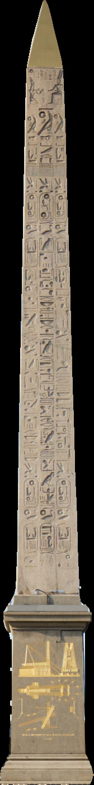
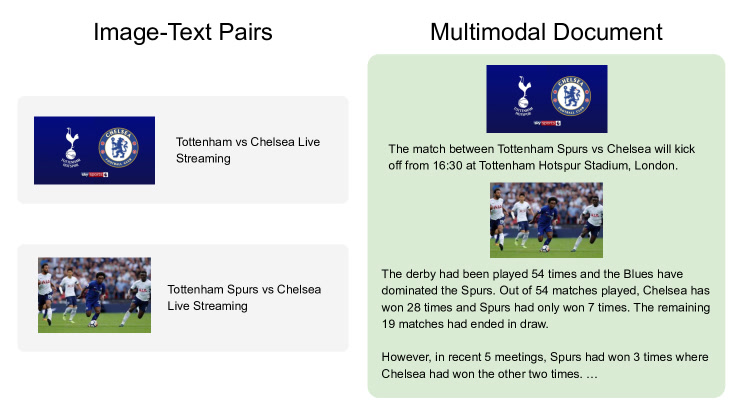

# OBELICS：把 1.41 亿篇「图文混排网页」洗干净开源

> 零基础可读精读笔记。数字来自 arXiv:2306.16527 原文 Table 1、Figure 2–7 及 §3–5。

## 一句话讲什么（TL;DR）

HuggingFace **OBELICS** 从 Common Crawl 抽出 **1.41 亿** 英文网页、**3.53 亿** 张图、**1150 亿** text token，按 **DOM 原生顺序** 保留「段–图–段–图」交错结构；在此上训 **IDEFICS-80B** 后 **4-shot VQAv2 63.8%**，与闭源 **Flamingo-80B 63.1%** 打平——开源社区终于能复现 **M3W 式交错图文预训练**。

*所以这一节是想说：OBELICS 卖的不是新模型结构，而是 **Flamingo 缺的那本公开教材**。*

---

## 这是个什么场景

你刷一篇旅行攻略：先两段文字讲岚山，中间一张竹林图，下面又写汤豆腐并配图。你读第二张图时，**前后文已经告诉你这是餐厅**——图和段落的 **顺序** 就是语义。

若把同一页拆成 **「图 + 一句 alt 文本」** 对（LAION 路线），模型只见「一张竹林图配短句 bamboo forest」，**丢了「这是京都午餐攻略第 3 段」** 这种长程上下文。

**Flamingo（2022）** 证明：用 **网页级交错文档（M3W，4300 万页 / 1.85 亿图）** 预训练的多模态 LM，在 **VQA、少样本 in-context learning** 上碾压纯 image-caption 数据——但 **M3W 闭源**。外面的人只能训 LAION，**复现不了 few-shot 多图推理**。

**OBELICS** 要做的事：**把 M3W 同款「图文交织教材」做成 HuggingFace 公开数据集 + 过滤代码 + IDEFICS 模型**，让 OpenFlamingo、后续 VLM 有合法口粮。

*所以这一节是想说：场景是 **「真实网页阅读顺序」→ 多模态 LM 预训练**。*

---

## 之前的人怎么做的，为什么不够好

- **LAION-5B / COYO / ALIGN**：爬图 + **alt-text** 当 caption；规模大，但文本 **短、语法差、无段落上下文**。
- **Flamingo M3W**：交错文档 **最强**，但 **不公开** 采集细节与数据。
- **MMC4**：把 C4 文本与 HTML 里找到的图用 **CLIP 相似度 bipartite matching** 贴回去——**不是 DOM 原生顺序**，且 **585M 图仅 60.6% unique**（spam/广告图多）。
- **KOSMOS-1**：也用 **7100 万** 闭源交错页，外界无法审计过滤规则。
- **WIT 等百科源**：质量高但 **规模小**，领域偏。

**缺口**：开源界缺 **「大规模 + 原生 DOM 顺序 + 过滤规则全文档化」** 的交错图文集。

**MMC4 具体差在哪？** 论文对比：mmc4 **不限制每页图数**，大量页 **几十张无关广告图 + 极少正文**，不利于学 **图文对齐**；OBELICS **每文档最多 30 图**，**84.3%** 图像唯一率 vs mmc4 **60.6%**。

*所以这一节是想说：不是「有没有图」，而是 **图在文档里排第几、前后写了什么**。*

---

## 这篇论文的新想法

**核心观察**：image-text pair 把图从 **页面叙事** 里 **撕出来**；而 **interleaved document** 的 **结构本身** 监督模型学 **指代、多图推理、长文生成**。

**OBELICS 三原则**：

1. **从 Common Crawl 整页出发**（非图库），保留 **简化 DOM 后的出现顺序**。
2. **多级过滤 cascade**：节点（图）→ 段落（文）→ 文档 → **Responsible**（opt-out / NSFW）→ **三级去重**。
3. **用 IDEFICS 验证**：同架构 Flamingo + 公开数据，**80B 打平 Flamingo 80B**（Table 1）。

*所以这一节是想说：贡献 = **数据工程 + 开源复现**，不是新 attention 块。*

---

## 它分几步做的（方法）

<!-- paper-figures:begin -->



*上图说明：Figure 1（ar5iv 原图）（论文原图）。*


*上图说明：Figure 2（ar5iv 原图）（论文原图）。*



*上图说明：Figure 3（ar5iv 原图）（论文原图）。*
<!-- paper-figures:end -->


### 5.1 总览：Figure 2 六级漏斗

**输入**：Common Crawl **25 个 dump**（**2020-02 ~ 2023-02**）。

**输出**：**141M** 文档、**353M** 图、**115B** token。

**中间量级（原文 Figure 2 标注）**：

| 阶段 | 文档数 | 图像数 |
|------|--------|--------|
| 原始 CC 文本提取 | **412 亿** | — |
| 英文化 + 早期去重 + 质量分类后 | **11 亿** | — |
| 简化 HTML + 下载图后 | **11 亿** | **20 亿**（链接 36 亿，**55%** 下载成功） |
| 节点/段落/文档过滤后 | **3.65 亿** | **14 亿** |
| Responsible + 去重后（**OBELICS**） | **1.41 亿** | **3.53 亿**（**2.98 亿 unique**） |

*所以这一节是想说：从 **412B → 141M** 是 **刻意漏斗**，不是偷懒删数据。*

---

### 5.2 Step 1：收集 HTML（§3.1）

**输入**：25 dump 的 WARC/HTML。

**处理**：

1. 提取正文，丢弃 **质量极差** 页 → **412 亿** 文档。
2. **FastText** 语言分类，去掉非英文 → **删 63.6%**。
3. **MinHash** 文档去重 + **MassiveText 式** 重复段落/n-gram 过滤。
4. **Logistic regression** 质量分类器（正例 Wikipedia/OpenWebText，负例 CC 抽样）筛 **人写文本**。

**输出**：**11 亿** 文档 + 对应 HTML 源。

**人话**：先在 **万亿级垃圾堆** 里用 **语言+去重+「像不像人写的」** 三道筛，留下 **11 亿** 像文章的页——还没碰图片。

**为何在抽图之前做文本卫生？** 若先把 **非英文/洗稿/模板站** 放进 DOM 管线，后续 **下载 55% 图像** 的算力会浪费在 **必删文档** 上。论文把 **MassiveText / Gopher 同款** 去重前置，与 **LLaMA 1.4T 语料** 工程 **同族**——读者可把它理解成 **「C4 的图文加长版前置步骤」**。

*所以这一节是想说：与纯文本 LLM 语料（C4/RedPajama） **共用同一套文本卫生学**。*

---

### 5.3 Step 2：简化 HTML / DOM 清洗（§3.2）

**动机**：原始 HTML **90%+ 是导航、广告、脚本**；但 DOM 树对 **「这段字紧挨着哪张图」** 至关重要，不能整页转纯文本。

**处理**（人工 inspect 各 tag 后定规则）：

- **保留**：段落、标题、列表、正文 `` 等。
- **剔除**：nav、sidebar、script、style、广告模板。
- **操作**：tag unwrapping、node removal、特定节点改写。

**输出**：简化 HTML **体积 < 原文件 1/10**，spam/logo 图大量消失，**正文结构保留**。

**DOM 人话**：浏览器把 HTML 解析成 **树**；**深度优先遍历顺序** = 用户从上往下看到的 **段–图–段** 顺序。OBELICS **按此顺序 flatten**，而非事后用 CLIP 把图「贴」到段落后。

**tag 规则举例（Appendix A.1 精神）**：`<script>/<style>/<nav>` **整棵子树删除**；`<a>` 若仅包一张小 icon **unwrap 保留 img**；连续 `<br>` **折叠为段落边界**。人工 **逐 tag 审计** 数百页后固化规则——这是 **工程论文** 的核心智力劳动，不是端到端学出来的。

*所以这一节是想说：相对 MMC4 的 **最大差异** 在 **抽取哲学**，非后处理 trick。*

---

### 5.4 Step 3：序列化为交错文档（§3.3）

**输入**：简化 HTML。

**处理**：

1. 按 DOM 顺序提取 **文本块** 与 **`` URL**。
2. 利用 tag 边界保留 **换行/段落分隔**（`<p>`、`<br>` 等）。
3. 批量下载图片：**36 亿** 链接 → **成功 ~20 亿（55%）**。

**输出格式**：线性序列 `[text_1, img_1, text_2, img_2, …]`，即训练时 LM 看到的 **multimodal document**。

**训练侧用法（§5.7）**：段落 token 化进 LLaMA；图像经 **OpenCLIP ViT** → Perceiver 池化 → **cross-attention** 插入文本流——与 Flamingo 相同 **「读网页」** 接口。

**失败下载怎么处理？** 链接 404、403、超时占 **45%**；对应 slot **跳过或仅留 alt 文本**（若 DOM 中有）。最终文档 **允许「纯文本段」** 但 **无图整页已在 Step 4 丢弃**——保证训练样本 **图文共现**。

*所以这一节是想说：序列化一步 **锁定 Fig.1 左「整页叙事」vs 右「alt 一句」** 的对比。*

---

### 5.5 Step 4：两级过滤（§3.4）

#### 4a 节点级（图）

- 丢弃 **过小/过大/极端长宽比** 图。
- URL 含 `logo` 等 ** banned substring** 的图去掉。

#### 4b 段落级（文）

- 词数过少、**重复率**过高、特殊字符过多。
- **停用词比**过低、标点比异常。
- 成人/不当 **flagged words** 比例高。
- **KenLM perplexity**（Wikipedia 训练）过高 → 不像正常文章。
- **社交分享 boilerplate** 词表匹配（「Share on Facebook…」）。
- **常见词比例**过低 → 疑似机器生成。

#### 4c 文档级

- **无图** 或 **图过多**（上限 **30 张/文档**）整页丢弃。
- 段落级规则 **更严 cutoff** 再跑一遍。

**输出**：**3.65 亿** 文档、**14 亿** 图（跨文档可重复）。

**perplexity 过滤器人话**：用 Wikipedia 训练的 **5-gram KenLM** 给段落打分；分数极高 = **像随机字符或 SEO 垃圾**。OBELICS 最终文本 perplexity 分布 **贴近 The Pile**（Fig.5），说明 **段落级过滤有效**，不是只删图不删字。

**每文档 ≤30 图的依据**：Fig.4 显示 mmc4 **大量文档堆几十上百张无关图**（广告轮播）；OBELICS **硬 cap** 后 **median 仅 1 图**，分布 **更利于学「一段正文 ↔ 一张主图」**。

*所以这一节是想说：过滤 **分粒度**，避免「一整页因一个垃圾段落报废」或「广告图污染」。*

---

### 5.6 Step 5：Responsible + 去重（§3.5）

**Responsible filtering**：

- **Spawning API**：剔除创作者 **opt-out AI 训练** 的图。
- **NSFW 分类器**：含色情图的 **整文档** 删除；URL 黑名单。

**去重**：

| 级别 | 规则 | 效果 |
|------|------|------|
| 图像 URL | 全库出现 **>10 次** 的图删除（保留少量重复以保留不同上下文） | 去浏览器图标/通栏广告 |
| 文档 URL | 同 URL 簇保留 **最新** | 转载站 |
| 文档图像集 | 图像集合完全相同 → 簇内留一 | 镜像站 |
| 段落 | **同 domain** 内 exact 段落 dedup | **~15%** 文本删（页脚 spam） |

**最终**：**141M docs / 353M imgs / 298M unique imgs / 115B tokens**。

**Spawning API 是什么？** 创作者在 **Have I Been Trained** 等平台 **登记 opt-out**；爬取时用 API **批量查图 URL** 是否在黑名单。这是 **2023 年后 Web-scale 数据集的标准合规步骤**，OBELICS **写进 pipeline** 而非附录免责声明。

**同 domain 段落 dedup 15%**：许多站 **页脚共享「Subscribe to newsletter」**；只在 **同一域名** 内 exact match 删段落，避免 **误删正当引用**（不同站转载同一引语仍保留）。

*所以这一节是想说：伦理与质量 **写进 pipeline**，不是事后声明。*

---

### 5.7 Step 6：IDEFICS 验证训练（§5）

**架构**（follow Flamingo）：

- **冻结** LLaMA（语言）+ OpenCLIP（视觉）。
- **可训** cross-attention Transformer 连接二者。
- **Perceiver Resampler**：把 **变长视觉 token** 压成 **固定数量 latent**，再 **cross-attn 注入** LLaMA 层——与 Flamingo **同构**。
- 目标：**next-token CE**；交错文档 = 段落 token + 视觉 token 交替。

**序列打包差异**：

| 数据类型 | 训练序列形态 |
|----------|--------------|
| OBELICS 文档 | `[段文本 tokens…][视觉 tokens…][段文本…]…` 按 DOM 顺序 |
| LAION pair | **pack** 成 `[caption tokens][视觉 tokens]` 短序列 |

Figure 7 控制 **总 token 数相同** 比较三种混合——因此 **OBELICS 路径每 step 见到的 **图像数更少** 但 **文本上下文更长**。

**数据混合（80B 对标 Flamingo）**：

- LAION image-text pairs + 公开 caption 集 + **OBELICS** + Wikipedia 交错页（同样 DOM 抽取）。

**9B 消融（Figure 7，aggregated 4-shot）**：

- **LAION only**：VQA 先升后 **降**（过拟合 caption 式短对齐）。
- **OBELICS only**：曲线 **稳定上升**，**同样 token 数下少一个数量级图像** 可达相近性能——长文本上下文 **更省图**。
- **OBELICS + LAION mix**：**全程最高**；**~16.6B token** 附近 aggregated score **~0.59**（mix）vs LAION **~0.48** 震荡。

**与 OpenFlamingo（mmc4 + LAION，9B，~32M 图 mid-training）**：

| 指标 | OpenFlamingo | OBELICS mix |
|------|--------------|-------------|
| COCO CIDEr 4-shot | **74.3** | **83.1** |
| VQAv2 4-shot | **44.0** | **52.3** |

**评测协议**：**in-context learning**，**4-shot / 8-shot priming**；与 Flamingo 相同 **VQA acc / CIDEr / ROC-AUC** 指标；Flamingo-80B 额外 **prompt ensembling**（OBELICS 未用）。

*所以这一节是想说：数据集价值用 **同架构 LM** 在 **公开 benchmark** 上 **可证伪**。*

---

### 5.8 流程 ASCII

```
Common Crawl 25 dumps (412B docs)
    → FastText EN + MinHash + quality LR → 1.1B HTML
    → DOM simplify (<10% size) → interleave extract + download 55%
    → node/para/doc filter → 365M docs / 1.4B imgs
    → opt-out + NSFW + dedup → OBELICS 141M / 353M / 115B tok
              │
    IDEFICS (LLaMA + OpenCLIP + cross-attn)
    train on OBELICS ± LAION → Table 1 vs Flamingo-80B
```

*所以这一节是想说：论文 **一半篇幅是 §3 pipeline**，**一半是 §4 统计 + §5 IDEFICS**。*

---

## 关键数字（What works）

### 数据集规模（Table / Fig.3）

| 数据集 | Docs | Images | Unique img% | Tokens | Open |
|--------|------|--------|-------------|--------|------|
| M3W (Flamingo) | 43M | 185M | — | — | ✗ |
| mmc4 | 103M | 585M | 60.6% | 43B | ✓ |
| **OBELICS** | **141M** | **353M** | **84.3%** | **115B** | ✓ |

### 文档形态（§4.1）

| 统计量 | 数值 |
|--------|------|
| 每文档图像 **中位数** | **1** |
| 每文档 token **中位数** | **677** |
| 每文档图像 **上限** | **30** |
| 全库 unique 图像 | **298M / 353M** |

### 人工质检 250 页（§4.3）

| 项目 | 比例 |
|------|------|
| 照片类图像 | **80%** |
| 图像与正文 **明确相关** | **90%** |
| 含人脸 | **46%** |
| 过滤漏网（spam/非英等） | **7%** |
| NSFW（抽检） | **0** |

### IDEFICS-80B vs Flamingo-80B（Table 1，in-context）

| Task | Metric | Ours 4-shot | Flamingo | Ours 8-shot | Flamingo |
|------|--------|-------------|----------|-------------|----------|
| VQAv2 | acc | **63.8** | 63.1 | **64.7** | 65.6 |
| OKVQA | acc | 54.1 | **57.4** | 56.3 | **57.5** |
| TextVQA | acc | 34.6 | **36.5** | 35.4 | **37.3** |
| COCO | CIDEr | **106.5** | 103.2 | **112.0** | 108.8 |
| HatefulMemes | AUC | 59.1 | **68.6** | 59.5 | **70.0** |
| Flickr30k | CIDEr | 70.3 | **75.1** | 72.8 | **78.2** |

→ **VQA / COCO 互有胜负**；Flamingo 用 **闭源 pair 数据 + prompt ensembling**，OBELICS 仍 **整体可比**。

*所以这一节是想说：数字证明 **「开源交错文档 ≈ M3W」**，不是略逊一档的替代品。*

---

## 实验结果说明了什么

1. **交错 > pair（VQA）**：OBELICS-only 9B **aggregated 4-shot** 全程高于 LAION-only；pair 数据使 VQA **中后期退化**（Figure 7）。
2. **长上下文更省图**：达相近性能 **所需图像少 ~10×**（同 token 预算）——段落上下文 **代替** 部分视觉监督。
3. **mix 最优**：OBELICS + LAION **> 单源**，与 Flamingo 原文 **mix M3W + pairs** 一致。
4. **80B 可复现 Flamingo**：Table 1 **4/8-shot** 与 Flamingo-80B **同量级**，验证 **数据是瓶颈**。
5. **优于 mmc4 路线**：同 9B ~32M 图，CIDEr **83.1 vs 74.3**，VQAv2 **52.3 vs 44.0**。
6. **perplexity 分布**：OBELICS 文本 perplexity **接近 The Pile**，优于 c4/mmc4/OSCAR（Fig.5）——**过滤有效**。
7. **局限诚实**：caption/OCR/HatefulMemes 上 **pair 数据仍略优**——alt-text 像 **模糊分类标签**，对 **单图分类式任务** 仍有用。

*所以这一节是想说：实验链 **pipeline 统计 → 9B 消融 → 80B 对标 → mmc4 对比** 闭合。*

---

## 你应该懂的几个新词

- **Interleaved image-text**：图与段落在 **真实阅读顺序** 中交替出现。
- **DOM**：HTML 的树结构；**遍历顺序 = 抽取顺序**。
- **Alt-text**：`` 属性，LAION 主要监督信号，**短且常非语法句**。
- **M3W**：Flamingo 闭源 **Multimodal Massive Web** 数据集。
- **Cross-attention（Flamingo 式）**：文本 token **查询** 视觉 token，把图 **插入** 语言模型层间。
- **In-context learning / few-shot**：prompt 里给 **K 个示例**，不更新权重即做 VQA/caption。
- **MinHash + LSH**：文档指纹 + 近似最近邻，**大规模去重**标配。

*所以这一节是想说：读 **OpenFlamingo / Idefics2 / LLaVA-NeXT** 都会再遇到 **OBELICS 或 mmc4** 二选一。*

---

## 它有什么搞不定的

1. **仅英文**：FastText 英筛；多语网页 **直接丢**。
2. **新闻域偏置**：高频 domain **新闻站最多**（Table 3）——百科/论坛 **相对少**。
3. **7% 过滤漏网**：人工 250 页仍有 spam/非英残留。
4. **人脸/水印**：**46%** 页含人脸；**3%** 水印——下游需 **额外合规**。
5. **下载成功率 55%**：死链、防盗链导致 **大量图缺失**。
6. **80B 未完全训完**：论文注明 checkpoint **后续更新**，Table 1 数字 **可能微调**。
7. **算力**：复现 IDEFICS-80B **非实验室级**；多数团队 **只消费数据、训小模型**。
8. **caption 任务略输 Flamingo**：纯 pair 预训练对 **CIDEr/Flickr** 仍有 **结构优势**。

*所以这一节是想说：OBELICS 是 **预训练语料**；任务特化仍要 **混 LAION 或指令数据**。*

---

## 它和别的几篇是什么关系

- **直接对标**：**Flamingo**（M3W 闭源）→ OBELICS **开源替代**。
- **横向对比**：**MMC4**（CLIP 贴图）、**LAION**（pair）、**WIT**（百科）。
- **primer 链（Ch VII）**：**ImageBind**（六模态对齐）→ **OBELICS**（图文 **数据**）→ **AnyMAL**（多模态 **进 LLaMA**）。
- **下游**：**IDEFICS / Idefics2 / OpenVLA**（曾试 IDEFICS backbone）、**OpenFlamingo**。
- **具身间接**：VLA 的 VLM 骨干（LLaVA、OpenVLA）**预训练语料** 常含交错 Web 文档——**模型能不能「看说明书图+文」** 取决于是否见过 OBELICS 类数据。

*所以这一节是想说：OBELICS 在栈里位置是 **Multimodal Ecology 的数据层**，非机器人控制。*

---

## 和本导读的关系

对应 **[Ch18: 多模态](../guide/ch18-multimodal.md)** **Part 1** 生态，以及 **Topic VII Multimodal Ecology** primer 第 2 篇（ImageBind → **OBELICS** → AnyMAL）。建议路径：

1. Ch18 §18.2 回顾 **CLIP**（理解 pair 对齐上限）；
2. 读 **Flamingo** 笔记 §数据（M3W 动机）；
3. 读本笔记 §5.3–5.6（DOM + 过滤）；
4. HuggingFace **obelisc_visualization** 看 3 条真实样本；
5. Ch18 §18.4 **AnyMAL**（数据进 LLM 的下一环）。

*所以这一节是想说：Ch18 讲 **模型怎么绑模态**；OBELICS 讲 **绑之前喂什么**。*

---

## 思考题

**Q1：为何 OBELICS 坚持 DOM 顺序，而 MMC4 用 CLIP matching？**

<details>
<summary>提示</summary>

§2 Related：mmc4 **后贴图**；OBELICS **原生叙事顺序** = 指代与多图推理信号。

</details>

**Q2：Figure 7 为何 LAION-only 的 VQA 会「先升后降」？**

<details>
<summary>提示</summary>

Caption 像 **短问答标签**，早期 helpful，长久 **损害需要段落上下文的 VQA**。

</details>

**Q3：为何全库出现 >10 次的图要删，但允许少量重复？**

<details>
<summary>提示</summary>

§3.5：>10 次多为 **图标/广告**；少量重复时 **周围文本不同**，上下文仍多样。

</details>

**Q4：115B token 但 353M 图，和 LAION 2B pairs 怎么比「效率」？**

<details>
<summary>提示</summary>

Figure 7：**同 token 预算** 下 OBELICS **需少 ~10× 图** 达相近 aggregated perf。

</details>

**Q5：Table 1 HatefulMemes 为何落后 Flamingo 较多？**

<details>
<summary>提示</summary>

Meme **需 OCR+讽刺**；pair caption **像分类标签** 更贴；OBELICS **混训仍弱于 Flamingo ensembling**。

</details>

**Q6：对具身 VLA，OBELICS 最大启发是什么？**

<details>
<summary>提示</summary>

机器人 **操作手册/网页教程** 也是 **图文交织**——数据采集应 **保序**，而非只截屏+单句描述。

</details>

**Q7：Spawning opt-out 过滤说明什么产品伦理？**

<details>
<summary>提示</summary>

§3.5 **Responsible filtering**：大规模爬取 **必须尊重创作者 AI 训练拒绝权**。

</details>

**Q8：median 1 图/677 token 说明文档长什么样？**

<details>
<summary>提示</summary>

§4.1：典型页 **一篇短新闻/博文 + 一张主图**，非图集站；与 mmc4 **多图 spam 页** 对比。

</details>

---

## 一些好奇心问答（FAQ）

**Q：OBELICS 名字怎么拼？**

**A**：**O**pen **B**imodal **E**xamples from **L**arge f**I**ltered Snapshots of **C**ommoncrawl——官方缩写 **OBELISC**（少一个 I），slug 用 `obelics`。

**Q：和 IDEFICS 什么关系？**

**A**：**IDEFICS** = 在 OBELICS（+LAION 等）上训的 **Flamingo-like 模型**；数据是 **锅**，模型是 **菜**。

**Q：能直接当 LLaVA 预训练数据吗？**

**A**：格式不同——LLaVA 主用 **指令微调 pair**；OBELICS 是 **自回归 web document**，更贴 **Flamingo/OpenFlamingo** 管线。

**Q：哪里看样本？**

**A**：https://huggingface.co/spaces/HuggingFaceM4/obelisc_visualization ；数据集 **HuggingFaceM4/OBELICS**。

*所以这一节是想说：FAQ 覆盖 **名字、IDEFICS、与 LLaVA 分工、入口链接**。*

---

## 如果你想再深入

1. **可视化 Space**（必看）：原网页 vs 抽取序列对照。
2. **先修**：`notes/flamingo.md` §M3W；`notes/imagebind.md`（primer 前一篇）。
3. **复现代码**：https://github.com/huggingface/OBELISC
4. **对比读 mmc4 数据卡**：理解 **CLIP matching vs DOM**。
5. **下游**：Idefics2 技术报告看 **OBELICS 在 2024 混合语料中的占比**。

*所以这一节是想说：OBELICS **看 5 条可视化样本** 胜过死记过滤阈值。*

---

## 原文信息

```bibtex
@inproceedings{laurenccon2023obelics,
  title={OBELICS: An Open Web-Scale Filtered Dataset of Interleaved Image-Text Documents},
  author={Lauren{\c{c}}on, Hugo and Saulnier, Lucile and Tronchon, L{\'e}o and others},
  booktitle={NeurIPS Datasets and Benchmarks Track},
  year={2023},
  note={arXiv:2306.16527}
}
```

- **arXiv**：https://arxiv.org/abs/2306.16527
- **Dataset**：https://huggingface.co/datasets/HuggingFaceM4/OBELICS
- **Code**：https://github.com/huggingface/OBELISC

*所以这一节是想说：cite 时区分 **OBELICS 数据集** 与 **IDEFICS 模型**。*

---

## 架构一图（ASCII）

```
   Common Crawl ──► 1.1B EN HTML ──► DOM simplify ──► interleave+download
                           │                                    │
                           ▼                                    ▼
                    text hygiene                         365M / 1.4B imgs
                  (MinHash, LR…)                              │
                           │                         filter + dedup + NSFW
                           └──────────────┬───────────────────┘
                                          ▼
                              OBELICS 141M · 353M · 115B tok
                                          │
                         IDEFICS-9B/80B (Flamingo arch)
                                          ▼
                    VQAv2 63.8 · COCO CIDEr 106.5 (4-shot, 80B)
```

*所以这一节是想说：一图串起 **漏斗 → 数据集 → IDEFICS → Table 1**。*
