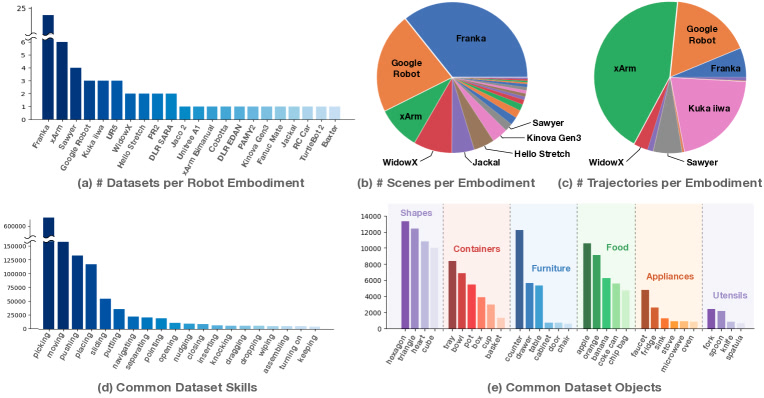
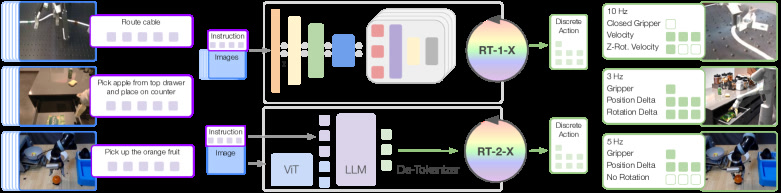

# Open X-Embodiment：22 种机器人的「ImageNet 时刻」

> 这是一份给「完全没接触过机器人学习」的读者写的精读笔记。专业词第一次出现都会解释，并用生活场景打比方。数字均来自 arXiv:2310.08864 原文。

## 一句话讲什么（TL;DR）

**21 家机构**把 **60 个子数据集、22 种机器人形态**统一成 **RLDS 标准格式**，凑出 **100 万+ 真机轨迹**；再用 **RT-1-X / RT-2-X** 混训证明：**多机器人数据一起学，比每家只学自己的数据更好**——小数据域平均成功率 **高约 50%**，大数据域 **涌现技能** 成功率 **约 3 倍**。

*所以这一节是想说：OXE 不是又一个大模型 trick，而是给机器人界补「ImageNet 级数据池 + 正迁移证据」的基础设施。*

---

## 这是个什么场景

想象全球有 **22 家方言各异的餐厅**：有的只做川菜、有的只做日料，每家自己记菜谱——字体、单位、步骤编号全不一样。以前你想当「万能厨师 AI」，只能进一家店学徒，换店就要从零学起。

**Open X-Embodiment（OXE，开放跨形态数据集）** 干了两件事：

1. **统一菜单模板（数据格式）**：不要求换厨房设备，但规定「每道菜怎么记字段」——图像、关节状态、动作、语言指令、元数据，全部转成 **RLDS**（Reinforcement Learning Datasets，Google 推的机器人数据标准，类似 Excel 固定列名）。
2. **合订本 + 通吃教练（RT-X）**：把 **100 万+ 段**「练手录像」打包公开，训 **RT-1-X**（35M 小模型）和 **RT-2-X**（55B 视觉-语言-动作大模型），在 **6 台真机、3600 次评测** 上验证：**混多家数据训出来的策略，比「只看自家录像」训的更强**。

这就是机器人版的「骑过自行车再骑电动车更快」——叫 **正迁移（positive transfer）**：A 形态的数据帮 B 形态学得更好，而不是互相干扰。

*所以这一节是想说：OXE 解决的是「数据孤岛 + 格式方言」，并第一次在大规模上证明跨形态混训值得做。*

---

## 之前的人怎么做的，为什么不够好

- **各实验室自采自训**：UCB 的 Bridge、Google 的 RT-1、Stanford 的 ALOHA……数据格式互不兼容，模型只能绑死在一台机器人上。
- **形态差太大看似没法共享**：单臂 6 自由度、双臂 14 自由度、夹爪 vs 灵巧手、相机俯角五花八门——「凑一起训会不会越训越乱？」长期没有定论。
- **单数据集规模小**：除 Google Everyday Robots 等少数大户，多数实验室每个任务只有 **几百条** 演示，行为克隆（BC，Behavioral Cloning，即「看示范模仿动作」）泛化靠运气。
- **CV/NLP 早已「预训练 + 微调」**：ImageNet、Common Crawl 让视觉和语言模型起飞；机器人界一直缺可下载、可混训的 **异质大数据池**。
- **RoboNet 等先驱规模不够**：早期跨机器人聚合尝试过，但 **形态数、机构数、标准化程度** 都未到 OXE 量级。

*所以这一节是想说：不是没人想过聚合，而是缺「足够大 + 足够标准 + 足够多样 + 实验证明有用」四件套——OXE 一次性补齐。*

---

## 这篇论文的新想法

**核心赌注**：机器人形态不同没关系，只要把「观测 + 动作」粗对齐成统一接口，**多形态数据混训会产生正迁移**，且 **模型越大，越吃得下这种异质性**。

三个关键决策：

1. **统一格式，不统一硬件**：22 种机器人照旧，数据 **ETL 进 RLDS**，不要求换臂、换相机。
2. **粗对齐，不强行精细对齐**：动作统一成 **7 维末端执行器（EEF）** 向量 + 终止位；**不**对齐各数据集的坐标系、绝对/相对控制混用——让模型自己学「同一数字在不同机器上含义不同」。
3. **用现成 VLA 架构当承接器**：不重造模型，直接 **RT-1 / RT-2** 架构 + **OXE mixture** 共训，隔离「数据贡献」与「架构创新」。

*所以这一节是想说：OXE 的 novelty 在 **社区数据工程 + X-embodiment 实验设计**，不在新网络结构。*

---

## 它分几步做的（方法）

<!-- paper-figures:begin -->



*上图说明：Figure 1（ar5iv 原图）（论文原图）。*



*上图说明：Figure 2（ar5iv 原图）（论文原图）。*
<!-- paper-figures:end -->

### 5.1 数据侧：Open X-Embodiment Repository

**输入**：全球 **34 个实验室**已有的 **60 个**机器人学习子数据集（抓取、推送、遥操作演示等）。

**处理**：

1. 各机构按 **RLDS schema** 转换：每条轨迹含 **图像、机器人状态、动作、语言指令、元数据**；支持不同数量的 RGB / 深度 / 点云字段。
2. 托管于 **Google Cloud Storage**，配 **TFDS / 多框架 dataloader** 与示例代码。
3. 持续社区扩展——论文发布时 **22 种 embodiment**，摘要写 **527 种技能、160,266 个任务**；轨迹 **1M+**。

**输出**：可下载的 **Open X-Embodiment Dataset** + 分析页面（robotics-transformer-x.github.io）。

**RLDS 人话**：像规定「每行是一个时间步、列名固定」的 Excel——Google 为 RL 数据定的 **tfrecord 序列化标准**，OXE 选它因为 **社区已接受、并行加载快**。

**多样性（原文 Fig. 0 分析）**：

- **Franka** 子集最多 → **场景视觉多样性**最高（不同实验室 Franka 数据集多）。
- **xArm / Google Robot** 贡献 **轨迹条数**最多。
- 用 **PaLM** 从语言标注抽 **物体与行为**；技能长尾含 **擦拭、组装** 等，物体覆盖家电、食品、餐具。

*所以这一节是想说：OXE 的价值一半是 **1M 轨迹**，一半是 **可复用的 RLDS 管道**。*

---

### 5.2 粗对齐的观测与动作空间（IV-A）

**挑战**：22 种机器人 **观测模态、动作维度、控制频率** 各不相同。

**对齐策略（刻意「粗」）**：

| 组件 | 统一方式 | 保留的差异 |
|------|----------|------------|
| **图像** | 每数据集选 **1 个 canonical 相机**，resize 到共同分辨率 | 相机位姿、内参、光照仍不同 |
| **语言** | 自然语言任务指令（各数据集原有标注） | 粒度、语言风格各异 |
| **动作** | **7 维 EEF**：$x,y,z$ + roll,pitch,yaw + 夹爪开度（或各量 **变化率**） | **不对齐** 各数据集坐标系；绝对/相对/速度控制 **按原数据集保留** |
| **历史** | RT-1 用 **15 帧**图像历史；RT-2 实验中有 **2 帧 history** ablation | 依模型而定 |

**动作离散化（token 化）**：

- 每维 **256 个 bin** 均匀划分；共 **8 维**（7 维运动 + **1 维 episode 终止**）。
- 各数据集动作 **先归一化再 discretize**；推理时 **按 embodiment 反归一化**——同一 token 在不同机器人上解码成不同物理幅度。

**人话**：不是把 22 台机器校准成同一坐标系，而是说「大家都用 7 个数字描述手怎么动」，但 **数字 128 在 A 机器可能是 5cm，在 B 机器可能是 10cm**——靠数据和模型容量消化。

*所以这一节是想说：粗对齐是 **刻意设计**——精细对齐成本高，且可能抹掉有用差异；OXE 赌 **大模型 + 大数据** 能学会「上下文解歧」。*

---

### 5.3 模型侧：RT-1-X 与 RT-2-X（IV-B）

#### RT-1-X（35M）

**输入**：15 帧图像历史 + **USE** 语言 embedding。

**处理**：

1. 每帧 → **ImageNet 预训练 EfficientNet**
2. 视觉 + 语言经 **FiLM** 层交织 → **81 个 vision-language token**
3. **Decoder-only Transformer** 自回归预测 **8×256 离散动作 token**

**输出**：下一时刻动作 token 序列 → 反离散化 → 7 维 EEF + 终止。

**与 RT-1 关系**：**同架构**；差别只在 **训练数据从单域 → X-embodiment mixture**。

#### RT-2-X（55B，PaLI-X 系）

**输入**：单帧或短历史图像 + 文本指令。

**处理**：

1. **ViT + UL2** 骨干，在 **WebLI** 等互联网规模 VLM 数据上预训练
2. 动作 token **当作另一种「语言」**——例如 `"1 128 91 241 5 101 127"` 这样的 text token
3. **Co-fine-tuning（共同微调）**：训练 batch 约 **1:1 混 VLM 数据与机器人 mixture**，防遗忘 web 知识

**输出**：自回归 text token → 解析为动作。

**架构 ASCII**：

```
[图像 + 语言指令]
        │
        ├─ RT-1-X: EfficientNet×15 + FiLM + Transformer(35M) → 离散动作 token
        │
        └─ RT-2-X: ViT + UL2 VLM(55B) co-fine-tune → 动作当 text token 输出
```

*所以这一节是想说：OXE 实验 **不重造架构**，用 RT-1/RT-2 当探针，测「数据 mixture 本身」能带来多少增益。*

---

### 5.4 训练 mixture 与推理（IV-C）

**Robotics mixture（实验时）**：来自 **9 种 manipulator** 的数据——RT-1、QT-Opt、Bridge、TARP、Jaco Play、Cable Routing、RoboTurk、NYU VINN、Austin VIOLA、Berkeley UR5、TOTO、Language Table 等子集。

**注意**：mixture 的 **9 embodiment < OXE 全集 22**——论文写明实验时数据集仍在扩展，当时 **只有这 9 类已就绪**；未来计划用 **扩展版 OXE** 继续训。

**训练目标**：标准 **分类交叉熵**（RT-1 对 bin；RT-2 对 language token 全集）。

**RT-1-X**：**仅** robotics mixture。

**RT-2-X**：robotics mixture + **原 RT-2 VLM 数据** 约 **1:1 co-fine-tune**。

**推理**：

- 频率 **3–10 Hz**（依各机器人原需求）
- RT-1 **本地**跑；RT-2 **云端**查询（网络延迟计入系统）

*所以这一节是想说：训练配方刻意贴近 RT-1/RT-2 原文，让性能差异 **主要归因于 X-embodiment 数据**。*

---

### 5.5 评测协议（3600 trials）

**问题 1 — In-distribution**：混训是否在 **各机构原有任务** 上超过「只训本域」？

- **小数据域（5 个）**：Kitchen Manipulation (Jaco Play)、Cable Routing、NYU Door Opening、Berkeley Autolab UR5、Robot Play——各用 **原论文机器人与评测**。
- **大数据域（2 个）**：Bridge（**WidowX**）、RT-1 六技能（**Google Robot**）。

**Baseline**：

1. **Original Method**：各数据集作者自己的 SOTA 模型（只训该数据集）。
2. **RT-1**：同架构但 **只训单 embodiment 数据**。

**问题 2 — OOD 泛化**：RT-2-X 在 **新物体/新背景/新环境** 上是否仍强？（沿用 RT-2 评测）

**问题 3 — Emergent Skills（涌现技能）**：在 **Google Robot** 上测 **Bridge 数据集（WidowX）里有的技能、Google 数据里没有的**——例如 Fig. 3 的 **摆放物体到指定位置** 类任务，看 **跨形态迁移** 是否发生。

**问题 4 — 设计 ablation**：模型规模（5B vs 55B）、图像 history、是否 co-train web、是否含 Bridge 子集、checkpoint 是否 web 预训练。

*所以这一节是想说：评测分 **「同任务涨分」** 与 **「没见过技能也会了」** 两档，后者才是 X-embodiment 的核心卖点。*

---

### 5.6 数据流一图（ASCII）

```
60 子数据集 (34  labs)
        │ ETL → RLDS
        ▼
Open X-Embodiment (22 embodiments, 1M+ traj)
        │ 粗对齐: 1 cam + 7D EEF + lang
        ▼
   ┌────┴────┐
   ▼         ▼
RT-1-X     RT-2-X (+ VLM co-fine-tune)
(35M)      (55B)
   │         │
   └────┬────┘
        ▼
  6 robots × 3600 eval trials
  (small-data 5 domains + large-data 2 + emergent)
```

*所以这一节是想说：整条 pipeline 是 **格式层 → 对齐层 → 现成 VLA → 分域评测**，社区可替换中间任意一环做 ablation。*

---

### 5.7 RT-1 历史帧与 token 预测细节（复现向）

**输入→处理→输出（单 control step）**：

1. **输入**：最近 **15 帧** RGB（每帧经 EfficientNet）+ 当前语言指令的 **USE 768 维向量**。
2. **FiLM 调制**：语言 embedding 作为 **scale/shift** 注入视觉特征——相当于「同一画面，指令不同则激活不同通道」。
3. **Token 序列**：15 帧 × 每帧若干 spatial token + 语言 token → 共 **81 个** multimodal token 送入 decoder。
4. **输出**：Transformer **自回归**预测 **8 个动作 token**（每 token 256 类分类）；训练用 **teacher forcing**，损失为 **8 维独立交叉熵之和**。
5. **执行**：取 argmax token → ** embodiment-specific 反归一化** → 发送给机器人 low-level controller（3–10 Hz）。

**与 RT-2 的关键差别**：RT-1 **不用** VLM 词表，动作 bin **专属 256×8 小词表**；RT-2 把 bin 映射进 **大语言模型词表**，因此 RT-2-X 必须 **co-fine-tune web 数据** 防 catastrophic forgetting。

**为何 15 帧 history？** 继承 RT-1 原论文——操纵任务中 **短程运动模糊**（手是否闭合、物体是否滑动）需 temporal context；Table II 显示 RT-2-X **5B + 2 帧 history** 远好于无 history，与 RT-1 设计哲学一致。

**采样与 batch 构成（概念层）**：每个 training step 从 mixture 中 **按数据集权重采样** trajectory——小数据集通常 **过采样** 以免被 Bridge / RT-1 等大户淹没；具体比例随实验配置，原文强调 **同一 mixture 用于所有对比** 以保证 RT-1 vs RT-1-X 公平性。社区复现时应在日志里 **固定 seed 与采样权重**，否则 emergent 数字可能对不齐表 II。

*所以这一节是想说：OXE 实验里 RT-1-X 是 **离散 BC + 短历史** 路线，RT-2-X 是 **VLA token 路线**——两条线共享 mixture，分工覆盖 **小模型可部署** 与 **大模型涌现**。*

---

## 关键数字（What works）

### 数据集规模

| 项目 | 数值 |
|------|------|
| 参与机构 | **21** |
| 子数据集 | **60** |
| Robot embodiments | **22** |
| 轨迹总数 | **1M+** |
| 技能数（PaLM 抽取） | **527** |
| 任务数 | **160,266** |
| 实验 mixture（当时） | **9** manipulators |
| 真机评测总量 | **3600 trials**，**6** robots |

### RT-1-X：小数据域（Fig. 2）

| 对比 | 结果 |
|------|------|
| RT-1-X vs Original Method | **5 个域中 4 个** RT-1-X 更高 |
| 平均提升 | 摘要：**~50% 相对成功率提升**（相对各机构原 SOTA） |
| 架构对照 | RT-1 与 RT-1-X **同网络** → 增益归因 **co-training mixture** |

### RT-1-X / RT-2-X：大数据域（Table I）

| 评测 | Original / LCBC | RT-1 | RT-1-X | RT-2-X (55B) |
|------|-----------------|------|--------|--------------|
| Bridge @ IRIS (WidowX) | 13% | 40% | 27% | **50%** |
| Bridge @ RAIL (WidowX) | 13% | 30% | 27% | 30% |
| RT-1 paper 6 skills (Google Robot) | — | 92% | 73% | **91%** |

**解读**：**RT-1-X 在数据丰富域 underfit**（35M 容量不够）；**55B RT-2-X** 才能在大域上 **匹配或超过** 单域 RT-1。

### Emergent Skills & 泛化（Table II，Google Robot）

| 配置 | Emergent Skills | OOD Generalization |
|------|-----------------|---------------------|
| RT-2（仅 Google 数据） | 27.3% | 62% |
| RT-2-X（全 robotics mixture） | **75.8%** | 61% |
| RT-2-X **去掉 Bridge** | 42.8% | 54% |
| RT-2-X 5B + history 2 | 44.4% | 52% |
| RT-2-X 5B 无 history | 14.5% | 30% |
| RT-2-X 5B **无 web 预训练** | **0%** | 1% |

**倍数关系**：Emergent 列 RT-2-X **75.8% vs RT-2 27.3%** ≈ **2.8×**（摘要写 **~3×**）。

*所以这一节是想说：小域靠 mixture 就赢；大域要 **55B + web 预训练**；涌现技能 **强依赖 Bridge→Google 跨形态迁移**。*

---

## 实验结果说明了什么

1. **正迁移真实存在**：不是理论猜想——在 **4/5 小数据实验室真机** 上，混训 RT-1-X 系统性超过各机构自家模型。
2. **容量门槛**：同样 mixture，**35M RT-1-X 在大数据域会 underfit**；说明 X-embodiment 不是「小模型随便混」，需要 **足够参数量** 才吃得下异质性。
3. **Web 预训练不可替代**：5B RT-2-X **从零训 robotics 仅 0% emergent**——VLM 骨干的 internet 知识是跨域泛化的底座。
4. **Bridge 子集关键**：去掉 WidowX 的 Bridge 数据，emergent 从 75.8% 掉到 42.8%——**跨形态技能迁移**有明确数据来源，不是魔法。
5. **History 有用**：5B 模型加 **2 帧历史** vs 无 history，emergent **44.4% vs 14.5%**——短 temporal context 帮助解析 ambiguous 动作。
6. **OOD 视觉泛化**：RT-2 与 RT-2-X 在 **新物体/背景** 上 **~61–62% 持平**——VLM 已强，mixture 主要补 **技能覆盖** 而非视觉 OOD。
7. **Infra > trick**：没有发明新 alignment 模块，**粗对齐 + 大模型** 就观察到 transfer——降低社区入场门槛。

*所以这一节是想说：OXE 实验回答「混训有没有用」为 **有**，并给出 **何时有用（小域/涌现）与何时不够（小模型大数据域）** 的分界。*

---

## 你应该懂的几个新词

- **Embodiment（具身/形态）**：机器人的物理本体——自由度、夹爪类型、相机配置。「X-embodiment」= 多种本体。
- **正迁移（Positive Transfer）**：A 域数据提升 B 域性能；反义 **负迁移** 是混训后变差。
- **RLDS**：TensorFlow 生态的 RL/机器人 **序列数据标准**，OXE 全部用它存储。
- **VLA（Vision-Language-Action）**：看图 + 听指令 + 出动作的统一模型；RT-2 是代表。
- **Co-fine-tuning**：VLM 数据与机器人数据 **同一训练阶段混合**，非先训 A 再训 B。
- **Emergent Skills（涌现技能）**：评估机器人 **从未在本体数据中出现、但在其他 embodiment 数据里有的技能**。
- **Behavior Cloning（BC）**：模仿学习——用示范 $(o,a)$ 对监督训练策略；OXE 上 RT-X 本质是 **大规模 BC**。
- **EEF（End-Effector，末端执行器）**：机械臂「手」的位置与姿态；OXE 粗对齐到 **7 维 EEF 动作**。

*所以这一节是想说：读 OXE 后应能解释「为什么 OpenVLA 可以站在 OXE 上训——因为格式与 mixture 哲学已铺好路」。*

---

## 它有什么搞不定的

1. **粗对齐的代价**：坐标系、控制模式未统一——同一动作向量在不同机器上 **语义不同**，小模型易 underfit，依赖 **反归一化 + 大数据** 硬学。
2. **实验 mixture 仅 9/22 embodiment**：全文 22 形态收录，但 RT-X 实验 **未用全集**——扩展版效果需后续工作验证。
3. **未测全新机器人 zero-shot**：只在 **已有数据 embodiment** 上评测，**新硬件免微调** 是否可行 **未回答**。
4. **无正迁移预测准则**：何时混训有益、何时 **负迁移**，论文 **未给决策表**。
5. **传感模态局限**：聚焦 **操纵臂 + RGB**；四足、触觉为主、射频等 **差异极大模态** 讨论有限。
6. **RT-2 云端依赖**：55B 模型 **网络推理**，延迟与成本阻碍边缘部署。
7. **数据质量参差**：聚合 **60 源** 必然含噪声、错误标注、分布偏移——清洗策略 **原文未细述**。

*所以这一节是想说：OXE 是起点不是终点——「通用机器人策略」仍缺 **新 embodiment 泛化理论** 与 **质量可控的 scaling law**。*

---

## 它和别的几篇是什么关系

- **承接 RT-1 / RT-2**：OXE **不换架构**，换 **训练数据池**；读 OXE 前应先懂 RT-1 token 化动作与 RT-2 VLA co-fine-tune。
- **数据先驱 BridgeData V2 / RoboNet**：Bridge 是 OXE 最大来源之一；RoboNet 是早期 multi-robot 尝试，规模与标准化不及 OXE。
- **下游 OpenVLA / Octo / π₀**：OpenVLA 直接 **OXE + Llama** 训开源 VLA；Octo 用 OXE 训 **通用 diffusion policy**；π₀ mixture 含 **9.1% OXE** 但仍依赖私有 dexterous 数据。
- **对照 DROID（2024）**：DROID 走 **统一硬件、极端场景多样性**；OXE 走 **异质聚合**——代表机器人数据的 **两条 scaling 路线**。
- **理念类比 ImageNet**：基础设施型贡献，价值在 **社区复用** 而非单点 SOTA trick。
- **仿真基准 LIBERO / SimplerEnv**：OXE 训 **真机策略**；LIBERO 等考 **算法泛化**——数据 vs 考试分工不同。

*所以这一节是想说：OXE 是 2023–2025 VLA 浪潮的 **数据母港**，后续模型论文多半应挂在这张关系图上读。*

---

## 和本导读的关系

对应 **[Ch21: 数据集全景](../guide/ch21-datasets.md)** §21.3 **Open X-Embodiment** 专节（跨形态聚合的 ImageNet）。建议路径：

1. Ch21 §21.1–21.2 理解 **机器人数据三重鸿沟** 与三时代划分；
2. 先读 `bridgedata-v2.md`（OXE 最大子集之一）；
3. 读本笔记 §5.2–5.5（RLDS + 粗对齐 + RT-X）；
4. 再读 `openvla.md` / `rt2.md` 看 **数据如何兑现为模型**；
5. 对照 `droid.md` 理解 **异质 vs 同质** 两条数据路线。

*所以这一节是想说：Ch21 讲「数据从哪来」，OXE 讲「全球数据怎么凑成一锅粥且证明好喝」。*

---

## 思考题

**Q1：为什么 OXE 选择「粗对齐」而不是把所有机器人校准到同一世界坐标系？**

<details>
<summary>提示</summary>

成本、可扩展性、以及「保留原控制模式」；想想 22 实验室是否愿意改底层控制器。

</details>

**Q2：RT-1-X 与 RT-1 架构相同，为何小数据域涨、大数据域跌？**

<details>
<summary>提示</summary>

35M 参数量 vs mixture 多样性；underfitting；Table I 与 Fig. 2 对比。

</details>

**Q3：去掉 Bridge 后 emergent 技能大幅下降，说明什么？**

<details>
<summary>提示</summary>

WidowX→Google Robot 的技能迁移通道；不是任意子集都有同等 transfer。

</details>

**Q4：5B RT-2-X 无 web 预训练 emergent 为 0%——机器人数据 alone 够吗？**

<details>
<summary>提示</summary>

Table II row (6)；VLM 视觉-语义与 language grounding 从哪来。

</details>

**Q5：OXE 的 RLDS 标准对 OpenVLA 训练 pipeline 意味着什么？**

<details>
<summary>提示</summary>

可复用 dataloader、字段一致、community 可 append 新 dataset 而不改模型代码。

</details>

**Q6：Emergent skills 评测与 in-distribution 成功率，哪个更能支撑「通用机器人策略」叙事？**

<details>
<summary>提示</summary>

前者测 **跨 embodiment 新技能**；后者测 **原任务 SOTA**——论文两者各回答一半。

</details>

**Q7：若你的实验室只有 500 条 Franka 演示，OXE 论文对你最直接的建议是什么？**

<details>
<summary>提示</summary>

混训 / fine-tune RT-1-X 或开源 descendant；小域 Fig. 2 的 positive transfer 证据。

</details>

**Q8：为什么 RT-2-X 在 OOD 视觉泛化上与 RT-2 持平，却能在 emergent skills 上 3×？**

<details>
<summary>提示</summary>

OOD 列测 **新物体/背景**——VLM 骨干已覆盖；Emergent 列测 **新技能组合**——需要 **其他 embodiment 的操纵示范**，mixture 才起作用。

</details>

---

## 一些好奇心问答（FAQ）

**Q：22 和 9 到底哪个数字对？**

**A**：**22** 是 OXE **仓库收录**的 embodiment 总数；**9** 是论文 RT-X 实验 **当时已处理进 mixture** 的 manipulator 数——数据集在论文后持续长大。

**Q：RT-2-X 动作为什么是 text token？**

**A**：RT-2 把离散动作 bin 映射成 **普通词表里的 token 串**，这样 **任意预训练 VLM** 都能用「预测下一个 token」同一套训练代码微调机器人，无需单独动作头。

**Q：OXE 和 ImageNet 真的一样吗？**

**A**：类比在 **「社区预训练底座」** 角色，不是规模——ImageNet 千万级图，OXE **百万级轨迹**，仍差数量级，但是机器人界 **当时最大跨形态聚合**。

**Q：我能否只下载 Bridge 子集而不下全 OXE？**

**A**：可以——60 子数据集 **可独立下载**；RLDS 格式统一，子集混合逻辑与全量相同。

*所以这一节是想说：读 OXE 时别被 embodiment 计数搞晕——**仓库规模** 与 **论文实验 mixture** 是两个层次。*

---

## 如果你想再深入

1. **官网**：https://robotics-transformer-x.github.io — 60 数据集分解、下载链接、checkpoint。
2. **先修**：`notes/rt1.md`、`notes/rt2.md` — 不懂 RT-1/RT-2 架构，Method 会飘。
3. **下游**：`notes/openvla.md` — 看 OXE 如何被 **开源社区** 消费。
4. **对照读**：`notes/droid.md` — 同质硬件极端多样性 vs OXE 异质聚合。
5. **动手**：用 RLDS dataloader 加载 Bridge 子集，打印单条 trajectory 字段——比三遍 PDF 更直观。

*所以这一节是想说：OXE 最适合 **「懂架构 + 跑 dataloader + 看 emergent 表」** 三角组合深读。*

---

## 原文信息

```bibtex
@inproceedings{padalkar2023open,
  title={Open X-Embodiment: Robotic Learning Datasets and RT-X Models},
  author={Padalkar, Abhishek and others},
  booktitle={IEEE International Conference on Robotics and Automation (ICRA)},
  year={2024},
  note={arXiv:2310.08864}
}
```

- **arXiv**：https://arxiv.org/abs/2310.08864
- **项目页**：https://robotics-transformer-x.github.io
- **联系**：open-x-embodiment@googlegroups.com

*所以这一节是想说：引用 OXE 时同时 cite **数据集仓库** 与 **RT-X checkpoint**，方便他人复现实验 mixture。*

---

## 架构一图（ASCII）

```
        ┌─────────────────────────────────────┐
        │   Open X-Embodiment (RLDS, 1M+)      │
        │   22 embodiments · 60 datasets       │
        └─────────────────┬───────────────────┘
                          │ 粗对齐 7D EEF + 1 cam
          ┌───────────────┴───────────────┐
          ▼                               ▼
    ┌───────────┐                   ┌───────────────┐
    │  RT-1-X   │                   │   RT-2-X      │
    │   35M     │                   │    55B        │
    │ EfficientNet+Transformer      │  PaLI-X VLM   │
    └─────┬─────┘                   └───────┬───────┘
          │                                 │
          ▼                                 ▼
   小数据域 +50% avg                   涌现技能 ~3×
   (4/5 domains win)                  (75.8 vs 27.3%)
```

*所以这一节是想说：一张图记住 **数据池 + 两档模型 + 两类增益（小域 SOTA / 跨形态涌现）**。*
