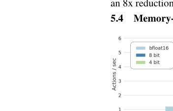

# OpenVLA: An Open-Source Vision-Language-Action Model

> 这是机器辅助生成的客观摘要笔记。教学版精读笔记由用户按节奏触发后单独成稿。

## 一句话讲什么（TL;DR）

把一个 7B 视觉语言模型直接微调成会动机械臂的开源通用策略，比 55B 的 RT-2-X 还强。

## 这篇论文要解决什么问题（Why this paper）

想象一个场景：你买了一台扫地机器人，希望它有一天能升级成"看一眼桌面 + 听一句话 → 把可乐递给我"的家用机器手。要做到这一步，机器人得同时具备三个能力：看懂场景、听懂指令、把这两者翻译成机械臂的动作。把这三件事压在一个网络里，就是 **VLA**（Vision-Language-Action，视觉-语言-动作模型）这条技术路线。

在 OpenVLA 出来之前，这条路线最强的模型叫 RT-2-X，但它有两个让外人没法跟进的问题：

- **闭源**：RT-2 / RT-2-X 这类 SOTA 模型不放权重、不公开数据配方、不公开训练代码——研究者拿不到，等于只能远观。
- **没人教怎么微调**：要把通用策略迁到自家实验室的机械臂上，需要一套高效的 fine-tune 配方（fine-tune，微调，指在通用模型上用少量自家数据继续训练让它适配特定任务），但已有论文几乎不讨论。

类比：好比有人造了一辆很厉害的赛车（RT-2），但既不卖给你，也不告诉你怎么改装去跑你家门口的山路。OpenVLA 的目标就是开一台**可买、可改、可跑在家用 GPU 上**的开源版本——而且不仅放出来，还要在公平比较下打赢闭源版。

### 它和你日常用的产品有什么关系

VLA 这条路虽然听起来很学术，但它其实是几类你已经见过的产品的"机器人版"：

- **LLaVA / GPT-4V 之于 ChatGPT** —— ChatGPT 一开始只会读字，后来加上一个"视觉编码器 + 投影层"就能看图答题。**OpenVLA 把这套加法又走了一遍**：在能看图答题的 VLM 上再加一层"动作翻译"，就变成会动机械臂的策略。
- **SayCan 之于扫地机器人 / 配送机器人** —— SayCan 这类**模块化系统**是先让 LLM 列计划，再调一堆专家小模型执行。OpenVLA 走的是反方向：**端到端**——一个网络从图直接吐动作，不分阶段，更像"司机直觉"，而不是"先查 GPS 再踩油门"两步。
- **特斯拉 FSD 端到端 v12** —— 2024 年特斯拉把感知 + 规划合成一个网络，这就是开车版的 VLA 思路。OpenVLA 是它在机械臂操作领域的对应物。理解 OpenVLA 后，再听 FSD 那套"从规则到神经网络"的叙事会顺很多。
- **HuggingFace 之于 BERT** —— 2018 年 BERT 一开源，整个 NLP 圈短短一年迁到预训练 + 微调范式。OpenVLA 的野心是给机器人圈造一个 BERT 时刻：**checkpoint 在 HuggingFace、训练 notebook 公开、消费级 GPU 可微调**——意图明显是想触发同样的连锁反应。

## 用了什么方法（How）


整体架构可以这样想：一台机器人要回答"现在该怎么动"，OpenVLA 就把这件事拆成"先看 → 再想 → 再说出动作"三段流水线，所有零件都是从 LLM 圈子里直接搬过来的。

### 1. 三段式 VLM 骨架（Prismatic-7B）—— 眼睛 + 翻译官 + 大脑

**类比**：想象你给一个不会说话的外国朋友看一张厨房照片，再问他"帮我拿杯子"。他得先用眼睛看（视觉编码器），把看到的画面翻译成脑内可处理的语言（投影器），再用脑子琢磨"杯子在哪、手该怎么伸"（LLM）。

**它在干什么**：把图像和指令同时拍扁成 LLM 能接受的"一长串 token"，然后让 LLM 像续写故事一样把后面几个动作 token 续出来。它本质上是**把机器人控制问题伪装成语言建模问题**，从而复用所有 LLM 工具链。

**Pipeline（图→动作 4 步）**：

1. 一张 224×224 RGB 图片 → DINOv2 + SigLIP 两个 ViT 各自切成 patch、过编码器，得到两串 patch 特征向量 → 沿通道维度拼接（concatenate）
2. 拼好的视觉特征 → 2 层 MLP 投影器 → 投到 Llama 2 词嵌入空间（4096 维）
3. 用户指令文本（"put the eggplant in the pot"）→ Llama 2 tokenizer → 一串文本 token embedding
4. [视觉 patch tokens] + [指令 tokens] → Llama 2 7B → 自回归输出 7 个动作 token（每步一个维度）

**关键超参 / 数字**：

- 视觉编码器规模：约 600M（DINOv2-L + SigLIP-SO400M 两条，特征沿通道拼）
- 投影器：仅 2 层 MLP（极简，几 MB 大小，但承担了"模态对齐"重任）
- LLM：Llama 2 7B，词表 32000，把最末 256 个最少用 token 改写成动作 token
- 输入分辨率：**224×224**（试过 384×384 但训练时间 ×3、性能没提升 → 选小的）

**为什么这么设计**：

- **不用 CLIP 单条**：CLIP 是"图文对齐型"特征，强在语义，弱在位置/几何。机器人要算"夹爪离杯子边缘几毫米"，必须有空间感——这是 DINOv2（自监督、保留空间结构）的强项。两个一起拼是 Prismatic 论文的发现，OpenVLA 直接复用。
- **不用 cross-attention 的复杂结构**：选了最简单的"patch-as-token"路线（把视觉 patch 当成普通 token 喂给 LLM），目的是**最大化复用 HuggingFace / FlashAttention / FSDP 工具链**。多一层结构 = 多一份工程负担。

**消融告诉我们什么**（§3.4 + Appendix D）：

- 用 IDEFICS-1 当骨架 → 多物体语言指代任务上 LLaVA 高 35%
- 用 LLaVA 骨架 → Prismatic 还能再高 ~10%（双视觉编码器的功劳）
- 也就是说 **VLM 骨架选对了直接送 ~45% 绝对成功率**——这一步选错，后面再怎么调也救不回来。

> 读到这里你可能在想：那这个"大脑"怎么吐机器人动作？它训练时学的可是吐英文单词。下面就是 OpenVLA 最巧妙的一招。

### 2. 动作 token 化 —— 把方向盘角度翻译成单词

**类比**：音量旋钮原本是无级旋转的连续刻度，现在改成 256 档按键——任何旋转角度都能对应到一个具体的按键。再进一步，把这 256 个按键命名成 256 个生僻汉字塞进字典里，这样语言模型就能像写句子一样"按键"。

**它在干什么**：把每一步的连续动作（7 维浮点）映射到 LLM 词表的离散 token 空间，让 LLM 用"下一个词预测"的标准训练目标（cross-entropy loss）就能学会输出动作。

**关键步骤**：

1. **统计每维分位数**：在整个训练集里，对每个动作维度（dx, dy, dz, droll, dpitch, dyaw, gripper）算第 1 百分位和第 99 百分位
2. **均匀切 bin**：把 [1%, 99%] 这段切成 256 个等宽小格子（bin）
3. **每个连续动作 → 整数 ∈ [0..255]**：落在第几格就编码成几
4. **覆盖词表**：找出 Llama tokenizer 里"最少用的 256 个 token"（一般是奇怪的 Unicode 组合或冷僻片段），把它们的 ID 直接当作动作 token 的 ID
5. **训练目标**：标准 next-token cross-entropy，但**只在动作 token 位置上算 loss**（图像 patch 和指令 token 不算）

**关键超参 / 数字**：

- 256 个 bin × 7 维 = 每步 7 个动作 token
- 用 1%-99% 分位数（不是 min-max）—— 防止某次"飞舞"动作把刻度拉大、让正常动作精度变粗
- 为什么不新增 token 而要"覆盖"？因为 Llama tokenizer 只预留 100 个 special token，不够 256 个用——直接覆盖最少用的反而干净

**为什么这么设计**：

- **简单 + 兼容**：覆盖词表后，整套 LLM 训练 / 推理基础设施（FlashAttention、FSDP、HuggingFace AutoModel）一行不改地全部复用。这是 OpenVLA 能做大的根本原因。
- **离散 vs 回归头的取舍**：另一条路是"加一个回归头直接吐 7 维浮点"（如 Octo 的做法）。回归头看起来更精准，但**没法借用 LLM 的预训练知识**——你新加的回归头是从零随机初始化的。token 化让 LLM 的全部 7B 参数都参与动作生成。

**如果换成别的方法**（论文未直接消融，但隐含在比较里）：

- 用 256 bin → 用 1024 bin：精度更高但词表占用更多、训练更难收敛
- 用 token → 用 diffusion head（如后来的 π0 / RDT-1B）：动作更平滑但失去 LLM 工具链兼容性，OpenVLA 在 §6 limitations 也承认这是未来方向

### 3. 970k 轨迹大杂烩 —— 全国各地学车视频混训

**类比**：教一个司机泛化到所有路况，最快的办法是给他看全国各地的行车记录仪——但前提是先把不同摄像头、不同车型的视频统一格式。

**它在干什么**：从 **Open X-Embodiment（OpenX）**（70+ 个机器人数据集统一格式）的 200 万条原始轨迹里，筛 + 加权出 970k 条，作为 OpenVLA 的训练底料。

**筛选 pipeline（2 步）**：

1. **格式过滤**：只保留**单臂 + 至少一个第三人称相机**的数据集，保证模型输入输出空间一致（不用处理双臂、不用处理不同视角的混合）
2. **混合权重**：沿用 Octo 的启发式 weight——多样性高的数据集（如 BridgeData V2、Fractal、Kuka）加权，重复或单调的下采样

**主要数据集占比（从 Appendix Table 3 摘）**：

- Bridge: 13.3%（WidowX 桌面操作）
- Fractal/RT-1: 12.7%（Google robot）
- Kuka: 12.7%（QT-Opt 抓取数据）
- DROID: 10%（但训练后 1/3 被剔除，权重重分配给其他集）
- BC-Z: 7.5%
- FMB: 7.1%
- Language Table: 4.4%
- Stanford Hydra: 4.4%
- 其他 18 个数据集合计 ~28%

**为什么这么设计**：

- **"diverse + clean"压过"large + dirty"**：作者特意提到对 Bridge 数据做了清洗（过滤掉所有 zero action 的帧——很多遥操作数据末尾会留一段静止）。仔细清洗的 970k 比脏的 2M 更有用。
- **不上多模态传感器**：只用 RGB，不用 proprioception（关节角度）/ 深度图——因为不同机器人的传感器配置千差万别，统一难度大；OpenVLA 把这块留给未来工作（论文 §6 明确提及）。

**消融 / 反例 - DROID 的挫败**：

- 加 DROID 后 action token accuracy 在 DROID 子集上一直拉不上去
- 训练后 1/3 把 DROID 剔除、权重重分配
- **这告诉我们**：7B 容量 + 970k 数据**还不够吃下所有数据多样性**——Scale 还有上升空间，但代价是更多算力。
- 这也是后来 π0、RDT-1B 等论文的一个隐含 motivation：扩 model size 或扩 data 质量。

> 读到这里你可能在想：既然底料是别人 Open-X 给的，模型骨架是 Prismatic 给的，那 OpenVLA 自己究竟做对了什么？答案是大量"反直觉的训练细节"。

### 4. 反直觉训练发现 —— 视觉编码器必须解冻 + 训 27 个 epoch

**类比**：常规 VLM 训练像找了个外语很厉害的同事让他帮你看图——你不希望他重新学外语（冻结），只让他帮你"理解"。但机器人不一样：他原来认得"杯子"是从淘宝商品图认得的，不知道杯子从你机械臂这个角度斜着看长什么样。所以你得让他**重新练眼睛**。

**它在干什么**：决定哪些权重训、训多少轮、用多大学习率。这部分是 OpenVLA 不开源就完全猜不到的"工程秘方"。

**关键决策表**：

| 设计选择 | 结论 | 反直觉点 |
|---|---|---|
| 视觉编码器是否冻结 | **解冻** | 常规 VLM 训练**冻结**反而更好，机器人反过来 |
| 训练 epoch 数 | **27 epoch** | 普通 LLM/VLM 只训 1-2 epoch；这里要训到 action token accuracy > 95% |
| 学习率 | **2e-5 固定** | 没用 warmup，也没用学习率衰减，跟 Prismatic 预训练保持一致 |
| 输入分辨率 | **224×224** | 试过 384×384 但训练时间 ×3 性能不动；机器人对分辨率不敏感 |

**为什么解冻视觉编码器是反直觉的**：

- 通常冻结的逻辑是"避免破坏预训练学到的稳定语义特征"
- 但作者推测：互联网图文学的特征**够语义、不够空间精度**——夹爪到杯子边缘 3mm 还是 5mm，CLIP/SigLIP 特征区分不出来
- 解冻后视觉编码器开始**为机器人控制重新学习空间细节**，这是从语义级别下沉到几何级别

**为什么训 27 epoch**：

- 普通 LLM 训练经常**只过数据 1 遍**因为数据量极大
- 970k 轨迹换算成 token 量比 LLM 预训练数据小 3-4 个数量级，所以模型还远没"吸饱"——多过几遍才能榨干
- 评判标准是 action token accuracy（在训练集上预测对动作 token 的比例）→ 95% 时停

**算力账单**：64 张 A100 × 14 天 = **21500 GPU 小时**，batch size 2048。以 A100 云租 2 美元/小时算，单次预训练 ≈ **4 万美元**。这是 OpenVLA 不开源就完全没法复现的护城河。

### 5. LoRA + 4-bit 量化 —— 给大模型装可拆卸的小补丁

**类比**：LoRA 像给西装**只换领口和袖口**——西装本体（预训练权重）不动，外面缝几个小补丁（低秩矩阵）适配新场景。量化则是**把高清照片压成小图发朋友圈**——肉眼看几乎一样，但文件小一半。

**它在干什么**：让微调和推理都能在消费级 GPU 上做，而不是只能租 8 张 A100 服务器。

#### LoRA 的具体做法

- 对 Transformer 的每个**线性层** `W` (形状 d×k)，旁路加两个小矩阵 `A`（d×r）和 `B`（r×k），总修改量是 `W' = W + B·A`
- 训练时**主网络 W 完全冻结**，只更新 A 和 B，r << min(d, k) 让参数量极小
- OpenVLA 默认 **r = 32**，可训参数量 = 97.6M（仅占 7B 模型的 **1.4%**）

**5 种微调策略对比**（Franka-Tabletop 33 rollouts）：

| 策略 | 成功率 | 可训参数 | 显存(batch 16) |
|---|---|---|---|
| Full FT（全量微调） | 69.7% | 7188M | 163.3 GB（需 2 卡分片） |
| Last layer only（只训最后一层 + token embed） | 30.3% | 465M | 51.4 GB |
| Frozen vision（冻视觉编码器） | 47.0% | 6760M | 156.2 GB |
| Sandwich（解冻视觉 + last layer） | 62.1% | 914M | 64.0 GB |
| **LoRA r=32** | **68.2%** | **97.6M** | **59.7 GB** ← 最佳折中 |
| LoRA r=64 | 68.2% | 195M | 60.5 GB（无收益） |

**这张表能告诉你 4 件事**：

1. **只训最后一层 30%** 远不够 → 视觉特征必须改
2. **冻结视觉 47%** 也不够 → 印证了"机器人需要解冻视觉"的发现
3. **Sandwich（视觉 + 最后层）62%** 接近，但没 LoRA 高 → 让所有层都有"补丁"才最灵活
4. **rank=32 vs rank=64 一样** → r 调大没用，32 已经足够"覆盖"机器人任务的低秩信息

#### 量化的具体数字

- **bfloat16（默认）**：15 GB 显存，**6 Hz** 推理（RTX 4090）→ 70.6% 成功率
- **int8**：~10 GB 显存，**1.2 Hz** 推理（A5000，量化算子开销超过省下的传输）→ **58.1%** 掉了一截
- **int4**：**~7 GB** 显存，**3 Hz** 推理（A5000）→ **71.9%** 几乎不掉

**为什么 int8 反而最差**：作者拆解后发现量化后 token 准确率没掉——掉的是**控制频率**。Bridge 数据集是按 5Hz 采集的，模型推理 1.2Hz 时机器人执行节奏完全错位（每个动作命令对应到 4 倍真实时间），系统动力学全乱。这是一个**只在闭环系统里才出现的非直觉现象**——离线评测看不出问题，上机就崩。

**为什么 int4 又好回来**：4-bit 权重传输量更小，**GPU 内存带宽节省 > 量化算子开销**，所以反而更快。这是底层硬件特性决定的——不同 GPU 上拐点不一样。

## 关键实验结果（What works）


每个数字背后都是真实物理机械臂上跑的成功率（不是仿真），所以"+10%"在这个领域已经是大新闻。

- **BridgeData V2 (WidowX) 17 任务 × 10 trials = 170 rollouts**：
  - 设置：5 类任务（视觉 / 运动 / 物理 / 语义泛化 + 语言指代），机械臂初始化在固定位置，必须先横向伸到目标物
  - 数字：OpenVLA **70.6%** vs RT-2-X 50.6% vs Octo 20.0% vs RT-1-X 18.5%
  - 现实意义：在你家厨房想做的"拿茄子放锅里"这种事——OpenVLA 10 次能成 7 次，RT-2-X 只能成 5 次，老一代 Octo 几乎只能成 2 次
- **Google Robot 12 任务 × 5 trials = 60 rollouts**：
  - 设置：5 个 in-distribution + 7 个 OOD（含未见物体、未见背景、未见对象关系，例如"把可乐放到 Taylor Swift 的照片旁边"）
  - 数字：OpenVLA **85.0%** vs RT-2-X 78.3% vs Octo 26.7% vs RT-1-X 33.3%
  - 现实意义：这台机械臂是 RT-2 论文的同款，OpenVLA 在 RT-2-X "主场"上还能赢 6.7 个百分点；OpenVLA 唯一弱于 RT-2-X 的项是"语义泛化"——后者用的 PaLI VLM 见过更多互联网图，认 Taylor Swift 比 OpenVLA 强
- **+20.4% vs Diffusion Policy（Franka-Tabletop fine-tune）**：
  - 设置：每任务 10-150 demo、129 rollouts 跨 7 个任务
  - 数字：OpenVLA 在多指令多物体任务上完胜，但在"把胡萝卜放碗里"这种**单指令窄任务**上不如 Diffusion Policy 平滑
  - 现实意义：你想做"叠衣服"这种动作高度精细的任务，Diffusion Policy 还是更稳；你想做"看指令操作不同物体"这种泛化型任务，OpenVLA 更强
- **LoRA rank=32 = 68.2% vs Full FT 69.7%**：
  - 设置：33 rollouts × 多个 Franka 任务
  - 数字：用 1.4% 参数、59.7GB 显存（vs 163.3GB）就追平全量微调
  - 现实意义：原本要租 8 张 A100 才能干的活，**单张 A100 + LoRA** 就够了——准入门槛降了一个数量级
- **6 Hz 推理 on RTX 4090，bfloat16 仅 15GB 显存**：
  - 设置：FP16 加载、单图输入、无 speculative decoding
  - 数字：4-bit 量化下显存再砍半（~7GB），性能不掉甚至略涨（int4 71.9% vs bf16 71.3%）
  - 现实意义：从"64 张 A100 训 14 天"跨到"一张 4090 推理"——这是宿舍能玩 vs 实验室能玩的差别
- **唯一一个**在所有 7 个 Franka-Tabletop 微调任务上成功率都 ≥50% 的方法。其他方法（Diffusion Policy / Octo）要么在窄任务厉害、要么在多指令任务厉害，但没有一个像 OpenVLA 这么"全面平均分高"——这是它作为**"默认起点"**最有说服力的证据。

## 数据集 / 实验设置详情


很多读者读论文最头疼的是"为什么这个数字可信"，下面把可信度的来源拆开。

### 训练数据

- **来源**：Open X-Embodiment（OpenX），70+ 个机器人数据集合并成统一格式（RLDS）
- **过滤**：单臂 + 至少一个第三人称相机的数据集 → 过滤后约 25 个数据集
- **混合权重**：沿用 Octo 的启发式（多样性高的加权）
- **最终规模**：970k 轨迹（vs RT-2-X 的 350k，约 2.8 倍）
- **额外操作**：DROID 加进来 10% 后训不动，最后 1/3 训练剔除

### 训练硬件 / 时长

- **GPU**：64 张 A100（80GB，全部 SXM4），用 FSDP（fully-sharded data parallelism）切模型
- **batch size**：2048（每张卡约 32）
- **训练时长**：14 天 = **21,500 GPU 小时**
- **优化器**：AdamW，lr=2e-5 固定，无 warmup
- **混合精度**：AMP（automatic mixed precision，PyTorch 默认）+ FlashAttention-2

### 评测设置

| 评测 | 机器人 | 任务数 | 每任务 trial | 总 rollout |
|---|---|---|---|---|
| BridgeData V2 直接评测 | WidowX | 17 | 10 | 170 |
| Google Robot 直接评测 | Google robot | 12 | 5 | 60 |
| Franka-Tabletop 微调 | Franka Emika Panda | 6 | 10-12（in-dist）+ 5-6（OOD） | 99 |
| Franka-DROID 微调 | Franka（DROID setup） | 1 | 30 | 30 |
| LoRA 等微调对比 | Franka-Tabletop | 子集 | 33 | - |
| 量化对比 | WidowX | 8 | 10 | 80 |

**关键 baseline 选择理由**：

- **RT-1-X (35M)**：transformer policy from scratch；代表"小模型、纯机器人数据"的下限
- **Octo (93M)**：当时最强的开源 generalist policy；代表"中等规模、模块化拼接"的主流
- **RT-2-X (55B)**：当时 SOTA 闭源 VLA；代表"超大规模 VLM 微调"的天花板
- **Diffusion Policy**：当时模仿学习 SOTA；代表"非 VLA 路线"的天花板，单任务训练而非通用

A/B 评测保证公平：所有方法在同一组初始物体位置上测试。

## 关键公式 / 算法（人话翻译版）

### 公式 1：动作离散化

```
原文：bin_id(a_i) = floor(256 × (a_i - q_1%) / (q_99% - q_1%))
人话翻译：把第 i 维动作 a_i 编码成 0~255 的整数 bin
分子：当前动作离"最小正常动作 q_1%"有多远
分母：正常动作的总跨度（从 1% 分位到 99% 分位）
两者相除：当前动作占总跨度的比例
×256 + floor：四舍五入到具体哪个格子
```

为什么不用 min-max（最小值-最大值）：训练数据里偶尔会有"机械臂飞了一下"的异常帧，min/max 会被这种帧拉得很大，让 99% 的正常动作只用 0-200 这一段、精度浪费。用 1%-99% 分位数刚好剔除两端的异常。

### 公式 2：训练目标

```
原文：L = -Σ_i log p(a_i | image, instruction, a_<i)
人话翻译：把每个动作 token 当成"下一个词"，让模型学着把概率最大化
- a_i：第 i 个动作 token（i=1..7，对应 dx/dy/dz/droll/dpitch/dyaw/gripper）
- 条件：图像 + 指令 + 之前已经预测出来的动作 token
- log p：模型给"正确动作"的对数概率
- 求和取负：标准 cross-entropy loss
关键：只在动作 token 位置算 loss，图像 patch 和指令 token 不算
```

### 算法 3：推理时的动作生成（伪代码）

```python
# 1. 预处理
image = resize(rgb_obs, 224, 224)
patch_tokens = concat(dinov2(image), siglip(image))  # 视觉 patch 拼接
proj_tokens = mlp_projector(patch_tokens)            # 投到 LLM 词嵌入空间

instr_tokens = llama_tokenizer.encode(instruction)
prefix = concat(proj_tokens, embed(instr_tokens))    # 拼成一长串 token

# 2. 自回归生成 7 个动作 token
action_tokens = []
for i in range(7):
    logits = llama_forward(prefix + action_tokens)
    # 限制到动作 token 的 256 个 ID 范围
    action_tokens.append(argmax(logits[ACTION_TOKEN_RANGE]))

# 3. 反离散化
action_bins = [token_id - ACTION_TOKEN_OFFSET for token_id in action_tokens]
action = [unnormalize(bins[i], q_1[i], q_99[i]) for i in range(7)]
# action = [dx, dy, dz, droll, dpitch, dyaw, gripper]

# 4. 发给机器人控制器
robot.execute(action)
```

每次只输出**一帧动作**（7 个 token），不做 action chunking——这是 6Hz 上限的来源。

## 实操 FAQ（如果你想复现）



读者常见问题，结合论文 + GitHub README + 项目页扒到的信息（截至 2024 年原文发布时）：

### Q1：模型多大？显存要多少？我的 4070 跑得动吗？

- **模型**：7B 参数；HuggingFace checkpoint 约 14GB（bfloat16 存）
- **bfloat16 推理**：约 15 GB 显存 → 4070(12GB) **不够**，4080(16GB) 临界，4090(24GB) 舒服
- **int4 推理**：约 7 GB 显存 → **4070 够用**，但推理速度依赖 GPU 带宽
- **微调（LoRA r=32）**：59.7 GB（batch 16）→ 单卡 A100/H100，或两张 4090 配 FSDP

### Q2：数据集在哪下？要授权吗？

- OpenX：HuggingFace + GCS 公开，CC-BY-4.0 居多；下完整大概 **数 TB**
- 自家微调数据：自己采或用 DROID 子集（公开）
- 不需要授权，但部分数据集要求引用原论文

### Q3：代码在哪？仓库还活着吗？

- 官方：[github.com/openvla/openvla](https://github.com/openvla/openvla)（截至 2026/05 仍活跃，issue 区健康）
- HuggingFace：`openvla/openvla-7b`（checkpoint + tokenizer + processor 完整）
- 微调 notebook 也开源了——这是 OpenVLA 区别于 RT-2 的最大优势

### Q4：推理一次要多久？

- RTX 4090 + bfloat16: **约 165 ms**（~6 Hz）—— 7 个动作 token 自回归生成
- A100: 约 100 ms（~10 Hz，但 A100 单卡贵）
- 优化空间：speculative decoding、action chunking、TensorRT 编译——OpenVLA 都还没做，是后续 OpenVLA-OFT、π0-FAST 等论文的优化方向

### Q5：训练一次要烧多少卡时？预估成本？

- **预训练**：64 × A100 × 14 天 = 21,500 GPU-小时
- 云租 A100 约 1.5-3 美元/小时 → 单次 **3-6 万美元**
- **微调**：8 × A100 × 5-15 小时 = ~80 GPU-小时 → 约 **150-300 美元**
- LoRA 微调可以单卡 A100 → **30-60 美元**做完

## 失败案例与边界

OpenVLA 论文比较"诚实"地报了几类失败：

- **Lift White Tape (Bridge)**：成功率 **1/10**——白色胶带是训练里没见过的环状物，模型常把夹爪伸到中间空洞里抓空
- **Take Purple Grapes out of Pot**：4/10，输给 RT-1-X 的 6/10——RT-1-X 这种小模型记忆力强，OpenVLA 反而被互联网先验干扰
- **Stack Blue Cup on Pink Cup**：4.5/10，输给 RT-2-X——堆叠任务对精确高度感很敏感，OpenVLA 单帧输入没法估高度
- **Place Banana in Pan**：4/5（OOD），但其他方法只 0-2/5——这种"指令未见 + 物体未见"的双重 OOD 是 OpenVLA 的 sweet spot
- **Move Coke Can to Taylor Swift**：2/5，被 RT-2-X 的 3/5 反超——名人识别需要互联网知识，OpenVLA 微调时把这个能力损失了一些

**这些失败告诉我们**：

1. **单帧输入 = 没法做依赖时间的任务**（堆叠时观察是否对齐、倒水观察水位）
2. **机器人微调会损失 VLM 的部分通用知识**（catastrophic forgetting，"灾难性遗忘"，机器学习里指模型学新任务时把旧任务忘了）
3. **环状 / 透明 / 反光物体**仍是 SOTA 视觉模型的盲区——DINOv2 + SigLIP 也救不了
4. **小模型 + 窄数据**有时反而打过通用大模型（Lift White Tape 的反例）—— scale 不是万灵药

## 我读完后该懂的几个术语

- **VLA（Vision-Language-Action Model，视觉-语言-动作模型）**：直接把"看图 + 听指令 → 输出机械臂动作"端到端打成一个网络的范式。类比：一个会一边看路一边听导航一边踩油门的司机大脑。**本文出现位置**：标题、整篇都在讲。
- **VLM（Vision-Language Model，视觉语言模型）**：会看图 + 会说话但还不会动手的"半成品"。类比：能看图配字幕的实习生，但还没学过开机械臂。**本文出现位置**：3.1 节（VLA 的爹，OpenVLA 直接拿 Prismatic-7B 这个 VLM 当起点）。
- **Open-X Embodiment（OpenX）**：70+ 机器人数据集合并成的统一格式大集合，2M+ 轨迹。类比：机器人界的 ImageNet。**本文出现位置**：3.3 节（训练数据来源），过滤后用了 970k 条。
- **DINOv2 / SigLIP**：两个预训练视觉编码器。DINOv2 偏空间几何（"东西在哪、什么形状"），SigLIP 偏语义（"这是什么"）。类比：一个看构图、一个看内容的双摄。**本文出现位置**：3.1 节，OpenVLA 把两者特征沿通道拼接当输入。
- **Action Token / 动作离散化**：把连续的动作维度切成 256 格，每格当成 LLM 词表里的一个词。类比：把音量旋钮的连续刻度改成 256 档按键。**本文出现位置**：3.2 节，是让 LLM 能直接输出动作的技术核心。
- **LoRA（Low-Rank Adaptation，低秩适配）**：冻结主网络，只训练几个小矩阵作为补丁。类比：给西装只换领口和袖口，不重做整件。**本文出现位置**：5.3 节，对比四种微调策略后 LoRA 胜出。
- **Quantization（量化）**：把权重从 16-bit 浮点压成 8-bit / 4-bit 整数省显存。类比：把高清照片压成小图发朋友圈。**本文出现位置**：5.4 节，4-bit 是消费级部署的关键。
- **Action Chunking（动作分块）**：一次预测未来一小段（比如 8 步）连续动作然后开环执行，再预测下一段，而不是每步都重新算一次。类比：背英语单词不是看一个背一个，而是十个一组背完再翻页。**本文出现位置**：5.2 + 第 6 节，作为 Diffusion Policy 的优势之一被指出，是 OpenVLA 未来需要补的方向。
- **FSDP（Fully Sharded Data Parallel，全分片数据并行）**：把一个模型权重切成 N 份，分别放在 N 张 GPU 上，前向/反向时再拼起来。类比：图书馆的一套百科全书太厚一张桌子放不下，就把每一卷分给不同的小组保管，要查时再调。**本文出现位置**：3.5 节（训练基础设施），是能用 64 卡训 7B 模型的前提。
- **FlashAttention**：一种加速 Attention 计算的算子实现，把多次 GPU 内存读写融合成一次。类比：原来下楼买东西要分 5 趟，现在做个清单一趟买齐。**本文出现位置**：3.5 节，让训练时长从月级降到天级。
- **Proprioception（本体感觉）**：机器人自己关节角度、速度等"身体感觉"信号，不是来自外部摄像头。类比：人闭着眼也知道自己手举多高——靠的不是看，是关节传感器。**本文出现位置**：第 6 节（局限），OpenVLA **没用**它，是未来要补的输入模态。
- **Cross-Embodiment（跨实体）**：同一套策略能控制多种不同机器人（WidowX / Google robot / Franka）。类比：一个驾照能开手动挡 + 自动挡 + 卡车 + 摩托车。**本文出现位置**：摘要 + 5.1 节，OpenVLA 一个 checkpoint 控两种机械臂。
- **Receding Horizon Control（滚动时域控制）**：每次预测未来 T 步动作但只执行前 X 步，然后再预测下一段。类比：导航 APP 给你算 10 公里路线，你开 1 公里再重新算一次。**本文出现位置**：脚注 3，Diffusion Policy 的标准做法，OpenVLA 没用。
- **Catastrophic Forgetting（灾难性遗忘）**：模型学新任务时把旧任务忘了。类比：练完毛笔字后，硬笔字反而写丑了。**本文出现位置**：未明说但隐含在 RT-2-X 的语义泛化优势里——OpenVLA 微调时部分丢失了 Prismatic 的互联网先验。

## 这篇论文的局限 / 我看出的疑点

- **只支持单帧图像输入**：没历史帧、没 proprioception（本体感觉，比如关节角度）。
  - **用户实际会遇到的问题**：机器人没法"记住一秒前手在哪"，对需要回看动作历史的任务（比如倒水时观察水位变化）会吃力；也没法用便宜的关节角度传感器辅助——而真实机器人通常这两类信号都装了。
  - **后续工作有没解决**：π0（Physical Intelligence, 2024）支持多视角 + proprioception；OpenVLA-OFT（2025）也补了多帧输入。这是 OpenVLA 之后所有后继者第一个就要补的洞。
- **6 Hz 推理对高频任务不够用**：像 ALOHA 双臂操作要 50 Hz，OpenVLA 远达不到。
  - **用户实际会遇到的问题**：你要做"穿针、缝纫、剥鸡蛋"这种需要快速反馈纠错的任务，OpenVLA 现阶段顶不住——它是慢思考型选手，不是快反射选手。
  - **后续工作有没解决**：π0-FAST（2025）通过 action chunking + speculative decoding 把推理速度推到 50 Hz；RDT-1B 用 diffusion head 做了 batched 输出。这条路被验证可行。
- **可靠性天花板还偏低**：大部分任务成功率 < 90%，离工业级"几乎不出错"还有距离。
  - **用户实际会遇到的问题**：拿去做 demo 没问题，但真要在工厂或家里部署，平均 10 次坏 1 次以上的故障率还无法接受。
  - **后续工作有没解决**：仍是开放问题。Helix（Figure AI）和 GR00T（NVIDIA）声称在受限场景下达到 95%+，但都没开源数据可复核。
- **DROID 数据集没拟合好**：训练后期不得不把 DROID 从混合中剔除。
  - **意味着**：现在的 7B 容量 + 970k 数据可能还不足以吸收所有数据多样性，扩 scale 也许就能吃下——但代价是更多算力。
  - **后续工作有没解决**：Octo Model Team 续作 + Pi 系列都尝试了更大 mixture，但 DROID 仍是最难拟合的子集之一。这是数据质量 vs 数量的本质矛盾。
- **微调成本仍偏高**：即使 LoRA 也要 60GB 显存——单卡消费级 GPU（4090 24GB）训不动。
  - **用户实际会遇到的问题**：你想拿自己 10 条 demo 微调，得租云 A100。
  - **后续工作有没解决**：QLoRA + 4-bit 训练流水线已被社区集成到 OpenVLA repo，2025 年起单卡 4090 LoRA 微调成为可能。

## 这篇论文之后的延伸阅读

按"前传 / 续作 / 竞争对手 / 工具"分组，给你 5 条具体推荐：

1. **【前传，必读】RT-2 (Brohan et al. 2023)**：OpenVLA 直接借的 action token 化思路就来自这里。读它你能看到"为什么大家相信 VLA 这条路"——RT-2 用 PaLI 在内部训出来的成功率震惊业界，但闭源到只有 API 都没有。理解 RT-2 的设计选择后再看 OpenVLA 你就明白后者每一处改动的针对性。
2. **【前传，工具】Prismatic VLMs (Karamcheti et al. 2024, 共一作之一也是 OpenVLA 共一)**：OpenVLA 用的 VLM 骨架就是 Prismatic-7B。这篇是"为什么 DINOv2 + SigLIP 比 CLIP 单条好"的实验来源——读完再看 OpenVLA 才知道双视觉编码器不是拍脑袋决定的。
3. **【竞争对手，必读】Diffusion Policy (Chi et al. 2023, RSS)**：完全不走 LLM 路线的另一支主流——用 diffusion 模型直接在动作空间生成。OpenVLA 在窄任务上输给它说明这条路至今仍有效。后来 π0、RDT-1B 把"VLA + diffusion head"杂交，本质是想要二者的好处。
4. **【续作】π0 (Physical Intelligence, 2024)**：OpenVLA 几位作者跳出来创立的公司搞的下一代——基于 PaliGemma VLM + flow matching 动作头，支持多视角 + proprioception，号称从家务到工业都能干。可以看作"OpenVLA 把所有 §6 limitations 都补了一遍"的版本。
5. **【续作 / 系统对照】OpenVLA-OFT (2025)**：OpenVLA 团队自己的续作，加了 action chunking + 多帧输入 + KV cache 优化，把推理速度从 6Hz 提到 ~30Hz。如果你打算实操 OpenVLA，**直接读 OFT 版即可，原版只剩历史价值**。
6. **【可选，扩展视野】RDT-1B (Liu et al. 2024)**：清华开源的 1B 参数 VLA，用 diffusion head 输出动作，强调双臂操作。和 OpenVLA 形成"token 路 vs diffusion 路"的清晰对比。

## 与其他 12 篇的关联

- **直接对标 RT-2-X**：同是 VLA 范式，OpenVLA 用 1/7 参数 + 970k 数据 + 双视觉编码器 + 全开源把它打过；可以视作"RT-2 的开源平民版"。OpenVLA 的整套 action token 化做法直接抄自 RT-2（Brohan et al. 2023），但骨架换成 Prismatic、数据换成更大更干净的 OpenX 子集，证明"工程细节 + 开源工具链"足以追平规模差距。
- **借鉴并对照 Diffusion Policy**：fine-tune 阶段把 Diffusion Policy 当强基线对比。OpenVLA 在多指令任务上完胜，但在窄任务（如"把胡萝卜放碗里"）打不过 Diffusion Policy 的精细度。论文明确指出 Diffusion Policy 的**两大优势——action chunking + 动作平滑**——可能是 OpenVLA 未来要补的方向。这其实暗示了后续 π0 / RDT 这类"VLA + diffusion head"路线的合理性。
- **数据复用 Octo / Open-X Embodiment**：训练数据和 mixture 权重直接沿用 Octo（上一代开源通用策略，93M 参数），可以把 OpenVLA 看作"换更大骨架（93M → 7B）+ 端到端微调"的升级路线。同样数据下 OpenVLA 大幅领先 Octo，说明骨架规模 + 互联网预训练对机器人泛化是有用的——这是支持 VLA 路线的实证。
- **VLM 底子来自 Prismatic / LLaVA 谱系**：Prismatic-7B 又是建立在 LLaVA 训练范式 + Llama 2 + DINOv2 + SigLIP 之上的。换句话说 OpenVLA 是把过去三年视觉语言研究的积木整体平移到机器人——不是全新发明，是**漂亮的集成**。

## 我建议的阅读顺序

面向零基础读者，给一条 5 步路线，控制在 1-2 小时读完核心：

1. **先读摘要 + 看 Figure 2**（架构图，对应 `images/img_028.jpg`）。**为什么**：30 秒就能建立"看 → 译 → 说动作"的整体心智模型，后面所有细节都挂在这棵树上。
2. **跳读 §3.1（VLM 三段式）+ §3.2（动作 token 化）**。**为什么**：这是整篇论文的核心机制，理解了这两节就理解了 80%；§3.1 给你"这模型长什么样"，§3.2 告诉你"机器人动作怎么塞进语言模型的嘴里"。
3. **看 Figure 3（BridgeData V2 评测） + Figure 5（微调对比）**。**为什么**：先看实验图建立"它到底打赢了谁"的直觉，再回头看正文会更轻松；不要先一头扎进数字。
4. **读 §3.4（设计决策）+ §5.3（LoRA 表 1）**。**为什么**：这两节是工程师的金矿——视觉编码器要解冻、训 27 epoch、LoRA rank=32 够用，这些都是你以后训自己 VLA 时直接拿来用的"配方"。
5. **跳过的部分**：附录 A-E 里全是任务清单和细节配置，第一遍读没必要展开；§4（codebase 介绍）也可以略过，等真正动手跑代码时再回来查。
6. **如果还有兴致再读 §6（Limitations）**：作者自己列出来的坑就是后续 π0 / RDT 等论文要解决的问题，对你接下来读其他论文是天然的导航。

## 为什么值得读 / 不值得读

VLA 入门必读。如果你只能读 1 篇 VLA 论文，读这篇——它是开源、配方齐全（数据/代码/checkpoint/notebook 全有）、消费级 GPU 可复现的唯一一份完整作业。如果你能读 3 篇，搭配 RT-2（看闭源旗舰怎么做）和 Diffusion Policy（看 VLA 之外的另一条路线）。如果你能读 5 篇，再加 Octo（看上一代怎么做）和 π0（看后 VLA 时代怎么把动作头换成 diffusion）。OpenVLA 是后续几乎所有 VLA 论文（包括 π0、Helix、RDT-1B 等）默认对照的基线之一，它定义了"开源 VLA 该长什么样"的标准答案，绕不过去。
