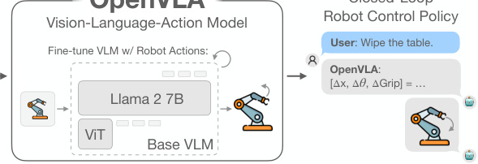
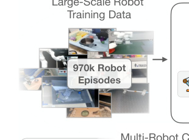
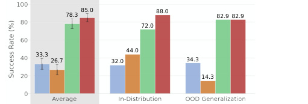

# OpenVLA：让机械臂"看一眼 + 听一句话"就动起来

> 这是写给读者的精读版。原版笔记在 git 历史里能翻到。

## 一句话讲什么（TL;DR）

OpenVLA 把一个会"看图说话"的 AI 改造成会"看图动手"的机器人大脑，并把全部权重、代码、配方都开源出来。

*所以这一节是想说：它是一个开源、能动手的"看图听话"机器人模型。*

---

## 这是个什么场景

想象一个画面：你在桌前敲键盘，旁边的机械臂上摄像头一闪，你说一句"把橡皮放进笔筒"，它就抬起手把橡皮放进去。

要做到这件事，机械臂得做三件事——

- **看**：从摄像头里看出"哪个是橡皮、哪个是笔筒"
- **听**：把"把橡皮放进笔筒"这句中文（或英文）听懂
- **动**：把"看到的"和"听到的"翻译成手该往哪个方向、动多少厘米

这三件事压在一个 AI 里，就是 **VLA**。

> **VLA（Vision-Language-Action，视觉-语言-动作模型）**：一个 AI，输入是"图 + 一句指令"，输出是"机械臂下一步怎么动"。

类比：像一个司机——眼睛看路、耳朵听导航、脚踩油门。三件事在一个大脑里完成，不是三个人轮流上岗。



*所以这一节是想说：要让机械臂同时会看、会听、会动手，就得把这三件事压进一个 AI。*

---

## 之前的人怎么做的，为什么不够好

OpenVLA 出现之前，最强的同类机器人 AI 叫 **RT-2-X**（Google 出品）。它效果好，但有几个让圈外人没法跟进的毛病：

- **闭源不卖也不送**：权重不公开、训练代码也不公开。
  - 类比：好比有人造了一辆很厉害的赛车，既不卖，也不告诉你怎么造。
- **没人教怎么调成自己的**：你买了不同型号的机械臂，它没法直接用，但论文里也不写"怎么改"。
  - 类比：买了一双进口鞋，码数不对，又没有教你怎么改尺码。
- **太大跑不动**：RT-2-X 有 **55B 参数**（550 亿），普通学校实验室的电脑根本带不动。
  - 类比：让一个大学生用计算器去解超大的方程组，硬件根本不配。
- **路线分两派，互不通**：一派是"分模块"（先识别 → 再规划 → 再控制），另一派是"端到端"（一个 AI 干到底）。两派工具链各搞各的。
  - 类比：一派是"先查地图再决定怎么走"，另一派是"司机直觉踩油门"。

> **闭源 vs 开源**：闭源 = 别人家的厨房不让进；开源 = 把菜谱、食材、锅都摆出来让你自己也能做。

OpenVLA 的目标：做一个开源版本，跑在便宜显卡上，并且效果还要打过那个 55B 的闭源大哥。

*所以这一节是想说：之前最强的方案不开源、太大、没法改，普通研究者只能远观。*

---

## 这篇论文的新想法

**核心思路一句话**：把"机械臂动作"伪装成"一段单词"，让一个原本会看图说话的 AI 顺手把动作"说"出来。

类比：让一个会写日记的人，把"右手抬 5 厘米"也当成日记里的一个字写出来——这样就不用再造一个新 AI，直接复用现成的。

*所以这一节是想说：把动作当成单词，让现成的"看图说话 AI"顺手生成动作。*

---

## 它分几步做的（方法）

下面 5 步，按从外往内的顺序拆开。


### 1. 用一个"会看图说话"的 AI 当起点

**类比**：你想训练一只会看导盲提示走路的狗，与其从一只什么都不懂的小狗教起，不如先找一只已经会"看 + 听人话"的狗，再教它走路。这能省掉前面 99% 的功夫。

**它在干什么**：选一个已经会看图答题的现成 AI 做起点，名字叫 **Prismatic-7B**。

> **Prismatic-7B**：一个已经训练好的"看图说话"AI，参数量 70 亿（B = 10 亿）。它由两个"眼睛"+ 一个"翻译官"+ 一个"大脑"组成。
>
> **参数（parameters）**：AI 内部的可调旋钮数量。70 亿就是有 70 亿个旋钮可以转动来记住知识。

**内部三个零件**：

- **两只眼睛（视觉编码器）**：分别叫 DINOv2 和 SigLIP。一个擅长"看物体在哪、形状是什么"，一个擅长"看这是什么东西"。两双眼睛拼起来比一双更全面。
- **一个翻译官（投影层）**：把眼睛看到的画面翻译成"大脑"听得懂的语言（其实是一串数字向量）。
- **一个大脑（语言模型 Llama 2 7B）**：会"读单词 → 接着写下一个单词"。

> **向量**：高中学过的那个，一组有顺序的数字，比如 (1, 2, 3) 是个三维向量。这里 AI 内部把每张图、每个词都表示成 4096 维的向量。
>
> **视觉编码器**：把图片变成一组数字向量的程序。类比：扫描仪——把纸上的图变成电脑里的数据。

**为什么用两双眼睛**：一双眼睛（DINOv2）会量距离、看形状；另一双（SigLIP）会认"这是杯子还是碗"。机器人既要认得物体，又要量距离（夹子离杯子边 3mm 还是 5mm），所以两双都需要。

*所以这一节是想说：它不是从零造，而是把现成的"看图说话 AI"拿来当地基。*

### 2. 把动作切成 256 档，伪装成"单词"

**类比**：音量旋钮原本是连续旋转的（任何角度都行），现在改成 256 个按键档位，每按一档对应一个角度。再把这 256 个档位起 256 个奇怪的名字（像某些不常用的生僻字），塞进一本字典里。这样会写字的人，就也能"按按钮"了。

**它在干什么**：把机械臂的动作（上下左右移多少、夹爪开多大）切成 256 个等距档位，每个档位用 AI 字典里的一个"生僻词"代替。这样 AI 就能像写句子一样把动作"写"出来。

**具体几步**：

1. 机械臂每一步要决定 7 个数字：左右、前后、上下、绕三个轴各转多少、夹爪开合。
2. 看一遍训练数据，找到"99% 的正常动作"在哪个区间内。
3. 把这个区间均匀切成 256 段。任何一个动作落在哪一段，就编号成 0~255 的整数。
4. 在 AI 的字典里挑 256 个最不常用的"生僻词"，把它们的位置占用作为这 256 档动作的代号。
5. 训练时，让 AI 学着接着已有的图和指令"续写"出 7 个这种"生僻词"。

> **离散化**：把连续的数（任何小数都行）变成有限个档位的整数。类比：把温度从"任意小数"改成"低 / 中 / 高"三档。

**为什么要这样做**：

- 原本的"看图说话 AI"只会输出单词。如果直接让它输出小数，得给它接一个新嘴巴，新嘴巴要从零学起。
- 把动作伪装成单词后，旧嘴巴就够用了——AI 70 亿个旋钮全都能继续派上用场。

*所以这一节是想说：把动作翻译成"单词"，旧 AI 就能直接接着用。*

### 3. 拿 97 万段机器人视频喂它



**类比**：教一个司机能开各种路况，最快办法是给他看全国各地的行车记录仪——但前提是先把不同摄像头、不同车型的视频统一成同样的格式，否则他看不懂。

**它在干什么**：从一个公开数据集 **Open X-Embodiment** 里挑 970000 段（97 万）机械臂操作视频喂给 AI。

> **Open X-Embodiment（OpenX）**：70 多个机器人数据集合并成一个统一格式的大集合。"Embodiment" = "身体"，意思是不同身体（不同型号机械臂）的数据放一起。
>
> **数据集**：一堆带标签的样本。类比：一本练习册——每页有题目和答案。

**怎么挑**：

- 只留"单条胳膊 + 至少一个第三人称摄像头"的视频，扔掉双臂的、视角太怪的。
- 多样性高的数据集多采一点（比如桌面操作、抓取），重复无聊的少采一点。
- 训练里发现某个数据集（叫 DROID）实在学不进去，最后 1/3 训练时直接把它剔除。

**为什么这样做**：

- 机器人比语言模型缺数据多了——互联网文本几乎无穷多，但真实机械臂操作视频少得可怜。所以"杂烩 + 清洗"比"单一来源 + 大"更管用。
- 数据干净比数据多更重要：作者特意筛掉那些"机械臂没动但还在录"的废帧。

*所以这一节是想说：拿全网最大公开机械臂视频集训练，但要筛过、清洗过。*

### 4. 反直觉的训练秘方

**类比**：常规训练是"找一个外语很厉害的同事帮你看图，你不希望他重新学外语，只希望他帮你理解"。但机器人不一样：他原来认得"杯子"是从淘宝商品图认得的，**不知道杯子从机械臂这个斜上角度看长什么样**。所以你得让他**重新练眼睛**。

**它在干什么**：决定哪些零件训、训多少轮、用多大步子。

**几个反直觉的决定**：

- **眼睛要重新训**：常规做法是"冻住眼睛只训大脑"，这里反过来——眼睛也要训，因为机械臂视角下的物体跟互联网图差太远。
- **训 27 遍**：普通"看图说话 AI"的数据通常只过 1~2 遍，这里要过 27 遍才学会。
- **步子固定 0.00002**：不慢慢加快也不慢慢减小，从头到尾一个步子。

> **训练 / 学习**：让 AI 调整自己内部 70 亿个旋钮，使得它在训练题上越答越对。
>
> **Loss（损失）**：考试扣分总和——AI 答错越多，扣分越多。它的目标是想办法让总扣分越来越小。
>
> **梯度下降（gradient descent）**：调旋钮的方法，像下山找最低点——每一步往最陡的下坡方向迈。"步子大小"叫学习率。
>
> **epoch（一遍）**：把全部训练数据从头到尾过一次，叫一个 epoch。过 27 遍 = 27 个 epoch。

**算力账单**：64 张 A100 显卡（每张约 1.5 万美元）连训 14 天 = 21500 显卡小时 ≈ **4 万美元一次**。这就是不开源就完全没法复现的"护城河"。

*所以这一节是想说：眼睛要解冻、要训 27 遍，全是反直觉的工程秘方。*

### 5. 给大模型装"可拆卸小补丁"

**类比**：LoRA 像给西装**只换领口和袖口**——西装本体不动，外面缝几个小补丁就适配新场景。量化则是**把高清照片压成发朋友圈的小图**——肉眼看几乎一样，但文件小一半。

**它在干什么**：让普通人能用消费级显卡（家用游戏显卡）跑这个模型，而不是只能租 8 张 A100 服务器。

> **LoRA（Low-Rank Adaptation，低秩适配）**：训练时主网络的 70 亿旋钮全冻住不动，只训练几个非常小的"补丁矩阵"。改完只多几百万旋钮，存盘也只多几十 MB。
>
> **矩阵**：一张数字表格，行列相乘要对齐。比如把一组数字 (1,2,3) 乘以一张 3 行 4 列的表格，得到一组 4 个数字。AI 内部全是矩阵运算。
>
> **量化（quantization）**：把每个旋钮的数值精度降低，比如从"小数点后 16 位"降到"小数点后 4 位"，省一半存储空间。类比：1080p 视频压成 480p。

**两个数字记住就行**：

- **正常加载**：约 15 GB 显存（一张 RTX 4090 就能跑）。
- **4-bit 量化**：约 7 GB 显存（一张 RTX 4070 都行）。性能几乎不掉。

*所以这一节是想说：靠 LoRA 补丁 + 4-bit 压缩，普通人显卡也能玩。*

---

## 关键数字（What works）


每个数字都来自真实物理机械臂上跑的成功率（不是仿真）。在这个领域 +10% 已经是大新闻。

- **总平均成功率：70.6% vs RT-2-X 的 50.6%**（BridgeData V2，17 个任务每个跑 10 次）
  - **意味着**：闭源大哥 10 次能成 5 次的，OpenVLA 10 次能成 7 次。
- **参数量小 7 倍**：OpenVLA 7B vs RT-2-X 55B
  - **意味着**：用八分之一的"大脑容量"打过对方。性价比飞跃。
- **Google 机器人 12 任务平均：85.0% vs RT-2-X 78.3%**
  - **意味着**：在对方"主场"（同型号机器人）上还能赢 6.7 个百分点。
- **微调成本：LoRA 用 1.4% 旋钮 + 60 GB 显存就能追平全量微调**
  - **意味着**：原本要 8 张 A100 干的活，1 张就够。从公司级降到学校实验室级。
- **推理速度：单张 RTX 4090 ≈ 6 Hz**（每秒发 6 次动作）
  - **意味着**：宿舍能玩 vs 实验室能玩的差别。
- **成功率全面性：是唯一一个在 7 个微调任务上成功率全部 ≥ 50% 的方法**
  - **意味着**：别的方法可能某个任务厉害另一个任务拉胯，只有 OpenVLA 各科都过 60 分以上。

*所以这一节是想说：用 1/7 的参数全面打过闭源大哥，并且消费级显卡能跑。*

---

## 你应该懂的几个新词

> **VLA（Vision-Language-Action，视觉-语言-动作模型）**：输入图 + 文字，输出机械臂动作。类比：边看路边听导航边踩油门的司机大脑。

> **VLM（Vision-Language Model，视觉语言模型）**：会看图说话但不会动手。类比：会看图配字幕的实习生。

> **参数（parameters）**：AI 内部可调旋钮数量。7B = 70 亿个。类比：一台调音台上的旋钮数。

> **token（词元）**：AI 把文字 / 图 / 动作切成的"最小单元"，每个单元在字典里有一个编号。类比：英文里的"单词"或汉字里的"字"。

> **离散化（discretization）**：把连续的数（任意小数）变成有限档位。类比：把温度变成"低 / 中 / 高"三档。

> **LoRA（低秩适配）**：冻住主网络，只训几个小补丁。类比：西装只换领口袖口。

> **量化（quantization）**：把每个旋钮存得更粗糙，省内存。类比：高清图压成小图。

> **Loss（损失）**：考试扣分总和。AI 学习的目标就是想办法让这个分越来越小。

> **梯度下降**：找最低点的方法——每步往最陡下坡方向迈。"每步迈多大"叫学习率。

> **epoch**：把整本练习册从头到尾过一遍。

> **Open-X Embodiment**：机器人界的"互联网图片大集合"——70+ 个数据集合并的统一格式。

> **DINOv2 / SigLIP**：两种"会看图变向量"的预训练程序。一个偏空间几何，一个偏语义。

*所以这一节是想说：搞清这 12 个词，你就有了入场券。*

---

## 它有什么搞不定的

OpenVLA 论文很诚实地承认了几类失败——

- **看不到时间**：它一次只看当前一帧图，不会"回看一秒前手在哪"。
  - **你会遇到**：让它做"倒水到八分满"这种要观察水位变化的任务，它就吃力。
- **手不够快**：每秒只能输出 6 次动作。
  - **你会遇到**：让它做"穿针、缝纫、剥鸡蛋"这种快反应任务，它跟不上。
- **可靠性还不够工业级**：大部分任务成功率 70~90%，意味着 10 次坏 1~3 次。
  - **你会遇到**：拿去做演示没问题，真要在工厂部署还差一截。
- **环状 / 透明 / 反光物体认不出**：白色胶带、玻璃杯、镜面这类是盲区。
  - **你会遇到**：抓不到中间有洞的物体，模型常把夹爪伸进洞里抓空。
- **微调时会"忘旧知识"**：训完机器人任务后，原本能认 Taylor Swift 的能力会损失一些。
  - **你会遇到**：让它做"把可乐放到 Taylor Swift 海报旁边"这种需要明星识别的任务，它不如闭源大哥。

> **灾难性遗忘（catastrophic forgetting）**：AI 学新任务时把旧任务忘了。类比：练完毛笔字后，硬笔字反而写丑了。

*所以这一节是想说：单帧、慢速、不够稳，是它的三大短板。*

---

## 它和别的几篇是什么关系

可以画一棵家族树：

```
      [前辈：会看图说话的 AI]
     CLIP → LLaVA → Prismatic-7B
                       ↓ （拿来当地基）
   [前辈：闭源大哥]    OpenVLA  ← [对比基准] Diffusion Policy
   RT-2 → RT-2-X       ↓                         （走另一条路）
                  [续作 / 后浪]
              π0、OpenVLA-OFT、RDT-1B
```

- **跟 RT-2-X**（闭源 55B 大哥）：直接对手。OpenVLA 用 1/7 参数 + 全开源 + 双眼睛把它打败。
- **跟 Octo**（上一代开源版，93M）：用同样的训练数据，但骨架换大 75 倍，效果飞跃——证明"大骨架 + 互联网先验"对机器人有用。
- **跟 Prismatic-7B**：直接拿来当起点。可以理解成"OpenVLA = Prismatic + 动作翻译层 + 机器人微调"。
- **跟 Diffusion Policy**：完全不同的另一条路（用扩散模型直接生成动作）。OpenVLA 在多任务通用性上赢，Diffusion Policy 在单任务平滑度上赢。后来的 π0 / RDT-1B 把两条路杂交。

*所以这一节是想说：OpenVLA = 站在 Prismatic 的肩膀上，瞄着 RT-2-X 打，被 π0 接棒。*

---

## 我建议这样读这篇

面向零基础读者，1-2 小时读完核心。

1. **先读摘要 + 看 Figure 2（架构图）**：30 秒建立"看 → 译 → 说动作"的整体心智模型。
2. **跳读 §3.1（VLM 三段式）+ §3.2（动作 token 化）**：这两节理解了就理解了 80%。
3. **看 Figure 3（BridgeData 评测） + Figure 5（微调对比）**：先看图表建立"打赢了谁"的直觉。
4. **回头读 §3.4（设计决策）+ §5.3（LoRA 表）**：这两节是"配方"——以后训自己 VLA 时直接抄。
5. **跳过附录 A-E**：第一遍读没必要，里面是任务清单和细节配置。
6. **如果还有兴致再读 §6（Limitations）**：作者列出来的坑就是后续 π0 / RDT 要解决的问题。

*所以这一节是想说：架构图 → 核心两节 → 实验图 → 配方表，2 小时就够。*

---

## 一些好奇心问答（FAQ）



### Q1：模型多大？我的 4070 跑得动吗？

7B 参数，存盘约 14 GB。
- **正常加载**：要 15 GB 显存 → 4070(12GB) 不够，4080 临界，4090 舒服。
- **4-bit 量化**：约 7 GB → **4070 够用**。

### Q2：数据从哪来？要授权吗？

来自公开的 Open-X Embodiment（HuggingFace 上能下，约几 TB）。多数是 CC-BY-4.0 协议，不需付费。引用原论文即可。

### Q3：训练一次要多少钱？

预训练：64 张 A100 训 14 天 ≈ **3-6 万美元**（云租 A100 约 1.5-3 美元/小时）。
微调：1 张 A100 + LoRA ≈ **30-60 美元**就能完成。

### Q4：为什么不用更简单的方法（比如直接让 AI 输出小数）？

直接输出小数得给 AI 接一个全新的"嘴巴"，这个嘴巴是从零学起的——浪费了原本 70 亿旋钮里的预训练知识。把动作伪装成单词后，旧嘴巴直接复用，所有旋钮都参与动作生成。

### Q5：为什么要用两双眼睛而不是一双？

DINOv2 擅长"东西在哪、什么形状"（空间几何），SigLIP 擅长"这是什么"（语义识别）。机器人两样都需要——既要认得杯子，又要算夹爪到杯子边的距离。一双眼睛只擅长一件事。

### Q6：6 Hz 推理够用吗？

够做"放东西、抓物体"这类慢任务。不够做"穿针、缝纫"这类要 50 Hz 的快反应任务。后续 OpenVLA-OFT 和 π0-FAST 通过技术优化把速度提到了 30~50 Hz。

### Q7：我能拿自己的 10 段视频微调它吗？

能。论文也专门做了 LoRA 微调实验，10-150 段视频就能让它学会一个新任务，单卡 A100 跑 5-15 小时。

### Q8：开源到什么程度？

权重、代码、训练 notebook、tokenizer 全开源。github.com/openvla/openvla 仓库 2026 年还活跃。这是它跟 RT-2 最大的区别——RT-2 连 API 都没有。

*所以这一节是想说：8 个最常被问的实操问题一次性答完。*

---

## 如果你想再深入

按"前传 / 续作 / 对手 / 工具"分组：

1. **【前传，必读】RT-2（Brohan et al. 2023）**：OpenVLA 借的"动作伪装成单词"思路就来自这里。读完才知道每一处改动针对什么。
2. **【前传，工具】Prismatic VLMs（Karamcheti et al. 2024）**：OpenVLA 的骨架来源。这里能看到"为什么用两双眼睛比一双好"的原始实验。
3. **【对手，必读】Diffusion Policy（Chi et al. 2023）**：完全不走"伪装成单词"路线的另一支。OpenVLA 在窄任务上输给它，说明这条路至今仍有效。
4. **【续作】π0（Physical Intelligence, 2024）**：OpenVLA 几位作者跳出来创公司搞的下一代。可看作"OpenVLA 把所有局限都补了一遍"的版本。
5. **【续作 / 实操首选】OpenVLA-OFT (2025)**：原团队自己的优化版，速度从 6Hz 提到 30Hz。如果你要实操，**直接用 OFT 版**，原版只剩历史价值。

*所以这一节是想说：5 篇延伸阅读，按时间线串起整个 VLA 生态。*

---

## 总结一下

读到这里你应该懂了——

- VLA 就是"看图 + 听话 → 动手"的端到端 AI。
- OpenVLA 的核心招数：把动作伪装成单词，让现成的"看图说话 AI"顺手生成。
- 它用 1/7 的参数 + 全开源 + 消费级显卡可跑，把闭源大哥 RT-2-X 打过去了。
- 它的短板是慢、单帧、对环状/透明物体不行；这些坑被后续 π0、OpenVLA-OFT 慢慢填上。

如果只能记一句：**"它是开源 VLA 的标准答案，所有后辈论文都拿它当起点。"**
