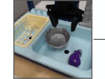
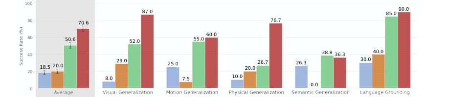

# OpenVLA: An Open-Source Vision-Language-Action Model

> 这是机器辅助生成的客观摘要笔记。教学版精读笔记由用户按节奏触发后单独成稿。

## 一句话讲什么（TL;DR）

把一个 7B 视觉语言模型直接微调成会动机械臂的开源通用策略，比 55B 的 RT-2-X 还强。

## 这篇论文要解决什么问题（Why this paper）

想象一个场景：你买了一台扫地机器人，希望它有一天能升级成"看一眼桌面 + 听一句话 → 把可乐递给我"的家用机器手。要做到这一步，机器人得同时具备三个能力：看懂场景、听懂指令、把这两者翻译成机械臂的动作。把这三件事压在一个网络里，就是 **VLA**（Vision-Language-Action，视觉-语言-动作模型）这条技术路线。

在 OpenVLA 出来之前，这条路线最强的模型叫 RT-2-X，但它有两个让外人没法跟进的问题：

- **闭源**：RT-2 / RT-2-X 这类 SOTA 模型不放权重、不公开数据配方、不公开训练代码——研究者拿不到，等于只能远观。
- **没人教怎么微调**：要把通用策略迁到自家实验室的机械臂上，需要一套高效的 fine-tune 配方（fine-tune，微调，指在通用模型上用少量自家数据继续训练让它适配特定任务），但已有论文几乎不讨论。

类比：好比有人造了一辆很厉害的赛车（RT-2），但既不卖给你，也不告诉你怎么改装去跑你家门口的山路。OpenVLA 的目标就是开一台**可买、可改、可跑在家用 GPU 上**的开源版本——而且不仅放出来，还要在公平比较下打赢闭源版。

## 用了什么方法（How）

整体架构可以这样想：一台机器人要回答"现在该怎么动"，OpenVLA 就把这件事拆成"先看 → 再想 → 再说出动作"三段流水线，所有零件都是从 LLM 圈子里直接搬过来的。

### 三段式 VLM 骨架（Prismatic-7B）：眼睛 + 翻译官 + 大脑

先讲日常版：想象你给一个不会说话的外国朋友看一张厨房照片，再问他"帮我拿杯子"。他得先用眼睛看照片，再在脑子里把"看到的画面"翻译成自己听得懂的语言，最后用脑子琢磨"杯子在哪、手该怎么伸"。

OpenVLA 的骨架就是这三块：

- **视觉编码器（visual encoder，看图变向量的神经网络）**：把输入图片切成一堆"小图块向量"，相当于"眼睛"。OpenVLA 用了**双视觉编码器**：DINOv2（管"东西在哪、什么形状"的空间几何）和 SigLIP（管"这是什么、是不是杯子"的语义识别），两条特征拼起来。比起常规只用 CLIP 或 SigLIP 一条路，加上 DINOv2 让机器人看得更"立体"——这对要算"夹爪伸到哪个坐标"的机器人尤其关键。
- **投影器（projector，2 层 MLP）**：把视觉那串向量翻译成语言模型能吃的格式，相当于"翻译官"。
- **语言模型骨架（LLM backbone，Llama 2 7B）**：当大脑，把翻译过来的视觉 + 用户指令拼在一起，预测接下来该输出什么"词"。

整套三段式叫 **Prismatic-7B VLM**（VLM = Vision-Language Model，视觉语言模型），是别人已经训好的成品，OpenVLA 直接拿来当起点。

> 读到这里你可能在想：那这个"大脑"怎么吐机器人动作？它训练时学的可是吐英文单词。下面就是 OpenVLA 最巧妙的一招。

### 动作 token 化：把方向盘角度翻译成单词

机器人每一步的动作是 7 个连续数字（机械臂 6 维位姿 + 1 维夹爪开合）。LLM 只会吐"词"，不会吐数字。怎么办？

类比：想象一个音量旋钮原本是无级旋转的连续刻度，现在改成 256 档按键——任何旋转角度都能对应到一个具体的按键。

OpenVLA 就这么干：把动作每一维按训练数据的 1%–99% 分位数离散成 **256 个 bin（小格子）**（用分位数而不是 min-max 是为了避免极端异常值把刻度撑大、让正常动作的精度变粗）。然后把 Llama 词表里 256 个**最少用的 token**（token，模型词表里的最小单位，可以是字、词、子词）直接覆盖成这 256 个动作格子的"动作 token"。

这样一来，"右手往前伸 5cm"就被表示成一串普通的"单词"，整套 LLM 训练 / 推理基础设施（FlashAttention、FSDP、HuggingFace AutoModel 等）一行不改地全部复用。这是 OpenVLA 能做大的根本原因。

### 970k 轨迹大杂烩：全国各地学车视频混训

类比：教一个司机泛化到所有路况，最快的办法是给他看全国各地的行车记录仪——但前提是先把不同摄像头、不同车型的视频统一格式。

OpenVLA 用 **Open X-Embodiment（OpenX）**（开放跨平台机器人数据集，70+ 个机器人数据集合并成的统一格式大集合）做底料，但 200 万条全用太杂，所以做了两步筛选：

1. 只保留**单臂 + 至少一个第三人称相机**的数据集（保证输入输出格式一致）。
2. 沿用 Octo 的混合权重（Octo 是上一代开源通用策略），把多样性高的数据集加权、把重复或单调的下采样。

最后落地 **970k 条轨迹**，比 RT-2-X 的 350k 多出近 3 倍。

> 读到这里你可能在想：既然底料是别人 Open-X 给的，模型骨架是 Prismatic 给的，那 OpenVLA 自己究竟做对了什么？答案是大量"反直觉的训练细节"。

### 反直觉发现：视觉编码器必须解冻

在常规 VLM 训练里，**冻结视觉编码器（不更新它的权重）**反而效果更好，因为这样能保留它在互联网图文上学到的稳定特征。

但 OpenVLA 反复实验后发现：**做机器人时必须把视觉编码器解冻、跟着一起微调**。猜测原因是预训练视觉特征虽然语义强，但缺少"夹爪到底离杯子边缘几毫米"这种**精细空间细节**——而精细空间细节恰恰是机器人控制的命门。

类比：互联网图片告诉你"这是杯子"，但机器人需要的是"杯子在你手前方 17.4 厘米、稍微偏左 2 度"。后者只能靠在机器人数据上继续训才能学出来。

### LoRA + 4-bit 量化：给大模型装可拆卸的小补丁

7B 模型全参数微调要 163GB 显存——一般实验室没这条件。OpenVLA 测了几种省钱方案：

- **LoRA（Low-Rank Adaptation，低秩适配）**：冻结主网络，只训几个秩很小的"补丁矩阵"（rank=32 时只占总参数的 1.4%）。类比：给一套西装只换领口和袖口，不重做整件。结果：成功率 68.2% 几乎追平全参数微调的 69.7%，显存从 163GB 降到 59.7GB。
- **量化（quantization）**：把权重从 16-bit 浮点压成 8-bit / 4-bit 整数。类比：把高清照片压成小图发朋友圈，肉眼看几乎一样。结果：4-bit 推理显存再砍半（15GB → 7GB 量级），消费级 RTX 4090 可跑，性能几乎不掉；8-bit 反而因为额外计算开销跑得慢、间接拖垮控制频率（系统动力学错位）。

## 关键实验结果（What works）

每个数字背后都是真实物理机械臂上跑的成功率（不是仿真），所以"+10%"在这个领域已经是大新闻。

- **+16.5% 绝对成功率**：OpenVLA (7B) vs RT-2-X (55B)，跨 29 个任务、两种机械臂——参数少 7 倍反而更强。这相当于一辆排量小 7 倍的车在赛道上把豪车甩在身后；在闭源 vs 开源对比里这个数字尤其震撼。
- **+20.4% vs Diffusion Policy**：在涉及多物体、需要语言指代的 fine-tune 任务上明显领先。Diffusion Policy 是当时模仿学习的天花板基线，"领先 20%"约等于把错一半的事改成只错三成。
- **LoRA rank=32 = 68.2% vs Full FT 69.7%**：用 1.4% 参数、59.7GB 显存（vs 163.3GB）就追平全量微调。换算下来，原本要租 8 张 A100 才能干的活，单张 A100 + LoRA 就够了——准入门槛降了一个数量级。
- **6Hz 推理 on RTX 4090，bfloat16 仅 15GB 显存**：4-bit 量化下显存再砍半、性能几乎不掉。对比一下：训练时用了 64 张 A100 跑 14 天，但推理时一张 4090（家用游戏卡）就能部署。这是从"实验室才能玩"跨到"宿舍也能玩"的关键。
- **唯一一个**在所有 Franka-Tabletop 微调任务上成功率都 ≥50% 的方法。其他方法（Diffusion Policy / Octo）要么在窄任务厉害、要么在多指令任务厉害，但没有一个像 OpenVLA 这么"全面平均分高"。

## 我读完后该懂的几个术语

- **VLA（Vision-Language-Action Model，视觉-语言-动作模型）**：直接把"看图 + 听指令 → 输出机械臂动作"端到端打成一个网络的范式。类比：一个会一边看路一边听导航一边踩油门的司机大脑。**本文出现位置**：标题、整篇都在讲。
- **VLM（Vision-Language Model，视觉语言模型）**：会看图 + 会说话但还不会动手的"半成品"。类比：能看图配字幕的实习生，但还没学过开机械臂。**本文出现位置**：3.1 节（VLA 的爹，OpenVLA 直接拿 Prismatic-7B 这个 VLM 当起点）。
- **Open-X Embodiment（OpenX）**：70+ 机器人数据集合并成的统一格式大集合，2M+ 轨迹。类比：机器人界的 ImageNet。**本文出现位置**：3.3 节（训练数据来源），过滤后用了 970k 条。
- **DINOv2 / SigLIP**：两个预训练视觉编码器。DINOv2 偏空间几何（"东西在哪、什么形状"），SigLIP 偏语义（"这是什么"）。类比：一个看构图、一个看内容的双摄。**本文出现位置**：3.1 节，OpenVLA 把两者特征沿通道拼接当输入。
- **Action Token / 动作离散化**：把连续的动作维度切成 256 格，每格当成 LLM 词表里的一个词。类比：把音量旋钮的连续刻度改成 256 档按键。**本文出现位置**：3.2 节，是让 LLM 能直接输出动作的技术核心。
- **LoRA（Low-Rank Adaptation，低秩适配）**：冻结主网络，只训练几个小矩阵作为补丁。类比：给西装只换领口和袖口，不重做整件。**本文出现位置**：5.3 节，对比四种微调策略后 LoRA 胜出。
- **Quantization（量化）**：把权重从 16-bit 浮点压成 8-bit / 4-bit 整数省显存。类比：把高清照片压成小图发朋友圈。**本文出现位置**：5.4 节，4-bit 是消费级部署的关键。
- **Action Chunking（动作分块）**：一次预测未来一小段（比如 8 步）连续动作然后开环执行，再预测下一段，而不是每步都重新算一次。类比：背英语单词不是看一个背一个，而是十个一组背完再翻页。**本文出现位置**：5.2 + 第 6 节，作为 Diffusion Policy 的优势之一被指出，是 OpenVLA 未来需要补的方向。

## 这篇论文的局限 / 我看出的疑点

- **只支持单帧图像输入**：没历史帧、没 proprioception（本体感觉，比如关节角度）。**用户实际会遇到的问题**：机器人没法"记住一秒前手在哪"，对需要回看动作历史的任务（比如倒水时观察水位变化）会吃力；也没法用便宜的关节角度传感器辅助——而真实机器人通常这两类信号都装了。
- **6Hz 推理对高频任务不够用**：像 ALOHA 双臂操作要 50Hz，OpenVLA 远达不到。**用户实际会遇到的问题**：你要做"穿针、缝纫、剥鸡蛋"这种需要快速反馈纠错的任务，OpenVLA 现阶段顶不住——它是慢思考型选手，不是快反射选手。
- **可靠性天花板还偏低**：大部分任务成功率 < 90%，离工业级"几乎不出错"还有距离。**用户实际会遇到的问题**：拿去做 demo 没问题，但真要在工厂或家里部署，平均 10 次坏 1 次以上的故障率还无法接受。
- **DROID 数据集没拟合好**：训练后期不得不把 DROID 从混合中剔除。**意味着**：现在的 7B 容量 + 970k 数据可能还不足以吸收所有数据多样性，扩 scale 也许就能吃下——但代价是更多算力。

## 与其他 12 篇的关联

- **直接对标 RT-2-X**：同是 VLA 范式，OpenVLA 用 1/7 参数 + 970k 数据 + 双视觉编码器 + 全开源把它打过；可以视作"RT-2 的开源平民版"。OpenVLA 的整套 action token 化做法直接抄自 RT-2（Brohan et al. 2023），但骨架换成 Prismatic、数据换成更大更干净的 OpenX 子集，证明"工程细节 + 开源工具链"足以追平规模差距。
- **借鉴并对照 Diffusion Policy**：fine-tune 阶段把 Diffusion Policy 当强基线对比。OpenVLA 在多指令任务上完胜，但在窄任务（如"把胡萝卜放碗里"）打不过 Diffusion Policy 的精细度。论文明确指出 Diffusion Policy 的**两大优势——action chunking + 动作平滑**——可能是 OpenVLA 未来要补的方向。这其实暗示了后续 π0 / RDT 这类"VLA + diffusion head"路线的合理性。
- **数据复用 Octo / Open-X Embodiment**：训练数据和 mixture 权重直接沿用 Octo（上一代开源通用策略，93M 参数），可以把 OpenVLA 看作"换更大骨架（93M → 7B）+ 端到端微调"的升级路线。同样数据下 OpenVLA 大幅领先 Octo，说明骨架规模 + 互联网预训练对机器人泛化是有用的——这是支持 VLA 路线的实证。
- **VLM 底子来自 Prismatic / LLaVA 谱系**：Prismatic-7B 又是建立在 LLaVA 训练范式 + Llama 2 + DINOv2 + SigLIP 之上的。换句话说 OpenVLA 是把过去三年视觉语言研究的积木整体平移到机器人——不是全新发明，是**漂亮的集成**。

## 我建议的阅读顺序

面向零基础读者，给一条 5 步路线，控制在 1-2 小时读完核心：

1. **先读摘要 + 看 Figure 2**（架构图，对应 `images/img_028.jpg`）。**为什么**：30 秒就能建立"看 → 译 → 说动作"的整体心智模型，后面所有细节都挂在这棵树上。
2. **跳读 §3.1（VLM 三段式）+ §3.2（动作 token 化）**。**为什么**：这是整篇论文的核心机制，理解了这两节就理解了 80%；§3.1 给你"这模型长什么样"，§3.2 告诉你"机器人动作怎么塞进语言模型的嘴里"。
3. **看 Figure 3（BridgeData V2 评测） + Figure 5（微调对比）**。**为什么**：先看实验图建立"它到底打赢了谁"的直觉，再回头看正文会更轻松；不要先一头扎进数字。
4. **读 §3.4（设计决策）+ §5.3（LoRA 表 1）**。**为什么**：这两节是工程师的金矿——视觉编码器要解冻、训 27 epoch、LoRA rank=32 够用，这些都是你以后训自己 VLA 时直接拿来用的"配方"。
5. **跳过的部分**：附录 A-E 里全是任务清单和细节配置，第一遍读没必要展开；§4（codebase 介绍）也可以略过，等真正动手跑代码时再回来查。
6. **如果还有兴致再读 §6（Limitations）**：作者自己列出来的坑就是后续 π0 / RDT 等论文要解决的问题，对你接下来读其他论文是天然的导航。

## 为什么值得读 / 不值得读

VLA 入门必读。如果你只能读 1 篇 VLA 论文，读这篇——它是开源、配方齐全（数据/代码/checkpoint/notebook 全有）、消费级 GPU 可复现的唯一一份完整作业。如果你能读 3 篇，搭配 RT-2（看闭源旗舰怎么做）和 Diffusion Policy（看 VLA 之外的另一条路线）。如果你能读 5 篇，再加 Octo（看上一代怎么做）和 π0（看后 VLA 时代怎么把动作头换成 diffusion）。OpenVLA 是后续几乎所有 VLA 论文（包括 π0、Helix、RDT-1B 等）默认对照的基线之一，它定义了"开源 VLA 该长什么样"的标准答案，绕不过去。
