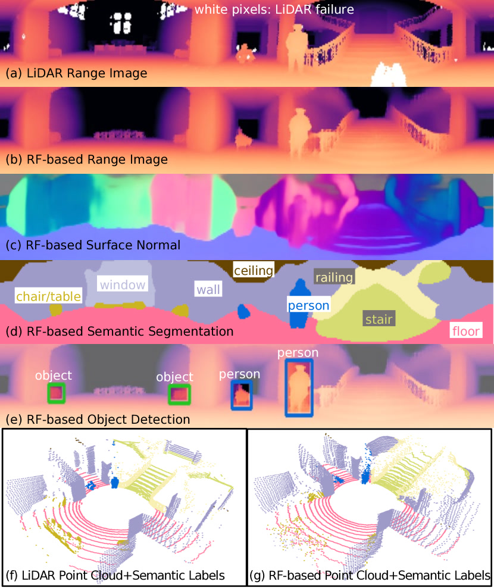
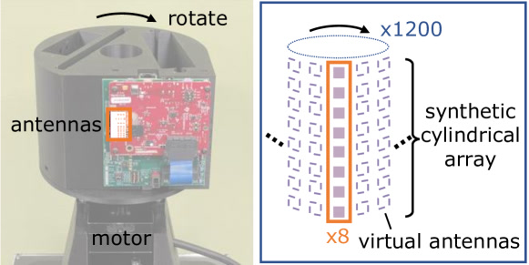
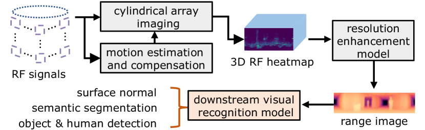

# PanoRadar：转起来的 $10 雷达，做 LiDAR 级 3D 视觉

> 零基础可读精读笔记。数字来自 arXiv:2405.19516 原文 Table 1–4 及 §4–8。

## 一句话讲什么（TL;DR）

**PanoRadar** 把 **TI AWR1843** 单芯片 mmWave 雷达装到 **8 cm 半径、2 Hz** 转台上，合成 **8×1200** 圆柱虚拟阵列；再用 **RF 自运动估计 + 2D CNN 提仰角分辨率**，从纯射频信号生成 **360° range image**，在 **12 栋建筑 leave-one-out** 上达到 **range MAE 15.76 cm（中位 3.39 cm）**、**语义 mIoU 48.0**、**检测 AP³⁰ 52.34%**——**首次**在 RF 上跑通 **法向/分割/检测** 全套视觉任务。

*所以这一节是想说：PanoRadar = **机械合成孔径（物理提分辨率）+ LiDAR 监督学习（语义补细节）**。*

---

## 这是个什么场景

消防机器人冲进 **浓烟**：相机白茫茫，LiDAR 激光被颗粒散射，**毫米波却能穿透**。但手里只有 **几十美元、8 根竖直天线** 的消费级雷达——单帧 **角分辨率 ~15°**，看到的像 **一团糊回声**，分不清墙和椅子。

**PanoRadar** 的解法像 **边转身边拍手**：

1. **电机转雷达** → 一圈采样等价 **1200 个方位虚拟天线**（合成孔径）；
2. **机器人还在走** → 用 **多径回波 + 多普勒** 自估 **亚毫米级** 运动并补偿；
3. **神经网络** 用 **配对 LiDAR** 当老师，把 **仰角维** 从 14° 糊带 **补成 LiDAR 级 range image**；
4. **部署时拆掉 LiDAR**，RF  alone 输出 **分割、检测、法向**。

对比 **Ouster OS0-64（~$9000）** 参考 LiDAR，论文 Fig.1 展示 **墙/地板/楼梯/人/椅** 在 RF range image 上 **结构可辨**。

*所以这一节是想说：场景是 **烟/雾/暗光下移动机器人要「看见」3D 环境 + 语义**。*

---

## 之前的人怎么做的，为什么不够好

- **大型 mmWave 阵列 / Navtech CTS350-X**：角分辨率高，但 **贵、重、功耗大**。
- **单芯片雷达直出 heatmap**：便宜，但 **~15° 方位角**，只能 **人体检测/手势**，做不了 **LiDAR 级 3D**。
- **滑轨 SAR（Guan 2020 等）**：合成孔径有效，但 **1.2 m 导轨、扫 5 分钟**，**移动机器人不可用**。
- **借机器人平移做 SAR（Qian 2020）**：只沿 **运动方向** 提分辨率，**静止/横向** 失效。
- **RF-Pose / Person-in-WiFi / milliMap**：从 RF 估 **姿态/2D 地图**，不是 **通用 3D range + 视觉识别全套**。
- **RadarHD**：神经 **超分 heatmap**，仍偏 **2D**，未系统做 **分割/检测/法向**。

**缺口**：缺 **「COTS 雷达 + 全景 3D + 跨建筑泛化 + 视觉级下游头」** 的完整系统。

*所以这一节是想说：前人要么 **贵**，要么 **2D/类人**，要么 **不能边走边 360° 成像**。*

---

## 这篇论文的新想法

**双引擎公式**：

$$\text{高分辨率 RF 3D} = \underbrace{\text{旋转圆柱 SAR}}_{\text{方位+距离}} + \underbrace{\text{ML 仰角增强}}_{\text{利用室内几何先验}} + \underbrace{\text{运动补偿}}_{\text{相干叠加}}$$

**四块设计（Fig.3）**：

1. **圆柱合成孔径**：竖直 **8 天线** 阵列绕 **z 轴** 转 → **8×1200** 虚拟阵；**一圈 ~0.5 s** 出 **360°**。
2. **AoA–多普勒解耦**：旋转引入 **cos 非线性** → 相位补偿线性化 → **Hough 找峰** 分离 **到达角 vs 径向速度** → **RANSAC 正弦拟合** 估 **v, θ**。
3. **2D CNN 做 3D 学习**：RF 张量 **512×64×256（方位×仰角×距离）**，把 **距离维当 channel**，预测 **512×64 range image**（省 3D 卷积显存）。
4. **全景学习**：方位维 **circular padding**，物体跨 **0°/360°** 边界仍 **整框检测**。

*所以这一节是想说：不是更大天线，而是 **转 + 算 + 学** 三件套。*

---

## 它分几步做的（方法）

<!-- paper-figures:begin -->



*上图说明：Figure 1（ar5iv 原图）（论文原图）。*



*上图说明：Figure 2（ar5iv 原图）（论文原图）。*



*上图说明：Figure 3（ar5iv 原图）（论文原图）。*
<!-- paper-figures:end -->

### 5.1 硬件与数据（§7）

**输入**：环境反射的 **FMCW chirp**（77–81 GHz，**B=4 GHz**）。

**平台**：

| 组件 | 规格 |
|------|------|
| 雷达 | **TI AWR1843** + DCA1000EVM |
| Chirp | **256 samples**，最大量程 **10 m** |
| 转台 | **Nema 23** 步进电机 **2 Hz**，半径 **r=8 cm** |
| 真值 | **Ouster OS0-64** 64 线 LiDAR |
| 载体 | Lynxmotion **Mecanum** 麦轮小车 + Jetson Nano 采数 |

**输出（训练）**：同步 **RF raw + LiDAR 点云/ range image + 语义/框标注**。

**数据集**：**12 栋** 校园建筑（1906–2013 年建），**11,033** 帧 RF–LiDAR 对，处理后 **461 GB**；**20,546** 物体实例；**11** 语义类（墙/地板/天花/门/窗/楼梯/电梯/栏杆/桌椅/人/垃圾桶）。

**采集协议**：机器人 **带 LiDAR Teacher 巡楼**；每帧 **转台至少转满一圈** 采 **BF 输入**；**同步时间戳** 对齐 **LiDAR 点云 → range image 标签**。部署阶段 **LiDAR 可完全移除**，仅 **AWR1843+转台+GPU** 即可 **在线 range + 分割**。

*所以这一节是想说：训练 **LiDAR 在车上**；测试 **可只用雷达**。*

---

### 5.2 圆柱阵列波束形成（§4）

**静止机器人、仅转雷达** 时，天线 **a** 在时刻 **t** 位置：

$$\vec{p}^a_t = (r\cos\omega t,\; r\sin\omega t,\; h^a)$$

对方向 $\vec{d}=(\cos\phi\cos\theta,\;\cos\phi\sin\theta,\;\sin\phi)$ **相干叠加** IF 信号：

$$B(\vec{d}) = \sum_{a,t} S^a_t \exp\!\left(j\frac{4\pi\,\vec{d}\cdot\vec{p}^a_t}{\lambda}\right)$$

再对 **range FFT** → 每个 **(方位 θ, 仰角 φ)** 一条 **距离谱**。

**分辨率（原文 Lemma 4.1）**：

| 维度 | 公式/数值 |
|------|-----------|
| **距离** | $\Delta R = c/(2B)$ = **3.75 cm**（B=4 GHz） |
| **仰角** | $\Delta\theta \approx 1.98/A$ rad → **A=8** 时 **14.2°** |
| **方位** | $\Delta\theta \approx 0.36\lambda/r$ → **r=8 cm, λ=3.8 mm** 时 **0.96°** |

**单圈输出张量**：**512×64×256**（方位×仰角×距离 bin）。

**局限（仅波束形成）**：方位/距离 **细**，仰角 **涂抹**（Fig.4）—— motivates **§6 ML**。

**为何选 90° 方位窗？** 论文 §8 仿真：天线 **方向图** 非全向，FOV 越大主瓣越窄；**>90°** 后分辨率增益 **边际递减** 而 **算力线性增**——故 **trade-off 取 90°** 滑动窗做 Eq.(3) 求和。

*所以这一节是想说：转一圈 = **一次 LiDAR 式 snapshot**，但 **仰角仍糊**。*

---

### 5.3 机器人运动估计与补偿（§5）

**问题**：机器人平移 **v** 与 **转台 ω** 叠加 → 天线位置误差需 **< λ/2 ≈ 1.9 mm**（79 GHz）才 **相干合成**；IMU/轮速计 **不够**。

**人话**：合成孔径像 **拼全景照片**——每张 **微错位 2 mm** 整圈就 **糊成鬼影**；PanoRadar **从回波反推** 走了多快、朝哪，而非盲信 IMU。

**建模**：反射体 **n** 距天线距离近似：

$$d(t) = R_n - \underbrace{r\cos(\omega t-\theta_n)}_{\text{转台}} - \underbrace{vt\cos(\theta_v-\theta_n)}_{\text{平移}}$$

**慢时间 FFT** 里 **AoA 与多普勒混叠**（Eq.9）：

$$f(t_c) = \frac{2}{\lambda}\big[r\omega(\underbrace{\omega t_c-\theta_n}_{\text{AoA}}) - \underbrace{v\cos(\theta_v-\theta_n)}_{\text{多普勒}}\big]$$

**步骤**：

1. **相位补偿** $e^{j4\pi r\cos(\omega(t_c-t))/\lambda}$ 把 **cos 非线性** 拉直 → 频谱 **成线**（Fig.6）。
2. **Hough 变换** 检线（斜率已知 **2ω²r/λ**）；峰位 → **AoA**；峰频 → **径向速度**。
3. **多反射体** 峰值落在 **正弦曲线** $f=-2v\cos(\theta_v-\omega t_c)/\lambda$ 上 → **RANSAC 拟合** 得 **v, θ_v**。

**精度（12 栋平均）**：速度 **8.48 mm/s**，航向 **1.09°**。

**多反射体为何必要？** 单个反射体只给 **一条径向速度** $v\cos(\theta_v-\theta_n)$，无法解 **二维速度 (v, θ_v)**；环境 **墙/桌/柱** 提供 **不同方位 n** 的多条 **正弦轨迹**，类似 GPS **多卫星定轨**。

**补偿波束形成（Eq.11）**：指数项加入 **$\vec{v}\cdot t$** 位移 → 移动机器人图像 **不再拖影**（Fig.5 vs Fig.8）。

**复杂度**：连续 **1D BF** 两次（仰角再方位）→ **O(ΘΦ W N log N)**，优于 delay-and-sum **O(ΘΦ W A N²)**（Table 4 信号处理 **~11 GFLOPs** BF）。

*所以这一节是想说：运动估计算法 **比 IMU 准一个数量级**，是 **移动 SAR 能否成立** 的关键。*

---

### 5.4 ML 仰角增强与 range image（§6.1）

**输入**：补偿后 **512×64×256** RF 张量（与 LiDAR 网格对齐）。

**输出**：**512×64** **2D range image**（每像素 = 该方向 **第一反射体距离**）。

**架构要点**：

- **7 阶段 ResNet**，每阶段 **4 blocks**，通道倍率 **(1,2,4,8,8,8,8)**。
- **Range 维 → channel**，首层 **4× 压缩** 稀疏距离维。
- **损失**：**L1** + **LPIPS perceptual（α=0.1）** 保 **楼梯/椅** 高频细节。
- **玻璃 mask**：LiDAR **看不见玻璃**，mmWave **opaque** → **masked L1** 忽略玻璃区 **错误 LiDAR 监督**，RF 反而 **恢复玻璃深度**（Fig.11）。
- **多径**：学 **第一反射** = LiDAR 可见面，抑制 **走廊鬼影**（Fig.10）。

**AdamW**，lr **1e-3**，**50k/80k** iter **×0.1 decay**。

**为何 target 是 2D range map 而非体素占用？** LiDAR 天然 **稀疏点云**，转 **512×64 全景深度图** 后 **与 RF 网格对齐**；2D 监督 **避开通用 3D voxel <1% 占用** 的 **类别不平衡**。Range 维进 channel 后，网络 **沿方位/仰角卷积** = 在 **「每个方向的距离谱」** 上做 **去模糊 + 填仰角**。

**Perceptual loss 必要性**：纯 L1 倾向 **中值平滑**，楼梯台阶 **被抹平**；LPIPS 逼 **高频结构** 对齐 LiDAR（Fig.12 椅背/栏杆）。

*所以这一节是想说：ML 不是替代 SAR，而是 **把 14° 仰角糊带「脑补」成 LiDAR 结构**。*

---

### 5.5 视觉识别头（§6.2–6.3）

在 **增强 range image** 上接 **计算机视觉** 头（**全 RF，无相机**）：

| 任务 | 骨干 | 监督来源 |
|------|------|----------|
| **表面法向** | range 网 + 1 层 conv | LiDAR 点云估法向 |
| **语义分割** | **DeepLab + ResNet-101** | 11 类像素标签 |
| **物体检测** | **FPN + Faster R-CNN** | 3D box 投影 |
| **人体定位** | 检测框内 depth | range + 方位 |

**全景学习**：方位卷积 **circular pad**；检测 **ROI pool 前水平复制**；跨 **0/360°** 的框 **IoU 特殊处理** → 边界 **人不会被切成两个假框**（Fig.14）。

**标注流程（§6.4）**：**SAM 辅助** → 10% 人工 → 模型半自动 → 迭代至 **50%** 人工校正后 **全自动推剩余**。

**11 类语义各自含义（部署时）**：**table/chair** 可碰撞规划；**human** 触发 **避让人体**；**door/elevator/stairs** 影响 **可达性图**；**window** 与 **玻璃 depth** 联动 **防穿窗**。论文 **首次** 在 **纯 RF range image** 上 **并行跑齐** 这些 **CV 标准头**，而非 **RF 专用小网络各训各的**。

*所以这一节是想说：range image **一旦像 LiDAR**，下游 **直接复用 CV 栈**。*

---

### 5.6 训练/测试协议

**Leave-one-building-out**：12 折，每次 **1 栋测试、11 栋训练**——测 **跨年代/建材** 泛化（Table 1 列 **1906–2013** 各栋 MAE）。

**机器人速度**：最大 **0.6 m/s**，均 **0.39 m/s**（室内典型）。**每帧对应转台一转（~0.5 s）**，与 **LiDAR 快照** 时间对齐。

*所以这一节是想说：不是 **同楼刷分**，而是 **换楼还能用**。*

---

### 5.7 流程 ASCII

```
FMCW raw (AWR1843, 77-81GHz, 4GHz BW)
    → 转台 2Hz, r=8cm → 圆柱波束形成 → 512×64×256 RF cube
    → AoA-Doppler 解耦 + RANSAC → v,θ 补偿 (8.48mm/s, 1.09°)
    → 2D CNN range 增强 (L1+LPIPS, glass mask)
    → range image 512×64
         ├─ 法向头
         ├─ DeepLab 分割 (11类)
         └─ Faster R-CNN 检测 + 人体定位
    训练: LiDAR+标注 监督 | 部署: 仅 RF (~95ms@3090)
```

*所以这一节是想说：Fig.3 四模块 **§4→§5→§6.1→§6.2** 串行。*

---

## 关键数字（What works）

### 分辨率与硬件

| 项目 | 数值 |
|------|------|
| 虚拟阵列 | **8 × 1200** |
| 方位角分辨率（理论） | **0.96°**（r=8 cm） |
| 距离分辨率 | **3.75 cm** |
| 仰角（仅 BF） | **14.2°** |
| 转一圈时间 | **~0.5 s**（2 Hz） |
| LiDAR 参考价 | **~$9000**（OS0-64） |

### 几何重建（Table 2–3, §8）

| 指标 | Beamforming only | **+ ML** |
|------|------------------|----------|
| Range MAE | — | **15.76 cm**（**median 3.39 cm**） |
| Chamfer 3D | **26.6 cm** | **6.96 cm** |
| Modified HD 3D | **12.0 cm** | **3.23 cm** |

### 视觉识别（Table 2）

| 任务 | 指标 | 数值 |
|------|------|------|
| 表面法向 | MAE | **8.83°**（median **2.17°**） |
| 语义分割 | mIoU / pAcc | **48.00 / 86.33** |
| 物体检测 | AP³⁰ / AP⁵⁰ | **52.34 / 38.30** |
| 人体定位 | range & azimuth | **12.24 cm & 1.47°** |

### 运行时（Table 4, RTX 3090）

| 模块 | 时延 / FLOPs |
|------|----------------|
| 运动估计 | **0.24 GFLOPs** |
| Beamforming | **11.36 GFLOPs** |
| Range CNN | **103.51 GFLOPs** |
| 下游识别 | **165.92 GFLOPs** |
| Range 估计 | **51 ms** |
| 下游识别合计 | **44 ms** |
| **总计** | **~95 ms** |

*所以这一节是想说：**BF→+ML** 点云 CD **26.6→7 cm** 量级是 **学习增益** 的硬证据。*

---

## 实验结果说明了什么

1. **首次 RF 视觉识别全套**：法向/分割/检测 **同一 range image** 闭环，非 **单人/单车** 专用。
2. **跨建筑泛化**：12 栋 LOBO，range MAE **10–30 cm** 档（Table 1），最老/最新楼 **都能用**。
3. **ML 必要**：无 ML 点云 **CD 26.6 cm**；+ML **6.96 cm**——**多径/副瓣** 靠学习压。
4. **玻璃优势**：RF **看见玻璃深度**，LiDAR **空洞**；masked loss **避免学错**。
5. **运动鲁棒**：合成 motion error 扫描（Fig.19）→ **8.48 mm/s 实误差** 下 imaging **仍稳**。
6. **距离衰减**：0–3 / 3–6 / 6–10 m 分段（Fig.21）→ **远距 SNR 降**，分割靠 **语义传播** 稍稳。
7. **全景学习**：跨边界框 **circ model** 全程 **AP 不降**（Fig.23）。
8. **与 milliMap 分工**：milliMap **2D 占据 + 材质**；PanoRadar **360° 3D range + CV 头**——Ch19 **形状层** 升级。

9. **算力可部署性**：Table 4 总计 **~281 GFLOPs**；**3090 上 95 ms** 级 **近实时**，Orin Nano **~726 ms** 需 **工程优化**——证明 **不是离线批处理 demo**。

*所以这一节是想说：实验链 **分辨率分析 → 运动 → ML 消融 → LOBO 视觉指标** 完整。*

---

## 你应该懂的几个新词

- **FMCW / chirp**：频率线性上升发射，回波 **差频 → 距离**。
- **Synthetic aperture**：天线 **移动** 等效 **大孔径**；PanoRadar 用 **转台** 而非 **滑轨**。
- **Range image**：每个 **(方位,仰角)** 像素存 **距离**，类似 **LiDAR 全景深度图**。
- **AoA / Doppler 混叠**：到达角与径向速度在 **慢时间谱** 里 **同表现为频移**。
- **Chamfer Distance**：两点点云 **最近邻距离** 均值，建图常用。
- **Circular padding**：卷积在 **360° 全景** 左右 **无缝衔接**。
- **Cross-modal supervision**：训练 **贵传感器当老师**，部署 **只留便宜传感器**。

*所以这一节是想说：读 **CartoRadar / RadarHD / RF-SLAM** 会复用 **SAR + LiDAR Teacher** 词表。*

---

## 它有什么搞不定的

1. **主要验证室内**：仓库/驾驶 **未系统测**（§9 Limitations）。
2. **仰角仍靠 ML**：硬件 **仅 8 竖直天线**；换 **更多天线** 可减模型 **或提精度**。
3. **必须转 + 宜动**：**静止监控** 退化为 **低分辨单帧**；合成孔径 **要运动/旋转**。
4. **动态物体**：多帧叠加 **假设静态**；移动人 **模糊轨迹**，仅靠 **多普勒** 部分分离。
5. **远距 >6 m**：SNR 降，range/分割 **变差**（Fig.21）。
6. **学第一反射**：**刻意忽略多径** → **穿墙/绕射** 利用 **未开发**。
7. **LiDAR teacher 上限**：玻璃/黑吸材料 **标签偏**；RF **独有信息** 难 **无标签学**。
8. **算力**：Jetson Orin Nano **~726 ms**；边缘需 **剪枝/蒸馏**。

*所以这一节是想说：PanoRadar **不是 LiDAR 平替**，是 **恶劣条件下可接受的 3D+语义**。*

---

## 它和别的几篇是什么关系

- **primer 链（Ch19 / Topic VIII）**：RF-Pose（**看人**）→ milliMap（**2D 地图**）→ **PanoRadar（3D range + 视觉识别）**。
- **同实验室线**：UPenn **Mingmin Zhao** 组 — RF-Pose → **PanoRadar** → CartoRadar（**SLAM**）→ mmNorm。
- **互补**：**CartoRadar** 解 **位姿+全局图**；PanoRadar 解 **单帧 3D 质量**——Ch19 假想 **CartoRadar 骨架 + PanoRadar 填肉**。
- **RadarHD**：可 **叠在 BF 后** 再超分；PanoRadar 已含 **ML 增强**。
- **具身**：与 **NeuralAids / Acoustic Swarms** 同构 — **非视觉传感器 → 视觉级表示**；介质换 **mmWave**。
- **ImageBind 哲学**：**穷硬件 + 富 teacher** ≈ **穷模态 + 富模态对齐**（Ch19 §19.5.9）。

*所以这一节是想说：PanoRadar 是 Ch19 **形状层** 的 **3D 全景旗舰**。*

---

## 和本导读的关系

对应 **[Ch19: 射频感知](../guide/ch19-rf-perception.md)** §19.5 **PanoRadar** 与 §19.1 **三层架构（形状层）**。建议路径：

1. Ch19 §19.5.2 **合成孔径直觉**（小孔沿墙走）；
2. 读本笔记 §5.2–5.4（BF + 运动 + ML）；
3. 对照 **milliMap**（2D cGAN 地图）看 **2D→3D** 跃迁；
4. 读 **CartoRadar**（19.6）理解 **「几何 SLAM + 神经感知」** 分工；
5. Ch18 末 **多模态** 延伸：future **RF embedding** 进统一空间。

*所以这一节是想说：Ch19 在 milliMap 之后用 PanoRadar 回答 **「RF 能否做 LiDAR 式 3D CV？」**——并为 **CartoRadar SLAM** 预留 **高质量单帧感知**。*

---

## 思考题

**Q1：为何竖直放 8 天线再水平转，而不是水平阵列？**

<details>
<summary>提示</summary>

转台绕 **z 轴** → 合成 **方位** 大孔径；竖直阵 → 仰角 **波束形成**；各维 **分工**。

</details>

**Q2：Eq.6 里两项「减」分别对应什么运动？**

<details>
<summary>提示</summary>

**r cos(ωt−θ)** = 转台；**vt cos(θ_v−θ)** = 机器人平移 — 补偿前 **图像拖影**（Fig.5）。

</details>

**Q3：为何把 range 维当 channel 而非 3D 卷积？**

<details>
<summary>提示</summary>

§6.1：20m×20m×5m **2 cm voxel** → **1000×1000×250** 太大；occupancy **<1%** 稀疏。

</details>

**Q4：玻璃 mask 损失忽略什么错误？**

<details>
<summary>提示</summary>

LiDAR **穿透/不返射** 玻璃 → 标签空；RF **有反射** → 不 mask 会 **强迫 RF 学「无玻璃」**。

</details>

**Q5：leave-one-building-out 比 random split 严格在哪？**

<details>
<summary>提示</summary>

防 **记住某楼家具布局**；Table 1 **1906–2013** 建材差异 **仍测 MAE**。

</details>

**Q6：circ padding 解决什么检测 bug？**

<details>
<summary>提示</summary>

§6.3：人跨 **0°/360°** 被 **切成两个框** → panoramic **ROI 复制+IoU** 修复。

</details>

**Q7：与 milliMap 的 cross-modal 有何同异？**

<details>
<summary>提示</summary>

同：**LiDAR Teacher**；异：milliMap **2D 占据 cGAN**；PanoRadar **360° range image + CV 头**。

</details>

**Q8：对具身机器人，PanoRadar 最适合哪类任务？**

<details>
<summary>提示</summary>

**浓烟/暗光室内导航+避障+识人**；不适合 **静态监控、纯旋转无平移 SAR** 替代 LiDAR 全场景。

</details>

---

## 一些好奇心问答（FAQ）

**Q：雷达芯片具体型号？**

**A**：**TI AWR1843** + **DCA1000EVM**，77–81 GHz，**4 GHz** 带宽，**~$10 级** COTS（论文语境相对 **$9000 LiDAR**）。

**Q：转台不转可以吗？**

**A**：**不行**——方位 **1200 虚拟阵** 依赖 **旋转**；静止时 **~15° 级** 角分辨，**无全景**。

**Q：和 Tesla/车载 radar 区别？**

**A**：车载多 **前向 2D ACC**；PanoRadar **360° 3D range + 语义**，面向 **机器人/搜救** 而非 **只跟车**。

**Q：代码/数据会开源吗？**

**A**：摘要/结论写 **will release code and dataset**——以论文页面与作者 GitHub 为准。

*所以这一节是想说：FAQ 覆盖 **型号、转台必要性、车载对比、开源**。*

---

## 如果你想再深入

1. **先修**：`notes/millimap.md` §cross-modal；Ch19 §19.5.2 合成孔径故事。
2. **精读 §5.1 推导**：Appendix **AoA–Doppler 线性化** 与 **Lemma 4.1 圆阵分辨率**。
3. **对照 CartoRadar**：位姿从 **外给** → **自估 SLAM** 的演进。
4. **RadarHD 论文**：BF 后 **再超分** 能否 **叠 PanoRadar**。
5. **硬件复现**：AWR1843 + **2 Hz 转台** 是 **最小可复现集**（LiDAR 仅训练期需要）。
6. **Ch19 三层**：把 PanoRadar 放在 **形状层**，与 **RF-Pose 语义层**、**CartoRadar 位置层** 对照读。

*所以这一节是想说：PanoRadar **先懂 SAR 物理，再看 CNN 头**，否则像魔法。*

---

## 原文信息

```bibtex
@article{lai2024panoradar,
  title={Enabling Visual Recognition at Radio Frequency},
  author={Lai, Haowen and Luo, Gaoxiang and Liu, Yifei and Zhao, Mingmin},
  journal={arXiv preprint arXiv:2405.19516},
  year={2024}
}
```

- **arXiv**：https://arxiv.org/abs/2405.19516
- **机构**：University of Pennsylvania（Mingmin Zhao 组）

*所以这一节是想说：cite 时写 **PanoRadar 系统**，区分 **AWR1843 硬件** 与 **UPenn 算法**。*

---

## 架构一图（ASCII）

```
         ┌── AWR1843 + 2Hz 转台 (r=8cm) ──┐
         │   FMCW 77-81GHz, 4GHz BW      │
         └────────────┬───────────────────┘
                      ▼
           圆柱 BF → 512×64×256 cube
                      │
           AoA-Doppler + RANSAC 运动补偿
                      ▼
           2D CNN range 增强 (LiDAR 监督)
                      ▼
              512×64 range image
           ┌──────────┼──────────┐
           ▼          ▼          ▼
        法向 8.83°  分割 mIoU48  检测 AP³⁰52
           └──────────┴──────────┘
              12 buildings LOBO
         部署: 无 LiDAR · ~95ms/GPU
```

*所以这一节是想说：一图串 **转台→BF→运动→ML→CV 头→LOBO 数字**。*
