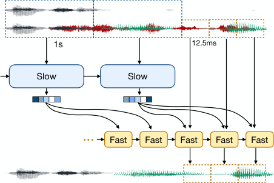
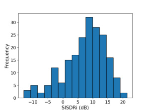
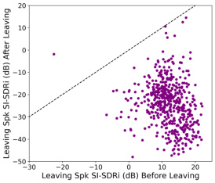
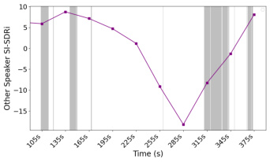

# Proactive Hearing Assistants that Isolate Egocentric Conversations

> 这是机器辅助生成的客观摘要笔记。教学版精读笔记由用户按节奏触发后单独成稿。

## 一句话讲什么（TL;DR）
让助听器自动听出"你在跟谁说话"，实时把那几个人的声音放大、其他人压下去，无需你按按钮选。

## 这篇论文要解决什么问题（Why this paper）

**先想象一个画面**：你戴着助听器在一家很吵的火锅店，对面坐着两个朋友在聊新工作，隔壁桌正激烈讨论世界杯，背后服务员喊"38 号桌可以上菜了"。你的耳朵其实想专心听对面那两个朋友——但助听器只会把"所有声音一起放大"，结果你越听越累。这就是听障群体每天都在面对的"鸡尾酒会问题（cocktail party problem，多人嘈杂时听不清目标声）"。

- 现有的助听器/AirPods/降噪耳机是"反应式"的：用户得手动告诉设备"我要听这个方向 / 这个人"。但真实对话里，说话人可能站得很散、超过两人、会换位置，每说一句话就掏手机点一下根本来不及。这就像你想用一台只能"按方向开火"的相机拍一群在跑动的小孩——等你瞄好，画面早就过了。
- 之前学术界做的 Target Conversation Extraction（TCE，目标对话提取）虽然思路接近，但是离线模型（要预先看到未来几秒的音频才能算）、单耳麦克风、还需要预先注册好的声纹——这三个限制叠在一起意味着它根本没法塞进一个真实的耳机里跑。
- 本文要做的是**实时、在设备上、从佩戴者自己的双耳麦克风**自动判断"谁在和我说话"，把对方的声音留下来，其他全部压掉。换句话说：助听器要从"被动的麦克风"升级成"会自己判断你在跟谁聊天的伙伴"。

**它和你日常用的产品是什么关系**？把这篇论文放进消费品的版图里看会更直观：

- **AirPods 的"对话感知（Conversation Awareness）"模式** = "检测到你开口就把背景音降一档"——但它不知道"你在跟谁说话"，更不会做语音分离。本文是这条路线往前走两步：从"降背景"升级到"识别对话伙伴 + 单独提取他们的声音"。
- **苹果/Google 助听器认证（MFi Hearing Aids）和 Phonak 等大厂助听器** = 现在还在做"按钮选方向 / app 选模式"的反应式交互。本文相当于给这条产品线提出了"主动模式"的论文级原型。
- **类比 LLaVA 之于 ChatGPT 的图像功能、SayCan 之于扫地机器人**：这是"实验室原型 → 量产功能"链条上的第一棒。论文层面把可行性证明了（实时、跨语言、6.8 小时真人录音），后续 1-2 年才会被产品化。
- **作者团队 Gollakota Lab（华大计算机系，UW）** 是"可穿戴音频 AI"这条线的代表实验室——Semantic Hearing、Look Once to Hear、Sound Bubbles 都出自这里，而且都拿到了顶会（UIST/CHI/Nature Electronics）。读这篇相当于看清整条产品线的方向。

## 用了什么方法（How）



### 1. 自语作锚（self-speech anchoring）— 用"我自己说话的样子"代替注册声纹

**类比**：想象你在一个聚会里走进一群陌生人，但你身上有一个会发光的徽章——只要徽章在亮，你就知道"哪些人是真的在跟徽章说话"。本文的徽章就是"佩戴者自己的嘴"。

**它在干什么**：佩戴者自己的嘴离耳麦最近、声音最大也最稳定，所以先用一个 **beamformer（波束成形器，多麦克风版的"声学探照灯"）** 把自语抽出来，作为"我是谁、我在说话"的锚信号。系统只在你开口说了至少 5 秒后才激活——这一招直接绕过了"要预先注册声纹"这个工程麻烦。

**关键步骤（pipeline）**：
1. 双耳混音 `x ∈ R^(2×t)` 进入 beamformer
2. beamformer 朝佩戴者嘴的方向"打探照灯"，输出单声道自语 `s_self`
3. `s_self` 与单声道混音 `x_mono` 在通道维拼接，喂给慢模型
4. 系统检测到自语持续 ≥ 5 秒后开始输出对话伙伴的语音

**关键超参 / 数字**：beamformer 是 174K 参数的轻量级网络，6 个 GridNet block，hidden = 32；STFT chunk = 96 samples（6 ms），lookback 96 samples（4 ms），lookahead 64 samples（6 ms）；先在 LibriSpeech 合成的 20K 双耳混音（1-5 个干扰说话人，SNR 均匀采样 -5 ~ 20 dB）上预训练 200 epoch，再用 9 名参与者 + 15 个房间录的 3 小时真人自语 fine-tune 300 epoch。

**为什么这么设计**：消融里作者比了一手"用预先注册的 d-vector 声纹（Variani 2014 那种 256 维向量）"——结果 SISDRi 比"自语锚"低 2.65 dB。原因是：声纹是"压成一个点的静态身份"，而自语是"持续流出的时间序列"，能让模型从中读出节奏、停顿、说话风格——信息量大得多。这也解释了为什么 Look Once to Hear 那篇要"看一眼注册"，本文却能"开口即用"。

**换成别的会怎样**：消融里还做了"用真实自语 vs beamformer 抽的自语"的对照——SISDRi 差距小于 0.38 dB，说明 beamformer 抽的就够好，工程上不必追求"完美自语"。

> **读到这里你可能在想**：那系统怎么知道"对面那个人"是不是在跟我说话？光有自语没用啊？答案就在下一招——它根本不识别"声音是谁的"，只看"节奏对不对得上"。

### 2. Turn-taking（轮流说话）作为隐式监督信号

**类比**：两个人下围棋时，你不用看脸也能从落子节奏猜出"这两人是不是在对弈"——一个落子另一个会想几秒再落，几乎不会同时落子。对话也一样：人对话天然有交替、低重叠、配合默契这些规律。

**它在干什么**：模型不学"这是 Alice 的声音"这种声纹知识，而是学"对话节奏的统计分布"——什么时候该停、停多久、谁接、重叠多少（论文 §J 给的真人统计：turn-change 频率 6.2 次/分钟，turn 平均时长 8.2 秒，重叠比例只有 1.3%，FTO 平均 0.18 秒——这些数字本身就是"人对话长什么样"的指纹）。

**关键步骤（隐式学习）**：损失函数没有直接监督"轮次"——只监督"重建目标对话"。但因为训练数据里目标对话和干扰对话的 turn-taking 分布不同（同一个对话里参与者互相配合，跨对话不配合），模型必须学会"识别配合的节奏"才能正确分离。这是一种"通过 reconstruction 间接学到节奏"的范式。

**为什么这么设计**：跨语言迁移的关键就在这——Stivers 2009 在《PNAS》上发过一篇"全球 10 种语言的 turn 间隙分布"研究，表明虽然均值有差异（日语略长、英语略短），但**整体形态高度相似**。所以本文用英文训出来的模型，迁移到中文（RAMC，SISDRi 6.5 dB）和日文（Japanese Duplex，SISDRi 7.92 dB）效果都不错。

**换成别的会怎样**：消融里有一个非常漂亮的实验——人工扰动 silence 时长（标准差从 0 加到 3 秒），SISDRi 从 6.75 dB 一路掉到 4.16 dB（Table 5）。这等于把模型按住直接告诉你："它真的在用 turn-taking 节奏，不是其他线索"。

### 3. 双模型架构（dual-model）— "反射神经" + "战略大脑"

**类比**：人开车的时候，眼睛 + 反射神经负责"看到前面有东西马上踩刹车"（毫秒级），但你的大脑还在后台规划"前面 500 米要不要变道"（秒级）。本文把听觉系统也拆成这两层。

**它在干什么**：
- **快模型（streaming model，491K 参数）**：每 12.5 ms 跑一次（一小段音频，比一次眨眼还短），用单向 LSTM（Long Short-Term Memory，长短期记忆网络，一种按时间顺序处理序列的网络），输出当前这小段的目标对话，跑在低功耗嵌入式板 **Orange Pi 5B**（一种类似树莓派的开发板）上。
- **慢模型（conversation embedding model，986K 参数）**：每 1 秒跑一次，吃过去 1 秒的混音 + beamformer 抽的自语，用带 attention（注意力机制，让模型回头看历史的能力）的 **TF-GridNet**（Time-Frequency GridNet，把声音频谱图当成 2D 图像处理的网络）生成一个 "对话嵌入向量（conversation embedding，把"现在这场对话长什么样"压成的一串数字密码）"。这个向量喂给快模型当条件。

**关键架构细节**（从原文 §A 抠出来的人话版）：
- 两个模型都基于 TF-GridNet，输入是 STFT 后的复数频谱（实部虚部拼通道维成 `R^(2C×F×L)`）
- 慢模型 6 个 extraction block，每个 block 含"局部模块（双向 LSTM 处理 1 秒内的频域和时域）" + "全局模块（自注意力跨多个 1 秒块，因果掩码，4 个 attention head，绝对位置编码）"
- 快模型也是 6 个 extraction block，但全局模块**整个砍掉**，时域 LSTM 改成**单向**（不能偷看未来），这样才能流式输出
- 快模型怎么用慢模型给的 embedding？答案：在第 1、2 个 extraction block 之间做 **element-wise 乘法（feature-wise modulation）**——把 embedding 当成"调制信号"刷在快模型的 feature map 上，类似 FiLM 那种条件机制

**关键数字**：
- latent dim D = 32，LSTM hidden = 32（非常小，刻意压低嵌入式延迟）
- STFT chunk = 200 samples（12.5 ms），lookback/lookahead = 32 samples（2 ms），输出窗口 = 232 samples
- 快模型在 OrangePi 5B 上 12.5 ms 块平均处理 8.9 ms，峰值内存 86.33 MB
- 慢模型在 Apple M2 上 1 秒块平均 41.3 ms，峰值内存 591.47 MB

**为什么这么设计**：核心矛盾是 self-attention 内存复杂度 O(n²)，对话越长内存越炸；但你又需要长上下文（消融证明少于 10 秒就开始掉点）。**双模型的本质是把 attention 的 O(n²) 摊薄到 1 秒一次，而每秒之间的实时输出靠便宜的 LSTM 顶住**。还有个隐藏好处：慢模型可以放在手机上跑，耳机只跑快模型，蓝牙传一个小 embedding 就够，**省电、省带宽**。

**换成别的会怎样**：单模型（去掉慢模型，让快模型直接吃自语和混音）SISDRi 只有 1.45 dB，对比双模型的 12.48 dB。这个 11 dB 的鸿沟说明：**没有长上下文的"对话感"，模型几乎做不了这个任务**。

### 4. Slow model 的因果延迟（causal latency shift）— 一个反直觉的工程小心机

**类比**：你让助理每秒给你画一张"过去 60 秒发生了什么"的地图。如果地图画的是"现在"，助理就得偷看未来——不可能。所以助理只能画"5 秒前的过去 60 秒"。

**它在干什么**：原文 §A 提到一个容易被略过的细节——慢模型最后会把输出"在时间轴上往后平移 T 秒（Shift backwards）"，开头补零。这等于显式承认"慢模型给的 embedding 滞后 1 秒"。

**为什么这么设计**：保证因果性。慢模型必须在某 1 秒结束后才能算这 1 秒的 embedding，所以快模型在第 N 秒只能看到第 (N-1) 秒的 embedding。听上去像缺陷，其实是优势：**慢模型可以彻底脱离实时约束，跑在 phone 上花 41.3 ms 处理 1 秒块都没关系，反正快模型不等它**。

**换成别的会怎样**：原文消融了 embedding 更新间隔从 1 秒变 4 秒，SISDRi 掉 1.22 dB——4 秒之内对话伙伴可能已经换了一轮，地图就过期了。

> **读到这里你可能在想**：那怎么训这个东西？现实里可没有 850 小时的"佩戴双耳麦克风的真人对话"录音。

### 5. 合成数据训练：用 PyRoomAcoustics 模拟"双耳第一视角"

**类比**：你想学画"一群人在公园下棋"，但找不到这种照片，于是你拿"单人下棋的照片"+"公园背景照"用 PS 拼起来。本文也是这么干的：

**它在干什么**：现成的 egocentric 数据集要么主持人单一（**EgoCom**，一份第一视角对话数据，但所有录音都是同一个主持人）、要么没有"第三人称双耳"基底来合成干扰对话（**EasyCom** 是这种）。所以作者从 **Candor**（850 小时英文双人对话）、**LibriTTS**（合成英文语音库）、**RAMC**（180 小时中文双人对话）等数据集出发，按 RAMC 的时间戳把语音重新拼装成 2-5 人对话，再用 **PyRoomAcoustics**（一个开源的房间声学模拟工具，能算出"声音从某个嘴里发出，经过墙壁反射后到达耳麦时长什么样"）模拟房间和耳麦位置做空间化。

**关键步骤（合成 pipeline）**：
1. 从 RAMC 取 2 人对话的时间戳（"Alice 说 0-3.2 秒，Bob 说 3.4-7.1 秒，..."）
2. 把每个时间槽随机塞进 LibriTTS 里某个英文说话人的语音 → 得到合成 2/3/4/5 人对话
3. 用 PyRoomAcoustics 模拟一个 5-10 m × 5-10 m × 3-4 m 的房间
4. 佩戴者放在距房间中心 0-1 m 处，双耳麦克风离头中心 N(15 cm, 2 cm)
5. 其他说话人放在距佩戴者 0.5-1.5 m，每人嘴的位置在头下方 N(18 cm, 2 cm)、前方 N(10.75 cm, 2 cm)
6. 房间混响 RT60 从 [0.15, 1] 秒均匀采样
7. 输出双耳 RIR（room impulse response，房间脉冲响应），与每段语音卷积得到双耳信号，相加得到最终混音

**关键数字（数据规模）**：
- Libri 系列：16K 训练 + 2.6K 验证 + 1K 测试（5 个子集，各 200 样本）
- Candor：7K 训练 + 0.9K 验证 + 0.5K 测试，按说话人 8:1:1 划分
- 每个样本 60 秒，输入 SNR 均匀采样 -10 ~ 10 dB
- 真实测试集：11 名参与者（21-39 岁，2 女 9 男），共 6.8 小时，2 人 / 3 人对话各 7 / 5 段，每段约 10 分钟

**为什么这么设计**：用真实 timestamp + 随机替换语音，能保证 turn-taking 节奏是真人的（关键），同时训练样本爆炸式增长（不必真录上千小时）。空间化用 PyRoomAcoustics 而不是更逼真的 SOFA RIR 数据库，是因为前者**可以无限采样新房间**，后者数量有限。

### 6. 三阶段训练：从粗到细打磨

1. **Stage 1（预训练）**：在合成（Libri 2/3spk + leaving）+ Candor 上联训快慢两个模型，120 epoch，初始 lr = 0.002，AdamW + weight decay 0.01，clip grad norm 1，batch size 16，**8 卡 L40s**。慢模型吃**真实自语**（不是 beamformer 输出）。
2. **Stage 2（空间化适配）**：把数据用 PyRoomAcoustics 空间化，慢模型改吃 beamformer 抽的自语，慢模型用 Stage 1 权重初始化，快模型从头训，50 epoch，lr 0.002，**8 卡 L40s**。
3. **Stage 3（真实节奏微调）**：扰动 silence/overlap（每段沉默从 N(0, 0.5s) 加噪）匹配真实"熟人对话"的节奏（真朋友间打断和重叠比合成数据多），42 epoch，lr 0.0005，**2 卡 A100**。

> **小总结**：这个 pipeline 把"算法核心创新（双模型 + 自语锚 + turn-taking）"和"工程化细节（合成数据、三阶段训练、模型小到能塞进嵌入式板）"分得很清楚。两条线缺一不可——只有创新没有工程化，跑不上 OrangePi；只有工程化没有创新，准确率上不去。

## 关键实验结果（What works）

> 看数字之前先记住：**SISDRi（尺度不变信噪比提升）**单位是 dB，每提升 3 dB 大致相当于"目标声变响一倍"；**准确率**是"模型把目标说话人选对了"的比例；**混淆率**是"把干扰当目标"的比例。

每个数字下面是「具体设置 + 数字 + 对比 + 现实意义」四行结构：

- **空间化 SpokenWOZ（OOD 英文）**
  - 设置：60 秒双人对话，PyRoomAcoustics 空间化，输入 SNR 均匀 -10~10 dB，目标说话人输入 SISDR 已经被空间化压到 -10 dB
  - 数字：SISDRi **11.95 dB**，准确率 **92.1%**，混淆率 **1.5%**，∆PESQ +0.52
  - 对比：基线 DeepFilterNet2 同设置下 SISDRi -3.45 dB（变得更糟）；这个 baseline 是商用语音增强模型，不知道"对话"概念
  - 现实意义：OOD 数据集（训练里完全没见过的数据来源）直接迁移还能拿这个分，目标说话人音量被显著拉高约 16 倍（10^(11.95/20) ≈ 4 倍声压 ≈ 16 倍能量）。混淆率 1.5% 意味着 100 次中只有 1.5 次把陌生人当对话伙伴

- **真实双耳录音（11 名参与者，6.8 小时）**
  - 设置：Sonic Presence SP15C 双耳麦 + 智能手机录音，开放话题（食物、爱好、旅行计划），输入 SNR 均匀 -10~10 dB
  - 数字：2 人对话 SISDRi **7.84 dB** / 准确率 **85.0%** / 混淆率 1.1%；3 人对话 SISDRi **6.00 dB** / 准确率 **73.4%** / 混淆率 3.7%
  - 对比：DeepFilterNet2 在这种场景下 SISDRi 接近 0（基本无效）；带 augmentation（Stage 3 silence 扰动）比不带高 1.73 dB（5.49 → 7.22）
  - 现实意义：纯合成数据训出来的模型能 zero-shot 迁移到真人录音；3 人对话掉一档是因为训练的 3 人 turn-taking 是合成的，分布和真人不完全一致

- **跨语言：日文 OOD SISDRi 7.92 dB / 中文 RAMC 6.50 dB**
  - 设置：模型只见过英文（Candor + LibriTTS 用 RAMC 时间戳），日/中文测试零样本迁移
  - 数字：日文 SISDRi 7.92 dB，中文 RAMC SISDRi 6.50 dB
  - 对比：DeepFilterNet2 在 RAMC 上 SISDRi -4.28 dB
  - 现实意义：你不用为每种语言重训一遍模型——这是全球化产品级部署的关键。Stivers 2009 提到日语 turn 间隙比英语略长，所以日文表现略低于英文也有学理依据

- **真机延迟（OrangePi 5B + Apple M2）**
  - 设置：100 次推理取均值，流式输入
  - 数字：快模型 12.5 ms 块平均 **8.9 ms**（峰值内存 86.33 MB）；慢模型 1 秒块平均 **41.3 ms**（峰值内存 591.47 MB）
  - 对比：蓝牙传输延迟 10-30 ms、互联网 100-200 ms——本地推理至少省 1-2 个数量级
  - 现实意义：处理音频用的时间比那段音频本身还短，可以一段接一段无限串下去而不堆积；耳机端只跑 86 MB 的快模型，OrangePi 5B 这种 100 元级的板都能扛

- **多人对话泛化（4-5 人未见过场景）**
  - 设置：Libri 4spk / 5spk 仅作测试集（训练只见过 ≤3 人）
  - 数字：4 人 SISDRi 11.94 dB，5 人 11.85 dB
  - 对比：2 人 12.48、3 人 12.03 dB——几乎不掉
  - 现实意义：模型没"记住"特定人数，而是学会了识别"配合的节奏" → 这是 turn-taking 监督的关键证据

- **噪声鲁棒性（WHAM! noise）**
  - 设置：Libri 2spk + WHAM! noise，先 zero-shot 再 fine-tune
  - 数字：zero-shot SISDRi 10.37 dB，fine-tune 35 epoch 后 11.84 dB
  - 现实意义：模型对环境噪声不敏感，拿真实带噪数据稍微调一下就能在工厂、餐厅等场景部署

- **冷启动 / 转场（Table 6, 7）**
  - 对话伙伴刚开口的前 0-2 秒 SISDRi 只有 4.77 dB；2-4 秒后爬到 8.04 dB
  - 目标 / 干扰对话 turn 切换间隔 < 1 秒时（占 11.3%），SISDRi 从 8 dB 掉到 4.98 dB
  - 现实意义：每个新加入对话的人前 2 秒会"含混不清"；密集派对里"撞 turn"频繁会持续掉点

- **关键消融**
  - 单模型 vs 双模型：1.45 dB vs 12.48 dB → 长上下文 embedding 是命脉
  - context length: full → 10s → 5s → 1s，SISDRi 跌 0~2.12~4.06~5.74 dB → 模型在用几十秒的历史
  - embedding 更新间隔 1s → 4s：SISDRi 掉 1.22 dB
  - 自语锚 vs 注册声纹（d-vector）：自语高 2.65 dB
  - turn-taking 扰动 SD 0 → 3 秒：SISDRi 6.75 → 4.16 dB（线性下降，铁证模型在用节奏）

- **主观评价（11 人用户研究）**
  - 5 分制 MOS：原始混音 1.88 分 → 模型输出 4.30 分
  - 噪声抑制 4.29、理解度 4.35、专注省力度 4.45
  - 现实意义：这不是干 dB 数字，是真人觉得"听起来好太多"





上面这张散点图（论文 Fig. 3）展示的是 Libri (leaving) 测试集——一个说话人开始时是目标对话的一员（SISDRi 正值，被增强），中途切换到干扰对话后 SISDRi 变负（被压制）。这不是静态分类，是动态追踪——模型每秒重新评估"谁还在跟我聊"。



这张是 Fig. 5——真实录音里佩戴者沉默超过 2 分钟时 SISDRi 直接掉到 0 以下（紫线），佩戴者重新开口（灰色区域）后又恢复。视觉化地展示了"自语锚"的双刃剑特性。

## 我读完后该懂的几个术语

- **Egocentric audio（第一视角音频）**：从佩戴者自己耳朵位置录到的双耳音频。类比第一人称视角的 vlog，但是声音版。**本文 §3 整章的输入都是这个**。
- **Beamformer（波束成形器）**：用多麦克风的相位差当"声学探照灯"，把某个方向（这里是嘴）的声音聚焦出来。类比开会时把麦克风对准发言人。**本文 §3.2 用来抽自语**。
- **Turn-taking（轮流发言）**：对话学里的核心规律——人说话会交替、几乎不重叠、停顿很短。本文模型抓的就是这个节奏，而不是声纹。**§3.1 立论 + §6 消融都靠它**。
- **SISDRi（Scale-Invariant SDR improvement，尺度不变信噪比提升）**：衡量"目标声相对输入混音被加强了多少 dB"。越高越好；类比"原本听到的目标声是 1 分贝杂音里的，现在变成 10 分贝里的"。**Table 1-7 主要指标都是它**。
- **TF-GridNet（Time-Frequency GridNet）**：一种在时频域（STFT 出来的频谱图）做语音分离的网络主干，本文快慢模型都基于它。类比把声音拍成频谱热力图后用类似图像网络的方式处理。**§3.2 模型骨架**。
- **Conversation embedding（对话嵌入向量）**：把"当前正在进行的对话长什么样"压缩成的一串数字。类比把一首歌压成一个标签。**慢模型的产物，喂给快模型当条件**。
- **Confusion Rate（CR，混淆率）**：本文新定义的指标——模型把干扰说话人当成目标的频率，越低越好。**Table 1 的关键安全指标**。
- **Out-of-distribution（OOD，分布外）**：测试用的数据跟训练数据来源不一样，相当于"高考考了课外题"。**SpokenWOZ、日文测试都属于这一类**。
- **Binaural（双耳）**：两个麦克风各放一只耳朵旁，能保留左右耳之间的相位差和强度差。本文真机用的 Sonic Presence SP15C 就是入耳级双耳麦。
- **PESQ / ∆PESQ（Perceptual Evaluation of Speech Quality）**：ITU-T P.862 标准的客观语音质量打分，模拟人耳听感，约 0-4.5 分。比 SISDRi 更接近"听起来舒服程度"。
- **STFT（Short-Time Fourier Transform，短时傅里叶变换）**：把时域音频切成小窗、每窗算频谱、得到 2D"时频图"。本文用 12.5 ms 窗 + 2 ms lookahead/lookback。
- **LSTM（Long Short-Term Memory，长短期记忆网络）**：按时间顺序处理序列的循环网络，能"记住"前几步状态。本文快模型用单向 LSTM（只看过去），慢模型局部模块用双向 LSTM。
- **Self-attention（自注意力）/ Causal mask（因果掩码）**：让序列里每个位置回头看历史所有位置的机制；"因果"=只看过去不偷看未来，用下三角掩码实现。慢模型全局模块靠这个建长上下文。
- **RT60（混响时间）**：声音衰减 60 dB 所需时间，单位秒。本文 PyRoomAcoustics 模拟 0.15-1 秒覆盖浴室到客厅。
- **FTO（Floor-Transfer Offset，话语权转移偏移）**：一个人停下到下一个人开口的时间差，负值=重叠，正值=空隙。本文真人录音 FTO 均值 0.18 秒，和 Stivers 2009 全球语料一致。

## 数据集 / 实验设置详情

**训练用了哪些数据集？**

| 数据集 | 来源 | 规模 | 角色 | 训练阶段 |
|---|---|---|---|---|
| Candor | Reece 2023, Science Advances | 850 小时英文 2 人 Zoom 对话 | 真实节奏样本 | Stage 1 + 2 |
| LibriTTS | Zen 2019 | 多说话人英文 TTS 库 | 当语音"皮肤" | 全程 |
| RAMC | Yang 2022 (MagicData) | 180 小时中文 2 人对话 | 给时间戳 + 中文测试 | 训练用 timestamp，中文音频只测试 |
| SpokenWOZ | Si 2023, NeurIPS | 大规模英文任务对话 | OOD 测试集 | 仅测试 |
| Japanese Duplex | Magic Data 2025 | 日文双工对话 | 跨语言测试 | 仅测试 |
| WHAM! | InterSpeech 2019 | 城市背景噪音 | 加噪鲁棒性 | 噪声实验 |
| LibriSpeech train-clean-360 / dev-clean | 经典 ASR 库 | 多说话人英文 | 训 beamformer | 仅 beamformer 阶段 |

**训练 / 验证 / 测试怎么分？**
- Libri 系列：16K 训练 + 2.6K 验证 + 1K 测试（5 个子集 ×200 样本）
- Candor：按说话人 8:1:1 划（保证测试集没见过任一训练说话人）
- 真实数据：11 名参与者（21-39 岁，2 女 9 男，UW 校园招募，每人 $15 报酬，IRB 批准）

**baseline 选了什么？为什么？**
作者只比了 **DeepFilterNet2 (Schröter 2022)** 一个 baseline——这是工业界使用最广的实时降噪/语音增强模型之一，部署在很多嵌入式设备上。挑它的理由是"看一个不知道'对话'概念的强降噪模型在这种任务上能做到什么"——结果 SISDRi 全场负值，证明这是个**全新任务**，老的语音增强 baseline 根本搞不定。论文没和 Target Conversation Extraction (Chen 2024b, 同组前作) 直接比，因为那是离线 + 单耳 + 要声纹的，跟"实时双耳无声纹"的设定不公平。

**硬件配置 / 训练时长**：
- Stage 1：120 epoch，**8 卡 L40s**，batch 16，初始 lr 0.002 AdamW，约 3-4 天
- Stage 2：50 epoch，**8 卡 L40s**，batch 16，约 1-2 天
- Stage 3：42 epoch，**2 卡 A100**，batch 4，lr 0.0005，约 1 天
- Beamformer：合成数据 200 epoch + 真实数据 300 epoch（每 epoch 20K iter），batch 8

**推理硬件**：
- 快模型 → Orange Pi 5B（RK3588 SoC，约 ¥600，4 大核 A76 + 4 小核 A55）
- 慢模型 → Apple M2 silicon（手机级算力代表）

## 关键公式 / 算法（人话翻译版）

原文里数学符号不重，但有几个核心思路值得拆开看。

### (1) 双模型条件机制

```
原文（§A 描述）：
  E = SlowModel(STFT(x_mono), STFT(s_self))    # 每 T 秒输出一次 embedding
  E_shifted = shift_back(E, T_seconds)         # 因果延迟，开头补零
  Y = FastModel(STFT(x_mono), E_shifted)       # 每 τ 秒输出
  其中条件机制 = element-wise 乘法发生在第 1、2 个 extraction block 之间

人话翻译：
  - SlowModel 看过去 1 秒的混音 + 自语，吐出"对话长什么样"的密码 E
  - 这个密码会在快模型的中间一层被"刷"上去，类似给 GPT 喂 system prompt
  - shift_back 是说"我现在拿到的密码其实是 1 秒前算出来的"——保证因果

每一项的来源：
  - x_mono 来自双耳混音直接取一个声道（节省算力，§3.2.1 说不要双耳）
  - s_self 来自 beamformer，用佩戴者嘴的方向打探照灯
  - E 是 R^(D×F×L) = R^(32×F×L) 维张量，不是单个向量
```

### (2) 损失函数：负 SNR

```
原文：negative SNR loss
人话：直接最大化"输出和真值的相似度"，最小化"输出和真值的差"
公式：L = -10 * log10( ||y_true||² / ||y_true - y_pred||² )
为什么不用 MSE？因为 MSE 对整体音量敏感——你把所有声音都缩小一半，MSE 大但听感不变。SNR 关注"信号 vs 误差"的比例，更接近人耳直觉。
```

### (3) Beamformer 的复合损失（finetune 阶段）

```
原文：L(x̂, x) = 10 ||x - x̂||₁ + L_MR(x̂, x)
人话翻译：
  - 第一项：10 倍权重的 L1 距离（让波形对齐）
  - 第二项：multi-resolution STFT loss（在 3 种 FFT 尺寸 [1024, 2048, 512] 下分别算频谱差，权重各 1/1/4）
  - 整体设计是"既要时域对齐又要频域听感对齐"
```

### (4) 准确率 / 混淆率定义（自创指标）

```
对每个对话伙伴 turn：
  - Acc 命中条件：partner SISDRi > 0  AND  partner SISDRi > 所有 interfering SISDRi
  - CR 命中条件：interferer SISDRi > 0  AND  interferer SISDRi > partner SISDRi

人话：
  - 准确率高 = 在每一句对话伙伴说话时，模型确实把他放大了，且没把别人放得更响
  - 混淆率高 = 模型反而把陌生人放大了——这是 safety-critical，所以单列指标
```

## 实操 FAQ（如果你想复现）

**Q: 这模型多大？显存要多少？我的 4070 跑得动吗？**
- 总参数：快模型 491K + 慢模型 986K + beamformer 174K ≈ **1.65M**（极小）
- 推理峰值显存：快 86 MB，慢 591 MB，加起来不到 1 GB
- 你的 RTX 4070（12 GB）训练都绰绰有余——不过原文用 8 卡 L40s 是为了 batch 16 加速，单卡能跑通但慢很多

**Q: 数据集在哪下？要授权吗？**
- Candor：[Reece 2023, Science Advances](https://www.science.org/doi/10.1126/sciadv.adf3197)，公开下载，需要邮箱注册
- LibriTTS：[OpenSLR #60](https://www.openslr.org/60/)，CC BY 4.0，免费
- RAMC：[MagicData](https://magichub.com/datasets/mandarin-conversational-speech-corpus/)，需要注册申请，研究用免费
- SpokenWOZ：[GitHub](https://github.com/AlibabaResearch/DAMO-ConvAI/tree/main/spokenwoz)，研究协议
- Japanese Duplex：MagicData 商业数据集，可能要付费（论文 "Beijing Magic Data Technology Co., Ltd., 2025"）
- WHAM!：[wham.whisper.ai](http://wham.whisper.ai)，研究免费

**Q: 代码在哪？官方 repo 还活着吗？**
- 项目页：[https://proactivehearing.cs.washington.edu/](https://proactivehearing.cs.washington.edu/)（论文 §1 提供）
- 论文未明确给出 GitHub 链接 → 需要去项目页 / 联系作者，**原文未提及代码 release 计划**
- 同组前作（如 Semantic Hearing、Look Once to Hear）多数有 GitHub，本文大概率会跟随这个传统

**Q: 推理一次要多久？**
- 流式推理：每 12.5 ms 音频块在 OrangePi 5B 上 8.9 ms 处理完
- 慢模型每 1 秒块在 Apple M2 上 41.3 ms
- 端到端听感延迟：12.5 ms（块大小） + 8.9 ms（处理） + ~10 ms（蓝牙，如果 split 到 phone）≈ **30 ms**——低于人耳"察觉延迟"阈值（~50 ms）

**Q: 训练一次要烧多少卡时？预估成本？**
- 8×L40s × 4 天 ≈ **768 GPU·hours**（Stage 1）
- 加上 Stage 2、3 和 beamformer 训练，估算总共 **1500-2000 L40s GPU·hours**
- L40s 在云上（Lambda Labs / RunPod）约 $1.5-2/小时 → **$3K-4K 训练成本**
- 一个研究生的小预算可以承担。如果用 H100（更快但贵）能压到 1 周内

**Q: 我能不能把它跑在自己的 AirPods 上？**
- 不能直接跑——AirPods H2 芯片不开放第三方代码部署
- 学术验证用 OrangePi 5B + Sonic Presence SP15C 双耳麦 + 智能手机，整套硬件 < ¥1500，可自己组
- 慢模型可以放手机上（任何中端 Android/iPhone 都能跑），快模型放在耳机或耳挂式设备上

## 失败案例与边界

论文 §5.2、§7、Fig. 5 都明确讨论了模型崩的场景。**这是这篇论文最值得学习的地方之一——作者很诚实**：

- **场景 1：佩戴者长时间沉默**（Fig. 5）。佩戴者超过 2 分钟不说话时，SISDRi 直接掉到 0 以下。直觉上说得通——"自语锚"消失了，模型相当于被蒙眼。重新开口后能恢复，但中间这段都是无效输出。
- **场景 2：双方对话的 turn 切换在 1 秒内"撞车"**（Table 7）。当目标对话的 self → other 转换 和 干扰对话的转换间隔小于 1 秒时（这种情况占真人录音的 11.3%），SISDRi 从 8 dB 掉到 4.98 dB。模型只看节奏不看内容，节奏撞了它就分不清。
- **场景 3：3 人对话 vs 2 人对话**：真人测试 SISDRi 7.84 → 6.00 dB，准确率 85% → 73%。原因是训练数据的 3 人 turn-taking 是用 RAMC 的 2 人 timestamp 硬塞 3 个 LibriTTS 说话人合成的——和真人 3 人圆桌的节奏分布不同。
- **场景 4：对话伙伴刚开口的前 2 秒**（Table 6）。SISDRi 只有 4.77 dB，要等 2 秒后爬到 8 dB。意味着每个新加入的人前 2 秒"听不太清"。
- **作者明说的局限**：被动听讲座 / 看电影 / 偷听等场景**根本不是设计目标**（§7 第一段）。这不是 bug，是 by-design——但用户买回去会发现它"在我安静听别人说话时不工作"。

**这告诉我们什么**？模型的本质局限是"它把自语当唯一输入信号"——这个设计选择换来了"无需注册"，但代价是"佩戴者不说话就失灵"。后续工作要解决就得加内容理解（content-aware）或多模态（视觉、加速度计）。

## 这篇论文之后的延伸阅读

3-5 条具体推荐，按"必读 → 可读"排序：

1. **Chen 2024b, Target Conversation Extraction (TCE)** — **必读，前传**。同组工作，本文很多招数（时间保留法、turn-taking 监督、合成数据）都直接继承自它。读完能理解"从离线单耳 → 实时双耳"的工程飞跃量。
2. **Veluri 2023, Semantic Hearing (UIST)** — **必读，姊妹篇**。同组的"用语义按主题听声音"路线，跟本文是"两条产品线":一个按主题选（"我要听狗叫"）、一个按对话选。
3. **Veluri 2024a, Look Once to Hear (CHI)** — **必读，姊妹篇**。"看一眼目标人完成注册"路线，跟本文形成"一眼注册 vs 自动判断"的设计对比。三篇放一起读能完整看清 Gollakota 实验室的"可编程耳朵"路线图。
4. **Wang 2023, TF-GridNet (ICASSP)** — **想理解模型骨架就读**。本文快慢模型都基于它，原文讲了为什么时频域 + 双向 LSTM + self-attention 是 SOTA 语音分离的好骨架。
5. **Pan 2024, NeuroHEED** — **想看竞争路线就读**。脑电解码注意力派的代表，给你看看"另一条路"长什么样：精度更高，但要贴电极。
6. **Stivers 2009, Universals and cultural variation in turn-taking (PNAS)** — **想理解 turn-taking 跨语言学理就读**。这篇是本文跨语言泛化结果的理论根基，统计了 10 种语言的 turn 间隙分布。
7. **Chen 2025, LlamaPIE: Proactive in-ear conversation assistants** — **后续展望**。同组在 ACL Findings 2025 的工作，把 LLM 接进了"主动入耳"的 loop，跟本文形成"听清 → 听懂 → 主动建议"的链路。

## 这篇论文的局限 / 我看出的疑点

每条局限下面是「用户实际会遇到什么 + 后续工作能不能解决」两层。

- **依赖佩戴者主动说话**：如果你两分钟没开口，模型就开始失效（Fig. 5 直接展示了这点）。
  - 用户实际场景：**听讲座、看电影、安静地听别人聊天**这种"我只听不说"的场景做不了；甚至你只是认真听对方讲了 3 分钟，效果都会衰减。等公交时戴着也没用。
  - 后续能不能解决：作者 §7 直说"被动听不在设计范围"——这是 by-design 不是 bug。要解决得换路线，比如多模态加视觉（看你眼睛朝向）、加速度计（看你头转向哪）、或加一个 LLM 兜底"理解"对方在说什么。Chen 2025 LlamaPIE 已经在这条路上了。
- **同时开口 / turn 边界撞车时掉性能**：当目标对话和干扰对话的轮次切换发生在 1 秒内（Table 7 里的"0-1s gap"），SISDRi 从 8 dB 掉到 5 dB。模型只看节奏不看内容，遇到"两边同时换人"就分不清。
  - 用户实际场景：在密集的派对、节庆酒会里，这种"撞 turn"会非常频繁；论文统计真人录音里有 11.3% 的 turn 切换在 1 秒内撞车。
  - 后续能不能解决：作者自己提到方向——加 lightweight content-aware 模型（用语言模型判断"内容是否衔接"）。代价是延迟和计算量。
- **3 人对话比 2 人差一档**（真实数据 SISDRi 7.84 → 6.00，准确率 85% → 73%）。
  - 用户实际场景：4 人围圆桌吃饭、家庭聚会时效果会比双人面对面坐差一档。家庭场景反而是助听器最常见的需求。
  - 后续能不能解决：作者明说"在真实 3 人对话上 fine-tune 应该能涨"——但需要先收集这种数据。这是个数据问题不是模型问题，可解。
- **真人测试集只有 11 个参与者、英文（UW 校园招募，21-39 岁偏年轻）**，文化/语言差异对 turn-taking 模式的影响（作者自己也提到 Stivers 2009）没有大规模验证。
  - 用户实际场景：日本人 / 北欧人对话 turn 间隙更长（日语日常 250-400 ms vs 英语 0-200 ms）；老年人语速慢、间隙长。这两组都没充分验证。
  - 后续能不能解决：作者 §7 第三段建议"按语言/文化做 fine-tune"——可解，但要做大规模真人数据采集。
- **冷启动延迟**：Table 6 显示当对话伙伴刚开口的前 0-2 秒，SISDRi 只有 4.77 dB；要等 2 秒后才能爬到 8 dB。
  - 用户实际场景：每个新加入对话的人前 2 秒会"含混不清"。比如有人刚走过来打招呼，第一句"Hi 好久不见"可能听不清。
  - 后续能不能解决：可以靠"对话 embedding 缓存"和更短的 attention window 改善，但这是模型架构 vs 延迟的根本权衡。
- **错误识别带来的安全风险**（§7 ethical 段）：模型如果错把陌生人当成对话伙伴，可能在关键场景（医疗、应急、商业谈判）造成沟通失败。混淆率 1.5-3.7% 看起来低，但乘以一天上百次 turn，每天可能有几次错误。
  - 用户实际场景：用户没有 fail-safe 退路——他听不到模型滤掉的声音，也不会知道自己漏听了什么。
  - 后续能不能解决：作者提议加物理按钮"暂停 / 重置"——是兜底方案，但治本要做置信度估计 + 当置信低时 fallback 到原始混音。
- **对房间声学的过拟合风险**：训练用 PyRoomAcoustics 模拟矩形房间，真实场景有走廊、户外、车里、玻璃幕墙这些"非标准声场"。Table 8 显示 beamformer 在未见房间上掉点不多，但完整系统在户外、车厢内的表现没测。
  - 用户实际场景：地铁、咖啡馆角落、户外排队等没出现在训练分布里的环境，效果未知。
  - 后续能不能解决：增加更多 RIR 数据集（如 BUT ReverbDB、SOFA RIR）做空间化即可，工程问题。

## 与其他 12 篇的关联

- **同一组（Gollakota 实验室）的 Target Conversation Extraction（Chen 2024b）**是直接前作：本文把它从离线、单耳、要声纹改成了实时、双耳、自语锚定。从训练流程看，本文还直接复用了 Chen 2024b 的"时间保留法"做合成数据——同一个团队、同一个产品线在迭代。
- **和 Semantic Hearing / Look Once to Hear（Veluri 2023, 2024a）一脉**：同样是 Gollakota 组的"可编程的耳朵"路线。Semantic Hearing 让你说"我要听狗叫"按主题过滤；Look Once to Hear 让你看一眼目标人完成注册；本文则是"主动推断"，连看一眼都不用。三篇放在一起读能看出这条路线的演化方向：用户的操作越来越少，模型推断越来越多。
- **听觉智能这个主题里的射频派/EEG 派**（O'Sullivan 2014，Pan 2024 NeuroHEED 等）走的是脑电解码注意力——直接读你的脑电信号判断你在听谁。本文用的是对话学线索——更轻量、能落到耳机上，但代价是要你"在场说话"。换句话说：脑电派精度更高但要贴电极，本文派牺牲一点精度换可穿戴落地。
- **VLA / 多模态机器人**那一组（OpenVLA、π0 等）共享一个深层思路：**用大模型抽 latent embedding 当"低频规划信号"喂给小模型做"高频执行"**。VLA 里慢的是 VLM、快的是 action head；本文里慢的是 TF-GridNet attention、快的是 LSTM。这种"双速架构"在边缘部署 AI 里似乎要变成通用配方。

## 我建议的阅读顺序

零基础读者读这篇论文的推荐路线：

1. **先读摘要 + Introduction（§1）**：搞清楚"反应式 vs 主动式助听器"这个对立。不懂技术细节没关系，把"用户得不得手动选"这个对立刻在脑子里就行。
2. **看 Figure 2（架构图，images/img_004.jpg）**：花 5 分钟把"快模型 + 慢模型 + beamformer"这三块拼图摆清楚。这张图理解了，整个 §3 都不用从头啃。
3. **跳读 §3.1 自语锚定 + §3.2.1 双模型动机**：这两段是全文的核心创意，作者解释得也最清楚。其他 §3 的具体网络细节先跳过。
4. **读 §5 真实世界录音的实验设置**：看他们怎么招了 11 个人录 6.8 小时——理解了他们用的是 Sonic Presence SP15C 双耳麦 + 智能手机这种"现成消费级设备"，你会更信服结果的可迁移性。
5. **跳读 §4 实验表 + Table 6/7**：只看 SISDRi 和准确率两列，重点看 SpokenWOZ（OOD）、日文（跨语言）、3 人 vs 2 人这三组对比。
6. **跳过 §6 消融的具体数字、附录里的 beamformer 训练细节**：除非你要复现，否则这些是工程细节。最后回头读 §7 局限自我反思——能学到一篇好论文的"作者诚实度"长什么样。

## 为什么值得读 / 不值得读

真实场景落地的"主动式助听器"开门论文。如果你**只能读 1 篇**听觉智能论文，这篇够格——因为它把"实时性 vs 长上下文如何拆解、用 turn-taking 而非声纹做跨语言泛化、合成数据 → 真人迁移"三件事都讲得很扎实，而且配了真机数据。

如果你**能读 3 篇**，再加上 Semantic Hearing 和 Look Once to Hear，能看懂 Gollakota 组整条"可编程耳朵"路线的演化逻辑。如果你**能读 5 篇**，再加 NeuroHEED（脑电派）和 Chen 2024b（直接前作）会让你看清这个领域的两条主流路线和一条工程化收敛路径。

如果你做听觉智能、可穿戴音频、或多模态 egocentric 系统，必读；如果你只关心 VLA / 机器人本体控制，关联较远，可以只看双模型架构那段当作"边缘部署 AI"的参考案例。
