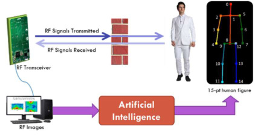
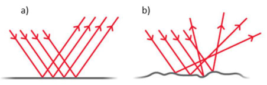
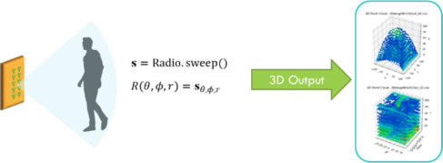

# Through-Wall Pose Imaging in Real-Time with a Many-to-Many Encoder/Decoder Paradigm

> 这是一份给"完全没接触过 AI、也没碰过雷达"的读者看的精读笔记。所有物理和公式都翻成人话，类比都来自日常生活。



---

## 1. 一句话讲什么（TL;DR）

一个 Wi-Fi 频段小盒子隔着墙照过去，就能画出屋里人的骨架动画——摄像头当老师，电波当学生，学一遍就会了。

更具体一点：输入是一个商用雷达（Walabot Developer，几百美元）发出去的电波被人体反射回来后形成的 3D 强度场；输出是屋内每个人的 15 关节点骨架，每秒约 18 帧，可以连成视频。关键技巧有两招：第一，用普通摄像头同步录像，跑 OpenPose 自动生成"标准答案"训练雷达模型；第二，模型用 CNN 提空间特征 + RPN 找多人 + LSTM 串时间，因为单帧雷达图看不全人。应用场景是火场搜救、医院老人监护、军警侦查——所有"看不见但需要看见"的场景。

*所以这一节是想说：这篇论文造了一个"穿墙人形雷达"，输出的不是黑白噪点，是 15 个关节点连起来的骨架视频。*

---

## 2. 这是个什么场景

你玩过捉迷藏吗？躲在门后、桌子底下，外面的人喊半天也找不到。现在把这事换个严肃版本：一栋房子着火了，烟把整层楼糊得跟黑墙一样。消防员站在门口，知道楼上"可能还有人"，但他不知道这个人在哪个房间、是站是躺、有没有动。每多 1 分钟搜，存活率就掉一截。普通摄像头被烟挡死，红外摄像头也一样——浓烟本身就是高温气体，红外图像上到处都是热源，根本分不清哪里是人。论文里给了一个数字：1994-2013 年间全球 6873 起自然灾害造成 135 万人死亡——其中相当一部分本来是有机会被"看见"的。

再换个温和点的场景。你家爷爷一个人住，你想知道他半夜起床上厕所有没有摔倒，但你不可能在他卧室装摄像头——老人会觉得"你天天盯着我洗澡换衣服？"

这两件事看起来八竿子打不着，但卡住的是同一个问题：我想知道屋里那个人是什么姿势，但看不见——烟、墙、家具挡在中间；也不能让他穿东西——昏迷的人没法自己戴手环，老人也懒得戴。

那有没有一种"光"能穿墙又对人没害？可见光波长只有几百纳米，撞到墙就被吃掉了。X 光倒是能穿，但有辐射，天天照人会出事。长波广播能穿，但波长太长，画不出胳膊腿这种小细节。唯一刚刚好的是 Wi-Fi 频段电波（3-10 GHz，波长 5 厘米左右）——它能穿木板、石膏板、砖墙，能量低到对人无害，而人的皮肤又恰好会把它反射回去一部分。这就给了"用电波当眼睛"的物理可能性。

这篇 2019 年的论文要做的事就一句话：装一个发 Wi-Fi 频段电波的小天线阵列，让它代替摄像头，画出屋里人的骨架。

*所以这一节是想说：这篇论文要解决的是"有人在但你看不见"的盲区——靠电波穿墙，把人形画出来。*

---

## 3. 之前的人怎么做的，为什么不够好

**戴传感器方案**（如 Xsens 商用产品 [37]）：让人穿一身惯性测量单元（IMU），靠陀螺仪重建姿态。问题：搜救场景里被困者根本没穿；老人监护场景里没人愿意天天戴；军警侦查里更不可能让目标穿。这是个经典的"系统能用但不适用"的尴尬。

**RGB 摄像头 + OpenPose**（论文 [20]）：精度高，但光线一挡就废，烟、墙、家具全是 boss。这条路线的极限就是"在能看见的地方"——本质上和人眼一样的限制。

**毫米波雷达（100 GHz）**：分辨率够细，但穿不过墙——波长太短了。汽车自动驾驶用毫米波是因为没人会要求汽车看穿前面那辆车。

**Wi-Fi 定位**（早期 RF 工作 [39][40][41][42][43]）：能告诉你"屋里有人"，但只是一个点（甚至需要被定位者带 Wi-Fi 设备），画不出姿势。这条路适合"找人"不适合"看人"。

**MIT 的 RF-Pose**（CVPR 2018，论文 [35]）：是这条路线的前辈，能画骨架，但他们用 3D 卷积处理时间序列，作者认为 3D 卷积聚合时空信息不如 CNN+LSTM（引用 Zuo et al. [36] 的对比），而且训练流程没专门针对穿墙场景设计——他们的训练数据基本是"看得见"的，到真正穿墙时就外推。

总结一下前人方案的盲区：要么戴设备不现实，要么看不见墙后头，要么能穿墙但画不细，要么穿墙但训练分布不对。这篇论文想把"穿墙 + 高精度 + 实时 + 训练分布对齐"四件事凑齐。

*所以这一节是想说：前人各自解决了一部分问题，但没人把"穿墙 + 高精度 + 实时 + 训练分布对齐"四件事同时做到，本文的目标就是补上这个缺口。*

---

## 4. 这篇论文的新想法

**类比**：拼乐高时一次抓一把拼不出全貌，连着抓几把、把每次看到的不同零件累积起来，整体才出来。电波看人也一样：一瞬间只能照到半个人，连着看几秒才能拼出完整骨架。

核心想法两条：第一，不要看一帧画一帧（拍照），要看一段画一段（录视频）；第二，用摄像头当老师、电波当学生——电波没法人工标注，但摄像头能自动画好骨架让电波模型照着学。

落地起了个名字叫 "Many-to-Many Encoder/Decoder"（多对多编解码器）：多帧输入（many in）——连续若干帧雷达热图一起进网络；多帧输出（many out）——每一帧都解码出对应的骨架；中间靠 LSTM（会"记住前几秒"的网络）把过去的零碎反射累积起来。

对比之下，传统 RGB 姿态估计是 one-to-one：一张图进、一副骨架出。差别本质来自信息密度：RGB 一张图就饱和，RF 一张图永远不够，必须时序拼接。

*所以这一节是想说：本文的核心创新是"多对多"——多帧输入累积出完整骨架，而不是单帧硬猜；监督方式是跨模态师生——用 RGB 老师教 RF 学生。*

---

## 5. 它分几步做的（方法）

整个流水线分 5 步：装传感器 → 收数据 → 把雷达数据预处理成图 → 喂进深度学习模型 → 输出骨架。下面分 7 个子模块详细讲，每个子模块先打比方让你抓住直觉，再讲它具体在算什么（输入→处理→输出），最后说为什么这步必不可少。



### 5.1 同时录制电波和摄像头：Co-Located 数据采集

**类比**：教小孩认水果时，你一手拿苹果（让他看到），一手让他摸（让他感受重量、形状）。视觉和触觉同步很重要——不能让他看苹果摸橙子。

**输入**：环境中的物理信号——RF 反射波 + 可见光。

**处理**：把一个 Walabot 雷达和一个 Logitech C920 USB 摄像头绑在同一个三脚架上，对着同一个方向。两路数据时间戳对齐到 5 毫秒以内。摄像头分辨率降到 640×480 节省存储。Walabot 的 API 返回一个 3D 矩阵，每个体素存储该位置的反射信号功率 R(theta, phi, r)，其中 theta 是水平角、phi 是俯仰角、r 是距离。

**输出**：时间同步的 {RF 3D 强度场, RGB 图像} 数据对，每一对讲的是同一时刻、同一视角、同一组人。

> **FMCW**：Frequency-Modulated Continuous Wave，频率调制连续波。雷达发出去的不是固定频率的"嘀"，而是从 3.3 GHz 一直滑到 10 GHz 的"嘀——"。靠收到的回波频率比发出去时慢了多少（Delta-f），反推出反射点离我们多远。公式 Delta-t = Delta-f / k，其中 k 是调制斜率（频率随时间的变化率）。距离分辨率 Delta-r = c / (2B)，其中 c 是光速，B 是带宽——带宽越宽，距离分辨率越高。
>
> **Walabot**：以色列一家公司做的开发板雷达，Wi-Fi 频段，发射功率约 100 皮瓦——是 Wi-Fi 的千分之一，对人无害。已通过美国 FCC 民用合规认证。

**FMCW 信号链细节**：Walabot 内部的信号链是这样的——发射端发出 chirp（啁啾信号，频率从 3.3 GHz 线性升到 10 GHz），信号碰到人体后反射回来，接收端用 mixer（混频器，一种被动低成本硬件）把发射信号和接收信号相乘，得到一个差拍信号（beat signal）。差拍频率正比于目标距离：距离越远，延迟越大，差拍频率越高。这一步把"测时间"（需要纳秒级硬件）转化成了"测频率"（普通 ADC 就能做），是 FMCW 相比脉冲雷达的核心成本优势。天线阵列方面，Walabot 的接收天线排成线性阵，利用不同天线接收到的信号相位差来估计目标的水平角和俯仰角——这跟人耳定位声音方向的原理一样，只是用电波相位差替代了声波时间差。角分辨率公式 Delta-theta = 0.886 * lambda / (n * d)，其中 lambda 是波长、n 是天线数、d 是天线间距——天线越多、间距越大，角度分辨越细。

**为什么这步有用**：因为电波的标签没法手工画——你不可能盯着一团雷达回波热图标 15 个关节。但你可以让摄像头自动生成标签，电波模型只要学着"对齐"就行。如果两路传感器没对齐到 5 毫秒以内，老师批的卷子和学生答的卷子讲的都不是同一道题，整个监督就崩了。

*所以这一节是想说：把雷达和摄像头粘在一起同步录，是为了让"看不见的电波"有"看得见的真值"可以学；FMCW 把测时间转成测频率，让低成本硬件就能做到厘米级测距。*

### 5.2 把 3D 点云压成两张 2D 热图：降维预处理

**类比**：你在一个透明立方体盒子里放了一只猫，从正面看是一个猫的轮廓，从上面看是另一个猫的轮廓。两张 2D 投影合起来，你大概能脑补出猫的 3D 位置——比直接处理整个立方体的体素便宜多了。这跟医学影像里的 CT 重建逻辑相反：CT 是从多角度 2D 投影还原 3D；这里是从已有的 3D 数据投影出多个 2D 让模型处理。

**输入**：球坐标系下的 3D 强度场 R(theta, phi, r)。

**处理**分两步：

第一步，坐标转换。用论文 Equation 4 把球坐标转成笛卡儿坐标：x = r * sin(theta)，y = r * cos(theta) * sin(phi)，z = r * cos(theta) * cos(phi)。这样 3D 空间中每个反射点就有了 (x, y, z) 坐标。

第二步，维度压缩。沿两个方向分别求和（Equation 5）：把 y 方向（深度）压扁，得到一张垂直热图 R_vert(x, z)——正面视角，能看到人的高矮和左右位置；把 z 方向（高度）压扁，得到一张水平热图 R_horiz(x, y)——俯视视角，能看到人的左右和前后位置。

**输出**：两张 2D 热图（垂直 + 水平），每个像素的亮度代表这一格里反射回来的电波能量。

> **Heatmap（热图）**：每个像素的亮度代表这一格里反射回来的电波能量。亮的地方说明"这里有东西反射"。

**为什么用两张而不是一张**：单张正面图看不到深度（不知道人离雷达多远），单张俯视图看不到高度（不知道人是站是蹲）。两张合起来才保留了"人在 3D 空间中的大致位置"——足以画 15 个关节点，但不需要知道手指的厚度。从数学角度看，两张投影分别保留了 (x, z) 和 (x, y) 两组坐标关系，共有 x 轴做参照，合起来可以三角化恢复 3D 位置。3D 点云直接喂神经网络又慢又贵，实时性做不到；两张 2D 图把计算量降了一个数量级，是后面能做到 5Hz 实时的前提。代价是损失了深度方向的精细分布——但 15 个关节点不需要深度精度到厘米，只需要知道大致在哪。

*所以这一节是想说：把 3D 雷达数据"拍扁"成两张 2D 图，是为了又快又不丢关键信息；两张投影共享 x 轴，可以三角化恢复 3D 位置，而计算量比直接处理 3D 点云低一个数量级。*

### 5.3 师生跨模态监督：OpenPose 当老师，雷达模型当学生

**类比**：费曼学习法——你想懂一个东西，就找一个已经懂的人讲给你听，然后你照着复述。RGB 摄像头+OpenPose 是已经成熟的"老师"，知道什么叫"人的骨架"；雷达模型是"刚转学过来的学生"，看的是另一种"语言"（电波），但要回答同一道题（15 个关节坐标）。论文摘要里特意提到这是受费曼学习法启发——通过"教别人"或"被同一题目以不同形式考"来加深理解。

**输入**：同步录制的 RGB 图像 + RF 热图对。

**处理**分三步：

第一步，老师出题。摄像头那一路图片喂给 OpenPose（CMU 在 CVPR 2017 提出的 RGB 姿态估计模型），生成 15 个关节的 (x, y) 坐标——这就是"老师批改的标准答案" y_s。

第二步，学生答题。雷达那一路热图（2 个通道：水平 + 垂直）喂给"学生模型"（CNN+RPN+LSTM），让它输出自己的 15 个关节坐标 y_hat。

第三步，比对纠错。计算损失 J(y_s, y_hat; theta)，反向传播更新学生模型。注意：RGB 通道只用来生成标签，不参与梯度回传到学生网络。形式上训练样本是一个 5 通道张量（2 RF + 3 RGB），但只有 RF 通道进学生模型。

**输出**：更新后的学生模型权重，使得学生能在只有 RF 输入时预测出接近老师水平的骨架。

> **OpenPose**：CMU 在 2017 年做的实时多人 2D 姿态估计模型，用 Part Affinity Fields（部位关联场）连接关节点。本论文用它的 BODY-15 关键点定义。
>
> **Cross-Modal Supervision（跨模态监督）**：监督信号从"另一种数据形式"（RGB）来，而不是从人工标注来。也叫"特权信息学习"（privileged information）——老师在训练时拥有学生看不到的信息（清晰 RGB），训练完老师就退场。

**形式化定义**：论文用数学符号定义了两个模型。令 M_r 表示待训练的"看透模型"（See-Through Model），输入 RF 图像、输出 15 个关键点；令 M_s 表示已训练好的 OpenPose 老师，输入 RGB 图像、输出同样的 15 个关键点。每个训练样本 x_t 包含 5 个通道（2 RF + 3 RGB），但只有 RF 通道进入 M_r。监督标签 y_s = M_s(x_t[RGB])，即老师对 RGB 通道的输出。训练对是 (x_t[RF], y_s)，损失 J(y_s, y_hat; theta) 只通过 RF 路径回传梯度。这个形式化定义的关键在于：梯度永远不会流过 RGB 通道——RGB 只产生标签，不参与学生学习。

**为什么这步有用**：解决了"电波数据没法人工标注"的死结。只要老师在场（光线好的时候录），学生就能学；学完之后学生自己上岗——后面真到墙后或者烟里，就只用电波。这种"训练用双模态、推理用单模态"的范式是这条研究线（包括前辈 RF-Pose）的核心套路。它还有一个隐含假设：RGB 和 RF 之间的映射是稳定的——同一个姿势在两种模态下的表现虽然不同，但存在可学习的对应关系。如果这个对应关系不稳定（比如不同人的 RF 反射模式差异巨大），学生就学不会。

*所以这一节是想说：用一个现成的"看图模型"当家教，让"看电波的模型"在不用人手工标的情况下学会画骨架；形式上梯度只走 RF 通道，RGB 只出标签不参与学习。*

### 5.4 CNN + RPN + LSTM 三件套：解决"半透明、多人、时间断续"

**类比**：
- CNN（卷积神经网络）像是你眯眼看一张糊掉的热图，能认出"这块亮斑像个人头"——它学会了"什么样的局部能量分布对应什么部位"。
- RPN（区域候选网络）像是你画框圈出"这是甲、那是乙"，处理多人场景——它学会了"哪些热斑应该被分组在一起当成一个人"。
- LSTM（长短期记忆网络）像是你看连续几秒的视频回忆——"刚才那条腿动了一下，所以胳膊在那边"——它学会了"当前帧没看见但过去看见过的部位应该出现在哪"。

三个模块的分工很清楚：CNN 解决"是什么"（特征提取）、RPN 解决"在哪里 + 谁是谁"（多人定位）、LSTM 解决"什么时候"（时间累积）。这种分而治之是 2017-2019 年视觉时序任务的主流模式。

**输入**：连续若干帧 RF 2D 热图（2 通道：水平 + 垂直）。

**处理**分四层：

第一层，CNN 特征提取。雷达热图先过 DarkNet-53（一个 ResNet 变种，YOLOv3 的骨干网络）。DarkNet-53 用残差连接（skip connection）让深层网络好训——加一条"跳过中间层"的快捷连接，梯度不容易消失。CNN 的输出是一张空间特征图，编码了"哪个位置有什么样的反射模式"。输入：2 通道热图 → 输出：多通道特征图。

第二层，RPN 多人检测。RPN 像 YOLOv3 一样在特征图上滑动，输出最多 P 个人的候选框。每个人编码成一个 445 维向量：4 个边界框坐标 d（位置 + 大小）+ 21×21 压平的特征图 sigma（这个人的"RF 指纹"）。变大小的特征图通过 ROI Pooling 裁剪到统一尺寸。输入：CNN 特征图 → 输出：P×445 矩阵（P 是帧内最大人数）。

RPN 的损失 L_RPN（Equation 7）有两项：定位误差（预测框四角和真值框的差距）+ 连续性误差（防止框在帧间乱跳，乘 0.2 系数）：L_RPN = L_loc + 0.2 * L_cont。

第三层，LSTM 时序累积。把每个人在连续帧上的 445 维向量按时间排队送进 LSTM。LSTM 靠输入门、遗忘门、输出门有选择地保留信息，能记住几十步前的数据，避免了普通 RNN 的梯度消失问题。LSTM 的工作是把不同时刻零散的反射拼起来——单帧拼不出全身，几秒钟拼起来就能。输入：P 个人的时间序列向量 → 输出：每个人融合了时序信息的隐藏状态 h。

第四层，关节坐标解码。两层全连接（权重在所有人和所有关节间共享）把 LSTM 隐藏状态变成像素坐标：先算隐藏表示 h_kp = W_1 * p + b_1，再算 x 坐标 alpha = argmax(W_2 * h_kp + b_2) 和 y 坐标 beta = argmax(W_3 * h_kp + b_3)。输入：LSTM 隐藏状态 → 输出：每人 15 个 (x, y) 像素坐标。

**LSTM 内部机制补充**：LSTM 在每个时间步 t 接收当前帧的 RPN 输出向量 p_pt（第 p 个人在第 t 帧的 445 维编码），与上一时刻的隐藏状态 h_{t-1} 一起经过三个门：输入门决定哪些新信息写入记忆，遗忘门决定哪些旧信息丢弃，输出门决定哪些记忆变成当前输出。这种机制让 LSTM 能有选择地记住"三秒前左腿反射过"这类长程依赖，同时忘掉无用的噪声。对于 RF 姿态估计来说，LSTM 的记忆窗口相当于一个"反射历史缓存"——当前帧看不到的肢体，如果前几帧看到过，隐藏状态里就保留了相关信息，解码时能补上。论文引用 Zuo et al. [36] 的对比实验证明 LSTM 在时序聚合上优于 3D 卷积，原因是 LSTM 的门控机制能自适应地决定"记什么、忘什么"，而 3D 卷积的时空核是固定的、无法区分有用信号和噪声。

**输出**：当前帧每个人的 15 个关节点像素坐标。

论文还在 RPN 损失里加了一个 Siamese 风格的"身份一致性"项 L_track（Equation 8/11）：让同一个人在前后帧的 21×21 特征图保持相似（theta=1），不同人之间则要远离（theta=-1）。具体实现上，L_track 对每对人 (i, j) 计算特征图余弦相似度 s_ij，再用 margin-based 损失推开不同人的特征：当 theta=1 时 L = max(0, margin - s_ij)，当 theta=-1 时 L = max(0, s_ij + margin)。这相当于教模型"记住每个人长啥样"，不会前一帧把甲认成乙、后一帧又认错。这个设计把多目标跟踪问题转化成了度量学习问题——不需要显式的数据关联算法（如匈牙利匹配），网络自己学会了区分不同人的 RF 指纹。

> **ResNet（残差网络）**：让深层网络好训的关键技巧——加一条"跳过中间层"的快捷连接，梯度不容易消失。
>
> **RPN（Region Proposal Network）**：从一张特征图里生成"可能有物体的方框"，源自 Faster R-CNN（论文 [25]）。
>
> **LSTM（Long Short-Term Memory）**：RNN 的一种，靠输入门、输出门、遗忘门避免梯度消失，能记住长达几十步前的信息。
>
> **ROI Pooling**：把变大小的特征区域裁剪/缩放到统一尺寸的操作，源自 Faster R-CNN。

**为什么这步有用**：这是论文最核心的"many-to-many"思想。RF 信号有个物理毛病叫镜面反射（specularity）——5cm 波长下，人体表面对电波来说是"镜子"而不是"磨砂面"，只有近似垂直入射的部分才会反射回天线。所以任何一帧雷达图都只能看到部分肢体，胳膊看到了腿可能就丢了。



但人在动，所以下一帧反射回来的部分不一样。LSTM 的工作就是把不同时刻零散的反射拼起来——单帧拼不出全身，几秒钟拼起来就能。这跟优化里的"用时间换空间"很像：单帧空间信息不够，那就在时间维度上多攒一会儿。

补充一个架构细节：这套设计跟 OpenPose 的"先检测再连骨架"思路不同，本文是每个人独立预测 15 个关节坐标——RPN 输出 P 个候选框，每个框对应一个人的特征图，LSTM 拼时序信息后直接吐出 (x, y) 像素。这个设计避免了"骨架连错"问题（A 的胳膊连到 B 的肩上），代价是对 RPN 的多人区分能力要求高。

*所以这一节是说：雷达单帧只看得到半个人，但靠 LSTM 把几秒钟的"半个"拼起来，就能拼出完整骨架；CNN 负责认局部、RPN 负责分人、LSTM 负责拼时间。*

### 5.5 物理驱动的训练数据增强：故意让雷达"看不见"

**类比**：你想训练一个会读潦草字迹的 OCR 模型，光给它工整的印刷字训练没用——得故意混入手写、有污渍、被折过的。再换一个类比：飞行员模拟器训练里会刻意制造极端天气场景，让飞行员在真实事故发生前就练过类似的题。

**输入**：11 种障碍材料 + 正常场景的同步 {RF, RGB} 录制环境。

**处理**：用一个只挡电波不挡摄像头的支架，在录数据的时候插入木板、砖、石膏板、混凝土、塑料、纸板、绝缘棉、油毡、地毯、雾、树叶共 11 种障碍物。结果就是：摄像头照样看到人（OpenPose 还能给出标签），但雷达接收到的信号已经被障碍物衰减/扭曲。这是一个相当聪明的工程 hack——传统做法是真的隔着墙录，但那样就没法用 RGB 当老师了。这套支架本质上是"对一个模态透明、对另一个模态不透明"的滤镜。

总共录了 75,000 对 {RF, RGB} 样本，分布在家、学校、健身房、图书馆等多场景。按 75/5/20 切分成训练/验证/测试集。还故意录了一些没人的"对抗样本"——里面可能有看起来像人的电波模式（柜子、椅子、墙角），用来防止模型瞎报"幽灵人"。这种"没有人也要让模型说没有人"的训练数据，相当于人脸识别里的"否定样本"。

**输出**：增强了穿墙鲁棒性的训练集，模型在障碍物场景下的准确率与无遮挡场景几乎持平。

**为什么这步有用**：之前的工作不专门针对穿墙训练，模型只是"在普通场景下学过一点"，到墙后就掉链子。这里显式让模型在墙后场景里训练，相当于直接练了"穿墙这道题"。

*所以这一节是想说：要让模型穿墙，你训练时就得让它真的隔着墙学；用一个"只挡 RF 不挡 RGB"的支架，让老师还能看见、学生已经被挡糊了。*

### 5.6 损失函数设计：三个目标互相牵制

**类比**：你同时学三门课——数学（RPN）、体育（跟踪）、美术（分类）。如果只练数学，体育和美术就挂科；如果三门课的时间分配不对，总分也上不去。论文的做法是给三门课定一个经验最优的比例 4:3:4，让模型不偏科。

**输入**：学生模型预测的关节坐标 + OpenPose 老师生成的真值坐标 + 老师对每个关节的置信度。

**处理**：最终联合损失 L（Equation 14）由三部分组成：

第一部分，区域候选损失 L_RPN（Equation 7）：让 RPN 画的框准、且帧间不乱跳。L_RPN = L_loc + 0.2 * L_cont，其中 L_loc 是框位置误差，L_cont 是连续性约束。

第二部分，跟踪损失 L_track（Equation 8/11）：Siamese 风格的身份一致性——同一个人前后帧特征要近，不同人要远。

第三部分，分类损失 L_cls（Equation 12）：这是论文的创新点。它把传统交叉熵乘上一个 e 的指数项，参数是预测点和真值点的像素距离 delta（Equation 13）。离得越远惩罚越重，离得近就不太关心——这避免了模型为了把每个像素分得"完美"反而过拟合。从数学直觉看，指数项 e^(delta/sigma) 使得距离越远梯度越大，模型会优先修正"差得离谱"的预测，而对"差不多对了"的预测不再纠结——这种"先抓大错、后磨小错"的策略在 RF 这种信号质量本就不高的场景下特别有效。同时它还乘了 OpenPose 老师对该关节的置信度 n_kp——老师没把握的关节学生不用学得太死。这个机制部分缓解了跨模态监督中老师出错带歪学生的问题：如果 OpenPose 对某个关节的置信度只有 0.3，那么这个关节对总损失的贡献就被压到 30%，学生不会为了拟合一个可能错误的标签而牺牲其他关节的准确性。

三部分按 4:3:4 加权（Equation 14）：L = L_RPN + 0.75 * L_track + L_cls。用 Adam 优化器一起最小化。三个损失互相牵制——任何一个都不能压倒另外两个，否则模型会偏科：只优化 RPN 会让框很准但姿态乱，只优化分类会让多人混淆。

**输出**：梯度反向传播，同时更新 CNN、RPN、LSTM 的权重。

*所以这一节是想说：三个损失函数分别管"框准不准""人跟不跟丢""关节对不对"，按 4:3:4 配重联合优化，让模型不偏科。*

### 5.7 推理部署：训练时的"作弊设备"全部退场

**输入**：只有 RF 热图（2 通道），没有 RGB。

**处理**：训练好的学生模型（CNN → RPN → LSTM → MLP）接收连续若干帧 RF 热图，直接输出每人 15 个关节的 (x, y) 像素坐标。摄像头和 OpenPose 老师在推理阶段完全不需要。

**输出**：0.056 秒/帧（约 18 fps，作者保守称 5Hz 实时流）的骨架坐标流，可以连成视频。

**为什么这步有用**：这是跨模态学习最优雅的地方——训练时需要双模态（RF + RGB），部署时只需要单模态（RF）。你可以把训练好的模型放进一个完全没有摄像头的搜救机器人里。但代价是：模型被 OpenPose 见过的姿态分布锁住了——OpenPose 没在训练数据里见过的姿势（比如倒立、瑜伽极限动作），雷达模型也学不会。

*所以这一节是想说：训练阶段摄像头当老师，推理阶段老师退休、学生独自上岗——只要一个雷达盒子就能实时输出穿墙骨架。*

---

## 6. 关键数字（What works）

### 6.1 各关节准确率（Table 3 原文数据）

| 关节 | 可见 KS=0.50 | 遮挡 KS=0.50 | 可见 KS=0.75 | 遮挡 KS=0.75 |
|------|-------------|-------------|-------------|-------------|
| Head | 99% | 91% | 70% | 50% |
| Shoulder | 99% | 95% | 86% | 72% |
| Elbow | 97% | 78% | 56% | 36% |
| Hand | 95% | 70% | 50% | 30% |
| Hip | 99% | 92% | 93% | 84% |
| Knee | 96% | 75% | 49% | 30% |
| Foot | 95% | 70% | 61% | 40% |

核心关节（肩、髋）在严格匹配（KS=0.75）下准确率 72%-84%，末梢肢体（手、脚）只有 30%-40%。这直接对应"末梢反射面积小、镜面反射方向窄"的物理事实——在搜救场景这个分布刚好够用，你不需要知道被困者的手指姿势，知道躯干位置和大致姿态就能定位。

### 6.2 系统性能

| 指标 | 数值 | 说明 |
|------|------|------|
| 推理速度 | 0.056 秒/帧 | 约 18 fps，作者保守称 5Hz 实时流 |
| 网络延迟预算 | 0.15 秒 | 剩余时间留给远程传输 |
| 训练样本量 | 75,000 对 | 覆盖 11 种障碍物 + 4 种环境 |
| 数据切分 | 75/5/20 | 训练/验证/测试 |
| 骨架关键点 | 15 个 | BODY-15 定义 |
| 每人编码维度 | 445 | 4 框坐标 + 21×21 特征图 |
| 损失配比 | 4:3:4 | L_RPN : L_track : L_cls |

### 6.3 关键对比结论

穿墙场景准确率与无遮挡场景差距在 5-15 个百分点内——论文最大的卖点成立：墙不会显著降级模型。Many-to-many 比 frame-by-frame 全面胜出（Figure 9）——去掉 LSTM 单看每一帧，准确率显著下降，证明"靠时间序列拼出完整骨架"不是空想。在低 KS 阈值下 RF 超过了同期 SOTA RGB 方案 MSFT（论文 [47]），但在严格 KS=0.75 下 RGB 依然占优——所以不是"RF 全面赢"，而是"RF 在容忍误差的场景下与 RGB 相当"。

不同障碍物的影响排序（Figure 10）：木板、纸板几乎不影响；砖、石膏板有轻微影响；塑料居中。这个排序与各材料的介电常数成正比——介电常数越高，反射越多透射越少。这是个漂亮的物理验证。

*所以这一节是想说：穿墙不是噱头，从数据看核心关节追得跟 RGB 一样准；末梢肢体和单帧推理依然是软肋；不同墙的影响排序也符合物理预期。*

---

## 7. 实验结果说明了什么

论文的实验设计回答了四个关键问题：

**问题一：穿墙后模型还能用吗？** Table 3 直接对比了可见 vs 遮挡场景下的关节准确率。结论：多数关节差距在 5-15 个百分点内。肩从 86% 掉到 72%（KS=0.75），髋从 93% 掉到 84%——核心关节依然可用。手从 50% 掉到 30%——末梢本来就不行，墙只是雪上加霜。这说明论文最大的卖点（穿墙不降级）真的成立了，主要瓶颈是肢体本身的镜面反射而不是墙壁遮挡。

**问题二：LSTM 真的有用吗？** Figure 9 的 ablation study 是最有说服力的对比：去掉 LSTM、只用 CNN+RPN 做逐帧推理，准确率显著下降。这证明"靠时间序列拼出完整骨架"不是空想——单帧空间信息不够时，时间维度的累积确实能补上。这也是 many-to-many 范式的核心实验依据。

**问题三：RF 能跟 RGB SOTA 比吗？** Figure 8 对比了 RF 方法与 Microsoft Human Pose Estimation（MSFT [47]）。在低 OKS 阈值下 RF 反超 MSFT——作者归因于新的指数分类损失抑制了过拟合，以及 many-to-many 帧处理比 MSFT 的逐帧处理更稳。但在严格 KS=0.75 下 RGB 依然占优。所以结论是"RF 在容忍误差的场景下与 RGB 相当"，不是"RF 全面替代 RGB"。

**问题四：不同墙的影响一样吗？** Figure 10 按介电常数排序了各种材料的影响程度。木板、纸板几乎不影响；砖、石膏板轻微影响；塑料居中。这个排序符合物理预期——介电常数越高，反射越多透射越少。这是一个物理层面的交叉验证：模型不是在"瞎猜"穿墙效果，而是真正学到了电磁波穿透的物理规律。

*所以这一节是想说：四组实验分别验证了"穿墙不降级""LSTM 不可少""RF 与 RGB 可比""材料影响符合物理"——每一组都有明确的 ablation 或对比，不是自说自话。*

---

## 8. 你应该懂的几个新词

**RF（Radio Frequency，射频）**：电磁波里频率从几十 kHz 到 300 GHz 的那一段。论文用的是 3.3-10 GHz（Wi-Fi 频段）。类比：可见光是窄窄一段彩虹，RF 是更宽的"看不见的彩虹"。日常你接触到的微波炉、Wi-Fi、4G/5G 都属于 RF。

**FMCW（Frequency-Modulated Continuous Wave，调频连续波）**：发射端不发一个固定频率，而是让频率随时间线性升高。类比：唱"嘀——"从低音滑到高音，根据回声音高比你嘴里慢多少，倒推距离。汽车自动驾驶用的毫米波雷达也是 FMCW，原理一模一样。公式：Delta-t = Delta-f / k，其中 k 是调制斜率。

**Antenna Array（天线阵列）**：好几根天线排成阵，不只是叠加信号强度，更能算出信号是从哪个角度来的。类比：人有两只耳朵就能定位声音方向（双耳时间差），天线阵列同理，只是用电波的相位差。角分辨率公式 Delta-theta = 0.886 * lambda / (n * d)，意思是天线越多、间距越大，分辨率越高。

**Specularity（镜面反射）**：当物体表面相对波长来说是"光滑"的，电波就只朝特定方向反射，而不是四面八方散开。类比：用手电筒照一面镜子，只有正对的时候才看到光斑；照一张白纸（漫反射）则四面都能看见。RF 在 5cm 波长下，几乎所有物体表面对它都是"镜子"。这是本文选择 LSTM 的物理根源。

**Heatmap（热图）**：用颜色深浅或亮度表示一个二维网格里每格的"强度"。类比：天气预报里降水量地图，红色地方代表雨大。本文的雷达热图是"哪里反射回的能量强"。

**CNN（Convolutional Neural Network，卷积神经网络）**：神经网络的一种，专门擅长处理图像，因为它只关心局部小区域且所有位置共享同一组权重。类比：你认朋友的脸，是看眼睛+嘴巴附近的局部特征，不是把整张脸压成一长串数字。本文的 CNN 骨干是 DarkNet-53。

**RPN（Region Proposal Network，区域候选网络）**：从一张特征图里"画框"圈出可能有物体的位置。类比：监控员先在视频里圈出"这一块好像在动"，再细看里面是人是猫。RPN 是 Faster R-CNN 的核心创新，本文借来检测多人。

**LSTM（Long Short-Term Memory，长短期记忆）**：RNN 的改良版，靠输入门、遗忘门、输出门有选择地保留信息，能记住几十步前发生的事。类比：你在听一段长故事时能想起开头讲了什么；普通 RNN 像只能记住最近一句话的金鱼。

**OKS（Object Keypoint Similarity）**：评估关节点估计准确度的指标，本质是"预测点离真实点多远"打分，用一个高斯函数把距离转成 0-1 分数。类比：你画地图标景点，离真实位置越近分越高。OKS=0.75 是严格匹配（约 95% 人工标注能达到），OKS=0.5 是宽松匹配。

**Cross-Modal Supervision（跨模态监督）**：用一种数据生成的标签，去监督另一种数据上训练的模型。类比：哥哥学英语，妹妹用中文跟他对照——哥哥永远不直接学语法书。是这条研究线（RF 感知、激光雷达感知）共有的训练范式。

**Siamese Network（孪生网络）**：两个权重共享的子网络，把两个输入分别编码成向量，再比较距离。类比：让两个一模一样的考官分别给两份卷子打分，然后比较分数差。本文用它判断"前一帧的人和这一帧的人是不是同一个"。

**BODY-15**：本文采用的关键点定义——头、肩×2、肘×2、手×2、髋×2、膝×2、脚×2 共 15 个点。类比：把人简化成纸片小人画法。OpenPose 默认用 25 点，本文砍到 15 是因为 RF 分辨率撑不起更细。

*所以这一节是想说：理解这篇论文，关键是把"雷达术语（RF/FMCW/天线阵列/镜面反射）""神经网络术语（CNN/RPN/LSTM/Siamese）""跨模态学习术语（OKS/跨模态监督/BODY-15）"这三套词都摸过一遍。*

---

## 9. 它有什么搞不定的

**末梢肢体（手、脚）经常丢**：表面积小、镜面反射方向窄，几秒内可能根本反射不回任何信号。Table 3 里手在严格匹配（KS=0.75）下只有 30% 准确率，脚 40%。这不是模型的错，是物理的极限——5cm 波长下，手掌的反射面积太小，而且角度稍有偏移就完全反射不到天线。

**静止不动的人会"消失"**：many-to-many 范式的根基是"人在动，不同时刻不同肢体反射回来"。要是一个人僵在床上不动，LSTM 拼不出完整骨架——讽刺的是搜救场景里昏迷者经常就是不动的。要解决这点，可能要靠多个雷达从不同角度同时打（论文 Future Work 里提到的"立体 RF 成像"），或者结合呼吸检测等非运动信号。

**金属和厚混凝土仍然挡得住**：木板、石膏板效果很好，但论文未声称能穿厚承重墙或带钢筋的混凝土。介电常数高的材料反射多、透射少，物理上很难绕开。商用建筑里常见的金属龙骨、钢筋网都是 RF 杀手。

**依赖 OpenPose 老师的覆盖**：训练阶段必须有 RGB 摄像头能"看见"人，老师才能给出标签。也就是说模型从未在"全黑环境"或"老师都看不见"的场景里训练过——它对完全未见过的极端 RF 模式可能完全不知所措。OpenPose 的系统性偏差（比如对深肤色人识别更差）也会被学生继承。

**隐私和伦理空白**：论文压根没讨论这玩意儿一旦量产，邻居互相照、雇主照员工怎么管。这是技术早于规范的典型案例。美国 FCC 给 Walabot 做了民用合规认证，但现行隐私法规是基于"可见光视觉"写的，对 RF 透视没有明确规定。

*所以这一节是想说：穿墙不是无敌——薄墙能穿，厚金属穿不动；动态人能拼，静态人拼不出；老师没看见的场景学生学不会。物理边界、训练分布、伦理边界都是论文留给后人的作业。*

---

## 10. 它和别的几篇是什么关系

**MIT 的 RF-Pose（CVPR 2018，Zhao et al. [35]）**：直接的"前辈+对手"。两篇都用 RGB 摄像头当老师监督 RF 学生，但前辈用 3D CNN 处理时间维度，本文换成 CNN+LSTM，作者引用 Zuo et al. [36] 论证后者更优。如果你想看这条研究线的源头，应该先读 [35]——它定义了"用 RF 看人"这个问题。MIT 后续还有 RF-Pose3D（输出 3D 骨架而非 2D）、RF-Avatar（输出 SMPL 网格而非骨架点）等延伸工作。

**OpenPose（Cao et al., CVPR 2017，论文 [20]）**：本文的"老师模型"。所有 RF 模型的标签都来自 OpenPose 的输出，所以 OpenPose 错了，学生也跟着错——这是跨模态监督的内禀风险。本文用的是 BODY-15 关键点定义而不是 OpenPose 默认的更细粒度版本，因为 RF 分辨率根本撑不起更多关节。

**YOLOv3（Redmon, 2018）**：本文的多人检测骨干。DarkNet-53 当 CNN 特征提取器，YOLOv3 的 anchor-based 多框预测当 RPN。这是个典型的"借用 RGB 视觉成熟模块改造到新模态"的工程做法。

**Faster R-CNN（Ren et al., NIPS 2015，论文 [25]）**：RPN 这个概念的发源地。本文 ROI Pooling 也是从这里来的。

**Siamese Networks（Tao et al., CVPR 2016，论文 [44]）**：本文跟踪损失的灵感来源。原版 Siamese 用于"目标跟踪"——给一张目标图、一张候选图，判断是不是同一个。这里改造成"同一个人在不同时刻的特征要相似"，把跟踪问题转化成度量学习。

**跟本 notes 里其他论文的对照**：如果 LLaVA 是"教 LLM 长出眼睛"，那 RF-Pose 就是"教模型长出 X 光眼"——两篇都在做"扩展感知边界"，但模态完全不同。跟基于扩散策略 / VLA 这类"动作生成"论文相比，本文不输出动作，只输出感知（骨架），但你可以把它当成具身智能流水线的前级感知模块——一个会被搜救机器人当作输入的"穿墙摄像头"。跟 World Model 论文比：World Model 在内部模拟世界，预测未来；本文在外部"看穿"世界，把不可见变可见。两者结合就是科幻里的"墙后透视眼镜+预测引擎"。

*所以这一节是想说：这篇是 RF 感知线 2018 → 2019 的接力棒，骨架来自 RF-Pose 思路，标签来自 OpenPose，多人检测来自 YOLOv3 + Faster R-CNN，跟踪来自 Siamese，应用想象力与具身智能感知模块对接。*

---

## 11. 和本导读的关系

本篇对应导读 [Ch19: 射频感知](../guide/ch19-rf-perception.md)。Ch19 把射频感知分为三层：位置层（Where）、形状层（What shape）、语义层（What is it）。本篇属于**位置层**——它解决的是"人在哪、什么姿势"，输出的是 2D 骨架关键点坐标，不涉及环境建图（形状层）或物体分类（语义层）。

Ch19 的核心方法论线索是**跨模态监督**：用强模态（RGB/LiDAR）教弱模态（RF）。本篇是这个范式在 RF 姿态估计上的典型实现——OpenPose 当老师、RF 模型当学生，训练时双模态、推理时单模态。Ch19 里讲到的 milliMap 用 LiDAR 地图教毫米波网络、mmCLIP 用 CLIP 语义教雷达编码器，都是同一套思路的不同变体。

Ch19 还特别强调了 RF 的物理约束驱动架构设计——specularity（镜面反射）决定了单帧不够用，所以必须引入时序模块。本篇的 LSTM 选择正是这个思路的工程化体现：物理决定了"一帧看不全"，架构就选了"多帧拼"。这种"物理→架构"的对齐思路在 Ch19 的其他系统（如 PanoRadar 的合成孔径设计）中也反复出现。

此外，Ch19 在 19.1 节讨论了 RF 的三大超能力（穿墙、穿烟穿雾、无需光照）和三大短板（分辨率低、多径干扰、缺乏纹理）。本篇的工作正好踩在"穿墙超能力"和"分辨率低短板"的交汇点上——它利用了穿墙能力，但用深度学习弥补了分辨率不足（通过跨模态师生学习和时序累积）。这也是 Ch19 反复强调的核心观点：深度学习不是替代物理，而是弥补物理的不足。

从导读的阅读路线看，本篇是 Ch19 五个系统中最早的一个（2019），也是"位置层"的代表。读完本篇后再读 milliMap（形状层）和 mmCLIP（语义层），能看到 RF 感知从"知道人在哪"到"知道环境长什么样"再到"知道那是什么"的递进脉络。

*所以这一节是想说：本篇是 Ch19 射频感知章节"位置层"的代表论文，体现了跨模态监督和物理驱动架构设计两个核心方法论。*

---

## 12. 思考题

**Q1：FMCW 雷达为什么不直接测量电波往返的时间来算距离，而是要测频率差？**

<details>
<summary>提示</summary>

想想光速有多快，以及普通硬件能测量的时间精度是多少。论文里提到 time-of-flight t "typically in the nanosecond range"。如果直接测时间需要什么级别的硬件？FMCW 用 mixer 把时间差转成频率差，这个频率差可以怎么用低成本硬件测量？

</details>

**Q2：为什么 Wi-Fi 频段（3-10 GHz）的电波能穿墙，而毫米波（>30 GHz）不能？穿墙能力和波长之间是什么关系？**

<details>
<summary>提示</summary>

回忆论文里说的 "humans have high reflective coefficients" 和不同材料对电波的衰减差异。波长和物体尺寸的相对关系决定了波是被"散射"还是"反射"还是"穿透"。想想为什么海浪能绕过小礁石但会被大堤挡住——这里的"小礁石"和"大堤"分别对应什么？

</details>

**Q3：论文把 3D 雷达数据压成两张 2D 热图（水平 + 垂直）。如果只保留一张会丢失什么信息？为什么必须是两张？**

<details>
<summary>提示</summary>

垂直热图是 x-z 平面（正面视角），水平热图是 x-y 平面（俯视）。如果只有正面视角，你看不到什么？如果只有俯视，你又看不到什么？人的"站"和"蹲"在哪张图上更容易区分？

</details>

**Q4：跨模态师生训练中，如果"老师"（OpenPose）在某些场景下系统性出错（比如对坐轮椅的人识别差），"学生"（RF 模型）会怎样？能避免吗？**

<details>
<summary>提示</summary>

想想论文在损失函数里做了什么处理——L_cls 里乘了老师的置信度 n_kp。这个机制能完全解决系统性偏差吗？如果不能，还有什么其他思路？比如能不能引入多个不同的老师？

</details>

**Q5：论文用 Siamese 风格的 tracking loss 来区分多人。如果场景中有两个人前后重叠（A 站在 B 前面），RF 信号会怎样？模型能区分他们吗？**

<details>
<summary>提示</summary>

RF 信号遇到前面的人会怎样？后面的人的反射还能到达天线吗？这和可见光的遮挡有什么相似和不同？想想 specularity 在这里扮演什么角色——它会让问题更好还是更糟？

</details>

**Q6：many-to-many 架构依赖人在动来拼出完整骨架。如果被搜救者已经昏迷不动，模型会怎样？论文提了什么解决方向？**

<details>
<summary>提示</summary>

回忆 specularity 的物理原理——静止不动时，哪些肢体能被反射到？论文 Future Research 部分提到了什么硬件方案来缓解这个问题？多角度同时打雷达为什么能帮助看到更多肢体？

</details>

**Q7：论文的损失函数按 4:3:4 配比 L_RPN、L_track、L_cls。如果把这个比例改成 1:1:1（等权），你预测模型会在哪个维度上变好、哪个变差？**

<details>
<summary>提示</summary>

三个损失分别管什么——RPN 管框准、tracking 管人不跟丢、cls 管关节对。如果等权，哪个任务的梯度量级可能主导训练？论文说"empirical experiments"确定了 4:3:4，说明这个比例是怎么来的？

</details>

---

## 13. 一些好奇心问答（FAQ）

**Q1：穿墙看人，安全吗？合法吗？**

作者强调发射功率 100 皮瓦 = Wi-Fi 的千分之一，对人体无害——比你天天用的路由器辐射还低三个数量级。合法性是另一个问题——美国 FCC 给 Walabot 做了民用合规认证，但隐私边界论文没讨论。设想一个场景：你在家洗澡，邻居装一个这玩意儿照墙过来，他能"看到"你的骨架。法律上算偷窥吗？现行隐私法规是基于"可见光视觉"写的，对 RF 透视没有明确规定。这是一项典型的"先做出来再讨论伦理"的研究。

**Q2：为什么不直接用毫米波？毫米波雷达精度更高啊。**

毫米波（>30 GHz）波长太短（几毫米），穿墙能力极弱——一面普通石膏板就能挡死。论文要的是穿透性，所以用 Wi-Fi 频段（更长波长 = 更强穿透 = 更低分辨率）。这是个典型的物理 trade-off。如果你只想看清楚不需要穿墙，毫米波是更优选择（自动驾驶现在用的就是毫米波）。本文的核心目标是搜救——必须穿墙——所以走另一条路。

**Q3：LSTM 看多长时间？看太久不会延迟太大吗？**

论文没明确给窗口长度，但暗示是几秒级别（够拼出多个肢体的反射）。延迟是真问题：理论上每帧推理 0.056 秒很快，但要等 LSTM 累积足够上下文才能给出第一帧准确预测——开机后有几秒"暖机期"。在搜救场景这几秒可以容忍，但实时反应要求高的场景（比如手术辅助）就够呛。

**Q4：要是屋里有 5 个人，会不会乱掉？**

RPN 设计上支持多人，每个人有独立的"指纹特征"，靠 Siamese 风格的 tracking loss 让模型把同一个人在不同时刻的预测绑定起来。但论文没专门做大规模多人测试（最多展示了几人场景），作者承认这是未来工作。多人场景下，RF 的问题不只是检测，还有遮挡——一个人挡在另一个人前面，后面那位的反射会被前面挡住。这是物理上无法避免的。

**Q5：摄像头老师有时也会出错，那学生模型不就被带歪了？**

对，这是跨模态监督的根本风险。论文没有专门处理这件事，只是在损失函数里乘了一个 OpenPose 的置信度——老师没把握的样本权重小一些。但如果 OpenPose 系统性偏差（比如对深肤色人识别更差），学生会继承这个偏差。研究伦理上这是个隐患：训练数据来源决定了部署后的公平性。

**Q6：和 MIT 的 RF-Pose 比，进步在哪？**

三点：第一，CNN+LSTM 替代 3D CNN（理论上时序聚合更好）；第二，显式加了"穿障碍物"的训练数据；第三，加了 Siamese 多人跟踪损失和指数分类损失。但客观说，这是工程改进而非范式革命——核心思想（RGB 监督 RF）是 RF-Pose 已经定下的。要做范式级别的突破，可能要等到把 LSTM 换成 Transformer，或者完全不依赖 RGB 老师（自监督）的工作。

**Q7：作者 Kevin Meng 是谁？**

作者当时是 Plano（德州）一个高中生（搭配 IEEE Senior Member 的父亲合作），这篇是 high school + 自学项目水准的论文，登在 arXiv 而非顶会。这并不意味着工作不好——反而说明 RF 姿态估计的思路在 2019 已经"民主化"到高中生能复现。但严谨度上确实没经过顶会同行评审，所以读的时候要带着一点批判性阅读的眼光：作者的损失加权 4:3:4、超参数选择往往没有详尽的消融。

**Q8：训练用 OpenPose 当老师，那推理时还需要摄像头吗？**

不需要——这是这套设计最优雅的地方。摄像头只在训练阶段当老师，部署阶段只有雷达。所以你可以把训练好的模型放进一个完全没有摄像头的搜救机器人里。但代价是：模型被 OpenPose 见过的姿态分布锁住了——OpenPose 没在训练数据里见过的姿势（比如倒立、瑜伽极限动作），雷达模型也学不会。

**Q9：为什么不用 Transformer？2019 年 Transformer 不是已经火了吗？**

NLP 领域是火了（BERT 2018），但视觉 Transformer（ViT）要到 2020 才出现。2019 年视觉时序任务的工业默认还是 CNN+LSTM。如果今天重做，用 Vision Transformer + Temporal Transformer 替代 CNN+LSTM 是显然的方向，可能在多人混淆场景下表现更好（注意力机制对"哪些信号属于哪个人"建模更直接）。

**Q10：和现在（2026 年）流行的"WiFi sensing"关系是什么？**

这是同一个研究家族的祖辈。最近几年 WiFi sensing 朝两个方向发展：第一，用商用路由器的 CSI（Channel State Information）做感知，硬件成本更低；第二，用大模型（如基于 Transformer 的多模态架构）替代 CNN+LSTM。本文虽然 2019 年的工作，但"师生跨模态训练"和"many-to-many 时序推理"这两个核心思想被新工作不断继承。

*所以这一节是想说：这篇论文的物理基础很扎实，工程贡献清楚，但伦理、规模、部署还有很多没回答的空白。它的核心思想（跨模态师生训练、时序聚合解决物理稀疏性）至今仍在新一代 RF 感知工作里反复出现。*

---

## 14. 如果你想再深入

**Zhao et al., CVPR 2018, "Through-Wall Human Pose Estimation Using Radio Signals"**（论文 [35]） — MIT 的 RF-Pose，是这条研究线的真正起点。理解了它，本文的"改进"就清楚了。MIT 后续还有 RF-Pose3D（输出 3D 骨架而非 2D）、RF-Avatar（输出 SMPL 网格而非骨架点）等延伸工作，整条线索可以串起来读。建议阅读顺序：RF-Pose（2018）→ 本文（2019）→ RF-Pose3D（2018-2019）→ RF-Avatar（2020）。

**Cao et al., CVPR 2017, OpenPose（论文 [20]）** — 教你 RGB 多人姿态估计是怎么做的。Part Affinity Fields（PAF，部位关联场）是亮点，理解 PAF 之后，你会明白本文的老师模型为什么这么强、为什么 BODY-15 是合理的简化。读 OpenPose 也能让你看清"自顶向下 vs 自底向上"两种多人姿态估计范式的差别。

**Ren et al., NIPS 2015, Faster R-CNN（论文 [25]）** — RPN 的发源地。本文的多人检测全靠这个机制。同时也是理解后续 YOLOv3 改进点的必备背景。如果你只读这一篇 RPN 论文，记住"用 anchor 框 + 二分类 + 回归"这个三件套就行。

**Hochreiter & Schmidhuber, 1997, "Long Short-Term Memory"（论文 [27]）** — LSTM 原始论文。如果想懂为什么能记长依赖，源头在这。可以配 [29] Werbos 的 BPTT 一起看。这是 1990s 末的工作，至今工业上仍在大量使用——足见其稳健性。

**Walabot SDK 文档**（https://api.walabot.com/） — 这是论文用的硬件官方手册。如果你想自己复现，先读这个比读论文公式管用——价格几百美元的设备就能跑起来一套类似系统。Walabot 已经被很多教学项目当作"入门级 RF 感知硬件"。

**Adib et al., 2014-2015 系列工作（论文 [7][41]）** — MIT CSAIL 的 RF 感知早期论文，"Capturing the Human Figure Through a Wall"，是把 RF 用于人体感知的开拓性工作。Fadel Adib 现在在 MIT Media Lab 主持 Signal Kinetics Group，整个组的工作就是 RF 在不同任务上的扩展。

**演示视频**（https://youtu.be/7hX8qGJdWno） — 论文作者放的 demo，能直观看到模型实时跑起来什么效果。读论文之前先看 30 秒的 demo，对你建立直觉很有用。

*所以这一节是想说：要复现，先搞硬件 SDK；要理解理论，先读 RF-Pose 前辈和 OpenPose 老师；要扩展，看 RPN 和 LSTM 的源头；要追溯整条研究线，从 Adib 2014 一路读到 RF-Avatar；要建立直觉，先看 demo 视频。*

---

## 15. 原文信息

### 本文（笔记所评论文）

```bibtex
@article{meng2019throughwall,
  title={Through-Wall Pose Imaging in Real-Time with a Many-to-Many Encoder/Decoder Paradigm},
  author={Meng, Kevin and Meng, Yu},
  year={2019},
  venue={arXiv preprint},
  note={ACM Student Member / IEEE Senior Member}
}
```

### 关键前驱论文（RF-Pose，导读 Ch19 核心论文）

```bibtex
@inproceedings{zhao2018rfpose,
  title={Through-Wall Human Pose Estimation Using Radio Signals},
  author={Zhao, Mingmin and Li, Tianhong and Abu Alsheikh, Mohammad and Long, Yonglong and Dissanayake, Theodoros and Sung, Hang and Matusik, Wojciech and Katabi, Dina},
  booktitle={Proceedings of the IEEE Conference on Computer Vision and Pattern Recognition (CVPR)},
  year={2018}
}
```

### 相关链接

- 论文 PDF：`papers/rf-pose-through-wall/paper.pdf`
- 演示视频：https://youtu.be/7hX8qGJdWno
- Walabot SDK：https://api.walabot.com/
- 导读章节：[Ch19: 射频感知](../guide/ch19-rf-perception.md)

---

> 笔记结束。如果你只记住一件事：在物理约束很强的传感任务里，"用一个成熟模态当老师监督新模态"+"靠时序累积补偿单帧稀疏"是一条经过验证的可复制路径。
