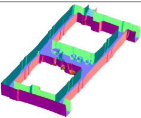
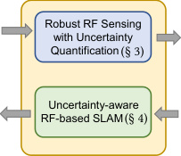
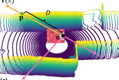
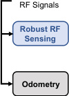
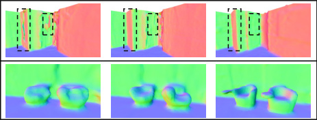

# CartoRadar: RF-Based 3D SLAM Rivaling Vision Approaches

> 这是一份给完全没接触过编程和 AI 的同学看的笔记。读完你能在饭桌上 30 秒讲清这篇论文做了什么。

## 一句话讲什么（TL;DR）

用一颗几百块的雷达，让机器人在烟雾、黑暗、玻璃环境下也能画出厘米级的 3D 房间地图，而且比相机方案画得还准。

*所以这一节是想说：这是一篇让"看不见"的机器人重新看见世界的论文。*

---

## 这是个什么场景

想象一下消防员冲进着火的写字楼救人。

走廊里全是烟，伸手不见五指；玻璃幕墙到处反光；机器人想跟着消防员一起进去帮忙。可是它头上装的相机，跟戴着泡澡时起雾的眼镜没区别——什么都看不清。

机器人要在楼里**一边走、一边画地图、一边记住自己走到哪儿了**——这件事在学术界有个名字，叫 SLAM。

> **SLAM（Simultaneous Localization and Mapping，同时定位与建图）**：机器人边走边画地图，同时还得知道自己在地图上的哪一格。
> **类比**：第一次进迷宫，你边走边在脑子里画路线图，还得记住自己当前站在哪。

现在主流的做法有两种：
- 用**相机**：便宜，但怕黑、怕烟、怕玻璃。
- 用**激光雷达（LiDAR）**：准，但一台九千美元起步，玻璃也会让它出错（玻璃会把激光透过去，激光雷达就以为玻璃后面是空的）。

> **激光雷达（LiDAR）**：用激光打出去再接回来，靠"激光跑了多久"算距离的传感器。家里扫地机器人头顶那个会转的小转盘就是一种简易版激光雷达。

那能不能用别的东西？这篇论文的答案是：**用雷达**。

> **雷达（Radio Frequency, RF / 射频）**：发射电磁波出去，等回波反射回来算距离的传感器。
> **类比**：蝙蝠用声波回声定位飞行，雷达就是"用电磁波代替声波"的版本。

雷达的好处是：电磁波**穿烟、穿黑、能看玻璃**（玻璃对它来说就像一面普通的墙）。

但问题在于：以前的雷达 SLAM 只能画 **2D 平面地图**（像扫地机俯视图那种），看不到天花板、楼梯。而且定位常常错半米——这种精度让机器人想"靠近一张椅子"都做不到，因为它会先把椅子撞翻。

*所以这一节是想说：在烟雾黑暗等极端环境里，机器人需要一种新的"眼睛"——雷达，但雷达过去的精度太差了。*

---

## 之前的人怎么做的，为什么不够好

- **相机方案**：一旦遇到黑、烟、玻璃就瞎。**类比**：像让你蒙上眼睛走迷宫。
- **激光雷达方案**：贵到 9000 美元一台，玻璃还是会让它判断错。**类比**：你买了一副超贵的眼镜，结果碰到玻璃门还是会撞上去。
- **以前的雷达 SLAM**：只能画 2D 平面图，没法画天花板和楼梯。**类比**：只画了一楼的俯视图，但你想找的人在三楼。
- **再升级的雷达 SLAM**：误差超过 50 厘米，做不了精细任务。**类比**：导航 App 给你的位置偏差半个篮球场，你想找朋友会找半天。
- **新方法用了 AI 但有"长尾误差"**：大部分点很准，但**偶尔有几个点错得离谱**。**类比**：你点的外卖大部分 30 分钟到，但偶尔一单要等 3 小时——平均看还行，但你饿到不行那次刚好就是 3 小时那单。

> **长尾误差（long-tail error）**：大多数预测都很准，少数几个错得特别离谱，画在统计图上像一条长长的尾巴。
> **类比**：班里大部分同学考 80-90 分，但有两个偏科同学一个考 30、一个考 5，把平均分拉得很难看。

这种偶尔暴雷的预测拼成 3D 地图，地图就会扭曲变形。

*所以这一节是想说：以前的方法要么瞎、要么贵、要么不够清楚、要么偶尔会出大错。*

---

## 这篇论文的新想法

**让机器人不仅说出自己的预测，还要说出自己对每个预测的"把握有多大"。** 把握小的预测，在拼地图时被自动放低权重，从而避免长尾误差污染整张地图。

*所以这一节是想说：这篇论文的灵魂创新就一句话——让 AI 模型学会说"我不太确定"。*

---

## 它分几步做的（方法）

整个系统分三大块：

1. 把雷达信号变成**带有"我有多确定"标签的距离图**。
2. 用这些带置信度的距离信息，**拼出一张连贯的 3D 房间地图**。
3. 让上面这套流程能**实时运行**，不是离线慢慢算。

下面分 5 个小节看具体怎么做。

### 1. 让 AI 自己说出"我对这一像素有多确定"

**类比**：找 16 个戴着稍微起雾眼镜的同学同时看同一张照片，问他们"那是面墙吗？"。
- 如果 16 个人答案几乎一样 → 这就是面墙没跑（信号清楚）。
- 如果 16 个人吵起来了 → 信号本身就模糊（不要太相信这个答案）。

**它在干什么**：

给同一张雷达原始数据加 16 份不同的随机干扰（就像加 16 副不同度数的起雾眼镜），然后让同一个 AI 模型推算 16 遍。

- 16 个结果如果接近 → 这个像素的预测可信。
- 16 个结果如果差别大 → 这个像素不可信，标记为"高不确定性"。

> **不确定性量化（Uncertainty Quantification, UQ）**：让 AI 不光输出一个答案，还输出"我对这个答案有多大把握"。
> **类比**：天气预报不只说"明天下雨"，而是说"明天下雨概率 70%"。

> **AI 模型 / 神经网络**：一个内部装着大量数字的"答题机器"，你喂它一份输入（雷达信号），它给你一份输出（这个方向多远有东西）。它**不需要懂物理**，只是从大量例子里学到"这种输入大概对应那种输出"。
> **类比**：班里有个同学从来不学公式，但他做题量极大，所以也能凭直觉答对——AI 就是这种同学的极端版。

> **方差**：一组数字"分散程度"的指标——数字之间差得越多，方差越大。
> **类比**：一个班全考 85 分，方差很小；一个班从 30 到 100 分都有，方差很大。

**为什么这步聪明**：

- 不需要重新训练原来的 AI（**训练**指 AI 通过大量例题调整内部数字让自己变聪明）。
- 不需要懂雷达物理。
- 16 次推理可以一次性打包跑完，几乎和跑 1 次一样快。

> **训练（training）**：用大量"输入-正确答案"的例子让 AI 反复尝试，每次答错就调整一下内部的数字，直到它越来越准。
> **类比**：你刷高考真题刷十年，每次错题对答案改思路，慢慢就刷出手感。

*所以这一节是想说：让 AI 自己把模糊的雷达信号挑出来，办法简单到只是"加点噪音多跑几遍看结果稳不稳"。*

### 2. 把房间装进一个"会答题的小盒子"

**类比**：

把整栋楼想成一锅看不见形状的果冻。你拿一根勺子伸进任意位置，问一个机器："**我这一勺位置 (x, y, z) 有没有东西？**"。机器答 0 就是空气，答 1 就是墙。

这个机器，就是一个小神经网络。

**它在干什么**：

用一个连续函数 `f(x, y, z) → 0 到 1 之间的数字` 表示整栋楼。0 = 空气，1 = 实体物体。

要查"从某个角度往这边看，第一面墙在多远处"——就沿着这条视线均匀采样很多点，挨个问机器"这里有东西吗"，第一个答案接近 1 的位置就是墙。

> **占据场（Occupancy Field）**：把整个空间切成无穷多小格子，每格写个 0 到 1 的数字，1 是"这里有东西"，0 是"这里是空气"。
> **类比**：果冻里每一勺位置的"实心程度"。

> **神经网络（Neural Network）**：一个会"吃数字、吐数字"的盒子，它内部规则非常多但形式简单（一连串加减乘除）。喂给它输入 (x, y, z)，它吐出"这里有东西的概率"。
> **类比**：一个超复杂的代数函数，但函数里的系数不是人定的，是它自己从例子里"练"出来的。

**为什么这步聪明**：

以前类似的做法叫 NeRF（神经辐射场），它要沿着每条视线**积分**（高中没学过这个，简单理解为"把视线上的每一段都加权累加"），计算量很大。

这篇论文把"积分"改成了"沿视线投票，谁最像第一面墙就用谁的距离"——速度快很多。

> **NeRF**：用神经网络记录整个 3D 场景，从任意角度都能渲染出对应照片的技术。
> **类比**：把一栋楼存进一个会答题的盒子，问它"从这个角度往这看会拍到什么"它就还原出一张照片。

*所以这一节是想说：用一个小神经网络当"3D 房间存储器"，比传统方法又快又省地存下整栋楼的几何形状。*

### 3. 让 AI 训练时自动"绕开"它没把握的点

**类比**：

老师批改作文时，如果学生在某段写了"我不确定但我觉得……"，老师就不严格扣分；如果学生信心满满写了一个错误结论，老师扣分要狠。

这就是这一步的逻辑：**模型对自己有把握的预测，被严格要求；模型对自己没把握的预测，被宽容对待**。

**它在干什么**：

回忆第 1 步，每个像素都有一个"我有多确定"的分数。这个分数被塞进 AI 的"考试扣分公式"里：
- 把握大的预测：错了扣很多分（必须答对）。
- 把握小的预测：错了少扣点（允许它模糊）。

这样 AI 学习时就不会被那些"长尾错误"带偏。

> **Loss（损失函数）**：AI 的"考试扣分总和"，越小越好。AI 学习的全部目标，就是想办法把这个分降下来。
> **类比**：高考总扣分。每个错题扣几分，加起来就是 loss。AI 的学习就是疯狂刷题，调整自己直到扣分越来越少。

> **梯度下降**：AI 调整自己降低 loss 的方法，就像下山找最低点——每一步往最陡的下坡方向迈。
> **类比**：你蒙着眼站在山坡上，每一步都摸"哪个方向脚下最往下倾"，迈一小步，重复几千几万步，最后基本能下到山脚。

> **概率分布**：描述"一个不确定的量可能取哪些值、各自概率多少"的曲线。
> **类比**：明天下雨概率分布——10% 不下、30% 小雨、40% 中雨、20% 大雨。把一个数字变成一坨可能性。

> **拉普拉斯分布（Laplace Distribution）**：一种长得像两面斜坡的概率分布，比正态分布的"尾巴"更厚（更允许极端值）。
> **类比**：正态分布像一座圆顶山，拉普拉斯分布像一个尖屋顶；屋顶比圆顶更陡也更窄，但底边的"尾巴"反而拖得更远。

**为什么这步聪明**：

不确定性必须能被塞进 loss，AI 才会**真的学会区分可信和不可信的输入**。否则模型只是"嘴上说不确定但行动上不当回事"。

*所以这一节是想说：把"有多确定"塞进考试扣分公式里，让 AI 训练时自己学会忽略不可靠的输入。*

### 4. 同时调整"机器人在哪儿"和"地图长什么样"

**类比**：

你拼乐高时，**一边摆零件一边微调底座角度**，比"先死死固定底座再硬塞零件"效果好。因为零件和底座是相互配合的，一起调整才协调。

**它在干什么**：

机器人在每一刻都有一个**位姿**（pose，意思是它在哪里、朝哪个方向）。地图和位姿之间是相互依赖的：
- 位姿错一点 → 两次扫描就对不齐 → 拼出来的地图扭曲。
- 地图扭曲 → 反过来又让机器人估不准自己的位姿。

这一步把两件事**放到同一个学习循环里同时调**，谁对了拽着谁也变对，最终一起收敛。

> **位姿（pose）**：机器人在 3D 空间里的"位置 + 朝向"，6 个数字（前后、左右、上下、绕三个轴的旋转）。
> **类比**：你站在房间里的坐标 + 你脸朝向哪边。

*所以这一节是想说：地图和"我在哪"必须一起调，单独调任何一个都会拖累另一个。*

### 5. 让所有事情同时跑（多进程流水线）

**类比**：

麦当劳后厨四个工位（炸薯条、烤汉堡肉、装包、收银）同时干活，不用前一个完全做完后一个才开始，所以五分钟出餐。

**它在干什么**：

把整个系统拆成 4 个独立模块，让它们各跑各的：

- A 模块：处理雷达原始信号，每 0.5 秒出一帧。
- B 模块：估计机器人是不是在动、动了多少。
- C 模块：训练神经网络更新地图和位姿。
- D 模块：检查"我是不是又走回了之前的地方"，如果是就把地图修正一下。

> **回环检测（Loop Closure Detection）**：机器人识别"我又回到之前来过的地方了"，用来纠正长时间走路累积的偏差。
> **类比**：你绕一大圈发现"诶这家咖啡店我刚才路过了"，立刻知道路线图早期画偏了，整体校正一下。

四个模块之间用一个"共享内存中转站"传数据，零拷贝、零等待。

**为什么这步聪明**：

雷达每 0.5 秒出一帧。如果是单进程串行，所有模块必须 0.5 秒内全跑完才能跟上节奏——常常超时。多进程并行后，就算训练那一步偶尔超时，也不影响别的模块继续工作，整体不卡顿。

*所以这一节是想说：把 4 件事拆成 4 个独立"工位"同时干，整套系统才能真正实时跑。*

---

## 关键数字（What works）

下面 6 个数字，每个都来自论文实验，对比的基准是相机方案（论文打败的对手）。

- **轨迹误差 14.1 厘米**
  - 对比：CartoRadar 14.1 cm vs 最强相机方案 53 cm，最弱的 72 cm。
  - 生活语言：以前机器人想"走到那张椅子前"会差半米——直接撞翻椅子；现在差 14 厘米，大约一个手掌宽，可以放心做对接、绕障。

- **建图精度 7.4 厘米**
  - 对比：CartoRadar 7.4 cm vs 相机方案 13.75 cm（提升 46%）。
  - 生活语言：墙的位置画得越准，机器人越不容易撞墙。

- **建图完整度 8.1 厘米**
  - 对比：CartoRadar 8.1 cm vs 相机方案 28.1 cm（提升 67.6%）。
  - 生活语言：完整度衡量"地图有没有空洞"。相机视角窄（70 度左右），雷达 360 度旋转所以没死角。就像全景相机和窄视角手机各拍一张房间——全景拍到的当然多。

- **不确定性建模带来 12% 提升**
  - 对比：去掉"我有多确定"这一招，accuracy 从 4.32 cm 倒退到 5.04 cm。
  - 生活语言：这是干净的因果证据——光是"让 AI 说出自己有多确定"这一招，就能换来 12% 的精度提升，不是堆数据堆出来的。

- **训练免费的不确定性，只要 16 次采样**
  - 对比：CartoRadar 的方法 16 次推理 vs 教科书方法之一要 128 次（贵 8 倍）。
  - 生活语言：128 次相当于让机器人每 4 秒才出一帧，在烟雾里多跑 3.5 秒可能就撞墙了。

- **回环检测把误差降低 76%**
  - 对比：开启 vs 不开启回环检测。
  - 生活语言：机器人走得久了会"飘"，识别"我又回原地了"能立刻把累计偏差纠回来。

*所以这一节是想说：每一个数字都说明，CartoRadar 是真的把雷达 SLAM 推到了和相机同台 PK 还能赢的水平。*

---

## 你应该懂的几个新词

> **SLAM（Simultaneous Localization and Mapping，同时定位与建图）**：机器人边走边画地图、同时知道自己在地图上哪儿。

> **mmWave radar（毫米波雷达）**：发射 77-81 GHz 电磁波、根据回波算距离的传感器。**类比**：电磁波版的蝙蝠回声定位。

> **不确定性量化（UQ）**：让模型不光输出预测，还输出"我对这个预测有多大把握"。**类比**：天气预报说"明天下雨概率 70%"。

> **占据场（Occupancy Field）**：用一个连续函数描述空间每一点"是不是有东西"。**类比**：果冻里每一勺位置的实心程度。

> **NeRF（Neural Radiance Field）**：用神经网络记下整个 3D 场景的方法，CartoRadar 受它启发但简化了。**类比**：一个能从任意角度还原房间照片的"答题盒子"。

> **Loss（损失函数）**：AI 的"考试扣分总和"，越小越好。**类比**：高考总扣分，AI 的目标就是想尽办法降它。

> **梯度下降（Gradient Descent）**：AI 调整自己降低 loss 的方法。**类比**：蒙眼下山，每步都往最陡下坡方向迈。

> **位姿（Pose）**：机器人在 3D 空间里的位置 + 朝向，共 6 个数字。**类比**：你站哪儿 + 脸朝哪边。

> **拉普拉斯分布（Laplace Distribution）**：一种像两面斜坡的概率分布，"尾巴"比正态分布更长。**类比**：尖屋顶 vs 圆顶山。

> **回环检测（Loop Closure Detection）**：识别"我回到之前来过的地方"，用来修正累积漂移。**类比**：发现"这家咖啡店我刚路过"，立刻校正路线图。

> **AMCL（自适应蒙特卡洛定位）**：在已知地图上找自己位置的算法。**类比**：撒一把豆子代表"我可能在这"，每走一步看哪些豆子的预测和雷达观测对得上，留下那些。

> **长尾误差（Long-tail Error）**：大多数预测准，少数错得离谱。**类比**：班里大部分同学考 80-90，但偶尔有人考 30。

*所以这一节是想说：把这 11 个词背熟，你后面读任何 SLAM 或射频感知的论文都不会卡壳。*

---

## 它有什么搞不定的

- **机器人最多走 0.6 米/秒（人类慢走速度）**：因为雷达靠步进电机旋转，转得太快采样跟不上。**用户实际会怎么样**：快递无人车、自动驾驶汽车、无人机这种要 5-30 米/秒的场景直接出局。

- **下游精细任务还差点意思**：用建好的地图重新定位，误差 31-35 厘米。**用户实际会怎么样**：能让机器人导航到大概位置，但"插钥匙到锁眼"、"对接充电桩"这种亚厘米级任务还达不到。

- **换雷达就要重训整套 AI**：CartoRadar 用的 AI 是基于一种特定型号雷达的数据训练的。**用户实际会怎么样**：如果你买了别家的雷达，要重新花数月训练 AI 才能用 CartoRadar。

- **只测过办公楼室内、不测户外、不测人群**：5 栋办公楼里没有大量动态行人。**用户实际会怎么样**：商场早高峰、地铁站、街道这些真实场景里能不能撑住，论文没回答。

- **回环检测过于朴素**：靠"距离阈值 + 点云对齐"判断是否回环。**用户实际会怎么样**：如果机器人走偏太远，物理上回到原地但坐标系认为还在 50 米外，回环检测会失灵。

- **没有颜色信息**：纯几何地图分不清"红色椅子"和"蓝色椅子"。**用户实际会怎么样**：要做"找红色椅子"这类语义任务，还得另外加个相机。

*所以这一节是想说：这篇论文是个里程碑但不是终点——速度、户外、动态、语义都还有空间。*

---

## 它和别的几篇是什么关系

- 与 **mmCLIP**（也是 mmWave 系列）：目标完全不同。
  - mmCLIP 关心"识别这是什么物体"（语义层）。
  - CartoRadar 关心"几何在哪里"（结构层）。
  - 两者像 Venn 图里两个相交但不重合的圆——共用底层雷达信号处理，但上层目标不同。

- 与 **NLOS-mmWave**（毫米波非视距成像）：任务方向正交。
  - NLOS 解决"看到拐角后面"。
  - CartoRadar 解决"完整 3D 重建"。
  - CartoRadar 的不确定性方法理论上可以搬到 NLOS 上去。

- 与 **相机/视觉 SLAM**：这是 CartoRadar 论文里直接打败的对手。
  - 在玻璃、低光、烟雾场景下，CartoRadar 完胜。
  - 在轻便、便宜、有颜色信息的优势下，相机仍然胜出。
  - 时间线上：CartoRadar 不是要取代相机，而是为"恶劣环境"开了一条新路。

- 与 **具身 AI 大模型**（比如 RT-2 那种能听话做事的机器人）：互相成就。
  - CartoRadar 提供"带置信度的 3D 地图"。
  - 大模型可以拿这个地图去做规划。
  - 因果关系：底层感知做扎实，上层 AI 才能在烟雾低光环境里发挥。

*所以这一节是想说：这篇是地基类工作，影响会沿着 RF 感知 → 机器人 → 具身 AI 一路传上去。*

---

## 我建议这样读这篇

1. **先看 Fig.1（论文第 1 页）**。这张图把 CartoRadar 和 3 个相机方案的轨迹和地图直接对比——玻璃窗那块一秒看出哪个方法靠谱。看完图你才会有动力读细节。

2. **读 §1 Introduction（前两页）**。这一节用大白话讲清"为什么 RF SLAM 重要、为什么以前做不出来、CartoRadar 怎么破局"。

3. **跳到 Fig.3（系统总览图）**。一张总览定住所有章节关系，读后面任何一节都不会迷路。

4. **精读 §3.2"训练免费的不确定性"**。这是全篇最聪明的点子。如果时间紧只读一节，就读这节。

5. **跳读 §4 SLAM 算法**。第一遍只看每个公式上下文的中文解释，跳过推导——记住"它把不确定性塞进了 loss"就够了。

6. **直接看 §7 表 1 和 Fig.10**。所有结论浓缩在那里，看完你能 30 秒讲清这篇论文。

*所以这一节是想说：从图 → 引言 → 总览 → 灵魂创新 → 方法 → 数据。先看脸，再看心。*

---

## 一些好奇心问答（FAQ）

**Q1：这模型有多大？我家电脑跑得动吗？**

- 占据场那个小神经网络很小（不到 1 MB），普通 GPU 一定跑得动。
- 但 RF 成像那块的 AI 大概几十到上百 MB，需要专业显卡。
- 论文说在 RTX 3090（一种较高端的家用显卡）上能流畅跑。

**Q2：训练数据从哪来？**

- 论文作者自己采集的，跑了 5 栋楼共 14 层，总长 1527 米，6637 帧雷达 + 激光雷达同步数据。
- 数据集开源，跟代码一起发布在论文项目页。

**Q3：我能照着复现吗？**

- 可以。这篇拿了 MobiCom 2025 **Best Artifact Award**，意思是"代码 + 数据 + 文档全都被评审验证可复现"。
- 项目页：[waves.seas.upenn.edu/projects/cartoradar](https://waves.seas.upenn.edu/projects/cartoradar)

**Q4：为什么不直接用更便宜的简单方法？**

- 简单方法之前都试过：纯几何方法（不用 AI）精度差太多；只用 AI 不算不确定性，长尾误差又会污染地图。
- CartoRadar 的精妙在于"用最少的代价让 AI 学会自我怀疑"。

**Q5：和 ChatGPT 那种大模型有关系吗？**

- 没有直接关系。这篇用的是小神经网络（几层全连接 + 几层卷积）。
- 但它产出的 3D 地图，未来可以喂给大模型当作"机器人对环境的认知"，让大模型能在烟雾低光环境里也帮机器人做决策。

**Q6：为啥要 16 次而不是 1 次？**

- 1 次只能给你一个答案，没法判断"这答案稳不稳"。
- 16 次相当于让 16 个戴起雾眼镜的人独立判断，结果一致 = 信号清楚，结果分歧 = 信号本身就模糊。
- 16 是论文实验出来的"性价比拐点"——再多也带来不了更多收益。

**Q7：雷达比相机贵还是便宜？**

- 这篇论文用的雷达 TI AWR1843 大约 $300-500。
- 同类激光雷达 $9000 起。
- 普通 RGB 相机 $20-50。
- 所以雷达介于两者之间，性能在恶劣环境下接近激光雷达，价格接近相机。

*所以这一节是想说：这是一个"用消费级硬件做出工业级精度"的工作，门槛比想象低得多。*

---

## 如果你想再深入

1. **NeRF 原版论文（Mildenhall et al., 2020）**：理解神经网络怎么"记住"3D 场景。CartoRadar 的占据场是 NeRF 的简化版，看懂 NeRF 你才知道作者砍掉了什么。

2. **Kendall & Gal "What Uncertainties Do We Need in Bayesian Deep Learning"**：不确定性量化的入门经典。CartoRadar 比较的几个 baseline 全来自这一脉。

3. **CartoRadar 的"父亲"论文（Lai et al., MobiCom 2024）**：CartoRadar 用的 RF 成像 AI 来自这篇。读完它你才知道 CartoRadar 是在量化什么。

4. **Radarize（MobiSys 2024）**：同样做 mmWave SLAM 但只能 2D，可以看出 CartoRadar 选 3D + 不确定性这条路有多激进。

5. **LONER（LiDAR Only Neural Representations for Real-Time SLAM）**：用 NeRF 思路做激光雷达 SLAM，和 CartoRadar 是平行兄弟（一个用激光、一个用射频），可以横向对比。

*所以这一节是想说：CartoRadar 站在 NeRF + 不确定性 + RF 成像这三块巨人的肩膀上，想再往下钻就顺着这三条路走。*

