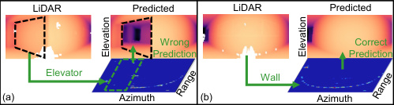
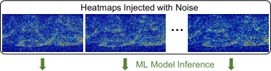
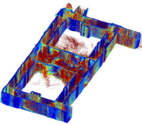

# CartoRadar：给机器人一颗雷达，黑暗烟雾里也能画出精细 3D 地图

> 给"完全没接触过 AI / 机器人"的读者写的精读笔记。所有专业词第一次出现都会解释清楚。只看这份笔记就能理解全文机制。

## 一句话讲什么（TL;DR）

给机器人装一颗几百块的毫米波小雷达，让它一边走一边画出厘米级精度的 3D 地图。关键创新是让 AI 学会说"我对这个预测不太确定"，从而自动忽略不靠谱的测量，最终在 14 层楼的实测中打败了所有相机方案。

*所以这一节是想说：这是一篇让"看不见"的机器人重新看见世界的论文——不靠光，靠电磁波。*

---

## 这是个什么场景

想象你半夜起来上厕所，房间漆黑，你伸着手摸着墙慢慢走——心里默数着几步到门、几步到马桶。你其实正在做两件事：记住自己走到哪儿了（定位），同时在脑子里画出房间的布局（建图）。机器人每天都面对同样的难题，学术界给这件事起了个正式名字：SLAM。

> **SLAM（Simultaneous Localization and Mapping，同时定位与建图）**：机器人边走边画地图，同时还得知道自己在地图上的哪一格。
> **类比**：第一次进迷宫，你边走边在脑子里画路线图，还要记住自己当前站在哪。

把场景再升级一下：消防员冲进着火的写字楼救人。走廊里全是浓烟，伸手不见五指；玻璃幕墙到处反光；后面跟着的搜救机器人想帮忙。可是它头上装的相机，就跟你洗澡时起雾的眼镜一样——啥都看不清。

现在主流做法有两种，但都有硬伤。用相机，便宜，但怕黑、怕烟、怕玻璃（玻璃反光会让它误以为前面没东西）。用激光雷达（LiDAR），准，但一台九千美元起步，碰到玻璃还会"穿透"过去，当玻璃后面是空气。

> **激光雷达（LiDAR）**：用激光打出去再接回来，靠"激光跑了多久"算距离。扫地机器人头顶那个会转的小转盘，就是简易版激光雷达。

那能不能换个工具？这篇论文的答案是：用雷达。

> **雷达 / 射频（Radio Frequency, RF）**：发射电磁波出去，等回波反射回来算距离。
> **类比**：蝙蝠用声波回声定位飞行；雷达就是把声波换成了电磁波。

雷达的好处是：电磁波穿烟、穿黑、能"看见"玻璃（对它而言玻璃就是一面普通的墙）。但麻烦在于：过去的雷达 SLAM 只能画 2D 俯视图（像扫地机那种平面图），看不到天花板和楼梯；而且常常定位偏半米——这种精度下，机器人想"走到椅子前停下"都做不到，会直接把椅子撞翻。

本论文要做的事情就是：用一颗 300 美元的毫米波雷达，做出能和九千美元激光雷达媲美的 3D SLAM。在这个导读里，CartoRadar 是"RF 三连"的第一篇，定位为"定位和建图"的基石——后续的 mmCLIP 会在此之上加语义理解，NLOS-mmWave 会在此之上加非视距感知。


*所以这一节是想说：在烟雾黑暗等极端环境里，机器人需要一种新的"眼睛"——雷达，但雷达过去的精度太差了，CartoRadar 要把它推到和相机甚至 LiDAR 一个量级。*

---

## 之前的人怎么做的，为什么不够好

要理解 CartoRadar 的贡献，先得知道它站在谁的肩膀上、又踩在了谁的痛处上。下面把主流方案和问题排成一张表：

| 方案 | 代表方法 | 优势 | 硬伤 | 类比 |
|------|---------|------|------|------|
| 相机 SLAM | ORB-SLAM, RTAB-Map | 便宜、有颜色信息 | 怕黑、怕烟、怕玻璃 | 蒙眼走迷宫 |
| 激光雷达 SLAM | LOAM, LIO-SAM | 高精度 | 9000 美元起步、穿透玻璃 | 买了超贵眼镜，碰到玻璃门还是撞上去 |
| 2D 雷达 SLAM | milliMap, Radarize | 不怕烟不怕黑 | 只有 2D 平面图、无法看到天花板和楼梯 | 只画了一楼的俯视图，但你找的人在三楼 |
| 3D 雷达 SLAM（早期） | 4DRadarSLAM | 用昂贵 4D 雷达 | 定位误差超 1 米、不产出完整地图 | 导航 App 位置偏差一个篮球场 |
| AI 增强雷达成像 | RF 成像 + ML | 分辨率大幅提升 | 存在"长尾误差"——大部分准，偶尔几个点错得离谱 | 外卖大部分 30 分钟到，偶尔一单等 3 小时 |

> **长尾误差（long-tail error）**：大多数预测都很准，少数几个错得特别离谱。画在统计图上像一条长长的尾巴。
> **类比**：班里大部分同学考 80-90 分，但有两个偏科同学一个考 30、一个考 5，把平均分拉得很难看。

最后这一条最关键。当前最先进的 RF 成像系统（论文引用的 [39]）在中位数误差上只有 3.4 厘米，相当不错。但它的第 90 百分位误差高达 32 厘米——几乎是中位数的 10 倍。这意味着你有 10% 的测量点会偏差 30 厘米以上。这些"暴雷点"拼成 3D 地图时，地图就会扭曲变形，就像你拼乐高时有几块歪了，整个模型都跟着歪。

*所以这一节是想说：以前的方法要么瞎、要么贵、要么只能 2D、要么偶尔会出大错。CartoRadar 需要同时解决"3D"和"不怕长尾误差"两个问题。*

---

## 这篇论文的新想法

一句话概括 CartoRadar 的灵魂创新：**让 AI 不光给出预测，还要给出"我对这个预测有多大把握"的分数。** 把握小的预测，在拼地图时被自动降低权重，从而避免长尾误差污染整张地图。

更具体地说，这篇论文提出了三件事：

1. 一种**不需要重新训练 AI**的方法来估计每个预测点的不确定性——只需要给同一份输入加不同的随机噪音跑多遍，看结果稳不稳。

2. 一种**感知不确定性的 SLAM 算法**——用占据场（而不是传统 NeRF 的体积渲染）来表示 3D 空间，并把不确定性编码进训练的"扣分公式"里。

3. 一套**多进程并行的在线系统**——让雷达信号处理、里程计估计、地图训练、回环检测四件事同时进行。

这三件事叠在一起，才让一颗 300 美元的雷达做出了比 9000 美元 LiDAR 还精细的 3D 地图。

*所以这一节是想说：这篇论文的核心贡献就是"让 AI 学会说'我不太确定'"，然后把这种自知之明贯穿到建图的每一步。*

---

## 它分几步做的（方法）

把整套方法想成做菜：先把食材（雷达信号）切好并标好"哪块新鲜哪块不太新鲜"（不确定性量化），再按食谱（占据场 + 概率学习）摆盘成一道立体的 3D 房间（SLAM 建图），最后让厨房里几个灶头同时开火（在线并行），菜才能热腾腾地端上桌。

整个系统分为三大组件、五个细分步骤。下面逐一展开。


### 步骤 0：先搞懂雷达是怎么"看"东西的

在进入 CartoRadar 的算法之前，我们需要理解它的"眼睛"——毫米波雷达——是怎么工作的。

> **毫米波雷达（mmWave Radar）**：工作在 77-81 GHz 频段的雷达。"毫米波"是因为这些电磁波的波长大约 4 毫米。
> **类比**：蝙蝠发出超声波，听回声来感知周围环境。毫米波雷达发出电磁波，收回波来感知环境。区别在于电磁波比声波快 100 万倍，穿透力也强得多。

CartoRadar 使用的硬件是 TI AWR1843——一颗售价约 300-500 美元的商用毫米波芯片。它工作在 77-81 GHz（4 GHz 带宽），一次"扫描"可以探测最远 10 米内的物体。

但单颗雷达芯片的角分辨率很低（想象你透过一层毛玻璃看世界），所以论文用一个步进电机让雷达以 2 Hz（每秒两圈）的速度旋转，形成一个"合成孔径"。

> **合成孔径（Synthetic Aperture）**：天线物理上很小，但通过移动天线并把不同位置收到的信号叠加处理，等效于一个大得多的天线——分辨率因此大幅提升。
> **类比**：你用手机拍全景照片时，手机镜头其实很小，但你横着移动手机，让它在不同位置拍下很多张小照片，拼在一起就得到了一张宽画幅的全景——合成孔径就是雷达版的"全景拍摄"。

旋转一圈后，雷达得到的是一张"3D 热力图"（RF heatmap），维度是 仰角 x 方位角 x 距离。图上的每个数值表示"那个方向、那个距离有多强的反射"。这张热力图就是后面所有 AI 处理的原始输入。

接下来，一个已经训练好的 AI 模型（U-Net 结构，来自同一实验室 2024 年的论文 [39]）把这张模糊的 3D 热力图转换成一张"距离图"（range image）——每个像素告诉你"往这个方向看，第一面墙在多远处"。距离图可以直接转化为 3D 点云（一堆带坐标的点）。

转化公式很直观：如果一个像素的仰角是 phi、方位角是 theta、距离是 r，那么它在 3D 空间里的坐标就是：

- x = r × cos(phi) × cos(theta)（左右）
- y = r × cos(phi) × sin(theta)（前后）
- z = r × sin(phi)（上下）

就像你知道"朝东偏北 30 度、抬头 15 度、距离 5 米有个东西"，就能在三维地图上精确标一个点。



*所以这一节是想说：雷达先把电磁波反射变成一张"3D 热力图"，AI 再把热力图变成"每个方向多远有墙"的距离图。后面所有聪明操作都建立在这张距离图之上。*

### 步骤 1：让 AI 自己说出"我对这一像素有多确定"——训练免费的不确定性量化

这一步是全篇最核心的创新。

**核心问题**：上面提到的 AI 模型虽然大部分时候很准，但有时会"暴雷"。怎么让系统自己识别出哪些预测可信、哪些不可信？

**灵感来源**：想象你找 16 个戴着稍微起雾眼镜的同学同时看同一张照片，问他们"那是面墙吗？"。如果 16 个人答案几乎一样——这就是面墙没跑了（信号本身很清楚）。如果 16 个人吵起来了——说明照片本身就模糊（不要太相信任何一个人的答案）。

**具体做法**：

输入：一张原始 RF 热力图 X（维度 N_phi x N_theta x N_r）

处理：
1. 生成 16 份随机噪声张量 E_1, E_2, ..., E_16，每个张量和 X 同维度，元素服从高斯分布 N(0, sigma^2)。
2. 把 X + E_1, X + E_2, ..., X + E_16 这 16 份"加噪版输入"打包成一个批次，一次性喂给 AI 模型。
3. 得到 16 份距离图 f(X+E_1), f(X+E_2), ..., f(X+E_16)。
4. 对每个像素 (i, j)，计算这 16 个预测值的方差，作为该像素的不确定性 U_ij。

输出：一张和距离图同样大小的"不确定性图" U，每个像素是 0 到正无穷的数字——越大表示 AI 越没把握。

用论文里的数学符号写就是：

U_ij = Var [ f(X + E)_ij ]，其中 E ~ N(0, sigma^2)

人话翻译：**"在一个像素位置上，16 次加噪预测结果的分散程度就是不确定性。"**

> **不确定性量化（Uncertainty Quantification, UQ）**：让 AI 不光输出一个答案，还输出"我对这个答案有多大把握"。
> **类比**：天气预报不只说"明天下雨"，而是说"明天下雨概率 70%"——70% 就是它的确定性。

> **方差（Variance）**：一组数字"分散程度"的指标——数字之间差得越多，方差越大。
> **类比**：一个班全考 85 分，方差很小；一个班从 30 到 100 分都有，方差很大。

> **高斯噪声 / 白噪声**：每个数值都独立地从正态分布（钟形曲线）中随机采样出来的噪声。
> **类比**：收音机没有信号时发出的"沙沙"声。



**为什么这个方法聪明？**

1. **不需要重新训练**。传统的不确定性估计方法要么需要训练多个模型（集成方法，8-12 个模型意味着训练开销增大 8-12 倍），要么需要改模型结构重训（MC-Dropout、分布预测）。CartoRadar 的方法直接拿一个现成的训练好的模型用，只是多跑几遍，所以叫"training-free"。

2. **不需要懂雷达物理**。加的噪声就是简单的高斯白噪声，不需要模拟真实的多径反射、镜面反射等复杂物理现象。论文实验证明简单噪声已经足够好。

3. **16 次就够了**。论文尝试了 N=4, 8, 16, 32。从 4 到 16 提升明显，16 到 32 只有微小提升。这 16 次可以打包成一个 batch 在 GPU 上并行算，时间只比跑 1 次多约 40%（不是 16 倍），因为 GPU 擅长并行。

4. **噪声水平有最优值**。太小的噪声无法扰动模型产生有意义的差异，太大的噪声会把原始信号淹没。论文通过消融实验找到了最优的 sigma 值。

**混合方法（进阶版）**：论文还提出了一种更强的"混合不确定性量化"——把上述 training-free 方法和传统的"让模型直接预测分布参数"的方法结合。具体来说，让模型不光输出距离均值 M，还输出距离方差 V，然后在加噪多次推理时同时观察均值的方差和方差的期望，用全方差公式合并：

U_ij = Var[M_ij（加噪后）] + E[V_ij（加噪后）]

人话翻译：**总不确定性 = "加噪后均值晃了多少" + "模型自己认为的平均不确定性"。**

这个混合方法效果最好（NLL -0.93 vs training-free 的 -0.80），但代价是需要重新训练一个能输出分布参数的模型。论文在默认配置中使用的是混合方法 OursH-16。



*所以这一节是想说：让 AI 自己把模糊的雷达信号挑出来，办法简单到只是"加点噪音多跑几遍看结果稳不稳"。不需要重新训练，16 次就收敛，是全篇最聪明的一步。*

### 步骤 2：把整栋楼装进一个"会答题的小盒子"——隐式占据场

上一步给了我们"带置信度的 3D 点云"。但点云只是一堆散落的点——你需要把来自不同位置、不同时刻的点云拼成一张完整的 3D 地图。怎么拼？

传统做法是直接把点云叠在一起（类似把很多次拍的照片直接叠放）。但这有两个问题：一是误差会累积——如果第 50 帧的位置估计歪了 5 厘米，后面所有帧都跟着歪；二是长尾误差的"暴雷点"会在地图上留下"鬼影"。

CartoRadar 借鉴了一个来自计算机视觉的方法——NeRF（Neural Radiance Field，神经辐射场），但做了关键简化。

> **NeRF（Neural Radiance Field，神经辐射场）**：用一个小神经网络记录整个 3D 场景的方法。你给它一个 3D 坐标 (x, y, z)，它告诉你"这个位置是什么颜色、有多密"。相当于把一整栋楼压缩成一个会答题的函数。
> **类比**：一本百科全书太厚搬不动，你训练了一个小 AI 把全书内容"记住"——你问它任何条目它都能回答。这个 AI 就是 NeRF 的角色。

**CartoRadar 的简化——占据场（Occupancy Field）**：

NeRF 原版需要沿每条视线做"体积渲染"——简单理解为"把视线上每一段的颜色和密度加权累加"，计算量非常大。CartoRadar 把"颜色和密度"简化为"占据概率"——一个 0 到 1 之间的数字：0 = 这里是空气，1 = 这里是实体。

> **占据场（Occupancy Field）**：用一个连续函数 f_O(x, y, z) → [0, 1] 描述整个空间每一点"是不是有东西"。
> **类比**：把整栋楼想成一锅果冻。你拿一根勺子伸进任意位置问"这里有没有实心的东西？"机器答 0 就是空气，答 1 就是墙。

具体来说：

输入：一个 3D 坐标 (x, y, z)

处理：先通过"可学习的密集网格编码"（learnable dense grid encoding）把坐标映射到一个 20 维的特征向量，然后送进一个 2 层 MLP（每层 64 个神经元）。

输出：一个 0 到 1 的数字——这个位置的占据概率。

> **MLP（Multi-Layer Perceptron，多层感知机）**：最基础的神经网络，就是一串"输入 → 乘以权重 → 加偏置 → 激活函数 → 输出"的层。
> **类比**：一个有很多旋钮的计算器，你输入一个数，它通过内部的旋钮运算吐出一个结果。

要查"从机器人位置 o 往 d 方向看，第一面墙在多远处"——就沿这条射线均匀取 64 个点（在线模式）或 512 个点（离线模式），挨个问占据场"这里有东西吗"。第一个占据概率接近 1 的位置就是墙。

**对比 NeRF 的优势**：

| 特性 | NeRF 原版 | CartoRadar 占据场 |
|------|----------|------------------|
| 场景表示 | 体积密度 sigma | 占据概率 O (0-1) |
| 渲染方式 | 体积渲染（沿射线积分） | 直接点级查询 |
| 监督方式 | 射线级（一条射线一个 loss） | 点级（每个采样点一个 loss） |
| 训练速度 | 慢（需要积分） | 快得多（消除了积分） |
| 适配信号 | RGB 图像 | 距离测量（ToF） |


*所以这一节是想说：用一个小神经网络当"3D 房间存储器"，把 NeRF 的体积渲染简化成点级查询，训练快得多，还能存下整栋楼的连续几何形状。*

### 步骤 3：让不确定性进入"考试扣分公式"——概率学习

步骤 1 给了我们每个点的不确定性，步骤 2 建了一个占据场。但如果训练占据场时把所有点一视同仁——可信的点和暴雷的点同等对待——地图就会被暴雷点拉偏，产生"平均效应"，细节全糊掉。

CartoRadar 的解决方案是**把不确定性编码进训练的损失函数（loss function）**。

> **损失函数（Loss Function）**：AI 的"考试扣分总和"。每答错一个题就扣一些分，所有错题的扣分加起来就是 loss。AI 学习的全部目标就是想办法把这个总扣分降到最低。
> **类比**：高考总扣分。你做错一道选择题扣 5 分，做错一道大题扣 15 分。AI 的训练过程就是疯狂刷题调整自己，直到总扣分越来越少。

**核心思路**：

在标准占据场训练中，每条射线上的"墙的距离" D 被当作一个确定的数字。现在，CartoRadar 把 D 看作一个**概率分布**——具体来说是拉普拉斯分布。

> **概率分布**：描述"一个不确定的量可能取哪些值、各自概率多少"的曲线。
> **类比**：明天的气温不是一个固定数字，而是"15 度概率 10%、18 度概率 30%、20 度概率 40%、22 度概率 20%"。

> **拉普拉斯分布（Laplace Distribution）**：一种长得像两面斜坡的概率分布，比正态分布（钟形曲线）的"尾巴"更厚。
> **类比**：正态分布像一座圆顶山，拉普拉斯分布像一个尖屋顶——屋顶比圆顶更陡更窄，但底边的"尾巴"拖得更远，更能容忍极端值。

论文选择拉普拉斯分布来建模距离 D 的分布：p(D) = Laplace(mu, b)，其中 mu = Y_ij（AI 预测的距离），b = sqrt(U_ij / 2)（由不确定性推导出的"宽度"参数）。

人话翻译：**"AI 预测说墙在 3 米处，但不确定性很大——所以我们认为墙可能在 2.7 到 3.3 米之间的任何位置。"** 不确定性越大，这个分布就越"胖"（允许的误差范围越大）。

**对每个采样点 r(s_m)，有三种可能**：

1. 如果"墙"恰好在这个采样点的位置（D = s_m）：这个点应该被标为"有东西"（O_m = 1）。概率 = P(D = s_m) = 在 [s_m - epsilon, s_m + epsilon] 区间内对拉普拉斯分布积分。

2. 如果"墙"在这个采样点的后面（D > s_m）：这个点应该被标为"空气"（O_m = 0）。概率 = P(D > s_m)。

3. 如果"墙"在这个采样点的前面（D < s_m）：这个点的状态未知（被墙挡住了看不见后面），直接跳过不参与训练。

最终的损失函数把前两种情况用概率加权：

L(s_m) = P(D=s_m) x BCE(O_hat_m, 1) + P(D>s_m) x BCE(O_hat_m, 0)

人话翻译：**"如果我很确定墙就在这里（P 大），那答错了要狠扣分；如果我不太确定墙在不在这里（P 小），那答错了也少扣点分。"**

> **BCE（Binary Cross-Entropy，二元交叉熵）**：衡量"预测的概率"和"真实标签（0 或 1）"之间差距的指标。预测越接近真实值，BCE 越小。
> **类比**：你预测明天下雨概率 90%，结果真下了——扣分很少。你预测 90% 不下雨，结果下了暴雨——扣分很多。

**为什么这步聪明**：

不确定性必须能被塞进 loss，AI 才会真正学会区分可信和不可信的输入。否则模型只是"嘴上说不确定但行动上不当回事"。

实验证明：加入不确定性后，建图精度（accuracy）从 5.04 cm 提升到 4.32 cm（提升 14%），建图完整度（completion）从 5.38 cm 提升到 4.83 cm（提升 10%）。这是一个干净的因果证据——"让 AI 说出自己有多确定"这一招，直接换来了 12%+ 的精度提升。

*所以这一节是想说：把"有多确定"塞进考试扣分公式里，让 AI 训练时自己学会忽略不可靠的输入，不被长尾误差带偏。这是全篇第二聪明的一步。*

### 步骤 4：同时调整"机器人在哪儿"和"地图长什么样"——联合优化

把不同位置拍到的点云拼成一张大地图时，有一个鸡生蛋的问题：

- 如果机器人的位置（位姿）估计错了一点点 → 两次扫描就对不齐 → 地图扭曲
- 如果地图扭曲了 → 反过来又让位置估计变得更不准

> **位姿（Pose）**：机器人在 3D 空间里的"位置 + 朝向"，6 个数字（前后、左右、上下、绕三个轴的旋转）。
> **类比**：你站在房间里的坐标 + 你脸朝哪边。"我在客厅中央，面朝北" = 一个位姿。

CartoRadar 的解决方案是**联合优化**：把位姿参数和占据场的参数放在同一个优化循环里同时调整。

> **梯度下降（Gradient Descent）**：AI 调整自己降低 loss 的方法。
> **类比**：你蒙着眼站在山坡上，每一步都摸"哪个方向脚下最往下倾"，迈一小步，重复几千几万步，最后基本能下到山脚。

因为从输入（雷达点云 + 位姿） → 占据场查询 → loss 计算的整条链路都是"可微分的"（每一步都可以计算梯度），所以梯度可以从 loss 一路反向传播到位姿参数上。每一次训练迭代不光调整占据场的权重，也微调每一帧对应的位姿。

论文实验表明：联合优化对定位改进不大（因为回环检测已经把位姿修得差不多了），但对建图质量提升显著——accuracy 和 completion 各提升超过 1 厘米，F-score 提升 5-8%。

*所以这一节是想说：地图和"我在哪"必须一起调，单独调任何一个都会拖累另一个。联合优化是让地图细节真正清晰的关键一步。*

### 步骤 5：让所有事情同时跑——四模块并行在线系统

到目前为止，步骤 1-4 描述的是一个"离线"系统——等机器人走完整条路之后，把所有数据一起拿来处理。但在真实搜救场景里，你不能等机器人走完 10 分钟的路再开始画地图——你需要**实时**看到地图。

CartoRadar 把整个系统拆成 4 个独立模块，作为 4 个独立进程同时运行：

| 模块 | 职责 | 输出频率 |
|------|------|---------|
| A：鲁棒 RF 感知 | 处理雷达原始信号 → 点云 + 不确定性 | 每 0.5 秒一帧 |
| B：里程计 | 从 RF 信号估计机器人速度 → 初始位姿 | 每 0.5 秒 |
| C：定位与建图 | 训练占据场 + 联合优化位姿 | 每 0.04 秒一次迭代 |
| D：回环检测 | 识别"我回到了之前的位置" → 修正漂移 | 每有新帧就检查 |

> **里程计（Odometry）**：通过累积每一小步的移动来估计机器人总共走到了哪儿。
> **类比**：你闭着眼走路，每走一步心里默数"往前 50 厘米"——走了 100 步你估计自己走了 50 米。问题是每步的估计都有一点误差，走得越远误差越大。

> **回环检测（Loop Closure Detection）**：机器人识别"我又回到之前来过的地方了"，用来纠正长时间走路累积的偏差。
> **类比**：你绕一大圈后发现"诶这家咖啡店我刚才路过了"，立刻知道路线图早期画偏了，可以把整条路线一起校正一下。

四个模块之间用一个**共享内存队列**传数据——零拷贝、零等待。


**效率优化细节**：

1. **16 次推理并行化**：不确定性量化的 16 次加噪推理打包成一个 batch 在 GPU 上并行计算。并且预先采样好噪声张量复用，避免每帧重新生成。

2. **消除体积渲染**：占据场用点级监督代替射线级积分，单次迭代离线 0.07 秒、在线 0.04 秒。

3. **射线采样策略**：每帧新数据到达时，一半射线从最新帧采样，另一半从历史帧随机采样。这样既能学到新东西，又不会"忘记"旧知识（防止灾难性遗忘）。

4. **在线回环检测**：每收到一帧新点云就检查是否与历史帧重叠，使用点到面 ICP（一种点云对齐算法），只用低不确定性的点来提高配准精度。如果检测到回环，立即用位姿图优化修正整条轨迹。

> **ICP（Iterative Closest Point，迭代最近点）**：一种让两坨点云"对齐"的算法——反复找最近的点对、计算最优旋转平移、应用变换，直到两坨点云重合。
> **类比**：你有两张半透明的地图，把它们叠在一起，不断微调旋转和平移，直到道路和建筑重合——这就是 ICP 在做的事。

**在线 vs 离线性能对比**：在线系统的定位误差比离线只多了 3.96 cm（18.08 vs 14.12 cm），建图精度多了 1.84 cm（9.24 vs 7.40 cm）。考虑到在线系统能在机器人走的过程中实时出图，这个代价非常值得。

*所以这一节是想说：把 4 件事拆成 4 个独立"工位"同时干，配合共享内存和高效采样，整套系统才能在机器人每走一步时就更新一次地图，真正做到实时。*

### 方法小结

把上面五步串起来，CartoRadar 的完整数据流是：

```
雷达旋转采集 RF 信号
  → RF 热力图
    → AI 模型推理（16 次加噪 → 距离图 + 不确定性图）
      → 带置信度的 3D 点云
        → 喂入占据场训练（概率学习 loss + 联合位姿优化）
          → 不断更新的 3D 地图 + 精确的机器人轨迹
            → 同时，回环检测持续校正漂移
```

每 0.5 秒一帧新数据，系统在后台持续训练和优化。整个过程中，不确定性贯穿始终——从感知层（哪些像素不可信）到建图层（不可信的点少参与训练）到定位层（回环检测只用可信的点）。

*所以这一节（整个方法部分）是想说：CartoRadar 的精妙之处在于把"不确定性"从头贯穿到尾——不是事后补救，而是从感知、表示、优化到系统工程每一层都用到了它。*

---

## 关键数字（What works）

| 指标 | CartoRadar（离线） | CartoRadar（在线） | 最强相机方案 | 提升幅度 |
|------|-------------------|-------------------|-------------|---------|
| 轨迹误差 ATE (cm) ↓ | **14.12** | 18.08 | 50.62 (ZED) | 72.1% |
| 旋转误差 RPE (度) ↓ | **0.93** | 1.01 | 1.29 (RealSense) | 28% |
| 建图精度 Acc. (cm) ↓ | **7.40** | 9.24 | 13.75 (iPad) | 46.2% |
| 建图完整度 Comp. (cm) ↓ | **8.09** | 9.13 | 28.09 (iPad) | 67.6% (同扫描时间) |
| F-Score (%) ↑ | **76.48** | 72.48 | 62.76 (iPad) | +13.72 |
| 不确定性带来的精度提升 | +12% (Acc.), +10% (Comp.) | — | — | 消融实验证实 |
| 回环检测降低误差 | 76% (90th 百分位) | — | — | 从 1.32m 降到 0.43m |

补充说明：iPad Pro 做 5.5 倍时间的手持全扫描后，建图精度可达 5.29 cm，超过 CartoRadar。但在相同扫描时间和相同轨迹下，CartoRadar 全面胜出。

*所以这一节是想说：每一个数字都证明，CartoRadar 把雷达 SLAM 推到了和相机同台竞技还能赢的水平——而且在玻璃、烟雾等视觉失灵的场景下优势更大。*

---

## 实验结果说明了什么

论文的实验覆盖了 5 栋建筑、14 层楼、总行程 1527 米、6637 帧同步数据——规模不小。结果传递了几个关键信息：

**第一，RF SLAM 首次在 3D 精度上追平甚至超越视觉 SLAM。** 这不是在"雷达擅长的烟雾场景"里赢的——而是在正常办公楼里，和相机面对面 PK 赢的。在相机能正常工作的场景里雷达就已经赢了，更不用说相机失灵的场景。

**第二，不确定性量化不是锦上添花，而是必需品。** 去掉不确定性的消融实验表明，建图精度从 4.32 cm 倒退到 5.04 cm。仅仅"让 AI 说出自己有多确定"这一个设计，就带来了 14% 的精度提升。

**第三，联合优化和回环检测各有各的用处。** 联合优化主要改善建图细节（F-score 提升 5-8%），回环检测主要改善长轨迹的定位漂移（90th 百分位误差降低 76%）。两者不是替代关系，而是互补。

**第四，在线系统几乎不牺牲精度。** 在线版只比离线版多了约 4 cm 的定位误差和约 2 cm 的建图误差，但能实时出图——在搜救等时间敏感场景中，这个 trade-off 非常值得。

**第五，雷达能看到相机看不到的东西。** 图 9 展示了两个例子：相机因为视角窄（约 70 度）漏掉了很多区域，雷达 360 度旋转没有死角；相机对玻璃窗"视而不见"（光穿透了），但雷达能完整重建玻璃——在火灾搜救中，知道哪里有窗户可能是救命的信息。


*所以这一节是想说：实验从精度、消融、效率、下游任务四个角度证明了 CartoRadar 的每一个设计选择都是有效的——不是堆了一堆模块碰巧好使，而是每个模块都有可证明的贡献。*

---

## 你应该懂的几个新词

> **SLAM（Simultaneous Localization and Mapping，同时定位与建图）**：机器人边走边画地图、同时知道自己在地图上哪儿。

> **mmWave radar（毫米波雷达）**：发射 77-81 GHz 电磁波、根据回波算距离的传感器。类比：电磁波版的蝙蝠回声定位。

> **FMCW（Frequency-Modulated Continuous Wave，调频连续波）**：毫米波雷达的工作模式——发射频率随时间线性增长的信号，通过收发频率差计算距离。类比：你向远处的山喊话，从喊出去到回声传来的时间差就能算出山的距离。FMCW 用电磁波频率差代替了时间差。

> **不确定性量化（Uncertainty Quantification, UQ）**：让模型不光输出预测，还输出"我对这个预测有多大把握"。类比：天气预报说"明天下雨概率 70%"。

> **占据场（Occupancy Field）**：用一个连续函数描述空间每一点"是不是有东西"，0 到 1 之间。类比：果冻里每一勺位置的实心程度。

> **NeRF（Neural Radiance Field，神经辐射场）**：用神经网络记下整个 3D 场景的方法，CartoRadar 受它启发但简化了。类比：一个能从任意角度还原房间照片的"答题盒子"。

> **Loss / 损失函数**：AI 的"考试扣分总和"，越小越好。类比：高考总扣分。AI 的目标就是想尽办法降它。

> **梯度下降（Gradient Descent）**：AI 调整自己降低 loss 的方法。类比：蒙眼下山，每步往最陡下坡方向迈。

> **位姿（Pose）**：机器人在 3D 空间里的位置 + 朝向，共 6 个数字。类比：你站哪儿 + 脸朝哪边。

> **拉普拉斯分布（Laplace Distribution）**：一种"尖屋顶"形状的概率分布，比正态分布的"尾巴"更长。论文用它建模距离测量的不确定性。

> **回环检测（Loop Closure Detection）**：识别"我回到之前来过的地方"，用来修正累积漂移。类比：发现"这家咖啡店我刚路过"，立刻校正路线图。

> **合成孔径（Synthetic Aperture）**：让小天线通过物理移动等效为大天线，提高分辨率。类比：手机拍全景照片。

> **长尾误差（Long-tail Error）**：大多数预测准，少数错得离谱。类比：班里大部分同学考 80-90，但偶尔有人考 30。

*所以这一节是想说：把这 13 个词背熟，你后面读任何 SLAM 或射频感知的论文都不会卡壳。*

---

## 它有什么搞不定的

1. **速度上限 0.6 m/s（人类慢走速度）**：因为雷达靠步进电机旋转采集数据，转得太快采样跟不上。快递无人车（5 m/s）、自动驾驶汽车（30 m/s）、无人机直接出局。这不是算法问题，是硬件限制——但换更快的雷达意味着重训整套 AI。

2. **只测过室内静态环境**：5 栋办公楼里没有大量移动的人。商场早高峰、地铁站、街道这些真实场景里能不能撑住，论文没有回答。动态物体会在地图上留下"鬼影"，需要额外的运动滤除模块。

3. **下游重定位精度还差点意思**：用建好的地图重新定位新的雷达观测，误差 31-35 厘米。能让机器人导航到大概位置，但"插钥匙到锁眼"、"对接充电桩"这种亚厘米级任务还达不到。

4. **换雷达就要重训 AI**：CartoRadar 的 RF 成像模型是针对 TI AWR1843 的数据训练的。换了别家的雷达（不同频率、不同天线配置），需要重新花数月采集数据和训练 AI 才能使用。

5. **回环检测过于朴素**：靠"距离阈值 + 点云对齐"判断是否回环。如果机器人走偏太远（比如累积漂移超过了阈值），物理上回到原地但坐标系认为还在 50 米外，回环检测就会失灵。

6. **没有颜色 / 语义信息**：纯几何地图分不清"红色椅子"和"蓝色椅子"。要做"找红色椅子"这类语义任务，还得另外加相机或者用 mmCLIP 这样的方法来补充语义。

7. **GPU 依赖**：RF 成像 AI 和占据场训练都需要 GPU（论文用 RTX 3090）。在嵌入式边缘设备上部署可能需要额外的模型压缩工作。

*所以这一节是想说：CartoRadar 是一个里程碑但不是终点——速度、户外、动态物体、语义理解、设备泛化都还有很大的研究空间。*

---

## 它和别的几篇是什么关系

**RF 三连的内部关系**：

CartoRadar、mmCLIP、NLOS-mmWave 三篇论文共同构成了"射频感知"的三层能力栈：

| 层次 | 论文 | 解决什么 | 类比 |
|------|------|---------|------|
| 几何层（Where + What shape） | **CartoRadar（本篇）** | 机器人在哪、环境长什么样 | 画出整栋楼的 3D 蓝图 |
| 语义层（What is it） | mmCLIP | 雷达"看到"的东西是什么 | 给蓝图上的每个物体贴标签 |
| 超视距层（Beyond line-of-sight） | NLOS-mmWave | 看到拐角/墙后面的东西 | 在蓝图上标出"墙后面还有人" |

三者的关系是**递进互补**的：CartoRadar 提供基础的几何地图，mmCLIP 给地图加语义，NLOS 让感知范围突破视线限制。CartoRadar 的不确定性量化方法理论上也可以搬到后两者上——如果 mmCLIP 的分类结果也带置信度，或者 NLOS 的成像也带不确定性，各自的鲁棒性都会提升。

**与视觉 / LiDAR SLAM 的关系**：

CartoRadar 论文里直接打败的对手是三种视觉 SLAM 系统（ZED-sdk、RTAB-Map + RealSense、RTAB-Map + iPad）。它不是要取代相机——在光照良好、无遮挡的场景下相机仍然更便宜、有颜色信息。CartoRadar 开辟的是一条"恶劣环境替代路线"：当相机失灵时，雷达接管。

**与具身 AI 大模型的关系**：

CartoRadar 产出的"带置信度的 3D 地图"可以作为具身 AI 系统的感知输入。比如一个类似 RT-2 的机器人决策大模型，如果能拿到 CartoRadar 的地图并知道"这块区域的地图很可靠、那块区域不太靠谱"，就能在规划路径时主动绕开不确定区域。底层感知做扎实，上层 AI 才能在烟雾低光环境里安全发挥。

**与 NeRF / 3D 表示学习的关系**：

CartoRadar 是 NeRF 思想在雷达领域的一次成功迁移。它展示了一个重要趋势：NeRF 式的隐式表示不局限于 RGB 图像，可以适配到任何能提供距离测量的传感器上——LiDAR（LONER）、雷达（CartoRadar）、甚至声学信号。

*所以这一节是想说：CartoRadar 是地基类工作，影响会沿着 RF 感知 → 机器人 → 具身 AI 一路传上去。在 RF 三连中它是"定位建图"的基石，mmCLIP 和 NLOS 在它之上构建更高层的能力。*

---

## 和本导读的关系

本篇笔记对应导读 [Ch19: 射频感知](../guide/ch19-rf-perception.md) 的核心内容。Ch19 把射频感知分为三层：位置层（Where）、形状层（What shape）、语义层（What is it）。CartoRadar 横跨位置层和形状层——它既解决了"机器人在哪"（定位），又解决了"环境长什么样"（3D 建图）。

在 Ch19 的技术路线图中，CartoRadar 可以看作 milliMap（2D 建图）→ PanoRadar（3D 点云生成）路线的终极延伸——不光生成 3D 点云，还要用这些点云做完整的 SLAM（定位 + 建图 + 回环校正），并且首次引入不确定性来解决 AI 预测的长尾误差问题。

Ch19 强调的一个核心思想——"跨模态监督"（用强模态教弱模态）——在 CartoRadar 中体现为：训练 RF 成像模型时用 LiDAR 作为 ground truth（强模态教弱模态），但部署时只需要雷达（弱模态独立工作）。

*所以这一节是想说：CartoRadar 是 Ch19 射频感知路线图上从"能用"到"好用"的关键跳跃——不确定性量化是这次跳跃的核心技术杠杆。*

---

## 思考题

**Q1：为什么 CartoRadar 选择加高斯白噪声而不是更"物理真实"的多径噪声来做不确定性量化？这个选择有什么隐含的假设？**

<details>
<summary>提示</summary>

想想"不确定性量化"的目标是什么——不是模拟真实的信号扰动，而是探测模型对输入的敏感性。高斯白噪声的好处是：1) 不需要了解具体的物理环境；2) 实现简单；3) 论文实验表明效果已经足够好。隐含假设是：模型在不确定区域对任何形式的输入扰动都会产生不同的输出，所以噪声的具体形式不重要。
</details>

**Q2：如果把 CartoRadar 的雷达转速从 2 Hz 提高到 10 Hz，系统的哪些模块会受到影响？是变好还是变差？**

<details>
<summary>提示</summary>

转速提高意味着每帧的数据采集时间变短（从 0.5 秒变为 0.1 秒），合成孔径的角度分辨率可能下降（转得快但采样点变少）。但帧率提高了 5 倍，里程计估计会更平滑（每步累积误差更小）。关键瓶颈在于 RF 成像 AI 的 16 次推理能否在 0.1 秒内完成。需要权衡分辨率 vs 帧率 vs 计算开销。
</details>

**Q3：论文用拉普拉斯分布而不是高斯分布来建模距离的不确定性。这两种分布的选择会如何影响建图结果？**

<details>
<summary>提示</summary>

拉普拉斯分布的"尾巴"比高斯分布更重（更允许极端值），中心峰值更尖锐。对于 RF 感知这种长尾误差场景，拉普拉斯分布更符合实际——它既允许大部分测量高度集中在真实值附近（尖锐的峰），又不会过度惩罚偶尔出现的较大误差（厚尾巴）。如果用高斯分布，可能会对长尾误差惩罚过重，导致过度平滑。
</details>

**Q4：CartoRadar 的不确定性量化方法是"训练免费"的，但混合方法（OursH）需要重新训练一个能输出分布参数的模型。这两种方法之间的性能差距有多大？在什么场景下值得付出重新训练的代价？**

<details>
<summary>提示</summary>

从 Tab.2 看，Ours-16（训练免费）的 NLL 是 -0.80，OursH-16（混合方法）是 -0.93，差距约 14%。AUSE 从 0.80 降到 0.75，差距约 6%。对于大多数应用场景，训练免费方法已经足够好——它的性能已经超过了所有需要重新训练的 baseline。只有在安全要求极高的场景（如消防搜救、医疗手术辅助），那 6-14% 的额外精度才值得花时间重新训练。
</details>

**Q5：CartoRadar 目前只能处理静态环境。如果场景中有行走的人，系统会出现什么问题？你能想到什么解决思路？**

<details>
<summary>提示</summary>

动态物体会导致两个问题：(1) 不同时刻扫描到的同一位置内容不同，拼地图时会出现"鬼影"——人走过的位置既被标记为"有东西"又被标记为"空气"；(2) 动态物体的回波可能干扰里程计估计，导致位姿漂移。可能的思路包括：利用多帧对比检测运动物体并在建图时过滤掉、利用多普勒效应（FMCW 雷达天然能测速度）区分静态和动态回波、或者用不确定性机制——动态物体在不同帧的预测会高度不一致，自然会被标记为高不确定性而降权。
</details>

**Q6：论文使用 16 次噪声注入来估计不确定性。如果把这个数字降到 4 或升到 64，你预期会发生什么？**

<details>
<summary>提示</summary>

降到 4：方差估计的统计量不足，不确定性图会很"noisy"——本来可信的区域也可能因为采样不够而被误判为不确定。Fig.5 中 N=4 时不确定性图明显粗糙。升到 64：不确定性估计会更平滑、更准确，但计算量翻 4 倍。论文实验表明 N=32 相比 N=16 的 NLL 只改善 0.02，AUSE 改善 0.06，说明 16 已经接近收敛。这是一个经典的边际收益递减现象。
</details>

**Q7：如果你要把 CartoRadar 部署到一个完全没有回环（机器人走直线不回头）的长走廊场景，系统会遇到什么困难？**

<details>
<summary>提示</summary>

没有回环意味着里程计漂移无法被修正，误差会随时间不断累积。论文的数据显示，没有回环检测时平均定位误差增加 0.43m，90th 百分位误差增加 0.89m。在长走廊场景下，这个累积可能更严重。可能的缓解方法：(1) 使用 IMU 辅助减少漂移；(2) 在走廊中放置已知位置的标记物作为绝对定位参考；(3) 提高里程计本身的精度以减缓漂移速度。
</details>

*所以这一节是想说：这些问题帮你从"读懂论文"走向"能用论文的方法解决新问题"。*

---

## 一些好奇心问答（FAQ）

**Q1：这个系统有多大？我需要多贵的电脑才能跑？**

占据场网络非常小——2 层 MLP，每层 64 个神经元，参数量不到 1 MB。RF 成像模型稍大，是一个 7 阶段 U-Net，但在 RTX 3090 上可以流畅运行。整套系统（在线模式）每个训练迭代只需要 0.04 秒，对一张中高端消费级显卡来说完全没问题。

**Q2：数据从哪来？我能复现吗？**

作者自己采集了 5 栋楼共 14 层的数据，总行走距离 1527 米，6637 帧同步 RF + LiDAR 数据，总计 223 GB。代码和数据集已开源。这篇论文获得了 MobiCom 2025 Best Artifact Award，意味着代码、数据、文档的可复现性已经通过了同行评审的严格验证。项目页面：[waves.seas.upenn.edu/projects/cartoradar](https://waves.seas.upenn.edu/projects/cartoradar)

**Q3：雷达比相机和 LiDAR 贵还是便宜？**

论文用的 TI AWR1843 大约 300-500 美元。对比激光雷达（Ouster 64 beam，约 9000 美元），便宜了 20 倍。对比普通 RGB 相机（20-50 美元），贵了 10 倍。但在烟雾、黑暗、玻璃等恶劣环境下，便宜的相机完全无法工作，昂贵的 LiDAR 碰到玻璃也会失效。所以雷达提供了一个"中间价位、极端环境下最佳性价比"的选择。

**Q4：为什么不直接用更简单的方法？**

简单方法都试过。纯几何方法（不用 AI）精度太差——雷达原始分辨率只有 5-15 度角分辨率，画出来的地图根本看不清细节。只用 AI 不算不确定性，长尾误差会污染地图，拼出来的 3D 模型扭曲变形。CartoRadar 的精妙在于用最小的代价（加 16 次噪声，不需要重新训练）就让 AI 学会了"自我怀疑"。

**Q5：和 ChatGPT 那种大模型有关系吗？**

没有直接关系。CartoRadar 用的是小神经网络（U-Net + 2 层 MLP），不是大语言模型。但它产出的带置信度 3D 地图，未来可以喂给具身 AI 大模型当作"机器人对环境的认知"，让大模型能在烟雾、低光等极端环境里帮机器人做规划和决策。

**Q6：论文说"rivaling vision approaches"，那视觉方案在什么情况下仍然更好？**

两种情况：(1) 需要颜色和纹理信息时——CartoRadar 输出的是纯几何地图，分不清"红色椅子"和"蓝色椅子"。如果任务是"找到红色灭火器"，还是需要相机。(2) 视觉 SLAM 花 5.5 倍时间做全景扫描后，iPad 方案的建图精度（5.29 cm）可以超过 CartoRadar（7.4 cm）。但在相同时间预算下，CartoRadar 完胜。

**Q7：机器人走多快？能用在无人车上吗？**

目前最高 0.6 m/s，相当于人类慢走速度。原因是雷达需要步进电机旋转来合成孔径，转速受限。自动驾驶汽车需要 30+ m/s 的感知能力，所以现阶段还不适用。但这个限制是工程层面的（更快的电机、更高频率的采样），不是算法层面的。

*所以这一节是想说：CartoRadar 是一个"用消费级硬件在极端环境做出工业级精度"的系统，门槛比想象低得多。*

---

## 如果你想再深入

1. **NeRF 原版论文**（Mildenhall et al., CACM 2021）：理解神经网络怎么"记住"3D 场景。CartoRadar 的占据场是 NeRF 的简化版——把"体密度 + 体渲染"替换为"占据概率 + 直接监督"。看懂 NeRF 你才知道作者砍掉了什么、为什么要砍。

2. **"What Uncertainties Do We Need"**（Kendall & Gal, NeurIPS 2017）：不确定性量化的入门经典。区分了 aleatoric（数据本身的噪声）和 epistemic（模型知识不足）两种不确定性。CartoRadar 比较的几个 baseline（Laplacian、MC Dropout、Ensemble）全来自这一脉。

3. **CartoRadar 的"父亲"论文**（Lai et al., MobiCom 2024）：CartoRadar 使用的 RF 成像 AI 来自这篇。读完它你才知道 CartoRadar 是在量化"谁"的不确定性。

4. **Radarize**（Sie et al., MobiSys 2024）：同样做 mmWave SLAM 但只能 2D，可以看出 CartoRadar 选择 3D + 不确定性这条路线有多大的跃进。

5. **LONER**（Isaacson et al., RAL 2023）：用 NeRF 思路做 LiDAR SLAM 的平行工作。和 CartoRadar 是"一个用激光、一个用射频"的兄弟关系，横向对比可以理解 RF 信号带来的独特挑战。

---

## 原文信息

**标题**：RF-Based 3D SLAM Rivaling Vision Approaches

**作者**：Haowen Lai, Zhiwei Zheng, Mingmin Zhao（University of Pennsylvania, WAVES Lab）

**会议**：ACM MobiCom 2025（The 31st Annual International Conference on Mobile Computing and Networking）

**奖项**：Best Artifact Award

**链接**：[https://doi.org/10.1145/3680207.3723467](https://doi.org/10.1145/3680207.3723467)

**项目页**：[https://waves.seas.upenn.edu/projects/cartoradar](https://waves.seas.upenn.edu/projects/cartoradar)

**BibTeX**：

```bibtex
@inproceedings{lai2025cartoradar,
  title={RF-Based 3D SLAM Rivaling Vision Approaches},
  author={Lai, Haowen and Zheng, Zhiwei and Zhao, Mingmin},
  booktitle={Proceedings of the 31st Annual International Conference on Mobile Computing and Networking (ACM MobiCom '25)},
  year={2025},
  publisher={ACM},
  address={Hong Kong, China},
  doi={10.1145/3680207.3723467}
}
```

*所以这一节是想说：这篇论文站在 NeRF + 不确定性量化 + RF 成像这三块基石之上。想再往下钻，就顺着这三条路走。*